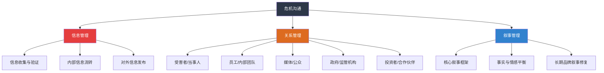
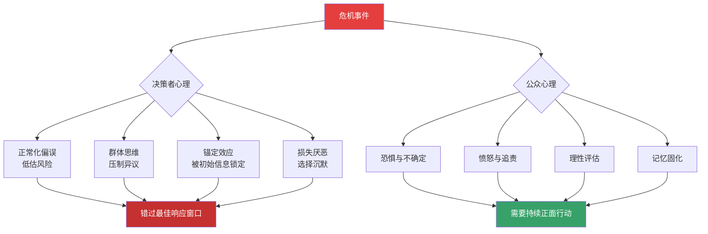

# 第十二章：危机沟通

## 章节概览

### 为什么危机沟通值得用一整章来讲解

2010年4月20日，英国石油公司（BP）"深水地平线"钻井平台发生爆炸，11名工人遇难，原油持续泄漏87天，总计约490万桶原油涌入墨西哥湾。BP时任CEO托尼·海沃德在灾难发生后第10天对媒体说："我想找回我的生活。"这句话被全球媒体反复引用，成为企业危机沟通失败的标志性案例。BP的股价在两个月内暴跌55%，市值蒸发超过1000亿美元，品牌声誉遭受的损失远超直接经济损失。

2017年9月，Equifax披露了一起影响1.47亿消费者的数据泄露事件。公司在发现漏洞后拖延了6周才公开，发布声明时使用的域名看起来像钓鱼网站（security2017equifax.com），修复工具又被发现会自动放弃用户的诉讼权利。这场本可以控制在较小范围内的危机，因为一系列沟通失误，演变成了美国历史上最大的数据泄露丑闻之一，直接经济损失超过14亿美元，CEO理查德·史密斯在国会听证会上被议员当面质问后被迫辞职。

2018年8月，滴滴顺风车发生第二起乘客遇害事件。公众的愤怒不仅针对犯罪行为本身，更指向滴滴在第一次事件后的虚假整改承诺和迟缓的危机回应。事件发生后，滴滴的声明中"未来平台上发生的所有刑事案件"的表述被认为是在推卸责任，创始人程维和总裁柳青的联名道歉信发布在微信公众号而非公开媒体平台，被批评为"小圈子表态"。这起事件直接导致顺风车业务无限期下线，滴滴被迫进行大规模组织架构调整。

2023年，中国某知名火锅品牌因后厨卫生问题被暗访曝光，视频在抖音播放量超过5亿次。品牌方在6小时内发布道歉声明并宣布关闭涉事门店、全国门店自查、邀请消费者监督三项措施，最终在两周内将品牌信任度恢复至事件前的80%。这个案例表明：危机发生后，速度、态度和具体行动措施缺一不可。

2021年，某大型教培企业因政策变动面临"双减"冲击。企业没有选择与政策对抗或含糊其辞，而是在政策发布当天即发布公开信，明确表态支持政策、公布业务转型方案、承诺妥善安置员工和学员，将一场可能的崩盘式危机转化为展现企业社会责任的机会。

这些案例有一个共同特征：**危机本身的破坏力是有限的，但危机沟通的失败会成倍放大损害**。反过来，出色的危机沟通不仅能控制损失，甚至能将危机转化为组织变革和品牌升级的契机。

1982年，强生公司遭遇"泰诺投毒事件"——有人在泰诺胶囊中注入氰化物，导致7人死亡。强生在3天内召回全美3100万瓶泰诺（价值约1亿美元），CEO詹姆斯·伯克亲自面对媒体，全程保持透明和坦诚。6个月后，泰诺重新夺回70%的市场份额。这一案例至今仍被危机沟通教科书列为经典正面案例。

**危机沟通不是公关部门的专属技能，而是每一位管理者、每一个组织都必须具备的核心能力。** 在社交媒体时代，一条推文、一段视频、一个截图都可能在数小时内引爆全网。根据麻省理工学院斯隆管理学院2023年的研究，危机信息在社交媒体上的传播速度是传统媒体时代的6倍，而留给危机响应者的有效响应时间从2010年的"黄金24小时"缩短到了2025年的"黄金4小时"。掌握危机沟通，已经从"加分项"变成了"生存技能"。

---

### 危机沟通的本质：不只是"说话的艺术"

很多人对危机沟通的理解停留在"怎么说"的层面——选择什么措辞、使用什么语气、通过什么渠道发布声明。这些当然重要，但危机沟通的本质远不止于此。

危机沟通是一个系统工程，它包含三个层次：

**第一层：信息管理。** 控制信息的收集、处理、验证和发布流程。在危机中，信息往往是碎片化、相互矛盾甚至相互冲突的。谁来收集信息？如何验证信息的真实性？何时发布、发布什么、不发布什么？这些决策构成了危机沟通的基础设施。信息管理的关键不是"发布正确信息"——因为在危机初期你几乎不可能拥有完整正确的信息——而是建立一个快速筛选、验证和更新信息的机制。2020年新冠疫情初期，世界卫生组织在信息不完整的情况下选择持续发布"基于当前已知信息"的声明，每份声明都明确标注"我们将根据最新证据持续更新"，这种透明的信息管理方式为全球公共卫生沟通树立了标杆。

**第二层：关系管理。** 危机涉及多方利益相关者——受害者、员工、客户、投资者、媒体、政府监管部门、公众、合作伙伴。每一方的关注点不同，诉求不同，对信息的理解方式也不同。危机沟通的核心挑战在于：用统一的核心信息框架，对不同的利益相关者群体进行有针对性的、有温度的沟通。以产品召回为例，消费者关心"这个产品安不安全，我该怎么办"，投资者关心"召回的成本和对营收的影响"，监管机构关心"企业是否依法履行了告知义务"，媒体关心"有没有更深层的系统性问题"。对同一事件，你需要用不同的语言、通过不同的渠道、在不同的时间节点，回应这些完全不同的关注点。

**第三层：叙事管理。** 每一场危机都会产生多个"故事版本"——受害者的版本、媒体的版本、竞争对手的版本、公众情绪构建的版本。组织的目标不是消灭其他版本（这既不可能也不明智），而是通过持续、一致、可信的沟通，让组织自己的版本成为主流叙事的一部分。叙事管理的核心工具是"核心叙事框架"（Core Narrative Framework），它包含三个要素：事实认定（发生了什么）、原因解释（为什么发生）、行动承诺（我们要怎么做）。一个好的核心叙事框架不是编故事，而是用事实构建一条可信的逻辑链。

这三个层次不是并列关系，而是递进关系。信息管理是地基，没有准确及时的信息，关系管理和叙事管理都是空中楼阁；关系管理是框架，不同利益相关者的诉求决定了你需要构建什么样的沟通结构；叙事管理是灵魂，它决定了危机之后，外界如何理解和记忆这场危机。

---

### 危机沟通与日常沟通的根本区别

| 维度 | 日常沟通 | 危机沟通 |
|------|----------|----------|
| **时间压力** | 有充分的准备和审批时间 | 需要在数小时甚至数分钟内做出响应 |
| **信息完整性** | 可以在掌握充分信息后再沟通 | 必须在信息不完整的情况下做出决策 |
| **容错空间** | 错误可以逐步修正 | 一句话的失误可能导致全面崩盘 |
| **关注度** | 受众有限，影响可控 | 被放在显微镜下审视，每个细节都被放大 |
| **情绪环境** | 理性讨论为主 | 恐惧、愤怒、焦虑等情绪主导判断 |
| **利益相关者** | 通常是单一或少数群体 | 多方利益群体同时施压，诉求相互冲突 |
| **沟通基调** | 灵活多变 | 必须统一口径，核心信息一致 |
| **评估标准** | 效率和满意度 | 信任度和声誉保全 |
| **法律风险** | 较低 | 极高——每句话都可能成为法律证据 |
| **历史影响** | 通常被遗忘 | 被永久记录，反复引用 |
| **决策层级** | 中层管理者可自主决定 | 通常需要最高层决策者直接介入 |
| **预案依赖** | 通常即兴处理 | 必须依赖预先制定的应急方案 |

这张对比表揭示了一个关键事实：**危机沟通不是"加强版"的日常沟通，而是一种完全不同的沟通模式。** 那些在日常沟通中表现优秀的人，在危机中未必能胜任。危机沟通需要专门的知识、训练和心理准备。

---

### 现代危机传播的生态特征

理解现代危机传播的生态特征，是有效进行危机沟通的前提。与十年前相比，今天的危机传播环境发生了根本性变化。

**传播速度的指数级增长。** 传统媒体时代，一个负面事件从发生到被报道通常需要24-72小时。在社交媒体时代，这个时间窗口缩短到了几分钟。2023年的一项研究表明，一条带有争议性标签的推文平均在发布后12分钟内被1000人看到，30分钟内被10000人看到。这意味着，危机响应者在"黄金4小时"之前，危机信息可能已经经历了数万次的二次传播。

**传播路径的去中心化。** 过去，危机信息主要通过主流媒体的编辑选择来传播——记者采写、编辑审核、然后发布。现在，任何一个在场的人用手机拍一段视频，就可以成为"第一信息源"。短视频平台（抖音、快手、YouTube Shorts）的算法推荐机制使得具有争议性的内容获得远超正常水平的曝光。2024年某知名餐饮品牌的后厨事件，最早由一名普通消费者拍摄的15秒短视频引爆，该视频在72小时内获得了超过2亿次播放。

**信息真伪的混杂。** 危机发生后，真实信息、半真半假的信息和完全虚假的信息会同时在社交媒体上传播。2020年新冠疫情期间，世卫组织将这种现象命名为"信息疫情"（Infodemic）。对于危机中的组织来说，不仅要应对危机本身，还要应对大量不实信息的干扰。而"辟谣"本身又会引发新的传播——心理学中的"逆火效应"（Backfire Effect）表明，简单的否定有时反而会强化错误信息在受众心中的印象。

**公众情绪的放大效应。** 社交媒体的点赞、转发和评论机制，天然倾向于放大极端情绪。研究表明，带有愤怒情绪的内容在社交媒体上的传播速度是中性内容的2.5倍。这意味着，在危机中，公众的情绪会比实际情况更加激烈，而这种激烈的情绪又会被算法进一步放大，形成"情绪—传播—情绪"的正反馈循环。

**去中心化的"意见领袖"生态。** 在传统媒体时代，媒体记者是信息传播的守门人。在社交媒体时代，KOL（关键意见领袖）和KOC（关键意见消费者）同样拥有强大的影响力。一场危机中，一个拥有百万粉丝的博主的一条微博，其影响力可能超过一家全国性媒体的头版报道。危机沟通策略必须考虑如何与这些新型意见领袖互动。

理解这些特征不是为了让你恐惧，而是为了让你对危机传播环境有清醒的认知。盲目套用十年前的危机沟通模板，可能不仅无效，还会适得其反。

---

### 危机沟通的心理学基础

危机沟通不仅仅是"说什么"和"怎么说"的问题，更是对人类心理机制的深刻理解和应对。在危机情境下，无论是组织的决策者还是公众，都会受到特定心理机制的影响。

**危机决策者的认知偏误。** 在高压环境下，人类的决策质量会显著下降。心理学研究发现，危机中决策者最常犯的认知偏误包括：

- **正常化偏误（Normalcy Bias）**：倾向于认为"不会那么严重"或"以前都没出过事"。这是危机初期最危险的认知偏误，它会导致组织错过最佳响应窗口。许多危机从"可控"升级为"失控"，根源在于决策者的正常化偏误延误了行动。
- **群体思维（Groupthink）**：当危机团队内部高度一致时，成员倾向于压制异议、追求共识，导致决策质量下降。2003年哥伦比亚号航天飞机返回地球前，NASA内部已有工程师质疑隔热板受损可能造成灾难，但在群体压力下未能有效传达。
- **锚定效应（Anchoring Effect）**：过度依赖最初获得的信息来做出判断。危机初期信息不完整，如果被错误的初始信息"锚定"，后续的判断会持续偏离真相。
- **损失厌恶（Loss Aversion）**：对损失的恐惧是同等收益快乐的2倍。在危机中，这会导致决策者过度保守，选择"什么都不说"来规避风险——但沉默本身就是最糟糕的危机沟通策略之一。

**公众的心理反应模式。** 公众在面对危机信息时，会经历一系列可预测的心理反应：

- **恐惧阶段**：最先产生的是恐惧和不确定感。此时公众最需要的是清晰、确定的信息，哪怕这些信息是"我们正在调查中"。
- **愤怒阶段**：恐惧之后通常会转向愤怒，需要找到"责任人"。如果组织不主动承担责任，公众会自己找到责任人——通常是组织的最高领导者。
- **评估阶段**：公众开始理性评估事件的影响范围和持续时间。此时需要提供具体的事实和数据。
- **记忆固化阶段**：公众对危机的记忆逐渐定型。如果组织在前三个阶段的沟通做得好，记忆会偏向正面；反之，负面记忆将长期存在。

**情感优先原则。** 神经科学研究表明，人在接收信息时，情感处理比理性处理快约20倍。这意味着，在危机沟通中，**人们先感受到你是真诚还是敷衍，然后才理解你说了什么**。一个语气诚恳但内容简单的声明，往往比一个内容详尽但语气生硬的声明更有效。这不是说内容不重要，而是说如果情感通道不通畅，再好的内容也无法被接收。

理解这些心理机制的实际意义在于：你可以提前预判决策团队可能出现的认知偏误，主动设计制衡机制（如设置"魔鬼代言人"角色）；同时，你可以根据公众心理反应的时间线，在不同阶段提供针对性的信息和沟通策略。

---

### 组织的危机沟通能力建设

危机沟通不仅是危机发生时的应急反应，更是组织日常能力建设的一部分。一个组织的危机沟通水平，本质上取决于它平时做了多少准备。

**危机沟通的组织架构。** 高效的危机沟通需要明确的组织架构支撑：

| 角色 | 职责 | 人员要求 |
|------|------|----------|
| **危机决策者** | 最终拍板决策，确定战略方向 | 最高管理者或其直接授权人 |
| **发言人** | 对外统一发声，是组织的"唯一声音" | 受过媒体训练，表达清晰，有权威感 |
| **信息协调员** | 收集、验证、汇总各方信息 | 信息敏感度高，跨部门沟通能力强 |
| **媒体关系官** | 对接媒体，安排采访，监控舆情 | 媒体经验丰富，关系网络广 |
| **法务顾问** | 评估法律风险，审核声明措辞 | 熟悉行业法规和诉讼风险 |
| **内部沟通主管** | 对内通报情况，安抚员工情绪 | 了解组织文化，信任度高 |
| **社交媒体运营** | 监控网络舆情，执行线上回应 | 熟悉各平台规则，反应迅速 |

这个架构不需要每个角色都是独立的人——小型组织中一人可能兼任多个角色——但每个角色的职责必须被明确指定。危机发生后再来讨论"谁负责什么"，为时已晚。

**危机预案体系。** 一个成熟的危机沟通预案应包含以下核心要素：

1. **风险地图**：按"发生概率"和"影响程度"两个维度，识别组织可能面临的所有危机类型，绘制风险矩阵。优先为"高概率+高影响"的危机类型制定详细的沟通预案。
2. **响应流程图**：从危机信号识别到信息发布的完整流程，明确每个环节的时间节点、责任人员和交付物。
3. **话术模板库**：针对不同类型的危机，预先准备好第一份声明的模板。危机发生时只需填入具体事实即可发布，大大缩短响应时间。
4. **利益相关者通讯录**：包含所有关键利益相关者（媒体、监管机构、核心客户、投资者等）的联系人信息和偏好沟通渠道。
5. **模拟演练计划**：至少每半年进行一次完整的危机模拟演练，检验预案的有效性并持续优化。

**危机文化。** 比预案更重要的是组织的危机文化——一种将危机意识内化为日常行为模式的组织氛围。具有强危机文化的组织有三个共同特征：鼓励"吹哨人"（任何员工发现问题都有渠道和勇气上报）、不惩罚"假警报"（误报不是错误，漏报才是错误）、常态化复盘（每次小事件都被当作危机的彩排来认真分析）。

---

### 本章内容全景

本章共包含六个部分，按照"道→法→术→器→练→悟"的逻辑层层递进：

**第一节：理论基础——"道"**

理论不是装饰品，而是你面对未知危机时的决策框架。当你不知道该怎么做的时候，理论会告诉你方向。本节将系统介绍危机沟通的理论框架。

首先是**危机的定义与类型划分**。危机不是简单的"坏事发生了"——从沟通学角度，危机被定义为"对组织的声誉、运营或财务状况构成重大威胁，需要在时间压力下做出关键决策的非常规事件"。危机类型按不同维度可以划分为：人为危机与自然危机（决定责任归属的叙事策略）、突发危机与渐进危机（决定响应时间窗口）、内部危机与外部危机（决定信息控制的难度）、单一危机与连锁危机（决定沟通的复杂程度）。每种类型的危机需要不同的沟通策略，准确识别危机类型是制定策略的第一步。

其次是**危机发展的四阶段模型**。危机不是瞬间爆发又瞬间结束的，它有明确的生命周期：潜伏期（危机信号出现但尚未被公众关注——这是最佳的预防和准备窗口）、爆发期（危机进入公众视野，关注度急剧攀升——这是响应速度的生死线）、蔓延期（危机信息广泛传播，衍生话题不断出现——这是信息管理的核心战场）、恢复期（危机热度下降，进入善后和修复阶段——这是重建信任的长期工程）。每个阶段的沟通重点、信息策略和利益相关者管理方法截然不同。

然后是**危机沟通的五大核心原则**：速度第一（在公众形成固定认知之前抢占叙事权）、真诚透明（承认问题比掩饰问题更能赢得信任）、承担责任（在事实清楚之前，先表达对受影响者的关切，而非急于推卸责任）、统一口径（一个组织只能有一个声音，多个版本的解释等于没有解释）、情感共鸣（先回应情绪，再处理事实）。这五大原则不是互相独立的，而是构成一个有机整体——速度快但不真诚的回应会适得其反，真诚但口径不统一会让公众困惑。

最后是**四个经典理论模型**的深度讲解：形象修复理论（Benoit, 1997）提出了五种修辞策略——否认、逃避责任、降低负面形象、纠正行为、表达歉意；情境危机沟通理论（Coombs, 2007）根据危机类型和组织责任程度，给出了匹配不同情境的沟通策略矩阵；卓越公关理论（Grunig & Hunt, 1984）从组织-公众关系的视角，强调双向对等沟通在危机中的核心价值；辩护理论（Ware & Linkugel, 1973）分析了组织在面对指控时的四种辩护策略——否认、强化、区分、超化。每个理论模型都配有详细的案例分析和应用场景说明。

**第二节：核心技巧——"法"**

本节聚焦危机沟通中的五大实操能力域，每个能力域都配有具体的操作步骤、话术模板和检查清单。

**能力域一：危机预警系统的建立。** 大多数危机在爆发前都有信号——员工投诉、客户差评、供应链异常、监管约谈、竞争对手动向。建立一个系统化的预警机制，能够在危机尚未爆发时识别信号、评估风险、制定预案。本节将详细介绍预警信号的识别清单、风险评估的量化方法（概率×影响×紧迫度评分模型）和分级响应预案的制定流程。

**能力域二：危机爆发时的快速响应。** 黄金时间窗口内的响应是整个危机沟通的成败关键。本节将详细拆解"第一个60分钟"的行动清单——从接到危机信号到发布第一份公开声明的完整流程。包括：危机团队的召集机制、信息快速核实的三步法、第一份声明的"三要素"结构（已知事实+组织态度+下一步行动）、内部通报与外部发布的同步策略。

**能力域三：信息发布的规范流程。** 口径制定的"漏斗模型"（从事实到结论的逻辑推导）、发布渠道的选择策略（不同渠道的覆盖范围、时效性和公信力对比）、发布节奏的把控艺术（"何时说""说多少""说什么"的决策框架）。本节提供完整的口径制定工作表和发布渠道评估矩阵。

**能力域四：媒体沟通的专业技巧。** 新闻发布会的组织流程（从场地选择到Q&A准备的完整清单）、记者采访的应对策略（"桥接法""旗帜法""钩子法"三种核心话术技巧）、社交媒体的实时管理（评论区舆情监控与回应的分级标准）。本节包含10个模拟采访场景的应答示例和逐字稿。

**能力域五：危机后的形象修复策略。** 信任修复的"四步模型"（承认→解释→补偿→证明）、长期声誉管理的系统方法、如何将危机转化为品牌故事的一部分。本节将详细分析5个成功修复品牌形象的案例，提炼可复制的策略。

**第三节：实战案例——"术"**

通过八个典型危机场景的深度剖析，展示理论与技巧的真实应用。这八个场景覆盖了企业最常面对的危机类型：企业经营危机（食品安全事件）、产品召回（汽车安全缺陷）、高管丑闻（CEO不当言论）、网络舆情（数据使用争议）、自然灾害（台风灾后应急）、安全事故（化工企业爆炸）、数据泄露（金融机构客户信息泄露）、公关危机（品牌代言人失德）。

每个案例都包含完整的危机时间线、沟通过程还原、关键决策点分析、效果量化评估以及可复制的经验教训。特别值得注意的是，每个案例都会用第一节介绍的理论模型进行分析——形象修复理论如何应用？SCCT策略矩阵建议了什么？这种理论与实践的对照学习方式，能帮助你建立"遇到问题→调用理论→制定策略"的思维习惯。

第九部分是综合启示，从八个案例中提炼共性规律，包括：快速响应的最佳实践阈值（在多少小时内发布第一份声明的效果最好）、不同危机类型的有效沟通策略对比表、以及"危机沟通成熟度模型"的五个层级描述。

**第四节：常见误区——"破"**

揭示危机沟通中最常犯的十个错误。每个误区都配有反面案例和纠正方案：

1. **鸵鸟心态**——回避不等于安全，沉默不等于谨慎。当危机已经进入公众视野时，组织的沉默不会被解读为"正在调查"，而会被解读为"心中有鬼"。
2. **过度辩解**——辩护变狡辩，解释变借口。当组织花费大量篇幅解释"为什么不是我们的错"时，公众听到的是"他们不想负责任"。
3. **信息不一致**——多方说法矛盾，自相矛盾。CEO说一套、公关说一套、法务说一套，公众该信谁？
4. **忽视社交媒体**——控制传统媒体却放任网络传播。2025年还在只开新闻发布会而不回应社交媒体舆情，等于关上大门开着窗户。
5. **缺乏同理心**——技术正确但情感错误。"根据保险条款，您的损失不在理赔范围内"可能是对的，但在危机中的情感效果是灾难性的。
6. **推卸责任**——甩锅比犯错更致命。公众可以原谅犯错，但不会原谅推卸。
7. **反应过度**——过度道歉反而暴露更多问题。为一件小事进行全面道歉和整改，反而会让公众怀疑"是不是还有更大的问题"。
8. **忽视内部沟通**——员工从外部新闻得知自家危机。员工是组织最重要的"大使"，如果他们感到被蒙在鼓里，就不可能成为组织的盟友。
9. **急于恢复正常**——危机尚未解决就宣布胜利。过早宣布"问题已解决"是危机沟通中最容易导致二次崩盘的错误。
10. **忽视长期修复**——热度过去就以为危机结束。危机的记忆是长尾的，一个"危机企业"的标签可能需要数年的持续努力才能消除。

**第五节：练习方法——"练"**

危机沟通能力不能只靠读书获得，必须通过反复训练形成肌肉记忆。本节提供系统化的训练方案：

**每日练习（15-20分钟）**：危机案例日志——每天记录一个你在新闻中看到的危机事件，用本章的理论框架分析；情景模拟速练——在脑海中快速演练"如果我是这个企业的发言人，我会怎么说"；新闻分析——阅读主流媒体对危机事件的报道，分析报道的倾向性和信息来源；话术积累——收集优秀的危机沟通话术，分类整理到个人话术库。

**每周练习（1-2小时）**：模拟危机演练——与同事或朋友组队，模拟一个完整的危机场景进行角色扮演；媒体采访角色扮演——一人扮演记者，一人扮演发言人，练习在压力下回答尖锐问题；危机方案撰写——选择一个假想的危机场景，撰写完整的危机沟通方案；复盘分析——选择一个已完成的危机事件，撰写2000字的复盘分析报告。

**进阶训练方法**：跨文化危机沟通——同一个危机在不同文化背景下的沟通策略差异分析；数字时代危机管理——AI生成内容（deepfake）对危机沟通的影响、舆情监控工具的使用；AI辅助危机决策——如何利用大语言模型快速生成声明初稿、进行舆情分析。

**能力评估标准**分为五个层级：L1反应者（能在指导下完成基本危机响应）、L2执行者（能独立处理常规危机场景）、L3策略者（能制定复杂的危机沟通策略并协调多方利益相关者）、L4专家（能处理跨文化、跨领域的高度复杂危机）、L5导师（能设计组织级的危机沟通体系并指导他人）。

**第六节：本章小结——"悟"**

回顾全章核心要点，梳理危机沟通的关键知识框架，提供从知识到能力的转化路径，帮助读者制定个人提升计划和组织层面的危机沟通能力建设方案。本节的核心输出是"我的危机沟通能力发展计划"——一个基于自测结果、学习收获和个人目标的个性化行动方案。

---

### 学习目标

完成本章学习后，你将具备以下五个维度的能力：

1. **理论判断力** —— 理解危机沟通的理论基础，能够识别危机的类型、判断危机所处的阶段、选择适用的理论模型。面对任何危机场景，你能快速判断："这是一个什么类型的危机？它处在哪个阶段？应该用什么理论框架来指导决策？"你不再需要凭直觉或经验做决策，而是有成熟的理论工具支撑你的每一个判断。

2. **实战响应力** —— 掌握危机沟通的核心技巧，能够在危机情境下快速建立响应团队、制定沟通策略、发布权威信息、管理媒体关系。你将拥有一套可操作的流程和工具，而不只是抽象的原则。更重要的是，你知道每个步骤背后的"为什么"——这让你能够在预案之外的全新场景中灵活变通。

3. **案例分析力** —— 能够从真实危机事件中提炼可复制的策略和方法。读到任何一个危机案例，你不再只是旁观者，而是能从专业角度分析：他们做对了什么？做错了什么？如果是你，你会怎么做？这种分析能力会随着你的案例积累不断增强，最终成为一种直觉式的专业判断力。

4. **风险识别力** —— 能够识别危机沟通中的常见陷阱和误区，提高专业判断力。当团队提出一个看似合理的危机应对方案时，你能快速发现其中的风险点——"这个声明发布后，媒体最可能从哪个角度解读？""这句话在社交媒体上传播时可能被怎样截取和歪曲？"

5. **持续进化力** —— 建立系统化的训练体系，能够通过持续练习不断强化危机沟通能力。你将知道如何评估自己的水平、如何设定提升目标、如何找到练习机会。危机沟通能力的成长是终身的——你永远不能说"我已经完全掌握了"，但你可以确保自己一直在进步。

---

### 适用读者

本章内容面向所有需要在压力情境下进行沟通的专业人士：

- **企业高管和创始人** —— 你是危机中的最终决策者，你的每一句话都代表组织的立场。你需要理解危机沟通的底层逻辑，而不只是依赖公关团队。当公关团队建议"保持沉默"时，你需要有能力判断这是明智的策略还是鸵鸟心态。
- **公关和传播从业者** —— 这是你的核心专业领域，本章提供系统的理论框架和实操工具，帮你从"救火队员"升级为"危机管理专家"。你将学会如何从被动响应转变为主动预防，从战术执行升级为战略规划。
- **品牌和市场人员** —— 品牌建设需要数年，品牌崩塌可能只需要一天。你需要了解如何在危机中保护品牌资产，以及如何将危机转化为品牌叙事的有机组成部分。
- **政府和公共机构工作人员** —— 公共危机的沟通直接影响社会稳定和公众信任。政府危机沟通有其特殊性——公众对政府的信任基础不同于企业，信息发布的流程和约束也不同，但核心原则是共通的。
- **非营利组织管理者** —— 组织声誉是你的核心资产，一次危机可能摧毁多年的公益积累。非营利组织的危机往往涉及道德和价值观层面，沟通难度更大。
- **任何希望提升沟通能力的人** —— 危机沟通中锻炼的能力——压力下的清晰表达、情绪管理、多利益方协调——在日常沟通中同样极具价值。即使你从未遇到过真正的危机，本章的学习也会显著提升你的整体沟通水平。

无论你是危机沟通的新手还是有经验的从业者，本章都能提供你需要的知识。新手可以从理论基础开始建立完整框架，有经验的从业者可以直接进入实战案例和常见误区部分进行查漏补缺。

---

### 学习路径建议

本章设计了三条学习路径，你可以根据自身情况选择：

**路径一：系统学习（推荐新手，约需 8-10 小时）**

按照"理论→技巧→案例→误区→练习→小结"的顺序完整学习。先建立理论框架（第一节，约2小时），再学习具体技巧（第二节，约2小时），通过案例加深理解（第三节，约2小时），认识常见误区以避免犯错（第四节，约1小时），通过练习将知识转化为能力（第五节，约1.5小时），最后回顾总结巩固所学（第六节，约0.5小时）。建议分3-4次学习，每次2-3小时，中间留出消化吸收的时间。

**路径二：重点突破（推荐有经验者，约需 4-5 小时）**

从实战案例（第三节）入手，在案例分析中发现自己的知识盲区，然后有针对性地回溯理论基础（第一节）和核心技巧（第二节），最后通过常见误区（第四节）检查自身是否有类似问题。这条路径的核心理念是"以问题为导向"——不是学完理论再找应用场景，而是先看应用场景再补理论。

**路径三：紧急应用（推荐正在面对危机的读者，约需 1-2 小时）**

如果你正在面对一场真实的危机，请按以下顺序快速阅读：先读本概览中的"现代危机传播的生态特征"（了解当前环境），然后直接跳到第二节的"能力域二：危机爆发时的快速响应"（掌握第一个60分钟的行动清单），再快速浏览第四节的"常见误区"（避免犯低级错误），最后从第三节中找一个最类似的案例作为参考。危机解除后，再回头系统学习。

无论选择哪条路径，都建议做到以下三点：

1. **结合自身经历反思。** 学习每个知识点时，回忆自己经历或目睹过的危机事件，对照所学内容进行复盘。没有危机经历的，可以从新闻事件入手。反思不是简单地想"当时应该怎么做"，而是用本章的理论框架重新分析当时的情境、决策和结果。
2. **做好笔记和标记。** 将对自己最有启发的内容标记出来，将可以立即应用的技巧记录下来。建议建立一个"危机沟通知识库"的个人文档，分类整理理论模型、操作清单、话术模板和案例分析。
3. **完成练习。** 只看不练等于没学。第五节的练习方法不是"可选"的，而是从知识到能力转化的关键环节。理论给你方向，练习给你本能。在真正的危机中，你没有时间翻书查理论——你需要的是条件反射式的正确反应。

---

### 预备知识与能力自测

在开始学习之前，花3分钟完成下面的自测，了解你当前的危机沟通能力水平。对以下10个陈述，给自己打分（1=完全不符合，5=完全符合）：

| 序号 | 陈述 | 评分 |
|------|------|------|
| 1 | 我能清晰区分危机沟通与日常沟通的本质区别 | _/5 |
| 2 | 我了解危机发展的不同阶段，以及每个阶段的沟通重点 | _/5 |
| 3 | 我知道在危机爆发后的"黄金时间"内应该优先做什么 | _/5 |
| 4 | 我能为不同类型的危机制定相应的沟通策略 | _/5 |
| 5 | 我了解如何管理危机中的多方利益相关者 | _/5 |
| 6 | 我知道如何准备和组织一场危机新闻发布会 | _/5 |
| 7 | 我能识别社交媒体时代的危机传播规律 | _/5 |
| 8 | 我了解危机沟通中常见的法律风险和注意事项 | _/5 |
| 9 | 我有处理真实危机事件的实际经验 | _/5 |
| 10 | 我的团队/组织有完善的危机沟通预案 | _/5 |

**评分解读：**

- **10-20 分：入门阶段。** 建议按路径一系统学习，重点关注理论基础和核心技巧。不必焦虑——大多数人未经系统训练都在这个区间。重要的是从今天开始建立正确的知识框架。
- **21-35 分：进阶阶段。** 你有一定基础，但存在知识盲区。建议按路径二重点突破，特别关注实战案例和常见误区。建议在学习过程中找到自己评分最低的2-3个维度，作为重点攻克方向。
- **36-50 分：高手阶段。** 你已经具备较强的危机沟通能力，可以直接进入深度拓展部分，关注高级话题如跨文化危机沟通、AI时代危机管理等。建议将学习重心放在建立系统化的组织危机沟通体系上，从个人能力升级为组织能力。

这个自测不是考试，而是帮你定位学习起点的工具。请诚实作答——在危机中，自我欺骗是最危险的。

---

危机沟通能力的培养不是一朝一夕的事。它需要知识的积累、技能的训练、经验的沉淀，以及——最重要的——面对压力时保持冷静和清醒的意志力。但好消息是：危机沟通是一门可以通过学习和练习显著提升的技能。那些在危机中表现卓越的人，并不是天生就擅长，而是通过系统的学习和刻意的训练，将正确的反应变成了本能。

让我们开始。
