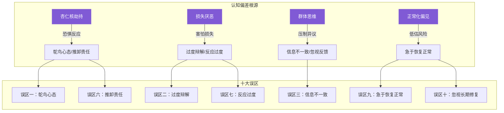
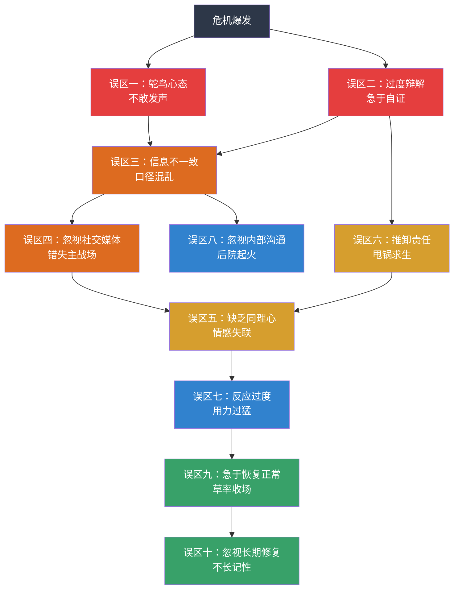
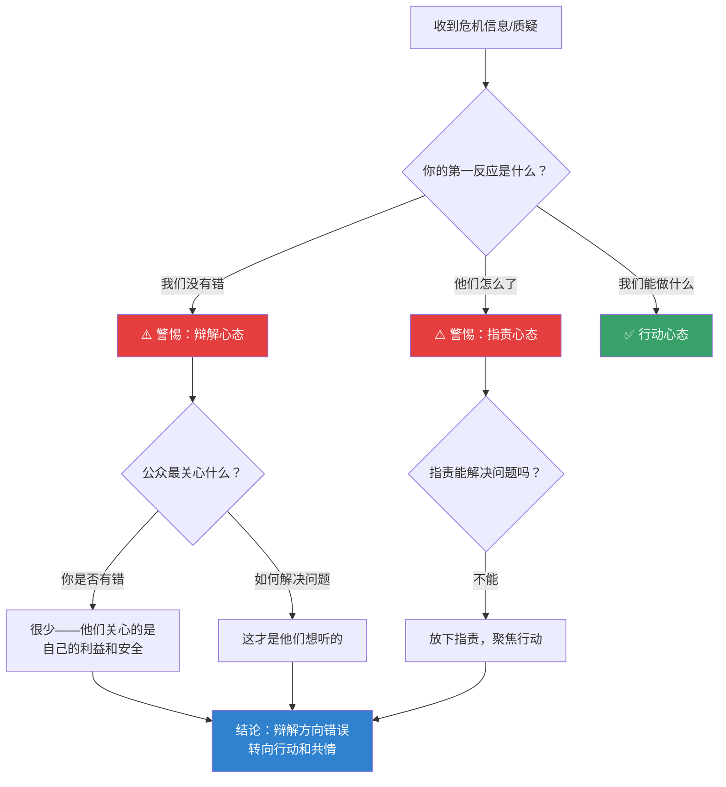
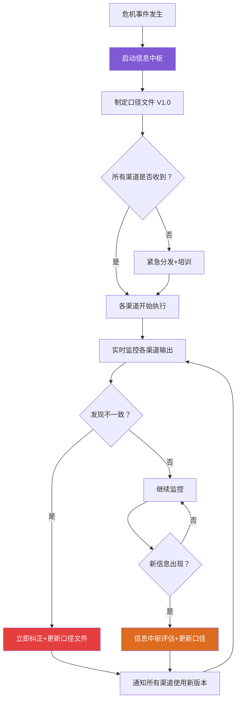
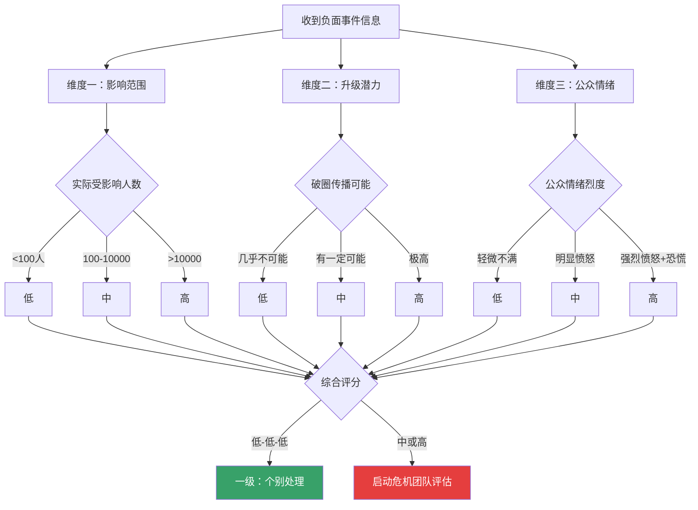
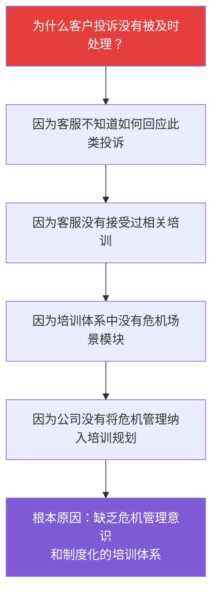
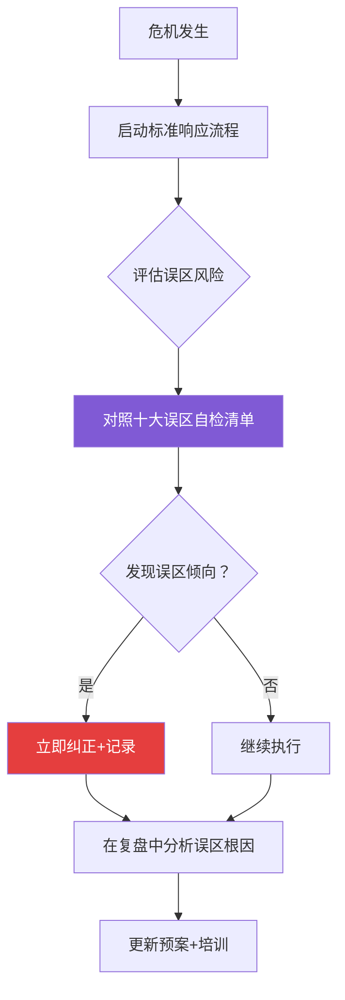

# 第四节：危机沟通的常见误区——"破"

危机沟通是一门在高压环境下做出正确决策的艺术。理论可以教你"应该怎么做"，案例可以展示"别人怎么做的"，但还有一个同样重要的学习维度：**知道哪些路走不通，哪些看似合理的做法实际上是陷阱**。

本节系统梳理危机沟通中最常犯的十大误区。每一个误区都不是凭空想象的——它们来自对数百起真实危机事件的复盘分析，来自无数管理者和公关从业者在压力下犯过的错误。认识这些误区，不是为了事后诸葛亮，而是为了在你面对危机时，大脑能自动发出警报："等等，这个做法有问题。"

## 误区的底层逻辑：为什么聪明人总在犯同样的错

在逐一展开十大误区之前，有必要先理解一个核心问题：**为什么受过良好教育、经验丰富的管理者，会在危机中反复犯这些看似明显的错误？**

答案在于人类在高压环境下的认知偏差。行为经济学和神经科学研究揭示了几个关键机制：

**1. 杏仁核劫持（Amygdala Hijack）**

心理学家丹尼尔·戈尔曼在《情商》中提出：当人面临威胁时，大脑的杏仁核（负责情绪反应）会绕过前额叶皮层（负责理性思考）直接做出反应。危机中的管理者并非"不想"理性思考，而是在生理上被恐惧和焦虑压制了理性能力。这就是为什么平时冷静的CEO在危机中会做出明显不理性的决策——比如选择沉默（鸵鸟心态）或急于甩锅（推卸责任）。

**2. 损失厌恶（Loss Aversion）**

诺贝尔经济学奖得主丹尼尔·卡尼曼的研究表明，人类对损失的敏感度是收益的2-2.5倍。在危机中，管理者过度关注"可能失去什么"（声誉、客户、股价），导致两种极端反应：要么过度防御（过度辩解），要么过度回避（鸵鸟心态）。两种反应的根源都是同一种心理——害怕损失。

**3. 群体思维（Groupthink）**

社会心理学家欧文·贾尼斯的研究发现，高度凝聚的团队在压力下容易陷入"群体思维"——追求一致而压制异议。在危机管理团队中，这意味着可能没有人敢说"我们的策略是错的"，导致错误决策得不到纠正。误区三（信息不一致）和误区七（反应过度）往往是群体思维的直接产物。

**4. 正常化偏见（Normalcy Bias）**

人类有一种倾向：低估灾难的可能性和严重程度，倾向于认为"事情不会那么糟"。这是误区一（鸵鸟心态）的心理根源。管理者不是不知道危机的存在，而是在潜意识中拒绝接受"事情真的这么严重"的现实。

理解了这些底层机制，我们就能明白：避免误区不仅需要"知道不该做什么"，还需要建立制度化的决策机制来对抗人的本能反应。



---

## 误区全景图：十大陷阱的内在逻辑

在逐一展开之前，先通过一张图理解这十个误区之间的关系。它们不是孤立存在的，而是往往连锁触发：



这十个误区可以按危机发展的时间线分为四组：

| 阶段 | 对应误区 | 核心问题 | 典型触发场景 |
|------|----------|----------|-------------|
| **爆发初期**（0-4小时） | 误区一、误区二 | 不知道该不该说、怎么说 | 第一反应决策、首次声明 |
| **扩散期**（4-48小时） | 误区三、误区四、误区五 | 说了但说得不对 | 多渠道发声、公众互动 |
| **应对期**（1-7天） | 误区六、误区七、误区八 | 做了但做得不好 | 责任认定、资源分配、内部管理 |
| **恢复期**（7天以后） | 误区九、误区十 | 结束得太早、学得太少 | 收尾决策、制度改进 |

理解这个时间框架后，我们逐一深入每个误区。

---

## 误区一：鸵鸟心态——等待危机自行消退

### 表现形式

许多组织在危机爆发后的第一反应是"等等看"，希望危机能够自行消退或被其他新闻热点覆盖。他们选择沉默、回避媒体采访、不发布任何声明，期待时间会冲淡一切。

这种反应的心理根源在于恐惧——害怕说错话让事情变得更糟，害怕在信息不完整的情况下表态会被抓住把柄，害怕面对公众的审视。在这些恐惧的驱使下，"不说话"成了最"安全"的选择。

鸵鸟心态还有更隐蔽的表现形式：

- **技术性拖延：** "法务团队还在评估"、"我们正在开会讨论"——用程序性语言掩饰决策瘫痪
- **转移注意力：** 在危机期间照常发布品牌营销内容，试图用正面信息"覆盖"负面信息
- **选择性失聪：** 只关注传统媒体，假装社交媒体上的讨论"不算数"
- **等待替罪羊：** 拖延发声的时间，等找到可以推卸责任的对象后再回应

### 为什么这是误区

在信息高速流通的时代，危机不会因为组织的沉默而消退。相反，沉默会被解读为"默认"、"心虚"或"漠视"，导致公众的负面猜测和情绪进一步升级。在社交媒体时代，信息真空会被谣言和不实信息迅速填满，一旦这些信息占据舆论主导地位，组织再想澄清就需要付出数倍的努力。

从传播学的角度看，危机爆发后的前1-4小时是**"叙事定型期"**——在这段时间内，公众对事件的初始认知框架基本形成。如果组织在这个窗口期内保持沉默，那么公众的叙事框架将完全由其他声音（受害者、媒体、围观者、竞争对手）来定义。一旦这种框架固化，组织再想扭转认知就需要花费巨大的成本。

这里涉及传播学中的**"首因效应"（Primacy Effect）**——人们对最先接收到的信息印象最深、最难改变。危机爆发后的第一波信息传播，往往决定了公众对整件事的基本判断框架。沉默等于把定义事件性质的权力拱手让出。

**数据支撑：** 国际危机管理协会（ICM）的研究数据显示：在危机爆发后1小时内做出回应的组织，最终声誉损失比沉默超过4小时的组织平均低60%。麻省理工学院媒体实验室2023年的一项研究进一步表明，社交媒体上关于品牌的负面信息，从首次发布到被广泛转发的中位时间仅为47分钟。这意味着，你有不到一个小时的时间来定义事件的叙事框架。

### 典型反面案例

**案例一：某知名食品品牌质量事件。** 该品牌在被媒体曝出产品质量问题后，连续三天未做任何回应。三天期间，社交媒体上关于该品牌的负面讨论呈指数级增长，各种未经证实的"内幕消息"（添加剂超标、生产线卫生问题、管理层知情不报等）广泛传播。当品牌最终发布声明时，舆论已经被负面信息完全主导，品牌的澄清声明被淹没在海量的质疑声中。最终该品牌花费了近一年时间才恢复到危机前的销售水平。

**案例二：某互联网平台数据事件。** 该平台被曝涉嫌过度收集用户数据后，选择连续48小时不发声，理由是"等待法务团队完成评估"。但在这48小时内，"XX平台偷看你的聊天记录"这类夸张说法在社交媒体上获得了上亿次浏览。当平台终于发布技术说明时，已经没有人愿意听技术解释了。

### 正面参照：快速响应的成功案例

**案例：强生泰诺投毒事件（1982年）。** 当芝加哥地区有人在泰诺胶囊中注入氰化物导致7人死亡后，强生公司在事件发生后的第一天就做出了以下决策：立即在全国范围内召回所有泰诺产品（3100万瓶，价值超过1亿美元）；CEO詹姆斯·伯克亲自出现在全国电视上，坦诚告知公众已知事实；设立24小时消费者热线；暂停所有泰诺广告。这些决策在当时被认为是"过度反应"，但结果证明，强生的快速、透明、以消费者安全为先的回应，成为危机管理史上最经典的正面案例。泰诺的市场份额在危机后一年内完全恢复，强生的品牌声誉不降反升。

这个案例说明的关键点是：**快速响应不等于匆忙回应，而是在第一时间展现出"我们在乎、我们在行动"的态度。**

### 正确做法

**黄金时间窗口行动指南：**

1. **0-30分钟：** 确认危机事实，启动危机响应团队，开始监测舆论动态
2. **30-60分钟：** 发布"初步知晓声明"——即使只有三句话也行：
   - "我们已经注意到[事件]的相关报道"
   - "我们正在紧急核实情况"
   - "我们将在[具体时间]发布进一步信息"
3. **1-4小时：** 发布第一版正式回应，包含已核实的事实、组织的态度和初步应对措施
4. **4-24小时：** 根据信息更新情况，持续发布补充声明

**"先表态、后补充"的关键原则：** 你不需要等到掌握所有信息才发声。公众需要的不是一份完整的调查报告，而是一个明确的信号——"这家组织在乎，正在行动"。

**快速响应的工具支持：**

| 工具类型 | 具体工具 | 用途 |
|----------|---------|------|
| 舆情监测 | 新榜、清博、鹰眼速读 | 实时监测各平台舆情动态 |
| 内部通知 | 企业微信/钉钉紧急群组 | 快速启动危机响应团队 |
| 声明模板 | 预设的危机声明模板库 | 缩短声明撰写时间 |
| 审批流程 | 移动端审批系统 | 加速声明审批流程 |
| 多平台发布 | 社交媒体管理工具 | 同步发布到多个平台 |

### 自检清单

- [ ] 你的组织是否有关于危机响应时间的明确规定？（如"危机爆发后30分钟内必须发出初步声明"）
- [ ] 危机响应团队的联系方式是否24小时畅通？
- [ ] 是否有预设的"初步知晓声明"模板，可以在几分钟内填空发布？
- [ ] 舆情监测系统是否覆盖了所有主流社交媒体平台？
- [ ] 声明的审批流程是否能在1小时内完成？

---

## 误区二：过度辩解——将精力用在"证明自己没错"上

### 表现形式

一些组织在危机中将过多的精力放在辩解和推卸责任上，反复强调"我们没有错"、"这不是我们的责任"、"是竞争对手在恶意攻击"等。他们试图通过论证自身的清白来化解危机。

这种做法的深层原因是：组织的核心团队（尤其是法务部门）习惯性地从"法律责任"角度思考问题，而忽略了危机沟通的本质是"信任管理"而非"责任认定"。

过度辩解有几种常见的变体：

- **数据轰炸型：** 用大量技术数据、检测报告、合规证明来"自证清白"，但公众看不懂也不在乎这些数据
- **法律声明型：** 用法律术语（"不可抗力"、"免责条款"、"保留追究权利"）来构建防御，但在公众眼中这等于"不想负责"
- **比烂型：** "行业内其他企业也有类似问题"——试图通过将问题普遍化来淡化自身责任
- **阴谋论型：** "这是竞争对手的恶意攻击"——试图将公众注意力从问题本身转移到外部威胁上

### 为什么这是误区

在危机情境下，公众最关心的不是组织是否有错，而是他们的利益和安全是否得到了保障。过度辩解会让公众觉得组织在逃避问题、缺乏担当。特别是当危机确实给公众造成了损失或伤害时，辩解不仅无助于化解危机，反而会加剧公众的愤怒。

从心理学角度看，这涉及**"共情鸿沟"（Empathy Gap）**的概念：当一个人处于痛苦或焦虑中时，他们需要的不是被告知"你的痛苦不是我的错"，而是被理解、被看见。组织的辩解在法律上可能无懈可击，但在情感上却造成了巨大的伤害。

更危险的是，过度辩解会引发**"斯特赖桑效应"（Streisand Effect）**——越是试图压制或否认某个信息，公众就越是关注和相信这个信息。当组织反复强调"我们没有问题"时，公众的第一反应往往是："如果没有问题，你为什么要反复强调？"

这里还涉及一个沟通心理学的基本原理：**在信任缺失的环境中，防御性沟通会被自动解读为"有所隐瞒"。** 加州大学洛杉矶分校的社会心理学研究发现，当人们对信息来源的信任度较低时，防御性语言会触发更强的怀疑反应，而非减轻疑虑。换句话说，在危机中，辩解不仅无效，而且适得其反。

### 辩解心态的决策树：帮你识别何时在"过度辩解"



### 典型反面案例

**案例一：某航空公司大面积延误事件。** 该航空公司在航班大面积延误事件中，反复强调延误是由"天气原因"导致的，属于"不可抗力"。虽然这在法律上可能是正确的，但被困在机场数小时的旅客对此毫不买账。他们更关心的是航空公司能否提供餐食、住宿和改签服务，而不是延误的技术原因。航空公司的辩解被旅客拍摄并上传社交媒体，标题是"航空公司说天气不好，但我们抬头看是大晴天"——虽然不同空域的天气确实不同，但公众已经不在乎技术细节了。

**案例二：某房地产开发商质量问题事件。** 业主投诉房屋存在严重的渗水和墙体裂缝问题，开发商的回应是引用建筑质量标准和验收报告，证明房屋"符合国家标准"。但业主关心的是自己花了毕生积蓄买的房子为什么漏水，而不是某条标准线的具体数值。开发商的"合规辩解"不仅没有平息事态，反而成为业主维权运动的口号——"合规的豆腐渣"。

### 正面参照：共情优先的成功案例

**案例：星巴克费城种族歧视事件（2018年）。** 两名非裔美国人在星巴克费城门店因未消费而等待朋友，被店员报警逮捕。事件视频在社交媒体上疯传后，星巴克CEO凯文·约翰逊没有选择辩解"这是个别店员的行为"或"这是门店的标准流程"，而是：在24小时内发布了一段视频声明，直接说"我对这件事负全部责任，我们的做法是错误的"；亲自飞往费城当面向两位当事人道歉；宣布全美8000多家门店在5月29日关闭半天，对17.5万名员工进行反偏见培训。这个回应之所以有效，是因为它完全没有辩解——CEO没有说"这是个案"、没有引用任何政策条款、没有试图淡化事件的影响。他只是简单地说："我们错了，我们在改。"

### 正确做法

**"先共情、再事实、后行动"三步框架：**

**第一步：共情（占回应的30%）**
- 表达对受影响者的关心和理解
- 承认他们所经历的困难和不便
- 使用真诚、温暖的语言，而非官僚化的模板

**第二步：事实（占回应的40%）**
- 客观陈述已核实的事实
- 说明组织正在采取的调查和应对措施
- 避免使用法律免责语言（如"不可抗力"、"免责声明"）

**第三步：行动（占回应的30%）**
- 明确列出具体的补救措施
- 给出明确的时间表和责任主体
- 提供受影响者可以获取帮助的具体渠道

**即使责任不在组织一方，也应展现出积极解决问题的态度。** 比如，航空公司可以说："虽然本次延误是由天气原因造成的，但我们深知这对您的行程造成了不便。我们已为您安排了[具体补偿措施]，请前往[具体地点]办理。"

**关键转换：从"我们没错"到"我们在做"**

| 辩解型表述 | 行动型表述 |
|-----------|-----------|
| "我们没有违反任何法规" | "我们正在采取[具体措施]确保您的安全" |
| "这不是我们的责任" | "无论责任归属如何，我们正在全力解决问题" |
| "其他企业也有类似问题" | "我们的标准比行业标准更高，这是我们的改进计划" |
| "这是恶意抹黑" | "我们尊重公众的知情权，以下是已核实的事实" |

### 自检清单

- [ ] 你的危机回应中，"解释原因"和"表达关切"的比例是否平衡？
- [ ] 回应中是否使用了法律免责术语？如果有，删除它们
- [ ] 回应中是否包含至少一条具体的补救措施？
- [ ] 如果把回应中所有关于"我们没有错"的内容删掉，剩余内容是否仍然有力？
- [ ] 是否有非法律背景的人审阅过回应稿件？

---

## 误区三：信息不一致——不同渠道发布矛盾信息

### 表现形式

在危机期间，组织的官方声明、社交媒体发言、客服回复、高管表态、媒体采访等不同渠道发布的信息存在矛盾或不一致。例如，官方声明称"影响范围有限"，但客服人员却告诉消费者"影响非常严重"；或者新闻发布会上说的数字与官网公告的数字不一致。

这种不一致通常不是故意的，而是源于危机中的信息混乱——不同部门掌握的信息不同，不同层级的人员理解不同，在缺乏统一协调的情况下各自发声。

信息不一致有几种常见的模式：

- **数字不一致：** 不同渠道引用的受影响人数、事故数量等关键数据不统一
- **态度不一致：** 官方声明措辞谨慎，但高管在采访中措辞激烈；或反之
- **时间线不一致：** 不同渠道对事件发生时间、响应时间的描述存在矛盾
- **归因不一致：** 官方说"正在调查"，客服说"是供应商的问题"，管理层说"是员工操作失误"
- **承诺不一致：** 对不同媒体或群体做出不同的承诺和补偿方案

### 为什么这是误区

信息不一致是危机沟通中最致命的错误之一。在危机中，公众对组织的信任本就处于脆弱状态，信息矛盾会彻底摧毁这种信任。一旦公众发现组织在不同场合说了不同的话，他们会倾向于认为组织在隐瞒真相，后续的所有信息都会被打上"不可信"的标签。

从认知心理学的角度看，这涉及**"确认偏误"（Confirmation Bias）**：当公众已经对组织产生怀疑时，他们会主动寻找支持这种怀疑的证据。信息不一致恰恰提供了最强有力的"证据"——"看，他们自己说的话都对不上，一定在撒谎。"

信息不一致还会引发**"事实核查文化"**——公众会自发地收集、比对组织在不同场合说过的每一句话，任何细微的差异都会被放大为"撒谎的证据"。在社交媒体时代，这种集体核查的速度和精度远超组织的想象。

牛津大学路透新闻研究所2024年的调查显示，在重大企业危机中，**78%的网民会主动比对组织在不同渠道发布的声明**，其中超过一半的人表示发现过矛盾之处。这意味着，信息不一致不是"可能被发现"，而是"几乎必然被发现"。

### 一致性管理的流程图



### 典型反面案例

**案例一：某药企药品副作用事件。** 该企业在药品副作用事件中，官方声明称"仅有极少数个案报告"，但该企业的客服热线在回答消费者咨询时却说"确实有不少用户反馈了类似问题"。这一矛盾被消费者截图发到社交媒体上，迅速引爆了新一轮的舆论风暴。最终企业不得不发布第二次声明来"澄清"第一次声明中的数据，但这反而进一步加深了公众的不信任。

**案例二：某科技公司裁员事件。** 该公司CEO在内部全员会上说"公司发展良好，不会裁员"，但三天后HR部门开始大规模约谈员工。有员工录下了CEO的讲话并发到社交媒体上，与实际裁员行动形成了鲜明对比。"CEO说不会裁员"成为热搜话题，公司的信任度跌至冰点。

### 正面参照：口径管理的成功案例

**案例：某航空集团安全事件。** 该集团旗下一架航班发生紧急迫降事件。事件发生后30分钟内，集团启动了"统一口径管理"机制：成立由CEO、安全总监、公关总监、法务总监组成的四人口径决策小组；所有对外信息（包括新闻通稿、社交媒体帖子、客服回答、机场广播）均需经过该小组审核后方可发布；口径文件每2小时更新一次，所有渠道同步跟进。结果，事件发生后的24小时内，各渠道发布的信息完全一致，媒体在报道中甚至指出"该公司的危机应对堪称教科书级别"。

### 正确做法

**建立统一口径管理机制的五个步骤：**

**步骤一：设立信息中枢。** 指定一个核心信息管理小组（通常由公关负责人、法务代表、业务负责人组成），所有对外发布的信息必须经过这个小组审核。

**步骤二：制定口径文件。** 创建书面的信息口径文件（Key Messages Document），包含以下内容：
- 事件的核心事实描述（已核实的版本）
- 组织的官方立场和态度
- 关键数据和数字（确保所有渠道使用同一版本）
- 常见问题的标准回答（FAQ）
- 禁止使用的措辞和表述

**步骤三：分发和培训。** 将口径文件分发给所有可能对外沟通的人员——不仅是公关团队，还包括客服、销售、前台、甚至保安。对关键岗位人员进行紧急培训，确保他们理解并能准确传达口径内容。

**步骤四：统一更新机制。** 当信息需要更新时，由信息中枢统一修改口径文件，并通过统一渠道（如内部群组、邮件列表）通知所有相关人员。禁止各渠道自行更新信息。

**步骤五：实时监控和纠正。** 安排专人监控各渠道的对外信息，发现不一致时立即纠正。对于已经发出的矛盾信息，及时发布统一声明进行说明。

**口径文件模板示例：**

```markdown
## 危机信息口径文件
### 版本：V1.2 | 更新时间：2026-06-24 14:00
### 状态：当前有效（旧版本已作废）

### 一、核心事实
- 事件发生时间：[具体时间]
- 影响范围：[具体数字，如"涉及XX名用户"]
- 当前状态：[已确认的事实]
- 尚未确认的信息：[明确标注哪些信息还在核实中]

### 二、官方立场
"我们对此次事件给用户带来的影响深表歉意。
我们已[具体行动]，并将[后续承诺]。"

### 三、关键数据（所有渠道必须使用以下数据）
- 受影响用户数：[统一数字]
- 事件持续时间：[统一时间]
- 已采取措施：[统一描述]

### 四、常见问题标准回答
Q：有多少用户受到影响？
A：目前已确认的影响范围为[具体数字]，我们正在
进一步核实中。

Q：用户应该如何保护自己？
A：我们建议用户[具体措施]。如有疑问，请拨打
[客服电话]。

### 五、禁止使用的措辞
- ❌ "只是个案" → ✅ "正在全面排查"
- ❌ "不承担法律责任" → ✅ "正在积极处理"
- ❌ "是供应商的问题" → ✅ "我们正在与相关方协调"
- ❌ "影响有限" → ✅ "正在评估完整影响范围"
- ❌ "已经解决了" → ✅ "已采取[具体措施]，持续跟进中"

### 六、版本历史
| 版本 | 时间 | 更新内容 | 审核人 |
|------|------|----------|--------|
| V1.0 | 09:00 | 初始版本 | 张三 |
| V1.1 | 11:30 | 更新受影响人数 | 李四 |
| V1.2 | 14:00 | 补充补偿方案 | 王五 |
```

### 自检清单

- [ ] 是否有指定的信息中枢和口径管理流程？
- [ ] 所有可能对外发声的人员是否都已收到最新版口径文件？
- [ ] 是否有人负责监控各渠道信息的一致性？
- [ ] 口径文件是否有版本号和更新时间，避免使用过期版本？
- [ ] 客服团队是否有独立的口径管理机制，还是使用与公关相同的文件？
- [ ] 是否有机制确保内部信息（如高管讲话）与外部信息一致？

---

## 误区四：忽视社交媒体——只关注传统媒体

### 表现形式

一些组织在危机沟通中将全部精力放在传统媒体（电视、报纸、杂志）的管理上，忽视了社交媒体上的舆论动态。他们可能精心准备了新闻发布会，却对微博、微信、抖音、小红书等平台上的海量讨论视而不见。

这种做法源于一种过时的媒体观念——认为传统媒体才是"正规渠道"，社交媒体只是"小道消息"。在今天的媒体生态中，这种观念已经严重脱节。

忽视社交媒体还有几种变体形式：

- **只在官方账号发声明：** 认为"发了就行"，不监测评论、不回应讨论、不追踪舆情
- **用新闻通稿的语言发社交媒体：** 把严肃的官方声明直接复制到微博，不适应平台的语言风格
- **只监测不互动：** 有舆情监测系统，但只看不回应，错失了在第一时间引导讨论的机会
- **忽视KOL和意见领袖：** 只关注普通网民的讨论，忽略了有影响力的意见领袖正在塑造的叙事框架

### 为什么这是误区

在当今的媒体生态中，社交媒体已经成为公众获取信息和表达观点的主要渠道。根据中国互联网络信息中心（CNNIC）的数据，截至2025年底，中国网民规模已超过11亿，其中超过95%使用即时通信工具，超过80%使用短视频平台。很多危机事件首先在社交媒体上引爆，然后才引起传统媒体的关注。

如果组织只关注传统媒体而忽视社交媒体，就等于把舆论的主战场拱手让出。社交媒体上的负面讨论如果不加以管理，可能在短时间内形成巨大的舆论压力，甚至影响传统媒体的报道角度。

更关键的是，社交媒体与传统媒体之间存在**"议程设置"的互动关系**：社交媒体上的话题热度会影响传统媒体的选题，而传统媒体的报道又会反过来在社交媒体上引发更大范围的讨论。忽视社交媒体，等于切断了这个传播循环中的关键一环。

还有一层容易被忽视的因素：**社交媒体上的信息具有"永久性"和"可搜索性"。** 传统媒体的报道会随时间被遗忘，但社交媒体上的帖子、评论、截图会被搜索引擎永久索引。一次危机在社交媒体上留下的"数字疤痕"，可能在数年后仍然影响品牌的搜索结果。

### 典型反面案例

**案例一：某零售企业管理纠纷事件。** 该企业在门店管理纠纷事件中，将主要精力放在应对电视台和报纸的采访上，精心准备了新闻通稿。但在社交媒体上，大量消费者发布的现场视频和评论已经获得了数百万的浏览量和转发量。当企业终于在社交媒体上发声时，话题已经完全被负面情绪主导。更糟糕的是，企业发布的新闻通稿被网友截图在社交媒体上逐句批驳，形成了"传统媒体vs社交媒体"的对立叙事。

**案例二：某教育培训机构退费事件。** 该机构在全国多地同时出现退费纠纷，机构管理层只在总部所在地召开了一场新闻发布会，回应了当地媒体的提问。但在微博上，#XX机构退费难#的话题已经累积了数十亿的阅读量，全国各地的家长在话题下分享自己的退费经历，形成了巨大的舆论声浪。一场地方性的新闻发布会根本无法覆盖全国性的社交媒体危机。

### 正面参照：社交媒体优先的成功案例

**案例：海底捞后厨卫生事件（2017年）。** 当媒体曝光海底捞北京两家门店后厨存在卫生问题后，海底捞在事件曝光后4小时内就在官方微博发布了致歉声明。这份声明的特别之处在于：它完全使用了社交媒体的语言风格——简洁、直接、有人情味；它没有使用任何新闻通稿的套路（如"经调查"、"高度重视"）；它直接列出了整改措施和时间表，让公众看到了具体的行动。这份声明在社交媒体上获得了大量正面评价，甚至有用户评论说"这才是危机声明该有的样子"。

### 正确做法

**社交媒体危机管理的四维框架：**

**维度一：监测（Monitor）**
- 建立7×24小时的社交媒体舆情监测系统
- 设置关键词告警——不仅是品牌名称，还包括相关产品名、CEO姓名、事件关键词
- 监测范围覆盖微博、微信公众号/视频号、抖音、小红书、B站、知乎、贴吧等主要平台
- 关注"情绪拐点"——当负面情绪占比突然上升时，立即预警

**维度二：发声（Respond）**
- 在危机爆发后，第一时间在官方社交账号上发布声明
- 社交媒体上的声明应比传统媒体声明更简洁、更直接、更有温度
- 使用平台原生格式——微博用图文+话题标签，抖音用短视频回应，微信用公众号长文
- 避免直接复制粘贴新闻通稿到社交媒体——两种渠道的语言风格完全不同

**维度三：互动（Engage）**
- 积极回应社交媒体上的关键疑问和讨论
- 对于情绪激动的用户，不要删除评论或拉黑用户（除非涉及人身攻击或违法内容），而是私下联系沟通
- 利用社交媒体的互动特性与公众进行直接对话，展现组织的诚意和开放态度
- 邀请有影响力的第三方（行业专家、KOL）参与讨论，提供客观视角

**维度四：纠错（Correct）**
- 监控社交媒体上的谣言和不实信息
- 对于广泛传播的谣言，通过官方渠道发布澄清，附上证据
- 避免与谣言传播者直接对抗——用事实说话，而非情绪反击
- 必要时联合平台方进行辟谣标注

**不同平台的策略差异：**

| 平台 | 传播特点 | 危机策略重点 | 回应形式 | 审批时效要求 |
|------|----------|-------------|----------|-------------|
| 微博 | 热点驱动，传播极快 | 第一时间发声，利用话题标签引导讨论 | 图文+话题标签 | 30分钟内 |
| 微信 | 社交关系链传播，深度阅读 | 发布详细的官方说明，利用公众号长文 | 公众号文章 | 2小时内 |
| 抖音 | 视频为主，情绪感染力强 | 用视频回应，CEO/负责人亲自出面 | 短视频声明 | 4小时内 |
| 小红书 | 消费决策影响大，种草/拔草文化 | 关注用户评价，及时回应投诉 | 图文笔记 | 2小时内 |
| 知乎 | 深度讨论，专业性强 | 提供技术性、专业性的回应 | 详细回答 | 4小时内 |
| B站 | 年轻用户，二次创作文化 | 避免成为"鬼畜素材"，语气真诚 | 视频/动态 | 6小时内 |

### 自检清单

- [ ] 你的组织是否有社交媒体舆情监测系统？
- [ ] 危机发生时，社交媒体回应的审批流程是否能在1小时内完成？
- [ ] 各社交平台的官方账号是否有人负责日常管理？
- [ ] 是否有专门的社交媒体危机应对话术指南？
- [ ] 是否有针对不同平台的语言风格指南（而非一份通稿发所有平台）？
- [ ] 是否有KOL/意见领袖的监测和互动机制？

---

## 误区五：缺乏同理心——只讲事实不讲感受

### 表现形式

一些组织在危机沟通中过度依赖数据和事实，使用冷冰冰的技术语言和官僚化的模板表述，完全没有展现出对受影响者的情感关切。例如，在食品安全事件中只强调"检测数据符合标准"，却不提消费者对食品安全的担忧和恐惧。

这种倾向通常源于两个原因：一是组织习惯用"专业语言"来建立权威感，但在危机中这种语言反而制造了距离感；二是法务团队的过度影响——法律上安全的表述往往在情感上是冰冷的。

缺乏同理心的常见表现：

- **数据优先型：** 大篇幅引用检测数据、合规报告、技术指标，但没有一句对受影响者的关心
- **流程优先型：** 详细解释组织的应对流程和制度，但没有回应公众的情感诉求
- **甩给制度型：** "根据我们的管理制度/流程/规定……"——用制度来解释一切，让人感觉组织在用制度做挡箭牌
- **转移话题型：** 在公众表达愤怒时，组织却在讨论"未来如何改进"，跳过了当下应该有的情感回应

### 为什么这是误区

危机不仅是管理问题，更是情感问题。受影响者在危机中往往处于焦虑、愤怒、恐惧等负面情绪状态。如果组织的沟通只关注事实和数据，而忽视了情感层面的回应，公众会感到被忽视和不被尊重，即使组织提供的事实信息是准确的，也难以获得公众的理解和谅解。

神经科学研究表明，人在情绪激动状态下，大脑的杏仁核（负责情绪处理）会抑制前额叶皮层（负责理性思考）的功能。这意味着，当公众处于愤怒或恐惧中时，他们**在生理上就无法**理性地接收和处理你提供的事实信息。你必须先安抚情绪，才能进行事实沟通。

**"事实-情感"的沟通顺序错误，是很多技术型管理者最容易犯的错误。** 他们真诚地认为"只要把事实说清楚，大家就会理解"，但忽略了人类不是纯粹的理性动物。

哈佛大学肯尼迪学院的危机沟通研究团队通过分析200多起企业危机的回应文本，发现了一个关键规律：**在回应中情感元素占比低于20%的声明，其公众接受度平均只有情感元素占比40%以上的声明的三分之一。** 换句话说，情感不是"锦上添花"，而是危机沟通的"必要成分"。

这里还涉及一个重要的心理学概念——**"情感验证"（Emotional Validation）**。当一个人的情感被认可和理解时，他们的防御性会显著降低，更愿意接受后续的事实信息。反之，如果情感被忽视或否定，即使后续的事实信息完全正确，也会被视为"不被理解的说教"。

### 典型反面案例

**案例一：某物业公司社区安全事故。** 该物业公司在一起社区安全事故后的声明中，通篇使用法律术语和技术数据，没有一句对伤亡人员及其家属的慰问和歉意。声明发布后，业主们的愤怒不降反升，指责物业公司"冷血无情"。一份精心准备的、法律上无懈可击的声明，反而成了危机升级的导火索。

**案例二：某航空公司行李处理失误事件。** 大量旅客的行李在转机过程中丢失或损坏，航空公司的回应是一份详细的技术说明，解释了行李处理系统的工作流程和故障原因。但旅客们想听的不是系统架构图，而是一句"我们非常抱歉您的行李出了问题，我们正在全力寻找"。

### 正面参照：同理心驱动的成功案例

**案例：西南航空引擎事故回应（2018年）。** 当西南航空一架航班因引擎爆炸导致一名乘客遇难后，西南航空CEO加里·凯利的回应被公认为危机同理心沟通的典范。他在声明的第一段就说："首先，我想表达我对逝者的深切哀悼，对所有乘客经历的恐惧和痛苦深感抱歉。"之后才开始讨论事故的技术细节和公司的应对措施。关键在于，他的声明中情感表达占比超过了40%，且没有任何"不可抗力"、"行业标准"之类的法律术语。事后调查发现，遇难者家属对西南航空的回应给予了正面评价，其他乘客也普遍表示"感受到了航空公司的诚意"。

### 正确做法

**"先情感、后事实"的沟通模型——HEART框架：**

- **H（Hear）——倾听：** 先了解受影响者的诉求和情绪状态
- **E（Empathize）——共情：** 表达对他们的理解和关心
- **A（Acknowledge）——承认：** 承认问题的存在和影响
- **R（Respond）——回应：** 提供事实信息和应对措施
- **T（Track）——跟进：** 持续关注并反馈处理进展

**同理心表达的具体话术示例：**

| 场景 | 缺乏同理心的表述 | 有同理心的表述 |
|------|------------------|----------------|
| 食品安全事件 | "检测数据显示产品符合国家标准" | "我们理解您对家人健康的担忧，这是任何父母都会有的反应。我们已紧急送检，以下是初步结果……" |
| 数据泄露事件 | "系统漏洞已在X小时内修复" | "我们深知个人信息对您的重要性，对此次事件给您带来的不安深表歉意。我们已采取以下措施保护您的信息安全……" |
| 延误事件 | "延误原因为空域管制，属不可抗力" | "在机场等待的每一分钟都是煎熬，我们完全理解您的焦急。虽然延误原因是空域管制，但我们会尽一切努力为您安排……" |
| 产品缺陷事件 | "该缺陷不影响核心功能使用" | "您购买我们的产品是出于对品质的期望，我们没有达到这个期望，对此我们深感抱歉……" |

**同理心表达的四个层次：**

```mermaid
graph LR
    A[第一层：承认感受<br>"我们理解您的担忧"] --> B[第二层：表达歉意<br>"对此我们深感抱歉"]
    B --> C[第三层：承担责任<br>"这是我们的责任"]
    C --> D[第四层：承诺行动<br>"我们将采取以下措施"]

    style A fill:#d69e2e,color:#fff
    style B fill:#dd6b20,color:#fff
    style C fill:#e53e3e,color:#fff
    style D fill:#38a169,color:#fff
```

**关键原则：同理心不是表演，而是真正站在受影响者的角度看问题。** 如果你不确定该说什么，试着想象自己是那个受到影响的人——你的家人吃了有问题的食品，你的个人信息被泄露了，你在机场被困了8小时——你希望听到什么样的回应？

### 自检清单

- [ ] 你的危机回应模板中，是否有专门的"情感回应"段落？
- [ ] 回应中是否避免了法律免责术语和技术官僚语言？
- [ ] 是否有非公关团队的人（如普通消费者）审阅过回应稿件，确认语言是温暖而非冰冷的？
- [ ] 回应的前两段是否包含了情感表达？
- [ ] 是否有独立的"受影响者关怀"流程（如专人对接、心理支持、补偿方案）？

---

## 误区六：推卸责任——寻找替罪羊

### 表现形式

在危机中，一些组织急于寻找责任方，将责任推卸给供应商、合作伙伴、下属员工甚至外部环境。他们希望通过指出"不是我们的错"来保护组织的形象。

这种行为的动机是可以理解的——在危机的压力下，找到一个"责任人"似乎能让组织从被审判的被告席上解脱出来。但这种理解是错误的。

推卸责任的常见变体：

- **供应商甩锅型：** "这是供应商提供的原材料问题"
- **员工甩锅型：** "这是个别员工的违规操作"
- **监管甩锅型：** "我们已经按照监管要求执行了"
- **消费者甩锅型：** "消费者没有按照说明书使用"
- **竞争对手甩锅型：** "这是竞争对手的恶意攻击"

### 为什么这是误区

推卸责任是危机沟通中最损害形象的行为之一。公众通常能够看穿这种策略的虚伪性，即使推卸责任的对象确实有错，组织急于甩锅的行为也会被视为缺乏担当。更重要的是，当组织将责任推卸给合作伙伴或下属员工时，不仅无法化解危机，还可能引发新的争议和法律问题。

从品牌心理学的角度看，消费者对品牌的信任建立在**"承诺-兑现"的循环**之上。当危机发生时，消费者期待品牌能够站出来承担责任并解决问题——这是品牌承诺的一部分。如果品牌选择甩锅，就等于单方面打破了这个承诺，消费者会感到"被背叛"。

此外，推卸责任还有两个实际危害：
1. **损害供应链关系：** 将责任推给供应商或合作伙伴，会导致这些关键商业关系的破裂，影响组织的长期运营能力
2. **引发法律风险：** 公开指名道姓地指责他人，可能引发名誉权诉讼或反诉

社会心理学中有一个**"基本归因错误"（Fundamental Attribution Error）**的概念：人们倾向于把他人的行为归因于其品格（"他们是坏人"），而把自己的行为归因于环境（"我是被迫的"）。在危机中，当组织试图将责任推给外部因素时，公众会自动将其解读为"借口"而非"解释"——因为在公众的认知框架中，组织应该对一切负责。

### 典型反面案例

**案例一：某电商平台假货事件。** 该平台在假货事件中，将全部责任推给第三方商家，声称"平台只是提供交易场所，不对商品质量负责"。这一表态不仅激怒了消费者（"我在你的平台上买到假货，你不负责谁负责？"），也引发了监管部门的关注，最终导致平台被要求进行全面整改。更深远的影响是，消费者开始质疑该平台所有商品的真实性，平台的"正品保障"承诺变成了笑话。

**案例二：某食品连锁品牌添加剂事件。** 该品牌被曝产品中含有未标注的添加剂，品牌方第一时间发布声明称"这是供应商提供的原料问题，我们也是受害者"。但消费者并不买账——"你选择供应商、检验原料、生产产品，整个链条都是你的责任，凭什么说自己是受害者？"供应商随后也发布声明反驳，两家公司的互相指责成为媒体的"好素材"，危机进一步扩大。

### 正面参照：主动担责的成功案例

**案例：丰田汽车大规模召回事件（2009-2010年）。** 当丰田因油门踏板缺陷面临大规模召回时，丰田章男社长在美国国会听证会上亲自出席作证。他没有试图将责任推给零部件供应商，而是说："我想对所有丰田车主说，你们的安全是我们最优先的考虑。对于发生的事故，我个人深感抱歉。"随后丰田宣布了全球范围内的召回计划和免费维修方案。虽然丰田在危机期间付出了巨大的经济代价，但其主动担责的态度帮助品牌在后续几年中逐步恢复了市场信任。

### 正确做法

**责任承担的三原则：**

**原则一：先管好自己的部分。** 对于组织可控范围内的问题，主动承担并提出改进措施。不要试图模糊责任边界——公众的眼睛是雪亮的。

**原则二：客观而非推卸。** 如果危机确实涉及多方责任，可以客观地说明各方的职责划分，但语言应侧重于"共同解决问题"而非"证明不是我的错"。

**原则三：行动胜于言辞。** 与其花费精力论证"不是我的错"，不如把同样的精力投入到"我在做什么来解决问题"上。

**正确的责任回应框架：**

第一步：承担
"作为[产品/服务]的提供方，我们对此次事件负有不可推卸的责任。"

第二步：行动
"我们已采取以下措施：[具体措施1]、[具体措施2]、[具体措施3]。"

第三步：合作（如涉及多方）
"我们正在与[相关方]密切合作，共同排查问题根源并制定解决方案。"

第四步：承诺
"我们将从此次事件中汲取教训，建立更严格的[具体机制]，
确保类似问题不再发生。"

**责任归属的决策矩阵：**

| 情境 | 应对策略 | 话术示例 |
|------|---------|----------|
| 100%己方责任 | 全面承担，不找借口 | "这完全是我们的问题，我们正在全力修复" |
| 主要己方责任，部分外因 | 承担主要责任，客观说明外因 | "主要责任在我们，同时我们也正在与[合作方]共同解决" |
| 双方均有责任 | 聚焦解决而非追责 | "目前最重要的是解决问题，我们正在与各方协调" |
| 主要外因，己方次要责任 | 仍从己方角度出发 | "虽然触发因素在外部，但我们的系统本应有更好的防护机制" |

### 自检清单

- [ ] 你的危机回应中是否出现了"但是"、"不过"等转折词来淡化自身责任？
- [ ] 回应中是否将其他方的名字放在了比自己更突出的位置？
- [ ] 如果把回应中所有关于"他人责任"的内容删掉，剩余内容是否仍然有力？
- [ ] 你是否在回应发布前，让受影响者群体的代表审阅过稿件？
- [ ] 如果责任确实在多方，你的表述是否侧重于"共同解决"而非"各自追责"？

---

## 误区七：反应过度——小题大做引发更大关注

### 表现形式

有些组织对危机的反应过度，将一个本来影响有限的小事件处理得轰轰烈烈，反而引起了更大的公众关注。例如，一次小范围的产品质量投诉，组织却召开了大型新闻发布会进行全面道歉，结果让一个本来只在小范围内传播的事件变成了全国性新闻。

这种过度反应通常源于恐慌——危机管理团队对事件的严重性缺乏准确判断，或者出于"宁可过度也不可不足"的心态选择了最高级别的回应。

反应过度的常见形式：

- **声明过度型：** 对小问题发布重大声明、道歉信，反而引发更多关注
- **高管出面型：** CEO亲自出面回应一个客服就能解决的问题，暗示"事情很严重"
- **召回过度型：** 对微小瑕疵实施大规模产品召回，反而引发消费者恐慌
- **赔偿过度型：** 对轻微投诉提供远超预期的赔偿，暗示"产品确实有大问题"
- **道歉过度型：** 反复道歉、多次声明，每一次道歉都在提醒公众"这件事很严重"

### 为什么这是误区

不是所有的负面事件都需要升级为全面的危机回应。过度反应不仅浪费资源，还可能放大危机的影响。正确评估危机的性质和影响范围，采取与之相匹配的回应级别，是危机沟通中的一项重要技能。

过度反应的危害有三：
1. **信号效应：** 大规模回应本身就是一个信号，暗示"这件事很严重"，反而引发更多关注
2. **资源浪费：** 将有限的危机管理资源投入到低级别的事件上，意味着在真正严重的事件上可能资源不足
3. **信誉透支：** 频繁的"重大回应"会消耗组织的公信力——当真正严重的危机来临时，公众可能已经对你的"危机疲劳"了

在传播学中，这被称为**"议程强化效应"**——组织的高调回应本身就成了新闻事件的一部分，为媒体提供了更多报道素材。一个本来只在社交媒体小范围传播的投诉，因为CEO亲自道歉、召开新闻发布会而登上了全国媒体头条，这就是典型的"议程强化"。

### 典型反面案例

**案例一：某品牌包装争议事件。** 某品牌因个别消费者在社交媒体上抱怨产品包装不好看，便立即发布了一份正式的道歉声明，并宣布将全面更换包装设计。这份声明被媒体广泛报道后，反而让更多人知道了这个"包装问题"，导致品牌形象受到更大影响。更讽刺的是，大多数消费者此前根本没注意到包装有什么问题。

**案例二：某科技公司功能Bug事件。** 一个影响范围很小的功能Bug（只影响不到0.1%的用户，且已有自动修复机制），公司的危机团队却发布了全平台公告、CEO亲自录制道歉视频、召开了媒体说明会。这一系列操作导致大量根本不知道这个Bug存在的用户开始恐慌，应用商店的差评率反而上升了。

### 正面参照：精准分级的成功案例

**案例：某快消品牌产品标签错误。** 某批次产品的营养成分标签出现印刷错误（实际产品成分无问题）。品牌没有发布公开声明或召开新闻发布会，而是通过以下方式处理：在官方客服渠道主动联系已购买该批次产品的消费者，说明标签错误情况；在门店张贴简要说明；在官网FAQ中更新相关问题。整个处理过程低调、精准、高效，没有引发任何媒体关注，消费者满意度反而因品牌的主动告知而提升。

### 正确做法

**建立危机分级回应机制：**

| 级别 | 特征 | 回应方式 | 举例 |
|------|------|----------|------|
| **一级：常规投诉** | 个别投诉，无传播风险 | 一对一客户沟通解决 | 某用户对产品包装不满 |
| **二级：局部事件** | 小范围传播，有限影响 | 官方渠道发布简要说明 | 某批次产品质量瑕疵 |
| **三级：中度危机** | 大范围传播，有升级风险 | 发布正式声明，启动危机团队 | 产品安全问题被媒体曝光 |
| **四级：重大危机** | 全网关注，严重影响 | 全面危机响应，高管出面 | 大规模安全事故或数据泄露 |

**危机级别评估的三维度模型：**



**在回应前，先回答三个问题：**

1. **影响范围有多大？** ——实际受影响的人数和传播范围
2. **升级潜力有多强？** ——事件是否有"破圈"传播的可能
3. **公众情绪有多激烈？** ——是轻微不满还是强烈愤怒

**低级别事件的处理原则：**
- 通过一对一向投诉者沟通解决，无需公开发布声明
- 在初期采用低级别的回应方式（如个别沟通、小范围说明）
- 根据事态发展再决定是否升级回应级别
- 宁可响应不足再升级，也不要一开始就过度响应——因为升级是可逆的，但过度反应造成的影响是不可逆的

### 自检清单

- [ ] 你的组织是否有明确的危机分级标准？
- [ ] 不同级别的危机是否有对应的回应模板和流程？
- [ ] 在决定回应级别时，是否有客观的数据评估机制，而非仅凭主观判断？
- [ ] 是否有"响应升级"和"响应降级"的机制？
- [ ] 是否有人负责评估"过度回应"的风险？

---

## 误区八：忽视内部沟通——只关注对外发声

### 表现形式

一些组织在危机期间将全部精力放在对外沟通上，忽视了对内部员工的信息通报和情绪管理。员工在不了解情况、不知道组织的应对策略、不清楚自己应该说什么和做什么的情况下，可能成为危机的"放大器"。

很多管理者潜意识里认为"内部的事情不重要，先把外面的火灭了"。但事实恰恰相反——在危机中，内部沟通不畅往往比外部危机本身造成更大的伤害。

内部沟通不足的常见表现：

- **沉默型：** 员工从头到尾没有收到任何来自管理层的信息
- **命令型：** 只发一封"请勿对外谈论此事"的邮件，没有任何解释和安抚
- **迟到型：** 员工从外部新闻中得知自己公司的危机，而不是从内部渠道
- **模糊型：** 内部通知含糊其辞，员工不清楚具体情况，更不知道如何应对外部询问
- **单向型：** 只有自上而下的通知，没有员工反馈和提问的渠道

### 为什么这是误区

员工是组织最重要的利益相关者之一，也是危机信息传播的重要节点。如果员工不了解危机的真实情况和组织的应对策略，他们可能在对外交流中传递错误信息，或者在社交媒体上发表与组织立场不一致的言论。更重要的是，如果员工感到被组织忽视或蒙在鼓里，他们的工作积极性和忠诚度会受到严重打击。

从信息传播的角度看，员工处于一个特殊的位置——他们既是组织信息的内部接收者，也是组织形象的外部传播者。每一个员工都是组织的"品牌大使"，在危机中尤其如此。如果员工自己都不了解情况、不认同组织的应对方式，他们怎么可能在外部展现出统一和专业的形象？

此外，在社交媒体时代，员工的"内部消息"具有特殊的传播价值——媒体和公众特别重视"内部人士"的说法。一条员工在匿名论坛上的抱怨，可能比十篇官方声明更受关注。

盖洛普2024年的职场调查显示，**在经历企业危机时，员工获得内部信息的速度与他们的组织忠诚度呈强正相关**——在危机爆发后30分钟内收到内部通知的员工，其后续12个月的离职率比48小时后才得知消息的员工低45%。这说明内部沟通不仅是危机管理的技术问题，更是人才保留的战略问题。

### 典型反面案例

**案例一：某企业产品质量危机。** 该企业在产品质量危机期间，精心准备了对外的新闻稿和声明，但对内部员工只发了一封简短的邮件，内容仅为"请勿对外谈论此事"。结果，部分员工在私下与朋友和家人交流时，传递了不准确的信息，甚至有员工在匿名论坛上发表了批评公司的言论，这些信息又被媒体引用，形成了"后院起火"的局面。

**案例二：某互联网公司裁员风波。** 该公司的裁员消息在正式通知员工之前就被媒体曝光了。内部员工从外部新闻中得知自己可能被裁员，恐慌和愤怒迅速蔓延。大量员工在社交媒体上发布负面信息，有的甚至公开了内部工作群的聊天记录。公司对外还在说"没有裁员计划"，但内部员工的爆料已经铺天盖地。内外信息的严重脱节，让公司的每一次对外声明都变成"谎言"的代名词。

### 正面参照：内部沟通优先的成功案例

**案例：微软大规模裁员（2023年）。** 微软在2023年宣布裁员1万人时，CEO萨提亚·纳德拉采取了内部沟通优先的策略：在消息公开前，先向全体员工发送了一封详细的内部邮件，解释了裁员的原因、涉及的范围、对被裁员工的补偿方案，以及对公司未来方向的展望。被裁员工在正式通知前就已经收到了详细的离职补偿方案和职业过渡支持信息。由于内部沟通充分、及时、透明，裁员消息公开后，虽然引发了行业关注，但微软内部的负面情绪相对可控，社交媒体上也没有出现大规模的员工爆料或控诉。

### 正确做法

**内部沟通的"先于对外"原则：** 在对外发声前，先向员工通报情况和组织的应对策略。员工不应从外部媒体中得知自己公司的危机。

**内部沟通的五个关键动作：**

**动作一：快速内部通报。** 在对外发声前至少30分钟，通过内部渠道（全员邮件、内部通讯群、紧急会议）向员工通报以下内容：
- 发生了什么（已核实的事实）
- 组织的态度和应对策略
- 员工需要做什么和不做什么

**动作二：提供对外沟通指引。** 明确告知员工：
- 可以说的内容（如"公司正在积极处理，请关注官方声明"）
- 不可以说的内容（如未经授权的具体数据、内部讨论内容）
- 被问到时的标准回答话术

**动作三：设立内部咨询渠道。** 设立专线电话或专用邮箱，解答员工在危机期间的疑问。员工是组织的一部分，他们有权了解与自己工作相关的危机信息。

**动作四：关注员工情绪。** 危机不仅影响外部利益相关者，也严重影响员工的士气和心理健康。必要时提供心理咨询支持，管理层应主动与员工沟通，表达对团队的关心和信心。

**动作五：确保信息来源统一。** 确保员工从组织渠道而非外部媒体获取危机信息。如果员工从新闻中得知危机细节，他们会感到不被信任和尊重。

**内部沟通的分层策略：**

| 层级 | 沟通内容 | 沟通方式 | 时间要求 |
|------|---------|---------|---------|
| 高管团队 | 完整信息+决策参与 | 紧急会议 | 危机爆发后立即 |
| 中层管理者 | 关键信息+执行指引 | 专题会议+详细文档 | 对外发声前30分钟 |
| 一线员工 | 基本信息+行为指引 | 全员邮件+简明指引 | 对外发声前15分钟 |
| 合作伙伴/外包 | 相关信息+口径统一 | 电话/邮件 | 对外发声前1小时 |

**员工对外沟通指引模板：**

```markdown
## 员工对外沟通指引

### 如果有媒体联系你：
"感谢您的关注。关于此事，我们的官方声明已在[渠道]发布。
作为公司员工，我无法代表公司发表评论。
请联系我们的媒体关系团队：[联系方式]。"

### 如果有朋友/家人问你：
"公司已经发布了官方声明，表示正在积极处理。
具体信息请关注我们的官方渠道。"

### 如果有客户问你：
"我们已经发布了相关说明，建议您关注[官方渠道]。
如果您有具体问题，可以拨打[客服电话]，我们有专人为您解答。"

### 绝对不要说的话：
- ❌ "我听说内部是这样的……"
- ❌ "其实真正的原因是……"
- ❌ "公司内部也很混乱……"
- ❌ 发布任何内部会议内容、截图或文件
- ❌ 对事件原因做出个人猜测
- ❌ 承诺任何未经授权的补偿或解决方案
```

### 自检清单

- [ ] 你的危机响应流程中，是否有内部沟通的优先级安排？
- [ ] 是否有内部员工沟通的标准模板和渠道？
- [ ] 员工是否知道自己在危机期间的对外沟通边界？
- [ ] 是否有人负责监控员工在社交媒体上的相关发言？
- [ ] 是否有员工可以匿名提问和反馈的渠道？
- [ ] 中层管理者是否接受过"如何向团队传达危机信息"的培训？

---

## 误区九：急于恢复正常——过早宣布"危机结束"

### 表现形式

一些组织在危机的初步影响得到控制后，就急于宣布"危机已经结束"、"一切恢复正常"，试图尽快回到日常运营状态。他们开始减少信息发布频率，撤销危机管理团队，恢复正常的品牌传播活动。

这种急切的心情是可以理解的——危机期间组织承受着巨大的压力，每个参与者都希望尽快"解脱"。但这种心态在危机管理中是危险的。

急于恢复正常的常见表现：

- **公告型：** 正式发布"危机已解除"的公告，试图画上句号
- **正常化型：** 恢复日常营销活动，好像什么都没发生过
- **撤退型：** 迅速解散危机管理团队，恢复正常组织架构
- **沉默型：** 逐步减少信息更新频率，最终停止所有危机相关信息发布
- **庆祝型：** 危机一过就开始宣传"成功应对危机"，显得不真诚

### 为什么这是误区

危机的表面平息不等于危机的真正结束。在危机的主要影响得到控制后，后续的信任修复、关系重建和系统改进才是更长期、更关键的工作。过早宣布"危机结束"会让公众觉得组织对问题缺乏深刻反思，只是在"应付了事"。此外，危机往往存在"二次发酵"的风险，过早放松警惕可能导致新的问题出现。

从信任修复的角度看，信任的破坏是瞬间的，但信任的重建需要漫长的持续努力。研究表明，消费者在经历品牌危机后，完全恢复对品牌的信任平均需要12-18个月的持续正面体验。如果组织在危机后两个月就"恢复正常"，公众会觉得"他们只是在等热度过去，根本没有真正改变"。

**"二次发酵"的风险尤其值得注意。** 很多危机不是一次性事件，而是一个"系列"——第一波危机处理不当，会导致新的问题暴露，引发第二波、第三波危机。过早宣布结束，等于在第二波到来之前放下了防御。

这里涉及一个重要的心理学概念——**"峰终定律"（Peak-End Rule）**，由诺贝尔经济学奖得主丹尼尔·卡尼曼提出：人们对一段经历的记忆主要取决于两个时刻——最强烈的时刻（峰值）和结束的时刻（终值）。如果危机的"终值"是组织草率收场、急于翻篇，那么公众对整场危机的记忆会被这个负面的"终值"所定义，前面所有做得好的地方都会被削弱。

### 典型反面案例

**案例一：某互联网公司数据安全事件。** 该公司在数据安全事件后的第三天就发布声明称"安全漏洞已修复，危机已解除"。然而两周后，有安全研究人员发现该公司存在其他安全漏洞，"二次危机"的爆发让公司的信誉遭受了更严重的打击。公众的反应是："你们说危机已经结束了，结果还有更多漏洞？之前说的'修复'到底是真的还是假的？"

**案例二：某快消品牌产品质量事件。** 该品牌在产品质量事件后一个月就恢复了全部广告投放和品牌活动，试图用正面信息"覆盖"负面记忆。但消费者并没有忘记，社交媒体上频繁出现"还记得XX事件吗？他们就这么过去了"的评论。品牌试图用营销手段"洗白"的做法，反而加深了公众的不满。

### 正面参照：长尾管理的成功案例

**案例：强生泰诺事件的后续管理。** 强生在泰诺投毒事件发生后，没有在产品重新上架后就宣布"危机结束"。相反，公司在接下来的18个月内持续做了以下工作：每月发布安全进展报告；投资超过1亿美元开发防篡改包装；定期邀请媒体和消费者代表参观生产线；在社区开展安全用药教育活动。这种长期、持续的正面行动，才是泰诺品牌能够完全恢复市场地位的根本原因。

### 正确做法

**危机后的"长尾管理"策略：**

**阶段一：稳定期（危机后1-4周）**
- 保持与利益相关者的定期沟通
- 每周发布改进进展报告
- 维持危机管理团队的运转，但降低工作强度
- 持续监测舆情动态，警惕"二次发酵"

**阶段二：修复期（1-3个月）**
- 将危机管理团队的工作从"应急响应"转向"长期修复"
- 系统推进危机中暴露问题的整改
- 定期向关键利益相关者通报整改进展
- 逐步恢复正常的商业活动，但避免过度营销

**阶段三：重建期（3-12个月）**
- 通过持续的正面行动重建信任
- 将改进措施制度化、长效化
- 定期开展内部复盘和外部评估
- 在公众对危机的记忆完全消退之前，持续保持警惕和主动沟通

**危机后恢复的时间框架参考：**

| 恢复指标 | 最短恢复时间 | 平均恢复时间 | 关键影响因素 |
|----------|-------------|-------------|-------------|
| 媒体关注度 | 1-2周 | 4-8周 | 是否有新事件触发 |
| 社交媒体负面情绪 | 2-4周 | 3-6个月 | 组织后续行动的持续性 |
| 消费者信任度 | 6个月 | 12-18个月 | 改进措施的可见度和实质度 |
| 品牌搜索负面比例 | 3个月 | 6-12个月 | SEO管理和正面内容建设 |
| 员工士气和忠诚度 | 1-3个月 | 6-12个月 | 内部沟通和文化修复 |

**关键原则：不要自己宣布危机结束——让时间和行动来证明。** 当公众不再提起这件事，当信任指标恢复到危机前水平，当改进措施已经制度化，危机才算真正结束。

### 自检清单

- [ ] 你的危机管理流程中，是否有明确的"危机后管理"阶段和时间表？
- [ ] 危机管理团队是否有从"应急"到"修复"的角色转换机制？
- [ ] 是否有长期的信任指标监测机制？
- [ ] 是否有"二次发酵"的预警机制？
- [ ] 恢复正常的商业活动前，是否评估过公众的接受度？

---

## 误区十：忽视长期修复——不从危机中学习

### 表现形式

一些组织在危机得到控制后，将危机管理团队解散，恢复正常运营，仿佛危机从未发生过。他们没有对危机进行系统性的复盘和总结，没有将危机中暴露出的问题转化为组织改进的动力，也没有更新危机管理预案。

这种做法的本质是把危机当作一个需要"度过"的难关，而不是一个需要"学习"的机会。在这种心态下，组织会反复犯同样的错误，每一次危机都从零开始。

忽视长期修复的常见表现：

- **没有复盘：** 危机结束后没有组织任何正式的复盘会议或报告
- **复盘流于形式：** 有复盘会议，但只是走走过场，没有形成可执行的改进措施
- **改进不落地：** 复盘中提出了改进措施，但没有人跟进执行
- **预案未更新：** 危机管理预案还是几年前的版本，没有根据新经验进行修订
- **人才未培养：** 没有将危机管理经验转化为培训内容，新员工对危机处理一无所知

### 为什么这是误区

每一次危机都是组织学习和成长的机会。如果组织不能从危机中汲取教训，就很可能在未来重复同样的错误。此外，危机中暴露出的问题往往反映了组织管理和文化的深层缺陷，如果不加以系统性解决，这些缺陷可能在其他方面再次引发危机。

哈佛商学院的研究显示，在经历重大危机后进行系统性复盘的组织，其未来五年内再次遭遇同类危机的概率比不复盘的组织低73%。这个数据有力地证明了"从危机中学习"的价值。

更深层次地说，危机是组织的**"压力测试"**——它暴露了组织在日常运营中被掩盖的弱点。这些弱点如果不被识别和修复，就像建筑物中的隐性裂缝，可能在下一次震动中导致更大的坍塌。

组织学习领域的权威学者彼得·圣吉在《第五项修炼》中提出了**"学习型组织"**的概念：真正的学习型组织不是不犯错误的组织，而是能够从错误中系统性学习、持续改进的组织。危机是检验一个组织是否是"学习型组织"的最严苛的测试——如果组织在经历了危机的痛苦之后仍然没有学习和改变，那么它永远不可能成为学习型组织。

### 典型反面案例

**案例一：某制造企业安全事故。** 该企业在处理了一起员工安全事故后，没有对安全管理流程进行系统性审查和改进。一年后，类似的安全事故在另一个工厂再次发生，企业的危机处理能力再次受到严峻考验。第二次事故引发的公众愤怒远超第一次——"一年前你们就承诺要改进，结果什么都没做！"

**案例二：某互联网公司隐私事件。** 该公司在经历第一次数据隐私危机后，技术团队修复了具体漏洞，但没有从组织层面审视数据治理的系统性问题。两年后，不同产品线又发生了类似的数据泄露事件。两次危机叠加，公司的"隐私保护"承诺彻底失去了公信力。

### 正面参照：系统性学习的成功案例

**案例：英国石油公司（BP）深水地平线事故后的改进。** 2010年墨西哥湾深水地平线事故是历史上最严重的海洋石油泄漏事件。事故后，BP进行了长达两年的系统性复盘，建立了全新的安全管理框架，投资超过140亿美元用于安全改进和环境修复。BP将事故复盘结果转化为全球范围内的安全培训课程，更新了所有操作流程和应急预案。虽然BP的品牌声誉至今仍未完全恢复，但其安全记录在事故后十年内显著优于行业平均水平——这正是系统性复盘和长期改进的价值体现。

### 正确做法

**系统性危机复盘的七个步骤：**

**步骤一：时间线还原。** 详细记录危机从潜伏到爆发到应对到平息的完整时间线，精确到小时。

**步骤二：根因分析。** 使用"5个为什么"（5 Whys）方法，层层追问直到找到根本原因。不要停留在表面原因（如"客服没有按标准回答"），而要追问深层原因（如"为什么客服没有接受过危机沟通培训？""为什么培训体系没有覆盖危机场景？"）。

**5 Whys 根因分析示例：**



**步骤三：应对评估。** 客观评估危机应对的每个环节——响应速度、信息发布、媒体管理、利益相关者沟通、内部协调等。哪些做得好？哪些做得差？差距在哪里？

**步骤四：沟通效果分析。** 收集和分析危机期间的关键沟通数据——声明的传播范围、公众的情感反应、媒体的报道倾向、社交媒体的舆情走势等。用数据而非感觉来评估沟通效果。

**步骤五：经验教训提炼。** 将复盘结果转化为可操作的经验教训。每一条教训都应包含：发生了什么、为什么会发生、下次应该怎么做。

**步骤六：制度和预案更新。** 基于复盘结果，更新危机管理预案、相关管理流程和制度。确保同样的错误不会因为"没有更新预案"而再次发生。

**步骤七：组织学习分享。** 将复盘结果和改进措施在组织内部进行分享和培训。不仅危机管理团队要知道，全体员工都应该了解组织从危机中学到了什么。

**危机复盘报告模板：**

```markdown
## 危机复盘报告

### 一、事件概述
- 危机类型：[产品安全/数据泄露/舆情危机/...]
- 发生时间：[起止时间]
- 影响范围：[受影响人数/传播范围/经济损失]

### 二、时间线
| 时间 | 事件 | 组织行动 | 效果评估 |
|------|------|----------|----------|
| T+0 | 危机爆发 | ... | ... |
| T+1h | 第一份声明 | ... | ... |
| ... | ... | ... | ... |

### 三、根因分析
- 直接原因：...
- 根本原因：...
- 系统性缺陷：...

### 四、应对评估
- 响应速度：[评分1-5] 说明：...
- 信息准确性：[评分1-5] 说明：...
- 情感回应：[评分1-5] 说明：...
- 利益相关者管理：[评分1-5] 说明：...
- 内部协调：[评分1-5] 说明：...

### 五、关键教训
1. [教训1]：下次应...
2. [教训2]：下次应...
3. [教训3]：下次应...

### 六、改进措施
| 措施 | 负责人 | 完成时间 | 验收标准 |
|------|--------|----------|----------|
| ... | ... | ... | ... |

### 七、预案更新
- 需更新的预案：...
- 更新内容：...
- 更新时间：...
```

### 自检清单

- [ ] 你的组织是否有"危机后必须复盘"的制度性要求？
- [ ] 复盘结果是否转化为具体的改进措施和时间表？
- [ ] 危机管理预案是否在每次危机后进行了更新？
- [ ] 组织是否有定期的"危机案例学习"机制（如季度复盘会）？
- [ ] 复盘报告是否在组织内部进行了分享和培训？
- [ ] 是否有独立的第三方参与复盘，避免"自我审查"的盲区？

---

## 误区的叠加效应：当多个误区同时出现

在现实中，危机中的误区往往不是单独出现的，而是以组合的形式叠加出现，产生远超单个误区的破坏力。以下是几种常见的误区叠加模式：

### 叠加模式一："沉默→甩锅"循环

**触发路径：** 鸵鸟心态（误区一）→ 信息真空被谣言填满 → 被迫发声时选择甩锅（误区六）

**破坏力分析：** 组织先因沉默失去了定义叙事框架的机会，当被迫发声时又因急于自保而推卸责任。公众的反应是："你先装死，现在又甩锅？"这种组合会彻底摧毁组织的公信力。

**真实案例：** 某外卖平台骑手安全事故。平台在事故发生后48小时未发声，当舆论压力迫使平台回应时，平台的声明将责任推给了外包配送公司。结果，公众不仅质疑平台的安全管理能力，还质疑其商业模式的合理性——"你们把骑手外包出去，就是为了出了事可以甩锅？"

### 叠加模式二："辩解→不一致"螺旋

**触发路径：** 过度辩解（误区二）→ 不同渠道的辩解角度不一致（误区三）→ 被公众发现矛盾 → 更多辩解

**破坏力分析：** 组织急于辩解，但不同渠道的辩解理由不一致（官方说"天气原因"，客服说"系统故障"，高管说"人为失误"），被公众一一比对后，所有的辩解都失去了可信度。

### 叠加模式三："反应过度→草率收场"摆锤

**触发路径：** 反应过度（误区七）→ 大量资源被消耗 → 无力维持长期管理 → 急于恢复正常（误区九）

**破坏力分析：** 组织在危机初期投入了过多资源，导致在后续的长期管理阶段力不从心，被迫提前收场。公众的感知是："前面闹得轰轰烈烈，后面虎头蛇尾。"

### 如何避免叠加效应



---

## 十大误区速查对照表

下表汇总了十大误区的核心特征，便于快速查阅和自检：

| 编号 | 误区名称 | 核心问题 | 典型信号 | 纠正方向 | 认知偏差根源 |
|------|----------|----------|----------|----------|-------------|
| 1 | 鸵鸟心态 | 不敢发声 | "等等看"、"先不回应" | 黄金窗口内快速表态 | 正常化偏见、损失厌恶 |
| 2 | 过度辩解 | 急于自证 | "我们没有错"、"不是我们的责任" | 先共情、再事实、后行动 | 损失厌恶、基本归因错误 |
| 3 | 信息不一致 | 口径混乱 | 不同渠道说法矛盾 | 统一口径管理机制 | 群体思维、沟通断层 |
| 4 | 忽视社交媒体 | 错失主战场 | 只关注传统媒体 | 社交媒体监测+主动发声 | 认知惯性、媒体偏见 |
| 5 | 缺乏同理心 | 情感失联 | 通篇技术数据和法律术语 | HEART框架：先情感后事实 | 专家偏见、法务过度影响 |
| 6 | 推卸责任 | 甩锅求生 | "是供应商/员工的问题" | 先管好自己的部分 | 损失厌恶、基本归因错误 |
| 7 | 反应过度 | 用力过猛 | 小事件办大型发布会 | 危机分级回应机制 | 恐慌决策、群体思维 |
| 8 | 忽视内部沟通 | 后院起火 | 员工从外部新闻得知危机 | 内部沟通先于对外发声 | 隧道视野、优先级错位 |
| 9 | 急于恢复正常 | 草率收场 | "危机已结束"、"一切正常" | 长尾管理，让时间证明 | 正常化偏见、压力疲劳 |
| 10 | 忽视长期修复 | 不长记性 | 危机后没有复盘和改进 | 系统性复盘七步法 | 行动偏见、短期主义 |

---

## 超越误区：从"避坑"到"免疫"

认识误区只是第一步。真正的目标不是"不犯错"，而是建立对这些陷阱的"免疫力"。以下是三个层次的进阶建议：

### 第一层：建立个人直觉

通过反复学习危机案例（包括正面和反面案例），训练自己在面对危机场景时的"条件反射"。当你看到一个危机回应时，能立即判断："这是误区X"或"这个回应做对了Y"。这种直觉不是天生的，而是通过大量的案例分析训练出来的。

**训练方法：**

1. **案例日记法：** 每周收集2-3个危机事件案例，分析其中涉及了哪些误区、哪些做法是正确的。坚持6个月后，你会发现自己对危机回应的判断速度和准确性显著提升。

2. **角色互换法：** 在分析案例时，不要只从旁观者的角度审视，而是想象自己是当事组织的决策者——在当时的信息条件和压力环境下，你会怎么做？这种换位思考能帮你更深刻地理解误区产生的心理机制。

3. **误区清单检查法：** 在做出任何危机回应之前，对照十大误区清单逐一检查。这个过程在初期可能需要30分钟，但随着练习会缩短到5分钟以内。

### 第二层：建立组织机制

将本节的自检清单和模板转化为组织的标准化流程。不要依赖个人的记忆和判断——在危机的压力下，人的判断力会下降，只有制度化的流程才能保证底线质量。

**关键组织机制：**

| 机制 | 内容 | 更新频率 | 责任人 |
|------|------|---------|--------|
| 危机响应预案 | 包含十大误区的预防措施和应对流程 | 每次危机后 | 公关总监 |
| 口径管理流程 | 信息中枢的运作规则和审批流程 | 季度审查 | 公关总监 |
| 危机分级标准 | 四级危机的定义、特征和对应措施 | 年度更新 | 风控部门 |
| 培训体系 | 半年一次的危机沟通培训（含案例分析） | 半年度 | HR部门 |
| 复盘制度 | 每次危机后必须进行的复盘流程和报告模板 | 每次危机后 | 管理层 |

### 第三层：建立学习文化

最强大的"免疫力"来自组织的学习文化——一种能够坦诚面对错误、从失败中学习、持续改进的文化。在这种文化中，每一次危机都是组织变强的契机，每一次失误都是下次做得更好的起点。

**学习文化的四个支柱：**

1. **心理安全：** 组织成员可以坦诚地指出问题和错误，不用担心被惩罚。这是学习文化的基础——如果员工害怕报忧，问题就会被掩盖，直到演变成危机。

2. **系统性复盘：** 将复盘制度化、常态化，不仅在危机后复盘，也在日常运营中定期复盘。复盘不是"秋后算账"，而是"共同学习"。

3. **知识管理：** 将危机管理的经验教训转化为组织的知识资产——案例库、培训课程、决策工具、应急预案。确保知识不会因为人员流动而丢失。

4. **持续改进：** 将每次危机中发现的改进措施转化为可执行的项目，有明确的负责人、时间表和验收标准。改进不是"下次再说"，而是"现在就开始"。

---

## 本节核心总结

危机沟通的十大误区，本质上都指向同一个核心问题：**组织是否真正尊重和关心它的利益相关者？** 如果答案是肯定的，那么大多数误区都可以自然避免——你不会对关心的人沉默、辩解、甩锅或冷漠。如果答案是否定的，那么再精巧的沟通技巧也只是表面功夫。

记住，危机沟通不是一门精确的科学，而是一门需要不断实践和反思的艺术。每经历一次危机，组织的危机沟通能力都应该有所提升。那些在危机中倒下的组织，不是因为危机太强大，而是因为它们从未真正从上一次危机中学习。

**最后的忠告：** 危机中最难的不是做对的事，而是在高压环境下不做错的事。建立制度化的流程、培养危机意识、保持学习文化——这些"平时功夫"才是危机时刻的真正保障。
