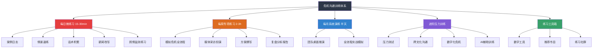
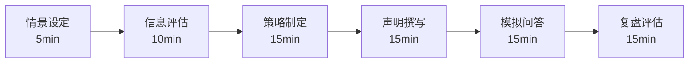

# 第五节：危机沟通的练习方法

危机沟通能力本质上是一种**高压决策能力**——它要求你在信息不完整、时间极度紧迫、多方利益冲突的条件下，做出语言精准、立场得体、情感恰当的表达。这种能力不可能通过阅读理论获得，正如你不能通过阅读游泳教材学会游泳。它需要在持续的、刻意的、逐步加压的练习中被锻造出来。

本节提供一套完整的训练体系，从每日微练习到年度系统训练，从个人自练到团队协同演练，覆盖从入门到专家的全部成长路径。每项练习都包含明确的目标、可操作的步骤、评估标准和常见误区，确保你能真正落地执行。

---

## 一、每日微练习（15-30分钟/天）

每日练习的核心目标不是"完成任务"，而是**建立危机沟通的思维操作系统**——让你的大脑在遇到任何突发事件时，自动启动"危机分析→利益相关者识别→信息提炼→策略选择"的处理流程。这种自动化反应需要至少60天的持续训练才能形成。

**为什么每日微练习比集中训练更有效**：认知心理学中的"间隔效应"（Spacing Effect）表明，分散在多天的短时间练习，在长期记忆形成和技能自动化方面，显著优于集中在一天的长时间练习。加州大学洛杉矶分校的Robert Bjork教授将这种现象称为"合意困难"（Desirable Difficulty）——每天练习结束后大脑需要"重新加载"知识的过程，恰恰是强化神经连接的关键环节。换言之，每天15分钟的刻意练习坚持60天，效果远优于连续5天各练3小时。

### 练习1：危机沟通案例日志

**练习目标**：培养对危机事件的敏感度和系统化分析能力，建立"危机直觉"

**为什么这个练习有效**：危机沟通专家与新手的核心差异不在于知识量，而在于**模式识别能力**——专家能在看到危机的最初几分钟内判断出这是什么类型的危机、应该采取什么策略。这种能力来自大量案例的积累和结构化分析。案例日志正是在训练这种模式识别能力。认知心理学家Gary Klein的研究表明，专家决策的核心机制是"识别启动决策"（Recognition-Primed Decision）——通过大量案例积累形成的模式库，在新情境出现时自动匹配最接近的历史模式，从而实现快速判断。案例日志本质上就是在建设你的模式库。

**练习方法**：

每天花10-15分钟，选择一个当天在媒体上报道的危机事件，按照以下框架进行深度分析。不要只是"看新闻"，而是要**带着分析框架**去拆解。

**完整日志模板**：

═══════════════════════════════════════
危机沟通案例日志
═══════════════════════════════════════

【基本信息】
日期：____年____月____日
危机事件：[一句话描述]
涉及主体：[组织/个人名称]
所属行业：[行业分类]
危机类型：□产品安全 □声誉损害 □数据泄露 □劳动争议 
         □高管丑闻 □环境污染 □财务造假 □其他:____
危机阶段：□潜伏期 □爆发期 □蔓延期 □消退期 □恢复期
严重程度：□低(局部影响) □中(行业关注) □高(全网热议) □极高(监管介入)

【时间线梳理】
T-?（潜伏期）：[危机酝酿的迹象，是否有人提前预警]
T0（爆发点）：[什么事件触发了危机的公开化]
T+1h：[组织的第一反应是什么]
T+6h：[事态发展和组织的后续动作]
T+24h：[危机的演变方向]
T+?（最终）：[危机如何收场]

【五维分析】
1. 响应速度评估：
   - 从危机爆发到首次公开回应用了多久？
   - 这个速度在行业中算快还是慢？
   - 首次回应的形式是什么？（声明/采访/社交媒体/内部通知）
   
2. 信息策略评估：
   - 核心信息是什么？能否用一句话概括？
   - 信息发布的渠道选择是否匹配受众习惯？
   - 信息释放的节奏是否合理？（一次性还是分阶段）
   - 是否存在信息矛盾或口径不一致的情况？

3. 情感与态度评估：
   - 是否第一时间表达了对受影响者的关切？
   - 语气是真诚的还是官僚的？
   - 是否承认了问题？承认的程度如何？
   - 有没有表现出推诿、甩锅或傲慢？

4. 利益相关者管理评估：
   - 涉及了哪些利益相关者？（消费者/员工/投资者/监管/媒体/社区）
   - 对不同利益相关者的沟通是否有差异化？
   - 最关键的利益相关者是否得到了优先处理？
   - 有没有被忽略的重要利益相关者？

5. 行动与承诺评估：
   - 是否提出了具体的补救措施？
   - 措施是否可量化、可验证？
   - 是否建立了后续跟进机制？
   - 承诺的可信度如何？

【理论映射】
- 这个案例可以用哪个理论模型分析？（形象修复理论/SCCT/卓越公关理论）
- 该组织采取的策略属于理论中的哪种类型？
- 理论预测与实际效果是否一致？为什么？

【我的判断】
- 做得最好的一点：____
- 最大的失误：____
- 如果我是该组织的危机顾问，我会建议：____
- 这个案例的核心教训：____

【一周后追踪更新】
[一周后回来更新事件进展和最终结果]
- 事态是否按预期发展？
- 组织的后续行动是否兑现了承诺？
- 长期影响如何？品牌声誉是否恢复？
- 追踪后的补充判断：____

**案例日志的追踪机制**：案例日志最被忽视的环节是"追踪"。很多练习者在分析完之后就不再关注该事件，这导致一个关键的学习机会被浪费——你无法验证自己的判断是否正确。建立以下追踪机制：

1. **标记回访日**：在完成日志时就在日历上标记7天后和30天后的回访日期
2. **设置信息源提醒**：用搜索引擎设置关键词提醒（如Google Alerts），当该事件有新进展时自动通知你
3. **记录判断准确率**：每月统计一次自己的判断准确率——你预测的危机走向有多少次是正确的？准确率从30%提升到60%再到80%的过程，就是你专业能力成长的直接证据
4. **建立案例档案库**：将日志按危机类型分类存储，形成你自己的"案例图书馆"。当遇到类似危机时，先搜索自己的档案库，看看类似案例的分析结论

**进阶训练路径**：

| 阶段 | 时间 | 要求 |
|------|------|------|
| 入门期 | 第1-2周 | 每天完成基本分析，重点练习五维分析框架的使用 |
| 习惯期 | 第3-4周 | 尝试在分析中加入理论映射，开始建立案例分类 |
| 深化期 | 第5-8周 | 每月回顾日志，总结同类型危机的共性模式 |
| 融通期 | 第9-12周 | 与同事分享分析，尝试在看到新闻标题时就预判危机走向 |
| 自动化 | 12周后 | 遇到任何危机事件，能在5分钟内完成核心分析 |

**常见误区**：
- ❌ 只记录事实不做分析 → 日志的价值在于分析，不在于记录
- ❌ 只关注大事件 → 中小危机的分析同样有价值，而且更容易获得完整信息
- ❌ 分析后不追踪 → 不追踪后续就无法验证自己的判断是否正确
- ❌ 只看国内案例 → 国际案例能提供不同的视角和策略参考
- ❌ 追求完美再下笔 → 先写再改，不完美的分析好过空白的页面

### 练习2：情景模拟速练

**练习目标**：锻炼在时间压力下的快速反应能力，训练"30秒内找到核心立场"的本能

**为什么这个练习有效**：危机爆发后的"黄金4小时"内，你往往只有30分钟甚至更短的时间来确定初步立场和第一份声明的方向。这个练习就是在反复训练这个最关键的决策窗口。军事领域称之为OODA循环（观察-判断-决策-行动），危机沟通中的"30秒定立场"本质上就是OODA循环的极度压缩版。

**标准流程（每次10分钟）**：

步骤1：抽取情景（10秒）
步骤2：阅读情景，识别危机类型（30秒）
步骤3：快速决策——核心立场是什么？（60秒）
步骤4：撰写初步声明草稿（200-300字，5分钟）
步骤5：自我评估（2分钟）
步骤6：记录得分和改进点（1分钟）

**30个情景卡片库**：

以下是30个覆盖不同行业、不同危机类型的情景。建议打印成卡片，每天随机抽取。

| 编号 | 行业 | 情景描述 | 危机类型 | 难度 |
|------|------|----------|----------|------|
| 1 | 餐饮 | 顾客在社交媒体发帖称在你的餐厅吃出异物，配图被转发5000+次，本地媒体开始跟进 | 产品安全 | ★★ |
| 2 | 科技 | 公司中层管理者被曝学历造假，HR部门被质疑招聘流程有漏洞 | 声誉损害 | ★★ |
| 3 | 互联网 | 你负责的APP在工作日上午出现2小时系统宕机，用户投诉涌入客服和社交媒体 | 产品故障 | ★★ |
| 4 | 制造 | 有媒体报道你的工厂存在加班过度问题，附带了员工的匿名采访 | 劳动争议 | ★★★ |
| 5 | 零售 | 公司产品包装上出现明显错别字，被网友截图做成表情包广泛传播 | 品牌损害 | ★ |
| 6 | 教育 | 机构被多名家长联名投诉收费不合理，有家长向教育局举报 | 监管风险 | ★★★ |
| 7 | 服务 | 客服人员与顾客争执的视频在网上流传，视频中客服态度恶劣 | 声誉损害 | ★★ |
| 8 | 科技 | 前员工在社交平台爆料公司内部管理混乱、领导任人唯亲 | 声誉损害 | ★★★ |
| 9 | 食品 | 产品被检测出某项指标接近但未超标，但媒体报道标题制造了恐慌 | 产品安全 | ★★★ |
| 10 | 商业 | 合作伙伴出了严重丑闻，公众在讨论你是否应该终止合作 | 关联风险 | ★★★ |
| 11 | 科技 | 用户发现你的APP在后台持续收集位置信息，超出了隐私政策声明的范围 | 数据隐私 | ★★★★ |
| 12 | 医疗 | 患者在社交媒体发布视频，声称在你的医院遭遇了误诊，要求赔偿 | 专业声誉 | ★★★ |
| 13 | 金融 | 有自媒体发文质疑你的理财产品存在"庞氏骗局"特征，文章阅读量10万+ | 财务信任 | ★★★★ |
| 14 | 旅游 | 旅行团在目的地遭遇意外事故，有游客受伤，家属在机场拉横幅 | 安全危机 | ★★★★ |
| 15 | 电商 | 大促期间因系统问题导致大量订单价格错误，部分用户以极低价格下单 | 运营危机 | ★★★ |
| 16 | 科技 | AI产品被发现存在偏见输出，生成了歧视性内容，被截图传播 | 产品伦理 | ★★★★ |
| 17 | 汽车 | 一辆你品牌的汽车发生严重交通事故，车主家属质疑车辆存在设计缺陷 | 产品安全 | ★★★★ |
| 18 | 时尚 | 你的品牌广告被批评涉嫌种族歧视或性别歧视，#抵制品牌#话题开始发酵 | 价值观危机 | ★★★★ |
| 19 | 房地产 | 业主集体投诉精装修房质量问题，有业主在售楼处直播维权 | 产品质量 | ★★★ |
| 20 | 科技 | 公司核心技术被竞争对手指控侵犯专利，对方已提起诉讼 | 法律危机 | ★★★★ |
| 21 | 餐饮 | 食品监管部门在突击检查中发现你的后厨存在多项卫生问题 | 合规危机 | ★★★ |
| 22 | 互联网 | 平台上有用户发布违法内容被媒体曝光，你被质疑审核机制形同虚设 | 内容安全 | ★★★★ |
| 23 | 制造 | 工厂排放被附近居民举报，环保部门已介入调查 | 环境危机 | ★★★ |
| 24 | 零售 | 促销活动规则临时修改，导致大量消费者感觉被欺骗，集体投诉 | 消费者权益 | ★★ |
| 25 | 教育 | 学员在社交媒体控诉课程质量远低于宣传，要求退款被拒 | 诚信危机 | ★★ |
| 26 | 科技 | 公司高管在行业会议上发表了不当言论，视频被剪辑传播 | 高管危机 | ★★★ |
| 27 | 医疗 | 机构被曝使用过期医疗器械，但机构声称是个别现象 | 安全合规 | ★★★★ |
| 28 | 金融 | 客户资金被盗刷，媒体报道你公司的安全系统存在漏洞 | 技术安全 | ★★★★ |
| 29 | 旅游 | 酒店被曝房间内安装了隐蔽摄像头，住客已报警 | 隐私安全 | ★★★★ |
| 30 | 电商 | 被曝销售假冒品牌商品，品牌方已发律师函 | 知识产权 | ★★★★ |

**10个进阶复合场景**（★★★★★难度——多重危机并发）：

| 编号 | 情景描述 | 复合危机要素 |
|------|----------|--------------|
| 31 | 你的APP发生数据泄露，泄露的数据包含用户身份证号，同时有黑客在暗网出售这些数据 | 数据安全+法律风险+舆论恐慌 |
| 32 | 公司裁员30%的消息被内部员工泄露到社交媒体，被裁员工集体维权，同时股价暴跌 | 人力资源+投资者关系+社会情绪 |
| 33 | 你的产品被检测出有害成分，3名消费者住院，其中1人是未成年人，媒体已到场采访 | 产品安全+未成年人保护+法律诉讼 |
| 34 | CEO被曝婚外情，对象是公司高管，同时公司被质疑存在利益输送 | 高管丑闻+公司治理+道德争议 |
| 35 | 你的平台出现大规模虚假交易，被媒体曝光后又发现内部员工参与其中 | 商业诚信+内部腐败+监管风险 |
| 36 | 公司海外工厂被曝使用童工，联合国人权机构已发表声明 | 人权问题+供应链管理+国际舆论 |
| 37 | 你的AI客服系统因算法缺陷，对特定族裔用户给出了歧视性回答 | AI伦理+种族歧视+技术缺陷 |
| 38 | 公司发行的理财产品爆雷，受害投资者中有大量老年人，已出现群体性事件 | 金融风险+社会稳定+监管介入 |
| 39 | 你的品牌代言人被警方拘留，同时你自己的产品也被消费者举报存在质量问题 | 代言人危机+产品质量+品牌连带 |
| 40 | 公司在环保审批中被发现数据造假，同时有员工举报安全生产存在隐患 | 环境违规+安全生产+内部举报 |

**自我评估打分表**（每项1-5分）：

| 评估维度 | 具体标准 | 得分 |
|----------|----------|------|
| 立场清晰度 | 声明的第一句话就表明了核心立场，读者不需要猜测 | __/5 |
| 同理心表达 | 明确表达了对受影响者的关切，不是敷衍的套话 | __/5 |
| 事实态度 | 对已知事实坦诚确认，对未知信息诚实说明正在调查 | __/5 |
| 行动承诺 | 提出了具体、可执行的下一步措施，而非空洞的"高度重视" | __/5 |
| 语言质量 | 措辞真诚自然，避免官僚腔和法律术语堆砌 | __/5 |
| 渠道匹配 | 声明的形式和长度适合所选发布渠道 | __/5 |
| 禁忌规避 | 没有出现"无可奉告""正在调查中等结果""个别现象"等禁忌用语 | __/5 |
| 总分 | | __/35 |

**得分解读**：
- 28-35分：优秀，已具备独立处理中等危机的能力
- 21-27分：良好，需要在某些维度上加强训练
- 14-20分：及格，建议回炉复习危机沟通基础理论
- 14分以下：需要重点加强基础训练

### 练习3：新闻标题改写

**练习目标**：训练"从危机叙事中夺回话语权"的能力——同一件事，用不同的语言框架来叙述，会产生截然不同的公众认知

**为什么这个练习有效**：危机沟通的本质是**叙事权的争夺**。媒体用一个框架来报道你的危机，你需要用另一个框架来重新定义公众对这件事的理解。标题改写的训练直接针对这种"重新框架"（Reframing）的能力。认知语言学家George Lakoff的研究证明，语言框架不仅影响人们对事实的理解，还能激活特定的情感反应和道德判断。在危机中，"重新框架"不是歪曲事实，而是选择性地强调不同维度的事实，引导公众从更全面的角度理解事件。

**练习方法**：

每天从新闻中选择一个危机事件标题，进行三个层次的改写：

【原始标题】
"XX公司产品被检出有害物质，消费者恐慌"

【改写层次一：防御性框架】
强调组织正在积极应对
→ "XX公司主动启动产品安全审查，全面召回相关批次产品"

【改写层次二：积极行动框架】
强调组织的行动和改进
→ "XX公司公布完整检测报告，宣布建立行业最高安全标准"

【改写层次三：价值导向框架】
将危机转化为展现企业价值观的机会
→ "XX公司：消费者安全是我们的底线，宁可承受短期损失也要确保万无一失"

**改写技巧清单**：

| 技巧 | 说明 | 示例 |
|------|------|------|
| 主体转换 | 将被动（被曝光）改为主动（主动回应） | "被曝偷工减料" → "主动公开供应链信息" |
| 动作前置 | 将行动放在标题最前面 | "XX陷入争议" → "XX宣布立即整改" |
| 量化具象 | 用具体数字替代模糊描述 | "大量用户受影响" → "为12,347名用户逐一处理" |
| 价值锚定 | 将行动与企业核心价值观挂钩 | "回应质疑" → "践行'用户第一'的承诺" |
| 时间锚定 | 强调响应速度 | "做出回应" → "2小时内启动应急机制" |
| 视角转换 | 从受害者/公众视角转向解决方案视角 | "用户投诉无门" → "设立24小时专线一对一处理" |

**进阶练习——撰写"反转声明"**：

选取一个你认为危机沟通做得不好的案例，为其撰写一份"如果重来"的声明，然后对比原始声明，分析语言框架的差异如何影响公众认知。这个练习能帮你深刻理解"框架效应"在危机沟通中的实际作用。

### 练习4：话术库建设

**练习目标**：建立分类清晰、随时可调用的危机沟通语言库

**为什么这个练习有效**：危机发生时，你没有时间字斟句酌。你需要的是一个**预制语言模块库**——就像厨师备好的食材，危机来临时可以快速组合出一道完整的声明。这个练习就是在"备料"。美国白宫新闻发言人的准备工作就包括维护一个庞大的"应答库"（Response Bank），覆盖数百个可能被问到的话题，每个话题都有经过法务审核的标准应答。

**七大类话术模块**：

**第一类：开场表态模块**

| 场景 | 话术模板 | 使用条件 |
|------|----------|----------|
| 标准开场 | "我们已关注到关于____的报道/反馈，对此高度重视。" | 中等严重程度的危机 |
| 严重事件开场 | "对于____事件，我们深感痛心和自责。" | 涉及人身安全或重大损失 |
| 澄清开场 | "针对网络上关于____的传言，我们在此做出正式说明。" | 不实信息传播 |
| 感谢开场 | "感谢社会各界对____的关注和监督，这帮助我们发现了____。" | 问题确实存在且相对可控 |

**第二类：承认问题模块**

| 场景 | 话术模板 | 注意事项 |
|------|----------|----------|
| 直接承认 | "经内部核查，____情况属实。我们对此深表歉意。" | 事实清楚、无法否认时使用 |
| 部分承认 | "我们确认在____环节存在不足，正在进一步核实____。" | 部分事实待确认时使用 |
| 程度限定 | "经初步调查，此次事件涉及____，影响范围为____。" | 防止问题被无限放大 |
| 责任界定 | "对于____，我们承担全部责任；对于____，我们正在配合调查。" | 需要区分不同层面的责任 |

**第三类：表达歉意模块**

> **关键原则**：道歉必须具体——对什么道歉、给谁造成了什么影响、你理解他们的感受是什么。空洞的"我们深感抱歉"不如具体的"我们理解每一位在今天无法正常使用服务的用户所面临的不便和焦虑"。

| 场景 | 话术模板 |
|------|----------|
| 对消费者 | "我们对给每一位消费者带来的困扰和不安深表歉意。我们理解您对产品质量的担忧是完全合理的。" |
| 对员工 | "对于此事给全体员工带来的困扰，管理层深感愧疚。每一位同事都不应因为管理层的失误而承受压力。" |
| 对合作伙伴 | "我们对此次事件给合作伙伴造成的业务影响诚挚致歉，并将在后续提供具体的支持方案。" |
| 对公众 | "我们认识到此事引发了公众对____的信任担忧，这是我们的责任，我们对此深感自责。" |

**第四类：说明措施模块**

> **关键原则**：措施必须具体到可验证的程度。"加强管理"是废话，"在72小时内完成全部____的排查，并在官网公示排查结果"是行动。

| 场景 | 话术模板 |
|------|------|
| 即时措施 | "我们已采取以下即时措施：第一，____；第二，____；第三，____。" |
| 调查措施 | "我们已成立由____牵头的专项调查组，将在____小时内公布调查结果。" |
| 补救措施 | "对于已受影响的____，我们将提供以下补救方案：____。" |
| 预防措施 | "为防止类似事件再次发生，我们将：____。" |

**第五类：过渡与桥接模块**

这是最容易被忽视但极其重要的模块——当记者或公众问到你不想直接回答的问题时，你需要自然地将话题引回你的核心信息。

| 场景 | 话术模板 |
|------|----------|
| 引回核心信息 | "这个问题很重要，但我想先回到最核心的一点：____。" |
| 承认后转向 | "关于您提到的____，我们正在调查。目前更重要的是____。" |
| 化攻击为机会 | "您说的这个问题恰恰说明了____的重要性，这也是为什么我们____。" |
| 搁置待议 | "这个问题涉及的因素比较复杂，我们会在调查结果出来后专门回应。眼下我们优先处理的是____。" |

**第六类：承诺与展望模块**

| 场景 | 话术模板 |
|------|----------|
| 标准承诺 | "我们承诺将在____前完成____，并定期向公众通报进展。" |
| 制度承诺 | "我们将以此为契机，建立/完善____制度/机制，确保____。" |
| 开放承诺 | "我们欢迎社会各界持续监督，并将每____公布一次改进进展报告。" |

**第七类：结语模块**

| 场景 | 话术模板 |
|------|----------|
| 标准结语 | "再次对给各方带来的影响深表歉意。我们将以实际行动重建信任。" |
| 感恩结语 | "感谢各方的理解与支持。我们会以更好的产品/服务回报大家的信任。" |
| 开放结语 | "我们的沟通渠道始终对所有人开放。如有任何疑问，请随时联系____。" |

**使用指南**：

1. **不要照搬模板**：模板是思维框架，不是填空题。根据具体情境重新组织语言
2. **组合使用**：一次完整的声明通常需要"开场→承认→道歉→措施→承诺→结语"的组合
3. **语气一致**：所有模块的语气要统一，不能前面正式后面口语化
4. **定期更新**：随着你积累更多优秀案例，不断丰富和更新话术库
5. **法务审核**：涉及法律责任的话术，务必在非危机时期请法务团队预先审核

### 练习5：舆情信号识别练习

**练习目标**：训练在海量信息中快速识别危机信号的能力

**为什么这个练习有效**：危机不是突然出现的——它有一个从萌芽到爆发的过程。很多危机在爆发前就已有信号，只是被忽视了。这个练习训练你成为"危机的第一发现者"，在问题还处于萌芽状态时就识别出来。美国危机管理专家Steven Fink在《危机管理》一书中指出：危机在潜伏期被发现，处理成本是爆发期的1/10。

**每日练习方法**：

每天花5分钟，扫描以下信息源，寻找潜在的危机信号：

信息源扫描清单：
━━━━━━━━━━━━━━━━━━━━━━━━━━
□ 社交媒体：搜索品牌/产品关键词，查看近24小时的负面提及
□ 行业论坛/社区：查看是否有用户投诉或讨论异常
□ 客服记录：检查近24小时的投诉类别是否有异常集中
□ 竞品动态：竞争对手是否出了类似问题（可能波及你）
□ 监管动向：是否有新的法规、标准或检查行动
□ 媒体报道：是否有记者就相关话题联系过公司
━━━━━━━━━━━━━━━━━━━━━━━━━━

**信号分级练习**：为发现的每个信号进行分级——

| 级别 | 信号特征 | 响应建议 |
|------|----------|----------|
| 绿色 | 个别用户吐槽，传播范围极小 | 按常规客服流程处理 |
| 黄色 | 多个类似投诉出现，或有自媒体关注 | 升级给相关部门，准备应对预案 |
| 橙色 | 媒体开始报道，社交媒体讨论升温 | 启动危机团队预备会议，准备初步声明 |
| 红色 | 话题上热搜，监管介入，主流媒体集中报道 | 全面启动危机响应机制 |

**记录格式**：

日期：____
扫描时间：____
发现信号：____
信号级别：□绿 □黄 □橙 □红
判断依据：____
建议行动：____

---

## 二、每周专项练习（2-3小时/周）

每日练习训练的是"砖块"——单个的能力模块。每周练习训练的是"砌墙"——将这些模块组合成完整的危机沟通能力。

### 练习6：模拟危机全流程演练

**练习目标**：在接近真实的时间压力下，完成从危机识别到声明发布的完整流程

**演练流程**（总时长60-90分钟）：

**各阶段详细操作指南**：

**阶段一：情景设定（5分钟）**

由同伴或自己设定危机情景。高质量的情景应包含以下要素：

情景描述模板：
━━━━━━━━━━━━━━━━━━━━━━━━━━━━━
【组织背景】
公司名称：____
行业：____
规模：____
品牌定位：____
近期是否有负面新闻：____

【危机事件】
发生了什么：____
何时发生：____
如何被发现/曝光：____
当前传播范围：____

【已知信息】
确认的事实：____
尚不确定的信息：____
内部人员的说法：____

【利益相关者】
直接受影响者：____
间接受影响者：____
媒体关注度：____
监管部门态度：____

【约束条件】
可用的准备时间：____
可以调用的资源：____
不能做的事情：____
━━━━━━━━━━━━━━━━━━━━━━━━━━━━━

**阶段二：信息评估（10分钟）**

使用以下决策矩阵快速判断危机的应对策略：

| | 归因于组织 | 归因于外部/偶发 |
|---|---|---|
| **高关注度** | 完全道歉+立即行动+长期改进 | 同情+澄清+展示防范措施 |
| **低关注度** | 低调承认+针对性补偿 | 简单说明+持续监测 |

同时完成以下检查清单：

- [ ] 确定了危机的类型和严重等级
- [ ] 识别了所有关键利益相关者及其优先级
- [ ] 明确了已知事实和未知信息的边界
- [ ] 判断了危机可能的演变方向
- [ ] 确定了需要请示/协调的内部层级

**阶段三：策略制定（15分钟）**

输出一份简要的沟通策略备忘录：

沟通策略备忘录
━━━━━━━━━━━━━━━
核心立场（一句话）：____
目标受众优先级：①____ ②____ ③____
核心信息（3条以内）：
  1. ____
  2. ____
  3. ____
首发渠道：____
首发时间：____
发言人：____
禁用表述：____
后续节奏：____
━━━━━━━━━━━━━━━

**阶段四：声明撰写（15分钟）**

按照以下结构撰写300-500字的正式声明：

【标题】[用主动语态，突出行动]

[第一段：核心立场和态度——不超过2句话]

[第二段：事实确认——说明已确认的情况]

[第三段：已采取的措施——具体、可验证]

[第四段：后续计划——时间表和承诺]

[第五段：致歉与沟通渠道——真诚、具体]

**阶段五：模拟问答（15分钟）**

由同伴扮演记者，按照以下五种风格轮番提问：

| 记者风格 | 提问特征 | 应对要点 |
|----------|----------|----------|
| 友善型 | 给你解释空间，问题较温和 | 充分利用机会传递核心信息 |
| 质疑型 | 追问细节，挑战你的说法 | 保持冷静，用事实回应 |
| 攻击型 | 直接指责，情绪化措辞 | 不被激怒，坚守核心立场 |
| 引导型 | 设置陷阱，诱导你说出不利的话 | 识别陷阱，桥接回核心信息 |
| 偏离型 | 问无关问题，试图转移话题 | 礼貌地拉回主题 |

**阶段六：复盘评估（15分钟）**

使用以下结构化评估表：

| 评估项 | 自评(1-5) | 同伴评(1-5) | 改进建议 |
|--------|-----------|-------------|----------|
| 危机判断准确度 | | | |
| 策略选择合理性 | | | |
| 声明的说服力 | | | |
| 同理心表达 | | | |
| 问答应对能力 | | | |
| 时间管理 | | | |
| 情绪稳定性 | | | |

### 练习7：媒体采访角色扮演

**练习目标**：提升面对真实媒体采访时的信息传递效率和压力应对能力

**三种采访模式练习**：

**模式一：电话采访（5-10分钟）**

电话采访的特点是快速、直接，且你无法用肢体语言辅助表达。练习要点：
- 每个回答控制在30秒以内
- 先说结论，再说依据
- 如果不确定，说"我需要核实后回复您"而不是"我不清楚"
- 结束前主动确认："请问还有其他问题吗？"
- 重要：电话采访也是可录音的，每句话都可能被直接引用

**模式二：一对一深度专访（15-20分钟）**

深度专访需要你在较长时间内保持信息一致性。练习要点：
- 准备3个核心信息点，每个回答都尽量回到这些点上
- 面对追问时使用桥接技术："您提的这个点很重要，但更关键的是……"
- 注意前后一致性——专访中任何自相矛盾都会被抓住
- 适当使用"我理解您的关切"来建立对话感
- 控制专访节奏：如果记者连续追问同一话题超过3次，主动引导转换话题

**模式三：群访/新闻发布会（20-30分钟）**

新闻发布会是最高压的采访形式，需要同时应对多位记者。练习要点：
- 准备开场声明（2-3分钟），结构清晰，重点突出
- 点名回答时先总结问题："您问的是关于____的问题……"
- 不要被某一位记者"绑架"——适时转向其他记者："这个问题我已经回答了，我想听听其他记者的关注点"
- 遇到重复问题不要说"我已经回答过了"，换个角度重新回答
- 回答时注意"画面感"——你的话不仅被在场记者听到，还会被镜头前的千万人看到
- 准备结束语，不要让发布会在尴尬的沉默中结束

**采访中的"雷区"检测清单**：

在每次角色扮演后，检查自己是否踩到了以下雷区：

| 雷区 | 错误示范 | 正确做法 |
|------|----------|----------|
| 无可奉告 | "这个我们不方便回应" | "这个问题我们会在____时统一说明" |
| 甩锅他人 | "这是供应商的问题" | "无论原因如何，我们对消费者承担全部责任" |
| 过度承诺 | "保证以后不会再出任何问题" | "我们将建立____机制来最大限度降低风险" |
| 攻击媒体 | "你们的报道不实" | "我们注意到相关报道，想补充一些信息" |
| 情绪失控 | "你们怎么不理解我们的难处" | 保持冷静，回到核心信息 |
| 说谎或夸大 | 隐瞒已知事实 | 对已知事实坦诚，对未知坦白 |
| 技术迷雾 | 用大量技术术语糊弄 | 用通俗语言解释，必要时用类比 |
| "私下说" | "这个是off the record……" | 不存在off the record，所有话都可被引用 |

### 练习8：危机沟通方案撰写

**练习目标**：提升系统化的危机沟通规划能力，从"应急反应"升级到"战略规划"

**完整方案框架**：

━━━━━━━━━━━━━━━━━━━━━━━━━━━━━━━━━━━━━━
危机沟通方案：[危机情景名称]
撰写日期：____
版本：V1.0
━━━━━━━━━━━━━━━━━━━━━━━━━━━━━━━━━━━━━━

一、危机情景定义
   1.1 风险类型和触发条件
   1.2 预估影响范围（时间/空间/人群）
   1.3 严重程度评级（低/中/高/极高）
   1.4 可能的升级路径

二、利益相关者地图
   2.1 利益相关者识别与分类
       ┌──────────────┬──────────┬──────────┬──────────┐
       │ 利益相关者    │ 关注点    │ 影响力    │ 优先级    │
       ├──────────────┼──────────┼──────────┼──────────┤
       │              │          │ 高/中/低  │ 1/2/3    │
       └──────────────┴──────────┴──────────┴──────────┘
   2.2 差异化沟通策略
       - 对高影响力利益相关者的专属沟通方案
       - 对直接受影响者的补偿/安抚方案
       - 对媒体的信息供给方案
       - 对监管的合规汇报方案

三、核心信息体系
   3.1 核心立场（一句话）
   3.2 核心信息（不超过5条）
       每条信息包含：要点 + 支撑论据 + 适用场景
   3.3 禁用表述清单
   3.4 关键数据和事实清单（提前准备好的）

四、沟通渠道矩阵
   ┌──────────┬──────────┬──────────┬──────────┐
   │ 渠道      │ 用途      │ 时效要求  │ 负责人    │
   ├──────────┼──────────┼──────────┼──────────┤
   │ 官方声明  │ 首发立场  │ 4小时内   │          │
   │ 社交媒体  │ 实时互动  │ 持续      │          │
   │ 新闻发布会│ 深度说明  │ 24小时内  │          │
   │ 客户直邮  │ 定向通知  │ 12小时内  │          │
   │ 内部通报  │ 员工知情  │ 2小时内   │          │
   └──────────┴──────────┴──────────┴──────────┘

五、发言人方案
   5.1 首席发言人及分工
   5.2 备选发言人
   5.3 发言人授权范围
   5.4 发言人培训要求

六、Q&A预案（至少20个问题）
   ┌────┬──────────────────┬──────────────────┬──────────┐
   │ 编号│ 预期问题          │ 建议回答要点      │ 风险等级 │
   ├────┼──────────────────┼──────────────────┼──────────┤
   │ 1  │                  │                  │ 高/中/低 │
   └────┴──────────────────┴──────────────────┴──────────┘

七、时间线行动计划
   T+0：[立即行动]
   T+1h：[一小时内完成]
   T+4h：[四小时内完成]
   T+24h：[一天内完成]
   T+72h：[三天内完成]
   T+1周：[一周内完成]
   T+1月：[长期措施]

八、效果评估指标
   8.1 短期指标（24-72小时）
       - 媒体报道基调变化（负面→中性→正面）
       - 社交媒体情绪指数
       - 客服投诉量变化
   8.2 中期指标（1-4周）
       - 品牌搜索关联词变化
       - 用户留存/流失率
       - 监管态度变化
   8.3 长期指标（1-6个月）
       - 品牌信任度恢复情况
       - 行业口碑
       - 业务指标恢复

九、复盘机制
   - 危机结束后的复盘时间
   - 复盘参与人
   - 复盘报告框架
   - 改进措施的跟踪落实
━━━━━━━━━━━━━━━━━━━━━━━━━━━━━━━━━━━━━━

**方案质量自检清单**：

写完方案后，用以下清单检验质量：

| 检查项 | 是否达标 | 改进建议 |
|--------|----------|----------|
| 核心立场能否用一句话说清楚？ | □ | |
| 是否覆盖了所有关键利益相关者？ | □ | |
| 核心信息是否有支撑论据？ | □ | |
| 禁用表述清单是否完整？ | □ | |
| Q&A预案是否覆盖了最尖锐的问题？ | □ | |
| 时间线是否具体到小时级别？ | □ | |
| 措施是否具体到可验证的程度？ | □ | |
| 是否考虑了危机的多种演变路径？ | □ | |
| 法务团队是否审阅了关键措辞？ | □ | |
| 是否准备了备用方案？ | □ | |

### 练习9：深度复盘分析报告

**练习目标**：通过对真实危机案例的深度解剖，建立从"看热闹"到"看门道"的分析能力

**报告框架**（2000-3000字）：

1. **事件全景**：完整的时间线，标注每个关键决策点
2. **策略解剖**：使用至少两个理论模型分析涉事组织的沟通策略
3. **多方视角**：分别从消费者、媒体、监管、投资者的角度评估此次危机沟通
4. **替代方案**：如果你是危机顾问，你的方案与实际方案有何不同？为什么你的方案可能更好？
5. **理论对话**：这个案例验证了什么理论？挑战了什么理论？是否产生了新的洞察？
6. **个人行动清单**：从这个案例中，你学到了哪些可以立即应用到自己工作中的方法？

**推荐分析的经典案例**：

| 案例 | 年份 | 分析重点 |
|------|------|----------|
| 强生泰诺投毒事件 | 1982 | 危机响应的黄金标准——全面召回+透明沟通 |
| 海底捞后厨事件 | 2017 | 4小时内发布致歉信，被称"教科书级公关" |
| 三星Galaxy Note 7电池事件 | 2016 | 多次召回的信息一致性管理失败 |
| 三聚氰胺事件 | 2008 | 企业沉默与政府介入的互动关系 |
| BP墨西哥湾漏油 | 2010 | CEO言论灾难——"我想找回我的生活" |
| 新东方双减政策应对 | 2021 | 政策危机中的员工沟通和业务转型沟通 |
| Equifax数据泄露 | 2017 | 响应延迟+荒谬域名+修复工具的法律陷阱 |
| 滴滴顺风车事件 | 2018 | 二次危机的叠加与虚假整改承诺 |
| Meta/Facebook剑桥分析 | 2018 | 数据隐私危机中CEO缺席144小时的代价 |
| 波音737 MAX事故 | 2018-2019 | 技术危机中信息不透明的连锁反应 |

---

## 三、每月系统演练（半天/月）

### 桌面推演（Tabletop Exercise）

**什么是桌面推演**：桌面推演是一种结构化的危机模拟训练方式，参与者围坐在"桌边"（可以是实体桌或虚拟会议室），针对预设的危机情景，按照时间线逐步讨论和决策。它不需要实操演练的大量资源，但能有效检验团队的决策流程和沟通机制。

**组织方式**：

- **参与人数**：4-8人为最佳
- **时长**：2-3小时
- **角色分配**：
  - 主持人（1人）：控制节奏，发布情景更新
  - 决策团队（3-5人）：扮演组织管理层
  - 观察员（1-2人）：记录决策过程，提供事后反馈
  - 可选角色：模拟记者、模拟监管、模拟消费者

**推演前的准备工作**：

主持人准备清单（推演前1-2周）：
━━━━━━━━━━━━━━━━━━━━━━━━━━━━━━━━━
□ 选定推演情景（与参与者所在行业相关）
□ 编写详细的情景脚本（含4轮递进信息）
□ 准备"注入信息"——每轮发布的突发情况
□ 设定预期决策点和观察指标
□ 准备评估表格和记录模板
□ 确认场地/线上会议工具
□ 向参与者发放推演背景材料（提前3天）
□ 准备签到表和保密协议（如涉及敏感信息）
━━━━━━━━━━━━━━━━━━━━━━━━━━━━━━━━━

**推演流程**：

第一轮：危机初现（30分钟）
━━━━━━━━━━━━━━━━━━━━━━━━━━
主持人发布：危机刚刚发生，信息有限
任务：识别危机类型，确定初步应对措施，发布第一份声明
讨论重点：
  - 我们知道什么？不知道什么？
  - 谁应该第一时间被告知？
  - 第一份声明应该说什么？

第二轮：危机升级（30分钟）
━━━━━━━━━━━━━━━━━━━━━━━━━━
主持人发布：事态恶化，出现新信息
任务：调整策略，应对升级
讨论重点：
  - 策略需要调整吗？
  - 新的信息如何纳入声明？
  - 需要升级发言人级别吗？

第三轮：多方施压（30分钟）
━━━━━━━━━━━━━━━━━━━━━━━━━━
主持人发布：监管介入/媒体围堵/消费者维权
任务：应对多方压力，平衡各方诉求
讨论重点：
  - 如何应对监管部门？
  - 媒体采访如何安排？
  - 消费者补偿方案是什么？

第四轮：危机消退与复盘（30-60分钟）
━━━━━━━━━━━━━━━━━━━━━━━━━━
主持人发布：危机进入尾声
任务：制定长期修复计划
全体复盘：
  - 哪些决策是正确的？
  - 哪些决策事后看是错误的？
  - 流程中有哪些瓶颈？
  - 需要改进的机制是什么？

**推演观察员记录模板**：

观察员在整个推演过程中不做决策，只记录。以下是记录模板：

═══════════════════════════════════════
桌面推演观察记录
═══════════════════════════════════════

推演日期：____
推演情景：____
观察员：____

【决策记录】
| 轮次 | 决策内容 | 决策时间 | 决策人 | 备选方案是否被讨论 |
|------|----------|----------|--------|-------------------|
| 第1轮 |          |          |        |                   |
| 第2轮 |          |          |        |                   |
| 第3轮 |          |          |        |                   |

【流程观察】
- 信息传达是否顺畅？有无信息盲区？
- 决策是集体讨论还是个人主导？
- 是否存在"群体思维"现象？（无人提出异议）
- 时间管理如何？是否在关键节点上延误？

【亮点与问题】
- 做得最好的决策/动作：____
- 最大的失误/遗漏：____
- 最值得改进的流程环节：____

【建议】
- 对团队决策流程的建议：____
- 对沟通机制的建议：____
- 对预案体系的建议：____
═══════════════════════════════════════

### 全流程实战模拟

每月一次，进行包含真实角色扮演的全流程模拟。与每周练习的区别在于：参与者更多、情景更复杂、时间更长、评估更严格。

**与每周演练的对比**：

| 维度 | 每周演练 | 每月模拟 |
|------|----------|----------|
| 参与人数 | 1-3人 | 4-8人或更多 |
| 情景复杂度 | 单一危机 | 多重并发危机 |
| 时间压力 | 60-90分钟 | 2-4小时 |
| 角色完整度 | 发言人+记者 | 含管理层、法务、PR、客服等 |
| 评估深度 | 自我评估 | 外部观察员+录像回放 |
| 输出物 | 评估表 | 完整复盘报告+改进方案 |

**模拟中的"意外注入"设计**：

为使模拟更接近真实，主持人应在演练过程中随机注入"意外信息"，迫使参与者临时调整策略。例如：

| 注入时机 | 注入内容 | 训练目的 |
|----------|----------|----------|
| 第10分钟 | "媒体报道中出现了不实信息" | 训练在信息混乱中保持判断力 |
| 第20分钟 | "一位受害者家属在社交媒体上发布了一段哭泣的视频" | 训练应对情感冲击 |
| 第30分钟 | "监管部门突然宣布介入调查" | 训练应对多方压力 |
| 第40分钟 | "公司内部有人匿名向媒体泄露了内部文件" | 训练处理内部信任危机 |
| 第50分钟 | "竞争对手发布声明，声称自己的产品不存在此类问题" | 训练应对竞争攻击 |

---

## 四、进阶压力训练

当你已经能从容完成基础和每周练习后，需要通过加压训练来突破能力天花板。进阶训练的核心原则是**制造不适感**——只有在不舒服的状态下训练，才能在真正的危机中保持从容。

### 进阶1：压力测试

在基础练习上叠加以下压力因素：

| 压力类型 | 具体做法 | 训练目的 |
|----------|----------|----------|
| 时间压缩 | 将准备时间从15分钟缩短到3分钟 | 训练快速决策能力 |
| 信息过载 | 同时提供10条以上信息，包含矛盾信息 | 训练信息筛选和判断能力 |
| 信息匮乏 | 几乎不给背景信息，只给危机现场描述 | 训练在不确定性中决策的能力 |
| 多重危机 | 同时处理2-3个不同类型的危机 | 训练优先级判断和并行处理能力 |
| 情绪干扰 | 对面有人用激烈言辞质问你 | 训练情绪管理和冷静回应能力 |
| 资源受限 | 告诉你"法务不在""老板联系不上" | 训练在资源不足时的独立判断 |
| 睡眠剥夺 | 在连续工作12小时后进行演练 | 模拟真实危机中的身心状态 |
| 信息反转 | 在你已做出决策后，关键事实突然改变 | 训练策略调整和承认错误的能力 |

### 进阶2：跨文化危机沟通

在全球化背景下，危机沟通往往需要跨越文化边界。同一句话在不同文化中可能产生截然不同的理解。

**跨文化差异对照表**：

| 维度 | 中国 | 美国 | 日本 | 欧洲 |
|------|------|------|------|------|
| 道歉文化 | 常见且必要，是诚意的体现 | 可能被视为认责，法务会阻止 | 极其重要，深度鞠躬道歉 | 因国家而异 |
| 信息透明度 | 倾向于控制信息流 | 高度透明是基本预期 | 信息发布缓慢但严谨 | GDPR框架下高度规范 |
| 发言人选择 | 倾向高级别领导出面 | 专业发言人或CEO | 通常由中层出面保护高层 | 视危机级别而定 |
| 媒体关系 | 需要理解媒体管控环境 | 媒体独立性强，需要主动沟通 | 媒体相对克制 | 媒体多元化 |
| 情感表达 | 克制但真诚 | 可以更直接表达情感 | 高度克制 | 因国家而异 |
| 法律环境 | 法律框架正在完善 | 诉讼风险极高，每句话都是证据 | 诉讼率低，协商为主 | GDPR严格，隐私至上 |
| 社交媒体特征 | 微信/微博/抖音生态 | Twitter/X, Facebook, Reddit | LINE/YouTube为主 | 平台因国而异 |

**练习方法**：
1. 选择同一危机事件，分别用中、美、日三种文化视角撰写声明
2. 分析跨国企业在中国和海外的不同危机回应方式
3. 学习用英语进行危机沟通的核心表达（建议积累30个常用句式）
4. 研究目标文化中的"禁忌表达"——哪些话在特定文化中是完全不可接受的

### 进阶3：数字化危机沟通专项

数字时代的危机传播速度是传统时代的100倍。一条微博可以在30分钟内触达千万人。你需要针对数字化场景进行专项训练。

**社交媒体危机模拟**：

练习场景：你在30分钟内需要完成以下任务：
1. 监测到社交媒体上的负面舆情（模拟助手提供截图）
2. 判断是否需要回应以及回应的优先级
3. 在140字以内写出回应推文/微博
4. 决定是否需要在其他平台同步回应
5. 准备后续的详细声明

**舆情研判练习**：

| 信号 | 含义 | 应对策略 |
|------|------|----------|
| 个别用户投诉 | 正常范围，但需关注 | 客服渠道处理 |
| 多个用户类似投诉 | 可能是系统性问题 | 升级到产品/质量部门 |
| 自媒体开始转发 | 危机正在扩散 | 准备官方回应 |
| 传统媒体跟进 | 危机已进入公共舆论场 | 必须正式回应 |
| 话题上热搜 | 危机全面爆发 | 启动最高级别应急机制 |
| 监管部门发声 | 已进入监管层面 | 合规团队+公关团队协同 |

**短视频平台危机专项**：

短视频时代的危机有其独特的传播特征——15秒的视频可能比500字的声明传播力强100倍。针对抖音/快手/B站等平台的危机沟通，需要额外训练以下能力：

| 训练内容 | 具体方法 | 说明 |
|----------|----------|------|
| 视频声明撰写 | 用60秒口播脚本回应危机 | 信息密度高，语气要求自然不做作 |
| 弹幕/评论回应 | 在直播间或视频评论区实时回应 | 语言要简洁、真诚、不机械 |
| KOL沟通 | 练习向KOL"喂料"——提供核心信息 | 不是操控，是信息透明供给 |
| 用户UGC管理 | 区分恶意传播和合理批评 | 对合理批评表示感谢，对恶意传播依法维权 |

### 进阶4：AI辅助训练

利用AI工具辅助危机沟通训练，是效率最高的自我提升方式之一。

**AI辅助训练方法**：

| 训练方式 | 具体做法 | 效果 |
|----------|----------|------|
| AI模拟记者 | 让AI扮演不同风格的记者，对你进行采访模拟 | 7×24小时可用，风格可调 |
| 声明批改 | 写完声明后让AI从专业角度评估并给出改进建议 | 即时反馈，多角度审视 |
| 情景生成 | 让AI根据你所在的行业生成定制化危机情景 | 情景无穷多，不会重复 |
| 角色互换 | 让AI扮演危机发言人，你扮演记者来挑战它 | 从对手角度理解策略 |
| 理论应用 | 拿一个案例让AI分别用不同理论模型来分析 | 加深对理论的理解 |
| 声明对比 | 让AI分别以组织和批评者的视角撰写同一事件的叙述 | 理解叙事权争夺的本质 |

**AI训练的注意事项**：
- AI的评估是参考性的，不能替代真人的反馈
- AI不理解你所在组织的具体语境和文化，生成的情景需要你做本地化调整
- 最好的训练方式是AI+真人结合——用AI做日常训练，用真人做月度演练
- 使用AI时注意信息安全，不要将真实未公开的危机信息输入公共AI平台

### 进阶5：深度伪造与AI危机专项

2024年以来，利用AI生成的虚假内容（Deepfake视频、AI合成语音、伪造文档）已成为新型危机的源头。危机沟通者必须了解这些技术的能力边界，并掌握应对方法。

**训练内容**：

| 场景 | 描述 | 应对要点 |
|------|------|----------|
| Deepfake视频 | 有人用AI生成了你的CEO发表不当言论的视频 | 快速技术鉴定+权威渠道辟谣+法律手段 |
| AI合成语音 | 有人用AI模拟了你的声音发布虚假信息 | 声纹鉴定+官方平台认证+发布验证渠道 |
| 伪造内部文件 | 有人用AI伪造了公司的内部邮件/备忘录 | 公开文件哈希值+第三方审计背书 |
| AI水军攻击 | 大量AI账号在社交媒体集中抹黑 | 平台举报+真实用户见证+技术溯源 |

**练习方法**：
1. 收集2-3个Deepfake引发的危机案例，分析其传播路径和应对策略
2. 撰写一份"如果我的公司被Deepfake攻击"的应急沟通预案
3. 练习用60秒口播视频快速辟谣——语气坚定、证据清晰、引导验证渠道

---

## 五、能力评估与成长路径

### 详细评估量表

以下量表不是简单的打分，而是对每个能力等级的**行为描述**。请对照描述找到自己当前所在的等级，而不是凭感觉打分。

**一、危机识别与判断力**

| 等级 | 行为描述 |
|------|----------|
| 1分-入门 | 能识别明显的危机事件，但无法判断严重程度和发展方向 |
| 2分-初级 | 能对常见类型的危机做出基本判断，但对新型危机反应迟钝 |
| 3分-中级 | 能在危机爆发初期就判断出类型、严重程度和可能的演变路径 |
| 4分-高级 | 能在危机尚处于潜伏期时就识别出风险信号，提前预警 |
| 5分-专家 | 能从行业趋势、社会情绪、政策走向中预判可能出现的危机类型 |

**二、信息提炼与表达力**

| 等级 | 行为描述 |
|------|----------|
| 1分-入门 | 能写出基本的声明，但冗长、重点不突出 |
| 2分-初级 | 能写出结构清晰的声明，但语言偏官僚，缺乏感染力 |
| 3分-中级 | 能在10分钟内写出一份立场清晰、语气得体的声明 |
| 4分-高级 | 能根据不同受众和渠道调整语言风格，信息传递效率高 |
| 5分-专家 | 能用最少的字传递最精准的信息，每句话都有明确的沟通目的 |

**三、情绪管理与抗压力**

| 等级 | 行为描述 |
|------|----------|
| 1分-入门 | 在模拟压力下容易紧张，出现明显的表达混乱 |
| 2分-初级 | 在中等压力下能保持基本的冷静，但面对尖锐质问容易失态 |
| 3分-中级 | 能在高压环境下保持冷静和专业，不被对方情绪带走 |
| 4分-高级 | 在极端压力下仍能灵活应变，将攻击性提问转化为传递信息的机会 |
| 5分-专家 | 在任何压力环境下都能展现出真诚、从容和掌控力 |

**四、利益相关者管理能力**

| 等级 | 行为描述 |
|------|----------|
| 1分-入门 | 只关注直接消费者，忽视其他利益相关者 |
| 2分-初级 | 能识别主要利益相关者，但沟通方式千篇一律 |
| 3分-中级 | 能为不同利益相关者设计差异化的沟通策略 |
| 4分-高级 | 能预判各利益相关者的反应，提前准备好应对方案 |
| 5分-专家 | 能在多方利益冲突中找到平衡点，实现多方共赢 |

**五、战略规划与系统能力**

| 等级 | 行为描述 |
|------|----------|
| 1分-入门 | 只会应对已经发生的危机，没有预防意识 |
| 2分-初级 | 能为常见危机准备简单的预案 |
| 3分-中级 | 能撰写完整的危机沟通方案，包含各环节的详细规划 |
| 4分-高级 | 能建立组织层面的危机沟通体系，包括制度、流程和培训 |
| 5分-专家 | 能将危机管理融入组织战略，化危机为组织变革和品牌提升的契机 |

**六、数字化危机管理能力**

| 等级 | 行为描述 |
|------|----------|
| 1分-入门 | 对社交媒体危机传播规律了解有限 |
| 2分-初级 | 能在社交媒体上做出基本的危机回应 |
| 3分-中级 | 能根据不同平台的特征制定差异化回应策略 |
| 4分-高级 | 能利用数据分析预判舆情走向，提前布局 |
| 5分-专家 | 能在数字生态中主动引导叙事，将危机转化为品牌传播机会 |

### 能力评估使用方法

**自评流程**：

第一步：逐维度打分（15分钟）
━━━━━━━━━━━━━━━━━━━━━━━━━━
对照每个维度的5个等级描述，找到最符合自己当前水平的等级
诚实打分，不要自我美化——在危机中，自我欺骗是最危险的

第二步：绘制能力雷达图（5分钟）
━━━━━━━━━━━━━━━━━━━━━━━━━━
将6个维度的得分绘制在雷达图上，直观看到能力全貌

第三步：识别短板（5分钟）
━━━━━━━━━━━━━━━━━━━━━━━━━━
得分最低的1-2个维度就是你需要重点训练的方向

第四步：制定针对性训练计划（10分钟）
━━━━━━━━━━━━━━━━━━━━━━━━━━
根据短板维度，从本节的练习中选择对应的训练项目
制定每周训练计划，明确频率和时长

第五步：月度复评（每月1次）
━━━━━━━━━━━━━━━━━━━━━━━━━━
每月重复一次自评，对比上月得分，确认进步方向

### 四阶段成长路径

**第一阶段：建立基础（0-3个月）**

| 训练内容 | 频率 | 预期成果 |
|----------|------|----------|
| 案例日志 | 每天 | 积累60+案例分析，建立基本的分析框架 |
| 情景速练 | 每天 | 能在10分钟内完成一份合格的初步声明 |
| 话术积累 | 每天 | 建立覆盖7大类的个人话术库 |
| 理论学习 | 每周 | 掌握形象修复理论、SCCT等核心模型 |

里程碑：能在看到一个危机新闻后，5分钟内完成类型判断和策略建议

**第二阶段：能力构建（3-6个月）**

| 训练内容 | 频率 | 预期成果 |
|----------|------|----------|
| 全流程演练 | 每周 | 能在60分钟内完成从评估到声明的全流程 |
| 媒体采访扮演 | 每周 | 能应对三种风格的记者采访 |
| 方案撰写 | 每周 | 能独立撰写完整的危机沟通方案 |
| 深度复盘 | 每两周 | 积累12+深度复盘报告 |

里程碑：能独立处理中等复杂度的危机沟通场景

**第三阶段：进阶突破（6-12个月）**

| 训练内容 | 频率 | 预期成果 |
|----------|------|----------|
| 压力测试 | 每周 | 在各种极端压力下仍能做出专业判断 |
| 跨文化训练 | 每月 | 具备基本的跨文化危机沟通能力 |
| 桌面推演 | 每月 | 具备组织和主持推演的能力 |
| 数字化专项 | 每月 | 熟练应对社交媒体危机 |

里程碑：能在高压环境下快速、准确地做出危机沟通决策

**第四阶段：专家锻造（12个月以上）**

| 训练内容 | 频率 | 预期成果 |
|----------|------|----------|
| 复杂场景模拟 | 每月 | 能处理多重利益相关者、多危机并发的复杂场景 |
| 方法论输出 | 持续 | 形成个人的危机沟通方法论和训练体系 |
| 导师角色 | 持续 | 能指导他人进行危机沟通训练 |
| 行业洞察 | 持续 | 对所在行业的危机类型和趋势有前瞻性判断 |

里程碑：成为组织内公认的危机沟通专家，能在危机中担任核心决策者

---

## 六、练习体系常见问题

**Q：我一个人怎么练习？找不到同伴怎么办？**

A：60%的练习可以独立完成——案例日志、情景速练、新闻改写、话术积累、方案撰写、复盘报告都是个人练习。需要同伴的角色扮演练习，可以：
- 用AI工具模拟记者和受影响者
- 请家人朋友帮忙（不需要专业知识，真实的"普通人反应"反而更有训练价值）
- 在专业社群中寻找练习伙伴
- 参加行业培训中的模拟演练环节

**Q：每天真的只需要15-30分钟吗？练这么少有用吗？**

A：关键不在于时长，而在于**持续性和结构化**。每天15分钟的刻意练习，远胜于每月一次2小时的随意练习。认知科学研究表明，短时间、高频次的练习在建立神经通路方面比低频次的长时间练习更有效。前提是你在练习时真的在"思考"，而不是机械地填写模板。

**Q：如何知道自己是否在进步？**

A：三个可观察的进步信号：
1. **速度提升**：从最初需要30分钟写一份声明，到10分钟就能写出同等质量的声明
2. **直觉形成**：看到一个危机新闻，能在30秒内判断出"他们应该怎么做"
3. **视野扩展**：从只关注"说什么"到能同时考虑"对谁说""怎么说""什么时候说""通过什么渠道说"

**Q：练习中的判断和现实差距很大怎么办？**

A：这是完全正常的。练习的价值不在于做出"正确"的判断，而在于**建立判断的习惯和框架**。你在练习中犯的错误越多，你在真实危机中犯错的概率就越低。每次发现自己判断失误时，恰恰是最有价值的学习时刻——分析你为什么会判断失误，比分析你为什么判断正确更有收获。

**Q：这套训练体系适合什么行业？**

A：核心框架适用于所有行业，但你需要根据自己所在行业的特点进行定制：
- **高监管行业**（金融、医疗、食品）：增加合规相关内容的练习比重，重点练习与监管部门的沟通
- **高曝光行业**（科技、消费品牌）：增加社交媒体和媒体采访的练习比重
- **高风险行业**（化工、航空、建筑）：增加安全事故场景的练习比重
- **B2B行业**：增加合作伙伴沟通和行业媒体应对的练习比重
- **政府/公共机构**：增加公众沟通和舆情回应的练习比重

**Q：团队练习时，如何让每个人都有收获？**

A：关键是在每次演练后进行充分的复盘。具体方法：
- 使用"反馈三明治"结构：先说一个亮点，再说一个改进点，最后再鼓励
- 让每个人分享自己的决策思路，而不只是结果
- 观察员的反馈比参与者的自我评价更有价值
- 录像回放是最有效的复盘工具——看自己的表现时，你会发现自己从未注意过的习惯

**Q：练习多久才能应对真实危机？**

A：没有统一答案，但以下指标可以帮助你判断准备程度：
- 能在5分钟内完成一份200字的合格初步声明
- 能在30秒内识别一个危机的类型和大致严重程度
- 能在模拟采访中连续应对3轮尖锐提问而不失态
- 能独立撰写一份完整的危机沟通方案

当以上四条都达到时，你已经具备了处理中等规模真实危机的基本能力。

---

## 七、练习工具箱

### 推荐书目

| 书名 | 作者 | 重点内容 |
|------|------|----------|
| 《危机管理》 | Steven Fink | 危机生命周期理论，危机预案制定 |
| 《危机传播管理》 | Timothy Coombs | SCCT理论的系统阐述 |
| 《Ongoing Crisis Communication》 | Timothy Coombs | 数字时代的危机传播管理 |
| 《声誉管理》 | Charles Fombrun | 组织声誉的测量、建设与修复 |
| 《讲故事的力量》 | Annette Simmons | 叙事框架在沟通中的应用 |
| 《关键对话》 | Kerry Patterson | 高压场景下的对话技巧 |
| 《影响力》 | Robert Cialdini | 说服心理学，危机声明中的说服策略 |

### 数字工具推荐

| 工具类型 | 推荐工具 | 用途 |
|----------|----------|------|
| 舆情监测 | 新榜/新红/蝉妈妈 | 监控社交媒体上的品牌提及和情感倾向 |
| 社交媒体管理 | 微博后台/抖音创作者中心 | 多平台统一回应 |
| 协作编辑 | 飞书/钉钉文档 | 团队实时协作撰写声明 |
| 语音分析 | 讯飞听见 | 分析发言人的语速、语调、填充词 |
| 时间线管理 | 腾讯文档/石墨文档 | 记录危机发展时间线 |

### 练习社群建设

如果你是一个团队的培训负责人，以下是建设内部危机沟通练习社群的建议：

社群建设步骤：
━━━━━━━━━━━━━━━━━━━━━━━━━━━━━━━━━
1. 确定核心成员（5-10人），来自不同部门
2. 建立固定练习时间（如每周五下午3-5点）
3. 轮流担任"主持人"——每次由不同人准备情景和观察
4. 建立内部案例库——将每次练习的情景和复盘存档
5. 每季度邀请外部专家做一次评估和指导
6. 每年进行一次全流程实战模拟，邀请公司高层参与
━━━━━━━━━━━━━━━━━━━━━━━━━━━━━━━━━

---

## 八、练习的底层原则

无论采用哪种练习方法，以下六条原则始终适用：

**1. 刻意练习优于重复练习**

不是"做多了自然就会"，而是每次练习都有明确的目标、即时的反馈和持续的调整。写100份声明但不复盘，不如写10份声明且每份都深度复盘。Anders Ericsson在其关于专家表现的研究中反复强调：没有反馈的重复不是练习，只是重复。

**2. 真实场景优于抽象练习**

尽可能使用真实的危机事件、真实的行业背景、真实的时间压力。抽象的"假设有一天你的公司出了问题"远不如"你的APP今天下午2点出现了数据泄露"有效。真实感越强，训练效果越接近实战。

**3. 反馈闭环优于自我感觉**

没有反馈的练习是盲目高效的错误。反馈可以来自：同伴的评价、AI的分析、录像回放的自我审视、真实事件的事后验证。建立反馈闭环是练习有效性的关键保障。如果条件允许，找一位有危机沟通经验的导师做定期指导。

**4. 不适感是成长的信号**

如果你在练习中感到轻松自在，说明你已经在舒适区内，成长已经停滞。主动寻找让你感到不舒服的练习场景——被尖锐质问、信息极度匮乏、时间极度紧迫——这些不适感正是能力在被锻造的信号。

**5. 理论和实践交替进行**

用理论指导练习的方向，用练习验证理论的有效性。只学理论不练习，你会变成"纸上谈兵的专家"；只练习不学理论，你会变成"凭直觉的野路子"。两者交替进行，螺旋上升。

**6. 记录你的成长轨迹**

建立个人练习档案，记录每次练习的日期、内容、得分和心得。3个月后回头看，你会清楚地看到自己的进步——这是维持训练动力的最有效方式。危机沟通能力的提升是渐进的，日常中很难感知到变化，但记录会让你"看见"成长。

### 练习日志模板

建议每次练习后花2分钟填写以下日志：

═══════════════════════════════════════
练习日志
═══════════════════════════════════════
日期：____
练习类型：□案例日志 □情景速练 □新闻改写 □话术积累 
         □全流程演练 □媒体扮演 □方案撰写 □复盘报告 □其他
练习时长：____分钟
练习评分（如有）：____/35
━━━━━━━━━━━━━━━━━━━━━━━━━━━━━━━━━
今日收获：____
今日不足：____
明日改进：____
━━━━━━━━━━━━━━━━━━━━━━━━━━━━━━━━━
累计练习天数：____
本周练习时长：____
本月练习时长：____
═══════════════════════════════════════
