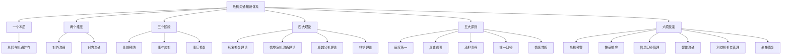
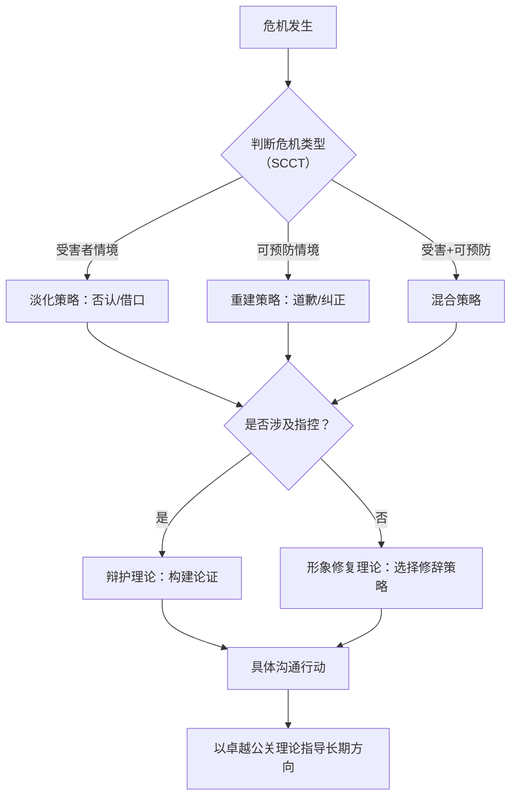
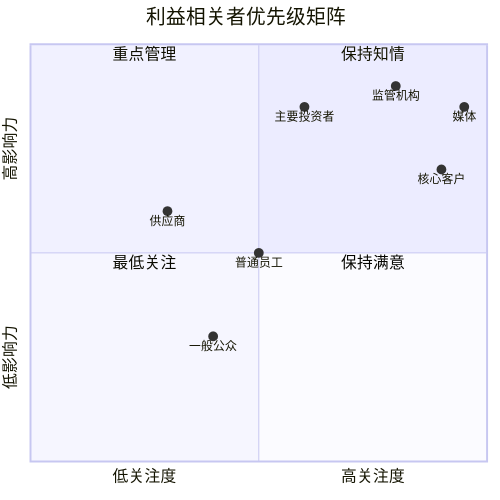
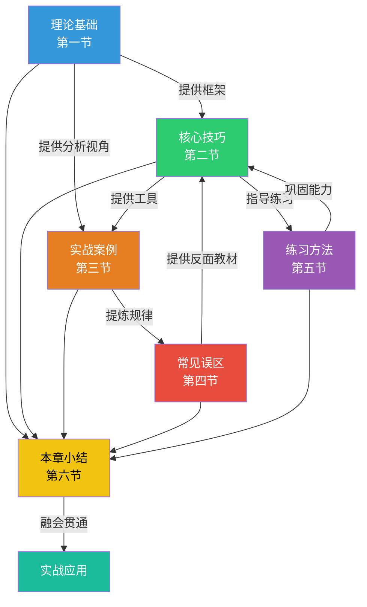

# 第六节：本章小结

危机沟通是沟通能力的"终极考场"——它同时考验你的信息管理能力、情绪控制能力、人际协调能力和战略思维能力。在平时的沟通中，你有充足的时间准备、修正和反思；但在危机中，你需要在信息不完整、情绪高涨、时间紧迫的条件下做出正确判断。这种能力不可能临时习得，它来自于系统的学习、反复的练习和深入的反思。

本章从理论基础、核心技巧、实战案例、常见误区和练习方法五个维度，系统构建了危机沟通的完整知识体系。本节将对全章内容进行结构化回顾，提炼核心方法论，建立知识之间的关联，并提供可落地的行动框架。

## 一、知识体系全景图

危机沟通的知识体系可以概括为"一个本质、两个维度、三个阶段、四大理论、五大原则、六项技能"的框架：

### 1.1 一个本质：危险与机遇的辩证统一

"危机"一词的中文构成——"危"与"机"——揭示了危机沟通的根本逻辑。危机不是单纯的灾难，而是组织在压力下的转型契机。这个认知决定了危机沟通的整体基调：不是被动防御，而是主动管理；不是掩盖问题，而是解决问题。

从组织行为学的角度看，危机的本质是一种"系统扰动"。它打破了组织原有的运营平衡，迫使组织面对平时被忽视的问题。那些能够将危机转化为改进动力的组织，往往在危机后变得更强。约翰·科特（John Kotter）在《领导变革》中指出，危机是组织变革最强有力的催化剂之一，因为它创造了"紧迫感"——而紧迫感是变革成功的前提条件。

这个本质认知在实战中具有指导意义。当你面对危机时，首先需要问的不是"如何让这件事过去"，而是"这件事暴露了什么深层问题，我们如何借此机会从根本上解决它"。前者导向的是"灭火"思维，后者导向的是"系统改进"思维。正如本章第一节所述，危机是检验组织沟通能力的终极考验，也是组织学习和成长的重要契机。

### 1.2 两个维度：对外沟通与对内沟通

危机沟通有两个常被忽视的维度：

**对外沟通**面向媒体、客户、监管机构、合作伙伴和公众，目标是维护组织声誉、控制事态发展、争取外部支持。对外沟通的核心挑战在于信息的"可控性"——你无法控制媒体如何报道，但可以控制自己说什么、怎么说、什么时候说。

**对内沟通**面向员工、管理层和董事会，目标是统一认知、稳定军心、协调行动。内部沟通的核心挑战在于"一致性"——如果员工从外部渠道获知的消息比从内部渠道获知的更多、更快，组织的公信力就会从内部瓦解。

| 维度 | 核心受众 | 关键目标 | 核心挑战 | 典型渠道 |
|------|----------|----------|----------|----------|
| 对外沟通 | 媒体、客户、监管机构、公众 | 维护声誉，控制事态 | 信息可控性 | 新闻发布会、官方声明、社交媒体 |
| 对内沟通 | 员工、管理层、董事会 | 统一认知，稳定军心 | 信息一致性 | 内部邮件、全员会议、管理层简报 |

一个常见的错误是"重外轻内"——只关注对外发声，忽视内部沟通。实际上，员工是组织最重要的"大使"。如果员工不了解组织的立场和行动，他们要么沉默（外界解读为"连自己人都不支持"），要么发出与官方口径不一致的信息（造成更大的混乱）。本章第四节"常见误区"中专门分析了"忽视内部沟通"这一常见错误及其应对策略。

### 1.3 三个阶段：事前、事中、事后

危机沟通在时间维度上分为三个阶段，每个阶段有不同的任务重心：

**事前阶段（潜伏期）**——核心任务是"防"。建立舆情监测体系，识别潜在风险，制定危机预案，进行模拟演练。这个阶段投入的精力和资源，决定了危机爆发后的应对质量。研究表明，拥有书面危机预案的组织，危机响应时间平均缩短60%，声誉损失减少40%以上。本章第二节"危机预警"详细阐述了如何构建预警体系、如何进行风险评估、如何制定危机预案。

**事中阶段（爆发期与蔓延期）**——核心任务是"控"。快速响应、信息发布、媒体应对、利益相关者沟通。这个阶段的核心矛盾是"速度与准确"——你需要在信息不完整的情况下做出判断和回应。解决这个矛盾的方法是"分阶段声明"：先发初步声明（表明态度），再发进展声明（通报事实），最后发完整声明（总结改进）。本章第二节"危机应对"和"信息发布"分别从响应策略和信息管理两个角度提供了详细的操作指南。

**事后阶段（恢复期）**——核心任务是"建"。信任重建、制度改进、能力提升、经验沉淀。这个阶段最容易被忽视，但恰恰是化"危"为"机"的关键。危机后的信任重建需要持续6-18个月，期间需要通过一系列可验证的行动来证明改变是真实的。本章第二节"形象修复"专门讨论了信任重建的四个维度和具体方法。

三个阶段不是割裂的，而是连续的、相互影响的。事前准备的质量决定了事中应对的效果，事中应对的效果决定了事后修复的难度。一个在事前阶段就建立了完善预警体系和危机预案的组织，在事中阶段可以更快、更准确地做出回应；而在事中阶段表现优秀的组织，在事后阶段可以更容易地重建信任。

### 1.4 四大理论模型及其应用场域

| 理论模型 | 核心思想 | 最佳应用场景 | 关键策略 |
|----------|----------|------------|----------|
| 形象修复理论（Benoit） | 组织有五种修辞策略可选 | 声誉受损后的形象管理 | 否认、逃避责任、减少负面、纠正行为、承认道歉 |
| 情境危机沟通理论（SCCT） | 策略应匹配危机类型 | 根据归因责任选择回应策略 | 受害者情境用淡化策略，可预防情境用重建策略 |
| 卓越公关理论（Grunig） | 双向对等沟通是最佳模式 | 长期公众关系管理 | 从单向宣传走向双向对话 |
| 辩护理论（Hearit） | 面对指控时的系统化应对 | 涉及道德或法律争议的危机 | 事实辩护、价值辩护、程序辩护 |

在实际操作中，这四种理论不是互相排斥的，而是互补的。面对一个具体危机时，可以先用情境危机沟通理论判断危机类型和归因程度，再用形象修复理论选择具体的修辞策略，同时以辩护理论构建事实层面的论证，最终以卓越公关理论指导沟通的长期方向。本章第一节"理论基础"对每种理论的历史渊源、核心假设、适用条件和局限性都进行了深入分析。

四大理论之间的关系可以用一个决策流程来理解：

### 1.5 五大核心原则

危机沟通的五大原则构成了行为准则体系：

**原则一：速度第一。** 危机爆发后的1-4小时是"黄金响应窗口"。在这个窗口期内，公众对信息的需求最迫切，信息真空最容易被谣言和猜测填充。即使尚不具备完整信息，也必须在窗口期内发出初步声明，表明"我们已知晓此事，正在积极处理"。沉默不是中性的——在危机语境中，沉默等同于默认、冷漠或心虚。

**原则二：真诚透明。** 真诚不是"表演出来的真诚"，而是基于事实的坦诚。公众能够识别"公关话术"和"真诚表达"的区别。真诚意味着承认问题的存在、承认组织的不足、承认改进需要时间。透明意味着在法律和商业允许的范围内，尽可能多地分享信息。

**原则三：承担责任。** "承担责任"不等于"承担所有责任"。它意味着对属于组织责任范围内的问题不推诿、不逃避，对需要改进的环节明确表态、拿出方案。推卸责任（如将问题归咎于个别员工或外部因素）通常会引发更大的反弹——公众会认为组织缺乏反省能力。

**原则四：统一口径。** 信息不一致是危机沟通中最致命的错误之一。当不同渠道、不同人员发布矛盾信息时，公众会对组织的信任彻底崩塌。统一口径的实现方式是建立"单一信息源"——由危机沟通团队统一制定口径文件，所有对外沟通都基于这份文件。

**原则五：情感共鸣。** 危机沟通不是法律声明，不能只讲事实和逻辑。公众在危机中的情绪反应是真实的，忽视这些情绪（如只说"我们会依法处理"而不表达歉意和关切）会被解读为冷漠。情感共鸣不是煽情，而是让受众感受到"你理解他们的感受"。

五大原则之间的关系并非并列，而是有层次的。速度是基础——没有速度，其他原则都无从发挥作用；真诚和承担责任是核心——它们决定了组织的基本态度；统一口径是保障——确保信息在传播过程中不失真；情感共鸣是升华——让冰冷的信息传递充满人性的温度。

### 1.6 六项核心技能

六项技能形成完整的危机沟通能力链条：

**技能一：危机预警。** 包括舆情监测（实时追踪社交媒体、新闻、论坛等渠道的异常信号）、风险评估（使用"可能性×影响度"矩阵对潜在危机进行分级）、预案制定（针对不同类型的危机制定详细的应对方案）。预警系统的目标不是消除危机——这是不可能的——而是尽可能缩短从"问题出现"到"组织知晓"的时间差。本章第二节"危机预警"详细介绍了舆情监测的工具、风险评估的模型和预案撰写的规范。

**技能二：快速响应。** 快速响应不等于草率响应。它要求在信息不完整的情况下，基于预案和判断快速做出初步回应。快速响应的实操框架是"30分钟内评估→1小时内决策→4小时内发布"。在这三步中，每一步都有明确的产出：评估产出是危机类型和影响范围的初步判断，决策产出是回应策略和核心口径，发布产出是正式的初步声明。本章第二节"危机应对"提供了详细的响应流程和话术模板。

**技能三：信息口径管理。** 信息口径管理的核心工具是"3×3"信息结构法——将每条信息组织为三个层次（核心信息、支撑信息、具体例证），每个层次包含三个要点。这个方法确保了信息的完整性和一致性。同时，口径文件需要包含"问与答"（Q&A）板块，预判媒体和公众可能提出的问题，准备好标准化的回答。本章第二节"信息发布"对口径文件的制作、分发和更新进行了详细说明。

**技能四：媒体沟通。** 媒体沟通的核心方法是"ABC法则"——承认（Acknowledge）、桥接（Bridge）、传达（Convey）。面对任何提问，先承认问题的重要性（表达尊重），再桥接到你想传达的信息上（掌握主动权），最后传达你的核心信息（实现目标）。新闻发布会的组织、记者一对一采访的应对、社交媒体的管理，都有具体的操作规范和话术模板。本章第二节"媒体沟通"专门讨论了与不同类型媒体打交道的策略和技巧。

**技能五：利益相关者管理。** 不同利益相关者在危机中的立场、诉求和影响力各不相同。员工关注岗位安全和组织前景，客户关注产品/服务质量是否受影响，媒体关注新闻价值和公众关切，监管机构关注合规性和公共安全，投资者关注财务影响和管理能力。需要根据影响力和关注度两个维度对利益相关者进行分类，制定差异化的沟通策略。本章第二节对每类核心利益相关者的沟通策略都有专门论述。

**技能六：形象修复。** 形象修复是一个长期过程，需要从四个维度持续投入：能力信任（证明组织有能力解决问题和防止再次发生）、善意信任（证明组织关心利益相关者的利益）、正直信任（证明组织的行为与价值观一致）、透明信任（证明组织愿意公开信息、接受监督）。本章第二节"形象修复"详细阐述了信任重建的四个维度和具体实施路径。

## 二、实战案例的共性规律

本章分析了八个覆盖不同危机类型的实战案例（参见本章第三节"实战案例"）。通过对这些案例的横向比较，可以提炼出以下共性规律：

### 2.1 速度与质量的平衡

| 案例类型 | 响应速度 | 沟通质量 | 最终结果 |
|----------|----------|----------|----------|
| 食品安全事件 | 快（2小时内） | 高（真诚道歉+具体措施） | 3个月恢复90%客流 |
| 产品召回 | 中等（24小时） | 高（技术解释+退换方案） | 品牌信任度反而提升 |
| 高管丑闻 | 慢（48小时后） | 低（含糊声明） | 股价持续下跌 |
| 数据泄露 | 快（6小时） | 中（承认问题但缺乏细节） | 用户流失率控制在5%以内 |
| 代言人失德 | 快（12小时） | 高（果断切割+价值观重申） | 品牌形象基本未受损 |

规律：速度和质量缺一不可。快速但敷衍的回应（如"我们正在调查"之后再无下文）和高质量但延迟的回应（如三天后发布详尽声明）都无法取得好的效果。最佳实践是在黄金窗口内发布态度明确的初步声明，随后分阶段补充信息和措施。

### 2.2 最高层参与的正向效应

在处理效果最好的案例中，组织最高领导人都亲自出面——不是简单的"签字声明"，而是以个人身份表达关切、承担责任、阐述改进方向。领导人的参与传递了一个重要信号：组织将危机视为最高优先级。这比任何公关话术都更有说服力。

食品安全事件案例中，企业CEO在危机爆发后4小时内录制了道歉视频，亲自到门店视察整改情况，并在社交媒体上实时更新进展。这种"躬身入局"的态度，比任何精雕细琢的公关声明都更能赢得公众的理解。

### 2.3 "言行一致"的乘数效应

在所有成功案例中，沟通和行动是同步推进的。宣布召回就立即启动召回流程，承诺整改就公开整改时间表，道歉就同时宣布具体的赔偿方案。"说到做到"产生信任的乘数效应——每一个兑现的承诺都会放大下一次承诺的可信度。反之，"只说不做"产生信任的衰减效应——每一次落空的承诺都会压低公众对组织的信任底线。

产品召回案例中，企业不仅在宣布召回的当天就启动了召回流程，还在官网公开了召回进度的实时仪表盘，让用户可以查询自己车辆的召回状态。这种"可验证的行动"是信任重建的基石。

### 2.4 从"灭火"到"系统改进"的思维升级

最成功的危机管理不是"平息事态"，而是借危机之力推动系统性改进。产品召回案例中，企业不仅解决了有缺陷的产品，还全面升级了质量管理体系；数据泄露案例中，机构不仅修复了安全漏洞，还重建了整个信息安全架构。这种"危机驱动的改进"往往比平时的渐进式改进更有深度和力度——因为危机创造了足够的紧迫感，打破了组织内部的惯性和阻力。

## 三、十大误区的深度解析与应对策略

本章第四节"常见误区"梳理了危机沟通中最常犯的十个误区。以下对每个误区进行深度解析，揭示其背后的心理机制，并给出具体的应对策略：

### 3.1 鸵鸟心态——等待危机自行消退

**心理机制：** 回避冲突的本能，以及"热度会过去"的侥幸心理。

**为什么错误：** 在社交媒体时代，"不回应"本身就是一种回应——外界会将其解读为"默认""不在乎""有隐情"。沉默的时间越长，公众填充的"故事"越不利于组织。

**应对策略：** 建立"最低限度回应"原则。即使无法在短时间内给出完整回答，也必须在黄金窗口内发出声明："我们已关注到此事，正在核实相关信息，将在X小时内提供进一步说明。"

### 3.2 过度辩解——将精力用在证明自己没错上

**心理机制：** 防御本能，以及"我没错就不该被指责"的公平感。

**为什么错误：** 公众在危机中的情绪反应是真实的，过度辩解会被解读为"不尊重公众感受""推卸责任"。即使组织在法律意义上没有过错，也需要对公众的损失和情绪表达理解和关切。

**应对策略：** 区分"法律回应"和"公关回应"。法律回应可以强调无过错，但公关回应必须先表达关切和同情，再解释事实。两条线可以并行，但不能混为一谈。

### 3.3 信息不一致——不同渠道发布矛盾信息

**心理机制：** 组织内部缺乏协调机制，各部门各自为战。

**为什么错误：** 信息不一致直接摧毁组织的公信力。当公众发现"官方说法前后矛盾"或"不同部门说法不同"时，对组织的信任会瞬间归零。在社交媒体时代，矛盾信息会被截图、对比、放大，成为新的危机焦点。

**应对策略：** 建立"单一信息源"制度——所有对外信息由危机沟通团队统一审核和发布。制定口径文件，对关键信息的表述进行标准化，并确保所有相关人员知晓并遵守。口径文件应包含"标准表述"和"禁用表述"两部分，避免不同人员在措辞上的偏差。

### 3.4 忽视社交媒体——只关注传统媒体

**心理机制：** 对传统媒体的路径依赖，低估社交媒体的传播力和影响力。

**为什么错误：** 如今大多数危机的首发渠道是社交媒体，而非传统媒体。忽视社交媒体等于放弃了危机信息的第一阵地。更严重的是，社交媒体上的信息传播速度远超传统媒体——一条微博可以在几小时内触达数千万人，而一篇报纸文章需要等到次日才能见报。

**应对策略：** 建立社交媒体监测和响应机制，配备专门的社交媒体沟通团队，在危机期间保持社交媒体的高频互动和信息更新。社交媒体沟通需要遵循"快、短、真"三个原则：响应要快（分钟级）、内容要短（适应碎片化阅读）、态度要真（避免官腔套话）。

### 3.5 缺乏同理心——只讲事实不讲感受

**心理机制：** "理性人假设"——认为只要摆出事实，公众就会理解。

**为什么错误：** 人在危机中的决策是情感驱动的。纯事实的回应无法满足公众的情感需求，反而会被解读为"冷漠""机械""不真诚"。神经科学研究表明，人在高压情境下的决策主要由杏仁核（情绪中枢）驱动，而非前额叶（理性中枢）。

**应对策略：** 在所有危机声明中加入"情感要素"——承认公众的感受（"我们理解大家的担忧和不安"），表达组织的关切（"对此我们深感抱歉"），承诺行动（"我们将全力确保此类事件不再发生"）。情感要素应放在声明的开头，而非结尾——先共情，再解释，最后承诺。

### 3.6 推卸责任——寻找替罪羊

**心理机制：** 自我保护本能，以及"快速给公众一个交代"的压力。

**为什么错误：** 推卸责任是所有危机回应策略中效果最差的一种。公众不关心"是谁的错"，他们关心"你会怎么解决"。寻找替罪羊不仅无法平息危机，还会引发对组织文化的质疑——"如果出了问题就甩锅给员工，这个组织的管理一定有问题"。

**应对策略：** 在危机初期，将注意力放在"正在做什么"而不是"这是谁的责任"上。内部的责任追究可以在危机平息后进行，但对外沟通应始终聚焦于解决方案。即使确实存在个别人员的失误，对外表述也应该是"我们对流程和管理中存在的漏洞进行检讨"，而非"这是某某的个人行为"。

### 3.7 反应过度——小题大做引发更大关注

**心理机制：** "宁可过度也不要不足"的过度防御心理。

**为什么错误：** 过度反应会放大危机的严重性，引起原本不受影响的群体的关注。原本可能只是一个局部问题，过度反应将其变成了全网事件。

**应对策略：** 在快速响应之前，先进行准确的危机评估——判断问题的影响范围、严重程度和发展趋势。根据评估结果匹配回应的规模和力度，避免"用大炮打蚊子"。评估的核心指标包括：受影响人数、传播范围、情绪烈度、是否有上升趋势。当所有指标都指向"局部问题"时，应采用局部回应策略；只有当指标指向"系统性问题"时，才需要全面回应。

### 3.8 忽视内部沟通——只关注对外发声

**心理机制：** 公关导向思维——认为"危机管理=媒体管理"。

**为什么错误：** 员工不仅是利益相关者，更是信息传播者。如果员工从外部渠道获知的消息比从内部获知的更多更快，他们会对组织失去信任，并可能在外部发出不一致的声音。

**应对策略：** 在发布任何对外声明之前或同步，向内部发布相应的通报。设立内部信息热线或FAQ页面，让员工有渠道了解最新进展和组织的立场。内部通报的内容应比对外声明更详细——员工需要知道更多背景信息，才能在面对外部询问时做出一致的回应。

### 3.9 急于恢复正常——过早宣布危机结束

**心理机制：** "翻篇"心理——希望尽快摆脱危机的压力。

**为什么错误：** 过早宣布危机结束会被解读为"自满""不认真"。如果后续出现反复，组织将面临更大的公信力危机。

**应对策略：** 不设"危机结束"的硬性时间节点。改为发布"阶段性进展通报"——"截至目前，我们已完成X项整改，但仍将持续监测和改进。"只有当所有公开承诺都已兑现、所有受影响方都已得到妥善处理、舆情持续平稳超过30天时，才可以考虑从"危机模式"转为"常态模式"。

### 3.10 忽视长期修复——不从危机中学习

**心理机制：** 危机结束后，组织本能地想"回到正轨"，而非投入资源进行复盘。

**为什么错误：** 不从危机中学习意味着同样的问题会重复发生。每次危机都是一次宝贵的组织学习机会，浪费这个机会是对危机的最大"浪费"。

**应对策略：** 在危机平息后30天内进行正式的"危机复盘"（After Action Review）。复盘应覆盖四个问题：发生了什么？我们做得好的是什么？我们可以改进的是什么？我们需要做出哪些制度性改变？复盘结果应形成书面报告，并转化为具体的改进计划——包括流程修订、培训计划和预警机制升级。

## 四、能力评估矩阵

下表提供了一个危机沟通能力的自评框架，涵盖六个核心技能维度，每个维度分为四个能力等级。对照此表，可以快速定位自己当前的能力水平和发展方向：

| 能力维度 | 入门级（知道） | 进阶级（能做） | 熟练级（做好） | 专家级（能教） |
|----------|---------------|---------------|---------------|---------------|
| 危机预警 | 了解舆情监测的基本概念 | 能使用工具进行基础舆情监测 | 能建立系统化的预警体系 | 能设计组织级的风险评估框架 |
| 快速响应 | 知道"黄金时间"的重要性 | 能在规定时间内发出初步声明 | 能在压力下快速制定回应策略 | 能指导团队建立响应流程 |
| 信息口径 | 理解统一口径的重要性 | 能基于模板撰写口径文件 | 能根据情境灵活调整口径 | 能设计组织的信息管理体系 |
| 媒体沟通 | 了解基本的媒体应对原则 | 能运用ABC法则应对采访 | 能主动策划媒体沟通活动 | 能培训团队的媒体沟通能力 |
| 利益相关者 | 知道不同受众有不同需求 | 能进行基础的利益相关者分析 | 能制定差异化的沟通策略 | 能管理复杂的多方利益博弈 |
| 形象修复 | 了解信任重建的基本理念 | 能执行既定的形象修复方案 | 能设计系统性的信任重建计划 | 能从战略层面管理组织声誉 |

使用方法：逐行评估自己当前所处的等级，找出最薄弱的维度（等级最低的维度），将其作为下一阶段学习的重点。能力提升的路径不是"所有维度同步提升"，而是"先补齐短板，再强化长板"。

## 五、核心方法论速查

以下是危机沟通中最关键的方法论工具，可在实战中直接使用：

### 5.1 "30-60-240"快速响应框架

- **30分钟**：危机识别与初步评估（判断危机类型、影响范围、紧急程度）
- **60分钟**：策略决策与口径制定（确定回应策略、撰写初步声明、分配沟通任务）
- **240分钟（4小时）**：正式声明发布（通过适当渠道发布正式声明，启动利益相关者沟通）

这个框架的核心不是"时间限制"，而是"产出导向"。每个时间节点都对应明确的产出物，确保响应过程有条不紊。

### 5.2 "3×3"信息结构法

每条核心信息由三个层次组成：
- **第一层：核心结论**（1句话概括你想传达的核心信息）
- **第二层：支撑论据**（3个支撑核心结论的关键事实或数据）
- **第三层：具体例证**（每个论据配1个具体的案例、数据或行动）

示例：

> **核心结论**：我们已第一时间启动召回程序，确保所有受影响用户的安全。
>
> **支撑论据**：
> 1. 截至今日，已联系到85%的受影响用户
> 2. 全国120家服务网点已做好召回准备
> 3. 替代产品已在物流配送中，预计3天内到达
>
> **具体例证**：
> 1. 昨日已为北京地区200位用户完成了产品更换
> 2. 上海旗舰店延长营业时间至晚10点，方便上班族办理
> 3. 每位完成更换的用户将收到一封确认邮件和满意度回访

### 5.3 "ABC"媒体应对法则

- **A（Acknowledge）承认**：承认提问的价值和重要性，表达对公众关切的理解
- **B（Bridge）桥接**：自然过渡到你想传达的信息，掌握话语权
- **C（Convey）传达**：清晰传达你的核心信息，确保受众接收到你想传递的内容

示例：

> **记者问**："有传言说你们的产品存在安全隐患，但你们一直拒绝承认，是不是在隐瞒什么？"
>
> **ABC回应**：
> - A："您提到的这个问题非常重要，我们完全理解消费者对此的担忧。"（承认）
> - B："事实上，我们从发现问题的第一天起就在积极调查和处理。"（桥接）
> - C："截至今天，我们已经完成了对全部批次的检测，确认受影响的范围仅限于XX批次，并已启动了定向召回程序。"（传达）

### 5.4 利益相关者优先级矩阵

- **高影响力+高关注度**（如监管机构、媒体）：重点管理，保持高频、深度沟通
- **高影响力+低关注度**（如主要投资者、供应商）：保持满意，定期通报关键进展
- **低影响力+高关注度**（如核心客户、一般公众）：保持知情，通过公开渠道统一发布信息
- **低影响力+低关注度**（如一般公众）：最低关注，必要时通过常规渠道覆盖

注意：媒体在危机中同时具有高关注度和高影响力，是需要"重点管理"的利益相关者。媒体的报道可以直接影响公众认知、监管态度和投资者信心，因此必须将其放在优先级矩阵的高位。

### 5.5 危机复盘"四问法"

危机平息后的30天内，组织正式复盘：

1. **发生了什么？**（时间线还原：从危机苗头到完全平息的完整过程）
2. **我们做得好的是什么？**（保留和强化有效的做法）
3. **我们可以改进的是什么？**（识别不足和失误，但不追究个人责任）
4. **我们需要做什么制度性改变？**（将经验教训转化为流程、制度和培训的改进）

复盘的关键原则是"对事不对人"。如果复盘变成了追责会，参与者就会倾向于隐瞒信息、推卸责任，复盘就失去了学习价值。复盘的目的是改进系统，而非惩罚个人。

## 六、实践行动路线图

将危机沟通能力的培养分为四个阶段，每个阶段有明确的目标、行动和验收标准：

### 6.1 第一阶段：认知构建（第1-4周）

**目标：** 建立危机沟通的基本认知框架

| 行动 | 具体做法 | 验收标准 |
|------|----------|----------|
| 案例日志 | 每天记录并分析1个危机沟通案例 | 累计完成30个案例分析 |
| 自我评估 | 使用能力评估矩阵进行基线评估 | 完成六个维度的等级评定 |
| 理论学习 | 系统学习四大理论模型 | 能运用理论解释实际案例 |
| 预警检查 | 检查所在组织的预警机制现状 | 形成书面评估报告 |

### 6.2 第二阶段：技能训练（第5-12周）

**目标：** 掌握六项核心技能的基本操作

| 行动 | 具体做法 | 验收标准 |
|------|----------|----------|
| 模拟演练 | 每月进行1次完整的模拟危机演练 | 完成至少4次演练 |
| 预案撰写 | 为所在组织撰写危机沟通预案 | 形成可操作的书面预案 |
| 口径练习 | 针对常见危机类型撰写口径文件 | 完成至少10份口径文件 |
| 媒体练习 | 录制模拟采访视频并复盘 | 完成至少6次模拟采访 |

### 6.3 第三阶段：实战应用（第13-24周）

**目标：** 在真实或准真实情境中运用危机沟通技能

| 行动 | 具体做法 | 验收标准 |
|------|----------|----------|
| 案例库建设 | 建立个人危机沟通案例库 | 积累50个以上深度案例 |
| 策略制定 | 独立完成危机沟通方案撰写 | 完成至少10份完整方案 |
| 媒体实战 | 参与实际的媒体沟通活动 | 能从容应对记者采访 |
| 压力训练 | 在高压环境下进行快速决策训练 | 能在30分钟内制定初步策略 |

### 6.4 第四阶段：体系输出（第25-52周）

**目标：** 形成个人方法论，具备指导他人的能力

| 行动 | 具体做法 | 验收标准 |
|------|----------|----------|
| 方法论沉淀 | 将实践经验转化为方法论文档 | 形成个人危机沟通手册 |
| 团队培训 | 为团队或组织进行危机沟通培训 | 完成至少2次正式培训 |
| 复杂场景 | 处理多方利益相关者的复杂危机 | 独立完成至少3个复杂场景 |
| 持续迭代 | 从每次实践中复盘和改进 | 建立持续改进的循环机制 |

## 七、关键工具与资源清单

### 7.1 危机沟通工具箱

| 工具类别 | 具体工具 | 用途 | 推荐指数 |
|----------|----------|------|----------|
| 舆情监测 | 微博热搜监控、百度指数、微信指数、NewRank、清博大数据 | 实时追踪舆情动态 | ★★★★★ |
| 信息管理 | 飞书/钉钉文档协作、腾讯文档、Notion | 统一口径文件的协作编辑和分发 | ★★★★☆ |
| 媒体管理 | 媒体联系人数据库、新闻稿分发平台（美通社、新闻稿网） | 快速联络和信息分发 | ★★★★☆ |
| 内部沟通 | 企业微信/钉钉群组、内部邮件系统、Slack | 内部信息通报和口径传达 | ★★★★☆ |
| 复盘工具 | 思维导图（XMind、幕布）、时间线工具、鱼骨图 | 危机复盘和根因分析 | ★★★☆☆ |
| 社交媒体管理 | 微博企业号后台、微信公众平台、抖音企业号 | 社交媒体信息的统一发布和监测 | ★★★★★ |

### 7.2 值得持续关注的学习资源

- **学术期刊**：《Public Relations Review》《Journal of Communication》《危机管理学报》
- **经典著作**：W. Timothy Coombs《Ongoing Crisis Communication》、Benoit《Accounts, Excuses, and Apologies》、翁秀琪《危机传播与沟通》
- **行业报告**：爱德曼信任度调查报告（Edelman Trust Barometer）、中国互联网络信息中心（CNNIC）报告、中国社科院《社会蓝皮书》
- **案例库**：PRWeek危机案例分析、哈佛商学院危机管理案例集、中国公共关系网案例库

## 八、本章各节知识关联图

下图展示了本章各节内容之间的逻辑关系，帮助读者建立完整的知识网络：

## 结语

危机沟通是一门需要在实践中不断打磨的能力。理论学习提供了分析框架，案例研究提供了经验参照，但真正的成长来自于实践——在压力下做出判断，在质疑中坚持真诚，在混乱中保持秩序。

本章构建的知识体系——一个本质、两个维度、三个阶段、四大理论、五大原则、六项技能——是一个完整的框架，但不是一个僵化的公式。在实际应用中，需要根据具体的危机类型、组织特征和文化背景灵活运用。框架的价值不在于"照搬"，而在于"提供思考的起点和验证的标准"。

最后，回顾危机沟通最根本的一条原则：**人是核心**。所有的技巧、工具和方法论，最终服务的目标是"与人沟通"。在危机中，人们需要的不仅是信息，更是理解和尊重。一个能够真诚面对公众、承担责任、持续改进的组织，即使在最严重的危机中，也能找到重建信任的道路。

> **危机是检验组织沟通能力的终极考验，也是组织学习和成长的重要契机。能否化危为机，取决于准备的深度、应对的速度和反思的力度。**

***
