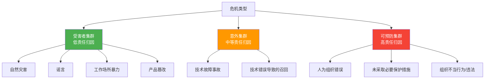
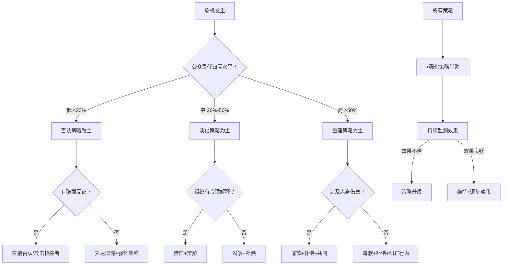
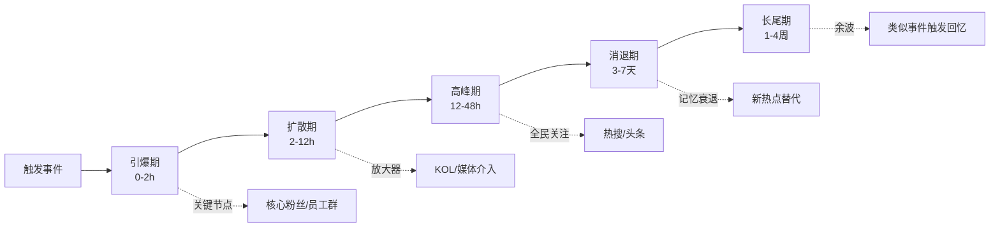
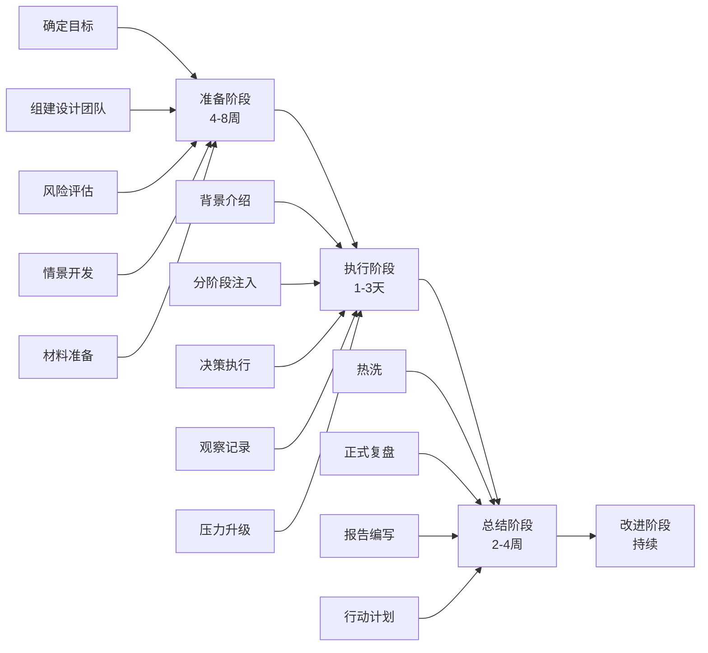
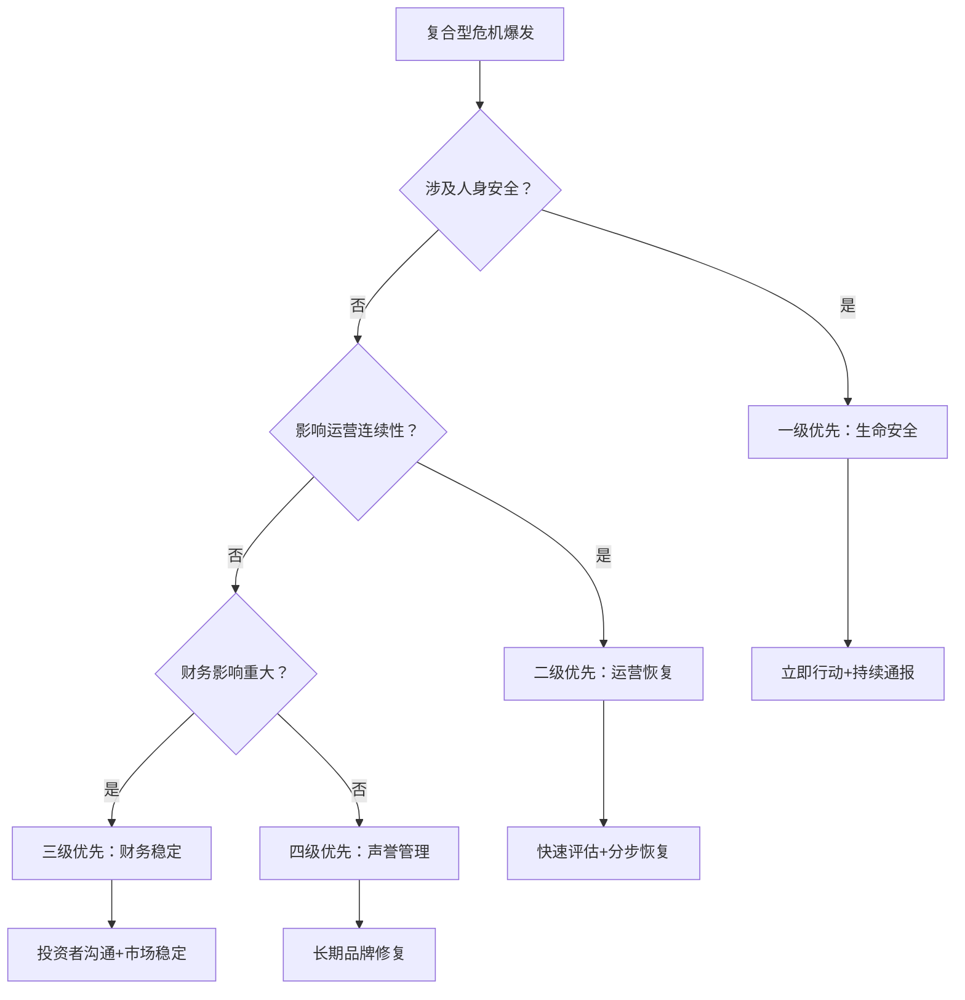

# 危机沟通 — 深度拓展

> 本章从理论根基、实证研究、前沿工具三个维度全面剖析危机沟通。内容涵盖SCCT理论的完整知识体系与最新研究进展、社交媒体时代的危机传播动力学、危机后组织学习的系统方法论、七大行业的危机沟通特点与实操策略、危机模拟训练的全流程设计、国际危机沟通的文化比较，以及AI、复合型危机等前沿议题。每个知识点均配有理论依据、实操步骤、真实案例和常见误区，力求道法术器贯通。

***

## 一、SCCT理论的实证研究

### 1.1 情境危机沟通理论概述

情境危机沟通理论（Situational Crisis Communication Theory, SCCT）由W. Timothy Coombs于1995年提出，是危机沟通研究领域最具影响力的理论框架之一。SCCT的核心假设是：**组织应该根据危机情境选择合适的回应策略，以保护组织声誉**。这一假设建立在Weiner的归因理论基础之上——公众对危机事件的因果归因决定了他们的情感反应和行为意向。

SCCT的理论演进经历了三个关键阶段：

| 阶段 | 时间 | 核心贡献 | 代表文献 |
|------|------|----------|----------|
| 萌芽期 | 1995-2000 | 提出基本框架：危机类型→责任归因→回应策略 | Coombs, 1995; Coombs & Holladay, 1996 |
| 成熟期 | 2001-2015 | 引入先前关系声誉、危机历史等调节变量 | Coombs, 2004, 2007; Coombs & Holladay, 2001, 2006 |
| 拓展期 | 2016至今 | 融入社交媒体动态、跨文化比较、AI辅助决策 | Coombs & Holladay, 2021; Zhang & Li, 2022 |

SCCT将危机定义为"对组织声誉构成威胁的突发事件"。这里的"声誉"不是抽象概念，而是利益相关者对组织过去行为的整体评价。声誉越好，公众对组织的初始信任越高，危机造成的声誉落差也越大。SCCT的关键变量包括三个：

- **危机责任（Crisis Responsibility）**：公众认为组织对危机应承担多大责任
- **声誉威胁（Reputational Threat）**：危机对组织声誉的损害程度
- **回应策略（Response Strategy）**：组织采取的沟通行动

三者之间的因果链为：危机类型 → 危机责任归因 → 声誉威胁程度 → 应回应策略强度。

### 1.2 SCCT的危机类型分类

SCCT将危机类型分为三大集群，每个集群对应不同的公众责任归因水平：

**受害者集群（Victim Cluster）**：组织也是危机的受害者，公众对组织的危机责任归因较低（通常低于20%）。这个集群的关键特征是危机的外源性——威胁来自组织外部，组织无力控制。

- **自然灾害**：地震、洪水、台风等自然灾害对组织运营的影响。例如2011年东日本大地震导致丰田汽车全球供应链中断，但公众普遍认为丰田是受害者而非责任方。
- **谣言**：关于组织的虚假信息传播。典型案例是2008年可口可乐被谣传产品含致癌物质，后经权威机构检测澄清。
- **工作场所暴力**：组织员工或前员工在工作场所实施的暴力行为。2019年弗吉尼亚海滩市政厅枪击案中，市政当局被视为受害者。
- **产品篡改**：第三方蓄意篡改产品导致的安全问题。1982年泰诺投毒案是经典案例——强生公司面对第三方篡改产品导致的死亡事件，采取了全面召回和透明沟通策略，反而赢得了公众信任。

**意外集群（Accidental Cluster）**：危机是由组织的无意失误导致的，公众对组织的危机责任归因中等（通常在20%-50%之间）。

- **技术故障导致的事故**：设备老化、技术缺陷等非故意因素导致的安全事故。2010年英国石油公司（BP）墨西哥湾漏油事故中，虽然事故起因是技术故障，但BP因后续应对不力被归入可预防集群。
- **技术错误导致的产品召回**：设计缺陷或制造工艺问题导致的产品安全隐患。2016年三星Galaxy Note 7电池自燃事件，初始被归类为意外集群，但随着更多证据表明三星在知情情况下仍发货，归因逐渐向可预防集群移动。

**可预防集群（Preventable Cluster）**：危机是由组织的故意行为或明知风险却不采取行动导致的，公众对组织的危机责任归因最高（通常超过50%）。

- **人为造成的组织错误**：管理层明知风险却选择忽视或隐瞒。2015年大众汽车排放门事件中，大众故意在柴油车中安装作弊软件以通过排放测试，属于典型的可预防危机。
- **未采取必要措施保护利益相关者**：组织知道风险存在但未采取合理预防措施。2018年Facebook-Cambridge Analytica数据丑闻中，Facebook明知第三方应用大规模收集用户数据却未采取有效防护。
- **组织不当行为**：欺骗、违法行为等。2001年安然公司财务造假案导致公司破产，高管入狱。

**重要提醒**：危机分类不是静态的。随着新证据出现或组织应对不当，危机可能从一个集群"滑向"另一个集群。三星Note 7就是典型——初始的电池技术故障（意外集群）因为三星隐瞒信息和仓促推出替换机再次自燃，被公众重新归因为可预防集群。这提醒管理者：**危机分类的决定权在公众手中，不在组织手中**。

#### 危机动态滑移的识别信号

| 滑移信号 | 具体表现 | 应对措施 |
|----------|----------|----------|
| 新证据出现 | 调查发现组织事先知情 | 立即调整策略，升级回应强度 |
| 组织回应失当 | 否认被证据推翻、态度傲慢 | 更换发言人，调整沟通基调 |
| 次生危机爆发 | 善后处理引发新投诉 | 独立评估，追加回应措施 |
| 利益相关者升级 | 消费者转向诉讼、监管介入 | 法务与公关协同应对 |
| 舆论叙事转变 | 媒体框架从"意外"转向"人祸" | 主动提供新信息，引导叙事方向 |

### 1.3 SCCT回应策略矩阵

SCCT提出了一套系统的回应策略体系，按防御性从低到高排列。理解策略的梯度特征是正确应用SCCT的前提：

| 策略类型 | 防御性 | 适用场景 | 核心逻辑 | 法律风险 |
|----------|--------|----------|----------|----------|
| 否认策略 | 最高 | 受害者集群 | "这不是我们的问题" | 低（但事实不符则极高） |
| 淡化策略 | 较高 | 意外集群 | "问题没有看起来那么严重" | 中等 |
| 重建策略 | 较低 | 可预防集群 | "我们承担全部责任" | 较高（道歉可能被用作证据） |
| 强化策略 | 最低 | 辅助性策略 | "请相信我们的善意" | 低 |

**否认策略（Denial Strategies）**——适用于危机责任归因最低的情境：

- **攻击指控者**：质疑危机指控的可信性，指出指控者的动机或证据缺陷。适用条件极为严格——仅当指控确实缺乏事实基础时才可使用。滥用此策略会严重损害组织公信力。2017年美国部分政客对媒体"假新闻"的攻击即属此类，短期内有效但长期损害信任。
- **直接否认**：明确否认危机的存在或组织的关联。要求组织有确凿证据支持否认立场。
- **替罪羊**：将责任归咎于外部因素或第三方。需要注意的是，替罪羊策略的使用必须有事实依据——如果被证明是甩锅，后果比不回应更严重。

**淡化策略（Diminish Strategies）**——适用于中等危机责任归因：

- **借口（Excuse）**：否认意图或降低危机的严重性。常见表述："我们从未有意伤害任何消费者""事故的发生完全超出预期"。借口策略的核心是降低公众对组织"主观恶意"的判断。
- **辩解（Justification）**：最小化对利益相关者的伤害，或强调组织行为的合理性。例如："受影响的产品数量不到总量的0.01%""我们在第一时间启动了应急预案"。

**重建策略（Rebuild Strategies）**——适用于高危机责任归因：

- **补偿（Compensation）**：为受害者提供金钱或实物补偿。补偿的力度应当与损害程度匹配——补偿不足会被视为敷衍，过度补偿可能被视为心虚。2017年美联航暴力拖拽乘客下机事件后，美联航对受害乘客进行了高额赔偿并修改了超售政策。
- **道歉（Apology）**：承认错误并请求原谅。道歉是最具争议的策略——一方面，真诚的道歉可以显著修复声誉；另一方面，道歉可能被用作法律诉讼中的不利证据。Coombs建议道歉应包含五个要素：承认事实、承认责任、表达悔意、承诺改进、请求原谅。

**强化策略（Bolstering Strategies）**——作为辅助策略与其他策略配合使用：

- **提醒（Reminder）**：提醒公众组织过去的善行和社会贡献。适合在危机责任较低时唤起公众对组织的好感。
- **讨好（Ingratiation）**：赞美利益相关者的理解和支持。例如："感谢广大用户在此次事件中对我们的信任和耐心"。
- **共鸣（Mourning）**：表达对受害者的同情和悲痛。在涉及人身伤害的危机中尤为重要——如果组织只关注自身声誉而忽视受害者感受，会引发更大的公众愤怒。

#### 策略选择决策流程图

### 1.4 SCCT的实证研究进展

近年来，SCCT的实证研究取得了显著进展，主要集中在以下五个方向：

**危机责任与声誉的关系**：大量实验证实，危机责任越高，组织声誉受损越严重。但2019年Meta分析研究（涵盖127项实验，总样本量超过50,000）揭示了更细致的机制：这种关系受到三个中介变量的调节——

1. **愤怒情绪**：高危机责任引发的愤怒情绪是声誉损害的最强预测因子，其解释力超过责任归因本身
2. **信任违背类型**：能力违背（"你们不够专业"）和诚信违背（"你们不诚实"）对声誉的损害模式不同——诚信违背的修复难度是能力违背的3-5倍
3. **感知控制力**：公众认为组织对危机的控制力越强，责任归因越严厉。即使是意外事件，如果公众认为组织"本应预防"，责任归因也会升高

**回应策略的有效性**：实证研究总体支持SCCT的"匹配假设"——高危机责任情境下，重建策略（尤其是道歉+补偿的组合）更有效。但2021年的一项跨文化元分析发现了重要修正：道歉策略在东亚文化中的效果显著优于西方文化（效应量d=0.72 vs d=0.41），而补偿策略在个人主义文化中效果更好。这意味着"一刀切"的回应策略注定低效。

**危机历史的影响**：Coombs和Holladay的系列实验发现，当组织有类似危机的历史时，公众会形成"连环犯"归因——"你们上次就出过同样的问题，说明这是系统性的管理失败"。这种归因会导致：
- 危机责任归因提高30%-50%
- 公众对组织回应策略的信任度降低40%
- 补偿需求提高60%以上

**先前关系声誉的保护作用**：组织在危机前建立的良好声誉可以作为"声誉银行"的储蓄，在危机时提取。但这种保护有三个限制条件：
1. 声誉类型必须与危机类型相关——产品安全声誉不能保护财务诚信危机
2. 保护作用随危机严重程度增加而衰减，存在"断裂点"
3. 如果组织在危机中的回应与先前声誉不一致（例如一贯"以人为本"的企业在危机中冷漠回应），反噬效应比没有声誉基础更严重

**跨文化适用性**：SCCT在不同文化背景下的适用性是近年研究的热点。核心发现包括：

| 文化维度 | 对危机沟通的影响 | 研究支撑 |
|----------|------------------|----------|
| 高集体主义 | 对道歉的接受度更高，"给面子"的回应更有效 | Huang et al., 2020 |
| 高权力距离 | 组织权威的声明更具说服力，但公众期望更高层级出面 | Park & Reber, 2019 |
| 高不确定性回避 | 公众对详细解释和数据支撑的需求更强 | Coombs & Holladay, 2021 |
| 长期导向 | 公众更关注组织的长期改进承诺而非即时补偿 | Zhang & Li, 2022 |

### 1.5 SCCT的理论批评与前沿发展

SCCT虽然影响力巨大，但也面临五个主要批评：

**批评一：过度线性化**。SCCT假设"危机类型→责任归因→策略选择"的线性因果链，但现实中的危机往往是多类型交织、动态演变的。一个初始被归为"技术故障"的危机可能因为组织隐瞒信息而升级为"可预防"危机。

**批评二：忽视利益相关者异质性**。SCCT将"公众"视为同质群体，但不同利益相关者（消费者、员工、投资者、监管者）对同一危机的归因和期望可能截然不同。员工可能更关注工作保障，投资者更关注股价影响，消费者更关注产品安全。

**批评三：对社交媒体动态考虑不足**。SCCT诞生于传统媒体主导的时代，其理论模型假设信息由组织单向传递。但社交媒体创造了多中心、去层级化的信息传播网络，危机的"真相"是通过多方博弈动态建构的。

**批评四：静态视角**。SCCT主要关注危机的某个时间截面，较少考虑回应策略的时序组合——在危机不同阶段（爆发期、蔓延期、消退期）应该采取不同的策略组合。

**批评五：文化嵌入性不足**。虽然近年有跨文化研究，但SCCT的核心框架仍以西方（特别是美国）文化为默认背景，对非西方文化中"沉默回应""第三方调解""关系修复"等策略的解释力不足。

**前沿发展方向**：

为回应这些批评，研究者提出了多种理论修正路径：

1. **SCCT+形象修复理论（IRT）整合**：将Benoit的形象修复策略（否认、逃避责任、降低负面性、纠正行为、承认+道歉）与SCCT的策略矩阵整合，构建更全面的策略选择框架
2. **动态SCCT模型**：引入时间维度，构建"危机阶段×责任归因×回应策略"的三维决策矩阵
3. **网络化SCCT**：将社交网络分析方法引入SCCT，考察关键意见领袖、回声室效应、信息级联等网络机制对危机传播的影响
4. **计算SCCT**：利用自然语言处理和机器学习技术，实现实时危机归因分析和策略推荐

***

## 二、危机沟通中的社交媒体动态

### 2.1 社交媒体对危机传播的范式转变

社交媒体从根本上改变了危机传播的格局，创造了三个范式转变：

**从单向传播到多中心网络**：传统的危机传播模型（Lasswell的线性模型、Shannon-Weaver的编码-解码模型）假设信息由组织单向传递给媒体和公众。社交媒体打破了这种单向结构——每个人既是信息接收者，也是信息生产者和传播者。危机信息在社交媒体上形成的不是"传播链"，而是"传播网"。

**从信息稀缺到信息过载**：传统媒体时代，公众获取危机信息的渠道有限。社交媒体时代，公众面对的是信息洪流——同一个危机事件可能有数百个信息源、数千条相关帖子。这意味着组织不仅要发布信息，还要在信息噪声中确保自己的声音被听到。

**从延迟反馈到即时反应**：传统媒体环境下，组织有相对充裕的时间准备回应。社交媒体上，公众反应是即时的——危机事件发生后数分钟内，社交媒体上就会出现大量评论、转发和情绪表达。组织的每一个小时的沉默都会被解读为"默认""不在乎""心虚"。

**传播速度的量化数据**：

| 指标 | 传统媒体时代 | 社交媒体时代 | 倍数 |
|------|-------------|-------------|------|
| 危机信息触达10万人所需时间 | 4-12小时 | 10-60分钟 | 10-100x |
| 公众首次反应时间 | 24-72小时 | 1-4小时 | 10-20x |
| 信息变异/失真率 | 20-30% | 50-70% | 2-3x |
| 长尾传播持续时间 | 3-7天 | 1-4周 | 3-5x |
| 组织回应窗口期 | 24-48小时 | 1-2小时 | 20-50x |
| 舆论反转概率 | <10% | 30-50% | 3-5x |

### 2.2 社交媒体危机传播的三大模型

**病毒式传播模型**：危机信息通过社交网络的裂变式传播迅速扩散，传播曲线呈指数型增长。病毒式传播的核心驱动力是**情感强度**——研究表明，愤怒、恐惧、惊奇等高唤醒情绪的内容被分享的概率是低唤醒情绪（如悲伤）的2-3倍。这意味着负面的危机信息天然比正面的回应信息更容易传播，组织在信息传播上处于结构性劣势。

**网络化传播模型**：强调危机信息在社交网络中的传播遵循特定的网络结构规律。关键节点（KOL、媒体账号、行业大V）在信息扩散中起"放大器"作用——一条被百万粉丝KOL转发的帖子，其影响力可能超过组织官方账号的十次发布。网络化传播模型揭示了一个关键洞察：**危机沟通的本质不是组织与公众的对话，而是组织在社交网络中与无数节点的影响力博弈**。

**意义建构模型**：社交媒体不仅是危机信息的传播渠道，更是危机"意义"的建构场所。同一个事实，在不同的叙事框架下会被赋予完全不同的含义。例如，一家企业裁员500人，可以被框架为"优化组织结构、提升效率"，也可以被框架为"资本家不顾员工死活"。在社交媒体上，哪种叙事框架占主导，取决于各方的叙事能力和传播资源。

#### 危机信息传播生命周期

### 2.3 平台差异与策略矩阵

不同社交媒体平台的用户群体、内容形式和传播机制存在显著差异，危机沟通需要"一平台一策略"：

| 平台类型 | 代表平台 | 传播特性 | 危机沟通策略 | 响应时间要求 |
|----------|----------|----------|-------------|-------------|
| 微博/推特型 | 微博、Twitter/X | 短文本、热搜机制、快速传播 | 第一时间发布简短声明，引导话题方向 | 30分钟内 |
| 社区/论坛型 | 知乎、Reddit | 深度讨论、长回答、社区投票 | 发布详细的技术说明和数据支撑 | 2-4小时内 |
| 短视频型 | 抖音、TikTok | 视觉化、情绪化、算法推荐 | 制作简明的解释视频，高管出镜 | 2-6小时内 |
| 即时通讯型 | 微信群、WhatsApp | 私域传播、信任度高、难监控 | 通过KOL和社群管理员引导 | 持续监控 |
| 专业社交型 | LinkedIn、脉脉 | 职场人群、B2B导向 | 发布专业的危机管理报告 | 24小时内 |

**微信公众号/视频号的特殊策略**：在中国市场，微信生态是危机沟通的主战场之一。微信公众号适合发布长文详细解释，但传播依赖朋友圈转发，速度相对较慢。视频号适合高管出镜、情绪化表达。微信群聊中的危机信息传播最难监控，因为是私密空间——组织需要通过建立核心用户社群、培训社群管理员来应对私域传播。

**小红书/快手等新兴平台的策略补充**：

- **小红书**：以图文笔记为主，用户信任度高，"种草"逻辑反向运作即为"拔草"——负面体验笔记的传播力远超正面笔记。危机沟通策略：鼓励真实用户体验分享，而非删除负面笔记（删除行为本身会成为新危机）。
- **快手**：下沉市场用户为主，信息传播速度虽慢于抖音但信任链条更强。危机沟通需要更接地气的语言风格，避免精英化的表达方式。

### 2.4 社交媒体危机沟通的实操框架

**黄金时间窗口**：在社交媒体时代，危机回应的时间窗口大幅缩短。根据多项行业研究：

- **0-30分钟**：监控发现阶段——舆情监控系统发出预警
- **30-60分钟**：内部评估阶段——初步判断危机性质和严重程度
- **1-2小时**：首次回应窗口——必须发布初步声明（哪怕只是"我们已知悉此事，正在调查"）
- **2-6小时**：详细回应窗口——发布包含事实、态度和行动方案的完整声明
- **6-24小时**：持续沟通窗口——持续更新进展，回应公众关切
- **24-72小时**：深度沟通窗口——发布深度调查报告、改进方案

**社交媒体舆情监控技术栈**：

┌─────────────────────────────────────────────┐
│              舆情监控技术栈                    │
├─────────────────────────────────────────────┤
│ 数据采集层                                    │
│   ├── 平台API接入（微博API、Twitter API）     │
│   ├── 网页爬虫（论坛、博客）                  │
│   └── 第三方数据服务（清博、新榜）             │
├─────────────────────────────────────────────┤
│ 数据处理层                                    │
│   ├── 去重与清洗                              │
│   ├── 情感分析（正/负/中性）                  │
│   ├── 主题聚类（LDA、BERTopic）              │
│   └── 实体识别（组织名、产品名、人名）        │
├─────────────────────────────────────────────┤
│ 预警与决策层                                  │
│   ├── 热度异常检测（比基线高3σ触发预警）      │
│   ├── 负面情绪占比阈值（超过40%触发预警）     │
│   ├── KOL参与监测                             │
│   └── 跨平台传播追踪                          │
├─────────────────────────────────────────────┤
│ 可视化与报告层                                │
│   ├── 实时舆情仪表盘                          │
│   ├── 趋势图与情感分布图                      │
│   └── 自动生成简报                            │
└─────────────────────────────────────────────┘

**舆情监控工具选型参考**：

| 工具类型 | 代表产品 | 适用规模 | 核心能力 | 月费用参考 |
|----------|----------|----------|----------|-----------|
| 企业级 | 识微、鹰眼、新浪舆情通 | 大型企业/政府 | 全平台覆盖、深度分析 | 5万-50万/年 |
| 中型 | 清博大数据、新榜 | 中型企业 | 主流平台、性价比高 | 1万-10万/年 |
| 轻量级 | 5118、站长工具 | 初创/小微企业 | 基础监控、关键词预警 | 免费-5000/年 |
| 开源 | 自建爬虫+BERT | 技术团队 | 定制化、数据自主 | 开发成本 |

**回应话术模板（非万能，需根据情境调整）**：

初始回应模板：
我们已关注到[具体事件描述]。对此我们高度重视，已在第一时间
启动[具体措施，如成立专项调查组/暂停相关业务/联系受影响用户]。

我们的初步情况如下：[已确认的事实]。

对于尚在调查中的事项，我们承诺将在[具体时间]前更新进展。

如有任何疑问，请通过[具体渠道]联系我们。

详细回应模板：
关于[事件]的说明

一、事件经过
[按时间线陈述已确认的事实]

二、原因分析
[已查明的原因，或调查进展]

三、已采取的措施
[1. 2. 3. 具体措施]

四、后续计划
[改进方案和时间表]

五、联系方式
[专线电话/邮箱/在线客服]

**回应话术的"五要五不要"**：

| 要素 | 要 | 不要 |
|------|------|------|
| 态度 | 真诚、关切、有担当 | 傲慢、冷漠、推诿 |
| 信息 | 具体事实、数据、时间节点 | 模糊表述、空话套话 |
| 立场 | 一致、明确 | 前后矛盾、多口径 |
| 语调 | 平和、理性 | 情绪化、对抗性 |
| 范围 | 聚焦核心问题 | 过度延伸、转移话题 |

***

## 三、危机后的组织学习

### 3.1 组织学习的理论基础

危机后的组织学习是危机管理中被严重低估的环节。大量组织在危机消退后迅速回归日常运营，错失了从危机中系统性学习的机会。Chris Argyris的组织学习理论为危机后学习提供了核心分析框架：

**单环学习（Single-loop Learning）**：在既有的组织规范和假设框架内，对错误进行纠正。好比恒温器检测到温度偏差后调整加热功率——它改变行动，但不质疑"设定温度是否正确"。在危机管理中，单环学习表现为：产品安全事故后增加质量检测环节、数据泄露后升级防火墙。

**双环学习（Double-loop Learning）**：对组织的基本假设、价值观和目标进行反思和修正。好比恒温器不仅调整功率，还反思"这个房间真的需要保持这个温度吗"。在危机管理中，双环学习表现为：产品安全事故后重新审视"是否将利润置于安全之上"、数据泄露后反思"我们的数据收集范围是否过大"。

**为什么双环学习如此困难？**因为双环学习要求组织质疑自己的核心假设，这触及了权力结构和利益格局。管理层不愿意承认"我们的战略方向可能有误"，员工不敢指出"管理层的决策是问题根源"。Argyris称之为"组织防御性推理"——组织系统性地回避那些可能威胁核心假设的信息和反思。

**第三环学习（Deutero Learning）**：在单环和双环之上，还有更高层次的学习——学习如何学习。即组织反思自己的学习过程本身："我们的复盘机制有效吗？我们的知识转化流程是否遗漏了关键教训？"这要求组织建立元学习（meta-learning）能力。

#### 三层学习的对比框架

| 学习层次 | 核心问题 | 组织表现 | 难度 | 价值 |
|----------|----------|----------|------|------|
| 单环学习 | "我们做错了什么？" | 修补流程、增加检查 | ★★ | 低——容易重复犯错 |
| 双环学习 | "我们的假设是否正确？" | 修正战略、改变认知 | ★★★★ | 中——改变行为模式 |
| 三环学习 | "我们的学习方式有效吗？" | 建立学习机制、反思复盘质量 | ★★★★★ | 高——形成学习文化 |

### 3.2 危机后学习的系统流程

#### 3.2.1 危机复盘（After-Action Review, AAR）

危机复盘是危机后学习的起点，其核心是回答五个问题：

| 问题 | 目的 | 常见陷阱 | 有效做法 |
|------|------|----------|----------|
| 发生了什么？ | 还原事实时间线 | 混淆事实与推测 | 以时间戳和证据链为基础 |
| 为什么会发生？ | 根本原因分析 | 停留在表面原因 | 至少追问5层"为什么" |
| 我们做了什么？ | 评估应对行动 | 选择性记忆成功经验 | 引入独立观察员记录 |
| 效果如何？ | 量化评估结果 | 缺乏客观指标 | 用数据和对比基准说话 |
| 下次如何改进？ | 形成改进方案 | 提出空泛的"加强管理" | 具体到责任人、时间节点、验收标准 |

**AAR的最佳实践**：

1. **时机**：危机结束后1-2周内进行，太早则情绪未平复，太晚则记忆衰退
2. **参与者**：必须包含一线执行人员（他们掌握最真实的执行细节），而非只有管理层
3. **外部引导**：由不涉及危机处理的第三方引导，避免"既当运动员又当裁判员"
4. **文档化**：全程记录，形成正式的AAR报告，纳入组织知识库
5. **无问责原则**：AAR的目的是学习而非追责。如果参与者担心被惩罚，就会选择性陈述对自己有利的信息，AAR的价值大打折扣
6. **多视角还原**：同一事件让不同角色分别描述，对比差异点——差异处往往隐藏着系统性问题

#### 3.2.2 根本原因分析（Root Cause Analysis, RCA）

根本原因分析的目标是找到危机的深层原因，而非表面症状。常用方法：

**5个为什么分析法（5 Whys）**：

以某电商平台用户数据泄露为例：
1. 为什么数据泄露？→ 黑客通过API漏洞获取了数据库访问权限
2. 为什么API存在漏洞？→ 新上线的API接口未经安全审计
3. 为什么未经安全审计就上线？→ 项目进度紧张，安全团队人力不足
4. 为什么安全团队人力不足？→ 预算审批流程中安全投入被压缩
5. 为什么安全投入被压缩？→ 管理层将安全视为"成本"而非"投资"，缺乏安全文化

→ 根本原因：组织层面的安全文化缺失和资源配置失衡

**鱼骨图（石川图）**：将危机原因按维度分类——人（People）、机（Machine）、料（Material）、法（Method）、环（Environment）、测（Measurement），逐一排查每个维度的潜在因素。

**事故因果模型（Swiss Cheese Model）**：James Reason提出的"瑞士奶酪模型"认为，危机不是单一原因导致的，而是多层防线同时出现漏洞的结果。每一层防线（技术屏障、管理流程、人员培训、安全文化）就像一片瑞士奶酪——单独一片有孔洞不会导致事故，但当所有片的孔洞恰好对齐时，危机就发生了。

**故障树分析（Fault Tree Analysis, FTA）**：从危机事件出发，逆向推导导致该事件的所有可能原因路径，构建逻辑树状图。适用于复杂系统性危机的根因分析，能够识别多个独立原因路径之间的"与门"和"或门"关系。

### 3.3 组织学习的四大障碍

**障碍一：归因偏差**。组织倾向于将危机归因于外部因素（"市场环境突变""竞争对手恶意攻击""监管政策变化"）或不可控因素（"意外事件""不可抗力"），回避对内部问题的深层反思。心理学中的"自利性归因偏差"在组织层面被放大——成功的功劳归自己，失败的责任归环境。

**障碍二：替罪羊效应**。将责任归咎于个别人员（"都是那个项目经理的问题""那个程序员犯了低级错误"），而非系统性地分析组织层面的结构性问题。替罪羊效应的危害在于：它让组织产生"问题已经解决了"的错觉，实际上系统性风险依然存在。

**障碍三：记忆衰退**。随着时间推移，危机带来的教训逐渐被遗忘，组织重新回到危机前的行为模式。研究表明，组织的危机记忆半衰期约为18个月——如果没有制度化的知识保存机制，18个月后组织对危机教训的记忆强度会衰减50%。这解释了为什么许多组织会重复犯同样的错误。

**障碍四：组织惯性**。既有利益格局和权力结构阻碍变革的实施。危机后提出的改进方案往往需要资源投入、流程调整甚至人事变动，这些都会触动既得利益者。没有高层的坚定支持，改进方案很容易被"研究研究""逐步推进""条件不成熟"等借口搁置。

### 3.4 促进危机后学习的系统策略

**策略一：建立"学习型危机复盘"制度**。不是一次性事件，而是制度化的流程。具体包括：
- 危机结束后72小时内完成初步复盘
- 30天内完成深度复盘报告
- 90天内完成改进方案并启动实施
- 180天内进行改进效果评估

**策略二：构建危机知识库**。将每次危机的经验教训结构化存档，形成可检索、可复用的组织资产。危机知识库应包含：危机时间线、关键决策点、回应策略及效果评估、利益相关者反馈、根本原因分析、改进措施及执行情况。

**策略三：引入外部视角**。外部危机管理专家、独立调查人员、学术研究者可以提供组织内部人员难以看到的盲点。更重要的是，外部人员没有利益纠葛，更可能说出"不好听但真实"的结论。

**策略四：营造心理安全环境**。Google的"亚里士多德项目"研究发现，心理安全感是高效团队最重要的特征。在危机后学习中，心理安全意味着：员工可以坦诚地说"我当时判断失误了"而不必担心惩罚；中层管理者可以说"高层的决策有问题"而不必担心被边缘化。

**策略五：量化改进效果**。改进措施不能停留在"已落实"的层面，必须有可衡量的效果指标。例如："增加了安全审计环节"不是终点，"上线前安全漏洞检出率从60%提升到95%"才是有效的改进。

**策略六：危机记忆制度化**。通过以下机制对抗组织记忆衰退：
- 每年在危机周年日进行"危机回顾"——不是重新讨论危机本身，而是检验改进措施的执行状态
- 将危机案例纳入新员工培训和管理者晋升考核
- 建立"危机档案官"角色，负责维护和更新组织的危机知识库
- 在内部沟通中定期引用危机教训，保持组织的危机意识

***

## 四、行业特定危机沟通

### 4.1 医疗行业危机沟通

**行业特殊性**：医疗行业的危机沟通面临五个独特挑战：

1. **生死攸关**：医疗危机直接涉及人的健康和生命，公众的情感反应远超其他行业
2. **信息不对称**：医学知识的高度专业性导致严重的医患信息不对称
3. **法律敏感性**：医疗危机往往伴随法律责任风险，信息透明与法律保护之间存在张力
4. **多方博弈**：涉及患者及家属、医务人员、医院管理层、卫健委、医保局、保险公司、媒体等多方利益相关者
5. **职业伦理约束**：医务人员有保密义务，不能随意对外披露患者信息

**危机类型与应对策略矩阵**：

| 危机类型 | 典型场景 | 首要原则 | 关键措施 |
|----------|----------|----------|----------|
| 医疗事故 | 手术失误、用药错误 | 患者安全优先 | 立即救治→内部调查→主动报告 |
| 院感爆发 | 手术感染、耐药菌传播 | 控制传播范围 | 启动感控预案→信息公开→患者筛查 |
| 医疗纠纷 | 患者家属投诉、医闹 | 保护医患双方安全 | 调解优先→法律介入→舆论引导 |
| 数据泄露 | 患者病历外泄 | 保护患者隐私 | 技术止损→通知患者→合规报告 |
| 器械召回 | 假体/植入物缺陷 | 患者安全第一 | 通知已植入患者→评估风险→替换方案 |
| 高管丑闻 | 收受回扣、学术造假 | 与临床服务切割 | 高管停职→独立调查→治理整改 |

**医疗危机沟通的"三不"原则**：
- **不推卸**：不将责任推给个别医务人员（除非确系个人故意行为）
- **不隐瞒**：不隐瞒事故事实，不在信息透明度上打折扣
- **不冷血**：不只关注法律和财务风险，忽视患者和家属的情感需求

**案例参考**：2018年某三甲医院发生新生儿ICU感染事件，院方在24小时内向卫健委主动报告，公开承认院感管理存在漏洞，公布感染源调查进展，为所有受影响家庭提供免费随访和心理支持。虽然事件本身造成了不良影响，但院方的主动透明态度赢得了媒体和公众的理解。

### 4.2 金融行业危机沟通

**行业特殊性**：金融行业的核心资产是信任。银行的商业模式建立在"储户相信银行能保管好他们的钱"这一前提上。一旦信任崩塌，即使是健康的金融机构也可能面临流动性危机（银行挤兑就是信任危机的极端表现）。

**金融危机的系统性特征**：单个金融机构的危机具有高度传染性——雷曼兄弟的倒闭不是因为一家投行的失败，而是因为市场参与者无法判断"还有谁会倒"，导致整个金融体系的信任冻结。这种系统性特征意味着金融行业的危机沟通不仅要保护自身声誉，还要维护市场稳定。

**危机类型与应对要点**：

**银行挤兑**：
- 第一时间由高管出面，公布财务数据（资本充足率、流动性覆盖率等关键指标）
- 与央行和银保监会协调，必要时请求官方背书
- 通过多渠道（网点、APP、短信、媒体）向储户传递"资金安全"的明确信息
- 历史教训：1933年美国罗斯福总统的"炉边谈话"——通过广播直接向国民解释银行体系的安全性，有效遏制了挤兑潮
- 现代案例：2023年硅谷银行（SVB）倒闭后，美国联邦存款保险公司（FDIC）在48小时内宣布全额保障储户存款，有效防止了挤兑蔓延到其他银行

**金融欺诈/丑闻**：
- 立即与涉案人员/部门切割
- 配合监管机构调查，展示合规态度
- 公布客户补偿方案和时间表
- 案例：2016年 Wells Fargo虚假账户丑闻中，CEO John Stumpf最初试图将责任推给"个别员工"，遭到国会质询和社会舆论的强烈反弹，最终被迫辞职。教训是：在系统性欺诈面前，"个别员工"的叙事不会被公众接受

**数据泄露**：
- 金融数据是最敏感的个人数据之一（银行账号、交易记录、信用评分）
- 必须在监管要求的时间窗口内通知受影响客户
- 提供免费的信用监控和身份保护服务
- 技术层面要公布具体的安全漏洞和修复措施

### 4.3 科技行业危机沟通

**行业特殊性**：科技公司的危机沟通面临三个结构性挑战：

1. **技术黑箱**：公众无法理解复杂的技术问题，信息不对称导致恐慌和误判
2. **全球影响力**：大型科技公司的用户数以亿计，危机影响范围远超传统行业
3. **创新与安全的张力**：快速迭代的文化与安全可靠性之间存在天然矛盾

**科技行业高频危机类型**：

**数据泄露/隐私事件**：
- 技术层面：公布泄露的数据类型、影响范围、漏洞原因和修复方案
- 法律层面：遵守各地数据保护法规（GDPR、CCPA、《个人信息保护法》）的通知要求
- 品牌层面：展示对用户隐私的重视不仅仅是合规，而是企业价值观
- 案例：2018年万豪酒店5亿条客户记录泄露，万豪在发现后迅速通知受影响客户，提供免费身份保护服务，并公布了详细的安全改进计划

**算法偏见/AI伦理危机**：
- 科技公司越来越多地面临AI算法歧视、内容推荐导致的信息茧房等伦理危机
- 沟通要点：承认问题存在→公布审查机制→展示改进措施→邀请第三方审计
- 案例：2020年Facebook被曝广告投放系统存在种族歧视，Facebook暂停了部分广告定向功能，成立了AI伦理委员会，并邀请外部民权组织参与审计

**平台内容管理争议**：
- 社交媒体平台面临内容审核的两难——过度审核被批评"打压言论自由"，审核不足被批评"放任有害内容"
- 沟通策略：公布内容审核政策的制定逻辑→透明度报告→申诉机制→独立监督委员会

**反垄断调查**：
- 与监管部门保持合作态度，避免对抗性叙事
- 强调产品和生态对用户、开发者的价值
- 案例：微软2000年代初期的反垄断案中，强硬对抗策略导致了更严厉的处罚；而微软近年面对反垄断审查时采取了更温和的配合策略，效果显著改善

**开源安全漏洞**：
- 科技行业特有的危机类型——开源组件的漏洞（如Log4Shell）影响范围极广
- 沟通要点：快速确认受影响范围→提供修复方案/补丁→公开漏洞详情配合社区修复→避免"这不是我们的代码"的推卸态度

### 4.4 教育行业危机沟通

**行业特殊性**：教育机构的危机沟通涉及未成年人保护、学术诚信、校园安全等高度敏感议题，公众情感反应强烈。

**典型危机类型与应对**：

| 危机类型 | 核心风险 | 沟通要点 |
|----------|----------|----------|
| 校园安全事故 | 学生伤亡 | 第一时间通知家长→全力救治→透明通报→改进措施 |
| 学术不端 | 机构声誉 | 独立调查→严肃处理→制度完善→绝不护短 |
| 师德问题 | 公众信任 | 立即停职→保护受害者→配合调查→零容忍态度 |
| 招生舞弊 | 公平性 | 调查公示→取消违规录取→制度改革 |
| 校园霸凌 | 社会关注 | 保护受害者→心理支持→施暴者处理→家校沟通 |
| 学生心理危机 | 生命安全 | 专业心理干预→家校联动→去污名化宣传 |

**教育危机沟通的特殊注意事项**：
- **未成年人保护**：涉及学生的危机信息必须严格保护未成年人身份
- **家校沟通优先于媒体沟通**：学生家长应先于媒体获得信息
- **避免二次伤害**：沟通方式不能对受害者造成二次心理创伤
- **教育部门协调**：重大事件需要与教育主管部门统一口径
- **校友和在校生的分化处理**：校友关注机构长期声誉，在校生关注当下安全和学业影响

### 4.5 政府与公共部门危机沟通

**行业特殊性**：政府危机沟通不仅关乎声誉，更关乎社会稳定和公信力。公众对政府的期望与对企业不同——政府被期望承担更大的责任、提供更全面的信息、展现更强的担当。

**政府危机沟通的核心原则**：

1. **权威性**：信息必须来自有公信力的官方渠道，口径统一，避免多部门信息矛盾
2. **及时性**：重大事件"快报事实、慎报原因"——先通报已确认的事实，再逐步补充原因分析
3. **透明性**：信息公开是基本原则，不公开是例外——需要解释为什么不公开
4. **人文性**：涉及人员伤亡的事件，先表达对伤亡者的关切，再谈原因和措施
5. **问责性**：该承担的责任不回避，该处理的人员不护短

**政府新闻发布会实操要点**：
- 发言人层级要与事件严重程度匹配——小事由新闻发言人出面，大事必须主要领导出面
- 回答记者提问时遵循"桥接技术"：先回答问题核心，再转向组织想传达的信息
- 避免使用"高度重视""正在调查"等空洞表述——必须给出具体时间节点和行动措施
- 准备好"最尖锐问题清单"——预判记者最可能追问的问题并准备好答案

**案例参考**：2020年新冠疫情初期，武汉市政府在信息通报上存在的延迟和不透明引发了严重信任危机。后续的每日疫情通报、新闻发布会、信息透明化措施逐步恢复了公众信任。这个案例的教训是：在信息高度不确定的危机初期，"坦诚我们还不知道什么"比"假装一切在控制中"更有效。

### 4.6 制造业危机沟通

**典型危机类型**：产品缺陷召回、工厂安全事故、环境污染事件、供应链中断、劳工权益争议。

**产品召回的沟通要点**：
- 召回公告必须清晰：哪些产品（批次号/生产日期）、什么问题、风险等级、消费者应采取的行动
- 提供便捷的退换货渠道（免费上门取件、延长营业时间）
- 高管公开致歉，公布改进措施
- 案例：2022年某汽车品牌因安全气囊缺陷实施召回，因召回流程繁琐、客服态度敷衍引发消费者二次投诉，社交媒体舆论进一步恶化

**工厂安全事故的沟通要点**：
- 伤亡信息核实后第一时间通报，不隐瞒不夸大
- 伤者救治和善后赔偿方案同步公布
- 配合安监部门调查，公布事故原因和整改方案
- 避免在善后未完成时进行公关性质的宣传
- 需要特别注意的是：工厂事故中的"沉默螺旋"——一线工人可能因担心报复而不敢提供真实信息，组织需要建立安全的匿名举报渠道

**环境污染事件的特殊要求**：
- 环境污染事件的"受害者"不仅是直接受影响的居民，还包括更广泛的社会公众
- 必须公布污染物种类、浓度、影响范围和健康风险评估
- 与环保部门的信息发布保持同步，避免"先于官方定性"或"与官方矛盾"
- 提供长期健康监测和环境修复计划——环境污染的修复周期往往以年为单位

### 4.7 餐饮与消费品行业危机沟通

**行业特殊性**：直接面对终端消费者，危机传播速度快、影响面广。食品安全是最敏感的行业议题。

**典型危机类型**：食品安全事件（异物、过期原料、食物中毒）、虚假宣传、价格争议、服务态度问题、员工不当行为。

**食品安全危机的沟通黄金法则**：

1. **停**：立即停止问题产品的销售和使用
2. **查**：启动内部调查，保留样品和记录
3. **报**：向市场监管部门报告，配合调查
4. **通**：向消费者公开通报，说明问题、风险和应对措施
5. **改**：公布系统性改进方案，接受公众监督

**反面案例**：2020年某知名火锅品牌被曝光后厨卫生问题（老鼠、漏勺掏下水道），品牌方最初声明"这是个别门店的问题"，随后更多门店被曝出类似问题，"个别门店"的叙事被彻底击穿。最终品牌花费数月、投入大量资源才勉强恢复消费者信任。

**正面案例对比**：2017年海底捞后厨卫生问题被曝光后，海底捞在3小时内发布声明，承认问题属实，公布了详细的整改措施（后厨可视化、第三方检查、员工培训），并邀请媒体和消费者参观整改后的后厨。这种"快速认错+具体整改+开放透明"的策略，使海底捞的消费者信任度在一个月内基本恢复。

### 4.8 非营利组织与初创企业

**非营利组织的危机沟通特殊性**：

非营利组织的核心资产是公信力和捐赠者信任，危机直接威胁组织的生存基础。

| 危机类型 | 特殊挑战 | 应对要点 |
|----------|----------|----------|
| 资金滥用 | 捐赠者信任崩塌 | 独立审计→财务公开→治理改革 |
| 项目失败 | 使命合法性受质疑 | 坦诚评估→分享教训→展示改进 |
| 管理层丑闻 | 组织合法性危机 | 迅速切割→引入独立治理→重建信任 |
| 受益人争议 | 道德立场危机 | 基于价值观回应→邀请第三方评估 |

**初创企业的危机沟通特殊性**：

初创企业面临资源有限、品牌积累不足、团队经验欠缺的三重挑战：

- **资源限制**：没有专职公关团队，危机应对往往由创始人或CEO亲自负责。建议：提前准备好危机回应模板和流程，即使没有专职团队也能快速响应。
- **品牌脆弱性**：初创企业的品牌声誉尚未稳固，一次危机可能直接摧毁品牌。建议：在危机中展示透明和学习能力——公众对初创企业的容错度高于成熟企业，但对隐瞒和傲慢的容忍度更低。
- **投资者关系**：初创企业的危机不仅影响消费者，还直接影响融资和估值。建议：在危机沟通中同步考虑投资者沟通——及时、透明地向投资者说明危机影响和应对措施。

***

## 五、危机模拟训练设计

### 5.1 危机模拟训练的理论基础

危机模拟训练（Crisis Simulation Training）的理论根基支撑了其在危机管理中的核心地位：

**Kolb经验学习循环**：Kolb提出的学习循环包含四个阶段——具体经验→反思观察→抽象概念化→主动实践。危机模拟训练恰好完整覆盖了这个循环：参与者在模拟中获得"具体经验"（虽然是模拟的），通过复盘进行"反思观察"，总结出"抽象概念化"（危机应对原则和方法），并通过后续的真实演练或改进措施进行"主动实践"。

**压力免疫训练（Stress Inoculation Training, SIT）**：由Donald Meichenbaum提出，核心理念是通过在受控环境中暴露于压力情境，建立个体对压力的心理"免疫力"。研究发现，经过危机模拟训练的管理者在真实危机中的焦虑水平比未经训练者低40%，决策质量高25%。这是因为模拟训练帮助参与者建立了"心理预案"——当真实危机发生时，大脑可以调用已有的心理模板，减少"冻结"反应。

**情景规划理论（Scenario Planning）**：源自Royal Dutch Shell的战略管理方法论。核心是构建多种可能的未来情景（而非单一预测），帮助组织提升对不确定性的适应能力。在危机管理中，情景规划帮助组织思考"如果发生X，我们应该怎么做"，而不是等到X发生时才手忙脚乱。

### 5.2 危机模拟训练的设计要素

#### 5.2.1 情景设计原则

**真实性原则**：危机情景应基于组织的实际风险评估，而非凭空想象。最有效的情景来源于三个渠道：
1. 组织自身的风险登记册（Risk Register）
2. 同行业其他组织的真实危机案例
3. 专家头脑风暴预测的新型风险

**渐进性原则**：危机情景不应一开始就呈现最严重状态，而应分阶段升级：
- 第一阶段：预警信号出现（如社交媒体上出现零星投诉）
- 第二阶段：危机初现（如媒体开始报道，监管部门询问）
- 第三阶段：危机升级（如股价下跌，大规模投诉，竞争对手趁火打劫）
- 第四阶段：危机蔓延（如次生危机出现，高管被牵连）

**不确定性原则**：真实危机中，信息永远是不完整、不准确甚至相互矛盾的。模拟训练中必须注入信息不确定性——例如提供相互矛盾的"证据"、模拟记者的追问、模拟社交媒体上的谣言传播。

**两难决策原则**：好的模拟情景必须包含至少一个"没有完美答案"的两难决策——例如"道歉可能引发法律风险vs不道歉引发舆论风暴"。两难决策迫使参与者在价值观层面做出选择，而非简单执行流程。

#### 5.2.2 三种模拟形式的对比

| 维度 | 桌面推演 | 功能性演练 | 全面模拟 |
|------|----------|-----------|----------|
| 复杂度 | 低 | 中 | 高 |
| 资源需求 | 低 | 中 | 高 |
| 参与人数 | 10-30人 | 30-100人 | 100人以上 |
| 时间 | 2-4小时 | 4-8小时 | 1-3天 |
| 适合阶段 | 初级训练 | 中级训练 | 高级训练 |
| 逼真度 | 低 | 中 | 高 |
| 学习效果 | 策略认知 | 流程熟练 | 实战能力 |

**桌面推演（Tabletop Exercise）**：参与者围坐讨论，面对注入的危机情景信息做出决策。这是成本最低、最易组织的形式，适合：
- 新任危机管理团队成员的入门训练
- 新预案或新流程的验证
- 跨部门协调机制的测试

**功能性演练（Functional Exercise）**：模拟特定功能的危机响应，如新闻发布、客服应对、IT应急等。适合：
- 特定岗位人员的专项技能训练
- 新上线的舆情监控系统或应急通信系统的测试

**全面模拟（Full-scale Exercise）**：尽可能真实地模拟危机场景，涉及实际的资源调配和行动。可能包括：模拟新闻发布会、模拟社交媒体舆情爆发、模拟受害者家属来电、模拟监管机构约谈。适合：
- 年度/半年度综合训练
- 重大危机预案的全面验证
- 高管团队的真实能力评估

#### 5.2.3 评估指标体系

危机模拟训练的评估应覆盖五个维度，每个维度包含具体的行为指标：

**决策质量维度**：
- 决策是否基于充分的信息收集（而非仓促判断）
- 决策是否考虑了多方利益相关者的利益
- 决策是否与危机严重程度匹配（不过度也不不足）
- 关键决策的时间节点是否合理

**沟通效果维度**：
- 内部信息传递是否及时、准确、无遗漏
- 对外声明是否信息完整、态度真诚、立场一致
- 发言人的表现是否专业、自信、有同理心
- 社交媒体回应是否及时、恰当

**团队协作维度**：
- 团队内部是否有清晰的角色分工和指挥链
- 跨部门协调是否顺畅
- 信息共享是否充分（是否存在信息孤岛）
- 冲突处理是否建设性

**资源调配维度**：
- 人力资源的部署是否合理
- 物资和技术资源是否及时到位
- 外部资源（如法律顾问、公关公司）的调动是否高效

**应变能力维度**：
- 面对意外信息或情景变化，能否快速调整策略
- 是否能够在信息不完整的情况下做出合理决策
- 对次生危机的预判和应对是否到位

### 5.3 危机模拟训练的完整实施流程

**准备阶段（4-8周）**：
1. 确定训练目标——是测试预案、训练团队还是评估系统？
2. 组建设计团队——至少包含危机管理专家、行业专家、培训专家
3. 基于风险评估确定危机情景——选择2-3个最相关且最具挑战性的情景
4. 编写详细的模拟脚本——包括时间线、信息注入节点、角色卡、评估表
5. 准备技术支撑——舆情模拟平台、通信系统、视频直播设备
6. 参与者预通知——说明训练目的和基本规则，但不透露具体情景

**执行阶段（1-3天）**：
1. 开场介绍：明确训练规则、安全边界和评估方式
2. 危机信息注入：按预设时间线分阶段释放信息，逐步增加复杂度
3. 参与者决策与行动：参与者按自己的角色做出决策，执行回应措施
4. 观察员记录：独立观察员记录关键行为、决策点、沟通模式
5. 压力升级：根据参与者的应对情况，动态调整情景难度
6. 训练结束：到达预设时间节点或完成所有阶段后结束

**总结阶段（2-4周）**：
1. **热洗（Hot Wash）**：训练结束后30分钟内进行的简短讨论，趁记忆新鲜收集参与者的即时感受
2. **正式复盘**：1-2周内进行系统回顾，使用视频回放、观察员报告、参与者的自我评估，全面分析训练过程
3. **训练报告**：记录发现的优势、不足和改进建议，按优先级排序
4. **行动计划**：将训练发现转化为具体的改进措施、责任人和时间节点

### 5.4 数字化危机模拟

**VR模拟训练**：利用虚拟现实技术创造沉浸式危机场景。参与者戴上VR头显，"置身"于危机现场——可以是工厂事故现场、新闻发布会现场或董事会会议室。研究表明，VR模拟能够提升参与者的危机意识和情感投入度，因为"身临其境"的感觉远比桌面推演强烈。但VR模拟的技术成本较高，且需要专业的VR内容开发能力。

**在线模拟平台**：基于网络的模拟平台支持远程参与，适合分布式团队。平台通常包含以下功能模块：
- 情景注入系统：按时间线自动或手动注入危机信息
- 角色扮演模块：参与者扮演不同角色（CEO、公关总监、法务、客服等）
- 社交媒体模拟：模拟微博/推特上的舆情爆发，参与者需要实时回应
- 决策记录系统：记录每个决策的时间、内容和依据
- 评估反馈模块：自动或人工评估参与者表现

**AI驱动的动态模拟**：这是危机模拟训练的前沿方向。AI技术使模拟能够根据参与者的决策动态调整情景发展——如果参与者选择了否认策略，AI可能模拟公众愤怒升级；如果参与者选择了道歉+补偿，AI可能模拟部分公众的谅解和部分公众的质疑。这种动态模拟比预设脚本更接近真实危机的不确定性。

**AI模拟的核心优势**：
- **个性化难度**：根据参与者的能力水平动态调整情景复杂度
- **无限场景**：AI可以生成无数种危机组合，避免"背题"现象
- **即时反馈**：在每个决策点即时评估并给出反馈
- **规模化训练**：同一时间可训练大量参与者，降低人均成本

### 5.5 危机模拟训练的常见误区

| 误区 | 后果 | 正确做法 |
|------|------|----------|
| 情景过于简单 | 训练效果差，参与者不当回事 | 情景至少包含一个意外元素和一个两难决策 |
| 只训练高管 | 一线执行者实际危机时手足无措 | 分层训练：高管练决策，中层练协调，一线练执行 |
| 训练后不做复盘 | 发现的问题未被改进，形同走过场 | 必须有结构化的复盘和后续的改进行动 |
| 每年只做一次 | 技能衰退，危机记忆淡化 | 建议每季度一次桌面推演，每半年一次功能演练 |
| 只练习成功场景 | 练不出应变能力 | 注入失败路径和意外转折，训练"翻盘"能力 |
| 忽略媒体和社交舆情模拟 | 训练与真实危机脱节 | 必须包含模拟记者提问和社交媒体舆情 |
| 训练结果不保密 | 参与者顾虑表现记录影响考核 | 训练结果仅用于学习改进，不纳入绩效考核 |
| 一刀切训练内容 | 不同岗位学不到针对性技能 | 根据角色定制训练内容和评估标准 |

***

## 六、国际危机沟通比较

### 6.1 文化维度对危机沟通的深层影响

Geert Hofstede的文化维度理论为理解跨文化危机沟通差异提供了系统框架：

**高语境vs低语境（Edward T. Hall）**：
- 高语境文化（中国、日本、韩国）：信息的含义高度依赖语境和关系，沟通倾向间接含蓄。在危机沟通中，"话中有话""留有余地""维护面子"是常见策略。日本企业高管的集体鞠躬道歉，其含义远超字面——它传递的是"我们作为一个集体承担责任"的信号。
- 低语境文化（美国、德国、北欧）：信息的含义主要由语言本身承载，沟通倾向直接明确。在危机沟通中，"说清楚""给数据""亮态度"是核心要求。模糊的声明会被视为回避。

**集体主义vs个人主义**：
- 集体主义文化中，危机被视为"群体的失败"而非"个人的失误"。回应策略强调"我们"——"我们将承担责任""我们将共同改进"。个人英雄主义的叙事（如"某高管力挽狂澜"）在这种文化中效果有限。
- 个人主义文化中，危机可以被归因于特定个体。回应策略中"责任人被处理"的叙事更有效——公众需要看到具体的个人为错误负责。

**不确定性回避**：
- 高不确定性回避文化（日本、德国、法国）：公众在危机中需要更详细的信息、更明确的解释和更具体的行动计划。"我们会处理"不够，需要"我们将在X时间由Y团队用Z方法处理"。
- 低不确定性回避文化（美国、英国、新加坡）：公众更能接受不确定性和模糊性，但对组织的自信和决断力有更高期望。

**长期导向vs短期导向**：
- 长期导向文化（中国、日本、韩国）：公众更关注组织的长期改进承诺和系统性变革，对即时补偿的重视程度相对较低。
- 短期导向文化（美国、英国）：公众期望快速看到具体的结果——赔偿金额、人员处理、产品召回等。

### 6.2 典型国家的危机沟通实践深度分析

**美国**：
- 法律风险管理是危机沟通的首要考量。美国的诉讼文化和高额赔偿机制使得组织在危机回应中必须极其谨慎措辞。"任何你说的话都可能在法庭上被用作证据"是危机沟通团队的基本意识。
- "危机即机遇"的理念深入人心。经典的泰诺投毒案（1982年）被视为危机管理的教科书——强生公司通过全面召回和创新的防篡改包装，不仅度过了危机，还提升了品牌形象。
- 发言人制度成熟。美国企业通常有专业的发言人培训体系，发言人被训练在压力下保持冷静、清晰和共情。

**日本**：
- "和"文化深刻影响危机沟通。组织倾向于通过集体道歉、高管下跪等方式表达责任承担。2017年日产汽车被曝出厂检验违规，CEO西川广人召开记者会深深鞠躬——这种仪式化的道歉在日本文化中具有重要的象征意义。
- "不给别人添麻烦"的社会规范使得公众对危机过失的容忍度极低。即使是小规模的产品瑕疵，也可能引发大规模的社会关注和媒体报道。
- 内部"报连相"（报告、联络、商量）文化使得危机信息的内部传递相对规范，但也可能导致决策速度偏慢。

**德国**：
- 严谨和系统性是德国危机沟通的标签。德国组织在危机回应中倾向于提供详细的技术说明、检测数据和因果分析。"用数据说话"是德国公众对危机回应的核心期望。
- 完善的监管体系意味着危机沟通必须与监管机构的调查节奏和结论保持一致。
- 德国的"社会市场经济"理念使得公众对企业社会责任有较高期望，危机中的企业如果只关注利润和股价，会遭到严厉批评。

**中国**：
- 传统的面子文化与现代社交媒体环境的叠加，创造了独特的危机沟通生态。一方面，组织有维护"面子"的强烈动机；另一方面，社交媒体的信息透明度使得"面子工程"越来越难以为继。
- 政府在危机沟通中扮演重要角色。重大危机事件中，组织需要与政府部门保持密切协调，甚至由政府主导信息发布。
- 中国社交媒体（微博、微信、抖音）的传播速度和影响力不亚于任何西方平台。"热搜"机制使得危机信息可以在几小时内形成全网关注。
- "反转"现象频发——危机事件的舆论方向可能在短时间内发生180度转变。这要求组织在回应时预留灵活性，避免过早做出无法收回的承诺。
- "官方通报"的公信力在中国语境中尤为关键——一旦官方定性，公众讨论空间迅速收窄。

### 6.3 跨文化危机沟通的实操框架

**全球危机沟通协调架构**：

┌──────────────────────────────────────────────┐
│         全球危机沟通协调中心（HQ）              │
│  ┌──────────────────────────────────────────┐ │
│  │  全球政策与原则制定                        │ │
│  │  核心信息框架（Messaging Framework）       │ │
│  │  全球发言人培训与认证                      │ │
│  │  跨区域资源调配                           │ │
│  └──────────────────────────────────────────┘ │
├──────────┬──────────┬──────────┬──────────────┤
│ 区域中心A │ 区域中心B │ 区域中心C │ 区域中心D    │
│ 北美区    │ 欧洲区    │ 亚太区    │ 新兴市场     │
│          │          │          │              │
│ 本地法律  │ 本地法律  │ 本地法律  │ 本地法律     │
│ 本地媒体  │ 本地媒体  │ 本地媒体  │ 本地媒体     │
│ 本地文化  │ 本地文化  │ 本地文化  │ 本地文化     │
│ 本地发言人│ 本地发言人│ 本地发言人│ 本地发言人    │
└──────────┴──────────┴──────────┴──────────────┘

**全球统一原则**：
1. 核心价值观和道德底线全球一致
2. 事实认定和数据口径全球统一
3. 关键决策（如产品召回）全球同步

**本地灵活执行**：
1. 沟通风格和话术根据当地文化调整
2. 渠道选择根据当地媒体生态调整
3. 回应节奏根据当地公众预期调整
4. 法律措辞根据当地法规要求调整

**跨文化危机沟通的三个"绝对不能"**：
1. 绝不能用一种文化的危机沟通模板直接套用到另一种文化——"在美国有效的道歉方式，在日本可能被视为不够诚恳"
2. 绝不能忽视当地法律对信息披露的要求——不同国家的法律责任差异巨大
3. 绝不能低估翻译失误的后果——一个用词不当可能引发全新的危机

***

## 七、前沿展望：危机沟通的未来

### 7.1 人工智能在危机沟通中的应用

AI技术正在从三个层面重塑危机沟通实践：

**舆情感知层**：
- 自然语言处理（NLP）技术可以实时分析数百万条社交媒体帖子，识别危机信号、情感倾向和关键话题
- 机器学习算法可以基于历史数据预测危机传播的趋势、峰值时间和影响范围
- 多语言情感分析使跨国组织能够同时监控多个市场的舆情动态
- 大语言模型（LLM）可以自动生成舆情摘要、识别关键论点和情绪趋势

**决策支持层**：
- AI可以基于SCCT等理论模型，自动分析危机类型和责任归因，推荐回应策略
- 历史案例匹配系统可以帮助危机管理团队快速找到相似案例的处理经验和效果数据
- AI驱动的情景模拟可以帮助团队预演不同回应策略的可能后果
- 知识图谱技术可以构建组织的危机知识网络，自动关联相关经验和教训

**执行层**：
- AI聊天机器人可以在危机初期承担部分信息发布和基础问答功能，释放人工客服资源
- AI辅助写作工具可以帮助快速生成多语言的回应声明初稿
- AI可以自动生成舆情监测报告和危机态势评估
- 智能翻译系统支持跨语言的危机沟通，确保信息在不同语言版本中的一致性

**AI应用的伦理红线**：
- 纯AI生成的回应声明缺乏真诚感——危机沟通中的人文关怀和情感共鸣不可替代
- AI算法可能引入偏见——舆情分析中的情感分类可能对某些群体或话题产生系统性偏差
- 过度依赖AI可能导致"人机脱节"——组织的危机管理能力退化，一旦AI系统本身出现故障则手足无措
- 数据隐私——AI舆情监控涉及大量用户数据的收集和分析，必须遵守数据保护法规
- AI决策的可解释性——如果AI推荐的危机回应策略出了问题，组织需要能够解释"为什么AI做出了这个推荐"

#### AI工具在危机管理各阶段的应用矩阵

| 危机阶段 | AI应用 | 人工角色 | 注意事项 |
|----------|--------|----------|----------|
| 预防期 | 风险扫描、早期预警 | 战略判断、资源决策 | 避免"狼来了"效应——过多误报降低信任 |
| 爆发期 | 舆情监控、情感分析 | 快速决策、首次回应 | AI提供数据，人做判断 |
| 蔓延期 | 传播预测、策略推荐 | 信息发布、利益相关者沟通 | 避免让AI代替人出面 |
| 消退期 | 效果评估、趋势监测 | 复盘学习、关系修复 | AI提供量化数据支撑复盘 |
| 恢复期 | 持续监控、复发预警 | 品牌重建、制度改进 | 保持危机意识不因AI监控而放松 |

### 7.2 气候危机与可持续发展沟通

气候变化和ESG（环境、社会、治理）议题正在成为企业危机沟通的新主战场：

**环境危机的特殊性**：
- **长期性**：不同于传统的突发事件型危机，环境危机往往具有长期积累和缓慢爆发的特征
- **科学复杂性**：环境问题涉及复杂的科学数据和因果链，公众理解门槛高
- **利益相关者广泛**：涉及投资者（ESG评级）、消费者（绿色消费意识）、政府（碳排放政策）、NGO（环保组织监督）等多方
- **道德高度**：环境问题具有强烈的道德属性——"你们在破坏子孙后代的生存环境"

**企业环境危机沟通策略**：
1. **避免"漂绿"（Greenwashing）**：公众和媒体对"漂绿"行为的识别能力越来越强。声明"我们致力于可持续发展"如果没有具体的数据和行动支撑，会被迅速识破并引发更大的信任危机
2. **数据透明**：公布具体的碳排放数据、环境影响评估、减排目标和进展——用数字说话
3. **承认不足**：与其被曝出问题后被动回应，不如主动承认"我们在某些方面还有改进空间"
4. **长期承诺**：环境危机的沟通不是一次性事件，而是持续的对话。定期发布ESG报告、参与行业对话、与环保组织合作
5. **科学语言转化**：将复杂的环境科学数据转化为公众可理解的语言，避免"科学壁垒"导致的信息不对称

### 7.3 复合型危机的沟通挑战

复合型危机（Compound Crisis / Polycrisis）是指多个危机同时发生、相互交织、相互放大的情境。新冠疫情与经济危机、地缘政治冲突、供应链中断、社会不平等的叠加就是典型案例。

**复合型危机的沟通难点**：

1. **注意力竞争**：公众的注意力被多个危机分散，组织的危机信息难以获得足够的关注和理解
2. **不确定性叠加**：每个子危机的不确定性相互叠加，组织难以提供确定的承诺和时间表
3. **利益相关者分裂**：不同群体关注的危机重点不同——投资者关注经济影响，员工关注健康安全，消费者关注产品供应——组织难以用统一的口径满足所有群体
4. **资源挤兑**：多个危机同时需要资源投入（人力、资金、管理层注意力），导致应对质量下降

**复合型危机的沟通策略**：

- **优先级框架**：明确沟通的优先级——生命安全>运营连续性>财务影响>声誉管理
- **统一叙事**：构建一个能够整合多个子危机的宏观叙事框架，避免"就事论事"的碎片化沟通
- **分众沟通**：针对不同利益相关者群体，定制差异化的信息内容和渠道策略
- **高频更新**：在不确定性极高的环境中，"频繁但可能不完整"的更新比"不频繁但力求完整"的更新更能维持信任
- **场景化预案**：提前准备多种危机组合的沟通预案，而非等到危机发生时才临时制定

#### 复合型危机沟通的优先级决策矩阵

### 7.4 深度伪造与信息战

AI深度伪造（Deepfake）技术正在成为危机沟通的新威胁。伪造的高管视频声明、虚假的内部会议录音、合成的客服对话截图——这些都可以在数分钟内生成并在社交媒体上传播。

**组织的应对准备**：
1. **数字水印和验证机制**：为官方声明和视频添加数字水印，建立官方验证渠道
2. **快速辟谣能力**：建立7×24小时的虚假信息监控和快速辟谣机制
3. **媒体素养教育**：帮助员工和利益相关者识别深度伪造内容
4. **法律武器**：了解各国对深度伪造内容的法律规定，在必要时采取法律行动
5. **预防性身份验证**：建立官方沟通渠道的多因素认证体系，确保公众能够验证信息来源的真实性
6. **与平台合作**：与社交媒体平台建立深度伪造内容的快速举报和删除通道

**深度伪造危机的回应框架**：
- 第一步：迅速发布官方声明，明确指出该内容为伪造
- 第二步：提供可验证的证据（原始视频、数字签名、时间戳对比）
- 第三步：通过多渠道（官网、社交媒体、传统媒体）同步澄清
- 第四步：追踪伪造内容的来源，必要时采取法律行动
- 第五步：总结经验，完善预防机制

***

## 八、危机沟通KPI与效果评估

### 8.1 为什么需要量化评估

"危机应对得好不好"不能仅凭感觉判断。量化评估的价值在于三个层面：
1. **复盘依据**：有数据支撑的复盘比主观印象更可靠
2. **资源配置**：量化数据帮助组织识别最需要改进的环节
3. **持续改进**：可量化的指标才能跟踪改进效果

### 8.2 危机沟通KPI体系

| KPI类别 | 具体指标 | 计算方法 | 优秀基准 |
|---------|----------|----------|----------|
| 时效性 | 首次回应时间 | 危机发生到首次公开回应的间隔 | <1小时 |
| 时效性 | 详细回应时间 | 危机发生到完整回应的间隔 | <6小时 |
| 传播性 | 负面信息占比 | 负面帖子数/相关帖子总数 | <30% |
| 传播性 | 媒体报道基调 | 正面/中性/负面报道比例 | 负面<40% |
| 满意度 | 利益相关者满意度 | 调查问卷评分 | >3.5/5 |
| 满意度 | 投诉解决率 | 已解决投诉/总投诉数 | >90% |
| 财务 | 股价恢复时间 | 股价回到危机前水平的天数 | <30天 |
| 财务 | 危机处理成本 | 公关+法律+赔偿总支出 | 行业中位数以下 |
| 学习 | 改进措施落实率 | 已落实措施数/总措施数 | >80% |
| 学习 | 重复危机发生率 | 同类危机再次发生的频率 | 0% |
| 传播 | 信息到达率 | 目标受众中看到官方回应的比例 | >60% |
| 内部 | 内部信息同步率 | 关键信息在内部团队间的一致性 | >95% |

### 8.3 评估时间节点

- **即时评估（危机后1周）**：时效性指标、传播性指标
- **短期评估（危机后1个月）**：满意度指标、财务指标
- **中期评估（危机后3个月）**：改进措施落实率、品牌健康度
- **长期评估（危机后6-12个月）**：重复危机发生率、声誉恢复程度

### 8.4 评估工具与方法

| 评估维度 | 工具/方法 | 数据来源 |
|----------|----------|----------|
| 舆情分析 | 情感分析、主题聚类、传播链追踪 | 社交媒体数据、新闻报道 |
| 利益相关者满意度 | 问卷调查、深度访谈 | 消费者、员工、投资者 |
| 品牌健康度 | 品牌追踪调查、NPS评分 | 市场调研数据 |
| 财务影响 | 股价分析、销售数据对比 | 财务报表、市场数据 |
| 改进落实 | 项目管理跟踪、定期审计 | 内部管理系统 |

***

## 九、危机沟通伦理与法律边界

### 9.1 伦理困境

危机沟通中常见的伦理困境包括：

**透明度vs法律风险**：公开透明是危机沟通的黄金法则，但信息透明可能增加法律诉讼中的不利证据。组织如何平衡？核心原则是：**在法律允许的范围内，尽可能透明**。法律风险不应成为隐瞒真相的借口——隐瞒的代价往往比坦诚更大。

**速度vs准确性**：快速回应是社交媒体时代的基本要求，但仓促回应可能包含不准确的信息。如何平衡？核心原则是：**快报已知事实，坦承未知信息**。"我们目前确认了X，正在调查Y，将在Z时间更新"比"我们正在了解情况"更有效。

**保护组织vs保护受害者**：组织有保护自身声誉的正当需求，但不能以牺牲受害者权益为代价。核心原则是：**受害者权益永远优先于组织声誉**。试图压制受害者声音、威胁法律诉讼等做法，在社交媒体时代几乎必然适得其反。

**集体利益vs个体权利**：某些危机中，组织可能需要公布信息以保护更多人的安全，但这可能暴露个别受害者的隐私。如何平衡？核心原则是：**在保护个体隐私的前提下，最大化公共利益**。

**短期利益vs长期声誉**：危机中的某些做法（如隐瞒部分信息、拖延回应）可能在短期内降低负面影响，但长期来看会严重损害组织声誉。核心原则是：**以长期声誉为导向做决策**。

### 9.2 法律知识清单

危机沟通团队必须了解以下法律领域：

| 法律领域 | 关键要点 | 中国法律参考 |
|----------|----------|-------------|
| 产品责任 | 产品召回义务、信息披露要求 | 《产品质量法》《消费者权益保护法》 |
| 数据保护 | 数据泄露通知义务、个人信息处理规则 | 《个人信息保护法》《数据安全法》 |
| 名誉权 | 声明中对第三方的评价边界 | 《民法典》名誉权保护条款 |
| 劳动法 | 危机中的裁员、降薪合法性 | 《劳动合同法》 |
| 证券法 | 上市公司的信息披露义务 | 《证券法》临时报告制度 |
| 食品安全 | 食品安全事故的报告和召回义务 | 《食品安全法》 |
| 广告法 | 危机回应中的宣传用语合规 | 《广告法》 |
| 突发事件 | 突发事件的信息报告和发布程序 | 《突发事件应对法》 |

**特别提醒**：危机沟通中的法律风险管理不是法务部门的单独职责，而是公关团队和法务团队的协同工作。二者需要在危机发生前就达成共识——哪些信息可以公开、哪些措辞需要法律审核、哪些情况下需要律师出面。

**法律与公关的协同机制**：
- **危机前**：共同制定危机回应的法律边界清单——哪些话绝对不能说、哪些信息必须在什么时间节点公布
- **危机中**：法律团队实时审核对外声明的措辞，但不能因法律审核延误回应时间——可以先发布"法律审核中"版本，再补充完整版本
- **危机后**：法律团队评估潜在的法律风险，公关团队同步调整后续沟通策略

***

## 本章思考题

1. SCCT理论将危机分为三大集群，各集群对应不同的责任归因水平。请结合一个真实案例，分析危机从一个集群"滑向"另一个集群的过程和原因。
2. 社交媒体时代，危机信息的传播速度比传统媒体快10-100倍。组织应如何在"快速回应"与"信息准确"之间找到平衡点？请给出具体的时间线管理方案。
3. 如果你负责一家跨国企业的危机管理，你会如何设计"全球统一原则、本地灵活执行"的危机沟通框架？请说明框架的核心要素和本地化调整机制。
4. 比较单环学习和双环学习在危机后组织学习中的应用。为什么大多数组织停留在单环学习层面？如何突破？
5. 深度伪造技术对危机沟通构成了哪些新威胁？组织应如何提前布局应对？
6. 设计一个2小时的危机桌面推演方案，包含情景脚本、角色分配、评估标准和复盘流程。
7. 某科技公司的AI算法被曝存在种族歧视，请运用SCCT理论分析危机类型、责任归因，并设计一套完整的回应策略。
8. 比较中美日三国在危机道歉文化上的差异，分析"道歉"策略在不同文化背景下的适用条件和潜在风险。
