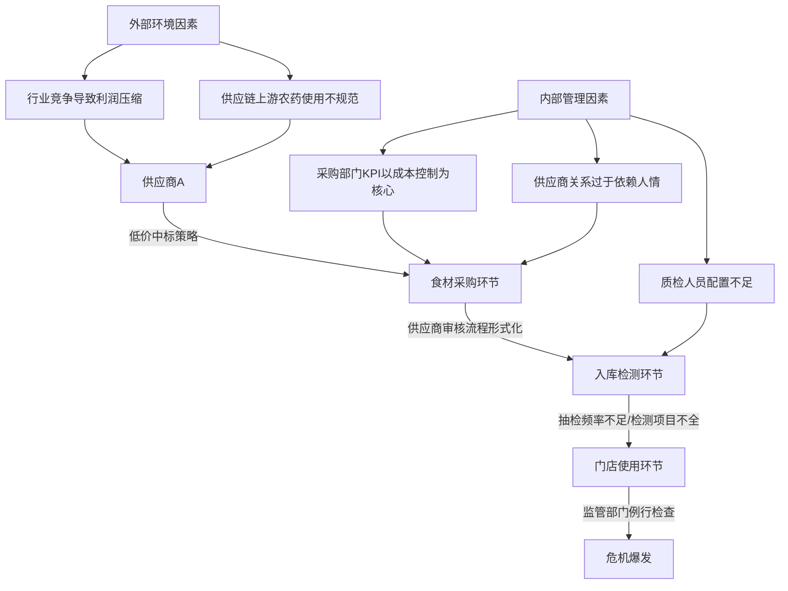
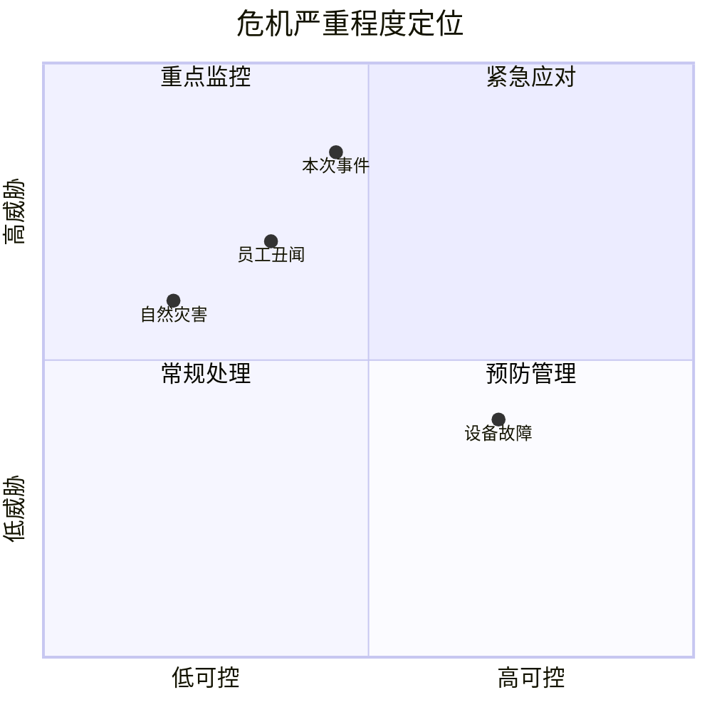
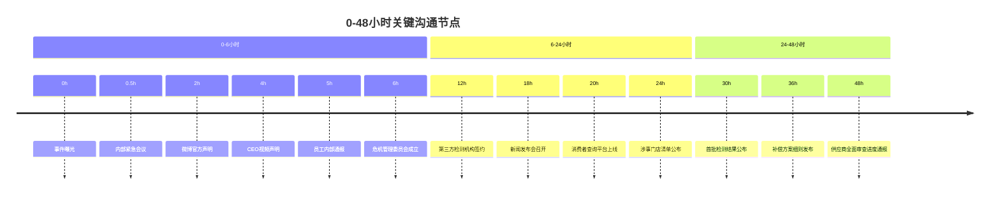
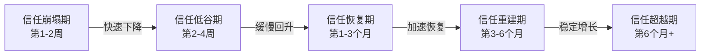
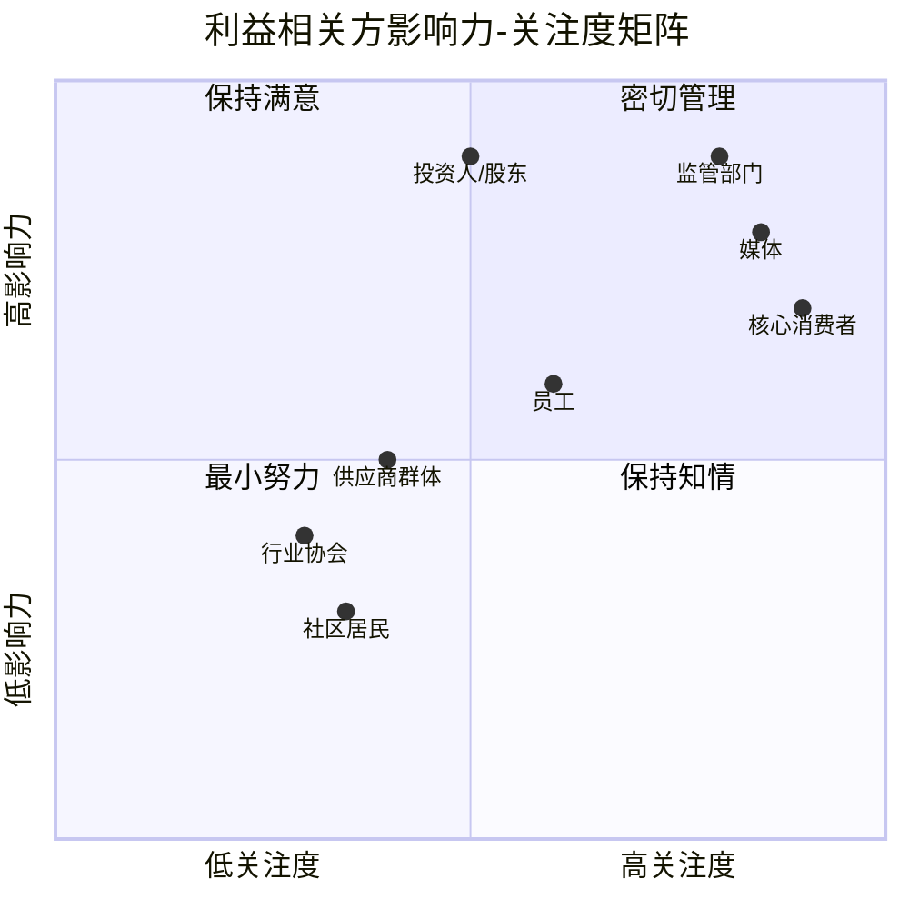
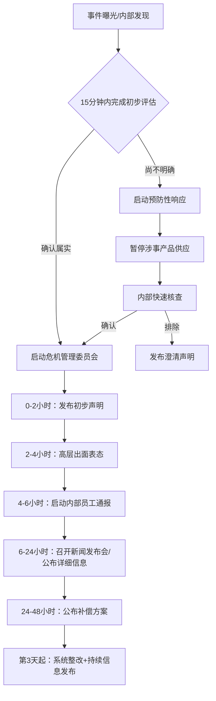

食品安全事件是餐饮行业最常见、破坏力最强的经营危机类型。本案例完整还原一家全国性连锁餐饮品牌从危机爆发到品牌重塑的全过程，深入剖析每一个关键决策背后的沟通逻辑，并提炼出可复用的危机沟通框架。案例基于多家真实企业的危机处理经验综合提炼，涉及的具体品牌信息已做脱敏处理。

### 一、危机全景：背景与成因分析

#### 1.1 企业基本面

| 维度 | 数据 |
|------|------|
| 品牌规模 | 全国3000+门店，覆盖28个省份 |
| 年营收 | 超100亿元人民币 |
| 品牌定位 | 大众消费级中式快餐连锁 |
| 供应链模式 | 区域集中采购 + 中央厨房配送 |
| 涉事区域 | 华东三省（江苏、浙江、安徽）约200家门店 |
| 核心客群 | 25-45岁城市白领及家庭消费群体 |
| 上市状态 | 港交所上市，市值约350亿港元 |
| 员工总数 | 约4.2万人，其中门店一线员工3.5万人 |

该品牌的商业模式高度依赖"标准化供应链 + 门店快速复制"的能力，这意味着任何供应链环节的失控都会通过门店网络被放大数百倍。理解这一点，是理解后续所有危机沟通决策的基础。

#### 1.2 危机成因链条

食品安全事件很少是单一因素导致的，通常是多重防线同时失守的结果：



本案例中，危机的直接触发链条为：

1. **供应商管理漏洞**：涉事供应商为区域老牌合作商，合作超过8年，品牌方对其建立了信任惯性，审核流程从最初的全面检测逐渐简化为形式化抽检。这一现象在供应链管理中被称为"熟人陷阱"——合作时间越长，审查标准越低，形成恶性循环
2. **检测机制失效**：品牌内部的食材抽检制度按批次比例执行，但涉事供应商通过混合不同批次食材的方式规避了抽检覆盖。具体而言，供应商将合格批次与问题批次混合包装，使单次抽检的代表性大幅降低
3. **监管触发**：省级市场监管部门在年度食品安全专项检查中，对该供应商的种植基地进行源头抽检，发现农药残留超标。值得注意的是，是监管部门的源头抽检发现了问题，而非品牌方的入库检测——这暴露了品牌检测体系的系统性盲区

#### 1.3 危机严重程度评估

按照危机沟通理论中的"威胁-可控性"矩阵来评估，此次危机属于**高威胁-中等可控**类型：

| 评估维度 | 等级 | 分析 |
|----------|------|------|
| 威胁程度 | 高 | 食品安全直接关系消费者健康，舆论敏感度极高 |
| 可控程度 | 中 | 问题源于供应链上游而非企业自身生产环节，但品牌方负有监管责任 |
| 扩散速度 | 极高 | 连锁餐饮品牌的负面新闻具有天然传播动力——消费者会联想到"我吃的那家店是不是也有问题" |
| 持续时间 | 长 | 食品安全事件的记忆周期通常为6-12个月，远超一般公关危机 |
| 法律风险 | 中高 | 涉及《食品安全法》第148条的"十倍赔偿"条款，可能引发集体诉讼 |



---

### 二、沟通全过程详解

#### 2.1 第一阶段：快速回应（0-6小时）——止血优先

危机沟通的黄金法则：**速度就是态度，沉默就是默认**。食品安全事件的特殊性在于，消费者会立即联想到自身健康风险，恐慌情绪的传播速度远远超过事实核查的速度。根据舆情监测数据，食品安全事件在社交媒体上的传播呈现"指数级扩散"特征——前30分钟是信息萌芽期，30分钟至2小时是爆发期，超过6小时未回应则进入失控期。

**0-2小时：内部确认与初步声明**

品牌方在事件曝光后的第一时间启动了以下动作：

1. **内部信息核实**（0-30分钟）
   - 运营副总裁召集供应链、品控、公关三个部门负责人紧急会议
   - 向涉事区域门店负责人核实涉事食材的实际使用情况
   - 确认涉事供应商的供货范围和批次信息
   - 调取近30天的入库检测记录和门店领料记录，量化受影响范围

2. **初步公开声明**（发布于事件曝光后2小时）
   - 发布渠道：官方微博（主渠道）、微信公众号、官网首页公告
   - 声明要点：
     - 确认已知晓媒体报道，正在核实相关情况
     - 表达对消费者健康安全的高度重视（态度优先于事实）
     - 宣布预防性措施：立即暂停涉事区域200家门店的相关菜品供应
     - 承诺全力配合监管部门调查
     - 开通24小时消费者咨询热线（400号码）
     - 提供受影响消费者的退换货/补偿方案预告

> **关键决策解析**：为什么在事实尚未完全查清时就主动暂停200家门店的供应？这体现了危机沟通中"宁可过度反应，不可反应不足"的原则。暂停供应的直接经济损失每天数百万元，但这一动作传递了"消费者安全高于商业利益"的信号，是建立信任的第一步。从博弈论角度看，这是一个"信号博弈"——通过承担确定的损失来传递不确定的诚意。

**2-6小时：高层出面与升级响应**

- **CEO视频声明**（第4小时）：品牌CEO录制3分钟视频声明，亲自向消费者致歉。视频在官方微博播放量在24小时内突破5000万次
- **启动危机管理委员会**：由CEO直接挂帅，下设四个工作组：

| 工作组 | 负责人 | 核心职责 | 首要任务 |
|--------|--------|----------|----------|
| 信息发布组 | 公关总监 | 对外统一口径、媒体对接、舆情监测 | 每小时舆情快报 |
| 供应链排查组 | 运营副总裁 | 供应商审查、食材检测、替代供应方案 | 48小时内完成涉事批次溯源 |
| 消费者服务组 | 客服总监 | 热线接听、投诉处理、补偿方案执行 | 热线扩容、话术培训 |
| 政府关系组 | 法务总监 | 监管部门对接、证照材料准备 | 主动向监管部门提交自查报告 |

- **员工内部沟通**（第5小时）：通过企业内部系统向全体员工发布情况通报，明确要求：
  - 所有门店员工统一口径，对外回应一律引导至官方渠道
  - 禁止擅自接受媒体采访
  - 禁止在个人社交媒体上发表相关评论
  - 对到店询问的消费者，使用统一的回应话术："我们正在全力处理，具体情况请关注官方公告或拨打400热线"

> **常见误区**：很多企业在危机初期将全部精力放在对外沟通上，忽略了内部员工沟通。实际上，员工是品牌的"第一传播者"——如果员工不了解情况或说法不一致，会成为媒体的采访素材来源，造成口径混乱。2017年某知名火锅品牌后厨卫生事件中，正是因为门店员工在接受暗访记者提问时说漏了嘴，才导致事件全面爆发。

#### 2.2 第二阶段：信息公开（6-48小时）——掌控叙事

**新闻发布会（第18小时）**

品牌方在事件曝光后不到24小时召开新闻发布会，这在行业同类事件中属于较快的响应速度。发布会选择在品牌总部所在地的国际会议中心举行，现场容纳200名记者，同时通过官方微博进行视频直播，在线观看人数峰值达到120万。发布会的关键信息点：

1. **事实透明**
   - 公布涉事供应商的完整信息：公司名称、注册地、合作历史
   - 公布涉事食材的具体品类、批次号、流向明细
   - 公布涉事门店的完整清单（按省份、城市分类）
   - 公布品牌方历年的食品安全投入数据，证明长期重视

2. **行动展示**
   - 已启动全国范围的供应商资质全面审查（不仅是涉事区域）
   - 委托SGS、中国检验认证集团等三家独立第三方机构对所有门店食材进行全面检测
   - 建立消费者可实时查询的检测进度在线平台
   - 邀请消费者代表参与后续整改监督

3. **责任承诺**
   - 对确认使用过涉事食材的消费者，提供医疗检查费用报销
   - 对涉事区域消费者发放等值消费券作为补偿
   - 承诺在30天内完成全国供应链审查并公布结果
   - 设立5000万元食品安全专项基金，用于长期整改投入

> **发布会关键技巧**：CEO在发布会开场用了30秒沉默——这是一个经过精心设计的沟通动作。沉默传递的信号是"这件事的严重性，值得我们停下来认真对待"，比任何语言都更有力量。随后CEO说的第一句话是"我对不起大家"，而不是"感谢各位记者的到来"——将致歉置于礼节之前。

**媒体沟通策略**

品牌方在媒体沟通上采取了"主动喂料"策略，而非被动等待追问：

- 向核心财经媒体、食品安全领域专业媒体提供独家采访机会
- 安排供应链负责人接受深度专访，展示企业的审查流程和标准
- 每6小时向媒体群发送一次进展通报，保持信息流的持续性
- 建立媒体专属微信群，实时回应记者提问，避免因信息真空导致的猜测性报道



#### 2.3 第三阶段：系统整改（第3天-第3个月）——重建信任

这一阶段的核心目标是将危机从"新闻事件"转化为"品牌升级故事"，通过持续的行动和透明的信息发布，让消费者从"被迫接受道歉"转变为"主动认可品牌的改变"。

**供应链体系重建**

| 整改措施 | 具体内容 | 完成时间 | 投入成本 |
|----------|----------|----------|----------|
| 供应商分级管理 | 建立ABCD四级供应商评级体系，每年动态调整 | 第2周 | 200万元/年 |
| 双盲抽检制度 | 内部质检 + 第三方独立检测双轨并行 | 第1周 | 1500万元/年 |
| 供应商退出机制 | 明确红线标准，一次重大违规立即终止合作 | 第2周 | 制度建设成本 |
| 食材溯源系统 | 消费者扫码可查看食材产地、检测报告、物流信息 | 第6周 | 3000万元（一次性） |
| 供应商审计轮岗 | 采购审计人员定期轮岗，防止利益固化 | 第4周 | 50万元/年 |
| 智能监控系统 | 在关键供应商种植基地部署物联网传感器，实时监控农药使用 | 第8周 | 1200万元（一次性） |

**消费者沟通节奏**

品牌方建立了"周报-月报-季报"三级信息更新机制：

- **周报**：每周五通过微信公众号发布供应链审查进展，包含具体数据（如"本周完成XX家供应商审查，合格率XX%，淘汰X家"）
- **月报**：每月召开消费者代表座谈会，公开征集意见，座谈会全程直播并保留回放
- **季报**：每季度发布《食品安全白皮书》，包含检测数据、投诉处理统计、改进措施执行情况，白皮书同步提交行业协会和监管部门

**信任重建的关键心理机制**

消费者信任的恢复不是线性的，而是呈现"S型曲线"特征：



- **信任崩塌期**：消费者对品牌的一切信息持怀疑态度，此时任何正面宣传都可能被视为"公关洗地"
- **信任低谷期**：消费者开始关注品牌的实际行动，但仍然保持警惕
- **信任恢复期**：持续的透明行动开始积累"信任存款"，消费者态度从怀疑转为观望
- **信任超越期**：如果整改措施足够扎实，品牌信任度可能超过危机前水平——这就是所谓的"危机红利"

**媒体关系修复**

- 邀请食品安全领域记者组成"媒体监督团"，定期参观中央厨房和供应商基地
- 与央视《每周质量报告》等栏目合作拍摄食品安全专题纪录片
- 在权威行业论坛上分享危机教训和整改措施，主动将负面事件转化为行业贡献
- 建立媒体"回访机制"：危机后第1、3、6、12个月分别邀请核心媒体回访整改进展

---

### 三、危机沟通理论在本案例中的应用

#### 3.1 SCCT理论（情境危机沟通理论）

SCCT理论由Coombs提出，核心观点是：危机类型决定了组织应该采取的回应策略。本案例属于**可预防型危机**（组织自身过失导致），按照SCCT理论，品牌方应采取"全面道歉+补偿"策略，而这正是品牌CEO亲自致歉并推出补偿方案的理论依据。

| 危机类型 | 责任归因 | 推荐策略 | 本案例对应 |
|----------|----------|----------|------------|
| 受害者型（地震等） | 低 | 关心表达 | 不适用 |
| 意外型（设备故障） | 中 | 辩解+修正 | 不适用 |
| 可预防型（管理疏忽） | 高 | 全面道歉+补偿 | ✓ CEO致歉+消费券补偿 |

**SCCT理论的延伸应用**：在实际操作中，品牌方并未机械地套用"全面道歉"策略，而是根据危机发展的不同阶段动态调整——初期以"态度+行动"为主（道歉+暂停供应），中期以"事实+证据"为主（公布检测数据+整改进展），后期以"价值+愿景"为主（食品安全白皮书+行业标准倡议）。这种"分阶段策略切换"是SCCT理论在复杂现实中的灵活运用。

#### 3.2 3T原则的实践

| 原则 | 含义 | 本案例实践 | 量化指标 |
|------|------|------------|----------|
| Tell your own tale（主动叙事） | 掌控信息传播的主导权 | 2小时内发布官方声明，不等媒体追问 | 首条官方声明发布时间：事件曝光后118分钟 |
| Tell it fast（快速传播） | 速度决定舆论走向 | 18小时召开新闻发布会 | 同类行业平均响应时间：72小时 |
| Tell it all（全面传播） | 不留信息死角 | 主动公布涉事供应商、门店清单、检测数据 | 首日公开信息点数量：47个 |

**3T原则的补充——第4个T：Tell them what's next（告诉他们接下来会发生什么）**

许多危机沟通教材只讲3T，但在实践中，公众最关心的往往不是"发生了什么"而是"接下来会怎样"。本案例中品牌方在每个关键节点都给出了明确的"下一步承诺"和时间节点，这是3T原则的重要延伸。

#### 3.3 信任修复的FCT模型

品牌方的信任修复过程遵循了"能力展示—关怀表达—正直承诺"三维度模型：

| 维度 | 含义 | 本案例实践 | 消费者感知 |
|------|------|------------|------------|
| 能力展示（Competence） | 证明有能力解决问题 | 委托权威第三方检测、建立溯源系统 | "他们有办法管好" |
| 关怀表达（Care） | 证明在乎每一个人 | CEO亲自致歉、消费者医疗费用报销 | "他们真的在乎我" |
| 正直承诺（Trustworthiness） | 证明不遮掩不逃避 | 公布完整涉事信息、定期发布整改报告 | "他们值得再给一次机会" |

三个维度缺一不可：只有能力没有关怀，会被视为冷血的企业机器；只有关怀没有能力，会被视为"只会道歉不会做事"；只有承诺没有正直，会被视为"说一套做一套"。

#### 3.4 议程设置理论的应用

在本次危机中，品牌方主动设置了三条"议程线"，引导公众关注点从"出了什么问题"转向"品牌在做什么"：

1. **行动议程**：通过高频次的进展通报，让"品牌整改行动"成为媒体报道的主线
2. **行业议程**：将个案上升为行业问题（供应链安全是全行业痛点），降低品牌被单独针对的风险
3. **未来议程**：通过食品安全白皮书和行业标准倡议，将叙事从"过去的问题"转向"未来的承诺"

---

### 四、各利益相关方沟通要点

危机沟通不是单向的信息发布，而是针对不同利益相关方的差异化沟通。每个群体关注的核心问题不同，沟通策略也必须因人而异。

#### 4.1 利益相关方矩阵



#### 4.2 分众沟通策略

**消费者沟通**

- 核心诉求：健康安全、知情权、补偿
- 沟通渠道：社交媒体（微博/抖音/小红书）、客服热线、门店
- 关键话术：承认问题 → 表达歉意 → 说明措施 → 提供补偿 → 承诺改进
- 注意事项：避免使用"极少数""个别"等弱化措辞，消费者对此极为敏感
- 分层策略：
  - 直接涉事消费者：一对一电话回访 + 医疗费用报销 + 高额消费券
  - 涉事区域消费者：区域定向推送 + 等值消费券 + 优先体验新系统
  - 全国消费者：全渠道公告 + 透明化信息平台 + 品质升级承诺

**监管部门沟通**

- 核心诉求：合规、配合、主动
- 沟通渠道：书面报告、现场汇报、日常对接
- 关键原则：永远比监管要求多走一步——监管要求查一个供应商，品牌方主动查全部
- 具体做法：
  - 事件当天即主动向省市两级市场监管部门提交书面情况说明
  - 每周向监管部门提交整改进展报告
  - 邀请监管部门参与供应商审查标准的制定
  - 将内部检测数据实时与监管部门共享
- 注意事项：绝不通过媒体喊话监管，所有沟通走正式渠道；避免在公开声明中使用"配合监管"作为推卸责任的暗示

**投资人/股东沟通**

- 核心诉求：财务影响评估、风险可控性、恢复预期
- 沟通渠道：投资者关系电话会、港交所公告
- 关键信息：量化财务影响（门店暂停损失、补偿成本、整改投入），给出恢复时间表
- 具体数据披露：

| 财务影响项 | 估算金额 | 说明 |
|-----------|----------|------|
| 涉事门店暂停营业损失 | 约500万元/天 × 5天 = 2500万元 | 涉事区域200家门店 |
| 消费者补偿成本 | 约8000万元 | 消费券 + 医疗费用报销 |
| 第三方检测费用 | 约2000万元 | 全国门店全面检测 |
| 供应链体系重建投入 | 约5000万元 | 溯源系统 + 智能监控 |
| **合计** | **约1.75亿元** | 约占年营收的1.75% |

- 恢复预期：基于同类案例分析，预计3个月恢复至危机前客流的85%，6个月恢复至95%以上

**员工沟通**

- 核心诉求：工作稳定性、品牌认同、行为指引
- 沟通渠道：内部邮件、门店负责人会议、企业微信
- 关键内容：
  - 坦诚说明情况，不隐瞒不夸大
  - 明确行为规范（统一口径、禁止擅自接受采访）
  - 肯定员工坚守，强调一线员工是品牌最宝贵的资产
  - 明确承诺不因本次事件裁员或降薪
  - 设立"危机应对贡献奖"，表彰在危机中表现突出的员工
- 特别关注：门店一线员工承受了消费者直接的情绪宣泄，需要提供心理支持热线和额外的加班补贴

**供应商群体沟通**

- 核心诉求：合作稳定性、审查标准透明度
- 沟通渠道：供应商大会、一对一沟通
- 关键信息：
  - 明确新的审查标准和退出机制，让供应商提前做好准备
  - 强调"不是不信任所有供应商，而是要建立更科学的信任机制"
  - 对合规供应商给予更长的合同周期和更优的付款条件，形成正向激励

---

### 五、效果评估与数据复盘

#### 5.1 短期指标（0-1个月）

| 指标 | 危机前基线 | 危机峰值 | 1个月后 | 恢复率 |
|------|-----------|----------|---------|--------|
| 涉事区域日均客流 | 100% | -62% | 85% | 85% |
| 全国日均客流 | 100% | -28% | 93% | 93% |
| 官方微博负面评论占比 | 3% | 78% | 22% | — |
| 客服热线日均来电量 | 200通 | 8,500通 | 350通 | — |
| 消费者退款/补偿申请率 | — | — | 涉事门店消费者12% | — |
| 品牌APP日活 | 85万 | 42万 | 78万 | 92% |
| 外卖平台差评率 | 2.1% | 18.7% | 4.3% | — |

#### 5.2 中期指标（1-3个月）

- **品牌信任指数**：第三方调研机构数据显示，品牌整体信任指数在危机后3个月较危机前提升8个百分点。原因在于整改的透明度和溯源系统的上线，让消费者感知到品牌"因祸得福"式的升级
- **食材溯源系统使用率**：上线后首月，消费者扫码率达34%，远高于行业平均水平（不足5%）。到第三个月，扫码率稳定在28%，说明消费者形成了新的消费习惯
- **媒体情绪转变**：负面报道占比从危机初期的82%下降至3个月后的15%，中性和正面报道占比持续上升
- **NPS（净推荐值）变化**：从危机前的32降至危机峰值的-18，3个月后回升至38——超过危机前水平
- **复购率**：涉事区域消费者的复购率从危机前的68%降至危机当月的31%，3个月后回升至61%

#### 5.3 长期影响（3-12个月）

- **行业标杆效应**：品牌方的溯源系统被多家同行企业借鉴，行业协会将其列为推荐标准
- **供应链成本变化**：新增的检测和溯源系统使供应链成本上升约3.2%，但由此带来的消费者信任溢价抵消了这一成本，客单价提升约2.1%
- **竞争对手动态**：部分竞争对手试图借势营销，但因缺乏实质性行动而未获市场认可；反而有3家竞品因同期被曝出类似问题而遭到更严厉的舆论反噬
- **资本市场反应**：股价在事件曝光当日下跌8.5%，但在一个月内收复全部跌幅，3个月后较危机前上涨12%——市场将整改视为长期利好信号

#### 5.4 ROI分析

| 投入项 | 金额 | 产出项 | 估算价值 |
|--------|------|--------|----------|
| 补偿与赔偿 | 8000万元 | 品牌信任溢价（客单价提升） | 约1.2亿元/年 |
| 检测与溯源系统 | 7000万元 | 供应链事故率降低 | 约3000万元/年（减少损失） |
| 公关与传播 | 1500万元 | 媒体正面报道价值 | 约5000万元（等效广告价值） |
| **合计投入** | **1.65亿元** | **合计年化收益** | **约2亿元** |

危机整改的投入在约10个月后实现收支平衡，此后每年产生正向收益。这证明了"危机即机遇"并非空话——前提是企业有决心和能力将整改落到实处。

---

### 六、关键决策深度分析

#### 6.1 决策一：2小时内暂停200家门店供应

**决策逻辑**：在事实尚不完全清晰时，品牌方面临一个经典抉择——暂停供应意味着每天数百万元的直接损失，但继续供应则冒着"知情不改"的道德风险。选择暂停，本质是用短期财务损失换取长期品牌信任。

**替代方案对比**：

| 方案 | 短期影响 | 长期影响 | 舆论风险 | 决策权重 |
|------|----------|----------|----------|----------|
| 暂停涉事门店供应（实际选择） | 每天损失约500万元 | 建立"消费者优先"品牌认知 | 低——被视为负责任的举措 | ★★★★★ |
| 仅暂停涉事菜品供应 | 每天损失约150万元 | 被质疑"避重就轻" | 中——可能被追问"其他菜品就安全吗？" | ★★★ |
| 全国门店全面暂停 | 每天损失约3000万元 | 过度反应引发更大恐慌 | 中高——"是不是全国都有问题？" | ★★ |
| 不暂停，仅加强检测 | 无直接损失 | 被视为漠视消费者安全 | 极高——一旦出现后续问题将不可挽回 | ★ |

**决策背后的组织能力支撑**：2小时内做出暂停200家门店供应的决策，需要以下条件同时满足：
- CEO在30分钟内被唤醒并获得完整信息
- 运营系统能够在1小时内向200家门店下达暂停指令
- 财务部门能够快速估算损失并提供决策支持
- 法务部门评估法律风险并给出建议

这不是临时能做到的，而是依赖日常的危机预案演练和决策授权机制。

#### 6.2 决策二：CEO亲自出面致歉

**决策逻辑**：在中国商业文化语境中，最高领导人的亲自致歉具有特殊的意义——它代表着"有人为这件事负责"。CEO出面的效果远超任何职业公关人的声明。

**致歉视频的关键要素**：

1. **态度真诚**：不读稿、不用官话，用日常语言表达歉意。视频采用一镜到底的拍摄方式，没有剪辑，没有字幕美化，CEO的紧张和不安是真实可见的——这种"不完美"反而增强了可信度
2. **承认责任**：明确说"这是我们的管理失误"，不推卸给供应商。具体表述是："不管问题出在供应链的哪个环节，最终摆到消费者餐桌上的食物，是我们品牌的责任"
3. **具体承诺**：不是空泛的"我们会改进"，而是"我已经签字批准了供应商全面审查方案，30天内公布结果"
4. **情感连接**：提到"我自己也是两个孩子的父亲，食品安全对我个人来说也是底线"——将企业危机与个人情感连接

**CEO致歉的时机选择**：第4小时出面，既不过早（事实尚未查清，容易说错话），也不过晚（超过6小时会被质疑"不重视"）。这个时间窗口是经过精心计算的。

#### 6.3 决策三：主动公布涉事供应商信息

**决策逻辑**：很多企业在类似事件中选择模糊处理供应商信息，理由是"保护商业合作"。但本案例中品牌方选择主动公开，原因在于：

- 消费者和媒体一定会通过各种渠道查出涉事供应商，与其被动曝光，不如主动公开
- 主动公布传递了"我们不遮掩"的信号，是信任重建的关键一步
- 公布信息的同时附上品牌方的审查结果和后续措施，将叙事从"出了问题"转向"如何解决"
- 法律层面：主动公布配合调查的态度，在后续可能的行政处罚和民事诉讼中可作为从轻情节

**公布信息的"颗粒度"把握**：品牌方公布的不是笼统的"涉事供应商"，而是包含公司名称、注册地、合作历史、涉事批次、流向明细的完整信息链。这种"超量透明"策略的核心逻辑是：信息越详细，公众越觉得"他们没什么可隐瞒的"。

---

### 七、危机沟通中的常见陷阱与应对

#### 7.1 本案例中避免的陷阱

| 陷阱 | 典型表现 | 本案例如何避免 | 背后的心理机制 |
|------|----------|----------------|----------------|
| 否认三连 | "不存在""不可能""与我无关" | 第一时间承认问题，不推卸 | 否认会激发公众的"逆反心理"，越否认越怀疑 |
| 甩锅供应商 | "这是供应商的问题，与我无关" | CEO明确表示"这是我们的管理失误" | 消费者购买的是品牌，不是供应商，推卸责任等于否定品牌承诺 |
| 过度承诺 | "保证永远不会发生" | 承诺具体措施和时间节点，而非空泛保证 | 空泛承诺无法验证，反而降低可信度 |
| 冷处理 | 只发一纸声明，之后沉默 | 建立周报-月报-季报持续沟通机制 | 沉默等于默认"事情已经过去了，我们不想再提" |
| 信息管控 | 删帖、控评、封锁消息 | 主动公布完整信息，接受公众监督 | 封锁消息在互联网时代几乎不可能成功，且一旦被发现会引发二次危机 |
| 道德绑架 | "我们也是受害者" | 从不以受害者自居 | 消费者不关心企业是否受害，只关心自己的安全 |
| 技术甩锅 | "这是个别现象""技术上无法完全避免" | 承认管理漏洞而非技术局限 | 技术甩锅暗示"我们无能为力"，比承认管理失误更可怕 |

#### 7.2 同类事件中常见的失败做法

**案例对照：某同行企业食品安全事件的失败处理**

| 维度 | 失败案例做法 | 本案例做法 | 结果对比 |
|------|-------------|------------|----------|
| 响应速度 | 事件曝光后48小时才发布声明 | 2小时内发布声明 | 失败案例错失黄金回应窗口，舆论失控 |
| 声明措辞 | 使用"不排除有人恶意抹黑" | 直接承认问题并致歉 | 失败案例激化公众情绪，引发二次传播 |
| 发布渠道 | 仅在官网发布，未在社交媒体同步 | 微博+微信+官网+直播多渠道覆盖 | 失败案例信息触达率极低，声明几乎无人看到 |
| 高层出面 | 未安排高层出面，仅由公关部发声明 | CEO亲自录制视频致歉 | 失败案例被媒体解读为"不重视" |
| 后续整改 | 整改信息不透明，无持续沟通 | 周报-月报-季报三级信息更新 | 失败案例消费者信任持续走低，一年后门店缩减20% |
| 竞争对手反应 | 被竞争对手借势营销成功 | 主动设置议程，竞争对手借势未果 | 失败案例市场份额被大幅蚕食 |

#### 7.3 社交媒体时代的特殊陷阱

**短视频平台的"二次发酵"危机**

在抖音、快手等短视频平台上，食品安全事件具有特殊的传播特征：
- **视觉冲击力强**：后厨操作视频、食材变质画面的传播力远超文字报道
- **情绪传染快**：短视频的算法推荐机制会加速负面内容的扩散
- **二次创作多**：消费者、自媒体会将原始素材重新剪辑，添加夸张标题和音效，形成"二次发酵"
- **记忆周期长**：短视频的推荐算法会在数月后再次推送相关内容，延长危机记忆

**应对策略**：
- 在主要短视频平台开设官方账号，及时发布整改进展的短视频内容
- 邀请食品安全领域的KOL（关键意见领袖）到中央厨房实地探访并拍摄正面内容
- 对明显造谣的二次创作内容，通过法律渠道要求平台下架，但不对真实批评内容采取任何管控措施

**微博热搜的"绑架效应"**

一旦食品安全事件登上微博热搜，品牌方会面临一个两难困境：热搜话题会持续吸引新的关注者，但品牌方又不能不回应热搜上的质疑。应对策略是：在热搜期间保持高频回应（每2-3小时更新一次），但回应内容严格聚焦于"行动和事实"，避免卷入情绪化讨论。

---

### 八、可复用的危机沟通工具包

#### 8.1 食品安全危机响应SOP（标准操作流程）



#### 8.2 危机声明模板

**第一份声明（0-2小时发布，简短为宜）**：

> 关于\[媒体报道/监管通报\]的说明
>
> 我们已关注到\[具体情况\]，对此高度重视。为保障消费者安全，我们已采取以下措施：
> 1. 立即暂停涉事区域\[X\]家门店的相关产品供应
> 2. 启动全面自查，配合监管部门调查
> 3. 开通24小时服务热线：\[号码\]
>
> 我们将及时公布后续进展。对给消费者带来的不便，我们深表歉意。
>
> \[品牌名称\]
> \[日期\]

**声明撰写检查清单**：

- [ ] 是否在开头直接回应了公众最关心的问题？
- [ ] 是否表达了对消费者安全的高度重视？
- [ ] 是否说明了已采取的具体措施？
- [ ] 是否承诺了下一步行动和时间节点？
- [ ] 是否避免了推卸责任的措辞？
- [ ] 是否避免了"极少数""个别"等弱化表述？
- [ ] 是否提供了消费者可联系的渠道？
- [ ] 是否经过法务审核，确保措辞不会引发法律风险？

**CEO致歉声明要点框架**：

1. 开头：直接致歉，不绕弯子
2. 中段：承认具体问题，说明已采取的措施
3. 承诺：给出具体的时间节点和可衡量的改进目标
4. 结尾：表达对消费者支持的感谢和对品牌未来的信心

**补偿方案公告模板**：

> 关于\[事件名称\]消费者补偿方案
>
> 一、补偿对象：\[时间段\]内在\[涉事区域\]门店消费过的顾客
>
> 二、补偿方式：
> 1. 消费券补偿：凭消费记录可领取等值消费券（有效期6个月）
> 2. 医疗费用报销：如因食用涉事食材就医，凭医疗票据全额报销
> 3. 退餐服务：涉事期间的消费可申请全额退款
>
> 三、申请方式：\[线上平台/门店/热线\]
>
> 四、申请截止日期：\[日期\]
>
> 五、客服热线：\[号码\]（24小时）

#### 8.3 舆情监测指标体系

| 监测维度 | 关键指标 | 预警阈值 | 应对动作 |
|----------|----------|----------|----------|
| 传播量 | 微博话题阅读量、抖音相关视频播放量 | 24小时内超过1000万 | 升级至危机管理委员会 |
| 情绪比 | 负面评论占比 | 超过60% | 加快信息发布频率 |
| 扩散速度 | 每小时新增相关帖子数 | 持续3小时以上递增 | 启动高层出面机制 |
| KOL介入 | 粉丝50万以上博主发布相关负面内容 | 3个以上KOL介入 | 安排一对一沟通 |
| 媒体升级 | 从地方媒体上升至央媒/全国性媒体 | 任何央媒报道 | 召开新闻发布会 |
| 消费者行动 | 集体退款、投诉、诉讼 | 同一区域100+消费者投诉 | 启动区域定向补偿 |

#### 8.4 危机应对"话术禁用词"清单

| 禁用表述 | 替代表述 | 原因 |
|----------|----------|------|
| "极少数消费者" | "受影响的消费者" | 弱化问题规模，引发反感 |
| "不排除恶意抹黑" | "我们正在核实" | 激化对立情绪 |
| "我们也是受害者" | （不使用） | 转移焦点，推卸责任 |
| "技术上无法完全避免" | "我们的管理存在漏洞" | 技术甩锅降低可信度 |
| "正在积极处理中" | "已完成XX，正在进行XX" | 过于笼统，缺乏信息量 |
| "请广大消费者放心" | "以下是我们的具体措施" | 空话无法让人放心 |
| "已经第一时间" | "在X小时X分钟内" | 模糊表述不如具体数字 |

---

### 九、深层启示：从个案到方法论

#### 9.1 危机沟通的三层能力模型

```mermaid
graph TB
    subgraph 第一层：技术能力
        A1[声明撰写]
        A2[媒体对接]
        A3[舆情监测工具使用]
        A4[新闻发布会组织]
    end
    
    subgraph 第二层：策略能力
        B1[利益相关方分析]
        B2[信息节奏把控]
        B3[叙事框架设计]
        B4[渠道组合策略]
    end
    
    subgraph 第三层：组织能力
        C1[危机文化塑造]
        C2[决策授权机制]
        C3[跨部门协调效率]
        C4[长期信任资产积累]
    end
    
    第一层 --> 第二层 --> 第三层
```

本案例中品牌方之所以成功，核心在于第三层——组织能力。2小时内暂停200家门店供应，不是公关部门能独立做出的决定，它需要CEO的直接授权、运营部门的快速执行、财务部门的风险评估同步到位。这背后是长期的危机文化建设和决策机制保障。

**三层能力的建设路径**：

| 层级 | 建设周期 | 核心投入 | 关键指标 |
|------|----------|----------|----------|
| 技术能力 | 1-3个月 | 培训、工具采购、模板建设 | 声明发布时间、舆情监测覆盖率 |
| 策略能力 | 3-6个月 | 案例研究、沙盘演练、外部顾问 | 利益相关方满意度、叙事控制率 |
| 组织能力 | 6-24个月 | 文化建设、机制优化、高层共识 | 决策响应速度、跨部门协调效率 |

#### 9.2 危机预防的四个日常习惯

1. **供应链压力测试**：每季度模拟一次食品安全危机场景，检验响应流程的可行性。具体做法是设置"假设某供应商被检出农残超标"的场景，各部门按照SOP进行全流程推演，记录响应时间和决策质量
2. **供应商关系健康度评估**：定期审查供应商资质，防止"老关系"导致的审核放松。建立供应商关系"健康度评分卡"，包括合作年限、检测合格率、响应速度、价格竞争力等维度，每半年更新一次
3. **媒体关系预热**：与核心媒体保持日常良性互动，而非危机时才临时抱佛脚。具体做法包括：定期邀请媒体参观企业运营、主动提供行业洞察和数据、在非危机期接受正面采访
4. **员工危机意识培训**：每年至少一次全员食品安全和危机沟通培训，培训内容包括：危机识别、初步响应流程、统一口径原则、个人社交媒体行为规范

#### 9.3 对不同规模企业的适用建议

| 企业规模 | 核心关注点 | 可直接复用的要素 | 需要调整的要素 |
|----------|-----------|-----------------|---------------|
| 大型企业（1000+门店） | 体系化建设、跨区域协调 | 完整的SOP、分众沟通策略、溯源系统 | 无需调整 |
| 中型企业（100-1000门店） | 响应速度、媒体关系 | CEO出面策略、声明模板、舆情监测指标 | 将新闻发布会改为社交媒体直播声明 |
| 小型企业（100以下门店） | 真诚态度、快速行动 | 3T原则、常见陷阱规避、基础声明框架 | 简化分众沟通为统一沟通，溯源系统改为第三方认证 |

#### 9.4 从危机到竞争优势的转化路径

本案例最值得借鉴的深层启示是：**危机本身不是竞争优势，但危机的处理方式可以成为竞争优势**。转化路径如下：

1. **透明化**：将危机中被迫公开的信息转化为长期公开的品牌承诺（如食材溯源系统）
2. **标准化**：将危机中临时建立的流程转化为行业领先的标准（如供应商分级管理制度）
3. **情感化**：将危机中建立的消费者共情转化为长期的品牌忠诚（如"消费者监督委员会"）
4. **行业化**：将个案教训转化为行业贡献（如参与行业标准制定、分享最佳实践）

***

> **编者按**：食品安全危机是所有餐饮企业都可能面对的"灰犀牛"事件——概率高、影响大、但可以预防和准备。本案例的价值不在于某个具体技巧，而在于展示了一个核心理念：**危机沟通的本质不是"说"的技巧，而是"做"的决心。所有的沟通策略，都必须建立在真实的行动基础之上。**消费者不会被话术打动，但会被行动说服。当企业真正做到"消费者安全高于一切"时，沟通只是行动的自然表达，而非精心设计的话术表演。
