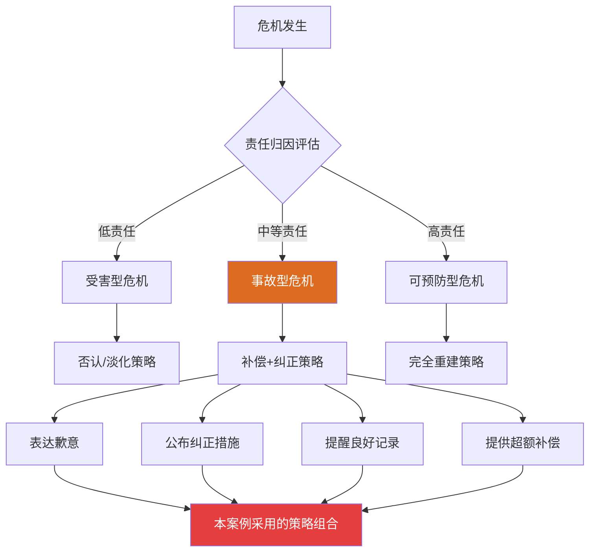
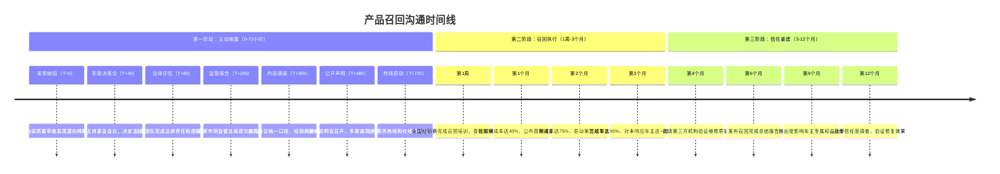
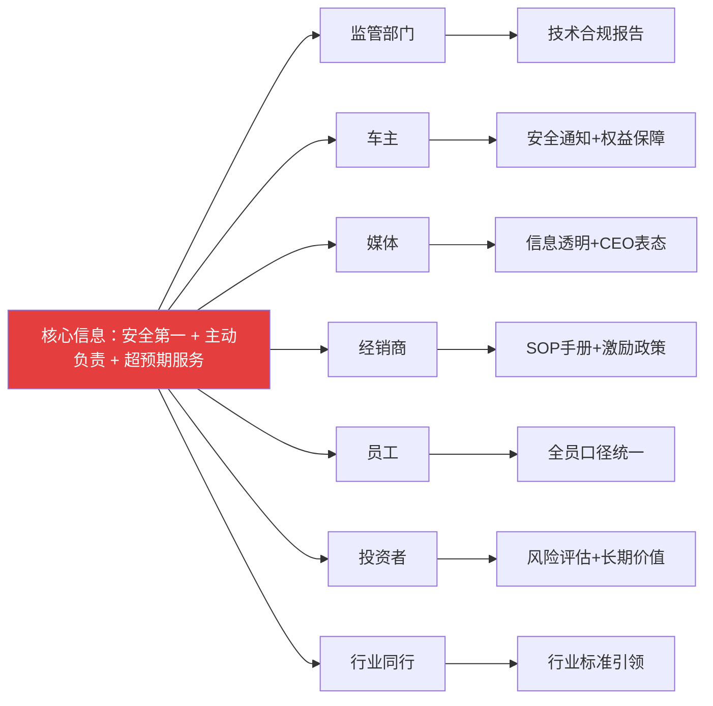

## 案例二：产品召回——某汽车制造商安全缺陷召回

### 案例定位与学习价值

产品召回是企业面临的最典型、最高频的危机类型之一。与突发性安全事故不同，产品召回具有**可预见性**——企业通常在召回前就已经掌握了缺陷信息，有相对充裕的时间进行决策和准备。但正因为"有时间准备"，召回沟通的质量反而成为检验企业危机管理真实水平的试金石。

本案例展示的是一次**主动召回**——在尚未发生任何实际事故的情况下，企业主动披露缺陷并启动召回程序。这与被动召回（在监管机构要求或事故发生后才启动）形成鲜明对比，是危机沟通理论中**情境危机沟通理论（SCCT）**的经典应用场景。

> **为什么这个案例重要？** 根据国家市场监督管理总局的数据，2023年中国共实施汽车召回214次，涉及车辆约672万辆。但召回完成率差异极大——主动召回的平均完成率约85%，而被动召回（尤其是监管责令召回）的完成率往往不足60%。沟通策略的差异是造成这一差距的核心因素。

**从本案例中你将学到：**

- 如何在"零事故"场景下做出主动召回的战略决策
- SCCT理论在产品召回中的完整应用方法
- 多渠道、多阶段的召回沟通执行体系
- 利益相关者差异化沟通的实操技巧
- 如何将召回危机转化为品牌信任建设的契机

---

### 理论框架：SCCT在产品召回中的应用

在分析具体案例之前，先理解指导决策的理论基础。

**情境危机沟通理论（SCCT）** 由学者W. Timothy Coombs提出，其核心主张是：危机沟通策略应根据危机类型和责任归因来选择。SCCT将危机分为三类：

| 危机类型 | 责任归因 | 代表场景 | 推荐策略 |
|----------|----------|----------|----------|
| **受害型危机** | 低责任 | 自然灾害、谣言、产品被篡改 | 否认策略或淡化策略 |
| **事故型危机** | 中等责任 | 技术故障、设计缺陷（非故意） | 重建策略+补偿策略 |
| **可预防型危机** | 高责任 | 明知缺陷不处理、故意隐瞒 | 完全重建策略 |

产品召回属于典型的**事故型危机**——缺陷通常源于设计或制造环节的非故意失误，企业承担中等程度的责任。SCCT对这类危机的建议是：

- **首要策略**：表达歉意（Compensation）和纠正措施（Corrective Action）
- **辅助策略**：提醒（Reminder）企业过往的良好记录
- **禁忌策略**：否认（Denial）——因为缺陷事实客观存在，否认会严重损害信誉

本案例中的企业精准地遵循了SCCT的策略建议，同时在执行层面做到了超预期。



**SCCT的局限性与补充**：SCCT主要解决"选什么策略"的问题，但在产品召回场景中还需要补充两个维度——**时间维度**（召回沟通是一个持续数月的过程，而非一次性事件）和**渠道维度**（不同利益相关者需要差异化的沟通方式）。本案例在SCCT基础上，构建了一套完整的"策略-时间-渠道"三维沟通体系。

---

### 法规背景：中国汽车召回制度

理解本案例的沟通策略，必须了解中国汽车召回的法规框架，因为法规既设定了底线要求，也为企业提供了主动召回的激励机制。

**核心法规：《缺陷汽车产品召回管理条例》（2012年，2019年修订）**

关键条款对企业沟通行为有直接影响：

1. **主动召回与责令召回的区分**：企业主动实施召回的，监管部门应当按照《行政处罚法》的规定从轻、减轻或者不予处罚。这一条款是企业选择主动召回的重要制度激励。

2. **报告时限要求**：生产者确认产品存在缺陷的，应当立即停止生产、销售，并在**5个工作日内**向监管部门报告召回计划。本案例中企业在72小时内报告，远快于法定要求。

3. **信息公示要求**：召回计划应当包括缺陷信息、召回范围、召回措施、召回进度等内容，且需在监管部门网站和企业官网同时公示。

4. **召回效果评估**：监管部门有权对召回效果进行评估，完成率低于预期的，可以要求生产者采取补充措施。

| 法规要求 | 最低标准 | 本案例表现 | 超标程度 |
|----------|----------|------------|----------|
| 报告时限 | 5个工作日 | 72小时（约3个工作日） | 提前40% |
| 通知方式 | 书面通知 | 短信+邮件+APP+挂号信+媒体说明会 | 多渠道覆盖 |
| 维修保障 | 免费维修 | 免费维修+代步车+回访 | 超额服务 |
| 进度公示 | 召回完成后公示 | 实时定期公示 | 主动透明 |

**跨国召回的法规差异**：本案例涉及车辆分布在国内和海外市场，因此还需遵守目标市场的召回法规：

| 市场 | 法规框架 | 监管机构 | 核心差异 |
|------|----------|----------|----------|
| 中国 | 《缺陷汽车产品召回管理条例》 | 国家市场监管总局 | 5工作日报告时限 |
| 美国 | 《国家交通和机动车安全法》 | NHTSA | 5日报告时限，罚款可达1.15亿美元/年 |
| 欧盟 | 《通用产品安全指令》 | 各国交通部门 | 侧重消费者通知义务 |
| 日本 | 《道路运输车辆法》 | 国土交通省 | 要求提交技术分析报告 |

跨国召回的沟通挑战在于：**信息同步的时效性**——不同市场的召回公告必须在同一时间窗口内发布，否则信息差会引发"为什么中国市场先/后召回"的信任质疑。本案例的做法是建立**全球统一时间轴**，在72小时内同步向所有目标市场的监管部门提交报告。

---

### 危机背景

某汽车制造商在内部质量审查中发现，某批次车辆的安全气囊存在潜在的控制模块故障风险。具体技术问题如下：

- **缺陷描述**：安全气囊控制模块中的某个电容器在长期高温环境下可能出现参数漂移，导致碰撞检测信号的响应时间延长。在极端情况下（持续高温暴露+特定碰撞角度），安全气囊可能无法在规定时间内正常弹出。
- **影响范围**：涉及车辆约15万辆，分布在国内外多个市场，涵盖3个车型系列的特定生产批次。
- **发生概率**：根据工程团队的故障模式分析（FMEA），在正常使用条件下，缺陷触发概率约为0.03%，但由于无法排除极端工况，风险等级被评定为"中等偏高"。
- **当前状态**：尚未发生任何因该缺陷导致的实际事故或伤亡。

**关键决策点：在零事故的情况下，是否启动召回？**

这是本案例最核心的决策。从纯商业角度看，0.03%的触发概率意味着实际发生事故的可能性极低，不召回可能永远不会暴露问题。但从危机管理的角度看：

- 如果未来发生事故且被追溯到已知缺陷未处理，企业将从"事故型危机"降级为"可预防型危机"，面临的将是刑事责任和天价赔偿
- 社交媒体时代，任何安全事故都会被迅速放大和关联，隐瞒的成本远高于主动披露
- 主动召回是建立长期品牌信任的战略投资，而非短期成本

企业最终选择了**主动召回**，这一决策本身就体现了危机沟通理论中"**修复优先于掩盖**"的核心原则。

---

### 财务影响分析：主动召回的成本-收益模型

很多企业在召回决策上犹豫不决，根本原因是对财务影响缺乏清晰的认知。以下数据模型揭示了主动召回的真实经济账。

**直接成本构成：**

| 成本项目 | 单车成本 | 总成本（15万辆） | 说明 |
|----------|----------|------------------|------|
| 零部件更换 | 800-1,200元 | 1.2-1.8亿元 | 控制模块+安装工时 |
| 经销商服务补贴 | 200-300元/台 | 3,000-4,500万元 | 服务费+场地占用 |
| 代步车服务 | 150-200元/天 | 2,250-3,000万元 | 按平均3天计算 |
| 通知与物流 | 30-50元/台 | 450-750万元 | 短信+挂号信+系统 |
| 延长质保 | 100-200元/台 | 1,500-3,000万元 | 预估理赔概率 |
| **合计** | | **1.9-3.0亿元** | |

**不召回的潜在成本：**

| 风险场景 | 概率估算 | 潜在成本 | 期望成本 |
|----------|----------|----------|----------|
| 单起致死事故+媒体曝光 | 约0.03%×15万辆=45起 | 5-10亿元（赔偿+危机公关） | 1,500-3,000万元 |
| 监管责令召回+行政处罚 | 中等 | 额外罚款2,000-5,000万元 | 1,000-2,500万元 |
| 品牌信任崩塌导致销量下降 | 低-中 | 年销售额下降5-15% | 3-9亿元 |
| **期望成本合计** | | | **5,500万-1.45亿元** |

**长期收益：**

| 收益项 | 量化估算 | 说明 |
|--------|----------|------|
| 品牌信任提升带来的复购增益 | 年销售额增加2-3% | 参考本案例后品牌信任指数+8% |
| 新客户转化 | 4.7%非车主因信任感购买 | 口碑传播效应 |
| 监管关系改善 | 降低未来审查频率 | 减少合规成本 |
| 行业标杆地位 | 媒体正面报道价值 | 等效广告价值数千万元 |

**结论**：主动召回的直接成本约2-3亿元，但不召回的期望风险成本约0.5-1.5亿元（概率加权），且一旦风险变为现实，实际损失将远超主动召回成本。从**风险对冲**的角度看，主动召回是经济上最理性的选择——花确定的小钱，避免不确定的巨额损失。

---

### 沟通过程：三阶段全景还原



#### 第一阶段：主动披露（0-72小时）

这一阶段的目标是**快速建立信息主导权**——在消息泄露之前，由企业自己定义事实框架。

**1. 监管部门沟通（T+24小时）**

企业向国家市场监管总局提交了详尽的缺陷报告，内容包括：

- 缺陷的技术描述和工程分析报告
- 涉及车辆的VIN码清单（精确到每一辆车）
- 故障模式与影响分析（FMEA）结果
- 拟采取的召回措施和技术方案
- 预计召回时间表和资源配置

**沟通要点**：与监管部门的沟通必须**技术先行、数据说话**。模糊的描述（如"可能存在安全隐患"）会触发监管部门的不信任和追加审查。本案例中企业提供的FMEA报告展示了专业性和诚意，监管部门在收到报告后48小时内批准了召回计划。

**2. 消费者直接通知（T+48小时起）**

针对15万车主，企业启动了**四通道并行通知**策略：

| 通知渠道 | 覆盖率 | 响应速度 | 成本 | 适用场景 |
|----------|--------|----------|------|----------|
| APP推送 | 35% | 即时 | 极低 | 年轻车主，已安装APP的用户 |
| 短信通知 | 95% | 即时 | 低 | 全量覆盖，确保触达 |
| 电子邮件 | 60% | 即时 | 极低 | 详细信息传递，含附件 |
| 挂号信 | 100% | 3-5天 | 中等 | 法律效力保障，兜底通知 |

通知内容的核心要素（模板化结构）：

```text
【紧急安全通知】尊敬的[车主姓名]：

经我司质量部门检测确认，您所持有的[车型名称]（VIN：[车架号]）的
安全气囊控制模块存在潜在故障风险。虽然目前未发生任何事故，但为确保
您的安全，我们决定实施免费召回维修。

【您需要做什么】
1. 拨打召回专线 400-XXX-XXXX 预约维修时间
2. 或登录 [品牌官网]/[APP] 在线预约
3. 维修预计耗时约1.5小时，完全免费

【我们为您准备了什么】
- 维修期间免费代步车服务
- 维修完成后1年延长质保
- 专属客服一对一跟踪服务

我们对给您带来的不便深表歉意。您的安全是我们最重要的承诺。

[品牌名称] 汽车
[日期]
```

**3. 媒体说明会（T+48小时）**

媒体说明会是这一阶段的核心事件，其组织体现了专业危机沟通的多个要点：

**会前准备：**
- 提前24小时向核心媒体发送邀请函，附带背景资料包
- 准备技术专家和高管的分工：技术专家解释缺陷原因，高管表达态度和承诺
- 预设20个最尖锐的问题并准备回答口径
- 准备技术演示视频，直观展示缺陷原理和修复方案

**发布会核心信息框架（三层结构）：**

| 信息层级 | 核心内容 | 目的 |
|----------|----------|------|
| **态度层** | "我们对此深表歉意，车主安全是我们的第一优先级" | 情感共鸣 |
| **事实层** | "某批次安全气囊控制模块存在技术缺陷，涉及15万辆车" | 信息透明 |
| **行动层** | "已启动全面召回，提供免费维修+代步车+延长质保" | 解决方案 |

**发布会现场的隐性沟通要素**：除了语言内容，以下非语言因素同样影响传播效果——CEO亲自出席（而非委托公关总监）传递了最高层重视的信号；技术专家现场演示缺陷原理（用动画而非纯文字）降低了理解门槛；Q&A环节不回避尖锐问题（如"你们什么时候知道这个问题的？"）展示了坦诚态度。

**4. 经销商通知（T+36小时）**

经销商是召回执行的关键前线。通知内容不仅是信息传达，更是一套**标准化执行手册**：

- **服务流程SOP**：从车主进店到维修完成的每一步操作规范
- **话术指引**：面对车主的常见问题和情绪化反应，如何专业应对
- **资源调配**：配件供应计划、技师培训安排、代步车调配方案
- **数据上报**：每日17:00前上报当日召回完成数据
- **激励机制**：每完成一台召回维修，经销商获得XX元服务补贴

#### 第二阶段：召回执行（1周至3个月）

这一阶段的核心挑战是**维持公众关注和车主参与度**。召回公告发布后的第2-4周是最危险的"注意力衰减期"——媒体报道热度下降，车主的紧迫感消退，实际到店率开始走低。

**针对性策略：**

1. **进度可视化**：每两周在官网和APP发布召回进度仪表盘，用数据驱动公众关注

   ```text
   召回进度报告（第4期）
   ├── 总计涉及车辆：150,000 辆
   ├── 已完成维修：60,000 辆（40.0%）
   ├── 已预约未维修：22,500 辆（15.0%）
   ├── 未响应车主：67,500 辆（45.0%）
   └── 本周新增完成：12,000 辆
   ```

2. **分层催促策略**：对未响应车主采用递进式沟通

   | 轮次 | 时间点 | 方式 | 话术重点 |
   |------|--------|------|----------|
   | 第一轮 | 第2周 | 短信+APP | 温馨提醒，强调安全 |
   | 第二轮 | 第4周 | 电话+短信 | 说明进展，了解障碍 |
   | 第三轮 | 第8周 | 上门拜访 | 面对面沟通，解决顾虑 |
   | 第四轮 | 第12周 | 挂号信+电话 | 最终通知，法律告知 |

3. **激励措施**：对在指定时间内完成维修的车主，提供额外权益（免费保养一次、积分奖励等），提高响应动力。

4. **维修质量保障**：每个维修工位配备质检员，维修完成后进行双重验证——技师自检+质检员复检。维修记录实时上传至中央系统，车主可通过APP查看完整维修报告。

**维修质量控制标准：**

```text
维修工单检查清单（每台车辆必须完成）
├── 维修前检查
│   ├── 确认VIN码与召回范围匹配
│   ├── 记录原控制模块序列号
│   └── 拍照存档（维修前状态）
├── 维修过程
│   ├── 使用原厂替换件（非第三方配件）
│   ├── 按标准工时操作（不得跳步）
│   └── 每步骤操作留痕记录
├── 维修后验证
│   ├── 技师自检：功能测试通过
│   ├── 质检员复检：二次验证
│   ├── 系统自检：OBD诊断无故障码
│   └── 拍照存档（维修后状态）
└── 交付确认
    ├── 车主签字确认维修完成
    ├── 发放维修证明书
    └── 系统状态更新为"已完成"
```

#### 第三阶段：信任重建（3个月至12个月）

召回完成不等于危机结束。SCCT理论强调，**信任修复是一个独立的、长期的过程**，需要超越纠正措施本身的额外行动。

**1. 第三方验证（第4个月）**

邀请国内权威第三方检测机构（如中国汽车技术研究中心）对召回维修后的车辆进行随机抽样检测。检测结果以完整报告形式公开发布。

这一做法的战略价值在于：**将"企业自说自话"升级为"权威第三方背书"**，极大增强信息的可信度。

**2. 总结报告发布（第6个月）**

发布《召回工作总结报告》，内容涵盖：

- 召回完成率和维修质量数据
- 车主满意度调查结果
- 根因分析和预防措施
- 质量管理体系的改进方案
- 对受影响车主的感谢

**3. 超预期权益（第9个月）**

为本次召回涉及的车主推出专属权益计划：

- 3年/6万公里延长质保（超出标准质保1年）
- 优先参与新车型试驾活动
- 专属服务通道（VIP接待标准）
- 年度车辆安全检查服务

这些权益的成本远低于一次危机带来的品牌损失，但其传递的信号——"我们珍视每一位受影响的车主"——对信任修复的价值是无法用金钱衡量的。

---

### 关键决策深度分析

#### 决策一：主动召回而非被动应对

**决策背景**：0.03%的触发概率，零事故记录。法律上没有强制召回的义务。

**决策逻辑：**

| 维度 | 不召回的风险 | 主动召回的成本 |
|------|-------------|---------------|
| 法律风险 | 一旦发生事故，从"事故型"升级为"可预防型"，面临刑事追诉 | 一次性合规成本 |
| 品牌风险 | 信息泄露后信任崩塌不可逆 | 短期负面舆论，长期信任增益 |
| 财务风险 | 天价赔偿（参考高田气囊案赔偿超百亿美元） | 召回维修成本+服务成本 |
| 监管风险 | 未来监管审查力度加大 | 获得监管认可，降低未来审查频率 |

**结论**：从期望价值计算，主动召回的长期收益远超短期成本。这一决策体现了**防御性悲观**的战略思维——为最坏情况做准备，而不是赌最好结果。

#### 决策二：信息完全透明

**具体做法**：公开了缺陷的技术细节（电容器参数漂移机制）、触发条件（高温环境+特定碰撞角度）、影响范围（精确到VIN码）。

**为什么重要**：

- **削弱猜测空间**：不透明的信息环境会催生谣言和猜测，这些"野生信息"往往比真相更具杀伤力
- **建立技术权威**：当企业能够清晰解释缺陷的工程原理时，公众会将其解读为"他们真的搞清楚了问题"，而非"他们隐瞒了更严重的问题"
- **法律保护**：详尽的技术披露在法律上构成"尽职"的证据，降低未来可能的诉讼风险

#### 决策三：超预期的服务标准

**超出法规要求的具体措施**：

- 法规要求：免费维修 → 企业额外提供：代步车服务
- 法规要求：书面通知 → 企业额外提供：四通道并行通知+上门服务
- 法规要求：维修保障 → 企业额外提供：1年延长质保
- 法规要求：召回公示 → 企业额外提供：实时进度仪表盘

**心理学原理**：这利用了行为经济学中的**"期望差异"效应**——当实际体验超过预期时，满意度和信任度会非线性增长。车主的预期是"免费修好就行"，当他们获得代步车、延长质保和VIP服务时，感受到的不是"理所当然"而是"额外惊喜"，这种正面情绪会直接转化为品牌忠诚度。

---

### 反面教材：高田气囊案的沟通灾难

将本案例与日本高田（Takata）安全气囊事件进行对比，能更清晰地展示沟通策略差异带来的天壤之别。

| 维度 | 本案例（主动召回） | 高田气囊案（被动应对） |
|------|-------------------|----------------------|
| **发现方式** | 内部审查主动发现 | 多起致死事故后被追查 |
| **响应速度** | 72小时内启动 | 拖延超过10年 |
| **信息披露** | 完整技术细节公开 | 长期否认缺陷、篡改测试数据 |
| **召回态度** | 主动全面召回 | 在监管压力下分批、有限召回 |
| **涉及规模** | 15万辆 | 全球超1亿个安全气囊充气机 |
| **人员伤亡** | 零 | 至少27人死亡、400余人受伤 |
| **企业后果** | 品牌信任提升 | 高田破产，CEO被刑事起诉 |
| **行业影响** | 成为行业标杆 | 推动全球召回法规升级 |

高田案的核心教训：**试图掩盖缺陷不会让问题消失，只会让问题变得不可收拾。** 高田从2000年代初就知道安全气囊充气机存在缺陷，但选择了篡改测试数据和分批"悄悄"召回。当真相在2014-2015年间全面曝光时，企业已无回旋余地——不仅面临数十亿美元的赔偿，最终破产清算，CEO高田茂久被美国司法部刑事起诉。

**另一个失败案例：某品牌"缩小召回范围"策略**

某国内汽车品牌在发现变速箱缺陷后，采用了"分批召回+缩小范围"的策略——先召回投诉最多的省份，试图通过小范围召回"测试水温"。结果导致未被召回地区的车主强烈不满，社交媒体上出现"为什么我的车不召回，是不是我的安全不重要"的声讨，最终被迫扩大召回范围。这一案例的教训是：**召回范围要么不设，要么全面覆盖，"半遮半掩"比"完全不召回"更损害信任。**

---

### 利益相关者沟通矩阵

产品召回涉及多方利益相关者，每一方的关注点和沟通策略都不同。本案例的成功之处在于**统一核心信息框架下的差异化沟通**。



| 利益相关者 | 核心关切 | 沟通渠道 | 信息重点 | 频率 |
|------------|----------|----------|----------|------|
| **监管部门** | 合规性、公共安全 | 正式报告+会议 | 技术数据+召回计划 | 定期报告 |
| **车主** | 自身安全、维修便捷性 | 短信/邮件/APP/电话 | 安全通知+维修安排+权益 | 持续直到完成 |
| **媒体** | 新闻价值、公众知情权 | 说明会+新闻通稿 | 事件详情+企业态度 | 主动推送 |
| **经销商** | 服务流程、成本补偿 | 内部通报+培训 | SOP+话术+激励 | 每日同步 |
| **员工** | 公司前景、自身立场 | 全员会议+内部信 | 统一口径+信心传递 | 危机期间每日 |
| **投资者** | 财务影响、长期价值 | 投资者说明会 | 风险评估+战略价值 | 关键节点 |
| **行业同行** | 行业标准、竞争格局 | 行业协会沟通 | 技术分享+标准倡议 | 选择性 |

---

### 车主情绪管理与高难度沟通场景

产品召回中最容易被忽视的环节是**车主的情绪反应**。技术团队关注的是"怎么修"，公关团队关注的是"怎么说"，但真正决定召回成败的是**车主感受到什么**。

#### 车主情绪的四个阶段

| 阶段 | 时间窗口 | 典型情绪 | 沟通重点 |
|------|----------|----------|----------|
| **震惊期** | 收到通知当天 | 恐慌、愤怒、质疑 | 快速回应，强调"零事故"+"免费修复" |
| **质疑期** | 1-7天 | 不信任、要求解释 | 提供技术细节，安排专家答疑 |
| **行动期** | 1-4周 | 期待、观望 | 简化预约流程，提供便利条件 |
| **遗忘期** | 4周后 | 无所谓、拖延 | 安全提醒+激励措施+上门服务 |

#### 高难度场景应对话术

**场景一：愤怒型车主**
```text
车主："你们的车有安全隐患，我要退车！你们这是草菅人命！"

错误回应：
"先生，这个缺陷的概率只有0.03%，实际上非常安全。"（否定感受）

正确回应：
"我完全理解您的愤怒，换作是我，我也会非常担心。您的安全是我们
最重要的事，所以我们才在零事故的情况下主动召回。现在我们已经
准备好了免费维修方案，今天就可以为您安排。维修期间，我们会
提供免费代步车，确保您的出行不受影响。"

关键原则：先共情，再解释，最后给方案。
```

**场景二：技术质疑型车主**
```text
车主："你们说0.03%的概率，这个数字怎么算出来的？能公开FMEA报告吗？"

错误回应：
"这是我们的技术机密，不方便公开。"（引发更多质疑）

正确回应：
"非常好的问题。这个概率是基于故障模式与影响分析（FMEA）得出的，
我们已将完整的技术报告提交给了国家市场监管总局。我现在可以为您
解释核心的分析逻辑：[具体说明]。如果您需要查看完整报告，可以
通过[渠道]获取监管部门的公示版本。"

关键原则：用专业性赢得信任，不回避技术问题。
```

**场景三：损失索赔型车主**
```text
车主："因为你们的缺陷，我的车二手价跌了好几万，你们赔不赔？"

错误回应：
"召回是免费维修，不涉及赔偿。"（冷冰冰，激发对立）

正确回应：
"我非常理解您的担忧。关于车辆价值的影响，我们为您准备了以下
保障措施：维修完成后发放官方维修证明，明确标注'已完成召回维修'；
同时为您提供3年延长质保，这些都会在二手车交易时增加买家信心。
如果您有具体的损失情况，可以拨打我们的专属客服热线，我们有
专门的团队为您评估和处理。"

关键原则：不承诺做不到的事，但提供实际可操作的解决方案。
```

#### 客服团队的情绪劳动管理

在持续数月的召回沟通中，客服人员每天面对大量负面情绪，自身的心理健康同样需要关注：

- **轮岗机制**：每人连续接线不超过4小时，中间安排15分钟休息
- **心理支持**：每周一次心理咨询师驻场辅导
- **正向激励**：设立"最佳服务奖"，车主好评直接与奖金挂钩
- **知识库更新**：每日晨会更新FAQ和话术，减少客服的"信息焦虑"

---

### 社交媒体危机管理

在社交媒体时代，产品召回的信息传播已经从"企业→媒体→公众"的单向链条，变成了多点并发的网络结构。任何一个车主的不满都可能在数小时内成为热点话题。

**监测与预警体系：**

| 平台 | 监测关键词 | 预警阈值 | 响应策略 |
|------|-----------|----------|----------|
| 微博 | 品牌名+召回/缺陷/安全气囊 | 1小时内提及量>500 | 官方账号主动发布声明 |
| 微信 | 公众号文章+朋友圈 | 负面情绪占比>30% | 推送官方说明+车主故事 |
| 抖音/快手 | 相关视频内容 | 单条视频播放>10万 | 联系创作者+发布官方视频 |
| 汽车论坛 | 车型论坛讨论 | 负面帖占比>40% | 技术人员入驻答疑 |
| 知乎 | 相关问题 | 问题关注>1000 | 专业人士撰写深度回答 |

**社交媒体回应原则：**

1. **先回应情感，再回应事实**——"我们非常理解您的担忧"比"这个问题概率很低"有效100倍
2. **用具体数字代替模糊表述**——"已完成60,000辆维修"比"正在积极推进"更有说服力
3. **引导而非压制**——不删帖、不控评，用事实和行动引导舆论走向
4. **车主故事是最好的传播素材**——邀请已完成维修的车主分享体验，形成正面口碑

**具体社交媒体内容示例：**

**微博官方声明（召回公告当日发布）：**
```text
【安全公告】关于[车型]安全气囊控制模块召回的通知

经我司内部质量审查确认，部分[车型]（生产日期：2024.XX-2024.XX）
的安全气囊控制模块存在潜在故障风险。目前未发生任何相关事故，
但为保障您的安全，我们决定主动实施召回。

✅ 免费维修 | ✅ 代步车服务 | ✅ 延长质保

详情请查看：[链接]
召回专线：400-XXX-XXXX

#安全第一# #[品牌]召回#
```

**车主维修完成后的UGC引导：**
```text
@车主小王 刚完成了召回维修，全程不到2小时，还送了代步车，
服务真的不错👍 @品牌官方

[品牌]回复：感谢您的信任和支持！维修完成后的1年延长质保
已经为您激活，如有任何问题随时联系我们～ #召回进行时#
```

**负面情绪帖的回应模板：**
```text
@某用户：你们的车有问题还卖，这是欺骗消费者！

[品牌]回复：我们非常理解您的心情。这次缺陷是我们内部质量
审查主动发现的，目前没有任何事故发生。我们选择主动召回，
正是因为您的安全比什么都重要。如果您或您身边的人是车主，
请通过400-XXX-XXXX预约免费维修。我们承诺做到每一位车主
都安全无忧。
```

---

### 内部沟通：被忽视的关键环节

很多召回沟通失败的案例，问题不是出在对外发布上，而是出在**内部信息断裂**——客服不知道最新进展、经销商不清楚维修方案、员工从外部新闻得知自家召回。

**本案例的内部沟通机制：**

1. **危机指挥中心**：在总部设立24小时运作的危机指挥中心，由公关、法务、工程、客服、经销商管理五个部门的负责人组成核心团队。

2. **信息同步节奏**：

   | 时间 | 对象 | 形式 | 内容 |
   |------|------|------|------|
   | 每日8:00 | 核心团队 | 晨会 | 前24小时舆情+召回进度+问题处理 |
   | 每日17:00 | 全国经销商 | 系统推送 | 当日数据+明日重点+问题解答 |
   | 每周一 | 全体员工 | 内部邮件 | 本周进展+下周计划+正面故事 |
   | 关键节点 | 高管层 | 专题汇报 | 重大决策事项+风险预警 |

3. **统一口径文档**（FAQ手册）：为所有可能被问到的问题准备标准回答，确保对外信息一致性。

   ```text
   Q：这个缺陷有没有导致过事故？
   A：截至目前，我们未收到任何因该缺陷导致的事故报告。我们在内部
      审查中主动发现了这一潜在风险，并立即决定实施召回。您的安全
      是我们最重要的承诺。

   Q：不修会怎样？车还能开吗？
   A：虽然缺陷触发概率很低，但我们强烈建议您尽快完成免费维修。
      在维修前，请避免在极端高温环境下长时间停放车辆。如需出行，
      我们提供免费代步车服务。

   Q：为什么要这么久才通知我？
   A：我们在发现缺陷后的72小时内就向监管部门报告，并随即开始
      通知车主。由于涉及15万车主，通知工作需要分批进行。如果您
      收到通知较晚，我们深表歉意，但维修服务对所有车主一视同仁。

   Q：修完之后还会不会出问题？
   A：维修使用的是经过改进的新一代控制模块，彻底解决了参数漂移
      的问题。维修完成后，我们还会进行双重质检。此外，维修后的
      车辆享有1年延长质保，您可以完全放心。

   Q：你们是不是早就知道这个问题了？
   A：我们是在最近的内部质量审查中发现这个问题的。发现后第一时间
      启动了召回程序，在72小时内向监管部门提交了报告。我们相信
      主动披露是对车主负责的做法。
   ```

---

### 数字工具与技术支撑

现代产品召回的高效执行离不开数字工具的支撑。本案例在技术层面的投入值得借鉴。

#### 召回管理信息系统

```text
召回管理平台架构
├── 车主信息管理
│   ├── VIN码与车主信息关联
│   ├── 多渠道联系方式管理
│   └── 通知状态实时追踪
├── 预约调度系统
│   ├── 经销商工位实时可用性
│   ├── 智能排程（避免拥堵）
│   └── 代步车库存管理
├── 维修执行系统
│   ├── 工单流转与状态更新
│   ├── 质检清单数字化
│   └── 维修记录云端存储
├── 进度监控大屏
│   ├── 实时完成率仪表盘
│   ├── 区域热力图
│   └── 预警指标自动标红
└── 数据报告系统
    ├── 自动生成监管报告
    ├── 媒体通报数据汇总
    └── 车主满意度统计
```

#### 数据驱动的决策支持

| 数据指标 | 采集频率 | 用途 |
|----------|----------|------|
| 每日预约量 | 实时 | 评估车主响应速度，调整催促策略 |
| 各渠道通知到达率 | 每日 | 优化通知渠道组合 |
| 经销商工位利用率 | 实时 | 动态调配资源，减少车主等待 |
| 社交媒体情绪指数 | 每小时 | 识别舆情风险，及时介入 |
| 车主来电原因分类 | 每日 | 更新FAQ，优化话术 |
| 未响应车主画像 | 每周 | 针对性制定催促策略 |

---

### 效果评估：数据说话

| 评估指标 | 实际表现 | 行业平均 | 评价 |
|----------|----------|----------|------|
| 召回完成率 | 98.5% | 75-85% | 远超行业水平 |
| 车主满意度 | 92分 | 70-80分 | 高度满意 |
| 媒体正面/中性报道占比 | 89% | 50-60% | 舆论高度认可 |
| 客户流失率（召回后1年内） | 3.2% | 15-25% | 极低流失 |
| 品牌信任指数变化 | +8% | -15至-30% | 逆势上升 |
| 监管部门后续审查频率 | 降低 | 不变或增加 | 信任增益 |

**客户流失率的反转**是最值得关注的指标。一般而言，产品召回会导致15%-25%的客户流失。但本案例中，不仅流失率仅为3.2%，而且**召回后有4.7%的非车主因"信任感"转化为新客户**——这证明了主动召回沟通的战略价值。

---

### 常见误区：产品召回沟通的十个陷阱

| 序号 | 误区 | 正确做法 | 反面案例 |
|------|------|----------|----------|
| 1 | 等到事故发生了再召回 | 主动发现、主动召回 | 高田气囊拖延10年 |
| 2 | 只通知不跟进 | 分层催促直到完成 | 某品牌召回完成率仅40% |
| 3 | 技术语言让车主听不懂 | 用生活化语言解释缺陷 | "控制模块参数漂移"→"安全气囊可能反应变慢" |
| 4 | 只修车不修复关系 | 超预期服务+长期权益 | 修完即走，车主感受冷漠 |
| 5 | 删帖控评压制舆论 | 用事实和行动引导舆论 | 删帖引发更大舆情风暴 |
| 6 | 客服口径不一致 | 统一FAQ+每日更新 | 不同客服给出不同说法 |
| 7 | 召回范围模糊表述 | 精确到VIN码、生产日期 | "部分车辆"引发全车型恐慌 |
| 8 | 只发布不互动 | 社交媒体双向沟通 | 声明发完就沉默 |
| 9 | 内部员工不知情 | 内部先于外部同步信息 | 员工从新闻得知自家召回 |
| 10 | 召回完成就结束 | 长期信任修复计划 | 热度过后无后续行动 |

**第11个隐藏陷阱：召回范围"缩水"**

如前文提到的某品牌案例，试图通过缩小召回范围来降低短期成本，结果适得其反。正确做法是：**宁可多召回10%的车辆，也不让任何一个车主觉得"我的安全不被重视"**。召回的边际成本远低于信任损失的成本。

---

### 可复用的工具与模板

#### 召回沟通决策检查清单

```text
□ 是否已确认缺陷的技术根因？
□ FMEA评估的风险等级是什么？
□ 法律义务要求何时报告？计划何时报告？
□ 涉及车辆/产品的精确范围是否已确定？
□ 监管部门的报告材料是否准备完毕？
□ 消费者通知的多渠道方案是否就绪？
□ 媒体说明会的时间、地点、发言人是否确定？
□ 经销商/渠道商的执行手册是否下发？
□ 内部全员口径文档是否完成？
□ 社交媒体监测和应对方案是否启动？
□ 客服团队的话术培训是否完成？
□ 代步方案/补偿方案是否就绪？
□ 召回进度公示的平台和频率是否确定？
□ 第三方验证机构是否已联系？
□ 信任修复的长期计划是否制定？
```

#### 召回声明核心要素模板

```text
[品牌/公司名称] 关于 [产品名称] 召回的声明

【事实说明】
经 [发现方式] 确认，[产品名称]（涉及范围：[精确描述]）的 [缺陷部件]
存在 [缺陷描述]。在 [触发条件] 下，可能导致 [风险后果]。

【影响范围】
涉及产品：[型号、批次、数量]
当前状态：[是否已有事故/投诉]

【处理方案】
1. [具体措施1]
2. [具体措施2]
3. [具体措施3]

【车主行动指引】
- 联系方式：[电话/网站/APP]
- 预约流程：[步骤说明]
- 所需时间：[预计时长]
- 费用说明：[免费/其他]

【企业承诺】
我们对此深表歉意，并将 [具体承诺]。

[日期] [签名]
```

#### 召回演练方案模板

**演练目标**：检验召回沟通体系的完整性和执行效率，发现流程漏洞。

| 演练项目 | 频率 | 参与部门 | 评估标准 |
|----------|------|----------|----------|
| 召回决策模拟 | 每年1次 | 高管+法务+工程 | 决策时间<4小时 |
| 消费者通知演练 | 每半年1次 | 客服+IT+经销商 | 通知到达率>95% |
| 媒体应对模拟 | 每季度1次 | 公关+高管 | 核心信息一致性100% |
| 社交媒体危机模拟 | 每季度1次 | 公关+社交媒体团队 | 响应时间<30分钟 |
| 全流程压力测试 | 每年1次 | 全部门 | 端到端时间<72小时 |

---

### 进阶思考：从个案到体系

本案例展示了一次成功的单次召回沟通。但对于产品线复杂、年产量大的企业，更需要建立的是**系统化的召回沟通能力**，而非依赖每次危机时的临场发挥。

**构建企业级召回沟通能力的四个层次：**

| 层次 | 能力要求 | 投入级别 | 适用企业 |
|------|----------|----------|----------|
| **L1：应急响应** | 有召回预案和基本流程 | 低 | 小型企业 |
| **L2：标准化执行** | 有完整的SOP、模板和培训体系 | 中 | 中型企业 |
| **L3：主动预防** | 有质量监测预警系统，能在缺陷暴露前介入 | 高 | 大型企业 |
| **L4：信任经营** | 召回成为品牌信任建设的一部分，每次召回都增强品牌价值 | 极高 | 行业领导者 |

本案例的企业处于**L4水平**——不仅将召回视为风险控制，更将其转化为品牌价值的投资。这正是"**召回不是危机的结束，而是信任重建的开始**"这句话的深层含义。

**危机复盘与组织学习**：每次召回结束后，企业应进行系统性的复盘，将经验教训转化为组织能力：

```text
召回复盘会议议程（召回完成后30天内）
├── 数据回顾
│   ├── 召回完成率 vs 目标
│   ├── 各渠道通知到达率
│   ├── 车主满意度调查结果
│   └── 社交媒体情绪变化曲线
├── 流程评估
│   ├── 各阶段时间节点 vs 计划
│   ├── 部门协作效率评价
│   ├── 经销商执行质量评估
│   └── 信息同步机制有效性
├── 问题清单
│   ├── 执行中遇到的障碍
│   ├── 车主反馈中的共性问题
│   ├── 内部沟通断裂点
│   └── 社交媒体舆情管理的不足
├── 改进措施
│   ├── SOP更新
│   ├── 培训计划调整
│   ├── 工具/系统优化需求
│   └── 预案修订
└── 组织学习
    ├── 案例归档（用于未来培训）
    ├── 最佳实践提炼
    └── 跨部门协作改进方案
```

---

### 本案例的核心启示

1. **主动召回是战略投资，不是成本支出**。短期看，召回需要投入人力物力财力；长期看，主动召回建立的品牌信任价值远超召回成本。

2. **透明度是最好的防御**。在信息高度流通的时代，试图掩盖缺陷的成本是无限大的。完整、及时、准确的信息披露，既是对消费者的尊重，也是对企业的保护。

3. **超预期服务创造非线性回报**。满足预期只能获得"合格"评价，超越预期才能获得"信任"。代步车、延长质保、VIP服务这些"额外"投入，创造的回报远超其成本。

4. **沟通是全过程工程**。召回沟通不是发一份声明就结束的事。从发现缺陷到信任完全修复，可能需要12个月甚至更长时间的持续沟通。

5. **体系能力比个案技巧更重要**。单次成功的召回沟通靠的是决策者的判断力和执行力。但持续成功的召回沟通，需要的是可复制的体系——标准流程、模板工具、培训机制和监测系统。

> **一句话总结**：最好的产品召回沟通，是让消费者在危机之后说出——"出了问题不可怕，可怕的是出了问题不负责。这个品牌，我信得过。"
