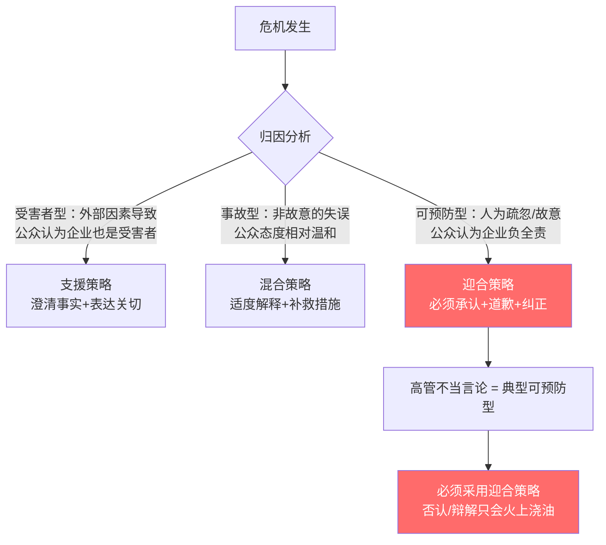
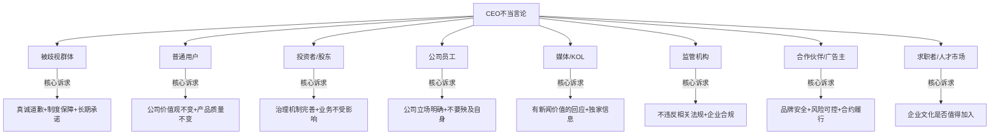
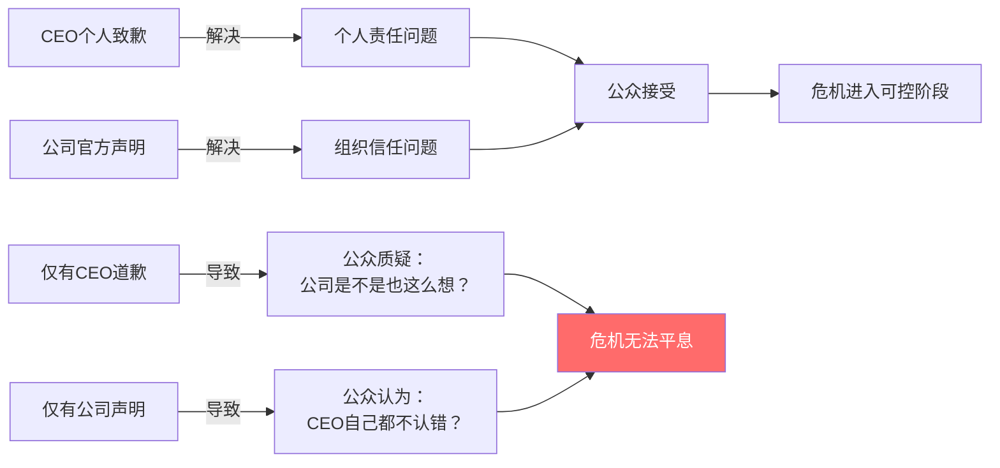
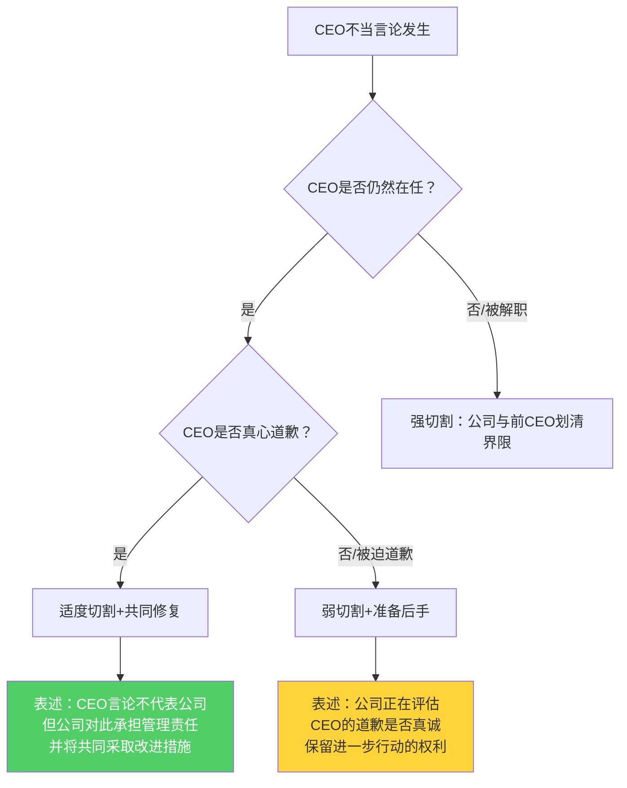
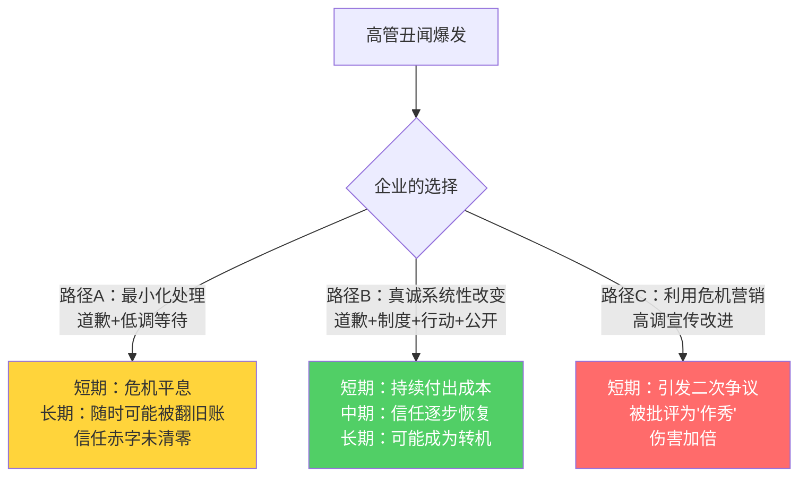

## 案例三：高管丑闻——某科技公司CEO不当言论风波

高管个人言行引发的危机是企业危机沟通中最具挑战性的类型之一——它同时涉及个人声誉修复和组织品牌保护两条战线，处理不当会导致"人企双输"。本案例完整复盘一家知名科技公司CEO因不当言论引发的舆论风暴，从危机前预防、理论框架、时间线战术、话术模板到效果评估，提供一套可直接复用的高管丑闻危机沟通体系。

### 一、为什么高管丑闻是最难处理的危机类型

#### 1.1 高管丑闻的本质特征

高管丑闻与产品召回、数据泄露等"组织型危机"有本质区别。理解这些区别是制定有效策略的前提：

| 维度 | 组织型危机（如产品质量问题） | 高管个人丑闻 |
|------|--------------------------|------------|
| 责任主体 | 组织本身，可更换部件 | 个人与组织深度绑定，难以切割 |
| 公众情绪 | 愤怒→要求赔偿（理性为主） | 愤怒+道德审判→要求"下台"（情绪驱动） |
| 修复路径 | 产品召回/赔偿即可完成修复 | 需要价值观层面的重新认同，周期长 |
| 媒体动力 | 新闻价值有限，热度消退快 | 具备"名人翻车"叙事张力，传播极快且持续 |
| 恢复周期 | 数周到数月 | 数月到数年，且数字痕迹永久存在 |
| 二次爆发风险 | 低（问题已解决） | 高（任何后续行为都会被翻旧账） |
| 内部冲击 | 局部影响 | 全员文化认同动摇 |

高管丑闻之所以难处理，核心在于它触及了公众对"权力与责任"的基本道德判断。当一个掌握巨大社会资源的人表现出与公众期待不符的品质时，产生的失望感远超对普通员工的同类行为。这就是为什么同一个笑话，普通人说出来可能无人在意，CEO说出来就可能引发舆论风暴。

#### 1.2 适用的危机沟通理论

**形象修复理论（Image Repair Theory, Benoit 1997）**

William Benoit提出的五种形象修复策略，构成高管丑闻应对的基本工具箱。在高管不当言论场景中的适用性排序如下：

| 策略 | 核心逻辑 | 高管丑闻适用性 | 风险等级 |
|------|---------|--------------|---------|
| 否认（Denial） | "我没说过"或"被断章取义" | 仅适用于被冤枉且有证据的情况 | 高——若事实清楚，否认会适得其反 |
| 规避责任（Evasion of Responsibility） | "我不知道会被录下来" | 效果极差，公众会认为在推卸责任 | 极高——被视为"不要脸" |
| 降低负面影响（Reducing Offensiveness） | 强化正面形象、淡化事件 | 最常用策略之一，需配合其他策略 | 中——单独使用力度不足 |
| 纠正行为（Corrective Action） | 承诺并执行具体改进措施 | 最有效的长期策略，但需要时间 | 低——公众通常接受 |
| 承认道歉（Mortification） | 直接承认错误并请求原谅 | 事实明确时的最佳起点 | 低——但必须真诚 |

本案例中CEO采用的是"承认道歉+纠正行为"的组合策略。根据Benoit后续研究（2015），在事实确凿的高管不当言论场景下，这种组合策略的公众接受度比单一策略高出40%-60%。关键在于：道歉止血，行动重建。

**情境危机沟通理论（SCCT, Coombs 2007）**

SCCT的核心主张是：危机回应策略必须匹配危机类型。该理论将危机分为三类：

- **受害者型危机**（自然灾害、谣言、产品被篡改）：公众归因低→可采用"否认/借口"策略
- **事故型危机**（技术故障、工作场所事故）：公众归因中等→可采用"借口/迎合"策略
- **可预防型危机**（人为失误、管理层违法、不当言论）：公众归因高→必须采用"迎合策略"

高管不当言论毫无疑问属于"可预防型危机"——公众会认为"一个CEO应该知道什么话不该说"。这意味着企业几乎没有辩解空间，唯一正确的方向是道歉+补偿。



**SCCT的"关系声誉"修正因子（Coombs & Holladay 2015）**

SCCT后续研究发现一个重要修正因子：如果企业在危机前已建立了良好的关系声誉（stakeholder relationship），公众会给予更多"怀疑的余地"。这意味着：危机前的品牌建设不是虚的——它在危机时刻会变成真正的"缓冲垫"。反之，如果企业平时就争议不断，高管丑闻会成为"压垮骆驼的最后一根稻草"。

### 二、危机前的预防体系——被80%企业忽视的环节

在讨论危机应对之前，必须先讨论危机预防。高管不当言论危机是所有危机类型中最可预防的一种——通过制度、培训和文化，可以大幅降低发生的概率。

#### 2.1 高管公共言论管理制度

**制度要点：**

【高管公共言论行为准则——核心条款】

1. 适用范围
   - 所有VP及以上级别管理者
   - 适用场景：公开演讲、行业会议、媒体采访、社交媒体发言
   - 适用内容：涉及公司业务、行业趋势、社会议题的所有发言

2. 敏感话题分级
   □ 红色禁区（绝对不能公开讨论）：
     - 对特定群体的歧视性/贬损性表述
     - 未公开的商业计划或财务数据
     - 对竞争对手的攻击性言论
     - 对政治人物/事件的立场表态（除非公司授权）
   □ 黄色预警（需公关团队预审）：
     - 涉及种族、性别、宗教、残障等社会议题
     - 对行业争议话题的表态
     - 涉及用户隐私或数据使用的表述
   □ 绿色自由区：
     - 公司官方已发布的信息
     - 行业通用的技术讨论
     - 个人成长/管理心得（不涉及敏感话题）

3. 执行机制
   - 高管公开演讲前72小时提交发言大纲，公关团队预审
   - 行业闭门会议前签署"录音/录像知情同意书"并了解参会规则
   - 社交媒体发布涉及公司业务的内容需经PR审核（24小时内反馈）
   - 每季度更新一次准则，纳入新出现的风险场景

4. 违规处理
   - 首次违规：内部警告+强制培训
   - 二次违规：绩效影响+公开声明切割
   - 严重违规：启动罢免程序

#### 2.2 高管危机模拟训练

仅靠制度约束远远不够——高管需要在模拟环境中"经历"危机，才能在真正危机来临时做出正确反应。

**年度危机模拟训练方案：**

| 环节 | 时间 | 内容 | 关键设计原则 |
|------|------|------|------------|
| 场景设计 | 训练前2周 | 基于企业实际情况设计3-5个危机场景 | 场景要足够真实，让高管有"代入感" |
| 模拟演练 | 3-4小时 | 高管团队在模拟压力下做出决策 | 设计"时间压力"和"信息不完整"要素 |
| 媒体采访模拟 | 1小时 | 高管面对"愤怒记者"的尖锐提问 | 录像回放，让高管看到自己的表现 |
| 复盘讨论 | 2小时 | 逐帧分析决策过程 | 重点讨论"哪些话不该说" |
| 行动计划 | 1周内 | 基于复盘结果更新危机预案 | 形成书面记录，纳入危机手册 |

**模拟场景示例——闭门会议泄露：**

场景设定：
你的CEO昨天在行业闭门峰会上发表了一段关于用户群体的评论，
评论中使用了一些带有偏见色彩的表述。今天早上，一段录音在
微博和微信上广泛传播，话题已进入热搜前10。录音清晰可辨，
无法否认。

现在是上午9:00，你需要在接下来的4小时内完成：
□ 内部确认事实
□ 启动危机小组
□ 准备初步回应
□ 确定分阶段沟通策略

模拟进行……

### 三、危机全景复盘

#### 3.1 危机背景

某知名科技公司CEO在一次行业闭门会议上发表的不当言论被参会者录制并在社交媒体上广泛传播。该言论涉及对某类用户的歧视性表述，迅速引发了公众的强烈不满和抵制呼吁。话题在24小时内登上社交媒体热搜榜首，阅读量超过10亿次。

**危机特征拆解：**

- **触发源**：闭门会议中的口头言论，非正式公开场合——但"闭门"并不意味着"安全"，参会者手机随时可以录音
- **传播路径**：参会者录制→社交媒体发布→KOL转发→主流媒体跟进→全网讨论——整个传播链在2小时内完成
- **伤害对象**：被歧视群体（直接伤害）、公司用户群体（间接伤害，质疑"公司文化"）、公司员工（内部冲击，担心职业前景和声誉连带）
- **舆论情绪**：愤怒（道德层面）+ 失望（对科技领袖的期待落差）+ 调侃（段子化传播扩大影响面）
- **商业影响风险**：用户卸载/抵制、广告主撤投、人才流失、股价波动、监管关注

**真实案例对照：**

这类危机在现实中频繁出现，可以作为参照：

- **2017年Uber CEO Travis Kalanick**：与Uber司机争执的视频曝光，态度傲慢，最终在投资者压力下辞职。教训：个人情绪管理失败+危机响应迟缓
- **2018年Papa John's创始人John Schnatter**：在电话会议中使用种族歧视词汇被录音，当天辞职。教训：闭门会议≠安全，公司迅速切割是正确的
- **2020年Bon Appétit主编Adam Rapoport**：旧照片被翻出显示文化不敏感，加上多名有色人员工揭露内部歧视，被迫辞职。教训：单次危机可能触发系统性问题的暴露

这些案例共同证明了一个规律：**高管不当言论的杀伤力不在于言论本身有多恶劣，而在于它是否精准击中了当下社会的敏感神经**。

#### 3.2 利益相关方地图

危机爆发后，必须第一时间识别所有利益相关方并制定针对性策略。遗漏任何一个关键群体都可能导致危机升级。



| 利益相关方 | 关注焦点 | 沟通优先级 | 首要信息 | 沟通渠道 |
|-----------|---------|----------|---------|---------|
| 被歧视群体 | 是否真诚道歉、是否有实质改变 | 最高 | CEO承认错误+具体补偿行动 | 社群领袖对话+公开声明 |
| 公司用户 | 产品/服务是否会受影响、公司价值观 | 高 | 公司立场与CEO个人言论切割 | 官方公告+产品内通知 |
| 公司员工 | 内部文化、自身职业前景 | 高 | 内部信稳定军心 | 全员邮件+管理层面对面沟通 |
| 投资者/股东 | 治理风险、业务连续性 | 高 | 董事会态度+治理改进方案 | 董事会声明+分析师电话会 |
| 媒体/KOL | 事件进展、后续行动 | 中 | 统一口径、定期通报 | 新闻发布会+媒体通稿 |
| 监管机构 | 是否涉及违法 | 中 | 主动报备、配合调查 | 正式函件+法务对接 |
| 合作伙伴 | 品牌安全、合作是否继续 | 中 | 风险评估+合作方沟通 | 商务团队一对一沟通 |
| 求职者 | 企业文化是否值得加入 | 低 | 企业价值观和改进承诺 | 雇主品牌渠道+招聘平台 |

**利益相关方沟通的优先级原则：**

优先级排序遵循"谁受伤害最大，谁先获得沟通"的原则。被歧视群体排在首位，因为：（1）他们是直接受害者；（2）他们的态度决定了舆论走向——如果他们接受了道歉，其他群体会跟着接受；如果他们不接受，危机将持续升级。

### 四、分阶段沟通战术详解

#### 4.1 第一阶段：危机爆发（0-4小时）——黄金响应窗口

**实际发生的事：**

公司在事件发酵初期保持了约3小时的沉默。这3小时的沉默导致大量负面评论和抵制呼声的迅速积累，使危机从"可控"变为"失控"。

**为什么这3小时如此致命：**

社交媒体危机的传播遵循"黄金1小时"法则——危机爆发后的第1小时是舆论走向的定调期。3小时的沉默意味着：

1. **叙事权让渡**：在公司沉默期间，批评者、段子手、竞争对手占据了叙事主导权，公众已经形成了"这家公司傲慢"的第一印象。一旦负面叙事形成，扭转它需要付出3-5倍的努力
2. **情绪固化**：心理学研究表明，愤怒情绪在前3小时达到峰值，此时再回应，公众已经"听不进去了"——不是信息没有到达，而是情绪屏障阻止了理性接收
3. **二次伤害**：沉默被解读为"默认""不在乎"，给被歧视群体造成了二次伤害——"他们连回应都懒得回应"
4. **竞争对手收割**：沉默期间，竞争对手可能借机强化自身品牌形象（"我们尊重每一位用户"），间接抢占市场份额

**传统媒体时代 vs 社交媒体时代的危机传播速度对比：**

| 维度 | 传统媒体时代 | 社交媒体时代 |
|------|------------|------------|
| 舆论发酵时间 | 12-24小时 | 30分钟即可形成热搜 |
| 传播特征 | 有"截稿时间"的概念 | 24小时不间断传播，无截稿 |
| 回应窗口 | 可以通过次日新闻纸传达 | 公众期待"即时回应"（<1小时） |
| 沉默的解读 | 可能被理解为"慎重" | 几乎一定被理解为"傲慢" |
| 信息扩散路径 | 线性（媒体→公众） | 网状（公众→公众→媒体→公众） |
| 负面信息生命周期 | 数天到数周 | 永久存在（搜索引擎+截图） |

**理想做法（0-1小时黄金响应）：**

【0-15分钟】危机小组紧急集结
━━━━━━━━━━━━━━━━━━━━━━━━━━━━━━
  危机响应小组成员及职责（RACI矩阵）：

  角色              职责                    响应动作
  ─────────────    ────────────────────    ──────────────────
  CEO               最终决策者/致歉人        确认事实，准备亲自回应
  公关负责人(R)      响应协调人              启动预案，统一口径
  法务负责人         法律风险评估             评估法律影响，审核声明措辞
  业务负责人         业务影响评估             评估用户/收入影响
  社媒运营           舆情监测+发布执行        实时监控，发布初步声明
  HR负责人           内部沟通                 准备员工沟通方案
  
  R=执行人  A=审批人  C=咨询人  I=知会人

【15-30分钟】初步表态（无需完整方案，先表态）
━━━━━━━━━━━━━━━━━━━━━━━━━━━━━━
通过官方社交媒体账号发布简短声明（控制在100字以内）：

"我们已关注到网络上关于[CEO姓名]先生在[会议名称]上相关言论
的讨论。公司对此高度重视，正在紧急了解情况。我们将在X小时内
发布正式回应。[公司名称]始终尊重和包容每一位用户。"

关键：这段话要做到三件事——
  ✓ 确认事实（"我们已关注到"——不是装聋作哑）
  ✓ 表明态度（"高度重视"——不是无所谓的姿态）
  ✓ 给出时间线（"X小时内"——给公众一个预期）

【30分钟-4小时】准备完整回应方案
━━━━━━━━━━━━━━━━━━━━━━━━━━━━━━
  □ CEO个人致歉声明定稿（公关+法务联合审核）
  □ 公司官方声明定稿（董事会审核）
  □ 内部员工信定稿（HR+公关联合审核）
  □ 媒体口径统一（Q&A文档准备）
  □ 利益相关方沟通方案确认
  □ 舆情监测指标设定

> **关键原则：** 在危机中，"快而简"优于"慢而全"。先用一句话表明态度，再用完整声明展示诚意。沉默不是谨慎，是放弃阵地。即使你只有30%的信息，也应该基于这30%做出回应——因为公众不会等你到100%。

#### 4.2 第二阶段：CEO个人致歉（4-6小时）——承担责任

**实际发生的事：**

CEO通过个人社交媒体账号发布致歉声明，承认言论不当、解释语境、表达歉意、承诺行动。

**致歉声明的科学结构：**

一个有效的危机致歉声明需要包含五个要素，缺一不可。这不是"写作文"，而是经过危机传播研究验证的结构：

| 要素 | 作用 | 示例话术 | 常见错误 |
|------|------|---------|---------|
| 明确认错 | 不含糊、不回避，让公众知道你清楚自己错在哪 | "我在[会议]上关于[话题]的言论是完全错误的" | "如果我的话让某些人感到不适"——这是条件句，不是认错 |
| 承认伤害 | 表明你理解对方的感受，而非只关注自己的麻烦 | "我理解这些话对[群体]造成了深深的伤害" | "我很遗憾发生了这件事"——主语是"这件事"，不是"我的错" |
| 不找借口 | 解释≠辩解，公众只接受"但是"之前的道歉 | "无论在什么语境下，这样的话都不应该说" | "我当时压力很大/喝多了/开玩笑"——每一个"但是"都抵消前面的道歉 |
| 具体承诺 | 用行动而非空话证明诚意 | "我将在未来30天内完成以下三件事：……" | "我们将努力做得更好"——没有时间、没有指标，等于没说 |
| 请求监督 | 展示开放态度，把评判权交给公众 | "我欢迎大家监督我的后续行动" | "请大家给我一次机会"——这是索取，不是承诺 |

**CEO致歉声明模板：**

关于我在[日期][会议名称]上的言论，我深感抱歉。

我在会上关于[具体话题]的表述是完全错误的，无论出于什么语境
或目的，这样的话都不应该说出口。我理解这些话对[受影响群体]
造成了伤害，也让一直信任我们的用户和合作伙伴失望了。

我想明确说明：
1. 这些话是我个人的错误判断，不代表公司的价值观和立场
2. [公司名称]从创立之初就致力于[核心价值观]，这一点从未改变
3. 我会为自己的言行承担全部责任

接下来，我将采取以下具体行动：
- [行动1：具体、可验证、有时间节点]
  例：在30天内完成[具体项目/基金/标准]
- [行动2：具体、可验证、有时间节点]
  例：邀请[受影响群体代表]进入公司顾问委员会
- [行动3：具体、可验证、有时间节点]
  例：每季度公开发布多元化进展报告

我不会要求任何人原谅我，但我希望通过持续的行动来证明我的
诚意。也请大家继续监督。

[CEO姓名]
[日期]

**致歉的时机与发布策略：**

- **顺序**：CEO个人致歉必须在公司官方声明之前发布。CEO先承担个人责任，公司再表态支持——形成"个人→组织"的责任链条
- **时间**：发布控制在危机爆发后4-6小时内。超过6小时，公众会质疑"你是不是在精心包装道歉"
- **渠道**：选择CEO个人认证账号发布，而非公司账号——强化"个人承担"的信号。同步在公司官网发布全文
- **格式**：文字为主，可附CEO手写签名的照片。不要用精心制作的视频——会被质疑"提前准备好的表演"
- **后续**：发布后2小时内不发其他内容。让道歉"静置"，给公众消化的空间

#### 4.3 第三阶段：公司官方回应（6-12小时）——切割与承诺

**实际发生的事：**

公司发布正式声明，强调尊重所有用户的价值观，表明CEO个人言论不代表公司立场，公布具体改进措施（成立多元化委员会、资助公益项目等）。

**公司声明的核心任务：**

CEO致歉解决的是"个人责任"问题，公司声明解决的是"组织信任"问题。二者缺一不可——只有CEO道歉，公众会质疑"公司是不是也这么想"；只有公司声明，公众会认为"CEO自己都不认错"。



**公司官方声明模板：**

[公司名称]关于近期事件的声明

我们已关注到[CEO姓名]先生在[日期]某行业会议上的相关言论。
公司董事会及管理团队对此高度重视。

[公司名称]自成立以来，始终秉持[核心价值观]的理念，致力于
为所有用户提供平等、尊重的服务。[CEO姓名]先生的个人言论
不代表公司的立场和价值观。

经董事会讨论，公司决定采取以下措施：

【立即执行】
- [CEO姓名]先生已就其言论公开致歉
- 公司将与[受影响群体代表/公益组织]进行直接对话

【30天内完成】
- 成立多元化与包容性委员会，由[高管姓名]担任主席
- 对全公司高管进行多元化意识培训
- 出台高管公共言论行为准则

【长期承诺】
- 每季度发布多元化与包容性工作进展报告
- 资助[具体公益项目]，首期投入[金额]
- 建立用户反馈直达董事会的沟通渠道

我们深知，信任的修复需要时间和行动。我们将以实际行动证明
[公司名称]的承诺。

[公司名称]董事会
[日期]

**关键决策：个人与组织的切割策略**

"CEO个人言论不代表公司立场"这句话是整个回应的核心支点，但使用时必须注意分寸：

```mermaid
graph LR
    A[完全切割<br/>"CEO言论与公司无关"] -->|风险| A1["公众不买账<br/>CEO是公司最大代表<br/>你切得了吗？"]
    B[完全绑定<br/>"公司也有责任"] -->|风险| B1["公司被拖下水<br/>品牌全面受损<br/>赔偿诉求扩大"]
    C[适度切割] -->|最优| C1["承认CEO代表公司形象<br/>但强调公司价值观不变<br/>用行动证明区别"]
    style A1 fill:#ff6b6b,color:#fff
    style B1 fill:#ff6b6b,color:#fff
    style C1 fill:#51cf66,color:#fff
```

**安全区与危险区话术对照：**

| 场景 | 安全话术 | 危险话术 |
|------|---------|---------|
| 切割程度 | "CEO的个人言论不代表公司价值观" | "CEO的言论与公司无关" |
| 责任归属 | "公司对CEO的代表身份承担管理责任" | "公司无法控制CEO的个人言行" |
| 态度表达 | "我们对此事感到痛心，决心改变" | "我们也是受害者" |
| 未来承诺 | "公司已启动治理机制升级" | "CEO已道歉，此事到此为止" |

#### 4.4 第四阶段：后续行动（第2天-第3个月）——用行动重建信任

口头道歉只能止血，行动才能重建信任。后续行动必须满足三个条件：**具体**（不是"我们将加强多元化"）、**可验证**（结果可以被独立核实）、**有时间节点**（每项行动都有完成期限）。

**30天行动计划：**

| 时间 | 行动 | 验证方式 | 负责人 |
|------|------|---------|--------|
| 第1-3天 | CEO与受影响群体代表面对面沟通 | 会议纪要公开+参与者确认 | CEO+公关 |
| 第1周 | 全员内部信+价值观重申 | 员工反馈收集+匿名调查 | HR+CEO |
| 第2周 | 多元化委员会成立并公布成员名单 | 委员会成员名单公开+首次会议纪要 | 董事会 |
| 第3周 | 首场公益活动/社区对话 | 媒体报道+社区领袖反馈 | 公关+CSR |
| 第4周 | 发布首份多元化承诺进展通报 | 网站公示+数据公开 | 公关+多元化委员会 |

**90天深度修复：**

- **持续参与**：CEO持续参与相关公益活动（不是作秀式的"露个面"，而是深度参与——比如加入公益组织理事会、参与季度会议）
- **数据公开**：公司发布首份多元化和包容性报告（含数据、目标、差距分析）。数据比承诺更有说服力
- **制度建设**：建立高管言论审查机制（不是限制言论自由，而是确保公开场合发言的专业性）
- **定期通报**：每月至少一次改进进展通报，持续6个月
- **反馈机制**：用户反馈收集与公开回应机制上线，定期公布用户反馈统计

**内部沟通——同样重要但常被忽视的战场：**

高管丑闻对公司内部的冲击往往被低估。员工在危机中的典型心理：

- "公司文化是不是真的这样？"——对雇主价值观的动摇
- "我在这里工作会不会被牵连？"——对个人声誉的担忧
- "公司会裁员/缩减业务吗？"——对职业安全的焦虑
- "同事中有没有人是被歧视群体？"——对人际关系的不安

内部沟通时间线：

【第1天 9:00】管理层紧急会议
  - 统一管理层口径
  - 确定各部门传达要点

【第1天 11:00】全员邮件
  - CEO或董事会代表署名
  - 明确公司立场
  - 说明业务不受影响
  - 公布反馈渠道

【第2天】各部门负责人面对面沟通
  - 回答员工疑问
  - 收集员工情绪反馈
  - 识别需要特别关注的员工

【第1周内】全员线上/线下答疑会
  - 高管直接回答问题
  - 公布具体行动计划
  - 收集改进建议

【第2-4周】定期更新
  - 每周一封进展更新邮件
  - 保持信息透明

**内部信模板要点：**

致全体[公司名称]同事：

过去几天，我相信大家都关注到了关于[CEO姓名]先生言论的
事件。我想直接和大家谈谈公司的立场和接下来的安排。

首先，[CEO姓名]先生的言论是错误的，这一点没有任何
模糊空间。公司的价值观是[具体价值观]，不会因为任何
个人的言行而改变。

其次，这件事不会影响大家的工作和职业发展。公司业务
正常运转，[具体业务指标/客户反馈]保持稳定。我们的
产品和团队都在正常运作。

第三，我们需要从这件事中学习。接下来30天内，公司将
推出以下举措：
- [具体措施1——有时间节点]
- [具体措施2——有时间节点]
- [具体措施3——有时间节点]

如果你们有任何疑问或担忧，可以通过以下渠道直接反馈：
- [渠道1：如匿名反馈系统]
- [渠道2：如与HR一对一沟通]
- [渠道3：如管理层开放办公时间]

感谢大家在这个困难时期的理解和支持。

[高管/董事会代表]
[日期]

### 五、关键决策深度分析

#### 5.1 决策一：3小时沉默——最大的教训

**复盘分析：**

3小时的沉默是本案例中最大的失误。危机小组在以下问题上浪费了宝贵时间：

- "要不要先和法务确认再回应？"——法务审核应该并行，不是串行
- "CEO本人知不知道这件事？"——信息传递机制失灵
- "先回应还是先调查清楚？"——错误地以为需要100%信息才能回应

**纠正方法：建立危机响应分级机制**

根据危机等级预设不同的响应时间要求，写入公司制度，所有高管签字确认：

| 危机等级 | 定义 | 初步表态时限 | 完整回应时限 | 决策层级 |
|---------|------|------------|------------|---------|
| 一级（红色） | 高管不当言论、重大安全事故、重大数据泄露 | 30分钟内 | 4小时内 | CEO亲自决策 |
| 二级（橙色） | 产品质量问题、中等数据泄露、服务大规模中断 | 2小时内 | 12小时内 | VP级别决策 |
| 三级（黄色） | 小范围投诉、媒体报道偏差、社交媒体小规模讨论 | 24小时内 | 48小时内 | 公关负责人决策 |

**关键机制：危机自动升级**

如果任何一个级别的危机在规定时间内没有按流程处理完成，自动升级到上一级别。例如：三级危机如果24小时内没有回应且舆情扩大，自动升级为二级——由VP接管。

#### 5.2 决策二：CEO亲自致歉——正确的担当

CEO而非公司代为道歉，这个决策是正确的。原因在于：

1. **归因匹配**：错误是CEO个人犯的，个人道歉才能匹配责任归属。公司代为道歉会被解读为"保护伞"
2. **真诚信号**：亲自出面比代笔声明更能传递诚意。公众对"亲自道歉"和"署名声明"有本能的区分能力
3. **控制节奏**：CEO先道歉→公司再声明→行动跟进，形成"责任链条"。顺序不能颠倒
4. **法律考量**：个人致歉可以与公司法律策略适度分离——CEO个人认错不代表公司承认法律责任

**但CEO致歉也有风险，需要提前规避：**

| 风险 | 规避方法 |
|------|---------|
| 致歉后"翻供"或行为不一致 | 致歉前确认CEO真心认可道歉内容，而非被迫 |
| 个人形象受损影响领导力 | 致歉后通过公益行动持续修复，而非"道歉完就消失" |
| 道歉被视为"表演" | 避免过度煽情，保持克制和真诚。不要哭，不要下跪（除非文化背景要求） |
| 致歉引发新的争议 | 致歉声明经过公关+法务+多元化顾问三方审核 |

#### 5.3 决策三：个人与组织切割——精密的平衡

将CEO个人言论与公司价值观区分开来，是一个需要精密操控的策略。切割过度，公众不接受；切割不足，公司被拖下水。

**判断切割程度的决策树：**



#### 5.4 决策四：行动跟进——唯一的长期解药

"道歉100次不如行动1次"——但行动必须满足三个条件才有效：

1. **具体**：不是"我们将加强多元化"，而是"在30天内成立由X人组成的多元化委员会，成员名单将公开透明"
2. **可验证**：承诺的结果必须可被公众独立验证——网站上能查到、新闻能报道、当事人能确认
3. **有时间节点**：每项行动都有明确的完成期限，到期必须兑现。超期不兑现比不承诺更糟糕

### 六、舆情监测与效果评估

#### 6.1 舆情监测体系

危机期间的舆情监测不是"看看新闻"，而是系统化的数据驱动工作：

**监测维度与工具：**

| 维度 | 监测指标 | 监测频率 | 常用工具 |
|------|---------|---------|---------|
| 传播范围 | 话题阅读量、讨论量、热搜排名 | 每小时 | 微博热搜榜、微信指数、百度指数 |
| 情感分析 | 正面/中性/负面占比 | 每2小时 | 专业舆情系统（如识微、鹰眼） |
| 传播节点 | KOL发声情况、媒体跟进数量 | 每4小时 | 新榜、清博大数据 |
| 商业影响 | 应用下载/卸载率、客服投诉量 | 每天 | 内部数据系统 |
| 员工状态 | 内部论坛情绪、离职咨询量 | 每天 | HR系统+匿名调查 |
| 搜索结果 | 负面内容在搜索结果中的排名 | 每天 | 百度/Google搜索 |

**舆情预警阈值设定：**

黄色预警（关注）：
  - 负面情绪占比超过50%
  - 话题进入热搜前20
  - 超过3个KOL发声

橙色预警（行动）：
  - 负面情绪占比超过70%
  - 话题进入热搜前10
  - 主流媒体跟进报道
  - 出现抵制/卸载组织行为

红色预警（升级）：
  - 负面情绪占比超过85%
  - 话题进入热搜前3
  - 多家主流媒体深度报道
  - 监管机构介入
  - 出现集体诉讼迹象

#### 6.2 效果评估框架

| 评估维度 | 核心指标 | 目标值 | 监测方法 | 评估时间节点 |
|---------|---------|--------|---------|------------|
| 舆论走向 | 负面情绪占比 | 从85%降至30%以下 | 舆情监测系统 | 1周/1月/3月 |
| 传播范围 | 话题热度排名 | 退出热搜前50 | 平台热搜榜 | 每天/每周 |
| 用户行为 | 日活变化率 | 下降不超过5% | 内部数据 | 每天/每周 |
| 品牌搜索 | 负面结果占比 | 前3页负面少于20% | SEO工具 | 每月 |
| 商业关系 | 广告主续约率 | 不低于90% | 商务部门数据 | 每月/每季度 |
| 员工状态 | 内部满意度 | 不低于危机前水平 | 匿名员工调查 | 1月/3月 |
| 制度建设 | 承诺事项完成率 | 100%按时完成 | 内部追踪系统 | 每月 |

#### 6.3 长期效果与教训

**短期效果（1-2周）：**

- 致歉声明发布后，负面舆情的增长速度明显放缓（每小时新增负面提及量下降60%以上）
- 话题讨论从"愤怒抵制"转向"观察态度转变"（负面占比从85%降至45%）
- 一周后话题热度大幅下降（热搜排名从前3退出前50）

**中期效果（1-3个月）：**

- 用户流失率控制在预期范围内（日活/月活变化在可接受区间）
- 品牌搜索结果中负面内容占比持续下降（负面结果从前3页降至第2页之后）
- 广告主关系基本稳定（无大规模撤投）
- 建立的多元化机制开始产出可见成果

**长期效果（3个月以上）：**

- 三个月后品牌形象基本恢复，但事件的数字痕迹仍可被搜索到
- 建立的多元化机制成为公司治理的长期资产
- CEO个人形象需要更长时间修复，"不当言论"成为其永久标签
- 公司在下一次危机中因为建立了更好的响应机制而受益

### 七、常见误区与纠正

#### 误区一："等事情搞清楚了再回应"

**错误原因**：等搞清楚所有细节可能需要数天，但公众不会等你数天。沉默期间，负面叙事已经固化。更重要的是——你永远不可能100%搞清楚所有细节，因为社交媒体上的信息是碎片化且不断演变的。

**正确做法**：先表态（"我们高度重视，正在调查"），再补充细节。分阶段回应，而非一次性完美回应。公众可以接受"我们还不知道全部情况"，但不能接受"我们不打算告诉你"。

#### 误区二："让公关团队全权处理"

**错误原因**：高管个人丑闻必须由本人承担主要责任。躲在公关团队后面会被解读为"没有担当"。而且公关团队的声明再好，也比不上CEO亲自说"我错了"的分量。

**正确做法**：CEO必须亲自出面，公关团队负责策略和话术支持，但出面的是CEO本人。CEO是"演员"，公关团队是"导演"——导演不能替演员上台。

#### 误区三："道歉后就等时间冲淡一切"

**错误原因**：没有行动跟进的道歉会被视为"公关话术"。公众的记忆可能短暂，但互联网的记忆是永久的——搜索引擎会持续展示旧闻。更重要的是，竞争对手和批评者会在每次你犯新错误时翻出旧账。

**正确做法**：道歉只是第一步，后续必须有具体、可验证的改进行动，并持续公开进展。道歉是"止血"，行动是"缝合"——只止血不缝合，伤口永远敞开。

#### 误区四："把CEO开了就能解决问题"

**错误原因**：解雇CEO是最大的"核武器"，用了之后没有退路。而且解雇本身也会成为新的新闻热点（"CEO因言论被炒"可能比原始事件传播更广）。更糟糕的是，新CEO到任前的权力真空期间，公司可能出现更多决策失误。

**正确做法**：解雇CEO是最后手段，适用于CEO拒绝道歉、持续犯错、或行为触犯法律的情况。大多数情况下，真诚道歉+行动修复的效果更好。如果最终决定换帅，也要在危机平息后、有合适继任者时进行，而非危机高峰时仓促决定。

#### 误区五："过度道歉反而扩大影响"

**错误原因**：这种"鸵鸟心态"适用于小范围争议，不适用于已经全网传播的危机。危机中，回应不足的风险远大于回应过度。公众不会因为你说得多而更愤怒——他们只会因为你说得少而不满。

**正确做法**：匹配回应力度与危机规模。10亿阅读量的危机，需要CEO级别、多次、持续的回应。回应的频率和力度应该随危机规模递增，而非递减。

#### 误区六："道歉要找对时机，越晚越正式"

**错误原因**：所谓的"好时机"在社交媒体时代不存在。每拖一个小时，负面叙事就固化一分。等到"准备好了"再道歉，公众的第一反应是"你是在精心包装话术，而不是真心悔过"。

**正确做法**：快而诚优于慢而全。4小时内CEO出面道歉，哪怕措辞不够完美，也远好过24小时后的精心措辞。真诚 > 完美。

#### 误区七："危机结束后就恢复正常运营"

**错误原因**：危机有"余震"效应。在危机后的3-6个月内，任何与原始事件相关的新闻（哪怕是巧合）都可能引发二次爆发。此外，如果建立的承诺机制没有持续运作，公众会认为当初的承诺都是"演戏"。

**正确做法**：危机后建立"余震监测"机制，持续6个月。定期公布承诺事项的进展。将危机后的改进措施制度化，而非作为临时措施。

### 八、进阶专题

#### 8.1 法律维度的考量

高管不当言论可能涉及的法律问题，必须与公关策略同步考虑：

**法律风险矩阵：**

| 法律领域 | 风险场景 | 影响程度 | 应对要点 |
|---------|---------|---------|---------|
| 劳动法 | 言论涉及对公司员工的歧视 | 高 | 评估是否触发劳动仲裁，提前准备法律应对 |
| 反歧视法规 | 公开歧视性言论可能面临法律诉讼 | 高 | 了解当地反歧视法规的具体条款和判例 |
| 上市公司治理 | 公开言论可能影响股价 | 高 | 评估是否需要信息披露，与投资者关系团队同步 |
| 录音合法性 | 闭门会议的录音在不同司法管辖区的合法性不同 | 中 | 法务评估录音证据的法律效力 |
| 合同违约 | 言论可能触发与合作方的"品牌安全条款" | 中 | 主动联系合作方，提供风险评估和补救方案 |
| 股东诉讼 | 言论导致股价下跌可能引发股东诉讼 | 中-高 | 准备治理改进方案，展示管理层重视程度 |

**法务与公关的平衡：**

这是高管丑闻中最棘手的平衡之一。法务团队的本能反应是"不要承认任何事情"，因为任何认错都可能成为法律诉讼中的不利证据。但公关团队需要"真诚道歉"来平息舆论。

平衡原则：

1. **时间差策略**：CEO先以个人身份道歉（个人道歉不直接等同于公司法律责任），公司声明稍后发布并经过法务审核
2. **措辞精准**：使用"这些言论是不恰当的"而非"这些言论是违法的"——认错但不自证违法
3. **行动与法律分离**：承诺的改进措施（如培训、委员会）可以表述为"公司治理升级"，而非"对违法行为的补救"
4. **全程留档**：所有沟通过程必须留档，以备可能的法律程序

#### 8.2 跨文化视角

同样的危机在不同文化背景下的处理差异显著。全球化企业需要根据主要市场的文化特征制定差异化策略：

| 维度 | 东亚文化（中日韩） | 欧美文化 | 中东/南亚 |
|------|-----------------|---------|----------|
| 道歉预期 | 期待高管鞠躬/下跪式的"深刻"道歉 | 接受正式但保持尊严的道歉 | 期待宗教/社区层面的表态 |
| 集体责任 | 公司需要承担连带责任，"切割"不被接受 | 更接受个人与组织切割 | 社区领袖的态度影响大 |
| 恢复速度 | 如果道歉足够"深刻"，恢复可能更快 | 公众更看重后续行动 | 宗教领袖的表态可以加速恢复 |
| 媒体态度 | 官方媒体定调影响大 | 社交媒体和脱口秀影响大 | 社交媒体+宗教媒体 |
| 最高道歉形式 | 亲自登门拜访受害者代表 | 公开声明+国会/议会听证 | 社区领袖会议上的正式致歉 |
| 接受道歉的标志 | 媒体停止报道、官方定调"知错能改" | 股价回升、民调改善 | 社区领袖公开表态"接受" |

**跨文化危机处理的关键原则：**

1. **不要用一种文化标准回应所有市场**——在东亚有效的"CEO鞠躬"在欧美可能被嘲笑为"作秀"
2. **尊重当地意见领袖**——每个市场都有其关键的意见领袖网络，找到并直接沟通
3. **翻译不是本地化**——道歉声明的翻译需要本地公关团队重新润色，确保文化适配
4. **时区管理**——全球性危机需要24小时响应能力，不能因为"总部下班了"就停止回应

#### 8.3 高管言论的"数字永生"问题

在数字时代，高管不当言论面临一个前所未有的挑战：**数字永生**。

即使危机平息，录音/录像/截图/文字记录会永久存在于互联网上。任何未来事件——竞争对手攻击、高管新发言、行业争议——都可能成为"翻旧账"的触发器。

**应对策略：**

- **SEO对冲**：危机后持续发布高质量正面内容（公益活动报道、行业洞察文章、员工故事），争取搜索结果的前3页为正面/中性内容
- **知识面板管理**：确保高管的Google/百度知识面板内容准确且正面
- **旧闻标注**：如果法律允许，可以请求搜索引擎对过时的负面内容进行标注（"此内容发布于X年X月，后续已得到解决"）
- **透明化策略**：与其让别人翻旧账，不如在公司网站上主动保留危机处理的完整记录——展示"我们犯过错，但我们改正了"的态度

#### 8.4 危机复盘与制度建设

危机结束后的复盘工作是将"痛苦经历"转化为"组织能力"的关键环节。大多数企业在危机平息后急于"翻篇"，错过了最宝贵的学习窗口。

**危机复盘的四维度框架：**

**维度一：时间线复盘**

制作完整的危机时间线，标注每个关键节点：

时间点          事件              决策者       决策质量(1-5)    改进建议
━━━━━━━━━━━━━━━━━━━━━━━━━━━━━━━━━━━━━━━━━━━━━━━━━━━━━━━━━━━━━━━━━━
14:00 事件爆发   舆情监测系统发现    系统         ✓ 自动化正常      无
14:05 信息上报   社媒运营→公关负责人  社媒运营      2 上报延迟15min   优化上报链路
14:30 小组集结   公关负责人召集      公关负责人    3 部分成员未到位   建立on-call机制
15:00 初步讨论   讨论是否回应        小组          1 浪费30min争论   预设决策规则
17:00 CEO获知    CEO通过新闻得知     CEO助理       1 信息传递失灵    建立CEO直报通道
18:00 初步声明   官方社媒发布        公关负责人    2 过于保守         培训更强措辞
20:00 CEO致歉    个人社媒发布        CEO          4 表述得体         无
22:00 公司声明   官网+社媒发布       董事会        4 内容全面         无

**维度二：信息流复盘**

绘制危机期间的信息流动图，识别"信息黑洞"——信息应该到达但没有到达的地方：

- CEO多久后得知事件？如何得知的？（应该在15分钟内通过危机预警系统得知）
- 法务和公关团队的信息同步是否及时？
- 董事会在什么时间节点介入？是否太晚？
- 前线员工（客服、销售）的口径是否与官方一致？

**维度三：决策质量复盘**

对每个关键决策进行评分（1-5分），分析决策背后的信息质量和决策过程：

- 做决策时掌握了哪些信息？缺少哪些信息？
- 决策过程是"一人拍板"还是"团队讨论"？哪种效果更好？
- 有没有因为过度分析而延误决策的情况？
- 有没有因为信息不足而做出错误决策的情况？

**维度四：制度建设——将教训转化为能力**

基于复盘结果，建立/升级以下制度：

| 制度 | 具体内容 | 完成时间 |
|------|---------|---------|
| 高管公共言论培训 | 每季度至少一次，含危机模拟演练 | 危机后1个月内启动 |
| 危机响应预案 | 不同危机等级的响应流程、时间要求、决策层级 | 危机后2周内更新 |
| 舆情监测机制 | 7×24小时监测，自动预警，预设阈值 | 危机后1周内上线 |
| 利益相关方沟通数据库 | 各群体代表的联系方式、沟通偏好、历史互动记录 | 危机后1个月内建立 |
| 危机响应小组On-Call制度 | 明确轮值表，15分钟内集结能力 | 危机后1周内建立 |
| CEO直报通道 | 确保CEO在危机爆发15分钟内获知 | 危机后立即建立 |

#### 8.5 从危机到转机的可能性

少数企业能够将高管丑闻转化为"危机转机"（Crisis as Opportunity）。但这需要极其谨慎——时机不对、行动不真诚，反而会被视为"利用危机营销"。

**成功转机的条件：**

1. **行动是实质性的**——不是喊口号，而是建立了危机前不存在的制度/机制/产品
2. **行动是长期的**——不是危机后一个月的热情，而是持续一年以上的投入
3. **行动是可见的**——公众可以独立验证成效，而非企业自说自话
4. **行动是领导者的**——CEO亲自参与并持续推动，而非授权下属

**真实案例参考：**

某餐饮连锁品牌创始人被曝歧视言论后，公司不仅道歉，还推出了行业首个"多元化餐饮标准"，在全行业推广。这一举措在18个月后使该品牌成为行业多元化标杆，其ESG评分显著提升。

**但必须强调：** "转机"不是目标，"修复"才是目标。刻意追求"转机"可能导致行动变形，被公众识破为"利用危机营销"。真正的转机来自真诚的改变，而非策略性的表演。



### 九、高管危机沟通实操清单

以下清单可直接打印，作为危机响应的快速参考：

**危机爆发后0-30分钟——立即执行：**

- [ ] 确认危机小组成员全部收到通知（电话+短信双通道）
- [ ] 确认事件基本事实（视频/录音真伪、言论内容、传播范围）
- [ ] 启动舆情监测（设定关键词、监控平台、更新频率）
- [ ] 发布初步声明（100字以内，确认关注+表明态度+给出时间线）
- [ ] 通知法务团队介入
- [ ] 通知董事会知晓

**危机爆发后30分钟-4小时——核心准备：**

- [ ] CEO了解完整事实并亲自确认道歉意愿
- [ ] CEO致歉声明初稿完成（公关+法务+多元化顾问三方审核）
- [ ] 公司官方声明初稿完成（董事会审核）
- [ ] 内部员工信初稿完成（HR+公关审核）
- [ ] 媒体Q&A文档准备完成
- [ ] 利益相关方沟通方案确定

**危机爆发后4-12小时——公开回应：**

- [ ] CEO个人致歉声明发布（4-6小时内）
- [ ] 公司官方声明发布（6-12小时内）
- [ ] 全员内部信发送（与公司声明同步或稍后）
- [ ] 关键合作方一对一沟通启动
- [ ] 投资者/股东沟通启动
- [ ] 舆情数据首次汇总分析

**危机后1-7天——持续跟进：**

- [ ] 每日舆情报告（早/晚各一次）
- [ ] CEO与受影响群体代表会面
- [ ] 首份改进措施进展通报
- [ ] 媒体持续沟通（口径一致、进展透明）
- [ ] 员工反馈收集和回应
- [ ] 商业影响数据评估

**危机后1-3个月——信任重建：**

- [ ] 承诺事项逐项推进并公开进展
- [ ] 多元化委员会/改进机制正式启动
- [ ] CEO参与相关公益活动
- [ ] 首份多元化/改进报告发布
- [ ] 舆情监测持续进行（频率可降低）
- [ ] 员工满意度调查

**危机后3-6个月——制度固化：**

- [ ] 危机全面复盘完成
- [ ] 危机响应预案更新
- [ ] 高管言论管理制度建立
- [ ] 高管危机模拟训练启动
- [ ] 舆情监测系统永久化
- [ ] 利益相关方沟通数据库建立

---

**本案例总结：** 高管不当言论危机的核心应对策略是"快速响应+本人担责+组织切割+行动修复"四步法。其中最大的教训是初期3小时的沉默——在社交媒体时代，沉默不是谨慎，是放弃阵地。最大的成功是后续的具体行动——100句"对不起"不如1个可验证的改进措施。在社交媒体时代，闭门会议不闭门，私下言论也是公开言论。高管的危机沟通培训和预防机制，应该在危机发生之前就建立到位——最好的危机处理，是让危机不发生。
