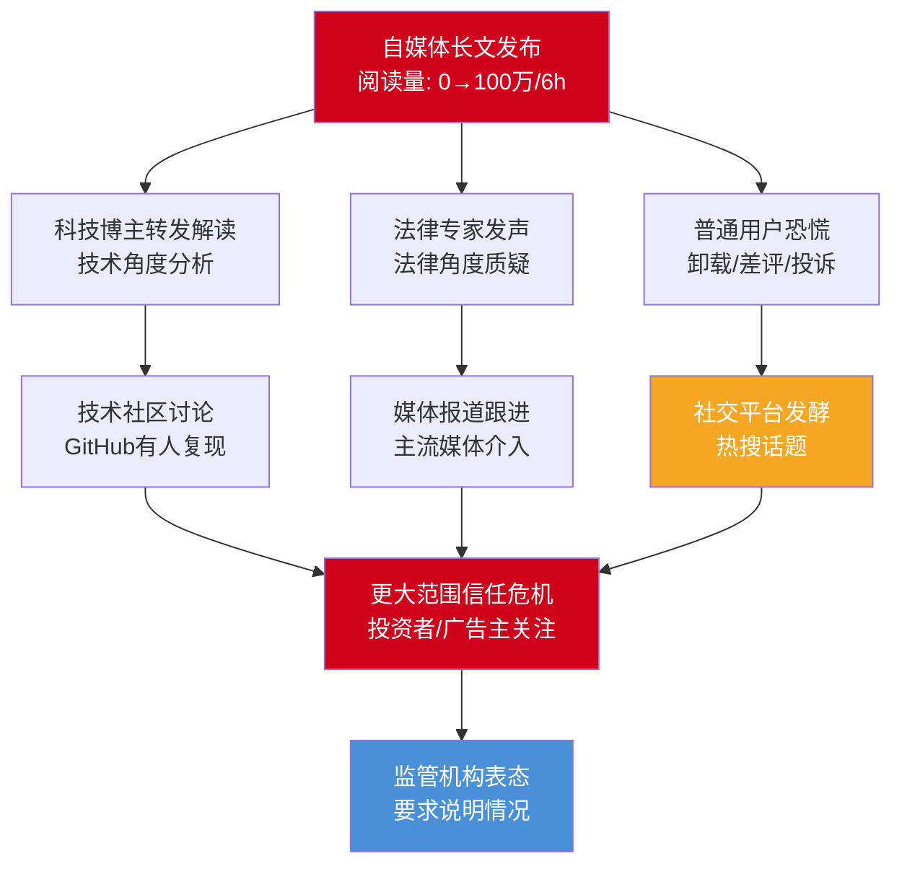
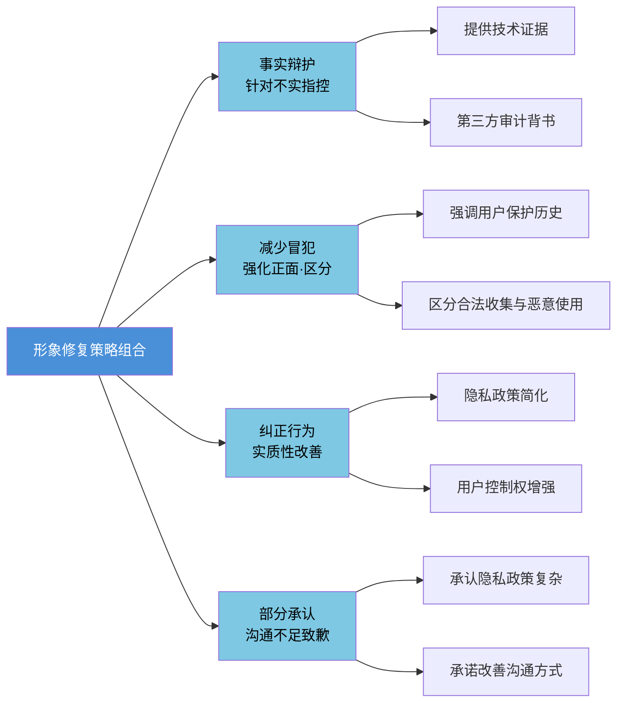
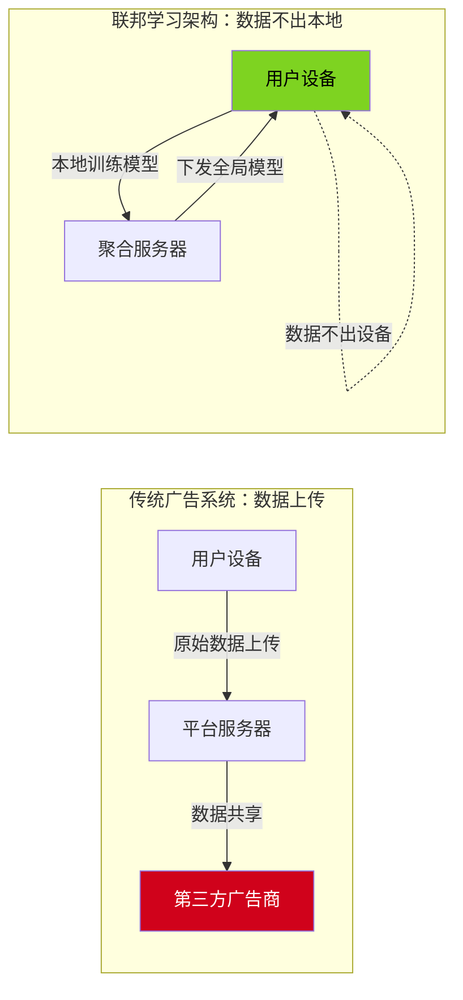
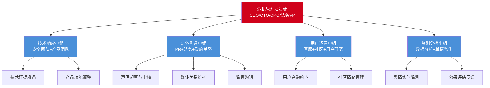
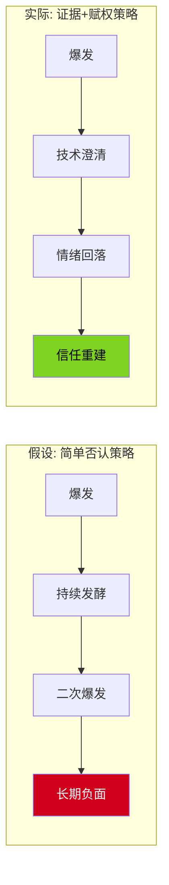
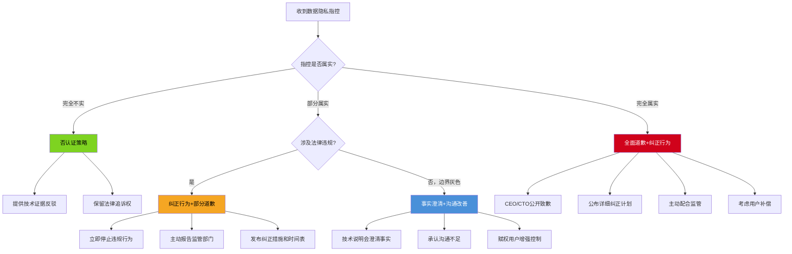

## 案例四：网络舆情——某互联网平台数据使用争议

数据隐私危机是数字时代最具杀伤力的组织危机类型之一——它不像产品召回那样有明确的修复终点，也不像高管丑闻那样可以靠人事变动切割。数据一旦被质疑，用户的恐慌会以病毒式速度扩散，且"互联网有记忆"的特性让每一次新隐私争议都会被拿来与旧账对比。本案例完整复盘某互联网平台因数据使用争议引发的全网舆情风暴，从危机前预防、舆情监测、理论框架、分阶段应对战术、技术说明会设计、监管沟通到6个月信任重建计划，提供一套可直接迁移到任何数据隐私危机的沟通体系。

### 一、为什么数据隐私危机是网络舆情中最难处理的类型

#### 1.1 数据隐私危机的独特性质

数据隐私危机与产品质量危机、高管丑闻有本质区别。理解这些区别是制定有效策略的前提：

| 维度 | 产品质量危机 | 高管丑闻 | 数据隐私危机 |
|------|-------------|---------|-------------|
| 恐慌根源 | 身体安全受威胁 | 道德失望 | 丧失控制感+隐私侵犯恐惧 |
| 修复路径 | 召回/赔偿即可完成 | 人事变动+价值观重塑 | 需重建数据治理体系，周期极长 |
| 证据特征 | 实物可检测 | 言行可回溯 | 技术黑箱，用户无法自行验证 |
| 传播动力 | 新闻价值有限 | "名人翻车"叙事 | "每个人都是受害者"的共鸣极强 |
| 情绪驱动 | 愤怒（理性可解） | 愤怒+道德审判 | 恐慌+愤怒+无力感（极难平复） |
| 二次爆发风险 | 低（问题已解决） | 中（旧账可翻） | 极高（任何新功能都会被质疑） |
| 监管敏感度 | 中 | 低 | 极高（涉及法律法规） |
| 用户行为后果 | 停止购买 | 品牌抵制 | 卸载APP+差评+投诉+要求删除数据 |

数据隐私危机之所以是所有网络舆情中最难处理的类型，核心在于三个因素叠加：

**第一，技术黑箱放大恐慌。** 普通用户无法像检测食品那样自行验证"我的数据到底被怎么用了"。这种信息不对称导致恐慌情绪被无限放大——"我不确定它有没有偷我的数据"比"它肯定偷了我的数据"更让人焦虑。

**第二，"人人都是受害者"的叙事共鸣。** 产品质量问题只影响购买者，高管丑闻只影响关注者，但数据隐私问题让每一个使用过该平台的人都感觉自己是受害者。这种极高的共情覆盖面使得传播速度和参与度远超其他危机类型。

**第三，修复无法通过单一动作完成。** 召回产品、辞退高管都是明确的"终点动作"，但数据隐私的信任重建没有终点——用户需要持续看到透明行为才能逐渐恢复信心。这意味着危机应对不是72小时的事，而是6个月甚至更长的系统工程。

#### 1.2 数据隐私恐慌的心理机制

理解用户在数据隐私危机中的心理反应机制，是制定有效沟通策略的基础。恐慌的形成遵循一个可预测的心理链条：

```mermaid
flowchart TD
    A[信息触发<br>自媒体指控文章] --> B[认知评估<br>"我的数据安全吗？"]
    B --> C[威胁感知<br>"我的隐私被侵犯了"]
    C --> D[控制感丧失<br>"我无法保护自己"]
    D --> E[情绪放大<br>恐慌+愤怒+无力感]
    E --> F[行为反应<br>卸载/差评/投诉/传播]
    
    F --> G[社会传染<br>"大家都在卸载"]
    G --> H[群体极化<br>情绪持续升级]
    H --> I[确认偏差<br>只接受负面信息]
    
    style A fill:#F5A623,color:#000
    style D fill:#D0021B,color:#fff
    style I fill:#D0021B,color:#fff
```

**关键心理机制解读：**

**控制感丧失是恐慌的核心驱动。** 心理学研究表明，当人感觉"无法控制正在发生的事"时，焦虑和恐慌会急剧上升（White, 1959; Bandura, 1977）。数据隐私恐慌的本质不是"数据被用了"，而是"我不知道数据被怎么用了，而且我控制不了"。这就是为什么"赋权用户"比"道歉"更有效的心理学原因——恢复控制感能直接降低恐慌水平。

**确认偏差导致信息过滤。** 一旦恐慌形成，用户会自动过滤掉正面信息，只接受负面信息（Nickerson, 1998）。这意味着平台发布的任何澄清都可能被忽略，只有"可验证的事实证据"和"用户可自行操作的控制权"才能穿透这层心理防御。

**社会传染加速恐慌扩散。** 恐慌情绪具有高度传染性（Hatfield et al., 1993）。当用户看到"大家都在卸载"时，即使自己原本不那么担心，也会因为从众心理而加入。这解释了为什么数据隐私危机的传播曲线呈指数型增长——每一个恐慌用户都会传染给更多人。

### 二、案例概览

| 维度 | 详情 |
|------|------|
| 危机类型 | 网络舆情引发的产品信任危机（SCCT分类：可预防型/事故型边界） |
| 影响范围 | 全网传播，百万级阅读量，引发用户卸载潮 |
| 核心矛盾 | 用户数据隐私权 vs 平台数据商业化 |
| 涉及利益方 | 普通用户、科技博主、法律专家、监管机构、广告主、投资者 |
| 危机等级 | ★★★★☆（四级，严重信任危机，但未触发监管处罚） |
| 理论映射 | 形象修复理论（纠正行为+减少冒犯）、SCCT（中-高责任归因）、辩护理论（事实辩护+定义辩护） |
| 关键成功因素 | CTO技术说明会、证据驱动回应、用户赋权策略、主动监管沟通 |

### 三、危机前状态：本可以预防什么

#### 3.1 平台已有的风险信号

复盘显示，这次危机并非毫无征兆。平台在危机前已经收到了多个风险信号，但未被充分重视：

| 时间 | 风险信号 | 平台反应 | 本应采取的措施 |
|------|---------|---------|---------------|
| 危机前6个月 | 多家媒体发布数据隐私专题报道，行业内多家平台被点名 | 未主动回应，视为"行业问题" | 主动发布隐私保护声明，展示自身合规措施 |
| 危机前3个月 | 应用商店出现零星差评，提到"权限太多""隐私设置难找" | 客服常规回复，未上报 | 收集用户反馈，启动隐私设置改版 |
| 危机前1个月 | 技术论坛出现帖子讨论平台的数据收集行为 | 未监测到 | 建立技术社区舆情监测机制 |
| 危机前2周 | 用户调研显示隐私满意度低于行业平均 | 报告提交但未引起管理层重视 | 将隐私满意度纳入产品OKR |

**教训：** 数据隐私危机的最佳应对是预防。建立系统化的风险信号监测和响应机制，可以在危机爆发前消除隐患。具体而言，平台应建立以下预防机制：

- **隐私差评专项监控**：当应用商店中涉及"隐私""权限""数据"关键词的差评占比超过5%时，自动触发预警并上报产品负责人
- **技术社区舆情扫描**：每日扫描GitHub、V2EX、知乎等技术社区中与平台相关的讨论，识别潜在的技术性质疑
- **隐私满意度季度调研**：将隐私满意度纳入产品健康度指标，低于70分即启动专项改善
- **暗模式合规审查**：每季度由独立团队审查所有隐私相关UI设计，确保不存在Dark Pattern

#### 3.2 行业背景：为什么数据隐私成为敏感话题

本次危机发生在一个特殊的行业背景下，理解这个背景有助于理解公众情绪的来源：

**监管环境趋严。** 《个人信息保护法》（2021年11月施行）和《数据安全法》（2021年9月施行）的相继出台，标志着中国数据保护法律体系的基本建立。公众对数据隐私权利的意识显著提升，"我的数据我做主"成为社会共识。

**多起数据泄露事件累积不满。** 危机爆发前的一年内，国内发生了多起大规模数据泄露事件，公众对互联网平台的数据保护能力已经产生了累积性的不信任。任何新的隐私争议都会触发"又来了"的情绪反应。

**全球隐私运动的影响。** 欧盟GDPR的实施、苹果ATT框架的推出、全球"隐私优先"的技术趋势，都在提升公众对数据隐私的期待。用户开始用国际标准来衡量国内平台的隐私保护水平。

**自媒体流量驱动。** 数据隐私话题天然具备"人人相关"的传播属性，是自媒体获取流量的优质题材。这导致一些自媒体会刻意放大甚至歪曲事实来博取关注，增加了危机的复杂性。

### 四、危机背景深度还原

#### 4.1 事件起因

一篇自媒体长文在多个社交平台同步发布，指控某互联网平台存在以下数据使用问题：

- **过度收集**：在用户未明确授权的情况下，收集位置信息、通讯录、相册、剪贴板内容、设备传感器数据等
- **超范围使用**：将收集的数据用于精准广告推送，且推送范围远超用户授权的业务场景
- **第三方共享**：疑似将用户数据出售或共享给第三方数据公司，用于用户画像和商业营销
- **暗模式设计**：隐私设置页面采用"暗模式"（Dark Pattern），将关闭数据共享的选项深藏在多级菜单中，而默认开启所有数据共享

文章配有多张截图和技术分析，看起来证据充分。阅读量在发布后6小时内突破百万，#某平台偷数据# 话题登上热搜榜前三。

**暗模式（Dark Pattern）的深度解析：**

暗模式是本次危机中最容易引发共鸣的指控，因为它直接触及了"用户控制感丧失"这一恐慌核心。暗模式在隐私领域的典型表现包括：

| 暗模式类型 | 具体表现 | 用户心理影响 |
|-----------|---------|-------------|
| 默认开启（Default ON） | 数据共享选项默认为"开启"，用户需主动关闭 | "平台偷偷替我做了决定" |
| 隐藏选项（Hidden Option） | 关闭数据共享的入口深藏在三级菜单中 | "平台不想让我找到关闭方法" |
| 误导性文案（Misleading Wording） | "为您推荐更优质的内容"而非"使用您的数据进行广告推送" | "平台在用好听话掩盖真相" |
| 摩擦设计（Friction Design） | 关闭共享需要多步操作+确认弹窗警告，开启则一键完成 | "平台在阻止我保护隐私" |
| 捆绑同意（Bundled Consent） | 不同意数据共享就无法使用核心功能 | "平台在用功能绑架我的隐私" |

2022年起，中国《互联网信息服务算法推荐管理规定》和《APP违法违规收集使用个人信息行为认定方法》已明确禁止部分暗模式行为。如果指控属实，平台面临的不仅是舆论压力，还有监管处罚风险。

#### 4.2 舆情发酵路径



#### 4.3 舆情传播特征分析

本次舆情事件具有典型的网络危机传播特征，与传统危机有显著区别：

| 特征维度 | 传统危机 | 本次网络舆情 | 应对策略影响 |
|----------|----------|--------------|-------------|
| 传播速度 | 小时级扩散 | 分钟级扩散，6小时破百万 | 必须在1小时内发布初步回应 |
| 信息源 | 机构媒体为主 | 自媒体首发，多源并发 | 需同时监测多个平台和渠道 |
| 传播路径 | 线性（媒体→公众） | 网状（人人皆可传播和放大） | 不能只做"媒体公关"，需直面每个用户 |
| 情绪特征 | 相对理性 | 高度情绪化，恐慌驱动 | 先解决情绪，再解决事实 |
| 持续时间 | 天级 | 周级甚至月级，反复发酵 | 必须有长期应对计划而非一次性声明 |
| 记忆持久性 | 逐渐消退 | 互联网永久记忆，随时可能被翻出 | 每一次回应都将成为永久记录 |
| 互动性 | 单向接收 | 实时评论、质疑、二次创作 | 必须双向互动，不能只发布不回应 |
| 证据标准 | 专业调查为准 | "截图即证据"，技术门槛低 | 需用同等易懂的方式提供技术证据 |

**与网络危机沟通理论的对应：** 这些特征高度吻合Coombs & Holladay（2012）提出的网络危机传播四个核心特征——速度倍增效应（speed multiplier）、去中心化传播（decentralized diffusion）、情感化传播（emotional contagion）、记忆持久性（digital permanence）。危机沟通团队必须针对每个特征制定差异化策略。

### 五、理论框架与策略选择

#### 5.1 SCCT情境分析

根据情境危机沟通理论（SCCT，Coombs 2007），对本次危机进行系统化的归因分析：

**责任归因评估（三情景分析）：**

| 情景假设 | 危机类型 | 责任归因 | 适用策略 | 实际判定 |
|----------|---------|---------|---------|---------|
| 指控属实（确实过度收集且未充分告知） | 可预防型 | 高 | 全面道歉+纠正行为+补偿 | 部分适用 |
| 存在误解（收集行为合法但沟通不足） | 事故型 | 中等 | 事实澄清+纠正行为+部分道歉 | 主要适用 |
| 指控不实（竞争对手恶意抹黑） | 受害者型 | 低 | 否认+法律行动 | 不适用 |

**本案的关键判定：** 平台确实存在数据收集行为，但在用户协议中有相关条款（只是过于冗长复杂，8000字法律文本中埋藏了关键信息）。因此归因落在**事故型与可预防型的边界**——行为本身可能合法，但用户知情同意的真实性存疑。这种"灰色地带"恰恰是最难处理的危机类型：不能简单否认（部分指控有据可查），不能全面道歉（可能引发法律风险），必须走"承认沟通不足 + 提供技术澄清 + 实质性改善"的中间路线。

**SCCT策略匹配矩阵：**

| SCCT策略 | 本案适用性 | 具体操作 | 风险评估 |
|----------|-----------|---------|---------|
| 否认（Denial） | 低 | 仅适用于完全不实的指控项 | 高——部分指控有证据支撑 |
| 距离化（Distance） | 中 | 区分"合法收集"与"暗模式设计" | 中——需有实质证据 |
| 混淆（Confusion） | 低 | 不适用——用户已有技术证据 | 极高——会被视为狡辩 |
| 讨好（Ingratiation） | 高 | 强调平台历史上的用户保护举措 | 低——配合其他策略使用 |
| 让步（Concession） | 高 | 承认隐私设置体验差、沟通不足 | 中——需控制让步范围 |
| 纠正行为（Corrective Action） | 极高 | 隐私政策改版+用户控制权增强 | 低——但需确保可执行 |
| 道歉（Apology） | 中 | 对沟通不足道歉，不对数据收集本身道歉 | 中——措辞需精确 |

#### 5.2 形象修复策略组合



**策略组合的核心逻辑：**

不能简单否认（会被技术证据打脸），不能全面道歉（等于承认违法），而是走"承认沟通不足 + 提供技术澄清 + 实质性改善"的中间路线。这个策略组合的精妙之处在于：

1. **事实辩护**解决"指控不实"的部分——用技术证据证明某些指控是夸大或误解
2. **部分承认**解决"指控属实"的部分——对沟通不足和体验问题真诚致歉
3. **减少冒犯**解决"情绪修复"的部分——用正面形象和区分策略降低负面感知
4. **纠正行为**解决"信任重建"的部分——用实际行动而非空话重建信任

四种策略的组合使用，使得平台既不会显得"死不认错"，也不会显得"全面崩溃"，而是在"有错就改、没错就说"的框架下展现负责任的态度。

#### 5.3 辩护理论的辅助应用

Benigni等人（2014）的网络辩护理论（Online Apologia）补充了SCCT在网络场景中的不足。本案应用了两种辩护策略：

**事实辩护（Factual Defense）：** 针对"收集通讯录""出售数据给第三方"等具体指控，提供代码级证据和第三方审计报告，用事实反驳不实指控。

**定义辩护（Definitional Defense）：** 针对"过度收集"的指控，重新定义"收集"的含义——区分"在用户主动使用功能时请求权限"（合法且必要）与"后台持续采集"（违规），改变公众对"收集"一词的理解框架。

### 六、沟通过程全记录

#### 6.1 第一阶段：快速监测与响应（0-2小时）

**舆情监测与预警：**

平台的舆情监测系统在文章发布后30分钟内触发预警。监测指标包括：
- 关键词命中（平台名+数据/隐私/泄露/偷等）
- 情绪指数异常（负面情绪占比突升至70%以上）
- 传播速度异常（转发/评论增速超过日常基线5倍）
- KOL参与信号（粉丝量>50万的账号参与讨论）

**危机评估（30-60分钟）：**

危机管理团队在收到预警后30分钟内完成初步评估：

| 评估维度 | 评估结果 | 风险等级 | 评估依据 |
|----------|----------|----------|---------|
| 信息真实性 | 部分属实，部分夸大 | 中高 | 法务+技术团队初步核查 |
| 传播范围 | 百万级阅读，仍在扩散 | 高 | 舆情监测系统数据 |
| 情绪烈度 | 恐慌为主，伴随愤怒 | 高 | 情绪分析模型+NLP |
| KOL参与度 | 多位科技博主+法律专家 | 高 | 已识别12位关键意见领袖 |
| 监管风险 | 可能触发监管关注 | 中 | 政府关系团队评估 |
| 业务影响 | 已出现卸载潮和差评 | 高 | 应用商店+客服数据 |

**初步响应（60-120分钟）：**

在完成评估后1小时内，平台通过官方账号发布第一份声明。这份声明遵循"黄金一小时"原则，核心目标是**稳定情绪、争取时间**，而非一次性解决所有问题。

**第一份声明模板（实际发布内容）：**

> 关于网络流传的数据使用相关文章，我们高度重视，现声明如下：
>
> 1. 我们已关注到相关报道，正在紧急核实文中涉及的具体内容
> 2. 用户数据安全和隐私保护是我们最核心的责任，我们对此零容忍
> 3. 我们将在24小时内发布详细的调查说明
> 4. 如有任何疑问，用户可随时通过APP内"隐私中心"查看和管理自己的数据设置
>
> 我们承诺：以最透明的态度，向所有用户交出一份负责任的答案。

**声明设计逐句拆解：**

| 原文 | 设计意图 | 心理机制 |
|------|---------|---------|
| "高度重视" | 传递管理层已介入的信号 | 降低"被忽视感" |
| "正在紧急核实" | 既不否认也不承认，争取时间 | 避免过早表态被后续证据打脸 |
| "最核心的责任""零容忍" | 强烈的态度表达 | 传递严重性和重视度 |
| "24小时内发布详细说明" | 给出明确时间承诺 | 降低不确定性焦虑 |
| "隐私中心查看和管理" | 提供即时行动指引 | 将恐慌转化为可控行动 |
| "最透明的态度" | 设定后续沟通的基调 | 为后续策略铺路 |

**同步行动（与声明同时进行）：**

- 客服团队收到统一话术指南，对所有隐私相关咨询统一回复口径
- 社区运营团队开始在评论区回应用户关切，不做实质性承诺但表达重视
- 技术团队开始准备逐条技术回应的证据材料
- 法务团队评估各项指控的法律风险
- 政府关系团队准备向监管部门的报告材料

#### 6.2 第二阶段：技术澄清与证据呈现（2-8小时）

在初步声明发布后，团队立即进入技术澄清准备阶段。这一阶段的核心策略是**用事实和证据说话**，而非公关话术。

**线上技术说明会（发布后6小时）：**

平台召开线上技术说明会，由CTO亲自讲解，全程直播并开放弹幕互动。说明会的结构设计如下：

**开场（5分钟）**：CTO以个人身份表态

> "作为这家公司的CTO，数据安全是我每天醒来第一件想的事。今天我站在这里，不是为了辩解，而是为了把技术事实原原本本地告诉大家。"

这段开场白的设计意图：用"个人身份"而非"公司代表"拉近距离；用"每天醒来第一件事"传递日常重视度而非危机时的临时表态；用"不是为了辩解"降低对抗性预期。

**逐条回应指控（30分钟）**：

| 原文指控 | 技术回应 | 证据支撑 | 回应策略 |
|----------|----------|----------|---------|
| "收集通讯录" | 仅在用户主动使用"查找好友"功能时请求，且仅获取哈希值而非明文 | 展示权限请求代码截图+系统日志 | 事实辩护：重新定义"收集"的含义 |
| "收集相册" | 仅在用户使用"图片发布"功能时访问，且仅读取用户选择的图片 | 演示iOS/Android权限弹窗流程 | 事实辩护：证明"按需访问"而非"持续采集" |
| "持续收集位置" | 采用"模糊定位"技术，精度限制在城市级别，用于推荐附近内容 | 展示定位精度对比图 | 定义辩护：重新定义"收集"的精度和范围 |
| "出售数据给第三方" | 广告系统采用"联邦学习"架构，用户数据不出本地，仅上传模型参数 | 展示系统架构图+第三方审计报告 | 事实辩护：技术架构层面的反驳 |
| "暗模式设计" | 承认隐私设置层级过深，承诺两周内改版 | 展示改版计划和时间表 | 让步+纠正行为 |

**联邦学习架构的技术解释：**

"出售数据给第三方"是最严重的指控，需要最有力的技术回应。平台采用的联邦学习（Federated Learning）架构值得详细解释，因为它直接回应了"数据是否离开用户设备"这一核心关切：



**传统架构**：用户数据上传至平台服务器，平台将数据（或基于数据的用户画像）共享给第三方广告商。在这种架构下，"数据离开用户设备"是事实。

**联邦学习架构**：广告推荐模型在用户设备本地训练，只有模型参数（不是用户数据）上传至聚合服务器。服务器聚合所有设备的模型参数后生成全局模型，再下发至各设备。整个过程中，原始用户数据始终留在设备本地，不上传、不共享。

**回应效果分析：** 这种技术回应的说服力在于，它不是"说我们没有做"，而是"解释我们怎么做的，你可以验证"。CTO现场展示了系统架构图、开源代码片段和第三方审计报告，将"信不信"的判断权交给了公众。

**隐私控制演示（15分钟）**：

现场演示APP内的隐私设置页面，逐项展示用户可以控制的数据范围。同时承认现有隐私设置页面确实存在"层级过深、说明不清"的问题，承诺在两周内完成改版。

**第三方审计背书（10分钟）**：

公布由国际知名安全审计机构出具的最新审计报告摘要，包括：
- 数据收集范围审计结论：确认收集范围与隐私政策声明一致
- 数据存储安全审计结论：确认采用AES-256加密+分布式存储
- 第三方共享审计结论：确认未向第三方出售用户原始数据
- 历史审计报告对比（展示持续改进趋势）

**现场Q&A（20分钟）**：

开放实时提问，由CTO和首席隐私官共同回答。选取了12个高赞问题逐一回应，包括几个尖锐的质疑。其中最具挑战性的问答：

> **用户提问**："你说用联邦学习，但我手机流量监控显示APP有大量数据上传，怎么解释？"
>
> **CTO回答**："好问题。联邦学习确实需要上传数据，但上传的是模型参数而非原始数据。模型参数的大小取决于模型复杂度，我们当前的广告推荐模型参数约为2MB。我建议你可以用抓包工具验证上传内容的格式——它不是可读的文本或图片，而是二进制的模型权重。会后我们会发布一份技术白皮书，详细解释联邦学习的数据流。"

**技术说明会的五项设计原则：**

1. **CTO而非PR负责人出面**：技术问题由技术权威回答，避免"PR话术"的印象
2. **逐条回应而非笼统否认**：每一条指控都有对应的技术证据，增强可信度
3. **承认问题而非完美辩护**：对隐私设置体验差的问题主动承认，展示诚意
4. **第三方背书而非自说自话**：审计报告提供独立验证，增强公信力
5. **开放互动而非单向灌输**：实时Q&A展示透明度，同时收集用户真实关切

#### 6.3 第三阶段：用户直接沟通与情感修复（8-24小时）

技术澄清解决的是"事实层面"的争议，但用户的情感伤害需要单独修复。这一阶段的核心是**赋权用户、重建连接**。

**隐私保护指南推送（8-12小时）**：

向全体用户推送一份图文并茂的隐私保护指南，内容包括：
- 你的数据在哪里？（数据存储可视化信息图）
- 你拥有哪些控制权？（逐项列出并配操作截图）
- 如何一键检查你的隐私设置？（三步操作指南）
- 数据安全常见问答（FAQ格式，覆盖20个高频问题）

**隐私保护专题页面上线（12-18小时）**：

在官网和APP内设立隐私保护专题页面，包含：
- 数据收集和使用的完整说明（用通俗语言重写，非法律术语）
- 交互式数据流向图（用户可点击查看每类数据的流向）
- 隐私设置一键跳转入口
- 历史隐私政策变更记录
- 用户反馈通道（承诺48小时内回复）

**隐私保护大使计划启动（18-24小时）**：

从活跃用户和意见领袖中招募"隐私保护大使"，赋予以下角色：
- 代表用户参与平台隐私政策的讨论和审议
- 定期参加平台的隐私保护内部会议（每季度一次）
- 在社区中解答其他用户的隐私相关疑问
- 参与隐私设置改版的用户测试
- 参与《数据透明度报告》的审阅

**"透明开放日"活动宣布（24小时内）**：

宣布将在两周内举办"透明开放日"活动，邀请用户代表、媒体记者和独立技术专家参观数据中心，实地了解数据存储和处理流程。活动包括：
- 数据中心物理安全参观（门禁、监控、温控）
- 数据加密和存储技术演示
- 数据删除流程现场演示
- 与技术团队面对面问答

#### 6.4 各利益相关方的差异化沟通策略

数据隐私危机涉及多个利益相关方，每个群体的关注点不同，沟通策略需要差异化：

| 利益相关方 | 核心关切 | 沟通渠道 | 沟通重点 | 关键话术 |
|-----------|---------|---------|---------|---------|
| 普通用户 | "我的数据安全吗？" | APP推送+社交媒体+客服 | 提供可操作的隐私控制指南 | "你随时可以查看和管理你的数据" |
| 科技博主 | "技术上到底怎么回事？" | 技术说明会+白皮书+一对一沟通 | 提供可验证的技术证据 | "我们开放代码片段供验证" |
| 法律专家 | "是否合规？" | 法律意见函+合规报告 | 提供法律合规性分析 | "我们已对照个保法逐条自查" |
| 监管机构 | "是否违法违规？" | 主动报告+自查报告+配合检查 | 主动透明+积极配合 | "我们已启动全面自查并提交报告" |
| 广告主 | "用户数据还能用吗？" | 一对一沟通+业务影响评估 | 说明联邦学习不影响广告效果 | "广告精准度不受影响，用户信任提升反而有利" |
| 投资者 | "会不会有监管处罚？" | 投资者电话会+风险评估报告 | 量化风险+展示应对成效 | "短期影响可控，长期信任资产增值" |
| 员工 | "公司会不会出事？" | 内部全员邮件+部门会议 | 传递信心+统一口径 | "我们做的是对的事，这是长期主义的胜利" |

#### 6.5 不同社交平台的应对策略差异

各社交平台的用户特征和传播机制不同，需要制定差异化的应对策略：

| 平台 | 用户特征 | 传播机制 | 应对策略 | 关键动作 |
|------|---------|---------|---------|---------|
| 微博 | 广泛大众，情绪化传播 | 话题热搜+大V转发 | 快速回应+话题引导 | 官方账号发声明+联系关键大V一对一沟通 |
| 知乎 | 专业用户，理性讨论 | 问答+专栏 | 深度技术回应 | CTO或技术负责人在知乎发布技术说明文章 |
| 微信 | 私域传播，信任度高 | 公众号+朋友圈+群聊 | 提供可转发的正面素材 | 发布隐私保护指南长图，便于用户转发给亲友 |
| 抖音/快手 | 短视频用户，视觉化 | 短视频+直播 | 可视化回应 | 制作"60秒看懂你的数据怎么用"短视频 |
| B站 | 年轻技术用户，二次创作 | 长视频+弹幕 | 技术深度+社区互动 | 技术说明会录像+UP主合作解读 |
| 小红书 | 生活方式用户，重体验 | 图文笔记 | 生活化表达 | "我检查了我的隐私设置"模板笔记 |

#### 6.6 第四阶段：监管沟通与合规应对（24-72小时）

网络舆情往往伴随监管关注。平台在对外沟通的同时，同步推进监管沟通：

**主动报告（24小时内）**：

- 向网信办、工信部等监管部门主动提交事件说明
- 附上技术说明会的完整记录和第三方审计报告
- 表达配合监管检查的积极态度
- 提交隐私政策改版计划

**合规自查（24-72小时）**：

- 对照《个人信息保护法》逐条自查数据收集和使用流程
- 对照《数据安全法》评估数据分类分级情况
- 对照《APP违法违规收集使用个人信息行为认定方法》检查APP权限申请
- 形成自查报告，同步监管部门

**法律维度分析**：

| 法规 | 相关条款 | 本案涉及点 | 合规状态 | 改善措施 |
|------|----------|------------|----------|---------|
| 《个人信息保护法》第13条 | 知情同意 | 隐私政策是否构成有效知情同意 | 边界合规 | 简化隐私政策，增加可视化说明 |
| 《个人信息保护法》第6条 | 最小必要 | 收集范围是否超出业务需要 | 需评估 | 逐项审查每类数据的业务必要性 |
| 《个人信息保护法》第14条 | 同意方式 | 是否存在"默认勾选""捆绑同意" | 需优化 | 改为单独同意+明确告知 |
| 《数据安全法》第27条 | 数据安全义务 | 是否建立了完善的数据安全制度 | 基本合规 | 持续完善数据分类分级 |
| 《APP个人信息保护管理规定》 | 权限申请 | 权限申请是否与功能一一对应 | 需优化 | 按需申请，取消预加载权限 |

**国际合规对标**（如果平台有海外业务或面向国际用户）：

| 对标维度 | GDPR（欧盟） | CCPA（加州） | 中国个保法 | 本案差距 |
|----------|-------------|-------------|-----------|---------|
| 同意标准 | 明确同意（Opt-in） | 退出权（Opt-out） | 告知同意 | 需从Opt-out转向Opt-in |
| 数据可携权 | 有 | 有（有限） | 有（第45条） | 需开发数据导出功能 |
| 删除权 | 有（被遗忘权） | 有 | 有（第47条） | 需开发一键删除功能 |
| 影响评估 | 必须（DPIA） | 无强制 | 特定场景（第55条） | 需建立PIA制度 |
| 数据保护官 | 必须 | 无强制 | 特定场景（第52条） | 已有首席隐私官，合规 |

#### 6.7 第五阶段：长期信任建设（第2周-第6个月）

危机应对不是终点，而是信任重建的起点。平台制定了为期6个月的信任重建计划：

**第2周：隐私政策改版**

- 将原有8000字的法律文本简化为"一页纸"版本
- 增加可视化数据流向图
- 逐项标注"必选"和"可选"数据收集
- 提供"快速设置"和"高级设置"两种模式
- A/B测试新旧版本的用户理解度

**改版前后对比**：

| 维度 | 改版前 | 改版后 |
|------|--------|--------|
| 文本长度 | 8000字法律文本 | 一页纸核心版+完整法律版 |
| 可读性 | 需法律专业背景 | 小学六年级可理解 |
| 数据流向说明 | 无 | 交互式可视化图 |
| 用户控制入口 | 三级菜单 | 一级菜单+设置首页 |
| 选项设计 | 默认全开 | 默认最小化，逐项明确告知 |
| 阅读率 | 0.3% | 目标>10% |

**第1个月：用户控制权增强**

- 推出"数据仪表盘"功能，用户可一站式查看和管理所有数据
- 增加"数据导出"和"数据删除"功能
- 推出"隐私评分"功能，帮助用户了解自己的隐私保护水平
- 将隐私设置入口从三级菜单提升到一级菜单

**第2-3个月：透明度建设**

- 发布首份《数据透明度报告》，公开数据收集、使用和共享的统计
- 建立"隐私影响评估"（PIA）制度，新功能上线前必须通过隐私评估
- 开设"隐私保护公开课"系列，每两周一期，由技术团队主讲
- 邀请隐私保护大使参与新功能的隐私审查

**第4-6个月：行业引领**

- 发布《平台隐私保护白皮书》，公开技术架构和最佳实践
- 参与行业隐私保护标准的制定
- 建立"隐私保护创新基金"，支持隐私保护技术的研发
- 推动成立行业隐私保护联盟

### 七、内部协调与危机管理架构

#### 7.1 危机管理团队构成



#### 7.2 信息流转机制

**统一口径原则**：所有对外信息必须经过"起草→法务审核→危机决策组审批→发布"流程，确保口径一致。禁止任何团队成员私自对外发声。

**实时同步机制**：危机期间，每2小时召开一次全体同步会，各小组汇报最新进展，调整应对策略。

**信息分级制度**：

| 信息级别 | 内容 | 可见范围 | 存储要求 |
|----------|------|----------|---------|
| 绝密 | 事件定性、策略方向 | CEO/CTO/CPO/法务VP | 加密存储，阅后即焚 |
| 机密 | 技术细节、法律评估 | 危机管理团队全员 | 内部系统，不可外传 |
| 内部 | 进展通报、操作指南 | 相关部门负责人 | 内部系统 |
| 公开 | 声明、说明会内容 | 全体用户和公众 | 公开渠道发布 |

#### 7.3 危机期间的决策流程

在危机的高烈度阶段（前72小时），决策速度至关重要。平台采用"分级授权+快速通道"的决策机制：

| 决策类型 | 授权层级 | 决策时限 | 示例 |
|----------|---------|---------|------|
| 一级决策（战略方向） | CEO+决策组 | 2小时内 | 是否召开技术说明会、是否主动联系监管 |
| 二级决策（内容审核） | 对外沟通小组 | 1小时内 | 声明措辞调整、技术说明会Q&A回答 |
| 三级决策（执行层面） | 各小组负责人 | 30分钟内 | 客服话术调整、社交媒体回复内容 |

### 八、关键决策深度分析

#### 8.1 决策一：CTO亲自出面而非PR负责人

**决策逻辑**：

数据隐私争议的本质是技术问题。如果由PR负责人出面，公众会认为"这是公关话术"；由CTO出面，则传递出"技术自信"的信号——如果技术有硬伤，CTO不可能站出来自证其罪。

**理论支撑**：辩护理论中的"事实辩护"策略，需要由具备专业权威的人来呈现事实证据，增强可信度。传播学中的"信源可信度效应"（Hovland & Weiss, 1951）表明，高可信度信源的信息说服力显著高于低可信度信源。

**风险评估**：如果CTO现场表现不佳或被问住，后果比PR出面更严重。因此团队提前准备了30个可能的尖锐问题及回答，并进行了两轮模拟演练。关键准备清单：

- 技术细节的通俗化表达（避免行话）
- "我不知道"的优雅回应方式（"这个细节我需要回去确认，24小时内回复"）
- 情绪管理（面对攻击性提问保持冷静）
- 时间控制（每个回答不超过2分钟）

#### 8.2 决策二：承认隐私设置体验差

**决策逻辑**：

如果100%否认所有指控，公众会认为"这个平台在狡辩"。选择承认一个相对次要的问题（隐私设置体验差），反而增强了其他否认项的可信度。这在心理学上叫做"让步效应"（Concession Effect）——主动让步会增加整体说服力。

**理论支撑**：形象修复理论中的"减少冒犯"策略，通过"区分"（将合法的数据收集与体验不佳的隐私设置区分开来）实现策略组合。社会心理学中的"两步让步法"——先让步小问题，增强大问题回应的可信度。

**精确控制让步范围**：让步的边界至关重要。本案只让步了"隐私设置体验差"（设计问题，可改善），没有让步"数据收集过度"（法律问题，不可让步）。这种精确的让步控制避免了"道歉→被解读为承认更大问题"的风险。

#### 8.3 决策三：赋权用户而非单纯道歉

**决策逻辑**：

道歉只能暂时平息情绪，赋权用户才能从根本上重建信任。当用户感觉自己拥有了数据控制权，恐慌感会大幅降低。

**理论支撑**：卓越公关理论（Grunig & Hunt, 1984）强调的"双向对等沟通"——不是单方面告诉用户"我们没有问题"，而是赋予用户参与和监督的权力。心理学中的"自我效能感"理论（Bandura, 1977）——当人相信自己能够影响结果时，焦虑和恐慌会显著降低。

#### 8.4 决策四：隐私保护大使制度

**决策逻辑**：

引入用户代表参与隐私治理，实现了三重效果：
1. **信任代理**：用户更信任"自己人"而非平台（同类信任效应）
2. **持续监督**：大使制度建立了常态化的外部监督机制
3. **正向传播**：大使会成为平台隐私保护的传播者（意见领袖效应）

**大使选拔标准**：
- 技术背景优先（能理解隐私技术细节）
- 社交媒体影响力（粉丝量>1万或在技术社区有声望）
- 客观理性（非极端立场，能公正评价）
- 时间投入意愿（承诺参与至少6个月）

### 九、危机沟通中的社交媒体战术

#### 9.1 评论区管理策略

数据隐私危机中，评论区是情绪传染的主战场。管理策略需区分不同类型的评论：

| 评论类型 | 识别特征 | 应对策略 | 回复原则 |
|----------|---------|---------|---------|
| 理性质疑 | 提出具体技术问题 | 详细技术回应 | 用数据和证据说话 |
| 情绪宣泄 | "垃圾平台""赶紧倒闭" | 不直接回应情绪，回应关切 | "我们理解您的担忧，具体来说..." |
| 谣言传播 | 不实信息被转发 | 提供事实链接，温和纠正 | "实际情况是...这里是详细说明" |
| 竞品攻击 | 疑似竞品水军 | 不正面对抗，用事实回应 | 不点名，只说事实 |
| 支持声音 | 理性用户为平台辩护 | 置顶或转发，形成正向声量 | 感谢理性讨论 |

#### 9.2 KOL沟通策略

关键意见领袖（KOL）的立场直接影响舆论走向。分层沟通策略：

| KOL层级 | 粉丝量 | 沟通方式 | 沟通内容 | 目标 |
|---------|--------|---------|---------|------|
| 头部KOL | >500万 | 一对一私信+电话 | CTO亲自沟通+提供独家技术资料 | 争取中立或正面报道 |
| 腰部KOL | 50-500万 | PR团队一对一对接 | 提供技术说明会邀请+Q&A文档 | 争取专业角度解读 |
| 长尾KOL | <50万 | 统一素材包分发 | 提供可转发的技术图解和FAQ | 覆盖更多传播节点 |

### 十、效果评估与数据验证

#### 10.1 短期效果（1周内）

| 指标 | 事件前基线 | 事件高峰 | 应对后（1周） | 恢复率 |
|------|------------|----------|---------------|--------|
| 日活跃用户数 | 1000万 | 850万（-15%） | 960万（-4%） | 96% |
| 日卸载量 | 5万 | 35万（+600%） | 7万（+40%） | 85% |
| 应用商店评分 | 4.6 | 3.2 | 4.1 | 85% |
| 负面舆情占比 | 5% | 78% | 12% | 91% |
| 客服投诉量 | 2000/天 | 15000/天 | 3500/天 | 89% |
| 隐私中心访问量 | 5000/天 | 50万/天 | 8万/天 | 持续高位（正面信号） |

#### 10.2 中期效果（1-3个月）

- 两个月后，平台隐私满意度评分较事件前提升了8个百分点（从72分提升至80分）
- 新版隐私政策的用户阅读率从原来的0.3%提升至12%
- "数据仪表盘"功能上线首周使用率达到35%
- 应用商店评分恢复至4.5分
- 隐私保护大使招募超额完成，原计划50人，实际收到300+申请

#### 10.3 长期效果（3-6个月）

- "隐私保护大使"模式被5家同行企业借鉴
- 《数据透明度报告》获得行业媒体正面报道
- 平台在行业隐私保护评选中获得"最佳隐私实践"奖项
- 用户信任指数较事件前提升15个百分点
- 隐私保护成为平台新的品牌差异化优势

#### 10.4 舆情传播曲线对比



#### 10.5 ROI分析

| 投入项目 | 成本估算 | 产出价值 |
|----------|---------|---------|
| 技术说明会（筹备+直播） | 约50万 | 止损约2000万（用户流失+品牌损失） |
| 隐私政策改版 | 约200万 | 隐私满意度提升8分，用户留存提升 |
| 数据仪表盘开发 | 约300万 | 用户活跃度提升+行业差异化 |
| 隐私保护大使计划 | 约50万/年 | 持续外部监督+正面传播 |
| 数据透明度报告 | 约30万/年 | 行业品牌提升+监管认可 |
| **总投入** | **约630万** | **止损+品牌增值约5000万+** |

### 十一、常见误区与纠正

#### 误区一：第一时间全面否认

**错误做法**：在事实尚未查清时就发表"我们的数据使用完全合规，相关指控纯属造谣"的声明。

**为什么错**：如果后续有证据证明部分指控属实，全面否认将成为更大的危机。公众会认为"这个平台不仅侵犯隐私，还撒谎"。否认→被证伪→信任彻底崩塌，这是最糟糕的危机升级路径。

**正确做法**：用"正在核实""高度重视""将在X小时内给出详细说明"来争取时间，待事实查清后再有针对性地回应。

#### 误区二：只道歉不行动

**错误做法**：发表道歉声明后就等待事件自然消退，没有实质性改善措施。

**为什么错**：在数据隐私领域，用户需要的是"控制感"而非"歉意"。没有行动的道歉会被解读为"敷衍"。心理学研究表明，当道歉缺乏后续行动支撑时，反而会加深不信任（Schlenker et al., 2001）。

**正确做法**：道歉必须伴随具体的纠正行为——改善隐私设置、增强用户控制权、提升透明度。每一个承诺都需要有明确的时间表和可验证的里程碑。

#### 误区三：用法律术语替代通俗表达

**错误做法**：在声明中大量使用"依据《个人信息保护法》第X条""数据处理的合法性基础"等法律术语。

**为什么错**：普通用户听不懂法律术语，反而会认为平台在"打官腔"推卸责任。法律术语制造了"知识壁垒"，加剧了用户的无力感。

**正确做法**：用通俗易懂的语言解释数据使用规则，配合可视化图表和操作指南。法律声明可以作为附件提供，但核心沟通必须面向普通用户。

#### 误区四：试图删除或压制负面信息

**错误做法**：联系平台删除负面文章、要求搜索引擎降权、雇佣水军刷正面评论。

**为什么错**：在互联网环境下，删除行为本身会成为新的新闻点。"某平台试图压制数据争议"比原始指控传播得更广。互联网的记忆是持久的，数字痕迹很难被完全清除。更严重的是，如果删除行为被发现，公众会认为"平台心虚了"，原本持怀疑态度的人也会转向相信指控。

**正确做法**：用正面信息（技术证据、改善措施、第三方背书）来"稀释"负面信息，而非试图压制。正面信息的传播力如果超过负面信息，舆论自然会反转。

#### 误区五：忽视监管沟通

**错误做法**：只关注公众和媒体沟通，忽视向监管部门的主动报告。

**为什么错**：如果监管部门从媒体报道而非企业主动报告中得知事件，对企业的印象会大打折扣。更严重的是，监管可能认为企业试图隐瞒。在数据隐私领域，监管处罚的后果远超舆论损失——罚款、限期整改、甚至业务暂停。

**正确做法**：在对外发布声明的同时或之前，主动向监管部门报告事件情况和应对措施。主动报告不是"示弱"，而是展示合规态度的最佳方式。

#### 误区六：危机平息后停止投入

**错误做法**：舆情消退后就停止隐私保护的投入，恢复原有状态。

**为什么错**：互联网有记忆，任何新的隐私争议都会被拿来与此次事件对比。如果改善措施没有持续，公众会认为"当初的承诺都是做样子"。这种"二次信任崩塌"比首次危机更难修复。

**正确做法**：将危机转化为长期改善的契机，持续投入隐私保护建设，定期发布进展报告。危机应对的最高境界是"把危机变成竞争优势"。

#### 误区七：将所有用户视为同一群体

**错误做法**：用一份声明、一个渠道应对所有用户。

**为什么错**：不同用户群体的信息获取渠道、关注重点和沟通方式完全不同。技术用户需要代码级证据，普通用户需要通俗解释，法律专家需要合规分析。"一锅端"的沟通方式会导致任何群体都不满意。

**正确做法**：针对不同利益相关方制定差异化的沟通策略，使用不同的渠道、语言和证据类型。

### 十二、实操工具箱

#### 12.1 舆情监测指标体系

| 指标类别 | 具体指标 | 预警阈值 | 监测频率 | 推荐工具 |
|----------|----------|----------|----------|---------|
| 传播量 | 阅读量/转发量/评论量 | 单篇>10万或话题>100万 | 实时 | 新榜/清博/蚁坊 |
| 情绪指标 | 负面情绪占比 | >50% | 每小时 | 百度指数情绪分析/自建NLP |
| KOL参与 | 粉丝>50万的账号参与数 | >3个 | 实时 | 微博热搜监控/蝉妈妈 |
| 业务影响 | 日卸载量/投诉量 | 超基线200% | 每小时 | 应用商店后台/客服系统 |
| 监管信号 | 监管部门表态/约谈 | 任何信号 | 实时 | 政府网站监控+政府关系团队 |
| 竞品动态 | 竞品是否借势营销 | 任何动作 | 每2小时 | 竞品监控系统 |
| 搜索趋势 | 平台名+负面关键词搜索指数 | 超基线300% | 每小时 | 百度指数/微信指数 |
| 应用商店 | 评分变化/差评关键词 | 评分下降>0.3或差评占比>30% | 每2小时 | 七麦数据/蝉大师 |

#### 12.2 声明审核清单

在发布任何对外声明前，逐项检查：

- [ ] 事实准确性：声明中的每一条信息是否都有证据支撑？
- [ ] 法律合规性：是否经过法务团队审核？是否存在法律风险？
- [ ] 情感适当性：语气是否恰当？是否避免了冷漠或傲慢？
- [ ] 行动具体性：是否包含具体的行动承诺和时间表？
- [ ] 口径一致性：是否与此前的声明保持一致？
- [ ] 受众适配性：语言是否通俗易懂？是否避免了专业术语？
- [ ] 后续可执行性：承诺的事项是否确实能够执行？
- [ ] 竞品审查：是否无意中提及了竞品？
- [ ] 时间承诺：给出的时间节点是否确实能做到？
- [ ] 信息完整性：是否回应了公众最关心的核心问题？

#### 12.3 技术说明会准备清单

- [ ] 逐条回应矩阵：每条指控对应技术证据和回应话术
- [ ] 现场演示准备：隐私设置演示、数据流向演示、安全架构演示
- [ ] 第三方报告：审计报告摘要准备，关键结论标注
- [ ] 尖锐问题预案：至少准备30个可能的尖锐问题及回答
- [ ] 模拟演练：至少进行2轮完整的模拟说明会
- [ ] 技术人员备份：主讲人和备份人员都需熟悉全部内容
- [ ] 直播技术保障：网络、设备、平台、录制的全面检查
- [ ] 弹幕管理预案：安排专人筛选问题，过滤恶意攻击
- [ ] 时间控制方案：每个环节严格计时，总时长控制在90分钟内
- [ ] 回放剪辑方案：说明会结束后1小时内发布精华剪辑版

#### 12.4 数据隐私危机快速决策树

面对数据隐私舆情危机，可按以下决策树快速判断应对方向：



#### 12.5 推荐的技术工具和平台

| 用途 | 推荐工具 | 功能说明 |
|------|---------|---------|
| 舆情监测 | 清博大数据/新榜/鹰眼速读 | 全网舆情实时监测，情绪分析，传播路径追踪 |
| 社交媒体管理 | 微博管理后台/企业微信 | 多平台统一管理，评论筛选，自动回复 |
| 数据可视化 | ECharts/D3.js/Figma | 制作数据流向图、隐私仪表盘原型 |
| 直播平台 | B站直播/视频号直播 | 技术说明会直播，弹幕互动 |
| 项目管理 | 飞书/Notion | 危机应对任务分配和进度追踪 |
| 文档协作 | 飞书文档/腾讯文档 | 声明起草和多人协同审核 |
| 加密通信 | 企业微信密聊/Signal | 危机管理团队内部机密沟通 |

### 十三、行业对比与案例对照

将本案例与同类数据隐私危机进行横向对比，可以看出不同应对策略的效果差异：

| 对比维度 | 本案例（证据+赋权策略） | 行业反面案例（否认+压制策略） | 国际标杆案例（透明+先行策略） |
|----------|------------------------|------------------------------|------------------------------|
| 首次回应时间 | 1小时 | 48小时以上 | 危机前已主动披露 |
| 回应方式 | CTO技术说明会 | PR声明+律师函 | 博客文章+技术白皮书 |
| 核心策略 | 证据澄清+赋权用户 | 否认+删帖+威胁起诉 | 主动透明+先行改善 |
| 监管态度 | 主动报告，获得认可 | 被动约谈，受到批评 | 获得监管背书 |
| 用户情绪走向 | 恐慌→了解→信任 | 愤怒→对抗→长期不信任 | 信任→更加信任 |
| 业务恢复速度 | 1周内基本恢复 | 3-6个月仍有影响 | 无明显业务影响 |
| 长期品牌影响 | 转化为竞争优势 | 持续的品牌损伤 | 品牌资产增值 |

### 十四、经验教训总结

#### 14.1 数据隐私危机的核心法则

1. **技术自信是底气**：只有真正合规的企业才敢让CTO站到台前。数据隐私危机的根本解法不是话术，而是合规的技术架构和数据治理体系。

2. **证据优于话术**：在技术性质疑面前，公关话术苍白无力。第三方审计报告、技术架构演示、代码级证据，才是最有说服力的回应。

3. **赋权胜过道歉**：用户需要的不是歉意，而是控制感。把数据控制权交还给用户，是最根本的信任重建策略。

4. **透明赢得信任**：主动公开数据使用规则、定期发布透明度报告、接受外部监督，是数字时代的信任建设基石。

5. **持续投入不可省**：数据隐私不是一次性投入，而是持续的信任建设课题。危机过后的持续改善，比危机中的应对更能决定长期结果。

6. **预防优于应对**：建立系统化的风险信号监测和响应机制，在危机爆发前消除隐患，远比危机后的高效应对更有价值。

#### 14.2 数字时代信任建设的本质

在数据驱动的数字经济中，用户信任是最核心的资产。本案例揭示了一个根本性的规律：**信任不是通过声明建立的，而是通过持续的透明行为和用户赋权积累的**。

互联网平台与用户之间的关系，本质上是一种"数据信托"关系——用户将个人数据托付给平台，平台有义务以用户利益为最高原则来使用和保护这些数据。当这种信托关系受到质疑时，最有效的修复方式不是辩解，而是用实际行动证明自己值得信任。

#### 14.3 可迁移的方法论

本案例中的应对方法论可以迁移到其他类型的网络舆情危机：

- **快速监测→分级评估→分阶段响应**的流程框架
- **事实澄清→情感修复→制度改善→长期建设**的四阶段模型
- **统一口径→多渠道触达→双向互动**的沟通策略
- **主动报告→配合监管→引领行业**的监管关系策略
- **差异化沟通→分层触达→精准回应**的利益相关方管理策略

这些方法论的核心不变：**用事实说话，用行动证明，用制度保障**。

***
