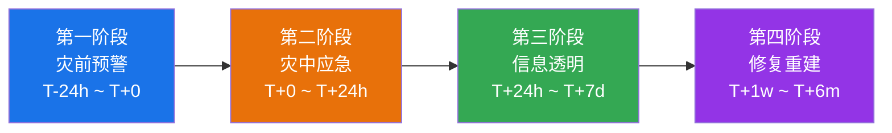

## 案例五：自然灾害——某地产集团台风灾后应急响应

自然灾害中的危机沟通与人为事故有本质区别——它不是"纠错"，而是"共渡难关"。业主的愤怒并非完全指向企业，而是源于灾害带来的恐惧和失控感。沟通的核心目标不是"灭火"，而是让受灾群体感到"有人在管、有人在乎、有办法解决"。本案例完整复盘了一家地产集团从台风预警到灾后重建的六个月应急沟通全过程，提炼出可复用的自然灾害沟通框架。

### 一、危机全景：事件背景与初始态势

#### 1.1 灾害概况

超强台风（17级以上，中心最大风速62m/s）于某年8月在东南沿海登陆，持续影响时间超过36小时，伴随特大暴雨（过程降水量达480mm）。某地产集团在受灾区域的资产分布如下：

| 资产类型 | 数量 | 受影响程度 | 涉及业主人数 |
|---------|------|-----------|------------|
| 在建项目 | 4个 | 脚手架倒塌、塔吊受损、基坑积水 | 无直接人员伤亡 |
| 已交付社区 | 7个 | 地下车库进水、电梯停运、外墙脱落、园林毁损 | 约12,000户 |
| 商业综合体 | 2个 | 外立面受损、地下室渗水 | 租户约180家 |

#### 1.2 初始危机态势评估

灾害发生后，该集团面临的不仅是物理损害，还有多层叠加的沟通危机：

- **安全焦虑**：业主担心建筑结构是否安全，尤其是外墙脱落的楼栋
- **信任质疑**：部分业主怀疑建筑质量本身就存在隐患，台风只是"暴露"了问题
- **信息真空**：停电停网导致业主无法获取准确信息，谣言快速传播
- **利益冲突**：不同受损程度的业主诉求差异大，从"全部退房"到"尽快修好"不等
- **媒体关注**：地方媒体和自媒体聚焦"天灾还是人祸"的叙事框架

#### 1.3 为什么自然灾害中的沟通比人为事故更难

很多人认为自然灾害是"不可抗力"，沟通压力应该更小。事实恰恰相反：

| 维度 | 人为事故 | 自然灾害 |
|-----|---------|---------|
| 责任归因 | 相对清晰 | 模糊——业主倾向"如果不是质量差，怎么会坏" |
| 情绪基调 | 愤怒为主 | 恐惧+愤怒+无助的混合体 |
| 信息环境 | 可控 | 停电停网，信息传播极不可控 |
| 诉求一致性 | 相对统一 | 差异极大——从轻度受损到全面毁损 |
| 恢复周期 | 通常较短 | 数月甚至数年，长期沟通压力巨大 |
| 第三方介入 | 较少 | 政府、保险公司、检测机构等多方介入 |

### 二、应急沟通的四阶段模型

该集团的应急沟通可以划分为四个清晰阶段，每个阶段有不同的沟通目标、核心信息和关键动作。

#### 2.1 第一阶段：灾前预防性沟通（台风登陆前24小时）

**目标**：传递安全信息、建立"负责任"的第一印象、为灾后沟通建立信任基础

这是整个沟通链条中ROI最高的环节——成本极低，但能在灾后为组织争取巨大的信任缓冲。

**具体执行动作：**

- **短信群发**（覆盖全部12,000户）：台风路径、预计影响时间、社区防台措施、紧急联系方式
- **APP推送**：分3次推送——预警发布时、登陆前12小时、登陆前6小时
- **社区公告**：在每栋楼大堂张贴防台指南，包含室内避险位置图
- **业主群通知**：物业管家在每个业主群发布语音+文字通知（考虑老年业主）
- **物业巡查**：提前加固户外设施、清理排水管道、准备沙袋和应急发电设备

**防台指南模板（核心内容）：**

【防台安全指南 —— XX社区】

亲爱的业主：

台风"XX"预计于X月X日X时登陆，届时我市将出现12级以上大风
和特大暴雨。为保障您和家人的安全，请做好以下准备：

【必做事项】
1. 收起阳台花盆、晾衣架等易坠物品
2. 关紧门窗，用胶带"米"字形加固大面积玻璃
3. 储备饮用水（每人每天3升×3天）、手电筒、充电宝
4. 将车辆从地下车库移至地面高处停放
5. 检查并记录室内现有渗漏点（便于灾后对比）

【社区应急措施】
- 物业已启动24小时值班，应急电话：XXXX-XXXX
- 地下车库将于X日X时封闭，请提前移车
- 社区临时安置点：XX栋一楼活动中心

【避险提醒】
- 远离窗户和外墙
- 如遇停电请勿使用明火照明
- 发现外墙脱落、管道爆裂等紧急情况立即拨打物业电话

XX物业服务中心
X年X月X日

**关键决策点**：是否要提前封闭地下车库？这个决策有争议——封闭车库会导致业主不便，但不封闭则面临车辆泡水风险。该集团选择了"提前6小时封闭+短信通知+安排地面临时停车区"的方案，事后证明这是正确决策——相邻未封闭车库的竞品社区车辆损失超过2000万元。

#### 2.2 第二阶段：灾中应急响应（登陆后6-24小时）

**目标**：保障人员安全、快速响应紧急需求、建立"我们在现场"的存在感

**组织架构：**

应急指挥中心（集团层面）
├── 现场抢险组：物业工程团队 + 外包抢修队
├── 信息通讯组：业主群管理 + 官方信息发布
├── 客户服务组：24小时热线 + 一对一沟通
├── 后勤保障组：临时安置 + 物资调配
└── 媒体应对组：新闻发言人 + 舆情监测

**信息发布的"黄金6小时"原则：**

台风登陆后的6小时是信息真空期——停电停网、业主焦虑、谣言滋生。该集团在这个窗口期做了三件事：

1. **抢占信息首发权**：物业团队在风雨稍歇的间隙（登陆后约3小时）通过业主群发布了第一条现场通报，包含受损实拍照片和初步评估
2. **建立信息发布节奏**：承诺每2小时更新一次，即使没有新进展也发"暂无变化"的通知——沉默比坏消息更可怕
3. **开通多元信息渠道**：业主群（文字+图片）→ 社区广播（覆盖无手机的老年业主）→ 公告栏（纸质版张贴）

**现场沟通的关键细节：**

物业人员在现场抢险时的言行本身就是沟通。该集团给一线人员下达了明确的行为准则：

- 见到业主主动说明情况，不回避、不推诿
- 不说"我不知道"，说"我正在了解，XX点前给您回复"
- 对情绪激动的业主，先倾听后回应，不争辩
- 记录每位业主的具体诉求，承诺跟进时间

**业主临时安置方案：**

| 安置类型 | 场所 | 容量 | 适用对象 |
|---------|------|------|---------|
| 社区内部安置 | 各栋架空层活动中心 | 每处约50人 | 老人、儿童优先 |
| 周边酒店合作 | 签约3家周边酒店 | 共200间房 | 严重受损楼栋业主 |
| 亲属投宿协助 | 提供交通接驳服务 | 不限 | 有亲属在安全区域的业主 |

#### 2.3 第三阶段：信息公开与情绪安抚（第2天-第1周）

**目标**：消除信息不对称、回应安全质疑、分化处理不同诉求群体

这是技术含量最高的阶段。业主的恐惧从"台风会不会来"变成了"我的房子还安全吗"，问题的性质从应急管理变成了信任管理。

**关键动作一：委托第三方安全检测**

这是整个案例中最关键的决策。当业主质疑"你们自己说安全有什么用"时，独立第三方的检测报告是唯一能建立公信力的工具。

- 委托具有CMA资质的建筑质量检测机构
- 检测范围覆盖结构安全、外墙附着力、防水系统、电梯安全、电气系统
- 邀请业主代表全程陪同检测过程
- 检测报告全文公开，不做任何删减

检测时间线：

| 检测项目 | 启动时间 | 完成时间 | 报告公开时间 |
|---------|---------|---------|------------|
| 结构安全（优先级最高） | 第2天 | 第4天 | 第5天 |
| 电梯安全 | 第3天 | 第5天 | 第6天 |
| 外墙系统 | 第4天 | 第7天 | 第8天 |
| 防水与排水系统 | 第5天 | 第9天 | 第10天 |

**关键动作二：分层沟通策略**

不同受损程度的业主需要不同的沟通内容和力度：

- **A类——严重受损业主**（外墙脱落、室内进水，约800户）：一对一上门沟通，由项目总经理亲自带队，携带检测报告和个性化修复方案
- **B类——中度受损业主**（电梯停运、公共区域受损，约3000户）：分楼栋召开业主座谈会，通报整体修复计划和时间表
- **C类——轻度受损业主**（设施不便但无实质损害，约8200户）：通过业主群和APP发布统一通报，开放预约咨询

**关键动作三：信息公开的"三不原则"**

- **不隐瞒坏消息**：检测中发现2栋楼外墙有空鼓风险，集团在报告出炉当天就公开了结果，同时公布了加固方案和时间表
- **不许无法兑现的承诺**：不承诺"一个月全部修好"，而是给出分阶段的、有明确节点的计划
- **不回避责任归属**：对于确实属于施工质量问题的部分（虽然比例很小），明确承认并承担维修责任

**业主座谈会的标准化流程：**

1. 开场（5分钟）
   - 主持人介绍与会人员
   - 说明会议目的和议程

2. 通报（20分钟）
   - 受损情况全景说明（PPT+现场照片）
   - 第三方检测结果解读
   - 修复计划和时间表

3. 答疑（40分钟）
   - 逐一回应业主预先提交的问题
   - 现场提问环节（控制每人3分钟）

4. 个性化沟通预约（5分钟）
   - 公布一对一沟通预约方式
   - 发放修复方案征求意见表

5. 会后跟进（24小时内）
   - 整理会议纪要，业主群公开
   - 跟进未当场解答的问题

#### 2.4 第四阶段：修复重建与长期信任修复（第2周-第6个月）

**目标**：高效执行修复计划、持续透明沟通、将危机转化为品牌信任资产

**修复进度的可视化沟通：**

该集团开发了一个"社区修复进度看板"，在APP和社区公告栏同步更新：

XX社区灾后修复进度看板（更新时间：X月X日）

┌──────────────────────────────────────────────┐
│ 整体进度：67%  ████████████████░░░░░░░░░░░░  │
├──────────────────────────────────────────────┤
│ 电梯恢复    ████████████████████ 100%  ✓完成 │
│ 地下车库排水 ████████████████████ 100%  ✓完成 │
│ 外墙加固    ████████████████░░░░  80%  进行中 │
│ 园林恢复    ████████░░░░░░░░░░░░  40%  进行中 │
│ 外立面修复  ████░░░░░░░░░░░░░░░░  20%  进行中 │
├──────────────────────────────────────────────┤
│ 下一步计划：                                   │
│ · 外墙加固预计X月X日完工                        │
│ · 外立面修复材料已到场，X月X日开工              │
└──────────────────────────────────────────────┘

**灾后关怀计划的具体措施：**

| 措施 | 内容 | 受益范围 | 执行周期 |
|-----|------|---------|---------|
| 物业费减免 | 免3个月物业费 | 全部业主 | 立即执行 |
| 维修基金支持 | 紧急启用住宅专项维修资金 | 需修缮公共部位 | 第2周启动 |
| 租房补贴 | 无法居住的业主每月补贴3000元 | A类受损业主 | 直至修复完成 |
| 车辆损失协助 | 协助保险理赔，提供法律咨询 | 车辆受损业主 | 第1周启动 |
| 心理疏导 | 联合社区提供心理咨询服务 | 有需求的业主 | 第2周启动 |

**业主代表参与机制：**

邀请业主代表组建"灾后修复监督委员会"，赋予以下权限：

- 参与修复方案的讨论和审批
- 每周一次现场巡查权
- 查阅工程进度报告和材料采购清单
- 对修复质量提出异议的渠道（48小时内必须回应）

### 三、关键决策的深层分析

#### 3.1 决策一：灾前封闭地下车库

这个决策的本质是"确定的小不便"与"不确定的大损失"之间的权衡。决策矩阵如下：

| 方案 | 业主不便程度 | 车辆损失风险 | 舆情风险 |
|-----|------------|------------|---------|
| 不封闭 | 无 | 极高（预计损失2000万+） | 极高（"为什么不管"） |
| 提前封闭+提供替代 | 中等 | 极低 | 低（提前告知可接受） |
| 登陆时临时封闭 | 低 | 高（来不及移车） | 高（"临时通知"） |

选择方案二的核心逻辑：在危机中，主动预防的沟通成本远低于事后解释的沟通成本。

#### 3.2 决策二：第一时间委托第三方检测

许多地产企业在类似场景中选择"自己检测、自己发布"，认为这样更快更可控。但这种做法有致命缺陷：

- **公信力不足**：自己说自己安全，业主不会信
- **法律风险**：自检报告在后续可能的诉讼中证明力弱
- **舆情风险**：一旦被质疑"自检自卖"，信任彻底崩塌

第三方检测虽然增加了3-5天的时间成本，但换来的是业主对检测结果的基本信任，这在后续长达半年的修复期中持续发挥价值。

#### 3.3 决策三：分层沟通而非"一刀切"

很多企业在危机中采用统一通报的方式，认为"公平"就是"一视同仁"。但在自然灾害中，不同受损程度的业主需求完全不同：

- 严重受损业主需要的是"有人管我"——一对一、高频、个性化
- 中度受损业主需要的是"有计划"——清晰的时间表和进度
- 轻度受损业主需要的是"有说法"——公平对待、不被忽视

用同一套话术应对所有人，结果是所有人都不满意。

### 四、沟通工具箱：模板与话术

#### 4.1 灾后各阶段核心信息模板

**灾后首日通报模板：**

【XX社区灾情通报 第1期】

各位业主：

台风"XX"已于今日X时X时登陆，现将社区受灾情况通报如下：

一、人员安全：社区内无人员伤亡，全部业主均已确认安全。

二、设施受损情况（初步评估）：
- 电梯：X栋、X栋电梯因停电停运，预计X日恢复供电后可恢复
- 地下车库：B区车库积水约30cm，排水泵已启动
- 外墙：X栋X单元外墙有局部脱落，已设置安全隔离区
- 供水供电：市政供电中断，社区发电机已启动（限公共区域）

三、正在采取的措施：
- 物业团队24小时轮班抢险
- 排水泵持续运行中
- 受损区域已设置安全警戒

四、下一次通报时间：今日X时

如有紧急需求，请拨打24小时应急热线：XXXX-XXXX

XX物业服务中心
X年X月X日X时

**第三方检测结果公布模板：**

【XX社区建筑安全检测报告摘要】

各位业主：

受我司委托，XX建筑工程检测有限公司（资质编号：XXXXX）
已于X月X日至X日对社区全部X栋建筑进行了安全检测。
现将核心结论通报如下：

一、结构安全：全部楼栋主体结构安全，符合国家规范要求。
二、外墙系统：
   · X栋、X栋外墙空鼓率超过标准，需进行加固处理（计划X月X日开工）
   · 其余楼栋外墙状况正常
三、电梯：全部电梯经检测合格，已恢复运行
四、防水系统：部分楼栋屋面防水层受损，计划X月X日前修复

完整检测报告（共XX页）可在物业服务中心查阅，
电子版已上传至业主APP"文件中心"栏目。

XX建筑工程检测有限公司（盖章）
X年X月X日

#### 4.2 高压场景话术指南

**场景一：业主情绪激动，要求退房**

> 业主："你们建的什么破房子！台风一来就散架！我要退房！"
>
> 参考回应："X先生/女士，我完全理解您的心情。亲眼看到自己的家受损，任何人都会愤怒和不安。关于您提到的退房诉求，我会记录下来并转达给公司决策层。同时，我想先跟您介绍一下目前的情况——第三方检测机构已确认您所在楼栋的主体结构是安全的，我们正在制定修复方案。您方便的话，我想上门跟您详细说明一下检测结果和修复计划，您看明天上午方便吗？"

**应对要点**：先共情、不争辩、记录诉求、转移话题到具体行动、约定下一步

**场景二：业主质疑建筑质量**

> 业主："别家的楼都没事，就你们的楼外墙掉了，这不就是质量问题吗？"
>
> 参考回应："您提出的这个问题非常重要。我们已经委托了具有国家CMA资质的独立检测机构进行全面检测，目的就是给所有人一个客观、权威的答案。从目前的检测结果来看，社区主体结构全部合格，外墙脱落的主要原因是本次台风风力超过了该区域的设计风荷载标准。不过确实有两栋楼的外墙空鼓率偏高，我们将进行全面加固。检测报告全文已经公开，您可以随时查阅。"

**应对要点**：不回避、用第三方数据说话、区分"超设计标准"和"施工缺陷"、公开透明

**场景三：业主在社交媒体传播不实信息**

> 网帖："XX楼盘楼都塌了！千万别买这个开发商的房子！"
>
> 处理方式：不在评论区直接反驳（容易引发更大争论），而是在官方渠道发布带图片和视频的现场通报，让事实自己说话。同时联系平台举报明显失实的内容。

### 五、效果评估与长期影响

#### 5.1 量化评估指标

| 评估维度 | 评估指标 | 灾前基线 | 灾后1个月 | 灾后3个月 | 灾后6个月 |
|---------|---------|---------|---------|---------|---------|
| 业主满意度 | NPS评分 | 42 | 18 | 38 | 45 |
| 舆情状态 | 负面帖文占比 | 5% | 45% | 15% | 8% |
| 服务热线 | 日均来电量 | 50通 | 600通 | 120通 | 60通 |
| 媒体报道 | 负面报道数 | 0 | 12篇 | 2篇 | 0篇 |
| 业主留存 | 咨询退房比例 | 0 | 3.2% | 0.8% | 0.2% |

NPS（净推荐值）在灾后3个月恢复至灾前水平，灾后6个月甚至略有提升——这说明危机处理得当反而能增强信任。

#### 5.2 品牌资产的转化

该集团将此次灾后响应的经验打包成"社区韧性计划"，在后续项目销售中作为差异化卖点：

- 购房者参观时展示应急管理体系
- 新项目设计阶段就纳入极端天气应对方案
- 在行业内发布《社区应急管理白皮书》

### 六、经验教训与行业启示

#### 6.1 自然灾害沟通的五条铁律

1. **预防性沟通是最高ROI的投资**：灾前24小时的一条短信，可能换来灾后半年的信任缓冲。成本几乎为零，但建立的"负责任"印象价值连城。

2. **信息真空是谣言的温床**：在停电停网的极端环境下，业主群、社区广播、纸质公告栏的组合是唯一可靠的信息渠道。"每2小时更新"的承诺比任何公关话术都有效。

3. **第三方背书是信任的锚点**：当利益相关方对组织自身失去信任时，独立第三方的检测和评估是唯一能重建公信力的工具。这笔钱不能省，这个时间不能省。

4. **分层沟通比"公平对待"更公平**：不同受损程度的人需要不同的信息和关注度。用同一套话术应对所有人，是对所有人的不公平。

5. **长期修复比短期灭火更重要**：自然灾害的沟通不是一周的事，而是六个月甚至更长。持续的进度透明、可验证的修复行动，比任何"公关技巧"都更能重建信任。

#### 6.2 常见错误与纠正

| 常见错误 | 后果 | 正确做法 |
|---------|------|---------|
| 灾后沉默，等待"情况明朗" | 信息真空期谣言爆发 | 6小时内发布首次通报，即使信息不完整也要发声 |
| 自己检测自己发布 | 公信力为零 | 委托独立第三方，全程透明 |
| 统一口径应对所有业主 | 重度受损业主感到被忽视 | 分层沟通，A类一对一、B类座谈会、C类群通报 |
| 过度承诺修复时间 | 无法兑现后信任崩塌 | 给出保守但可兑现的时间表，宁可提前不可延后 |
| 只在危机期间沟通 | 修复期业主感到被遗忘 | 建立持续的进度更新机制，直至全部修复完成 |
| 回避"质量"话题 | 被解读为心虚 | 坦然面对，用第三方数据回应，该承认的承认 |

#### 6.3 与其他危机类型的对比启示

自然灾害沟通与产品缺陷、安全事故等人为危机的最大区别在于——**你不是过错方，但你必须承担沟通责任**。业主不会因为"这是天灾"就降低对你的期望，他们期望的是：你在灾难面前能保护他们、在灾难之后能修复他们的生活。

这要求企业建立一套"平时不显眼、灾时能激活"的应急沟通体系——包括预设的通讯录、话术模板、第三方合作机构、信息发布渠道矩阵。这些准备工作在平时看来是"多余的成本"，但在灾害来临时，它们就是企业最核心的竞争力。

***
