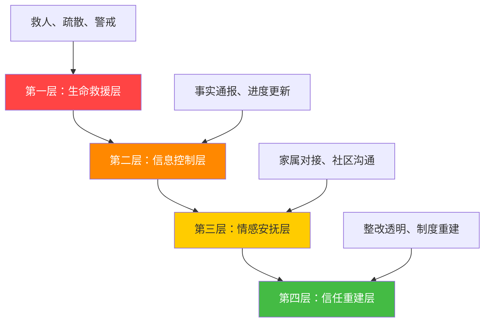
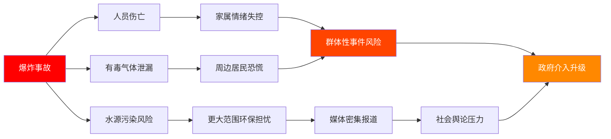

## 案例六：安全事故——某化工企业爆炸事故应急沟通

### 安全事故应急沟通的理论基础

安全事故是所有危机类型中**最复杂、最紧迫、社会敏感度最高**的一类。与财务危机或产品召回不同，安全事故涉及人员伤亡、环境威胁、法律追责等多重维度，任何一步沟通失误都可能引发次生危机。

#### 安全事故的特殊性

安全事故与其他类型危机在沟通上存在本质差异：

| 维度 | 安全事故 | 品牌危机 | 财务危机 |
|------|---------|---------|---------|
| 时间压力 | 极高，分钟级响应 | 中等，天级响应 | 较低，周级响应 |
| 利益相关方 | 政府、家属、社区、媒体、行业监管 | 消费者、媒体、合作伙伴 | 股东、监管机构、员工 |
| 法律约束 | 极严，信息须经调查确认 | 较松，企业有较大自主权 | 中等，需遵守信息披露规则 |
| 情感烈度 | 极高，涉及生死 | 中等，涉及信任 | 较低，涉及利益 |
| 持续时间 | 长，善后可达数年 | 中，数周至数月 | 中，数月至一年 |
| 次生危机 | 环境污染恐慌、群体性事件 | 品牌声誉受损 | 股价波动、人才流失 |

安全事故的核心矛盾在于：公众要求**即时全面的信息透明**，而法律要求**调查确认后才能发布**。如何在这两者之间取得平衡，是安全事故应急沟通的第一大难题。

#### 安全事故沟通的法律框架

在中国，安全事故的信息发布受到多部法律法规约束：

**《安全生产法》**：要求事故发生单位在1小时内向县级以上政府安全生产监督管理部门报告。谎报、瞒报、迟报均构成违法。

**《生产安全事故报告和调查处理条例》**：按伤亡人数和直接经济损失将事故分为四级（特别重大、重大、较大、一般），不同级别对应不同的报告层级和时限。

**《突发事件应对法》**：要求政府建立突发事件信息发布制度，统一、准确、及时发布信息。

**《环境保护法》**：涉及环境污染的事故，企业有义务及时公开环境信息。

这些法律框架决定了企业在安全事故中的沟通边界——什么必须说、什么不能说、什么时间说、对谁说，都有明确规定。

#### 安全事故沟通的"黄金四层"模型

安全事故应急沟通可以分为四个递进层次：

这四个层次不是先后关系，而是**同时推进**的——在救人的同时就要开始信息通报，在信息通报中就要融入情感关怀。但优先级必须明确：**生命永远排在第一位**，任何沟通策略都不能以牺牲救援效率为代价。

---

### 案例背景

某市经济技术开发区内，一家中型化工企业（年产精细化工产品约5万吨，员工约800人）的甲类生产车间在凌晨2:17发生爆炸事故。爆炸引发的火灾蔓延至相邻的原料储罐区，形成连锁反应。

**事故直接后果**：

- 死亡5人（3名当班操作工、2名夜班巡检人员），受伤17人（其中重伤6人）
- 爆炸波及周边1.2公里范围，200余户居民房屋受损
- 事故现场有毒气体泄漏，下风向3公里范围空气质量急剧恶化
- 企业东侧约800米处的一条河流受到初期消防水污染威胁

**危机传导链条**：

这是一个典型的"一灾引多灾"场景——爆炸本身只是一个起点，后续的人员伤亡、环境污染、社区恐慌、舆论压力层层叠加，形成复合型危机。

---

### 沟通过程详解

#### 第一阶段：紧急响应（0-2小时）——生死时速

**场景还原**：凌晨2:17爆炸发生，企业值班经理在2:19确认爆炸位置和火势，2:21拨打119和120，2:23启动企业I级应急预案。此时企业面临的核心问题是：信息极度匮乏——有多少人受伤？爆炸原因是什么？有没有毒气泄漏？火势能否控制？

**0:00-0:30 关键行动**：

| 时间 | 行动 | 责任人 | 沟通要点 |
|------|------|--------|---------|
| 2:19 | 确认爆炸位置和初步火情 | 值班经理 | 内部：启动应急广播，通知全厂疏散 |
| 2:21 | 拨打119、120 | 值班经理 | 准确报告：地点、事故类型、预估规模、已知伤亡 |
| 2:23 | 启动I级应急预案 | 值班经理 | 通知企业应急指挥中心所有成员 |
| 2:25 | 切断事故区域电力和物料管线 | 设备部 | 确认有毒物料种类和存量，为消防提供信息 |
| 2:30 | 初步确认被困人员位置 | 安全部 | 向消防救援队提供厂区平面图和人员分布 |

**0:30-1:00 对外沟通启动**：

这一阶段的核心原则是**"已知说什么，未知说正在确认"**。企业不应在信息不完整时保持沉默——沉默会被外界解读为"隐瞒"。同时也不应猜测性地发布未经确认的信息。

企业通过官方公众号和政府应急管理平台发布**第一份声明**：

> 今日凌晨2:17，我公司XX车间发生爆炸事故。事故发生后，公司立即启动应急预案，拨打119和120，全力配合消防和医疗救援。目前，救援工作正在进行中，伤亡情况正在核实。我们将及时发布后续信息。

这份声明的结构值得拆解：

1. **时间+地点+事件**：三要素齐全，不给谣言留空间
2. **已采取的行动**：表明企业没有逃避，而是在积极应对
3. **承认不确定性**：坦诚"正在核实"，比虚假的"一切尽在掌握"更可信
4. **承诺持续更新**：给公众一个预期，避免因信息断档产生恐慌

**1:00-2:00 政府协同**：

县级政府应急管理部门在1:00前到达现场，成立现场指挥部。企业主动将信息发布权**让渡**给政府统一出口——这是安全事故沟通中最关键的决策之一。

为什么让渡信息发布权？

- **法律要求**：特别重大和重大事故由省级以上政府发布信息，较大事故由市级政府发布
- **公信力**：公众对企业发布的安全信息天然不信任，由政府发布更具公信力
- **统一口径**：避免企业和政府信息不一致造成的混乱
- **保护企业**：由政府发布信息，企业可以避免在信息不完整时被追问细节

企业在政府框架下的角色是**信息提供者**而非信息发布者——企业向政府提供事故详情、伤亡数据、危化品种类和存量、厂区平面图等技术信息，由政府统一对外发布。

**此阶段常见错误**：

1. **沉默等待**：等待所有信息确认后才发声，结果沉默的2小时里谣言已经铺天盖地
2. **过度承诺**：在不清楚伤亡情况时声称"无人员伤亡"，后续被打脸
3. **推卸责任**：第一时间表态"事故原因正在调查"却不提企业正在做什么
4. **忽视内部**：只关注对外发布，忘记通知员工家属，导致员工自行传播不准确信息

---

#### 第二阶段：信息通报（2-24小时）——建立信任窗口

凌晨4:00，火灾基本扑灭，被困人员搜救完毕，初步伤亡数据确认。此时进入信息通报密集期。

**4:00 第二份通报**：

> 截至今日4:00，经全力搜救，事故已造成5人死亡、17人受伤（其中6人重伤）。伤者已全部送往市第一人民医院和市中心医院救治。事故现场明火已扑灭，消防人员正在进行余火清理和现场保护。事故原因调查组已成立，将依法依规开展调查。我公司将全力配合调查工作，并及时向社会公布调查进展。

**8:00 新闻发布会**：

由市政府新闻办牵头，企业总经理出席。发布会的核心不是推卸责任，而是传递三个信号：**我们正在全力救援、我们对受害者负责、我们会彻底查清原因**。

企业总经理的发言要点：

1. **表达哀悼和歉意**：对遇难者表示沉痛哀悼，对受伤人员及家属表示深切慰问，对周边居民受到影响表示诚挚歉意
2. **通报救治情况**：6名重伤人员中已有2人脱离生命危险，其余4人正在全力抢救
3. **环境应急措施**：已启动环境应急预案，环保部门在事故现场及周边设置了12个空气质量监测点，下风向已设置警戒线，东侧河流已设置围油栏
4. **社区安置**：受爆炸影响的周边居民已安置到3个临时安置点，提供食宿和基本生活保障
5. **承诺透明**：事故调查过程中将依法依规及时发布信息，绝不隐瞒

**12:00 环境监测数据首次公布**：

环保部门在企业周边12个监测点的首次监测数据：

| 监测点位 | 距事故点距离 | 风向 | VOCs（mg/m³） | SO₂（mg/m³） | 是否超标 |
|---------|------------|------|-------------|-------------|---------|
| 1号点（下风向500m） | 500m | 西南 | 0.85 | 0.12 | VOCs超标 |
| 2号点（下风向1km） | 1km | 西南 | 0.42 | 0.06 | 否 |
| 3号点（下风向3km） | 3km | 西南 | 0.18 | 0.03 | 否 |
| 4号点（上风向500m） | 500m | 东北 | 0.08 | 0.01 | 否 |
| 5号点（居民安置点） | 1.5km | 西 | 0.15 | 0.02 | 否 |

关键沟通策略：**数据说话**。公众对"空气质量正常"这样的定性描述不信任，但对具体数值有判断力。公布真实数据（即使部分超标）比隐瞒数据更能赢得信任。同时说明"VOCs超标"的含义——短期接触对人体健康影响有限，但在持续监测和下风向警戒未解除前，建议敏感人群留在室内。

**18:00 家属对接**：

企业设立家属接待中心（距事故现场3公里，靠近医院），安排专人一对一对接5名遇难者和6名重伤者的家属。对接人员的配置和培训至关重要：

- **对接团队组成**：每组3人——1名企业中层管理者（有决策权）、1名心理咨询师、1名行政后勤人员
- **对接原则**：先倾听、后解释、不推诿、不承诺超出权限的内容
- **首次会面要点**：表达慰问、告知救治进展、了解家属诉求、提供食宿安排、告知后续对接机制
- **绝对禁忌**：不谈责任归属、不谈赔偿金额、不催促家属做任何决定、不在家属情绪激动时解释技术问题

---

#### 第三阶段：持续沟通（第2天-第2周）——信息透明化

这一阶段的核心任务是**将危机沟通从被动响应转为主动发布**。

**每日进展通报机制**：

企业联合政府建立每日两次的信息发布机制（上午10:00、下午5:00），发布渠道包括：政府官网、企业官网、微信公众号、微博、抖音短视频。

每次通报固定包含四个板块：

1. **人员救治进展**：伤者病情变化、医疗团队配置、家属安置情况
2. **环境监测数据**：各点位最新监测数据、趋势变化、与前日对比
3. **事故调查进展**：已查明的事实、正在进行的工作、下一步计划
4. **社区恢复情况**：受损房屋评估进展、临时安置服务、交通恢复

**社区沟通策略**：

爆炸后第3天，周边居民对返回住所存在强烈恐惧。企业联合社区居委会采取以下措施：

- **开放日活动**：组织居民代表在安全距离外查看事故现场清理情况
- **独立检测**：邀请居民代表自选第三方环境检测机构，对居民区空气和水质进行独立检测
- **入户沟通**：企业员工和社区工作者逐户走访受影响居民，记录诉求、解答疑问
- **信息发布栏**：在社区入口设置实体信息发布栏，每日张贴监测数据和处理进展（覆盖不使用智能手机的老年群体）

**媒体管理**：

安全事故必然引发媒体密集报道。企业采取"有限开放"策略：

- 设立媒体接待点，每日定时提供书面信息更新
- 安排企业新闻发言人接受预约采访，限定每日采访数量
- 提供事故现场航拍照片和视频（由企业统一拍摄），避免媒体自行进入现场
- 对于不实报道，通过政府新闻办进行更正，避免企业直接与媒体对抗

---

#### 第四阶段：善后与重建（第3周-第12个月）——从危机到转机

**事故调查结果公布（第4周）**：

事故调查组认定事故原因为反应釜温控系统故障导致超温超压，叠加安全联锁装置被违规旁路，最终引发爆炸。直接经济损失约3200万元。

企业对调查结果的回应策略——**不辩解、不对抗、全面接受**：

> 调查组的结论客观公正。我们深刻认识到，事故的发生暴露了我公司在安全生产管理上存在的严重漏洞。公司将全面接受调查组的处理意见，认真落实整改措施，绝不允许类似事故再次发生。

**赔偿与善后**：

- 5名遇难者的赔偿金额按照法律规定和企业承诺，在第6周内全部协商确定并支付
- 17名受伤人员的医疗费用全部由企业承担，重伤人员的后续康复治疗纳入长期保障
- 周边受损居民房屋的修缮和赔偿在第8周内基本完成
- 设立专项基金，用于受影响社区的公共设施修复和安全改造

**安全整改计划公布**：

企业公布为期一年的安全整改路线图：

| 阶段 | 时间 | 重点内容 | 验收标准 |
|------|------|---------|---------|
| 立即整改 | 第1-4周 | 恢复所有安全联锁装置、全面排查隐患 | 第三方安全评估通过 |
| 系统重建 | 第2-6月 | 升级DCS控制系统、建立SIS安全仪表系统 | 通过安全设施竣工验收 |
| 管理升级 | 第2-12月 | 建立双重预防机制、全员安全培训、引入HAZOP分析 | 通过安全生产标准化评审 |
| 社区共建 | 第3-12月 | 社区安全监督委员会运作、季度安全开放日 | 社区满意度调查达标 |

**社区安全监督委员会**：

这是该案例中最具创新性的举措——邀请周边社区居民代表、人大代表、政协委员、环保志愿者组成安全监督委员会，拥有以下权限：

- 每月一次进入企业生产区域进行安全巡查
- 查阅企业安全生产档案和监测数据
- 列席企业安全生产会议
- 对安全隐患提出整改要求

这一机制将社区从"被动接受信息"转变为"主动参与监督"，从根本上重建了社区对企业的信任。

---

### 关键决策分析

#### 决策一：信息发布权的让渡

**决策内容**：企业在事故发生后1小时内，主动将信息发布权让渡给政府统一管理。

**决策逻辑**：

安全事故中，企业的公信力处于最低点。公众对企业"自己说自己好"天然不信任。由政府统一发布信息，可以：

- 利用政府的公信力为信息背书
- 避免企业在信息不完整时被迫表态
- 统一口径，减少信息混乱
- 让企业专注于救援和善后，而非疲于应付媒体

**风险与平衡**：让渡信息发布权不等于企业沉默。企业必须在政府框架内积极提供信息、主动发声。如果企业完全隐身，反而会被解读为"推卸责任"。

#### 决策二：环境数据的完全公开

**决策内容**：在首次环境监测中就公布包含超标数据的完整监测结果。

**决策逻辑**：

如果隐瞒超标数据，一旦被第三方检测或媒体曝光，企业将彻底丧失公信力。主动公布超标数据，同时解释超标原因、影响范围和应对措施，反而能赢得公众信任。

**数据发布的最佳实践**：

- 用表格呈现具体数值，不用模糊描述
- 附上国家标准作为对比参照
- 说明超标的健康影响（短期/长期、敏感人群/一般人群）
- 注明监测机构资质
- 承诺持续监测和信息公开

#### 决策三：家属对接的"一对一"机制

**决策内容**：为每名遇难者和重伤者家属配备专属对接小组，全程跟踪至善后结束。

**决策逻辑**：

安全事故中，家属是最敏感的利益相关方。家属的不满如果得不到及时回应，极易演变为群体性事件。一对一机制确保：

- 每个家属都有专人负责，不会"被遗忘"
- 信息传递准确、连续，避免多头对接造成信息混乱
- 企业能第一时间了解家属诉求，快速响应
- 建立情感连接，避免纯商业谈判的冰冷感

#### 决策四：社区安全监督委员会

**决策内容**：邀请社区代表组成安全监督委员会，赋予实质性监督权限。

**决策逻辑**：

传统的"社区沟通"是单向的——企业发布信息，社区被动接受。监督委员会将沟通转变为**双向的、制度化的、有实质内容的**互动。这不是公关手段，而是真正的治理结构变革——它向社区传递的信号是："我们不怕你看，我们欢迎你来看。"

---

### 沟通工具箱

#### 工具一：安全事故应急沟通检查清单

事故发生后0-2小时内必须完成的沟通动作：

- [ ] 确认事故基本情况（时间、地点、类型、初步伤亡）
- [ ] 拨打119、120（如未自动触发）
- [ ] 启动企业应急预案
- [ ] 通知企业应急指挥中心全体成员
- [ ] 发布第一份对外声明（三要素：时间+地点+事件）
- [ ] 通知员工及其家属（通过内部通讯系统）
- [ ] 联系政府应急管理部门
- [ ] 准备厂区平面图、危化品种类清单、人员花名册
- [ ] 设立信息发布协调人（与政府对接）
- [ ] 指定企业新闻发言人

#### 工具二：安全事故声明模板

**第一份声明（0-2小时内）**：

【事故通报】
今日XX时XX分，我公司XX车间/区域发生XX事故。事故发生后，公司
立即启动应急预案，第一时间拨打119和120，并全力配合消防、医疗
等部门开展救援工作。

目前，救援工作正在紧张进行中，伤亡情况正在核实。我公司将及时
向社会公布后续信息。

XX公司
X年X月X日XX时

**进展通报模板（2-24小时）**：

【事故进展通报（第X号）】
截至X月X日X时，事故最新情况如下：

一、人员救治情况
- 死亡X人，受伤X人（其中重伤X人、轻伤X人）
- 伤者已全部送至XX医院和XX医院救治
- X名重伤人员已脱离生命危险

二、现场处置情况
- 明火已扑灭/正在扑救中
- 现场搜救工作已结束/仍在进行
- 事故区域已设置X米警戒线

三、环境监测情况
- 已设置X个空气质量监测点
- 各点位监测数据如下：（附表格）
- 水源保护措施已启动

四、下一步工作
- 继续做好伤者救治工作
- 全面开展事故原因调查
- 持续公布环境监测数据

XX公司（或XX政府新闻办）
X年X月X日X时

#### 工具三：家属对接话术指南

**首次会面开场**：

> "XX先生/女士，我是XX公司的XX，今天代表公司来看望您。首先，请允许我代表公司对您和您的家人遭受的不幸表示最深切的慰问。我们一定会全力配合医院做好救治工作。您现在有什么需要我们做的，请随时告诉我。"

**回答"事故原因是什么"**：

> "事故原因目前正在由专业调查组进行调查，我们公司也在全力配合。一旦有明确结论，会第一时间告知您。现在最重要的事情是照顾好伤者，您有什么需要我们帮忙的吗？"

**回答"赔偿怎么算"**：

> "关于赔偿的问题，我们一定会依法依规、从优从善处理。现在最重要的是照顾好家人。等伤者情况稳定后，我们会安排专门的人员和您详细沟通赔偿事宜。您放心，我们不会让您的家人受到任何委屈。"

**绝对不能说的话**：

- "事故原因还在调查，现在不方便透露"（冷漠，缺乏同理心）
- "这不是我们一家的责任"（推卸责任）
- "按照规定只能赔这么多"（过早谈钱，缺乏情感）
- "您先冷静一下"（否定家属的情绪）
- "我们也很难过"（将企业感受与家属痛苦相提并论）

---

### 常见误区与纠正

#### 误区一：沉默等待真相

**错误做法**：事故发生后，等所有事实都调查清楚才发布信息。

**为什么错**：安全事故的信息真空期不会是空白的——谣言、猜测、媒体推测会迅速填满这个真空。等到企业准备好"完整信息"时，公众已经形成了负面印象，企业的任何解释都会被当作"狡辩"。

**正确做法**：采用"滚动发布"策略——已确认的事实立即发布，未确认的信息说明"正在核实"，明确承诺下次更新时间。

#### 误区二：技术语言替代通俗表达

**错误做法**：在发布环境监测数据时使用专业术语，如"VOCs浓度0.85mg/m³，超过GB3095-2012二级标准限值"。

**为什么错**：公众看不懂专业术语，看不懂就会不安，不安就会恐慌。

**正确做法**：在专业数据旁附加通俗解释——"该数值超过国家空气质量标准约1.7倍，短期接触对普通人群健康影响有限，但建议下风向居民关闭门窗、减少外出"。

#### 误区三：只对外不通内

**错误做法**：将所有精力放在媒体和政府沟通上，忽视内部员工的信息需求。

**为什么错**：员工是企业最直接的"信息源"。如果员工不了解情况，他们会被家属和朋友追问，在不了解全貌时可能传播不准确信息。更严重的是，如果员工觉得自己被蒙在鼓里，会丧失对企业的信任。

**正确做法**：在对外发布的同时，通过内部通讯系统向全体员工发布事故通报，说明企业正在做什么、员工需要注意什么、如何回应外界询问。

#### 误区四：善后等于赔钱

**错误做法**：将善后工作等同于赔偿金额的谈判，一旦赔偿到位就认为善后结束。

**为什么错**：安全事故的善后远不止经济赔偿。遇难者家属需要心理支持，受伤人员需要长期康复关怀，社区需要安全感的重建。如果企业表现出"花钱买平安"的态度，反而会激化矛盾。

**正确做法**：建立长期跟踪机制——遇难者家属在事故周年日收到慰问、受伤人员的康复情况持续跟进、社区安全状况定期通报。善后是一个持续数年的过程，不是一笔交易。

---

### 进阶：安全事故危机沟通的战略思维

#### 从危机到转机的转化路径

安全事故对企业而言是灾难，但如果处理得当，可以成为企业安全管理能力跃升的契机。转化路径如下：

关键转折点在于**深度整改和制度重建**——不是"做做样子"的安全检查，而是从根本上改变企业的安全管理体系。当社区监督委员会真正运作起来、当企业的安全标准超过行业要求、当周边居民从恐惧转为信任时，危机就完成了向转机的转化。

#### 复合型危机的沟通叠加策略

化工企业爆炸事故通常不是单一危机，而是多重危机的叠加。沟通策略必须针对每一层危机分别设计：

| 危机层级 | 核心诉求 | 沟通策略 | 关键话术 |
|---------|---------|---------|---------|
| 人员伤亡层 | 救治、尊重、赔偿 | 高度个性化、一对一 | "我们一定会负责到底" |
| 环境安全层 | 数据、监测、恢复 | 数据驱动、第三方背书 | "数据公开，欢迎监督" |
| 社区恐慌层 | 安全感、信息、参与 | 双向沟通、赋权社区 | "您的安全是我们的底线" |
| 舆论压力层 | 事实、态度、行动 | 统一口径、行动证明 | "用行动说话" |
| 法律追责层 | 合规、配合、整改 | 依法依规、主动配合 | "全面接受调查结果" |

每一层的沟通不能互相矛盾。如果对家属说"我们一定负责"，对媒体却说"事故原因还在调查"，两种表态虽然各自合理，但放在同一语境下会产生"推卸责任"的观感。因此，所有层级的沟通必须在一个统一的**态度基调**下进行——这个基调就是"**承认问题、全力应对、彻底整改**"。

#### 长尾效应管理

安全事故的舆论影响不是一次性事件，而是会在多个时间节点被重新激活：

- **事故周年日**：媒体会回访，公众会回忆
- **类似事故发生时**：其他企业的安全事故会让本案例被重新提起
- **赔偿纠纷时**：如果善后不彻底，法律诉讼会重新引爆舆论
- **企业上市或重大商业活动时**：历史事故会被竞争对手或媒体翻出

企业需要对这些"长尾节点"提前准备应对方案：

1. 在事故周年日主动发布整改进展报告，抢在媒体之前发声
2. 为可能的法律诉讼准备完整的沟通预案
3. 将安全管理成果作为企业品牌故事的一部分（而非掩盖历史）

---

### 本案例的核心启示

1. **安全事故沟通的首要原则是"生命至上"**——所有沟通策略都必须服从于救援行动，不能为了"管理舆论"而干扰救援
2. **信息公开是最好的危机公关**——尤其在环境安全问题上，数据透明比任何修辞技巧都有效
3. **政府协同是安全事故沟通的骨架**——企业不能也不应独立承担安全事故的信息发布责任
4. **家属沟通是安全事故中最敏感的环节**——一对一、长周期、有温度的对接机制是防止次生危机的关键
5. **善后不是终点而是起点**——真正的危机修复是一个持续数年的过程，需要制度化的长效机制
6. **社区共建是信任重建的终极方案**——从"我说你信"到"你来看你监督"，是安全事故后企业与社区关系的质变

***
