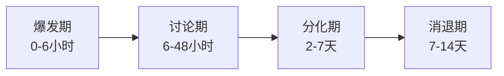

## 案例八：公关危机——某品牌代言人失德事件

### 危机背景

2022年某知名消费品牌（以下简称"A品牌"）遭遇了一次典型的代言人失德危机。A品牌是一家年营收超过200亿元的消费电子企业，其核心消费群体为18-35岁的年轻用户。品牌在当年签约了一位当红流量明星作为全球代言人，合同金额高达每年8000万元，合作内容涵盖电视广告、社交媒体推广、线下活动、产品联名等多个维度。

该代言人的形象与品牌深度绑定——品牌官网首页、APP开屏、线下旗舰店、电商平台主图全部使用代言人形象，代言人甚至参与了品牌定制款产品的设计。这种高度绑定意味着代言人已经成为品牌的"视觉符号"，消费者将代言人与品牌视为一体。

事件发生在某个周五晚间，该代言人因涉嫌违法行为被警方通报调查。消息在微博热搜迅速攀升，30分钟内阅读量突破5亿。品牌官方微博评论区被大量网友涌入，要求品牌"给个说法"。电商平台上的品牌旗舰店也出现了大量"抵制代言人相关产品"的差评。

这场危机的核心矛盾在于：品牌是否应该为代言人的个人行为承担连带责任？公众的期待是品牌必须快速表明立场，任何犹豫都会被解读为"纵容"或"利益至上"。

### 代言人失德危机的理论框架

#### 危机类型学定位

根据Coombs的情境危机传播理论（SCCT），代言人失德属于"受害者簇"与"可预防簇"之间的灰色地带。品牌本身并非危机的制造者，但由于品牌主动选择了该代言人并从中获益，公众会认为品牌在代言人审查上存在过失，因此不能完全被视为"受害者"。

这种灰色定位决定了品牌的回应策略不能简单套用"否认"或"迎合"，而需要采取一种混合策略——既表明品牌自身并非过错方，又展现品牌对公众情绪的尊重和对自身责任的担当。

#### 品牌联想转移理论

McCracken的意义转移模型（Meaning Transfer Model）解释了代言人代言的底层逻辑：文化意义从代言人的公众形象转移到品牌，再通过消费行为转移到消费者身上。当代言人出现负面事件时，这个转移链条会反向运作——负面意义同样会从代言人向品牌转移，这个过程被称为"负面溢出效应"（Negative Spillover Effect）。

转移的强度取决于三个因素：

| 因素 | 说明 | A品牌情况 |
|------|------|-----------|
| 绑定程度 | 品牌与代言人的视觉/概念关联强度 | 极高：全面视觉绑定 |
| 时间长度 | 合作持续时间越长，联想越深 | 中等：合作约1年 |
| 独占性 | 品牌是否有其他代言人分散风险 | 低：仅此一位代言人 |

A品牌在三个因素上都处于高风险状态，这意味着负面溢出效应会非常强烈，品牌必须以更高的速度和更明确的态度进行回应。

#### 公众心理机制

代言人失德事件触发的公众心理反应遵循一个可预测的路径：

```mermaid
graph TD
    A[事件曝光] --> B[震惊与愤怒]
    B --> C[道德审判]
    C -->{品牌是否表态?}
    C -->|快速表态| D[认可品牌立场]
    C -->|沉默/犹豫| E[迁怒品牌]
    D --> F[品牌获得道德加分]
    E --> G[品牌声誉受损]
    G --> H[消费者抵制行为]
    F --> I[危机转化为品牌价值展示]
```

公众在道德审判阶段需要一个"情绪出口"。如果品牌快速表态，公众的愤怒会集中到代言人身上；如果品牌沉默，公众会将品牌作为"帮凶"来发泄情绪。这就是为什么反应速度在这类危机中是第一优先级。

### 沟通过程

#### 第一阶段：快速切割（0-4小时）

**T+0小时：舆情监测系统触发警报**

A品牌的舆情监测系统在事件曝光后15分钟内触发了最高级别警报。品牌公关团队在30分钟内完成了以下工作：

- 确认事件真实性（通过官方通报和多家媒体交叉验证）
- 评估危机等级（判定为最高级——涉及违法犯罪）
- 启动危机响应预案，召集核心决策团队线上会议

**T+1小时：内部决策与声明起草**

危机决策团队在1小时内完成了关键决策：

1. **终止合作的决定**：法务团队确认合同中包含"道德条款"（Morality Clause），代言人涉嫌违法犯罪构成单方解约条件。品牌决定行使合同权利，立即终止合作。
2. **声明内容的确定**：声明需要包含三个核心要素——事实确认（已知悉事件）、立场表明（终止合作、下架物料）、价值重申（品牌的社会责任承诺）。
3. **发布渠道的确定**：优先在微博官方账号发布（触达最广），随后同步至品牌官网、微信公众号、抖音等全平台。

**T+3小时：正式声明发布**

品牌发布的第一份声明全文如下（经过匿名化处理）：

> 【声明】
>
> 我们已关注到关于我品牌代言人涉嫌违法的相关报道。对于任何违反法律法规、违背社会公德的行为，我品牌始终持零容忍态度。
>
> 经公司研究决定：
> 1. 即日起终止与该代言人的全部合作关系；
> 2. 全面下架涉及该代言人的广告、宣传物料及联名产品；
> 3. 启动合作伙伴审查机制的全面升级。
>
> 我品牌始终坚持合法合规经营，积极履行社会责任。我们对此次事件给公众带来的困扰深表歉意，将持续以优质产品和服务回馈消费者的信任与支持。

这份声明的关键设计：

- **零容忍的措辞**：使用"零容忍"而非"深感遗憾"等模糊表达，传递出明确的价值判断
- **三个具体行动**：不是空洞表态，而是列出可验证的行动项
- **未提代言人姓名**：避免给代言人带来二次流量，也避免被解读为"落井下石"
- **歉意的定位**：歉意指向"给公众带来的困扰"，而非为代言人的行为道歉——品牌不是过错方，但尊重公众感受

**T+4小时：物料下架执行**

品牌同步启动了全渠道物料下架工作：

| 渠道 | 下架内容 | 完成时间 |
|------|----------|----------|
| 品牌官网 | 首页代言人形象、专题页面 | 2小时内 |
| 电商平台 | 主图、详情页代言人图片、联名款链接 | 4小时内 |
| 社交媒体 | 历史代言人相关内容（视情况隐藏或删除） | 6小时内 |
| 线下门店 | 代言人形象海报、展架、灯箱 | 24-48小时内 |
| 户外广告 | 公交站牌、地铁广告、楼宇广告 | 72小时内（需协调广告公司） |
| 电视广告 | 停播代言人版本广告 | 24小时内（需协调电视台） |

线下和户外渠道的下架需要更长时间，品牌在此期间通过线上声明已经传递了立场，公众对线下物料的下架有合理的时间预期。

#### 第二阶段：品牌价值重申（4-24小时）

**T+6小时：内部沟通同步**

品牌向全体员工发送内部信，核心内容包括：

- 通报事件经过和公司决定
- 强调品牌的长期价值观不受个别事件影响
- 指导一线员工应对消费者询问的标准话术
- 要求全体员工不得在个人社交媒体上发表不当评论

内部沟通的重要性常被忽视。员工是品牌的第一传播者，如果员工不了解公司的立场和口径，可能在面对消费者或媒体询问时给出不一致的回应，造成二次危机。

**T+12小时：品牌价值观深度声明**

品牌发布第二份声明，重点从"事件回应"转向"价值传递"：

> 【关于品牌价值观的说明】
>
> 感谢公众对我品牌的关注与监督。此次事件让我们深刻认识到，品牌在选择合作伙伴时，不仅要关注其商业价值，更要严格审查其社会责任和道德操守。
>
> 我品牌将采取以下措施完善合作伙伴管理机制：
> 1. 建立合作伙伴背景审查体系，涵盖法律合规、社会评价、行业口碑等维度；
> 2. 在所有合作合同中加入完善的道德条款和退出机制；
> 3. 设立合作伙伴持续评估机制，定期复审合作关系。
>
> 我们相信，真正的品牌价值来自于产品品质和用户信任，而非任何单一个人。感谢一直以来支持我们的消费者，我们将以更好的产品和服务回报大家的信任。

这份声明的作用是将公众注意力从"代言人出事"转向"品牌如何改进"，把危机转化为展示品牌责任感的机会。

**T+18小时：关键意见领袖（KOL）定向沟通**

品牌公关团队识别了20-30位与品牌有合作关系或对品牌有正面态度的KOL，通过私下沟通（非公开要求）的方式，向他们同步品牌的处理态度和改进措施。这些KOL随后在各自平台上发布了对品牌"果断处理"的正面评价，形成了舆论场中的正向声音。

KOL沟通的关键原则：

- **不要求统一口径**：每位KOL用自己的语言表达，避免被识别为"品牌公关操作"
- **提供事实而非观点**：向KOL提供品牌声明和行动的时间线，让他们自行判断
- **不进行利益交换**：不以未来的合作作为KOL发声的条件，保持沟通的纯粹性

#### 第三阶段：营销调整（第2天-第2周）

**产品策略调整**

代言人联名款产品面临一个两难选择：继续销售意味着"消费危机"，全面下架则造成直接经济损失。A品牌的处理方案是：

- 已生产未销售的联名款：去除代言人标识后以常规包装销售，产品本身品质不受影响
- 已上架的联名款：从显眼位置撤下，但不主动召回消费者已购买的产品
- 已售出的联名款：不主动联系消费者要求退换，但对主动要求退换的消费者提供便利通道

**传播内容转向**

品牌在这一阶段全面转向不依赖特定代言人的传播策略：

- **产品力传播**：加大产品评测、技术解析、用户实测等内容的投放，让产品本身成为传播主角
- **用户故事传播**：征集真实用户的使用故事，用"素人真实体验"替代"明星光环"
- **品牌故事传播**：挖掘品牌创立历史、研发故事、企业文化等"内核内容"
- **公益行动**：在不刻意宣传的前提下，加大公益活动投入，用行动而非口号展示品牌的社会责任

**预算重新分配**

原计划用于代言人相关活动的营销预算需要快速重新分配：

| 预算项 | 调整前 | 调整后 |
|--------|--------|--------|
| 代言人费用 | 40% | 0% |
| 信息流广告 | 25% | 35%（加大产品力内容投放） |
| KOL合作 | 15% | 30%（分散化KOL矩阵） |
| 品牌内容制作 | 10% | 20%（品牌故事+用户故事） |
| 公益活动 | 5% | 10% |
| 应急储备 | 5% | 5% |

#### 第四阶段：新形象建立（第3周-第3个月）

**代言策略重构**

A品牌在危机后重新审视了代言策略，最终选择了"品牌理念+多元代言人"的组合模式：

- **不再依赖单一大牌代言人**：转而与多位不同领域的KOL和素人建立合作关系，降低单点风险
- **引入品牌挚友概念**：与代言人建立更轻量级的合作关系（如季度合作而非年度签约），保持灵活性
- **强化品牌自身IP**：投入资源打造品牌吉祥物、品牌栏目、品牌社区等自有IP资产

**合作伙伴审查机制升级**

品牌建立了系统化的合作伙伴审查体系：

1. **准入审查**：签约前对代言人进行法律合规审查（是否有诉讼、行政处罚记录）、社交媒体审查（历史言论是否存在问题）、行业口碑审查（业内评价和风评）
2. **持续监控**：签约期间对代言人的公共行为和社交媒体进行持续监控，设定预警阈值
3. **退出机制**：在合同中明确约定各种情形下的解约条件、赔偿标准和执行流程
4. **保险机制**：为高价值代言合同购买"代言人风险保险"，转移部分财务风险

### 关键决策分析

#### 决策一：3小时内的快速切割

**决策逻辑**：在代言人失德事件中，公众的情绪窗口极短。研究表明，品牌在事件曝光后4小时内的回应会被公众视为"第一反应"，4小时后的回应则会被视为"被迫回应"。A品牌在3小时内发布声明，抢占了"第一反应"的道德高地。

**风险评估**：快速切割的唯一风险是"信息不完整就表态"——如果后续调查证明代言人是被冤枉的，品牌提前终止合作可能面临合同纠纷。A品牌的应对是：声明中使用"涉嫌"一词（而非定性判断），并援引合同中的道德条款作为法律依据。即使后续证明代言人无罪，品牌基于"涉嫌"事实的预防性解约在法律和舆论上都有回旋余地。

**替代方案对比**：

| 方案 | 优点 | 缺点 | 风险等级 |
|------|------|------|----------|
| 3小时内快速切割 | 抢占道德高地，获得公众认可 | 信息不完整时决策风险 | 低 |
| 等待官方调查结果 | 信息完整，决策准确 | 被解读为"观望"或"纵容" | 高 |
| 不表态仅下架物料 | 低调处理，保留回旋余地 | 被解读为"逃避" | 极高 |
| 公开力挺代言人 | 展示义气，维护关系 | 与公众对立，声誉崩塌 | 极高 |

快速切割是代言人失德事件中最优的默认策略，除非品牌有确凿证据证明代言人是清白的。

#### 决策二：不急于寻找替代代言人

很多品牌在代言人出事后会急于官宣新代言人，试图用"新面孔"覆盖"旧记忆"。A品牌克制了这种冲动，原因有三：

- **时机敏感**：在公众还在关注原代言人事件时官宣新代言人，会被解读为"消费危机"、"借机营销"
- **选择仓促**：在压力下仓促选择的代言人可能不是最优解，甚至可能引发新的风险
- **信号错误**：过快找到替代者会让公众觉得品牌"早就准备好了"，暗示品牌对原代言人缺乏忠诚度

A品牌在危机后等待了至少一个月才开始公开新代言策略，这个等待期也被用于全面审查和升级合作伙伴管理体系。

#### 决策三：声明中不提代言人姓名

这是一个经过深思熟虑的细节设计。声明中使用"该代言人"而非直接提及姓名，基于以下考量：

- **不给流量**：提及姓名会为代言人的热搜话题贡献更多搜索量，客观上为其"引流"
- **不落井下石**：在代言人已经被调查的情况下，品牌指名道姓可能被解读为"急于撇清"甚至"落井下石"
- **聚焦品牌**：不提姓名让公众的关注点更集中在品牌的态度和行动上，而非代言人事件本身

#### 决策四：已售联名款不主动召回

对于消费者已经购买的联名款产品，品牌选择不主动召回，理由是：

- **产品品质不受影响**：联名款与普通款在产品品质上完全一致，差异仅在外观设计
- **消费者已付款**：已购消费者的产品是其合法财产，品牌无权要求退回
- **主动召回反而扩大影响**：大规模召回会引发媒体二次报道，延长危机生命周期
- **留出自愿通道**：对确实不想要的消费者提供退换便利，尊重个体选择

### 社交媒体动态与舆论演化

#### 舆论发展的时间线

代言失德事件的舆论演化遵循一个典型的四阶段模型：



**爆发期（0-6小时）**：信息爆炸式传播，情绪以愤怒和震惊为主，公众急于看到品牌表态。此阶段品牌的一举一动都被放大解读。

**讨论期（6-48小时）**：理性声音开始出现，公众开始讨论"品牌要不要负责"、"代言人和品牌是什么关系"等深层问题。品牌的价值观声明在此阶段发出，正好迎合了公众的讨论需求。

**分化期（2-7天）**：舆论出现分化——一部分人认为品牌处理得当，另一部分人认为品牌"切割太快不够义气"或"早该做好审查"。品牌需要关注负面声音但不必过度回应，避免陷入"越描越黑"的陷阱。

**消退期（7-14天）**：新的热点事件出现，公众注意力转移。品牌在此阶段可以开始推进更长期的策略调整。

#### 各平台舆情特征

不同社交媒体平台在代言人失德事件中呈现出不同的舆情特征：

| 平台 | 舆情特征 | 品牌应对策略 |
|------|----------|--------------|
| 微信 | 讨论较理性，以深度分析为主 | 发布品牌价值观声明，引导深度讨论 |
| 短视频平台 | 情绪化表达为主，传播速度快 | 快速下架代言人视频内容，发布简洁有力的品牌声明 |
| 小红书 | 消费决策受影响大，用户关注"还能不能买" | 通过KOC发布产品使用体验，弱化代言人关联 |
| 知乎 | 深度分析和法律讨论较多 | 不主动参与，但关注法律专家的分析对品牌的影响 |
| 电商平台 | 差评和退货请求集中出现 | 客服团队准备统一话术，对联名款提供退换便利 |

#### 舆情监测指标

品牌在危机期间持续监测以下指标：

- **情感指数**：正面/中性/负面评论的比例变化
- **关联度**：品牌名与代言人名字同时出现的频率
- **话题热度**：相关话题的搜索量和讨论量趋势
- **转化影响**：电商平台的流量、转化率、退货率变化
- **竞品动态**：竞争对手是否借机营销

### 常见错误与纠正方法

#### 错误一：沉默观望

**错误表现**：品牌在事件曝光后选择沉默，等待更多信息或等待公众情绪降温。

**为什么是错误**：在社交媒体时代，沉默等于缺席，缺席等于默认。公众会将品牌的沉默解读为"不敢表态"（说明品牌与代言人有利益捆绑不敢切割）或"不关心"（说明品牌不在乎公众感受）。

**纠正方法**：建立"先表态、后完善"的响应机制。第一份声明不需要面面俱到，只需要传递三个信息——我们知道了、我们的态度、我们的行动。细节可以在后续声明中补充。

#### 错误二：过度道歉

**错误表现**：品牌在声明中大量使用"深感愧疚"、"万分抱歉"、"对不起全国人民"等过度歉意的措辞。

**为什么是错误**：代言人的违法行为是代言人的个人行为，品牌不是过错方。过度道歉会让公众觉得品牌"心虚"，反而会引发"品牌到底知道多少"的质疑。

**纠正方法**：道歉的对象应该是"给公众带来的困扰"和"品牌在合作伙伴审查上的不足"，而非代言人的行为本身。措辞应该是"我们对此次事件给公众带来的困扰深表歉意"，而非"我们对代言人的行为深感愧疚"。

#### 错误三：甩锅推责

**错误表现**：品牌在声明中强调"代言人的行为与品牌无关"、"品牌无法预见代言人的违法行为"等。

**为什么是错误**：虽然从法律上品牌确实不需要为代言人的个人行为负责，但在公众情感层面，品牌从代言人身上获得了巨大的商业利益，此时急于撇清关系会被视为"只享受好处不承担责任"。

**纠正方法**：在表明品牌并非过错方的同时，承认品牌在合作伙伴管理上有改进空间。"我们不是过错方，但我们愿意做得更好"比"这跟我们没关系"更能赢得公众认可。

#### 错误四：仓促官宣新代言人

**错误表现**：品牌在危机爆发后一周内就官宣新代言人，试图用新形象覆盖旧记忆。

**为什么是错误**：在公众情绪尚未平复时官宣新代言人，会被解读为"消费危机"和"借势营销"，引发第二波负面舆情。同时，仓促选择的代言人可能不是最优解。

**纠正方法**：至少等待一个月以上再考虑新的代言策略。在此期间，品牌传播应转向产品力和品牌故事，不依赖任何特定代言人。

#### 错误五：删除负面评论

**错误表现**：品牌在社交媒体上删除或隐藏网友的负面评论和质疑。

**为什么是错误**：删除评论的行为一旦被发现（在社交媒体时代几乎必然被发现），会引发更强烈的愤怒——"品牌不仅不反思，还试图掩盖真相"。

**纠正方法**：不删除批评性评论（仅删除涉及人身攻击、色情、违法等违规内容）。对于合理的质疑，可以通过官方账号进行回应，展示品牌的开放态度。

### 法律与合同实务

#### 道德条款（Morality Clause）的设计要点

代言人合同中的道德条款是应对此类危机的法律基础。一个完善的道德条款应包含以下要素：

**行为定义**：明确哪些行为构成"失德"，包括但不限于：
- 刑事犯罪（被刑事拘留、逮捕、起诉、定罪）
- 行政违法（被行政处罚、行政拘留）
- 道德争议（吸毒、出轨、学术造假、逃税等虽未违法但引发重大社会争议的行为）
- 政治敏感（发表分裂国家、伤害民族感情等言论）

**触发条件**：明确道德条款的触发时机——是"被调查时"还是"被定罪时"。A品牌合同中约定的是"被公安机关正式调查或被媒体报道且品牌合理判断确有其事时"，这个条款为品牌在信息不完整时的快速行动提供了法律依据。

**解约后果**：明确解约后的权利义务，包括：
- 代言人是否需要退还已收取的代言费（全部或部分）
- 品牌是否有权要求代言人赔偿因解约造成的损失
- 代言人对已拍摄但未播出的广告素材的权利归属

**执行流程**：明确解约的通知方式、通知期限和执行步骤。

#### 财务风险的量化与管理

代言人失德事件造成的直接财务损失包括：

| 损失类型 | 估算金额 | 可挽回程度 |
|----------|----------|------------|
| 已支付未消耗的代言费 | 高 | 部分（通过道德条款追回） |
| 已制作未投放的广告素材 | 中 | 低（大部分为沉没成本） |
| 线下物料更换成本 | 中 | 无（必要支出） |
| 产品滞销损失（联名款） | 中 | 部分（去除标识后可常规销售） |
| 营销计划调整的额外成本 | 低 | 无 |
| 品牌声誉损失（间接） | 难以量化 | 部分（通过妥善处理可恢复） |

A品牌在此事件中的直接财务损失约为代言合同金额的30-40%（主要是已支付未消耗的代言费和物料制作费用），但通过果断的危机处理，品牌声誉损失被控制在了可接受范围内。

#### 代言人风险保险

近年来，部分保险公司推出了"代言人风险保险"产品，品牌可以通过购买此类保险来转移代言人失德事件的财务风险。保险通常覆盖：

- 已支付代言费的损失
- 物料制作和更换费用
- 因代言人事件导致的销售收入下降（有免赔额和上限）

保费通常为代言费的3-8%，具体取决于代言人的风险等级评估。

### 效果评估

#### 短期效果（1个月内）

- **舆论指标**：品牌在事件中的情感指数在72小时内从负值恢复到中性，一周后转为轻微正面
- **搜索指标**：品牌名与原代言人的关联搜索在两周内下降了80%
- **销售指标**：电商平台转化率在事件当周下降约15%，两周后恢复至事件前水平的90%
- **品牌指标**：品牌好感度调研显示，65%的受访者认可品牌的处理方式，20%持中性态度，15%持负面态度

#### 中期效果（1-3个月）

- 品牌在行业内的危机管理能力获得广泛认可，"果断切割"成为行业内的正面案例
- 品牌自身的内容传播效果显著提升，不依赖代言人的品牌内容获得了更高的用户互动率
- 合作伙伴审查机制的升级为品牌后续的代言合作提供了更完善的保障

#### 长期效果（3-12个月）

- 品牌逐步建立了不依赖单一代言人的多元传播体系，抗风险能力显著增强
- 品牌自身的IP影响力在后续得到提升，消费者对品牌的认知从"那个明星代言的品牌"转变为"产品力过硬的品牌"
- 品牌的合作伙伴管理体系成为行业标杆，多次受邀在行业会议上分享经验

### 经验教训

#### 系统性经验总结

1. **合同先行**：代言人合同中必须包含完善的道德条款，这是危机处理的法律基础。没有道德条款的品牌在面对此类危机时将处于极度被动的地位。

2. **速度第一**：在代言人失德事件中，品牌反应的速度比反应的完美更重要。一个3小时内发布的"80分声明"比一个24小时后发布的"100分声明"效果好得多。

3. **立场明确**：声明必须传递清晰的价值判断——"零容忍"而非"深感遗憾"。模糊的措辞会被公众解读为"骑墙"或"不愿得罪代言人"。

4. **行动优先**：不要只说不做。"全面下架物料"、"终止合作"、"升级审查机制"——每一个声明中的承诺都必须有对应的执行动作和时间表。

5. **不急于替代**：在危机平息之前不要急于官宣新代言人。让公众的注意力从"代言人事件"转向"品牌本身"，这个转换需要时间。

6. **内外一致**：内部员工沟通和外部公众沟通必须保持一致。员工不了解公司立场，就可能在面对消费者或媒体时给出矛盾的回应。

7. **长期视角**：代言人失德危机虽然短期内造成冲击，但如果处理得当，可以成为品牌升级传播策略、降低代言依赖、强化品牌自身IP的契机。

8. **多元化降低风险**：不要把品牌的视觉形象和传播策略绑在任何单一个人身上。多元化的合作矩阵（多位KOL+品牌自有IP+用户UGC）比单一大牌代言人更安全、更可持续。

***
