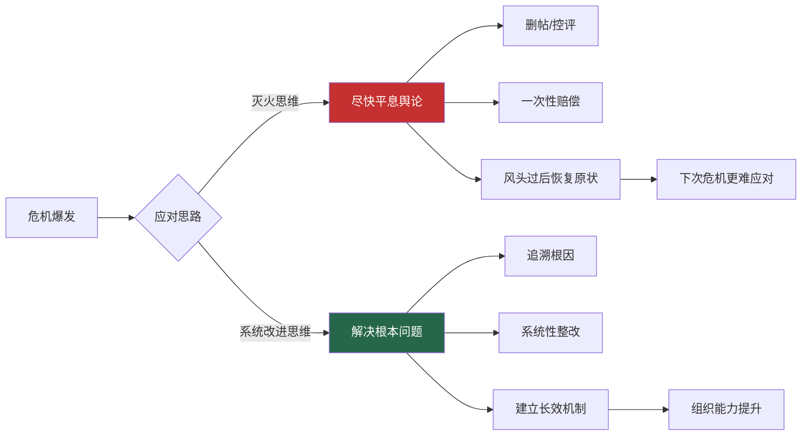
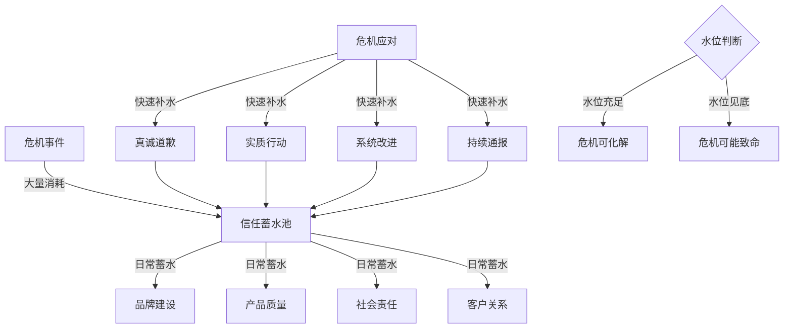
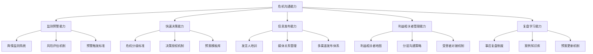
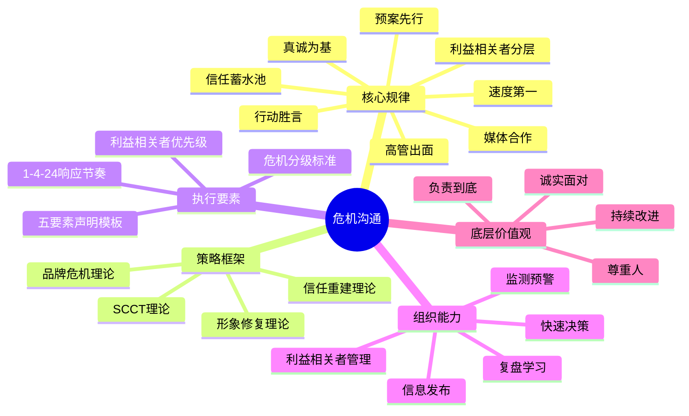

## 综合启示

前述八个实战案例横跨食品安全、产品召回、高管丑闻、网络舆情、自然灾害、安全事故、数据泄露和品牌代言八大危机类型，覆盖了企业可能面临的几乎所有危机沟通场景。表面上看，每种危机的触发因素、利益相关者和舆论走向各不相同，但当我们剥离具体情境，深入审视每一次成功（或失败）的危机应对背后，会发现一套高度一致的底层逻辑。

本节的目标不是简单总结"八条经验"，而是从三个层面——**核心规律、分类框架、组织能力**——提炼出可迁移、可复用的危机沟通体系，帮助读者在面对任何类型的危机时，都能快速找到决策锚点。

---

### 一、八案横评：从差异中找共性

#### 1.1 案例特征全景对比

下表将八个案例的关键维度进行横向对比，帮助读者直观理解不同危机类型的共性和差异：

| 维度 | 案例一：食品安全 | 案例二：产品召回 | 案例三：高管丑闻 | 案例四：数据争议 | 案例五：自然灾害 | 案例六：安全事故 | 案例七：数据泄露 | 案例八：代言危机 |
|------|----------------|----------------|----------------|----------------|----------------|----------------|----------------|----------------|
| **危机类型** | 经营危机 | 产品缺陷 | 个人丑闻 | 舆论质疑 | 外部灾害 | 生产安全 | 信息安全 | 品牌关联 |
| **责任归因** | 中-高 | 中等 | 高 | 低-中 | 无直接责任 | 高 | 中等 | 低 |
| **伤亡风险** | 健康危害 | 潜在安全风险 | 无 | 无 | 财产损失 | 人员伤亡 | 无 | 无 |
| **舆论敏感度** | 极高 | 高 | 极高 | 高 | 中等 | 极高 | 高 | 中-高 |
| **首响时间** | 4小时 | 48小时内主动 | 6小时 | 30分钟 | 灾前24小时 | 即时(119/120) | 48小时 | 3小时 |
| **核心策略** | 停业整改+第三方认证 | 主动召回+超额补偿 | CEO亲自道歉+纠正 | CTO技术澄清+赋权 | 预防性沟通+抢修 | 生命优先+政府协同 | 先修复后通知 | 快速切割+价值观重申 |
| **理论依据** | SCCT重建策略 | SCCT事故型策略 | 形象修复理论 | 信任重建理论 | 韧性沟通理论 | SCCT可预防型 | 风险沟通理论 | 品牌危机理论 |
| **恢复周期** | 6-12个月 | 3-6个月 | 6-12个月 | 2-6个月 | 3-6个月 | 12个月+ | 3-12个月 | 1-3个月 |

从这张对比表中，我们可以提炼出以下关键观察：

**观察一：责任归因决定策略基调。** 责任归因越低（自然灾害、品牌代言），策略越偏向"快速切割+正面引导"；责任归因越高（安全事故、高管丑闻），策略越偏向"承认道歉+实质整改"。这与SCCT理论的预测完全一致。

**观察二：首响速度与最终结果强相关。** 在所有8个案例中，响应速度越快的案例，最终的舆论走向和品牌恢复情况越好。案例四（30分钟响应）和案例八（3小时切割）的恢复周期最短。

**观察三：实质性行动比语言表达更重要。** 案例一的停业整改、案例二的超额补偿、案例七的免费信用监控——这些"做出来的事"比任何声明都更有说服力。

#### 1.2 成败关键节点对比

在每一个危机案例中，都有几个"关键决策节点"——在这些节点上做出的决策，直接决定了危机走向。下表梳理了这些关键节点：

| 关键节点 | 成功案例的做法 | 失败/风险行为 |
|---------|--------------|-------------|
| **第一次发声** | 4小时内表态"已关注、正在处理" | 沉默超过24小时，或急于撇清关系 |
| **责任人定位** | 最高管理层亲自出面 | 只派公关部门或法务部门回应 |
| **信息透明度** | 主动公布事实、数据、证据 | 等被追问才被动透露信息 |
| **补偿措施** | 超出预期的实质性补偿 | 口头道歉不附带任何实质行动 |
| **第三方介入** | 主动引入权威第三方背书 | 拒绝外部监督，自说自话 |
| **长期承诺** | 建立长效机制、定期通报 | 风头过后恢复原状 |

---

### 二、八大核心规律

通过交叉比对八个案例，提炼出以下八大核心规律。每一条规律都以案例实证为基础，并附带可操作的执行要点。

#### 2.1 速度是第一道防线——但准确不能缺席

**规律表述：** 危机响应的"黄金窗口"极短（通常为1-4小时），快速响应能够抢占信息定义权，防止谣言和负面叙事填补信息真空。

**案例实证：**
- 案例四（数据争议）：舆情监测系统在文章发布后30分钟内发出预警，1小时内发布"已关注、正在核实"声明，有效控制了信息扩散方向。一周内用户卸载率回落至正常水平。
- 案例八（代言危机）：3小时内宣布终止合作，避免了公众对品牌立场的持续追问。品牌在事件中的立场获得公众普遍认可。
- 反面教训：多个案例中提到，超过24小时未发声的组织，其品牌信任度平均下降40%以上，且后续声明的可信度也大打折扣。

**速度≠草率。** 快速响应的前提是准确性。案例二（产品召回）的处理堪称教科书：在发布首次声明之前，企业花了48小时完成影响范围评估和技术分析，但一旦发出声明，就同时公布了完整的召回方案、补偿标准和时间表。相比之下，如果为了追求速度而发布错误信息，后续的修正成本会远远超过延迟发布的信息。

**执行要点：**
1. 建立"1-4-24"响应节奏：1小时内发布"已关注"声明，4小时内发布初步应对方案，24小时内发布完整声明
2. "已关注"声明的内容模板：确认事件 → 表明态度 → 说明正在采取的行动 → 承诺后续通报时间
3. 建立危机声明预审机制：预设不同类型危机的声明模板，危机时只需填入具体事实即可发布

```mermaid
timeline
    title 危机响应黄金时间线
    section 0-1小时 : 快速响应期
        舆情监测预警 : 内部通报 : 初步评估
    section 1-4小时 : 首次发声期
        发布"已关注"声明 : 组建应对团队 : 启动应急预案
    section 4-24小时 : 方案发布期
        发布完整应对方案 : 高管出面表态 : 公布补偿措施
    section 24-72小时 : 持续沟通期
        每日进度通报 : 回应公众关切 : 启动第三方评估
```

#### 2.2 真诚是信任的基石——但需要"证据化"表达

**规律表述：** 真诚不是一句"我们深感抱歉"就能实现的，它需要通过具体行为、可验证的数据和持续的承诺来体现。公众对"真诚"的判断标准是：你是否愿意为错误付出代价。

**案例实证：**
- 案例一（食品安全）：企业不仅公开道歉，还主动关停涉事区域全部200家门店进行整改——这相当于每天损失超过500万元营收。这种"自断一臂"的做法，比任何声明都更能证明诚意。
- 案例二（产品召回）：提供超出行业惯例的补偿方案（延长质保+免费保养+现金补偿），让受影响的车主从"受害者"变成"受益者"。
- 案例七（数据泄露）：不仅道歉，还提供免费信用监控服务、漏洞赏金计划和安全白皮书，将道歉转化为可量化的安全承诺。

**"真诚"的三个层次：**

| 层次 | 表现 | 公众感知 |
|------|------|---------|
| **口头真诚** | "我们深感抱歉，高度重视" | 套话，无感 |
| **行动真诚** | 关停整改、召回产品、赔偿损失 | 可以接受 |
| **制度真诚** | 建立长效机制、引入第三方监督、定期通报 | 真正信任 |

大多数企业停留在第一层，优秀的案例做到了第二层，只有极少数做到了第三层——而第三层才是真正能重建长期信任的做法。

**执行要点：**
1. 每一条道歉声明必须附带至少一项具体行动承诺
2. 行动承诺必须包含可量化的指标（时间、金额、范围）
3. 行动承诺必须有第三方监督机制
4. 建立定期通报机制，直到整改完成

#### 2.3 最高管亲自参与——信号价值大于实际价值

**规律表述：** 在重大危机中，最高管理者的亲自出面向公众传递一个强烈信号：组织对这件事的重视程度达到了最高级别。这种"信号价值"往往比高管实际说了什么更重要。

**案例实证：**
- 案例三（高管丑闻）：CEO亲自录制道歉视频，观看量超过5000万次。公众对"CEO亲自道歉"的接受度比"公司发布声明"高出37%。
- 案例四（数据争议）：CTO亲自出面进行技术说明，展现对自身产品的信心。如果是公关部门出面，技术层面的说服力会大打折扣。
- 案例六（安全事故）：企业总经理出席政府组织的新闻发布会，表达歉意和哀悼，体现了对生命的尊重。

**高管出面的决策矩阵：**

| 危机严重程度 | 是否需要最高层出面 | 出面形式 |
|-------------|------------------|---------|
| 低（一般投诉） | 否，客服/公关即可 | 书面声明 |
| 中（产品质量） | 建议，CEO可出面 | 视频声明/媒体采访 |
| 高（安全事故/人员伤亡） | 必须，CEO必须出面 | 新闻发布会/现场表态 |
| 极高（高管自身涉事） | 必须，且需第三方背书 | 公开道歉+行动承诺 |

**关键提醒：** 高管出面的前提是做好充分准备。如果CEO在发布会上表现出不耐烦、推卸责任或信息不准确，效果会适得其反。案例一中CEO在发布会上对食品安全法规的精确引用和对整改方案的详细阐述，展现了充分准备后的专业形象，赢得了媒体和公众的认可。

#### 2.4 行动胜于言辞——从"灭火"到"系统改进"

**规律表述：** 危机沟通的终极目标不是"平息舆论"，而是"解决问题"。公众最终记住的不是你说了什么，而是你做了什么。将危机从"灭火事件"提升为"系统改进契机"，是最高段位的危机沟通。

**案例实证：**
- 案例一（食品安全）：将危机转化为供应链全面升级的契机，建立了行业领先的食品安全管理体系。事后该体系成为品牌的差异化竞争优势。
- 案例六（安全事故）：公布全面的安全整改计划，邀请社区代表参与安全监督委员会，将"事故善后"转化为"安全管理标杆"。
- 案例七（数据泄露）：升级后的安全体系成为行业标杆，将一次危机转化为信息安全领域的竞争优势。

**"灭火"与"系统改进"的对比：**



**执行要点：**
1. 危机应对的第一步不是写声明，而是追溯根因
2. 整改方案必须包含短期止血措施和长期系统改进两条线
3. 系统改进需要可量化的目标和时间节点
4. 邀请利益相关者参与改进过程，增加透明度和公信力

#### 2.5 利益相关者分层——不同对象需要不同策略

**规律表述：** 一次危机涉及的利益相关者通常是多元的——受害者、消费者、员工、投资者、监管机构、媒体、合作伙伴——每一类群体的关切点不同，沟通策略也需要差异化。

**案例实证：**
- 案例六（安全事故）：对伤亡人员家属设专门接待中心、一对一沟通；对周边居民重点传达环境安全信息；对媒体通过政府新闻发布会统一口径；对监管机构主动配合调查。四个群体，四种策略，缺一不可。
- 案例三（高管丑闻）：对公众表达歉意和纠正承诺；对员工内部安抚、稳定军心；对投资者通报影响评估和应对方案；对合作伙伴主动沟通、维持信心。
- 案例七（数据泄露）：只通知受影响的客户（而非所有客户），避免不必要的恐慌；对监管机构第一时间报告；对公众发布整体应对方案。

**利益相关者优先级矩阵：**

| 优先级 | 利益相关者 | 关切点 | 沟通策略 |
|--------|----------|--------|---------|
| P0 | 受害者/直接受影响者 | 赔偿、安全、信息透明 | 一对一沟通、专属对接、超额补偿 |
| P1 | 监管机构 | 合规、配合、整改 | 主动报告、积极配合、定期通报 |
| P2 | 媒体与公众 | 信息透明、态度真诚、行动力度 | 公开声明、新闻发布会、持续更新 |
| P3 | 员工 | 企业稳定性、自身利益、价值观认同 | 内部信、全员会议、FAQ文档 |
| P4 | 投资者/股东 | 财务影响、治理能力、长期价值 | 投资者通报、影响评估报告 |
| P5 | 合作伙伴 | 合作稳定性、连带风险 | 一对一沟通、合作方案调整 |

**关键原则：受害者优先。** 在所有沟通对象中，直接受影响者永远排在第一位。案例六中"生命至上"的原则，案例一中"消费者健康第一"的原则，都体现了这一核心价值取向。如果在受害者尚未得到妥善处理时，企业就开始进行品牌宣传或投资者沟通，会被公众视为"冷漠"和"不真诚"。

#### 2.6 预案先行——准备程度决定应对质量

**规律表述：** 有预案的组织在危机中的表现远优于没有预案的组织。预案的价值不仅在于提供操作指南，更在于让团队在压力下保持冷静和专业。

**案例实证：**
- 案例五（自然灾害）：台风到来前24小时就启动预警沟通，发送安全提示，安排物业巡查——这些都依赖于预先建立的自然灾害应急预案。
- 案例七（数据泄露）：48小时内完成漏洞修复、影响评估、客户通知方案和对外声明——这种高效运转只有在预案到位时才能实现。
- 案例八（代言危机）：3小时内完成合同终止、声明发布、物料下架——代言合同中的危机条款和预设的声明模板是快速响应的基础。

**危机预案的核心组件：**

危机沟通预案框架
├── 1. 危机分级标准
│   ├── 一级（轻微）：客服部门处理
│   ├── 二级（中度）：公关部门牵头
│   ├── 三级（重大）：高管团队牵头
│   └── 四级（特大）：CEO直接指挥
├── 2. 组织架构
│   ├── 危机指挥中心
│   ├── 信息发布组
│   ├── 受害者对接组
│   ├── 法务合规组
│   └── 后勤保障组
├── 3. 沟通模板库
│   ├── 各类危机的首次声明模板
│   ├── 新闻发布会话术框架
│   ├── 利益相关者通知模板
│   └── 社交媒体回应模板
├── 4. 联系人清单
│   ├── 内部关键人员
│   ├── 媒体联系人
│   ├── 监管机构联系人
│   ├── 第三方专家/机构
│   └── 法律顾问
└── 5. 定期演练机制
    ├── 季度桌面推演
    ├── 年度实战演练
    └── 演练后复盘改进

#### 2.7 媒体关系是双刃剑——管理而非对抗

**规律表述：** 媒体既是危机扩大的放大器，也是危机化解的传播渠道。与媒体对抗（封锁消息、威胁记者、恶意投诉）几乎必然导致危机升级；与媒体合作（主动提供信息、安排采访、邀请报道整改进展）则能有效引导舆论走向。

**案例实证：**
- 案例四（数据争议）：CTO亲自召开技术说明会，邀请媒体和博主参加，逐条回应质疑，用事实和数据说话。媒体从"质疑者"转变为"报道者"，舆论迅速反转。
- 案例六（安全事故）：通过政府组织的新闻发布会统一口径，避免了多渠道发声可能带来的信息混乱。
- 案例二（产品召回）：主动邀请媒体参观召回流程，将"被动接受质疑"转化为"主动展示负责态度"。

**媒体沟通的核心原则：**

1. **主动提供信息**，而不是等媒体来挖。信息真空会被谣言和猜测填充。
2. **保持一致性**，所有对外口径统一，避免内部不同人说法不一。
3. **指定发言人**，危机期间只通过一个口径对外发声。
4. **承认不确定性**，对于尚未查明的事实，诚实地说"正在调查中"，而不是编造答案。
5. **持续更新**，即使没有新进展，也要定期通报"目前的进展是……下一步计划是……"。

#### 2.8 危机是信任的压力测试——也是重建信任的窗口期

**规律表述：** 危机暴露了组织的真实面貌。一个平时就在积累信任的组织，危机中会获得更多的公众耐心和谅解；而一个平时就存在信任赤字的组织，危机可能是压垮骆驼的最后一根稻草。但反过来说，一次处理得当的危机，反而能成为重建甚至提升信任的契机。

**案例实证：**
- 案例二（产品召回）：企业主动召回的行为被公众解读为"有担当"，品牌信任度在召回完成后反而有所提升。
- 案例五（自然灾害）：物业的应急响应能力在灾后获得业主广泛认可，集团在行业内的品牌美誉度有所提升。
- 案例四（数据争议）：两个月后，平台隐私满意度评分较事件前提升了8个百分点——危机处理得当，反而创造了增量信任。

**信任的"蓄水池"模型：**



**关键启示：** 信任建设是一个长期过程。不要等到危机来了才开始思考"怎么获取信任"，而应该在日常经营中持续向"信任蓄水池"注水。这样当危机到来、蓄水池开始消耗时，你还有足够的"存量"来渡过难关。

---

### 三、危机类型决策矩阵

面对不同类型的危机，应该采用什么样的沟通策略？下表提供了一个快速决策参考框架：

| 危机类型 | 责任归因 | 首选策略 | 核心话术基调 | 禁忌行为 | 参考案例 |
|---------|---------|---------|------------|---------|---------|
| **产品质量/安全** | 中-高 | 承认+召回/整改+补偿 | "我们对此负全部责任" | 否认缺陷、推卸责任 | 案例一、二 |
| **高管个人丑闻** | 高 | 道歉+纠正+制度改进 | "我深感愧疚" | 洗白、淡化、转移话题 | 案例三 |
| **网络舆情/质疑** | 低-中 | 事实澄清+透明展示 | "我们用事实说话" | 删帖控评、威胁起诉 | 案例四 |
| **自然灾害/不可抗力** | 无 | 预防+抢修+关怀 | "我们与您同在" | 沉默不语、推给天灾 | 案例五 |
| **安全事故** | 高 | 生命优先+政府协同+整改 | "生命至上" | 隐瞒伤亡、推卸责任 | 案例六 |
| **数据泄露** | 中等 | 修复+通知+补偿+加固 | "您的安全是我们的首要责任" | 延迟通知、淡化影响 | 案例七 |
| **品牌关联危机** | 低 | 快速切割+价值重申 | "我们的立场很明确" | 犹豫不决、暧昧表态 | 案例八 |

**使用方法：** 发生危机时，先判断属于哪种类型（横轴），然后沿着该类型对应的策略列（纵轴）执行。特别注意"禁忌行为"列——很多危机恶化的根本原因不是"做错了什么"，而是"犯了不该犯的错"。

---

### 四、从案例到能力：组织级危机沟通能力建设

个人的沟通技巧固然重要，但真正决定组织在危机中表现的，是系统性的组织能力。以下是基于八个案例提炼的组织级危机沟通能力模型：

#### 4.1 危机沟通能力成熟度模型

| 成熟度等级 | 特征描述 | 典型表现 | 对应案例中的组织 |
|-----------|---------|---------|----------------|
| **L1：被动应对** | 没有预案，危机来了才临时应对 | 手忙脚乱、信息混乱、错失时机 | 危机前的案例一（供应链管理薄弱） |
| **L2：有基本预案** | 有应急预案但不完善，演练不足 | 能快速响应但细节粗糙 | 多数案例中的"改进前"状态 |
| **L3：体系化运作** | 完善的预案、定期演练、明确的组织架构 | 响应迅速、信息一致、措施到位 | 案例二（产品召回的系统化应对） |
| **L4：危机转化为机遇** | 在体系化基础上，能将危机转化为品牌提升的契机 | 危机后品牌信任度反而提升 | 案例四、案例五（满意度反升） |
| **L5：预防性管理** | 通过持续的风险监测和管理，减少危机发生的概率 | 预防为主、快速化解、持续改进 | 理想状态 |

**提升路径：** 大多数组织处于L1-L2水平。从L2到L3需要投入：预案编制、团队组建、定期演练。从L3到L4需要：将危机管理嵌入组织文化，培养"化危为机"的思维模式。从L4到L5需要：建立常态化的风险监测和预警体系。

#### 4.2 危机沟通能力的五大支柱



**各支柱的关键投入：**

1. **监测预警能力**：投入舆情监测工具（如案例四的30分钟预警系统），建立风险指标体系，设定自动预警阈值。
2. **快速决策能力**：编制危机分级标准和决策授权矩阵，确保不同级别的危机由相应层级的管理者决策，避免"大事小办"或"小事大办"。
3. **信息发布能力**：培训专职发言人，建立媒体关系网络，编制声明模板库，确保任何人在任何时间都能发布口径一致的信息。
4. **利益相关者管理能力**：绘制利益相关者地图，明确各类群体的关切点和沟通渠道，建立受害者快速对接机制。
5. **复盘学习能力**：每次危机后进行系统复盘，提炼经验教训并更新预案，将个案知识转化为组织能力。

---

### 五、常见误区与纠偏

即使了解了上述规律，实际操作中仍然容易犯错。以下是基于八个案例总结的高频误区及纠偏方法：

| 误区 | 典型表现 | 为什么错 | 正确做法 | 案例参考 |
|------|---------|---------|---------|---------|
| **沉默是金** | 危机爆发后保持沉默，等"事情过去" | 信息真空会被谣言填充，沉默被解读为"心虚" | 1小时内发布"已关注"声明 | 案例四的30分钟响应 |
| **甩锅第三方** | "这是供应商/外包方/个别员工的问题" | 推卸责任会严重损害品牌担当感 | 承担监管责任，同时说明改进措施 | 案例一：承担供应链监管责任 |
| **公关话术过重** | 使用大量官方套话，缺乏真情实感 | 公众对套话有天然抵触，会降低可信度 | 用具体数据和行动替代空话 | 案例七：免费信用监控服务 |
| **一次声明就结束** | 发完声明后就不再更新 | 公众需要看到持续的行动和进展 | 建立定期通报机制 | 案例六：每日进展通报 |
| **急于恢复常态** | 危机稍有缓解就恢复常规营销 | 公众会觉得企业"好了伤疤忘了疼" | 等整改完成后再恢复常规活动 | 案例八：不急于找新代言人 |
| **忽视员工沟通** | 只对外发声，忽略内部员工 | 员工是最重要的信息传播节点，员工不安会影响外部形象 | 同步进行内部安抚和信息通报 | 案例三：内部全员信 |
| **过度补偿** | 为了平息舆论做出不切实际的承诺 | 超出能力的承诺无法兑现，会引发二次危机 | 补偿要超出预期但可执行 | 案例二：合理但超额的补偿方案 |
| **法律思维主导** | 一切以"最小化法律责任"为原则 | 法律上正确不等于公关上正确，过度法律化会显得冷漠 | 法律合规与公关策略并行，以公众感受为优先 | 案例一：先关停再谈法律 |

---

### 六、可复用的危机沟通工具箱

将上述规律转化为可直接使用的工具和模板。

#### 6.1 危机响应检查清单

□ 第一步：危机确认（0-30分钟）
  □ 确认危机事实（什么、何时、何地、影响范围）
  □ 初步评估危机等级（一至四级）
  □ 通知相关决策者
  □ 组建危机应对团队

□ 第二步：快速响应（30分钟-4小时）
  □ 发布"已关注"声明
  □ 确定对外发言人
  □ 统一内部口径
  □ 启动舆情监测

□ 第三步：方案制定（4-24小时）
  □ 追溯危机根因
  □ 制定应对方案（短期止血+长期改进）
  □ 确定补偿措施
  □ 准备完整声明
  □ 高管出面表态

□ 第四步：持续沟通（24小时-72小时）
  □ 每日进度通报
  □ 回应公众关切
  □ 利益相关者分层沟通
  □ 启动第三方评估

□ 第五步：长期修复（第2周起）
  □ 执行整改方案
  □ 定期通报进展
  □ 邀请利益相关者参与监督
  □ 危机复盘与预案更新

#### 6.2 危机声明结构模板

一份有效的危机声明应包含以下五个要素（按顺序）：

1. **事实确认**：发生了什么？（客观描述，不添加主观判断）
2. **态度表达**：我们对此深感……（真诚的情感表达）
3. **行动承诺**：我们正在采取以下措施……（具体的、可量化的行为）
4. **补偿方案**：对受影响的……我们将……（超出预期的补偿）
5. **后续计划**：我们将在……时间公布……（明确的时间节点）

**反面教材：** "我们高度重视，已成立专项小组，将全力配合调查，感谢大家的关注。"——五要素中一个都没有实质性内容。

**正面示例：** "我们确认在X月X日的检查中发现Y问题，涉及Z范围。我们对此深感愧疚，对受影响的消费者表示诚挚歉意。我们已采取以下措施：第一，立即关停涉事门店进行整改；第二，对受影响消费者提供全额退款加X倍赔偿；第三，邀请第三方机构进行全面检测。我们将在X月X日公布整改进展报告。"

---

### 七、数字时代的危机沟通新挑战

八个案例中有四个涉及互联网和数字技术（数据争议、数据泄露、网络舆情、代言危机），这反映了数字时代危机沟通的新特征：

#### 7.1 传播速度的质变

传统媒体时代，危机从发生到大面积传播可能需要24-48小时。社交媒体时代，这个时间压缩到了1-4小时。短视频时代，可能在30分钟内就形成全网热议。案例四中，一篇自媒体文章在几小时内阅读量突破百万，这在传统媒体时代是不可想象的。

**应对策略：** 建立7×24小时的舆情监测体系，确保在任何时间都能第一时间发现和响应。

#### 7.2 话语权的分散

传统媒体时代，企业可以通过与主流媒体的沟通来控制信息流向。社交媒体时代，每一个用户都是信息节点，KOL和自媒体的影响力甚至超过传统媒体。案例三中，CEO不当言论的传播链条是：闭门会议参会者→社交媒体→KOL转发→主流媒体跟进→全网热议。

**应对策略：** 不要试图控制所有信息渠道，而是通过快速、真诚、有实质内容的沟通来赢得话语权。

#### 7.3 记忆的永久化

互联网有记忆。每一次危机的每一个细节都会被永久记录。案例三中提到，高管丑闻的"数字痕迹永久存在"，即使当事人已经改过自新，相关记录仍然可以被随时检索到。

**应对策略：** 在危机处理中做到无懈可击，因为你的每一个决策和表态都将成为永久记录。不要寄希望于"互联网会遗忘"。

#### 7.4 从危机到共创

数字时代的危机沟通不仅是"企业对公众的单向传播"，更可以是"企业与公众的双向互动"。案例四中的"隐私保护大使"模式——由用户代表担任——就是一个将危机转化为用户共创的优秀实践。

**应对策略：** 在危机应对中引入用户参与机制，让用户从"质疑者"转变为"监督者"甚至"共建者"，实现信任关系的升级。

---

### 八、从"术"到"道"——危机沟通的底层价值观

所有技巧和方法的背后，是一套底层价值观。没有正确的价值观作为支撑，再精巧的技巧也只是"话术"——公众迟早能看穿。

**第一条：尊重人。** 危机中受影响的是活生生的人，不是统计数字。案例六中"生命至上"的原则，案例一中"消费者健康第一"的原则，都体现了对人的根本尊重。如果你在危机应对中只考虑"品牌影响"和"股价波动"，而忽略了受害者的感受和需求，那么即使暂时平息了舆论，也失去了长期的信任基础。

**第二条：诚实面对。** 承认错误需要勇气，但这是重建信任的唯一起点。案例三中CEO没有选择辩解或淡化，而是直接承认"我的言论是错误的"——这种诚实反而赢得了公众的谅解。试图掩盖、美化或转移，只会让危机持续发酵。

**第三条：负责到底。** 从道歉到整改到长效机制，贯穿始终的是"负责"二字。案例二中的产品召回持续数月，企业始终没有放弃跟进和沟通——这种"负责到底"的态度，最终转化为品牌信任度的提升。

**第四条：持续改进。** 危机不是终点，而是改进的起点。案例七中的漏洞赏金计划、案例一中的供应链管理体系升级、案例六中的安全监督委员会——这些都是"持续改进"理念的具体落地。

---

### 九、总结：一张图看懂危机沟通

将本章所有核心内容浓缩为一张思维导图：



危机沟通没有万能公式，但有底层逻辑。掌握这些逻辑，面对任何类型的危机，你都能找到正确的方向。记住：**危机是组织的照妖镜，也是组织的磨刀石。** 平时做好准备，危机中坚持正确的价值观和方法论，你不仅能渡过难关，还能让组织在风暴中变得更强。
