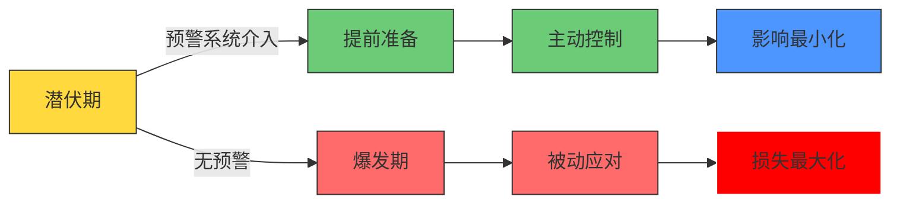
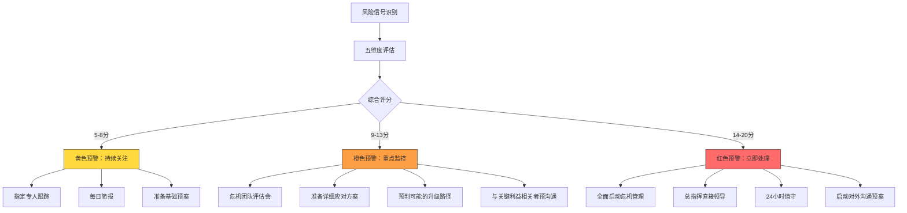

## 一、危机预警：在危机到来之前做好准备

危机管理领域有一句被反复验证的铁律：**危机爆发后的72小时决定了组织80%的命运走向**。但真正高明的危机管理，不是在72小时内力挽狂澜，而是在危机到来之前就做好万全准备。危机预警（Crisis Early Warning）正是这套"治未病"体系的核心——它通过系统化的信号捕捉、风险评估和预案准备，让组织在风暴来临前就完成布局。

### 1.1 理解危机预警的本质

#### 1.1.1 为什么危机预警是危机管理的第一道防线

美国危机管理学者史蒂文·芬克（Steven Fink）在其经典著作《危机管理》中提出了危机的四阶段模型：潜伏期（Prodromal）、爆发期（Acute）、蔓延期（Chronic）、消退期（Resolution）。其中，**潜伏期是唯一一个组织拥有主动权的时间窗口**。一旦危机进入爆发期，组织将从主动变为被动，每一步反应都可能被舆论放大和曲解。

危机预警的价值在于：

- **时间优势**：从被动反应转为主动布局，平均争取48-72小时的黄金准备期
- **成本优势**：预防成本通常是危机应对成本的1/10至1/100。据国际危机管理协会（ICMA）统计，一次重大品牌危机的平均处理成本超过500万美元，而建立预警体系的年投入通常在10-50万美元之间
- **决策优势**：有充足时间进行信息核实、法律评估和策略制定，避免仓促决策造成的二次伤害
- **信任优势**：在危机爆发时能够第一时间做出专业回应，向公众展示组织的管理能力和社会责任感



**真实案例：2017年海底捞"老鼠门"事件**。北京海底捞两家门店被记者暗访拍到后厨有老鼠出没、用漏勺掏下水道等严重卫生问题。视频在社交媒体发布后，舆论瞬间引爆。但海底捞在3小时内发布了措辞诚恳的道歉声明，承认问题、公布整改措施、明确责任人，将"舆论审判"转化为"态度认可"——股价在短暂下跌后迅速回升。反观同年某连锁餐饮品牌面对类似危机时，第一时间否认问题、威胁媒体，最终导致品牌声誉严重受损。两者的差距，不在危机爆发后的反应速度，而在危机爆发前的准备深度。

#### 1.1.2 危机预警的理论基础

危机预警建立在几个重要的理论基础之上：

**海因里希法则（Heinrich's Law）**：美国安全工程师赫伯特·海因里希通过大量事故数据分析发现，每一起重大事故背后，有29起轻微事故和300起未遂先兆。这意味着在一场重大危机爆发之前，组织通常已经收到了大量被忽视的预警信号。将这一法则应用到危机沟通领域，每一起引发公众广泛关注的品牌危机背后，往往有数十起小规模的负面事件作为前兆。

**信号检测理论（Signal Detection Theory）**：危机预警本质上是一个信号检测问题——从大量的背景噪声中识别出真正有价值的危机信号。这涉及两个关键指标：**灵敏度**（能否捕捉到真实的危机信号）和**特异度**（能否避免将正常波动误判为危机信号）。过高的灵敏度会导致"狼来了"效应，预警疲劳；过低的灵敏度则会错过真正的危机信号。优秀的预警系统需要在两者之间找到平衡。

**弱信号理论（Weak Signal Theory）**：芬兰学者伊尔卡·安索夫（Igor Ansoff）提出，重大变化往往始于微弱的、不完整的、容易被忽略的信号。危机预警的核心能力，就是从这些"弱信号"中提前识别出危机的苗头。一个投诉可能只是个别客户的不满，但当投诉模式呈现特定规律时——例如集中在同一产品批次、同一地区、同一使用场景——就可能预示着一场即将到来的产品危机。

**瑞士奶酪模型（Swiss Cheese Model）**：詹姆斯·瑞森（James Reason）提出的事故因果模型认为，每一层防御都像一片有孔的奶酪，单层防御的缺陷（孔洞）会被其他层弥补。但当多层防御的孔洞恰好对齐时，危机就会穿透所有防线。这意味着危机预警不能依赖单一系统，必须建立多层、互补的监测和评估机制。当舆情监测系统漏掉了一个信号，消费者投诉系统应该能捕捉到；当外部渠道没有异常，内部举报系统可能已经发现了问题。

#### 1.1.3 危机的时间压缩效应

数字时代从根本上改变了危机的时间尺度。这一变化要求预警系统具备更高的实时性：

| 时代 | 危机发酵周期 | 组织可反应时间 | 信息传播媒介 |
|------|------------|--------------|------------|
| 传统媒体时代（2000年前） | 1-3天 | 24-72小时 | 报纸、电视、广播 |
| 门户网站时代（2000-2010） | 12-24小时 | 6-12小时 | 新闻网站、论坛、博客 |
| 移动社交时代（2010-2020） | 2-6小时 | 1-3小时 | 微博、微信、短视频 |
| 短视频+算法推荐时代（2020至今） | 30分钟-2小时 | 30分钟-1小时 | 抖音、快手、小红书 |

这种"时间压缩效应"意味着：**预警系统必须在危机爆发前就完成准备工作，因为危机爆发后留给你反应的时间几乎为零**。2023年某新能源汽车品牌的一起自燃事件，从车主发布第一条抖音视频到登上微博热搜，仅用了47分钟。如果企业的监测系统以"每日汇总"的频率运行，面对这种速度的危机传播，预警系统就形同虚设。

### 1.2 建立全方位舆情监测体系

在数字时代，信息传播的速度和广度远超以往。一条微博从发布到登上热搜，可能只需要2个小时。这意味着危机预警必须是一个**实时化、全渠道、智能化**的系统，而非传统的定期巡查。

#### 1.2.1 监测渠道的全景图

一个完善的舆情监测体系应当覆盖以下六大类渠道，每一类渠道的信息特征和危机信号表现形式都不同：

**第一类：社交媒体平台**

社交媒体是当代危机的主要引爆点。不同平台具有不同的传播特征：

| 平台 | 核心用户群 | 传播特征 | 典型危机信号 | 监测重点 |
|------|-----------|---------|-------------|---------|
| 微博 | 18-45岁泛用户 | 公开传播，裂变速度极快 | 负面话题登上热搜、KOL转发批评 | 话题热度、情感倾向、关键意见领袖动态 |
| 微信 | 全年龄段 | 相对封闭，深度传播为主 | 公众号爆款负面文章、群聊舆情 | 公众号文章、朋友圈分享、社群讨论 |
| 抖音/快手 | 15-40岁 | 视频传播，情绪感染力强 | 负面视频大量传播、用户模仿投诉 | 视频播放量、评论情感、相关话题趋势 |
| 小红书 | 18-35岁女性为主 | 种草/拔草生态，消费决策影响大 | 大量负面测评笔记、产品避雷帖 | 品牌相关笔记情感、评论区讨论方向 |
| 知乎 | 25-40岁知识群体 | 深度讨论，长尾效应明显 | 高赞负面回答、专业分析帖 | 问题浏览量、回答倾向、专业分析帖 |
| B站 | 15-30岁年轻人 | 二次创作，弹幕文化 | UP主制作批评视频、弹幕负面倾向 | 相关视频播放量、弹幕情感、评论区 |

**第二类：新闻媒体**

新闻媒体的报道具有权威性和公信力，其负面报道往往比社交媒体更具杀伤力。监测应覆盖：

- **中央级媒体**：人民日报、新华社、央视新闻等，其报道往往代表官方态度。特别注意"人民锐评""新华时评"等栏目——这些评论通常暗示了监管层的态度走向
- **财经/商业媒体**：财新、第一财经、经济观察报等，对企业的商业行为和财务问题敏感。财经媒体的深度调查报道往往是重大危机的导火索
- **行业垂直媒体**：与组织所在行业直接相关的专业媒体。行业媒体的报道虽然受众有限，但会被主流媒体引用放大
- **地方媒体**：与组织运营所在地区相关的地方媒体。很多危机最初由地方媒体曝光，随后被全国性媒体转载
- **海外媒体**：对于有国际业务的组织，需要关注英文主流媒体和行业媒体。海外媒体的负面报道会通过社交媒体"回流"国内，形成双重舆论压力

**第三类：消费者反馈渠道**

消费者的声音是危机预警最直接的信号源：

- **投诉平台**：黑猫投诉、12315平台、消费者协会投诉。黑猫投诉的数据尤其值得关注——该平台的投诉处理速度和企业回复率是公开的，处理不当本身就会成为新闻素材
- **电商平台评价**：淘宝/天猫、京东、拼多多等平台上的产品评价和差评趋势。重点关注差评中的共性关键词和情感强度变化
- **客服系统数据**：客服热线的来电量变化、投诉分类趋势、重复投诉率。客服数据是危机预警中**最早、最真实**的信号源之一，因为客户投诉往往先于社交媒体发声
- **售后服务数据**：退换货率、维修率、保修期内故障率。当某产品的退换货率突然上升，即使绝对值仍在"可接受"范围内，也应立即启动排查

**第四类：行业与政策环境**

- **监管政策变化**：新法规出台、监管标准调整、执法力度变化。例如《个人信息保护法》实施前，大量App面临数据合规审查，提前布局的企业平稳过渡，后知后觉的企业则遭遇监管通报
- **行业事件**：竞争对手危机（可能引发行业性信任危机）、行业协会动态。2022年某外卖平台的骑手安全问题引发公众对整个即时配送行业的审视，同行企业如果不提前准备回应话术，就会被连带波及
- **技术趋势**：替代技术出现、行业标准变更
- **社会议题**：与组织所在行业相关的社会热点（如环保、数据隐私、劳动权益）

**第五类：内部渠道**

很多危机的种子在内部就已埋下：

- **员工声音**：内部论坛、匿名社区（如脉脉）、离职员工评价（如Glassdoor）。脉脉上的匿名爆料已经成为近年来中国科技企业危机的重要导火索。2021年某互联网大厂的"996"讨论和2023年某电商平台的裁员风波，最初都是从脉脉匿名帖开始发酵的
- **内部举报**：合规举报热线、内部审计发现的问题。据美国伦理与合规研究所（ECI）统计，约42%的企业不当行为是通过内部举报发现的。建立畅通、保密、受保护的内部举报渠道，是危机预警最前端的"哨兵"
- **管理层反馈**：一线管理者的观察和预警。一线管理者是最接近问题的人，他们往往比舆情监测系统更早感知到异常——客户的微妙变化、员工的士气波动、合作伙伴的态度转变

**第六类：监管与法律渠道**

- **行政处罚**：各级市场监管、环保、税务等部门的处罚公示。行政处罚公示意味着信息已经进入公共领域，随时可能被媒体或竞争对手利用
- **司法诉讼**：涉及组织的诉讼案件、法院判决。集体诉讼、消费者维权诉讼尤其需要关注
- **专利与知识产权**：竞争对手的专利诉讼、知识产权纠纷

#### 1.2.2 监测工具与方法论

舆情监测工具的选择和使用方法直接决定了预警系统的效能。根据组织规模和预算，可以选择不同层次的工具组合：

**专业级舆情监测平台**（适用于大中型组织）：

| 平台 | 核心能力 | 适用场景 | 年费参考 |
|------|---------|---------|---------|
| 新榜/新红 | 全平台数据监测，内容分析能力强 | 需要深度内容分析的品牌 | 5-20万 |
| 鹰眼速读 | 全网舆情实时监测，预警功能完善 | 需要实时预警的大型组织 | 10-50万 |
| 清博大数据 | 大数据分析，可视化报告 | 数据驱动的决策团队 | 8-30万 |
| 人民网舆情数据中心 | 官方背景，政策敏感度高 | 政府关系敏感的企业 | 15-50万 |
| Meltwater | 全球媒体监测，多语言支持 | 有国际业务的组织 | 20-80万 |

**轻量级工具组合**（适用于中小型组织和创业公司）：

- **Google Alerts + 百度指数**：免费的基础监测，设置品牌名、产品名、核心人物名等关键词组合。虽然功能有限，但"有总比没有好"——很多小企业连这个基本配置都没有
- **微博超级话题监控**：利用微博自带的数据工具监测品牌相关话题的热度变化
- **微信指数 + 搜狗微信搜索**：监测微信生态内的品牌声量
- **5118 / 站长工具**：监测品牌相关关键词的搜索趋势变化
- **自建爬虫 + 数据看板**：技术团队可用Scrapy等框架自建定向监测系统。适合有一定技术能力的团队，成本低但需要持续维护

**监测方法论——关键词体系设计**：

有效的舆情监测依赖于科学的关键词体系。关键词不应只是品牌名，而应构建三层结构：

```text
第一层：品牌核心词
  - 品牌全称、简称、英文名、曾用名
  - 核心产品名称、产品系列名称
  - 创始人/CEO/核心高管姓名
  - 品牌相关口号/slogan（可能被反讽使用）

第二层：风险关联词
  - 品牌名 + "投诉/曝光/骗局/坑/差评/翻车"
  - 产品名 + "问题/缺陷/召回/故障/过敏/安全"
  - 品牌名 + "裁员/倒闭/跑路/欠薪"
  - 品牌名 + "维权/索赔/起诉/集体诉讼"
  - 产品名 + "致癌/致病/有毒/超标"

第三层：行业风险词
  - 所在行业的通用负面词汇
  - 近期行业内热点风险事件关键词
  - 监管政策相关关键词
  - 竞争对手名称（用于交叉监测行业性危机蔓延）
```

**关键词更新机制**：关键词体系不是设定一次就完事的。建议每月审查一次关键词库，根据以下情况及时更新：
- 新产品上线：增加产品名称及相关负面词组合
- 行业热点事件：增加事件相关关键词，防止危机蔓延
- 舆情复盘中发现的遗漏：每次危机事件复盘时，检查是否有新的信号词需要纳入

**情感分析与智能研判**：

现代舆情监测工具通常内置NLP情感分析功能，但需要注意以下实践要点：

- **中文语境的特殊性**：中文的反讽、双关、谐音梗（如"好评"反讽、"yyds"在不同语境下可以是赞美也可以是讽刺）是情感分析的难点，需要结合人工研判。当前主流中文情感分析模型在反讽识别上的准确率通常不超过50%
- **上下文依赖**：单独一句话可能是中性的，但在特定语境下表达强烈不满。例如"又更新了"在软件用户群体中可能是抱怨；"真是好样的"在特定语境下可能是愤怒的反话
- **情感趋势比绝对值更重要**：单日负面情感占比5%不一定是问题，但如果从日常的2%突然跳到5%，就需要关注。建立动态基线，关注**偏离度**而非绝对值
- **分渠道分析**：不同渠道的"基准线"不同。知乎的批评氛围本身就比小红书浓，不能用同一个标准衡量。建议为每个主要渠道建立独立的情感基线
- **声量加权**：一条来自百万粉丝KOL的负面微博，其影响力可能超过100条普通用户的投诉。情感分析应结合影响力权重，而非简单计数

#### 1.2.3 预警阈值设定

预警阈值是区分"正常波动"和"需要关注的信号"的分界线。阈值设定过高会导致漏报，过低会导致误报和预警疲劳。

**多维度交叉预警机制**（推荐）：

不要依赖单一指标，而是设置多维度交叉判断：

| 预警级别 | 触发条件（满足任一即触发） | 响应动作 |
|---------|-------------------------|---------|
| 绿色（正常） | 各项指标在正常范围内 | 常规监测，每周汇总 |
| 黄色（关注） | 负面信息量较基线增长50%以上；或出现中等影响力KOL负面发声 | 24小时内提交分析报告，密切关注趋势 |
| 橙色（警告） | 负面信息量较基线增长200%以上；或出现主流媒体负面报道；或出现监管部门关注 | 4小时内启动评估会议，通知危机管理团队 |
| 红色（紧急） | 登上微博热搜/各大平台热榜；或出现重大安全/健康相关指控；或政府监管部门介入 | 1小时内启动危机响应，全面激活危机管理团队 |

**基线动态调整**：预警阈值不应是一成不变的。建议每季度根据历史数据重新计算各渠道的"正常波动范围"，并在大型营销活动、新品发布、行业热点事件等特殊时期进行临时调整。

**预警疲劳的管理**：当预警系统频繁触发但没有实际危机发生时，团队会逐渐对预警信号"脱敏"，这是极其危险的。应对策略包括：
- 定期回顾误报案例，优化触发条件，减少噪声
- 为不同级别设置不同的通知方式：黄色预警只发送日报摘要，橙色以上才发送即时通知
- 设立"预警可信度评分"，连续误报后系统自动降低该类信号的权重
- 定期进行"盲测"——在不通知团队的情况下注入模拟危机信号，检验响应速度是否衰减

### 1.3 风险评估矩阵：将信号转化为决策

监测只是第一步，更重要的是将监测到的信号转化为可操作的决策。风险评估矩阵是实现这一转化的核心工具。

#### 1.3.1 五维度风险评估模型

对每一个识别到的风险信号，从以下五个维度进行评估：

| 评估维度 | 1分（低风险） | 2分（中风险） | 3分（高风险） | 4分（极高风险） |
|---------|-------------|-------------|-------------|--------------|
| 发生概率 | 不太可能发生 | 有一定可能 | 很可能发生 | 几乎确定会发生 |
| 影响范围 | 仅限局部/个别客户 | 影响特定群体 | 影响广泛公众 | 全社会性影响 |
| 严重程度 | 轻微不便或不满 | 明显的损失或伤害 | 重大损失或严重伤害 | 涉及生命安全或根本性信任危机 |
| 发展速度 | 缓慢发酵，有充裕应对时间 | 中等速度，需要关注 | 快速扩散，需要迅速应对 | 爆发式传播，可能数小时内失控 |
| 组织应对能力 | 有充分预案和资源 | 有基本预案，部分资源不足 | 预案不完善，资源明显不足 | 完全没有准备 |

**综合评分 = 五个维度得分之和**（满分20分）

#### 1.3.2 三级预警响应机制

根据综合评分确定预警等级和对应的响应机制：



**评分示例**：

假设某食品企业监测到以下信号——"社交媒体上出现3条用户发帖，称食用某批次产品后出现轻微腹泻，累计转发约200次"。评估如下：

- 发生概率：2分（有一定可能，因为有多人反映）
- 影响范围：1分（仅限个别客户）
- 严重程度：2分（明显不适，但未住院）
- 发展速度：1分（目前传播有限）
- 组织应对能力：3分（食品安全预案不完善）

综合评分 = 9分 → **橙色预警**。虽然当前影响有限，但食品安全类问题具有极高的升级潜力，必须提前介入。

#### 1.3.3 风险评估的常见陷阱

在实际操作中，风险评估容易陷入以下误区：

**锚定效应**：评估者容易被最初接触的信息"锚定"，导致后续判断受到偏差。例如，如果第一个了解到的信号是"个别用户投诉"，即使后续发现投诉规模在扩大，评估者仍然倾向于给出偏低的风险评分。**对策**：让不同成员独立评估后再汇总讨论；每次获得新信息时，强制重新评估而非"微调"。

**正常化偏见**：人类有一种将异常情况"正常化"的心理倾向，尤其是当类似信号过去出现过但没有引发危机时。"之前也有过投诉，最后不了了之了"是最典型的正常化偏见。**对策**：每次评估都从零开始，不做假设；引入"红队思维"——指定专人扮演"唱反调"的角色，专门论证危机升级的可能性。

**部门利益干扰**：风险信号往往涉及特定部门的责任，该部门可能倾向于淡化风险以避免被追责。**对策**：评估过程应有独立第三方参与，且评估结果不作为追责依据。明确告知所有人：预警评估的目的是保护组织，不是追究责任。

**信息茧房效应**：评估团队成员往往来自相似的背景和部门，容易形成相同的观点盲区。**对策**：评估团队应包含跨部门成员（如市场、法务、技术、一线客服），确保从不同角度看问题。

**可得性偏差**：评估者倾向于高估最近发生的、印象深刻的事件的风险概率，而低估不那么"生动"的风险。例如，某企业刚经历过社交媒体危机，可能会对所有社交媒体信号过度敏感，却忽视了监管处罚风险。**对策**：使用标准化的评估矩阵，强制对所有维度进行评分，而非凭"感觉"判断。

#### 1.3.4 风险登记表：追踪每一个信号

对每一个进入评估流程的风险信号，都应该在风险登记表中留下记录。这不仅是管理工具，更是组织的"危机记忆"：

```text
风险登记表模板
═══════════════════════════════════════════════════════
编号：RISK-2024-001
发现日期：2024-XX-XX
信号来源：黑猫投诉平台
信号描述：3名用户在黑猫投诉平台反映XX产品使用后出现过敏反应
首次评估：2024-XX-XX（评分：9分，橙色）
评估人：张XX、李XX、王XX

维度评分：
  发生概率：2/4
  影响范围：1/4
  严重程度：3/4（涉及健康问题）
  发展速度：2/4
  应对能力：2/4

当前状态：监控中
负责人：李XX
升级条件：投诉人数超过10人 OR 出现媒体报道 OR 监管部门关注

追踪记录：
  2024-XX-XX：首次发现，评估为橙色
  2024-XX-XX：投诉增至5人，保持橙色
  2024-XX-XX：XX媒体报道，升级为红色，启动危机响应
  
复盘记录：
  [危机结束后填写]
═══════════════════════════════════════════════════════
```

### 1.4 制定危机预案：从框架到细节

危机预案不是一份放在抽屉里的文件，而是一个**活的、可执行的行动系统**。一份真正有用的危机预案，必须做到"拿来就能用，用了就有效"。

#### 1.4.1 危机管理团队的组建与职责

危机管理团队（Crisis Management Team, CMT）是危机响应的核心指挥机构。团队组建需要遵循以下原则：

**人员构成**：

| 角色 | 人选标准 | 核心职责 | 决策权限 |
|------|---------|---------|---------|
| 总指挥 | CEO或最高决策者 | 整体战略决策，对外代表组织 | 最终决策权，资源调配权 |
| 副总指挥 | COO或VP级别 | 协调各组工作，总指挥不在时代行 | 代理决策权 |
| 沟通组负责人 | 公关/传播VP | 信息口径制定，媒体关系管理 | 对外发布审批权 |
| 法律顾问 | 法务总监/外部律师 | 法律风险评估，合规审查 | 法律事项否决权 |
| 运营组负责人 | 相关业务线VP | 现场处置，业务恢复 | 运营资源调配权 |
| 人力资源负责人 | HR VP | 内部沟通，员工情绪管理 | 员工相关事项决策权 |
| 技术/产品负责人 | CTO/产品VP | 技术问题诊断，产品修复 | 技术资源调配权 |
| 财务负责人 | CFO | 成本评估，保险理赔，财务影响分析 | 应急资金审批权 |

**关键原则**：

- **决策链路不超过三层**：从信息收集到最终决策，中间环节越少越好。危机中每一分钟都极其宝贵
- **AB角制度**：每个关键角色都必须有备份人选，确保7×24小时有人可以响应
- **明确授权边界**：事先明确每个角色在什么金额/影响范围内可以自主决策，超过什么级别需要上报

#### 1.4.2 响应级别与启动机制

不同级别的危机需要不同规模的响应，避免"小题大做"浪费资源，也要防止"大题小做"延误战机：

**一级响应（重大危机）**：涉及生命安全、引发全网关注、监管机构介入
- 全面启动危机管理团队，总指挥直接领导
- 成立24小时作战室，所有核心成员集中办公
- 每2小时进行一次形势研判和策略调整
- 所有对外沟通需经总指挥审批

**二级响应（较大危机）**：影响范围较大、涉及核心产品/服务、媒体持续关注
- 启动核心危机管理团队（总指挥+沟通+法律+相关业务负责人）
- 指定高级别负责人牵头，每日至少一次全员会议
- 关键对外沟通需经副总指挥以上审批

**三级响应（一般危机）**：影响范围有限、可控的局部问题
- 由相关部门主导处理，危机管理团队提供支持和监督
- 每日向危机管理团队汇报进展
- 部门负责人有权处理常规应对措施

#### 1.4.3 沟通预案模板体系

为不同类型的危机构建标准化的沟通模板，是确保危机初期信息质量的关键。模板不是为了机械套用，而是为了在高压环境下提供结构化框架，防止关键信息遗漏。

**模板一：初步声明（危机爆发后2-4小时内发布）**

```text
[组织名称]关于[事件概述]的声明

我们已关注到[具体情况描述]。[组织名称]对此高度重视。

目前，我们已经采取以下措施：
1. [已采取的具体行动一]
2. [已采取的具体行动二]
3. [已采取的具体行动三]

我们正在全力[调查/处理/协调]此事，将在[具体时间]前
提供进一步的信息更新。

[如有涉及人员安全]
我们最关心的是[受影响人员]的安全和权益，
已为[受影响人员]提供[具体支持措施]。

联系方式：[媒体联络人]，[电话]，[邮箱]
```

**模板二：事实说明（调查有初步结论后发布）**

```text
[组织名称]关于[事件]的调查进展通报（第X号）

一、事件经过
[按时间线客观陈述已核实的事实]

二、调查结果
[经调查确认的关键事实]

三、已采取的措施
[已完成的处置措施及其效果]

四、后续计划
[接下来的具体行动计划和时间表]

五、对受影响群体的安排
[具体的补偿/补救方案]
```

**模板三：致歉声明（适用于需要道歉的情况）**

```text
致[受影响群体]的道歉信

[具体承认错误，不使用模糊语言]
"我们在[具体事项]上犯了错误"而非"如果给您造成了不便"

[解释原因但不推卸责任]
说明发生了什么，但不要让人觉得是在找借口

[具体的补救措施]
[已完成的补救 + 计划中的补救 + 时间表]

[防止再次发生的承诺]
[具体的系统性改进措施]

[签名：最高负责人亲笔签名]
```

**使用模板的关键原则**：

- **事实优先**：只写经过核实的信息，未经核实的内容宁可不写，绝不猜测
- **语言克制**：避免使用"史上最强""绝不姑息"等极端表达，保持专业冷静的语调
- **人文关怀**：涉及人员伤亡或健康问题时，表达关切必须放在声明的最前面
- **留有余地**：初步声明中不要使用过于绝对的表述（"完全不存在""绝无可能"），后续调查可能推翻这些断言

#### 1.4.4 信息口径管理：内部一致性是生命线

危机中最致命的错误之一是**内部信息不一致**——CEO在媒体采访中说"产品安全"，客服对消费者说"正在调查"，法务给监管机构的函件说"尚未确认"。三种说法同时出现在公众视野中，会让组织的可信度瞬间崩塌。

**口径管理的"单一出口"原则**：

```text
1. 指定唯一的信息发布出口（通常是公关部门）
2. 所有对外信息必须经过口径审核
3. 建立"口径锁定"机制：
   - 制定核心口径文档（Core Messaging Document）
   - 包含：确认的事实 + 核心态度 + 关键话术 + 禁忌表述
   - 所有对外沟通人员必须以该文档为基准
4. 口径更新流程：
   - 新信息出现 → 沟通组评估 → 法律审核 → 总指挥批准
   → 更新口径文档 → 通知所有沟通人员
   - 全过程不超过2小时
```

#### 1.4.5 预案的"最小可行版本"

对于资源有限的中小企业，一份完整版危机预案可能过于复杂。以下是必须具备的**最小可行版本（MVP）**，先建立基础能力，再逐步完善：

```text
危机预案 MVP 清单（最小可行版本）
═══════════════════════════════════════════════════════
□ 核心联系人清单（3-5人）
  - 姓名、职位、手机号、备用联系方式
  - 明确谁是"第一召集人"
  - 明确谁是"对外发言人"

□ 一级响应流程图（1页纸）
  - 发现 → 报告 → 评估 → 决策 → 执行 → 反馈
  - 每个节点的负责人和时间要求

□ 3个基础沟通模板
  - 初步声明模板
  - 媒体回应模板
  - 内部员工通报模板

□ 关键外部资源清单
  - 外部律师联系方式
  - 公关代理机构联系方式
  - 行业协会联系方式

□ 监测工具最低配置
  - 百度指数品牌关键词
  - 黑猫投诉品牌监测
  - 微博关键词订阅
═══════════════════════════════════════════════════════
```

这个MVP版本可以在1-2周内完成搭建，投入几乎为零，但能在危机来临时提供基本的应对框架。随着组织发展，再逐步扩充为完整版预案。

### 1.5 定期演练与预案更新：让预案"活"起来

危机预案最大的敌人不是写得不好，而是写完后就被束之高阁。据BCG（波士顿咨询）的研究，约60%的企业拥有书面危机预案，但其中只有不到30%在危机发生时能够有效执行。原因很简单——没有经过演练的预案，只是一纸空文。

#### 1.5.1 桌面推演（Tabletop Exercise）

桌面推演是一种低成本、高效率的演练方式，适合所有规模的组织。核心做法是让危机管理团队围坐在一起，根据预设的危机场景，模拟从信息发现到对外响应的全流程决策过程。

**桌面推演的标准流程**：


**步骤一：场景设计**（提前1-2周）

设计2-3个与组织高度相关的危机场景，场景应具有以下特征：
- 可能性：基于历史数据和行业趋势，是组织真实可能面临的危机
- 复杂性：涉及多个利益相关者和多个决策节点，不能太简单
- 压力感：设置时间压力和信息不完整的条件，模拟真实危机环境

**场景示例**：
- "一位消费者在社交媒体发布视频，声称使用你们的产品后出现严重过敏反应，视频已获得10万次转发。有媒体记者联系你们要求采访。"
- "一名离职员工在脉脉上发帖揭露公司内部数据安全问题，帖子被科技媒体转载。监管部门已致电要求说明情况。"
- "你们的核心产品被发现存在安全隐患，需要在48小时内决定是否启动召回。此时距离年度最大促销活动还有3天。"

**步骤二：编写推演脚本**（提前3-5天）

脚本需要包含：
- 初始事件描述（开场信息）
- 每一轮的信息注入（模拟事态发展，如"1小时后，XX媒体发布了深度报道"）
- 需要做出的决策节点
- 每个决策的可能后果（供复盘时讨论）

**步骤三：推演执行**（2-4小时）

- 由主持人控制节奏，按时间线推进
- 每轮给团队15-20分钟讨论和决策
- 鼓励真实表达，营造安全的试错环境
- 记录所有讨论内容和决策
- **关键要素——"意外注入"（Inject）**：在推演过程中突然加入计划外的变量，迫使团队跳出预设思维。例如：
  - "刚刚有政府官员在社交媒体上对此事发表了评论"
  - "一位自称是前员工的人开始在直播中爆料"
  - "竞品趁机发布了一份对比测试报告"

**步骤四：复盘评估**（推演后1周内）

复盘应聚焦于：
- 决策质量：做出的决策是否合理？是否有更好的选择？
- 信息流转：信息是否及时到达了决策者？是否存在信息盲区？
- 团队协作：各角色之间的配合是否顺畅？沟通是否有障碍？
- 预案适用性：预案中的模板和流程在实际操作中是否可行？

#### 1.5.2 实战演练

实战演练是更接近真实情况的压力测试，通常每年进行1-2次。

**模拟新闻发布会**：
- 邀请真实媒体记者（或由专业演员扮演）参加
- 设定危机场景，由发言人现场回应提问
- 全程录像，用于后续复盘和培训
- **加分项**：准备一些"刁钻问题"——记者最可能追问的角度，如"你们之前就知道这个问题吗？""为什么没有更早公开？""你个人对此有什么看法？"

**模拟社交媒体危机**：
- 在内部测试环境中模拟社交媒体上的负面信息爆发
- 舆情监测团队按照真实流程进行监测和报告
- 沟通团队按照预案撰写和发布回应
- **真实案例参考**：2019年某航空公司进行了内部社交媒体危机模拟演练，设定的场景是"乘客在社交媒体投诉服务问题引发热议"。两周后，几乎完全相同的场景在现实中上演——该航空公司的响应速度和质量远超行业平均水平，因为他们刚刚"经历过"一次。

**跨部门联合演练**：
- 不仅演练沟通层面，还要联动运营、技术、法务等部门
- 模拟从问题发现到根因解决的完整链路
- 测试信息在不同部门之间的流转效率

#### 1.5.3 预案更新机制

危机预案至少每年全面更新一次，以下情况触发即时更新：

| 触发事件 | 更新范围 | 完成时限 |
|---------|---------|---------|
| 组织架构重大调整 | 团队成员和职责分工 | 调整后2周内 |
| 新产品/新业务上线 | 新增对应的危机场景和预案 | 上线前完成 |
| 行业重大危机事件 | 评估自身风险，新增/修订场景 | 事件后1个月内 |
| 演练中发现重大缺陷 | 相关流程和模板 | 演练后2周内 |
| 监管政策重大变化 | 合规相关的应对策略 | 政策生效前完成 |
| 关键人员变动 | AB角安排和联系方式 | 人员变动后1周内 |

### 1.6 行业差异化：不同行业的预警侧重

不同行业面临的危机类型和传播路径差异巨大，预警体系必须"因地制宜"：

| 行业 | 高频危机类型 | 预警侧重 | 特殊监测渠道 |
|------|------------|---------|------------|
| 食品饮料 | 食品安全、卫生问题、添加剂争议 | 产品检测数据、投诉平台、短视频平台 | 12315平台、食品安全抽检公示、抖音/快手 |
| 互联网科技 | 数据泄露、隐私问题、算法歧视、裁员 | 内部论坛（脉脉）、技术社区（GitHub）、安全漏洞库 | CVE数据库、脉脉、V2EX、黑产监测 |
| 金融保险 | 产品误导、理赔纠纷、高管违规 | 监管处罚公示、投诉平台、财经媒体 | 银保监会公示、裁判文书网、财经媒体 |
| 医药健康 | 药品不良反应、临床数据争议、商业贿赂 | 药监局公告、医学论坛、患者社区 | NMPA公告、丁香园、患者论坛 |
| 教育培训 | 虚假宣传、退费纠纷、资质问题 | 消费者投诉、社交媒体、家长社群 | 黑猫投诉、家长微信群监测 |
| 房地产 | 延期交房、质量问题、降价维权 | 业主社群、投诉平台、地方媒体 | 业主QQ/微信群、地方论坛、住建局公示 |
| 消费电子 | 产品缺陷、爆炸自燃、虚假宣传 | 售后数据、电商差评、科技媒体 | 售后维修数据库、电商评价分析 |

### 1.7 常见误区与纠正方法

在危机预警实践中，以下误区最为普遍且危害最大：

**误区一："我们规模小/行业稳定，不会遇到危机"**

纠正：危机不分行业和规模。2023年中国消费者协会数据显示，中小企业收到的投诉量占总投诉量的65%以上。在社交媒体时代，一家小餐馆的一次食品安全问题就可能引发全网关注。规模小意味着抗风险能力弱，更需要预警系统的保护。

**误区二："舆情监测就是看看微博热搜"**

纠正：微博热搜只是舆情的一个维度。真正有效的监测必须覆盖多个渠道，尤其是消费者投诉平台、行业论坛和内部渠道。很多危机在微博爆发之前，已经在投诉平台上积累了数月的负面信号。

**误区三："有了监测工具就万事大吉"**

纠正：工具只能提供数据，不能替代判断。情感分析的准确率在中文环境下通常只有70-80%，大量需要人工研判。预警系统的真正核心不是工具，而是使用工具的人和背后的决策机制。

**误区四："预案写得越详细越好"**

纠正：过度详细的预案反而难以执行。危机预案应该提供框架和原则，而不是死板的脚本。一份200页的预案手册在危机中没有人会去翻阅。真正有效的是关键联系人清单、核心决策流程图和标准化沟通模板这三样东西。

**误区五："演练就是走走过场"**

纠正：无效的演练比不演练更危险——它会给人虚假的安全感。好的演练必须包含"意外注入"（inject），即在推演过程中突然加入新的变量（如"刚刚有政府官员在社交媒体上对此事发表了评论"），迫使团队跳出舒适区重新决策。

**误区六："危机预警是公关部门的事"**

纠正：危机预警是全组织的能力，不是某个部门的职能。一线客服的投诉反馈、产品经理的测试数据、销售人员的客户反馈，都是预警信号的重要来源。如果只有公关部门在"做预警"，那预警系统注定是残缺的。

**误区七："过去没出过事，说明风险低"**

纠正：幸存者偏差。过去没出事不代表风险低，可能只是运气好。每一次侥幸逃过的危机，都应该被视为"免费的预警"——它暴露了风险，但没有造成损失。聪明的组织会利用这些"免费预警"来完善防御体系。

### 1.8 进阶：构建组织的"危机免疫力"

对于已经建立了基础预警体系的组织，以下进阶能力可以进一步提升危机防御水平：

#### 1.8.1 危机情景库的持续建设

将组织历史上发生过的危机、行业内的典型危机案例、以及推演中设计的场景，系统化地整理成危机情景库。每个情景应包含：

- 情景描述和触发条件
- 利益相关者分析
- 最佳实践应对策略
- 需要避免的错误
- 历史先例和教训

情景库是组织的"危机记忆"，它确保组织不会在同一种危机上跌倒两次。

#### 1.8.2 关键利益相关者关系的前置维护

危机发生后，组织能否获得关键利益相关者的支持，很大程度上取决于危机前的关系存量。预警阶段就应做好：

- **媒体关系**：与核心行业媒体记者建立专业关系，定期提供有价值的信息和行业洞察。不要只在需要"灭火"时才联系记者——如果记者对你毫无了解，危机中他们更可能采信批评者的说法
- **监管关系**：保持与监管部门的常态化沟通，主动汇报合规工作。在危机爆发前就建立信任关系，监管部门在危机中更可能给予理解和缓冲时间
- **KOL关系**：识别对品牌有影响力的意见领袖，建立正面的互动关系。不必强求所有KOL都成为"友军"，但至少确保关键KOL不会在危机中"落井下石"
- **员工关系**：培养员工的品牌认同感和危机意识，让员工成为危机中的"盟友"而非"旁观者"。危机中，员工在社交媒体上的自发维护往往比官方声明更有说服力
- **同行关系**：与行业协会和同行企业保持良好关系。行业性危机中，联合发声的效果远好于单独应对

#### 1.8.3 AI驱动的预警升级

随着AI技术的发展，危机预警正在从"人找信号"向"AI找信号、人做判断"的模式演进：

**大语言模型（LLM）辅助研判**：利用LLM对海量舆情文本进行摘要和情感判断。具体应用场景包括：
- 每日自动扫描数万条舆情文本，生成结构化摘要（哪些话题在升温、情感趋势如何、是否出现新的风险信号）
- 对复杂的舆情事件进行多角度分析（从消费者、媒体、监管、竞争者等不同视角）
- 自动生成对外回应的初稿，供人工审核修改

**异常检测算法**：基于时序数据的异常检测，自动发现舆情数据中的突变点。例如，使用孤立森林（Isolation Forest）或LSTM自编码器对品牌提及量、情感分数、投诉量等指标进行实时监测，当数据偏离正常模式时自动触发预警。

**传播路径预测**：基于图神经网络等技术，预测负面信息的潜在传播路径和影响范围。通过分析信息的传播网络结构，识别关键传播节点（高影响力账号），为精准干预提供依据。

**自动化报告生成**：利用AI自动生成每日/每周舆情简报，减少人工重复劳动。报告应包含：热点话题摘要、情感趋势图、风险信号标注、建议关注事项。

**AI预警的实施路径**：

```text
阶段一（1-3个月）：基础能力
  - 接入主流舆情数据源API
  - 部署基础情感分析模型
  - 建立自动化日报生成流程

阶段二（3-6个月）：智能增强
  - 训练行业/品牌专属情感分析模型
  - 部署异常检测算法
  - 建立风险自动分级机制

阶段三（6-12个月）：预测能力
  - 构建传播路径预测模型
  - 建立危机概率评估模型
  - 实现预警信号的自动研判和建议生成
```

需要注意的是，AI是增强人类判断力的工具，不是替代品。在危机预警中，最终的判断和决策仍然需要人类的经验、直觉和价值观来把关。**AI负责"看见"，人负责"看清"**——AI可以在海量数据中发现异常模式，但判断这个异常是否构成真正的危机威胁，以及如何应对，仍然是人类的职责。

#### 1.8.4 危机心理学：理解公众的情绪反应模式

预警不仅是监测事实，更要理解公众的情绪反应模式。不同类型的信息会触发不同的情绪反应，而情绪反应的强度决定了危机的升级速度：

```text
触发公众强烈情绪反应的信息特征：
  - 涉及人身安全或健康（恐惧）
  - 涉及儿童或弱势群体（保护欲+愤怒）
  - 涉及公平正义（愤怒+不公感）
  - 涉及欺骗或背叛信任（愤怒+失望）
  - 涉及傲慢或推卸责任（愤怒+鄙视）
  - 涉及隐私侵犯（恐惧+愤怒）

相对"安全"的危机类型（情绪反应较温和）：
  - 纯技术问题（如系统bug）
  - 价格调整（可通过沟通解释）
  - 政策合规调整（"不得不做"的变更）
```

预警评估时，应将**公众情绪反应强度**作为一个独立维度纳入考量。一个技术性的安全漏洞（情绪反应低）和一个涉及儿童安全的产品问题（情绪反应极高），即使客观影响相当，其传播速度和公众反应也会天差地别。

### 1.9 本节要点回顾

| 核心模块 | 关键行动 | 检验标准 |
|---------|---------|---------|
| 舆情监测体系 | 覆盖6大类渠道，建立3层关键词体系 | 重大舆情事件发现时间不超过1小时 |
| 预警阈值设定 | 多维度交叉预警，动态调整基线 | 误报率低于20%，漏报率低于5% |
| 风险评估矩阵 | 5维度评分，三级响应机制 | 每个风险信号在24小时内完成评估 |
| 危机预案 | 团队组建、响应级别、沟通模板齐全 | 任何人拿到预案都能在30分钟内上手 |
| 演练与更新 | 每季度桌面推演，每年实战演练 | 每次演练后2周内完成预案修订 |
| 组织能力 | 全员危机意识，利益相关者关系前置 | 一线员工能识别并上报80%以上的预警信号 |
| 行业适配 | 根据行业特点定制监测侧重和预警阈值 | 行业高频危机类型有专项监测方案 |
| AI增强 | 逐步部署智能监测、异常检测、传播预测 | AI系统能在人工发现前30分钟捕获异常信号 |
