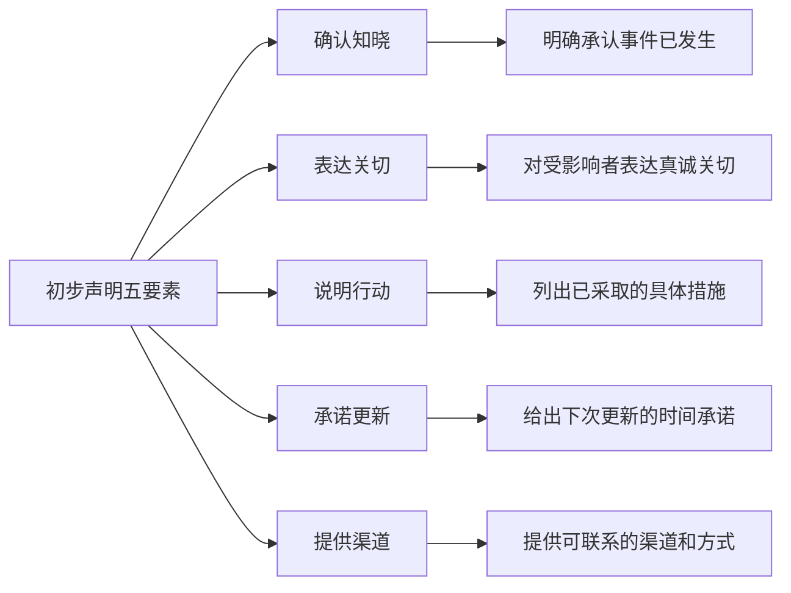
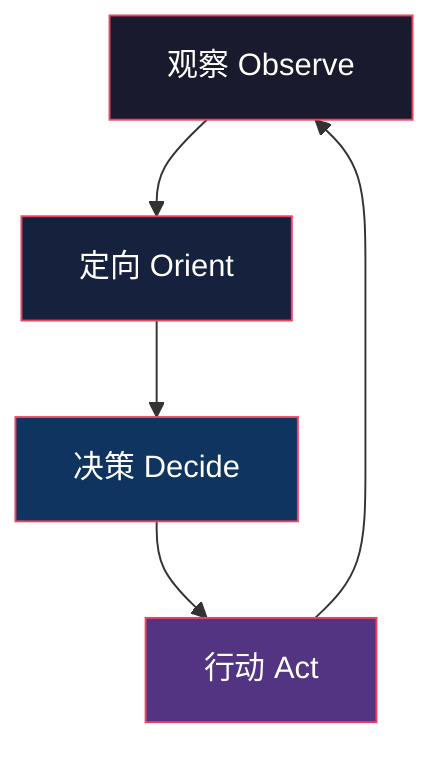
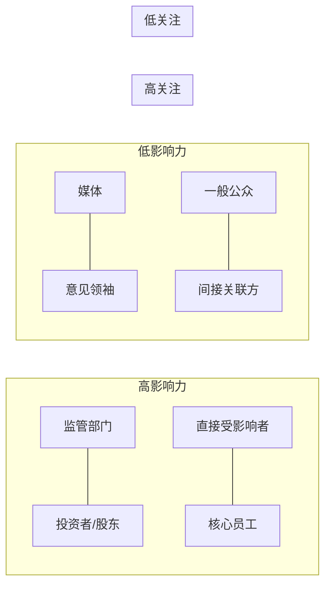

## 二、危机应对：在危机爆发时迅速行动

危机一旦爆发，每一分钟都在塑造公众对事件的认知。研究表明，危机发生后的**前4小时**决定了舆论走向的70%以上（Coombs, 2015）。这4小时内组织的响应速度、态度和信息质量，直接决定了危机是被控制在局部还是演变为系统性灾难。

本节从响应机制、决策框架、利益相关者管理三个维度，系统讲解危机爆发后的行动方法论，并提供可直接落地的工具模板。

### 2.1 快速响应机制

#### 2.1.1 "黄金四小时"法则

危机传播学中有一个核心概念叫"黄金四小时"（Golden Hour）。它借鉴了急诊医学中的"黄金一小时"概念——创伤发生后的一小时内接受救治，存活率最高。在危机传播中，组织有大约4小时的窗口期来完成三件事：

1. **表明态度**：让公众知道你已经知晓事件并高度重视
2. **控制叙事**：在谣言和猜测占领舆论场之前，确立事实基础
3. **建立信任**：通过透明、负责的初步行动，奠定后续沟通的信任基础

错过这个窗口期的后果是严重的。以2017年美联航拖拽乘客事件为例，美联航CEO在事件发生后12小时才发表声明，且第一份声明称"重新安置乘客"而非道歉，导致公司市值在两天内蒸发超过10亿美元。如果在4小时内发布一份态度诚恳的声明并宣布调查，舆论走势将完全不同。

#### 2.1.2 标准响应流程（四步法）

**第一步：信息收集与确认（0-30分钟）**

危机发生后的第一个30分钟是最混乱的阶段。此时信息碎片化、传言满天飞、情绪高度紧张。这一步的核心任务是**建立事实基线**——区分已确认的事实和未经验证的传言。

信息收集的"W5H1"框架：

| 维度 | 核心问题 | 信息来源 |
|------|----------|----------|
| What（什么） | 发生了什么事件？具体经过是什么？ | 现场人员报告、监控记录、系统日志 |
| Who（谁） | 涉及哪些人？谁是直接受害者？谁是目击者？ | HR系统、客户数据库、现场确认 |
| When（何时） | 事件何时开始？持续了多久？目前是否仍在继续？ | 时间戳记录、系统日志 |
| Where（哪里） | 事件发生在什么地点？影响范围有多大？ | 地理定位、影响区域评估 |
| Why（为什么） | 初步原因是什么？是偶发还是系统性问题？ | 技术排查、流程审计（此阶段为初步判断） |
| How（如何） | 事件是如何被发现的？当前态势如何？ | 发现渠道报告、实时监测数据 |

信息收集的关键原则：

- **多渠道交叉验证**：单一来源的信息不可信。至少通过两个独立渠道确认关键事实
- **区分事实与推测**：建立"已确认/待确认/未知"三级信息分类，绝不在公开声明中混入未确认信息
- **记录信息来源**：每条关键信息标注来源和确认时间，便于后续溯源和责任追溯
- **识别信息盲区**：明确列出"我们还不知道什么"，这些盲区正是下一步需要优先调查的方向

**信息收集模板：**

危机信息快照（首次记录时间：____年__月__日 __:__）
━━━━━━━━━━━━━━━━━━━━━━━━━━━━━━━
已确认事实：
1. [事实描述] ← 来源：[信息来源]，确认时间：[__:__]
2. ...

待确认信息：
1. [信息描述] ← 来源：[信息来源]，待确认方式：[如何验证]
2. ...

关键未知项：
1. [未知问题] ← 影响判断：[对决策的影响程度]
2. ...

初步影响评估：
- 人员影响：[受影响人数/范围]
- 财务影响：[初步估算]
- 声誉影响：[高/中/低]
- 法律风险：[有/无/待评估]

**第二步：团队集结与任务分配（30分钟-1小时）**

信息初步汇集后，必须在30分钟内完成危机管理团队的集结。这个团队不是临时拼凑的，而是应预先组建并在平时保持演练的常设团队。

**标准危机管理团队（Crisis Management Team, CMT）架构：**

| 角色 | 职责 | 人选标准 |
|------|------|----------|
| 危机总指挥（Commander） | 全局决策、资源调配、对外代表 | CEO或授权高管，具备危机处理经验 |
| 信息官（Information Officer） | 信息汇总、事实核查、情报分析 | 信息管理能力强，冷静客观 |
| 对外发言人（Spokesperson） | 媒体沟通、声明发布、发布会主持 | 表达能力强、形象正面、抗压能力好 |
| 法律顾问（Legal Counsel） | 法律风险评估、合规审查、证据保全 | 公司法/行业法规专家 |
| 运营协调人（Operations） | 执行补救措施、资源调度、现场管控 | 运营管理层，执行力强 |
| 员工沟通专员（Employee Liaison） | 内部通报、员工安抚、谣言管控 | HR或内部沟通负责人 |
| 舆情监测员（Media Monitor） | 实时监测舆论动态、汇报舆情走势 | 公关或数字营销团队成员 |
| 记录员（Recorder） | 全程记录决策过程、行动时间线 | 细致、有条理的行政人员 |

集结后的第一个会议（通常15-30分钟）需要完成以下议程：

1. **情况通报**（5分钟）：信息官简要汇报已知事实和关键未知项
2. **角色确认**（3分钟）：确认每位成员的角色和权限
3. **初步决策**（10分钟）：总指挥基于现有信息做出第一批关键决策
4. **任务分配**（5分钟）：明确每人的即时任务和截止时间
5. **下次会议时间**（2分钟）：确定下一次同步会议时间（通常为2小时后）

**第三步：初步声明发布（1-4小时内）**

初步声明是组织在危机中的第一次公开亮相，其质量直接影响后续所有沟通的可信度。一份合格的初步声明必须包含五个核心要素：

**初步声明模板：**

> 关于[事件简述]的情况通报
>
> [日期] [时间]
>
> [组织名称]已获悉[日期]发生在[地点]的[事件简述]。我们对此高度重视，并对受影响的[受影响群体]表示深切关切。
>
> 事件发生后，我们第一时间采取了以下措施：
> 1. [具体措施一]
> 2. [具体措施二]
> 3. [具体措施三]
>
> 我们已成立专项工作组，正在全力[核心应对行动]。我们承诺将在[具体时间，如"今晚8点前"]发布最新进展通报。
>
> 如需帮助或了解更多信息，请通过以下方式联系我们：
> - 24小时热线：[电话号码]
> - 专用邮箱：[邮箱地址]
> - 官方网站：[网址]
>
> [组织名称]
> [日期]

**初步声明的常见错误：**

| 错误类型 | 错误示例 | 正确做法 |
|----------|----------|----------|
| 否认/淡化 | "这只是个别情况" | 如实描述事件规模和影响 |
| 推诿责任 | "这是供应商的问题" | 先承担责任，再厘清原因 |
| 空洞承诺 | "我们会加强管理" | 列出具体可验证的措施 |
| 缺乏共情 | 纯技术性描述，无人文关怀 | 先表达关切，再说明事实 |
| 信息过载 | 一次性发布大量未经核实的信息 | 只发布已确认的事实 |
| 时间模糊 | "尽快发布更新" | 给出具体时间点 |

**第四步：持续信息更新（危机期间）**

初步声明发布后，危机应对进入持续运营阶段。这一阶段的核心是**保持信息透明和节奏稳定**。

持续更新的节奏建议：

- **高关注度危机**（全国性事件、重大伤亡）：每2-4小时更新一次
- **中等关注度危机**（区域性事件、行业事件）：每6-8小时更新一次
- **低关注度危机**（局部事件、可控范围）：每日更新一次，重大进展即时通报

每次更新应遵循"新进展+下一步"结构：

1. 自上次通报以来的新进展
2. 已采取的新措施及其效果
3. 下一步计划和预计时间节点
4. 对公众关切的回应

#### 2.1.3 社交媒体时代的危机响应

传统危机响应假设组织有几小时甚至几天来准备回应。但在社交媒体时代，这个窗口被压缩到了**分钟级**。一条推文、一个短视频可以在30分钟内引发全国性讨论。

**社交媒体危机的特殊挑战：**

- **速度**：信息传播速度远超传统媒体，组织的反应时间被极度压缩
- **情绪放大**：社交媒体算法倾向于推送情绪化内容，愤怒和恐惧传播最快
- **去中心化**：任何人都可以发布信息，组织无法控制信息源
- **永久性**：截图和转发使信息永久存在，即使删除原文也无法消除影响
- **跨平台传播**：一个平台上的事件会迅速蔓延到所有平台

**社交媒体危机响应SOP：**

T+0分钟  发现社交媒体负面信息爆发
         → 立即通知CMT成员
         → 开始截图保存证据
         → 启动舆情监测（关键词、话题标签、@提及）

T+15分钟 初步评估
         → 信息真实性判断
         → 传播范围评估（转发量、KOL参与度）
         → 情感倾向分析（愤怒/质疑/嘲讽/恐慌）
         → 决定回应策略（正面回应/澄清/道歉/暂不回应）

T+30分钟 内部协调
         → 拟定回应文案（140字以内的核心信息）
         → 法律审核
         → 确定回应渠道和账号

T+60分钟 对外回应
         → 在事件起源平台首先回应
         → 同步发布到其他主要平台
         → 更新官方网站
         → 通知客服团队标准话术

T+2小时  跟踪评估
         → 监测回应效果
         → 根据反馈调整策略
         → 准备后续回应内容

**社交媒体回应的三条铁律：**

1. **不要删帖**：删除负面信息会被截图，引发第二波舆论风暴。只有在信息明显失实且已发布澄清声明后，才可考虑申请平台删除
2. **不要争论**：社交媒体不是辩论场。用事实和行动说话，不要在评论区与网民争辩
3. **不要沉默**：在社交媒体上，沉默等于默认。即使信息不完整，也要表明"我们已关注，正在核实"

### 2.2 危机决策框架

#### 2.2.1 危机决策的特殊性

日常决策和危机决策有本质区别。理解这些区别是提高危机决策质量的前提。

| 维度 | 日常决策 | 危机决策 |
|------|----------|----------|
| 时间压力 | 充足，可以反复论证 | 极度紧迫，窗口期以小时计 |
| 信息完整性 | 相对完整 | 高度不完整，充满矛盾信息 |
| 可逆性 | 通常可修正 | 决策后果往往不可逆 |
| 情绪状态 | 理性冷静 | 紧张、焦虑、恐惧 |
| 关注度 | 内部关注 | 全社会关注 |
| 后果影响 | 局部影响 | 可能影响组织存亡 |
| 决策依据 | 数据+经验 | 不完整数据+直觉+价值观 |

#### 2.2.2 OODA循环模型

OODA（观察-定向-决策-行动）循环由美国空军战略家约翰·博伊德（John Boyd）提出，最初用于空战格斗决策，后被广泛应用于危机管理和商业决策。

**观察（Observe）**：全面收集当前态势信息，不带预设地接收信息流。危机中的观察不是被动等待报告，而是主动设置信息采集渠道——舆情监测系统、内部报告通道、媒体监控、社交平台追踪。

**定向（Orient）**：这是OODA循环中最关键也最容易被忽视的环节。定向意味着用你的知识体系、过往经验和文化基因来解读观察到的信息。博伊德称定向为"精神螺旋桨"，所有其他环节都依赖于它。在危机中，定向的核心任务是：
- 识别模式：当前事件与哪些已知模式匹配？
- 评估假设：我们对事件原因的假设是否成立？
- 调整认知：新信息是否推翻了之前的判断？

**决策（Decide）**：基于定向阶段的分析，在有限选项中选择行动方案。危机中的决策不是追求最优解，而是在信息不完整的条件下选择**最不坏的方案**。

**行动（Act）**：快速执行决策，然后立即回到观察阶段，评估行动效果。在危机中，一个OODA循环可能只有30分钟到2小时，远快于日常决策的天/周级别。

**加速OODA循环的实操技巧：**

1. **预设决策模板**：提前为常见危机场景准备决策树，危机来临时只需填入变量
2. **扁平化信息链**：减少信息传递层级，让决策者直接获取一线信息
3. **授权前线**：给予一线人员在特定范围内的自主决策权，避免层层请示
4. **限定决策时间**：为每个决策设置时间上限。超过时限必须做出选择，宁可事后修正也不能无限拖延
5. **并行处理**：信息收集、方案评估、资源准备同步进行，而非串行等待

#### 2.2.3 决策检查清单

在做出任何关键决策前，用以下检查清单逐一审视。这不是走形式，而是防止危机压力下的认知盲区。

**事实层检查：**
- [ ] 我们掌握了哪些已确认的事实？列出清单
- [ ] 还有哪些关键信息缺失？这些缺失是否影响决策？
- [ ] 信息来源是否可靠？是否经过交叉验证？
- [ ] 是否存在相互矛盾的信息？如何处理这些矛盾？

**时间层检查：**
- [ ] 决策的时间窗口有多长？具体的截止时间是什么？
- [ ] 延迟决策的风险是什么？后果有多大？
- [ ] 是否可以分阶段决策，先做确定性高的部分？

**选项层检查：**
- [ ] 有哪些可选方案？至少列出3个
- [ ] 每个方案的最佳情况和最坏情况分别是什么？
- [ ] 哪个方案的"最坏情况"是我们最能承受的？
- [ ] 是否存在一个明显优于其他方案的选项？如果没有，选最稳妥的

**利益相关者层检查：**
- [ ] 这个决策对受害者/受影响者的影响是什么？
- [ ] 员工会如何理解和执行这个决策？
- [ ] 投资者/股东会如何反应？
- [ ] 监管部门会如何看待？
- [ ] 公众和媒体会如何解读？

**合规层检查：**
- [ ] 法律顾问的意见是什么？
- [ ] 是否涉及信息披露义务（上市公司）？
- [ ] 是否需要向监管部门报告？
- [ ] 这个决策是否可能引发法律诉讼？

**价值观层检查：**
- [ ] 这个决策是否符合组织的核心价值观？
- [ ] 如果这个决策被完全公开，我们是否能坦然面对？
- [ ] 十年后回顾这个决策，我们是否会认同？

#### 2.2.4 危机中的认知偏差及应对

危机的高压环境会放大人类的认知偏差，导致系统性决策错误。识别这些偏差是避免它们的第一步。

**锚定效应**：过度依赖第一个获得的信息。危机初期获得的不完整信息会成为"锚点"，后续即使获得纠正信息，决策者仍倾向于围绕初始信息做调整。

应对方法：主动寻找反面证据。每当形成一个判断时，立刻问"如果这个判断是错的，证据会是什么？"

**确认偏差**：倾向于寻找支持已有观点的信息，忽略矛盾信息。在危机中，这意味着决策团队可能集体忽视不利于预设判断的信号。

应对方法：指定一名团队成员扮演"魔鬼代言人"，专门提出反对意见和替代解释。

**群体极化**：团队讨论后，集体观点往往比个人初始观点更加极端。在危机中，恐惧情绪会导致团队集体做出过度保守或过度激进的决策。

应对方法：在团队讨论前，先让每位成员独立写下自己的判断和理由，再进行集体讨论。

**可得性偏差**：根据信息的可获取性而非代表性来判断事件的概率。最近发生的、印象深刻的事件会被过度高估其发生概率。

应对方法：用数据说话，不要凭印象做概率判断。参考历史案例的统计分布而非个案。

**过度自信**：在信息不完整的条件下，决策者往往对自己的判断过度自信。这是危机决策中最危险的偏差。

应对方法：为每个关键判断标注信心水平（高/中/低），对低信心判断必须准备备选方案。

### 2.3 利益相关者管理

#### 2.3.1 利益相关者映射

危机中的利益相关者管理不是事后才考虑的事情，而是从危机响应第一分钟就必须启动的核心工作。不同利益相关者对信息的需求、对组织的期望、以及对组织的影响力完全不同。

**利益相关者优先级矩阵：**

实际操作中，按以下优先顺序进行沟通：

1. **第一优先级——直接受影响者**（受害者、消费者、员工）：他们的权益是组织的责任底线，任何公关考量都不能凌驾于此
2. **第二优先级——监管与决策层**（政府监管部门、投资者、董事会）：他们的态度决定了组织是否面临行政处罚或资本撤离
3. **第三优先级——信息传播层**（媒体、意见领袖、行业KOL）：他们塑造公众叙事，但应基于事实而非公关操控
4. **第四优先级——一般公众与间接相关者**：他们是舆论海洋，通过前三个层级的正确行动来间接影响

#### 2.3.2 差异化沟通策略

不同利益相关者需要不同的信息内容、沟通渠道和沟通频率。一刀切的群发声明是危机沟通的大忌。

| 利益相关者 | 沟通重点 | 沟通渠道 | 频率 | 关键原则 |
|------------|----------|----------|------|----------|
| 受影响者 | 表达关怀、具体帮助措施、赔偿方案、后续跟进 | 一对一沟通、专用热线、上门拜访 | 高频（每12小时至少一次） | 先人后事，先关怀后解释 |
| 员工 | 事实通报、统一口径、行为指引、心理支持 | 全员邮件、部门会议、内部通讯群、FAQ文档 | 高频（每4-8小时） | 员工是第一传播者，必须先于外部知情 |
| 投资者/股东 | 财务影响评估、应对措施、恢复计划、风险预警 | 电话会议、正式通报、投资者关系专页 | 中频（重大进展即时通报） | 数据说话，不回避风险 |
| 监管部门 | 完整事件详情、已采取措施、配合调查计划、合规承诺 | 正式报告、当面汇报、指定联络人 | 按需（主动报告，不等询问） | 主动透明，配合到底 |
| 媒体 | 事实信息、组织回应、进展更新、后续改进 | 新闻稿、新闻发布会、媒体专访、背景吹风会 | 中频（每日至少一次更新） | 统一口径，发言人制度 |
| 合作伙伴 | 对合作业务的影响、供应链调整、联合应对方案 | 电话/邮件一对一、合作伙伴简报 | 中频 | 评估影响，共商对策 |
| 一般公众 | 关注回应、安全提示、改进承诺、信息获取渠道 | 社交媒体、官网声明、FAQ页面 | 适度（避免过度刷屏） | 简洁清晰，提供行动指引 |

#### 2.3.3 受影响者沟通的特殊处理

受影响者（受害者、消费者、员工）是危机沟通中最敏感、最需要谨慎处理的群体。他们不是公关对象，而是需要真诚对待的人。

**受影响者沟通的五条原则：**

1. **第一时间接触**：不要等媒体或社交媒体替你传递坏消息。在可能的情况下，直接受影响者应该在公开报道之前从组织方获得信息
2. **真人而非模板**：受难者家属需要的是一个具体的人来对话，不是一封模板邮件。安排专人一对一跟进
3. **倾听优先**：在解释和道歉之前，先听他们说。很多人需要的是被听到，而非被解释
4. **承诺要具体**：不要说"我们会妥善处理"，要说"我们将在48小时内安排专人上门，评估您的损失并讨论赔偿方案"
5. **持续跟进**：不要在危机热度消退后就消失。对受影响者的跟进应该持续到问题真正解决

**受影响者沟通话术框架：**

第一步：确认感受
"我理解这对您来说是非常困难的经历。您的[感受/担忧]是完全合理的。"

第二步：表明责任
"这是我们的责任，我们不会推卸。"

第三步：说明行动
"我们已经采取了以下措施来帮助您：[具体措施1、2、3]"

第四步：给出承诺
"我们将在[具体时间]之前[具体行动]。届时我会亲自[电话/上门]与您确认。"

第五步：保持联络
"我的直线电话是[号码]，您可以随时联系我。如果您有任何需要，请不要犹豫。"

#### 2.3.4 内部沟通的关键作用

在危机中，员工是组织最重要的"大使"。如果员工从外部媒体而非内部渠道获知危机信息，他们不仅会感到被背叛，还可能在社交媒体上发表不一致的言论，进一步加剧危机。

**内部沟通的"先于外部"原则：**员工应该在组织对外发布声明之前获得内部通报。理想情况下，内部通报比外部声明提前至少30分钟。

**员工沟通包应包含：**

1. **事实通报**：发生了什么，目前情况如何（只包含已确认事实）
2. **统一口径**：如果被外部问到，应该怎么说。提供标准话术
3. **行为指引**：什么可以做、什么不可以做（如是否可以接受媒体采访、是否可以在社交媒体发表评论）
4. **心理支持**：提供心理咨询渠道，特别是在涉及人身安全的危机中
5. **FAQ文档**：预判员工可能被问到的问题，提供标准答案

**员工社交媒体行为指引模板：**

在危机期间，请遵守以下社交媒体指引：

可以做的：
✓ 转发组织官方声明
✓ 表达对受影响者的关心
✓ 引导他人关注官方信息渠道

不可以做的：
✗ 发表个人观点或推测
✗ 分享内部会议内容或未公开信息
✗ 与质疑者争论
✗ 发布可能被误解为组织立场的内容

如有疑问，请联系[内部沟通负责人]。

### 2.4 危机应对中的常见误区

即使是有经验的组织，在危机应对中也常犯以下错误。识别这些误区是避免重蹈覆辙的前提。

#### 误区一："鸵鸟心态"——沉默等待

**表现**：认为不回应事情就会过去，或者等待更多信息后再做声明。

**为什么是错的**：在信息真空期，谣言和猜测会迅速填补空白。沉默在公众眼中等同于心虚、不重视、甚至默认指控。心理学中的"沉默螺旋"效应会使支持组织的声音逐渐消失，批评声音越来越大。

**正确做法**：即使信息不完整，也要在4小时内发布初步声明。声明中可以坦诚"我们正在核实细节"，但必须表明态度和行动。

#### 误区二："甩锅"——急于推卸责任

**表现**：第一时间将责任归咎于供应商、员工个人、外部因素等。

**为什么是错的**：公众对推卸责任的行为极度反感。在信息不完整时急于"甩锅"，一旦后续调查证明组织也有责任，将面临更严重的信任危机。此外，"甩锅"给员工个人会被视为组织缺乏担当。

**正确做法**：在危机初期，组织应先承担起管理责任（"这是在我们管理下发生的事件，我们负有不可推卸的责任"），待调查完成后再厘清具体责任归属。

#### 误区三："过度承诺"——给出无法兑现的保证

**表现**：为平息舆论，承诺"绝不再发生"、"彻底整改"、"永久解决"等。

**为什么是错的**：过度承诺会设定无法达到的预期。一旦类似事件再次发生（很多系统性问题不可能一次根除），公众会因被"欺骗"而加倍愤怒。

**正确做法**：承诺要具体、可衡量、有时间表。如"我们将在30天内完成全面安全审计"比"我们会全面加强安全管理"可信得多。

#### 误区四："信息过载"——一次性发布大量未经核实的信息

**表现**：为展示透明度，在第一次声明中包含大量未经核实的细节。

**为什么是错的**：一旦这些细节被后续证实有误，组织的可信度将严重受损。公众不会记住你发布了多少信息，但会记住哪些信息是错的。

**正确做法**：分阶段发布信息。每次只发布已确认的信息，并明确标注哪些仍在核实中。

#### 误区五："只说不做"——声明漂亮但缺乏实际行动

**表现**：发布了态度诚恳的声明，但没有具体的补救措施或改进计划。

**为什么是错的**：声明只是危机应对的第一步，公众真正关注的是行动。一份没有行动承诺的声明会被视为"公关话术"，反而加剧不信任。

**正确做法**：每份声明都应包含具体的已采取措施和下一步行动计划。用动词而非形容词来描述行动。

### 2.5 危机复盘与系统改进

#### 2.5.1 危机复盘的方法

危机缓解后的72小时内，是进行复盘的最佳时机。时间太短则情绪未平、信息不全；时间太长则记忆模糊、动力消退。

**复盘会议结构（建议时长2-3小时）：**

1. **时间线重建**（30分钟）：按时间顺序重建事件全貌，标注每个关键节点和决策点
2. **做得好的环节**（20分钟）：识别有效措施，固化为标准流程
3. **做得不好的环节**（30分钟）：识别失误和延误，分析根因（而非追究个人责任）
4. **意外发现**（20分钟）：记录危机中暴露的、之前未意识到的风险和问题
5. **改进计划**（40分钟）：制定具体改进项，分配责任人和截止时间

**复盘报告模板：**

危机复盘报告
━━━━━━━━━━━━━━━━━━━━━━━━━━━━━━━
事件名称：[简述]
事件时间：[起止时间]
复盘时间：[日期]
参与人员：[名单]

一、事件概述
[200字以内的事件摘要]

二、时间线
[时间] [事件/决策] [效果/结果]
...

三、关键决策评估
决策1：[描述] → 结果：[效果] → 评估：[有效/部分有效/无效]
决策2：[描述] → 结果：[效果] → 评估：[有效/部分有效/无效]
...

四、经验教训
成功因素：
1. [具体做法及效果]
2. ...

失误与改进：
1. [失误描述] → 根因分析 → 改进措施 → 责任人 → 截止日期
2. ...

五、系统性改进计划
1. [改进项] → [具体措施] → [责任人] → [完成日期]
2. ...

#### 2.5.2 从单次危机到系统免疫

真正成熟的危机管理不是每次都救火成功，而是通过每次危机的复盘来**提高组织的系统免疫力**。

每次危机复盘后，应将改进措施落实到三个层面：

- **制度层面**：修订危机管理预案、更新响应流程、完善决策授权体系
- **能力层面**：开展针对性培训、更新危机演练场景、补充应急资源
- **文化层面**：将危机意识融入日常管理、鼓励问题上报而非隐瞒、建立"小错即纠"的组织文化

组织应每年至少进行一次全流程危机模拟演练，每半年更新一次危机管理预案，每季度回顾一次利益相关者沟通策略。危机管理不是一项任务，而是一种持续的组织能力。
