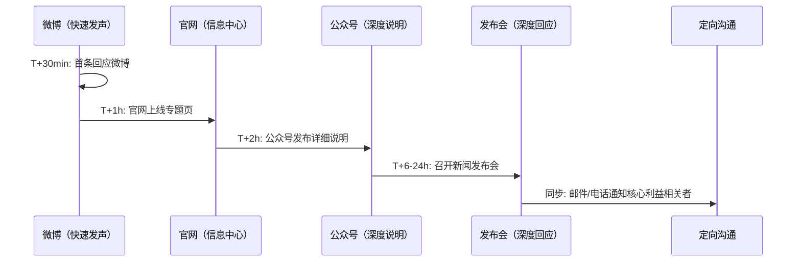
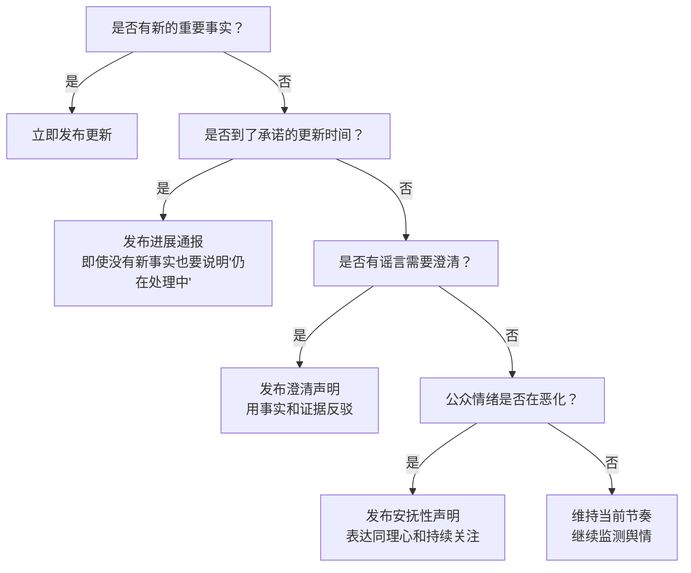
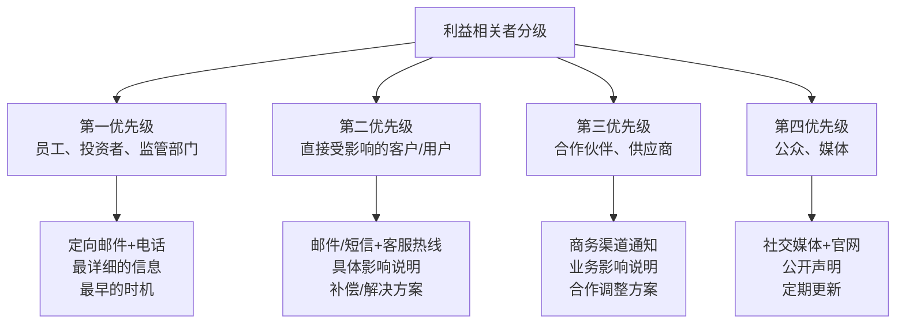
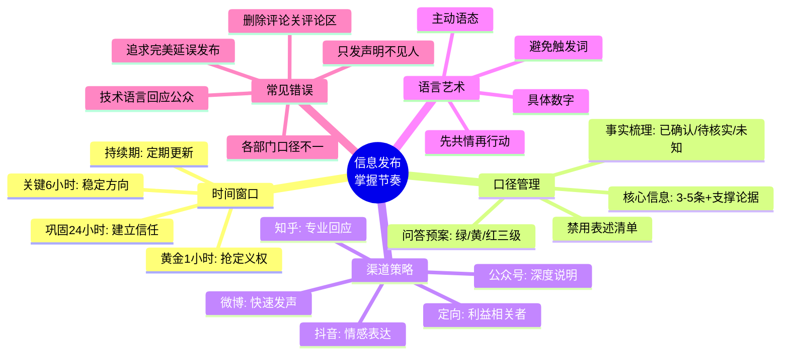

## 三、信息发布：掌握信息传播的节奏

危机爆发后，组织面临的不仅是事实层面的挑战，更是一场**信息控制权的争夺战**。谁先定义事件的叙事框架，谁就掌握了舆论的主动权。信息发布不是"发个声明"那么简单——它涉及口径制定、渠道策略、节奏把控、语言风格、内部协同等多个维度的系统工程。

### 3.1 为什么"节奏"决定成败

#### 3.1.1 信息真空理论

危机传播领域有一个核心概念：**信息真空（Information Vacuum）**。当重大事件发生后，公众对信息的需求会在极短时间内飙升。如果组织不填补这个真空，它就会被谣言、猜测、竞争对手的叙事、媒体的推测性报道所填充。

信息真空的危险性在于：

- **谣言的传播速度是辟谣的6倍**。麻省理工学院2018年发表在《Science》上的研究显示，虚假新闻在社交媒体上的传播速度比真实新闻快6倍，覆盖范围更广。一旦谣言形成主流叙事，组织再辟谣就变成了"被动解释"。
- **先入为主效应（Primacy Effect）**。心理学研究表明，人们倾向于相信最先接收到的信息版本。即使后续出现更准确的信息，最初的印象仍然会影响判断。这就是为什么"第一时间发声"如此重要。
- **沉默即默认**。在公众情绪高涨的危机情境下，组织的沉默不会被解读为"谨慎"，而会被解读为"心虚""不重视""在掩盖"。

#### 3.1.2 议程设置与框架效应

传播学中的**议程设置理论（Agenda-Setting Theory）**指出，媒体不能决定人们"怎么想"，但能决定人们"想什么"。在危机中，谁设置了讨论的议题框架，谁就控制了叙事方向。

**框架效应（Framing Effect）**则更进一步——同样的事实，用不同的框架呈现，会产生截然不同的公众反应：

| 框架类型 | 表述方式 | 公众反应倾向 |
|----------|----------|------------|
| 损失框架 | "如果不采取行动，将有X万人受影响" | 恐慌、愤怒、要求立即行动 |
| 收益框架 | "我们已采取措施，保护了X万人的安全" | 信任、认可、给予时间 |
| 责任框架 | "这是由于XX管理疏忽导致的" | 愤怒、追责、要求惩罚 |
| 行动框架 | "我们正在全力调查并采取以下措施" | 关注进展、给予观察期 |

组织在信息发布的第一时间就应该建立**行动框架**——将公众注意力从"谁的错"引向"正在做什么"。这不等于回避责任，而是在确认责任之前，先确保公众看到组织的积极行动。

#### 3.1.3 危机传播的时间窗口模型

基于大量危机案例研究，信息传播存在三个关键时间窗口：


- **黄金1小时**：危机曝光后的第一个小时。这个窗口的核心任务是"抢定义权"——用最简短的声明告诉公众"发生了什么"和"我们正在做什么"。即使信息不完整，也必须发声。声明可以是"我们已知晓XX事件，正在紧急核实，将在X小时内发布详细信息"。
- **关键6小时**：危机爆发后的2-6小时。这个窗口的核心任务是"稳定方向"——发布包含已确认事实和初步应对措施的声明。此时公众和媒体的情绪最为激烈，组织的回应将决定后续舆论走向。
- **巩固24小时**：危机爆发后的24小时。这个窗口的核心任务是"建立信任"——发布完整的事件说明、原因分析（如有）、影响评估和详细行动计划。
- **持续期**：此后每24-48小时发布进展更新，直到危机基本解决。

### 3.2 信息口径制定：统一组织的"发声器官"

信息口径（Message Map / Messaging）是危机沟通中最核心的工具之一。它确保组织对外发布的信息一致、准确、有力——无论由谁来传达，在哪个渠道发布，核心信息都是一致的。

#### 3.2.1 口径制定的五步流程

**第一步：事实梳理（Fact Inventory）**

将所有已知信息分为三类：

| 类别 | 定义 | 处理方式 |
|------|------|----------|
| 已确认事实 | 经过多方验证的确定性信息 | 可以对外发布 |
| 待核实信息 | 来源可靠但尚未交叉验证 | 不对外发布，标注"核实中" |
| 未知信息 | 尚未掌握的关键信息 | 准备"正在调查中"的标准表述 |

事实梳理的关键原则：**只说确认的，不说推测的**。在危机初期，"我们不知道"比"我们猜测"安全得多。

**第二步：关键信息提炼（Message Development）**

提炼3-5条核心信息（Key Messages），每条信息遵循"主信息+支撑论据"的结构：

核心信息模板：
┌─────────────────────────────────────────────────┐
│ 主信息（一句话概括，不超过25个字）               │
│   ├── 支撑论据1（具体事实/数据）                │
│   ├── 支撑论据2（已采取的行动）                 │
│   └── 支撑论据3（后续计划/承诺）                │
└─────────────────────────────────────────────────┘

示例（某食品企业产品质量事件）：

- **核心信息1**：我们高度重视此次产品质量问题，已第一时间启动应急响应。
  - 论据：事件发生后2小时内成立专项工作组
  - 论据：CEO亲自挂帅，质量总监全程跟进
  - 论据：已通知全国XX家门店下架相关产品
- **核心信息2**：受影响的消费者将获得全额退款及合理补偿。
  - 论据：已开通24小时专线XXX-XXXX-XXXX
  - 论据：补偿方案已制定并在官网公示
- **核心信息3**：我们正在全面排查原因，将在72小时内公布调查结果。
  - 论据：已邀请第三方检测机构介入
  - 论据：生产线已暂停，等待排查完毕

**第三步：信息验证（Verification）**

每一条对外发布的信息都必须经过"三重验证"：

1. **事实验证**：数据来源是否可靠？是否有书面记录或官方确认？
2. **法律审查**：表述是否会引起法律风险？是否存在承认过失的措辞？
3. **情感测试**：如果这条信息被截取、断章取义，最坏的解读是什么？

**第四步：问答预案（Q&A Preparation）**

预测媒体和公众最可能提出的20-30个问题，按敏感程度分为三级：

| 敏感等级 | 示例问题 | 回答策略 |
|----------|----------|----------|
| 绿色（常规） | "事件的基本情况是什么？" | 直接按口径回答 |
| 黄色（敏感） | "是否有人因此受伤？" | 按口径回答，表达关切 |
| 红色（高危） | "这是不是管理层的失误？" | 桥接技巧，转向核心信息 |

**第五步：口径统一与分发**

口径文件必须分发到所有可能面对媒体或公众的人员，包括：
- 对外发言人和高管
- 客服团队
- 前台/门店工作人员
- 社交媒体运营人员
- 合作伙伴对接人

分发时附带明确指令：**"只使用口径文件中的表述，不接受口径之外的采访，不知道的问题回答'目前还在调查中'"**。

#### 3.2.2 "3×3"信息结构法

在对外发布信息时，采用"3×3"结构法组织信息，确保信息传递的清晰和高效：

- **三个层次**：主信息 → 支撑信息 → 具体细节
- **三个要点**：每层不超过三个要点
- **先说结论**：每个层次先说结论/要点，再展开说明

这个结构的底层逻辑是：公众的注意力是有限的，尤其在危机情境下，焦虑和愤怒会进一步压缩认知带宽。"3×3"结构确保即使公众只听了第一层，也能获得最关键的信息。

#### 3.2.3 口径文件的标准模板

一份完整的危机信息口径文件应包含以下部分：

```markdown
# 危机信息口径文件 V1.0
## 基本信息
- 事件名称：
- 涉及主体：
- 口径版本：V1.0
- 制定时间：YYYY-MM-DD HH:MM
- 审批人：
- 适用范围：全体对外沟通人员

## 一、事件概述
（用3-5句话简洁描述危机事件的基本情况，只包含已确认事实）

## 二、核心信息（按重要性排序）
### 核心信息1：[主题]
- 主表述：
- 支撑论据：
- 适用场景：

### 核心信息2：[主题]
（同上结构）

### 核心信息3：[主题]
（同上结构）

## 三、问答预案
### Q1：[最可能被问到的问题]
- 建议回答：
- 回答要点：

## 四、禁用表述
- 不得使用"意外""巧合"等淡化事件严重性的词语
- 不得在调查结果出来前使用"责任""过失"等定性词语
- 不得对其他涉事方进行指责或评论
- 不得透露受害者/当事人个人信息

## 五、更新记录
| 版本 | 日期 | 更新内容 | 审批人 |
|------|------|----------|--------|
| V1.0 | | 初始版本 | |
```

### 3.3 发布渠道选择：在正确的地方说正确的话

#### 3.3.1 渠道特性深度分析

不同的发布渠道有不同的传播机制、受众特征和风险模式。选择渠道时需要考虑四个维度：**速度、可控性、覆盖面、互动性**。

| 渠道 | 速度 | 可控性 | 覆盖面 | 互动性 | 最佳用途 |
|------|------|--------|--------|--------|----------|
| 微博 | ★★★★★ | ★★☆ | ★★★★ | ★★★★ | 危机初期快速发声，热搜舆情管理 |
| 微信公众号 | ★★★ | ★★★★★ | ★★★ | ★★ | 详细事件说明，长文深度解释 |
| 抖音/快手短视频 | ★★★★ | ★★★ | ★★★★★ | ★★★ | 高管出镜表态，情感化沟通 |
| 官方网站 | ★★★ | ★★★★★ | ★★ | ★ | 信息汇总中心，口径文档发布 |
| 新闻发布会 | ★★ | ★★★★ | ★★★★ | ★★★★ | 重大危机的集中深度回应 |
| 官方声明/新闻稿 | ★★ | ★★★★★ | ★★★ | ☆ | 正式回应，法律性表述 |
| 客服热线/私信 | ★★★★ | ★★★ | ★ | ★★★★★ | 受影响个体的定向沟通 |
| 知乎 | ★★★ | ★★★★ | ★★★ | ★★★★ | 技术性/专业性问题的深度回应 |
| 内部通知/OA | ★★★★ | ★★★★★ | ★★ | ★ | 员工沟通，统一内部口径 |

#### 3.3.2 中国社交媒体平台的危机传播特征

**微博**是中国危机传播的"引爆点"。微博热搜机制使得一个话题可以在30分钟内从零热度飙升到全网关注。危机传播在微博上呈现"波浪式"扩散：先由少数大V或媒体账号引爆，再通过评论区和转发形成二次传播，最后通过热搜机制触达更广泛人群。

微博危机沟通策略：
- **抢占首条微博**：危机曝光后，组织官微应在30-60分钟内发布首条回应微博，即使只有"已关注，正在核实"这几个字
- **置顶详细声明**：将详细声明置顶在官微首页，作为所有后续传播的信息锚点
- **评论区管理**：开启评论精选（谨慎使用，可能引发"控评"批评），或安排专人回复关键质疑
- **话题标签管理**：创建组织自己的声明话题标签，与公众讨论的话题标签并行

**微信生态**的危机传播呈现"涟漪式"扩散——从核心圈层向外层逐步渗透。微信群聊中的信息传播最难监控，因为是私密空间。公众号适合发布详细的官方说明，但传播速度较慢，依赖朋友圈转发。

微信危机沟通策略：
- **公众号首发长文**：在微博快速回应之后，通过公众号发布详细的事件说明
- **视频号高管出镜**：适合需要情感化表达的场景，高管亲自出镜比文字更有温度
- **社群管理**：提前建立核心用户社群，危机时通过社群管理员传递官方信息
- **朋友圈定向投放**：利用微信广告的朋友圈定向能力，将声明精准投放到目标人群

**抖音/快手**的短视频平台在危机传播中的角色越来越重要。危机相关的短视频（包括用户拍摄的现场视频、媒体解读、KOL评论）可以在数小时内获得数百万播放量。

短视频平台危机沟通策略：
- **高管短视频声明**：30-60秒的真诚表态，比任何文字声明都更有说服力
- **回应热门视频**：如果某个关于危机的视频获得大量关注，组织应在评论区或通过自己的视频回应
- **避免过度制作**：危机回应视频应朴素真诚，过度制作会被视为"公关包装"

**知乎**是深度讨论的阵地。危机事件在知乎上通常会形成多个问答帖，回答可能长达数千字，分析深入。知乎用户的典型特征是"求真"——他们不接受表面话，要求看到证据和逻辑。

知乎危机沟通策略：
- **官方账号回答**：在相关热门问题下由官方账号发布详细回答
- **邀请行业专家**：邀请第三方专家从专业角度分析事件
- **避免删帖**：知乎社区对删帖行为极度敏感，删帖只会引发更大的反弹

#### 3.3.3 多渠道联动策略

在实际危机沟通中，单一渠道往往不够，需要多种渠道配合使用，形成"组合拳"：



**渠道组合的核心原则**：

1. **速度优先在微博/短视频**：第一时间用最短的文字/视频表明态度
2. **深度在官网/公众号**：详细的事实、数据、行动计划放在官网和公众号
3. **情感在视频号/抖音**：需要高管出镜表态的场景用视频平台
4. **专业在知乎/行业媒体**：技术性问题用深度分析文章回应
5. **私密在邮件/电话**：受影响个体的补偿、致歉用定向渠道

### 3.4 发布节奏把控：什么时间说什么话

#### 3.4.1 分阶段信息发布策略

危机信息的发布不是一次性的，而是需要根据危机的发展持续更新。每个阶段有不同的沟通目标、信息重点和表达方式。

**第一阶段：快速响应期（0-1小时）**

- **目标**：抢占叙事框架，表明组织已知晓并正在应对
- **信息重点**：三要素——"我们知道""我们重视""我们正在行动"
- **表达方式**：简短、直接、坚定
- **发布渠道**：微博/社交媒体首发

快速响应声明模板：

【关于XX事件的声明】
我们已关注到[简述事件]。公司高度重视，已第一时间成立应急工作组，
正在全力核实情况。我们将在[具体时间，如"今晚8点前"]发布进一步信息。
如有疑问，请拨打客服热线：XXX-XXXX-XXXX。
[组织名称]
[日期 时间]

**第二阶段：事实通报期（1-6小时）**

- **目标**：提供已确认事实，稳定舆论方向
- **信息重点**：已确认的事实、初步应对措施、后续时间表
- **表达方式**：客观、具体、有数据支撑
- **发布渠道**：官网专题页 + 微博/公众号同步

**第三阶段：深度回应期（6-24小时）**

- **目标**：全面说明事件情况，展示组织的责任感和行动力
- **信息重点**：详细事件经过、原因分析（如已有）、影响评估、补偿方案、改进措施
- **表达方式**：详细、结构化、有同理心
- **发布渠道**：官网详细声明 + 新闻发布会（如需要）+ 定向沟通

**第四阶段：持续更新期（24小时-危机结束）**

- **目标**：维持信任，展示持续改进
- **信息重点**：进展更新、措施落实情况、第三方验证结果
- **表达方式**：定期、透明、可验证
- **发布渠道**：官网 + 社交媒体定期更新

**第五阶段：总结收尾期（危机结束后）**

- **目标**：总结经验，重建形象
- **信息重点**：事件总结、已完成的改进、长期承诺
- **表达方式**：诚恳、前瞻
- **发布渠道**：官网 + 全渠道同步

#### 3.4.2 不同类型危机的节奏差异

不同类型的危机需要不同的信息发布时间表：

| 危机类型 | 首次回应时间 | 更新频率 | 持续周期 | 节奏特点 |
|----------|------------|----------|----------|----------|
| 产品安全事故 | 30分钟内 | 每2-4小时 | 3-7天 | 快速密集，以行动为导向 |
| 数据泄露 | 1-2小时内 | 每12-24小时 | 1-4周 | 谨慎精确，法律审核严格 |
| 高管丑闻 | 2-6小时内 | 每24-48小时 | 1-2周 | 审慎克制，避免过度回应 |
| 网络舆情 | 1小时内 | 根据舆情变化 | 3-7天 | 灵活机动，快速迭代 |
| 自然灾害影响 | 1小时内 | 每4-6小时 | 1-4周 | 以救援为中心，突出人文关怀 |
| 供应链危机 | 4-12小时内 | 每24小时 | 2-8周 | 专业冷静，提供替代方案 |

#### 3.4.3 判断发布时机的决策树

面对"现在要不要发新声明"的判断，可以用以下决策流程：



**特别提醒：承诺了就要做到**。如果你在声明中说"将在今晚8点前更新"，就必须在8点前更新，即使只是说"调查仍在进行中，我们将在明天中午12点前发布进一步信息"。失信比沉默的杀伤力更大。

### 3.5 信息发布的语言艺术

#### 3.5.1 危机语言的基本原则

危机沟通中的语言选择直接影响公众的情绪反应和信任度。以下是核心语言原则：

**原则一：用主动语态，不用被动语态**

| 被动语态（避免） | 主动语态（推荐） |
|-----------------|-----------------|
| "错误被发现了" | "我们发现了这个问题" |
| "受影响的用户将被补偿" | "我们将补偿每一位受影响的用户" |
| "问题正在被调查" | "我们正在调查这个问题的原因" |

主动语态传递的是"我们在掌控局面"，被动语态传递的是"事情失控了"。

**原则二：用具体数字，不用模糊表述**

| 模糊表述（避免） | 具体表述（推荐） |
|-----------------|-----------------|
| "我们非常重视" | "CEO亲自挂帅，2小时内成立12人专项组" |
| "尽快解决" | "我们将在48小时内公布调查结果" |
| "部分用户受影响" | "截至今日14时，共有1,247名用户受影响" |

**原则三：先共情，再解释，最后行动**

这是危机沟通的"黄金三角"顺序：

1. **共情**："我们理解大家的担忧和不安"
2. **解释**："事件的初步原因是……"
3. **行动**："我们正在采取以下措施……"

很多人犯的错误是直接跳到"解释"甚至"辩护"，跳过了"共情"这一步。在公众情绪激动时，他们首先需要的不是解释，而是被理解和尊重。

**原则四：避免触发性词汇**

以下词汇在危机声明中应避免使用：

| 避免使用 | 替代表述 | 原因 |
|----------|----------|------|
| "只是" | 删除 | 淡化严重性 |
| "意外" | "事件" | 暗示不可控，推卸责任 |
| "但是" | "同时""与此同时" | "但是"前的内容会被忽略 |
| "无可奉告" | "我们正在调查中" | "无可奉告"在中国语境中等同于"心虚" |
| "每个人" | "每一位受影响的人" | "每个人"太笼统，缺乏诚意 |
| "据我们所知" | "目前已确认的信息是" | 前者暗示可能有隐瞒 |
| "已经尽力" | "正在全力推进" | "已经尽力"暗示能力不足 |

#### 3.5.2 不同场景的语言模板

**模板一：产品安全事件（严重）**

我们对[产品名称]存在的[具体问题]深表歉意。

截至目前，我们已确认[具体数据]名消费者受到影响。
每一位受影响消费者的健康和安全是我们最关心的事。

我们已采取以下措施：
1. [具体措施1，含时间节点]
2. [具体措施2，含时间节点]
3. [具体措施3，含时间节点]

如果您是受影响的消费者，请拨打[电话]或访问[网址]，
我们将为您提供[具体补偿方案]。

我们正在全力调查问题原因，将在[具体时间]公布调查结果。

**模板二：数据泄露事件**

[组织名称]于[日期]发现[系统名称]存在安全漏洞，
可能导致[具体数据类型]被未授权访问。

我们已在发现后[时间]内完成漏洞修复，并已向[监管部门]报告。
目前没有证据表明相关数据已被滥用。

我们正在逐一通知可能受影响的用户，并提供以下保护措施：
1. [措施1，如免费信用监控]
2. [措施2，如密码重置指引]

如您有任何疑虑，请联系：[联系方式]。

**模板三：高管不当行为**

我们已关注到关于[高管姓名]的[事件描述]。
[组织名称]对此高度重视。

[高管姓名]已[停职/辞职/接受调查]。
我们已启动独立调查程序，将由[第三方机构]进行。

[组织名称]始终坚持[价值观表述]。
我们将根据调查结果采取适当行动，并在适当时候公布进展。

### 3.6 内部与外部信息的协同

#### 3.6.1 "先内后外"原则

一个常被忽视但极其重要的原则：**员工必须比外部公众更早获得信息**。

为什么？

- 员工是组织的"第一传播者"。如果员工从朋友圈或新闻中得知自己公司出了问题，他们的第一反应是困惑和被背叛感，这会直接影响他们的对外言行
- 员工在社交媒体上的个人发言也会被解读为"来自公司内部的声音"。如果员工没有获得官方口径，他们可能发布与组织立场不一致的信息
- 前线员工（客服、门店、销售）是最先面对客户质问的人，他们需要提前知道怎么回应

内部信息发布的最佳实践：

1. **对外声明发布前15-30分钟**，通过内部渠道（OA、企业微信、邮件）向全员发布内部通报
2. 内部通报内容应比对外声明更详细，包含"员工应知应答"部分
3. 明确告知员工"面对媒体或客户询问时的标准回应话术"
4. 提醒员工"不要在个人社交媒体上对此事件发表评论，如有媒体采访请转至公关部"

#### 3.6.2 利益相关者分级沟通

不同的利益相关者需要不同的信息内容和沟通方式：



### 3.7 常见错误与纠正方法

#### 错误一：追求"完美信息"而延误发布

**表现**：团队反复讨论、层层审批，试图在发布前掌握所有事实，导致声明在危机爆发后12-24小时才发布。

**后果**：信息真空早已被谣言和媒体推测填满，组织的声明变成了"迟到的辩解"。

**纠正方法**：接受"不完美但及时"。在1小时内发布"已知晓，正在应对"的简短声明，在6小时内发布包含初步事实的详细声明。不完整不是问题，沉默才是问题。

#### 错误二：各部门口径不一致

**表现**：客服说"我们正在退款"，公关说"我们还在调查"，法务说"我们没有过错"。不同渠道的信息相互矛盾。

**后果**：公众和媒体会抓住矛盾点大做文章，"他们自己都搞不清楚状况"成为新的舆论焦点。

**纠正方法**：建立统一的口径文件，分发到所有可能对外发声的人员和渠道。指定一个"信息总协调人"，所有对外发布的信息都需经其审核。

#### 错误三：用"技术语言"回应公众关切

**表现**：在声明中大量使用专业术语、法律措辞、技术参数，试图用"专业性"赢得信任。

**后果**：公众听不懂，感觉组织在"用专业壁垒糊弄人"。

**纠正方法**：用"小学生都能听懂"的语言写声明。技术细节可以放在附录或官网的专门页面，但核心声明必须通俗易懂。

#### 错误四：只发声明不见人

**表现**：危机期间只通过文字声明沟通，没有高管出面表态。

**后果**：公众感觉组织"躲在键盘后面"，缺乏诚意和担当。

**纠正方法**：在重大危机中，CEO或高管必须在24小时内通过视频或新闻发布会亲自表态。高管出镜传递的信号是"这件事足够重要，值得我亲自出面"。

#### 错误五：删除负面评论或关闭评论区

**表现**：在社交媒体上删除质疑性评论、关闭评论功能、甚至关闭官微评论。

**后果**：在中国社交媒体环境下，"删帖""控评"是最能引爆公众愤怒的行为之一。被删除的评论会被截图传播，成为"组织心虚"的证据。

**纠正方法**：保持评论区开放，对合理的质疑进行回应，对明显的谣言进行有理有据的澄清。只有涉及人身攻击、泄露隐私的内容才应删除。

#### 错误六：承诺过多或承诺模糊

**表现**：在压力下做出无法兑现的承诺（"保证不会再发生"），或用模糊表述回避承诺（"我们会尽快处理"）。

**后果**：无法兑现的承诺会成为后续被追责的把柄，模糊的承诺会加剧公众的不信任。

**纠正方法**：只承诺能兑现的，给出具体的时间节点和衡量标准。用"我们将在48小时内公布调查结果"代替"我们会尽快"，用"我们将采取以下三项具体措施"代替"我们会加强管理"。

### 3.8 实战案例解析

#### 案例一：某连锁餐饮品牌的食安危机信息发布

**事件**：某连锁火锅品牌被曝光后厨存在食品安全问题，相关视频在微博和抖音上迅速传播，2小时内播放量超过500万。

**信息发布复盘**：

- **T+45分钟**：官方微博发布简短声明——"我们已关注到相关视频，高度重视，已第一时间派专人赶赴涉事门店核实。食品安全是我们的底线，绝不姑息任何违规行为。"这条声明获得了相对正面的评价，因为"快"且"态度明确"。
- **T+3小时**：官网和公众号同步发布详细声明，公布涉事门店已停业整顿、全国门店启动自查、邀请媒体和消费者代表参观后厨等具体措施。声明附带了自查清单和整改时间表。
- **T+6小时**：CEO录制视频声明在抖音和微博发布，亲自道歉并宣布"全国门店后厨监控向消费者实时开放"。这条视频获得了大量转发，成为危机转折点。
- **此后每天**：通过微博和公众号发布自查进展通报，持续一周。

**关键经验**：速度（45分钟内首次回应）、态度（不推诿）、行动（具体可验证的措施）、高管出面（CEO亲自表态）、持续更新（每天通报进展）。

#### 案例二：某互联网平台的数据泄露信息发布

**事件**：某社交平台被曝用户数据泄露，涉及约500万用户的手机号和邮箱。

**信息发布复盘**：

- **T+2小时**：发布声明确认"发现安全漏洞"，但措辞过于技术化，使用了"未授权数据访问""API接口异常"等术语，普通用户完全听不懂。声明被大量吐槽"看不懂""在说啥"。
- **T+8小时**：发布第二版声明，改用通俗语言，说明"有人通过技术手段获取了部分用户的联系方式"，但没有说明影响范围和补偿措施。公众焦虑持续上升。
- **T+18小时**：发布第三版声明，首次承认影响人数和数据类型，宣布提供免费信用监控服务。但此时舆论已经形成"遮遮掩掩"的定性。

**关键教训**：第一次声明用技术语言是致命错误；每次更新都应包含"新增信息"而非重复已有信息；影响范围和补偿措施越早公布越好——拖延只会加剧不信任。

### 3.9 信息发布的工具箱

#### 3.9.1 舆情监测工具

及时的信息发布需要实时的舆情监测作为基础。常用的舆情监测工具和方法：

| 工具/方法 | 适用场景 | 成本 |
|-----------|----------|------|
| 微博热搜监控 | 监控话题热度变化 | 免费/低成本 |
| 百度指数 | 搜索热度趋势分析 | 免费 |
| 新榜/飞瓜 | 公众号/抖音内容监控 | 中等 |
| 专业舆情系统（如鹰眼速读） | 全网舆情实时监控 | 较高 |
| 人工巡查 | 社交媒体评论区、论坛 | 人力成本 |

#### 3.9.2 声明发布检查清单

在发布任何对外声明前，逐项检查：

- [ ] 事实部分是否全部经过核实？
- [ ] 法律团队是否已审核？
- [ ] 是否包含共情表达？
- [ ] 是否使用了主动语态？
- [ ] 是否有具体的行动承诺和时间节点？
- [ ] 是否避免了禁用词汇？
- [ ] 是否已同步内部通报？
- [ ] 各渠道信息是否一致？
- [ ] 是否准备了评论区回应话术？
- [ ] 是否设置了下次更新的时间节点？

### 3.10 进阶策略

#### 3.10.1 "预埋信息"策略

经验丰富的危机沟通团队会在首次声明中"预埋"后续信息的线索，为后续发布做铺垫。例如：

- 首次声明中提到"我们已邀请第三方权威机构介入调查"——为后续发布第三方调查报告做铺垫
- 首次声明中提到"我们将在48小时内公布详细方案"——为后续的详细声明建立时间预期
- 首次声明中提到"我们将采取一切必要措施"——为后续的召回、补偿等措施做铺垫

预埋信息的好处是让公众感觉到组织"有计划、有章法"，而不是"被推着走"。

#### 3.10.2 "信息分层投放"策略

针对不同的受众群体，投放不同深度的信息：

| 层级 | 受众 | 信息深度 | 渠道 |
|------|------|----------|------|
| 第一层 | 泛公众 | 一句话核心信息 | 微博热搜、短视频 |
| 第二层 | 关注者 | 3-5条核心信息 | 官方声明、公众号文章 |
| 第三层 | 利益相关者 | 详细事件说明+行动方案 | 官网专题页、定向邮件 |
| 第四层 | 专业人士/媒体 | 完整技术细节+数据 | 新闻发布会、白皮书 |

这种分层策略确保不同关注程度的人都能获得适合他们的信息深度，而不会因为信息过载或信息不足产生误解。

#### 3.10.3 反向叙事策略

当危机的舆论方向已经被竞争对手或恶意攻击者主导时，组织需要采取"反向叙事"策略——不是简单地"辟谣"，而是用一个新的、更有力的叙事来覆盖旧叙事。

反向叙事的步骤：
1. **不直接否定旧叙事**：直接否定会强化旧叙事的传播（"否认即确认"效应）
2. **引入新的事实和视角**：提供旧叙事无法解释的新信息
3. **借助第三方声音**：让客户、行业专家、权威机构等第三方来讲述新的故事
4. **用行动而非语言证明**：用可见的、可验证的行动来支撑新叙事

### 3.11 本节核心要点



**一句话总结**：信息发布的核心不是"说了什么"，而是"在什么时间、通过什么渠道、用什么方式、对谁说了什么"。掌握信息传播的节奏，就是掌握危机沟通的主动权。
