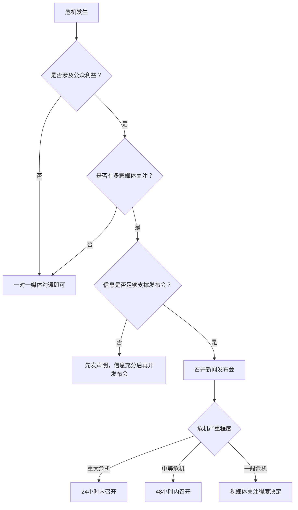

## 四、媒体沟通：赢得媒体的支持与理解

危机一旦发生，媒体就成为组织与公众之间最关键的桥梁。媒体的报道框架决定了公众如何理解这场危机——是"企业蓄意隐瞒"还是"企业积极应对"，往往不是事实本身的差异，而是媒体报道角度的差异。因此，危机中的媒体沟通不是"应付记者"，而是**争夺叙事权**的战略行为。

本节从媒体关系的日常建设讲起，依次覆盖新闻发布、记者采访、社交媒体管理、新闻稿撰写、不同媒体类型应对策略，以及危机后的媒体关系修复，帮助你建立一套完整的危机媒体沟通能力体系。

### 4.1 媒体关系的日常建设

危机时刻能获得媒体善意的前提，是日常就与媒体建立了专业、互信的关系。临时抱佛脚的媒体沟通几乎注定失败。

#### 4.1.1 为什么"平时不烧香"是致命的

当你与记者素不相识时，危机中的第一个电话就是"求人帮忙"，对方没有理由对你有好感。相反，如果记者在平时就认识你的新闻发言人、了解你的企业价值观、甚至采访过你的正面新闻，那么在危机发生时，他会更倾向于给你一个解释的机会，而不是直接采用负面框架。

媒体关系的本质是**信任储备**。就像银行账户一样，你平时存入善意和专业性，危机时才能支取信任和耐心。

#### 4.1.2 日常媒体关系维护清单

| 频率 | 行动 | 具体做法 | 目的 |
|------|------|----------|------|
| 每周 | 舆情监测 | 使用舆情工具（如清博大数据、新榜、鹰眼等）追踪行业报道 | 掌握媒体关注点 |
| 每月 | 媒体沟通 | 向核心记者发送行业洞察或企业动态（非广告性质） | 保持联系温度 |
| 每季度 | 媒体见面 | 组织小范围媒体交流会或一对一会面 | 深化关系 |
| 每年 | 媒体数据库更新 | 更新记者联系方式、关注领域、报道风格 | 确保危机时能找到对的人 |
| 持续 | 正面内容输出 | 主动提供新闻素材、专家观点、行业数据 | 成为记者的可靠信息源 |

#### 4.1.3 媒体数据库建设

危机发生后的第一个小时内，你需要快速联系到关键记者。如果此时才开始翻找联系方式，已经太晚了。一个完善的媒体数据库应包含：

- **核心媒体名单**：按影响力和报道领域分类（财经媒体、行业媒体、地方媒体、新媒体大V）
- **记者档案**：姓名、联系方式、关注领域、报道风格、过往报道（特别是关于你所在行业的报道）
- **关系状态标签**：陌生/认识/熟悉/深度合作，决定危机时的沟通策略
- **历史互动记录**：每次接触的时间、内容、结果

### 4.2 新闻发布会组织

新闻发布会是危机沟通中最正式、最高规格的媒体沟通形式。它提供了一个集中回应所有媒体疑问的平台，但也可能成为危机的放大器——一场糟糕的新闻发布会比不开更糟糕。

#### 4.2.1 何时需要召开新闻发布会

不是所有危机都需要召开新闻发布会。判断标准如下：

**必须召开发布会的情况**：
- 重大安全事故（人员伤亡、重大财产损失）
- 大规模产品缺陷或召回
- 涉及公共健康的事件（食品安全、环境污染）
- 监管部门介入调查
- 多家主流媒体同时跟进报道

**不需要召开发布会的情况**：
- 小范围的网络争议，尚未形成媒体关注
- 信息仍在调查中，无法对外发布实质性内容
- 已通过其他渠道（如官网声明、社交媒体）有效回应

#### 4.2.2 发布会筹备的完整流程

**T-48小时（危机爆发后立即启动）**：

1. **组建发布团队**：发言人（1-2人）、主持人（1人）、技术支持（1-2人）、舆情监测员（1-2人）、记录员（1人）
2. **信息收集与核实**：确认已知事实、待查事项、已采取的措施
3. **确定核心信息**：提炼3条核心信息（不超过3条，否则公众记不住）
4. **撰写发言稿**：开头表达关切和态度（30秒内），中间陈述事实和措施，结尾表明承诺
5. **准备问答预案**：预判记者可能提出的20-30个问题，逐一准备回答

**T-24小时**：

6. **场地确认**：选择合适的场地，确保交通便利、空间充足
7. **背景板设计**：简洁专业，包含组织名称和活动主题，避免花哨或过于商业化的元素
8. **邀请媒体**：通过媒体数据库联系核心媒体，发送邀请函
9. **模拟演练**：至少进行2次完整的模拟发布会，包括棘手问题的压力测试

**T-2小时**：

10. **技术检查**：话筒、投影、直播设备、网络、录音录像设备逐一测试
11. **座位安排**：前排留给核心媒体，摄影区留出足够空间
12. **资料准备**：打印版新闻资料包（含新闻稿、背景资料、FAQ、数据图表）
13. **发言人最后确认**：着装、状态、口径最后过一遍

#### 4.2.3 发言人的关键技巧

**开场的黄金30秒**：

发言人的前三句话决定了整场发布会的基调。公众和记者的注意力在开场30秒后就开始衰减。开场必须包含三个要素：

1. **表达关切**："我们对此次事件深感痛心，对受到影响的每一位（消费者/员工/公众）表示诚挚的歉意。"
2. **陈述立场**："我们已经启动了全面的应急响应机制。"
3. **给出行动**："目前我们已经采取了以下具体措施……"

**节奏控制**：

- 不要急于回答每个问题。面对复杂问题时，可以说"这是一个很好的问题，让我来仔细回答"，给自己3-5秒的思考时间
- 回答每个问题控制在60-90秒。超过90秒的回答，听众的注意力会显著下降
- 适时停顿。在关键信息前停顿1-2秒，可以让信息更有重量

**核心信息回锚**：

无论记者问什么问题，发言人都需要想办法将回答引回预设的3条核心信息。这不是回避问题，而是确保发布会传递的信息是聚焦的、一致的。

技巧示例：
- 记者问安全问题 → "您提到了安全，这正是我们最重视的。目前我们已经……（回到核心信息）"
- 记者问赔偿问题 → "关于赔偿，我们的原则是……（回到核心信息），具体方案将在48小时内公布"

**肢体语言要点**：

- **坐姿**：身体微微前倾，表示重视和参与感，不要靠在椅背上
- **双手**：自然放在桌面上，掌心朝下或双手交叠，避免交叉抱胸（防御姿态）
- **眼神**：看向提问的记者，回答时偶尔扫视全场
- **表情**：严肃但不僵硬，关切但不夸张，真诚但不煽情

#### 4.2.4 棘手问题的应对策略

| 策略 | 适用场景 | 话术模板 | 示例 |
|------|----------|----------|------|
| 桥接法 | 记者纠缠细节，需要拉回主题 | "这个问题很重要，但我想先强调一个更关键的点……" | "赔偿细节确实在讨论中，但我想先强调，我们目前最紧迫的任务是确保每一位受影响客户的安全。" |
| 过渡法 | 问题涉及敏感信息，不宜直接回答 | "关于这个问题，目前我们的了解是……，更重要的是……" | "关于事故原因，调查仍在进行中，但更重要的是，我们已经采取了X、Y、Z三项措施防止类似事件再次发生。" |
| 直言法 | 确实不知道答案 | "坦率地说，我现在无法给出确切答案，但我们会尽快查清并告知大家" | "具体的数据我目前没有，但我的同事会在今天下午5点前通过官方渠道发布。" |
| 转换视角法 | 问题带有负面预设 | "从另一个角度来看这个问题……" | "与其讨论是否'管理不善'，不如让我们看看事故发生后我们做了什么——在接到报告的30分钟内……" |
| 坦诚法 | 事实对自己不利 | "我们确实存在不足，对此我们没有任何借口" | "在这次事件中，我们的响应速度确实没有达到自己的标准。这是我们的失误，我们正在改进。" |

### 4.3 记者采访应对

一对一的记者采访比新闻发布会更灵活，但也更危险——没有其他记者在场"监督"记者是否会断章取义，也没有团队在旁边帮你提醒。你需要独立应对全部挑战。

#### 4.3.1 采访前的准备工作

**了解你的对手**：

- 这位记者过去半年写过哪些报道？他的立场和风格是什么？
- 他属于哪种类型：调查型（追求真相，可能会追问细节）、故事型（注重人物和情感）、数据型（注重数据和证据）、观点型（有自己的立场，采访是为了验证观点）
- 他所在的媒体平台：严肃媒体更注重事实，新媒体更注重传播力，行业媒体更注重专业性
- 他的读者/观众是谁？这决定了什么样的表达方式更有效

**确定你的底线**：

在采访前明确：
- **可以说的**：已确认的事实、已采取的措施、组织的立场
- **不可以说的**：正在调查中的事项、涉及法律诉讼的内容、涉及其他当事方的隐私
- **怎么说的**：关键信息的精确措辞，每个字都要经过推敲

**设定规则**：

- 与记者协商采访时长（建议不超过30分钟，危机期间首次采访控制在15-20分钟）
- 明确是"录音采访"还是"非录音采访"（但请记住：任何话都可能被引用，无论是否录音）
- 指定采访地点（建议在你熟悉的环境，如公司会议室）

#### 4.3.2 "ABC"法则详解

ABC法则是危机采访中最实用的回应框架：

- **A（Acknowledge）——承认**：承认问题的重要性和合理性，展示你在倾听
- **B（Bridge）——桥接**：自然过渡到你想要传达的核心信息
- **C（Communicate）——传达**：清晰地传达你的核心信息，给出事实或行动

**实战示例**：

> **记者问**："这次事故是不是因为你们的安全管理不到位？"
>
> **回答**："您提到的安全管理问题确实是我们需要重点关注的（A）。实际上，安全一直是我们企业文化的核心，我们每年投入营收的X%用于安全升级（B）。目前我们已经启动了全面的安全检查，并邀请了第三方专业机构参与评估，初步结果将在本周五前公布（C）。"

> **记者问**："有员工反映公司内部早就知道这个隐患，但管理层一直没处理，这是真的吗？"
>
> **回答**："我们认真对待每一位员工的反馈（A）。在内部管理上，我们有定期的安全巡检制度和匿名举报渠道（B）。针对此次事件，我们已经成立了独立调查组，欢迎任何掌握信息的同事通过内部渠道反映情况，调查结果将向全体员工公开（C）。"

**ABC法则的高级用法——多重桥接**：

当记者反复追问同一个敏感问题时，你需要在每一次回应中都完成一次ABC循环，而不是被拖入对方的叙事框架：

> **记者问**："您刚才没有直接回答我的问题——管理层是不是早就知道了？"
>
> **回答**："我理解您希望得到一个明确的答案（A）。目前我能够确认的是，独立调查组已经启动工作（B），这是确保事实不被遗漏的最可靠方式，调查结果将以透明的方式向所有利益相关方公布（C）。"

#### 4.3.3 采访中的铁律

**铁律一：每句话都可能成为标题**

记者不会引用你准备好的核心信息作为标题，他们会选择最吸引眼球的那句话。所以每一句话都要像标题一样来组织——简洁、准确、不产生歧义。

错误示范："说实话，我们确实没想到会出这么大的问题。"
→ 标题可能变成："公司承认：没想到会出这么大的问题"

正确示范："我们在第一时间启动了应急预案，并全力配合调查。"
→ 这句话即使被单独引用，也不会造成伤害。

**铁律二：没有"私下说"**

"这些话别记了"、"私下跟你说"、"off the record"——这些在中国媒体环境下的效果几乎为零。记者可能会"不小心"把你说的话写进报道，即使他口头答应了。最安全的做法是：说出来的每句话，都假设会被公开。

**铁律三：不要猜测和推断**

"可能是我们的供应商出了问题"、"我觉得应该是竞争对手在搞事"——这些未经证实的猜测一旦被报道，就变成了"公司声称"的事实。只说你知道的、有证据支持的内容。

**铁律四：控制情绪，但可以有温度**

冷静不等于冷漠。面对涉及人员伤亡的危机，发言人的冷漠态度本身就是一种公关灾难。适度的情感表达——声音的微微颤抖、真诚的眼神、停顿后再开口——反而会增加公众的信任感。

#### 4.3.4 不同类型采访的应对差异

| 采访类型 | 特点 | 应对策略 |
|----------|------|----------|
| 突击采访 | 记者在公司门口或活动现场突然出现，毫无准备 | 礼貌但坚定地表示"目前我无法做出回应，我们将在X时间发布官方声明"，绝不当场回答任何问题 |
| 电话采访 | 看不到对方表情，可能被录音 | 确认记者身份和媒体，要求对方先说明采访提纲，回答简洁明确 |
| 视频/电视采访 | 观众不仅听你说了什么，还看你的表情和肢体 | 提前到场适应环境，注意视线（看镜头而非显示器），控制面部表情 |
| 书面采访 | 有充足时间组织回答 | 字斟句酌，每句话都要考虑被单独引用的后果，发送前请团队审核 |
| 暗访/隐性采访 | 对方可能隐藏身份或使用隐藏设备 | 对任何异常的提问保持警惕，避免在非正式场合讨论敏感信息 |

### 4.4 社交媒体管理

社交媒体改变了危机传播的速度和路径。过去，危机信息从事件发生到媒体报道可能需要数小时甚至数天；现在，一条微博、一段短视频可以在15分钟内引爆全网。社交媒体既是危机的放大器，也是组织直接面向公众发声的最重要渠道。

#### 4.4.1 社交媒体危机传播的特征

**速度极快**：负面信息从发布到登上热搜，平均时间不超过2小时。如果组织在4小时内没有回应，公众就会默认"你们不在乎"。

**情绪驱动**：社交媒体上的危机传播，80%由情绪驱动而非事实驱动。一条充满愤怒情绪的帖子，传播力是一条理性分析帖子的10倍以上。

**去中心化**：不再是媒体记者决定报道什么，而是每一个用户都可能成为"报道者"。一条普通用户的投诉帖子，如果触发了公众的共情，传播量可能超过任何媒体的报道。

**记忆短暂但可唤醒**：互联网的记忆是"选择性"的——大多数人会在一周后忘记，但任何新事件都可能唤醒旧记忆，并产生叠加效应。

#### 4.4.2 社交媒体危机响应全流程

**第一阶段：监测与评估（0-15分钟）**

- 通过舆情监测工具（微博热搜监控、百度指数、抖音热点、知乎热榜）发现危机信息
- 快速评估：信息来源是否可信？传播范围多大？公众情绪倾向是什么？是否可能继续发酵？
- 将评估结果通报危机管理团队

**第二阶段：初步回应（15-30分钟）**

- 在官方社交账号发布简短声明，表明"我们已经关注到此事，正在核实，将在X小时内发布详细回应"
- 这一步的目的是**抢占叙事窗口**——让公众知道你已经知道了，而不是"装聋作哑"
- 如果情况紧急（如涉及人身安全），可以更早发声

**第三阶段：完整声明（2小时内）**

- 通过官方社交账号发布正式声明
- 声明必须包含：事实说明（已确认的）、态度表达（关切/歉意/重视）、行动措施（已经做了什么、将要做什么）、后续安排（什么时候会有进一步更新）

**第四阶段：互动与追踪（持续进行）**

- 回应关键疑问和评论，优先回应影响力大的评论（大V、媒体账号）
- 避免与攻击者陷入无休止的争论
- 持续追踪舆情动态，根据情况调整策略
- 每4-6小时发布一次更新，保持信息透明

**第五阶段：长尾管理（48小时后）**

- 危机热度下降后，不要立即停止更新
- 发布后续进展：调查结果、整改措施、补偿方案
- 逐步恢复正常的社交媒体运营节奏

#### 4.4.3 不同社交平台的应对策略

| 平台 | 传播特征 | 应对重点 | 注意事项 |
|------|----------|----------|----------|
| 微博 | 热搜驱动，传播最快，舆论场最大 | 第一时间发声，善用官方账号发布长文声明 | 热搜消失不等于危机结束 |
| 微信 | 圈层传播，深度阅读，公众号影响力大 | 通过公众号发布深度回应，同时在朋友圈传播正面内容 | 避免在微信群中讨论危机策略 |
| 抖音/快手 | 视频为主，情绪感染力强，下沉市场影响力大 | 准备视频回应素材（发言人讲话视频、整改现场视频） | 避免使用模板化的图文回应 |
| 知乎 | 理性讨论为主，深度分析，影响精英群体 | 邀请行业专家或公司高管在知乎回答相关问题 | 删帖行为在知乎的反噬最为严重 |
| B站 | 年轻用户为主，二次创作能力强 | 关注UP主的二次创作内容，必要时通过官方账号回应 | 恶搞视频传播后不要强行打压 |
| 小红书 | 消费决策影响大，用户信任度高 | 及时回应消费者的真实投诉，发布整改承诺 | 用户更看重真实体验而非官方声明 |

#### 4.4.4 社交媒体回应的五字原则

**快**——在黄金时间内发出第一声回应。黄金时间的定义：
- 重大危机：30分钟内
- 中等危机：2小时内
- 一般争议：4小时内
- 超过黄金时间未回应，公众会形成"企业不在意"的负面认知

**准**——信息准确，表述恰当。发布前必须核实每一条信息，宁可慢一点也不要发布错误信息——在危机中，一次错误的声明比没有声明更糟糕。

**诚**——态度真诚，不回避问题。公众能轻易分辨出模板化的公关话术和真诚的沟通。真诚的具体表现：承认不足（"我们确实做得不够好"）、给出具体行动（"我们将在本周五前完成X"）、承诺可验证的结果。

**稳**——情绪稳定，不被激怒或带偏节奏。社交媒体上的攻击性言论会激发回应者的愤怒，但任何带有情绪的回应都会成为新的危机。建立一个规则：所有对外回应必须经过至少两个人的审核。

**控**——控制信息发布的主动权，引导话题走向。不要被舆情牵着走，主动设置议题。例如：不要只回应"出了什么问题"，而要主动发布"我们在做什么来解决问题"。

#### 4.4.5 社交媒体四大陷阱

**陷阱一：删帖**

在危机期间删除负面评论或帖子，是社交媒体管理中最愚蠢的行为。互联网是有记忆的——删帖行为本身会被截图、传播，引发更大的愤怒。公众会认为"你不仅犯了错，还想掩盖错误"。

正确做法：用正面信息和真诚回应来稀释负面评论，而不是删除它们。只有在评论涉及违法信息（如人身威胁、造谣）时，才通过平台机制进行处理。

**陷阱二：模板化回复**

"感谢您的反馈，我们非常重视，正在积极处理中"——这种千篇一律的模板回复，出现在每一条负面评论下面，公众看到后的感受是"敷衍"。

正确做法：针对不同的评论给出有针对性的回应。即使内容相似，也要在措辞上做出差异化，让公众感受到你在认真对待每一条反馈。

**陷阱三：过度辩论**

与网友陷入无休止的争论是社交媒体管理的大忌。你赢了辩论，但输了人心。每多争论一个回合，危机就多延续一天。

正确做法：对合理的质疑给予认真回应（不超过2轮），对恶意攻击不做回应，对误解给予一次澄清即可。设定规则：同一话题的回应不超过3条。

**陷阱四：忽视长尾效应**

很多组织在危机热度最高的几天全力以赴，但一旦热搜消失就停止更新。这是错误的——危机的长尾效应可能持续数周甚至数月。如果公众发现"你们只是在热度高的时候做做样子"，下一次危机的信任基础会更低。

正确做法：危机后的30天内，持续发布整改进展、措施落实情况、改进成果等信息。将危机沟通变成一次信任重建的长期工程。

### 4.5 新闻稿撰写

新闻稿（新闻通稿）是危机沟通中最基础、最正式的文本形式。它不仅是给媒体的素材，更是组织官方立场的法律性文件。一篇措辞不当的新闻稿，可能成为诉讼中的不利证据。

#### 4.5.1 危机新闻稿的结构模板

标题：[组织名称]关于[事件]的声明（第X次更新）

第一段（态度与关切）：
[组织名称]对[事件]中受到影响的[利益相关方]深表关切。
[如有人员伤亡：我们对伤亡人员及其家属表示深切慰问。]

第二段（事实陈述）：
[日期][时间]，[地点]发生了[事件简要描述]。
目前已确认的信息：[列举已确认事实]。
事件原因仍在调查中/经初步调查，[初步结论]。

第三段（已采取的行动）：
事件发生后，[组织名称]立即采取了以下措施：
1. [措施一]
2. [措施二]
3. [措施三]

第四段（后续安排）：
我们将[下一步计划]。
[具体时间节点]前，我们将[发布进一步信息/完成某项工作]。
[如有第三方介入]：我们已邀请[第三方机构]参与[具体工作]。

第五段（联系方式）：
如有疑问，请联系：
媒体联系人：[姓名] [电话] [邮箱]
客户服务热线：[电话]

[组织名称]
[日期]

#### 4.5.2 新闻稿的措辞禁忌

| 禁忌 | 原因 | 替代表达 |
|------|------|----------|
| "无可奉告" | 暗示有隐瞒，公众最为反感 | "调查正在进行中，我们将在X时间发布完整信息" |
| "我们深感遗憾"（不加行动） | 空洞的遗憾令人厌烦 | "我们深感遗憾，目前已采取X措施" |
| "这是一起孤立事件" | 公众不会相信，反而怀疑还有更多 | "我们正在对所有类似环节进行全面排查" |
| "受害者"（自称） | 将自己定位为受害者会引发反感 | "受影响的客户/公众" |
| "网络传言不实" | 只说"不实"不说真相，等于没说 | "关于[传言内容]，实际情况是[事实]" |
| "我们已经尽力了" | 暗示没有改进空间 | "我们已采取X措施，同时正在进一步改进Y" |

### 4.6 不同媒体类型的沟通策略

不同类型的媒体有不同的报道逻辑和受众特征，危机沟通需要因地制宜。

#### 4.6.1 传统媒体（报纸、电视、广播）

**特点**：报道周期较长（通常一天以上），有编辑审核环节，报道相对深入和权威，受众覆盖广泛。

**应对策略**：
- 主动提供新闻稿和背景资料，降低记者的采访成本
- 接受深度采访，展示组织的专业性和透明度
- 电视采访要特别注意形象——着装得体、表情自然、语速适中
- 报纸记者更注重事实和数据，提供充分的书面材料

#### 4.6.2 网络媒体（门户网站、新闻客户端）

**特点**：报道速度极快，标题党倾向明显，更注重点击率和传播力，24小时滚动更新。

**应对策略**：
- 在第一时间发布官方声明，抢占新闻源头
- 准备好"可引用的金句"——简洁有力、不产生歧义的表述
- 关注标题的措辞——你无法控制记者怎么写标题，但你可以提供一个好标题的素材
- 提供数据和图表，网络媒体喜欢可视化的信息

#### 4.6.3 新媒体大V和KOL

**特点**：影响力大但不可控，可能基于情绪而非事实进行评论，二次创作能力强。

**应对策略**：
- 建立核心大V的日常联系（不要在危机时才找他们）
- 如果大V发布了不实信息，通过私信而非公开争论的方式沟通
- 提供独家信息或采访机会，让大V有动力发布你的版本
- 不要试图收买或施压——一旦被曝光，将引发更大的信任危机

### 4.7 危机后的媒体关系修复

危机结束后，媒体关系的修复是一个长期工程。如果处理得当，危机反而可以成为深化媒体关系的契机。

#### 4.7.1 复盘与感谢

- 向在危机中给予公正报道的记者表达感谢（不是送礼，而是发一封真诚的感谢邮件）
- 邀请核心记者参与危机复盘会（非公开的），展示组织从危机中学到了什么
- 定期分享整改措施的落实情况，让记者看到你说到做到

#### 4.7.2 信任重建的三个阶段

1. **观察期（1-3个月）**：媒体会持续关注你的后续表现，任何"旧病复发"都会被放大报道。这一阶段要严格执行整改措施，避免出现新的负面新闻
2. **验证期（3-6个月）**：通过持续的正面行动，逐步验证你承诺的整改措施是否落实。主动邀请记者报道整改成果
3. **重建期（6-12个月）**：通过新的正面事件（如获得行业奖项、推出创新产品、获得客户好评），逐步重建正面形象

### 4.8 媒体沟通中的法律与伦理

#### 4.8.1 法律红线

- **不发布虚假信息**：在新闻发布会或采访中发布已知虚假的信息，可能构成欺诈或虚假陈述
- **不侵犯隐私**：在公开回应中不得泄露涉事个人的隐私信息（如涉事员工的姓名、住址等，除非获得授权）
- **不干扰调查**：在监管部门调查期间，不得发布可能影响调查的信息
- **不诋毁竞争对手**：即使危机是由竞争对手引发的，也不得在公开声明中进行无证据的指控

#### 4.8.2 伦理准则

- **真实性原则**：只说你知道的，不猜测、不推断、不夸大
- **及时性原则**：在确认事实后尽快公开，不故意拖延
- **完整性原则**：不选择性披露有利信息、隐藏不利信息
- **尊重性原则**：尊重所有利益相关方，包括批评者和受害者

### 4.9 常见误区与纠正

| 误区 | 表现 | 后果 | 正确做法 |
|------|------|------|----------|
| 鸵鸟心态 | 拒绝与媒体接触，"等风头过去" | 信息真空被猜测和谣言填充 | 主动发声，哪怕只是"我们在调查中" |
| 过度承诺 | "我们保证不会再发生" | 一旦无法兑现，信任彻底崩塌 | "我们将采取X措施，尽最大努力防止类似事件" |
| 归咎他人 | "这是供应商/员工/第三方的问题" | 公众认为你在推卸责任 | "无论责任在哪个环节，我们都将承担并解决" |
| 统一口径过度 | 所有人的回答一字不差 | 公众感觉被"洗脑"，缺乏真诚 | 核心信息一致，具体表达因人因场景灵活调整 |
| 只打官腔 | 使用大量官方语言和术语 | 公众无法理解，产生距离感 | 使用通俗易懂的语言，用具体数字替代抽象概念 |
| 只道歉不行动 | 反复道歉但不说明具体措施 | 公众认为道歉只是公关策略 | 每一次道歉都必须附带具体的行动计划 |

### 4.10 进阶：构建危机媒体沟通能力

媒体沟通能力不是天生的，需要系统化的训练和持续的积累。

**日常训练**：
- 每周分析一个危机公关案例的媒体沟通表现，总结成功和失败的原因
- 每月进行一次模拟采访练习，录制视频回看自己的表现
- 每季度更新一次媒体数据库，维护核心媒体关系

**能力检验清单**：
- 能否在30秒内清晰传达3条核心信息？
- 能否在不看稿的情况下完成一次5分钟的危机表态？
- 能否在面对尖锐提问时保持冷静，并自然使用ABC法则？
- 能否在15分钟内撰写一篇结构完整的危机新闻稿？
- 能否根据不同的媒体类型调整沟通策略？

如果你对以上任何一项没有信心，说明你还需要更多的练习。危机不会等你准备好才来。
