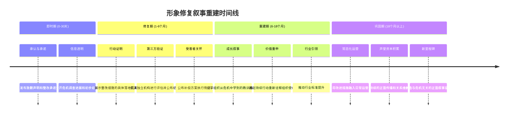
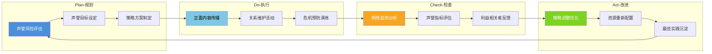

## 五、形象修复：从危机中重建信任

危机爆发后的72小时决定了伤害的烈度，但危机过后的720天决定了组织能否真正"活下来"。形象修复不是危机沟通的尾声，而是一场以年为单位的系统工程。本节从理论根基出发，逐层拆解信任重建的心理机制、实操策略和长期管理框架，帮助组织将危机转化为声誉升级的转折点。

### 5.1 理论根基：为什么修复比预防更难

#### 5.1.1 Benoit形象修复理论（IRT）

William Benoit在1995年提出的形象修复理论（Image Repair Theory）是危机后声誉管理最经典的学术框架。该理论认为，当组织的形象受到攻击时，有五种核心修复策略可供选择：

| 策略 | 核心逻辑 | 适用场景 | 风险 |
|------|----------|----------|------|
| **否认（Denial）** | 否认问题存在或否认责任 | 事实清楚表明组织无过错时 | 若被证伪，信誉彻底崩塌 |
| **规避责任（Evasion of Responsibility）** | 将责任归因于外部因素 | 确实存在外部诱因时 | 容易被解读为推卸责任 |
| **降低负面影响（Reducing Offensiveness）** | 通过补偿、区隔、强化等手段降低负面感知 | 无法完全否认责任时 | 需要配套实际补偿行动 |
| **纠正行为（Corrective Action）** | 采取实际行动修复问题 | 所有承认存在过失的场景 | 需要真实投入资源 |
| **认错道歉（Mortification）** | 真诚承认错误并请求原谅 | 组织确实存在过失且公众情绪激烈时 | 过度道歉可能被解读为承认更大问题 |

关键洞察：这五种策略不是互斥的，实际操作中通常需要组合使用。Benoit本人也强调，**纠正行为**是最有效的单一策略，因为它同时传递了"我们认识到了问题"和"我们有能力解决"两个信号。

#### 5.1.2 Coombs情境危机传播理论（SCCT）

Timothy Coombs的SCCT理论进一步细化了策略选择的依据。该理论的核心变量是**危机类型**和**危机历史**：

- **受害者型危机**（自然灾害、谣言攻击）：组织也是受害者，公众问责预期低，适用否认/规避策略
- **事故型危机**（技术故障、操作失误）：问责预期中等，适用纠正行为+降低影响
- **可预防型危机**（管理层渎职、明知故犯）：问责预期最高，必须使用认错道歉+纠正行为的组合

当组织有**危机历史**（即以前发生过类似危机）时，无论当前危机类型如何，都必须采用更高程度的补偿和纠正策略，因为公众会认为"这是系统性问题"。

#### 5.1.3 信任修复的心理学机制

信任修复之所以困难，涉及一个深层的心理学机制——**负面偏差效应（Negativity Bias）**。研究表明，人类大脑对负面信息的敏感度是正面信息的3-5倍。这意味着：

- 一次危机造成的信任损伤，需要5-10次同等规模的正面事件才能抵消
- 公众倾向于"证实偏差"——一旦形成负面印象，会选择性关注支持该印象的新信息
- 信任的"不对称原则"：建立信任缓慢而渐进，摧毁信任快速而剧烈

这解释了为什么形象修复必须比日常声誉建设投入更多资源、更长时间、更高频率的正面曝光。Lewicki和Bountress（2000）的研究进一步指出，信任修复存在"阈值效应"——如果负面事件的严重程度超过了某个阈值，修复努力可能永远无法让信任回到原有水平，组织必须接受一个"新常态"。

### 5.2 信任重建的四维模型

信任不是一个单一维度的概念。Mayer等人（1995）提出的信任整合模型指出，信任由四个相互独立又相互影响的维度构成。每个维度在危机中受损的程度不同，修复策略也必须有针对性。

#### 5.2.1 能力信任（Competence-based Trust）

**定义**：利益相关者相信组织具备解决问题、履行承诺的技术能力和管理能力。

**危机中的典型损伤**：产品质量事故暴露技术缺陷、安全事件暴露管理漏洞、服务中断暴露系统脆弱性。

**修复策略**：

1. **技术能力展示**：邀请独立第三方机构对产品/系统进行全面检测并公布报告。例如，航空公司在空难后邀请国际民航组织进行安全审计并公开审计结果。
2. **人才投入信号**：引入行业权威专家担任顾问或进入管理层。这不是作秀，而是向外界传递"我们有能力解决这个问题"的信号。
3. **系统性升级**：在危机暴露的薄弱环节进行可见的、可量化的能力提升。例如，数据泄露后投入具体的网络安全基础设施升级。
4. **小胜策略（Small Wins）**：在修复过程中持续公布阶段性成果，让公众看到"能力在恢复"的具体证据。

**量化指标**：产品合格率、系统可用性（SLA）、第三方审计评分、客户满意度回升曲线。

#### 5.2.2 善意信任（Benevolence-based Trust）

**定义**：利益相关者相信组织真正关心他们的利益，而不是只关注自身利润。

**危机中的典型损伤**：危机处理中暴露出组织"只顾自保"的态度、对受害者的补偿不到位、沟通中缺乏同理心。

**修复策略**：

1. **超额补偿**：在法律要求之外主动提供额外补偿。这不是"多花钱"的问题，而是传递"你的损失比我们的成本更重要"的信号。
2. **受害者关怀机制**：建立专门的受害者服务团队，提供长期跟踪关怀。不是一次性赔偿后就消失，而是持续关注受害者的恢复状况。
3. **透明决策过程**：公开重大决策背后的考量过程，让公众看到"我们把你的利益放在了重要位置"。
4. **社区投资**：在受影响社区进行持续性的资源投入，证明组织的善意不是口头承诺。

**量化指标**：受害者满意度调查、社区关系指数、员工敬业度（内部善意）、媒体报道情感倾向。

#### 5.2.3 正直信任（Integrity-based Trust）

**定义**：利益相关者相信组织遵守一套可接受的原则，言行一致，信守承诺。

**危机中的典型损伤**：危机中发现组织存在欺骗行为、承诺未兑现、高管言行不一致。

**修复策略**：

1. **承诺兑现追踪系统**：建立公开的承诺兑现追踪表（Promise Tracker），逐条列出危机期间做出的每项承诺及兑现状态。
2. **高管行为一致性**：高管在危机后的行为必须与承诺完全一致。任何不一致都会被放大传播。
3. **制度化正直**：将"言行一致"从道德要求转化为制度约束——建立内部举报机制、定期合规审计、高管行为准则。
4. **第三方背书**：引入可信的第三方机构（行业协会、公益组织、学术机构）为组织的改进背书。

**量化指标**：承诺兑现率、合规审计通过率、员工举报机制使用率（越高说明信任机制在运转）。

#### 5.2.4 透明信任（Transparency-based Trust）

**定义**：利益相关者相信组织愿意主动公开信息，不隐瞒关键事实。

**危机中的典型损伤**：危机中被发现隐瞒信息、信息发布时间滞后、选择性披露。

**修复策略**：

1. **常态化信息公示**：从危机前的"被动回应"转变为"主动公示"。定期发布运营数据、安全报告、合规状态。
2. **开放日/参访机制**：定期邀请媒体、客户、社区代表到组织内部参观，亲眼看到改进措施的落地。
3. **数据开放**：在不涉及商业机密的前提下，尽可能开放运营数据。例如，餐饮企业公开后厨监控、食品企业公开供应链溯源数据。
4. **即时回应机制**：建立对公众质疑的快速回应机制，避免"沉默即心虚"的解读。

**量化指标**：信息公开频率、媒体问询回应时间、社交媒体互动率、公众满意度调查中"透明度"单项得分。

### 5.3 六种形象修复策略详解

Benoit的五种策略提供了理论框架，但在实操中需要更细化的执行方案。以下是六种经过实战检验的形象修复策略及其具体操作方法。

#### 5.3.1 策略一：纠正行为——最有效的修复路径

纠正行为之所以是最有效的策略，因为它同时解决了"问题本身"和"公众感知"两个层面。

**四步执行框架**：

第一步：根因分析（Root Cause Analysis）
├── 技术层面：直接原因→间接原因→系统性原因
├── 管理层面：流程缺陷→监督缺失→文化根源
└── 输出：根因分析报告（公开版+内部版）

第二步：整改方案制定
├── 短期止血：立即消除直接风险
├── 中期补漏：修复导致危机的系统缺陷
└── 长期固本：建立防止类似问题的长效机制

第三步：第三方验证
├── 邀请独立机构对整改方案进行评审
├── 整改完成后进行验收审计
└── 公布审计结果（包括未达标项）

第四步：持续跟踪
├── 建立整改效果跟踪机制
├── 定期公布跟踪结果
└── 根据跟踪结果动态调整整改方案

**案例：强生泰诺事件（1982年）**

1982年，美国芝加哥地区有7人因服用被氰化物污染的泰诺胶囊死亡。强生公司的纠正行为成为危机管理的经典案例：

- **即时行动**：全国召回3100万瓶泰诺（当时价值1亿美元），尽管污染仅限于芝加哥地区
- **技术纠正**：投资开发防篡改三重密封包装，成为行业标准
- **制度纠正**：推动FDA出台药品包装防篡改法规
- **结果**：泰诺在一年内恢复了危机前的市场份额，防篡改包装反而成为竞争优势

这个案例的关键教训：纠正行为的成本（1亿美元召回+包装研发）远小于不行动的潜在损失（品牌彻底死亡）。

#### 5.3.2 策略二：认错道歉——高风险高回报的修复路径

道歉不是简单说"对不起"。有效的道歉需要包含五个要素（来自Schlenker的道歉要素理论）：

| 要素 | 说明 | 反面示例 | 正面示例 |
|------|------|----------|----------|
| **表达歉意** | 真诚表达悔意 | "我们对此表示遗憾" | "我们深感抱歉，这是不应该发生的" |
| **承认责任** | 明确承认具体过错 | "如果造成了不便" | "我们在质量检测环节存在疏漏" |
| **解释原因** | 说明问题的来龙去脉（不是找借口） | "由于供应商的问题" | "经过调查，我们的供应链审核流程未能覆盖到这个环节" |
| **承诺改正** | 说明将采取的具体措施 | "我们会加强管理" | "我们将在30天内完成供应链审计系统的全面升级" |
| **请求原谅** | 表达希望重建关系的诚意 | 不提及 | "我们理解信任需要时间重建，恳请给我们机会用行动证明" |

**道歉的时机选择**：

- **过早道歉**（事实未查明就道歉）：可能被解读为"心虚"或"敷衍"
- **过晚道歉**（舆论发酵后才道歉）：被解读为"被迫"而非"真心"
- **最佳时机**：基本事实查明后、责任认定清楚后立即道歉，通常在危机爆发后24-72小时内

**道歉的渠道选择**：

- 重大危机：CEO/一把手亲自出面（视频优于文字）
- 中等危机：官方声明+高管采访配合
- 轻微危机：官方社交媒体声明即可

#### 5.3.3 策略三：补偿修复——用行动证明诚意

补偿是将口头承诺转化为实际行动的关键环节。

**补偿策略矩阵**：

| 补偿类型 | 适用对象 | 具体形式 | 投入预估 |
|----------|----------|----------|----------|
| **直接经济补偿** | 直接受害者 | 退款、赔偿金、免费服务 | 因规模而异 |
| **间接经济补偿** | 间接受影响者 | 优惠券、免费升级、延长服务期 | 较低 |
| **社区补偿** | 受影响社区 | 公益项目、基础设施投资、就业机会 | 中等 |
| **行业补偿** | 整个行业 | 推动标准制定、技术共享、安全培训 | 长期投入 |

**补偿的原则**：

1. **主动补偿优于被动赔偿**：不要等到诉讼判决才赔偿，主动提出的补偿金额通常应高于法律要求的最低标准
2. **速度优于完美**：先快速发放初步补偿，再根据详细评估进行补充
3. **可见性很重要**：补偿行动需要被公众看到（但不是作秀），可以通过定期公示补偿进展来实现
4. **避免"花钱消灾"的印象**：补偿必须与纠正行为、道歉同步进行，单独的金钱补偿可能被解读为"想用钱摆平"

#### 5.3.4 策略四：第三方背书——借力重建可信度

在信任受损后，组织自己的声明说服力大幅下降。此时需要借助第三方的可信度来"借力"。

**第三方背书的层级**（按可信度从高到低）：

第一梯队：权威监管机构
├── 政府监管部门的检查通过报告
├── 行业协会的认证/奖项
└── 可信度：★★★★★

第二梯队：独立专业机构
├── 国际知名审计/认证机构（SGS、TÜV、BSI）
├── 学术研究机构的合作研究
└── 可信度：★★★★☆

第三梯队：意见领袖/KOL
├── 行业专家的独立评价
├── 受影响群体中的代表性人物
└── 可信度：★★★☆☆

第四梯队：普通用户
├── 真实用户的体验反馈
├── 社交媒体上的口碑传播
└── 可信度：★★☆☆☆

**操作要点**：

- 第三方必须真正独立，不能是组织付费聘请的"代言人"
- 第三方的评估结果必须完整公开，包括负面发现
- 组织不能试图影响第三方的评估结论

#### 5.3.5 策略五：叙事重构——改写危机的意义

叙事重构不是"洗白"或"掩盖"，而是为已经发生的危机赋予新的意义框架。

**三种有效的叙事重构框架**：

**1. 成长叙事（Growth Narrative）**

将危机重新定义为组织成长的催化剂。

模板：`"正是这次经历，让我们深刻认识到[核心问题]。我们不仅解决了[具体问题]，更从根本上改变了[组织能力/文化/流程]。今天的[组织名称]比危机前更强大。"`

案例：2010年丰田大规模召回事件后，丰田将叙事从"质量失控"重构为"回归质量原点"，推出了"丰田新全球架构（TNGA）"，将危机转化为全面质量升级的契机。

**2. 使命叙事（Mission Narrative）**

将危机与组织的更深层使命联系起来。

模板：`"这次事件让我们更加坚定了[核心使命]的信念。[核心使命]不是一句口号，它意味着在面对[困难]时，我们选择[价值观导向的行动]。"`

案例：巴塔哥尼亚（Patagonia）在被揭露供应链中存在劳工问题后，没有简单道歉，而是将叙事锚定在其"环保与社会责任"的企业使命上，推出了行业首个供应链透明度报告。

**3. 行业引领叙事（Industry Leadership Narrative）**

将组织的危机处理提升为行业标准。

模板：`"我们相信[行业]需要更高的标准。我们不仅在自己内部实施了[改进措施]，更呼吁全行业共同采用[新标准]。"`

案例：Chipotle在2015-2016年多次食安事件后，不仅升级了自身食品安全体系，还发布了行业白皮书，推动了快餐行业食品安全标准的提升。

#### 5.3.6 策略六：关系修复——重建受损的关系网络

危机中受损的关系不仅包括公众和客户，还包括员工、供应商、投资者、政府监管部门、媒体等多个利益相关者群体。

**分众关系修复策略**：

| 利益相关者 | 关系修复重点 | 关键行动 | 时间框架 |
|-----------|-------------|----------|----------|
| **员工** | 重建内部信任和归属感 | 内部沟通会、员工关怀计划、参与改进过程 | 即时开始 |
| **客户** | 恢复消费信心 | 产品/服务升级、忠诚度回馈、体验邀请 | 1-6个月 |
| **投资者** | 恢复投资信心 | 透明的财务沟通、治理结构优化、长期战略展示 | 3-12个月 |
| **供应商** | 重建供应链信任 | 公平的补偿方案、长期合作协议、联合改进项目 | 3-6个月 |
| **监管部门** | 重建合规信任 | 主动报告、超额合规、配合调查 | 即时开始 |
| **媒体** | 重建媒体关系 | 主动提供信息、开放采访、建立定期沟通机制 | 1-3个月 |
| **社区** | 重建社区关系 | 社区投资、就业支持、环境修复 | 长期持续 |

### 5.4 正面叙事重建：系统化操作指南

正面叙事重建不是简单的"发几篇正面新闻"，而是一个系统化的信息环境重塑工程。

#### 5.4.1 叙事重建的时间线

#### 5.4.2 内容策略矩阵

| 内容类型 | 目的 | 发布频率 | 渠道 | 示例 |
|----------|------|----------|------|------|
| **改进进展报告** | 展示纠正行动的落地 | 每月1次 | 官网+新闻稿 | "第3个月整改进展：已完成XX，预计XX" |
| **第三方背书内容** | 借力权威重建可信度 | 关键节点发布 | 媒体+社交 | "XX机构审计报告显示：全部达标" |
| **用户证言** | 用真实体验反驳质疑 | 持续收集发布 | 社交媒体+官网 | 客户回访视频、满意度调查结果 |
| **行业洞察** | 树立专业权威形象 | 每季度1-2次 | 行业媒体+论坛 | 白皮书、行业报告、演讲分享 |
| **社会责任内容** | 展示组织的社会担当 | 每月1-2次 | 社交媒体+PR | 公益项目进展、社区活动、环保行动 |
| **员工故事** | 展示组织文化的真实面貌 | 每月1-2次 | 社交媒体+内刊 | 员工访谈、工作日常、改进参与故事 |

#### 5.4.3 叙事一致性管理

多个渠道、多个发言人同时发声时，叙事的一致性至关重要。不一致的叙事会被公众解读为"组织在撒谎"。

**叙事一致性检查清单**：

- 核心信息（Key Messages）是否统一？所有发言人是否使用相同的核心表述？
- 时间线是否一致？不同渠道发布的事件时间线是否矛盾？
- 数据是否一致？不同场合引用的数据是否匹配？
- 态度基调是否一致？正式声明和非正式沟通的情感基调是否协调？
- 遗留问题的回应口径是否统一？对未解决问题的说明是否一致？

### 5.5 长期声誉管理体系

#### 5.5.1 声誉管理的PDCA循环

#### 5.5.2 声誉监测体系

**监测维度与工具**：

| 维度 | 监测指标 | 监测频率 | 常用工具 |
|------|----------|----------|----------|
| **媒体舆情** | 报道数量、情感倾向、关键信息传递率 | 实时 | 百度舆情、新浪舆情通、清博大数据 |
| **社交媒体** | 话题热度、情感分布、传播路径 | 实时 | 微博指数、微信指数、抖音热榜 |
| **搜索引擎** | 品牌词搜索量、负面联想词占比 | 每周 | 百度指数、5118、站长工具 |
| **客户反馈** | 满意度评分、投诉率、复购率 | 每月 | CRM系统、客服系统、NPS调研 |
| **员工反馈** | 敬业度、离职率、内部满意度 | 每季度 | 盖洛普Q12、脉脉匿名反馈 |
| **投资者关系** | 股价表现、分析师评级、机构持仓变化 | 每日 | Wind、东方财富、同花顺 |
| **监管关系** | 合规记录、处罚情况、评级结果 | 持续 | 政府公示系统、行业监管平台 |

#### 5.5.3 声誉修复的时间预期管理

不同类型的危机，声誉修复的时间差异巨大。设定不切实际的时间预期会导致决策失误——例如，3个月没有看到效果就放弃修复努力。

| 危机类型 | 严重程度 | 公众记忆衰减期 | 信任基本恢复期 | 品牌完全恢复期 |
|----------|----------|---------------|---------------|---------------|
| **偶发技术故障** | 低 | 1-2周 | 1-3个月 | 3-6个月 |
| **服务质量问题** | 中低 | 1-3个月 | 3-6个月 | 6-12个月 |
| **数据泄露** | 中 | 3-6个月 | 6-18个月 | 1-3年 |
| **产品安全事故** | 中高 | 6-12个月 | 1-3年 | 3-5年 |
| **重大安全事故（伤亡）** | 高 | 1-2年 | 3-5年 | 5-10年 |
| **系统性欺诈** | 极高 | 2-5年 | 5-10年 | 可能无法完全恢复 |

**关键变量**：上述时间仅供参考，实际修复速度取决于四个关键变量——危机的严重程度、组织的修复力度、行业竞争环境、是否有持续的负面事件叠加。

### 5.6 数字时代的形象修复：新挑战与新策略

#### 5.6.1 社交媒体时代的修复挑战

社交媒体彻底改变了形象修复的游戏规则：

1. **传播速度**：负面信息在社交媒体上的传播速度是传统媒体的100倍以上，留给组织的响应窗口从"天"缩短到"小时"
2. **永久记忆**：互联网的存档特性意味着危机信息永远不会真正"消失"，搜索引擎会在未来数年内持续呈现负面结果
3. **去中心化**：每个人都是信息发布者，组织无法通过控制少数媒体渠道来管理信息
4. **情绪放大**：社交媒体的算法倾向于传播高情绪内容，愤怒和恐惧的内容更容易被传播

#### 5.6.2 数字时代的修复策略

**搜索引擎声誉管理（SERM）**：

当用户搜索品牌关键词时，搜索结果的第一页决定了他们的第一印象。修复策略包括：

- 发布高质量的正面内容，优化SEO，争取正面内容占据搜索结果前列
- 对不实信息通过法律途径或平台申诉机制要求删除
- 建立品牌百科词条并持续维护其准确性
- 在主流媒体上持续发布正面报道

**社交媒体修复操作**：

第一步：全面评估
├── 统计各平台负面内容的数量、传播范围、情感倾向
├── 识别关键传播节点和意见领袖
└── 评估哪些负面内容需要回应，哪些应该忽略

第二步：分平台响应
├── 微博：快速回应，控制话题走向
├── 微信：深度内容输出，建立长期认知
├── 抖音/快手：短视频形式展示改进成果
├── 知乎：专业深度回答，建立权威认知
└── 小红书：用户体验分享，重建口碑

第三步：内容矩阵建设
├── 自有内容：官网、公众号、短视频账号
├── 合作内容：KOL合作、媒体专访
├── 用户内容：UGC激励、口碑传播
└── 权威内容：第三方背书、行业报告

第四步：持续优化
├── 根据舆情数据调整内容策略
├── A/B测试不同的叙事方式
└── 建立长期的内容日历

### 5.7 形象修复中的常见误区

#### 误区一：把"沉默"当作策略

**错误认知**："等风头过去就好了，不要火上浇油。"

**为什么错误**：在社交媒体时代，沉默不会让危机自行消散。相反，沉默会被解读为"默认""心虚""不尊重受害者"。研究表明，危机后24小时内未做出回应的组织，其声誉损失是及时回应组织的3倍以上。

**正确做法**：即使事实尚未完全查明，也应第一时间发布"已知晓→正在调查→会及时通报"的三段式初步声明。

#### 误区二：过度依赖公关技巧

**错误认知**："找个好的公关公司，做几场漂亮的发布会就行。"

**为什么错误**：公众对"公关式回应"的识别能力越来越强。如果组织的实质行动跟不上公关包装，反而会引发二次危机——"他们不是在解决问题，而是在做公关。"

**正确做法**：公关传播必须建立在实质行动的基础上。先做事，再说话。让行动成为传播的核心素材。

#### 误区三：只关注外部形象，忽视内部修复

**错误认知**："内部员工不用太管，先把外面的火灭了。"

**为什么错误**：员工是组织最直接的"代言人"。如果员工对组织失去信任，他们的负面情绪会通过社交媒体、亲友圈等渠道传播出去，甚至可能成为媒体爆料的来源。

**正确做法**：在对外修复的同时，投入同等甚至更多的资源进行内部沟通和文化修复。

#### 误区四：急于"翻篇"

**错误认知**："危机过去了，赶紧做些正面活动把这页翻过去。"

**为什么错误**：公众会觉得组织"没有真正反思"。在纠正措施尚未完成时就大搞正面宣传，会被解读为"想蒙混过关"。

**正确做法**：正面叙事必须建立在可见的纠正成果基础上。先让公众看到改变，再用叙事来强化改变的意义。

#### 误区五：一次性修复思维

**错误认知**："做一次大型公关活动就够了。"

**为什么错误**：信任修复是"滴水穿石"的过程，不是一场活动能解决的。公众需要反复、持续、一致的正面信号才能逐步改变印象。

**正确做法**：将修复活动纳入长期计划，持续12-24个月的系统化执行。

### 5.8 案例深度解析

#### 案例一：Johnson & Johnson泰诺事件（1982）——纠正行为的教科书

**危机**：7人因服用被氰化物污染的泰诺胶囊死亡。

**修复策略组合**：纠正行为（90%）+ 善意表达（10%）

**关键行动**：
- 全国召回3100万瓶泰诺，价值1亿美元
- 投资开发防篡改三重密封包装
- 推动FDA出台药品包装防篡改法规
- 4个月内推出新一代泰诺产品

**结果**：一年内恢复危机前市场份额。防篡改包装成为行业标准，泰诺反而获得了"最安全的药品"的品牌认知。

**核心教训**：最大的纠正行为成本（1亿美元），远小于最小的品牌损失。快速、彻底、透明的纠正行动是最强的形象修复武器。

#### 案例二：海底捞后厨卫生事件（2017）——快速道歉的中国样本

**危机**：媒体暗访曝光海底捞后厨存在卫生问题（老鼠出没、用漏勺掏下水道）。

**修复策略组合**：认错道歉（40%）+ 纠正行为（40%）+ 善意表达（20%）

**关键行动**：
- 危机曝光后3小时内发布致歉声明（被业界称为"教科书级公关"）
- 声明中直接承认问题，不推卸不辩解
- 公布具体整改措施和时间表
- 邀请媒体和消费者到后厨参观

**结果**：舆论迅速反转，大量网友表示"这么快就认错整改，值得原谅"。品牌信任度在一个月内基本恢复。

**核心教训**：速度+真诚+具体措施，是道歉成功的三个关键要素。

#### 案例三：三星Galaxy Note 7爆炸事件（2016）——从失误到转型

**危机**：Galaxy Note 7电池自燃/爆炸，全球召回250万台，直接损失超过50亿美元。

**修复策略组合**：纠正行为（60%）+ 认错道歉（20%）+ 叙事重构（20%）

**关键行动**：
- 全球召回并永久停产Note 7
- 投入大量资源进行电池安全研发
- 建立"八项电池安全检查"体系（远超行业标准）
- 将叙事从"三星手机爆炸"重构为"三星电池安全领先者"
- 在Galaxy S8发布会上将电池安全作为核心卖点

**结果**：Galaxy S8成为三星史上最畅销机型之一。电池安全反而成为三星的品牌差异化优势。

**核心教训**：危机可以成为技术升级和品牌重塑的催化剂，前提是你愿意投入真正的资源。

### 5.9 形象修复效果评估框架

#### 5.9.1 评估指标体系

| 维度 | 指标 | 数据来源 | 评估频率 |
|------|------|----------|----------|
| **认知层面** | 品牌正面提及率 | 舆情监测 | 每周 |
| | 搜索结果负面占比 | 搜索引擎 | 每周 |
| | 媒体报道情感倾向 | 媒体监测 | 每周 |
| **情感层面** | 公众情感倾向指数 | 社交媒体分析 | 每周 |
| | 客户NPS（净推荐值） | 客户调研 | 每月 |
| | 员工敬业度 | 内部调研 | 每季度 |
| **行为层面** | 客户留存率/复购率 | CRM数据 | 每月 |
| | 新客户获取成本变化 | 营销数据 | 每月 |
| | 投资者持仓变化 | 金融数据 | 每日 |
| **承诺层面** | 承诺兑现率 | 内部追踪 | 每月 |
| | 整改措施完成率 | 项目管理 | 每月 |
| | 第三方审计结果 | 审计报告 | 每季度 |

#### 5.9.2 修复进度评估模型

将各维度的指标转化为0-100分的综合指数，每月追踪变化趋势：

### 5.10 本节小结

形象修复是危机沟通中最具挑战性的环节，因为它不仅需要技术和策略，更需要真诚和耐心。核心要点回顾：

1. **理论指导实践**：Benoit的IRT理论和Coombs的SCCT理论为策略选择提供了科学依据，不要凭直觉拍脑袋
2. **信任是多维的**：能力、善意、正直、透明四个维度需要分别修复，"一刀切"的策略效果有限
3. **行动先于传播**：所有叙事重建都必须建立在可见的纠正行动基础上，"做了再说"优于"说了再做"
4. **时间是关键变量**：不同类型危机的修复周期差异巨大，设定不切实际的时间预期会导致过早放弃
5. **数字时代有新规则**：社交媒体的传播速度和互联网的永久记忆要求组织采用新的修复策略
6. **避免常见误区**：沉默不是策略、公关不能替代行动、内部和外部修复必须同步
7. **量化评估**：建立系统化的评估指标体系，用数据驱动修复决策

形象修复的终极目标不是让公众"忘记"危机，而是让公众相信"这个组织从危机中学到了东西，变得更好了"。当危机成为组织进化的催化剂时，形象修复才算真正成功。
