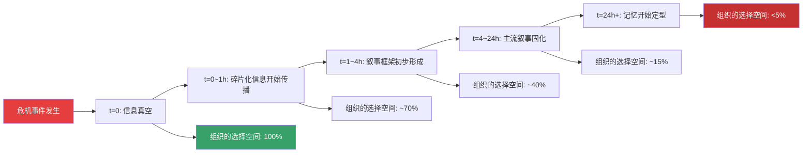
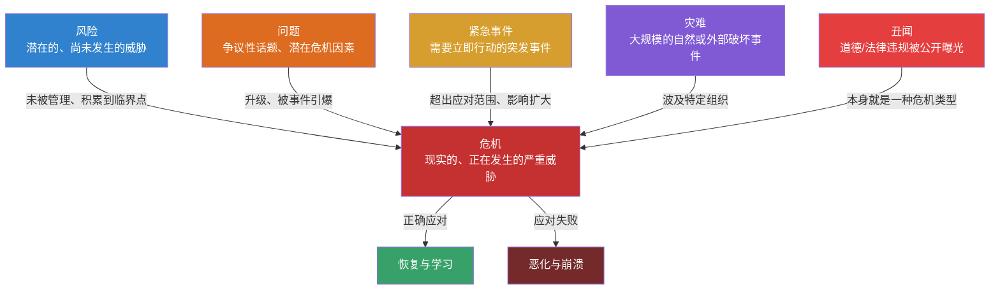
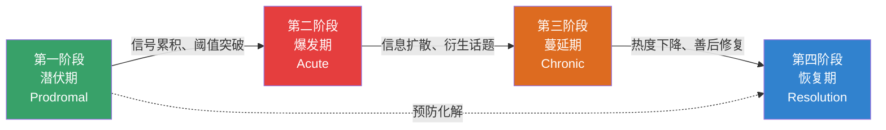

## 一、危机的定义与本质

理解危机是掌握危机沟通的第一步。很多人对危机的认知停留在"出了大事"这个层面，但这种直觉式的理解远远不够——它无法指导你在危机中做出正确的判断和决策。本节将从词源学、学术定义、核心属性、概念辨析和理论模型五个维度，系统构建对"危机"这一概念的完整认知框架。

### 1.1 "危机"的词源与概念演化

"危机"一词有两个独立的词源传统，它们从不同角度揭示了危机的本质特征。

**西方词源：希腊语 Krisis。** 英语"Crisis"源于希腊语"krisis"（κρίσις），原意为"决定""判断""转折点"。这个词最早被用于医学领域——古希腊医生希波克拉底用"krisis"来描述疾病发展的关键转折点：患者要么好转，要么恶化，没有中间状态。这个医学隐喻精确地揭示了危机的第一个本质特征：**危机是一个非此即彼的分水岭**，它迫使系统在两种截然不同的未来之间做出选择。

从医学进入政治学和社会学领域后，"krisis"的含义逐渐扩展。在修昔底德的《伯罗奔尼撒战争史》中，"krisis"被用来描述战争中的关键决策时刻。到了中世纪，这个词被基督教神学借用，指代"末日审判"——在终极意义上，危机就是对一个存在状态的最终裁决。这种"审判"和"裁决"的意象，为危机的现代含义奠定了基础：危机不仅是外部威胁，更是对一个组织或个人的内在品质和能力的全面检验。

**东方词源：汉语"危机"。** 中文"危机"由"危"和"机"两个字组成。"危"指危险、危害、危急；"机"在古汉语中有多个含义——机会、机关、机巧、关键。"危机"一词最早见于《晋书》："夫危机之发，不及掩耳。"这里的"危机"侧重于"危"的含义，强调突发性和紧迫性。

后世对"危机"的解读中，有一种广泛流传的说法——"危机=危险+机遇"（danger+opportunity）。这种解读在大众传播中极为流行，但需要注意的是，这是现代人对汉字结构的创造性阐释，而非严格的语义学分析。"机"字在古代汉语中确实有"机会"的含义，但它更原始的含义是"弩机"——一种触发装置，引申为"事物变化的关键节点"。因此，"危机"的本义更接近"危险的关键时刻"，而非简单的"危险+机遇"。

尽管如此，"危险中蕴含机遇"这个解读并非没有价值。从管理学角度看，危机确实可能成为组织变革和品牌升级的催化剂——前提是组织采取了正确的应对策略。强生公司在1982年泰诺投毒事件后的表现，就是"化危为机"的经典例证。

**现代学术定义的演进。** "危机"作为一个学术概念，其定义经历了从模糊到精确的演化过程。1970年代以前，学术界对危机的定义主要依赖直觉和经验描述。1972年，荷兰莱顿大学危机研究中心的乌里尔·罗森塔尔（Uriel Rosenthal）开始系统化危机研究，开启了危机管理的学术化时代。此后数十年间，不同学科的学者从各自角度给出了数十种定义，虽然表述各异，但都指向一组共同的核心特征。

### 1.2 危机的权威学术定义

理解危机的学术定义，不是为了背诵条文，而是为了获得一个精确的判断框架——当你面对一个复杂情境时，能够判断"这到底算不算危机"，以及"这个危机的严重程度如何"。

**赫尔曼（Hermann, 1963）的决策导向定义。** 查尔斯·赫尔曼（Charles Hermann）是最早对危机进行系统学术定义的学者之一。他在1963年的研究中将危机定义为："一种情境，它满足三个条件——(1)对组织高层的决策目标构成威胁；(2)在做出反应之前可供决策的时间有限；(3)事件的发生出乎决策者的意料。"

赫尔曼定义的核心贡献在于提出了危机的三维判断模型：**威胁性、紧迫性、意外性**。这个模型至今仍是判断一个事件是否构成危机的基础框架。如果一个事件只满足其中一个或两个条件，它可能是问题、风险或紧急事件，但不一定是危机。

**罗森塔尔（Rosenthal et al., 1989）的系统导向定义。** 乌里尔·罗森塔尔及其同事在1989年提出了更为全面的定义："危机是对社会系统的基本结构或核心价值观构成严重威胁的情境，该情境在高度不确定性和时间压力下，需要做出关键决策。"

罗森塔尔定义的突破在于将危机从组织层面扩展到社会系统层面，同时强调了危机对"基本结构"和"核心价值观"的威胁——这意味着危机不仅仅是运营层面的扰动，它可能动摇一个系统赖以存在的根基。

**巴顿（Barton, 1993）的利益相关者定义。** 劳伦斯·巴顿（Laurence Barton）将危机定义为："一个会对组织的员工、产品、服务、财务状况或声誉产生负面影响的重大事件，具有突发性、不确定性、对高层管理者造成压力、威胁到组织的目标和价值观、需要在信息不完整和时间紧迫的条件下做出决策等特征。"

巴顿定义的独特价值在于明确列举了危机的影响对象——员工、产品、服务、财务、声誉。这种列举方式为危机影响评估提供了具体的检查维度。

**芬克（Fink, 1986）的医学模型定义。** 史蒂文·芬克（Steven Fink）在他的经典著作《危机管理：对突发事件的规划》中，借用医学模型将危机定义为："组织生命周期中的一个决定性时刻，其结果可能是好转，也可能是恶化，取决于组织在这一时刻的应对质量。"

芬克的定义强调了危机的**结果不确定性**——危机不是确定的灾难，而是一个结果取决于组织行动的分叉点。这个定义直接支持了"危机即机遇"的管理理念。

**米特罗夫（Mitroff, 2005）的过程导向定义。** 伊恩·米特罗夫（Ian Mitroff）在长期研究后提出："危机不是单一事件，而是一个由多个阶段组成的过程，它从潜在威胁的识别开始，经历信号检测、预防准备、损害遏制、恢复重建，最终到达组织学习。"

米特罗夫的定义将危机从"点"扩展为"线"——危机不是一个瞬间的爆发，而是一个有生命周期的过程。这个视角对危机沟通的指导意义巨大：它意味着沟通策略必须随危机阶段的变化而动态调整。

**综合定义。** 综合上述权威定义，本书给出如下操作性定义：

> **危机是这样一个情境：它对组织（或个人）的核心利益——包括运营能力、财务状况、声誉资产、利益相关者关系——构成严重且即时的威胁，需要在时间压力和信息不完整的条件下做出关键决策，其应对质量将决定组织是走向恢复还是进一步恶化。**

这个定义的每个要素都有明确的判断标准：

| 定义要素 | 判断标准 | 不满足时的性质 |
|----------|----------|----------------|
| 严重威胁 | 可能导致重大财务损失、声誉损害、运营中断或法律后果 | 普通问题或日常风险 |
| 即时性 | 威胁在短期内（小时到天）就会造成实质性损害 | 长期风险或战略挑战 |
| 时间压力 | 无法等待完整信息再做决策，必须在有限时间内行动 | 常规决策情境 |
| 信息不完整 | 决策时无法获得所有相关事实，必须在不确定中行动 | 常规决策情境 |
| 结果不确定 | 应对质量直接决定结果走向，不是确定的灾难 | 已成定局的损失 |

### 1.3 危机的核心属性

理解危机的定义之后，需要深入理解危机的核心属性——这些属性决定了危机沟通的策略选择和执行方式。

**突发性与可预见性的辩证关系。** 危机通常被描述为"突发"的，但这个描述需要精确化。严格意义上的"完全突发"危机极为罕见——大多数危机在爆发前都有信号，只是这些信号被忽视、低估或误读。1986年挑战者号航天飞机灾难前，工程师多次警告O型环在低温下可能失效；2008年全球金融危机前，次贷市场的风险信号已经持续数年；2010年BP墨西哥湾漏油事件前，该钻井平台已经发生过多次安全事故。

更准确的说法是：**危机的爆发时机是突发的，但危机的根源往往是渐进积累的。** 这种"突发性表面"与"渐进性根源"的张力，对危机沟通有重要指导意义——它意味着有效的危机沟通不仅包括危机爆发后的应急响应，更包括危机爆发前的信号识别和预防沟通。

**不确定性与信息真空。** 危机中的不确定性是多维度的：事实不确定（到底发生了什么？影响范围有多大？）、因果不确定（为什么会发生？谁该负责？）、发展不确定（会不会进一步恶化？什么时候能控制住？）、应对不确定（哪种策略最有效？会不会产生副作用？）。

在信息不完整的情况下，组织面临一个根本性的沟通困境：**说错话的代价可能很大，但不说的代价更大。** 信息真空不会保持真空——它会被谣言、猜测、竞争对手的叙事和媒体的推测迅速填满。2023年的一项研究表明，在危机事件发生后的第一个小时内，社交媒体上流通的信息中只有约35%是经过验证的准确信息，其余65%包括未经证实的传言（28%）、错误信息（22%）和故意编造的虚假信息（15%）。

这意味着危机沟通的一个核心任务是：在信息不完整的情况下，以适当的方式填补信息真空——不是发布未经验证的信息，而是告诉公众"我们目前知道什么""我们正在做什么""我们什么时候会更新"。

**时间压力与黄金窗口。** 危机中的时间压力是单向递减的——每过一分钟，组织的选择空间就缩小一分。这种时间压力的根源在于信息传播的动态机制：

社交媒体时代将这个窗口进一步压缩。麻省理工学院斯隆管理学院2023年的研究显示，危机信息在社交媒体上的传播速度是传统媒体时代的6倍，有效响应时间从2010年的"黄金24小时"缩短到2025年的"黄金4小时"。在某些高度敏感的场景（如涉及儿童安全、食品安全的事件），这个窗口甚至更短——可能只有30分钟到1小时。

**破坏性与转化性的并存。** 危机具有破坏性是不言而喻的——它可能造成经济损失、声誉损害、人员伤亡、组织解体。但优秀的危机管理者知道，危机同时具有转化性：它可以暴露组织的深层问题，推动长期拖延的改革，增强组织的凝聚力，甚至提升品牌的公众形象。

关键在于，破坏性是自动发生的，而转化性需要主动创造。一个组织不会因为危机本身而变好——它会因为危机中的正确行动而变好。这就是为什么危机沟通如此重要：它是将破坏性转化为转化性的关键杠杆。

**多利益相关者的利益冲突。** 危机不是组织一个人的事。它同时涉及多个利益相关者群体，而这些群体的利益往往是相互冲突的：

| 利益相关者 | 核心关切 | 典型诉求 |
|-----------|----------|----------|
| 受害者/当事人 | 身体安全、财产损失、精神伤害 | 赔偿、道歉、真相 |
| 员工 | 工作安全、组织前景、个人声誉 | 信息透明、领导力、保障 |
| 客户/消费者 | 产品安全、服务连续性、个人信息 | 替代方案、补偿、承诺 |
| 投资者/股东 | 财务影响、长期价值、治理风险 | 量化影响、应对方案、时间表 |
| 媒体 | 新闻价值、公众知情权、信息来源 | 独家信息、采访机会、官方回应 |
| 监管机构 | 合规性、公共安全、行业秩序 | 事实报告、整改措施、配合调查 |
| 竞争对手 | 市场机会、行业声誉、监管连带 | 划清界限或趁机竞争 |
| 社区/公众 | 公共安全、环境影响、社会正义 | 透明度、责任感、实质行动 |

危机沟通的核心挑战在于：用一个统一的核心信息框架，同时回应这些不同甚至相互矛盾的利益诉求。你不能对消费者说"我们承担全部责任"，同时对投资者说"我们没有过失"——这种口径不一致会在社交媒体时代被瞬间曝光。

### 1.4 危机与相关概念的辨析

在日常工作和媒体报道中，"危机"经常与"紧急事件""问题""风险""灾难""丑闻"等概念混用。但这些概念在管理学中有明确的区别，准确辨析这些概念，是正确制定沟通策略的前提。

**危机与紧急事件（Emergency）。** 紧急事件是指需要立即采取行动的突发事件，但它有三个关键特征与危机不同：(1)影响范围通常是局部的——工厂某条生产线的故障是紧急事件，但不一定是危机；(2)有既定的应对程序——消防演习、医疗急救、设备抢修都有标准化的流程；(3)后果通常是可控的——紧急事件不会从根本上威胁组织的生存或声誉。

紧急事件可能升级为危机。当一个小型设备故障导致员工伤亡，当一次医疗急救暴露了医院的管理漏洞，当一场局部火灾引发了对消防安全的全面质疑——紧急事件就跨越了边界，演变成了危机。判断标准是：**如果事件的影响超出了既有应对程序的覆盖范围，可能对组织的声誉、运营或财务状况产生长期影响，它就是危机，而不仅仅是紧急事件。**

**危机与问题（Issue）。** 问题是可能发展为危机的潜在因素或争议性话题。问题的特点是：它处于公众关注的边缘，尚未对组织造成即时损害，但具有升级为危机的潜力。例如，行业内关于数据隐私的长期争论是一个问题；当某个特定企业的数据泄露事件引爆公众愤怒时，它就从"问题"升级为了"危机"。

从沟通角度看，问题管理（Issue Management）是危机预防的核心手段。有效的问题管理意味着在问题尚处于可控阶段时，通过主动沟通将其化解，防止其升级为危机。许多组织只关注危机爆发后的应对，却忽视了问题管理——这就像只在火灾后才检查消防设施，而不在平时消除火灾隐患。

**危机与风险（Risk）。** 风险是指未来可能发生负面事件的概率和影响的组合。风险是潜在的、尚未发生的；危机是现实的、正在发生的或即将发生的。风险可以被管理、转移、规避或接受；危机必须被应对、遏制和化解。

风险与危机的关系可以这样理解：**风险是危机的种子，危机是风险的爆发。** 有效的风险管理可以在危机发生前将其消灭；失败的风险管理则让风险积累到临界点，最终以危机的形式爆发。从沟通角度看，风险管理涉及的是对潜在威胁的预防性沟通（如安全提示、合规告知、风险披露），而危机沟通涉及的是对已发生威胁的应急性沟通。

**危机与灾难（Disaster）。** 灾难通常指由自然力量或不可抗力造成的大规模破坏性事件，如地震、海啸、大规模疫情。灾难的特点是：(1)破坏规模巨大；(2)通常不是任何特定组织的责任；(3)社会整体而非某个组织是受影响的主体。

灾难可能引发组织层面的危机。当一家企业在地震中厂房倒塌、员工伤亡，灾难就演变成了组织危机——公众会关注这家企业的建筑质量、安全管理和应急响应。组织在灾难中的沟通表现，决定了灾难是否会演变为更深层次的信任危机。

**危机与丑闻（Scandal）。** 丑闻是涉及道德或法律违规行为的负面事件被公开曝光。丑闻是危机的一种特殊类型，其独特之处在于：(1)涉及主观过错——至少在公众认知中，组织或个人犯了道德或法律上的错误；(2)公开性是核心特征——丑闻的"丑"在于被公开，很多违规行为在被曝光之前一直存在，但只有被曝光后才成为丑闻；(3)公众的道德审判是主要压力来源——丑闻引发的愤怒本质上是道德愤怒。

丑闻的沟通难度高于其他类型的危机，因为公众的关注焦点不是"发生了什么"而是"谁该被惩罚"。在这种情境下，技术性的解释（"这是系统故障""这是流程漏洞"）往往无效甚至适得其反——公众要的是道德层面的回应，而非技术层面的解释。

**概念辨析总结：**

### 1.5 危机的本质：四个维度的深层理解

超越表面定义，危机的本质可以从四个维度进行深层理解。这四个维度不是并列的，而是相互关联、层层递进的。

**维度一：系统失衡。** 危机的本质不是"坏事发生了"，而是组织与其环境之间的平衡被打破了。在正常状态下，组织与利益相关者、市场环境、监管体系、社会舆论之间维持着一种动态平衡。危机打破了这种平衡，将组织推入一个不稳定的、高能量的状态。

这个理解的实践意义在于：危机沟通的目标不是"让坏事消失"（这通常不可能），而是**恢复或重建平衡**——与利益相关者的信任平衡、与舆论环境的认知平衡、与监管体系的合规平衡。如果沟通目标设定错误（比如试图证明"其实没那么严重"），沟通行动就会偏离正确的方向。

**维度二：信任考验。** 危机是对组织与各利益相关者之间信任关系的终极考验。在日常运营中，信任是一种隐性的、不太被关注的资产。但危机将信任推到了聚光灯下——它像一次突击考试，检验组织在平时是否积累了足够的信任资本。

信任资本的积累是一个长期过程：每一次兑现承诺、每一次坦诚沟通、每一次负责任的行动，都在为信任账户"存款"。而危机是一次大规模的"取款"——公众会从信任账户中取出他们之前存入的信任。如果平时的信任积累不够，危机就会导致"信任破产"，即无论组织说什么、做什么，公众都不再相信。

这里有一个关键的不对称性：**信任的建立需要数年，信任的崩塌可能只需要一天，而信任的重建需要的时间甚至超过最初的建立。** 这意味着危机沟通的首要目标不是"解决问题"（虽然这也很重要），而是"保全信任"——因为信任是组织最脆弱也最有价值的资产。

**维度三：叙事竞争。** 每一场危机都会催生多个"故事版本"——受害者的版本、媒体的版本、竞争对手的版本、公众情绪构建的版本、组织自己的版本。这些版本在社交媒体上同时传播、相互竞争，最终形成一个主流叙事（Dominant Narrative），这个主流叙事将决定公众如何理解和记忆这场危机。

组织在危机中的沟通，本质上是一种叙事竞争——不是消灭其他版本（这既不可能也不明智），而是让组织自己的版本成为主流叙事的有机组成部分。这意味着组织的沟通不仅要"正确"（factually accurate），还要"可信"（emotionally believable）和"连贯"（narratively coherent）。

一个事实正确但叙事不连贯的回应，可能比一个事实略有偏差但叙事连贯的回应更糟糕。这不是在鼓励歪曲事实，而是在强调：**事实需要被编织进一个可信的叙事框架中，才能被公众接受。** 孤立的事实陈述在危机中是无效的——公众需要的是一条从"发生了什么"到"为什么发生"到"会怎样解决"的完整逻辑链。

**维度四：组织镜像。** 危机像一面放大镜，它不会创造问题，只会暴露问题。一个在危机中表现糟糕的组织，通常在日常运营中就已经存在深层问题——决策流程不畅、内部沟通断裂、风险管理缺失、企业文化病态。危机只是将这些问题以极端的方式暴露在公众面前。

这个理解的实践意义在于：**真正的危机管理不是在危机发生后采取行动，而是在日常运营中消除可能导致危机的系统性缺陷。** 一个健康的组织不会频繁面临危机——不是因为运气好，而是因为它的治理结构、风险文化和沟通机制能够将大多数潜在危机化解在萌芽阶段。

### 1.6 危机的生命周期：芬克四阶段模型

理解危机不能只看"爆发"这一个点——危机是一个有生命周期的过程。史蒂文·芬克（Steven Fink）在1986年提出的四阶段模型，是理解危机生命周期最经典的框架。

**第一阶段：潜伏期（Prodromal Stage）。** 危机的种子已经存在，但尚未被公众关注。这个阶段可能持续数天、数月甚至数年。潜伏期是危机管理的黄金窗口——在这个阶段，组织可以识别风险信号、评估潜在影响、制定应对预案、进行预防性沟通。遗憾的是，大多数危机管理失败的根源都在于潜伏期的忽视——组织要么没有建立信号识别机制，要么低估了已识别信号的严重性。

潜伏期的典型信号包括：客户投诉量的异常上升、媒体对相关话题的关注度增加、社交媒体上负面讨论的萌芽、监管机构的例行检查变得更加频繁、员工匿名论坛上的不满情绪增加。这些信号单独看可能都不构成"危机"，但它们的组合和趋势可能预示着一场危机正在酝酿。

**第二阶段：爆发期（Acute Stage）。** 危机进入公众视野，关注度急剧攀升。这个阶段的持续时间从数小时到数天不等，取决于危机的性质和组织的响应速度。爆发期是危机沟通的"生死线"——组织在这个阶段的初步回应，将很大程度上决定危机的后续走向。

爆发期的核心挑战是：在信息极度不完整的情况下快速做出回应。组织面临一个两难选择——过早回应可能导致信息错误（然后被质疑"你们当时说的是假的"），过晚回应则会导致信息真空被谣言填满（然后被质疑"你们为什么不第一时间回应"）。解决这个两难的策略是采用"渐进式信息披露"——先发布已确认的基本事实和组织态度，然后承诺持续更新。

**第三阶段：蔓延期（Chronic Stage）。** 危机信息广泛传播，衍生话题不断出现。这个阶段可能持续数周到数月。蔓延期的核心战场是信息管理——组织需要持续发布更新信息、回应公众关切、纠正不实信息、管理衍生话题。

蔓延期最容易出现的错误是"过早宣布胜利"——组织在危机初步得到控制后就放松警惕，结果衍生话题或新信息引发了危机的二次爆发。2017年美联航暴力拖拽乘客事件中，公司在最初的道歉声明发布后就认为危机已经过去，结果CEO的内部邮件被泄露（其中将责任推给乘客），引发了第二波更猛烈的舆论风暴。

**第四阶段：恢复期（Resolution Stage）。** 危机热度下降，组织进入善后和修复阶段。恢复期的核心任务不是"遗忘"，而是"学习"——系统复盘危机的全过程，提炼经验教训，修复受损的关系，重建组织的能力和声誉。

恢复期的持续时间最长——对于重大危机，声誉修复可能需要数年。研究表明，消费者对危机企业的负面印象在危机发生后的6个月内下降最快（约60%），但剩余的40%可能需要3-5年才能完全消除。这意味着危机沟通不是一次性事件，而是一个需要持续投入的长期工程。

### 1.7 危机中的沟通角色：不只是"说什么"

在结束本节之前，需要明确一个核心观点：**危机沟通不等于"在危机中说话"。** 它是一个涵盖信息管理、关系管理、叙事管理和决策支持的系统工程。

很多人将危机沟通理解为"危机中的对外发言"——写声明、开发布会、回应媒体提问。这些当然重要，但它们只是危机沟通的"冰山一角"。水面之下的部分包括：信息的收集与验证机制、内部团队的沟通协调、各利益相关者诉求的分析与平衡、沟通策略的制定与调整、舆情的实时监控与反馈、声明发布后的效果评估与迭代。

用一个比喻来说：如果危机是一场战争，那么对外发言只是战场上的枪声——真正决定胜负的是情报系统（信息管理）、指挥系统（决策流程）、后勤系统（资源调配）和宣传系统（叙事管理）。只关注"说什么"而忽视其他系统，就像一个只会开枪的士兵——他在一场完整的战争中几乎没有胜算。

这正是本章后续内容要系统展开的：从理论框架（道）到核心技巧（法）到实战案例（术）到常见误区（破）到练习方法（练），构建一个完整的危机沟通能力体系。而本节对危机定义与本质的理解，是整个体系的地基——地基不稳，上面的一切都是空中楼阁。
