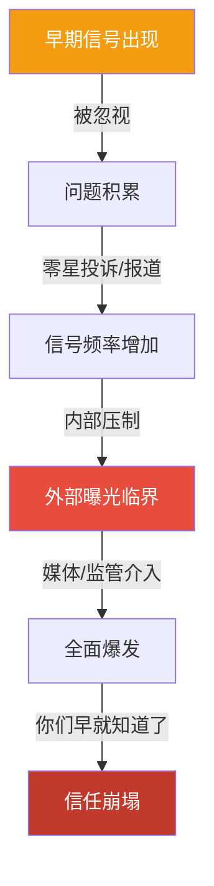
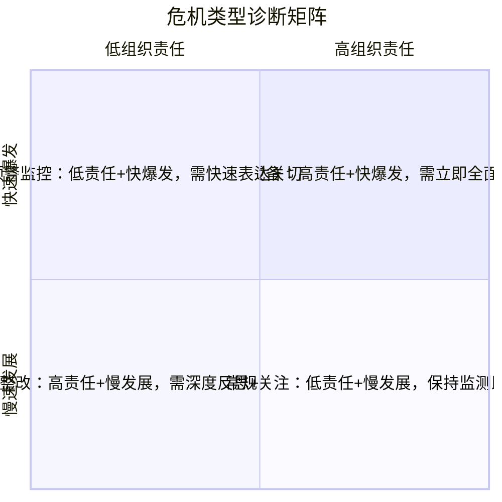

## 二、危机的类型划分

危机不是一种单一现象，而是一个复杂的谱系。不同类型危机的成因机制、演变路径、传播规律和应对策略截然不同。如果用同一套方法应对所有危机，就像用同一把钥匙开所有的锁——注定失败。科学的危机类型划分是制定精准沟通策略的前提。

本节从五个维度建立危机分类体系：来源、发展速度、影响领域、可预测性、利益相关方结构。每个维度都不是孤立的，实际危机往往同时具备多重属性。理解这些交叉属性，才能在危机来临时快速定位、精准施策。

### 2.1 按照危机来源分类

危机的来源决定了"谁该负责"这个核心问题，直接关系到危机沟通中的立场定位和话术策略。

#### 2.1.1 人为危机与自然危机

**人为危机**是由人类行为、决策失误或制度缺陷导致的危机。人为危机的核心特征是**可归责性**——公众会追问"谁该为此负责"。这使得人为危机在沟通层面远比自然危机复杂，因为组织不仅要应对危机本身，还要应对责任追究和信任修复的双重压力。

人为危机的典型子类型：

| 子类型 | 典型场景 | 沟通核心挑战 |
|--------|----------|-------------|
| 管理决策失误 | 战略误判、并购失败、盲目扩张 | 承认错误的时机与尺度 |
| 操作执行失误 | 工厂爆炸、医疗事故、建筑坍塌 | 系统性问题 vs 个案的定性 |
| 产品/服务缺陷 | 食品安全、药品副作用、汽车召回 | 召回范围和补偿方案的设计 |
| 恶意行为 | 商业间谍、内部破坏、高管犯罪 | 切割责任与组织连带的平衡 |
| 技术系统故障 | 数据泄露、算法歧视、AI失控 | 技术归因与人为监管的边界 |

经典案例：2010年BP墨西哥湾"深水地平线"钻井平台爆炸事故导致11人死亡、约490万桶原油泄漏入海。BP的危机沟通犯了三个致命错误：第一，CEO托尼·海沃德公开说"我想找回我的生活"，被公众解读为漠视受害者；第二，低估泄漏量，在信息透明度上反复失信；第三，将责任推给承包商Transocean和哈里伯顿，被舆论视为推卸责任。这场危机最终让BP付出了超过650亿美元的代价，其中相当一部分源于沟通失败带来的声誉损失和政治压力。

**自然危机**是由自然灾害、流行病、极端天气等自然因素引发的危机。自然危机的核心特征是**不可归责性**——通常没有明确的责任主体。但这并不意味着组织可以置身事外。恰恰相反，组织在自然危机中的表现（响应速度、资源投入、员工关怀、社区贡献）是其价值观和管理能力的试金石。

自然危机的关键区分：

- **纯自然灾害**：地震、洪水、台风等，组织角色是"受影响方+响应方"
- **公共卫生危机**：疫情、食品安全事件（非人为），涉及风险沟通的特殊性
- **复合型自然危机**：自然灾害触发次生灾害（如地震→核泄漏→福岛事件），责任边界模糊

经典案例：2020年新冠疫情期间，不同企业的沟通表现形成了鲜明对比。Zoom在用户暴增导致安全问题暴露后，CEO袁征迅速发布公开信承认不足、暂停功能开发专注安全修复、每周发布透明度报告，最终赢得了市场信任。而某些企业在疫情初期选择隐瞒员工感染信息，导致恐慌蔓延和法律风险。

**人为危机与自然危机的沟通策略差异：**

| 维度 | 人为危机 | 自然危机 |
|------|---------|---------|
| 核心立场 | 承担责任 + 整改方案 | 共同面对 + 积极应对 |
| 情感基调 | 谦卑、悔过、行动力 | 同理心、团结、希望 |
| 信息重点 | 事故原因 + 防止重演的措施 | 灾情信息 + 救援进展 |
| 利益相关方 | 受害者优先，监管方其次 | 公众安全优先，员工关怀并行 |
| 修复路径 | 制度重建 + 信任重建 | 恢复常态 + 社区贡献 |

#### 2.1.2 内部危机与外部危机

**内部危机**源自组织内部的人员、制度或运营问题。内部危机的特点是组织对信息有较强的掌控力——在危机公开之前，组织通常有"信息窗口期"可以主动处理。但一旦内部问题被外部曝光（尤其是被媒体或前员工曝光），其杀伤力会成倍放大，因为公众会追问"你们早就知道了为什么不处理"。

内部危机的典型形式：

- **人员层面**：高管腐败、性骚扰、歧视行为、核心团队集体出走
- **制度层面**：财务造假（如瑞幸咖啡）、合规违规、内部举报被压制
- **文化层面**：有毒职场文化、加班猝死、员工心理健康危机
- **技术层面**：内部数据泄露、代码后门、内部系统安全漏洞

**外部危机**源自组织外部环境的变化或冲击。外部危机的特点是组织对信息的掌控力弱，往往需要在信息不完整的情况下做出快速反应。外部危机的关键不在于"能不能阻止危机发生"（通常不能），而在于"能不能在危机中展现组织的韧性和价值"。

外部危机的典型形式：

- **市场层面**：竞争对手的恶意攻击、行业性丑闻的连带影响、消费者信任危机
- **政策层面**：监管政策突变、国际贸易制裁、行业准入门槛变化
- **供应链层面**：关键供应商断供、物流中断、原材料价格暴涨
- **舆论层面**：社交媒体舆论风暴、KOL/自媒体的负面报道、网络谣言

**内外危机的转化机制**值得注意：许多危机看似是外部触发，实则源于内部隐患。例如，产品质量问题被消费者曝光是外部危机，但根源在于内部品控体系的失败。危机沟通人员必须具备穿透表象、追溯内因的能力。

#### 2.1.3 按责任归属的精细分类

在实际操作中，"人为vs自然""内部vs外部"的二分法过于粗糙。借鉴学者Coombs的情境危机传播理论（SCCT），我们可以按**组织责任程度**将危机分为三大类：

1. **受害者集群（Victim Cluster）**：组织也是受害者，责任程度最低。包括自然灾害、谣言攻击、工作场所暴力等。沟通策略以同情为主，提供指导性信息。

2. **意外集群（Accidental Cluster）**：非故意行为导致的危机，责任程度中等。包括技术故障、产品缺陷（非故意）、谣言传播等。沟通策略以道歉+解释为主。

3. **可预防集群（Preventable Cluster）**：明知风险却未采取措施，或故意违规，责任程度最高。包括产品篡改、人为事故、管理层不当行为等。沟通策略必须包含全面道歉、补偿方案和制度重建承诺。

### 2.2 按照发展速度分类

危机的发展速度直接决定了组织的反应时间和沟通节奏。对速度的误判是危机管理中最常见的失误之一——把渐进危机当小事拖延，或在突发危机中反应过度。

#### 2.2.1 突发危机（Sudden Crisis）

突发危机是指在极短时间内（通常数分钟到数小时）突然爆发的危机，组织几乎没有预警时间。突发危机的核心特征是**时间压力**——决策者必须在信息高度不完整的情况下快速做出判断和行动。

突发危机的典型场景：

- **安全事故**：工厂爆炸、建筑坍塌、交通事故、航空事故
- **自然灾害**：地震、台风、洪水等突发自然灾害
- **网络安全事件**：DDoS攻击、勒索软件、大规模数据泄露
- **产品安全事件**：食品安全事故、药品严重不良反应、产品致伤致死
- **公共安全事件**：恐怖袭击、群体性事件、重大刑事案件

突发危机对沟通的特殊要求：

1. **黄金时间窗口极短**：社交媒体时代，危机信息在15分钟内就能形成传播浪潮。组织必须在1-2小时内发布第一份声明。
2. **信息不完整是常态**：不要等到所有事实都查清才发声。在事实不清时，可以先表达关切、说明正在调查、公布已采取的安全措施。
3. **指挥体系必须预先建立**：危机来临时再临时组建团队为时已晚。每个组织都应有预案明确的危机指挥架构和发言人制度。

突发危机的"黄金四小时"沟通节奏：

| 时间段 | 行动 | 目标 |
|--------|------|------|
| 0-1小时 | 内部确认事实，启动危机小组 | 信息收集和初步判断 |
| 1-2小时 | 发布第一份声明（关切+行动+后续） | 控制叙事权 |
| 2-4小时 | 召开媒体沟通会或发布详细通报 | 提供实质性信息 |
| 4-12小时 | 持续更新，回应关键质疑 | 维持信息透明度 |
| 12-24小时 | 发布全面调查进展和后续计划 | 建立长期信任基础 |

#### 2.2.2 渐进危机（Smoldering Crisis）

渐进危机（又称潜伏危机、慢燃危机）是由长期积累的问题逐步发展而成的危机。在正式爆发前，通常有一个较长的潜伏期（数周、数月甚至数年），期间会反复出现早期信号或征兆，但这些信号往往被管理层忽视、淡化或掩盖。

渐进危机的可怕之处在于**温水煮青蛙效应**：每一个单独的信号看起来都不够严重，不足以触发危机管理机制；但当所有信号叠加到临界点时，危机的爆发往往比突发危机更具破坏力，因为它叠加了"长期隐瞒"的道德负债。

渐进危机的典型演变路径：

渐进危机的典型场景：

- **合规风险累积**：长期违规经营，监管处罚的累积效应最终引发系统性风险。例如，某企业长期在环保指标上打擦边球，当公众环保意识提升和监管趋严时，旧账被一并清算。
- **文化问题积压**：长期存在的职场文化问题（如性别歧视、加班文化）在某一个触发事件后全面爆发。例如，2021年某互联网企业员工在内网发布性骚扰指控，引爆了长期积压的职场文化讨论。
- **产品质量隐患**：产品缺陷的投诉量缓慢上升，企业未予重视，直到一起严重事故引发连锁反应。
- **利益相关方不满**：长期忽视社区诉求、消费者反馈或投资者关切，不满情绪逐步积累。

渐进危机的预警信号识别：

| 信号类型 | 具体表现 | 识别方法 |
|---------|---------|---------|
| 投诉趋势 | 同类投诉量持续上升 | 客诉数据月度分析 |
| 员工情绪 | Glassdoor评分下降、离职率上升 | 员工满意度调查、离职面谈 |
| 媒体关注 | 行业媒体出现负面报道 | 舆情监测系统 |
| 监管动态 | 监管问询增多、合规检查频率上升 | 法务团队定期汇报 |
| 社交媒体 | 社交平台出现零星负面讨论 | 社交聆听工具 |

**渐进危机与突发危机的对比：**

| 维度 | 突发危机 | 渐进危机 |
|------|---------|---------|
| 预警时间 | 极短或没有 | 有较长潜伏期 |
| 信息完整性 | 初期信息高度不完整 | 潜伏期内信息可逐步收集 |
| 公众预期 | 允许初期信息不完整 | 不允许——公众质疑"你们早就该知道" |
| 沟通难度 | 时间压力大，但公众较宽容 | 道德负债重，信任修复更难 |
| 管理重点 | 应急响应速度 | 预警机制和信号识别能力 |
| 事后追责 | 侧重应急机制是否到位 | 侧重为什么忽视早期信号 |

#### 2.2.3 周期性危机

还有一类常被忽视的危机类型——**周期性危机**，即在可预测的时间节点反复出现的危机。例如，每年夏季的食品安全问题高发期、财报季的业绩质疑、节假日的消费投诉高峰等。周期性危机的特殊价值在于：既然可以预见，就应该有预案。如果一个组织反复在同一个类型的危机上手忙脚乱，说明其危机管理体系存在根本性缺陷。

### 2.3 按照影响领域分类

危机的影响领域决定了沟通的重点对象、信息内容和修复策略。一场危机往往不止影响一个领域，但通常有一个主导领域。

#### 2.3.1 声誉危机

声誉危机直接影响组织的品牌形象和公众信任。声誉是组织最脆弱的无形资产——建立需要数年甚至数十年，摧毁可能只需要一条推文。声誉危机的核心挑战在于：品牌形象本质上是公众的感知和情感，而非客观事实。即使组织在事实上没有过错，如果公众感知到的是负面的，危机就已经发生。

声誉危机的典型触发因素：

- **产品质量问题**：产品不达预期、出现安全隐患、虚假宣传被揭穿
- **企业社会责任争议**：环境污染、劳工权益侵犯、社区关系恶化
- **领导层言行失当**：不当言论、道德丑闻、政治争议表态
- **价值观冲突**：品牌立场与目标消费群体价值观冲突（如ESG争议）

声誉危机的特殊性在于**非对称性**：受损声誉的修复成本远高于建立成本。研究表明，负面事件对品牌信任的冲击力度是正面事件建立信任的3-5倍。这意味着声誉危机的沟通不能仅停留在"灭火"层面，还需要长期、系统性的信任重建计划。

#### 2.3.2 运营危机

运营危机影响组织的正常运转能力。与声誉危机不同，运营危机的核心问题不是"别人怎么看我们"，而是"我们还能不能正常运转"。运营危机的沟通重点是保证关键信息的及时传递，确保员工、客户、合作伙伴等核心利益相关方了解情况并做出相应调整。

运营危机的典型场景：

- **供应链中断**：关键供应商破产、物流通道受阻、原材料短缺（如2021年全球芯片短缺）
- **核心设施故障**：数据中心宕机、工厂停产、物流网络瘫痪
- **人力资源危机**：大规模员工罢工、核心团队集体离职、关键技术人才流失
- **自然灾害影响运营**：台风导致工厂停产、疫情导致门店关闭

运营危机沟通的核心原则：**透明 + 替代方案**。单纯告知"我们出了问题"远远不够，必须同时告知"我们正在做什么来解决问题"以及"在此之前你可以怎么办"。

#### 2.3.3 财务危机

财务危机影响组织的资金状况和投资者信心。财务危机的沟通具有高度敏感性——不当的信息披露可能加剧市场恐慌，而隐瞒信息则可能构成证券欺诈。财务危机沟通必须在法务团队的深度参与下进行，确保信息的准确性、完整性和合规性。

财务危机的典型形式：

- **流动性危机**：资金链断裂、债务违约、银行抽贷
- **财务造假**：虚增收入、隐瞒负债、关联交易（如安然事件、瑞幸咖啡）
- **投资失败**：重大投资亏损、衍生品交易巨亏、商誉减值
- **信用评级下调**：评级机构降级引发的连锁反应

#### 2.3.4 法律危机

法律危机涉及法律诉讼、监管处罚和合规风险。法律危机沟通的核心矛盾在于**法律策略与沟通策略的冲突**：法务团队倾向于"少说多做"以避免法律责任，而沟通团队倾向于"主动透明"以维护公众信任。危机领导者需要在两者之间找到平衡。

法律危机的沟通框架：

1. **确认已进入法律程序的事实**（不涉及实质内容）
2. **表达对法治程序的尊重和配合态度**
3. **强调组织的合规承诺和已采取的措施**
4. **在法律允许范围内回应公众关切**
5. **避免任何可能被解读为认罪或妨碍司法的表述**

#### 2.3.5 技术危机

随着数字化转型的深入，技术危机已经成为当今最高频的危机类型之一。技术危机的特殊性在于其**技术门槛**——公众通常不理解技术细节，因此容易产生恐慌和误解。技术危机沟通的核心任务是将技术问题"翻译"为公众可理解的语言，同时避免过度简化导致的误导。

技术危机的典型形式：

- **数据泄露**：用户个人信息、支付数据、医疗记录等敏感数据被窃取或泄露
- **系统宕机**：核心服务不可用，影响海量用户
- **算法失当**：推荐算法放大有害内容、AI决策产生歧视性结果
- **网络安全攻击**：勒索软件、供应链攻击、APT攻击

数据泄露的沟通特殊要求：必须在法律规定的时间窗口内通知受影响用户（如欧盟GDPR要求72小时内报告监管机构），必须清楚说明哪些数据被泄露、可能的风险、用户应采取的防护措施。模糊的"我们高度重视数据安全"式声明只会加剧公众愤怒。

#### 2.3.6 人力资源危机

人力资源危机与组织内部的人员管理直接相关。在社交媒体时代，员工拥有前所未有的发声渠道，内部问题随时可能被外部化。人力资源危机的沟通必须在保护员工隐私和回应公众关切之间找到平衡。

典型场景包括：高管性骚扰或不当行为曝光、大规模裁员引发的舆论风暴、职场歧视投诉、加班文化引发的公共讨论、员工自杀或猝死事件。

### 2.4 按照可预测性分类

可预测性决定了组织的准备空间和沟通预案的完善程度。

#### 2.4.1 可预见危机

可预见危机是有明确预警信号、历史先例或行业规律的危机。可预见危机的核心管理逻辑是**预案先行**——既然知道可能发生，就应该在危机发生前完成沟通方案的制定、审批和演练。

可预见危机的三个层次：

1. **高概率已知风险**：几乎确定会发生，只是时间和规模不确定。例如，消费品企业的产品召回、互联网企业的数据安全事件。
2. **中概率行业风险**：在行业内有先例，本组织尚未发生但存在隐患。例如，竞争对手遭遇过的监管调查。
3. **低概率高影响风险（灰犀牛）**：显而易见却被忽视的重大风险。米歇尔·渥克在《灰犀牛》一书中指出，大多数危机不是黑天鹅，而是灰犀牛——它们就在那里，人们却视而不见。

可预见危机的沟通准备清单：

- 预设声明模板（不同场景、不同严重程度）
- 预先确定的发言人和授权机制
- 利益相关方联络清单（媒体、监管、合作伙伴）
- 内部沟通渠道和流程
- 定期演练和更新机制

#### 2.4.2 不可预见危机

不可预见危机是完全没有预警或超出组织认知框架的危机。不可预见危机（真正的"黑天鹅"事件）虽然罕见，但其破坏力极大，因为它击中了组织最脆弱的盲区。

应对不可预见危机的核心不是预案（因为无法预见就无法预设），而是**通用危机能力**：

- **决策框架的灵活性**：指挥体系能否在意外情境下快速适应
- **信息基础设施的韧性**：通信系统能否在非常态下正常运转
- **组织文化的适应性**：员工是否有主动上报异常、灵活应变的意识和能力
- **沟通团队的应变素质**：是否具备在零预案情况下快速组织语言、稳定舆论的能力

### 2.5 按照利益相关方结构分类

这个维度在传统危机分类中较少被提及，但对危机沟通策略的制定至关重要。危机涉及的利益相关方结构不同，沟通的复杂度和策略选择截然不同。

#### 2.5.1 双方型危机

危机主要涉及两个明确的主体，如企业与消费者、企业与员工。双方型危机的沟通相对简单——聚焦核心对手方，明确诉求和回应即可。

#### 2.5.2 多方型危机

危机涉及多个利益相关方，且各方诉求可能相互矛盾。例如，一起化工厂爆炸事故同时涉及：受害者家属（要求赔偿）、周边居民（要求安全承诺）、政府监管部门（要求调查配合）、媒体（要求信息公开）、投资者（要求损失评估）、员工（要求就业保障）。多方型危机的沟通需要**分众策略**——对不同利益相关方使用不同的话术、渠道和节奏，同时保持信息的一致性。

#### 2.5.3 社会型危机

危机已经超越组织边界，成为社会公共议题。此时，组织只是危机中的一个节点，媒体、公众、意见领袖、监管机构等都在参与叙事建构。社会型危机的沟通需要认识到：**你无法控制叙事，只能影响叙事**。试图压制信息或垄断话语权的做法几乎必然适得其反。

### 2.6 危机类型的交叉分析

实际危机很少是单一类型的。一场危机往往同时具有多重属性，这些属性的组合决定了危机的复杂度和应对难度。

**高危组合示例：**

| 组合 | 示例 | 为何特别危险 |
|------|------|-------------|
| 人为 + 可预见 + 渐进 | 长期忽视的安全隐患最终导致事故 | 道德负债最重——"明知故犯" |
| 技术 + 突发 + 多方型 | 大规模数据泄露影响海量用户 | 技术复杂度+舆论压力+法律风险叠加 |
| 人为 + 突发 + 社会型 | 企业高管不当言论引发全网声讨 | 叙事失控速度快，修复周期极长 |
| 自然 + 突发 + 运营 | 地震导致工厂停产+供应链中断 | 多线作战，资源极度紧张 |

**危机类型快速诊断矩阵：**

当危机发生时，危机沟通团队应迅速完成以下四个维度的诊断，以确定沟通策略的基本方向：

### 2.7 常见误区与纠正

**误区一："自然危机不需要太紧张"**

纠正：自然危机虽然组织不承担直接责任，但组织在危机中的表现会被放大检视。2011年泰国洪灾期间，西部数据的硬盘工厂被淹，其供应链危机沟通的透明度和效率直接影响了客户关系和市场份额。自然危机不是"不需要沟通"，而是沟通的重心从"认错道歉"转向"积极应对+关怀表达"。

**误区二："渐进危机可以再等等"**

纠正：这是最致命的误区。渐进危机的每一分每一秒的拖延，都在增加危机爆发时的道德负债。当第一个预警信号出现时，就应该启动评估程序。等到信号足够多、足够明确再行动，就错过了最佳干预窗口。

**误区三："技术危机应该让技术人员去沟通"**

纠正：技术团队负责解决问题，但面向公众的沟通必须由专业沟通人员负责。技术人员容易陷入专业术语，无法将信息翻译为公众可理解的语言。最好的做法是技术人员提供事实，沟通人员翻译为面向不同受众的信息。

**误区四："危机分类只在学术上有用"**

纠正：危机分类直接决定沟通策略。对突发危机和渐进危机使用相同的沟通节奏，对人为危机和自然危机采用相同的立场定位，结果一定是灾难性的。分类不是为了做学问，而是为了做对决策。

### 2.8 本节小结

危机的类型划分不是学术分类游戏，而是实战决策工具。掌握五维分类体系（来源、速度、领域、可预测性、利益相关方结构），能够在危机发生的最初几分钟内完成快速诊断，为后续的沟通策略制定奠定基础。关键原则：

1. **分类要快**：危机爆发后的前30分钟内完成初步类型判断
2. **分类要准**：不要被表面现象误导，追溯根本来源
3. **分类要全**：从多个维度同时审视，识别交叉属性
4. **分类要活**：危机是动态的，类型判断需要随事态发展不断修正

一个实用的训练方法是建立**危机案例库**——收集行业内和跨行业的危机案例，逐一进行五维分类标注，形成组织的危机知识资产。当真正的危机来临时，快速检索类似类型的案例，借鉴其沟通策略的成败经验，远比从零开始思考要高效得多。
