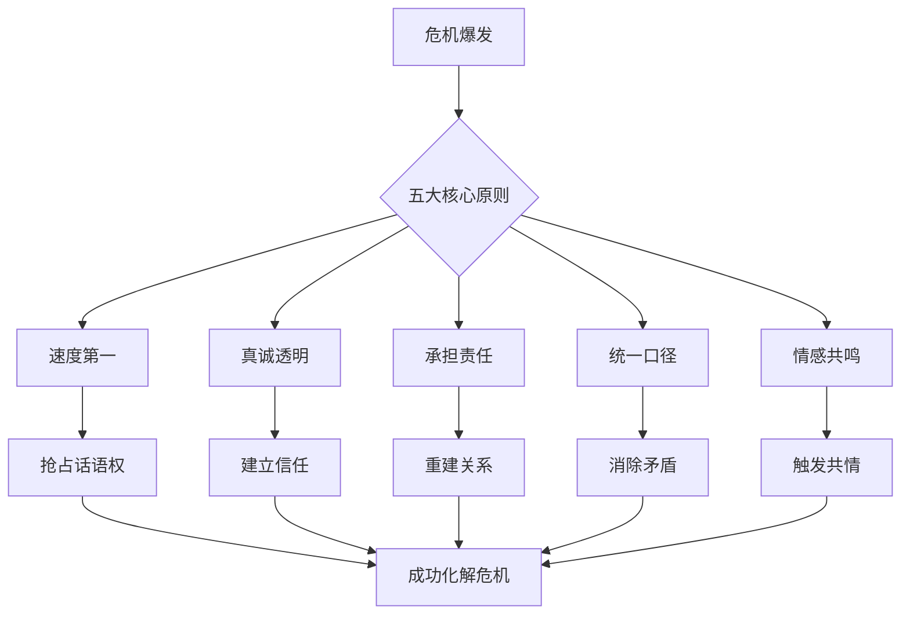

## 三、危机沟通的核心原则

危机沟通不是日常沟通的加速版，而是一种完全不同的沟通范式。当组织面临危机时，公众的注意力高度集中，情绪高度敏感，信息传播速度呈指数级放大。在这样的环境下，沟通的每一个细节——用词选择、发布时机、表达姿态——都可能决定危机是被化解还是被升级。

危机沟通的五大核心原则——**速度第一、真诚透明、承担责任、统一口径、情感共鸣**——构成了危机沟通的基本行为准则。这五大原则并非彼此独立，而是相互支撑、缺一不可。速度解决信息真空问题，真诚解决信任问题，责任解决态度问题，口径解决一致性问题，情感解决共情问题。五者共同构成一个完整的危机沟通框架。



### 3.1 速度第一原则

#### 3.1.1 为什么速度是第一原则

在危机情境下，时间就是最宝贵的资源。速度第一原则要求组织在危机爆发后迅速做出回应，抢占信息发布的话语权。这一原则的核心逻辑是：**信息真空一定会被填满，问题只在于由谁来填满。**

如果组织不主动发声，媒体、自媒体、竞争对手、不满的消费者都会成为信息的提供者。而这些外部信息源往往带有偏见、猜测甚至恶意，一旦形成舆论定势，组织再想纠正就事倍功半。

#### 3.1.2 黄金时间窗口

研究表明，危机爆发后的前4-6小时是决定危机走向的关键时期。在社交媒体时代，这一窗口进一步缩短至1小时以内。

| 时代背景 | 黄金窗口 | 信息传播特征 | 组织应对要求 |
|----------|----------|-------------|-------------|
| 传统媒体时代（2000年前） | 24-48小时 | 信息通过报纸/电视传播，有编辑审核环节 | 次日回应即可 |
| 门户网站时代（2000-2010） | 6-12小时 | 信息在线发布，传播速度加快 | 当天回应 |
| 社交媒体时代（2010-2020） | 1-4小时 | 微博/微信即时传播，人人都是信息源 | 数小时内回应 |
| 短视频/直播时代（2020至今） | 30分钟-1小时 | 现场直播、短视频裂变传播，实时化 | 分钟级响应 |

在黄金时间窗口内，组织需要发布初步声明，表明对事件的关注和重视，即使此时还无法提供完整的信息。这个初步声明不需要面面俱到，但必须包含三个要素：**已知事实、正在采取的行动、后续信息的发布计划。**

#### 3.1.3 快速回应的实际价值

快速回应的价值体现在四个方面：

**第一，遏制谣言传播。** 快速回应能够有效遏制谣言的传播，填补信息真空。心理学中的"首因效应"表明，人们倾向于接受最先获得的信息作为判断的基础。如果谣言率先占据了公众的认知，后续的澄清就需要付出数倍的努力。

**第二，传递积极信号。** 向利益相关者传递"组织正在积极应对"的信号。这种信号本身就具有安抚作用——公众不一定要求你立刻解决问题，但他们需要知道你已经行动起来了。

**第三，掌握叙事主动权。** 率先发声意味着定义问题的框架。是"产品质量事故"还是"个别批次异常"，是"数据泄露"还是"安全事件升级"，措辞和框架的选择将影响整个舆论走向。

**第四，为后续沟通留出空间。** 第一时间的回应只需要表明态度和立场，后续可以分阶段补充信息。如果错过了第一时间，后续的所有沟通都会被放在"为什么现在才说"的质疑框架下审视。

相反，沉默或迟缓的回应会被公众解读为组织的漠视、无能或心虚。

#### 3.1.4 速度与准确性的平衡

速度第一并不意味着牺牲信息的准确性。这是一个常见的误区。在信息不完整的情况下，组织可以发布"阶段性声明"（也称"阶梯式回应"），其结构如下：

**阶段一：第一时间回应（0-1小时）**
我们已经注意到[事件描述]，对此高度重视。我们正在全力核实相关情况，
并已启动应急响应机制。我们将在[具体时间]发布进一步信息。
对于给[受影响群体]带来的不安，我们深表歉意。

**阶段二：事实通报（2-6小时）**
关于[事件]的最新情况通报：
1. 已确认事实：[列出已确认的信息]
2. 正在调查：[列出仍在核实的信息]
3. 已采取措施：[列出已执行的行动]
4. 下一步计划：[列出后续安排]
我们将在[具体时间]或有重大进展时更新信息。

**阶段三：全面回应（12-24小时）**
关于[事件]的全面调查报告：
1. 事件经过：[完整时间线]
2. 原因分析：[根本原因]
3. 影响评估：[受影响范围和程度]
4. 解决方案：[具体补救措施]
5. 预防措施：[长效机制]

**关键原则：在不确定时说"我们不知道"，在确定时给出事实。** 永远不要为了速度而编造信息——一次不实声明造成的信任损失，远大于延迟回应的代价。

#### 3.1.5 建立快速响应机制

速度不是临场发挥的结果，而是体系化建设的产物。一个有效的快速响应机制包含：

**预警监测系统。** 部署舆情监测工具，对社交媒体、新闻网站、论坛、投诉平台等渠道进行7×24小时监测。设置关键词预警阈值，当负面信息达到一定量级时自动触发预警。常用的监测工具包括：百度舆情、新榜、清博大数据、鹰眼速读等。技术团队可以通过API接入实现自动化告警。

**预设响应模板。** 针对不同类型的危机（产品质量、安全事故、数据泄露、高管丑闻、员工不当行为等），提前准备响应模板。模板只需填充关键事实即可发布，将响应时间从小时级压缩到分钟级。

**分级响应机制。** 根据危机的严重程度设定不同的响应级别和对应的决策权限。轻微事件由公关团队直接处理，中等事件需要分管领导审批，重大事件由最高管理层直接参与。

| 危机级别 | 判断标准 | 响应时间要求 | 决策层级 | 首次回应形式 |
|----------|---------|------------|---------|-------------|
| 一级（轻微） | 局部投诉，未进入公共舆论 | 4小时内 | 部门主管 | 客服一对一回应 |
| 二级（一般） | 社交媒体小范围讨论 | 2小时内 | 公关总监 | 官方声明 |
| 三级（严重） | 主流媒体关注，话题上热搜 | 1小时内 | 副总裁以上 | 新闻发布会 |
| 四级（重大） | 全网关注，监管介入 | 30分钟内 | CEO/董事长 | 公开信+发布会 |

### 3.2 真诚透明原则

#### 3.2.1 真诚透明的心理学基础

真诚透明是危机沟通中赢得信任的基石。这一原则的理论基础来自信任修复理论（Trust Repair Theory）——在危机中，公众对组织的信任处于脆弱状态，任何隐瞒、欺骗或闪烁其词都可能造成不可挽回的信任损失。

心理学研究表明，信任的建立是一个缓慢的积累过程，但信任的崩塌可以在瞬间发生。更关键的是，信任的修复比初次建立需要付出数倍的努力。这意味着在危机沟通中，每一次不真诚的表达都可能产生长期的负面影响。

公众对组织的信任包含两个维度：**能力信任**（相信组织有能力解决问题）和**善意信任**（相信组织的出发点是好的）。危机沟通的目标是在两个维度上同时修复和维护信任。

#### 3.2.2 信息透明的三个层次

信息透明不是"把所有信息都公开"，而是在合法合规的前提下，尽可能向公众披露与危机相关的信息。它包含三个层次：

**事实透明：** 披露危机的基本事实，包括发生了什么、何时发生、影响范围有多大、已造成什么后果。事实透明的核心是"不隐瞒已知事实"。

**过程透明：** 披露组织正在做什么，包括调查进展、决策过程、采取的措施。过程透明让公众看到组织在积极应对，而不仅仅是口头承诺。

**决策透明：** 披露组织做出关键决策的理由和依据。例如，为什么选择召回而非维修，为什么选择A方案而非B方案。决策透明帮助公众理解组织的思考逻辑，减少误解和猜疑。

#### 3.2.3 态度真诚的具体表现

态度真诚不是一句口号，它体现在危机沟通的每一个细节中：

**承认问题的存在，不回避、不淡化危机的严重性。** 例如，说"我们对此事件深表关切"远好于"此事件影响有限"。淡化问题会被公众视为傲慢和不负责任。

**使用真诚、朴实的语言与公众沟通。** 避免官僚化、模板化的表达方式。"我们正在积极调查"远不如"我们已经派出技术团队赶赴现场，预计今晚22点前查明原因"来得真诚。

**拒绝"技术黑话"和"法律话术"。** 例如，用"我们的产品出了问题"而不是"部分批次产品存在规格偏差"，用"我们做错了"而不是"未能达到预期标准"。

#### 3.2.4 坦诚不确定性

对于尚不确定的信息，坦诚地告知公众"我们正在调查中"，而不是编造解释或做出无法兑现的承诺。公众对不确定性的接受度远高于对欺骗行为的容忍度。

在实践中，坦诚不确定性可以这样表达：

关于事故原因，目前我们掌握了以下信息：[已知事实]。
但我们还需要[需要进一步调查的内容]才能得出最终结论。
我们承诺将在[时间]公布完整调查报告。在此之前，
我们不会对事故原因做任何猜测性判断。

这种表达方式的巧妙之处在于：它既展示了坦诚，又体现了专业和严谨——不轻易下结论本身就是一种负责任的态度。

#### 3.2.5 透明的边界

透明不等于无限制的信息公开。以下情况需要谨慎处理：

- **法律限制：** 正在进行的司法调查、法院禁止披露的信息
- **隐私保护：** 受害者的个人信息、未成年人信息
- **安全考量：** 涉及公共安全的技术细节（如安全漏洞的具体利用方法）
- **商业机密：** 与危机相关但属于商业机密的信息

在这些边界上，组织应明确告知公众"因XX原因暂时无法披露"，而不是简单地沉默或回避。

### 3.3 承担责任原则

#### 3.3.1 承担责任与承担法律责任的区别

在危机沟通中，勇于承担责任是重建信任的关键一步。这里需要明确一个重要区分：**承担责任不等于承担所有法律责任。** 承担责任是指组织应当展现出对问题的正视和对受影响者的关怀，是一种道义上的担当。

许多组织在危机中的第一反应是"划清责任界限"或"推卸责任"，这在法律上可能是审慎的，但在公共关系上往往是灾难性的。公众不关心你的法律团队怎么想，他们关心的是：你是否在乎受害者的感受，你是否愿意为此做出补偿。

#### 3.3.2 主动担责的时机和方式

在危机初期就表明组织对问题的重视和对受影响者的关心。即使危机的全部责任尚不明确，组织也可以就"给公众造成了困扰和不安"表示歉意。

主动担责的时机选择：

- **危机爆发后0-2小时：** 表达关切和歉意，不急于界定责任
- **初步调查完成后（6-24小时）：** 承认组织方面的不足和失误
- **全面调查完成后（数天至数周）：** 明确具体责任归属和补偿方案

主动担责的表达公式：

[对事件的定性] + [对受影响者的歉意] + [承认组织的不足] + [具体的补救行动]

示例：
> "此次产品质量事故是我们不可推卸的责任。我们对因此受到伤害的消费者深表歉意。
> 我们在[具体环节]的管理存在疏漏，这暴露了我们在质量管控体系上的不足。
> 我们已经[具体补救措施]，并将[具体长期改进方案]。"

#### 3.3.3 对内对外一致

承担责任不仅体现在对外声明中，也体现在组织内部的态度和行动上。如果组织对外表达歉意，但内部却在寻找替罪羊或推卸责任，这种不一致终将被公众识破。

内部一致性的关键动作：

1. **第一时间统一内部认知。** 在对外发声前，先对内通报，让全体员工理解组织的立场和态度。
2. **建立内部沟通纪律。** 明确哪些信息可以对外分享，哪些需要保密。禁止员工在社交媒体上擅自发表与危机相关的个人观点。
3. **内部复盘而非追责。** 在危机应对期间，将重点放在解决问题而非惩罚个人。危机过后再进行系统性复盘和追责。

#### 3.3.4 区分道义责任与法律责任

在危机沟通中，组织需要区分道义上的责任和法律上的责任。道义上主动承担责任有助于赢得公众的谅解，但在法律层面仍需谨慎行事，必要时寻求法律专业人士的指导。

| 维度 | 道义责任 | 法律责任 |
|------|---------|---------|
| 判断标准 | 社会道德期望 | 法律条文规定 |
| 表达方式 | 情感化、人性化 | 严谨、准确 |
| 典型用语 | "我们深感痛心""我们做错了" | "经调查确认""依据XX法第X条" |
| 时效要求 | 越快越好 | 视法律程序而定 |
| 承担方式 | 道歉、关怀、主动补偿 | 赔偿、处罚、整改 |

**最佳实践：** 法律团队参与危机沟通方案的制定，但不应主导危机沟通的基调。让法律团队审核措辞的合规性，但不要让法律思维主导整个沟通策略。

### 3.4 统一口径原则

#### 3.4.1 为什么统一口径如此重要

在危机期间，组织对外发布的信息必须保持一致和统一，避免因不同渠道、不同人员发布矛盾信息而导致公众困惑和不信任。信息的不一致会被放大为"组织内部混乱""管理层互相推诿"的信号，严重损害组织的公信力。

在社交媒体时代，信息的不一致几乎一定会被发现。网民会截取不同渠道的声明进行对比，任何细微的差异都会被截图传播、引发质疑。一个"我们已全面召回"和"我们正在评估召回范围"之间的差异，就可能成为新一轮舆论风暴的起点。

#### 3.4.2 建立发言人制度

指定专门的危机发言人，统一负责对外信息的发布。其他人员未经授权不得擅自对外发布与危机相关的信息。

**发言人选择标准：**

- 具备足够的权威性，能够代表组织做出承诺
- 具备良好的媒体应对能力和临场应变能力
- 对危机事实有充分了解，能够回答技术性问题
- 性格沉稳，不情绪化，能够在高压下保持冷静

**发言人层级匹配：**

| 危机级别 | 发言人 | 陪同人员 |
|----------|--------|---------|
| 一级（轻微） | 客服/公关经理 | — |
| 二级（一般） | 公关总监 | 技术负责人 |
| 三级（严重） | 副总裁/CEO | 法务+技术负责人 |
| 四级（重大） | CEO/董事长 | 全体高管团队 |

**非发言人应遵循的规则：**

- 不接受媒体采访，不回答与危机相关的问题
- 接到媒体询问时，统一回复："感谢您的关注，我们会在[时间]通过[渠道]发布官方信息。"
- 内部员工不对外发表个人看法
- 统一使用官方话术进行客户沟通

#### 3.4.3 制定信息口径

在每次信息发布前，危机管理团队需要就核心信息、表述方式、关键数据等达成一致，并形成书面的口径文件，确保所有对外沟通的一致性。

**口径文件的标准结构：**

```markdown
## 危机信息口径文件 V[版本号]

### 基本信息
- 事件名称：
- 口径版本：
- 制定时间：
- 适用范围：
- 审批人：

### 核心信息（Key Messages）
1. [第一点：定性表态]
2. [第二点：已知事实]
3. [第三点：已采取行动]
4. [第四点：后续安排]

### 问答口径（Q&A）
Q: [预期最可能被问到的问题1]
A: [标准回答]

Q: [预期最可能被问到的问题2]
A: [标准回答]

### 禁区话题
- 不得提及：[敏感信息列表]
- 不得猜测：[不确定事项列表]
- 不得评价：[第三方信息列表]

### 数据引用
- [关键数据1]：[来源]，[核实状态]
- [关键数据2]：[来源]，[核实状态]
```

口径文件需要随着事态发展不断更新。每次更新都要标注版本号和更新时间，确保所有人使用的是最新版本。

#### 3.4.4 跨渠道一致性管理

无论是新闻发布会、社交媒体、官方网站还是客户服务热线，发布的危机信息都应保持一致。在社交媒体时代，信息的跨渠道一致性尤为重要，因为公众可以从多个渠道获取和比对信息。

需要保持一致的渠道包括：

- **官方社交媒体账号**（微博、微信公众号、抖音、小红书）
- **官方网站**（首页公告、专门的事件页面）
- **新闻发布会/媒体采访**
- **客服热线**（电话、在线客服、邮件回复模板）
- **合作伙伴/经销商通知**
- **内部员工通报**
- **监管机构报告**

每个渠道的内容可以因渠道特性而有不同的呈现形式，但核心信息必须完全一致。建议建立一个"渠道发布核查清单"，在发布前逐一确认每个渠道的内容是否与口径文件一致。

#### 3.4.5 口径不一致的补救

如果已经出现了口径不一致的情况，补救措施如下：

1. **立即更正错误信息。** 发布更正声明，明确指出之前的错误信息。
2. **统一到正确口径。** 确保所有渠道立即更新到最新、最准确的信息。
3. **公开解释差异原因。** 如果公众已经注意到信息差异，坦诚解释原因（如"调查过程中获得了新信息"），而不是试图掩盖。
4. **强化后续信息的一致性。** 在后续的每一次信息发布中更加严格地执行口径管理。

### 3.5 情感共鸣原则

#### 3.5.1 情感共鸣的理论基础

危机不仅是一个管理问题，更是一个情感问题。在危机中，利益相关者不仅关心事实和数据，更关心组织是否理解和回应他们的情感需求。这一原则的心理学基础是"情感优先"理论——人类的决策过程往往是情感先行、理性后置的。在危机情境下，公众的情绪反应比理性分析更早、更强烈。

这意味着一个技术上完美的解决方案，如果缺乏情感上的回应，仍然可能无法平息公众的不满。相反，一个在情感上真正引起共鸣的回应，即使解决方案还在路上，也能有效缓解公众的负面情绪。

#### 3.5.2 同理心的表达层次

同理心表达不是简单地说"我理解你的感受"，它需要在三个层次上递进展开：

**第一层：承认情感（Recognition）。** 承认受影响者的情感状态，让对方知道你看到了他们的感受。例如："我们理解消费者的愤怒和失望。"

**第二层：表达共情（Empathy）。** 将自己代入对方的立场，表达对这种情感的理解。例如："如果是我们的家人遇到这样的问题，我们也会感到愤怒和不安。"

**第三层：情感回应（Response）。** 基于对情感的理解，采取具体的行动来回应这种情感需求。例如："我们已经开通了专门的服务热线，每一位受影响的消费者都将得到一对一的服务和解决方案。"

在危机沟通中，首先表达对受影响者的情感关切，然后再说明事实和措施。顺序至关重要。

| 沟通顺序 | 效果 | 示例 |
|----------|------|------|
| 情感→事实→措施 | 最佳：先建立情感连接 | "我们深感痛心。事故原因是XX。我们已经采取XX措施。" |
| 事实→情感→措施 | 一般：缺乏情感优先性 | "事故原因是XX。我们深感痛心。我们已采取XX措施。" |
| 事实→措施→情感 | 较差：显得冷漠 | "事故原因是XX。我们已采取XX措施。对此我们深表遗憾。" |
| 无情感回应 | 差：被视为冷血 | "事故原因是XX。我们已采取XX措施。" |

#### 3.5.3 避免冷漠和傲慢

在危机沟通中，任何表现出的冷漠、傲慢或不以为然的态度都可能激化公众的负面情绪。即使是危机的责任不在组织一方，也应展现出对受影响者的关心和尊重。

常见的"冷漠陷阱"及其纠正方式：

**陷阱一：过早进入"解决方案模式"。**
- 错误："我们已经启动了赔偿程序。"
- 纠正："我们深知此次事件给大家带来的困扰和损失，深感抱歉。目前我们已经启动了赔偿程序，将确保每一位受影响的用户得到合理补偿。"

**陷阱二：用"技术解释"替代"情感回应"。**
- 错误："经排查，事故原因为服务器负载过高导致系统降级。"
- 纠正："我们知道大家在最需要服务的时候遇到了系统故障，这种体验非常糟糕，我们为此深表歉意。事故的具体原因是……"

**陷阱三：使用过于官方或生硬的措辞。**
- 错误："本司高度重视此次事件，已责成相关部门妥善处理。"
- 纠正："我们的团队正在全力处理此事。每一位消费者的声音我们都听到了。"

**陷阱四：转嫁或推卸责任。**
- 错误："此次事件系供应商原材料质量不达标所致。"
- 纠正："不管问题出在哪个环节，最终的产品责任在我们。我们已经与供应商一起排查并解决了根本问题。"

#### 3.5.4 情感表达的分寸

情感表达需要适度和真诚。过度的情感渲染可能被视为虚伪或做作，而完全理性和冰冷的回应又可能被解读为缺乏人情味。找到恰当的平衡点是危机沟通的重要艺术。

**过度表达的典型问题：**

- 过多使用"深感痛心""万分抱歉"等极端用词，失去可信度
- 频繁使用感叹号和修辞手法，显得做作
- 高管在镜头前流泪，但缺乏实质性行动
- 重复表达歉意但不提供解决方案

**表达不足的典型问题：**

- 通篇数据和措施，没有任何情感元素
- 使用技术性语言描述受害者经历
- 回避对受影响者的直接称呼和回应
- 公文式语气，缺乏人情味

**适度表达的判断标准：**

1. 真实性——是否发自内心，而非照本宣科
2. 匹配性——情感强度是否与危机严重程度匹配
3. 一致性——情感表达是否与实际行动一致
4. 具体性——是否有具体对象和具体行动支撑

#### 3.5.5 不同情境下的情感策略

不同类型的危机需要不同的情感策略：

| 危机类型 | 主导情绪 | 情感策略 | 表达重点 |
|----------|---------|---------|---------|
| 安全事故/伤亡 | 悲痛、愤怒 | 哀悼+自责 | 对逝者的尊重，对家属的关怀 |
| 产品质量问题 | 失望、不信任 | 歉意+行动 | 承认失误，快速补救 |
| 数据泄露/隐私 | 恐慌、愤怒 | 理解+保障 | 理解恐慌，提供安全措施 |
| 高管/员工丑闻 | 愤怒、失望 | 震惊+决裂 | 表明组织立场，严肃处理 |
| 外部恶意攻击 | 关切、焦虑 | 镇定+信心 | 传递掌控感，稳定人心 |
| 不可抗力（自然灾害） | 恐惧、无助 | 关怀+支持 | 人道主义关怀，力所能及的帮助 |

### 3.6 五大原则的协同应用

#### 3.6.1 原则之间的优先级

当五大原则之间出现冲突时，应遵循以下优先级：

1. **真诚透明 > 速度第一。** 绝不为了速度而发布虚假信息。
2. **承担责任 > 法律风险。** 在道义责任和法律风险之间，公众舆论往往站在道义一边。
3. **统一口径 > 个别发声。** 即使是CEO个人，也应遵循统一口径。
4. **情感共鸣 > 事实陈述。** 事实很重要，但情感回应是事实被接受的前提。

#### 3.6.2 综合应用案例分析

以一起食品安全事件为例，展示五大原则的综合应用：

**场景：** 某连锁餐饮品牌被曝光使用过期食材。

**第一时间回应（速度第一 + 情感共鸣）：**
> "我们已经关注到关于我司使用过期食材的报道，对此深感震惊和痛心。我们完全理解消费者的愤怒和担忧。我们已经第一时间关闭涉事门店，并派出调查组赶赴现场。我们将在今天下午3点前发布初步调查结果。"

**事实通报（真诚透明 + 统一口径）：**
> "初步调查结果如下：经核查，XX门店确实存在食材管理违规行为。这是我们食品安全管理体系的重大漏洞，责任完全在我方。我们已永久关闭该门店，对全国所有门店启动食品安全专项检查。我们将每日公布检查进展。"

**后续行动（承担责任 + 情感共鸣）：**
> "对于在该门店消费过的顾客，我们将全额退款并提供额外补偿。同时，我们已邀请第三方食品安全机构对全部门店进行独立审计。我们深知信任一旦受损需要很长时间修复，我们愿意用行动来证明我们的诚意。"

### 3.7 常见误区与纠正

#### 误区一：速度优先于真相
**错误做法：** 在信息不完整时急于发布未经核实的信息。
**纠正方法：** 速度指的是"回应的速度"，不是"给出结论的速度"。可以在第一时间表态，但结论必须基于事实。

#### 误区二：透明等于全盘托出
**错误做法：** 将所有内部信息、调查细节不加筛选地公开。
**纠正方法：** 透明是策略性的，核心是不隐瞒与公众利益相关的信息，而非泄露所有内部信息。

#### 误区三：承担责任等于认罪
**错误做法：** 在法律团队介入前拒绝承担任何责任，或未经法律审核就大包大揽。
**纠正方法：** 区分"道义表态"和"法律承诺"。道义上可以先行表态，法律上需要专业评估。

#### 误区四：统一口径等于所有人说一样的话
**错误做法：** 所有渠道逐字逐句使用相同的模板化语言。
**纠正方法：** 核心信息一致，但表达方式可以根据渠道和受众调整。面对媒体可以更正式，面对消费者可以更亲和。

#### 误区五：情感共鸣等于煽情
**错误做法：** 过度使用情感化表达，甚至制造悲情叙事来博取同情。
**纠正方法：** 情感共鸣的前提是真诚，辅以实际行动。没有行动支撑的情感表达会被视为作秀。

#### 误区六：危机结束后就停止沟通
**错误做法：** 舆论热度下降后停止更新、停止兑现承诺。
**纠正方法：** 在危机平息后继续发布改进进展，直到承诺事项全部兑现。这才是真正的信任重建。

### 3.8 原则应用的自检清单

在每次危机信息发布前，用以下清单进行自检：

- [ ] **速度：** 是否在黄金时间窗口内做出了回应？
- [ ] **真诚：** 是否使用了真诚、朴素的语言，而非官话套话？
- [ ] **透明：** 是否披露了所有与公众利益相关的已知信息？
- [ ] **责任：** 是否表达了对受影响者的关怀和歉意？
- [ ] **口径：** 本次发布的信息是否与此前的口径一致？
- [ ] **情感：** 是否先回应了情感，再陈述了事实和措施？
- [ ] **准确：** 所有数据和事实是否经过核实？
- [ ] **合规：** 内容是否经过法律团队审核？
- [ ] **渠道：** 是否通知了所有相关渠道同步更新？
- [ ] **后续：** 是否说明了下一步行动计划和信息更新时间？
