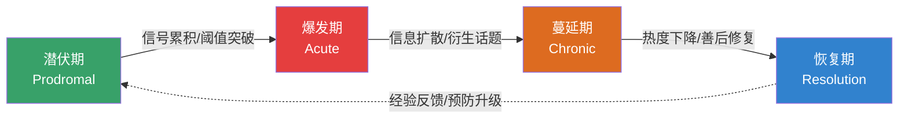
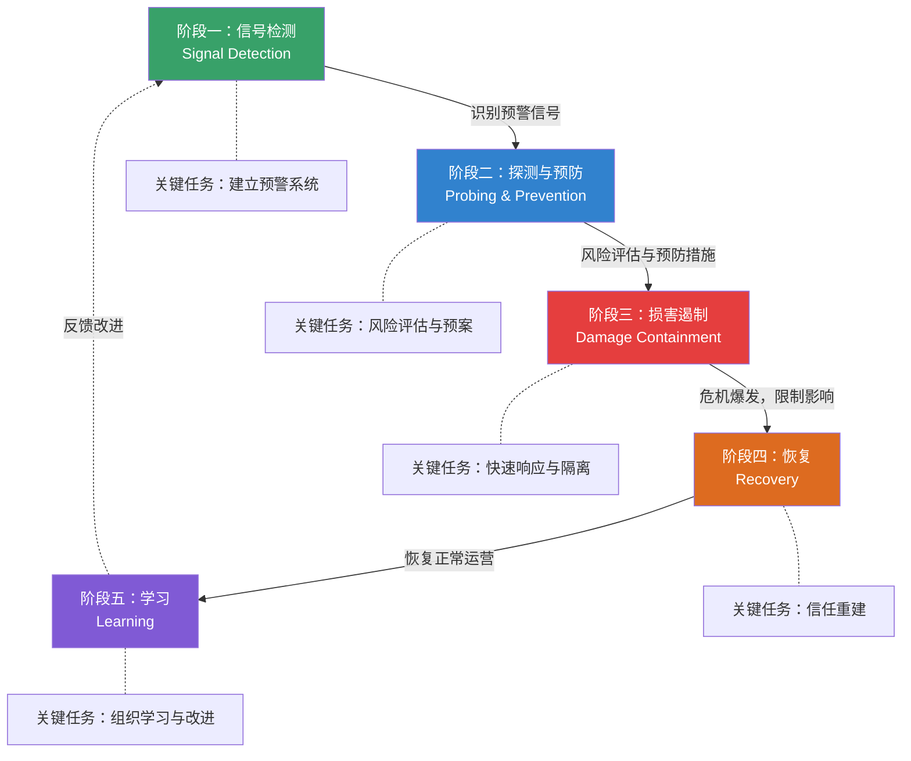
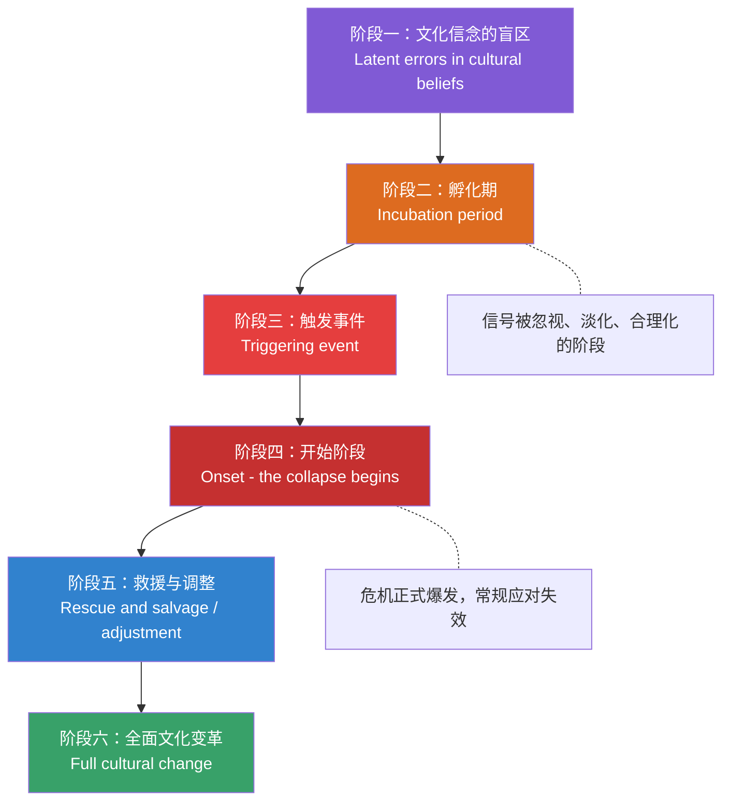
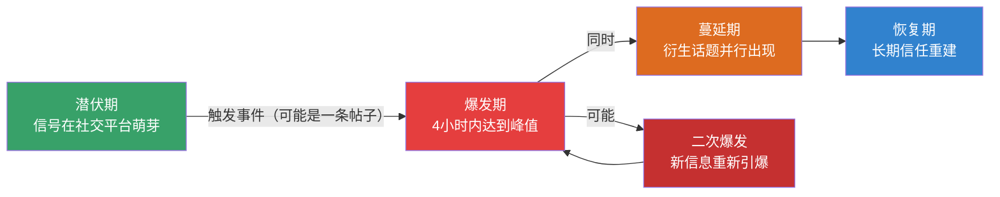

## 四、危机发展的阶段模型

危机不是一个瞬间的"爆炸"，而是一个有生命周期的过程。理解危机的阶段演化规律，是制定动态沟通策略的基础——不同阶段，信息环境不同、利益相关者心态不同、组织的选择空间不同，沟通的重心和策略也必须随之调整。

本章第一节已经介绍了芬克四阶段模型的基本框架。本节将在此基础上，系统展开三个经典阶段模型的完整内容，并重点解决一个实操问题：**如何判断危机正处于哪个阶段，以及每个阶段的沟通策略应该是什么。**

### 4.1 为什么阶段模型对危机沟通至关重要

很多组织在危机中犯的一个根本性错误是：用同一套沟通策略应对危机的所有阶段。这就像医生在病人的不同病程中开同样的药——不仅无效，还可能加重病情。

阶段模型对危机沟通的指导价值体现在三个层面：

**第一，时间定位。** 阶段模型帮助危机沟通团队回答"我们现在在哪里"这个首要问题。不同的阶段意味着不同的信息环境、不同的公众情绪、不同的利益相关者期待。在潜伏期大张旗鼓地公开回应，可能制造不必要的恐慌；在爆发期保持沉默，则会被解读为傲慢或隐瞒。

**第二，策略校准。** 每个阶段有其最优的沟通策略组合。爆发期需要速度和态度，蔓延期需要信息更新和话题管理，恢复期需要制度重建和信任修复。用爆发期的策略应对蔓延期（持续高调回应每一个新话题），会延长危机的公众关注度；用蔓延期的策略应对爆发期（慢慢收集信息再回应），会丧失叙事主动权。

**第三，资源分配。** 危机沟通需要消耗大量资源——人力、注意力、管理权限、媒体关系。阶段模型帮助组织在不同阶段合理分配这些资源，避免在恢复期仍然维持爆发期的高成本运作模式，也避免在潜伏期因为"还没爆发"就零投入。

### 4.2 芬克（Fink）四阶段模型：沟通视角的深度解读

史蒂文·芬克（Steven Fink）在1986年出版的《危机管理：对突发事件的规划》（*Crisis Management: Planning for the Inevitable*）中提出的四阶段模型，是危机管理领域最经典的框架。本章第一节已经介绍了该模型的基本结构和各阶段特征。这里从**沟通策略**的角度进行深度解读，聚焦每个阶段的具体沟通行动。

#### 4.2.1 潜伏期（Prodromal Stage）：预防性沟通

潜伏期是危机的酝酿阶段。此时危机尚未爆发，但风险信号已经存在。潜伏期可能持续数天到数年不等——产品质量投诉的缓慢积累、员工满意度的持续下降、监管环境的渐进变化、社交媒体上零星的负面讨论，都是潜伏期的典型信号。

潜伏期的沟通本质是**预防性沟通**——不是面向公众的危机声明，而是面向内部和关键利益相关方的风险信息管理。

**潜伏期沟通行动清单：**

| 行动项 | 具体做法 | 负责人 | 频率 |
|--------|---------|--------|------|
| 舆情监测 | 部署舆情监控系统，设置品牌名、产品名、高管名等关键词告警 | 公关团队 | 持续 |
| 投诉趋势分析 | 对客户投诉数据进行月度趋势分析，识别异常上升模式 | 客服/质量部门 | 月度 |
| 员工情绪监测 | 通过匿名调研、离职面谈、内部论坛监测员工情绪变化 | HR部门 | 季度 |
| 利益相关方访谈 | 定期与关键媒体人、行业分析师、监管联络人沟通，了解外部感知 | 公关/政府关系 | 季度 |
| 风险评估会议 | 召开跨部门风险评估会议，对识别出的信号进行严重性评级 | 风险管理委员会 | 月度 |
| 预案更新 | 根据新识别的风险，更新危机沟通预案和声明模板 | 危机管理团队 | 季度 |
| 模拟演练 | 针对高概率危机场景进行桌面推演或全流程模拟 | 全体相关团队 | 半年度 |

**潜伏期最常见的失败模式**是"信号忽视综合征"——组织收到了信号，但因为信号不够强烈、不够明确，或者因为处理信号需要投入资源和承认问题的存在，而选择视而不见。2015年大众汽车排放门事件就是一个典型案例：在危机爆发前的数年间，学术研究者和监管机构已经多次指出大众柴油车的实际排放数据与测试数据之间存在显著差异，但大众选择了技术掩盖而非主动整改，最终导致超过300亿美元的罚款和赔偿。

#### 4.2.2 爆发期（Acute Stage）：应急性沟通

爆发期是危机正式进入公众视野的阶段。这个阶段持续时间最短（数小时到数天），但对组织的冲击最猛烈，也是危机沟通的"生死线"。组织在这个阶段的初步回应，将在很大程度上决定公众对整场危机的认知框架。

**爆发期的沟通核心矛盾：** 在信息极度不完整的情况下，快速做出被公众接受的回应。这个矛盾无法消除，只能管理。管理的工具是"渐进式信息披露"策略——分层、分步、分节奏地释放信息。

**爆发期沟通时间表：**

时间线          行动                              沟通目标
─────────────────────────────────────────────────────────────
0-30分钟        内部确认事件，启动危机小组          信息收集，统一指挥
30-60分钟       确定核心信息框架和发言人            建立沟通基础架构
1-2小时         发布第一份声明                      表达关切+已知事实+行动+承诺
2-4小时         开通专项沟通渠道（热线/专题页）      建立持续信息供给机制
4-8小时         发布第二份更新，回应核心质疑         填补信息真空，遏制谣言
8-24小时        召开媒体沟通会/发布详细通报          提供实质性信息，展示专业性
24-48小时       持续更新+回应衍生话题               维持信息透明度和主动权

**爆发期第一份声明的"四要素"结构：**

1. **事实确认**：发生了什么（已确认的事实，不猜测、不隐瞒）
2. **态度表达**：组织对此事的态度（关切、歉意、重视，视责任程度而定）
3. **行动说明**：组织正在做什么（已采取的具体措施）
4. **承诺更新**：下一步信息发布时间（给公众明确预期）

> **示例（某食品企业产品安全事件第一份声明）：**
>
> "我们注意到有关XX产品安全问题的报道。我们对此高度重视，已于第一时间成立专项工作组，对涉事批次产品进行全面排查。目前，我们已暂停涉事产品的销售，并主动配合监管部门开展调查。我们对给消费者带来的担忧深表歉意。我们将在今晚8点前发布第一轮调查进展通报。消费者如有疑虑，可拨打专线400-XXX-XXXX咨询。"

**爆发期的五个致命错误：**

| 错误 | 为什么致命 | 正确做法 |
|------|-----------|---------|
| 沉默不回应 | 信息真空被谣言和猜测迅速填满，丧失叙事主动权 | 即使信息不完整，也要在2小时内发布初步声明 |
| 过度承诺 | 承诺无法兑现的时间表或解决方案，后续被质疑失信 | 只承诺确定能做到的事，对不确定的事说明"正在调查" |
| 推卸责任 | 将责任推给供应商、员工或外部因素，被公众视为不负责任 | 先表态承担调查责任，事实查清后再界定各方责任 |
| 技术性回应 | 用专业术语或法律措辞回应公众的情感关切 | 使用公众可理解的语言，先回应情感，再解释技术 |
| 多口径发布 | 不同发言人说法不一致，暴露内部协调混乱 | 统一核心信息框架，所有对外口径必须经过审核 |

#### 4.2.3 蔓延期（Chronic Stage）：管理性沟通

蔓延期是危机的"拉锯战"阶段。爆发期的剧烈冲击已经过去，但危机远未结束——公众关注度虽然有所下降，但负面信息仍在持续发酵，衍生话题不断出现，利益相关者的深层诉求开始浮现。蔓延期可能持续数周到数月。

蔓延期的沟通本质是**管理性沟通**——不是被动地回应每一个新话题，而是主动管理信息流、引导公众关注点、推进问题的实际解决。

**蔓延期的三个核心战场：**

**战场一：信息更新管理。** 建立定期信息发布机制，保持信息供给的连续性。频率可以根据危机热度动态调整——危机热度高时每天更新，热度下降后改为每2-3天更新，但绝不能中断。信息中断会被解读为"组织已经放弃处理"或"有新的坏消息在隐瞒"。

**战场二：衍生话题管理。** 蔓延期最容易出现"二次爆发"——一个新的信息、一个新的角度、一个新的当事人将公众注意力重新引爆。管理衍生话题的关键是：区分"需要回应的话题"和"需要忽略的话题"。不是每一个社交媒体热点都需要组织官方回应——过度回应反而会延长危机的公众关注度。

判断标准：如果话题直接影响组织的核心声誉或业务（如新的安全指控、新的受害者出现），必须迅速回应；如果话题是外围评论或情绪化讨论，可以通过第三方（行业专家、合作伙伴）间接回应，或者选择不回应。

**战场三：利益相关者深度沟通。** 爆发期的沟通主要面向公众和媒体（大众传播），蔓延期需要转向面向核心利益相关者的定向沟通：向投资者说明财务影响和恢复计划，向合作伙伴说明业务连续性保障，向员工说明组织状态和内部安排，向监管机构说明整改进展和合规方案。

**蔓延期最危险的陷阱：过早宣布胜利。**

> 2017年美联航暴力拖拽乘客事件中，公司在最初的道歉声明发布后认为危机已经过去。然而CEO奥斯卡·穆诺兹的内部邮件被泄露，其中将责任推给"好斗的"乘客，引发了第二波更猛烈的舆论风暴。美联航股价在第二波舆论中下跌超过4%，远超第一波的跌幅。
>
> 教训：在蔓延期宣布"危机已经结束"，就像在马拉松的30公里处宣布"已经到终点了"——它不会让危机真正结束，只会让你在危机二次爆发时措手不及。

#### 4.2.4 恢复期（Resolution Stage）：重建性沟通

恢复期是危机热度大幅下降、组织开始系统性修复的阶段。但"热度下降"不等于"危机结束"——恢复期是真正决定组织能否从危机中"恢复甚至超越"的关键阶段。

恢复期的沟通本质是**重建性沟通**——不是简单地"恢复原状"，而是通过系统性的沟通行动，重建（甚至升级）组织与各利益相关者之间的信任关系。

**恢复期沟通行动框架：**

| 行动维度 | 具体内容 | 时间跨度 |
|---------|---------|---------|
| 制度重建发布 | 公开说明组织在制度、流程、人员方面做了哪些具体改变 | 危机后1-3个月 |
| 受影响者回访 | 对直接受影响的客户、员工、社区进行定向回访和关怀 | 危机后1-6个月 |
| 第三方背书 | 邀请独立第三方（审计机构、行业协会、权威专家）对整改成果进行评估和背书 | 危机后3-6个月 |
| 正面叙事重建 | 通过持续的正面传播（公益活动、技术创新、客户故事）逐步稀释负面记忆 | 危机后6-24个月 |
| 危机复盘报告 | 内部发布危机复盘报告，总结经验教训，更新危机管理体系 | 危机后1-3个月 |
| 长期声誉监测 | 建立长期声誉监测机制，跟踪公众对组织的信任度变化 | 持续 |

恢复期的一个关键认知是：**信任修复的时间远超信任破坏的时间。** 研究表明，消费者对危机企业的负面印象在危机发生后的6个月内下降最快（约60%），但剩余的40%可能需要3-5年才能完全消除。这意味着恢复期的沟通不是一次性的"善后"，而是一个需要持续投入的长期工程。

### 4.3 米特罗夫（Mitroff）五阶段模型：系统化危机管理框架

伊恩·米特罗夫（Ian Mitroff）是南加州大学危机管理研究中心的创始人，被誉为"现代危机管理之父"。他在与克里斯蒂娜·皮尔森（Christine Pearson）合著的《危机管理：领导、传媒与组织的诊断手册》（*CrisisBlast: Managing Crises Before They Happen*，1993年初版，2005年修订）中提出了五阶段危机管理模型。

与芬克模型侧重于描述危机的**自然演化过程**不同，米特罗夫模型侧重于描述组织应该在每个阶段**做什么**——它是一个管理行动框架，而非纯粹的描述性框架。

#### 4.3.1 阶段一：信号检测（Signal Detection）

信号检测阶段的核心任务是：**建立系统化的预警信号识别机制，在危机形成之前捕捉到它的早期征兆。**

米特罗夫强调，大多数危机在爆发前都有"前兆信号"（Prodromes），但这些信号之所以被忽视，通常不是因为它们不存在，而是因为三个结构性障碍：

1. **信息孤岛**：信号分散在不同部门（客服收到投诉、质量部门发现缺陷、法务收到律师函、HR听到员工抱怨），没有机制将这些碎片化的信号汇总为完整的风险图景。
2. **认知偏差**：管理层存在"正常化偏差"（Normalcy Bias）——倾向于将异常信号解读为正常波动，因为承认异常意味着需要投入资源和承担不确定性。
3. **激励错位**：报告坏消息的人往往不会获得奖励，反而可能被质疑能力或制造麻烦。这导致"报喜不报忧"的组织文化。

**信号检测阶段的沟通策略：**

- **建立"信号汇总"机制**：指定专人（通常是风险管理或公关部门）定期收集来自客服、法务、质量、HR、舆情监测等渠道的异常信号，进行交叉分析。
- **构建"弱信号雷达"**：部署舆情监测系统，设置品牌名、产品名、高管名、行业争议话题等关键词的持续监控。弱信号的价值在于趋势——单条负面信息可能无意义，但同类信息的频率和情绪强度在上升就是预警。
- **建立"安全报告"文化**：鼓励员工主动报告异常和隐患，建立匿名举报渠道，对主动报告者给予正向激励而非惩罚。
- **定期"危机假设"讨论**：每季度召开一次"如果明天发生XX危机"的假设性讨论，检验组织的预警系统是否能捕捉到对应信号。

**信号检测阶段的关键产出：** 一份动态更新的"风险信号仪表盘"，列出当前监测到的所有异常信号、信号强度评级、趋势分析和建议行动。

#### 4.3.2 阶段二：探测与预防（Probing and Prevention）

当信号被检测到后，组织需要进入探测与预防阶段——深入调查信号背后的真实风险，评估风险升级为危机的概率和影响，并采取预防措施。

这个阶段的沟通重心是**内部沟通**——确保相关信息在决策层、执行层和相关职能部门之间高效流通，支撑准确的风险判断和有效的预防行动。

**探测与预防阶段的沟通行动：**

1. **组建跨部门风险评估小组**：将来自不同部门的信号进行交叉验证，避免单一视角的盲区。例如，客服部门的投诉增加+质量部门的检测异常+社交媒体的负面讨论，三者交叉验证后的风险判断远比单一信号准确。
2. **利益相关方风险感知调研**：通过小规模调研或定向访谈，了解关键利益相关方（大客户、核心投资者、主要媒体关系人）对相关风险的感知和态度。外部感知可能与内部评估存在显著差异——内部认为"小问题"的事，在外部可能已经是"大隐患"。
3. **预防性沟通准备**：如果评估结果表明风险升级为危机的概率较高，应提前准备沟通预案——声明模板、发言人培训、利益相关方联络清单、信息核实流程。
4. **预防性主动沟通**：对于某些风险，组织可以选择在危机爆发前进行主动沟通——向受影响方披露风险、说明已采取的预防措施、提供补偿或替代方案。这种"先发制人"的沟通策略虽然在短期内可能引发关注，但远比危机被动爆发后的沟通代价小。

**经典案例：** 丰田汽车在2009-2010年的"意外加速"危机中，信号检测和探测预防阶段的失败是根本原因。早在2003年，丰田就已经收到关于车辆意外加速的投诉，但内部将这些投诉归因为"驾驶员操作失误"而非系统性缺陷。信号被检测到了，但在探测阶段被错误地"排除"了。当危机在2009年全面爆发时，丰田已经积累了数年的"信号忽视"负债，最终导致超过800万辆汽车被召回，直接经济损失超过50亿美元，品牌信任度下降了约30%。

#### 4.3.3 阶段三：损害遏制（Damage Containment）

损害遏制阶段对应危机的爆发期——危机已经发生，组织的首要任务是限制危机的影响范围，防止"涟漪效应"将危机扩散到其他业务领域、地区或利益相关者群体。

米特罗夫将损害遏制分为两个子层面：

**物理遏制（Physical Containment）：** 限制危机在物理层面的影响范围。例如，产品召回限制缺陷产品的继续使用，网络攻击后隔离受影响的服务器，工厂事故后封锁事故现场。

**心理遏制（Psychological Containment）：** 限制危机在认知和情感层面的影响范围。这是危机沟通在遏制阶段的核心任务——防止公众将个案危机泛化为对整个组织的信任危机。

**心理遏制的沟通策略：**

- **"围栏"策略**：明确界定危机的影响范围，防止公众将危机泛化。例如："此次安全事件仅涉及XX型号XX批次的产品，其他型号和批次的产品不受影响。"这种"围栏"式信息必须基于事实，不能为了遏制影响而缩小真实范围——一旦被揭穿，后果比危机本身更严重。
- **"隔离"策略**：将危机与组织的核心价值和品牌承诺进行切割。例如："此次事件不代表我们的安全标准，它恰恰违反了我们一贯坚持的安全原则。"这种策略的有效性取决于组织在日常运营中是否确实建立了相应的安全标准和价值观——如果公众能找到组织历史上类似的违规记录，"隔离"策略会适得其反。
- **"行动展示"策略**：通过展示组织正在采取的具体、有力的遏制行动，向公众传递"组织有能力控制局面"的信号。行动比语言更有说服力——"我们已经召回了所有涉事产品"比"我们高度重视产品质量"有效得多。

#### 4.3.4 阶段四：恢复（Recovery）

恢复阶段对应危机的蔓延后期和恢复早期——危机的直接冲击已经被遏制，组织需要开始恢复正常运营和利益相关者的信心。

米特罗夫强调，恢复不是"回到过去"，而是"建设新的常态"。如果组织试图恢复到危机前的状态，就失去了从危机中学习和改进的机会。

**恢复阶段的沟通策略分为两条并行线：**

**业务恢复线：**
- 向客户说明业务恢复的时间表和具体安排
- 提供过渡期的替代方案或补偿措施
- 通过产品升级、服务优化等方式展示改进成果

**信任恢复线：**
- 向受影响者进行定向沟通和回访
- 邀请独立第三方对整改成果进行评估和背书
- 通过持续的正面传播逐步重建品牌形象

**恢复阶段的时间管理预期：** 不同类型危机的恢复周期差异巨大。产品安全危机的恢复周期通常为6-18个月，声誉危机为12-36个月，涉及道德丑闻的危机可能需要3-5年。组织需要对恢复周期有合理的预期，避免在恢复初期就期望"回到正常"。

#### 4.3.5 阶段五：学习（Learning）

学习阶段是米特罗夫模型最独特、也最被低估的阶段。米特罗夫认为，**每一次危机都是组织学习和成长的机会，但这个机会只有通过系统化的学习过程才能被抓住。**

大多数危机管理的失败不是因为组织"不会应对"，而是因为组织"不会学习"——同样的危机模式反复出现，同样的应对错误反复犯，组织的危机管理能力没有因为经历危机而提升。

**学习阶段的沟通行动：**

1. **危机复盘报告**：在危机结束后1-3个月内，完成全面的危机复盘报告。报告应涵盖：危机的完整时间线、各阶段的决策过程和依据、沟通策略的执行效果评估、利益相关方反馈汇总、经验教训提炼、改进建议和行动计划。

2. **内部分享与培训**：将危机复盘的成果转化为内部培训材料，在组织范围内进行分享。不是为了追责，而是为了建立组织的"危机记忆"——让没有直接参与危机应对的员工也能从中学到经验。

3. **预案更新**：根据复盘结论，更新危机沟通预案——修订声明模板、调整发言人配置、优化信息核实流程、完善利益相关方联络清单。

4. **外部知识贡献**：在条件允许的情况下（不涉及法律敏感信息），通过行业会议、案例研究等方式分享危机管理经验。这种做法不仅有助于行业发展，也能向公众展示组织的学习态度和改进诚意。

**学习阶段的一个关键原则：** 复盘必须在"心理安全"的环境中进行。如果复盘变成了追责大会，参与者会本能地进行自我保护和信息隐藏，学习效果将大打折扣。米特罗夫建议，危机复盘应由不直接参与危机应对的第三方（如外部顾问或内部审计部门）主持，确保客观性和心理安全。

### 4.4 特纳（Turner）六阶段灾难模型：被忽视的经典

除了芬克和米特罗夫模型，英国学者巴里·特纳（Barry Turner）在1978年提出的六阶段灾难模型也是一个重要的理论框架，但在中国的危机管理文献中较少被提及。特纳模型的独特价值在于：它特别关注危机的**潜伏期演化机制**——解释了危机信号是如何从"正常"中逐步浮现，又为什么会被组织系统性地忽视。

#### 4.4.1 阶段一：文化信念的盲区

特纳模型最独特的洞见在于这个阶段。他认为，危机的根源往往不是技术故障或人为失误，而是组织和社会中根深蒂固的**文化信念**——那些被视为"理所当然"的假设和惯例。

例如，在2008年全球金融危机之前，整个金融行业存在一个根深蒂固的信念："房价不会在全国范围内同时下跌。"这个信念支撑了次级抵押贷款证券化的整个商业模式。当这个信念被现实击碎时，危机的规模远超任何人的预期。

**对危机沟通的启示：** 有效的危机预警系统不仅要监测显性信号（投诉、事故、负面报道），还要定期审视组织的核心假设——"我们一直这样做都没问题"本身就是最大的风险信号。

#### 4.4.2 阶段二：孵化期

孵化期是危机信号开始积累但尚未被识别为危机的阶段。特纳强调，孵化期的信号通常是"模棱两可"的——它们既可以被解读为正常波动，也可以被解读为危机前兆。组织倾向于选择前者，因为后者意味着需要承认问题的存在并投入资源。

**孵化期的沟通策略：** 建立"安全港"式的内部报告机制——允许任何人提出"可能不是问题但我注意到一个异常"的信号，不追究报告错误的责任，但确保每个信号都被记录和评估。

#### 4.4.3 阶段三：触发事件

触发事件是将潜伏期的积累推向爆发的"最后一根稻草"。触发事件本身可能看起来不大（一条社交媒体帖子、一次消费者投诉、一篇调查报道），但它激活了之前积累的所有信号，产生了"雪崩效应"。

**触发事件阶段的沟通策略：** 不要被触发事件的"小"所误导。一个看似微小的触发事件，如果背后有大量的潜伏信号，其引爆力可能远超预期。正确的做法是：当触发事件发生时，迅速回顾潜伏期积累的信号——如果信号众多且持续时间长，就应将其视为重大危机而非个别事件来应对。

#### 4.4.4 阶段四至六：爆发、救援与文化变革

后三个阶段与芬克和米特罗夫模型的对应阶段有较多重叠，但特纳模型特别强调**阶段六：全面文化变革**。特纳认为，如果危机没有导致组织的深层文化变革，那么下一次危机只是时间问题。这不是修辞——特纳的研究表明，经历过危机但未进行文化变革的组织，在5年内再次发生类似危机的概率比平均水平高出约40%。

### 4.5 三大模型的对比与选择

三个模型各有侧重，适用于不同的管理需求：

| 对比维度 | 芬克四阶段模型 | 米特罗夫五阶段模型 | 特纳六阶段模型 |
|---------|--------------|-------------------|--------------|
| 核心视角 | 危机的自然生命周期 | 组织的管理行动框架 | 危机的社会文化根源 |
| 独特贡献 | 潜伏期概念和阶段划分 | "学习"阶段的系统化 | 文化信念盲区和孵化期机制 |
| 适用场景 | 快速判断危机所处阶段 | 制定系统化管理计划 | 深度反思危机的根本原因 |
| 沟通指导 | 各阶段的沟通节奏和重点 | 各阶段的管理行动和沟通配合 | 预防性沟通和文化变革沟通 |
| 实操性 | 高——直观易用 | 中——需要组织系统支持 | 低——偏理论分析 |
| 最佳使用者 | 一线危机沟通团队 | 危机管理负责人/高管层 | 组织学习与战略规划部门 |

**实际应用建议：** 不要将三个模型视为互斥的选择，而应视为互补的工具。在危机爆发的紧急时刻，用芬克模型快速定位阶段、确定沟通节奏；在制定危机管理计划时，用米特罗夫模型构建系统化的管理框架；在危机结束后的复盘中，用特纳模型进行深度根因分析。

### 4.6 阶段判断实操：如何识别危机正处于哪个阶段

理论模型的价值最终体现在实操中。以下是一套实用的"阶段快速判断"检查清单，帮助危机沟通团队在危机发生时快速定位所处阶段。

#### 4.6.1 阶段判断检查清单

**判断是否处于"潜伏期"的信号：**
- 是否有零星的投诉、质疑或负面报道，但尚未形成公众关注？
- 内部是否已识别到风险信号，但尚未采取系统性行动？
- 利益相关方是否有隐性的不满，但尚未公开表达？
- 行业内是否有关于类似风险的讨论或先例？

**判断是否已进入"爆发期"的信号：**
- 事件是否已被主流媒体或大V报道？
- 是否有大量公众在社交媒体上讨论此事？
- 是否有利益相关方公开发表声明或采取行动（如投诉、诉讼、抵制）？
- 组织是否已被媒体或公众要求正式回应？
- 事件的传播速度是否在加快？

**判断是否已进入"蔓延期"的信号：**
- 危机的初始冲击是否已过高峰，但仍有持续讨论？
- 是否出现了衍生话题或新的当事人？
- 媒体报道是否从"事件报道"转向"深度调查"或"评论分析"？
- 利益相关方的诉求是否从"知情"转向"追责"或"补偿"？

**判断是否已进入"恢复期"的信号：**
- 危机话题的公众讨论量是否已大幅下降？
- 媒体是否已转向其他话题？
- 组织是否已发布全面的调查结果和整改方案？
- 利益相关方是否已从"愤怒"转向"观望"或"接受"？
- 组织的业务运营是否已基本恢复正常？

#### 4.6.2 阶段间的非线性跳跃

需要特别注意：危机的阶段演进不是严格线性的。以下几种非线性跳跃在实际中经常出现：

**回退跳跃：** 危机已经进入蔓延期或恢复期，但由于新的信息曝光或应对失误，重新回到爆发期。典型案例：美联航CEO内部邮件泄露导致的二次爆发。

**跳跃爆发：** 危机在潜伏期长期积累，但由于一个触发事件，直接跳入高度激烈的爆发期，跳过了渐进式的过渡。典型案例：长期存在的产品质量问题被一起严重事故引爆。

**多阶段并行：** 在大型危机中，不同层面的危机可能处于不同阶段。例如，产品的安全事故可能已进入恢复期（产品已召回、问题已修复），但由此引发的监管调查仍处于爆发期，而品牌声誉的修复尚在蔓延期。

**对沟通策略的启示：** 不要机械地将整个危机归入某一个阶段。应该对危机的不同层面（产品层面、法律层面、声誉层面、运营层面）分别进行阶段判断，并为每个层面制定对应的沟通策略。

### 4.7 数字时代对阶段模型的修正

传统的阶段模型诞生于传统媒体时代。在社交媒体和移动互联网时代，危机的阶段演进速度和动态发生了根本性变化，需要对传统模型进行修正。

#### 4.7.1 速度压缩

传统模型中，爆发期可能持续数天到数周；在社交媒体时代，爆发期的"核心窗口"被压缩到**4小时以内**。一条微博话题从零到登上热搜可能只需要30分钟。这意味着组织的响应速度必须同步压缩——"黄金24小时"已经变成"黄金4小时"甚至"黄金1小时"。

#### 4.7.2 阶段重叠

在社交媒体时代，危机的各阶段高度重叠。当组织还在处理爆发期的核心信息时，蔓延期的衍生话题可能已经出现；当组织试图进入恢复期时，新的信息曝光可能将危机重新推回爆发期。阶段之间的边界变得模糊。

#### 4.7.3 情绪加速器效应

社交媒体的算法推荐机制会放大情绪化内容的传播速度，使得危机中的愤怒、恐惧等负面情绪以远超事实信息的速度扩散。这意味着在爆发期，情绪管理比信息管理更紧迫——公众需要的首先是情感回应（"你们理解我们的感受"），其次才是事实信息（"到底发生了什么"）。

#### 4.7.4 修正后的阶段模型

关键修正点：
- **潜伏期缩短**：社交媒体上的"弱信号"可能在数小时内升级为"强信号"
- **爆发期压缩**：核心响应窗口从24小时压缩到4小时
- **蔓延期并行**：蔓延期的衍生话题可能在爆发期就同步出现
- **恢复期延长**：数字记忆的持久性使得负面信息的消退速度更慢
- **阶段可逆**：新信息可以将危机从任何阶段推回爆发期

### 4.8 常见误区与纠正

**误区一："阶段模型只是理论，实际危机没这么规律"**

纠正：阶段模型确实是对现实的简化，但这种简化的价值在于提供了一个**思维框架**。正如地图不是领土，但没有地图你无法导航——阶段模型不是危机本身，但没有阶段模型你无法系统地思考危机沟通策略。实际危机的阶段演进确实可能非线性、非规律，但阶段模型提供的"潜伏-爆发-蔓延-恢复"四类情境仍然是判断和决策的基础参照系。

**误区二："进入恢复期就安全了"**

纠正：恢复期不是危机的"安全区"，而是最容易松懈的"陷阱区"。很多组织在恢复期过早缩减危机沟通投入，导致残余的负面情绪长期存在，成为下一次危机的"燃料"。恢复期的沟通投入可以降低强度，但不能中断。

**误区三："每个危机都必须经历所有阶段"**

纠正：并非所有危机都完整经历所有阶段。一些小型危机可能在爆发期就被快速遏制，直接进入恢复期；另一些危机可能因为应对得当，在潜伏期就被化解。阶段模型提供的是"全部可能性"的框架，不是"必须经历"的清单。

**误区四："只需要关注当前阶段"**

纠正：虽然沟通策略应根据当前阶段调整，但必须始终对下一阶段保持预判。在爆发期就应开始准备蔓延期的信息更新机制，在蔓延期就应开始规划恢复期的信任重建方案。危机沟通团队应该"活在当前阶段，但为下一阶段做准备"。

### 4.9 本节小结

危机发展阶段模型是危机沟通的"导航地图"。掌握芬克、米特罗夫和特纳三个经典模型，能够在危机的不同阶段做出精准的策略判断。核心要点：

1. **芬克模型**用于快速定位阶段、确定沟通节奏——它是危机沟通团队的"日常工具"
2. **米特罗夫模型**用于构建系统化的管理框架——它是危机管理负责人的"规划工具"
3. **特纳模型**用于深度根因分析和文化反思——它是组织学习的"复盘工具"
4. **阶段判断要快、要准、要分层**——对危机的不同层面分别进行阶段判断
5. **数字时代需要修正传统模型**——速度压缩、阶段重叠、情绪加速器效应
6. **阶段间可跳跃可回退**——不要假设阶段演进是线性的
7. **"活在当前阶段，为下一阶段做准备"**——始终保持前瞻性

最终，阶段模型的价值不在于预测危机的精确走向（这不可能），而在于帮助组织在不确定性中建立一个系统化的思考和行动框架。当危机来临时，拥有框架的组织比没有框架的组织快得多、准得多、稳得多。
