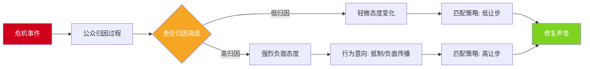
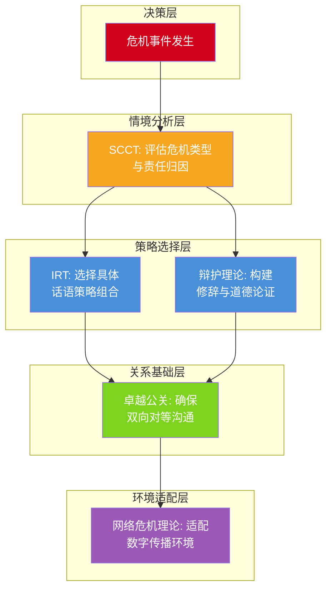
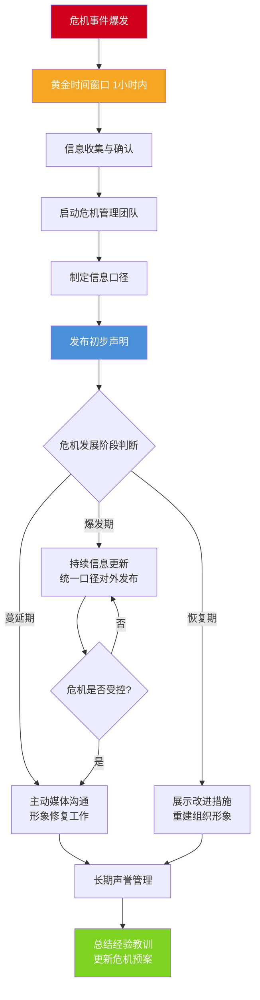
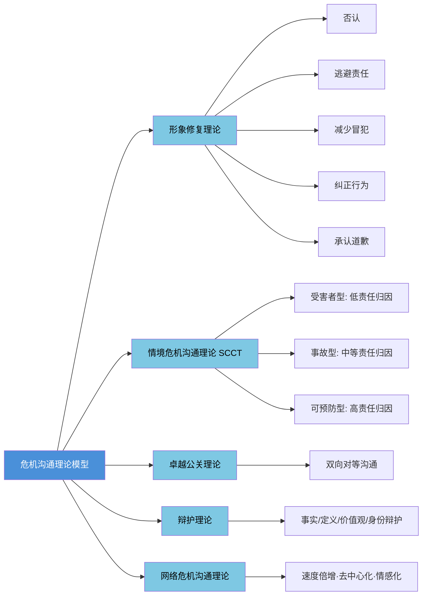

## 五、危机沟通的理论模型

危机沟通不是"凭感觉说话"，而是一门有完整理论支撑的学科。过去四十年间，传播学者们从不同角度构建了多套理论模型，为危机情境下的沟通决策提供了分析框架和行动指南。本节系统梳理五大核心理论模型——从形象修复到情境应对，从组织辩护到数字时代的网络危机——帮助你在面对真实危机时，能基于理论做出有据可依的判断，而非临场发挥。

### 5.1 形象修复理论（Image Repair Theory / IRT）

#### 5.1.1 理论起源与核心假设

形象修复理论（Image Repair Theory，简称IRT）由美国传播学者威廉·贝诺伊特（William L. Benoit）于1995年在其专著《Accounts, Excuses, and Apologies: A Theory of Image Restoration Strategies》中系统提出。该理论的前身是Ware和Linkugel（1973）提出的"辩护修辞"（ apologia）研究传统，贝诺伊特在此基础上将其扩展为一套更具操作性的策略体系。

IRT建立在两个核心假设之上：

**假设一：维护形象是传播的核心目标。** 贝诺伊特认为，个人和组织都极其重视自身的公众形象（image），当形象受到威胁或损害时，会本能地采取行动进行修复。形象是一种社会资产，直接影响组织的生存与发展。

**假设二：沟通是形象修复的主要手段。** 当危机发生后，组织的沟通话语（discourse）是修复形象的最重要工具。虽然实际行动（如召回产品、赔偿受害者）同样重要，但IRT聚焦于"说什么"和"怎么说"的策略选择。

#### 5.1.2 五大策略详解

IRT识别了五大类形象修复策略，每类下包含若干子策略。这些策略并非互相排斥，实际操作中往往需要组合使用。

**策略一：否认（Denial）**

否认是最直接的应对方式，分为两种形式：

- **简单否认（Simple Denial）**：直接声称危机事件没有发生，或组织没有做过被指控的行为。例如："本公司从未使用过该批次原料。"
- **转移责任（Shifting the Blame）**：承认危机事件发生了，但将其归咎于第三方。例如："产品质量问题是供应商提供的原材料不合格导致的。"

否认策略的使用条件和风险：当组织确实无辜、或信息环境混乱无法证实时，否认是合理选择。但如果后续证据表明否认不实，组织将遭受远超原始危机的信誉损失。2010年英国石油公司（BP）墨西哥湾漏油事故初期，BP试图将责任转移给承包商Transocean和Halliburton，但随着调查深入，公众认定BP作为运营商负有不可推卸的最终责任，转移责任策略反而加剧了公众愤怒。

**策略二：逃避责任（Evasion of Responsibility）**

该策略承认危机事件的发生，但试图减轻组织应承担的责任。包含四种子策略：

- **合理回应（Provocation）**：危机是对他人不当行为的合理反应。例如："我们关闭该工厂是因为当地监管部门发出了强制停产令。"
- **信息不足（Defeasibility）**：由于缺乏关键信息或控制能力，导致了非预期的后果。例如："事故发生时，我们并不掌握该化学品的完整安全数据。"
- **意外事故（Accident）**：危机是由不可预见的意外导致的。例如："这是一起极其罕见的设备故障，超出了行业标准检测的范围。"
- **良好意图（Good Intentions）**：虽然结果不佳，但出发点是好的。例如："我们推出这项政策的初衷是为了保护消费者的权益。"

**策略三：减少冒犯（Reducing Offensiveness）**

这是最复杂的一类策略，包含六种子策略，目的是降低公众对危机事件的负面感知：

- **强化正面形象（Bolstering）**：强调组织过去的良好记录和正面贡献。例如："在过去二十年中，我们的产品服务了超过一千万家庭，安全事故率始终低于行业平均水平。"
- **淡化事态（Minimization）**：降低危机的严重性感知。例如："受影响的产品数量仅占总产量的0.01%，且尚未收到任何消费者健康问题的报告。"
- **区分（Differentiation）**：将危机事件与组织的整体运营区分开来。例如："这是单一门店个别员工的违规行为，不代表公司的管理制度和企业文化。"
- **超越（Transcendence）**：将事件放在更宏观的背景下来审视，赋予其更高的意义。例如："虽然短期内给我们带来了损失，但这次事件推动了整个行业安全标准的升级。"
- **攻击批评者（Attack the Accuser）**：质疑批评者的动机、信息来源或可信度。例如："该报道引用的所谓'内部人士'信息，实际上来自一名因严重违纪被辞退的前员工。"
- **补偿（Compensation）**：向受害者提供物质或非物质的补偿。例如："我们将为所有受影响的消费者提供全额退款及等值代金券。"

**策略四：纠正行为（Corrective Action）**

采取实际行动修复造成危机的根本问题，并预防类似事件再次发生。这是最具建设性的策略，通常能获得公众的正面评价。纠正行为分为两种程度：

- **部分纠正**：修复当前问题但不做系统性改变。例如："我们已经召回了该批次产品，并加强了出厂检测流程。"
- **全面纠正**：进行系统性改革。例如："我们将在全公司推行新的安全管理体系，聘请第三方机构进行年度审计，并设立独立的安全监督委员会。"

**策略五：承认与道歉（Mortification）**

承认错误，真诚表达歉意，请求公众原谅。这是五种策略中最具"让步性"的，但在危机确实由组织造成且影响严重时，往往是最有效的选择。有效的道歉包含五个要素：明确承认错误行为、表达对受害者感受的理解、承担全部责任、说明弥补措施、承诺不再重犯。

2017年美联航（United Airlines）暴力拖拽乘客下机事件中，CEO Oscar Munoz最初的声明被批评为"避重就轻"（使用逃避责任策略）。在股价暴跌和舆论风暴的压力下，Munoz随后发表了全面道歉，承认"没有任何借口可以为这种对待乘客的方式辩护"，并宣布了十项具体改革措施——这是承认道歉+纠正行为的经典组合。

#### 5.1.3 策略选择的决策框架

选择哪种策略组合，取决于以下关键因素的综合评估：

| 决策因素 | 倾向否认/逃避 | 倾向承认/纠正 |
|---------|-------------|-------------|
| 组织实际责任 | 低或无 | 高或明确 |
| 证据充分性 | 证据模糊或有利于组织 | 证据确凿不利于组织 |
| 危机严重程度 | 轻微，影响范围小 | 严重，影响范围广 |
| 公众情绪 | 愤怒程度低 | 愤怒程度高 |
| 组织声誉存量 | 良好声誉有缓冲空间 | 声誉存量不足 |
| 后续发展预期 | 危机将很快消退 | 事态可能持续发酵 |

#### 5.1.4 理论的优势与局限

**优势：** IRT提供了一套直观、易用的策略分类体系，具有很强的操作性。无论是企业公关团队还是个人，都可以快速对照五种策略进行决策。

**局限：** 该理论主要聚焦于"话语策略"，对实际行动的分析不够深入；策略分类虽然全面，但缺乏对策略组合效果的预测能力；理论本质上是"反应性"的，对危机预防和主动沟通的指导有限。

### 5.2 情境危机沟通理论（SCCT）

#### 5.2.1 理论框架与核心逻辑

情境危机沟通理论（Situational Crisis Communication Theory，简称SCCT）由美国学者蒂莫西·库姆斯（W. Timothy Coombs）于1995年首次提出，经过多次修订完善，目前是危机沟通研究中被引用最多、实证支持最充分的理论框架。

SCCT的核心主张是：**没有放之四海而皆准的危机沟通策略，策略选择必须匹配危机情境。** 它借鉴了归因理论（Attribution Theory）——人们对危机事件会自动进行因果归因，追问"为什么会发生这件事"和"谁应该为此负责"。归因结果直接影响公众对组织的态度和行为意向（如抵制购买、负面口碑传播等）。

SCCT的理论逻辑链如下：

#### 5.2.2 危机类型分类体系

SCCT将危机划分为三大集群（cluster），每个集群包含多种具体危机类型，并对应不同程度的组织责任归因：

**受害者型危机（Victim Cluster）—— 低责任归因**

组织在危机中同样是受害者，公众对组织的责任归因最低。

| 危机类型 | 定义 | 典型案例 |
|---------|------|---------|
| 自然灾害（Natural Disaster） | 自然力量导致的危机 | 2011年日本地震导致丰田工厂停产 |
| 谣言（Rumour） | 恶意传播的虚假信息 | 2017年"塑料紫菜"谣言冲击紫菜产业 |
| 工作场所暴力（Workplace Violence） | 员工或外部人员的暴力行为 | 2018年YouTube总部枪击事件 |
| 恶意攻击（Malevolence） | 外部蓄意破坏行为 | 竞争对手的商业间谍或网络攻击 |

**事故型危机（Accidental Cluster）—— 中等责任归因**

危机由非故意的失误或技术问题导致，公众认为组织有一定责任但非恶意。

| 危机类型 | 定义 | 典型案例 |
|---------|------|---------|
| 技术错误导致的产品缺陷（Technical-error Product Harm） | 技术原因导致的产品问题 | 三星Galaxy Note 7电池自燃 |
| 技术错误导致的工作场所事故（Technical-error Workplace Accident） | 技术原因导致的安全事故 | 化工厂设备故障导致的泄漏 |
| 管理失误导致的危机（Management Error） | 管理决策的非故意负面后果 | 某航空公司超售政策导致乘客冲突 |

**可预防型危机（Preventable Cluster）—— 高责任归因**

组织明知风险但未采取预防措施，或故意做出不当行为，公众对组织的责任归因最高。

| 危机类型 | 定义 | 典型案例 |
|---------|------|---------|
| 已知风险未处理（Human-error Product Harm） | 组织知道产品存在风险但未召回 | 大众汽车"柴油门"排放数据造假 |
| 管理层不当行为（Managerial Misconduct） | 管理层的故意违规或违法行为 | 安然公司财务造假 |
| 组织不当行为（Organizational Misconduct） | 系统性的组织违规行为 | 富国银行虚假账户丑闻 |

#### 5.2.3 策略匹配模型

SCCT的实践价值在于它提供了清晰的"情境—策略"匹配建议：

**低责任归因（受害者型危机）的策略组合：**
- 核心策略：否认或逃避责任（维护组织清白的形象）
- 辅助策略：表达对受害者的同情和关切（展示人道主义关怀）
- 关键话术："我们也是此次事件的受害者""我们正在积极配合相关部门调查"
- 注意事项：不要过度道歉，因为过度道歉反而暗示组织有责任

**中等责任归因（事故型危机）的策略组合：**
- 核心策略：减少冒犯（淡化事态、强调良好意图）+ 纠正行为
- 辅助策略：表达同情、提供信息透明度
- 关键话术："这是一个非故意的技术问题，我们已经采取了以下纠正措施""安全始终是我们的第一优先级"
- 注意事项：需要在承认问题和维护形象之间找到平衡点

**高责任归因（可预防型危机）的策略组合：**
- 核心策略：全面道歉 + 全面补偿 + 全面纠正行为
- 辅助策略：提供充分的经济补偿、进行系统性改革
- 关键话术："我们犯了不可原谅的错误""以下是我们立即实施的改革计划"
- 注意事项：任何试图否认或逃避责任的策略都将适得其反，公众对可预防型危机的容忍度极低

#### 5.2.4 两个关键调节变量

SCCT指出，危机类型（责任归因）是影响策略选择的主要因素，但还有两个重要的调节变量会改变策略效果：

**调节变量一：危机历史（Crisis History）**

如果组织过去发生过类似的危机事件，公众会认为"重蹈覆辙"说明组织没有吸取教训，从而加重责任归因。应对方式：在制定沟通策略时，需要主动提升一个应对级别。例如，即使是事故型危机，如果有类似的危机历史，应采用可预防型危机的沟通策略。

**调节变量二：先前声誉（Prior Reputation）**

良好的先前声誉在危机初期能提供"信任缓冲"——公众倾向于给好企业"改过的机会"。但这种缓冲是有限的，如果危机持续发酵且组织应对不当，良好声誉反而会变成"期望落差"的放大器——"你这么好的企业怎么能做出这种事？"

#### 5.2.5 SCCT的实证研究与验证

SCCT的优势在于其大量实证研究的支持。Coombs和Holladay（2002）的实验研究表明，当危机归因较高时，采用补偿和道歉策略的组织，其声誉恢复程度显著优于采用否认策略的组织。相反，在低归因情境下，过度道歉反而会加重公众对组织责任的推断。

Kim等学者（2007）进一步发现，文化因素会影响SCCT的适用效果——在集体主义文化（如中国、日本）中，公众对道歉策略的接受度更高，而在个人主义文化（如美国）中，否认策略在低归因情境下的效果更好。

#### 5.2.6 理论的优势与局限

**优势：** SCCT提供了最系统、最有实证基础的情境化策略匹配模型；对危机类型的分类清晰实用；考虑了危机历史和声誉的调节作用。

**局限：** 理论主要基于实验研究，真实危机情境的复杂性可能超出模型预测范围；对数字媒体环境下危机传播的新特征考虑不足；危机类型的边界在实践中有时难以清晰界定。

### 5.3 卓越公关理论（Excellence Theory）

#### 5.3.1 理论概述

卓越公关理论由詹姆斯·格鲁尼格（James E. Grunig）和拉丽莎·格鲁尼格（Larissa A. Grunig）在马里兰大学主持的"卓越公关研究项目"（Excellence Study）中提出，研究成果集中体现在1992年出版的《Excellence in Public Relations and Communication Management》一书中。

该理论的核心贡献在于提出了**四种公关实践模式**，并论证了哪种模式最能实现组织与公众的双赢：

| 模式 | 方向 | 目的 | 典型做法 |
|------|------|------|---------|
| 新闻代理模式（Press Agentry） | 单向 | 宣传 | 制造新闻、夸大宣传、不关心事实准确性 |
| 公共信息模式（Public Information） | 单向 | 信息披露 | 发布新闻稿、事实性信息传播 |
| 双向非对等模式（Two-way Asymmetric） | 双向 | 科学说服 | 通过研究了解公众态度，但目的是更有效地说服 |
| 双向对等模式（Two-way Symmetric） | 双向 | 相互理解 | 组织与公众之间的平等对话和相互调适 |

格鲁尼格认为，**双向对等模式**是最"卓越"的公关实践——组织不仅向公众传递信息，也认真倾听公众的声音，双方通过对话达成相互理解和利益平衡。

#### 5.3.2 卓越公关在危机沟通中的应用

将卓越公关理论应用于危机沟通，意味着：

**危机前：建立对等沟通关系。** 卓越的组织在危机发生前就与关键利益相关者（员工、消费者、社区、政府、媒体）建立了基于信任和尊重的沟通关系。这种关系储备在危机爆发时会转化为宝贵的信任资本。

**危机中：坚持双向沟通。** 不是单方面发布声明，而是积极倾听公众的诉求和情绪，根据反馈及时调整沟通策略。例如，设立24小时热线、安排高管与受害者面对面沟通、通过社交媒体实时回应公众关切。

**危机后：以对话推动系统性变革。** 危机后的改革不应由组织闭门制定，而应邀请利益相关者参与讨论，确保改革措施回应了公众的真实关切。

2008年三聚氰胺毒奶粉事件后，伊利集团的危机应对经历了从"单向信息控制"到"双向对话"的转变。最初伊利试图淡化问题，但随着事件发酵，伊利转向全面透明化——邀请媒体参观生产线、公开检测数据、建立消费者监督委员会——这些措施体现了从"公共信息模式"向"双向对等模式"的转变。

#### 5.3.3 理论的优势与局限

**优势：** 为危机沟通提供了价值导向——不仅关注"如何应对危机"，更关注"如何建立长期健康的利益相关者关系"；强调了倾听和对话的重要性。

**局限：** 双向对等模式在实践中难以完全实现，尤其是在涉及重大利益冲突的危机中；理论更偏向规范性（应该怎么做），对具体策略操作的指导不如IRT和SCCT具体；批评者认为在真正的危机中，组织往往没有时间进行充分的"双向对话"。

### 5.4 辩护理论（Apologia Theory）

#### 5.4.1 理论背景与发展

辩护理论（Apologia Theory）源自古希腊修辞学传统。"apologia"在希腊语中意为"辩护"（而非现代英语中的"道歉"），指的是面对正式指控时的系统性自我辩护。

该理论的现代发展始于Ware和Linkugel（1973）对"辩护修辞"的开创性研究。此后，Keith Hearit（1995, 2006）、William Benoit（1995）等学者进一步发展了这一传统。Hearit的贡献在于将辩护理论从个人修辞扩展到组织沟通领域，并强调了"道德正当性"（moral legitimacy）在组织辩护中的核心地位。

#### 5.4.2 四种辩护策略

Hearit识别了组织在面临指控时可采用的四种主要辩护策略：

**事实辩护（Denial / Counter-attack）**

质疑指控的事实基础，提供相反的证据，或攻击指控者的可信度。这是最直接的辩护方式，适用于指控明显不实或证据不足的情况。

示例："该检测报告使用的测试方法不符合国家标准，我们已委托权威第三方机构重新检测，结果全部合格。"

**定义辩护（Definitional Defense / Reinterpretation）**

接受基本事实，但对事实的定义和解读提出不同看法。通过重新定义事件的性质或语境来减轻负面影响。

示例："我们确实进行了裁员，但这是一次经过深思熟虑的战略调整，而非经营困难的表现。调整后的团队结构将更有利于公司长期发展。"

**价值观辩护（Justification）**

不否认事实和定义，但强调组织的核心价值观和良好意图，以证明行为的道德合理性。

示例："我们做出这个艰难决定的根本出发点，是对全体消费者的安全负责。短痛胜过长痛，我们宁可承受短期损失，也不能让消费者面临任何安全风险。"

**身份辩护（Differentiation / Bolstering）**

重新定义组织的身份和形象，将组织与危机事件区分开来，或通过强调组织的正面特质来抵消负面影响。

示例："三十五年来，我们一直是中国食品安全领域的标杆企业。这次个别环节的疏忽不能代表我们的企业DNA。我们有信心通过这次教训，变得比以前更强大。"

#### 5.4.3 辩护理论与形象修复理论的关系

辩护理论和形象修复理论（IRT）在策略分类上有明显的重叠——贝诺伊特本人也承认IRT是对辩护修辞传统的扩展。两者的区别在于：

- **IRT更侧重操作性**：提供了更细致的策略分类（五大类、十余种子策略），更适合直接指导实践。
- **辩护理论更侧重修辞学分析**：关注话语的说服机制和道德正当性构建，更适合进行深度的文本分析。
- **辩护理论更强调道德维度**：Hearit特别指出，辩护不仅是策略选择，更是组织道德责任的体现——组织有义务对公众做出真诚的解释。

在实际应用中，可以将两者结合使用：用IRT的策略分类框架进行初步决策，用辩护理论的修辞学视角来打磨具体的表达方式。

### 5.5 网络危机沟通理论（Digital Crisis Communication）

#### 5.5.1 传统理论面临的挑战

上述四大理论模型主要建立在传统媒体环境的假设之上——信息传播是相对可控的、单向的、有时间缓冲的。然而，社交媒体时代的到来根本性地改变了危机传播的生态，对传统理论提出了严峻挑战。

Jin、Liu和Austin（2014）提出了**社交媒体介导的危机沟通模型（Social-mediated Crisis Communication Model，SMCC）**，是目前网络危机沟通领域最具影响力的理论框架。

#### 5.5.2 数字环境下的危机传播新特征

**速度倍增效应。** 在传统媒体时代，危机从发生到成为公众话题通常需要24-48小时。而在社交媒体时代，这个时间窗口被压缩到几分钟甚至几秒钟。2023年某明星不当言论事件，从微博爆料到冲上热搜第一仅用了17分钟。这意味着组织的响应时间从"黄金24小时"缩短为"黄金1小时"甚至更短。

**去中心化传播。** 信息的传播不再依赖传统媒体的"把关人"（gatekeeper），任何拥有社交媒体账号的个人都可以成为信息的发布者、传播者和放大者。一条来自普通用户的微博，可能比官方声明传播得更广。这种去中心化使得组织对信息流向的控制能力大幅降低。

**互动性与对抗性。** 公众不再是信息的被动接收者，他们可以即时评论、转发、质疑和反驳。社交媒体上的危机讨论往往演变为多方参与的舆论对抗——支持者和反对者各自形成阵营，组织的声音被淹没在喧嚣中。

**情感化传播机制。** 社交媒体算法倾向于推送能引发强烈情感反应的内容。研究显示，愤怒和恐惧情绪的内容在社交媒体上的传播速度是中性内容的六倍。这意味着危机事件中的负面情绪会被算法放大，形成"情绪雪崩"效应。

**数字记忆的持久性。** 互联网的记忆是永久的。危机事件的截图、视频、评论会长期存留在网络空间中，随时可能被重新翻出。搜索引擎的第一页往往成为组织的"永久档案"，这使得危机的负面影响可能持续数年甚至数十年。

#### 5.5.3 SMCC模型：社交媒体危机沟通框架

SMCC模型的核心贡献在于识别了社交媒体环境中三类关键的危机信息传播者：

| 传播者类型 | 定义 | 影响力特征 | 沟通策略 |
|-----------|------|-----------|---------|
| 有影响力的社会媒体创作人（Influential Social Media Creators） | 拥有大量粉丝的意见领袖、博主、KOL | 高影响力，能引导舆论方向 | 主动建立关系，危机时第一时间沟通 |
| 社交媒体旁观者（Social Media Inactives/By-Standers） | 被动浏览但不主动创作内容的用户 | 单个影响力低，但群体规模大 | 通过高质量内容影响其认知 |
| 受影响的社会媒体创作者（Affected Social Media Creators） | 直接受危机影响并在社交媒体发声的用户 | 真实性和共情力强，容易引发共鸣 | 直接回应其诉求，提供解决方案 |

SMCC模型建议，组织应根据危机信息来源的不同，采取差异化的沟通策略。核心原则是：**对有影响力的传播者进行精准沟通，对受影响者提供实质性帮助，对旁观者通过内容策略施加影响。**

#### 5.5.4 数字危机沟通的实操策略

基于网络危机沟通理论的研究成果，以下是数字环境下的核心实操策略：

**监测与预警系统建设。** 建立7×24小时的社交媒体监测体系，使用舆情监测工具（如新榜、清博大数据、Brandwatch等）实时追踪关键词、情感倾向和传播趋势。设定分级预警阈值：当负面信息在1小时内转发超过100次，或负面情感占比超过60%时，自动触发预警。

**响应速度的阶梯式管理。** 根据危机的严重程度设定不同的响应时间要求：

| 危机级别 | 响应时间要求 | 响应方式 |
|---------|------------|---------|
| 一级（重大危机） | 30分钟内 | 官方声明 + CEO出面 + 全渠道同步 |
| 二级（中等危机） | 2小时内 | 官方声明 + 客服回应 |
| 三级（轻微事件） | 6小时内 | 客服回应 + 内部跟进 |

**多平台协同传播。** 不同社交媒体平台有不同的用户群体和传播特征。危机声明应根据平台特点进行适配：微博适合快速发布简短声明并引导话题讨论；微信公众号适合发布详细的长文说明；抖音/视频号适合发布CEO出面的视频声明以增加可信度；知乎适合发布深度分析以影响知识型用户。

**用户生成内容（UGC）的管理。** 社交媒体上的用户评论、转发和二次创作构成了危机传播的重要组成部分。组织应：及时回应用户的合理质疑，避免删帖（删帖行为往往引发更强的反弹），引导正面UGC的产生（如邀请满意的客户分享真实体验）。

#### 5.5.5 案例：数字危机的完整生命周期

2022年某知名茶饮品牌被曝光使用过期原料事件的危机传播路径，完整展示了数字危机的典型生命周期：

1. **潜伏期（0-2小时）**：一名消费者在小红书发布了一张门店操作台照片，配文"这是在用过期的奶浆吗？"。初始传播范围有限。
2. **爆发期（2-8小时）**：该帖子被食品安全类博主转发至微博，话题"#XX品牌使用过期原料#"开始发酵。品牌方监测到舆情但未及时回应。
3. **蔓延期（8-24小时）**：话题登上微博热搜，多家媒体跟进报道。更多消费者开始分享类似经历。品牌股价当天下跌3.2%。
4. **回应期（24-48小时）**：品牌发布声明，承认"个别门店存在管理疏忽"，宣布关停涉事门店并展开全面自查。但公众对"个别门店"的表述不满，认为是避重就轻。
5. **修复期（48小时-2周）**：品牌邀请媒体和消费者代表参观中央厨房和供应链，公开全部门店的食品安全检查报告，发布CEO道歉视频。
6. **消退期（2周-1个月）**：话题热度逐步下降，但该事件的帖子长期留存于搜索结果中，成为品牌的"数字伤疤"。

这个案例说明：在数字环境中，危机的每个阶段都有特定的传播机制和应对要点，错过任何一个阶段的最佳干预窗口，都可能导致危机升级。

### 5.6 理论模型的综合应用框架

#### 5.6.1 五大理论的互补关系

这五大理论并非互相排斥，而是从不同角度为危机沟通提供了互补的分析框架：

**实际工作流程：**

1. **用SCCT做"诊断"**：首先判断危机属于哪种类型（受害者型/事故型/可预防型），评估公众可能的责任归因程度。
2. **用IRT做"开方"**：根据SCCT的诊断结果，选择相应的策略组合（否认/逃避/减少冒犯/纠正/道歉）。
3. **用辩护理论做"修辞打磨"**：确保具体的话语表达在修辞上具有说服力，在道德上站得住脚。
4. **用卓越公关做"价值观校准"**：确保整个沟通过程体现双向对等的理念，不是单方面"说教"而是真诚对话。
5. **用网络危机理论做"环境适配"**：针对不同社交媒体平台的特征，调整传播方式和渠道策略。

#### 5.6.2 理论应用的常见误区

**误区一：机械套用理论，忽视情境复杂性。** 理论模型是分析工具，不是万能公式。真实的危机往往横跨多个类型，公众归因也因群体不同而存在差异。例如同一事件中，受害者家属可能将组织归为可预防型，而普通消费者可能将其归为事故型。

**误区二：过度依赖单一理论。** 仅用IRT选择策略而忽视SCCT的情境分析，可能导致策略与危机严重程度不匹配。仅用SCCT而忽视网络危机理论，可能在数字传播环境中做出错误的时机判断。

**误区三：把理论当作危机发生后的应急工具。** 所有理论都强调一个关键前提——危机沟通的有效性很大程度上取决于危机前的关系建设。卓越公关理论的核心启示是：最好的危机沟通发生在危机之前。

**误区四：忽视文化差异的适用性。** 大多数危机沟通理论基于西方（主要是美国）的研究背景发展而来。在中国文化语境下，"面子"机制、集体主义价值观、政府角色等因素会影响理论的适用效果。例如，中国消费者对"道歉"的期望可能高于西方消费者，而对"否认"策略的容忍度可能更低。

#### 5.6.3 危机沟通理论的前沿发展趋势

**人工智能与危机沟通。** AI技术正在深刻改变危机沟通的实践。AI驱动的舆情监测系统可以在危机萌芽阶段就发出预警；自然语言处理（NLP）技术可以实时分析公众情感倾向；大型语言模型（LLM）可以辅助起草危机声明的初稿。但AI也带来了新的挑战——深度伪造（Deepfake）技术使得虚假信息的制造更加容易，AI生成的危机声明可能缺乏真正的人文关怀。

**跨文化危机沟通理论。** 随着全球化深入，越来越多的危机跨越国界和文化边界。学者们正在探索如何将文化维度（如Hofstede的个人主义-集体主义、权力距离等）整合到危机沟通理论中，构建更具文化适应性的理论框架。

**利益相关者网络视角。** 传统的危机沟通理论倾向于将"公众"视为一个整体，但数字时代的危机传播表明，不同的利益相关者群体（员工、消费者、投资者、媒体、政府、社区）在危机中的角色和诉求存在显著差异。新兴的研究正在探索"网络化"的危机沟通理论，将利益相关者之间的关系网络纳入分析框架。

### 危机响应流程图

### 危机沟通理论模型关系图

### 小结

五大危机沟通理论模型构成了一个从"诊断"到"治疗"再到"康复"的完整知识体系。情境危机沟通理论（SCCT）帮助我们准确判断危机情境和责任归因，形象修复理论（IRT）提供了具体的话语策略工具箱，辩护理论为应对正式指控提供了修辞学武器，卓越公关理论提醒我们始终坚持以对话和尊重为基础的沟通理念，网络危机沟通理论则确保我们的策略适应数字媒体环境的特殊规律。

掌握这些理论的关键不在于死记硬背策略分类，而在于理解每种理论背后的逻辑——为什么在这种情境下应该选择这种策略，为什么另一种策略在同样情境下可能适得其反。理论是思维的脚手架，帮助你在高压的危机环境中做出有据可依的判断，而不是凭直觉和情绪行事。在下一节中，我们将把这些理论转化为可操作的核心技巧和实操工具。
