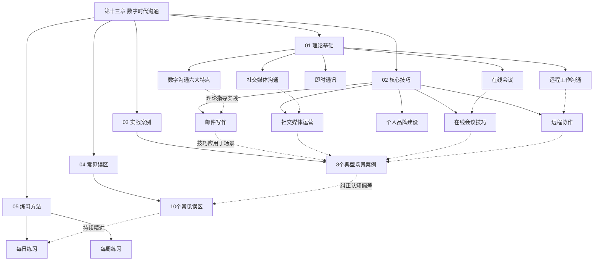
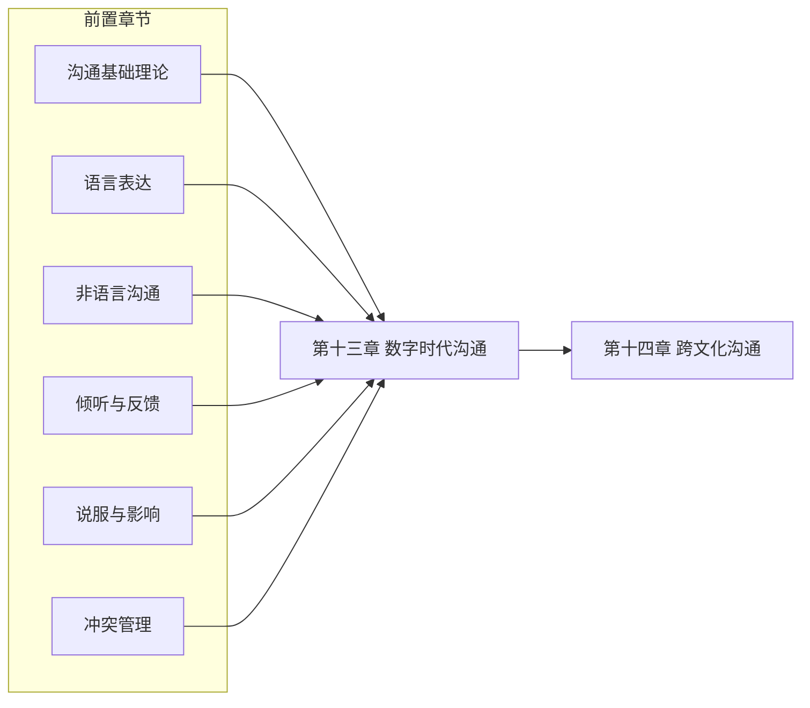

# 第十三章 数字时代沟通

## 章节定位

本章是"沟通表达全书"的第十三章，承接前面章节对沟通本质、语言表达、非语言信号、倾听、说服、冲突管理等核心能力的系统论述，聚焦于一个全新的维度——**数字环境下的沟通实践**。

如果说前十二章构建的是沟通的"通用操作系统"，那么本章要解决的是：当沟通从面对面的物理空间迁移到屏幕背后的数字空间时，这套操作系统需要怎样升级和适配？

这不是一个可选的附加模块。2025年的职场数据显示，中国白领平均每天花费4.2小时进行数字沟通（邮件、即时通讯、视频会议、协作文档），占总工作时间的52%以上。数字沟通能力不再是"锦上添花"，而是决定职业发展和人际关系质量的核心基础设施。

## 一、为什么数字时代沟通值得单独成章

### 1.1 从书信到即时通讯：沟通媒介的三次革命

人类沟通史经历了三次根本性的媒介革命，每一次都深刻改变了沟通的规则和能力要求：

**第一次革命：文字的发明（约公元前3200年）**
文字使沟通突破了"面对面"的限制，但信息传递的速度受限于物理载体——竹简、纸张、信使。书信沟通的典型特征是：精心构思、措辞考究、传递缓慢、一对一。这个时代的沟通能力核心是"写作能力"。

**第二次革命：电子通信（19世纪末-20世纪）**
电话、电报、广播、电视使信息传递速度接近光速。沟通从"异步"变为"可同步"，但设备和基础设施限制了普及程度。这个时代的沟通能力核心是"口头表达能力"和"媒体素养"。

**第三次革命：互联网与移动通信（21世纪至今）**
智能手机和移动互联网使数字沟通无处不在、无时不有。沟通不再只是人与人之间的信息传递，而是融合了人机交互、算法推荐、多媒体表达、社群运营的复杂系统。这个时代的沟通能力核心是**"数字沟通素养"——在碎片化、多媒体、算法驱动的环境中，高效、得体、有影响力地传递信息和建立关系的能力**。

### 1.2 传统沟通技能的"失灵"现象

许多在面对面沟通中表现出色的人，进入数字环境后频频"翻车"。原因在于数字沟通引入了六个传统沟通不需要面对的新变量：

| 变量 | 面对面沟通 | 数字沟通 | 影响 |
|------|-----------|---------|------|
| 时间结构 | 同步为主 | 同步与异步并存 | 需要判断"何时回复"和"用什么节奏沟通" |
| 信息载体 | 语音+肢体语言为主 | 文字为主，多媒体辅助 | 非语言线索大量丢失，误解概率上升 |
| 记录性 | 转瞬即逝 | 天然可记录、可追溯 | 每句话都可能被截图、转发、反复审视 |
| 空间约束 | 必须在场 | 随时随地 | 沟通无边界，工作与生活界限模糊 |
| 信息密度 | 受限于说话速度 | 爆炸式增长 | 注意力成为稀缺资源 |
| 中介机制 | 无 | 算法、平台规则 | 内容可见性不再由发布者完全控制 |

这六个变量的叠加效应，使得数字沟通不是"把面对面沟通搬到线上"那么简单，而是需要一套全新的认知框架和行为模式。

### 1.3 数字沟通能力的商业价值

数字沟通能力不是软技能中的"加分项"，而是直接影响组织效能和商业结果的核心能力：

- **邮件效率**：McKinsey的研究显示，知识工作者平均每周花费28%的工作时间处理邮件。一封结构清晰的邮件可以减少3-5轮的来回确认，为团队节省可观的时间成本
- **会议质量**：Harvard Business Review的调查表明，71%的高管认为会议是低效和浪费时间的。掌握在线会议设计原则，可以将会议效率提升40%以上
- **远程协作**：GitLab的全远程团队实践证明，系统化的异步沟通规范可以将项目交付速度提升25%，同时降低员工倦怠率
- **社交媒体影响力**：LinkedIn的数据显示，拥有完整且活跃的LinkedIn档案的专业人士，获得商业机会的概率是普通用户的2.7倍

## 二、本章核心内容

本章围绕"理论基础→核心技巧→实战应用→误区纠正→持续精进"的完整学习链条展开，共分五个部分。

### 第一部分：理论基础（01-理论基础）

建立数字沟通的认知框架，是后续所有技巧和应用的基础。本部分涵盖两大模块：

**模块一：数字沟通的六大核心特点**

深入分析数字沟通区别于传统沟通的六个底层特征，每个特征都配有具体场景、数据支撑和实践启示：

1. **即时性与异步性并存**——数字沟通同时支持实时对话和延时回应，关键在于"模式选择"能力：什么场景用即时通讯，什么场景用邮件，什么场景用视频会议
2. **多媒体融合**——文字、图片、语音、视频、文件在同一条消息中混合传递，核心挑战是选择"最适合当前信息的媒介形式"
3. **可记录与可追溯**——每条数字信息都可以被保存、搜索和回溯，这意味着"白纸黑字"意识是数字沟通的基本素养
4. **去空间化**——地理位置不再是沟通的障碍，但文化差异、时区协调、归属感稀释随之而来
5. **信息过载风险**——便捷性带来信息量爆炸，对抗过载需要系统化的信息管理策略
6. **非语言线索缺失**——梅拉宾法则告诉我们，面对面沟通中93%的信息通过非语言渠道传递；纯文字的数字沟通中，这些渠道全部丢失

**模块二：四大数字沟通形态**

分析数字沟通最主要的四种场景形态，每种形态都有独特的规律和最佳实践：

- **社交媒体沟通**：公开性与私密性的光谱、算法中介机制、四层沟通模型（广播层→互动层→社群层→私域层）
- **远程工作沟通**：信息不对称、信任建立困难、沟通成本上升、工作生活边界模糊四大挑战及其应对
- **在线会议**：Zoom疲劳的心理学机制、会议设计五原则、高效主持技巧
- **即时通讯**：即时陷阱、消息分级、即时通讯礼仪

### 第二部分：核心技巧（02-核心技巧）

在理论基础上提供五个核心技能模块的实操指南，每个模块都有具体步骤、模板和示例：

| 技能模块 | 核心内容 | 关键工具/方法 |
|----------|---------|--------------|
| 邮件写作 | 主题行设计、正文结构、语气措辞、抄送礼仪、附件管理 | 倒金字塔结构、主题行黄金公式 |
| 社交媒体运营 | 平台选择、内容策略、互动技巧、危机处理 | HEAT内容原则、SPEED危机处理框架 |
| 在线会议技巧 | 会前准备、会中主持、会后跟进 | 五项设计原则、主持清单模板 |
| 远程协作 | 异步沟通规范、项目管理工具、团队信任建立 | 沟通宪章模板、文档化最佳实践 |
| 个人品牌建设 | 数字形象管理、内容输出策略、专业影响力构建 | 平台矩阵规划、内容日历模板 |

### 第三部分：实战案例（03-实战案例）

通过八个典型场景的深度案例分析，将理论和技巧落地到真实工作情境中。每个案例都包含：场景描述、问题诊断、解决方案、效果对比、关键启示。

1. **工作邮件——跨部门项目协调**：一封邮件如何推动三个部门的协同
2. **微信沟通——客户关系维护**：日常微信沟通中的专业度把控
3. **视频会议——远程团队管理**：如何主持一场高效的跨时区团队会议
4. **社交媒体——品牌危机公关**：负面舆情爆发时的24小时应对流程
5. **在线客服——投诉处理**：从愤怒到满意的数字化客户体验
6. **远程面试——求职展示**：通过屏幕展现最佳状态的完整策略
7. **网络社群——知识分享与影响力构建**：从社群小白到意见领袖的成长路径
8. **数字营销——内容传播策略**：让好内容被看到的系统化方法

### 第四部分：常见误区（04-常见误区）

数字沟通中有十个广泛存在但鲜被察觉的认知和行为误区。本部分不仅揭示误区本身，更深入分析误区产生的心理机制，并提供可操作的纠正方案。这些误区包括但不限于：

- "即时回复等于高效"
- "表情包可以替代文字表达"
- "群发等于广泛传播"
- "线上沟通不需要注意形象"
- "打字速度等于沟通速度"

### 第五部分：练习方法（05-练习方法）

提供系统化的每日和每周练习计划，覆盖邮件优化、社交媒体内容创作、在线会议模拟、远程协作演练等多个维度。练习设计遵循"最小可行习惯"原则——每天15分钟的刻意练习，持续4周即可形成新的沟通习惯。

## 三、学习目标

完成本章学习后，读者将能够：

**认知层面：**
1. 理解数字沟通与传统沟通的本质差异，建立数字沟通的认知框架
2. 识别数字沟通环境中的关键变量（时间结构、信息载体、记录性、空间约束、信息密度、中介机制），并据此做出正确的沟通策略选择

**技能层面：**
3. 掌握专业邮件写作的完整体系——从主题行设计到正文结构，从语气把控到附件管理——提升邮件沟通效率
4. 运用社交媒体进行有效的专业沟通，建立个人数字品牌形象
5. 主持和参与高质量的在线会议，显著减少无效会议时间
6. 在远程工作环境中建立高效协作机制，维护团队凝聚力和信任度

**应用层面：**
7. 识别和避免数字沟通中的常见误区，减少沟通失误
8. 制定并执行个人数字沟通能力提升计划，实现持续精进

## 四、本章结构图

**图示说明**：本章遵循"理论→技巧→应用→反思→练习"的闭环学习路径。理论基础为技巧提供底层逻辑，核心技巧为实战案例提供方法论，实战案例为误区纠正提供具体场景，练习方法则将所有知识转化为长期能力。

## 五、前置知识与学习路径

### 5.1 前置知识

阅读本章前，建议读者已掌握以下基础：

- **沟通基础概念**：了解沟通的基本模型（发送者→信息→渠道→接收者→反馈）
- **语言表达能力**：具备基本的书面和口头表达能力
- **非语言沟通基础**：理解肢体语言、语调、表情在沟通中的作用（本章会重点分析这些要素在数字环境中如何缺失和补偿）
- **基本的数字工具使用能力**：会使用电子邮件、即时通讯工具、视频会议软件

如果对上述某些内容不够熟悉，建议先阅读本书前面相关章节，再进入本章学习。

### 5.2 推荐学习路径

不同背景的读者可以根据自身需求选择最高效的学习路径：

**路径一：快速上手（2-3小时）**

适合：需要快速提升数字沟通实用技能的职场新人、转岗人员

02 核心技巧（邮件写作 + 社交媒体运营）
    ↓
03 实战案例（选择与自己工作相关的2-3个案例）
    ↓
04 常见误区（快速浏览，对照检查自己的习惯）

**路径二：系统学习（5-8小时）**

适合：希望全面建立数字沟通能力体系的中层管理者、项目经理

01 理论基础（完整阅读，建立认知框架）
    ↓
02 核心技巧（完整阅读，重点标注与自己相关的部分）
    ↓
03 实战案例（完整阅读，结合自身经历反思）
    ↓
04 常见误区（完整阅读，逐一对照检查）
    ↓
05 练习方法（选择2-3个练习开始执行）

**路径三：深度研究（持续学习）**

适合：自由职业者、创业者、内容创作者、需要建立个人数字品牌的专业人士

完整阅读全部内容
    ↓
重点深入：02中的社交媒体运营 + 个人品牌建设
    ↓
重点深入：03中的网络社群 + 数字营销案例
    ↓
执行05中的完整练习计划（4周）
    ↓
定期回顾本章内容，根据实践反馈更新个人策略

## 六、本章在全书中的位置

本章是对前面所有沟通能力的**数字化适配**。它不重复前面章节的理论，而是回答一个关键问题：**当沟通从面对面迁移到屏幕背后时，那些经典理论和技巧需要怎样调整？**

例如：
- 前面章节讲"肢体语言占沟通信息的55%"，本章要回答"当肢体语言不可见时，如何补偿？"
- 前面章节讲"倾听是沟通的基础"，本章要回答"在文字聊天中如何'倾听'？"
- 前面章节讲"冲突管理的五个策略"，本章要回答"在微信群里发生冲突时如何处理？"

同时，本章也为下一章"跨文化沟通"提供数字场景的基础——越来越多的跨文化沟通发生在数字环境中，理解数字沟通的规律是理解跨文化数字沟通的前提。

## 七、关键数据速览

在开始正式学习前，以下数据帮助读者建立对数字沟通规模和重要性的直观认知：

| 指标 | 数据 | 来源 |
|------|------|------|
| 全球每日电子邮件发送量 | 超过3600亿封 | Statista, 2024 |
| 微信月活跃用户 | 超过13.8亿 | 腾讯2024年Q3财报 |
| 中国白领日均数字沟通时间 | 4.2小时 | 智联招聘2024调研 |
| 视频会议日均参与人次（Zoom） | 超过3亿 | Zoom 2024年度报告 |
| 知识工作者每周处理邮件时间占比 | 28% | McKinsey Global Institute |
| 视频会议中做过无关事情的参与者比例 | 71% | Microsoft WorkLab, 2023 |
| 职场人期望工作消息回复时间 | 1小时内 | Slack State of Work, 2023 |
| 被打断后恢复专注所需时间 | 平均23分钟 | UC Irvine研究 |

这些数据传递了一个明确的信号：**数字沟通不是未来趋势，而是当下的现实**。掌握数字沟通能力的投入产出比极高——它影响你每天4小时以上的专业产出质量。
