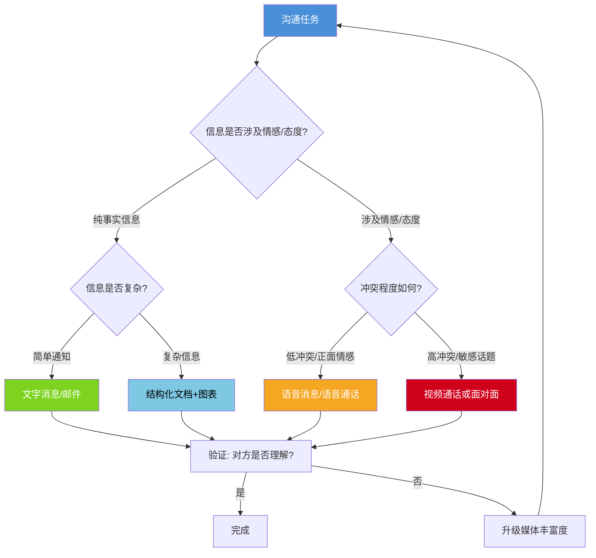
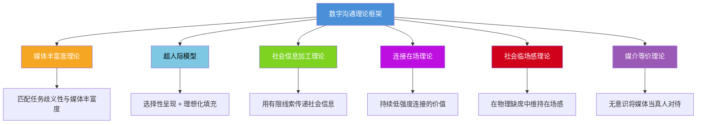
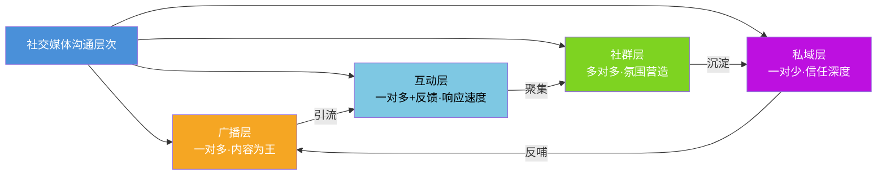
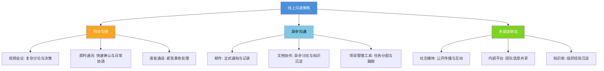
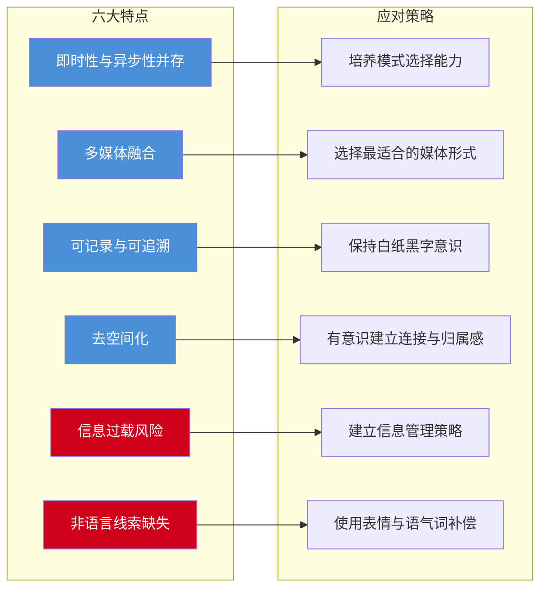
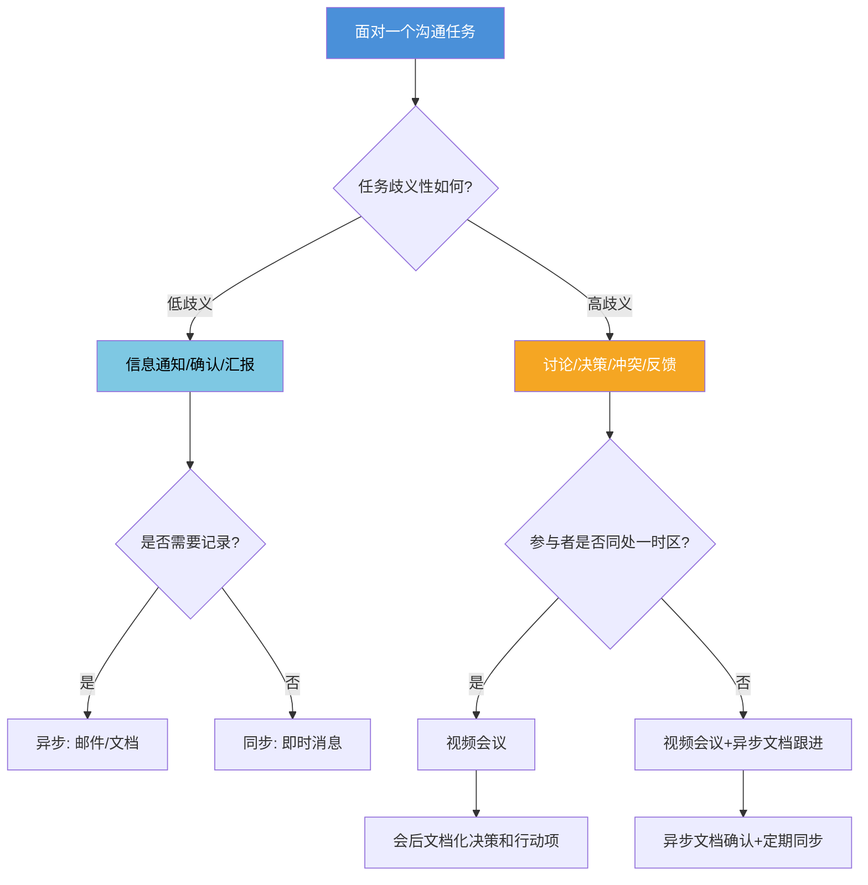

# 理论基础：数字时代沟通的底层逻辑

## 引言：从面对面到屏幕之间

人类沟通的历史经历了几次根本性的跃迁——从口耳相传到文字发明，从印刷术到电报电话，每一次媒介变革都深刻改变了沟通的方式和规则。我们正在经历的数字化跃迁，其深度和广度远超以往任何一次。

理解数字沟通的理论基础，不是为了成为学术研究者，而是为了建立一个**可靠的思维框架**，让你在面对任何数字沟通场景时，都能快速判断：该用什么工具、什么语气、什么节奏、什么深度。这个框架是后续所有核心技巧和实战方法的地基。

本章将从数字沟通的底层特征出发，逐一拆解权威理论模型，然后深入社交媒体、远程工作、在线会议、即时通讯四大形态的系统理论，最后探讨 AI、跨文化、数字健康等前沿议题，以及帮你定位自身水平的自评框架。

---

## 第一节 数字沟通的六大核心特征

数字时代的沟通方式与传统面对面沟通存在本质性差异。理解这些差异不是学术练习，而是掌握数字沟通技能的根基。只有深刻理解数字沟通的底层特征，才能在实际应用中做出正确的判断和选择。

### 一、即时性与异步性并存

数字沟通最显著的特征是打破了时间的线性约束。传统沟通要么是同步的（面对面交谈、电话），要么是异步的（书信）。而数字沟通同时具备两种模式，且可以在两者之间灵活切换。

**即时性维度**：微信消息、即时通讯工具可以在毫秒级别传递信息，视频通话实现了跨地域的实时互动。这种即时性极大地提高了沟通效率，但也带来了新的问题——人们对回复速度产生了不切实际的期望。根据 Radicati Group 的研究，全球每天发送约 3330 亿封电子邮件，而职场人平均每天查看邮件 74 次。75% 的职场人期望工作消息在 1 小时内得到回复，而实际的合理回复窗口往往需要更长。

**异步性维度**：电子邮件、论坛帖子、协作文档允许参与者在各自方便的时间进行沟通。这种异步性是远程工作和跨时区协作的基础。然而，异步沟通需要更清晰的表达和更完善的上下文，因为接收者无法通过即时追问来澄清模糊信息。Clark 和 Brennan（1991）在《Grounding in Communication》中指出，沟通双方需要不断建立"共同基础"（common ground），而异步沟通中建立共同基础的成本远高于同步沟通。

**模式选择矩阵**：成熟的数字沟通者需要具备"模式选择"能力。以下矩阵可以帮助快速判断：

| 沟通场景 | 推荐模式 | 推荐工具 | 原因 |
|----------|---------|---------|------|
| 紧急且重要的确认 | 同步即时 | 电话/语音通话 | 最快获得回应 |
| 简单确认性问题 | 同步/准即时 | 微信/钉钉消息 | 轻量、留痕 |
| 复杂讨论与决策 | 同步+异步结合 | 视频会议→邮件纪要 | 需要互动+记录 |
| 信息通知与汇报 | 异步 | 邮件/协作文档 | 给对方消化时间 |
| 跨时区协作 | 异步优先 | 项目管理工具+文档 | 尊重时区差异 |
| 头脑风暴 | 同步 | 视频会议/白板工具 | 需要实时碰撞 |
| 正式请求与审批 | 异步 | 邮件/OA系统 | 需要记录和流程 |
| 情感关怀与关系维护 | 同步优先 | 语音/视频通话 | 需要情感线索 |
| 知识传授与培训 | 异步+同步结合 | 录播视频+直播答疑 | 按自己节奏学习+互动 |

**实践中的常见错误**：很多人习惯用即时消息处理所有事情，导致"伪同步"——看起来在即时对话，实际上每条消息之间间隔数分钟，既没有同步沟通的效率，也没有异步沟通的深度。判断标准很简单：如果一个话题需要超过 3 条消息才能说清楚，就应该考虑切换到语音或视频；如果不需要对方立刻回复，就应该用异步方式。

### 二、多媒体融合

数字沟通不再局限于文字。一个微信消息可以同时包含文字、图片、语音、视频、文件、链接、位置信息和表情符号。这种多媒体融合极大地丰富了表达的维度，但也提高了沟通的复杂性。

**媒体丰富度理论**（Media Richness Theory）由 Daft 和 Lengel 于 1986 年提出，该理论认为不同沟通媒介在传递信息的能力上存在差异。媒体丰富度由四个维度衡量：反馈速度、多渠道线索、语言多样性、个人化程度。按丰富度从高到低排列：

面对面 > 视频通话 > 语音通话 > 即时消息 > 电子邮件 > 正式文档

**关键原则——匹配假说**：沟通任务的模糊性越高，所需媒体丰富度越高。简单信息通知用文字消息即可，但传达坏消息、处理冲突、进行绩效反馈等高模糊性任务，应当选择高丰富度媒体。

**媒体丰富度与任务匹配的决策树**：

多媒体融合的实战考量：

| 媒体形式 | 最佳用途 | 风险与限制 | 使用频率建议 |
|----------|---------|-----------|------------|
| 纯文字 | 事实陈述、流程说明、正式通知 | 缺乏情感线索，易产生误解 | 高频，日常主力 |
| 表情符号 | 补充情感、缓和语气 | 职场正式场合慎用，含义因人而异 | 中频，辅助使用 |
| 语音消息 | 传递语气和情感、解释复杂概念 | 不便检索、不能跳听、环境噪音 | 低频，非正式场景 |
| 图片/截图 | 展示数据、记录证据、直观说明 | 文件大小、隐私泄露风险 | 中频，按需使用 |
| 视频 | 产品演示、情感连接、复杂教学 | 制作成本高、流量消耗 | 低频，重点场景 |
| 文件/文档 | 资料共享、合同签署、知识沉淀 | 版本混乱、格式兼容问题 | 中频，协作场景 |
| 屏幕共享 | 远程支持、代码审查、设计评审 | 暴露隐私信息（通知弹窗等） | 低频，专业场景 |
| GIF/动图 | 活跃气氛、表达情绪、社交互动 | 专业性存疑、部分平台不支持 | 低频，社交场景 |
| 位置信息 | 约定见面地点、物流配送 | 隐私风险 | 极低频，按需使用 |

**信息密度优化**：一张精心设计的图表可能比一千字的描述更精确。但"精心设计"是前提——粗糙的截图、模糊的照片、未经编辑的长语音，反而会降低沟通效率。选择媒体形式的原则是"最适合传递当前信息的媒体就是最好的媒体"，不要为了炫技而使用多媒体，也不要因为习惯而固守纯文字。

**语音消息的黄金法则**：语音消息在中文职场中使用率极高，但也是最容易引发不满的媒体形式。核心原则：(1) 单条不超过 60 秒；(2) 发送前想清楚要说什么，避免"嗯""啊"等口头禅；(3) 在对方可能不方便听的场景（会议、公共场合）改用文字；(4) 重要信息不要只用语音说，用文字再确认一遍。一条好的语音消息应该像一封简短的语音邮件——有称呼、有主题、有请求、有结尾。

### 三、可记录与可追溯

数字沟通天然具有可记录性。每一封邮件、每一条聊天记录、每一场会议录像都可以被保存、搜索和回溯。这一特点带来了深远的影响。

**积极面**：

- **决策凭证**：沟通记录可以作为决策依据和责任界定的凭证。当出现"我当时说过吗"的争议时，聊天记录就是最有力的证据
- **知识传承**：新成员可以通过历史记录快速了解项目背景、决策逻辑和团队文化
- **持续改进**：通过回顾历史沟通，可以发现沟通模式中的问题并加以改进
- **异步参考**：记录让信息可以被反复查阅，不需要反复追问
- **法律保护**：在商业纠纷、劳动争议中，完整的沟通记录是最有效的自我保护手段

**挑战面**：

- **"互联网没有遗忘"**：不当言论可能被永久保存和传播。2023 年多起公众人物因历史聊天记录被翻出而引发舆论危机的事件说明，数字记录的保质期是永久的
- **断章取义风险**：沟通记录可能脱离语境被解读。一段在特定语境下完全合理的对话，被截取片段后可能产生完全不同的含义
- **坦诚抑制效应**：记录的永久性可能抑制开放和坦诚的沟通。人们在知道"每一句话都会被记录"的环境中，可能变得更加谨慎和"正确"，从而失去真实的对话
- **存储与管理成本**：海量的沟通记录需要存储空间和管理策略，否则有用信息会被淹没在信息洪流中

**数字记录管理原则**：

1. **分级存储**：关键决策记录长期归档，日常闲聊定期清理
2. **语境标注**：重要记录附加语境说明，避免未来被误读
3. **隐私边界**：明确哪些对话可以分享、哪些属于私密沟通
4. **定期回顾**：将有价值的沟通记录提炼为知识文档
5. **格式标准化**：建立统一的文档命名和归档规则，让记录可搜索、可检索

**"白纸黑字"意识的培养**：在数字时代，"口头承诺"的效力大幅下降。重要事项一定要有文字记录——不是因为不信任对方，而是因为人类记忆本身就是不可靠的。一条好的确认消息模板："根据我们刚才的讨论，确认以下几点：1）XX；2）XX；3）XX。如有遗漏或理解偏差请指正。"这既是对自己的保护，也是对合作方的尊重。

### 四、去空间化

数字沟通打破了地理空间的限制。一个项目团队可以分布在北京、纽约、伦敦和班加罗尔，通过数字工具实现无缝协作。这种去空间化的能力是全球化和远程工作的基础。

**社会临场感理论**（Social Presence Theory）由 Short、Williams 和 Christie 于 1976 年提出，描述了不同媒体传递"他人在场感"的能力。面对面交流具有最高的社会临场感，而纯文字消息的临场感最低。去空间化沟通的核心挑战在于：如何在物理缺席的情况下维持足够的社会临场感。

**去空间化的代价**：

- **文化差异放大**：不同文化背景的沟通者在同一平台上互动时，高语境文化（如中国、日本）依赖大量非语言线索和共同语境来传递信息，而低语境文化（如美国、德国）更依赖明确的文字表达。当数字沟通削减了非语言线索，高语境文化的沟通者会感到更大的表达困难
- **时区协调困难**：跨时区团队的实时沟通窗口有限。一个横跨 UTC-8（旧金山）到 UTC+8（北京）的团队，每天只有约 2-3 小时的重叠工作时间
- **归属感稀释**：缺少物理共处的空间，团队成员可能感到孤立。Buffer 的远程工作调查显示，孤独感是远程工作者面临的第二大挑战（仅次于无法断开工作）
- **信任衰减**：面对面互动中的信任建立速度约为纯文字沟通的 3-5 倍（Riegelsberger et al., 2003）。物理共处中那些看似无意义的细节——一起等电梯、午餐闲聊、会议室里的笑声——实际上是信任的微观基础

**补偿策略**：

- 定期的非正式沟通（虚拟咖啡聊天、线上团建）
- 建立"虚拟走廊"——一个专门用于非工作话题的群聊频道
- 明确的沟通规范和响应期望
- 使用高临场感媒体（视频）进行关键沟通和关系建立
- 记录并分享"水 cooler 时刻"（办公室闲聊的文化等价物）
- **虚拟共处仪式**：比如每天早上在群里发一句"开工了"、每周五下午的虚拟下午茶、新人入职时的线上欢迎仪式——这些看似形式化的行为，实际上是在数字空间中重建物理共处的仪式感

### 五、信息过载风险

数字沟通的便捷性导致了信息量的爆炸式增长。一个中层管理者每天可能收到 200 封以上的邮件、数百条微信消息、多个群聊的通知。McKinsey 的研究显示，知识工作者平均花费 28% 的工作时间在阅读和回复邮件上，另外 20% 的时间在寻找内部信息或联系同事获取信息。

信息过载的四重表现：

| 表现 | 具体症状 | 后果 |
|------|---------|------|
| 注意力碎片化 | 频繁的通知打断深度工作，无法维持超过 25 分钟的专注 | 深度工作能力退化，创造力下降 |
| 重要信息被淹没 | 关键信息隐藏在大量日常消息中，需要反复翻找 | 决策延误，重要事项遗漏 |
| 决策疲劳 | 过多的信息输入导致判断力下降 | 决策质量下降，拖延增加 |
| 响应质量下降 | 为了处理大量消息，回复变得草率和敷衍 | 沟通效果差，误解增多 |
| 信息焦虑 | 担心遗漏重要信息，不停检查各种消息源 | 精神疲惫，工作满意度下降 |
| 效率幻觉 | 忙于处理消息产生"很忙=很有效"的错觉 | 实际产出与忙碌程度不成正比 |

**信息过载的认知科学解释**：人类工作记忆的容量约为 7±2 个信息块（Miller, 1956）。当同时涌入多个对话线索、多个群聊通知、多封未读邮件时，认知负荷迅速超载，导致注意力切换成本急剧上升。Mark 等人（2008）的研究发现，被打断后平均需要 23 分钟才能恢复到之前的专注状态。更值得警惕的是，Herbert Simon 在 1971 年就预言："信息的丰富必然导致注意力的贫乏。"在一个信息几乎免费的时代，注意力成为最昂贵的资源。

**对抗信息过载的系统策略**：

1. **消息分级制度**：将消息分为紧急/重要/普通三级，对应不同的响应时间
2. **定时批处理**：每天设定 2-3 个固定时段集中处理消息，而非随时响应
3. **通知管理**：关闭非关键应用的通知，使用"勿扰模式"保护专注时间
4. **定期清理**：退订不再有价值的群聊和订阅，减少信息输入源
5. **发送者责任**：在发送信息时也要有"接收者视角"——你的消息是在帮助对方还是在增加对方的信息负担
6. **信息节食**：像管理饮食一样管理信息摄入——定期"体检"（审视自己的信息源）、"断食"（暂时切断信息流）、"均衡营养"（确保信息来源的多样性）
7. **工具辅助**：使用 RSS 聚合器、邮件过滤规则、消息分类机器人等工具自动化信息管理

### 六、非语言线索缺失

这是数字沟通最根本的局限。在面对面沟通中，55% 的信息通过肢体语言传递，38% 通过语调传递，只有 7% 通过文字内容传递——这是被广泛引用的梅拉宾法则（Mehrabian, 1971）。

**重要澄清**：梅拉宾本人多次强调，这个比例仅适用于"情感和态度"的传递场景（如表达喜欢或不喜欢），并非适用于所有沟通场景。在传递事实性信息（如项目进度、技术方案）时，文字内容的重要性远高于 7%。但核心观点依然成立：在涉及态度、情感、关系的沟通中，非语言线索的作用远超文字本身。

在纯文字的数字沟通中，我们失去了大量的情感和态度传递渠道。其后果包括：

- **误解率上升**：中性的文字容易被解读为负面。"好的"和"好的。"在微信中的语气差异，可能引发完全不同的理解。研究显示，纯文字消息中情感误读率高达 50%（Byron, 2008），即发送者认为自己表达的情感和接收者实际感知的情感之间存在显著偏差
- **情感连接困难**：难以建立深层次的信任和共情，关系建立速度更慢
- **说服力下降**：缺少语气和表情的辅助，论证的感染力减弱
- **冲突升级**：缺乏即时的情感反馈，小分歧可能快速升级为大冲突
- **归属感降低**：团队成员之间缺少"有温度"的互动，关系停留在工具性层面

**补偿策略体系**：

| 策略 | 具体做法 | 适用场景 |
|------|---------|---------|
| 表情符号补偿 | 用😊🙂等补充语气 | 日常消息，但正式场合慎用 |
| 语气词显式化 | "我觉得还不错"→"我觉得还不错呀~" | 需要缓和语气的文字 |
| 媒体升级 | 文字说不清时切换为语音或视频 | 复杂讨论、情绪化话题 |
| 善意推定 | 默认对方没有恶意，主动澄清再判断 | 收到可能被误解的消息时 |
| 情感标注 | "（开心地说）"或直接说明感受 | 需要明确传递情感时 |
| 回应确认 | "我理解你的意思是……对吗？" | 重要信息确认 |
| 时间语境化 | "现在是深夜发这条消息，不是在催你" | 非常规时间发送消息时 |
| 正面比率校准 | 文字沟通中正面表达与中性表达的比例提高到 5:1 | 维护长期关系 |

**文字沟通中的"情感安全区"建设**：既然文字容易被误解，就需要有意识地建立"情感安全区"——在关系初期投入更多精力去建立积极的沟通基调，这样即使后续出现模糊表达，对方也会倾向于善意解读。具体做法：(1) 早期沟通中多使用明确的正面表达；(2) 重要关系中定期用语音/视频"校准"情感状态；(3) 发生误解时立即修复，不要让负面解读累积。

---

## 第二节 数字沟通的权威理论模型

理解了六大核心特征后，我们需要更系统化的理论框架来指导实践。以下是数字沟通领域最重要的几个理论模型。

### 一、媒体丰富度理论与媒体同步性理论

**媒体丰富度理论**（Media Richness Theory, Daft & Lengel, 1986）在上一节已简要介绍。这里补充其对实践的核心指导意义：

该理论认为，沟通任务可以按"歧义性"（equivocality）分为高低两类。低歧义性任务（如通知会议时间）用低丰富度媒体即可；高歧义性任务（如讨论产品方向争议）需要高丰富度媒体来消除误解。

**媒体同步性理论**（Media Synchronosity Theory, Dennis et al., 2008）是媒体丰富度理论的升级版。它不再只看"丰富度"，而是聚焦于媒体支持"同步"行为的能力，由五个维度构成：

1. **传输速度**：信息从发送到接收的速度
2. **并行处理**：能否同时进行多个沟通
3. **符号集多样性**：支持多少种表达符号
4. **可复现性**：信息能否被回看和引用
5. **再加工能力**：发送前能否反复修改

不同任务对这五个维度的需求不同。例如，谈判需要高速传输和丰富符号集，而文档审批需要高可复现性和再加工能力。

**两个理论的实践对比**：

| 维度 | 媒体丰富度理论 | 媒体同步性理论 |
|------|-------------|-------------|
| 核心指标 | 媒体的信息传递能力 | 媒体支持同步行为的能力 |
| 关键变量 | 歧义性（equivocality） | 传输速度、并行处理等五个维度 |
| 适用场景 | 选择沟通渠道 | 优化沟通过程 |
| 局限性 | 忽略了个人偏好和组织文化 | 维度较多，实操判断复杂 |
| 实践建议 | 高歧义任务选高丰富度媒体 | 根据任务特征组合使用媒体 |

**实践指导**：不要执着于"用最先进的工具"，而要根据任务特征选择最匹配的媒体。一个常见误区是"视频会议比文字消息更好"——并非如此。如果你只需要确认一个数据，一条文字消息比开一个视频会议高效 100 倍。

### 二、超人际模型

**超人际模型**（Hyperpersonal Model, Walther, 1996）解释了一个反直觉的现象：在某些情况下，计算机中介沟通（CMC）中建立的关系亲密程度可以**超过**面对面沟通。

原因在于 CMC 环境中的四重"放大效应"：

1. **发送者选择性自我呈现**：文字沟通允许发送者精心编辑每一条消息，呈现最理想的自我形象
2. **接收者理想化填充**：缺少非语言线索时，接收者倾向于用积极的方式填充信息空白
3. **信道的异步优势**：回复前有更多时间思考和编辑，避免了面对面交流中的口误和尴尬
4. **行为确认循环**：发送者的精心呈现 + 接收者的理想化解读 = 双方都对关系持更积极的感知

**超人际效应的两面性**：

积极面：内向者可能在文字沟通中表现得更自信、更有魅力。研究表明，性格内向的员工在异步文字沟通中的参与度和影响力显著高于面对面会议（Walther, 2007）。数字环境为性格内向者提供了"社交公平"的机会。

消极面：这解释了为什么网恋"见光死"的概率较高——当线上精心构建的形象遇到线下未经编辑的真实时，落差会导致失望。在职场中，过度依赖文字沟通的远程团队也可能出现类似的"超人际泡沫"：线上协作看起来很和谐，但当团队成员第一次线下见面时，才发现存在未被察觉的深层分歧。

**应对**：定期使用视频沟通来"校准"人际关系，避免过度理想化。具体节奏建议：新关系建立初期每周至少一次视频互动，稳定期每月一次线下或深度视频交流。

### 三、计算机中介沟通的社会信息加工理论

**社会信息加工理论**（Social Information Processing Theory, SIP, Walther, 1992）指出，CMC 用户与面对面沟通者一样需要建立关系和传递社会信息，但他们需要更长的时间来完成这个过程。

核心观点：CMC 不是"缺少社会线索"，而是"用不同的方式传递社会线索"。用户会利用有限的线索（文字选择、标点符号、表情符号、回复速度、消息长度等）来传递和解读社会信息。

**SIP 理论揭示的数字社会线索**：

| 线索类型 | 具体表现 | 传递的社会信息 |
|----------|---------|-------------|
| 回复速度 | 秒回 vs 几小时后回复 | 重视程度、优先级判断 |
| 消息长度 | 长消息 vs 短消息 | 投入程度、对话兴趣 |
| 标点符号 | "好"vs"好！"vs"好~" | 情绪状态、态度温度 |
| 表情使用 | 无表情 vs 适当表情 vs 表情轰炸 | 亲和力、专业度判断 |
| 段落结构 | 整段 vs 分条列出 | 组织能力、认真程度 |
| 称呼方式 | 全名 vs 昵称 vs 不称呼 | 亲疏关系、尊重程度 |
| 用词风格 | 正式 vs 口语 vs 网络用语 | 文化认同、距离感 |

**实践意义**：不要假设纯文字沟通就无法建立关系。通过有意识地使用文字中的社会线索（语气词、表情符号、个性化的表达风格），完全可以在数字环境中建立深度关系。关键是有意识地使用这些线索，而非依赖无意识的非语言信号。比如，在给重要合作伙伴发消息时，称呼用昵称而非全名、结尾加一句轻松的话、适当使用表情符号——这些微小的信号积累起来，就能在纯文字环境中构建出温暖的关系基调。

### 四、连接在场理论

**连接在场理论**（Connected Presence, Licoppe, 2004）描述了数字时代一种新的沟通形态：持续的、低强度的连接状态。微信消息的来回、朋友圈的点赞、群聊中的偶尔发言——这些都不是传统意义上的"对话"，而是一种"持续连接"的信号。

这种连接在场的意义在于：
- **关系维护**：低成本地维持弱连接关系
- **存在感知**："我知道你在，你也知道我在"
- **即时升级**：当需要时，可以迅速从低强度连接升级为高强度对话

**连接在场的实践策略**：

1. **轻互动清单**：朋友圈点赞、评论、节日祝福、分享有趣内容——这些"一分钟内完成"的互动，维护成本极低，但对关系的长期价值很高
2. **信号管理**：在线状态、最后登录时间、是否已读——这些平台提供的"元信号"本身就在传递社会信息。选择何时"在线"、何时"已读不回"，都是有意识的关系管理行为
3. **频率校准**：不同关系需要不同的连接频率。亲密关系可能需要每天互动，工作关系每周一次，弱连接每月一次即可

**实践意义**：不要忽视"轻互动"的价值。一个及时的点赞、一句简短的评论、一个节日祝福，都是维护关系网络的有效手段。研究表明，弱连接（weak ties）在信息获取和职业机会方面的价值往往超过强连接（Granovetter, 1973），而连接在场正是维护弱连接的最高效方式。

### 五、媒介等价理论与社会信息处理的补充视角

**媒介等价理论**（Media Equation Theory, Reeves & Nass, 1996）提出了一个有趣的发现：人们会无意识地将计算机和媒体当作"真实的人"来对待。这意味着：人们对 AI 客服的态度会遵循人际交往的礼貌规范；视频会议中"看着镜头"会触发"被注视"的社会反应；自动化消息如果过于机械，会引发类似"被冷落"的情感反应。

**实践启示**：在设计数字沟通时，考虑"如果这是面对面场景，我会怎么做？"——人类的社会本能并不会因为媒介改变而消失。一个有称呼、有寒暄、有结尾的邮件，比一封只有干巴巴信息的邮件更有效，因为我们的大脑仍然在用处理人际交往的方式来处理数字信息。

**去个体化效应**（Deindividuation Theory, Zimbardo, 1969 在数字环境中的延伸）：匿名或半匿名的数字环境（如论坛、匿名社交平台）会降低个人的自我意识和责任感，导致攻击性言论增加、群体极化加剧。这也解释了为什么网络暴力如此普遍——匿名消除了社会规范的约束力。

---

## 第三节 社交媒体沟通

社交媒体已经从单纯的社交工具演变为综合性的沟通平台，涵盖个人社交、企业营销、公共传播、舆论形成等多个维度。理解社交媒体沟通的规律，是数字时代沟通能力的重要组成部分。

### 一、社交媒体的沟通特征

**公开性与半公开性并存**：不同平台的公开程度差异巨大，这直接决定了沟通的内容和策略。

| 平台类型 | 代表平台 | 公开程度 | 沟通策略 |
|----------|---------|---------|---------|
| 完全公开 | 微博、Twitter/X、抖音 | 所有人可见 | 面向公众演讲，注意言论责任 |
| 半公开 | 微信朋友圈、小红书 | 好友/粉丝可见 | 可个性化但仍需考虑受众多样性 |
| 社群公开 | 微信群、Discord、Reddit | 群组/社区成员可见 | 遵守社群规范，考虑群体文化 |
| 私密 | 微信私聊、Telegram私聊 | 仅对话双方可见 | 可坦诚深入，但仍需数字记录意识 |

**算法中介**：社交媒体的内容分发不是简单的"发布即可见"，而是通过算法进行推荐和排序。各主流平台的算法逻辑有共性也有差异：

- **微信公众号**：社交推荐权重高（朋友在看），订阅号折叠后打开率下降到约 2-5%
- **抖音/TikTok**：完播率和互动率是核心指标，内容质量比粉丝数更重要
- **小红书**：搜索权重高，长尾流量好，关键词优化至关重要
- **微博**：热搜机制驱动，时效性强，话题标签策略重要
- **B站**：弹幕互动和完播率驱动，中长视频有优势
- **LinkedIn**：社交图谱权重高，评论互动比点赞权重更高
- **微信视频号**：社交推荐+算法推荐双引擎，私域导流能力强
- **知乎**：问答场景下专业度权重高，长内容有优势

**核心启示**：了解平台算法不是为了"讨好算法"，而是理解你的内容如何到达受众。内容质量永远是基础，算法理解是放大器。

**碎片化消费**：社交媒体用户的平均注意力持续时间极短。一条微博的平均阅读时间不超过 3 秒，一条短视频的前 3 秒决定了用户是否继续观看，一篇文章的前三句话决定了读者是否继续往下读。这要求社交媒体内容必须在极短的时间内抓住注意力。

### 二、社交媒体沟通的层次模型

社交媒体沟通不是单一维度的行为，而是分层的。不同层次需要不同的策略：

**第一层：广播层**——一对多的信息发布，如企业官方微博、个人公众号。核心指标是内容质量和传播策略。这一层的沟通本质上是"媒体"，需要有编辑思维：选题、标题、结构、视觉，每个环节都影响传播效果。

**第二层：互动层**——一对多但有互动反馈，如回复评论、参与话题讨论。核心是响应速度和互动质量。评论区的互动往往比正文更能影响受众对发布者的印象。一条有温度的评论回复，可能比一篇精心策划的文章更有效。

**第三层：社群层**——多对多的群体互动，如微信群、Discord 社群。核心是社群运营和氛围营造。社群不是"建个群拉人进来"就完事了——需要明确的定位、清晰的规则、持续的内容供给、活跃的核心成员、有效的冲突管理。

**第四层：私域层**——一对少或一对一的深度互动，如私信、小群。核心是关系维护和信任建立。私域流量的价值在于可以反复触达，且信任成本更低。

有效的社交媒体沟通策略需要在四个层次上都有所布局，而非只关注某一个层次。很多个人品牌的问题在于只做广播层（不停发内容），却忽视了互动层和社群层的建设。

**层次间的转化漏斗**：广播层触达 10000 人，互动层转化 500 人深度互动，社群层聚集 100 人核心成员，私域层沉淀 30 人高价值关系——这是典型的社交媒体影响力漏斗。每一层的转化率取决于上一层的内容质量和互动质量。

### 三、社交媒体沟通的核心原则

1. **价值优先**：每一条内容都应该为接收者提供某种价值——信息价值（学到新知识）、情感价值（被理解、被激励）、社交价值（社交货币，让人想分享）或娱乐价值（让人开心）。不提供任何价值的内容是噪音

2. **一致性**：个人或品牌的社交媒体形象应该保持一致。频繁变换风格、立场、人设会让受众困惑和不信任。一致性包括视觉风格、语气风格、价值观表达的一致

3. **真实性**：社交媒体用户对虚假和做作的容忍度越来越低。精心包装的"完美人设"正在被"真实且有瑕疵的人"所取代。真实不等于没有策略，而是策略建立在真实的基础之上

4. **适度性**：发布频率、互动深度、个人隐私的暴露程度都需要把握适度原则。过度发布是噪音，过度互动是打扰，过度暴露是风险

5. **长期主义**：社交媒体影响力的建立是长期积累的过程。追求短期的病毒式传播而牺牲长期的信誉，是最常见的战略性错误。一个持续输出优质内容 3 年的账号，其价值远超一个爆款过后沉寂的账号

6. **平台适配**：同一内容在不同平台需要调整表达形式。一篇 3000 字的深度文章适合知乎和公众号，但需要提炼为 140 字以内的微博摘要、3-5 张图文卡片的小红书笔记、1 分钟口播的短视频脚本。不是"一稿多发"，而是"一核多壳"

### 四、社交媒体危机沟通

社交媒体的公开性和病毒式传播能力，意味着任何负面事件都可能在数小时内演变为公关危机。

**危机传播的"黄金四小时"法则**：社交媒体时代的危机传播速度远超传统媒体。一条负面信息从发布到形成舆论热点，平均只需要 4 小时。如果在这个窗口期内没有做出有效回应，危机将进入失控阶段。

**危机响应的黄金框架**：

1. **速度**：在社交媒体上，沉默不是金，而是默认认错。第一个响应窗口通常在事件发生后 1-2 小时内
2. **透明**：坦诚面对问题，不要试图删除评论、掩盖事实或推卸责任
3. **共情**：先表达对受影响者的关心和理解，再解释原因和解决方案
4. **行动**：明确说明将采取的具体行动和时间表
5. **跟进**：危机不是一次性事件，需要持续跟进直到问题真正解决

**危机应对的常见致命错误**：

- **删帖控评**：在社交媒体时代，删帖行为本身会成为新的新闻素材，引发更大的信任危机
- **官方模板式回应**：千篇一律的"深表歉意，正在调查"只会火上浇油
- **推卸责任给"个别员工"**：公众不会接受这种甩锅逻辑
- **沉默等待风暴过去**：社交媒体的记忆虽短，但搜索引擎的记忆是永久的
- **情绪化对抗**：与网友对线是最糟糕的策略，即使你说的有理

**危机后的修复策略**：危机处理完毕后，需要 3-6 个月的持续正面内容输出来修复品牌认知。研究表明，危机后品牌的搜索量会持续偏高，这段时间是重建信任的关键窗口。

---

## 第四节 远程工作沟通

新冠疫情加速了远程工作的普及，但远程工作沟通的挑战并非始于疫情。早在分布式团队出现之初，如何在缺少面对面接触的情况下保持高效协作，就是组织管理的核心议题。

### 一、远程工作沟通的独特挑战

**信息不对称加剧**：在办公室环境中，大量的信息通过"走廊对话""午餐闲聊""路过时的点头"等非正式渠道传递。Allen（1977）的研究发现，工程师与其同事交流技术问题的概率随着物理距离的增加而急剧下降——距离超过 30 米后，交流频率接近于零。远程工作彻底切断了这些非正式渠道，导致信息不对称加剧。

**信任建立困难**：信任需要时间和互动来建立。在面对面环境中，信任可以通过共同用餐、眼神交流、肢体语言等丰富的互动来快速建立。而在远程环境中，信任的建立速度更慢，消解速度更快。Jarvenpaa 和 Leidner（1999）对全球虚拟团队的研究发现，远程团队的信任往往从"快速信任"（swift trust）开始，但如果缺乏持续互动，这种信任会在几周内消解。

**沟通成本上升**：远程沟通需要更明确的表达、更完善的文档、更多的确认环节。一个在办公室里可以 5 分钟解决的问题，在远程环境中可能需要一轮邮件往来和一次视频会议。

**工作与生活边界模糊**：远程工作打破了物理空间的隔离，工作消息随时可能侵入个人时间。这种边界模糊不仅影响个人生活质量，也影响沟通的节奏和质量。

**远程沟通特有的"隐性信息损失"**：在办公室中，管理者可以通过观察团队成员的状态（表情、到岗时间、午餐时的聊天内容）来判断士气和潜在问题。远程环境中，这些"环境信号"全部消失，管理者需要更主动地通过一对一沟通、团队反馈机制来弥补这种信息盲区。

### 二、异步优先与同步优先的文化选择

远程团队在沟通文化上有一个根本性的选择：**异步优先**（async-first）还是**同步优先**（sync-first）。

| 维度 | 异步优先 | 同步优先 |
|------|---------|---------|
| 核心理念 | 默认异步，必要时才同步 | 默认同步，异步作为补充 |
| 代表公司 | GitLab、Basecamp | 早期创业团队、需要高协作的团队 |
| 适用场景 | 跨时区团队、知识密集型工作 | 同一时区团队、需要频繁讨论的工作 |
| 优势 | 深度工作时间多、文档化程度高、时区灵活 | 决策速度快、关系建立容易、误解少 |
| 劣势 | 决策周期长、关系建立慢、需要更强的写作能力 | 打断多、对时区敏感、会议疲劳 |
| 文档要求 | 极高——"没写下来=没发生" | 中等——口头沟通为主，文档为辅 |

**最佳实践**：大多数团队应该采用"异步优先，同步补充"的混合模式。默认使用异步沟通（文档、消息、项目管理工具），只在以下情况才安排同步会议：头脑风暴、冲突解决、情感关怀、复杂决策、紧急响应。

**异步优先文化的落地步骤**：

1. **文档先行**：任何需要多人参与的讨论，先写一份简短的背景文档，再发起讨论
2. **默认不开会**：安排会议前先问"这个问题能否通过异步方式解决？"
3. **明确回复窗口**：不同优先级的消息有不同的响应时间预期（如 P0 紧急 30 分钟、P1 重要 4 小时、P2 普通 24 小时）
4. **时间保护**：设定"深度工作时间块"（如每天上午 9-12 点），在此期间不安排会议、不期望即时回复
5. **写作培训**：异步沟通的质量取决于写作能力，团队需要投资于清晰书面表达能力的培养

### 三、远程工作沟通的最佳实践

**建立沟通宪章**：团队应该共同制定明确的沟通规范，包括：

- **工具矩阵**：各种沟通工具的使用场景——紧急事务用电话、日常沟通用即时消息、正式通知用邮件、文档协作用 Notion/飞书、任务跟踪用项目管理工具
- **响应期望**：不同优先级的消息有不同的响应窗口——紧急消息 30 分钟内、普通消息 4 小时内、非紧急消息 24 小时内
- **核心在线时间段**：保证团队有足够的重叠工作时间，例如每天 10:00-12:00 和 14:00-16:00 为核心协作时间
- **会议规范**：什么情况需要开会（不只是"信息同步"）、会议的标准流程（议程→讨论→结论→行动项）

**过度沟通优于沟通不足**：在远程环境中，由于缺少非正式信息渠道，主动分享信息变得更加重要。"我觉得大家可能已经知道了"往往是远程团队信息断裂的起点。宁可多分享一条"可能已经知道"的信息，也不要假设所有人都在同一页上。

**文档化一切**：远程团队的知识管理不能依赖个人记忆和口头传递。重要的决策、讨论过程、行动项都应该有文字记录。GitLab 的远程工作手册是这方面的标杆——他们将几乎所有内部流程和决策都写成了公开可查阅的文档。

**定期一对一**：管理者与团队成员的定期一对一沟通在远程环境中更加重要。它不仅是工作协调的渠道，也是情感连接和信任建立的重要手段。建议频率为每周或每两周一次，每次 30 分钟，内容应该包括工作进展、困难障碍、职业发展和情感状态。

**一对一沟通的结构化模板**：

1. 情绪检查（5分钟）：最近状态怎么样？有什么困扰吗？
2. 工作进展（10分钟）：本周完成了什么？遇到什么阻碍？
3. 优先级对齐（10分钟）：下周重点是什么？需要什么支持？
4. 成长反馈（5分钟）：最近有什么做得好的/可以改进的？

### 四、时区管理策略

跨时区团队需要专门的时区管理策略：

1. **找到最大重叠窗口**：使用时区工具（如 World Time Buddy）找到所有成员的最大重叠时间段，将关键同步活动安排在这个窗口
2. **轮换不便**：如果必须安排非核心时间的会议，轮换让不同成员承担不便，而非总是同一时区的人牺牲
3. **时区标注习惯**：所有时间都标注时区（如"14:00 CST/UTC+8"），避免混淆
4. **异步交接**：建立"交接棒"机制——一个时区的工作结束时，将进展和待办事项写入共享文档，下一个时区的成员接手继续
5. **时区感知工具**：在团队协作工具中显示各成员的本地时间，避免在对方深夜发消息

---

## 第五节 在线会议

在线会议已经成为现代工作的标配。但"Zoom 疲劳"（Zoom Fatigue）的流行也说明了在线会议存在的普遍问题。斯坦福大学教授 Jeremy Bailenson 的研究系统分析了视频会议导致疲劳的心理机制。

### 一、在线会议的心理学

**持续的眼神接触压力**：在面对面会议中，人们自然地在看笔记、看白板、看其他人之间切换。而在视频会议中，摄像头创造了一种"被持续注视"的感觉，这会触发人类的"被评估"本能，导致持续的心理紧张。Bailenson 的研究指出，这种近距离的持续眼神接触在正常社交中只发生在亲密关系中。

**自我监控疲劳**：视频会议中的"画中画"功能让参与者可以实时看到自己的表情和姿态。这种持续的自我监控消耗了大量的认知资源，类似于"在整面镜子的房间里开会"。研究显示，长时间看到自己的面部画面会增加焦虑和自我批评。

**非语言信号受限**：视频会议只能展示肩膀以上的画面，大量肢体语言信息丢失。同时，网络延迟可能导致声音和画面不同步，进一步干扰非语言信号的解读。一个在面对面会议中通过点头、前倾、微笑传递的"我在认真听"的信号，在视频会议中需要通过刻意的动作才能传达。

**移动限制**：在面对面会议中，人们可以在房间里走动、靠在椅背上、转身与旁边的人低声交流。而在视频会议中，为了保持在摄像头画面中，人们被限制在一个固定的位置和姿势中，这种物理约束本身就会导致疲劳。

**认知负荷叠加**：视频会议中，大脑需要同时处理多路信息流——听对方说话、看对方表情、关注自己画面、处理背景噪音、管理自己的非语言表达。这种多任务并行的认知负荷远超面对面会议，导致视频会议更容易引发心智疲劳。Microsoft 的研究发现，连续两场视频会议之间如果没有 10 分钟的休息，参与者的脑电波中 beta 波（与压力相关）会显著增加。

### 二、高效在线会议的设计原则

**原则一：能不开会就不开会**。许多信息同步可以通过文档、邮件或消息完成，不需要实时会议。在安排会议前先问：这个问题能否通过一个文档或一轮异步讨论解决？

**原则二：能短则短**。在线会议的注意力衰减比线下更快。研究表明，在线会议的最佳时长为 25-30 分钟（接近一个注意力周期），超过 45 分钟效果急剧下降，超过 60 分钟基本无效。Google 的内部研究建议：将默认会议时长从 60 分钟改为 25 分钟。

**原则三：有议程才开会**。没有明确议程的会议不值得召开。议程应该提前至少 24 小时发送，包含：讨论主题、每个主题的时间分配、所需准备材料、预期产出。

**原则四：有结论才散会**。每次会议都应该有明确的结论、行动项、负责人和截止时间。会议纪要应该在会后 24 小时内发送给所有参与者和相关方。

**原则五：技术是基础**。网络连接、音频质量、共享屏幕功能等技术要素的稳定性是一切的基础。建议：会前 5 分钟测试设备，使用有线网络而非 WiFi，准备耳机（减少回音），熟悉平台的快捷键。

**原则六：减少"看自己"**：Bailenson 建议在视频会议中隐藏自己的画面（或将其最小化），这可以显著降低自我监控疲劳。大多数平台都支持这一功能。

### 三、会议角色与流程

高效在线会议需要明确的角色分工：

| 角色 | 职责 | 注意事项 |
|------|------|---------|
| 主持人 | 控制议程、引导讨论、确保产出 | 不要一个人说太多，学会"引导"而非"主导" |
| 记录者 | 记录要点、决策、行动项 | 会后 24 小时内发送会议纪要 |
| 计时者 | 监控每个议题的时间 | 时间到前提醒，超时需主持人决定是否延长 |
| 技术支持 | 处理音视频问题、屏幕共享 | 提前测试，准备备用方案 |

**标准会议流程**：

1. **会前**（提前 24 小时）：发送议程 + 准备材料
2. **开场**（2 分钟）：确认议程、检查设备、点名
3. **讨论**（主要时间）：按议程逐项推进，控制时间
4. **总结**（5 分钟）：回顾决策、确认行动项和负责人
5. **会后**（24 小时内）：发送会议纪要和行动项跟踪

**会议纪要模板**：

# 会议纪要：[会议主题]
日期：YYYY-MM-DD  |  时长：XX分钟  |  参与者：XX人

## 关键决策
1. [决策内容] — 负责人：XX
2. [决策内容] — 负责人：XX

## 行动项
| 行动项 | 负责人 | 截止日期 | 状态 |
|--------|--------|---------|------|
| XX | XX | XX | 待开始 |

## 下次会议
时间：XX  |  议题预告：XX

### 四、混合会议的特殊挑战

混合会议（部分参与者在会议室、部分在线）是当前最具挑战性的会议形式。在线参与者天然处于劣势：他们更难被注意到、更难插话、更难看到白板上的内容、更容易被忽略。

**混合会议的核心原则**：

- **要么全在线，要么全线下**：如果超过 25% 的参与者是远程的，建议所有人各自用电脑加入，即使部分人在同一办公室
- **远程优先设计**：所有材料都通过屏幕共享而非实体白板展示
- **主动邀请远程参与者发言**：不要等他们"插话"，直接点名询问意见
- **使用数字白板**：如 Miro、FigJam，让所有人平等参与视觉协作
- **会议室配备"远程代言人"**：指定一位线下参与者负责关注线上参与者的反馈，确保他们的声音被听到

### 五、不同会议类型的在线适配

| 会议类型 | 推荐时长 | 关键设计要素 | 常见陷阱 |
|----------|---------|------------|---------|
| 站会/日同步 | 15分钟 | 固定时间、每人限时、站着开 | 变成冗长的状态汇报 |
| 周会/部门会 | 30-45分钟 | 议程固定、数据驱动、行动导向 | 变成领导一言堂 |
| 头脑风暴 | 45-60分钟 | 事先准备、先发散后收敛、数字白板 | 少数人主导、创意被否决 |
| 项目评审 | 60分钟 | 提前发材料、聚焦决策点、时间box | 细节讨论过多、无法得出结论 |
| 一对一 | 25-30分钟 | 情绪优先、开放式问题、倾听为主 | 变成单向汇报 |
| 全员大会 | 30-45分钟 | 精简内容、互动环节、录播回放 | 信息过载、缺乏互动 |

---

## 第六节 即时通讯

即时通讯工具（微信、钉钉、Slack、飞书等）已经成为职场沟通的主要渠道。它们的便利性是无可否认的，但也带来了独特的沟通挑战。

### 一、即时通讯的"即时陷阱"

即时通讯的核心特征是"即时"，但"即时"不等于"高效"。

**打断深度工作**：每一条消息通知都是一次注意力的打断。Gloria Mark 等人的研究显示，被打断后平均需要 23 分钟才能恢复到之前的专注状态。如果一个职场人每天收到 50 条即时消息通知，即使每条只花 1 分钟处理，注意力切换的隐性成本也高达 19 小时。

**碎片化思考**：即时通讯鼓励碎片化的表达——一条消息只说一件事的一部分，需要多条消息才能完成一个完整的意思。这种碎片化不仅降低了沟通效率，也降低了思考质量。一个在邮件中可以一次说清楚的完整方案，在即时消息中可能被拆成 10 条碎片化消息，信息的完整性和逻辑性大打折扣。

**模糊的责任边界**：即时通讯中的信息流快速且混乱，容易出现"我以为你看到了""我以为你负责"这类责任模糊的情况。在一个 50 人的群聊中，"@所有人"的消息往往意味着没有人真正负责。

**"已读"焦虑**：已读功能是一把双刃剑。它提供了信息确认，但也制造了新的社交压力——"他已读了我的消息但没回"可能引发各种负面解读。在职场中，已读不回可能被解读为"不重视""不满""忙碌到无法回应"，而实际情况可能只是对方需要时间思考。

### 二、即时通讯的正确使用方式

**消息分级**：不是所有消息都值得即时发送。建立消息分级意识：

| 级别 | 定义 | 渠道 | 响应期望 |
|------|------|------|---------|
| P0 紧急 | 线上事故、重大安全问题 | 电话 → 消息 | 立即 |
| P1 重要 | 需要今天处理的工作事项 | 消息 + 标注"P1" | 2 小时内 |
| P2 普通 | 日常工作沟通 | 普通消息 | 当天内 |
| P3 低优 | FYI 类信息、非紧急讨论 | 邮件/文档 | 1-2 天内 |

**完整表达**：一条消息尽量表达一个完整的意思。避免：

- ❌ "在吗？" → ✅ 直接说事
- ❌ "有件事" → ✅ 一次性说清楚背景 + 请求
- ❌ "就是那个项目" → ✅ 明确说哪个项目、哪件事
- ❌ "你懂的" → ✅ 对方可能真的不懂，请说清楚
- ❌ "..." → ✅ 用完整的句子表达

**高质量即时消息模板**：

【背景】我们正在做XX项目的XX模块
【问题】目前遇到了XX问题，原因是XX
【请求】能否帮忙看一下XX，或者提供XX信息
【时间】如果方便的话，今天下班前回复即可

**尊重对方时间**：避免在非工作时间发送非紧急的工作消息。如果必须发送，明确标注"不急，明天处理即可"或使用定时发送功能。在中国职场文化中，即时通讯工具模糊了工作与生活的边界，但尊重边界是长期高效协作的基础。

### 三、即时通讯礼仪

1. **不要连续发送多条短消息**——合并为一条完整的消息。连发 10 条只有几个字的消息，对方便于阅读，也方便自己梳理思路
2. **语音消息要简洁**——超过 60 秒的语音消息是对他人时间的不尊重。发送前想一想：如果对方正在开会，他需要找一个安静的地方听完你的长语音
3. **转发内容要加说明**——不要只发一个链接或文件，附上你的说明和意图。"这个文章写得不错，第三部分关于XX的观点对我们项目有参考价值"比丢一个链接有效得多
4. **群聊中避免无关话题**——保持群聊的聚焦性。闲聊群除外
5. **注意消息的时效性**——过时的群消息不要翻出来回复，除非确有必要
6. **"收到"不等于"理解"**——重要的信息需要确认理解，而非简单的"收到"。"收到，我理解你的意思是XX，我的计划是XX，请确认"才是有效的回应
7. **慎用"@所有人"**——只有真正需要所有人知道的信息才@所有人。滥用会导致所有人都忽略这个功能
8. **善用引用回复**——在群聊中回复特定消息时使用引用功能，让对方知道你在回应什么
9. **不要用"在吗"开头**——"在吗"是最浪费时间的消息格式。对方不在时你白等，对方在时你还需要再发一条说正事。直接说正事，让对方决定是否立即回复
10. **重要消息发完补充一条"请确认"**——避免信息石沉大海，但不要因为没有秒回就反复追问

### 四、不同即时通讯工具的使用策略

| 工具 | 最佳使用场景 | 沟通风格 | 注意事项 |
|------|------------|---------|---------|
| 微信 | 日常沟通、客户关系、非正式讨论 | 偏口语化、可用表情 | 工作群泛滥、信息碎片化 |
| 钉钉 | 正式工作沟通、审批流程、任务管理 | 偏正式、结构化 | 已读功能增加压力 |
| 飞书 | 协同办公、知识管理、项目协作 | 偏专业、文档友好 | 功能多、学习成本高 |
| Slack | 技术团队、国际团队、频道式沟通 | 偏简洁、用 thread | 需要纪律维护频道秩序 |
| Teams | 企业内部、微软生态、混合办公 | 偏正式 | 通知策略需精细配置 |
| Telegram | 开源社区、技术讨论、加密通讯 | 偏自由、支持大群 | 国内访问需特殊网络 |

---

## 第七节 数字沟通的新前沿

数字沟通的形态仍在快速演变。以下是正在重塑数字沟通格局的几个关键趋势。理解这些前沿不是为了追赶潮流，而是为了提前建立认知框架，在变化到来时做出更快的适应。

### 一、AI 对数字沟通的深层重塑

AI 工具正在从根本上改变数字沟通的方式、效率和伦理边界。这不是一个"未来趋势"，而是已经在发生的现实。

**AI 辅助写作的三层应用**：

| 层级 | 应用方式 | 典型工具 | 价值与风险 |
|------|---------|---------|-----------|
| 基础层 | 语法检查、拼写纠错、格式美化 | Grammarly、Word AI | 低风险，广泛接受 |
| 进阶层 | 起草邮件、润色文案、翻译内容、生成摘要 | ChatGPT、文心一言、通义千问 | 需要人工审核，风格趋同风险 |
| 深度层 | 沟通策略建议、情感分析、受众画像、个性化内容生成 | 企业级 AI 沟通助手 | 伦理争议大，依赖性风险 |

**AI 客服与聊天机器人**：越来越多的客户服务由 AI 聊天机器人承担。对用户而言，关键能力是识别何时需要"转人工"，以及如何与 AI 有效沟通以获得准确回答。技巧包括：(1) 用明确的关键词而非自然语言描述问题；(2) 如果第一次回答不满意，尝试换一种表述方式；(3) 直接要求"转人工"通常是最快获得有效帮助的方式；(4) 在对话开头就说清你的具体需求，避免多轮无效交互。

**AI 会议助手**：自动会议纪要、实时翻译、智能摘要等功能正在改变在线会议的体验。它们释放了参与者的记录负担，但也引发了隐私和数据安全的讨论。具体来说：(1) 自动纪要工具（如飞书妙记、Otter.ai）能将会议录音转写为结构化纪要，节省 80% 的记录时间；(2) 实时翻译工具让跨语言会议变得可行，但翻译质量对专业术语的处理仍需人工校验；(3) 使用 AI 会议工具前，应明确告知所有参与者并获得同意——未经同意的录音在许多地区是违法的。

**AI 的沟通伦理边界**：使用 AI 生成的内容是否应该标注？AI 代写的邮件是否算"真诚"？用 AI 分析同事的沟通风格以制定策略是否道德？这些问题没有标准答案，但每个数字沟通者都需要思考。当前的共识倾向于：(1) 重要沟通中使用 AI 辅助应该标注（如"本文由 AI 辅助润色"）；(2) AI 生成的初稿需要人工审核和个性化调整，不能直接发送；(3) 用 AI 分析公开信息是合理的，但用 AI 深度分析私密沟通记录来"操控"他人是不道德的；(4) 完全由 AI 代写的内容，接收者有权知道。

**AI 时代的沟通能力新要求**：当 AI 可以生成"合格"的文字时，人类的沟通优势转向了更高层次——(1) **提问能力**：能向 AI 提出精准的指令，获得高质量的输出；(2) **审核能力**：能判断 AI 生成内容的质量、准确性和适当性；(3) **同理心**：AI 无法替代真正的情感连接和共情理解；(4) **创造性表达**：AI 擅长模式化的表达，但独特的个人风格和创造性观点仍然是人类的优势。

### 二、跨文化数字沟通

全球化使跨文化数字沟通成为常态，但文化差异在数字环境中被放大。

**高低语境差异**：高语境文化（中国、日本、韩国）依赖大量隐含信息和关系语境，低语境文化（美国、德国、北欧）偏好明确直接的表达。在数字沟通中，高语境文化的隐含信息更难被跨文化对象理解，因此跨文化数字沟通应该倾向于更明确的表达。

**直接程度差异**：中国人的"再研究研究"可能意味着拒绝，美国人的直接反馈可能在中国人看来过于尖锐。在跨文化数字沟通中，减少歧义、增加确认环节是降低误解的有效策略。

**时间观念差异**：单时制文化（如德国、瑞士）严格遵守时间表，多时制文化（如中国、印度）对时间更灵活。跨时区会议的时间观念差异需要被明确讨论和协商。

**表情符号的文化差异**：同一个表情符号在不同文化中含义可能截然不同。🙂在中国职场中常被理解为"无语"或"讽刺"，而在西方文化中只是友好的微笑。在跨文化沟通中，对表情符号的使用需要格外谨慎。

**跨文化数字沟通的实操框架**：

| 维度 | 高语境文化沟通策略 | 低语境文化沟通策略 |
|------|----------------|----------------|
| 信息密度 | 假设对方能理解隐含信息 | 必须明确写出所有关键信息 |
| 反馈方式 | 委婉、间接、留面子 | 直接、具体、对事不对人 |
| 关系建立 | 先建立关系再谈业务 | 直接进入主题，关系在合作中建立 |
| 决策过程 | 需要时间"内部讨论" | 当场表态、快速决策 |
| 冲突处理 | 私下沟通、避免公开对质 | 公开讨论问题、就事论事 |
| 时间预期 | 弹性较大、重视关系维护 | 严格遵守截止日期 |

**跨文化邮件的黄金法则**：(1) 使用简洁清晰的语言，避免俚语和文化特定表达；(2) 重要信息用编号列出，不要藏在段落中；(3) 明确说明期望的行动和时间；(4) 用中性语气，避免过度热情或过度冷淡；(5) 在不确定对方文化习惯时，选择更正式的方式。

### 三、数字健康与沟通边界

数字沟通的无处不在正在引发越来越多的健康问题。这不是"自律"问题，而是需要系统化应对的结构性挑战。

**永远在线的压力**：法国在 2017 年立法赋予员工"断开连接的权利"（right to disconnect），禁止雇主在非工作时间联系员工。这个概念正在被越来越多的国家和企业采纳。在中国，虽然没有类似立法，但"下班后工作消息该不该回"已成为持续的社会议题。

**通知焦虑**：持续的通知会引发焦虑，但关闭通知又会引发"错过恐惧"（FOMO）。建立健康的数字习惯需要有意识地设计自己的通知策略。

**通知管理的分层策略**：

| 层级 | 策略 | 具体做法 |
|------|------|---------|
| 核心层 | 永远开启 | 家人电话、紧急工作电话 |
| 重要层 | 工作时间开启 | 工作即时通讯、项目管理工具 |
| 普通层 | 定时查看 | 邮件（每天 3 次）、社交媒体（每天 2 次） |
| 噪音层 | 关闭通知 | 新闻推送、促销信息、低优先级群聊 |

**数字排毒实践**：定期（如每天 2 小时、每周 1 天）远离数字设备，让大脑从持续的信息输入中恢复。这不是逃避，而是维护长期的数字沟通能力。具体实施方法：(1) 设定"无手机时段"（如晚餐时间、睡前 1 小时）；(2) 每周安排一次"数字安息日"——只保留电话功能，不查看任何消息；(3) 定期清理手机上的应用，只保留必要的；(4) 使用"屏幕时间"功能监控自己的使用情况，设定合理上限。

**数字沟通与心理健康的关系**：研究表明，过度的社交媒体使用与焦虑、抑郁、孤独感之间存在正相关关系（Twenge, 2017）。但完全断开数字连接也不是解决方案——适度使用社交媒体可以增强社会支持感。关键在于"有意识使用"：主动选择何时、如何、与谁互动，而非被动地被信息流裹挟。

### 四、数字沟通的安全与隐私

数字沟通的可记录性也意味着安全和隐私风险：

1. **端到端加密**：了解你使用的工具是否提供端到端加密（Signal、WhatsApp 支持，微信不支持）
2. **截图与转发风险**：任何你发送的消息都可能被截图转发。在发送敏感信息前三思
3. **钓鱼与社工攻击**：通过即时消息进行的钓鱼攻击越来越精密。不点击可疑链接，不向未经验证的请求提供敏感信息
4. **工作与个人的分离**：尽量使用不同的设备或应用分别处理工作和个人沟通，避免信息泄露
5. **企业数据安全**：在使用 AI 工具处理工作信息时，注意数据是否会被用于模型训练。许多免费 AI 工具的服务条款中包含"可以使用用户输入改进模型"的条款
6. **数字遗产规划**：考虑如果自己突然无法使用账号，重要的工作信息和社交关系如何交接

**个人信息保护的实操清单**：

- 定期检查各社交平台的隐私设置（每季度一次）
- 不在公开群聊中分享个人身份信息（身份证号、住址、银行信息）
- 使用密码管理器为不同平台设置不同的强密码
- 启用两步验证（2FA）保护重要账号
- 谨慎授权第三方应用访问你的社交账号
- 定期清理不再使用的应用授权

### 五、新兴沟通形态

**短视频与直播作为沟通工具**：短视频和直播正在从"娱乐工具"转变为"沟通工具"。企业直播带货、知识付费直播、视频简历、短视频自我介绍——这些新形态要求全新的表达能力：镜头感、节奏控制、视觉叙事能力。

**空间计算与沉浸式沟通**：Apple Vision Pro、Meta Quest 等设备正在探索"空间计算"场景下的沟通方式。虽然目前仍处于早期阶段，但虚拟现实中的"共处感"可能在未来部分替代视频通话。关键挑战是设备普及度和使用舒适度。

**语音AI与对话式交互**：AI 语音助手（如 Siri、Alexa、小爱同学）和 AI 对话产品正在改变人机交互的方式。"与 AI 对话"正在成为一种新的沟通形式——它既不同于人与人的沟通，也不同于传统的搜索。理解如何与 AI 有效"沟通"（给出清晰指令、理解 AI 的局限、判断输出质量）正在成为一项基本的数字素养。

**去中心化社交**：Mastodon、Bluesky 等去中心化社交平台正在挑战传统社交媒体的格局。它们的核心理念是用户数据自主权和算法透明度。虽然目前用户规模有限，但它们代表了数字沟通的一种可能未来——用户而非平台掌握沟通的控制权。

---

## 第八节 数字沟通能力自评框架

理论的价值在于指导实践。以下框架帮助你评估自己的数字沟通能力水平，并确定提升方向。

### 一、五级能力模型

| 级别 | 特征 | 典型表现 | 从上一级升级的关键动作 |
|------|------|---------|-------------------|
| L1 初学者 | 被动使用，无策略意识 | 所有消息用同一种方式回复，经常引起误解 | 学习本章理论基础，建立"场景-工具"映射意识 |
| L2 基础级 | 了解基本规则，能避免明显错误 | 知道邮件要有主题行，群聊不说无关话题 | 在每个场景中实践"模式选择"，积累正反经验 |
| L3 熟练级 | 能根据场景选择合适的工具和方式 | 重要事项用邮件确认，日常沟通用即时消息 | 开始设计沟通策略而非只应对沟通需求 |
| L4 专家级 | 能设计沟通策略，影响团队沟通文化 | 制定团队沟通规范，优化会议流程 | 将经验系统化，输出为可复用的方法论 |
| L5 大师级 | 形成个人风格，创造影响力 | 数字内容具有辨识度，能通过数字沟通建立深度关系 | 持续创新，在新媒介和新场景中保持领先 |

### 二、自评清单

对照以下清单，评估自己在各维度的能力（每项 1-5 分，1=完全不会，5=非常熟练）：

**工具选择能力**：
- [ ] 我能根据沟通目的选择最合适的工具
- [ ] 我知道何时该从文字升级到语音或视频
- [ ] 我能有效使用协作工具（共享文档、项目管理）
- [ ] 我了解不同平台的算法和传播规律

**表达清晰度**：
- [ ] 我的文字消息一次就能让对方理解意图
- [ ] 我的邮件结构清晰、重点突出
- [ ] 我能根据受众调整表达的正式程度
- [ ] 我能用多媒体形式（图表、截图、视频）增强表达效果

**情绪管理**：
- [ ] 我不会在情绪激动时发送消息
- [ ] 我能通过文字传递恰当的语气
- [ ] 我能正确解读他人的文字意图，不过度敏感
- [ ] 我知道如何在冲突场景中选择高丰富度媒体

**效率管理**：
- [ ] 我有合理的通知管理策略
- [ ] 我不会让即时通讯打断深度工作
- [ ] 我能在合理时间内回复消息
- [ ] 我能有效管理信息过载

**关系维护**：
- [ ] 我能在数字环境中建立和维护关系
- [ ] 我能有效参与和管理在线社群
- [ ] 我能在跨文化场景中得体地沟通
- [ ] 我懂得"连接在场"的价值并付诸实践

**安全意识**：
- [ ] 我了解所用工具的隐私和安全特性
- [ ] 我有良好的信息分级和保护习惯
- [ ] 我知道如何防范钓鱼和社工攻击
- [ ] 我的工作和个人数字沟通有清晰的边界

### 三、能力提升路径

根据你的自评结果，选择对应的提升路径：

**L1 → L2（入门到基础，约 2-4 周）**：
1. 学习本章理论基础，重点理解六大核心特征
2. 整理自己目前使用的沟通工具清单，标注每个工具的最佳使用场景
3. 练习"完整表达"——每条消息包含完整的背景、请求和时间期望
4. 设置基本的通知管理——关闭非必要通知

**L2 → L3（基础到熟练，约 1-3 个月）**：
1. 建立个人的"模式选择"习惯——每次发消息前花 2 秒判断"用什么工具最合适"
2. 练习邮件写作——学习结构化表达、主题行设计
3. 参与或主持至少 10 次在线会议，实践会议设计原则
4. 开始有意识地使用表情符号和语气词来补偿非语言线索

**L3 → L4（熟练到专家，约 3-6 个月）**：
1. 为你的团队制定沟通宪章——工具矩阵、响应期望、会议规范
2. 设计并优化至少一个团队的沟通流程（如项目更新流程、决策流程）
3. 学习社交媒体运营——了解算法、内容策略、互动技巧
4. 培养跨文化沟通意识——了解主要合作文化的沟通偏好

**L4 → L5（专家到大师，持续精进）**：
1. 形成个人的数字沟通风格——有辨识度、有影响力
2. 将经验系统化——输出为文章、课程或内部培训材料
3. 持续关注新工具和新形态——AI、短视频、空间计算等
4. 在实践中不断迭代——用数据（打开率、回复速度、协作效率）来衡量和优化沟通效果

### 四、个人数字沟通提升计划模板

# 我的数字沟通提升计划

## 当前水平自评
- 总体级别：L___
- 最强维度：___________
- 最弱维度：___________

## 未来 4 周目标
- 第 1 周：___________
- 第 2 周：___________
- 第 3 周：___________
- 第 4 周：___________

## 每日练习
- [ ] 练习"完整表达"：今天发出的每条消息都包含完整信息
- [ ] 练习"模式选择"：在发消息前花 2 秒判断最佳工具
- [ ] 练习"情绪管理"：情绪激动时等 5 分钟再回复

## 每周复盘
- 本周最成功的一次数字沟通是什么？为什么成功？
- 本周最失败的一次数字沟通是什么？下次如何改进？
- 本周学到了什么新的数字沟通技巧或原则？

---

## 本节总结

数字时代沟通的理论基础建立在对数字沟通六大特点的深刻理解和权威理论模型的掌握之上。社交媒体、远程工作、在线会议和即时通讯是数字沟通的四大主要形态，每种形态都有其独特的规律和最佳实践。AI、跨文化、数字健康和安全隐私是正在重塑数字沟通格局的新力量。

### 线上沟通策略全景图

### 数字沟通特点与应对策略

### 理论模型应用决策图

掌握这些理论基础，不是为了成为数字沟通的理论家，而是为了在实际应用中做出更明智的选择——选择正确的工具、正确的方式、正确的时机，让数字技术真正为人与人之间的有效沟通服务。理论是灯塔，实践是航行，而最终的目标是：在数字世界中，依然能够真实、高效、有温度地与人连接。
