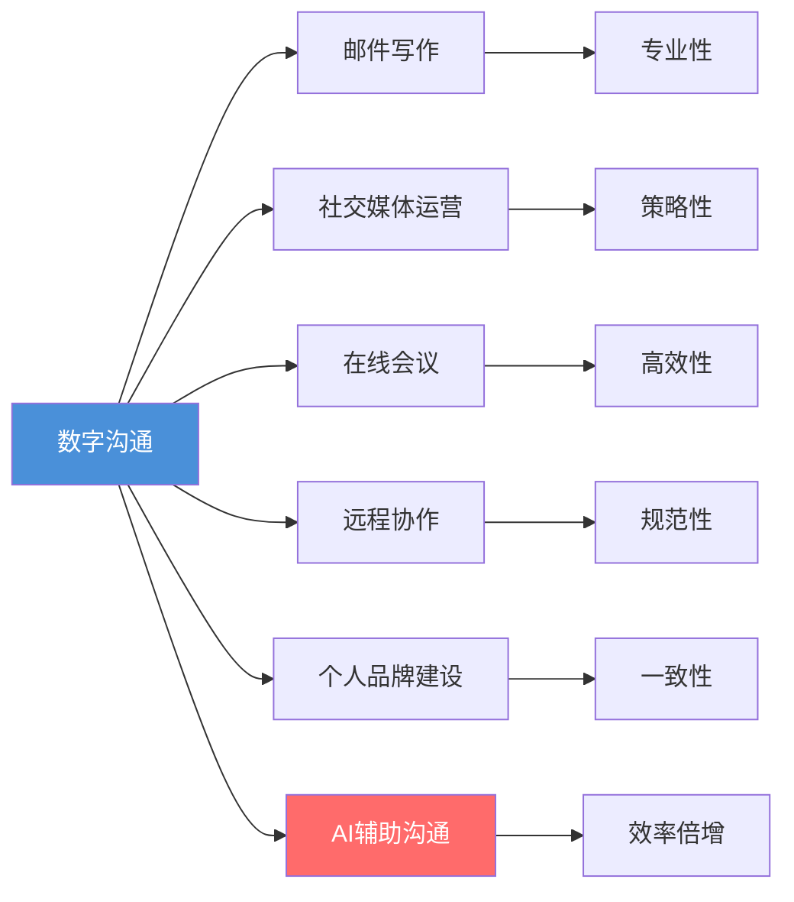
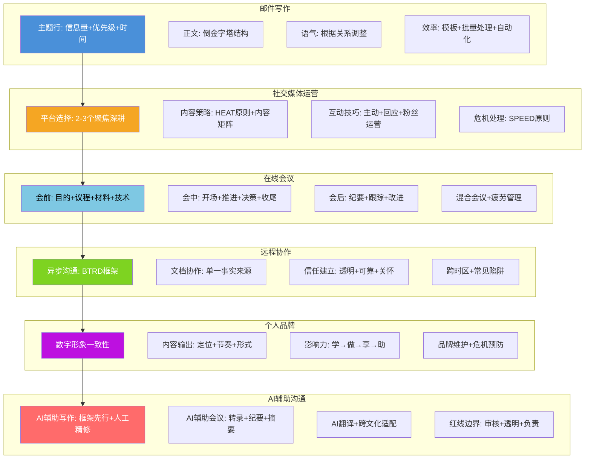
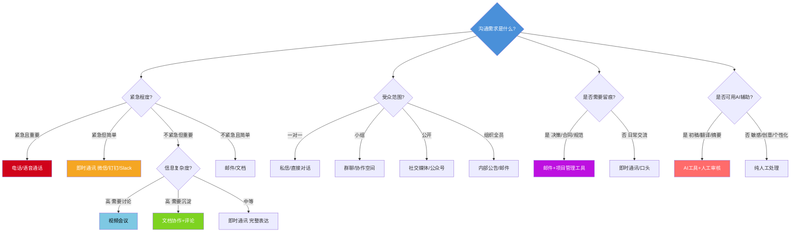

# 核心技巧：数字时代沟通的实操指南

数字时代沟通的本质没有改变——传递信息、建立关系、推动行动——但载体和规则已经彻底重塑。本章聚焦六大核心场景：邮件写作、社交媒体运营、在线会议、远程协作、个人品牌建设和AI辅助沟通，从理论原理到实操细节，提供一套可直接复用的数字沟通方法论。



---

## 第一节 邮件写作

邮件仍然是职场最重要的正式沟通工具。据 McKinsey 2024 年调研，知识工作者平均每天花 28% 的工作时间处理邮件。一封专业的邮件不仅能传递信息，更能展现你的职业素养和沟通能力。糟糕的邮件则会造成信息遗漏、决策延迟甚至人际关系紧张。

### 一、主题行：邮件的"门面"

主题行决定了邮件是否会被打开、何时被打开、以及被打开后的第一印象。研究表明，47% 的收件人仅根据主题行决定是否打开邮件。一个好的主题行应该满足三个条件：**信息量充分、优先级明确、便于搜索归档**。

#### 1. 主题行的黄金公式

`[标签/类别] + 核心内容 + 行动要求/时间要求`

示例对比：

| 写法 | 问题分析 |
|------|----------|
| ❌ "会议" | 什么会议？什么时候？需要我做什么？三无主题 |
| ❌ "关于项目的一些事情" | 哪个项目？什么事情？信息量为零 |
| ❌ "请帮忙看看" | 看什么？什么时候看？完全无法归档 |
| ✅ "[Q3营销项目] 周五会议议程确认 — 请周三前回复" | 有项目标签、有内容、有行动和时间节点 |
| ✅ "[紧急] 客户A投诉处理方案 — 今天下午5点前需要审批" | 优先级清晰、行动明确、截止时间具体 |
| ✅ "[FYI] 6月产品发布回顾 — 无需回复" | 标注信息性质，收件人知道不需要行动 |

#### 2. 主题行的进阶技巧

**分类标签体系**：建立团队统一的邮件标签规范，常见标签包括：

| 标签 | 含义 | 收件人行动 |
|------|------|-----------|
| [Action] | 需要你采取行动 | 必须处理 |
| [审批] | 需要审批决策 | 审阅后批准/驳回 |
| [FYI] | 仅供参考 | 阅读即可，无需回复 |
| [决策] | 需要集体决策 | 参与讨论并表态 |
| [会议纪要] | 会议记录 | 查阅确认 |
| [紧急] | 时间敏感 | 立即处理 |
| [周报/月报] | 定期汇报 | 阅读了解 |
| [RFC] | 征求意见稿 | 审阅并提出建议 |
| [复盘] | 项目复盘 | 回顾并补充 |

**主题行维护规则**：
- 当邮件主题发生变化时，及时更新主题行。例如原主题是"[Q3项目] 预算讨论"，讨论转向排期时，改为"[Q3项目] 排期调整讨论"
- 回复邮件时，如果讨论内容偏离了原主题，建议新建邮件而非继续回复链
- 主题行中包含关键日期，便于后续搜索归档
- 避免使用全大写、过多感叹号，这在邮件语境中等同于"喊叫"
- 对于需要长期追踪的项目，在主题行中包含项目编号（如"JIRA-1234"），方便后续搜索聚合

### 二、正文结构：倒金字塔原则

邮件正文应该遵循"倒金字塔"结构——最重要的信息放在最前面，细节和背景放在后面。这个原则源自新闻写作，原因在于：
- 据 EyeQuant 眼动研究，大多数收件人只读邮件的前两段就做出判断
- 移动设备上邮件的显示空间有限，第一屏决定阅读深度
- 重要的行动项需要在第一时间被看到，否则可能被遗忘
- 高管平均每天收到 100+ 封邮件，没有时间从背景故事读起

#### 1. 标准邮件正文结构

第一段：核心信息/请求/结论（最重要）
         → 收件人读完这一段就知道"需要我做什么"
第二段：背景/原因/数据支撑（支撑信息）
         → 解释"为什么要做"和"依据是什么"
第三段：下一步行动/截止时间/联系方式（行动导向）
         → 明确"接下来怎么做"和"什么时候完成"
附件：相关文件
         → 在正文中已提及并说明

#### 2. 完整示例

> 张总您好，
>
> 请审批附件中的Q3营销预算方案，总金额为120万元。如无异议，希望能在本周五（6月20日）前完成审批。
>
> 本方案基于Q2的实际投放数据和市场部的反馈进行了调整，主要变化包括：（1）增加了社交媒体投放预算30%，因为Q2社交媒体渠道的ROI达到3.2倍，远超预期；（2）减少了线下活动预算20%，因Q2线下活动的获客成本同比上升了15%。详细对比见附件第3页。
>
> 如有任何问题，随时联系我（微信：xxx，电话：xxx）。我会在周三下午安排一次15分钟的电话，解答可能的疑问。

#### 3. 不同类型邮件的结构变体

**请求类邮件**：问题→原因→请求→截止时间
我们遇到了XX问题（简述）
原因是XX（1-2句）
希望你能提供XX支持（具体请求）
方便在XX前回复吗？（时间节点）

**汇报类邮件**：结论→关键数据→下一步计划→风险提示
本周/本月目标完成情况：XX（结论）
关键数据：指标A达到XX，指标B达到XX
下周计划：重点推进XX和XX
风险提示：XX可能影响进度，已制定应对方案

**通知类邮件**：事项→影响→行动→时间
通知XX事项（什么）
对你的影响是XX（为什么关心）
需要你做的XX（行动）
请在XX前完成（时间）

**致谢/跟进类邮件**：感谢→总结→下一步→开放结尾
感谢您在XX会议/活动中的XX（具体行为）
我的收获/总结是XX（具体而非笼统）
下一步我计划XX（展示行动力）
如有进一步想法，随时沟通（保持开放）

#### 4. 段落与排版规范

邮件不是论文，排版直接影响阅读效率：

- **单段不超过4行**：手机屏幕上，4行已经是一屏的宽度。超过4行的段落会让读者产生"文字墙"的压迫感
- **关键信息加粗**：收件人扫读时，加粗的文字是视觉锚点。但一封邮件中加粗不超过3处，否则失去强调效果
- **使用编号列表**：当邮件包含3个以上并列信息时，使用编号而非段落叙述。编号便于后续引用（"关于第2点..."）
- **空行分隔逻辑段落**：每个逻辑单元之间留一个空行，给收件人大脑"换挡"的时间
- **附件用单独段落提及**：不要在长段落中夹带"见附件"，而是在正文末尾单独列出："附件：1. Q3预算方案（PDF，5页）  2. 数据对比表（Excel）"

### 三、语气与措辞

邮件的语气应该根据收件人关系和邮件目的进行调整。语气不是"态度好"或"态度差"，而是信息传递效率的调节器。

#### 1. 不同关系的语气策略

**向上级汇报**：简洁、有结论、尊重但不卑微
- ❌ "不知道您百忙之中有没有时间看一下，如果没空的话也没关系..."
  → 问题：过度谦卑浪费双方时间，暗示事情不重要
- ❌ "领导，打扰了，请您百忙之中审阅一下..."
  → 问题：套话过多，核心信息被淹没
- ✅ "附件是XX方案，请您审阅。关键决策点在第3页，预计审阅时间10分钟。"
  → 优点：尊重上级时间，提供预估阅读时间，指向关键位置

**与平级协作**：专业、友好、明确责任
- ❌ "麻烦你帮忙看一下这个..."
  → 问题："帮忙"暗示这不是对方的职责，容易被忽略
- ❌ "这个你看看吧"
  → 问题：没有说明看什么、什么时候看、看完做什么
- ✅ "这个方案需要市场部的输入，特别是定价部分（第5-7页）。你方便在周三前给反馈吗？如果需要讨论，我可以约个时间。"
  → 优点：明确具体需求、指定范围、给出时间节点、提供支持选项

**向下属布置任务**：清晰、有支持、有期望
- ❌ "你把这个做一下。"
  → 问题：没有标准、没有时间、没有支持
- ❌ "尽快完成客户报告。"
  → 问题："尽快"是模糊词，不同人理解不同
- ✅ "请在本周五下午5点前完成客户满意度报告的初稿。模板在共享文件夹\报告模板\中，数据源是CRM系统导出的Q2数据。有任何问题随时找我，周三我可以花15分钟帮你过一遍框架。"
  → 优点：截止时间精确、提供模板和数据源、提供支持时间

**对外部客户/合作伙伴**：专业、得体、有温度
- ❌ "亲，麻烦帮我们确认一下哈~"
  → 问题：过于随意，缺乏专业感
- ✅ "王经理您好，关于XX合同的条款确认，我们有以下两点建议（详见附件）。方便的话，希望能在本周三前收到贵方的反馈。如有任何疑问，随时沟通。"
  → 优点：正式但不僵硬，具体且有时间节点

#### 2. 高频误用措辞对照表

| 误用写法 | 问题 | 改进写法 |
|---------|------|---------|
| "尽快回复" | 模糊，每个人理解不同 | "请在周三下午5点前回复" |
| "麻烦您了" | 套话，浪费注意力 | 直接说明请求内容 |
| "FYI" 开头但后面是行动请求 | 自相矛盾 | 明确标注 [Action] |
| "如有问题请随时联系" | 太泛，没有联系方式 | "如有问题，微信/电话联系我：xxx" |
| "相关文件见附件" | 没说明附件是什么 | "附件是Q3预算明细表（共5页），重点看第3页对比表" |
| "大家辛苦了" | 空洞的客套 | 删除，或替换为具体认可："感谢XX在周末加班完成了测试" |
| "仅供参考" | 语气敷衍 | "供决策参考，如有疑问可进一步讨论" |
| "我个人认为" | 在专业邮件中降低权威性 | 直接陈述观点，如有不确定性用"初步分析显示" |

#### 3. 邮件中的情绪管理

邮件没有语音语调和面部表情，文字的情绪误读率高达50%（Byron, 2008）。以下是避免情绪误读的技巧：

- **中性陈述优于主观评价**："这份报告缺少Q2数据"优于"这份报告做得不够完整"（后者可能被理解为批评）
- **用"我们"替代"你"**："我们需要在周五前完成"优于"你需要在周五前完成"（减少对抗感）
- **感叹号控制在每封邮件0-1个**：多个感叹号传递的是焦虑或过度兴奋
- **微笑emoji的使用边界**：内部邮件适度使用可以缓和语气（"这个方案不错👍"），但对上级和外部邮件慎用
- **延迟发送规则**：写完带有情绪的邮件后，不要立即发送。保存为草稿，等30分钟后重读一遍，你可能会重写一半

### 四、抄送与回复的礼仪

#### 1. 收件人角色定义

一封邮件的收件人分为三种角色，每种角色有不同的期望和责任：

| 角色 | 英文 | 含义 | 是否需要回复 |
|------|------|------|-------------|
| 收件人（To） | To | 需要采取行动的人 | 是 |
| 抄送（CC） | Carbon Copy | 需要知晓此事的人 | 通常不需要 |
| 密送（BCC） | Blind Carbon Copy | 私密抄送，其他收件人看不到 | 视情况 |

**抄送原则**：
- 只抄送需要知悉的人，不要"广撒网"。过多抄送会导致信息疲劳，降低邮件的关注度
- 抄送上级时，确保邮件内容已准备好接受上级审视。永远假设上级会仔细阅读
- 不确定是否需要抄送时，宁可不抄送。如果对方需要知道，随时可以转发
- 对外邮件中使用BCC保护客户/合作伙伴的邮箱隐私
- **抄送的政治含义**：在中国职场文化中，抄送上级有时意味着"我已经告知领导了"，这是一种隐性的压力手段。使用时要意识到这一层含义，避免不必要的对抗信号

#### 2. "回复"与"回复全部"的决策树

收到邮件后：
├── 我的回复是否所有人都需要看到？
│   ├── 是 → 使用"回复全部"
│   │   └── 注意：回复全部时，检查收件人列表是否正确
│   └── 否 → 使用"回复"
│       └── 只回复发件人即可
│
├── 我的回复是否只是"收到""好的""谢谢"？
│   ├── 是 → 只回复发件人，或考虑不回复（视关系亲疏）
│   └── 否 → 根据上述规则选择回复方式
│
└── 邮件线程中是否加入了新的收件人？
    └── 是 → 回复时检查是否需要保留新加的收件人

**高频错误**：
- 给全部门群发"收到"——浪费所有人时间
- 把本应私下的反馈通过"回复全部"发给了所有人
- 忘记检查回复全部时的收件人列表，把内部讨论暴露给了外部人员
- 使用"回复全部"来表达不满——这种公开化的私人情绪会伤害职业形象

#### 3. 邮件线程管理

- 当讨论内容偏离原主题时，开新邮件。不要在一个"会议安排"的线程里讨论"预算问题"
- 长邮件线程（超过10封回复）中，定期在回复开头总结当前状态："截至目前，我们已达成以下共识：1...2... 待解决的问题是：..."
- 加入已有邮件线程的新参与者，在回复中用1-2句话说明背景，或在开头注明"补充说明：本邮件线程讨论的是XX问题"
- **线程断裂处理**：当多人在不同时间回复同一封邮件，导致线程分叉时，由发起人汇总各分支讨论结果，发送一封总结邮件统一结论

### 五、附件与签名

#### 1. 附件管理规范

**附件命名规则**：
- 使用有意义的文件名，包含项目名、文档类型和日期
- ❌ "文档1.docx"、"最终版v3(2).pdf"、"新建 Microsoft Word 文档.docx"
- ✅ "Q3营销预算方案_市场部_20260620.pdf"、"客户满意度报告_模板.xlsx"

**附件发送清单**（发送前必检）：
1. 正文中是否提到了附件内容和关键位置？
2. 附件文件名是否有意义？
3. 附件是否确实已添加？（很多人在"请见附件"后忘记实际添加）
4. 附件大小是否超过公司邮箱限制？（通常10-25MB）超过时使用云链接
5. 附件格式是否收件人能打开？优先使用PDF确保格式一致
6. 敏感附件是否加密？
7. 附件内容是否与邮件正文描述一致？（避免发错版本）

**大文件发送策略**：

| 文件大小 | 推荐方式 | 注意事项 |
|---------|---------|---------|
| <5MB | 直接邮件附件 | 确认公司邮箱附件限制 |
| 5-25MB | 邮件附件或云链接 | 建议用云链接，避免收件箱膨胀 |
| >25MB | 云链接（必须） | 附上链接有效期和访问密码 |
| >1GB | 专用文件传输工具 | 如WeTransfer、奶牛快传等 |

#### 2. 邮件签名设计

**标准签名模板**：
姓名 | 职位
公司名称
手机：+86 xxx-xxxx-xxxx
邮箱：name@company.com
微信：xxxxxx（可选）
公司官网：www.company.com

**签名规范**：
- 保持在4-5行以内，信息密度高但不杂乱
- 不使用过多的颜色、图片、格言和动画GIF
- 不使用花哨的字体，确保在所有邮件客户端中正常显示
- 内部邮件可以使用简版签名（姓名+职位即可）
- 对外邮件使用完整签名，便于对方联系
- **签名中的法律声明**：对外邮件建议在签名底部加入简短的保密声明（如"本邮件及附件包含保密信息，仅限指定收件人使用"），这在商业邮件中是标准做法

### 六、邮件效率工具与自动化

#### 1. 常用邮件效率技巧

**模板库**：为高频邮件场景建立模板——项目邀请、会议纪要、进度汇报、客户回复、请假申请等。模板不是偷懒，而是将精力留给需要创意的部分。

**快速回复规则**：
- 能在2分钟内回复的邮件，立即处理（两分钟法则）
- 需要较长时间处理的邮件，先回复"已收到，将在X日前给您详细回复"
- 不需要回复的邮件，立即归档或标记为已读

**批量处理**：不要每来一封邮件就看一封。设定固定的邮件处理时段（例如每天3-4个时段，每次20-30分钟），集中处理邮件。

**邮件处理的四象限法**：
            紧急               不紧急
重要    立即处理（<2min）    安排专门时间处理
        或先回复确认         加入待办事项
不重要  快速转发/委派        归档或删除
        或使用模板回复       不需要行动

#### 2. 邮件管理工具推荐

| 工具/功能 | 用途 | 适用场景 |
|----------|------|---------|
| 邮件规则/过滤器 | 自动分类、标签、归档 | 高邮件量场景 |
| Boomerang/邮件追踪 | 定时发送、追踪已读 | 跨时区沟通 |
| 邮件模板（Canned Responses） | 高频回复一键插入 | 客服、销售场景 |
| 任务集成（如Todoist插件） | 邮件一键转任务 | 任务管理 |
| Snooze/延迟处理 | 设定邮件稍后提醒 | 非紧急邮件暂存 |
| AI邮件助手（如Notion AI、Copilot） | 邮件摘要、语气调整、翻译 | 多语言/高邮件量场景 |
| 邮件分析工具（如EmailAnalytics） | 统计响应时间、邮件量 | 管理者优化团队沟通效率 |

### 七、跨文化邮件沟通

在国际化工作环境中，邮件的文化差异不可忽视：

| 维度 | 中国风格 | 欧美风格 | 日韩风格 | 注意事项 |
|------|---------|---------|---------|---------|
| 称呼 | "X总""X老师" | "Hi John""Dear Mr. Smith" | "XX様""XX部长" | 不确定时用正式称呼 |
| 开头寒暄 | 常见，"希望一切顺利" | 可简短或省略 | 常见且正式 | 欧美商务邮件日益简洁 |
| 结尾 | "此致敬礼""顺祝商祺" | "Best regards""Thank you" | "何卒よろしくお願いいたします" | 匹配对方习惯 |
| 直接程度 | 委婉，给面子 | 直接，说重点 | 非常委婉，多层暗示 | 对欧美收件人避免过度铺垫 |
| 回复速度 | 期望快速（尤其微信关联） | 24-48小时内属正常 | 期望快速，重视礼节 | 设定合理期望 |
| 邮件长度 | 较长，注重格式 | 简洁，内容为王 | 较长，礼节性内容多 | 根据对方文化调整长度 |

---

## 第二节 社交媒体运营

在数字时代，社交媒体不仅是个人社交的工具，更是专业沟通和个人品牌建设的重要平台。据 DataReportal 2025年报告，全球社交媒体用户超过50亿，平均每人每天花费2小时24分钟。你的目标受众就在这些平台上，问题是如何有效地触达他们。

### 一、平台选择与定位

不同社交媒体平台有不同的用户群体、内容形式和沟通规则。盲目全平台铺开是最常见的错误——精力分散导致每个平台都做不好。

#### 1. 主流平台特征对比

| 平台 | 核心内容形式 | 用户画像 | 沟通风格 | 算法偏好 | 适合场景 |
|------|------------|---------|---------|---------|---------|
| 微信公众号 | 长图文、深度文章 | 25-45岁，专业人群，中高端消费 | 专业、深度、有沉淀 | 社交分发+订阅 | 行业洞察、品牌深度内容 |
| 微博 | 短文字、图片、视频 | 18-35岁，广泛、追热点 | 活泼、互动、话题性 | 热点+社交 | 热点评论、品牌曝光 |
| LinkedIn | 职业动态、长文、行业洞察 | 职场人士、决策者、国际化 | 专业、正式、数据驱动 | 互动+职业相关 | B2B、职业发展、行业影响 |
| 抖音/视频号 | 短视频、直播 | 18-40岁，广泛、偏娱乐 | 生动、直观、故事化 | 完播率+互动率 | 教程演示、品牌故事、获客 |
| 知乎 | 问答、专栏、想法 | 20-35岁，知识型用户，高学历 | 严谨、详实、有论据 | 专业度+赞同数 | 专业知识、深度问答、SEO |
| 小红书 | 图文笔记、短视频 | 18-35岁，女性为主，消费决策 | 种草、生活化、真实 | 互动率+内容质量 | 生活方式、产品推荐、教程 |
| B站 | 中长视频、专栏 | 18-30岁，Z世代，二次元+知识 | 深度、有趣、弹幕互动 | 完播率+三连 | 知识科普、深度教程 |
| Twitter/X | 短文字、线程、图片 | 国际化、科技/媒体/政治圈 | 简洁、观点犀利、实时 | 互动+时效性 | 国际影响力、行业讨论 |

#### 2. 平台选择决策框架

你的目标是什么？
├── 建立行业专业影响力 → LinkedIn + 知乎/公众号
├── 获取客户/销售线索 → 小红书/抖音 + 微信生态
├── 展示技术/作品集 → GitHub + 知乎/B站
├── 职业发展/求职 → LinkedIn + 脉脉
├── 品牌传播/PR → 微博 + 微信公众号 + 垂直媒体
└── 国际影响力 → Twitter/X + LinkedIn + Medium

**核心原则**：选择2-3个与你的目标最契合的平台，集中精力深耕。与其在5个平台上各发10篇平庸内容，不如在2个平台上各发25篇优质内容。

**平台深耕的时间分配**：

| 角色 | 主平台（60%精力） | 副平台（30%精力） | 辅助平台（10%精力） |
|------|-----------------|-----------------|-------------------|
| 技术专家 | 知乎/B站 | GitHub | LinkedIn |
| 产品经理 | 公众号/知乎 | LinkedIn | 小红书 |
| 创业者 | 公众号/LinkedIn | 小红书/抖音 | 微博 |
| 设计师 | 小红书/Dribbble | B站 | 公众号 |
| 自由职业者 | 小红书/抖音 | 公众号 | LinkedIn |

#### 3. 账号定位公式

`我是 [身份/角色] + 我为 [目标受众] + 提供 [核心价值] + 通过 [内容形式]`

示例：
- "我是资深产品经理，为互联网从业者提供产品方法论和行业案例分析，通过深度长文和数据图表呈现"
- "我是独立开发者，为编程初学者提供通俗易懂的编程教程，通过短视频和实操演示呈现"
- "我是营养师，为上班族提供简单可执行的健康饮食方案，通过小红书图文和短视频呈现"

#### 4. 账号冷启动策略

新账号从0到1000关注者是最难的阶段，以下是经过验证的冷启动方法：

**第一周：基础搭建**
- 完善个人资料（头像、简介、背景图、联系方式）
- 发布5-10篇高质量内容，建立内容基础
- 研究平台规则和算法偏好

**第二至四周：主动出击**
- 每天评论10-20个目标领域大V的内容，评论要有实质（补充观点、提问、数据支持）
- 参与热门话题讨论，发表专业见解
- 加入相关社群，积极参与但不硬推

**第二至三个月：稳定输出**
- 保持固定发布频率（每周3-5篇）
- 分析每篇内容的数据（阅读量、互动率、转发量），找出最受欢迎的内容类型
- 与同级别账号互动、互推

**关键指标**：关注前100个关注者的来源——他们从哪里来、为什么关注你，这决定了你后续的内容方向。

### 二、内容策略

#### 1. 内容矩阵

建立一个平衡的内容矩阵，避免内容单一化导致受众疲劳：

| 内容类型 | 占比 | 目的 | 示例 |
|---------|------|------|------|
| 教育类内容 | 40% | 建立专业权威，提供价值 | 行业知识、专业见解、实用技巧、教程 |
| 互动类内容 | 25% | 提升参与度，了解受众 | 提问、投票、讨论话题、征集意见 |
| 展示类内容 | 20% | 建立信任，展示能力 | 工作成果、项目经验、客户案例、学习心得 |
| 个人类内容 | 15% | 增加亲和力，建立连接 | 适度的个人生活、职业故事、幕后花絮 |

#### 2. 内容创作的HEAT原则

- **H（Helpful）有用**：内容能帮助解决实际问题。发布前问自己："这条内容对我的目标受众有什么具体帮助？"如果答不上来，重新构思。
- **E（Engaging）有吸引力**：标题和开头能抓住注意力。社交媒体的注意力窗口只有1-3秒。标题要制造好奇、引发共鸣或承诺价值。
- **A（Authentic）真实**：基于真实经验和见解，而非空洞的理论。分享你真正做过的事、真正踩过的坑、真正总结出的方法。
- **T（Timely）及时**：结合当前热点和趋势。同样的内容，在热点话题期间发布能获得3-5倍的曝光。

#### 3. 内容生产流程

**选题**→**大纲**→**创作**→**优化**→**发布**→**互动**→**复盘**

**选题来源**（按优先级）：
1. 受众的高频问题和痛点（最直接的价值）
2. 个人实践中的经验总结（最真实的素材）
3. 行业热点和趋势分析（最有时效性）
4. 经典知识的重新解读（最持久的流量）
5. 竞品内容的差异化补充（最聪明的策略）

**选题验证三问**：
1. 目标受众是否真的在搜索/讨论这个话题？（用平台搜索功能验证）
2. 现有内容是否已经充分覆盖？如果覆盖了，我的差异化角度是什么？
3. 这个话题在3个月后是否仍然有价值？（避免纯时效性内容）

**标题优化技巧**：

| 标题类型 | 公式 | 示例 |
|---------|------|------|
| 数字型 | N个方法/技巧/误区 | "5个让你的邮件回复率翻倍的技巧" |
| 问题型 | 为什么/如何/怎样 | "为什么你的提案总被拒绝？" |
| 对比型 | A vs B / 从A到B | "从月薪5K到50K，我改变了这3个沟通习惯" |
| 故事型 | 具体场景+转折 | "被客户当面拒绝后，我用这个方法赢回了订单" |
| 权威型 | 数据+结论 | "分析了1000封高效邮件后，我发现了这个规律" |
| 颠覆型 | 常识+反转 | "停止用PPT汇报——它正在毁掉你的职场表达" |
| 工具型 | 场景+工具+效果 | "用这个Notion模板，我的周报时间从2小时降到15分钟" |

**开头黄金3秒法则**：社交媒体内容的开头决定了用户是否继续阅读/观看：

| 开头类型 | 示例 | 原理 |
|---------|------|------|
| 数据冲击 | "90%的职场人不会写邮件" | 数据制造认知落差 |
| 痛点共鸣 | "开会2小时，啥也没定下来" | 读者觉得"说的就是我" |
| 悬念设置 | "上周我犯了一个职业生涯最大的错误" | 好奇心驱动继续阅读 |
| 直接承诺 | "看完这篇，你的会议效率至少提升50%" | 明确价值预期 |
| 反常识 | "高效沟通的第一步不是说话，而是闭嘴" | 打破预期引发思考 |

#### 4. 内容复用策略

一篇优质内容不应该只在一个地方发布一次：

一篇深度文章（3000字）
├── 提取5-8个核心观点 → 各自独立发布为短动态
├── 制作信息图/数据图 → 发布到图片平台
├── 录制口播解读视频 → 发布到视频平台
├── 制作PPT/幻灯片 → 分享到SlideShare/文库
├── 拆分为系列推文 → 发布到微博/Twitter
├── 提取金句+配图 → 发布到小红书
└── 收录进合集/电子书 → 作为长期内容资产

**内容复用的"一鱼多吃"时间表**：

| 时间 | 渠道 | 形式 |
|------|------|------|
| 第1天 | 主平台（如公众号） | 完整长文 |
| 第2天 | 副平台（如知乎） | 改写后发布（避免直接搬运被降权） |
| 第3天 | 短内容平台（如微博） | 提取3-5个核心观点，拆为独立短动态 |
| 第4天 | 视频平台（如B站/抖音） | 口播解读或PPT视频 |
| 第5天 | 图片平台（如小红书） | 精华摘要+信息图 |
| 第7天 | 社群/朋友圈 | 二次传播，附上链接 |

#### 5. 数据驱动的内容优化

每一次发布都不是终点，而是下一次创作的数据输入：

**核心指标定义**：

| 指标 | 计算方式 | 健康基准 | 说明 |
|------|---------|---------|------|
| 互动率 | (点赞+评论+转发)/曝光量 | >3% | 内容质量的核心指标 |
| 完播率 | 看完视频的人数/开始观看的人数 | >30%（短视频） | 视频内容的核心质量指标 |
| 转粉率 | 新关注者/内容曝光量 | >1% | 内容吸引精准用户的能力 |
| 分享率 | 分享数/阅读量 | >2% | 内容的传播力 |
| 评论质量 | 实质性评论/总评论数 | 观察趋势 | 受众的深度参与度 |

**复盘节奏**：
- 每周：统计本周各内容的核心指标，标记Top3和Bottom3
- 每月：分析内容类型与数据的关系，调整内容矩阵比例
- 每季度：审视账号整体定位，是否需要调整方向

### 三、互动技巧

#### 1. 主动互动策略

社交媒体的核心在"社交"二字，而非"媒体"。单向发布内容只是完成了50%的工作：

- **高质量评论**：定期浏览行业相关的内容，留下有价值的评论（不是"说得好""学习了"，而是补充观点、提出问题、分享经验）。一条高质量评论胜过十篇无人问津的帖子。
- **转评结合**：转发他人内容时，加上自己的见解和评论。纯粹的转发没有记忆点，转评结合才能展示你的思考深度。
- **话题参与**：参与行业话题讨论，展示专业观点。选择与你定位相关的话题，避免参与与专业无关的争论。
- **主动连接**：看到优质内容的创作者，主动私信交流（不要推销自己，而是真诚地讨论内容）。行业内的弱关系网络是影响力扩散的关键通道。

#### 2. 回应互动规范

- **及时回复**：24小时内是理想回复窗口。评论区的互动直接影响算法推荐。
- **处理负面评论**：保持冷静和专业。公开场合不争吵——简短回应表示重视，然后转为私信沟通。记住：其他人都在看你怎么处理。
- **感谢正面反馈**：真诚地感谢，而非模板化回复。建立良性互动循环。
- **处理杠精**：不要与杠精争论。一句"感谢你的观点，我会认真考虑"然后停止回应。杠精的目的是引你上钩，沉默是最好的回应。
- **评论区运营技巧**：发布内容后，在评论区自己"盖楼"——补充背景信息、回答常见问题、引导讨论方向。这既增加了评论量，又控制了讨论基调。

#### 3. 粉丝运营基础

| 阶段 | 关注者规模 | 运营重点 | 核心策略 |
|------|----------|---------|---------|
| 冷启动期（0-500） | 少量精准粉丝 | 1对1互动，了解核心受众需求 | 每条评论都回复，建立种子用户群 |
| 成长期（500-5000） | 稳定增长 | 建立内容节奏，培养互动习惯 | 固定发布频率，建立内容系列 |
| 规模期（5000-50000） | 有影响力 | 社群运营，内容系列化 | 建立微信群/社群，深度运营核心粉丝 |
| 品牌期（50000+） | 行业影响 | 商业化探索，跨界合作 | 品牌合作、知识付费、IP化运营 |

### 四、社交媒体危机处理

当社交媒体上出现负面信息时，处理的速度和方式至关重要。一条负面信息如果在2小时内没有得到回应，传播范围可能扩大10倍以上。

#### SPEED危机处理原则

- **S（Scan）扫描**：第一时间发现和了解情况。设置品牌/个人关键词监控（百度指数、微博搜索、知乎搜索），确保负面信息不会在你不知情的情况下扩散。
- **P（Prioritize）评估**：评估严重程度和影响范围。区分"个别用户的抱怨"和"正在扩散的舆情"——前者可以私信解决，后者需要公开回应。
- **E（Empathize）共情**：表达理解和共情。先回应情绪，再解决问题。"我理解您的frustration"比"我们正在调查"更有效。
- **E（Engage）回应**：积极回应，不回避。沉默是最糟糕的策略——它会被解读为"默认"或"心虚"。
- **D（Deliver）解决**：提供解决方案和后续跟进。承诺具体、可验证的改进措施，并在承诺的时间内兑现。

#### 危机严重程度评估矩阵

| 严重程度 | 特征 | 响应时间 | 处理方式 |
|---------|------|---------|---------|
| 低（个别抱怨） | 1-2条负面评论，未扩散 | 24小时内 | 私信沟通，了解问题，提供解决方案 |
| 中（局部传播） | 多条负面内容，开始有转发 | 4-6小时内 | 公开回应+私信沟通，发布声明 |
| 高（全网扩散） | 上热搜/被媒体关注 | 1-2小时内 | 官方声明+媒体沟通+内部协调 |
| 极高（品牌危机） | 影响商业合作/用户流失 | 立即响应 | 危机小组+官方声明+CEO回应+补偿方案 |

#### 常见危机场景处理模板

**产品质量问题**：
> 我们已经收到关于[具体问题]的反馈，非常抱歉给大家带来不好的体验。目前技术团队正在排查原因，预计[时间]内给出解决方案。受影响的用户可以通过[渠道]联系我们，我们会逐一处理。

**不当言论被截图传播**：
> 关于网上流传的截图，我在此说明：[事实经过]。[承认错误/澄清误解]。今后我会[具体改进措施]。

**竞争对手的恶意攻击**：
> 我们注意到近期有[具体描述]的信息传播。事实情况是[用数据和事实回应]。我们相信用户有自己的判断力，也欢迎任何人对我们的产品/服务进行客观评价。

---

## 第三节 在线会议技巧

在线会议的质量直接影响团队协作效率和项目推进速度。据 Harvard Business Review 调研，71% 的高管认为会议效率低下是影响生产力的首要因素。而在远程/混合办公模式下，这个痛点被进一步放大。掌握在线会议的主持和参与技巧，是数字时代沟通能力的核心组成部分。

### 一、会前准备

#### 1. 会议组织者的准备清单

**目的确认**（会议前48小时）：
- 这次会议要解决什么问题？（用一句话概括）
- 预期的产出是什么？（决策、方案、信息同步、头脑风暴）
- 这个目标是否必须通过会议达成？能否通过邮件/文档异步解决？

**会议类型的区分**：不同类型的会议需要不同的准备方式和参会人员

| 会议类型 | 目的 | 参会人数 | 时长建议 | 准备重点 |
|---------|------|---------|---------|---------|
| 决策会议 | 对特定问题做出决定 | 3-7人 | 30-60min | 备选方案、数据支撑、推荐方案 |
| 信息同步会 | 统一信息，对齐认知 | 5-15人 | 15-30min | 信息文档、要点提纲 |
| 头脑风暴会 | 产生创意和想法 | 4-8人 | 45-90min | 议题框架、引导方法 |
| 项目评审会 | 检查进度，解决问题 | 5-10人 | 60-120min | 进度报告、问题清单 |
| 一对一 | 深度交流，辅导反馈 | 2人 | 15-30min | 议题清单、反馈记录 |

**议程制定**（会议前24小时）：
- 每个议题的讨论时间和负责人
- 议程排列顺序：紧急且重要的议题优先（会议可能超时，确保最重要的先讨论）
- 在议程开头注明会议目标和预期时长

**材料分发**（会议前24小时）：
- 提前发送会议材料，给参与者足够的预习时间
- 材料中用高亮/粗体标注需要参与者特别关注的部分
- 如果是决策会议，附上备选方案和推荐方案
- 材料长度控制在5页以内，超出部分作为附录

**技术准备**（会议前5分钟）：
- 检查网络连接（有线优于WiFi，WiFi优于移动数据）
- 测试音频和摄像头
- 确认共享屏幕功能正常
- 关闭不必要的应用释放带宽
- 确认会议链接/密码正确
- 准备备用方案（如网络不稳定时切换到手机热点）

**规则预设**：
- 是否开摄像头（建议：10人以下开，10人以上演讲者开）
- 如何发言（举手功能、语音轮流、聊天框补充）
- 是否录制（提前告知并取得同意）

#### 2. 会议参与者的准备

| 准备项 | 具体行动 |
|-------|---------|
| 内容准备 | 提前阅读材料，标注疑问和建议 |
| 环境准备 | 确保安静环境，使用耳机减少回声 |
| 工具准备 | 打开笔记工具，准备记录关键信息 |
| 通知管理 | 关闭桌面通知、手机静音 |
| 心理准备 | 准备好自己的意见，主动参与而非被动旁听 |
| 画面准备 | 摄像头与眼睛平齐，光线从前方打来，背景整洁 |

### 二、会中主持技巧

#### 1. 开场（前2分钟）

开场的质量决定了整场会议的基调。高效的开场包含三个要素：

"各位好，今天的会议目标是 [明确目标]。
议程有3个议题，总共45分钟。
第一个议题20分钟，由XX主讲。
会议规则：发言前请先举手，有补充信息可以发在聊天框。
我们开始。"

**开场禁忌**：
- 等待迟到者超过5分钟（浪费准时参会者的时间）
- 开场就进入闲聊模式（模糊了会议边界）
- 没有明确目标就开始讨论（导致会议漫无目的）

#### 2. 推进控制

**时间管理**：
- 严格控制每个议题的时间。提前告知每个议题的时间限制
- 使用倒计时提醒："我们还有5分钟讨论这个议题，先来做个总结"
- 超时议题的处理：标记为"待续"，安排后续专门讨论
- **帕金森定律的应用**：会议会膨胀到填满所有可用时间。将60分钟的会议改为45分钟，你会惊讶地发现效率反而提升了

**讨论引导**：
- 主动邀请安静的参与者发言："小李，你负责这个模块，这个部分你怎么看？"
- 及时总结讨论要点，避免重复讨论："刚才我们达成了两个共识：第一...第二..."
- 当讨论偏离主题时，礼貌地引导回来："这个话题很重要，我们可以会后单独讨论。现在让我们回到XX议题"
- 当讨论陷入僵局时，使用"停车场"技巧："这个问题比较复杂，我们先记录下来，会后由XX牵头调研，下次会议再讨论"

**决策推动**：
- 当讨论充分后，推动决策："我们已经讨论了三个方案，我来总结一下各自的优劣。大家现在表态，支持方案A的请举手"
- 如果无法当场决策，明确后续步骤："这个决策需要更多数据支持，XX负责在周五前提供分析报告，我们下周一再做决定"

#### 3. 收尾（最后5分钟）

**标准收尾模板**：
"今天的会议到此结束，我来总结一下：
1. 决定事项：[具体决策]
2. 行动项：
   - [负责人A] 在 [日期] 前完成 [任务]
   - [负责人B] 在 [日期] 前完成 [任务]
3. 下次会议：[时间][议题]
4. 会议纪要将在24小时内发送给大家。

感谢大家的参与。"

**收尾注意事项**：
- 总结时逐条念出行动项和负责人，确保每个人确认自己的任务
- 不要在收尾时引入新话题——这会导致会议再次延长
- 最后一句话留给大家："还有什么遗漏的或需要补充的吗？"

### 三、会中参与技巧

#### 1. 有效发言

**发言前的准备**：
- 明确自己要说什么。结论先行，先说结论再说原因
- 如果参会人数较多（>8人），发言前先说自己的名字/部门
- 控制发言时长，每次发言不超过2分钟。超过2分钟的内容应该做成文档分享

**发言结构**（PREP法）：
P（Point）：我的观点是...
R（Reason）：原因是...
E（Example）：例如...
P（Point）：所以我认为...

**补充发言结构**（适用于讨论阶段）：
"我同意/补充/质疑 [上一位发言者的观点]，
具体来说 [你的论点]，
因为我观察到/经历过 [事实或数据]，
所以我建议 [行动或结论]"

#### 2. 积极倾听

在线会议中，"在听"的信号比面对面会议更重要，因为对方看不到你的肢体语言：
- 使用"点头""微笑"等表情/反应按钮表示在听
- 适时回应"我理解""有道理""请继续"等确认信号
- 做笔记，记录关键信息和自己的想法——这不是分心，而是深度参与
- 在聊天框中补充相关链接和参考信息
- **复述确认法**：当听到复杂观点时，用自己的话复述一遍确认理解："你刚才说的是XXX，我理解对了吗？"这比事后发现理解偏差要高效得多

#### 3. 善用会议工具

| 工具 | 使用场景 | 使用技巧 |
|------|---------|---------|
| 聊天框 | 分享链接、补充信息、提问 | 不要让它变成第二个讨论通道 |
| 举手功能 | 有序发言 | 主持人按举手顺序邀请 |
| 投票功能 | 快速收集意见、二选一决策 | 准备好明确的选项 |
| 白板/共享文档 | 头脑风暴、实时协作 | 指定一个记录者 |
| 录制功能 | 供缺席者回看、会议回顾 | 必须提前告知并征得同意 |
| 分组讨论（Breakout） | 深度讨论、小组练习 | 明确分组规则和时间 |
| 反应按钮 | 快速表态、反馈 | 降低发言门槛 |
| AI会议助手（如Otter.ai、飞书妙记） | 自动生成会议纪要、实时转录 | 会后校对AI生成的纪要，确保准确性 |

### 四、会后跟进

会后跟进是确保会议成果落地的关键环节。没有跟进的会议等于没开。

#### 1. 会议纪要

**发送时效**：24小时内发送。

**标准会议纪要模板**：

```markdown
# 会议纪要：[会议名称]
日期：YYYY-MM-DD | 时长：XX分钟 | 参与人：[名单]

## 会议目标
[本次会议的目标]

## 决策事项
1. [决策内容] — 决策依据：[简述]
2. [决策内容] — 决策依据：[简述]

## 行动项
| 任务 | 负责人 | 截止日期 | 状态 |
|------|--------|---------|------|
| [任务描述] | [姓名] | [日期] | 待开始 |

## 待讨论/停车场
- [未达成共识的议题，需后续讨论]

## 下次会议
时间：[日期时间] | 议题：[预告]
```

**会议纪要的质量标准**：
- 决策事项必须记录"决策依据"——三个月后你不会记得为什么做了这个决定
- 行动项必须有明确的负责人和截止日期，"大家注意一下"不是行动项
- 用客观中立的语言记录，不要夹杂记录者的主观评价
- 发送前请相关参与者确认，避免信息遗漏或理解偏差

#### 2. 行动跟踪

- 建立行动项跟踪机制（项目管理工具或共享表格）
- 在截止日期前1-2天提醒负责人
- 下次会议开始时，先回顾上次的行动项完成情况
- 长期未完成的行动项需要分析原因并调整
- **行动项完成率是衡量会议有效性的终极指标**：如果一个团队的行动项完成率低于70%，说明要么会议产出不切实际，要么执行力有问题

#### 3. 会议效率持续改进

定期（每月或每季度）收集参与者对会议质量的反馈：
- 会议时长是否合理？
- 议程是否清晰？
- 是否达成了预期目标？
- 有哪些可以改进的地方？

**会议效率自检清单**：
- [ ] 本周是否有"不开也行"的会议？
- [ ] 会议中是否有超过50%的时间在等待/闲聊？
- [ ] 上次会议的行动项完成率是多少？
- [ ] 参会人数是否都在10人以下？（超过10人的会议效率急剧下降）
- [ ] 是否有明确的会议目标和议程？

### 五、混合会议的特殊挑战

混合办公模式下，远程和现场参与者同时参会，这是最具挑战性的会议形式：

| 挑战 | 解决方案 | 根本原因 |
|------|---------|---------|
| 远程参与者听不清现场讨论 | 确保会议室有独立麦克风，远程参与者优先发言 | 声音采集设备不足 |
| 现场参与者形成"小圈子"讨论 | 主持人主动邀请远程参与者："远程的同事有什么看法？" | 空间邻近性导致排外 |
| 屏幕共享不一致 | 使用云端文档而非本地文件，所有人实时看到同一内容 | 信息不对称 |
| 远程参与者被遗忘 | 每个议题结束后，专门点名远程参与者确认意见 | 可见性差异 |
| 体验不对等 | 尽可能让所有人都通过同一平台加入（即使在现场也用电脑入会） | 参与方式不对称 |
| 技术问题导致参与中断 | 指定一个"远程参与者代言人"，确保远程方的声音被听到 | 缺乏技术保障 |

**混合会议的黄金法则**：如果团队中哪怕只有一个人是远程参会，所有人都应该通过电脑加入会议——这样每个人都处于平等的参与状态。

### 六、应对视频会议疲劳

Zoom Fatigue（视频会议疲劳）已被Stanford研究团队证实是一种真实的生理和心理现象。其核心原因是：持续的眼神接触、看到自己的画面、身体活动受限、以及非语言沟通线索减少。

**结构性策略**：
- 设定"无会议日"（如每周三），让团队有完整的深度工作时间
- 会议默认时长从60分钟改为45分钟或25分钟（Parkinson定律：工作会膨胀到填满所有可用时间）
- 区分"必须开摄像头"和"无需开摄像头"的会议类型
- 连续会议之间留至少10分钟缓冲
- 将"可邮件解决"的会议退回到邮件——不是所有同步沟通都需要开会

**个人策略**：
- 会议间隙起身活动，避免久坐
- 非发言时使用"画廊视图"缩小自己的画面（持续看到自己的画面会增加疲劳）
- 使用语音替代视频的会议（电话会议并没有过时）
- 会后给自己5分钟的"过渡时间"再进入下一个任务
- 使用外接显示器而非笔记本小屏幕，减少视觉疲劳

---

## 第四节 远程协作

远程协作的核心挑战是：在缺少物理共处的情况下，如何保持团队的高效运转和成员的紧密连接。GitLab、Automattic、Zapier等公司已经证明，全远程团队可以达到甚至超过同地办公的效率——但这需要刻意设计的协作体系，而非简单地把线下工作搬到线上。

### 一、异步沟通规范

异步沟通是远程协作的基石。当团队成员分布在不同时区、不同作息时间时，同步沟通（实时会议、电话）的成本极高，而高质量的异步沟通可以覆盖80%以上的日常协作需求。

#### 1. 异步沟通的完整性公式

异步沟通中，信息的接收者无法即时追问，因此发送者需要在一次沟通中提供完整的信息。一个完整的异步沟通应包含 **BTRD 框架**：

B（Background）背景：这件事的来龙去脉
   → 为什么要做这件事？前因后果是什么？
T（Task）内容：具体的信息或请求
   → 你需要什么？具体要求是什么？
R（Request）期望：你希望接收者做什么
   → 是审批？是反馈？是知晓？是执行？
D（Deadline）时间：期望的反馈时间
   → 什么时候需要？紧急程度如何？

**对比示例**：

❌ 不完整的异步消息：
> "那个功能有问题，你看看。"

✅ 完整的异步消息：
> "用户登录模块在iOS 17.4上出现了闪退问题（背景）。Bug详情见JIRA-1234，复现步骤已附在评论区（内容）。需要你排查一下是前端还是后端的问题，给出修复方案（期望）。客户反馈已到第3天，希望能在本周三前定位原因（时间）。"

#### 2. 工具选择矩阵

不同的沟通需求适合不同的工具。选错工具会导致信息丢失、效率低下或信息过载：

| 沟通需求 | 推荐工具 | 不推荐工具 | 原因 |
|---------|---------|-----------|------|
| 快速确认（<5分钟能解决） | 即时通讯 | 邮件 | 邮件延迟大，快速问题用IM更高效 |
| 复杂讨论（需要多轮交流） | 文档协作+评论 | 即时通讯群聊 | 群聊信息流快，讨论容易被淹没 |
| 决策记录（需要留痕） | 项目管理工具 | 邮件 | 邮件难以追踪决策状态 |
| 知识沉淀（长期复用） | 知识库/Wiki | 即时通讯 | IM信息不可检索、会过期 |
| 任务分配（需要跟踪） | 项目管理工具 | 邮件/即时通讯 | 需要状态追踪和截止提醒 |
| 创意讨论（头脑风暴） | 视频会议+白板 | 文档 | 需要实时互动和视觉化 |
| 信息广播（通知全员） | 内部公告/频道 | 逐一私信 | 效率和一致性 |
| 代码审查 | Git平台（GitHub/GitLab） | 即时通讯 | 需要行级评论和版本追踪 |
| 项目复盘 | 文档+视频会议 | 纯文字聊天 | 需要深度讨论和结构化记录 |

#### 3. 响应时间期望管理

在远程团队中，明确的响应时间期望可以减少焦虑和误解：

| 沟通渠道 | 期望响应时间 | 备注 |
|---------|------------|------|
| 紧急电话/消息 | 15分钟内 | 仅用于真正的紧急情况 |
| 即时通讯（工作时间） | 1-2小时内 | 非紧急不要期待秒回 |
| 即时通讯（非工作时间） | 下一个工作日 | 尊重个人时间 |
| 邮件 | 24小时内（工作日） | 复杂邮件可先回复"已收到，X日前详细回复" |
| 项目管理工具评论 | 48小时内 | 根据任务优先级调整 |

**"紧急"的定义标准**：很多远程团队的沟通焦虑来自于对"紧急"的滥用。建议团队共同定义"紧急"标准——通常是"系统宕机/客户投诉/安全漏洞"级别的事件，而非"老板问了一句话"。

### 二、文档协作最佳实践

在远程团队中，文档是"单一事实来源"（Single Source of Truth）。如果信息不在文档里，它就不存在。

#### 1. 共享文档规范

**命名规则**：
[项目名]_[文档类型]_[版本/日期].[格式]
示例：
LaiWanYa_技术架构设计_v2.1_20260620.md
Q3营销方案_预算明细_20260615.xlsx

**版本管理**：
- 使用版本号或日期，而非"最终版""最终版(2)""绝对最终版""这次真的是最终版"
- 重要修改在文档开头的"变更日志"中记录修改内容、修改人和日期
- 重要修改使用评论功能而非直接修改正文，并@相关人审阅
- 使用版本控制工具（如Git）管理技术文档，非技术文档使用平台内置的版本历史功能

**文档模板**：为高频文档类型建立统一模板——会议纪要、项目方案、需求文档、周报月报、决策记录等。模板不是束缚，而是降低写作门槛、确保信息完整。

#### 2. 知识管理体系

**知识库结构建议**：

知识库/
├── 新人指南/          ← 入职必备
│   ├── 公司介绍与文化
│   ├── 工具使用指南
│   └── 常见问题FAQ
├── 流程规范/          ← 日常参考
│   ├── 开发流程
│   ├── 发布流程
│   └── 审批流程
├── 项目文档/          ← 项目存档
│   ├── 项目A/
│   └── 项目B/
├── 技术知识/          ← 技术积累
│   ├── 架构设计
│   ├── 踩坑记录
│   └── 最佳实践
└── 团队建设/          ← 文化沉淀
    ├── 团队规范
    └── 复盘总结

**知识库维护规则**：
- 每个项目结束后，强制进行知识沉淀（复盘文档归档）
- 每月安排固定时间清理和更新过时内容
- 新成员入职时，知识库是最重要的培训资源——如果新人找不到答案，说明知识库需要更新
- 鼓励"边做边写"，而非"做完再补"
- **知识库的"保鲜度"指标**：文档最后更新时间超过6个月的页面，标记为"可能过时"，定期审查

### 三、建立远程团队信任

信任是远程协作的基础。在缺少面对面接触的情况下，信任不会自然生长，需要通过以下方式有意识地建立和维护。

#### 1. 透明度——让工作"可见"

在远程团队中，"看不见"不等于"没在做"，但如果不主动让工作可见，就会引发不必要的猜疑。

**实践方法**：
- **每日/每周异步站会**：在团队频道中分享"今天做了什么、明天计划做什么、遇到了什么阻碍"。不需要长篇大论，3-5条简短记录即可。
- **工作日志/进度看板**：使用项目管理工具（如Jira、Notion、飞书多维表格）让每个人的任务进度对全队可见。
- **决策透明**：重大决策记录决策过程和依据，而非只通知结果。"为什么选择A而非B"比"我们选了A"重要得多。
- **问题暴露文化**：遇到问题及时暴露，不要等到无法隐瞒时才说。早暴露意味着早解决，晚暴露意味着大损失。

#### 2. 可靠性——说到做到

远程协作中，信任最核心的来源是"承诺兑现率"：
- 承诺的事情一定做到。做不到时，提前沟通并说明原因和替代方案
- 按时完成任务。如果预感到会延期，在截止日之前主动通知，而非截止日后沉默
- 回复消息在承诺的时间窗口内。如果设置了"2小时内回复"的期望，就确保做到
- 准时参加会议。远程会议迟到比线下迟到更让人不安——因为迟到者不在视线内，组织者不知道是出了问题还是忘了

#### 3. 关怀——超越任务的连接

远程工作者最大的挑战之一是孤独感。Gallup调查显示，远程工作者中有21%表示"经常感到孤独"，高于办公室工作者的14%。

**建立关怀机制**：
- **定期一对一**：管理者与团队成员每周至少一次15分钟的一对一聊天，不只聊工作，也关心状态和感受
- **虚拟咖啡/茶歇**：每周安排15-20分钟的非正式视频聊天，不谈工作，纯粹交流
- **在线团建活动**：在线游戏、虚拟聚餐、才艺分享、读书会等
- **记住重要事件**：生日、入职周年等，在团队中表达祝福
- **鼓励线下见面**：如果条件允许，每季度安排1-2次线下聚会（team offsite）
- **心理健康支持**：提供EAP（员工援助计划）信息，定期分享心理健康资源

### 四、跨时区协作策略

对于全球化远程团队，时区差异是最大的实操挑战：

**时区管理四原则**：

| 原则 | 具体做法 |
|------|---------|
| 重叠时间最大化 | 找出全员重叠的2-4小时，作为"核心协作时间" |
| 异步优先 | 能异步解决的不安排同步会议 |
| 轮转制 | 需要全员参加的会议，时间轮流调整，不要总是同一时区的人牺牲 |
| 时区标记 | 所有时间都标注时区，例如"14:00 CST / 22:00 PST" |

**实用工具**：
- World Time Buddy：多时区时间对照
- Calendly/Cal.com：自动根据参与者时区推荐会议时间
- Slack/飞书状态：标注自己的工作时间和当前时区
- Every Time Zone：可视化展示全球各时区的当前时间

**跨时区文档协作的最佳实践**：
- 文档中用`@名字`标注需要某人输入的部分，配合截止时间
- 使用"请求评论"（Request for Comment）模式：文档作者在文档中标注需要审阅的章节，审阅者在自己方便的时间评论
- 建立"文档交接"文化：当A时区的工作日结束时，将关键进展和待处理事项更新到文档中，B时区的同事接手时可以直接续上

### 五、远程团队常见陷阱

| 陷阱 | 表现 | 解决方案 |
|------|------|---------|
| 会议过多 | "开完会才能干活" | 建立"无会议日"，推广异步沟通 |
| 信息孤岛 | 关键信息只在少数人脑子里 | 强制文档化，建立知识库 |
| 过度监控 | 截屏监控、鼠标活动追踪 | 以产出而非工时衡量，建立信任 |
| 社交缺失 | 团队成员变成"陌生人" | 定期非正式交流机会 |
| 边界模糊 | "随时在线"压力 | 明确工作时间和响应期望 |
| 决策缓慢 | "等所有人在线再决定" | 异步决策流程，设定决策截止时间 |
| 工具碎片化 | 同一信息散落在10个工具中 | 统一工具栈，明确每个工具的定位 |
| 新人融入困难 | 新成员不知道找谁、看什么 | 指定onboarding buddy + 完善新人手册 |

---

## 第五节 个人品牌建设

在数字时代，个人品牌是你最重要的无形资产之一。它决定了别人对你的第一印象，影响着你的职业机会和影响力。LinkedIn 2024年数据显示，拥有完善个人资料的专业人士获得的机会是不完善者的40倍。个人品牌不是自我吹嘘，而是让你的专业价值被正确的人看到。

### 一、数字形象管理

#### 1. 一致性原则

你在不同平台上的形象应该保持一致——专业领域、核心价值观、表达风格。这不意味着每个平台的内容完全相同，而是传递的核心信息一致。

**一致性检查清单**：
- 各平台的个人简介是否传达了相同的核心定位？
- 头像是否使用同一张（或风格相近的）照片？
- 内容主题是否围绕同一个专业领域？
- 语气和风格是否一致（不要在LinkedIn上很专业，在微博上很随意）？
- 各平台之间是否互相链接，形成网络效应？

#### 2. 专业形象四要素

**头像**：
- 清晰、专业、面部为主，占据画面60%以上
- 背景简洁，不杂乱
- 光线充足，表情自然（微笑比严肃更有亲和力）
- 不使用风景、动漫、宠物或合照裁切作为头像
- 不同平台使用同一张头像，增强辨识度
- **头像的"缩略图测试"**：将头像缩小到32×32像素，看是否仍然能辨认出是你。如果不能，说明头像的辨识度不足

**简介/个人说明**：
- 第一句话就说清楚"你是谁、做什么"
- 包含你的核心价值主张——你能为别人带来什么
- 使用关键词（便于搜索发现）
- 避免空泛的形容词（"热爱学习""积极向上"），用具体事实替代
- 示例："10年产品管理经验，专注B2B SaaS产品。主导过3款DAU百万级产品从0到1。分享产品方法论和行业案例。"

**内容一致性**：
- 持续输出与你的专业领域相关的内容
- 偶尔的个人生活分享增加亲和力，但不要喧宾夺主
- 确保你分享的每一条内容都与你的品牌定位相符

**互动风格**：
- 与行业人士的互动体现你的专业水平和人际风格
- 保持一致的沟通风格——专业、友善、有见解
- 不要在不同的平台上展现完全不同的"人设"——这会让关注你多个平台的人感到困惑

### 二、内容输出策略

#### 1. 找到你的独特视角

不要试图涵盖所有话题，找到你的专业领域和独特视角。**"一厘米宽，一公里深"比"一公里宽，一厘米深"更有价值。**

**定位方法**：
1. 列出你所有的专业技能和经验
2. 找到交叉点——"A领域 × B视角"往往比单纯的"A领域"更有差异化
3. 验证需求——你的目标受众是否需要这个视角？
4. 测试和迭代——发布10-20篇内容后，看哪类数据最好，然后聚焦

**定位示例**：
- ❌ "我分享技术知识"（太宽泛）
- ✅ "我用通俗语言解释复杂的分布式系统概念，帮助初中级工程师跨越从CRUD到架构设计的鸿沟"（具体且有差异化）

**定位的"电梯测试"**：如果在30秒的电梯里，你无法向别人说清楚"你做什么、你的价值是什么"，说明你的定位还不够清晰。

#### 2. 建立内容节奏

| 策略 | 说明 |
|------|------|
| 固定发布频率 | 让关注者形成预期（如每周二、四更新） |
| 质量优先于数量 | 宁可每周1篇高质量内容，也不要每天1篇低质量内容 |
| 内容日历 | 提前1-2周规划主题，避免临时凑内容 |
| 系列化内容 | 将大主题拆分为系列文章，培养持续关注 |
| 内容复盘 | 每月分析哪些内容数据好、为什么好，优化策略 |

**内容日历模板**：

| 日期 | 平台 | 主题 | 内容类型 | 状态 | 数据 |
|------|------|------|---------|------|------|
| 6/20 | 公众号 | 远程协作工具对比 | 深度长文 | 已发布 | 阅读3.2K |
| 6/22 | 知乎 | 如何写好会议纪要 | 问答 | 已发布 | 赞同245 |
| 6/24 | 小红书 | 5个邮件写作技巧 | 图文笔记 | 待创作 | - |

#### 3. 内容形式矩阵

不同形式的内容有不同的优势，组合使用效果最佳：

| 内容形式 | 优势 | 适合场景 | 制作成本 |
|---------|------|---------|---------|
| 长文章 | 展示深度思考，SEO友好 | 方法论、案例分析、行业报告 | 高 |
| 短动态 | 高频触达，展示日常 | 观点碎片、日常学习、即时想法 | 低 |
| 视频/音频 | 增加个人魅力，信息密度高 | 教程演示、观点表达、访谈对话 | 中-高 |
| 信息图/数据图 | 视觉冲击力强，易传播 | 数据总结、流程梳理、对比分析 | 中 |
| 直播 | 实时互动，建立亲密感 | Q&A、产品演示、深度对话 | 中 |
| 播客 | 适合深度对话，可碎片化收听 | 行业访谈、经验分享、知识讲解 | 中 |
| 电子书/白皮书 | 权威性高，可作为获客工具 | 系统化知识、行业研究 | 高 |

### 三、专业影响力构建

影响力不是粉丝数量，而是你在专业领域的权威性和信任度。1000个真正信任你的专业人士，比10万个"路过"的粉丝有价值得多。

#### 1. 影响力构建五步路径

学习 → 实践 → 分享 → 互动 → 帮助
 │      │      │      │      │
 ▼      ▼      ▼      ▼      ▼
持续深耕  用成果  内容    行业    主动
专业领域  说话   分享    讨论    帮助
                                      ↓
                               建立互助关系
                               形成口碑传播

**具体行动**：
1. **学习**：持续深耕专业领域，保持知识更新。阅读行业报告、参加专业会议、关注领域内的领先者
2. **实践**：在实际工作中积累经验，用成果说话。最好的内容来自真实的项目经验
3. **分享**：将经验和见解通过内容分享出去。写作是最好的思考方式
4. **互动**：与同行交流，参与行业讨论。不要只做内容的"生产者"，也要做"消费者"和"评论者"
5. **帮助**：主动帮助他人，建立互助关系。影响力的基础是利他

#### 2. 影响力的正确衡量指标

| 表面指标（不可靠） | 深层指标（可靠） |
|------------------|----------------|
| 粉丝数 | 有效互动的质量和频率 |
| 阅读量 | 内容引发的实际行动（分享、引用、实践） |
| 点赞数 | 被信任和被推荐的程度 |
| 关注者增长速度 | 是否有人因你的内容主动联系你合作 |
| 转发量 | 内容被引用和二次创作的频率 |

**影响力评估公式**：
`影响力 = 专业深度 × 内容频率 × 互动质量 × 时间`

这意味着：没有任何捷径。一个每周发布1篇深度内容、认真回复每条评论的人，一年后的影响力会超过一个每天发3篇浅薄内容的人。

#### 3. 影响力加速策略

- **借势**：与已有影响力的人合作（联合发布、访谈、互推）
- **集中爆发**：在特定时间段集中输出高质量内容（如"每周一更，持续3个月"），而非零散发布
- **线下+线上结合**：线下演讲/分享的内容，整理后在线上二次传播
- **被引用**：产出有数据、有框架、有原创观点的内容，增加被他人引用的概率
- **创造"可引用的资产"**：原创框架（如本文的BTRD、HEAT）、数据调研、行业报告——这些内容最容易被他人引用和传播
- **参与行业奖项和评选**：行业认可是影响力的重要背书

### 四、数字品牌维护

#### 1. 定期自检

每季度进行一次个人品牌的"健康检查"：

| 检查项 | 具体行动 |
|-------|---------|
| 搜索自己 | 用Google/百度搜索自己的名字，了解"数字画像"是否符合预期 |
| 审查历史内容 | 清理不当言论、过时信息、与当前定位不符的内容 |
| 更新资料 | 确保各平台的个人资料准确和最新 |
| 一致性检查 | 对比各平台的形象是否一致 |
| 竞品观察 | 看看同领域的人在做什么，找到自己的差异化 |
| 数据回顾 | 分析上一季度的内容数据，调整策略 |

#### 2. 危机预防

个人品牌的建立需要数年，但可能因为一条不当言论毁于一旦：

**预防清单**：
- ❌ 不在情绪激动时发布内容。写完草稿后至少等1小时再发布
- ❌ 不参与网络争吵和站队。公开场合的争吵没有赢家
- ❌ 不对未了解全貌的事件发表评论。"让子弹飞一会儿"
- ❌ 不发布可能被断章取义的内容
- ❌ 不在公开平台讨论薪资、人事变动等敏感信息
- ✅ 重要发布前请信任的人帮忙审核
- ✅ 设置隐私级别：哪些平台完全公开、哪些需要审核
- ✅ 区分"个人表达"和"品牌表达"——如果你的内容代表了你的专业品牌，就需要更高的发布标准

---

## 第六节 AI辅助沟通

AI工具正在重塑数字时代沟通的每一个环节。从邮件撰写到内容创作，从会议纪要到多语言沟通，AI不是替代你的沟通能力，而是将其放大。本节介绍如何将AI工具融入日常沟通工作流，同时避免常见的使用陷阱。

### 一、AI辅助写作

#### 1. 邮件写作中的AI应用

| 场景 | AI用法 | 注意事项 |
|------|--------|---------|
| 邮件草稿生成 | 输入要点，让AI生成初稿 | 必须人工审核语气和准确性 |
| 语气调整 | "把这封邮件改得更正式/更友好" | AI不了解收件人的关系背景 |
| 多语言翻译 | 直接翻译为对方的语言 | 专业术语翻译必须人工校验 |
| 邮件摘要 | 长邮件线程生成摘要 | 关键决策可能被遗漏，需核对 |
| 主题行优化 | 提供多个主题行选项 | 选择最符合团队标签规范的 |

**AI邮件写作的最佳实践**：
- **框架先行**：先自己列出邮件的BTRD（背景、任务、期望、时间），再让AI生成正文
- **个性化不可省略**：AI生成的邮件通常缺少个人特色。在开头和结尾加入个性化元素（如提及上次交流的细节）
- **语气盲区**：AI无法感知微妙的职场关系。涉及敏感话题（批评、拒绝、裁员、绩效反馈）的邮件，必须自己主导

#### 2. 内容创作中的AI应用

**AI辅助内容创作的四步流程**：

第1步：AI调研 → 用AI快速收集背景资料和数据
第2步：人工策划 → 自己确定角度、框架和独特观点
第3步：AI辅助写作 → 让AI根据大纲生成初稿
第4步：人工精修 → 加入个人经验、修正错误、注入风格

**AI可以帮你做的**：
- 快速调研某个话题的现有观点和数据
- 生成多个标题方案供选择
- 扩展大纲中的某个要点为完整段落
- 检查语法、逻辑和一致性
- 将长文章压缩为社交媒体短文

**AI不能替代的**：
- 原创观点和独特视角（AI只能重组已有的知识）
- 真实的个人经历和案例（AI编造的案例经不起验证）
- 对目标受众的深度理解（AI不了解你的粉丝是谁）
- 情感共鸣和人情味（AI的文字缺少温度）

### 二、AI辅助会议

#### 1. 会议全流程的AI应用

| 会议阶段 | AI应用 | 推荐工具 |
|---------|--------|---------|
| 会前 | 自动生成议程、摘要预读材料 | ChatGPT、Claude、飞书智能助手 |
| 会中 | 实时转录、实时翻译、关键词提取 | Otter.ai、飞书妙记、通义听悟 |
| 会后 | 自动生成会议纪要、提取行动项 | Notion AI、Copilot、通义听悟 |

**AI会议纪要的质量标准**：
- AI生成的会议纪要准确率通常在80-90%——剩余的10-20%可能是关键信息
- 会后必须人工审核AI纪要，特别是：决策内容、数字数据、人名和时间
- AI容易遗漏"弦外之音"——比如讨论中暗示但未明说的分歧

#### 2. AI会议助手使用规范

- **告知原则**：使用AI记录会议时，必须提前告知所有参与者
- **保密原则**：涉及商业机密或敏感人事的会议，评估是否适合AI记录
- **审核原则**：AI生成的内容发送前必须人工审核
- **存储原则**：AI转录的会议内容按公司数据安全政策存储

### 三、AI辅助翻译与跨文化沟通

#### 1. AI翻译的正确使用姿势

AI翻译工具（如DeepL、Google Translate、百度翻译）已经达到了相当高的质量，但在专业场景中仍然需要人工把关：

| 翻译场景 | AI翻译质量 | 人工审核需求 |
|---------|-----------|------------|
| 日常邮件 | 高 | 低（快速过一遍即可） |
| 技术文档 | 中-高 | 中（专业术语需校对） |
| 法律合同 | 低-中 | 高（必须由法律人员审核） |
| 营销文案 | 低 | 高（文化差异和语感需要人工调整） |
| 学术论文 | 中-高 | 中（格式和引用需人工处理） |

#### 2. 跨文化沟通中的AI辅助

- **文化适配检查**：发送跨文化邮件前，让AI检查是否存在文化敏感的表达
- **正式度调整**：让AI根据目标文化调整邮件的正式程度
- **习语替换**：将中文习语替换为目标语言中等效的表达（而非直译）

### 四、AI使用的红线与边界

#### 1. AI辅助沟通的五大红线

| 红线 | 原因 | 后果 |
|------|------|------|
| 完全不审核就发送AI生成的内容 | 可能包含错误、不当表达或AI幻觉 | 信任崩塌、决策失误 |
| 用AI伪造他人风格或冒充他人 | 伦理问题、法律风险 | 声誉损失、法律纠纷 |
| 用AI生成虚假数据或案例 | 信息失真、学术不端 | 专业信誉彻底崩塌 |
| 在敏感对话中完全依赖AI | AI无法理解微妙的人际动态 | 关系破裂、误解加深 |
| 不告知对方正在使用AI沟通 | 透明度缺失、信任问题 | 被发现后信任大幅下降 |

#### 2. 健康的AI辅助心态

- **AI是放大器，不是替代品**：它放大你的能力，但也放大你的错误
- **最终责任人是你**：AI生成的任何内容，发送者和责任人都是你
- **持续学习不可停**：AI让低质量内容变得廉价，高质量内容反而更有价值
- **保持你的独特性**：如果所有人都用AI写一样的内容，你的差异化恰恰来自于AI无法替代的部分——真实经验、独特视角、真诚态度

---

## 本节总结

### 数字时代沟通六维模型



### 数字工具选择决策图



### 核心框架速查表

| 场景 | 核心框架 | 关键要点 |
|------|---------|---------|
| 邮件写作 | 倒金字塔 + 黄金公式 | 主题行信息量充分，正文结论先行，语气匹配关系 |
| 社交媒体 | HEAT原则 + 内容矩阵 | 2-3平台聚焦，40%教育+25%互动+20%展示+15%个人 |
| 在线会议 | 会前-会中-会后全流程 | 目的明确、时间控制、纪要24h内、行动项跟踪 |
| 远程协作 | BTRD异步框架 | 异步优先、文档单一事实来源、信任靠透明+可靠+关怀 |
| 个人品牌 | 学→做→享→助 | 一致性、一厘米宽一公里深、影响力看深度不看广度 |
| AI辅助 | 框架先行+人工精修 | AI是放大器不是替代品、审核必不可少、红线不可碰 |

### 常见误区速查

| 误区 | 正确做法 |
|------|---------|
| 邮件写得越详细越好 | 倒金字塔结构，最重要的信息放最前 |
| 社交媒体全平台铺开 | 2-3个平台深耕，质量优于数量 |
| 会议是万能的协作方式 | 先评估能否异步解决，再决定是否开会 |
| 远程=随时在线 | 明确工作时间和响应期望，尊重边界 |
| 个人品牌=自我推销 | 个人品牌=让专业价值被正确的人看到 |
| AI写的东西直接发 | AI是初稿工具，必须人工审核和个性化 |

数字时代沟通的核心技巧可以归纳为六个维度：邮件写作的专业性、社交媒体运营的策略性、在线会议的高效性、远程协作的规范性、个人品牌的一致性和AI辅助沟通的审慎性。这些技巧不是孤立的，而是相互关联、相互支撑的——专业的邮件能力是远程协作的基础，社交媒体运营是个人品牌建设的载体，高效的在线会议是远程协作的核心环节，AI工具则是放大这一切的倍增器。掌握这些技巧需要持续的学习和实践，但一旦内化，它们将成为你在数字时代最有力的沟通武器。
