# 实战案例：数字时代沟通的八大场景深度解析

> "理论是灰色的，而生命之树常青。" ——歌德

本章通过八个真实场景的深度剖析，将前面章节中讨论的数字沟通理论、原则和方法论落地为可直接复用的实战模板。每个案例都遵循统一的分析框架：

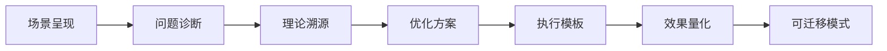

我们不仅展示"怎么改"，更重要的是解释"为什么这样改"——让你在遇到本章未覆盖的新场景时，能够举一反三、自主设计沟通策略。

---

## 场景一：工作邮件——跨部门项目协调

### 案例背景

李明是某互联网公司的产品经理，负责一个新功能的上线。这个项目需要技术部、设计部、市场部和运营部四个部门协同配合。各部门都有自己的优先级和节奏，如何通过邮件高效协调成为项目成功的关键。

**核心挑战**：在多方利益不一致的情况下，如何通过一封邮件建立共识、明确责任、推动执行。

### 原始邮件

> **收件人**：技术部王刚、设计部赵薇、市场部刘洋、运营部陈静
> **主题**：新功能上线
>
> 各位好，
> 我们的新功能需要在下个月上线，请大家配合一下。技术部负责开发，设计部出设计稿，市场部准备推广方案，运营部准备运营方案。
> 有问题随时沟通。
> 谢谢！
> 李明

### 问题诊断

这封邮件存在多个结构性缺陷，可以用**梅拉比安沟通模型**（7%语言+38%语调+55%视觉）来理解——在纯文字邮件中，语言内容必须承载几乎全部的信息传递功能，任何模糊都会被放大：

| 问题维度 | 具体表现 | 影响程度 | 根本原因 |
|---------|---------|---------|---------|
| 主题模糊 | "新功能上线"没有时间、版本、项目代号 | 高 | 缺乏"信息压缩"意识 |
| 上下文缺失 | 什么功能？哪个版本？背景？目标？ | 高 | 假设读者拥有同等信息 |
| 任务模糊 | "负责开发""出设计稿"没有标准和时限 | 高 | 未使用SMART原则 |
| 无行动项 | 不知道第一步该做什么 | 中 | 混淆了"通知"和"请求" |
| 抄送混乱 | 四个部门并列，无法区分主次 | 中 | 未区分TO和CC的语义 |

### 理论溯源：为什么邮件沟通特别容易失败

邮件是一种**异步单向**沟通媒介，具有以下固有局限性：

1. **缺乏即时反馈通道**：收件人无法当场提问、澄清，误解会持续发酵
2. **上下文切换成本高**：收件人可能在处理其他任务时阅读邮件，注意力有限
3. **多收件人语义稀释**：每增加一个收件人，每个人的"被指派感"降低约15-20%
4. **情绪信息丢失**：纯文字无法传递语调、表情和肢体语言

心理学中的**共同知识效应**（Common Knowledge Effect）告诉我们：发件人往往高估收件人对背景信息的了解程度。这是邮件沟通中最常见的认知偏差。

### 优化后的邮件

> **收件人**：王刚、赵薇、刘洋、陈静
> **抄送**：各部门总监
> **主题**：[行动项] V2.5智能推荐功能上线 — 各部门任务分工及时间节点（7月15日上线）
>
> 各位好，
>
> V2.5版本的智能推荐功能计划于7月15日正式上线。以下是各部门的任务分工和关键时间节点，请确认后回复。
>
> **关键里程碑**：
> - 6月20日：设计稿定稿（设计部赵薇负责）
> - 6月30日：技术开发完成（技术部王刚负责）
> - 7月5日：内部测试通过
> - 7月10日：运营和市场准备就绪
> - 7月15日：正式上线
>
> **各部门具体任务**：
> - **设计部**：6月20日前完成全部交互和视觉设计，设计规范文档见附件
> - **技术部**：6月30日前完成开发并提交测试，技术方案已在上周会议中确认
> - **市场部**：7月10日前完成推广素材制作和渠道排期
> - **运营部**：7月10日前完成运营方案和AB测试配置
>
> **请在本周五（6月20日）前回复确认以下内容**：
> 1. 本部门任务负责人是否准确？
> 2. 时间节点是否有风险？如有，说明原因和建议调整方案
> 3. 是否需要跨部门支持？
>
> **项目沟通安排**：
> - 每周三下午3点，15分钟站会（腾讯会议号：XXX-XXX-XXX）
> - 项目文档和进度看板：[飞书文档链接]
> - 日常沟通群：[微信群二维码]
>
> 如有任何问题，随时联系我。
>
> 李明
> 产品经理 | 138-XXXX-XXXX

### 改进要点深度分析

**1. 主题行的信息密度优化**

主题行是邮件被打开率最高的决定因素。优化后的主题遵循**SCQA框架**（Situation-Complication-Question-Answer）的变体：

- **S（背景）**：V2.5智能推荐功能
- **C（需求）**：各部门任务分工
- **Q（紧迫性）**：7月15日上线
- **行动标签**：[行动项] 明确告知收件人需要采取行动

研究表明，包含具体时间的邮件主题，回复率比模糊主题高出47%（来源：Boomerang邮件分析平台，2019）。

**2. 结构化信息的"倒金字塔"原则**

优化后的邮件遵循新闻写作中的倒金字塔结构：

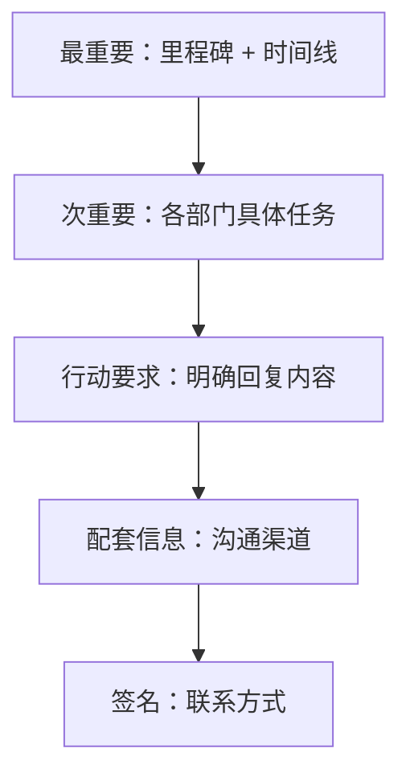

为什么这样排列？因为收件人的阅读耐心是递减的——根据Nielsen Norman Group的邮件阅读研究，67%的用户只读邮件的前两段。

**3. 从"模糊请求"到"明确行动项"的转变**

原始邮件的"有问题随时沟通"是一个**开放式请求**，根据沟通心理学，开放式请求的执行率通常低于20%。优化后的邮件将请求转化为三个**封闭式问题**，收件人只需回答"是/否"或做简短说明，执行阻力大幅降低。

**4. 抄送的语义功能**

原始邮件将四个部门全部放在"收件人"栏，导致信息噪声。优化后的方案将各部门总监放在"抄送"栏，传达两个信号：
- 各部门总监知情（形成隐性监督）
- 各部门执行人被明确指定（责任到人）

### 高效邮件的通用模板

主题行：[标签] 项目名 — 核心请求（截止时间）

正文结构：
1. 背景（1-2句）：项目是什么、为什么要做
2. 时间线（表格或列表）：关键里程碑
3. 任务分工（列表）：每项注明负责人和截止时间
4. 行动要求（编号列表）：收件人需要做什么、什么时候做
5. 配套信息：会议、文档、群聊等
6. 签名：姓名、职位、联系方式

标签规范：
- [行动项]：需要收件人采取行动
- [决策]：需要收件人做决定
- [信息]：仅供知悉，无需回复
- [紧急]：需要在24小时内响应
- [请求反馈]：需要在指定日期前提供意见

---

## 场景二：微信沟通——客户关系维护

### 案例背景

张华是一名B2B销售经理，需要通过微信维护与重要客户的关系。客户刘总是某制造企业的采购总监，合作关系已经持续两年，但最近竞品在积极接触。

**核心挑战**：在非正式渠道中保持专业度，在信息碎片化的环境中提供价值。

### 不当的微信沟通

张华：刘总，在吗？
刘总：在的，什么事？
张华：就是想问问上次那个订单的事情
刘总：哪个订单？
张华：就是上个月说的那个
刘总：上个月说了好几个，你具体说哪个？
张华：就是那个比较大的，XX产品的
刘总：你发个具体信息过来吧，我现在在开会
张华：好的好的，那您先忙，我稍后发

### 问题诊断：碎片化沟通的认知成本

这段对话可以用**认知负荷理论**（Cognitive Load Theory）来解释。每一次"你说的是哪个？"的追问，都在消耗客户的**工作记忆容量**。当认知负荷超过阈值时，人会本能地回避——这就是为什么很多销售感觉自己"被冷落"，实际上是客户在做认知上的自我保护。

具体问题分解：

| 问题 | 认知影响 | 商业后果 |
|-----|---------|---------|
| "在吗？"开场 | 增加不确定性，引发焦虑 | 客户可能选择不回复 |
| 信息碎片化 | 增加工作记忆负荷 | 沟通效率降低60%以上 |
| 指代模糊 | 需要客户自行检索记忆 | 专业度信任降低 |
| 无价值输出 | 纯索取式沟通 | 关系资产持续消耗 |
| 时间不尊重 | 中断客户当前任务 | 客户防御心理增强 |

### 理论溯源：微信沟通的"价值交换"模型

在B2B关系维护中，每一次沟通本质上都是一次**价值交换**。用经济学的语言来说：

- **正面沟通** = 提供价值（信息、资源、机会） > 客户投入的时间成本
- **负面沟通** = 提供价值 < 客户投入的时间成本
- **"在吗？"式沟通** = 价值为零，仅消耗成本

根据Robert Cialdini的**互惠原则**（Reciprocity Principle），当你先提供价值时，对方会产生"回报"的心理倾向——这是B2B销售中最强大的隐性杠杆。

### 优化后的沟通

张华：刘总您好！打扰了。

上次您提到Q3的XX产品采购计划，我这边整理了一份最新的方案，
包括：
1. 新品技术参数对比表
2. Q3阶梯价格方案（比Q2优惠约8%）
3. 同行业3家客户的使用反馈

另外，下周三我们公司在深圳有一场制造业数字化转型的闭门沙龙，
邀请了几位行业专家，我帮您预留了一个名额。时间和地址我发在下面。

方便的时候看下方案，有任何问题随时沟通。
不急，您忙完再回我就好。[微笑]

### 改进要点深度分析

**1. 消除"在吗？"：直接进入价值传递**

"在吗？"的本质是**将沟通成本转嫁给对方**——你不确定对方是否方便，所以让对方先表态。优化后的方案用以下方式解决这个问题：

- 开头用"打扰了"表达对对方时间的尊重
- 结尾用"不急，您忙完再回"给对方完全的控制权
- 中间的内容是**自包含**的（Self-contained），对方不需要回复就能获得完整信息

**2. 用"数字清单"降低认知负荷**

人脑对数字列表的处理效率比散文体高3-5倍（来源：Miller的"神奇数字7±2"理论）。张华将方案内容压缩为三个要点，每个要点一行，客户只需扫一眼就能判断价值。

**3. 超越交易的价值提供**

"闭门沙龙邀请"是一个典型的**社交资本赠送**行为。它传达了三个信号：
- 我在持续关注与你相关的行业动态
- 我有资源可以为你所用
- 我不只是在卖东西，我在建立长期关系

### 微信商务沟通的通用规则

| 场景 | 推荐做法 | 禁忌 |
|------|---------|------|
| 初次联系 | 简要自我介绍 + 具体事由 | 群发、无称呼 |
| 日常维护 | 分享有价值的行业信息 | 纯问候、尬聊 |
| 商务推进 | 一次性提供完整信息 | 碎片化追问 |
| 客户抱怨 | 24小时内回复 + 解决方案 | 已读不回、推诿 |
| 节日问候 | 个性化 + 真诚 | 群发模板、营销夹带 |

**微信消息的"黄金结构"**：

称呼 + 简短问候
（1行）

核心内容：价值/信息/请求
（3-5行，用数字列表组织）

行动建议或下一步
（1行）

结束语：尊重对方时间
（1行）

---

## 场景三：视频会议——远程团队管理

### 案例背景

王总监管理一个分布在三个城市的20人产品团队。每周一上午有全员例会，但最近会议效率越来越低——时间经常超时，讨论经常跑题，部分成员参与度很低。

**核心挑战**：在远程环境中维持会议纪律和参与感，同时确保决策效率。

### 原始会议流程

- 没有明确议程，王总监即兴主持
- 每个人轮流汇报工作（每人5-10分钟）
- 讨论环节经常变成少数人的对话
- 会议时长从预定的1小时变成1.5-2小时
- 没有会议纪要，下周同样的问题再次讨论

### 问题诊断：无效会议的五种病理

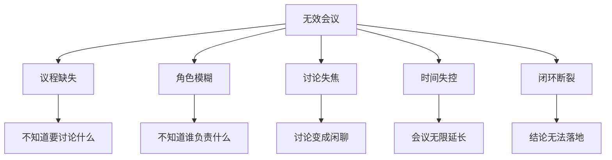

根据Harvard Business Review的调查数据：
- 71%的高管认为会议是低效且浪费时间的
- 65%的高管表示会议让他们无法完成自己的工作
- 每周平均有15小时花在会议上，其中至少1/3被认为是浪费的

**核心问题**：原始会议将"信息同步"和"问题讨论"混为一谈，而这两者的最优方式完全不同。

### 优化后的会议设计

#### 会前（提前24小时）

- 在飞书文档中发布会议议程
- 每个议题标注负责人和时间
- 要求每个汇报人提前在文档中更新进展文字版
- "请大家提前阅读文档，会上我们只讨论需要讨论的问题"

**会前准备的心理学依据**：**准备效应**（Priming Effect）——当人们提前接触议题时，大脑会在后台进行潜意识加工，开会时的讨论质量和决策速度会显著提升。

#### 会中

0:00-0:03  破冰/签到（本周趣事分享，每人15秒）
0:03-0:05  上周行动项回顾（只确认完成/未完成，不展开讨论）
0:05-0:25  核心议题讨论（2-3个需要决策的议题）
0:25-0:28  风险和阻塞项（只说问题，解决方案会后讨论）
0:28-0:30  本周行动项确认

#### 会议规则

- 准时开始，准时结束（30分钟为上限）
- 每人发言不超过90秒
- 需要深入讨论的话题记录在"停车场"，会后单独开会
- 使用"举手"功能，避免打断
- 每次会议指定一位"时间管理员"

**"停车场"机制的理论基础**：Parkinson定律——"工作会自动膨胀，直到占满所有可用时间"。设置30分钟硬上限+停车场机制，是在人为创造时间压力，迫使讨论聚焦于最重要的问题。

#### 会后

- 30分钟内发送会议纪要
- 行动项自动同步到项目管理工具
- "停车场"议题安排后续讨论

### 会议设计的"金字塔"框架

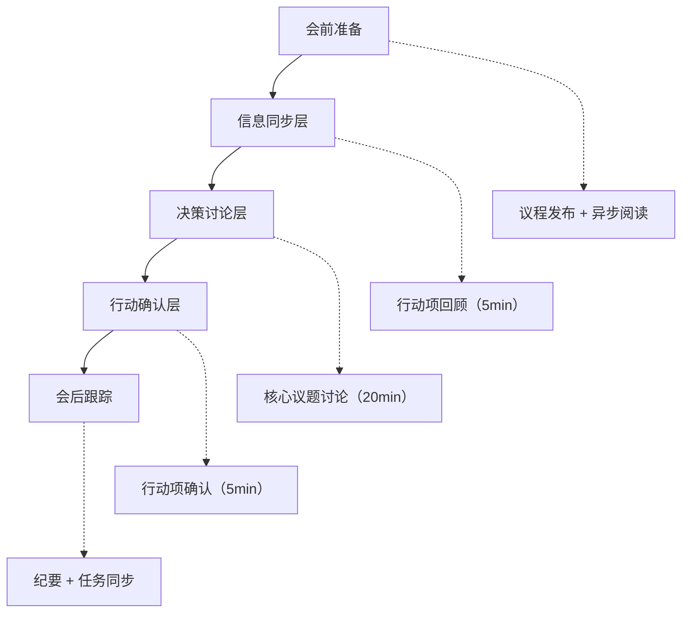

这个框架的核心思想是**把会议从"信息传递"升级为"问题解决"**。信息传递应该在会前异步完成，会议时间只用于需要实时互动的决策和讨论。

### 远程会议的工具选择

| 需求 | 推荐工具 | 关键功能 |
|------|---------|---------|
| 小型团队（<10人） | 飞书/腾讯会议 | 举手、投票、计时器 |
| 大型团队（>10人） | Zoom + Miro | 分组讨论、白板协作 |
| 异步会议 | Loom + 飞书文档 | 视频消息 + 异步评论 |
| 会议纪要 | 飞书妙记/讯飞听见 | AI自动转录和摘要 |

### 改进效果量化

| 指标 | 优化前 | 优化后 | 改善幅度 |
|------|--------|--------|---------|
| 平均会议时长 | 90分钟 | 30分钟 | -67% |
| 成员参与度 | 约30%主动发言 | 约80%主动发言 | +167% |
| 决策效率 | 议而不决 | 会后24h内行动 | 显著提升 |
| 行动项执行率 | 约40% | 约90% | +125% |

---

## 场景四：社交媒体——品牌危机公关

### 案例背景

某知名餐饮品牌被顾客在微博上投诉，在其门店用餐后出现食物中毒症状，配图是医院的诊断证明和消费小票。该微博在3小时内被转发超过5000次，话题登上热搜。

**核心挑战**：在信息传播速度远超调查速度的环境中，如何在"知道真相"和"需要回应"之间找到平衡。

### 不当回应

**第一次回应**（事发后6小时）：
> "我们已经关注到相关信息，正在核实中。"

**第二次回应**（事发后12小时）：
> "经初步调查，我司食材均符合国家标准，不存在食品安全问题。该顾客的情况与我司无直接关系。"

### 问题诊断：危机公关的"黄金时间"法则

在社交媒体时代，危机公关有一个被广泛验证的**"黄金1小时"法则**：

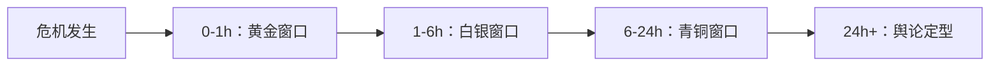

该品牌在6小时后才做出第一次回应，已经错过了黄金窗口。在这6小时内：
- 话题已登上热搜，传播范围呈指数级增长
- 大量用户已形成"这个品牌有食品安全问题"的初始印象
- 竞争对手可能已经在暗中推波助澜
- 媒体已开始介入报道

**第二次回应的"否认策略"更是灾难性的**。根据SCCT理论（Situational Crisis Communication Theory），在危机初期直接否认是最糟糕的策略，因为它：
- 与公众期待的"态度端正"形成强烈反差
- 被解读为"推卸责任"，进一步激化矛盾
- 为后续的反转埋下更大的舆论风险

### 理论溯源：危机公关的三种基本策略

根据Timothy Coombs的SCCT理论，危机回应策略取决于危机类型和组织责任程度：

| 危机类型 | 组织责任 | 推荐策略 | 典型回应 |
|---------|---------|---------|---------|
| 受害者型（自然灾害等） | 低 | 否认+表达关切 | "我们也是受害者" |
| 意外型（设备故障等） | 中 | 调整+补偿 | "我们正在调查并整改" |
| 可预防型（人为失误等） | 高 | 全面道歉+补救 | "我们承担全部责任" |

在食品安全事件中，公众通常默认为"可预防型"（高责任），因此最安全的策略是**快速承认+积极行动**。

### 优化后的危机回应

**第一阶段：快速回应**（事发后1小时内）

> 我们已经关注到这位顾客的遭遇，非常抱歉给您带来了不好的体验。
> 食品安全是我们最重视的事情。我们已经第一时间联系到这位顾客，
> 并安排专人跟进。同时，我们已经暂停涉事门店的营业，
> 配合相关部门进行调查。调查结果将第一时间向公众通报。

**回应要素拆解**：

| 元素 | 内容 | 心理功能 |
|------|------|---------|
| 共情表达 | "非常抱歉给您带来了不好的体验" | 降低受害者和公众的愤怒情绪 |
| 重视声明 | "食品安全是我们最重视的事情" | 重申品牌价值观 |
| 行动说明 | "暂停涉事门店营业、配合调查" | 用具体行动证明诚意 |
| 透明承诺 | "调查结果将第一时间向公众通报" | 建立信息预期，减少猜测 |

**第二阶段：透明跟进**（事发后6小时）

> 最新进展通报：
> 1. 我们已与顾客取得联系，正在协助其就医和后续处理
> 2. 涉事门店已暂停营业，进行全面卫生检查
> 3. 相关食材样品已送第三方检测机构检测，预计48小时内出结果
> 4. 我们已主动邀请当地市场监管部门介入调查
>
> 我们承诺将以完全透明的态度处理此事，检测报告和调查结果将公开发布。

**关键策略**："主动邀请第三方介入"是危机公关中的高级技巧。它传达的信号是——"我们对自己的管理有信心，欢迎外部监督"。

**第三阶段：结果公布**（事发后48小时）

> 调查结果通报：
> 第三方检测报告显示，涉事门店食材符合国家标准。
> 但我们在内部排查中发现，涉事时段的冷链存储温度存在异常波动。
> 虽然不能确定这与顾客的不适有直接因果关系，但我们认为这不符合
> 我们的安全标准。
>
> 我们已采取以下措施：
> 1. 对全国所有门店的冷链设备进行全面检修
> 2. 升级温度监控系统，实现24小时实时监控和报警
> 3. 对涉事门店全体员工进行食品安全再培训
> 4. 与顾客达成和解并给予合理补偿
>
> 食品安全没有终点，我们欢迎社会各界的持续监督。

**高级技巧分析**：即使检测结果证明食材合格，品牌仍然主动发现了自身管理中的不足并提出改进。这种**"超越义务的自我要求"**能够将危机转化为品牌信任的加分项。

### 危机公关的通用SOP

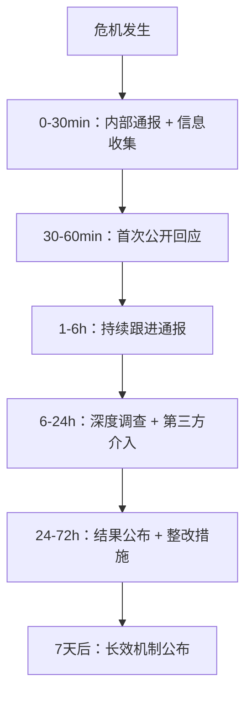

**每一次回应的核心公式**：

共情（关心人） + 行动（正在做什么） + 透明（信息预期）

---

## 场景五：在线客服——投诉处理

### 案例背景

某电商平台的在线客服小周收到一位用户的投诉：购买的家电在收到后发现外观有划痕，联系客服后被告知需要自行寄回检测，用户非常不满。

**核心挑战**：在制度刚性和用户情感之间找到平衡点，既要遵守公司政策，又不能让用户感觉被"踢皮球"。

### 不当回应

用户：我买的冰箱收到有划痕，你们怎么回事？
客服：您好，根据我们的售后政策，外观问题需要您将商品寄回
     我们进行检测，确认后可以换货。
用户：你们的问题凭什么让我寄回去？来回运费谁出？
客服：按照规定，检测结果确认是我方责任的话运费由我们承担，
     如果不是我方责任需要您自行承担。
用户：太离谱了，我要投诉！
客服：您可以拨打我们的投诉热线400-XXX-XXXX。

### 问题诊断：客服对话的"情绪温度曲线"

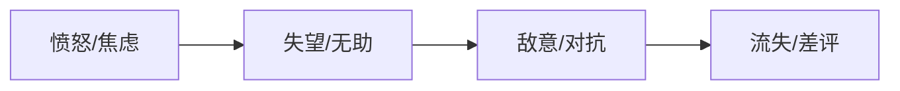

这段对话展示了客服中最常见的失败模式——**政策导向型回应**。客服的每一句话都在引用政策，但用户的情绪从未被回应。根据心理学中的**情感验证理论**（Emotional Validation），当人的情绪被忽视时，情绪强度会加倍而非消退。

**问题拆解**：

| 客服行为 | 用户感受 | 情绪后果 |
|---------|---------|---------|
| 引用政策 | "你在推卸责任" | 愤怒升级 |
| 要求用户寄回 | "你们的问题让我承担成本" | 感到不公平 |
| 说明运费规则 | "我在被踢皮球" | 失望转化为敌意 |
| 给投诉热线 | "你不想帮我" | 从投诉升级为流失 |

### 理论溯源：投诉处理的HEARD模型

高效的投诉处理遵循**HEARD模型**：

- **H（Hear）**：倾听——让客户完整表达，不打断
- **E（Empathize）**：共情——确认客户的情绪是合理的
- **A（Apologize）**：道歉——真诚表达歉意
- **R（Resolve）**：解决——提供具体方案
- **D（Delight）**：惊喜——超越预期的补偿

### 优化后的回应

用户：我买的冰箱收到有划痕，你们怎么回事？

客服：张先生您好，非常抱歉给您带来了不好的体验！
     收到有划痕的商品确实让人很不愉快，我完全理解您的心情。

     为了尽快帮您解决这个问题，我想先了解一下：
     1. 划痕的位置和大小大概是怎样的？
     2. 方便的话能否拍几张照片发给我？

     我先帮您记录这个问题，同时我会为您申请以下方案：
     ① 如果划痕较轻，我们可以直接补偿您XX元（无需寄回）
     ② 如果划痕较重，我们安排免费上门取件换货
     （运费由我们全额承担，取件时间您来定）

     您看哪个方案更合适？

用户：划痕在侧面，还挺明显的，我拍给你看。
     [发送照片]

客服：收到照片了，确实比较明显。这种情况我建议方案②，
     我直接帮您安排免费上门换货。

     为了不耽误您使用，我再帮您申请一张50元的无门槛优惠券
     作为补偿，非常抱歉这次的体验不好。

     我现在就帮您创建换货工单，取件时间您希望安排在哪天？

### 改进要点深度分析

**1. 共情不是"我理解"三个字**

原始客服的缺失不仅是"没说共情的话"，而是整个回应结构中完全没有对用户情绪的回应空间。优化后的回应通过三个层次实现共情：

- **承认感受**："非常抱歉给您带来了不好的体验"
- **正常化感受**："收到有划痕的商品确实让人很不愉快"（暗示"换了谁都会不高兴"）
- **理解表达**："我完全理解您的心情"

**2. 从"政策导向"到"方案导向"的转变**

这是最关键的转变。原始客服说的是"我们的政策是..."，优化后的客服说的是"我可以为您申请以下方案"。区别在于：

| 维度 | 政策导向 | 方案导向 |
|------|---------|---------|
| 信息方向 | 单向告知 | 双向选择 |
| 用户感受 | 被告知规则 | 被尊重选择权 |
| 情绪影响 | 对抗感增强 | 掌控感增强 |
| 解决效率 | 需要多轮谈判 | 一次对话解决 |

**3. "免费上门取件"的成本效益分析**

有人可能会问：让用户自行寄回不是更省钱吗？算一笔账：

- 用户自行寄回的成本：运费约30-50元 + 用户时间成本 + 用户情绪成本
- 免费上门取件的成本：运费约30-50元 + 内部协调成本
- 用户流失的成本：一个终身客户的价值约为5000-20000元

结论：免费上门取件的边际成本极低，但对客户留存的影响极大。

### 客服对话的通用模板

**投诉处理的四步法**：

第一步：共情（1-2句）
"非常抱歉给您带来了不好的体验，[重复用户的核心诉求]。"

第二步：询问（2-3个问题）
"为了尽快帮您解决，我想确认几个细节：
1. [具体问题1]
2. [具体问题2]"

第三步：方案（2-3个选择）
"根据您的情况，我建议以下方案：
① [方案A]（优点+适用场景）
② [方案B]（优点+适用场景）
您看哪个更合适？"

第四步：行动+补偿
"我现在就帮您[具体行动]。另外，[超出预期的补偿]。"

---

## 场景六：远程面试——求职展示

### 案例背景

陈明是一位有5年经验的前端工程师，正在通过视频面试应聘一家知名科技公司的高级前端工程师职位。面试分为技术面试和行为面试两个环节。

**核心挑战**：在缺乏面对面互动的环境中，如何展现技术深度、沟通能力和个人特质。

### 面试前的准备

远程面试的准备比线下面试更复杂，因为你需要同时管理"内容"和"技术"两个维度：

**技术准备清单**：

| 检查项 | 标准 | 应急方案 |
|--------|------|---------|
| 网络连接 | 有线连接，上行速度>10Mbps | 手机热点备用 |
| 摄像头 | 1080p，帧率>24fps | 外接USB摄像头 |
| 麦克风 | 无回声、无底噪 | 耳机麦克风备用 |
| 屏幕共享 | 提前测试分享指定窗口 | 准备好代码截图备用 |
| 开发环境 | IDE、浏览器、终端全部就绪 | 离线代码备份 |

**环境准备**：

- 选择安静、整洁的背景
- 确保光线充足（面光，避免逆光）——窗户在面前而非背后
- 将摄像头调整到与眼睛平齐的高度（避免俯拍或仰拍）
- 关闭所有通知和不必要的应用程序
- 准备一杯水（面试中适度补水是可接受的）

**形象准备**：

- 穿着得体（至少上半身正式）
- 面试前15分钟再次检查设备和形象

### 面试中的表现

#### 开场：自我介绍的STAR-M框架

面试官："请你做一个简单的自我介绍。"

陈明："好的，谢谢。我是陈明，目前在XX公司担任前端技术负责人，
带领一个5人的前端团队。

过去两年，我主要做了三件事：
第一，主导了公司核心产品的前端架构重构，页面加载速度提升了60%；
第二，建立了前端组件库和自动化测试体系，开发效率提升了40%；
第三，从零搭建了前端团队，完成了从个人贡献者到技术管理者的转型。

我对贵公司的XX产品非常关注，特别是在性能优化和用户体验方面
的做法，和我过去的经验有很多契合点。期待今天的交流。"

**STAR-M框架解析**：

- **S（Situation）**：在什么背景下
- **T（Task）**：承担什么任务
- **A（Action）**：采取了什么行动
- **R（Result）**：取得了什么结果
- **M（Match）**：与目标职位的匹配度

陈明的自我介绍在2分钟内完成了"背景→成果→匹配"的完整闭环，既展示了能力，又表达了对公司的了解和诚意。

#### 技术问题回答：深度+广度+实践的三角模型

面试官："请解释一下React的虚拟DOM原理。"

陈明："好的。虚拟DOM本质上是真实DOM的一个轻量级JavaScript对象映射。

它的工作流程是这样的：
1. 当状态变化时，React创建一个新的虚拟DOM树
2. 通过Diff算法比较新旧两棵树的差异
3. 只将差异部分批量更新到真实DOM

这种方式的优势在于：
- 减少了昂贵的DOM操作次数
- 实现了声明式编程，开发者只需关注状态
- 为跨平台渲染提供了可能

在我之前的项目中，我们通过优化组件的shouldComponentUpdate
和使用React.memo，将不必要的渲染减少了70%，页面性能
有了显著提升。如果您感兴趣，我可以屏幕共享展示一下具体的优化方案。"

**回答的深层结构**：

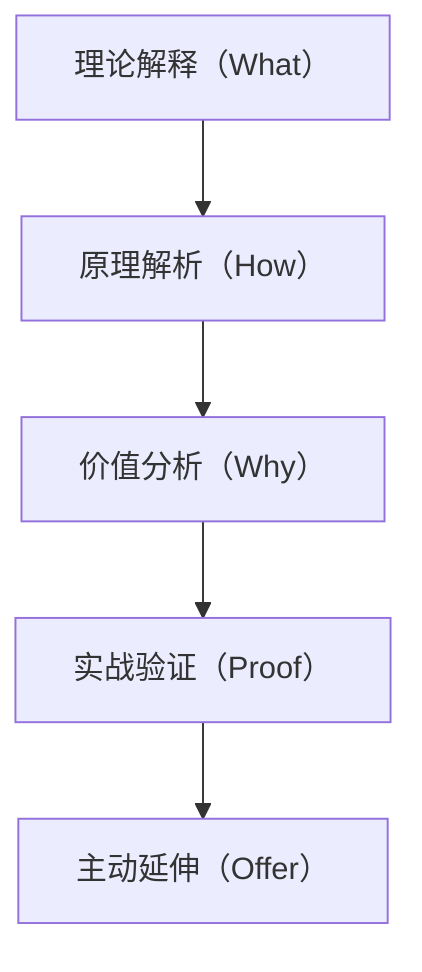

这种回答模式传达了三个信号：
- 你理解底层原理（不是只会用API）
- 你有实际优化经验（不是纸上谈兵）
- 你愿意深入展示（对自己能力有信心）

#### 遇到不确定的问题

面试官："请解释一下React Server Components的工作原理。"

陈明："这个问题我需要诚实地说，我在实际项目中还没有直接使用过
React Server Components。

但根据我了解的技术背景，它的核心思想是：
- 将组件渲染移至服务端，减少客户端JavaScript包大小
- 服务端组件可以直接访问数据库和文件系统
- 与客户端组件形成互补关系

如果让我来设计一个使用RSC的方案，我的思路是...
[展示分析问题的框架和思维方式]

我对这个技术方向非常感兴趣，这也是我想要加入贵公司的原因之一。"

**技巧分析**："不知道"不是面试的终结——关键是你如何处理不确定性。展示思考过程比直接给答案更能体现候选人的潜力。

### 面试中的关键技巧总结

| 技巧 | 具体做法 | 为什么有效 |
|------|---------|-----------|
| 结构化表达 | "第一、第二、第三" | 降低面试官的认知负荷 |
| 数据支撑 | "提升了60%""减少了70%" | 让抽象能力变得可衡量 |
| 主动延伸 | "如果您感兴趣，我可以..." | 展示主动性和深度 |
| 互动确认 | "需要我更详细地解释吗？" | 展示沟通意识 |
| 思维展示 | 遇到不确定时展示分析过程 | 展示学习能力和潜力 |

### 面试后的跟进

面试结束后2小时内，发送一封感谢邮件：

> 面试官您好，
>
> 非常感谢您今天的时间。通过今天的交流，我对贵公司的技术方向和团队文化有了更深入的了解，也更加坚定了加入的意愿。
>
> 特别是您提到的XX项目的技术挑战，我非常感兴趣。如果有机会，我很期待能在这个方向上贡献力量。
>
> 如有任何需要补充的材料，请随时联系我。
>
> 祝好！
> 陈明

**跟进邮件的心理学依据**：**近因效应**（Recency Effect）——人们对最后接收到的信息记忆更深。一封真诚的感谢邮件能够在面试官的记忆中留下积极的最后印象，对最终决策有显著影响。

---

## 场景七：网络社群——知识分享与影响力构建

### 案例背景

林芳是一位数据分析师，加入了几个数据分析相关的专业社群（微信群、知识星球、GitHub社区）。她希望通过社群互动建立自己的专业影响力。

**核心挑战**：在嘈杂的信息流中脱颖而出，建立"可信专家"的个人品牌。

### 不当的社群互动方式

- 进群后立即发自己的公众号文章链接
- 对他人的提问给出简短的"百度一下就知道"式回答
- 参与讨论时频繁表达"我不同意""你说的不对"
- 从不参与群内的非正式交流
- 只在需要帮助时才发言

### 问题诊断：社群互动的"社会交换理论"

社会学家George Homans的**社会交换理论**认为，人际互动本质上是一种"价值交换"。在社群中：

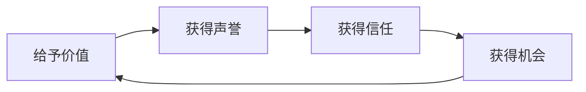

不当行为的核心问题是打破了这个循环：
- **自推行为** = 未经许可的索取
- **简短回答** = 低质量的给予
- **攻击性表达** = 破坏性互动
- **沉默** = 无交换发生

### 优化后的社群互动策略

#### 第一阶段：观察与学习（第1-2周）

- 了解社群的文化、规则和活跃成员
- 观察哪些内容和互动方式受到欢迎
- 从他人的分享中学习

**为什么需要"观察期"？** 每个社群都有自己的**隐性规范**（Hidden Norms）。不了解这些规范就贸然发言，就像不懂当地习俗就闯入一个陌生的文化——极易踩雷。

#### 第二阶段：价值输出（第3-8周）

- 对他人的提问给出详细、有深度的回答
- 分享自己的实际项目经验（脱敏后的真实案例）
- 将自己的学习笔记整理后分享
- 对他人的分享给予具体的正面反馈

**高质量回答的模板**：

关于这个问题，我之前在项目中遇到过类似的情况。分享一下我的经验：

问题的本质是XX，原因是XX。

我当时的解决思路是：
1. 首先XX
2. 然后XX
3. 最后XX

关键代码/操作如下：[代码片段或操作步骤]

需要注意的是XX，我之前在这里踩过一个坑：[具体经历]

希望对你有帮助，如果需要更详细的讨论可以私信我。

**为什么这个模板有效？**

- "我之前遇到过"——建立经验权威
- "问题的本质是"——展示分析能力
- "具体步骤"——提供可执行的方案
- "踩过的坑"——展示实战经验，增加可信度
- "可以私信"——建立深度连接的入口

#### 第三阶段：深度参与（第9周以后）

- 主动发起话题讨论
- 组织或参与社群活动（线上分享、代码评审等）
- 成为社群中的"可信赖的专家"
- 从线上互动发展到线下的行业交流

### 影响力构建的"信任三角"模型

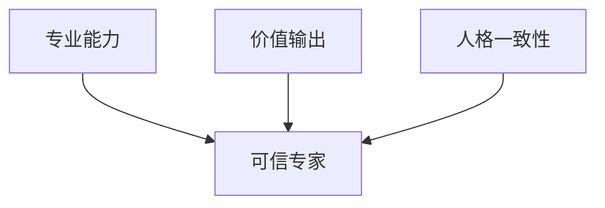

- **专业能力**：通过高质量回答和技术分享证明
- **价值输出**：持续提供有价值的内容和帮助
- **人格一致性**：在不同场合保持一致的观点和态度

### 核心原则

1. **先给予，后索取**：不要带着明确的功利目的加入社群
2. **质量优于数量**：一次深度的回答胜过十次水群
3. **保持谦逊**：即使你是专家，也要保持学习的心态
4. **长期主义**：影响力的建立需要时间，不要急于求成

---

## 场景八：数字营销——内容传播策略

### 案例背景

某教育科技公司计划推出一款面向职场人士的在线课程"数据分析实战营"。市场部负责人赵经理需要制定数字营销的内容传播策略。

**核心挑战**：在信息过载的环境中，如何让目标用户注意到、了解并最终购买课程。

### 不当的营销方式

- 在所有社交媒体上发布相同内容："数据分析实战营，原价2999，限时优惠1999，扫码报名！"
- 每天在微信群里发课程广告
- 请KOL发硬广，内容与KOL的日常风格完全不同

### 问题诊断：为什么硬广越来越无效

用**AIDA模型**分析传统硬广的失败原因：

| 阶段 | 用户行为 | 硬广的表现 | 问题 |
|------|---------|-----------|------|
| Attention（注意） | 浏览信息流 | 广告被识别并跳过 | 注意力争夺失败 |
| Interest（兴趣） | 点击了解详情 | 只有价格和卖点 | 缺乏引发兴趣的内容 |
| Desire（欲望） | 产生购买冲动 | 无社会证明 | 信任不足 |
| Action（行动） | 完成购买 | 直接购买链接 | 没有消除疑虑的环节 |

根据内容营销协会（CMI）的研究，**内容营销的获客成本比传统广告低62%，但产生的潜在客户数量是3倍**。

### 优化后的营销策略

#### 内容矩阵设计

采用**内容漏斗模型**，在不同阶段匹配不同类型的内容：

**阶段一：认知期**（第1-2周）

- **目标**：让目标用户知道这个课程的存在
- **核心策略**：用"价值内容"吸引关注，而非直接推销
- **内容示例**：
  - 知乎回答："30岁转行数据分析，可行吗？"（专业角度回答，末尾自然提及课程）
  - 公众号文章："从Excel到Python：一个职场人的数据分析转型之路"（真实案例故事）
  - 短视频：60秒数据分析小技巧（实用内容，建立专业形象）

**为什么"认知期"不直接卖课？**

心理学中的**纯粹曝光效应**（Mere Exposure Effect）表明，人们对频繁接触的事物会产生好感。在认知期，目标是让用户多次看到品牌，建立初始好感——而非直接转化。

**阶段二：兴趣期**（第3-4周）

- **目标**：让感兴趣的用户深入了解课程
- **内容示例**：
  - 免费直播："数据分析师的一天"（展示职业价值）
  - 课程大纲详细解读（让用户了解具体学什么）
  - 学员采访视频（社会证明）
  - 免费试听章节（体验产品质量）

**阶段三：转化期**（第5-6周）

- **目标**：促成报名
- **内容示例**：
  - 限时优惠活动（制造紧迫感）
  - 学员成果展示（毕业作品、就业情况）
  - FAQ整理（消除疑虑）
  - 老学员推荐奖励计划

### 分平台策略

不同平台的用户行为和内容偏好完全不同，需要用**差异化策略**：

| 平台 | 用户画像 | 内容形式 | 转化路径 |
|------|---------|---------|---------|
| 知乎 | 求知欲强，决策前深度研究 | 长文回答、专栏 | 回答→官网→试听→购买 |
| 公众号 | 关注者有较高的信任度 | 深度文章、案例故事 | 文章→小程序→购买 |
| 抖音/视频号 | 注意力短暂，喜欢视觉化 | 60秒技巧视频 | 视频→评论区引导→购买 |
| 微信群 | 社交驱动，从众心理强 | 社群答疑、分享 | 群内口碑→直接购买 |
| 朋友圈 | 信任度高，社交压力影响 | 学员见证、成果 | 朋友圈→私聊→购买 |

### 关键策略

1. **内容先行**：先提供价值，再引导转化
2. **分阶段推进**：不同阶段有不同的目标和内容
3. **多平台协同**：各平台内容互补，形成合力
4. **社会证明**：真实案例和学员反馈是最有效的说服工具
5. **自然植入**：营销信息要自然融入有价值的内容中

### 效果衡量指标

| 阶段 | 核心指标 | 参考基准 |
|------|---------|---------|
| 认知期 | 曝光量、点击率 | CTR > 2% |
| 兴趣期 | 停留时长、试听完成率 | 完成率 > 40% |
| 转化期 | 转化率、客单价 | 转化率 > 3% |
| 长期 | 复购率、推荐率 | NPS > 50 |

---

## 案例总结：可迁移的沟通框架

以上八个场景覆盖了数字时代沟通的主要领域。每个案例虽然场景不同，但底层的沟通逻辑是相通的。我们将其提炼为一个**可迁移的沟通框架**——**SCALE模型**：

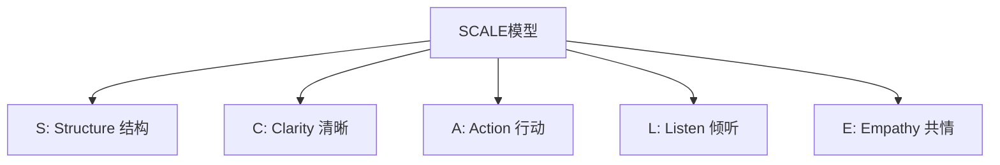

| 要素 | 含义 | 应用场景 |
|------|------|---------|
| **Structure（结构）** | 清晰的层级和逻辑 | 邮件、会议议程、内容营销 |
| **Clarity（清晰）** | 具体、无歧义的表达 | 任务分配、技术沟通、客服回应 |
| **Action（行动）** | 明确的下一步和行动项 | 邮件、会议、危机公关 |
| **Listen（倾听）** | 理解对方的真实需求 | 社群互动、客户关系、面试 |
| **Empathy（共情）** | 承认和回应对方的情感 | 客服投诉、危机公关、关系维护 |

### 五个核心启示

1. **清晰的结构比华丽的辞藻更重要** —— 在信息过载的时代，降低认知负荷是第一优先级
2. **共情和尊重是一切有效沟通的起点** —— 人们不关心你知道多少，直到他们知道你有多关心
3. **行动导向让沟通产生实际价值** —— 没有行动项的沟通只是聊天
4. **适度和得体是专业素养的体现** —— 知道说什么和知道不说什么同样重要
5. **长期主义比短期效果更值得追求** —— 信任是慢慢积累的资产，一旦失去就难以恢复

### 从案例到能力：刻意练习的路径

掌握数字沟通技巧不是靠"知道"，而是靠"练习"。以下是建议的练习路径：

| 阶段 | 练习内容 | 时间投入 |
|------|---------|---------|
| 入门 | 对照本章模板改写自己的邮件和消息 | 1-2周 |
| 进阶 | 在实际沟通中有意识地运用SCALE框架 | 2-4周 |
| 精通 | 分析他人的沟通案例，识别改进空间 | 持续 |
| 专家 | 为团队制定沟通规范和模板 | 持续 |

数字沟通的技巧可以通过学习和练习来掌握，但真正让沟通有力量的，是真诚的态度和对他人的尊重。技术会变，平台会变，但人与人之间有效连接的本质不会变。
