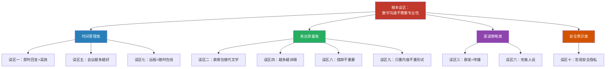
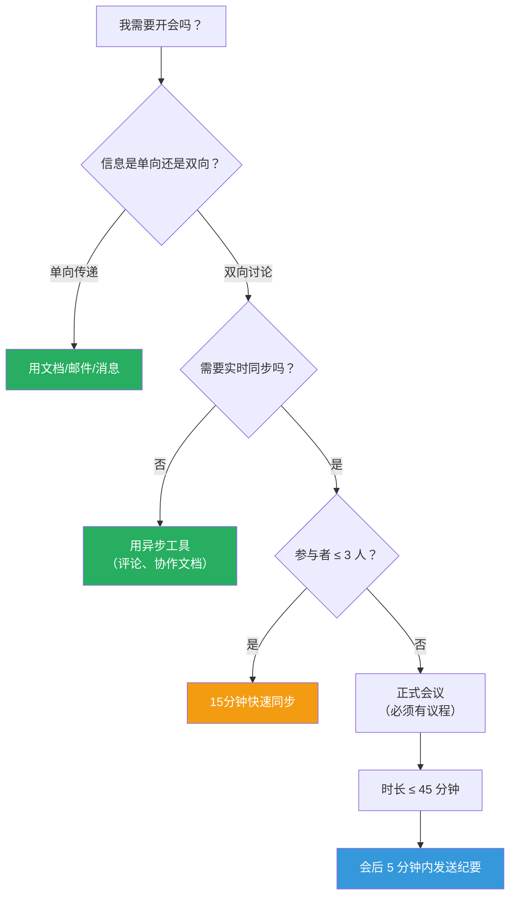

# 常见误区：数字时代沟通的十大陷阱

数字沟通的便捷性制造了一种危险的错觉：因为工具简单，所以沟通也简单。这种错觉催生了大量看似合理、实则有害的沟通习惯。认知心理学将这类现象称为**自动化认知偏差**（Automatic Cognitive Bias）——人们在缺乏元认知监控的状态下，不自觉地将低质量的沟通模式固化为习惯。

本章的十个误区并非孤立存在。它们共享一个根本原因：**将数字沟通视为"不那么正式的沟通"，从而降低了专业标准**。每一个误区都会从识别机制、心理根源、实际危害、纠正方案和进阶策略五个维度展开，帮助你建立系统的"数字沟通免疫系统"。

---

## 误区一：即时回复等于高效

### 误区表现

许多职场人将"秒回消息"视为高效和敬业的标志。他们每隔几分钟就检查一次手机，收到消息立刻回复，甚至在开会、处理重要工作时也不停地回复消息。在一些企业文化中，"已读不回"甚至被视为态度问题。

### 心理根源

这一误区的底层驱动力是**可变比率强化**（Variable Ratio Reinforcement）——与赌博成瘾机制相同。每条新消息都可能是"重要的"，这种不确定性让人不断检查手机。此外，即时回复会触发多巴胺释放，产生"我很有用""我很忙碌"的自我满足感，心理学家称之为**生产力幻觉**（Productivity Illusion）。

康奈尔大学 Gloria Mark 教授的研究团队发现：知识工作者平均每 **11 分钟**被外部中断一次，而从中断恢复到之前的专注深度平均需要 **23 分 15 秒**。也就是说，如果你每 10 分钟回复一次消息，你几乎从未真正进入过深度工作状态。

### 实际危害

| 危害维度 | 具体表现 | 量化影响 |
|---------|---------|---------|
| 深度工作破坏 | 注意力碎片化，无法进行复杂思考 | 日均有效深度工作时间从 4 小时降至 1.5 小时 |
| 回复质量下降 | 草率回复导致信息不完整、甚至出错 | 需要二次沟通补充的概率增加 40% |
| 期望锚定效应 | 为所有人设定了"秒回"的期望基线 | 一旦延迟回复，对方焦虑感上升 |
| 团队文化污染 | 个人习惯扩散为团队规范 | 整体深度工作能力下降 |

### 纠正方案

**第一层：建立响应时间框架**

明确告知同事你的消息处理节奏，例如：
- 即时通讯工具：每 2-3 小时集中处理一次，紧急事项请打电话
- 邮件：每日处理两次（上午 10 点、下午 4 点）
- 项目管理工具：每日站会后统一回复

**第二层：消息分级矩阵**

                 ┌──────────────────────────────────────────┐
                 │            消息紧急程度                    │
                 │        低                      高         │
    ┌────────────┼──────────────────────────────────────────┤
    │    高      │  邮件（定时处理）    │  电话/当面（立即） │
    │ 重         │  附截止日期         │  停下手中工作       │
    │ 要         ├──────────────────────────────────────────┤
    │ 程         │  异步工具留言       │  即时通讯           │
    │ 度    低   │  不要求即时回复     │  工作时间内回复     │
    └────────────┴──────────────────────────────────────────┘

**第三层：技术手段辅助**

- 设置"专注时间段"自动回复："我在深度工作中，每 3 小时查看一次消息，紧急事项请拨打手机"
- 使用消息聚合工具，将所有平台消息统一到一个入口处理
- 关闭非关键应用的通知推送

### 进阶策略

高效能人士的做法不是"更快地回复"，而是"更少地需要回复"。具体方法：
- **预防性沟通**：在问题发生前主动同步信息，减少被动回复
- **模板化响应**：将常见问题的回答制成模板，一键发送
- **授权分流**：明确团队职责分工，将不属于自己的消息正确转交

---

## 误区二：表情包可以替代文字表达

### 误区表现

有些人在工作沟通中过度依赖表情包——用"点赞"表示同意，用"微笑"表示理解，用"加油"表示鼓励，用各种 GIF 动图来回应严肃的工作问题。

### 心理根源

表情包的流行源于人类对**非语言线索补偿**的本能需求。文字沟通丢失了面部表情、语调、肢体语言等信息，表情包试图弥补这一缺失。问题在于，这种补偿是粗糙且不可靠的——同一个表情在不同人、不同文化、不同语境中解读可能完全相反。

微信中的"微笑"表情是典型例子。对于 40 岁以上用户，它通常表示友好；对于年轻用户群体，它往往被解读为"呵呵""无语"甚至"嘲讽"。英国朴茨茅斯大学心理学教授 Geoff Beattie 的研究指出，人类能识别超过 **20 种**不同的微笑类型，每一种传递的情感信号完全不同，而一个平面表情无法承载这种复杂性。

### 实际危害

**信息解码失败率高**：柏林工业大学的一项实验表明，表情符号的情感意图被正确解读的概率仅为 **44.8%**，不到抛硬币的水平。在跨文化场景中，这个数字更低。

**工作场景中的具体风险**：

| 场景 | 使用的表情 | 发送者意图 | 接收者解读 | 后果 |
|------|-----------|-----------|-----------|------|
| 项目延期通知回复 | 😊 | "知道了，我会处理" | "不以为然，没当回事" | 信任度下降 |
| 客户投诉回应 | 👍 | "收到，正在处理" | "敷衍，不重视" | 客户升级投诉 |
| 领导批评后回复 | 🙏 | "理解，虚心接受" | "讨好，不真诚" | 职业形象受损 |
| 跨文化团队沟通 | OK手势👌 | "好的，没问题" | 在巴西等地：侮辱性手势 | 严重文化冲突 |

### 纠正方案

**原则：表情包是调味料，不是主菜**

- **正式场景**（邮件、报告、客户沟通、向上汇报）：纯文字，零表情
- **半正式场景**（项目群讨论、跨部门协作）：文字为主，偶尔用一个表情缓解语气
- **非正式场景**（团队内部闲聊、庆功）：适度使用，但核心信息仍用文字

**文字替代方案**——用语言精确表达情感：

| 你本想用的表情 | 更好的文字表达 |
|---------------|--------------|
| 👍 | "收到，我来处理。预计明天下午前完成。" |
| 😊 | "太好了，这个方案我非常认可。" |
| 💪 | "我对我们团队完成这个目标很有信心。" |
| 😂 | "确实，上次那个项目的过程比结果更有戏剧性。" |
| ❤️ | "特别感谢你的支持，这个方案能落地离不开你的贡献。" |

### 文化差异速查

不同文化对表情符号的接受度差异巨大：

- **日韩**：表情文化根深蒂固，甚至在商务邮件中使用颜文字也被接受
- **欧美**：职场中表情使用趋于保守，LinkedIn 等专业平台以文字为主
- **中东**：注意宗教文化敏感性，避免使用可能冒犯的表情
- **拉美**：情感表达较为开放，但仍需区分上下级关系

---

## 误区三：群发等于广泛传播

### 误区表现

一些人将"群发消息"等同于"有效传播"。他们在微信群里频繁转发文章、推广产品、分享观点，认为"看到的人越多，效果越好"。

### 心理根源

这一误区源于**曝光效应的误用**。心理学中的"单纯曝光效应"（Mere Exposure Effect）确实表明，重复接触会增加好感。但这一效应有严格的边界条件：当曝光是**非自愿的、打断性的**时候，效果会反转为**厌恶效应**。群发消息正是这种非自愿曝光。

传播学学者 Everett Rogers 在《创新的扩散》中提出，信息的有效传播依赖五个要素：相对优势、兼容性、复杂性、可试验性、可观察性。群发只解决了"触达"这一个环节，其余四个全部缺失。

### 实际危害

**传播效果量化对比**：

| 传播方式 | 触达人数 | 打开率 | 互动率 | 转化率 | 品牌影响 |
|---------|---------|--------|--------|--------|---------|
| 无差别群发 | 1000 | 5-10% | <1% | <0.1% | 负面（被打标签） |
| 精准定向发送 | 50 | 60-80% | 20-30% | 5-10% | 正面（专业可靠） |
| 内容吸引自发传播 | 不限 | N/A | 5-15% | 1-3% | 极正面（口碑传播） |

数据显示，1000 人群发的实际有效传播效果，远不如 50 人的精准定向。群发不仅效率低，还会产生负外部性——接收者会将你标记为"广告号"，后续所有消息的打开率都会急剧下降。

### 纠正方案

**精准传播的四步法**：

1. **受众画像**：明确这条信息谁需要、谁关心、谁受益
2. **价值评估**：这条信息能给接收者带来什么具体价值？如果没有，不发
3. **渠道匹配**：严肃内容走邮件/文档，轻松内容走社交，时效内容走即时通讯
4. **时机选择**：工作内容在工作时间发送，学习资源在晚上或周末发送

**社群运营的正确方式**：

- **贡献在先**：先在群里帮助他人、回答问题、分享有价值的资源，建立信任
- **获得许可**：分享前征询群主或管理员意见
- **提供选择**："有兴趣的同事可以私信我获取详细资料"，而非直接群发
- **频率控制**：同一群每周主动分享不超过 1-2 次

---

## 误区四：文字越多越详细越好

### 误区表现

有些人写邮件像写论文，发消息像写日记。他们认为信息越详细越好，文字越多就越不容易被误解。一封简单的确认邮件可能被写成 800 字的长文。

### 心理根源

这一误区的心理根源是**信息焦虑的反向投射**——发送者担心遗漏信息导致被误解或追责，因此倾向于"把所有可能用到的信息都塞进去"。这种行为本质上是将沟通的风险管理成本转嫁给了接收者。

认知心理学中的**米勒定律**（Miller's Law）指出，人类工作记忆一次只能处理 **7±2 个信息单元**。当一条消息包含超过这个数量的独立信息点时，接收者的认知处理能力会急剧下降，结果不是"信息更完整"，而是"什么都记不住"。

### 实际危害

- **阅读完成率暴跌**：超过 300 字的工作消息，完整阅读率不到 **30%**（Boomerang 对 530 万封邮件的分析数据）
- **关键信息被淹没**：长文本中真正重要的 1-2 句话，极容易被大量背景描述淹没
- **回复效率降低**：接收者需要在长文中"提取"你需要他们做什么，增加了沟通摩擦
- **被忽视的风险**：在信息过载的环境中，长消息往往被标记为"稍后处理"然后遗忘

### 纠正方案

**金字塔写作法**：

              ┌─────────────┐
              │   结论/请求   │  ← 第一句话
              │  (What/Need) │
              └──────┬──────┘
                     │
         ┌───────────┼───────────┐
         │           │           │
    ┌────┴────┐ ┌────┴────┐ ┌────┴────┐
    │ 关键理由1 │ │ 关键理由2 │ │ 关键理由3 │  ← 3个以内核心支撑
    └────┬────┘ └────┬────┘ └────┬────┘
         │           │           │
    ┌────┴────┐ ┌────┴────┐ ┌────┴────┐
    │ 详细数据  │ │ 详细数据  │ │ 详细数据  │  ← 按需展开
    └─────────┘ └─────────┘ └─────────┘

**一句话检验法**：在写完任何消息后，尝试用一句话概括核心意思。如果你做不到，说明你自己还没想清楚要表达什么。

**格式优化清单**：

| 优化项 | 错误示范 | 正确示范 |
|--------|---------|---------|
| 开头 | "关于上次讨论的那个项目……" | "XX项目需要你审批预算，详情如下。" |
| 结构 | 一整段文字 | 分点列出，每点一个信息 |
| 长度 | 500字说明文 | 100字正文 + 附件链接 |
| 行动项 | "你觉得怎么样？" | "请在周五17:00前回复：(1)是否同意方案A (2)预算上限" |

### 进阶：长度与场景的匹配

| 沟通场景 | 理想长度 | 格式要求 |
|---------|---------|---------|
| 即时消息确认 | 1-2 句话 | 纯文字 |
| 工作邮件（单事项） | 100-200 字 | 结构化，有明确行动项 |
| 项目方案简述 | 300-500 字 | 背景+方案+下一步 |
| 正式报告/提案 | 按需 | 摘要+正文+附录，摘要不超过1页 |

---

## 误区五：在线会议要尽量多开

### 误区表现

一些管理者认为"多开会就是好管理"。他们每天安排大量视频会议——晨会、周会、月会、一对一、部门会、项目会……团队成员的大部分时间都在会议中度过，真正做事的时间反而所剩无几。

### 心理根源

管理者热衷于开会，本质上源于**控制焦虑**和**可见性偏好**。在远程/混合办公环境中，管理者无法像在办公室里那样"看到"团队在做什么，会议成为他们确认"一切在掌控中"的心理安慰剂。此外，召集会议是一种权力的体现——它暗示"我的时间比你们的优先级更高"。

斯坦福大学教授 Nicholas Bloom 的远程工作研究发现：会议数量与团队生产力之间呈现**倒 U 型关系**——适度的会议促进协作，过度的会议摧毁生产力。他估计，不必要的会议每年给美国经济造成的生产力损失超过 **370 亿美元**。

### 实际危害

**会议成本计算器**：

会议成本 = 参会人数 × 会议时长 × 人均时薪 × 2（切换成本系数）

示例：10人 × 1小时 × 200元/小时 × 2 = 4,000元/次
如果每周有15个这样的会议 = 60,000元/周 = 312万元/年

最后一个系数"2"是关键——研究表明，会议前后各存在约等于会议时长的"切换成本"（准备、热身、结束后恢复工作流）。因此一场 1 小时会议的真实成本是账面成本的 2-3 倍。

**Zoom 疲劳的神经科学解释**：微软研究院 2021 年的脑电波研究发现，连续视频会议超过 **30 分钟**后，前额叶皮层（负责注意力和决策）的活动显著下降，而杏仁核（负责焦虑和威胁检测）的活动上升。这意味着持续的视频会议不仅让人疲惫，还让人焦虑。

### 纠正方案

**会议必要性决策树**：

**高效会议规则**：

1. **无议程不开会**：至少提前 24 小时发送议程，包含讨论主题、预期产出、每个议题的时间分配
2. **计时器制度**：每个议题严格计时，超时则记录待讨论事项，不在会上延展
3. **站会限时**：每日站会控制在 15 分钟内，每人发言不超过 2 分钟
4. **定期清理**：每月审视所有定期会议，问"如果取消这个会议，最坏会发生什么？"——如果答案是"什么都不会发生"，取消它
5. **无会日制度**：每周至少保留 1-2 个"无会议日"，保障深度工作时间

### 进阶：异步替代方案对照表

| 传统会议类型 | 异步替代方案 | 适用条件 |
|-------------|------------|---------|
| 信息通报会 | 文档/邮件/视频录播 | 信息单向传递，无需讨论 |
| 进度同步会 | 项目管理工具看板更新 + 每日文字日志 | 团队使用统一的项目管理工具 |
| 头脑风暴 | 异步协作文档（每人独立填写想法后汇总讨论） | 充分利用"独立思考"避免群体思维 |
| 决策会议 | 提前发送方案文档 + 收集反馈 + 仅争议点开会讨论 | 决策材料足够清晰 |
| 一对一 | 周报/文字汇报 + 需要时才约面谈 | 管理者与下属之间信任度高 |

---

## 误区六：社交媒体上要展示完美的自己

### 误区表现

有些人在社交媒体上精心打造"完美人设"——只展示成功、光鲜的一面，刻意隐藏失败和不足。每条动态都经过精心策划，每张照片都经过修图，每个分享都经过斟酌。他们的社交媒体是一个精心制作的"个人广告"。

### 心理根源

这一行为模式在心理学中被称为**自我呈现**（Self-presentation）的极端化。社会学家 Erving Goffman 的"拟剧理论"指出，人在社交中天然会进行"前台表演"，但社交媒体的几个特性将这种表演推向了失真：

- **永久记录**：每条内容都被永久保存，让人不敢发布"不完美"的内容
- **量化反馈**：点赞、转发、评论数量将社交认可度数字化，驱动"追求更多赞"的行为
- **选择性展示**：只看到别人的"精华集锦"，产生"只有我不够好"的社交比较

### 实际危害

**对发送者的危害**：

- **真实性悖论**：2023 年 Edelman Trust Barometer 显示，**67%** 的消费者表示他们更信任"展示真实一面"的品牌和人，而非"完美包装"的形象
- **人设维护成本**：持续维护完美人设需要消耗大量心理能量。密歇根大学的研究发现，"高频自我监控"的社交媒体用户，焦虑和抑郁水平比普通用户高出 **33%**
- **脆弱性**：人设越完美，崩塌时的损失越大。公众对"完美人设翻车"的记忆远比对"普通人的小失误"更持久

**对接收者的危害**：

- **社交比较焦虑**：看到别人"完美"的生活，产生"为什么我不如别人"的自我贬低
- **信息环境污染**：当所有人都在"表演"时，真实的有价值信息被淹没在光鲜的噪音中

### 纠正方案

**真实性的三个层次**：

1. **选择性真实**：不需要分享一切，但分享的必须是真实的。你可以选择不展示失败，但不应该伪造成功
2. **脆弱性力量**：心理学家 Brené Brown 的研究表明，适度展示脆弱性（承认不足、分享教训）反而能建立更深层次的信任和连接
3. **成长叙事**：与其展示"我已经成功了"，不如展示"我正在进步中"。前者招致嫉妒，后者激发共鸣

**社交媒体内容策略矩阵**：

| 内容类型 | 占比建议 | 示例 |
|---------|---------|------|
| 专业见解/知识分享 | 40% | 行业分析、技术总结、书评 |
| 真实经历/教训 | 25% | 项目复盘、踩坑记录、失败反思 |
| 互动/讨论 | 20% | 提问、转发并评论、参与话题 |
| 个人生活/轻松内容 | 15% | 旅行、爱好、团队活动 |

---

## 误区七：远程工作意味着随时可以工作

### 误区表现

远程工作模糊了工作和生活的边界。许多人陷入"随时在线"的状态——早上醒来看邮件，晚上睡前回消息，周末也在处理工作。他们认为这是远程工作的"代价"，甚至是"高效"的体现。

### 心理根源

这一误区有三个心理驱动力：

- **沉没成本谬误**：在家工作时，因为没有"通勤"这个明确的上下班信号，人们倾向于用更长的工作时间来"证明自己确实在工作"
- **分离焦虑**：不在线时担心错过重要信息或决策（FOMO，Fear of Missing Out），特别是在跨时区团队中
- **边界模糊**：家既是休息空间又是工作空间，物理环境的重叠导致心理边界的模糊

斯坦福大学 Nicholas Bloom 教授对中国携程旅行网 16,000 名员工的大型随机对照实验发现：远程工作者的生产力平均提高了 **13%**，但工作满意度在 9 个月后出现下降，主要原因是**孤独感和工作生活边界模糊**。

### 实际危害

**职业倦怠的阶段模型**：

世界卫生组织（WHO）2019 年将"职业倦怠"正式纳入 ICD-11，定义为：因长期未能成功管理的工作场所压力而导致的综合征。其核心症状包括：精力耗竭、对工作的心理距离增加、职业效能下降。

**过度工作的收益递减**：

| 周工作时长 | 边际产出 | 长期风险 |
|-----------|---------|---------|
| 35-40 小时 | 最高效率区间 | 低 |
| 40-50 小时 | 效率开始下降 | 中等 |
| 50-60 小时 | 边际产出接近零 | 高 |
| 60+ 小时 | 负产出（错误增多） | 极高 |

斯坦福经济学家 John Pencavel 的研究证实：周工作超过 **50 小时**后，每小时产出急剧下降；超过 **55 小时**，额外工作的产出几乎为零。

### 纠正方案

**建立四道边界**：

1. **时间边界**：固定工作开始和结束时间，像通勤一样严格执行。到点就关电脑，不是因为没活干，而是因为明天需要精力充沛
2. **空间边界**：如果条件允许，有一个专门的工作区域。工作结束后离开那个区域，物理上"下班"
3. **数字边界**：在非工作时间关闭工作应用通知，或使用"免打扰"模式。可以设置例外——只允许电话和特定联系人突破免打扰
4. **团队边界**：在团队层面建立明确的规范。例如："工作日晚间 8 点后和周末不发工作消息，除非标注 [紧急]"

**工具推荐**：

- 手机自带的"专注模式"或"数字健康"功能：按时间段自动屏蔽应用通知
- Slack/飞书的"请勿打扰"定时功能：设置自动开关
- 日历工具中的"专注时间"区块：将深度工作时间像会议一样排入日历

---

## 误区八：数字沟通不需要注意措辞

### 误区表现

有些人在数字沟通中非常随意——不检查错别字、不注意语气、不考虑措辞。他们觉得"反正是发消息，差不多就行了"。

### 心理根源

这一误区源于**媒介丰富度理论**（Media Richness Theory）的误读。该理论确实指出，文字消息是"低丰富度"媒介，但这恰恰意味着需要**更多**的措辞注意来补偿非语言线索的缺失，而不是"反正信息少，随便写就行"。

更深层的原因是**代码转换失败**。人类在面对面沟通中会自然地根据对象调整表达方式（对领导、同事、朋友说话方式不同），但在文字沟通中，这种代码转换能力下降，人们倾向于使用统一的、往往是过于随意的表达风格。

### 实际危害

**数字沟通的"永久记忆"效应**：面对面说错话，说完就消散了。但文字沟通是**永久留痕**的。一封措辞不当的邮件可能在数月甚至数年后被翻出来，成为争议的证据。这在职场纠纷、法律诉讼、审计调查中尤为致命。

**语气误读的系统性偏差**：芝加哥大学商学院的研究发现，发送者认为自己的邮件语气被正确理解的概率为 **78%**，但实际被正确理解的概率仅为 **56%**。这意味着每 5 封邮件中，就有 2 封的语气被误读。

**措辞问题的连锁反应**：

| 措辞问题 | 直接后果 | 间接后果 |
|---------|---------|---------|
| 错别字/语病 | 专业形象受损 | 被认为做事不严谨 |
| 语气过于生硬 | 对方感到被冒犯 | 关系紧张，协作困难 |
| 语气过于随意 | 不被认真对待 | 建议和需求被忽略 |
| 模棱两可的表达 | 对方理解偏差 | 执行方向错误，返工 |
| 缺乏礼貌用语 | 被认为不懂基本尊重 | 个人口碑下降 |

### 纠正方案

**发送前五步检查法**：

1. **事实核查**：数据、日期、姓名、金额等关键信息是否准确
2. **完整检查**：行动项是否清晰？时间要求是否明确？附件是否遗漏
3. **语气校准**：大声读一遍，判断听起来是"友好专业"还是"生硬冷漠"
4. **受众适配**：如果我是接收者，读到这条消息会有什么感受
5. **错别字扫描**：快速扫一遍拼写和语法

**常见场景的措辞对照**：

| 场景 | 不恰当措辞 | 专业措辞 |
|------|-----------|---------|
| 催促对方 | "这个怎么还没好？" | "想确认一下XX的进展，如果有障碍我可以协助。" |
| 拒绝请求 | "这个做不了。" | "这个方案目前受限于XX条件，我建议替代方案YY，你看是否可行？" |
| 指出错误 | "这里错了。" | "XX部分可能有个笔误，建议核实一下原始数据。" |
| 提出异议 | "我觉得不行。" | "这个方案我有一些顾虑，主要在XX方面，我们可以讨论一下替代路径。" |
| 表达感谢 | "谢谢" | "谢谢你在这个项目上的支持，特别是XX环节的处理帮了大忙。" |

### 进阶：数字沟通中的语气管理技巧

- **显式标注语气**：当你担心语气可能被误读时，直接说明——"补充一下，上面这段没有任何催促的意思，只是想确保信息同步"
- **善用标点符号**：句号在即时通讯中可能被解读为"不高兴"，适当使用感叹号或省略号可以软化语气
- **延迟发送策略**：对于情绪化的内容，写完后至少等 **30 分钟**再发送。很多"怒回"在冷静后会被后悔

---

## 误区九：只关注内容，忽略形式

### 误区表现

有些人认为"内容为王"，形式无关紧要。他们的邮件没有格式、长篇大论堆在一起；PPT 只有密密麻麻的文字；社交媒体内容没有配图；报告没有目录和分段。

### 心理根源

这一误区混淆了两个不同的概念：**信息**和**沟通**。信息是"你要传递的内容"，沟通是"对方实际接收并理解的内容"。两者的差值，就是因形式不佳造成的"信息损耗"。

认知心理学中的**格式塔原则**（Gestalt Principles）告诉我们，人类大脑天然倾向于将视觉信息组织成有意义的模式——好的排版利用这种倾向帮助读者理解，糟糕的排版则与之对抗，增加认知负荷。

**双重编码理论**（Dual Coding Theory，Allan Paivio）进一步证实：同时使用文字和视觉元素呈现信息，比单纯文字的记忆效果高出 **40-60%**。忽略形式不仅是"不好看"的问题，而是直接降低了信息传递的有效性。

### 实际危害

**形式对阅读行为的影响**（基于 Nielsen Norman Group 眼动追踪研究）：

- 用户在网页上的阅读模式呈 **F 型**：先水平扫描顶部，再略低位置水平扫描，最后垂直扫描左侧
- 如果关键信息不在 F 型扫描路径上，**79%** 的用户会直接跳过
- 格式良好的文档，信息获取效率是纯文本文档的 **2.4 倍**

**不同媒介的形式要求**：

| 媒介 | 关键形式要素 | 常见错误 |
|------|------------|---------|
| 工作邮件 | 标题明确、分段清晰、行动项突出 | 标题用"你好"、正文不分段、行动项埋在中间 |
| PPT/演示 | 一页一个观点、图文配合、留白充足 | 每页10+行文字、缺乏图表、没有结论页 |
| 文档/报告 | 目录、标题层级、图表编号 | 平铺直叙、无结构、图表无标题 |
| 社交媒体 | 首图吸引眼球、段落短、有互动钩子 | 纯文字、长段落、无视觉元素 |
| 即时消息 | 分点发送、关键信息前置 | 整段文字一次性发出、重要信息淹没在末尾 |

### 纠正方案

**20% 原则**：将沟通总时间的 20% 用于形式优化。如果你花 40 分钟写一封邮件，至少花 8 分钟用于排版和格式检查。

**设计四原则**（Robin Williams《写给大家看的设计书》）：

1. **对比**（Contrast）：重要信息通过加粗、颜色、字号突出，与普通信息形成对比
2. **对齐**（Alignment）：所有元素在视觉上有明确的对齐线，避免随意放置
3. **重复**（Repetition）：同类信息使用一致的格式（标题样式、列表符号、间距）
4. **亲密性**（Proximity）：相关的内容物理位置靠近，不相关的内容留出明显间距

**邮件格式模板**：

主题：[项目名] 需要你确认：预算方案（截止 6/28）

Hi [姓名]，

[一句话说明目的]

【背景】
- 2-3 句话交代上下文

【需要你做的】
1. 确认方案 A 还是方案 B
2. 回复截止：6/28（周五）17:00

【详细资料】
- 方案对比表见附件
- 如需讨论，可约周五下午的时间

[签名]

---

## 误区十：忽视数字安全和隐私

### 误区表现

有些人在数字沟通中毫无安全意识——在公共 Wi-Fi 上处理敏感工作、使用弱密码、随意点击不明链接、在社交媒体上分享过多个人信息、将工作文件存储在不安全的平台上。

### 心理根源

安全意识薄弱的心理根源是**乐观偏差**（Optimism Bias）——人们倾向于认为"坏事不会发生在我身上"。IBM 的研究表明，**95%** 的网络安全事件与人为因素有关，其中大部分并非技术能力不足，而是安全意识不足。

另一个因素是**便利性偏好**。安全措施（强密码、双重认证、VPN）会增加操作步骤，人们本能地选择更便捷但不安全的方式。这本质上是将短期便利置于长期安全之上。

### 实际危害

**数据泄露的代价**：

- IBM《2023 年数据泄露成本报告》：全球平均数据泄露成本为 **445 万美元**，创历史新高
- 从泄露发生到被发现的平均时间为 **204 天**，也就是说攻击者可能已经在你的系统里潜伏了近 7 个月
- **51%** 的数据泄露涉及恶意攻击，**16%** 涉及人为失误（错发邮件、配置错误等）

**社工攻击的典型路径**：

**职场中高风险的无意识行为**：

| 行为 | 风险等级 | 潜在后果 |
|------|---------|---------|
| 在公共 Wi-Fi 登录工作系统 | 高 | 账号密码被中间人攻击截获 |
| 使用同一密码注册多个平台 | 高 | 一个平台泄露导致所有账号被攻破 |
| 工作文件通过微信/QQ传输 | 中 | 文件脱离公司安全管控，无法追溯 |
| 朋友圈晒工牌/办公环境 | 中 | 社工攻击素材，可推断公司信息和权限 |
| 转发工作邮件到个人邮箱 | 高 | 数据外泄，违反信息安全政策 |
| 使用未授权的云存储分享文件 | 高 | 数据脱离管控，存在未授权访问风险 |

### 纠正方案

**个人安全基线**（每个人都应该做到的最低标准）：

1. **密码管理**：使用密码管理器（如 1Password、Bitwarden），为每个平台生成唯一强密码（16+ 字符，随机组合）
2. **双因素认证**：所有重要账号开启 2FA，优先使用认证器 App（如 Google Authenticator），避免短信验证
3. **软件更新**：操作系统和应用保持最新版本，安全补丁应在发布后 72 小时内安装
4. **链接鉴别**：不点击来源不明的链接，鼠标悬停查看真实 URL，警惕域名拼写变体
5. **信息分级**：区分公开信息、内部信息和机密信息，使用对应安全级别的渠道

**企业级信息安全检查清单**：

| 检查项 | 频率 | 负责人 |
|--------|------|--------|
| 密码策略审计 | 每季度 | IT 部门 |
| 权限最小化审查 | 每月 | 部门主管 |
| 安全意识培训 | 每半年 | 全员 |
| 钓鱼邮件模拟测试 | 每季度 | 安全团队 |
| 离职员工权限回收 | 即时 | HR + IT |

### 进阶：数字卫生习惯养成

将安全行为内化为习惯，而非依赖意志力：

- **每日**：检查是否有异常登录提醒
- **每周**：清理不再使用的 App 授权
- **每月**：检查各平台的隐私设置，更新密码（对高风险账号）
- **每季度**：全面审查账号安全状态，移除不再使用的账号

---

## 综合自检清单

以下清单可作为日常数字沟通的质量自检工具。建议每月对照一次，识别自己正在犯的错误：

| 自检项 | 你是否…… | 对应误区 |
|--------|---------|---------|
| 时间管理 | 每天设定专门的消息处理时间，而非随时查看 | 误区一 |
| 表情使用 | 正式沟通中零表情，非正式沟通中适度使用 | 误区二 |
| 传播策略 | 只在确认内容有价值且受众精准时才分享 | 误区三 |
| 信息密度 | 重要消息先写一句话摘要，再按需展开细节 | 误区四 |
| 会议纪律 | 每次会议都有明确议程和时间限制 | 误区五 |
| 真实呈现 | 社交媒体内容有 20% 以上包含真实经历和教训 | 误区六 |
| 边界意识 | 有明确的工作/生活时间边界且能坚持 | 误区七 |
| 措辞专业 | 发送前至少检查一遍语气和措辞 | 误区八 |
| 形式投入 | 将 20% 的沟通准备时间用于排版和格式优化 | 误区九 |
| 安全意识 | 使用密码管理器和双因素认证 | 误区十 |

---

## 从误区到精通的路径

避免误区只是第一步。真正的数字沟通高手，是能够将正确的做法从"刻意练习"内化为"自然习惯"的阶段。这需要经历三个阶段：

**第一阶段：觉察**（1-2 周）。使用上方自检清单，每天回顾自己的沟通记录，识别正在犯的错误。不求改变，只求看见。

**第二阶段：替代**（2-6 周）。对每个识别出的误区，用本章提供的正确方案替代旧习惯。每次只聚焦 1-2 个误区，不要试图同时改变所有习惯。

**第三阶段：内化**（6-12 周）。当新行为不再需要刻意思考时，它已经成为习惯。此时可以开始关注更高级的策略——比如如何设计沟通流程、如何建设团队沟通文化、如何利用数字工具提升沟通效率。

记住：**数字沟通能力不是天赋，而是可训练的技能**。每一次发邮件、写消息、开会，都是一次练习的机会。
