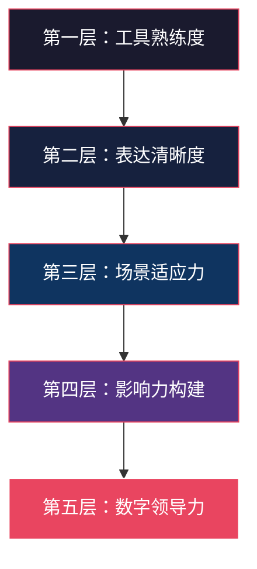
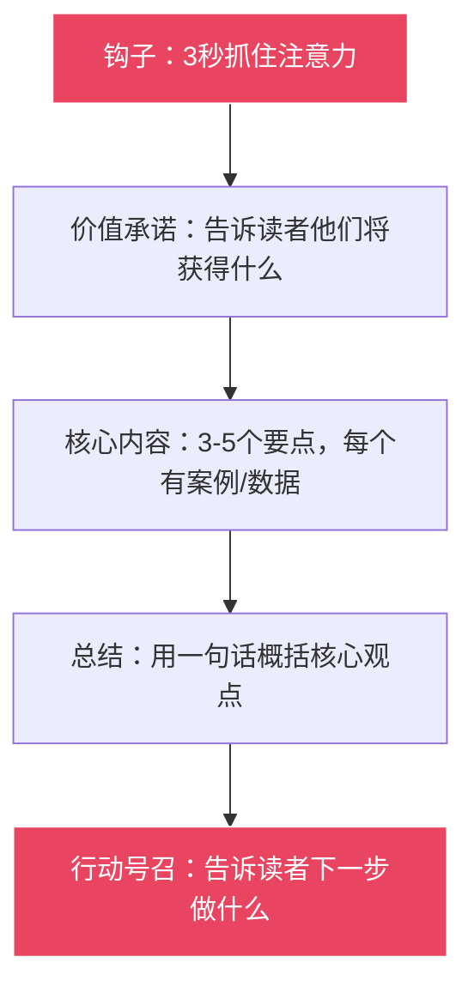
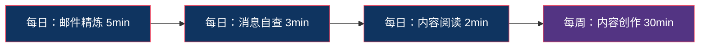

# 练习方法：数字时代沟通能力系统提升方案

数字沟通能力不是"知道"就能获得的，而是"练出来"的。认知心理学家安德斯·艾利克森（Anders Ericsson）在其"刻意练习"理论中指出：专业能力的形成依赖于**有明确目标、有即时反馈、有难度递进、有重复强化**的系统训练。数字沟通同样如此——你可以读完一百篇关于邮件写作的文章，但如果从未在真实场景中反复打磨，写出来的邮件仍然可能让人困惑。

本章提供一套完整的练习体系，涵盖**理论机制、每日微练习、每周深度练习、月度复盘、场景专项训练、进步评估**六大模块。每个练习都经过设计，确保：目标可量化、方法可执行、反馈可获取、进度可追踪。

---

## 第一部分：练习的理论基础

### 为什么需要刻意练习

日常沟通是"自然发生"的——你写邮件、发消息、开会，每天都在做。但"做"不等于"练"。两者的区别在于：

| 维度 | 日常沟通（自然发生） | 刻意练习（主动训练） |
|------|---------------------|---------------------|
| 目标 | 完成任务 | 提升特定技能 |
| 注意力 | 关注内容本身 | 关注表达方式和效果 |
| 反馈 | 被动接收（对方回复） | 主动收集（自我评估+他人反馈） |
| 难度 | 习惯性水平 | 略高于当前能力 |
| 结果 | 维持现状 | 持续进步 |

研究数据支撑：LinkedIn 2024年职场技能报告显示，**沟通能力连续六年位居雇主最看重的软技能榜首**。而在数字沟通领域，能够高效进行远程协作的专业人士，其职业晋升速度比平均水平快27%（来源：Harvard Business Review, 2023）。

### 数字沟通能力的五层模型

练习之前，先理解数字沟通能力包含哪些层次。这个模型帮助你定位自己当前的水平，并找到需要重点提升的方向：



**第一层：工具熟练度** — 会用邮件、IM、会议软件、协作文档等基本工具
**第二层：表达清晰度** — 能用文字准确传达意图，减少误解和来回
**第三层：场景适应力** — 能根据不同场景（向上汇报、客户沟通、跨部门协作）调整沟通策略
**第四层：影响力构建** — 能通过数字内容建立专业形象，影响他人的决策和认知
**第五层：数字领导力** — 能通过数字手段凝聚团队、推动变革、塑造组织文化

大部分人在第二到第三层之间。本章的练习覆盖所有五层，你可以根据自己当前的水平选择对应的练习组合。

### 刻意练习的四个核心要素

每个练习都必须包含以下四个要素，否则你只是在"做"而不是"练"：

**要素一：明确的目标** — 这次练习要提升哪个具体技能？（不是笼统的"提升沟通能力"，而是"让邮件主题行在5秒内传达核心信息"）

**要素二：即时的反馈** — 练习后如何知道做得好不好？（自检清单、同伴评审、观察对方回复速度和质量）

**要素三：适当的难度** — 练习内容是否略高于当前水平？太简单不会进步，太难会放弃

**要素四：足够的重复** — 同一类型的练习需要多次才能形成肌肉记忆。邮件写作练习至少持续21天才能形成习惯

---

## 第二部分：每日微练习（Daily Micro-Practices）

每日练习的设计原则是**低门槛、高频次、可坚持**。每个练习只需5-15分钟，融入日常工作流程，不造成额外负担。关键是每天做、不间断，让沟通优化成为一种条件反射。

### 练习一：邮件写作精炼（每日5分钟）

**练习目标**：提升邮件的清晰度、简洁度和专业度。

**理论依据**：研究表明，职场人平均每天收到121封邮件（Radicati Group, 2024），每封邮件的平均阅读时间仅为11秒（Boomerang, 2023）。这意味着你的邮件必须在11秒内传达核心信息，否则就会被忽略或误解。

**练习方法**：

每天选择一封你即将发送的邮件，进行以下三步优化：

**第一步：检查主题行**（1分钟）
- 主题行是否包含核心信息？收件人能否仅凭主题行就判断邮件的重要性？
- 是否标注了行动要求？（如"【请审批】""【需回复】""【FYI】"）
- 是否便于后续搜索？（包含项目名、日期、关键术语）
- 长度是否合适？最佳主题行为6-10个词（约30-50个中文字符）

**主题行优化示例**：

| 优化前 | 优化后 | 改进点 |
|--------|--------|--------|
| 会议 | 【需确认】12月20日14:00 Q4复盘会议邀请 | 添加时间、行动要求、会议主题 |
| 关于项目 | 【更新】XX项目第二阶段进展报告（附甘特图） | 添加性质标签、具体内容、附件提示 |
| 问题 | 【紧急】生产环境数据库连接超时 - 需今晚处理 | 添加优先级、问题描述、时间要求 |
| 你好 | 关于下周培训安排的三个确认事项 | 去掉无意义问候，直接点明内容 |

**第二步：精简正文**（2分钟）
- 是否遵循"结论先行"的原则？（金字塔原理：先说结果，再说原因）
- 能否用更少的字数表达同样的意思？目标：每封邮件正文不超过150字（特殊情况除外）
- 每个段落是否有明确的目的？（一个段落只表达一个核心意思）
- 是否使用了结构化格式？（编号列表、加粗关键信息、分段标题）

**正文精简练习**：

原文（87字）：
> 我想跟你讨论一下关于下周二下午的客户演示的事情。我们团队最近做了很多准备工作，PPT也基本完成了，但是有一些细节可能还需要调整。你那边方便的话，我想约个时间跟你过一遍，看看有没有什么需要改进的地方。

精简后（45字）：
> 下周二客户演示准备就绪，PPT已定稿。希望约30分钟过一遍细节，请告知你的可用时间。

精简率48%，信息完整度100%。

**第三步：检查行动项**（2分钟）
- 收件人看完邮件后是否清楚该做什么？
- 是否有明确的截止时间？
- 是否需要回复确认？
- 行动项格式：**谁** + **做什么** + **什么时候** + **达到什么标准**

**行动项检查示例**：

| 模糊的行动项 | 清晰的行动项 |
|-------------|-------------|
| 请尽快处理 | 请在12月20日（周五）17:00前完成审批 |
| 看看有没有问题 | 请重点检查第三部分的预算数字，如有问题请标注具体位置 |
| 我们讨论一下 | 请在周三前回复邮件，确认方案A或方案B |

**进阶练习**：
- **压缩挑战**：将一封300字的邮件精简到150字，同时保持所有关键信息不变
- **主题行竞赛**：为同一封邮件写3个不同版本的主题行，找同事投票选择最佳
- **结构调整**：重新组织一封之前发送的邮件，用"背景→结论→行动项"结构重写
- **反向练习**：收到一封写得差的邮件，分析它差在哪里，然后重写一封

**自检清单**（每次发送前过一遍）：
- [ ] 主题行包含核心信息和行动要求
- [ ] 结论在前，细节在后
- [ ] 行动项明确（谁、做什么、什么时候）
- [ ] 无错别字和语病
- [ ] 附件已添加且已在正文中提及
- [ ] 收件人和抄送人是否正确（该抄的没漏，不该抄的没多）
- [ ] 语气是否适合当前场景（正式/非正式）
- [ ] 邮件长度是否合适（能在11秒内抓到重点）

---

### 练习二：消息发送前自查（每日3分钟）

**练习目标**：提升即时通讯消息的质量和得体度。

**理论依据**：即时通讯的即时性是一把双剑——它提高了沟通效率，但也增加了冲动表达和误解的风险。Slack的内部数据显示，**超过40%的工作消息在发送后需要补充说明**，这意味着将近一半的消息在第一次发送时没有达到预期效果。

**练习方法**：

每次发送重要的即时通讯消息前，花30秒问自己以下四个问题：

1. **目的明确吗？** — 收件人能否在3秒内理解你想要什么？如果不能，重新组织语言
2. **时机合适吗？** — 现在发送是否合适？是否在对方的工作时间内？是否在会议中？对方是否刚经历了一个糟糕的会议？
3. **语气得当吗？** — 文字没有语调，容易被误解。是否有任何表达可能被理解为讽刺、不耐烦或冷漠？
4. **信息完整吗？** — 收件人是否需要追问才能理解全部意思？能否在一条消息里把背景、请求、时间要求都说清楚？

**消息优化四步法**：


**示例**：

原始想法："那个报告呢？"

第一步（明确目的）：我需要知道报告的进度 → "报告写完了吗？"

第二步（补充背景）：对方可能不知道是哪个报告 → "上周五会上说的Q4营收报告，进度如何？"

第三步（调整语气）：直接问"写完了吗"可能显得催促 → "Hi，想了解下Q4营收报告的进展，方便时回复我就好。如果有需要协调的地方随时说。"

第四步（发送）：检查完毕，发送。

**特别场景练习**：

**给上级发消息**：
- 结论在前，解释在后（"方案A推荐采用，理由如下：..."）
- 提供选项而非只提问题（"我建议A或B，各有以下优劣..."）
- 注意时间，非紧急事务避免在22:00后或周末发送
- 如果必须在非工作时间发送，注明"不急，明天上班看就好"

**给客户发消息**：
- 先提供价值，再提需求（"附上最新的竞品分析报告。另外，关于下月合作..."）
- 语气专业但不生硬，避免过度正式的措辞
- 信息完整，减少来回次数。一条消息把背景、进展、需要、时间都说清楚
- 关键信息用加粗或数字编号突出

**在群聊中发言**：
- 先判断：这条消息是否与群聊主题相关？如果不相关，是否应该私聊？
- 是否会打扰不相关的人？群消息的"注意力成本"是人数×时间
- 是否需要@特定的人？@人要有明确的理由，不要无意义@全员
- 长内容不要直接发群里，用文档链接代替

**在紧急情况下发消息**：
- 第一条消息必须包含：问题是什么、影响范围、需要谁做什么、截止时间
- 示例："【紧急】生产环境API超时，影响所有用户下单。需要后端排查数据库连接池。@张三 请在30分钟内确认是否能处理。"
- 不要在紧急消息里写背景故事，直接说问题和需要

---

### 练习三：专业内容阅读与拆解（每日10分钟）

**练习目标**：通过观察和分析优秀的数字沟通案例，建立自己的"沟通直觉"。

**理论依据**：大量研究表明，观察学习（Observational Learning）是技能习得的重要途径。心理学家班杜拉（Albert Bandura）的社会学习理论指出，人们通过观察他人的行为及其后果来学习新行为。在数字沟通领域，分析优秀案例可以帮助你内化高质量沟通的模式。

**练习方法**：

每天花10分钟进行以下活动之一（轮换进行，保持新鲜感）：

**活动A：优秀邮件拆解**（每周至少1次）

找到一封你收到的高质量邮件，从以下五个维度分析：

| 分析维度 | 具体问题 | 记录方式 |
|---------|---------|---------|
| 结构 | 主题行→开头→正文→结尾的结构是怎样的？ | 画出结构图 |
| 语气 | 正式程度如何？亲和力如何？ | 记录关键表达 |
| 信息量 | 信息密度如何？有无冗余？ | 标注可删除的部分 |
| 行动项 | 行动项是否清晰？格式如何？ | 记录行动项的写法 |
| 说服力 | 如何让读者接受其观点或请求？ | 提炼说服策略 |

**活动B：爆款内容逆向工程**（每周至少2次）

选择一篇你所在领域的高互动内容（点赞1000+、评论100+），进行逆向分析：

1. **标题拆解**：标题使用了什么技巧？（数字、疑问、对比、悬念、痛点直击）
2. **开头拆解**：前三句话如何抓住注意力？（数据冲击、故事引入、反常识观点）
3. **结构拆解**：内容如何组织？（问题→分析→方案、故事→道理→行动）
4. **互动拆解**：作者如何引导读者互动？（提问、投票、挑战、邀请分享）
5. **可复用元素**：哪些元素可以应用到你自己的内容中？

**活动C：在线会议观察**（每周至少1次）

在参加在线会议时，有意识地扮演"沟通观察者"角色：

- **主持人的技巧**：如何开场？如何控制节奏？如何处理偏题？如何总结？
- **表达高手**：谁的发言最有说服力？他/她做了什么不同的事？
- **反面案例**：哪些沟通方式效果不好？如何改进？
- **工具使用**：谁最善用会议工具（投票、白板、屏幕共享）？

**记录方式**：

准备一个"数字沟通学习笔记本"（推荐使用Notion、Obsidian或飞书文档），每天记录：

日期：2024-12-XX
观察类型：邮件拆解 / 内容逆向 / 会议观察
观察对象：[具体描述]
值得学习的点：
1. ____________
2. ____________
可以应用到自己的场景：____________
行动计划：____________

**连续记录21天后**，回顾你的笔记，提炼出你最常学到的5个模式，这就是你的"个人沟通工具箱"的雏形。

---

### 练习四：数字形象自检（每日2分钟）

**练习目标**：维护一致、专业的数字形象。

**理论依据**：数字形象是你的"第二简历"。CareerBuilder的调查显示，**70%的雇主会在做出雇佣决定前查看候选人的社交媒体**，而43%的雇主表示社交媒体上的内容曾导致他们拒绝了某个候选人。

**每日快速自检**（2分钟）：

1. **社交媒体检查**（30秒）：快速浏览自己各平台的最新内容。问自己：如果一个潜在雇主/客户/合作伙伴看到这条内容，他们会怎么想？这条内容是否符合你想要塑造的专业形象？

2. **通知管理**（30秒）：是否有不必要的通知在打扰你？通知过多会降低专注力，也容易导致你发送冲动的消息。关闭不必要的推送，设置"专注时间"。

3. **消息处理**（60秒）：扫描所有消息平台，是否有未回复的重要消息？是否有需要跟进的事项？用"两分钟法则"：如果一条消息可以在2分钟内回复，立即处理。

---

## 第三部分：每周深度练习（Weekly Deep Practices）

每周练习的设计原则是**深度实践、系统提升**。每个练习需要30-60分钟，建议安排在每周固定的时间段进行。将这些练习视为你的"沟通健身房"——每周至少去一次，才能保持状态。

### 练习五：社交媒体内容创作（每周60分钟）

**练习目标**：通过定期的内容创作，建立个人专业品牌和内容创作能力。

**理论依据**：内容创作是数字时代最有效的影响力构建方式之一。LinkedIn数据显示，定期发布专业内容的用户，其个人资料浏览量比不发布的用户高出**5.6倍**，收到的私信数量高出**7倍**。

**完整的创作流程**：

**第1步：选题**（10分钟）

选题是内容创作最重要的一步——选题错了，写得再好也没人看。选题的四个标准：

- **相关性**：这个话题与你的专业领域直接相关吗？
- **时效性**：这个话题当前是否热门或正在被讨论？
- **独特性**：你对这个话题有什么独特的见解、经验或角度？
- **实用性**：读者看完后能否立即应用到自己的工作中？

**选题来源**：
- 本周工作中的一个发现或教训
- 行业新闻或热点事件的专业解读
- 常见问题的系统性解答
- 工具/方法的实操评测
- 行业趋势的分析和预测

**第2步：构思**（10分钟）

用以下框架快速构思：

核心观点（一句话）：____________
目标读者：____________
读者看完后会获得什么：____________
支撑要点（3-5个）：
1. ____________
2. ____________
3. ____________
内容形式：长文 / 短文 / 图文 / 视频脚本

**第3步：创作**（30分钟）

按照"黄金结构"创作：



**钩子的七种写法**：

| 类型 | 示例 | 适用场景 |
|------|------|---------|
| 数据冲击 | "90%的沟通问题不是能力问题，而是方法问题" | 分析类内容 |
| 反常识 | "你以为的高效沟通，其实是在浪费时间" | 观点类内容 |
| 痛点直击 | "你是不是也遇到过这种情况：邮件发出去石沉大海？" | 教程类内容 |
| 故事引入 | "上周五下午5点，我收到了一封改变我职业轨迹的邮件" | 经验类内容 |
| 问题抛出 | "如果只能教新人一件事，你会教什么？" | 讨论类内容 |
| 对比冲突 | "同样的信息，一封邮件写了300字，一封只写了50字，效果天差地别" | 案例类内容 |
| 权威背书 | "哈佛商学院教授John Kotter说，70%的变革失败源于沟通" | 理论类内容 |

**第4步：优化**（10分钟）

从以下维度优化：

- **精简**：删除所有不影响核心观点的字句。目标：每句话都有存在的理由
- **可读性**：段落是否够短（手机屏幕一屏能显示一个完整段落）？是否使用了列表、加粗、分隔符？
- **视觉**：是否需要配图、图表或表情符号来增强表达？
- **预览**：在发布前完整预览一遍，检查在不同设备上的显示效果

**发布平台选择策略**：

| 平台 | 适合的内容类型 | 最佳发布时间 | 内容长度 |
|------|--------------|-------------|---------|
| 微信公众号 | 深度长文、系统教程 | 周二-周四 8:00-9:00 | 2000-5000字 |
| 知乎 | 专业问答、深度分析 | 全天均可，晚间高峰 | 1000-3000字 |
| 即刻/Twitter/X | 短观点、行业洞察 | 工作日 12:00-13:00 | 280字以内 |
| LinkedIn | 职场经验、行业趋势 | 周二-周四 8:00-10:00 | 300-1000字 |
| 小红书 | 实用技巧、工具推荐 | 晚间 20:00-22:00 | 图文为主 |
| B站/YouTube | 教程、拆解、演示 | 周末 10:00-12:00 | 5-15分钟视频 |

**效果追踪表**（每周填写）：

本周发布内容：____________
发布平台：____________
发布日期/时间：____________
阅读量：____________
点赞数：____________
评论数：____________
转发/分享数：____________
新增关注：____________
收到的私信/合作邀请：____________
效果评估（1-5分）：____________
下周改进方向：____________

---

### 练习六：在线会议复盘（每周30分钟）

**练习目标**：通过系统化的复盘，持续提升在线会议的主持和参与能力。

**理论依据**：Atlassian的研究显示，职场人平均每月参加62次会议，其中**50%被认为是浪费时间**。而经过系统化复盘和改进的团队，会议效率可提升30-40%。

**复盘方法**：

每周选择一次你主持或深度参与的在线会议，用以下框架进行复盘：

**维度一：会议设计**（评估会议前的准备质量）

| 检查项 | 评分(1-5) | 备注 |
|--------|----------|------|
| 会议目的是否明确？ | | |
| 议程是否提前发送？ | | |
| 时间分配是否合理？ | | |
| 参会人员是否必要？ | | |
| 会前材料是否充足？ | | |

**维度二：会议执行**（评估会议中的表现）

| 检查项 | 评分(1-5) | 备注 |
|--------|----------|------|
| 是否准时开始和结束？ | | |
| 开场是否清晰说明了目的和议程？ | | |
| 讨论是否聚焦？偏题时如何处理？ | | |
| 是否确保每个参与者都有发言机会？ | | |
| 是否有明确的结论和行动项？ | | |

**维度三：会后跟进**（评估会后的执行质量）

| 检查项 | 评分(1-5) | 备注 |
|--------|----------|------|
| 会议纪要是否在24小时内发送？ | | |
| 行动项是否有明确的负责人和截止时间？ | | |
| 上次会议的行动项是否得到执行？ | | |
| 是否有定期检查机制？ | | |

**复盘模板**：

```markdown
# 会议复盘记录

## 基本信息
- 会议名称：____________
- 日期：____________
- 参会人数：____________
- 计划时长/实际时长：____________

## 评分汇总
- 会议设计得分：____/25
- 会议执行得分：____/25
- 会后跟进得分：____/20
- 总分：____/70

## 做得好的地方
1. ____________
2. ____________

## 需要改进的地方
1. ____________
2. ____________

## 下次会议的具体改进措施
1. ____________
2. ____________
```

**常见会议问题及改进方案**：

| 问题 | 根因分析 | 改进方案 |
|------|---------|---------|
| 会议超时 | 没有议程或议程太松 | 设定每个议题的时间上限，使用计时器 |
| 讨论偏题 | 缺少主持人控场 | 使用"停车场"记录偏题议题，会后单独讨论 |
| 沉默的会议 | 气氛压抑或议题不相关 | 提前发送讨论材料，使用匿名投票或分组讨论 |
| 会后无行动 | 行动项不明确 | 行动项必须包含：谁+做什么+什么时候 |
| 重复开会 | 上次会议没有结论 | 每次会议必须有结论，并检查上次行动项 |

---

### 练习七：邮件模板库建设（每周30分钟）

**练习目标**：建立一套个人的高效邮件模板库，将邮件写作从"每次重新创作"变为"模板+微调"。

**理论依据**：麦肯锡的研究显示，职场人平均花费28%的工作时间在邮件上。使用模板可以将邮件写作时间减少50-70%，同时提高邮件质量和一致性。

**六周建库计划**：

**第1周：日常工作汇报模板**

```markdown
主题：[周报] XX项目进展 - 第XX周（YYYY.MM.DD）

## 本周完成
1. 【结果导向描述，量化成果】
2. 【结果导向描述，量化成果】

## 下周计划
1. 【具体事项 + 预期产出】
2. 【具体事项 + 预期产出】

## 需要支持
- 【具体问题 + 需要谁提供什么帮助】

## 风险项
- 【风险描述 + 影响范围 + 已采取/建议的应对措施】

---
[签名]
```

**第2周：会议邀请模板**

```markdown
主题：【会议邀请】XX议题讨论 - MM月DD日 HH:MM

Hi Team,

诚邀参加以下会议：

📋 议题：____________
🕐 时间：YYYY年MM月DD日 HH:MM-HH:MM
📍 地点/链接：____________
👥 参会人：____________

## 议程
1. HH:MM-HH:MM 议题一：____________
2. HH:MM-HH:MM 议题二：____________
3. HH:MM-HH:MM 讨论与决策

## 会前准备
- 请提前阅读：____________
- 请准备以下信息：____________

如无法参加，请提前告知，并指定代理人。

[签名]
```

**第3周：项目启动通知模板**

```markdown
主题：【启动】XX项目正式立项 - 关键信息与分工

## 项目概述
- 项目目标：____________
- 时间范围：YYYY.MM.DD - YYYY.MM.DD
- 项目负责人：____________

## 项目背景
【2-3句话说明为什么做这个项目】

## 关键里程碑
| 里程碑 | 时间 | 负责人 | 交付物 |
|--------|------|--------|--------|
| M1: ______ | ______ | ______ | ______ |
| M2: ______ | ______ | ______ | ______ |
| M3: ______ | ______ | ______ | ______ |

## 分工
| 角色 | 姓名 | 职责 |
|------|------|------|
| PM | ______ | ______ |
| 设计 | ______ | ______ |
| 开发 | ______ | ______ |

## 下一步
1. ____________
2. ____________

[签名]
```

**第4周：客户沟通模板**
**第5周：跨部门协作模板**
**第6周：问题上报模板**

（模板结构类似，根据实际场景定制内容框架）

**模板优化方法**：

1. **收集**：整理过去3个月发送的同类邮件，至少10封
2. **分析**：哪些邮件得到了积极回应？哪些被忽略或引发了误解？
3. **提炼**：从成功案例中提炼共同的结构、语气、关键表达
4. **形成模板**：将提炼出的模式固化为可复用的模板
5. **测试**：在接下来的一周使用模板，记录效果
6. **迭代**：根据使用效果持续优化模板

---

### 练习八：远程协作模拟（每周45分钟）

**练习目标**：通过模拟练习，提升异步沟通和远程协作的能力。

**理论依据**：Buffer的远程工作状态报告显示，**远程工作者最大的挑战是沟通和协作**（占比20%）。异步沟通能力是远程工作的核心竞争力，但它很少被系统性地训练。

**模拟练习方案**：

找一位同事或朋友，进行以下三个模拟场景的练习。每个场景约15分钟。

**场景一：异步需求传达**

设定：你有一个复杂的项目需求需要传达，对方只能通过文字了解你的需求。

练习步骤：
1. 你在15分钟内用文字把需求写清楚
2. 对方根据你的文字独立理解需求
3. 对方列出他理解的需求要点
4. 对比原始需求和对方理解，找出信息损失点
5. 讨论：哪些表达方式导致了误解？如何改进？

**评估标准**：

| 维度 | 优秀 | 合格 | 需改进 |
|------|------|------|--------|
| 完整性 | 对方理解100%无遗漏 | 遗漏1-2个次要细节 | 遗漏关键信息 |
| 清晰度 | 对方无任何疑问 | 需要1-2次追问 | 需要3次以上追问 |
| 结构性 | 信息分层清晰，易于浏览 | 结构基本清晰 | 信息混杂，难以定位 |
| 来回次数 | 1次发送即可 | 需要1次补充 | 需要2次以上补充 |

**场景二：远程问题诊断**

设定：对方遇到了一个问题，你只能通过文字和截图来诊断和解决。

练习步骤：
1. 对方描述一个问题（可以是技术问题、流程问题等）
2. 你通过提问收集必要信息，要求：每次提问必须是具体的、可直接回答的问题
3. 你给出解决方案
4. 评估：你用了多少轮来回才诊断出问题？能否更少？

**高效提问的技巧**：
- 不要问"发生了什么？"（太宽泛），要问"你点击了哪个按钮后出现了错误？"
- 不要问"有什么问题？"（太笼统），要问"错误提示的具体文字是什么？"
- 提供选项而非开放式问题："是A情况还是B情况？"
- 一次只问一个问题，不要一口气问三个

**场景三：跨时区协作**

设定：双方有8小时的时差，模拟异步交接。

练习步骤：
1. A方完成一段工作后，写一份"交接记录"
2. B方根据交接记录独立接手并继续
3. 评估交接记录的完整性：B方是否需要反复确认？
4. 交换角色重复练习

**高效交接记录模板**：

```markdown
# 工作交接记录

## 时间：YYYY-MM-DD HH:MM (UTC+8)

## 本次完成
- ____________
- ____________

## 当前状态
[描述工作的当前进度和状态]

## 待处理事项
- 【优先级高】____________
- 【优先级中】____________

## 需要注意的地方
- ____________

## 相关链接/文件
- ____________

## 下一步建议
- ____________
```

---

### 练习九：数字沟通工具精通（每周30分钟）

**练习目标**：系统性地掌握常用数字沟通工具的高级功能，用工具能力提升沟通效率。

**理论依据**：大多数人只使用了工具20%的功能。掌握高级功能可以显著提升效率——例如，飞书的多维表格可以将项目汇报从1小时缩短到15分钟，Notion的数据库视图可以将信息整理效率提升3倍。

**12周学习计划**：

| 周次 | 工具 | 功能模块 | 学习目标 |
|------|------|---------|---------|
| 第1周 | 飞书/钉钉 | 文档协作高级功能 | 掌握多人协同编辑、评论、版本管理 |
| 第2周 | 飞书/钉钉 | 项目管理功能 | 能独立创建和管理项目看板 |
| 第3周 | 飞书/钉钉 | 多维表格 | 用多维表格替代Excel做项目汇报 |
| 第4周 | 腾讯会议/Zoom | 主持人工具 | 熟练使用投票、分组、白板、录制 |
| 第5周 | 腾讯会议/Zoom | 高级设置 | 掌握等候室、静音管理、虚拟背景 |
| 第6周 | Notion/语雀 | 知识库搭建 | 搭建一个完整的团队知识库 |
| 第7周 | Notion/语雀 | 数据库与视图 | 用数据库视图管理项目和任务 |
| 第8周 | 企业微信/Slack | 自动化和集成 | 设置自动化工作流和消息机器人 |
| 第9周 | 企业微信/Slack | 高级功能 | 掌握线程、快捷键、搜索技巧 |
| 第10周 | Canva/创客贴 | 基础设计能力 | 能制作专业的社交媒体图片和演示文稿 |
| 第11周 | 幕布/XMind | 思维导图与大纲 | 用思维导图工具进行会议记录和内容构思 |
| 第12周 | AI工具 | ChatGPT/Claude辅助沟通 | 用AI辅助写邮件、改措辞、翻译、总结 |

**每次学习的四步法**：

1. **学**（10分钟）：阅读官方帮助文档或观看教程视频
2. **练**（10分钟）：动手实践，创建一个真实的用例（不要用测试数据，用实际工作场景）
3. **想**（5分钟）：这个功能可以用在你的哪些工作场景中？能解决什么痛点？
4. **分享**（5分钟）：把你学到的技巧分享给一个同事（教是最好的学）

---

## 第四部分：月度复盘与进阶训练

### 练习十：个人品牌审计（每月60分钟）

**练习目标**：定期审视和优化自己的数字形象和个人品牌，确保线上线下形象一致。

**四步审计法**：

**第一步：搜索引擎审计**（15分钟）

在百度、Google、知乎、微博、LinkedIn等平台搜索自己的名字。记录：

- 搜索结果的前10条分别是什么？
- 哪些是你希望被看到的？哪些不是？
- 第一屏的结果给人什么印象？（专业/活跃/空白/负面）
- 有没有不准确或过时的信息需要更新？

**第二步：内容质量审查**（15分钟）

浏览自己最近30天发布的所有内容：

- 数量：发布了多少条？频率是否稳定？
- 质量：哪些内容获得了最好的反馈？为什么？
- 一致性：内容主题是否聚焦？是否符合你的专业定位？
- 空白：有没有你擅长但从未分享过的领域？

**第三步：互动质量分析**（15分钟）

分析最近30天的互动数据：

- 互动率最高的内容有什么共同特点？
- 评论区的讨论质量如何？有没有引发有价值的对话？
- 有没有新的行业人士开始关注你？
- 你的内容是否为你带来了实际的机会（合作、邀请、推荐）？

**第四步：优化计划制定**（15分钟）

基于以上分析，制定下个月的优化计划：

# 月度个人品牌优化计划

## 本月目标
- ____________

## 内容计划
- 频率：每周发布___条
- 主题方向：____________
- 重点打造的内容系列：____________

## 需要清理的内容
- ____________

## 需要补充的内容
- ____________

## 需要拓展的新平台/话题
- ____________

## 需要建立的新连接
- ____________

---

### 练习十一：数字冲突处理模拟（每月45分钟）

**练习目标**：训练在数字渠道中处理冲突和敏感话题的能力。

**理论依据**：文字沟通最大的风险在于**缺乏非语言线索**。面对面沟通中，语气、表情、肢体语言占信息传递的55%以上（Mehrabian, 1971）。在纯文字环境中，这些线索全部缺失，冲突的风险显著增加。

**模拟场景**：

**场景一：客户投诉邮件回复**

设定：客户发来一封措辞严厉的投诉邮件，指出产品存在严重问题，要求退款。

练习步骤：
1. 阅读投诉邮件，识别客户的**真实诉求**（不一定是字面上的诉求）
2. 起草回复邮件，确保：
   - 第一句表达理解和歉意（不等于承认错误）
   - 中间部分说明事实和解决方案
   - 最后一句给出明确的下一步
3. 让朋友阅读你的回复，评估：如果你是客户，看到这封回复会感觉如何？

**场景二：团队意见分歧**

设定：在一个群聊中，两个同事对技术方案产生了激烈分歧，情绪开始升级。

练习步骤：
1. 写一条调解消息，要求：
   - 不偏袒任何一方
   - 承认双方观点的合理性
   - 将讨论引向事实和数据
   - 建议具体的解决路径
2. 评估：这条消息是否能降低紧张气氛？

**场景三：向上反馈**

设定：你发现上级的一个决策存在问题，需要通过文字沟通提出异议。

练习步骤：
1. 写一条消息，要求：
   - 尊重上级的权威
   - 用数据和事实支撑你的观点
   - 提供替代方案而非只是指出问题
   - 给上级留有余地（不要让他感觉被当众打脸）

---

## 第五部分：练习计划执行框架

### 选择你的练习组合

根据你的实际情况，从以上练习中选择最适合你的组合：

**入门级**（每天10分钟 + 每周30分钟 = 每周100分钟）：



适合：刚开始系统化提升数字沟通能力的读者。重点建立日常练习习惯。

**进阶级**（每天15分钟 + 每周90分钟 = 每周195分钟）：

- 每日：邮件精炼（5分钟）+ 消息自查（3分钟）+ 内容阅读（10分钟）
- 每周：内容创作（60分钟）+ 会议复盘（30分钟）

适合：已有一定基础，希望系统性提升的读者。开始建立个人品牌。

**专业级**（每天15分钟 + 每周180分钟 = 每周285分钟）：

- 每日：以上全部
- 每周：内容创作（60分钟）+ 会议复盘（30分钟）+ 模板建设（30分钟）+ 远程协作模拟（45分钟）+ 工具精通（30分钟）

适合：希望将数字沟通能力打造为核心竞争力的专业人士。

### 坚持的关键策略

**策略一：习惯绑定（Habit Stacking）**

将新练习绑定到已有的习惯上，降低启动成本：

| 已有习惯 | 绑定的练习 |
|---------|-----------|
| 早上第一件事打开邮箱 | 邮件精炼练习 |
| 午饭后刷手机 | 内容阅读与拆解 |
| 会议结束后 | 会议复盘记录 |
| 周五下午 | 社交媒体内容创作 |
| 每月初第一周 | 个人品牌审计 |

**策略二：进度可视化**

使用习惯追踪工具（如Habitica、Loop Habit Tracker、Notion习惯追踪模板）记录每天的练习完成情况。视觉化的进度条和连续打卡天数会产生强烈的正向激励。

**策略三：社交问责**

找一个学习伙伴，每周互相检查练习完成情况，互相分享学习笔记。研究表明，有问责伙伴的目标达成率比独自行动高出**65%**（Association for Talent Development）。

**策略四：弹性机制**

偶尔中断一天没关系，重要的是长期坚持。使用"两天法则"：允许自己偶尔休息一天，但绝不能连续休息两天。

**策略五：定期奖励**

每完成21天连续练习，给自己一个小奖励。正向强化是习惯养成的关键。

### 衡量进步的指标体系

如何知道你的数字沟通能力在提升？以下是一套可衡量的指标体系：

**邮件效率指标**：

| 指标 | 测量方法 | 基线 | 目标 |
|------|---------|------|------|
| 平均回复时间 | 统计发送邮件后收到回复的平均时间 | 当前值 | 缩短30% |
| "请澄清"回复比例 | 统计收到"什么意思？""能详细说说吗？"类回复的比例 | 当前值 | 降低50% |
| 邮件字数 | 统计平均每封邮件的字数 | 当前值 | 精简30% |
| 行动项执行率 | 统计邮件中的行动项被按时完成的比例 | 当前值 | 提升至90% |

**社交媒体指标**：

| 指标 | 测量方法 | 基线 | 目标 |
|------|---------|------|------|
| 内容互动率 | (点赞+评论+转发) / 阅读量 | 当前值 | 提升至5% |
| 主动联系人数 | 每月因内容而主动联系你的人数 | 0 | 每月3-5人 |
| 机会邀请数 | 每月收到的合作/演讲/邀请数量 | 0 | 每月1-2个 |
| 内容发布频率 | 每月发布的专业内容数量 | 当前值 | 稳定在每周1篇 |

**会议效率指标**：

| 指标 | 测量方法 | 基线 | 目标 |
|------|---------|------|------|
| 会议准时率 | 按时结束的会议比例 | 当前值 | 提升至90% |
| 参与者满意度 | 会后简单问卷评分 | 当前值 | 4分以上（满分5） |
| 决策执行率 | 会议决策被按时执行的比例 | 当前值 | 提升至85% |
| 会议时间占比 | 会议时间占总工作时间的比例 | 当前值 | 降低至25%以下 |

**远程协作指标**：

| 指标 | 测量方法 | 基线 | 目标 |
|------|---------|------|------|
| 异步沟通来回次数 | 完成一个异步沟通任务的平均消息数 | 当前值 | 减少40% |
| 信息遗漏率 | 因沟通不清晰导致的返工或错误比例 | 当前值 | 降低60% |
| 跨时区协作延迟 | 因时差导致的工作停滞时间 | 当前值 | 缩短50% |

---

## 第六部分：常见练习误区与纠正

### 误区一：只学不练

**表现**：读了很多沟通技巧的文章和书籍，但从不付诸实践。

**纠正**：知识不等于能力。沟通能力是"用"出来的，不是"读"出来的。从今天开始，每天至少做一个微练习。

### 误区二：贪多嚼不烂

**表现**：同时开始所有练习，三天后因为太累而全部放弃。

**纠正**：从入门级组合开始，坚持21天形成习惯后，再逐步增加练习项目。一次只增加一个新练习。

### 误区三：闭门造车

**表现**：只进行自我练习，从不获取外部反馈。

**纠正**：沟通是双向的，你的练习必须包含反馈机制。找学习伙伴、观察对方的反应、定期做品牌审计。

### 误区四：忽视反面案例

**表现**：只关注优秀案例，不分析失败案例。

**纠正**：失败案例的教育价值不亚于成功案例。每次遇到写得差的邮件、效果不好的会议、引发误解的消息，都把它记录下来，分析为什么失败，避免重蹈覆辙。

### 误区五：练习脱离实际

**表现**：用虚构的场景练习，回到实际工作中又恢复旧习惯。

**纠正**：所有练习都应该基于真实的工作场景。邮件精炼练习就用你当天要发的真实邮件，会议复盘就复盘你刚参加的真实会议。

### 误区六：急于求成

**表现**：练习一周后觉得没有明显进步，就放弃了。

**纠正**：能力的提升往往是**非线性**的——前期增长缓慢，达到某个临界点后会突然加速。坚持至少90天，才能看到实质性变化。

---

## 总结

数字沟通能力的提升是一个渐进的过程，但它带来的回报是巨大的——更高的工作效率、更好的职业机会、更强的影响力。

**核心原则回顾**：
- **刻意练习**：不是机械地重复，而是有针对性地改进特定技能
- **及时反馈**：从他人的回应中获取反馈，用数据衡量进步
- **持续迭代**：定期回顾和优化你的练习方法，让它越来越适合你
- **实际应用**：所有练习都与真实工作结合，学以致用

**你的行动清单**：
1. 评估自己当前处于五层模型的哪个层级
2. 选择适合自己的练习组合（入门/进阶/专业）
3. 找到一个学习伙伴
4. 设置习惯追踪工具
5. 从今天开始第一个练习

每天15分钟的刻意练习，一年后你将看到显著的变化。不是因为你学到了什么新知识，而是因为你通过反复练习，把好的沟通方式变成了**本能反应**。
