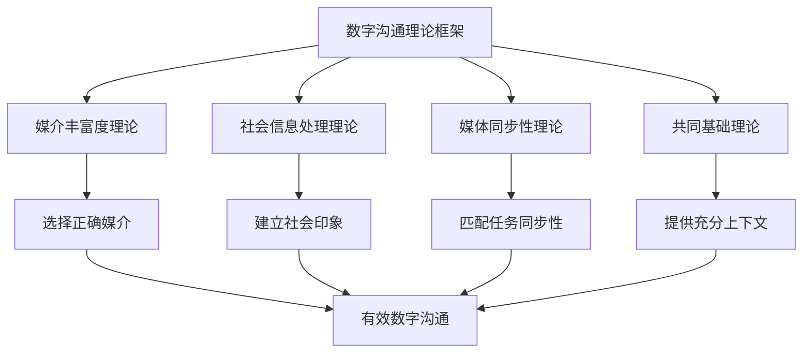

# 本章小结

## 第十三章 数字时代沟通——核心要点回顾与行动指南

本章从理论认知、核心技能、实战应用、误区纠正、持续精进五个维度，系统构建了数字时代沟通的完整知识体系。以下是对全章内容的结构化回顾与提炼，既是复习导航，也是行动纲领。

---

## 一、理论根基：理解数字沟通的底层逻辑

### 1.1 数字沟通的六大核心特征

数字沟通不是"把线下沟通搬到线上"，而是一种全新的沟通范式。理解其六大核心特征，是掌握所有数字沟通技能的前提：

| 特征 | 核心含义 | 优势面 | 挑战面 | 应对策略 |
|------|---------|--------|--------|---------|
| 即时性与异步性并存 | 沟通可同步也可异步，且可在两者间灵活切换 | 提高响应速度，支持跨时区协作 | "伪同步"陷阱——既无同步效率也无异步深度 | 建立模式选择矩阵：紧急用电话，复杂用会议+纪要，通知用邮件 |
| 多媒体融合 | 单条消息可同时包含文字、图片、语音、视频、文件 | 丰富表达维度，降低理解门槛 | 信息过载，注意力分散 | 根据"媒体丰富度理论"匹配任务复杂度与媒介类型 |
| 可记录与可追溯 | 数字沟通天然具有留痕特性 | 便于追溯、复盘、知识沉淀 | 每句话都可能被截图、转发、反复审视 | 发送前三思：这句话被公开转发是否经得起推敲？ |
| 去空间化 | 沟通不再受物理空间限制 | 随时随地连接任何人 | 工作与生活界限模糊，"永远在线"焦虑 | 设定明确的"在线时段"和"离线保护时间" |
| 信息过载 | 信息量呈爆炸式增长 | 信息获取成本极低 | 注意力成为稀缺资源，重要信息被淹没 | 建立信息过滤系统：分级、分类、定期清理 |
| 非语言线索缺失 | 纯文字沟通丢失了语调、表情、肢体语言 | 降低了社交压力 | 误解概率上升，情感表达受限 | 善用语气词、结构化排版、必要时切换语音/视频 |

这六大特征的叠加效应，使得数字沟通比面对面沟通需要更多的**自觉性**和**策略性**。非语言线索的缺失意味着误解更容易发生，而可记录性则放大了每一次沟通失误的影响范围。

### 1.2 四大理论模型的实践价值

本章引入的理论模型不是学术装饰，而是指导实际决策的思维工具：

**媒介丰富度理论（MRT）**的核心预测：任务的信息歧义性越高，需要的媒介丰富度越高。实操含义——绩效面谈用视频而非文字，日程通知用邮件而非会议，冲突调解必须面对面或至少视频。

**社会信息处理理论（SIP）**的关键发现：即使在纯文字环境中，人们也会通过语言风格、标点使用、回复节奏等线索建立社会印象，但这个过程比面对面沟通慢得多。实操含义——数字沟通中需要更长的关系建立周期，不要急于下结论。

**媒体同步性理论（MST）**的核心洞察：不同任务需要不同级别的"符号多变性"和"并行处理能力"。实操含义——谈判、冲突解决等需要即时反馈的任务，应选择同步媒介；数据传递、信息通知等任务，异步媒介更高效。

**共同基础理论**的关键提醒：沟通双方需要不断建立"共同基础"（common ground），而异步沟通中建立共同基础的成本远高于同步沟通。实操含义——异步消息需要提供更充分的上下文，不能假设对方拥有与你相同的信息背景。

---

## 二、核心技能体系：五大能力模块

### 2.1 邮件写作——职场沟通的基础设施

邮件仍占知识工作者28%的工作时间（McKinsey数据），是职场最重要的正式沟通工具。本章系统拆解了邮件写作的四大核心要素：

**主题行**是邮件的"门面"——47%的收件人仅根据主题行决定是否打开邮件。黄金公式：`[标签] + 核心内容 + 行动要求/时间要求`。建立团队统一的标签体系（[Action]、[审批]、[FYI]、[紧急]等）可以大幅降低沟通成本。

**正文结构**遵循"倒金字塔"原则——最重要的信息放在第一段，背景和细节放在后面。标准结构：第一段（核心信息/请求）→ 第二段（背景/数据支撑）→ 第三段（行动项/截止时间）。高管平均每天收到100+封邮件，第一段决定邮件命运。

**语气管理**需要根据关系层级动态调整——给上级的邮件简洁正式、结论在前；给平级的邮件专业友好、强调协作；给下级的邮件清晰明确、提供支持。特别注意避免"书面化过度"（像公文一样冰冷）和"口语化过度"（像微信聊天一样随意）两个极端。

**附件与后续跟进**——附件在正文中必须提及并说明内容，跟进频率建议：首次跟进间隔48小时，第二次间隔一周，跟进时补充新信息而非简单追问"看到了吗"。

### 2.2 社交媒体运营——思想领导力的数字阵地

社交媒体运营不是"发朋友圈"，而是一套系统化的内容策略工程。本章围绕**内容策略、互动管理、危机处理**三个维度展开。

**内容策略的核心**是找到"专业领域×受众需求×平台特性"的交集。LinkedIn适合深度专业内容，微信公众号适合长文输出，Twitter/X适合观点碎片化传播。内容金字塔：60%专业干货（建立权威）+ 25%行业洞察（展示视野）+ 15%个人故事（建立连接）。

**互动是关键**——发布只是起点，真正的价值在评论区。回复每一条有意义的评论，主动参与行业话题讨论，在他人内容下提供有价值的见解。LinkedIn数据显示，拥有完整且活跃档案的专业人士获得商业机会的概率是普通用户的2.7倍。

**危机处理**——数字时代的危机传播速度远超传统时代。核心原则：快速响应（黄金4小时）、真诚态度、事实为据、解决方案导向。绝对不要删帖了事或假装没看见。

### 2.3 在线会议技巧——远程协作的核心场景

Harvard Business Review调查表明，71%的高管认为会议是低效和浪费时间的。本章的核心理念是：**会前充分准备是成功的80%**。

**会前准备**——明确会议目的（信息同步/讨论决策/头脑风暴）、发送议程和预读材料、测试技术设备、预留缓冲时间。

**会中主持**——开场明确议程和规则、指定计时员和记录员、控制发言节奏、每隔15-20分钟做一次小结、用投票或分组讨论提高参与度。

**会后跟进**——24小时内发送会议纪要，明确每项决议的负责人和截止时间，建立"会议→行动→复盘"的闭环。

### 2.4 远程协作——异步沟通的核心能力

GitLab的全远程团队实践证明，系统化的异步沟通规范可以将项目交付速度提升25%，同时降低员工倦怠率。远程协作的核心能力是**异步沟通**。

**异步沟通的三大支柱**——文档化（所有决策、讨论、进度都记录在可检索的地方）、规范性（建立统一的沟通格式、响应时间预期、信息分类标准）、信任建设（通过透明度和可靠性逐步建立信任，信任是远程团队的基石）。

**工具矩阵**——即时通讯用于快速确认，项目管理工具用于任务追踪，协作文档用于知识沉淀，视频会议用于深度讨论。关键不是用什么工具，而是建立"什么信息走什么渠道"的明确规范。

### 2.5 个人品牌建设——数字时代的长期投资

个人品牌 = 一致性 × 专业度 × 曝光度。三者是乘法关系，任何一项为零，品牌价值为零。

**一致性**——在所有平台保持统一的专业形象、价值主张和内容风格。头像、简介、内容主题需要跨平台协调。

**专业度**——持续输出高质量的专业内容是建立品牌最有效的方式。写文章、做分享、回答问题，让"专业"成为你的标签。

**曝光度**——主动参与行业活动、贡献开源项目、在专业社群中活跃。品牌不是"被发现"的，而是"被看到"的。

---

## 三、实战应用：八大场景的核心启示

通过八个典型场景的深度案例分析，本章验证了理论与技巧的实际应用价值。以下是每个场景提炼的核心启示：

| 场景 | 核心启示 | 关键技巧 | 理论支撑 |
|------|---------|---------|---------|
| 工作邮件（跨部门协调） | 信息结构化程度直接决定执行效率 | SMART原则拆解任务，倒金字塔结构组织内容 | 共同知识效应——不要假设读者拥有你的背景信息 |
| 微信沟通（客户关系维护） | 把握"度"——既不过于随意也不过于刻板 | 语音消息≤30秒，文字消息结构化，适当使用表情增加温度 | 媒介丰富度理论——微信的丰富度介于邮件和电话之间 |
| 视频会议（远程团队管理） | 技术保障是底线，参与感营造是核心 | 每15分钟一次互动，指定角色分工，会后24小时发纪要 | 社会临场感理论——视频需要主动弥补物理距离带来的心理距离 |
| 社交媒体（行业影响力） | 快速、真诚、一致 | 响应速度<4小时，内容=干货+洞察+故事，跨平台一致 | 拟社会关系理论——线上影响力源于持续一致的专业输出 |
| 在线客服（投诉处理） | 共情优先、解决方案导向 | 先确认感受，再提供方案，最后确认满意 | 归因理论——投诉者需要的首先是被理解，其次才是解决方案 |
| 远程面试（求职） | 充分准备、主动展示 | 技术彩排、环境布置、STAR法则回答、主动提问 | 首因效应——前3分钟的印象决定面试走向 |
| 网络社群（行业圈子） | 持续贡献和关系建设 | 先输出价值再获取资源，深度互动优于广度连接 | 社会交换理论——关系的本质是价值互换 |
| 数字营销（产品推广） | 以用户为中心的内容策略 | 用户画像→内容定位→渠道选择→效果追踪 | AIDA模型——注意→兴趣→欲望→行动 |

每个案例都遵循统一的分析框架：场景呈现 → 问题诊断 → 理论溯源 → 优化方案 → 执行模板 → 效果量化 → 可迁移模式。掌握这个框架本身，比记住任何单个案例更有价值——它让你在遇到新场景时能够举一反三。

---

## 四、十大误区：认知纠偏与行为校准

本章揭示的十个常见误区，本质上都指向同一个问题：**对数字沟通的特殊性认识不足**。以下是对十大误区的精炼总结与纠正要点：

| 误区 | 核心错误认知 | 正确认知 | 纠正行动 |
|------|------------|---------|---------|
| 即时回复等于高效 | 秒回=敬业=高效 | 频繁切换导致认知过载，恢复专注需23分钟 | 设定消息处理时段，分级响应（电话>邮件>IM） |
| 表情包替代文字 | 表情包能完整表达想法 | 表情包含义因人而异，正式沟通中制造歧义 | 正式场合用文字，表情是"调味料"不是"主食" |
| 群发等于广泛传播 | 看到的人越多效果越好 | 被动接收=打扰，1000人无互动<10人深度互动 | 内容为王，精准投放，互动优先 |
| 文字越多越详细 | 长=完整=专业 | 长=信息过载=关键信息被淹没 | 结论先行，能用3句话说清的不用10句 |
| 永远在线才是敬业 | 随时响应=职业素养 | 永远在线=注意力碎片化=深度工作消亡 | 设定离线保护时间，公开沟通响应预期 |
| 忽视数字礼仪 | 线上不必讲究 | 数字礼仪体现专业素养和尊重 | 称呼得体、时间尊重、信息完整、及时确认 |
| 过度依赖文字 | 文字能解决一切 | 复杂/情感/冲突场景文字容易误判 | 3条消息说不清就切换语音/视频 |
| 忽视平台差异 | 一套内容发所有平台 | 每个平台有不同的用户习惯和内容偏好 | 了解平台特性，适配内容形式和语气 |
| 只重发布不重互动 | 发完就完了 | 互动才是社交媒体的核心价值 | 回复评论，参与讨论，主动连接 |
| 用即时消息处理复杂问题 | 方便=高效 | 复杂问题需要充分的上下文和思考空间 | 复杂议题用邮件或会议，IM只用于确认和通知 |

这些误区的共同根源是将数字沟通等同于"更方便的面对面沟通"。实际上，数字沟通需要比面对面沟通**更多的自觉性和策略性**——因为非语言线索的缺失使得误解更容易发生，而可记录性则放大了每一次失误的影响。

---

## 五、持续精进：分层练习体系

### 5.1 每日练习（总计20分钟）

| 练习项目 | 时间 | 核心动作 | 检验标准 |
|---------|------|---------|---------|
| 邮件精炼 | 5分钟 | 选一封待发邮件，优化主题行→精简正文→检查行动项 | 主题行信息完整，结论在前，行动项明确 |
| 消息自查 | 3分钟 | 发送前4问：目的明确？时机合适？语气得当？信息完整？ | 无歧义表达，无需追问即可理解 |
| 内容阅读 | 10分钟 | 分析优秀邮件/社交媒体内容/在线会议技巧 | 每天记录一个可借鉴的技巧 |
| 数字形象自检 | 2分钟 | 检查社交媒体状态，确保专业形象一致 | 跨平台形象协调 |

### 5.2 每周练习

| 练习项目 | 核心动作 | 检验标准 |
|---------|---------|---------|
| 社交媒体内容创作 | 撰写并发布一篇专业内容 | 收到至少3条有意义的互动 |
| 在线会议复盘 | 回顾本周参加的会议，分析主持技巧 | 识别一个可改进的点 |
| 写作输出 | 写一篇500-1000字的专业文章 | 结构清晰，论据充分 |
| 远程协作优化 | 优化一个协作流程或文档 | 减少不必要的沟通轮次 |

### 5.3 每月检验

- **内容表现分析**：统计社交媒体内容的阅读量、互动量、增长趋势
- **同行对比**：观察同行业优秀沟通者的做法，找差距
- **技能自评**：对照本章五大核心技能，逐项评估当前水平（1-5分）
- **误区自检**：回顾十大误区，检查自己是否落入其中任何一个

---

## 六、前沿视野：数字沟通的未来方向

本章深度拓展部分探讨的前沿议题，是数字沟通能力的"第二增长曲线"：

**AI与人机协作沟通**——AI正在重塑数字沟通的每一个环节：智能邮件助手可以自动草拟回复，AI会议助手可以实时转录和生成纪要，聊天机器人处理80%的标准化客服咨询。核心能力不再是"会写邮件"，而是"会与AI协作写邮件"——提示词工程（Prompt Engineering）正在成为新的数字沟通基础技能。

**元宇宙与沉浸式沟通**——VR/AR技术正在将数字沟通从二维屏幕推向三维空间。虚拟会议室、数字化身、空间音频等技术正在消解"视频会议缺乏临场感"的痛点。虽然目前仍处于早期阶段，但理解沉浸式沟通的原理和最佳实践，是为未来做准备。

**数字鸿沟与包容性沟通**——数字沟通能力的不均等分布正在制造新的社会分层。年龄、教育水平、地域、经济条件等因素导致不同群体在数字沟通能力上存在显著差距。作为数字沟通的熟练使用者，有责任在协作中照顾到数字能力较弱的参与者——使用更简洁的工具、提供更清晰的指引、保持耐心。

**数字福祉**——"永远在线"的文化正在侵蚀心理健康。本章探讨了数字排毒（Digital Detox）、通知管理、屏幕时间控制等实践方法。数字沟通能力的最高境界不是"随时随地高效沟通"，而是"知道何时不沟通"。

**信息过载治理**——本章介绍了信息过滤矩阵、注意力管理、知识管理系统等方法论，帮助读者在信息洪流中保持清醒和高效。

---

## 七、核心理念：贯穿全章的底层信念

数字时代沟通的最高境界，是让技术服务于人与人之间的真实连接。无论工具如何变化，沟通的本质始终是：

> **在正确的时间，通过正确的渠道，用正确的方式，向正确的人，传递正确的信息。**

展开来说，这个公式中的每一个要素都需要数字时代的重新校准：

- **正确的时间**——不是"越快越好"，而是根据紧急程度、信息复杂度、对方状态选择最佳时机
- **正确的渠道**——不是"什么方便用什么"，而是根据信息歧义性、情感含量、正式程度匹配媒介丰富度
- **正确的方式**——不是"想到什么说什么"，而是结构化表达、结论先行、行动项明确
- **正确的人**——不是"抄送所有人"，而是精准识别利益相关者，区分TO和CC的语义
- **正确的信息**——不是"越详细越好"，而是信息密度适中，关键信息突出，上下文充分

数字工具放大了我们的沟通能力，也放大了我们的沟通失误。掌握数字时代沟通的艺术，不是要成为技术专家，而是要在技术的洪流中保持**清晰的表达、真诚的态度和专业的素养**。

这是一项终身技能，值得我们持续投入和精进。从今天开始，选择本章中的一个练习，坚持21天，你会看到数字沟通质量的显著提升。
