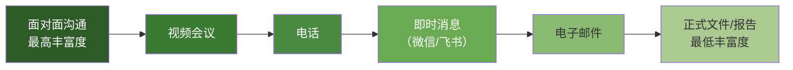
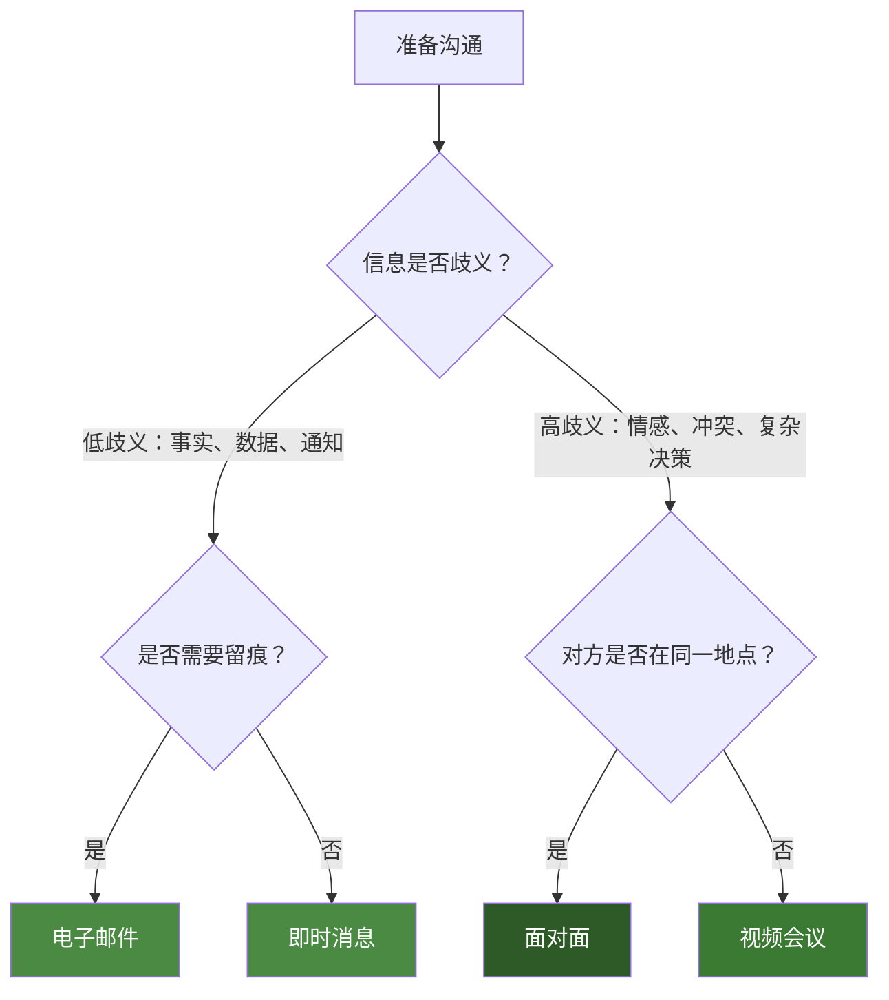
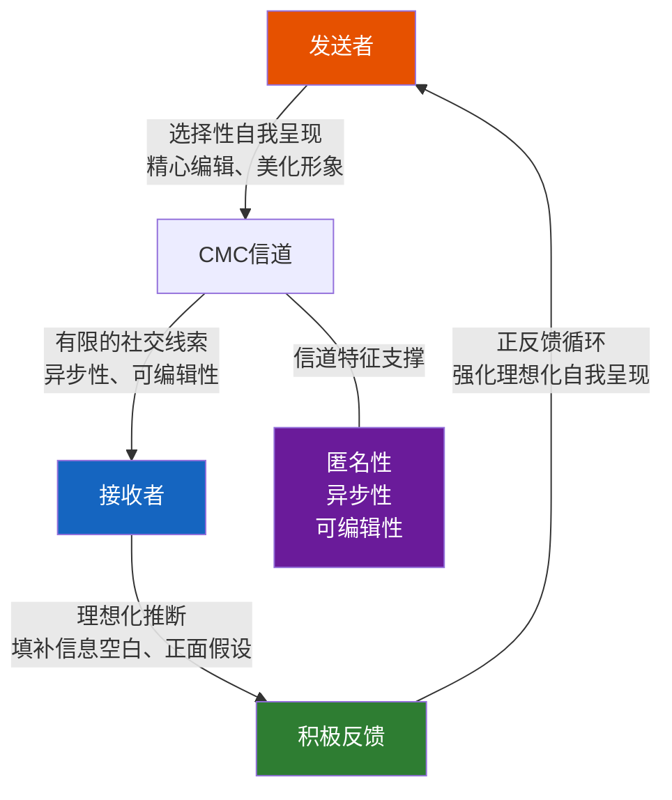
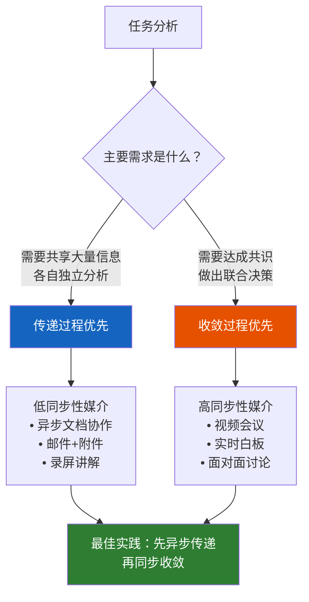
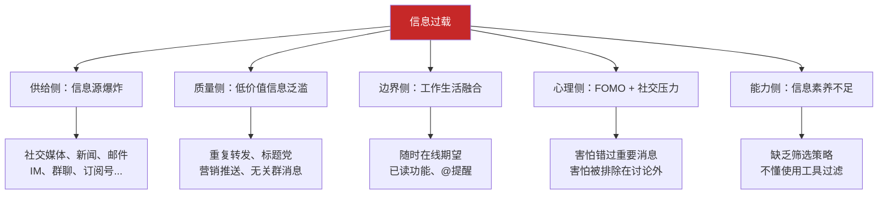
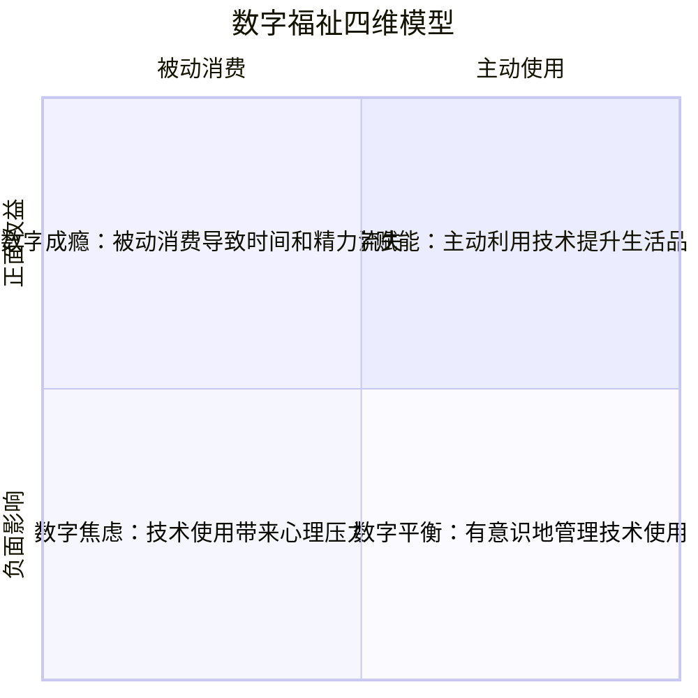
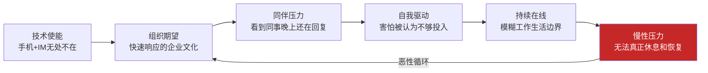
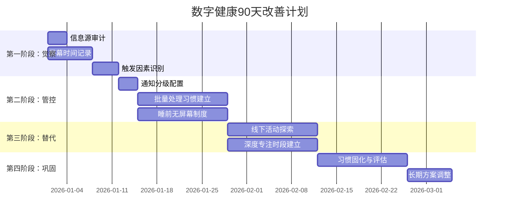
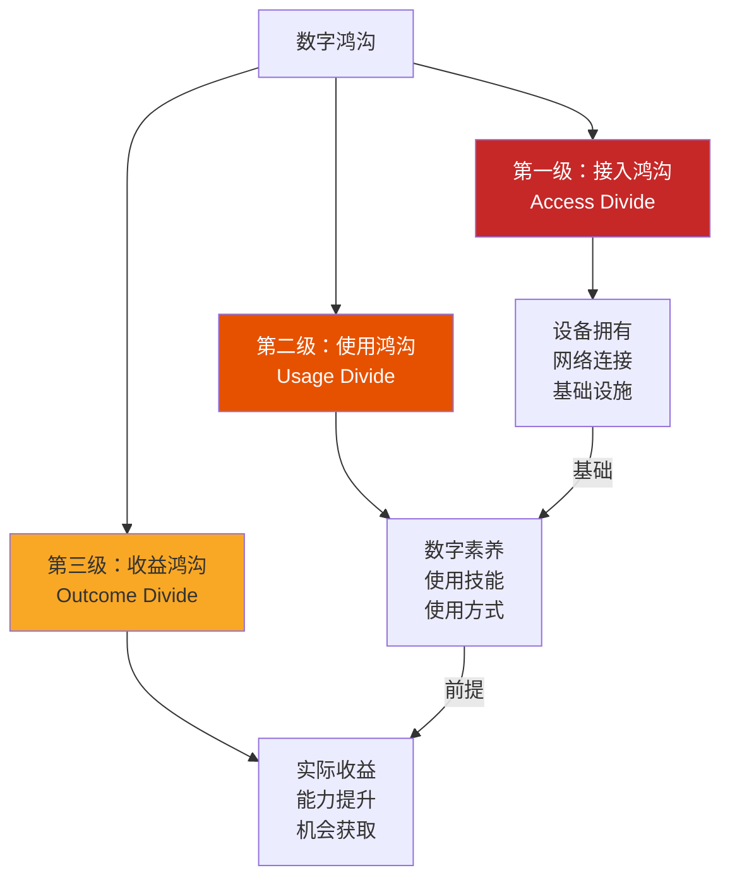
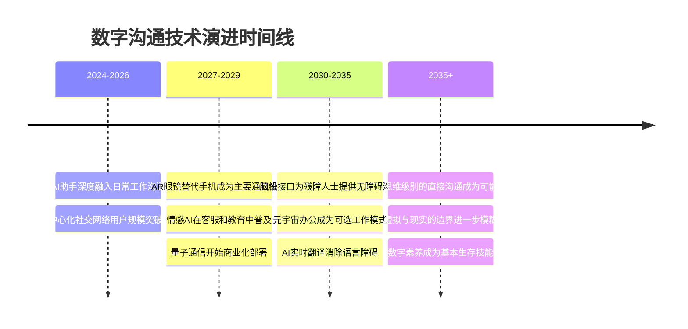

# 数字时代沟通 — 深度拓展

> 本章将系统探讨数字时代沟通的前沿理论与实践。从计算机中介沟通（CMC）的经典理论出发，深入分析信息过载治理、数字福祉维护、元宇宙沉浸式沟通、AI人机对话、数字鸿沟弥合等核心议题，并展望脑机接口、量子通信、情感计算等前沿方向。每个主题均包含理论基础→方法论→实操工具→真实案例→常见误区→进阶思考的完整链条。

***

## 一、计算机中介沟通理论（CMC）

### 1.1 什么是CMC：定义与边界

计算机中介沟通（Computer-Mediated Communication, CMC）是指通过计算机和网络技术作为中介进行的人类沟通活动。这个定义包含三个关键要素：

- **中介性**：沟通不是直接的面对面交流，而是通过技术信道传递
- **人-人本质**：虽然技术参与其中，但沟通的两端仍然是人
- **双向互动**：区别于传统大众传播（电视、广播），CMC具有交互性

CMC研究起源于20世纪70年代的电子邮件系统实验。1971年，Ray Tomlinson发出第一封电子邮件时，没有人预见到这会催生一个庞大的学术研究领域。从BBS论坛、IRC聊天室到微信、Zoom，CMC的形态不断演变，但核心问题始终不变——**数字媒介如何改变人类沟通的本质？**

### 1.2 媒介丰富度理论（Media Richness Theory）

#### 理论起源与核心主张

Richard Daft和Robert Lengel于1986年在《组织科学》上发表的论文中提出媒介丰富度理论（MRT），最初用于解释组织内部的沟通媒介选择。

MRT认为，不同沟通媒介在传递信息的能力上存在客观差异，这种差异可以用"丰富度"（Richness）来衡量。媒介丰富度取决于四个维度：

| 维度 | 含义 | 高丰富度示例 | 低丰富度示例 |
|------|------|------------|------------|
| 反馈即时性 | 发送者能否快速获得回应 | 面对面交谈（秒级） | 电子邮件（小时级） |
| 多渠道性 | 是否支持多种信息通道 | 视频通话（视觉+听觉+语言） | 纯文字消息（语言） |
| 语言多样性 | 能否使用多种符号系统 | 白板演示（文字+图形+数字） | 短信（仅文字） |
| 个人关注度 | 能否传递情感和态度 | 面对面微笑、握手 | 自动回复邮件 |

#### 媒介丰富度排列

#### 核心预测与匹配原则

MRT的核心预测可以用一句话概括：**任务的信息歧义性越高，需要的媒介丰富度越高。**

| 任务类型 | 信息歧义性 | 推荐媒介 | 典型场景 |
|----------|-----------|---------|---------|
| 通知日程变更 | 低 | 电子邮件/消息 | "明天会议改到下午3点" |
| 绩效反馈 | 中 | 电话/视频 | 一对一绩效面谈 |
| 解决冲突 | 高 | 面对面 | 团队成员间的分歧调解 |
| 传达坏消息 | 高 | 面对面 | 裁员通知、项目失败复盘 |
| 分享数据报告 | 低 | 电子邮件+附件 | 月度销售数据汇总 |
| 头脑风暴 | 中-高 | 视频会议/线下 | 产品创意讨论 |

#### MRT的实操应用

当你需要选择沟通媒介时，可以用以下决策流程：

**常见误区**：很多人认为"越高丰富度越好"，于是所有事情都开视频会议。这是错误的。MRT的精髓是**匹配**——用低丰富度媒介处理低歧义任务反而更高效，因为它减少了不必要的社交开销。

### 1.3 社会信息处理理论（SIP理论）

#### 对"媒介缺陷论"的挑战

早期CMC理论（如"线索过滤模型"，Cues-Filtered-Out Theory）认为，文字媒介缺乏非语言线索（面部表情、肢体语言、语调），因此无法支持深层次的社会关系建立。这个观点在1990年代之前被广泛接受。

1992年，Joseph Walther提出了社会信息处理理论（SIP理论），从根本上挑战了这一假设。SIP理论的核心论点是：**人具有适应性，能够在任何媒介条件下发展出有效的社会沟通策略。**

#### SIP理论的四个核心命题

1. **适应性命题**：沟通者不是被动的媒介使用者，而是主动的策略调整者。当非语言线索不可用时，人们会发展出替代性的语言策略。

2. **时间命题**：CMC中的关系建立需要更多时间（因为信息带宽较低），但经过足够时间的沟通，CMC关系可以达到与面对面关系同等的亲密程度。

3. **语言线索替代命题**：在CMC中，以下元素承担了非语言线索的功能：
   - 表情符号和颜文字（emoji/kaomoji）
   - 标点符号的强调使用（如"！！！"）
   - 大写和特殊格式（如**加粗**）
   - 反应时间和回复速度
   - 用词风格和语气词

4. **可识别个体效应命题**：当CMC参与者能够识别对方为独特的个体时（有头像、个人资料、历史互动），社会关系的发展更加顺畅。

#### 实证支持

Walther本人及其他研究者进行了大量实验验证SIP理论。一项经典实验将参与者分为面对面组和纯文字CMC组，经过多轮互动后测量关系亲密程度。结果发现：在短期互动中，面对面组亲密程度显著高于CMC组；但在持续数周的长期互动中，两组的亲密程度差异消失。

这个发现对远程团队管理有重要启示——**新组建的远程团队在初期可能会感觉关系疏远，但只要持续沟通，关系质量会逐步提升。**

### 1.4 超人际沟通模型（Hyperpersonal Model）

#### 四要素交互模型

Walther在1996年提出超人际沟通模型，解释了一个反直觉的现象：**为什么人们在线上关系中有时会体验到比线下更强烈的亲密感和理想化印象？**

**发送者选择性自我呈现**：CMC允许发送者在发送前编辑信息。你可以在微信上花5分钟修改一条消息，使其显得更聪明、更幽默、更善解人意——这在面对面交谈中做不到。发送者倾向于展示理想化的自我形象，隐藏不想暴露的部分。

**接收者理想化印象**：由于信息线索有限，接收者会用正面假设填补空白。比如收到一条措辞考究的消息，接收者可能推断对方是一个高素质的人——即使发送者只是花了很多时间润色。

**反馈强化循环**：发送者感知到接收者的积极反应后，会更加努力地维持理想化形象；接收者则因为持续收到"高质量"信息而进一步强化正面印象。这形成了一个正反馈循环。

**信道特征**：CMC的异步性（可以延迟回复以构思最佳表达）、可编辑性（可以反复修改后再发送）和匿名性为上述过程提供了技术支持。

#### 超人际效应的实际影响

| 场景 | 超人际效应表现 | 潜在风险 |
|------|-------------|---------|
| 网恋 | 双方通过文字建立强烈的理想化印象 | 线下见面后"见光死" |
| 远程同事 | 通过邮件/消息对同事形成"完美同事"印象 | 实际合作后发现性格不合 |
| 网红/博主 | 粉丝对博主形成理想化人格认知 | 发现真实形象后的"塌房" |
| 线上社区 | 社区成员间建立高度亲密的虚拟关系 | 忽视现实中的社交需求 |

**实操建议**：了解超人际效应可以帮助你更理性地看待线上关系。关键原则是：
1. **意识到理想化的存在**——你看到的对方可能只是其精心展示的一面
2. **适时转移到线下**——重要的关系应该尽早增加面对面互动
3. **保持信息平衡**——在展示自己时保持真实，不要过度美化

### 1.5 媒介同步性理论（Media Synchronicity Theory）

#### 对MRT的修正与发展

Alan Dennis和Joseph Valacich于2008年提出媒介同步性理论（MST），认为MRT过于简单化。MST的核心贡献是将"沟通"分解为两个独立的过程，并指出不同过程需要不同类型的媒介支持。

| 概念 | 定义 | 媒介需求 |
|------|------|---------|
| 传递过程（Conveyance） | 发送者将信息传递给接收者的过程 | 低同步性媒介（允许异步、充分思考） |
| 收敛过程（Convergence） | 沟通参与者达成共同理解的过程 | 高同步性媒介（实时互动、快速反馈） |

#### MST的五个媒介能力

MST定义了影响同步性的五个媒介能力：

1. **传输即时性**（Immediacy of Transmission）：信息从发送到接收的速度
2. **并行处理**（Parallelism）：是否支持多人同时发送信息
3. **符号多样性**（Symbol Variety）：支持的符号类型数量
4. **可复审性**（Rehearsability）：发送前能否充分编辑和修改
5. **可复现性**（Reprocessability）：发送后能否反复查看和分析

#### 实操应用：如何根据任务选择媒介

**最佳实践模式——先传递，再收敛**：

1. 会前：通过文档/邮件传递背景信息和议题（传递过程，低同步性）
2. 会中：围绕关键问题进行讨论和决策（收敛过程，高同步性）
3. 会后：通过文档总结决议和行动计划（传递过程，低同步性）

这种"异步准备 + 同步决策 + 异步归档"的模式比"所有内容都在会议中讨论"高效得多。

### 1.6 四大CMC理论对比总结

| 理论 | 提出者 | 核心观点 | 适用场景 | 局限性 |
|------|--------|---------|---------|--------|
| 媒介丰富度理论 | Daft & Lengel (1986) | 媒介有客观的丰富度等级，应与任务歧义性匹配 | 组织内部媒介选择 | 忽视了个体差异和使用技巧 |
| SIP理论 | Walther (1992) | 人具有适应性，可以在任何媒介上发展社会关系 | 长期CMC关系发展 | 对短期互动的解释力有限 |
| 超人际模型 | Walther (1996) | CMC可以产生比面对面更理想化的印象 | 解释网恋、在线社区 | 对负面效应的讨论不足 |
| 媒介同步性理论 | Dennis & Valacich (2008) | 沟通有传递和收敛两个过程，需要不同媒介支持 | 复杂协作任务的媒介组合 | 实操指导不够具体 |

***

## 二、信息过载的应对策略

### 2.1 信息过载的本质与量化

#### 什么是信息过载

信息过载（Information Overload）不是简单的"信息太多"，而是一个认知状态：**个体接收的信息量超过了其有效处理能力，导致决策质量下降、焦虑增加和效率降低。**

这个定义中的关键词是"有效处理"——你可能可以"看到"1000条消息，但你能"有效处理"的可能只有50条。差额就是过载量。

#### 信息过载的量化指标

如何判断自己是否处于信息过载状态？以下是一些可衡量的指标：

| 指标 | 正常范围 | 过载信号 |
|------|---------|---------|
| 每日处理邮件/消息数 | 30-50条 | 超过100条 |
| 单条信息平均处理时间 | 2-5分钟 | 低于30秒（草率处理）或超过15分钟（过度纠结） |
| 未读信息积压天数 | 当天处理 | 超过3天未处理 |
| 每日通知打断次数 | 10-20次 | 超过50次 |
| 信息处理时间占工作日比例 | 20-30% | 超过50% |
| 决策延迟（因信息不足反复搜寻） | <1天 | >3天 |

#### 信息过载的五层成因

### 2.2 信息过载的认知科学分析

#### 为什么大脑无法应对海量信息

从认知科学角度，信息过载的根本原因在于人类工作记忆的有限性。

**Miller定律**（1956）：人类工作记忆一次只能处理7±2个信息块。当同时到达的信息超过这个容量时，要么丢弃信息（遗漏重要内容），要么降低处理深度（草率浏览）。

**注意力切换成本**（Attention Residue）：加州大学尔湾分校的Gloria Mark教授研究发现，当人们从一个任务切换到另一个任务时，注意力不会立即完全转移——前一个任务的"注意力残留"会持续影响后续任务的表现。平均每切换一次需要23分钟才能完全恢复深度注意力。

**决策疲劳**（Decision Fatigue）：心理学家Roy Baumeister的研究表明，决策是一种消耗性资源。每做一次选择（即使是"是否打开这条消息"这样的微决策），都会消耗认知能量。一天中做过多的微决策会导致后续决策质量下降。

#### 信息过载的四重认知影响

| 影响层面 | 具体表现 | 神经科学机制 | 恢复时间 |
|----------|---------|------------|---------|
| 注意力分散 | 频繁切换任务，无法进入心流状态 | 前额叶皮层持续激活，耗氧量增加 | 15-23分钟/次 |
| 决策疲劳 | 选择困难、冲动决策或拖延决策 | 葡萄糖消耗，前额叶功能下降 | 需要休息和补充能量 |
| 认知过载 | 理解困难、遗忘率增加 | 工作记忆溢出，信息编码失败 | 数小时到数天 |
| 慢性焦虑 | 持续的紧迫感、担忧遗漏重要信息 | 杏仁核过度激活，皮质醇水平升高 | 需要系统性干预 |

### 2.3 个人层面的信息过载治理方案

#### 方案一：信息输入管控（INPUT Control）

**核心原则**：不是处理更多信息，而是减少不必要的信息输入。

**实操步骤**：

1. **信息源审计**（每月一次）
   - 列出所有信息来源：微信群、订阅号、RSS、邮件列表、App通知
   - 对每个来源评估：过去30天提供了多少有价值的信息？
   - 删除/退订价值低于成本的来源（标准：每10条消息中有价值的不足1条就该退订）

2. **通知分级管理**

   | 级别 | 定义 | 通知设置 | 示例 |
   |------|------|---------|------|
   | P0-紧急 | 需要立即响应 | 声音+振动+弹窗 | 直属领导私信、报警系统 |
   | P1-重要 | 当天处理即可 | 仅显示角标 | 项目协作群、重要邮件 |
   | P2-一般 | 有空再看 | 静默接收 | 行业资讯、订阅号 |
   | P3-可忽略 | 几乎不需要看 | 关闭通知 | 促销推送、低质群聊 |

3. **工具配置清单**

   | 平台 | 关键设置 | 操作路径 |
   |------|---------|---------|
   | 微信 | 折叠不重要的群聊 | 群设置 → 消息免打扰 → 折叠该群聊 |
   | 飞书/钉钉 | 设置专注时段 | 设置 → 免打扰 → 自定义时段 |
   | 邮件 | 建立过滤规则 | 设置 → 过滤器 → 按发件人/主题自动归档 |
   | 手机 | 全局通知管理 | 设置 → 通知 → 按App逐一配置 |
   | 浏览器 | 关闭推送通知 | 设置 → 隐私 → 网站通知 → 阻止 |

#### 方案二：信息处理批量化（BATCH Processing）

**核心原则**：不要随时响应每条信息，将信息处理集中在固定时段。

**推荐时间表**：

| 时段 | 处理内容 | 时长 | 备注 |
|------|---------|------|------|
| 9:00-9:30 | 邮件 + 紧急消息 | 30分钟 | 处理过夜积累的信息 |
| 12:00-12:15 | 即时消息 | 15分钟 | 午间快速检查 |
| 14:00-14:15 | 即时消息 | 15分钟 | 下午首次检查 |
| 17:00-17:30 | 邮件 + 日常总结 | 30分钟 | 收尾工作 |
| 21:00-21:15 | 非工作消息 | 15分钟 | 社交消息（可选） |

**关键技巧**：
- 关闭所有非P0级通知，仅在上述时段主动查看
- 使用"两分钟法则"：能在两分钟内处理的立即处理，否则标记后集中处理
- 对于需要深入回复的消息，记录到待办清单中安排专门时间

#### 方案三：注意力保护（FOCUS Protection）

**深度工作时段设计**：

1. 选择一天中精力最充沛的2-3小时作为深度工作时段
2. 期间关闭所有通讯工具（包括手机静音、电脑退出IM客户端）
3. 如果环境允许，物理隔离（关办公室门、戴降噪耳机、去安静区域）
4. 对外设置自动回复："我在专注工作中，将在XX时间回复"

**番茄工作法的数字时代改良版**：

| 阶段 | 时长 | 活动 | 数字行为 |
|------|------|------|---------|
| 专注块 | 45分钟 | 深度工作 | 所有通讯关闭 |
| 短休息 | 5分钟 | 起身活动 | 快速扫描P0级通知 |
| 信息块 | 15分钟 | 处理消息/邮件 | 批量回复 |
| 专注块 | 45分钟 | 深度工作 | 所有通讯关闭 |
| 长休息 | 15分钟 | 放松休息 | 自由浏览 |

#### 方案四：数字断食（Digital Detox）

数字断食不是完全拒绝技术，而是有策略地减少数字设备使用，给大脑恢复的空间。

**渐进式数字断食计划**：

| 阶段 | 时间 | 内容 | 难度 |
|------|------|------|------|
| 入门 | 第1周 | 每天设定1小时"无屏幕时间"（如晚餐时段） | ★ |
| 初级 | 第2周 | 周末半天不查看工作消息 | ★★ |
| 中级 | 第3-4周 | 每周一天"低数字日"（仅接听电话，不刷手机） | ★★★ |
| 进阶 | 第2月 | 每月一个完整周末的数字断食 | ★★★★ |

**断食期间的替代活动**：户外运动、纸质书阅读、面对面社交、手工制作、冥想练习。

### 2.4 组织层面的信息过载治理

#### 沟通规范建设

一个有效的组织沟通规范应该包含以下要素：

| 维度 | 规范内容 | 示例 |
|------|---------|------|
| 渠道定义 | 每个渠道的用途和使用场景 | "飞书用于日常工作沟通，邮件用于跨部门正式通知" |
| 响应期望 | 不同消息的响应时间要求 | "紧急消息：30分钟内；普通消息：4小时内" |
| 会议规范 | 会议的必要性判断和效率标准 | "无议程不开会；30分钟以内；必须有结论" |
| 消息格式 | 消息的结构化要求 | "请求类消息必须包含：背景+需求+截止时间" |
| @规则 | @人的权限和使用场景 | "仅直属上级和协作方可以@个人" |

#### 会议瘦身策略

**会议必要性检查清单**（开会前必问）：

- [ ] 这个议题能否通过异步文档/消息解决？
- [ ] 是否所有参与者都必须到场？能否部分人异步参与？
- [ ] 会议时长是否合理？能否缩短到原定时长的75%？
- [ ] 是否有明确的议程和预期产出？
- [ ] 会议结论和行动项是否有书面记录？

**替代会议的异步方案**：

| 场景 | 传统做法 | 异步替代方案 |
|------|---------|------------|
| 信息同步 | 30分钟全员会议 | 5分钟录屏/文档 + 评论区提问 |
| 方案评审 | 1小时评审会 | 文档异步评审 + 15分钟决策会 |
| 进度汇报 | 每日站会 | 飞书/Slack日报模板 |
| 头脑风暴 | 2小时研讨会 | 3天异步创意墙 + 1小时汇总会 |

### 2.5 信息过载常见误区

| 误区 | 为什么是错的 | 正确做法 |
|------|------------|---------|
| "我必须回复每条消息" | 回复不是义务，紧急消息自会通过其他方式通知你 | 设定响应期望，非紧急消息批量处理 |
| "多任务处理效率更高" | 频繁切换导致注意力残留，总效率反而降低 | 单任务专注 + 批量处理 |
| "信息越多决策越好" | 过量信息导致决策疲劳和分析瘫痪 | 设定信息收集上限，到点就决策 |
| "数字断食会影响工作" | 短暂的断食反而提升后续的专注力和效率 | 从小断食开始，逐步建立习惯 |
| "工具能解决一切" | 工具只是辅助，没有策略的工具只是另一个信息源 | 先建立策略，再用工具支撑 |

***

## 三、数字福祉与沟通健康

### 3.1 数字福祉的定义与框架

数字福祉（Digital Wellbeing）不是"少用手机"这么简单。世界卫生组织（WHO）将其定义为：**个体在数字环境中保持身体、心理和社会健康的状态。**

Google在2018年将"数字福祉"纳入Android系统设计，推出屏幕时间管理、就寝模式、通知摘要等功能。苹果随后推出"屏幕使用时间"（Screen Time）。这些工具的出现标志着科技行业对数字健康问题的正式回应。

数字福祉的四个维度：

### 3.2 社交媒体对心理健康的影响机制

#### 社会比较理论的应用

Leon Festinger于1954年提出的社会比较理论认为，人类有一种内在驱力，需要通过与他人比较来评估自己的能力和意见。社交媒体将这种比较从有限的现实社交圈扩展到了无限的虚拟世界。

**社交媒体上的社会比较有两种方向**：

| 比较方向 | 定义 | 情感影响 | 社交媒体典型场景 |
|----------|------|---------|----------------|
| 向上比较 | 与"比自己好"的人比较 | 自卑、嫉妒、不满 | 看到同龄人晒豪车/旅行照 |
| 向下比较 | 与"不如自己"的人比较 | 优越感、庆幸 | 看到他人的困境或失败 |

问题在于，社交媒体上的内容高度偏向"高光时刻"——人们分享的多是精心筛选和编辑过的正面内容。这种信息不对称导致用户在进行向上比较时，参照的是一个被夸大的标准。

**实证数据**：
- 英国皇家公共卫生学会（RSPH）2017年调查：Instagram被评为对年轻人心理健康影响最负面的社交平台
- 宾夕法尼亚大学2018年实验：限制社交媒体使用到每天30分钟，3周后参与者的孤独感和抑郁症状显著下降
- Journal of Social and Clinical Psychology, 2018, Vol.37

#### 社交媒体使用的"剂量效应"

适度使用社交媒体和过度使用之间存在显著的效果差异。研究表明：

| 使用时长/天 | 效果 | 心理影响 |
|-------------|------|---------|
| <30分钟 | 积极 | 保持社交联系，获得信息和娱乐 |
| 30-120分钟 | 中性 | 取决于使用方式（主动vs被动） |
| >120分钟 | 消极 | 社会比较增加，焦虑和抑郁风险上升 |
| >300分钟 | 显著消极 | 严重影响学业/工作/睡眠，社交孤立 |

**关键发现**：使用方式比使用时长更重要。"主动使用"（发布内容、与朋友互动、参与讨论）比"被动使用"（无目的地刷信息流、浏览他人生活）对心理健康的影响更积极。

### 3.3 即时通讯与工作压力

#### "永远在线"文化

斯坦福大学的研究者创造了"永远在线文化"（Always-On Culture）这个概念来描述数字时代的工作状态：员工即使在非工作时间也感到需要保持通讯可用。

这种文化的形成机制：

**"已读"功能的双刃剑效应**：

"已读"标记（如微信的"已读"提示、WhatsApp的蓝色双勾）是即时通讯中争议最大的功能之一。

| 视角 | 正面作用 | 负面作用 |
|------|---------|---------|
| 发送者 | 确认消息已被看到 | 如果已读不回会感到焦虑或愤怒 |
| 接收者 | 发送者知道我已看到，减轻重复发送压力 | 失去了"没看到"的缓冲空间，增加了即时回复的压力 |
| 组织 | 提高信息传递的确定性 | 创造监控感，降低员工自主性 |

**法国"离线权"立法**：2017年，法国在劳动法中明确规定员工在工作时间外有"断开数字连接的权利"（Right to Disconnect）。企业不得因员工在非工作时间不回复邮件或消息而进行处罚。此后，意大利、西班牙、葡萄牙等国也通过了类似立法。

### 3.4 促进数字沟通健康的系统方案

#### 个人数字健康诊断

使用以下自评量表评估自己的数字沟通健康状况（每项1-5分，1=完全不符合，5=完全符合）：

| 序号 | 陈述 | 评分 |
|------|------|------|
| 1 | 我每天有固定时段完全不使用数字设备 | ___ |
| 2 | 我能在收到消息后不立即查看（除非紧急） | ___ |
| 3 | 我在使用社交媒体后通常感觉良好而非焦虑 | ___ |
| 4 | 我的工作和生活之间有明确的数字边界 | ___ |
| 5 | 我定期清理不再有价值的信息来源 | ___ |
| 6 | 我有稳定的线下社交活动和兴趣爱好 | ___ |
| 7 | 我的睡眠不受数字设备使用的干扰 | ___ |
| 8 | 我使用数字设备是有目的的，不是无意识习惯 | ___ |

**评分解读**：
- 32-40分：数字健康状况良好，继续保持
- 24-31分：有一些需要关注的方面，建议针对性改善
- 16-23分：数字健康状况堪忧，建议制定系统性改善计划
- 8-15分：严重的数字健康问题，建议寻求专业支持

#### 个人数字健康改善路线图

#### 组织数字健康策略

**制度层面**：
1. 制定"数字沟通宪章"——明确规定各类消息的响应期望、非工作时间的通讯限制
2. 设立"无会议日"——如每周三不安排任何内部会议
3. 推行"安静时段"——每天上午9:00-11:00为专注工作时段，禁止非紧急打扰

**文化层面**：
1. 领导者以身作则——管理者不在深夜和周末发送工作消息
2. 奖励深度工作——将"专注产出"而非"在线时长"作为绩效指标
3. 开放讨论数字健康——将数字福祉纳入团队回顾议题

**技术层面**：
1. 配置消息定时发送——写好的消息设定在工作时间自动发出
2. 设置团队自动回复——非工作时间统一的自动应答
3. 使用异步优先的工具——选择支持异步协作的平台（如Notion、Lark文档）

***

## 四、元宇宙中的沟通

### 4.1 元宇宙的技术基础

元宇宙（Metaverse）不是单一技术，而是多种技术的融合体。理解其技术栈有助于判断哪些沟通场景真正适合元宇宙。

| 技术层 | 代表技术 | 对沟通的贡献 |
|--------|---------|------------|
| 沉浸层 | VR（虚拟现实）、AR（增强现实）、MR（混合现实） | 创造临场感和沉浸式体验 |
| 交互层 | 手势识别、眼动追踪、触觉反馈 | 丰富非语言沟通渠道 |
| 空间层 | 3D建模、空间音频、数字孪生 | 构建可交互的虚拟空间 |
| 经济层 | 区块链、NFT、数字货币 | 支撑虚拟经济活动 |
| 智能层 | AI NPC、程序化生成、自然语言处理 | 提供智能化互动体验 |
| 网络层 | 5G/6G、边缘计算、云计算 | 保障低延迟高带宽 |

### 4.2 元宇宙沟通的核心特征

#### 特征一：沉浸式临场感

传统视频会议的局限在于参与者被困在一个2D画面中，缺乏空间感和身体参与感。元宇宙通过VR技术创造三维空间，让用户获得"身在其中"的体验。

**实证研究**：Meta（原Facebook）在2022年发布的研究报告称，使用VR会议工具Horizon Workrooms的团队，在参与度、团队凝聚力和会议满意度三项指标上分别比传统视频会议高出15%、28%和22%。

#### 特征二：数字化身与身份灵活性

在元宇宙中，每个人通过"化身"（Avatar）参与互动。化身可以是：
- **真实映射**：反映用户的真实外貌和特征
- **理想化投射**：展示用户理想中的自己
- **完全虚构**：与真实身份毫无关联的角色

这种身份灵活性对沟通的影响是双重的：

| 正面效应 | 负面效应 |
|----------|---------|
| 降低外貌焦虑，鼓励平等参与 | 身份造假、欺诈风险增加 |
| 打破性别/年龄/种族的刻板印象 | 责任归属困难 |
| 让社交恐惧者更自在地表达 | 降低不适当行为的心理门槛 |
| 支持身份探索和自我表达 | 削弱信任基础 |

#### 特征三：空间化社交

元宇宙中的社交是空间化的——你可以在虚拟空间中选择靠近谁、远离谁、进入哪个房间。这恢复了线下社交中的空间动态，但赋予了更大的灵活性。

**应用场景**：
- 虚拟办公：开放式的虚拟办公室，团队成员可以"走过去"找同事聊天
- 虚拟会议：圆桌式布局，参与者可以自由移动和分组讨论
- 虚拟社交：在虚拟咖啡厅、酒吧中进行非正式交流

#### 特征四：多模态融合

元宇宙中的沟通不再局限于语音或文字，而是融合了：
- 语音（空间音频，声音随距离变化）
- 文字（实时聊天、虚拟白板）
- 手势（挥手、竖大拇指、鼓掌）
- 表情（面部表情追踪映射到化身）
- 身体动作（点头、摇头、身体朝向）
- 环境互动（共同操作虚拟物体）

### 4.3 元宇宙沟通的当前挑战

#### 技术挑战

| 挑战 | 具体问题 | 当前进展 |
|------|---------|---------|
| 设备成本 | 高端VR头显售价2000-3500元 | Meta Quest 3降至约3500元，但仍有门槛 |
| 舒适度 | 长时间佩戴导致眩晕、眼疲劳 | 重量和分辨率持续改善，但未根本解决 |
| 延迟 | 网络延迟导致眩晕感和互动不自然 | 5G降低延迟到20ms以下，但仍需优化 |
| 互操作性 | 不同平台间资产和身份不互通 | Open Metaverse Foundation等组织推动标准化 |

#### 社会与伦理挑战

**虚拟骚扰**：2022年，一名女性测试者在Meta的Horizon Worlds中报告被虚拟角色"性骚扰"。虽然没有物理伤害，但沉浸式体验使心理影响接近真实。Meta随后引入了"安全泡泡"功能，允许用户在自己周围建立不可侵犯的个人空间。

**隐私问题**：VR设备收集的数据远超传统设备——眼球追踪、头部运动、手势数据、空间扫描等。这些数据如果被滥用，可以推断用户的注意力焦点、情绪状态、健康状况甚至性取向。

**虚拟与现实的边界模糊**：长期沉浸在虚拟世界中可能导致"解离感"（Dissociation），影响用户对现实世界的感知和参与。

### 4.4 元宇宙沟通的当前应用

**企业应用**：
- Accenture在2022年为6万名员工部署了VR培训平台
- 埃森哲的"Nth Floor"虚拟办公空间用于全球团队协作
- NVIDIA Omniverse用于工业数字孪生中的远程协作

**教育应用**：
- Engage VR提供虚拟教室，支持250人同时在线
- Labster提供虚拟实验室，学生可远程进行化学、生物实验
- 历史类VR体验（如"1943年柏林"）让学生"亲历"历史场景

**社交应用**：
- VRChat月活用户超过400万，是最大的VR社交平台
- Rec Room提供多种虚拟社交游戏和活动
- Spatial提供虚拟会议和展览空间

### 4.5 元宇宙沟通的实操建议

如果你正在考虑在团队或组织中引入元宇宙沟通工具，以下是一个分阶段的采纳路线：

1. **评估阶段**（1-2周）：确定使用场景（培训？协作？社交？），评估团队的设备条件和技术接受度
2. **试点阶段**（1-2月）：选择一个小团队进行试用，收集体验反馈，测量与传统方式的差异
3. **优化阶段**（1-2月）：根据反馈优化使用流程，建立虚拟空间的行为规范
4. **推广阶段**：在验证有效性后逐步扩大使用范围

**选择平台时的评估维度**：

| 维度 | 关键问题 | 权重 |
|------|---------|------|
| 设备要求 | 需要什么硬件？是否支持PC/手机？ | 高 |
| 用户体验 | 学习曲线如何？上手难度？ | 高 |
| 协作功能 | 是否支持文档共享、白板、屏幕共享？ | 高 |
| 安全控制 | 是否有隐私保护和行为规范工具？ | 中 |
| 成本 | 订阅费用、硬件成本、维护成本 | 中 |
| 集成能力 | 是否能与现有工具（日历、IM）集成？ | 中 |

***

## 五、AI聊天机器人与人机沟通

### 5.1 AI聊天机器人的技术演进

AI聊天机器人的发展可以分为四个阶段，每个阶段在沟通能力上有质的飞跃：

| 阶段 | 时间 | 技术基础 | 代表产品 | 沟通能力 |
|------|------|---------|---------|---------|
| 规则阶段 | 1966-2000 | 关键词匹配、决策树 | ELIZA、小冰早期版 | 固定问答，容易"穿帮" |
| 检索阶段 | 2000-2017 | 信息检索、知识图谱 | Siri、小爱同学 | 能回答预设问题，但缺乏理解 |
| 生成阶段 | 2017-2022 | Transformer、GPT系列 | GPT-3、ChatGPT | 流畅的自然语言生成，但可能"幻觉" |
| 推理阶段 | 2022至今 | RLHF、思维链、多模态 | GPT-4、Claude、Gemini | 推理、规划、工具使用、多模态理解 |

### 5.2 人机沟通的理论基础

#### CASA范式：为什么我们对机器"说话"

Clifford Nass和Byron Reeves于1996年在《The Media Equation》中提出了"计算机是社会行动者"（Computers Are Social Actors, CASA）范式。他们的核心发现令人惊讶：**人类会自动地、无意识地将社会规则应用于计算机，即使明确知道对方是机器。**

经典实验验证：
- **礼貌实验**：参与者评价一个帮助他们的电脑时给出正面评价，而在评价另一个电脑时给出负面评价——即使他们被告知两台电脑的评价会"影响其后续表现"。人们不忍心当面对电脑说坏话。
- **性别实验**：电脑用男声说话时，参与者评价其"更有能力"；用女声说话时，评价其"更善于帮助人"——与对人类的性别刻板印象完全一致。
- **互惠实验**：电脑先帮助参与者后，参与者更愿意帮助电脑完成后续任务——体现了人类的互惠规范。

#### 对AI沟通产品设计的启示

CASA理论对AI聊天机器人的设计有深远影响：

| 设计维度 | CASA启示 | 应用实例 |
|----------|---------|---------|
| 人格化 | 赋予AI一致的人格特征能增强用户信任 | ChatGPT的"助手"人设、Claude的"诚实"人设 |
| 礼貌 | AI应使用礼貌语言，因为用户会自动期待社会规范 | 不说"你的问题很蠢"，而说"我理解你的困惑" |
| 情感回应 | AI应表现出情感理解能力 | "这确实是个困难的情况"而非冷冰冰地给出答案 |
| 一致性 | AI的行为应保持一致，因为人类期待社会行为的一致性 | 不要在同一对话中对同一问题给出矛盾的回答 |

### 5.3 人机沟通的独特属性

与人人沟通相比，人机沟通具有一些独特属性，理解这些属性有助于更好地利用AI工具：

| 属性 | 优势 | 劣势 | 应对策略 |
|------|------|------|---------|
| 持续可用 | 24/7服务，无需预约 | 可能导致用户过度依赖 | 设定使用边界 |
| 无评判性 | 讨论敏感话题更自在 | 缺乏人类的同理心温度 | 区分AI辅助和人类支持的场景 |
| 一致性 | 不会情绪化、不会偏见 | 缺乏创造性的"意外" | 用AI做基础，人类做突破 |
| 可控性 | 用户完全控制互动节奏 | 缺乏社交互动的自然性 | 把AI当作工具而非替代品 |
| 知识广度 | 覆盖海量知识 | 可能"幻觉"（自信地给出错误信息） | 交叉验证关键信息 |

### 5.4 高效与AI沟通的实操方法

#### 提示工程（Prompt Engineering）基础

与AI有效沟通的核心技能是"提示工程"——设计清晰、结构化的提示以获得高质量输出。

**提示设计的CRISP框架**：

| 要素 | 含义 | 示例 |
|------|------|------|
| C-Context（背景） | 提供必要的上下文信息 | "我是一名产品经理，正在准备一个用户增长方案" |
| R-Role（角色） | 指定AI扮演的角色 | "请以增长黑客的视角分析" |
| I-Intent（意图） | 明确你想要什么 | "帮我列出5个可立即执行的增长策略" |
| S-Specifics（具体要求） | 给出具体的格式和约束 | "每个策略包含：策略名称、执行步骤、预期效果、所需资源" |
| P-Priorities（优先级） | 指出哪些方面最重要 | "优先考虑低成本、快见效的策略" |

**对话策略**：

| 策略 | 说明 | 适用场景 |
|------|------|---------|
| 分步追问 | 不要一次问所有问题，逐步深入 | 复杂问题的探索 |
| 提供示例 | 给出你期望的输出格式示例 | 需要特定格式的输出 |
| 让AI思考 | 要求AI"一步一步思考" | 需要推理的问题 |
| 反面约束 | 明确说明不想要什么 | 避免常见错误 |
| 角色切换 | 让AI从不同角色评估同一问题 | 需要多角度分析 |

#### 常见的AI沟通误区

| 误区 | 为什么是错的 | 正确做法 |
|------|------------|---------|
| "AI说的都是对的" | AI可能自信地给出错误信息（幻觉） | 关键信息交叉验证 |
| "一次提示就够了" | 复杂任务需要多轮迭代 | 通过对话逐步优化输出 |
| "AI能替代人类思考" | AI是工具，不是决策者 | 用AI辅助思考，自己做判断 |
| "提示越长越好" | 冗长的提示可能包含冲突信息 | 简洁、明确、结构化 |
| "所有问题都问AI" | AI不擅长需要实时信息或个人判断的问题 | 分辨AI擅长和不擅长的任务 |

### 5.5 人机沟通的伦理框架

#### 四大核心伦理议题

**1. 透明性原则**

用户有权知道自己在与AI还是人类互动。欧盟《AI法案》（2024年）明确要求：AI系统在与人类互动时必须告知其AI身份。

实操建议：
- AI客服应明确标识"我是AI助手"
- AI生成的内容应标注"由AI生成"
- 不应使用AI模拟特定真实人物

**2. 依赖性风险管理**

过度依赖AI可能导致：
- 批判性思维能力退化
- 人际社交技能萎缩
- 创造性思维被同质化

风险管理策略：
- 设定AI使用的时间和场景边界
- 保持关键决策的人类判断权
- 定期进行"无AI"练习

**3. 数据隐私保护**

用户与AI的对话内容可能被用于模型训练。保护策略：
- 避免在AI对话中分享敏感个人信息
- 使用隐私政策透明的AI服务
- 了解并行使数据删除权

**4. 情感依赖的界限**

一些用户可能对AI产生情感依赖（特别是在情感支持场景中）。这引发了伦理讨论：
- AI是否应该"假装"关心用户？
- 如何防止AI被用于情感操控？
- 当AI无法处理严重心理危机时，如何确保用户获得真正的帮助？

**底线原则**：AI可以提供信息支持和情感陪伴，但不应替代专业心理健康服务。当检测到用户可能处于危机状态时，AI应引导用户寻求专业帮助。

***

## 六、数字鸿沟与沟通不平等

### 6.1 数字鸿沟的三级框架

数字鸿沟（Digital Divide）不是单一问题，而是随技术发展不断演化的多层不平等。

| 层级 | 核心问题 | 衡量指标 | 典型表现 |
|------|---------|---------|---------|
| 第一级 | 有没有？ | 互联网普及率、设备拥有率 | 农村没有宽带、买不起智能手机 |
| 第二级 | 会不会？ | 数字素养评分、使用频率和深度 | 有手机但不会用政务App |
| 第三级 | 值不值？ | 从数字技术中获得的实际收益 | 会用但没有从中获得就业/教育机会 |

### 6.2 全球数字鸿沟现状（2024-2025数据）

| 地区 | 互联网普及率 | 移动宽带普及率 | 关键障碍 |
|------|------------|--------------|---------|
| 北美 | 93% | 85% | 贫困社区和原住民保留地 |
| 欧洲 | 89% | 82% | 老年群体数字素养 |
| 东亚 | 82% | 78% | 城乡差距 |
| 东南亚 | 68% | 62% | 基础设施和设备成本 |
| 南亚 | 52% | 45% | 基础设施、语言、性别差距 |
| 撒哈拉以南非洲 | 33% | 28% | 基础设施、电力、成本 |

数据来源：ITU《Measuring Digital Development》报告

#### 中国数字鸿沟的特殊维度

中国的数字鸿沟除了城乡差距外，还有一个独特的维度——**代际数字鸿沟**。中国互联网发展速度极快，导致老年群体在数字技能上与年轻群体存在巨大差距。

| 维度 | 具体表现 | 受影响群体 |
|------|---------|-----------|
| 城乡鸿沟 | 农村网络覆盖不足、网速慢 | 农村居民 |
| 代际鸿沟 | 老年人不会使用智能手机、App | 60岁以上人群 |
| 教育鸿沟 | 低学历群体数字技能不足 | 低学历劳动者 |
| 语言鸿沟 | 互联网内容以普通话/英语为主 | 少数民族语言使用者 |
| 残障鸿沟 | 无障碍设计不足 | 视障、听障、肢体残障者 |

### 6.3 数字鸿沟对沟通的具体影响

#### 信息获取不平等

当政务通知、社区公告、新闻信息主要通过数字渠道发布时，不会使用数字设备的群体就面临信息缺失。

**案例**：2020年疫情期间，许多社区的健康码申请、核酸检测预约完全依赖手机App。不熟悉智能手机操作的老年人在出行、就医等方面遇到严重障碍，引发了全国性的"数字适老化"讨论。

#### 社交网络的分化

数字技术使用模式影响社交网络的构建方式：
- **数字原住民**（Digital Natives）：同时维护线上和线下社交网络，社交资源丰富
- **数字移民**（Digital Immigrants）：逐步适应数字社交，但仍有不适感
- **数字边缘人**（Digitally Marginalized）：被排除在数字社交网络之外，社交资源受限

#### 公共服务可及性

| 服务领域 | 数字化程度 | 数字鸿沟影响 |
|----------|-----------|------------|
| 政务服务 | 高 | 不会使用网上办事大厅的群众"办事难" |
| 医疗预约 | 高 | 不会线上挂号的患者失去公平就医机会 |
| 教育资源 | 中-高 | 没有设备和网络的学生无法参与在线教育 |
| 金融服务 | 高 | 不会使用移动支付和网上银行的群体被边缘化 |
| 就业信息 | 中-高 | 数字技能不足的求职者错过线上招聘信息 |

### 6.4 缩小数字鸿沟的系统方案

#### 政策层面

**中国实践**：

1. **"宽带中国"战略**（2013年启动）：推动光纤和4G/5G网络向农村和偏远地区覆盖
2. **"互联网+政务服务"适老化改造**（2021年）：工信部推动App适老化改造，推出"长辈模式"
3. **"双千兆"网络建设**：千兆光纤+5G双千兆网络覆盖推进
4. **数字素养纳入教育体系**：2022年教育部将信息科技纳入义务教育课程

**国际经验**：

| 国家/地区 | 政策举措 | 效果 |
|-----------|---------|------|
| 韩国 | "数字新政"——大规模投资数字基础设施 | 互联网普及率全球领先 |
| 爱沙尼亚 | "数字公民"计划——全民数字技能培训 | 政务服务99%在线化 |
| 印度 | "数字印度"——Aadhaar数字身份+免费WiFi | 移动互联网用户激增 |
| 欧盟 | "数字十年"计划——2030年80%成人具备数字技能 | 正在推进中 |

#### 技术层面

**包容性设计原则**：

| 原则 | 含义 | 实施方法 |
|------|------|---------|
| 可感知性 | 信息以多种方式呈现 | 文字+语音+大字体+高对比度 |
| 可操作性 | 界面支持多种交互方式 | 触屏+语音+物理按键+眼动 |
| 可理解性 | 信息表达清晰易懂 | 简化语言、图标辅助、步骤引导 |
| 健壮性 | 在各种设备和环境下可用 | 低带宽优化、离线模式、旧设备适配 |

**低带宽优化策略**：
- 文字优先，图片按需加载
- 提供"简洁版"网页（如Google Go、Facebook Lite）
- 支持USSD和SMS等非智能手机接入方式

#### 教育层面

**分层数字素养培训方案**：

| 目标群体 | 培训重点 | 教学方式 | 推荐时长 |
|----------|---------|---------|---------|
| 老年人 | 微信使用、手机支付、在线挂号、防诈骗 | 一对一辅导、视频教程、纸质手册 | 每周2次，持续4周 |
| 低学历劳动者 | 求职平台使用、在线学习、基本办公软件 | 实操为主、同伴互助 | 集中培训3-5天 |
| 残障人士 | 无障碍功能使用、辅助技术操作 | 个性化教学、辅助工具提供 | 根据需求定制 |
| 农村居民 | 电商运营、短视频制作、在线政务服务 | 村级培训点、实践驱动 | 每周1次，持续8周 |

### 6.5 AI时代的新数字鸿沟

AI技术的快速发展正在创造新的数字鸿沟维度——**AI素养鸿沟**。

| 能力层级 | 描述 | 社会比例（估计） |
|----------|------|----------------|
| AI无意识 | 不知道AI的存在或影响 | 15-20% |
| AI被动使用者 | 使用AI功能但不理解原理（如推荐算法） | 40-50% |
| AI主动使用者 | 能主动使用AI工具提升效率（如ChatGPT） | 20-25% |
| AI创造者 | 能开发和定制AI系统 | 3-5% |
| AI治理者 | 理解AI的伦理和社会影响，参与治理 | <1% |

这种新鸿沟的影响可能比传统数字鸿沟更深远——因为AI正在重塑几乎所有行业的运作方式，缺乏AI素养的群体将面临更大的就业和机会劣势。

***

## 七、前沿展望：数字沟通的未来

### 7.1 脑机接口与思维沟通

#### 技术现状

脑机接口（Brain-Computer Interface, BCI）通过读取大脑神经信号，实现思维与外部设备的直接连接。

**技术路线对比**：

| 类型 | 代表公司/项目 | 侵入性 | 精度 | 应用阶段 |
|------|-------------|--------|------|---------|
| 侵入式 | Neuralink | 需手术植入 | 最高 | 人体临床试验（2024年首例） |
| 半侵入式 | Synchron | 血管内支架 | 较高 | 人体临床试验 |
| 非侵入式 | OpenBCI、Emotiv | 头戴设备 | 中等 | 消费级产品已上市 |

**沟通领域的潜力**：
- 为渐冻症（ALS）等运动障碍患者提供沟通手段（已有成功案例）
- 理论上可实现"思维对思维"的直接沟通，绕过语言中介
- 实时翻译大脑信号为文字或语音

**伦理挑战**：
- 思维隐私：谁有权读取你的大脑信号？
- 认知自由：是否允许对大脑信号进行"编辑"？
- 身份认同：脑机增强后的"我"还是"我"吗？
- 数字鸿沟加剧：脑机接口的价格可能只有富人负担得起

### 7.2 量子通信与信息安全

#### 量子密钥分发（QKD）

量子通信利用量子力学的不可克隆定理和测量坍缩原理，实现理论上不可破解的加密通信。

**中国进展**：
- 2016年："墨子号"量子通信卫星发射，实现千公里级量子密钥分发
- 2017年：建成京沪量子通信干线（2000+公里）
- 2020年：实现4600公里天地一体化量子通信网络
- 2024年：推进量子通信城域网的商业化试点

**对数字沟通安全的意义**：
- 在量子计算机威胁传统加密算法（RSA、AES）的背景下，量子通信提供了"量子安全"的替代方案
- 对政府、军事、金融等高安全需求领域的沟通保护具有战略价值

### 7.3 去中心化社交网络

#### 与传统社交平台的对比

| 维度 | 传统平台（微信/微博） | 去中心化平台（Mastodon/Bluesky） |
|------|---------|---------|
| 数据控制 | 平台控制用户数据 | 用户控制自己的数据 |
| 内容审核 | 平台统一审核 | 社区自治 + 用户选择 |
| 算法推荐 | 平台算法决定信息流 | 用户可选择或自定义算法 |
| 账号可迁移 | 不可迁移（平台锁定） | 可迁移到其他服务器 |
| 互操作性 | 平台间不互通 | 基于开放协议，平台间可互通 |

**代表性去中心化平台**：
- **Mastodon**：基于ActivityPub协议，全球最大的去中心化社交网络（月活约1000万）
- **Bluesky**：基于AT Protocol，由Twitter创始人Jack Dorsey支持
- **Nostr**：基于极简协议，强调抗审查
- **Lens Protocol**：基于区块链的去中心化社交图谱

**当前局限**：
- 用户体验不如中心化平台流畅
- 内容审核机制不完善
- 用户规模小，网络效应不足
- 技术门槛相对较高

### 7.4 情感计算与智能沟通

#### 什么是情感计算

情感计算（Affective Computing）是MIT媒体实验室Rosalind Picard教授在1997年提出的概念，指计算机识别、理解、模拟和响应人类情感的能力。

#### 情感识别技术栈

| 识别通道 | 技术方法 | 精度 | 应用场景 |
|----------|---------|------|---------|
| 面部表情 | 面部动作编码系统（FACS）、深度学习 | 85-95% | 视频会议情绪分析 |
| 语音情感 | 声学特征提取（音调、语速、音量） | 75-85% | 客服电话质量监控 |
| 文本情感 | 自然语言处理（NLP）、情感词典 | 70-85% | 社交媒体舆情分析 |
| 生理信号 | 心率、皮肤电导、脑电图 | 80-90% | 健康监测、游戏体验 |

#### 情感计算在沟通中的应用

**视频会议中的情感分析**：
- 实时检测参会者的情绪状态（投入、困惑、无聊、焦虑）
- 向主持人提供"会议氛围"仪表板
- 提醒发言人注意参与者反应

**智能客服中的情感识别**：
- 检测客户的情绪状态，动态调整响应策略
- 当客户情绪激动时自动升级到人工客服
- 分析通话情感趋势，优化服务质量

**教育场景中的情感监测**：
- 在线学习平台检测学生的情绪状态
- 当学生困惑或失去兴趣时调整教学策略
- 为教师提供学生参与度的量化反馈

#### 情感计算的伦理争议

| 议题 | 支持方观点 | 反对方观点 |
|------|-----------|-----------|
| 隐私权 | 情感数据是最私密的个人信息 | 公开场合的情感表达不是隐私 |
| 准确性 | 技术在不断进步 | 情感表达具有文化差异性，算法可能产生偏见 |
| 知情同意 | 用户应被告知并同意 | 工作场景中员工可能无法拒绝 |
| 操控风险 | 可以用于提升用户体验 | 可能被用于商业操控或政治监控 |

### 7.5 未来数字沟通的综合趋势

***

## 八、本章知识体系总结

### 8.1 六大理论框架速查表

| 理论 | 核心问题 | 核心答案 | 适用场景 |
|------|---------|---------|---------|
| 媒介丰富度理论 | 如何选择沟通媒介？ | 媒介丰富度应与任务歧义性匹配 | 组织沟通媒介选择 |
| SIP理论 | CMC能发展深层关系吗？ | 能，但需要更多时间 | 远程团队关系建设 |
| 超人际模型 | 为什么线上关系有时更亲密？ | 选择性呈现+理想化推断+正反馈循环 | 理解网恋、在线社区 |
| 媒介同步性理论 | 如何组合使用不同媒介？ | 先异步传递，再同步收敛 | 复杂协作任务设计 |
| CASA范式 | 人类如何对待AI？ | 自动应用社会规则 | AI产品人格化设计 |
| 信息过载理论 | 如何管理海量信息？ | 输入管控+批量化处理+注意力保护 | 个人和组织效率提升 |

### 8.2 实操工具箱

| 场景 | 推荐工具/方法 | 一句话说明 |
|------|-------------|-----------|
| 信息过滤 | RSS + 邮件过滤器 | 主动选择信息源，被动过滤噪音 |
| 注意力保护 | 番茄工作法改良版 | 45分钟专注 + 15分钟处理消息 |
| 通知管理 | 三级通知系统 | P0声音弹窗 / P1角标 / P2静默 |
| 会议优化 | 会前异步 + 会中聚焦 + 会后文档 | 减少50%的会议时间 |
| AI沟通 | CRISP提示框架 | 背景+角色+意图+具体要求+优先级 |
| 数字健康 | 90天改善路线图 | 觉察→管控→替代→巩固 |

***

> **本章思考题**
>
> 1. 在你的日常沟通中，你更倾向于使用丰富度高的媒介（如视频通话）还是丰富度低的媒介（如文字消息）？根据媒介丰富度理论，你的选择是否与任务类型匹配？如果不匹配，你认为原因是什么？
>
> 2. 做一次信息源审计：列出你所有的信息来源（微信群、订阅号、邮件列表等），评估每个来源在过去30天提供的有价值信息比例。哪些来源值得保留？哪些应该清理？
>
> 3. 使用本章提供的数字健康自评量表给自己打分。针对得分最低的2-3个维度，制定具体的改善措施。
>
> 4. 你认为元宇宙沟通在你的行业/领域中最有可能率先应用的场景是什么？需要克服哪些障碍？
>
> 5. 用CRISP框架设计一个你日常工作中经常用到的AI提示词，然后测试它是否比你通常的提问方式获得更好的结果。
>
> 6. 调查你身边一位60岁以上的长辈的数字设备使用情况，记录他们遇到的最大困难。你能为他们做些什么？
>
> 7. 情感计算技术如果在你的工作场景中应用（如视频会议中的情绪监测），你会支持还是反对？理由是什么？
