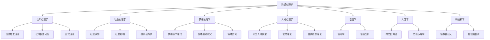
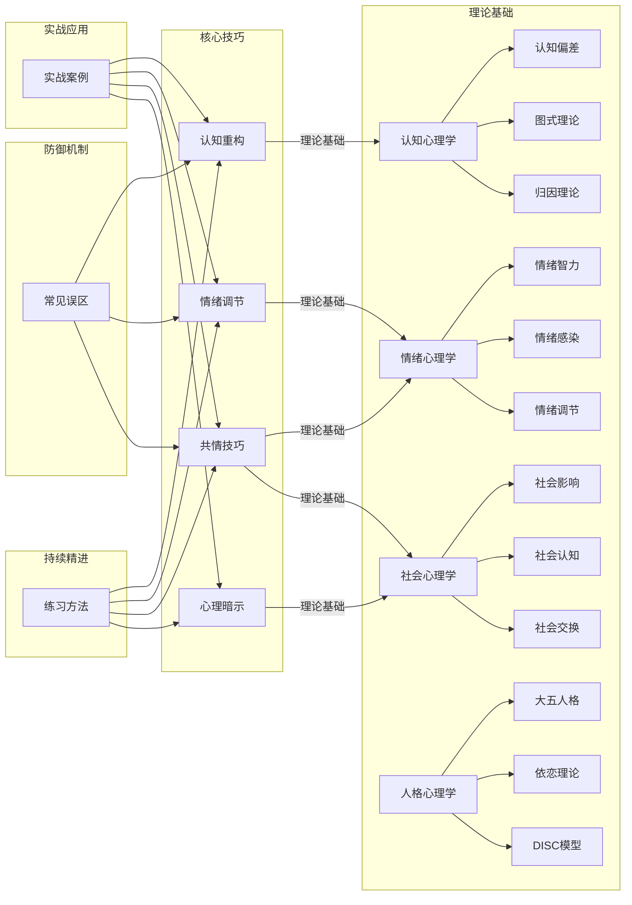

# 第十四章 沟通心理学

## 为什么需要学习沟通心理学

大多数人认为"会说话"就是会沟通。但现实中，我们频繁遭遇这样的困境：明明语气温和，对方却觉得你在指责；明明逻辑清晰，对方却完全听不进去；明明出于好意，对方却产生了敌意。这些现象的根源不在语言本身，而在语言背后的心理机制。

沟通心理学（Communication Psychology）是一门研究人际信息交换中心理过程的交叉学科。它融合了认知心理学、社会心理学、情绪心理学和人格心理学的核心理论，回答一个根本问题：**为什么人与人之间的信息传递如此容易失真？**

美国国家心理健康研究所（NIMH）的研究数据显示，职场中约70%的沟通问题源于心理因素——认知偏差、情绪干扰、防御机制和人格冲突——而非信息本身的质量。哈佛商学院对1000名管理者的跟踪研究发现，沟通能力是预测职业成功的第一指标，其预测力超过专业技能和技术知识的总和。

本章不是教你"话术"，而是帮你理解沟通背后那些看不见的心理力量，从而从根本上提升沟通质量。

***

## 本章学习目标

通过本章的系统学习，读者将获得五个层次的能力提升：

### 第一层：认知框架

**理解沟通的心理学基础**：掌握认知心理学、社会心理学、情绪心理学和人格心理学中与沟通相关的核心理论，建立"四维度×三层次"的系统知识框架。你将理解为什么同一条信息在不同人那里会引发截然不同的反应，以及这些差异背后的心理机制。

### 第二层：核心技巧

**掌握四种心理沟通技巧**：认知重构（改变思维模式）、情绪调节（管理情绪状态）、共情技巧（理解他人感受）、心理暗示（影响对方心理）。每种技巧都有明确的理论依据、具体的操作步骤和适用场景。

### 第三层：实战能力

**应用实战策略**：通过八个典型沟通场景的深度案例分析——职场汇报、冲突调解、谈判协商、亲密关系、跨文化沟通、团队协作、公众演讲、危机处理——将理论知识转化为实际操作能力。每个案例都包含情境分析、心理机制拆解、策略选择和效果评估。

### 第四层：防御意识

**规避常见误区**：识别并避免沟通心理学应用中的十个典型错误，包括过度分析、操控倾向、共情疲劳、标签化思维等。了解这些误区的成因和纠正方法，防止"学了心理学反而沟通更差"的悖论。

### 第五层：持续精进

**建立持续练习体系**：通过系统化的自我训练方案，逐步内化沟通心理学的核心能力。包括日常觉察练习、情境模拟训练、反思日志和同伴互助等方法，形成可持续的能力增长循环。

***

## 章节结构

本章共分为八个部分，按照"理论→技巧→实战→反思→训练→拓展"的逻辑递进：

| 部分 | 标题 | 核心内容 | 建议阅读时间 | 难度 |
|------|------|----------|-------------|------|
| 00 | 章节概览 | 整体框架、学习指引与知识地图 | 20分钟 | ★☆☆ |
| 01 | 理论基础 | 认知心理学、社会心理学、情绪心理学、人格心理学四大理论支柱 | 60分钟 | ★★★ |
| 02 | 核心技巧 | 认知重构、情绪调节、共情技巧、心理暗示四大核心技巧 | 50分钟 | ★★☆ |
| 03 | 实战案例 | 八个典型沟通场景的深度分析与策略应用 | 45分钟 | ★★☆ |
| 04 | 常见误区 | 十个沟通心理学应用中的典型误区与纠正方法 | 30分钟 | ★★☆ |
| 05 | 练习方法 | 系统化的自我训练与能力提升方案 | 25分钟 | ★☆☆ |
| 06 | 本章小结 | 核心要点回顾与实践指引 | 15分钟 | ★☆☆ |
| 07 | 深度拓展 | 前沿研究、跨文化视角与进阶阅读 | 30分钟 | ★★★ |

***

## 学科发展脉络

沟通心理学并非凭空诞生，而是经过百余年的发展逐步成型。了解这条脉络有助于理解为什么本章选择这些理论框架。

### 关键里程碑

| 时期 | 里程碑事件 | 代表人物 | 对沟通心理学的贡献 |
|------|-----------|---------|-------------------|
| 1890s | 实验心理学兴起 | 威廉·詹姆斯 | 提出"意识流"概念，奠定信息加工的哲学基础 |
| 1920s | 格式塔心理学 | 韦特海默、苛勒 | 发现知觉的整体性原则，解释为什么沟通中"整体印象"优先于细节 |
| 1940s | 信息论诞生 | 香农、韦弗 | 提出通信模型（发送者-信道-接收者），成为沟通研究的数学基础 |
| 1950s | 认知革命 | 乔姆斯基、米勒 | 推翻行为主义，重新关注内部心理过程，催生认知心理学 |
| 1955 | 归因理论 | 弗里茨·海德 | 揭示人们如何解释行为原因，奠定沟通误解研究的基础 |
| 1958 | 人际沟通模型 | 约瑟夫·卢夫特、哈里·英格拉姆 | 提出"乔哈里视窗"，区分开放区、盲区、隐藏区和未知区 |
| 1960s | 社会心理学黄金年代 | 阿希、米尔格拉姆、费斯廷格 | 从众、服从、认知失调等经典研究揭示社会影响的力量 |
| 1967 | 非语言沟通研究 | 阿尔伯特·梅拉比安 | 提出"7-38-55法则"（后被广泛误读），推动非语言线索研究 |
| 1969 | 情绪基本理论 | 保罗·埃克曼 | 发现六种基本情绪的跨文化面部表情，奠定情绪识别研究 |
| 1980s | 情绪智力概念 | 彼得·萨洛维、约翰·梅耶 | 提出情绪智力理论框架 |
| 1990s | 大五人格模型 | 科斯塔、麦克雷 | 建立被广泛接受的人格五因素模型 |
| 1995 | 情绪智力普及 | 丹尼尔·戈尔曼 | 将情绪智力概念大众化，影响管理学和教育学 |
| 2000s | 神经科学介入 | 镜像神经元研究 | 为共情提供神经科学证据，推动社会认知神经科学 |
| 2010s | 建构主义情绪观 | 丽莎·费尔德曼·巴瑞特 | 挑战基本情绪理论，提出情绪是大脑主动建构的结果 |

### 学科交叉特征

沟通心理学的"交叉"性质意味着它不是一个封闭的学科，而是从多个领域汲取养分：

***

## 核心理论框架

本章的理论框架可以概括为"四个维度、三层结构"，这是理解全部内容的基础骨架。

### 四个维度

每个维度回答一个核心问题：

| 维度 | 核心问题 | 学科来源 | 关键概念 | 沟通启示 |
|------|---------|---------|---------|---------|
| **认知维度** | 我们如何加工、存储和提取沟通信息？ | 认知心理学 | 信息加工模型、图式理论、归因理论、认知偏差 | 每个人都在通过自己的"认知滤镜"看世界，理解这一点是减少误解的起点 |
| **社会维度** | 社会情境和人际关系如何影响沟通？ | 社会心理学 | 社会认知、从众效应、说服理论、面子理论 | 沟通从不发生在真空中，社会角色、权力关系和文化规范时刻塑造着对话的走向 |
| **情绪维度** | 情绪如何产生、传播并影响沟通效果？ | 情绪心理学 | 情绪感染、情绪劳动、情绪智力、情绪调节 | 情绪是沟通中最强大也最难以控制的因素，管理情绪不是压抑情绪，而是智慧地表达 |
| **人格维度** | 个体差异如何塑造独特的沟通风格？ | 人格心理学 | 大五人格、依恋类型、DISC模型、自我概念 | 没有"放之四海而皆准"的沟通方式，有效沟通需要因人而异 |

### 三层结构

三个层次从微观到宏观，覆盖沟通心理的全部场域：

**个体层**——"我"的内在世界
- 个人的认知模式（我如何理解信息）
- 情绪特征（我的情绪反应模式）
- 人格特质（我的稳定行为倾向）
- 自我概念（我如何看待自己）

**交互层**——"我与你"的心理博弈
- 心理互动（彼此的认知和情绪如何相互影响）
- 反馈循环（正面或负面的互动螺旋）
- 权力动态（谁在主导对话，如何感知权力差距）
- 关系发展阶段（不同阶段的沟通心理差异）

**情境层**——"我们所处的环境"
- 文化背景（集体主义vs个人主义、高语境vs低语境）
- 社会规范（什么样的沟通被认为是"得体"的）
- 组织文化（层级结构、决策风格、信息流动方式）
- 物理环境（面对面vs线上、公开vs私密）

### 四维度×三层次矩阵

每个维度在每个层次上的表现不同，形成12个分析单元：

| | 个体层 | 交互层 | 情境层 |
|---|--------|--------|--------|
| **认知维度** | 我的思维偏差 | 彼此的认知匹配度 | 文化认知框架差异 |
| **社会维度** | 我的社会角色认同 | 互动中的权力博弈 | 社会规范的约束力 |
| **情绪维度** | 我的情绪基线 | 情绪感染与共鸣 | 情绪表达的文化规则 |
| **人格维度** | 我的人格特质 | 人格互补或冲突 | 人格表达的情境适应 |

这个矩阵是一个分析工具。面对任何沟通问题，你可以定位它在矩阵中的位置，从而找到更有针对性的解决策略。

***

## 核心观点

本章的全部内容建立在以下四个核心观点之上。理解这些观点，等于掌握了沟通心理学的"元认知"——关于沟通认知的认知。

### 观点一：沟通是心理活动的外在表现

每一句话、每一个表情、每一次沉默，都是内在心理过程的投射。当一个人说"我没生气"却紧握双拳、语调上扬时，他的身体在传递比语言更真实的信息。

**为什么这个观点重要？** 因为大多数人只关注"他说了什么"（语言内容），而忽略了"他为什么这么说"（心理动机）和"他怎么说的"（非语言线索）。研究表明，在面对面沟通中，非语言线索传递的信息量占总信息量的55%以上（Mehrabian, 1971），而语调占38%，语言内容仅占7%——当然，这一数据仅适用于情感态度的传递，不适用于所有沟通场景。但核心启示是明确的：**不理解心理，就无法真正理解沟通。**

### 观点二：心理噪音比物理噪音更具破坏性

偏见、情绪、防御心理、认知偏差等内在因素，比外部环境干扰更频繁地导致沟通失败。

**具体表现包括：**
- **选择性倾听**：只听到符合自己预期的内容，过滤掉不一致的信息
- **防御性倾听**：将中性信息解读为攻击，启动心理防御机制
- **投射性理解**：将自己的想法和感受投射到对方身上，误以为对方"也是这么想的"
- **情绪性过滤**：在负面情绪状态下，连积极信息也会被消极解读

Shannon-Weaver的通信模型指出，任何通信系统都存在"噪音"。在人际沟通中，心理噪音是最难消除的一种，因为它存在于接收者的认知系统内部，发送者几乎无法直接控制。

### 观点三：心理觉察是高质量沟通的前提

心理觉察（Psychological Awareness）指的是对自身和他人心理状态的实时感知能力。它包含两个方向：

- **向内觉察**：我现在处于什么情绪状态？我的思维是否被某种偏差影响？我的反应是基于事实还是基于假设？
- **向外觉察**：对方的非语言线索在传递什么信息？对方的情绪状态如何？对方的沉默意味着什么？

正念（Mindfulness）研究为心理觉察提供了实证支持。Kabat-Zinn的研究表明，正念训练能够显著提升情绪调节能力和人际觉察力。在沟通中，"暂停-觉察-回应"的模式比"刺激-反应"的自动模式产生更好的结果。

### 观点四：沟通能力可以通过心理学训练系统提升

沟通不是天赋，而是可以习得和精进的技能。以下方法都有坚实的实证基础：

| 训练方法 | 理论来源 | 核心机制 | 训练周期 |
|---------|---------|---------|---------|
| 认知重构 | 认知行为疗法（CBT） | 识别并改变非理性思维模式 | 6-8周系统训练 |
| 情绪调节 | 格罗斯情绪调节模型 | 掌握五个阶段的调节策略 | 4-6周刻意练习 |
| 共情训练 | 罗杰斯人本主义心理学 | 培养认知共情和情感共情 | 持续性实践 |
| 正念训练 | 正念减压（MBSR） | 提升当下觉察力和非反应性 | 8周标准课程 |
| 角色扮演 | 社会学习理论 | 在模拟情境中练习新行为 | 按需使用 |
| 反思日志 | 反思性实践 | 通过书面反思加深自我认知 | 每日10分钟 |

***

## 知识地图：本章概念关系

以下知识地图展示了本章核心概念之间的逻辑关系，帮助读者建立全局认知：

***

## 前置知识与读者分层

### 我需要什么基础？

本章面向不同背景的读者，但以下基础知识会有帮助：

| 知识领域 | 需要程度 | 如果不具备 |
|---------|---------|-----------|
| 基础心理学概念 | 推荐 | 不影响阅读，本章会解释所有专业术语 |
| 人际沟通基本技巧 | 推荐 | 建议先阅读本章之前的章节 |
| 自我反思习惯 | 强烈推荐 | 这是将理论转化为能力的关键能力 |
| 阅读学术文献的能力 | 可选 | 仅影响"深度拓展"部分的阅读 |

### 三种读者路径

**快速通道（2小时）**：适合时间紧迫的读者
1. 阅读本章概览（当前文件）——20分钟
2. 精读"核心技巧"中的认知重构和共情技巧——40分钟
3. 选择2个与自己最相关的实战案例深入阅读——30分钟
4. 浏览"常见误区"，对照自身——15分钟
5. 阅读"本章小结"——15分钟

**标准通道（5小时）**：适合希望系统学习的读者
1. 按顺序阅读全部八个部分
2. 每读完一个部分，用5分钟写下三个关键收获
3. 在"实战案例"部分，尝试用理论独立分析再对照答案
4. 完成"练习方法"中的至少两项练习

**深度通道（10+小时）**：适合希望精通的读者
1. 标准通道的全部内容
2. 阅读"深度拓展"中的学术文献推荐
3. 将本章的分析框架应用到过去一周的三次真实沟通中
4. 撰写3000字以上的学习反思
5. 与他人讨论本章的核心观点，检验自己的理解深度

***

## 自我评估：你的沟通心理学起点

在正式学习之前，花3分钟完成以下自评。这不是考试，而是帮助你识别最需要重点学习的领域。

**评分标准**：1=完全不符合，2=偶尔符合，3=有时符合，4=经常符合，5=完全符合

| 题号 | 陈述 | 评分 |
|------|------|------|
| 1 | 当对方不同意我的观点时，我能区分"他反对我的想法"和"他不尊重我" | ___ |
| 2 | 在情绪激动时，我通常能意识到自己正在被情绪影响 | ___ |
| 3 | 我能较准确地判断对方当下的情绪状态 | ___ |
| 4 | 面对不同类型的人，我会调整自己的沟通方式 | ___ |
| 5 | 当沟通出现误解时，我会先检查自己的表达是否清晰 | ___ |
| 6 | 我了解自己的情绪触发点，并有应对策略 | ___ |
| 7 | 我能在冲突中保持对对方立场的好奇心 | ___ |
| 8 | 我知道自己的沟通风格优势和盲区 | ___ |
| 9 | 我能识别对方的非语言线索（表情、语气、肢体语言） | ___ |
| 10 | 在重要沟通前，我会做心理准备和策略规划 | ___ |

**结果解读：**

| 总分 | 水平 | 建议 |
|------|------|------|
| 10-20分 | 入门级 | 重点关注"理论基础"和"常见误区"，建立基本认知框架 |
| 21-35分 | 进阶级 | 重点学习"核心技巧"和"实战案例"，弥补具体能力短板 |
| 36-45分 | 熟练级 | 重点关注"深度拓展"和"练习方法"，向精通迈进 |
| 46-50分 | 精通级 | 本章内容你可能已熟悉大部分，重点关注理论整合和跨文化视角 |

**维度分析**：将题目按以下维度分组，识别你的薄弱环节
- 认知维度：第1、5题 → 偏低则重点学习认知心理学部分
- 情绪维度：第2、6题 → 偏低则重点学习情绪调节技巧
- 共情维度：第3、7、9题 → 偏低则重点学习共情技巧
- 人格维度：第4、8题 → 偏低则重点学习人格心理学部分
- 实践维度：第10题 → 偏低则重点学习练习方法部分

***

## 与其他章节的关联

沟通心理学不是孤立的知识模块，它与本书其他章节存在深度关联：

| 关联章节 | 关联方式 | 本章如何补充 |
|---------|---------|-------------|
| 倾听技巧 | 倾听是沟通心理学中"共情"和"心理觉察"的行为载体 | 提供倾听背后的心理机制解释 |
| 非语言沟通 | 非语言线索是情绪和人格特质的外在表达 | 解释为什么非语言线索如此重要 |
| 冲突管理 | 冲突是认知偏差、情绪失控和人格碰撞的集中体现 | 提供冲突发生的心理根源分析 |
| 跨文化沟通 | 文化差异本质上是认知框架和情绪表达规则的差异 | 提供文化心理学的理论支撑 |
| 谈判技巧 | 谈判是认知博弈、情绪管理和心理影响的综合应用 | 提供谈判中可操作的心理策略 |
| 公众表达 | 演讲焦虑、受众心理分析、说服策略都根植于心理学 | 提供演讲心理学的系统框架 |

***

## 阅读建议

### 通用建议

1. **先建框架，再填细节**：先通读本概览，建立"四维度×三层次"的认知框架，再逐一学习每个部分
2. **理论联系实际**：每学一个概念，立刻回忆一个自己的真实经历来对应
3. **做笔记，不做旁观者**：用"我认为…"、"我曾经…"这样的句式写下你的思考，而不是仅仅划线
4. **允许不适感**：学习自我认知相关内容时，发现自己的盲区是正常的，不适感恰恰说明你在成长
5. **给自己时间**：心理学知识的内化需要时间，不要期望读完就能立刻改变，给自己2-4周的实践窗口

### 针对不同场景的建议

**如果你正在经历沟通困境**：直接跳到"实战案例"部分，找到与你最相似的场景，先获得实操方案，再回来补理论。

**如果你是管理者或领导者**：重点关注社会心理学部分（权力动态、群体思维、说服理论）和情绪智力部分（关系管理、情绪劳动）。

**如果你在亲密关系中遇到问题**：重点关注依恋理论、人格差异和情绪调节部分。亲密关系中的沟通问题往往根植于依恋风格的差异。

**如果你是教育工作者或培训师**：重点关注认知心理学部分（信息加工、注意力管理）和"练习方法"部分（如何设计有效的训练方案）。

***

## 本章关键术语速查

以下术语在本章中频繁出现，建议在阅读过程中随时回顾：

| 术语 | 英文 | 一句话解释 |
|------|------|-----------|
| 图式 | Schema | 大脑中用于组织和解释信息的认知框架 |
| 归因 | Attribution | 对行为原因的推断过程 |
| 认知偏差 | Cognitive Bias | 系统性的思维偏离理性判断的倾向 |
| 认知重构 | Cognitive Restructuring | 识别并改变非理性思维模式的技术 |
| 情绪感染 | Emotional Contagion | 情绪从一个人"传染"到另一个人的现象 |
| 情绪劳动 | Emotional Labor | 为符合职业或社会要求而管理情绪表达的努力 |
| 情绪智力 | Emotional Intelligence (EQ) | 识别、理解、管理自己和他人情绪的能力 |
| 共情 | Empathy | 理解他人心理状态并做出适当回应的能力 |
| 心理暗示 | Psychological Suggestion | 通过间接方式影响对方心理状态的技术 |
| 依恋风格 | Attachment Style | 个体在亲密关系中形成的稳定情感联结模式 |
| 自我效能感 | Self-Efficacy | 对自己完成特定任务能力的信念 |
| 心理觉察 | Psychological Awareness | 对自身和他人心理状态的实时感知能力 |

***

让我们开始这段探索沟通心理奥秘的旅程。从下一节"理论基础"开始，我们将深入人类心智的内部运作机制，理解那些塑造我们每一次对话的"看不见的力量"。
