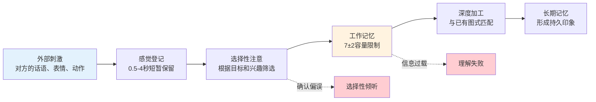
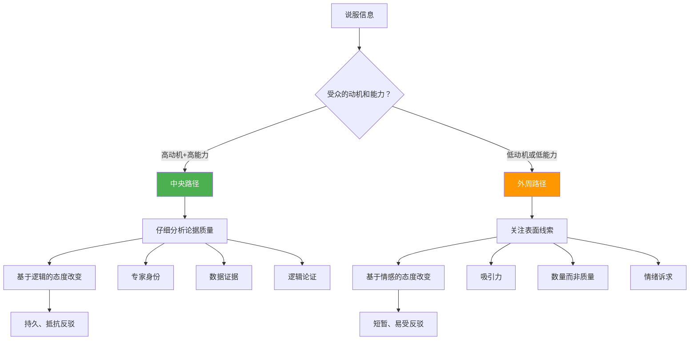
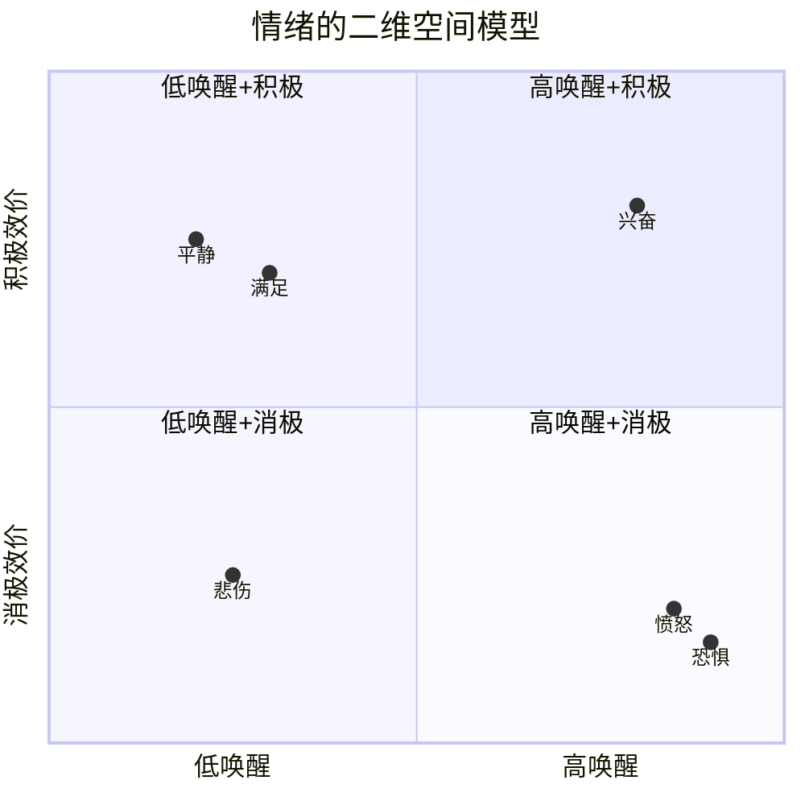
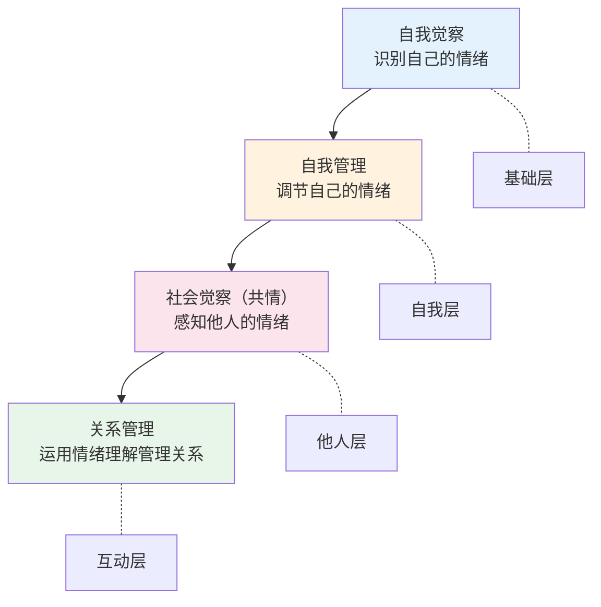
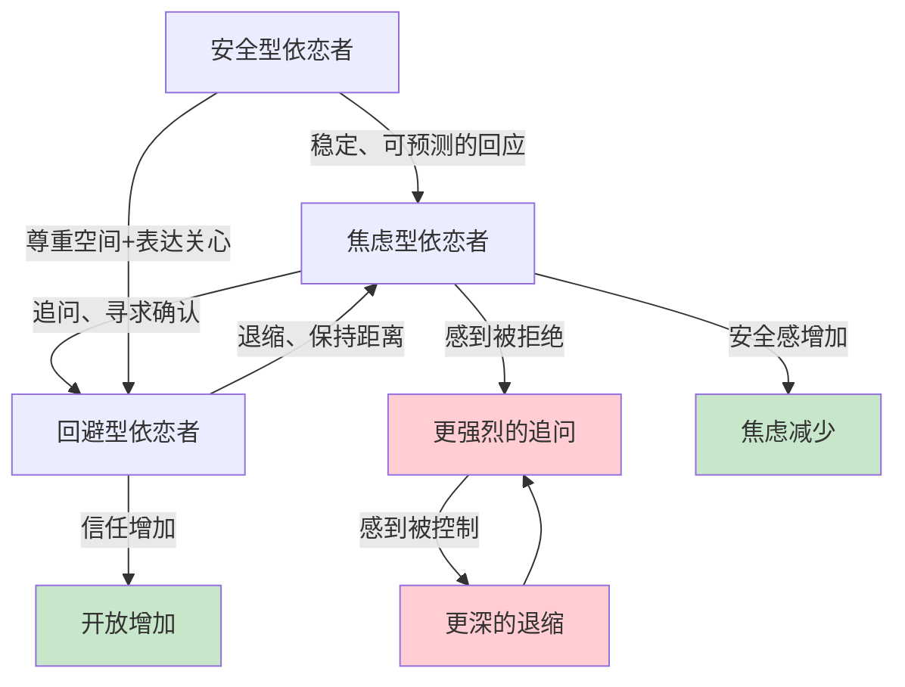
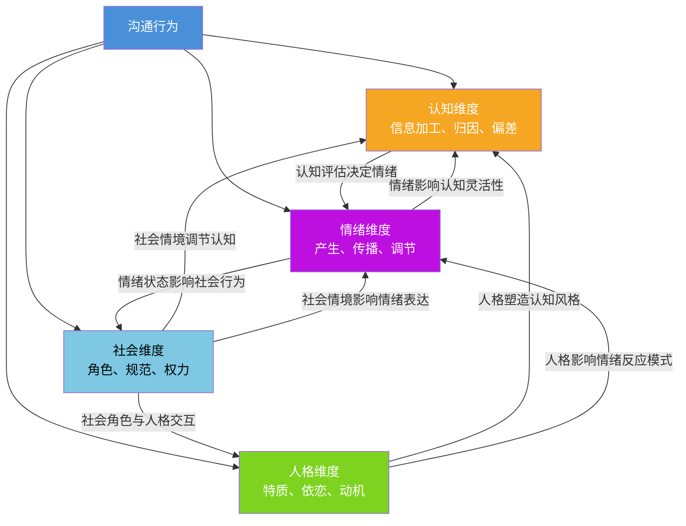
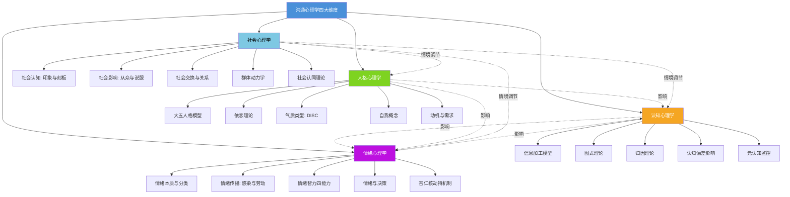
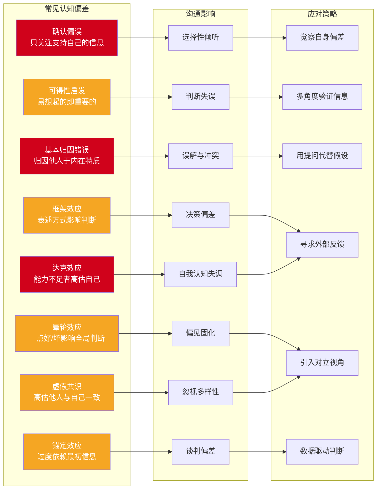

# 沟通心理学的理论基础

## 引言

沟通心理学并非一个独立的学科分支，而是多个心理学分支在沟通领域的交叉应用。要真正理解沟通的心理机制，我们需要从四个核心理论领域出发：认知心理学揭示信息加工的规律，社会心理学解释人际关系的影响，情绪心理学阐明情感的作用机制，人格心理学则关注个体差异的根源。这四个维度相互交织，共同构成了沟通心理学的理论大厦。

本节内容的定位是为后续的核心技巧和实战案例提供理论根基。如果你只想快速掌握沟通技巧，可以跳过这一节直接阅读核心技巧部分；但如果你想理解"为什么这些技巧有效"，以及在遇到新场景时能够自行推导出合适的应对策略，那么扎实的理论基础是不可替代的。

**学习本节的预期收获**：

| 层次 | 收获 | 典型表现 |
|------|------|----------|
| 识别层 | 能够识别沟通中的心理现象 | "他这样说是因为基本归因错误" |
| 理解层 | 能够解释现象背后的心理机制 | "他把我的失误归因于态度而非情境" |
| 应用层 | 能够根据理论调整沟通策略 | "我需要提供更多情境信息来纠正他的归因" |
| 推演层 | 能够在新场景中独立推导应对方案 | "这个场景涉及X理论，所以应该用Y策略" |

---

## 一、认知心理学与沟通

认知心理学研究人类如何获取、加工、存储和使用信息。在沟通领域，认知心理学为我们理解"人是如何理解和误解彼此的"提供了关键视角。

### 1.1 信息加工模型

人类的大脑并非像计算机一样精确地处理信息，而是在多个阶段进行筛选、简化和重构。沟通中的信息加工通常经历以下阶段：

**感觉登记**：感官接收到的信息在此短暂保留（视觉约0.5秒，听觉约2-4秒）。在沟通中，这意味着我们只能注意到环境中有限的信息。例如，在一场会议中，你可能完全没注意到同事的一个微妙表情，因为你的注意力集中在发言者的语言内容上。感觉登记的容量是巨大的（几乎所有感官刺激都被短暂记录），但持续时间极短——如果信息没有被注意选择进入下一阶段，就会迅速消退。

**选择性注意**：大脑会根据当前目标、兴趣和情绪状态，从海量感觉信息中选择性地关注某些内容。这一机制解释了为什么在嘈杂的鸡尾酒会上，你仍然能听到有人叫你的名字（"鸡尾酒会效应"，Cherry, 1953），也解释了为什么在沟通中，人们倾向于关注与自己立场一致的信息（确认偏误）。

选择性注意在沟通中有一个重要推论：**你说什么不重要，对方注意到什么才重要。** 同一场会议中，不同参与者记住的内容可能截然不同——项目经理记住了时间节点，设计师记住了视觉反馈，财务人员记住了预算数字。这不是他们"选择性记忆"的结果，而是在信息进入工作记忆之前，选择性注意就已经完成了过滤。

**工作记忆**：被注意到的信息进入工作记忆进行加工。工作记忆的容量有限（Miller, 1956, 提出的7±2法则，后续研究认为实际有效容量更接近4±1个组块），这意味着在复杂沟通中，信息过载会导致理解和记忆的显著下降。这解释了为什么长篇大论往往不如简洁明了的表达有效。

工作记忆的限制在实际沟通中的影响：

| 沟通场景 | 工作记忆压力 | 常见后果 | 应对策略 |
|----------|-------------|----------|----------|
| 一次性传达5个以上要点 | 极高 | 听众只记住前2-3个和最后1个 | 分批传达，每批不超过3个要点 |
| 复杂技术方案讲解 | 高 | 非专业听众完全跟不上 | 类比化、可视化、分步讲解 |
| 激烈争论中反驳对方 | 高 | 想到的论点在开口时忘记 | 先记录再回应，控制节奏 |
| 长时间会议后做决策 | 中-高 | 决策质量显著下降 | 重要决策安排在会议前半段 |
| 电话中讨论多件事 | 中 | 漏掉重要信息 | 通话前列出清单，逐项确认 |

**长期记忆**：经过深度加工的信息可能进入长期记忆，与已有的知识网络建立连接。新信息与已有图式的匹配程度，直接影响我们对信息的理解和记忆。Craik 和 Lockhart（1972）的"加工层次理论"指出，对信息进行深层加工（思考其含义、与自身经验关联）比浅层加工（简单复述）更能促进长期记忆的形成。

**沟通启示**：想让对方记住你的信息，就要帮助对方进行深层加工——用故事、类比、具体案例来激活对方已有的知识网络，而不是堆砌抽象概念。

### 1.2 图式理论

图式（Schema）是认知心理学中最重要的概念之一，由英国心理学家巴特莱特（Frederic Bartlett, 1932）首先系统提出，后经皮亚杰（Jean Piaget）等人的发展成为认知科学的基石概念。图式指的是我们头脑中用于组织和解释信息的认知框架——它是一套预设的"如果…那么…"规则，帮助我们快速理解新信息而不需要每次都从零开始分析。

在沟通中，图式发挥着至关重要的作用。图式既是效率工具（帮助我们快速理解），也是偏见来源（导致我们曲解信息）：

**人物图式**：我们对他人的预设认知。例如，如果你认为某位同事"总是反对别人的意见"，那么即使他提出合理的建议，你也可能将其解读为"又在找茬"。这种图式会导致确认偏误——我们倾向于寻找和记住符合图式的信息，忽略矛盾的信息。

人物图式的形成速度极快。Willis 和 Todorov（2006）的研究发现，人们仅需100毫秒就能形成对他人可信度的判断，而这个初始判断会持续影响后续的互动解读。在职场中，"第一印象"之所以如此顽固，正是因为初始人物图式一旦形成，就会自动过滤掉不一致的信息。

**事件图式（脚本）**：对特定场景中事件序列的预期。例如，"约会脚本"可能包括吃饭、看电影、散步等环节；"面试脚本"包括自我介绍、展示能力、提问环节。当沟通场景偏离预期脚本时，人们会感到困惑或不安。

脚本理论的沟通启示：如果你能识别对方的"脚本预期"，就能更有效地管理沟通。例如，客户打电话投诉时，他们的脚本是"表达不满→得到道歉→获得解决方案"。如果你跳过道歉直接给方案，即使方案很好，客户也可能不满意——因为你打破了他们的脚本预期。

**自我图式**：对自身的认知框架，直接影响沟通中的自我呈现。一个自我图式中包含"我是内向的人"的人，可能在社交场合中不自觉地退缩，形成自我实现的预言（self-fulfilling prophecy）。Markus（1977）的研究表明，自我图式不仅影响我们如何看待自己，还影响我们如何加工与自我相关的信息——"独立型自我图式"的人更容易注意到与独立性相关的信息，而"依赖型自我图式"的人则更容易关注人际关系相关信息。

**角色图式**：对特定社会角色应有行为的预期。例如，"领导者应该是果断的""教师应该是耐心的""医生应该是专业的"。当某人的行为违反了角色图式，我们会产生强烈的反应——一个暴躁的老师比一个暴躁的商人更容易引起我们的反感，因为前者违反了更强的角色图式。

**文化图式**：不同文化背景的人拥有不同的认知图式。在中国文化中，"请客吃饭"的图式包括抢着买单、给对方夹菜等行为序列；而在西方文化中，同样的场景可能触发"AA制""各自点餐"的图式。跨文化沟通中的很多误解，根源就在于文化图式的差异。

> **自我检查**：回想最近一次与人发生误解的经历。你是否在对话开始前就对对方有了某种预设？这个预设是否影响了你对对方话语的解读？试着将对方的行为放在"没有预设"的背景下重新解读，你是否会得出不同的结论？

### 1.3 归因理论

归因理论由弗里茨·海德（Fritz Heider, 1958）提出，后经哈罗德·凯利（Harold Kelley, 1967）和伯纳德·韦纳（Bernard Weiner, 1972）等人发展，研究人们如何解释自己和他人行为的原因。归因过程大多在无意识中自动完成，但它深刻影响着我们对他人行为的情感反应和后续行为决策。

**基本归因错误（Fundamental Attribution Error）**：人们倾向于将他人的行为归因于内在特质（性格、态度），而低估情境因素的影响。这是社会心理学中最稳健的发现之一，由 Ross（1977）正式命名。

经典实验：Jones 和 Harris（1967）让被试阅读支持或反对卡斯特罗的文章，即使被告知作者是被指定立场的（没有选择自由），被试仍然认为写支持文章的人真的支持卡斯特罗。这说明即使在逻辑上我们知道行为是情境决定的，我们的直觉归因仍然倾向于内在特质。

在日常沟通中的表现：
- 同事迟到了 → "他不守时、不专业"（内在归因），而非"可能遇到交通堵塞"（情境归因）
- 伴侣忘了纪念日 → "他不在乎我"（内在归因），而非"他最近工作压力太大"（情境归因）
- 下属汇报出错 → "他能力不行"（内在归因），而非"准备时间太紧"（情境归因）

**行动者-观察者效应（Actor-Observer Asymmetry）**：行动者倾向于将自己的行为归因于情境因素（"我迟到是因为堵车"），而观察者倾向于将同样的行为归因于行动者的内在特质（"他迟到是因为不守时"）。这种不对称的归因模式是人际冲突的重要来源。Jones 和 Nisbett（1972）提出的这一效应，其部分原因在于行动者拥有关于自己行为情境的丰富信息，而观察者只能看到行为本身。

**自利归因偏差（Self-Serving Bias）**：人们倾向于将成功归因于自己的能力和努力，将失败归因于外部因素。在团队沟通中，这种偏差会导致功劳分配不均和责任推诿。项目成功时，每个人都觉得自己贡献最大；项目失败时，每个人都觉得问题出在别人身上。Miller 和 Ross（1975）的研究表明，这种偏差在自尊水平较高的人群中更为明显。

**韦纳的归因维度理论**：韦纳将归因分为三个维度——内外性（内部 vs 外部）、稳定性（稳定 vs 不稳定）、可控性（可控 vs 不可控）。不同的归因方式会导致截然不同的情绪反应和后续行为：

| 归因方式 | 情绪反应 | 后续行为 | 沟通中的表现 |
|----------|----------|----------|-------------|
| 内部+稳定+不可控（"我就是笨"） | 无助、羞耻 | 逃避、放弃 | "我不适合做这个" |
| 内部+不稳定+可控（"我没准备充分"） | 内疚、后悔 | 改进、补偿 | "下次我会更认真准备" |
| 外部+稳定+不可控（"这个系统就是不行"） | 愤怒、无奈 | 抱怨、消极 | "谁来都没用" |
| 外部+不稳定+可控（"这次安排不合理"） | 不满但有希望 | 建议、推动改变 | "我们可以调整一下流程" |

**沟通启示**：在沟通中遇到对方的"问题行为"时，先暂停归因判断，考虑可能的情境因素，用提问代替假设，用理解代替评判。具体做法是：当你的归因判断引发负面情绪（愤怒、失望）时，强制自己列出至少两个情境因素的解释。这不是要你放弃判断，而是要你在有更多信息之前保留判断。

### 1.4 认知偏差对沟通的影响

除了上述核心理论，还有多种认知偏差深刻影响着沟通质量。认知偏差不是"错误"——它们是大脑在进化过程中形成的高效处理策略，在大多数情况下是有用的，但在特定场景下会导致系统性的判断偏离。

**确认偏误（Confirmation Bias）**：倾向于寻找、解释和记住支持自己已有信念的信息。这是最普遍、最具破坏力的认知偏差之一。Wason（1960）的经典"2-4-6任务"实验清楚地展示了这一偏差——人们倾向于寻找支持自己假设的证据，而非反驳假设的证据。

在沟通中的具体表现：
- 一旦你认为某人"不靠谱"，你会自动关注他犯错的时刻，忽略他做得好的时候
- 在争论中，你更容易被支持自己观点的论据说服，而对反对观点的论据持有更高标准
- 面试中，面试官在前5分钟形成初步印象后，后续提问往往是"确认性提问"（寻找支持初步印象的证据）

应对方法：主动寻找反证。如果你认为某人能力不行，刻意去找他做得好的例子。如果你坚信某个方案是对的，主动去想"如果这个方案是错的，会是什么原因？"

**可得性启发（Availability Heuristic）**：根据信息容易想起的程度来判断其重要性或频率。Tversky 和 Kahneman（1973）的研究表明，人们会高估那些生动、近期、情绪化事件的发生概率。

在沟通中的影响：
- 刚看了一则飞机失事新闻后，你可能高估飞行风险，影响相关决策讨论
- 一个员工最近犯了大错，管理者可能高估这个员工的整体犯错率
- 媒体大量报道的事件会被认为比统计上更常见的事件更"重要"

应对方法：当你的判断受到"最近发生的事"强烈影响时，主动查找客观数据来校准你的判断。

**锚定效应（Anchoring Effect）**：过度依赖最初获得的信息（锚点）进行后续判断。Tversky 和 Kahneman（1974）的实验表明，即使锚点是随机数字，也会影响后续的数值估计。

在沟通中的影响：
- 薪资谈判中，先出价的一方设定了"锚点"，后续讨论围绕这个锚点展开
- 绩效评估中，员工年初的表现会成为全年评估的"锚点"
- 价格谈判中，商家标出的"原价"就是一个锚点，即使没人按原价买过

应对方法：在谈判或评估中，有意识地识别对方设定的锚点，并主动引入替代锚点。

**框架效应（Framing Effect）**：同一信息的不同表述方式会导致不同的决策和反应。Tversky 和 Kahneman（1981）的"亚洲疾病问题"经典实验表明，"拯救200人"和"400人会死亡"在数学上等价，但导致了截然不同的选择。

在沟通中的影响：
- "这个方案有70%的成功率"比"这个方案有30%的失败率"更容易被接受
- "你已经完成了80%"比"还剩20%没完成"更能激励人
- "我们削减了不必要的开支"比"我们砍掉了员工福利"听起来好得多

应对方法：当你要做重要决策时，尝试用两种相反的框架重新表述同一个问题，看你的选择是否一致。

**达克效应（Dunning-Kruger Effect）**：能力不足的人往往高估自己的能力，而能力强的人可能低估自己。Kruger 和 Dunning（1999）的研究表明，能力最差的四分之一被试在测试中得分处于后12%，但他们自我评估的得分却在前62%。

在沟通中的影响：
- 真正不懂的人往往最自信、声音最大，而真正懂的人反而更谨慎
- 团队中能力最弱的成员可能对方案指手画脚，而专家的建议反而被忽略
- "初生牛犊不怕虎"——新手可能意识不到自己需要学习

应对方法：评估他人意见时，不仅看"说得多自信"，更要看"基于什么经验和证据"。

**晕轮效应（Halo Effect）**：对一个人某一方面的正面（或负面）评价会扩散到对其所有方面的评价。Thorndike（1920）首次记录了这一现象。外表有吸引力的人会被认为更聪明、更善良、更有能力——这些都是缺乏逻辑依据的推论。

在沟通中的影响：
- 第一次见面表现好，后续所有互动都会被"加分"
- 一个领域的专家会被默认为其他领域也懂（"名人代言"效应）
- 一次严重失误可能毁掉之前积累的所有好印象

**虚假共识效应（False Consensus Effect）**：人们倾向于高估他人与自己想法一致的程度。Ross 等人（1977）的研究表明，人们会假设大多数人都和自己做同样的选择。这一偏差导致人们在沟通中误以为"大家都这么想"，从而忽视了不同意见的存在。

> **自我检查**：在最近一次团队讨论中，你是否说过"我觉得大家应该都同意…"或"很明显…"这样的话？这些表述可能是虚假共识效应的表现。下次在表达观点前，先问自己："如果大多数人都不同意我的看法，会是什么原因？"

### 1.5 元认知与沟通监控

元认知（Metacognition）是"关于认知的认知"，由弗拉维尔（John Flavell, 1976）提出。它指的是我们对自己思维过程的觉察和监控能力。在沟通中，元认知表现为一种"旁观者视角"——你不仅在说话和倾听，同时还在观察自己说话和倾听的过程。

**沟通中的元认知能力包括**：

- **计划**：在沟通前思考"我要传达什么？对方可能的反应是什么？我应该用什么方式？"
- **监控**：在沟通中实时检查"对方理解了吗？我的情绪是否在影响表达？我是否偏离了目标？"
- **评估**：在沟通后反思"这次沟通效果如何？哪里可以改进？我的哪些假设被证实或证伪了？"

元认知能力的高低直接决定了沟通学习的效率。一个有强元认知能力的人，每次沟通都是一次学习机会；而元认知能力弱的人，可能重复犯同样的错误而不自知。

### 1.6 小结：认知维度的核心规律

| 核心概念 | 一句话总结 | 沟通中的关键影响 |
|----------|-----------|-----------------|
| 信息加工模型 | 大脑在多个阶段筛选和重构信息 | 你说的≠对方听到的 |
| 图式理论 | 用已有框架解读新信息 | 先入为主的预期扭曲理解 |
| 归因理论 | 解释行为原因时存在系统性偏差 | 对他人行为的误判引发冲突 |
| 认知偏差 | 高效但不完美的思维捷径 | 无意识地扭曲判断和决策 |
| 元认知 | 对自己思维过程的监控 | 决定能否从沟通中学习成长 |

---

## 二、社会心理学与沟通

社会心理学研究个体在社会情境中的思维、情感和行为。沟通作为一种社会行为，深受社会心理因素的影响。如果说认知心理学关注的是个体"内部"发生了什么，社会心理学关注的就是"外部环境"如何塑造了这些内部过程。

### 2.1 社会认知

社会认知研究人们如何理解、记忆和运用社会信息。它是认知心理学和社会心理学的交叉领域，关注的核心问题是：我们如何从有限的社会线索中构建出对他人的完整认知？

**印象形成**：所罗门·阿希（Solomon Asch, 1946）的经典实验表明，人们对他人印象的形成并非各种特质的简单叠加，而是存在"中心特质"效应。在他的实验中，当描述一个人的词表中包含"热情"时，被试对这个人的整体评价显著更积极；而将"热情"换成"冷淡"后，整体评价显著下降——尽管其他描述词完全相同。

在沟通中，第一印象往往具有强大的"光环效应"（Halo Effect），影响后续所有互动的解读。一个"好人"犯了错误，我们倾向于为其找理由（"他今天状态不好"）；一个"坏人"做了好事，我们倾向于质疑其动机（"他肯定有目的"）。

**刻板印象**：对特定群体的过度简化认知。刻板印象会自动激活，在无意识层面影响沟通。Fiske（1993）的"刻板内容模型"指出，刻板印象可以从两个维度来理解——温暖（warmth）和能力（competence）。我们对不同群体在这两个维度上的刻板印象组合，决定了我们的情绪反应和行为倾向：

| 温暖/能力 | 高能力 | 低能力 |
|-----------|--------|--------|
| **高温暖** | 钦佩（如：本国人、盟友） | 怜悯（如：老人、残障人士） |
| **低温暖** | 嫉妒（如：富人、竞争对手） | 蔑视（如：流浪者、失业者） |

在沟通中，刻板印象导致的问题在于：我们对"群体"的预期会覆盖对"个体"的感知。研究发现，当人们面对与自己刻板印象一致的信息时，加工速度更快、记忆更深刻；而对不一致的信息则可能忽略或歪曲。

**归因与基本归因错误**：如前所述，社会心理学进一步揭示了归因偏差在群体间沟通中的放大效应——外群体成员的负面行为更容易被归因于其内在特质（"他们就是那样的人"），而正面行为则更容易被归因于情境因素（"只是运气好"）。这种"终极归因错误"（Ultimate Attribution Error, Pettigrew, 1979）是群体间偏见和歧视的心理根源之一。

### 2.2 社会影响

社会影响是社会心理学的核心主题，与沟通策略密切相关。理解社会影响的机制，不仅能帮助我们更有效地影响他人，也能帮助我们识别自己何时在被不当影响。

**从众效应（Conformity）**：所罗门·阿希（Solomon Asch, 1951）的线段实验揭示了群体压力对个体判断的强大影响。在实验中，即使正确答案显而易见，当其他"被试"（实际上是实验助手）都给出错误答案时，约有75%的被试至少从众了一次，总体从众率约为37%。

在沟通中，从众效应表现为人们倾向于附和多数人的意见，即使内心并不认同。理解这一效应有助于识别"虚假共识"和"沉默的螺旋"（Noelle-Neumann, 1974）现象——当个体感知到自己的观点是少数派时，会倾向于保持沉默，导致少数派观点越来越弱，多数派观点看起来越来越强。

从众的两种机制（Deutsch & Gerard, 1955）：
- **信息性影响**：当情境模糊、不确定时，我们把他人视为信息来源（"他们都这么说，可能是对的"）
- **规范性影响**：即使知道他人是错的，为了避免被排斥而选择从众（"虽然我不同意，但不想当异类"）

**服从与权威（Obedience）**：米尔格拉姆（Stanley Milgram, 1963）的服从实验是社会心理学中最著名的实验之一。实验中，约65%的被试在实验者的指示下，对无辜的"学习者"施加了最高电压（450V）的电击——尽管"学习者"已经痛苦地尖叫和请求停止。

这个实验揭示了权威对个体行为的巨大影响。在组织沟通中，权威效应会导致下属不敢表达真实意见，形成"皇帝的新衣"效应。Janis（1972）将此称为"权力压制"——当领导者表达强烈意见后，团队成员会自我审查，不再提出异议。有效的领导者需要主动创造安全的表达环境，例如：先征求意见再表达自己的看法，明确鼓励不同意见，对提出异议的人表示感谢。

**说服理论**：

**精细加工可能性模型（ELM）**：佩蒂和卡西奥普（Petty & Cacioppo, 1986）提出，说服有两条路径——中央路径（通过逻辑和证据）和外周路径（通过情感和线索）。高动机和高能力的受众倾向于通过中央路径加工信息，而低动机或低能力的受众则依赖外周路径。

实际应用：如果你想说服一个对议题高度关注的专业人士（如工程师讨论技术方案），必须使用扎实的数据和严密的逻辑（中央路径）。但如果你面对的是一个对议题不太关心的决策者（如选择哪个品牌的办公用品），简洁的推荐和可信度线索（如品牌知名度）更有效（外周路径）。

**认知失调理论（Cognitive Dissonance）**：费斯廷格（Leon Festinger, 1957）提出，当人们的行为与信念不一致时，会产生不适感，并倾向于改变信念以与行为保持一致。在沟通中，可以通过引导对方做出小的承诺，逐步改变其态度（登门槛效应，Foot-in-the-Door Effect, Freedman & Fraser, 1966）。

登门槛效应的经典应用：先请求对方帮一个小忙（如"能借我一支笔吗？"），之后提出更大的请求（如"能帮我看看这份报告吗？"），被接受的概率显著高于直接提出大请求。这是因为对方在帮了小忙后，会将自己认知为"乐于助人的人"，为了与这个自我认知保持一致，更倾向于继续帮忙。

### 2.3 社会交换与关系

社会交换理论（Social Exchange Theory）由 Thibaut 和 Kelley（1959）以及 Homans（1961）等人提出，认为人际关系的维持取决于双方感知到的成本-收益平衡。虽然"人际关系可以用成本和收益来衡量"听起来很功利，但这一理论准确描述了关系满意度的心理机制。

**人际吸引**：影响人际吸引的主要因素包括：
- **相似性**：态度、价值观、背景的相似是吸引的最强预测因素（Byrne, 1971）。在沟通中，发现和强调共同点是建立连接的有效策略
- **互补性**：在某些特定维度上（如支配-服从），互补性也能促进吸引
- **接近性**：物理距离越近，越容易建立关系（mere exposure effect，单纯曝光效应）。这解释了为什么同事、邻居更容易成为朋友
- **互惠性**：我们倾向于喜欢那些喜欢我们的人

**面子理论**：欧文·戈夫曼（Erving Goffman, 1959）的面子理论指出，社交互动中人们会努力维护自己和他人的"面子"——即在他人眼中的正面社会形象。Brown 和 Levinson（1987）进一步将面子分为"积极面子"（希望被认可和喜欢）和"消极面子"（希望不被打扰和侵犯）。

在中国文化语境中，"面子"对沟通的影响尤为显著。胡先缙（Hu Hsien-chin, 1944）区分了中国的"脸"（道德品质相关的社会评价）和"面子"（社会地位和成就相关的社会评价）。有效的沟通需要在表达真实想法和维护双方面子之间找到平衡。具体策略包括：
- 给对方"台阶下"——即使对方错了，也要留有余地
- 公开表扬、私下批评
- 用"我们"代替"你"来表达不同意见（"我们可以考虑另一个角度"而非"你错了"）
- 在拒绝时先肯定对方的出发点

**关系辩证法（Relational Dialectics）**：巴克斯特和蒙哥马利（Baxter & Montgomery, 1996）提出，亲密关系中存在多组永恒的张力——

| 辩证张力 | 一极 | 另一极 | 在沟通中的表现 |
|----------|------|--------|--------------|
| 开放-封闭 | 渴望亲密分享 | 需要隐私空间 | "你为什么不告诉我你在想什么？" vs "我需要自己的空间" |
| 独立-依赖 | 渴望自主 | 需要依靠 | "我自己能决定" vs "你为什么不跟我商量？" |
| 新奇-可预测 | 渴望新鲜感 | 需要安全感 | "我们去尝试新事物吧" vs "还是老地方好" |

理解这些张力有助于在亲密关系的沟通中找到平衡点——这些张力不是需要"解决"的问题，而是需要"管理"的永恒主题。

### 2.4 群体动力学

**群体思维（Groupthink）**：欧文·詹尼斯（Irving Janis, 1972）提出，在高度凝聚的群体中，成员倾向于追求一致而压制异议，导致决策质量下降。他分析了多个历史决策失误案例（如猪湾事件、珍珠港事件），发现群体思维是导致灾难性决策的关键因素。

群体思维的典型症状包括：
- **无懈可击的错觉**：群体过度乐观，低估风险
- **集体合理化**：为决策找理由，忽略警告信号
- **对异议者的压力**：质疑忠诚度来压制不同意见
- **自我审查**：成员主动隐藏疑虑
- **一致同意的错觉**：沉默被解读为同意

预防群体思维的沟通策略：领导者最后发言；指定"魔鬼代言人"角色；邀请外部专家参与讨论；鼓励匿名反馈。

**社会懈怠（Social Loafing）**：Ringelmann（1913）最早发现了这一现象——在群体中，个体的努力程度往往低于单独工作时。拉绳实验显示，3人组每人出力只有单独时的85%，8人组更降至49%。在团队沟通中，这意味着需要建立明确的责任分工和反馈机制——"每个人负责什么"必须清晰，否则"搭便车"现象不可避免。

**群体极化（Group Polarization）**：群体讨论往往使成员的原有倾向更加极端。Stoner（1961）最初发现了"风险转移"现象，后来的研究证实群体讨论不仅会使倾向更冒险，也会使保守倾向更保守。在沟通中，这意味着志同道合者的讨论可能强化偏见，而非修正偏见——这在社交媒体的"回声室效应"中表现得尤为明显。

**社会助长与社会抑制**：Zajonc（1965）提出，他人在场会增强个体的优势反应——对于简单/熟练的任务，表现会提升（社会助长）；对于复杂/不熟练的任务，表现会下降（社会抑制）。这解释了为什么在熟悉的人面前侃侃而谈，而在陌生人面前可能结巴。

### 2.5 社会认同与群体间沟通

社会认同理论（Social Identity Theory, Tajfel & Turner, 1979）认为，人们的自我概念在很大程度上来源于他们所属的社会群体。我们倾向于将世界分为"内群体"（我们）和"外群体"（他们），并自动对内群体产生偏好。

在沟通中的影响：
- 内群体成员的观点更容易被接受和记住
- 外群体成员的正面行为容易被忽视，负面行为容易被放大
- 群体身份被激活时（如讨论"我们部门"vs"他们部门"），理性分析能力下降
- 共同的"超级目标"（superordinate goal）可以降低群体间偏见（Sherif, 1961）

**沟通启示**：在跨部门、跨团队的沟通中，寻找共同身份（"我们都是XX公司的""我们都希望项目成功"）比强调差异更有效。

> **自我检查**：回顾最近一次团队冲突。你是否不自觉地为"自己人"的行为找理由，而对"对方"的行为做负面归因？试着用"如果这是我的队友做的"来重新评估双方的行为。

---

## 三、情绪心理学与沟通

情绪是沟通中最强大、最难以控制的因素之一。情绪心理学帮助我们理解情绪的产生机制、传播规律和调节方法。诺贝尔经济学奖得主丹尼尔·卡尼曼（Daniel Kahneman）指出，人类的思维系统分为快速直觉的"系统1"和慢速理性的"系统2"——而情绪主要驱动系统1，在我们意识到之前就已经影响了判断和行为。

### 3.1 情绪的本质与分类

**基本情绪理论**：保罗·埃克曼（Paul Ekman, 1972）提出六种基本情绪——快乐、悲伤、恐惧、愤怒、惊讶和厌恶，这些情绪具有跨文化的普遍性，且对应特定的面部表情。后续研究扩展到包括蔑视、羞耻、内疚等情绪。Ekman 的研究最初在巴布亚新几内亚的前石器时代部落中进行，发现即使是从未接触过外部世界的人也能识别和表达这些基本情绪。

**情绪的维度模型**：罗素（James Russell, 1980）提出情绪可以用两个核心维度来描述——效价（积极-消极）和唤醒度（高-低）。这一模型的优势在于，它能够描述那些难以用单一情绪标签命名的复杂感受。例如，"焦虑"和"兴奋"都是高唤醒度的情绪，但效价不同；"平静"和"悲伤"都是低唤醒度的情绪，但效价也不同。

**建构主义情绪观**：丽莎·费尔德曼·巴瑞特（Lisa Feldman Barrett, 2017）在《情绪是如何形成的》一书中提出，情绪不是被"触发"的固定反应，而是大脑基于过去经验主动"建构"的结果。这意味着同样的情境在不同人身上会引发不同的情绪反应，这与每个人的"情绪粒度"（emotional granularity，区分和命名情绪的能力）有关。

情绪粒度的概念对沟通有重要启示：能够精确命名自己情绪的人（高情绪粒度），比只能笼统地说"我不舒服"的人（低情绪粒度），能更有效地管理情绪和进行沟通。研究表明，高情绪粒度的人更少使用攻击性方式表达不满，因为他们能够更准确地识别和表达自己的感受。

### 3.2 情绪的传播机制

**情绪感染（Emotional Contagion）**：哈特菲尔德（Hatfield, Cacioppo & Rapson, 1993）等人提出，人们会自动模仿他人的面部表情、声音和姿势，进而"感染"对方的情绪。这个过程是自动化的、无意识的——你不需要"决定"去感受对方的情绪，它自然就会发生。

情绪感染的神经基础是"镜像神经元系统"（Mirror Neuron System）。当你看到别人皱眉时，你大脑中负责皱眉的运动区域也会被激活，进而触发相应的情绪体验。在沟通中，一个人的焦虑、愤怒或喜悦都会通过非语言线索迅速传播给对话伙伴。

研究数据：
- Barsade（2002）的实验表明，在团队中植入一个积极情绪的成员，整个团队的合作性和绩效都会显著提升
- Fowler 和 Christakis（2008）的社交网络研究发现，快乐可以通过社交网络传播到三度分隔的人（朋友的朋友的朋友）
- 情绪感染在面对面沟通中最为强烈，但在电话、视频甚至文字沟通中也存在——这就是为什么一条带有愤怒语气的微信消息也能让你心情变差

**情绪劳动（Emotional Labor）**：阿莉·霍克希尔德（Arlie Hochschild, 1983）在《被管理的心》一书中提出，许多工作要求员工管理自己的情绪表达（如客服人员需要保持微笑和耐心）。持续的情绪劳动会导致情绪耗竭和职业倦怠。

情绪劳动的两种策略（Grandey, 2000）：
- **表层扮演（Surface Acting）**：只改变外在表情，内心感受不变。例如，对无理取闹的客户保持微笑但内心愤怒。长期表层扮演会导致情绪失调和离职意愿上升
- **深层扮演（Deep Acting）**：通过认知重构改变内心感受。例如，尝试理解客户为什么愤怒，从而真正产生共情。深层扮演的效果更好，但需要更多的心理能量

在日常沟通中，我们也经常进行情绪劳动——在不想笑的时候微笑，在生气的时候保持冷静。理解情绪劳动的概念，有助于我们更自觉地管理情绪表达，避免情绪耗竭。

**情绪调节的溢出效应（Spillover Effect）**：在工作中压抑的负面情绪可能在回家后"溢出"到家人身上（"踢猫效应"）。Bolger 等人（1989）的研究发现，工作压力导致的负面情绪会在下班后转移到配偶身上，即使配偶并不了解工作中发生了什么。理解这一机制有助于我们更自觉地管理情绪的跨情境转移——在进入新的沟通场景前，给自己一个"情绪重置"的时间（哪怕只是深呼吸三次）。

### 3.3 情绪智力

丹尼尔·戈尔曼（Daniel Goleman, 1995）将情绪智力（Emotional Intelligence, EQ）推广为一个广为人知的概念。情绪智力并非单一能力，而是一组相互关联的心理能力的集合。Salovey 和 Mayer（1990）最早提出这一概念，将其定义为"感知、理解、管理和运用情绪的能力"。

情绪智力包含四个核心能力，它们之间存在递进关系：

**自我觉察**：识别和理解自己的情绪状态。这是情绪管理的起点——如果我们不能意识到自己正在生气或焦虑，就无法有效地管理这些情绪。在沟通中，自我觉察帮助我们识别情绪何时开始影响我们的判断和表达。

自我觉察的具体练习：
- **身体扫描**：情绪总是伴随着身体感受——愤怒时心跳加速、焦虑时胃部紧缩、恐惧时肌肉紧张。学会识别这些身体信号，可以更早地觉察到情绪的升起
- **情绪日记**：每天记录3次"我现在感受到什么情绪"，逐渐提高情绪识别的敏感度
- **暂停反应**：在做出反应前给自己3秒钟，问"我现在的情绪状态是什么？这个情绪是否在影响我的判断？"

**自我管理**：调节和控制自己的情绪反应。这不是压抑情绪（压抑往往适得其反），而是选择合适的时机和方式表达情绪。Gross（2002）的情绪调节过程模型将调节策略分为五类，按干预时机从早到晚排列：

| 策略 | 干预时机 | 具体做法 | 效果 |
|------|----------|----------|------|
| 情境选择 | 情绪产生前 | 主动选择或回避某些情境 | 最有效，但限制了经验 |
| 情境修改 | 情绪产生前 | 改变引发情绪的情境 | 有效，但不总是可行 |
| 注意转移 | 情绪产生中 | 将注意力从情绪触发物上移开 | 短期有效，长期可能积累 |
| 认知重评 | 情绪产生中 | 重新解释情境的含义 | 最佳长期策略 |
| 反应调节 | 情绪产生后 | 抑制或改变情绪的外在表达 | 代价最大，长期有害 |

**社会觉察（共情）**：感知和理解他人的情绪状态。共情分为两种类型：
- **认知共情（Cognitive Empathy）**：理解他人的想法和感受，"我知道你在想什么"。认知共情是一种智力能力，可以通过训练提升
- **情感共情（Affective/Emotional Empathy）**：感受到他人的情绪，"我能感受到你的痛苦"。情感共情是一种情感反应，过度的情感共情可能导致"共情疲劳"

高共情能力的人能够通过细微的非语言线索（语调变化、微表情、身体姿态）捕捉他人的情绪变化，从而做出恰当的回应。

**关系管理**：运用情绪理解来管理人际关系和沟通。这包括激励他人、处理冲突、促进合作等能力。关系管理的核心不是"控制"他人的情绪，而是创造一个让双方都能有效表达和回应的情绪环境。

### 3.4 情绪与决策

情绪不仅影响我们"感觉如何"，更深刻地影响我们"如何做决定"。传统观点认为情绪是理性决策的干扰，但现代研究表明，情绪是决策过程中不可或缺的组成部分。

**情绪即信息模型（Affect-as-Information）**：施瓦茨（Norbert Schwarz, 1990）提出，人们会将当前的情绪状态作为判断的依据。例如，在愉快的情绪状态下，人们倾向于对事物做出更积极的评价。这意味着沟通的时间选择（对方情绪状态）会显著影响沟通效果。Schwarz 进一步发现，当人们知道自己的情绪来源于与判断对象无关的因素时（如天气），情绪对判断的影响会消失——但前提是人们能够意识到这种无关性。

**躯体标记假说（Somatic Marker Hypothesis）**：达马西奥（Antonio Damasio, 1994）提出，情绪通过"躯体标记"（身体的直觉反应）影响决策。他的研究发现，前额叶受损的患者虽然智力正常，但由于无法产生情绪反应，反而无法做出正常的决策——他们会反复选择明显不利的选项。在沟通中，我们的"直觉反应"（感觉某人可信或不可信）往往就是躯体标记在发挥作用。

**热认知与冷认知**：在高情绪唤醒状态下（热认知），人们的思维更加直觉化、冲动化；在低情绪唤醒状态下（冷认知），思维更加理性、深思熟虑。Loewenstein（2005）的"冷热共情差距"研究发现，处于冷认知状态的人很难准确预测自己在热认知状态下的行为和感受。有效沟通需要在对方处于"冷认知"状态时讨论重要问题——避免在对方愤怒、饥饿、疲惫时讨论关键决策。

### 3.5 杏仁核劫持与情绪失控

"杏仁核劫持"（Amygdala Hijack）是戈尔曼（1995）提出的概念，描述了情绪反应绕过大脑皮层（理性思考中枢），直接由杏仁核（情绪中枢）控制行为的现象。

**神经机制**：外部刺激通过两条通路到达杏仁核——"低通路"（丘脑直接到杏仁核，速度快但粗糙）和"高通路"（丘脑到大脑皮层再到杏仁核，速度慢但精确）。在紧急情况下，低通路抢先反应，导致我们在理性分析之前就已经做出了情绪化的反应。

**在沟通中的表现**：
- 被批评时立刻反驳，事后才发现对方说的有道理
- 被激怒时说出伤人的话，冷静后追悔莫及
- 在重要谈判中因紧张而做出不合理的让步

**应对策略**：
- **识别触发信号**：每个人有不同的杏仁核劫持触发点，提前识别自己的"雷区"
- **延迟反应**：在感受到强烈情绪时，给自己6秒钟（肾上腺素消退的最短时间）再开口
- **改变身体状态**：深呼吸、喝水、站起来走动——通过改变身体状态来降低情绪唤醒
- **转移注意力**：数数、观察环境细节——给大脑皮层"追上来"的时间

> **自我检查**：你是否有过"话一出口就后悔"的经历？回忆当时的身体感受——心跳加速、脸发热、拳头紧握？这些就是杏仁核劫持的信号。下次再出现这些信号时，尝试对自己说"我现在被情绪劫持了，先暂停"。

---

## 四、人格心理学与沟通

人格心理学研究个体之间稳定的心理差异。人格特质深刻影响着一个人的沟通风格、偏好和能力。理解人格差异不是给人贴标签，而是认识到"不同的人有不同的心理操作系统"——用同一套沟通方式与所有人互动，就像用同一把钥匙开所有的锁。

### 4.1 大五人格模型

大五人格模型（Big Five / Five-Factor Model, FFM）是当代人格心理学最受认可的理论框架，由 Costa 和 McCrae（1992）系统化。大量跨文化研究（McCrae & Costa, 1997, 在50多个文化中验证）证实了这五个维度的普适性。每个维度都与沟通行为密切相关：

**开放性（Openness to Experience）**：
- 高开放性者：思维灵活、好奇心强、乐于接受新观点，沟通中倾向于探索性对话，喜欢讨论抽象概念和创新想法。他们可能是"脑暴会议"中最活跃的人
- 低开放性者：务实、偏好常规、重视传统，沟通中倾向于具体、明确的信息，不喜欢过多的假设和推测。他们更喜欢经过验证的方案
- **沟通影响**：高开放性者与低开放性者沟通时，可能因话题偏好和思维方式的差异而产生摩擦。高开放性者觉得对方"死板"，低开放性者觉得对方"不切实际"

**尽责性（Conscientiousness）**：
- 高尽责性者：有条理、守时、可靠，沟通中注重细节、计划周全，偏好结构化的对话。他们的邮件通常逻辑清晰、格式规范
- 低尽责性者：灵活、随性、适应性强，沟通中更加即兴、发散，不拘泥于流程。他们可能在会议中即兴提出出人意料的想法
- **沟通影响**：高尽责性者可能觉得低尽责性者"不靠谱"，而后者可能觉得前者"太死板"。在团队中，高尽责性者适合做计划和跟进，低尽责性者适合做创意和变通

**外向性（Extraversion）**：
- 高外向性者：精力充沛、喜欢社交、善于表达，沟通中主动、热情，善于活跃气氛。他们通过社交获得能量
- 内向者（低外向性）：安静、内省、偏好独处，沟通中更倾向于深度对话，不喜欢闲聊，需要独处时间恢复精力。Susan Cain（2012）在《安静》中指出，内向不是社交恐惧，而是一种对刺激的敏感度差异
- **沟通影响**：外向者可能误解内向者的沉默为"不感兴趣"，而内向者可能觉得外向者"太吵"。理解这一差异是有效沟通的前提。与内向者沟通时，给他们思考的时间；与外向者沟通时，允许他们通过表达来整理思路

**宜人性（Agreeableness）**：
- 高宜人性者：友善、合作、信任他人，沟通中倾向于和谐、避免冲突，善于倾听和妥协。他们是天生的"关系维护者"
- 低宜人性者：竞争性、怀疑、直接，沟通中不惧冲突，善于批评性思考，但可能显得冷酷。他们更容易在谈判中争取到有利条件
- **沟通影响**：高宜人性者可能在需要直接对抗的场景中表现不佳（如谈判、绩效面谈），而低宜人性者可能在需要维护关系的场景中显得不够灵活（如客户安抚、团队凝聚）

**神经质（Neuroticism）**：
- 高神经质者：情绪不稳定、容易焦虑、对压力敏感，沟通中更容易感到不安、过度解读他人的反应（"他那个眼神是什么意思？"）
- 低神经质者（情绪稳定）：冷静、自信、抗压能力强，沟通中更加从容、不易被情绪左右
- **沟通影响**：高神经质者可能在重要沟通中因焦虑而表现失常，需要额外的情绪管理策略。值得注意的是，高神经质者往往更敏感，能够捕捉到他人忽略的细微情绪变化——这种敏感性在某些场景下（如心理咨询、艺术创作）反而是优势

### 4.2 依恋理论

约翰·鲍尔比（John Bowlby, 1969）的依恋理论，后经哈赞和谢弗（Hazan & Shaver, 1987）扩展到成人关系领域，是理解亲密关系沟通的重要理论。依恋风格形成于婴幼儿期与主要照顾者的互动模式，但它并非"命运"——成人期的重大关系经历可以改变依恋风格（Fraley, 2002）。

**安全型依恋（Secure Attachment）**：约占人口的50%-60%。安全型依恋的人在沟通中表现开放、诚实，能够表达需求而不焦虑，也能够给予对方空间而不感到被拒绝。他们倾向于使用建设性的方式处理冲突——能够直面问题而不回避，也不过度情绪化。

**焦虑-矛盾型依恋（Anxious-Preoccupied Attachment）**：约占20%。这类人在沟通中表现出过度的需求和不安——频繁寻求确认（"你还爱我吗？"）、害怕被抛弃、对伴侣的反应高度敏感。他们可能通过"测试"、情绪爆发或被动攻击来寻求关注。焦虑型依恋者的核心信念是"我不够好，所以你可能会离开我"。

**回避型依恋（Dismissive-Avoidant Attachment）**：约占25%。这类人在沟通中倾向于保持距离——回避深层情感交流、强调独立、在亲密关系加深时退缩。他们可能通过工作、爱好或情感隔离来避免亲密。回避型依恋者的核心信念是"我不需要别人，靠自己最安全"。

**恐惧-回避型依恋（Fearful-Avoidant/Disorganized Attachment）**：较少见。这类人同时渴望和恐惧亲密，沟通模式矛盾且不可预测——可能今天极度亲近，明天突然冷淡。

**依恋风格的互动模式**：

焦虑型和回避型依恋者之间的互动容易形成恶性循环（"追逃模式"）——焦虑者的追问触发回避者的退缩，回避者的退缩又触发焦虑者更强烈的追问。安全型依恋者的稳定存在可以帮助打破这个循环。

**沟通启示**：理解自己和对方的依恋风格，有助于识别沟通中的"触发点"，避免陷入不安全依恋的恶性循环。如果你是焦虑型，学习自我安抚而不是依赖对方的回应来平复焦虑；如果你是回避型，学习在感到不适时表达"我需要一点时间"而不是直接消失。

### 4.3 气质类型与沟通风格

除了大五人格，一些经典的人格类型理论也对理解沟通风格有重要参考价值。这些模型的科学严谨性不如大五人格，但它们提供了实用的"沟通快照"——帮助你快速识别对方的沟通偏好并做出调整。

**DISC模型**由威廉·莫尔顿·马斯顿（William Moulton Marston, 1928）提出，后经多种商业工具发展为广泛应用的沟通风格评估框架。它将人的行为风格分为四类：

| 类型 | 核心特质 | 沟通偏好 | 恐惧 | 激励因素 | 应对策略 |
|------|---------|----------|------|----------|----------|
| **D型（支配型）** | 直接、果断、结果导向 | 快速切入主题，不喜欢冗长铺垫 | 失去控制 | 挑战、权力、结果 | 简洁直接，给出选项而非指导 |
| **I型（影响型）** | 热情、乐观、善于社交 | 喜欢讲故事、建立关系 | 被忽视 | 认可、社交、自由 | 积极回应，允许偏离主题 |
| **S型（稳健型）** | 耐心、稳定、忠诚 | 不喜欢突然的变化 | 不确定性 | 稳定、和谐、安全 | 渐进变化，提供充足准备时间 |
| **C型（谨慎型）** | 精确、系统、注重细节 | 需要数据和证据 | 批评、错误 | 准确、质量、标准 | 提供详细资料，避免模糊表述 |

**MBTI**（Myers-Briggs Type Indicator）虽然在学术界存在争议（效度和信度问题），但其对沟通风格的描述在实践中仍有参考价值，尤其是在理解以下四个维度对沟通偏好的影响：
- **外向-内向（E-I）**：能量来源和社交偏好
- **感觉-直觉（S-N）**：信息获取和关注焦点（具体事实 vs 抽象可能）
- **思考-情感（T-F）**：决策方式（逻辑分析 vs 价值判断）
- **判断-知觉（J-P）**：生活方式和沟通节奏（计划有序 vs 灵活即兴）

### 4.4 自我概念与沟通

**真实自我与理想自我**：罗杰斯（Carl Rogers, 1959）提出，真实自我（我实际是谁）与理想自我（我希望成为谁）之间的差距会影响心理健康和沟通行为。差距过大时，个体可能在沟通中过度防御（保护脆弱的真实自我）或过度补偿（努力表现成理想自我的样子）。罗杰斯认为，"无条件积极关注"（unconditional positive regard）——即被接纳为真实的自己——是缩小自我差距、促进真诚沟通的关键条件。

**自我效能感（Self-Efficacy）**：班杜拉（Albert Bandura, 1977）提出，自我效能感（对自己完成特定任务能力的信念）直接影响沟通中的自信和坚持程度。高自我效能感的人更愿意发起困难对话，面对挫折也更有韧性。自我效能感的四个来源：
1. **亲身经验**：成功经历是最强的效能感来源
2. **替代经验**：看到与自己相似的人成功
3. **言语说服**：他人的鼓励和反馈
4. **生理状态**：身体的紧张和疲劳会降低效能感

**自我监控（Self-Monitoring）**：斯奈德（Mark Snyder, 1974）提出，高自我监控者善于根据情境调整自己的行为和表达，而低自我监控者则倾向于"做自己"，不太在意社会期望。两者各有优劣——高自我监控者社交适应性强，但可能显得不够真诚；低自我监控者真实可信，但可能在需要灵活变通的场景中表现不佳。

### 4.5 动机心理学与沟通

理解一个人的内在动机，是有效沟通的深层基础。沟通的表面内容之下，总是隐藏着深层的心理需求。

**自我决定理论（Self-Determination Theory, SDT）**：德西和瑞安（Deci & Ryan, 1985）提出，人类有三种基本心理需求：
- **自主感（Autonomy）**：感到自己的行为是自主选择的，而非被迫的
- **胜任感（Competence）**：感到自己能够有效地完成任务
- **归属感（Relatedness）**：感到与他人有连接和被关心

在沟通中的应用：
- 当对方的自主感受到威胁时（如被强制要求做某事），会产生抗拒。用"你可以选择A或B"代替"你必须做A"
- 当对方的胜任感受到威胁时（如被当众批评能力不行），会产生防御。用"我相信你能做好，这个方法可能对你有帮助"代替"你应该这样做"
- 当对方的归属感受到威胁时（如感到被排斥），会产生敌意。先建立连接再讨论分歧

**马斯洛需求层次在沟通中的映射**：

| 需求层次 | 沟通中的表现 | 如果需求未满足 |
|----------|-------------|--------------|
| 生理需求 | 沟通环境是否舒适（温度、噪音、座位） | 注意力分散、烦躁 |
| 安全需求 | 是否感到心理安全（不会被嘲笑、攻击） | 防御、沉默、说谎 |
| 社交需求 | 是否感到被接纳、被重视 | 孤立感、对抗 |
| 尊重需求 | 是否感到被尊重、能力被认可 | 自卑、报复性行为 |
| 自我实现 | 是否能充分表达真实想法 | 压抑、离职、关系破裂 |

**沟通启示**：在讨论"高级"话题（如职业规划、合作愿景）之前，先确认对方的"基础"需求是否得到满足。一个感到不安全的人不会关心你的宏伟蓝图。

---

## 五、四大理论的整合与应用

### 5.1 整合模型

沟通心理学的四大理论维度并非相互独立，而是紧密交织的。理解它们之间的相互作用，才能在实际沟通中做出准确的分析和有效的应对。

四个维度之间的核心交互关系：

| 交互关系 | 机制 | 实际案例 |
|----------|------|----------|
| 认知→情绪 | 对情境的认知评估（"他是不是在针对我？"）决定情绪反应 | 同事提出不同意见→如果你归因为"他在攻击我"则愤怒，归因为"他在补充信息"则平静 |
| 情绪→认知 | 负面情绪会导致认知窄化，使我们更难看到问题的多个角度 | 生气时只能看到对方的缺点，冷静后才发现对方也有道理 |
| 人格→认知+情绪 | 高神经质者更容易产生威胁性认知评估和负面情绪 | 同样是被领导叫去谈话，情绪稳定的人想"可能是好消息"，高神经质的人想"我是不是犯错了" |
| 社会情境→以上所有 | 权力关系、文化规范、群体压力等情境因素同时影响认知、情绪和人格的表达 | 在领导面前vs在朋友面前，同一个人可能表现出完全不同的沟通风格 |

### 5.2 理论应用的分析框架

将理论应用于实践时，面对任何沟通场景，可以按照以下四步分析框架来运用理论：

**第一步：识别现象**（发生了什么？）
- 观察沟通中的具体行为和反应
- 注意非语言线索（表情、语调、身体语言）
- 记录关键的转折点和反应模式

**第二步：分析原因**（为什么会这样？）
- 认知维度：是否存在图式偏见？归因方式是什么？哪些认知偏差可能在起作用？
- 社会维度：社会角色和权力关系如何？群体规范是什么？是否存在从众或权威压力？
- 情绪维度：双方的情绪状态是什么？情绪是如何传播的？是否存在杏仁核劫持？
- 人格维度：双方的人格特质和沟通风格是什么？依恋风格是否在起作用？动机需求是否被满足？

**第三步：选择策略**（应该怎么做？）
- 根据分析结果，选择针对性的沟通策略
- 优先处理最突出的心理障碍
- 考虑策略的短期效果和长期影响

**第四步：评估效果**（做得怎么样？）
- 观察对方的反应是否符合预期
- 反思自己的分析是否准确
- 总结经验，调整下次的应对策略

### 5.3 理论应用的四条原则

**原则一：多因素分析**——任何沟通行为都是多个心理因素共同作用的结果，避免单一归因。一个人在会议中沉默，可能同时涉及：内向人格（人格维度）、对领导的服从压力（社会维度）、对议题的不确定感（认知维度）、近期受挫的低落心情（情绪维度）。只看到一个因素就下结论，往往会误判。

**原则二：动态视角**——心理状态是变化的，同一人在不同情境下可能表现出截然不同的沟通模式。大五人格特质虽然相对稳定，但其在沟通中的表现会受情境调节。一个尽责性很高的人，在亲密关系中可能表现得放松随性；一个宜人性很高的人，在涉及核心利益时可能变得寸步不让。

**原则三：个体差异**——理论提供的是概率性的规律，而非绝对的预测，需要结合具体个体的特点。依恋理论告诉我们焦虑型约占20%，但具体到某个人，他的依恋风格可能在不同关系中表现不同——在亲密关系中是焦虑型，在友谊中是安全型。

**原则四：文化敏感性**——心理学研究多基于西方样本（WEIRD人群：Western, Educated, Industrialized, Rich, Democratic），在跨文化应用时需要考虑文化差异。例如，基本归因错误在个人主义文化中更显著，而集体主义文化中的人更多考虑情境因素（Choi et al., 1999）。在中国文化中，"含蓄""留面子""关系"等概念对沟通的影响远大于西方理论所能覆盖的范围。

### 5.4 四大维度速查表

在实际沟通中遇到问题时，可以快速对照以下表格定位问题所在并找到应对方向：

| 沟通问题 | 可能的认知因素 | 可能的社会因素 | 可能的情绪因素 | 可能的人格因素 |
|----------|--------------|--------------|--------------|--------------|
| 对方总是误解我的意思 | 图式差异、框架效应 | 权力不对等导致信息过滤 | 情绪干扰了信息加工 | 沟通风格差异 |
| 会议中没人敢说真话 | 群体思维、自我审查 | 权威效应、从众压力 | 恐惧、不安全感 | 高宜人性、低自我效能 |
| 谈判总是吃亏 | 锚定效应、框架效应 | 面子压力、关系维护 | 焦虑导致过早让步 | 高宜人性、高神经质 |
| 和伴侣反复为同一件事吵架 | 确认偏误、归因偏差 | 关系权力动态 | 情绪感染、杏仁核劫持 | 依恋风格冲突 |
| 说服不了对方 | 加工深度不够 | 社会身份冲突 | 情绪状态不适 | 价值观/开放性差异 |

---

## 本节小结

### 心理学应用图

### 认知偏差对沟通的影响

### 核心要点回顾

认知心理学让我们理解信息加工的规律和偏差——我们并非客观地接收信息，而是通过图式、归因、偏差等一系列认知机制来"建构"我们所理解的世界。社会心理学揭示人际关系和社会影响的力量——从众、服从、说服、面子、群体思维等社会心理因素，在无形中塑造着我们的沟通行为。情绪心理学阐明情感的产生和传播机制——情绪感染、情绪劳动、杏仁核劫持等现象说明，沟通中的情绪并非"噪音"，而是信息传递的核心通道。人格心理学则关注个体差异的稳定模式——大五人格、依恋风格、自我概念等人格因素，决定了每个人独特的沟通"操作系统"。

四大理论维度相互交织，共同构成了沟通心理学的坚实理论基础。理解这些理论，不仅能够帮助我们"知其然"（识别沟通现象），更能帮助我们"知其所以然"（理解现象背后的心理机制），为后续学习核心技巧奠定基础。在接下来的核心技巧章节中，我们将把这里的理论知识转化为可操作的沟通工具。
