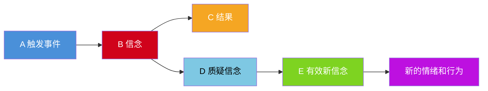
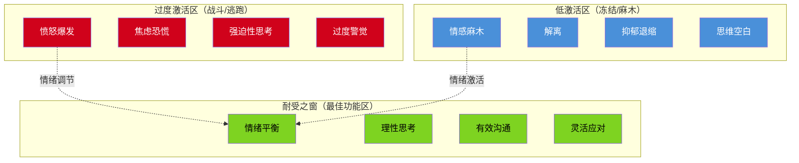
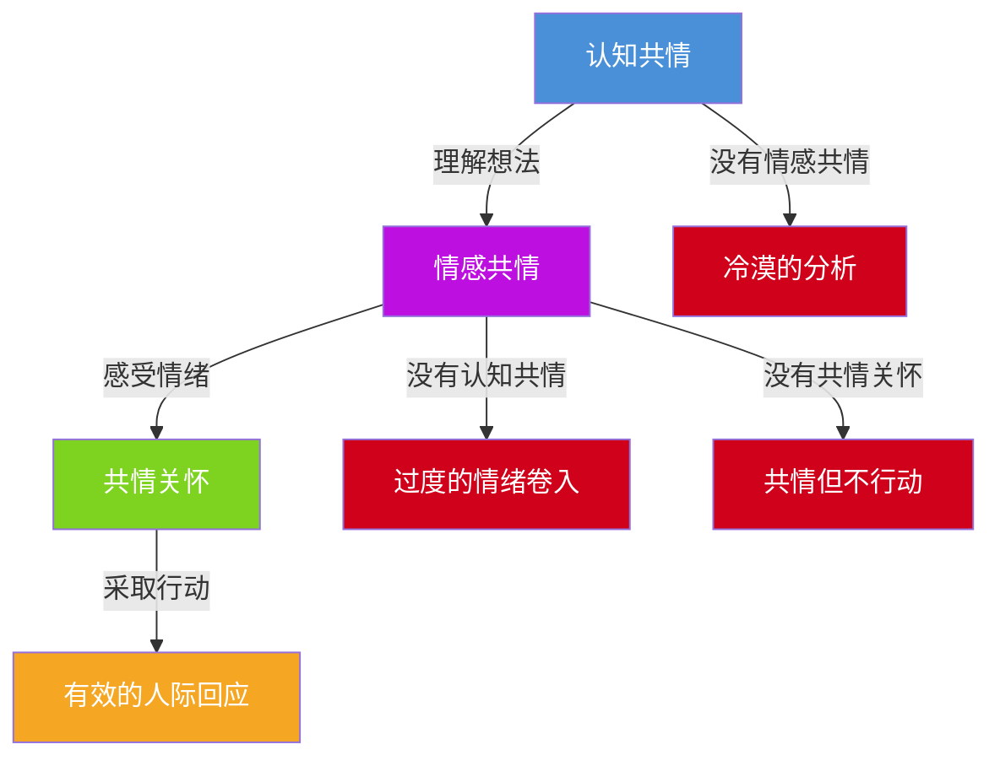
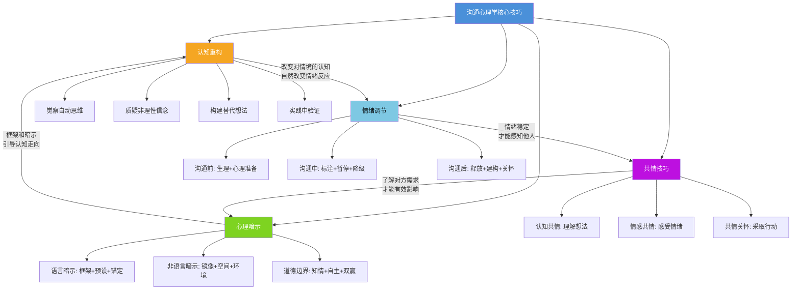
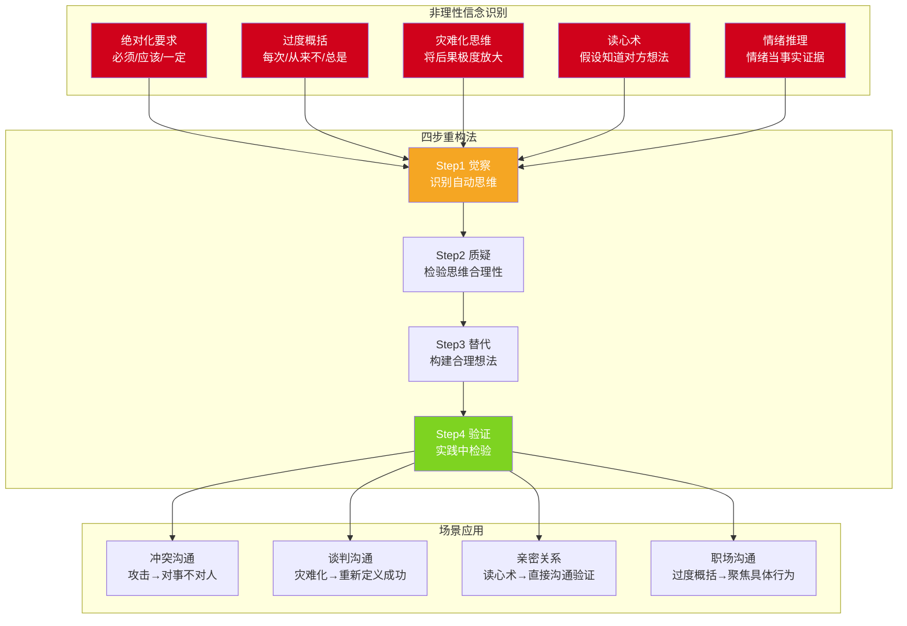

# 沟通心理学的核心技巧

## 引言

理论的价值在于指导实践。在理解了沟通心理学的四大理论基础之后，我们需要掌握一套可操作的核心技巧，将心理学知识转化为沟通能力。本章聚焦四个核心技巧：**认知重构**、**情绪调节**、**共情技巧**和**心理暗示**。这四个技巧分别对应沟通中的四个关键环节——如何改变思维方式（认知重构）、如何管理情绪状态（情绪调节）、如何理解他人感受（共情技巧）、如何影响对方心理（心理暗示）。

四个技巧之间不是简单的并列关系，而是一个层层递进、相互支撑的系统：

掌握这些技巧，不是一朝一夕的事情。每一个技巧都包含"知道"和"做到"两个层面，而从知道到做到之间，隔着反复练习和刻意反思的鸿沟。本章不仅讲解"是什么"和"为什么"，更着力于"怎么做"和"怎么练"。

***

## 一、认知重构

### 1.1 什么是认知重构

认知重构（Cognitive Restructuring）源自认知行为疗法（CBT），由亚伦·贝克（Aaron Beck）和阿尔伯特·埃利斯（Albert Ellis）等人在20世纪60年代发展。其核心理念是：**影响我们情绪和行为的，不是事件本身，而是我们对事件的解释（认知）**。

这一理念并非空洞的哲学思辨，而是经过大量实证研究验证的心理学发现。贝克在治疗抑郁症患者时发现，患者的情绪问题往往根植于一套系统性的认知偏差——他们不是"心情不好"，而是"想错了"。当这些错误的认知被识别和纠正后，情绪问题会显著改善。

在沟通中，认知重构指的是识别和改变那些导致沟通障碍的非理性思维模式，代之以更加合理、灵活的思维方式。

#### ABC模型：认知重构的理论基石

埃利斯的ABC模型是认知重构的核心理论框架：

| 要素 | 英文 | 含义 | 沟通中的示例 |
|------|------|------|-------------|
| **A** | Activating Event | 触发事件 | 同事在会议上公开质疑你的方案 |
| **B** | Belief | 信念/认知 | "他故意让我难堪，他一直看不起我" |
| **C** | Consequence | 结果（情绪+行为） | 愤怒、防御性回应、关系恶化 |

关键洞察：**A（事件）并不直接导致C（结果），而是通过B（信念）这个中介**。同一个事件A，不同的信念B会导出完全不同的结果C：

- 同事质疑方案（A）→ "他在挑战我"（B1）→ 愤怒反击（C1）
- 同事质疑方案（A）→ "他在帮我完善方案"（B2）→ 感谢并深入讨论（C2）
- 同事质疑方案（A）→ "他可能有我没考虑到的角度"（B3）→ 好奇询问（C3）

后来，CBT学者在ABC模型基础上增加了**D（Disputing，质疑）**和**E（Effective new belief，有效新信念）**两个环节，形成完整的ABCDE模型：

### 1.2 沟通中常见的非理性信念

识别非理性信念是认知重构的第一步。以下是沟通中最常见的五类非理性信念，每一类都附有具体表现、识别线索和潜在危害：

#### 绝对化要求

**核心特征**：使用"必须"、"应该"、"一定"等绝对化词汇，将灵活的期望变成僵化的要求。

**典型表现**：
- "他必须理解我的感受"
- "我在这次谈判中必须赢"
- "如果对方不同意我的观点，那说明他不尊重我"
- "领导应该看到我的努力"
- "作为朋友，他一定不能拒绝我的请求"

**识别线索**：注意自己内心独白中是否频繁出现"必须"、"应该"、"一定"、"不能"等词汇。这些词汇一旦出现，往往意味着你正在使用绝对化要求。

**潜在危害**：绝对化要求会让人陷入"非此即彼"的思维陷阱。当现实不符合"必须"时，情绪反应往往是强烈的愤怒或挫败，因为在非理性信念中，违反"必须"是不可接受的。

#### 过度概括

**核心特征**：以偏概全，用单一事件推断出普遍规律。

**典型表现**：
- "他上次就不同意我，这次肯定也会反对"
- "我每次在会议上发言都会搞砸"
- "他从来不听我的意见"
- "这个行业里没有值得信任的人"

**识别线索**：注意"每次"、"从来不"、"总是"、"所有人都"、"没有人"等过度概括的词汇。现实很少是"总是"或"从来不"的。

**潜在危害**：过度概括会导致"习得性无助"——既然"每次都会搞砸"，那还有什么好尝试的？这种思维会让人放弃沟通努力，形成自我实现的预言。

#### 灾难化思维

**核心特征**：将后果极度放大，把可能的困难想象成不可承受的灾难。

**典型表现**：
- "如果我这次谈判失败了，我的职业生涯就完了"
- "如果我表达了不同意见，我们之间的关系就毁了"
- "如果对方发现我不确定，就不会再信任我了"
- "如果这次汇报出错，我就会被开除"

**识别线索**：注意"完了"、"毁了"、"再也无法"等极端化词汇，以及对后果的无限放大。

**潜在危害**：灾难化思维会导致回避行为——因为后果"太可怕了"，所以干脆不去沟通、不去表达、不去争取。长期来看，这会严重限制个人发展和人际关系。

#### 读心术

**核心特征**：在没有证据的情况下，假设自己知道对方的想法和感受。

**典型表现**：
- "他肯定觉得我很蠢"
- "她心里一定在嘲笑我"
- "他不回复消息，一定是生气了"
- "他们一定在背后议论我"

**识别线索**：注意"他肯定"、"她心里一定"、"绝对是"等表达。你不是对方，你不可能确定地知道对方在想什么。

**潜在危害**：读心术是最具破坏性的认知偏差之一。它会让人基于"想象中的对方想法"而非"真实的对方想法"来行动，导致误解、冲突和关系恶化。

#### 情绪推理

**核心特征**：将自己的情绪感受当作事实的证据。

**典型表现**：
- "我感到焦虑，所以这次沟通一定会出问题"
- "我觉得自己不配得到升职，所以不应该争取"
- "我感到对方不喜欢我，所以他一定不喜欢我"
- "我觉得这个方案不好，所以它一定是不好的"

**识别线索**：注意"我觉得……所以……"的句式。情绪是真实的，但情绪所指向的"事实"不一定是真实的。

**潜在危害**：情绪推理会让人陷入"情绪即现实"的陷阱，无法区分主观感受和客观事实，导致决策偏差。

#### 非理性信念综合对照表

| 非理性信念类型 | 关键词信号 | 心理机制 | 在沟通中的典型后果 |
|--------------|----------|---------|----------------|
| 绝对化要求 | 必须、应该、一定、不能 | 将期望僵化为要求 | 愤怒、挫败、对抗性沟通 |
| 过度概括 | 每次、从来不、总是、所有人 | 以偏概全，一概而论 | 习得性无助、放弃沟通 |
| 灾难化思维 | 完了、毁了、再也无法 | 极度放大后果 | 回避沟通、过度防御 |
| 读心术 | 他肯定、她心里一定、绝对是 | 无证据假设他人想法 | 误解、假想敌、关系恶化 |
| 情绪推理 | 我觉得……所以…… | 情绪当事实证据 | 决策偏差、自我设限 |

### 1.3 认知重构的四步法

#### 第一步：觉察——识别自动思维

自动思维（Automatic Thoughts）是贝克理论中的核心概念，指的是在特定情境下自动浮现的、往往未经审视的想法。这些想法出现得非常快，快到我们往往意识不到它们的存在——我们只注意到了它们带来的情绪结果。

**练习方法一：情绪日记**

每天记录至少一次让你产生强烈情绪的沟通事件，按以下格式填写：

| 记录项 | 内容 | 示例 |
|-------|------|------|
| 情境（A） | 发生了什么？ | 领导在周会上当众批评我上周的报告 |
| 自动思维（B） | 我脑海中闪过什么想法？ | "他故意让我在同事面前丢脸"、"他觉得我能力不行" |
| 情绪（C） | 我感受到了什么？强度0-10分 | 愤怒（7分）、羞耻（8分）、委屈（6分） |
| 身体反应 | 身体有什么感受？ | 脸发热、心跳加速、肩膀紧绷 |
| 行为倾向 | 我想做什么？ | 想反驳、想摔门离开、想从此沉默 |

**练习方法二：暂停-回放法**

当感到突然的情绪波动时，立即在内心按"暂停键"，然后在脑海中"回放"刚才发生的事情，重点关注"在情绪出现之前的那一瞬间，我脑子里想了什么"。

**练习方法三：身体扫描**

情绪往往先于意识在身体中显现。学会通过身体感受反推情绪状态：
- 胃部紧缩 → 可能是焦虑或恐惧
- 胸口发闷 → 可能是悲伤或压抑
- 肩膀紧绷 → 可能是压力或防御
- 脸部发热 → 可能是愤怒或羞耻

#### 第二步：质疑——检验思维的合理性

识别出自动思维后，不要急于否定它，而是像一个公正的法官一样，对它进行理性的"交叉检验"。以下是系统性的质疑清单：

**证据检验**：
- 有什么**具体证据**支持这个想法？（注意：情绪不是证据）
- 有什么**具体证据**反对这个想法？
- 如果把这个想法放到法庭上，它能站得住脚吗？

**视角转换**：
- 如果我的好朋友遇到同样的情况，我会怎么看待他的想法？
- 如果一个客观的第三方听到这个想法，他会怎么评价？
- 五年后回看这件事，我还会这么想吗？

**偏差检测**：
- 这个想法是否犯了某种认知偏差？（对照1.2节的五类偏差）
- 我是否在没有证据的情况下假设了对方的想法？（读心术）
- 我是否在将后果无限放大？（灾难化）

**可能性评估**：
- 最坏的情况是什么？发生的概率有多大？
- 最好的情况是什么？
- 最可能的情况是什么？
- 即使最坏的情况发生，我能应对吗？

#### 第三步：替代——构建更合理的想法

在质疑之后，尝试构建更加平衡、合理的替代想法。**关键原则：替代想法不是"盲目乐观"，而是基于证据的、更加全面的评估。**好的替代想法应该满足以下标准：

1. **基于证据**：有事实支撑，而非空洞的自我安慰
2. **更加灵活**：包含多种可能性，而非非此即彼
3. **具有建设性**：指向解决问题的方向，而非停留在自我否定

**具体示例对照表**：

| 非理性想法 | 替代想法 | 替代想法的依据 |
|-----------|---------|--------------|
| "他不同意我的方案，说明他不尊重我" | "他可能从不同角度看这个问题，我需要了解他的具体顾虑" | 不同意≠不尊重，每个人有不同的视角和信息 |
| "如果我在会议上说错话，大家都会看不起我" | "每个人在会议上都可能说错话，说错了可以纠正" | 观察同事的经历，说错话并没有导致被"看不起" |
| "领导批评我，说明我能力不行" | "领导批评的是这次报告的具体问题，不是我整个人" | 之前的报告得到了认可，说明能力没问题 |
| "他不回复消息，一定是不想理我" | "他可能在忙，或者看到了忘了回复" | 我自己也经常延迟回复，并非因为不想理对方 |
| "这次谈判失败了，一切都完了" | "谈判失败是一次挫折，我可以从中学习，寻找新的机会" | 很多成功的商业案例都经历过谈判失败 |

#### 第四步：验证——在实践中检验

将替代想法付诸实践，观察实际结果是否符合预期。这一步至关重要，因为只有通过实践验证，新的认知模式才能真正取代旧的非理性信念。

**验证方法**：
- **行为实验**：带着新的想法去行动，记录实际结果。例如，如果你的旧信念是"表达不同意见会被讨厌"，那就尝试在下次会议上温和地表达不同意见，观察实际反应。
- **数据积累**：连续记录多次验证的结果，用数据而非个案来检验信念。
- **模式识别**：当你积累了足够的验证数据后，识别新旧信念各自的有效性——你会发现，新的理性信念在预测现实方面远比旧的非理性信念准确。

### 1.4 认知重构在不同沟通场景中的应用

#### 冲突沟通

当感到被攻击或不被尊重时：

1. **觉察防御性思维**："他在攻击我"、"他看不起我"
2. **质疑**：他是在攻击我这个人，还是在反对这个观点？他语气激烈是因为针对我，还是因为他对事情本身感到沮丧？
3. **替代**："他可能对事情感到沮丧，而非针对我个人。我可以先理解他的感受，再讨论具体问题"
4. **行为**：用"我注意到你对这个方案有很强的感受，能具体说说你的顾虑吗？"替代"你为什么攻击我？"

#### 谈判沟通

当感到焦虑或压力时：

1. **觉察灾难化思维**："如果我让步，我就输了"、"如果达不成协议，我的业绩就完了"
2. **质疑**：谈判的本质是什么？让步一定等于失败吗？达不成协议比达成一个不理想的协议更糟糕吗？
3. **替代**："好的谈判是双方都满意的协议，而非一方的绝对胜利。适当让步可以换取对方的信任和长期合作"
4. **行为**：在谈判中主动提出一些小让步，观察对方的回应，验证"合作性谈判"的效果

#### 亲密关系沟通

当伴侣没有及时回复消息时：

1. **觉察读心术思维**："他不在乎我"、"她故意冷落我"
2. **质疑**：我有什么证据证明他不在乎？除了"不在乎"，还有哪些可能的解释？
3. **替代**："他可能在忙，或者看到了忘了回复。我可以在合适的时候直接询问"
4. **行为**：直接而温和地沟通——"我发了消息你没回，我有点担心，一切都好吗？"用事实替代猜测

#### 职场沟通

当领导提出批评时：

1. **觉察过度概括思维**："我什么都做不好"、"领导对我很失望"
2. **质疑**：领导批评的是我的整体能力，还是这次具体的工作？我有哪些做得好的方面？
3. **替代**："这次报告的数据分析部分需要加强，但整体框架是得到认可的。我可以针对性地改进"
4. **行为**：主动向领导确认改进方向——"您提到数据分析需要加强，具体是哪些方面？我可以怎么改进？"

### 1.5 认知重构的常见误区与纠正

**误区一：认知重构等于"想开点"**

很多人误解认知重构为简单的"别想太多"或"往好处想"。事实上，认知重构不是压抑负面想法或强迫自己乐观，而是通过**理性的证据检验**来评估想法的合理性。替代想法必须基于证据，否则它只是另一种非理性信念。

**误区二：只做一次就够了**

认知重构是一种需要反复练习的思维习惯。旧的非理性信念经过多年的重复已经根深蒂固，不可能通过一次"想通了"就彻底改变。研究表明，形成一个新的思维习惯通常需要持续练习8-12周。

**误区三：否定所有负面想法**

并非所有负面想法都是非理性的。如果你的方案确实有缺陷，对方提出批评是合理的；如果你的行为确实伤害了他人，感到内疚是正常的。认知重构的目标不是消除所有负面情绪，而是确保情绪反应与实际情况相匹配。

**误区四：只关注思维，不关注行为**

认知重构的最终目的是改变行为模式，而非仅仅改变想法。如果新的想法没有转化为新的行动，那认知重构只完成了一半。每一个替代想法都应该对应一个具体的、可执行的行为改变。

***

## 二、情绪调节

### 2.1 情绪调节的理论框架

#### 格罗斯的情绪调节过程模型

詹姆斯·格罗斯（James Gross）提出的情绪调节过程模型是目前最有影响力的情绪调节理论。该模型将情绪调节分为五个阶段，每个阶段对应不同的调节策略：

| 阶段 | 策略 | 具体方法 | 沟通中的示例 | 调节效果 |
|------|------|---------|-------------|---------|
| 1. 情境选择 | 主动选择进入或回避某些情境 | 避开容易触发情绪的话题或场合 | 在精力充沛时安排重要沟通 | ★★★★★ |
| 2. 情境修改 | 改变所处情境的某些方面 | 调整沟通的时间、地点、方式 | 将一对一会谈改到安静的咖啡厅 | ★★★★ |
| 3. 注意分配 | 将注意力从情绪刺激上转移 | 聚焦于对方的核心诉求而非攻击性措辞 | 关注"他想要什么"而非"他怎么说的" | ★★★ |
| 4. 认知改变 | 改变对情境的认知评价 | 运用认知重构 | 将批评视为改进建议而非人身攻击 | ★★★★ |
| 5. 反应调节 | 调节情绪的表达和体验 | 压抑表达、深呼吸、表情管理 | 即使愤怒也保持平静的语调 | ★★ |

研究表明，**早期调节策略**（如情境选择和认知改变）通常比**晚期策略**（如反应抑制）更有效，且心理代价更低。长期使用反应抑制策略会导致更高的焦虑水平和更低的社交满意度。

#### 耐受之窗模型

丹尼尔·西格尔（Daniel Siegel）提出的"耐受之窗"（Window of Tolerance）模型是理解情绪调节的另一个重要框架：

每个人都有一个"耐受之窗"——在这个范围内，我们能够理性思考、有效沟通、灵活应对。当情绪过于强烈时，我们会进入"过度激活区"（战斗或逃跑反应）；当情绪过于压抑时，我们会进入"低激活区"（冻结或麻木反应）。

情绪调节的核心目标不是"消除情绪"，而是**扩大耐受之窗**，使我们在更大范围的情绪刺激下仍能保持最佳功能状态。长期的正念练习、身体锻炼和安全的人际关系都有助于扩大耐受之窗。

### 2.2 沟通前的情绪准备

#### 生理调节技术

**4-7-8呼吸法**：

这是哈佛大学安德鲁·韦尔（Andrew Weil）推广的呼吸技术，能够快速激活副交感神经系统，降低心率和焦虑水平。原理是：延长呼气时间会刺激迷走神经，触发"休息和消化"反应。

- 吸气4秒（用鼻子）
- 屏息7秒
- 呼气8秒（用嘴巴，发出"呼"的声音）
- 重复3-5个循环

**适用场景**：重要演讲前、谈判开始前、冲突对话前。

**注意**：初次练习时可能会感到轻微头晕，这是因为身体还不习惯这种呼吸节奏。建议先在平静状态下练习，熟练后再在压力场景中使用。

**渐进式肌肉放松（PMR）**：

由埃德蒙·雅各布森（Edmund Jacobson）在1938年提出，原理是：肌肉紧张和焦虑是相互强化的——焦虑导致肌肉紧张，肌肉紧张又加剧焦虑。通过有意识地放松肌肉，可以打破这个循环。

操作步骤：
1. 找一个安静的地方坐下，闭上眼睛
2. 从脚趾开始，紧绷肌肉5秒，然后彻底放松10秒
3. 按照以下顺序依次进行：脚趾→小腿→大腿→腹部→胸部→双手→前臂→上臂→肩膀→颈部→面部
4. 整个过程约15-20分钟

**快速版**（3分钟）：只做肩膀、双手和面部三个部位——这三个部位在沟通中最容易积累紧张。

**冷水刺激（潜水反射）**：

用冷水洗脸或握住冰块，可以激活哺乳动物潜水反射（Mammalian Dive Reflex），在30秒内心率降低10%-25%。这是人体最快速的生理镇静机制之一。

- 用冰水浸湿毛巾，敷在眼眶和面颊部位（三叉神经分布区域）约30秒
- 或者握住冰块，专注于冰块的冰冷感
- 适用于极度焦虑、即将失控的紧急情况

#### 心理准备技术

**预演想象**：

在脑中预演即将到来的沟通场景，想象自己以冷静、自信的状态进行对话。有效的预演想象需要满足三个条件：
- **具体性**：想象具体的场景细节——在哪里、对方的表情、自己的姿态
- **多感官**：包含视觉（看到对方的表情）、听觉（听到自己的声音）、身体感受（感受到自己的放松）
- **过程导向**：不仅想象成功的结果，还想象面对困难时的应对方式

研究表明，"过程想象"（想象应对困难的过程）比"结果想象"（只想象成功的结果）在减少焦虑方面更有效（Taylor et al., 1998）。

**意图设定**：

在沟通前明确自己的意图——"我希望通过这次沟通达成什么？我希望以什么方式表达？"将注意力从焦虑（"万一出错怎么办"）转移到目标（"我要达成什么"）。

具体操作：在沟通前花2分钟，写下以下三个问题的答案：
1. 这次沟通的核心目标是什么？
2. 我希望对方在这次沟通后有什么感受？
3. 如果遇到意外情况，我的底线是什么？

**最坏情况预演（恐惧设定）**：

蒂姆·费里斯（Tim Ferriss）推广的"恐惧设定"（Fear Setting）练习：
1. 写下你最害怕发生的情况
2. 评估每种情况发生的概率（0-100%）
3. 写下如果最坏情况真的发生，你可以采取的补救措施
4. 评估如果你什么都不做，长期后果是什么

当我们知道自己"能够应对最坏情况"时，焦虑感会显著降低。很多时候，最坏情况并没有我们想象的那么可怕，而我们的应对能力也比我们以为的更强。

### 2.3 沟通中的情绪管理

#### 觉察与标注

神经科学研究表明，当我们为情绪命名时（"我现在感到焦虑"），杏仁核（负责情绪反应的脑区）的活动会降低，前额叶皮层（负责理性思考的脑区）的活动会增加。这被称为"情感标注"（Affect Labeling）效应（Lieberman et al., 2007）。

**操作要点**：
- 使用精确的情绪词汇，而非笼统的表述。"我感到被忽视了"比"我不开心"更有效——越精确，前额叶激活越强
- 使用第三人称视角可以增强效果。"小明现在感到焦虑"比"我感到焦虑"更能拉开心理距离（Kross et al., 2014）
- 不需要说出来，内心默念即可生效

**常用情绪词汇表**（由弱到强排列）：

| 情绪类别 | 轻度 | 中度 | 强烈 |
|---------|------|------|------|
| 愤怒 | 不满、烦闷 | 恼怒、生气 | 愤怒、暴怒 |
| 恐惧 | 不安、担心 | 害怕、紧张 | 恐慌、恐惧 |
| 悲伤 | 失落、惆怅 | 难过、伤心 | 悲痛、绝望 |
| 羞耻 | 尴尬、不好意思 | 羞愧、难为情 | 屈辱、无地自容 |
| 厌恶 | 反感、不悦 | 厌烦、排斥 | 厌恶、憎恨 |

#### 策略性暂停

当感到情绪即将失控时，策略性暂停是最实用的工具。关键在于：**暂停不是逃避，而是为了更好地回来**。

**语言信号**：
- "这个问题很重要，让我想一想再回答"
- "我需要几秒钟整理一下思路"
- "你说的这个点很有价值，我想确认一下我理解了"
- "我能否先确认一下我的理解是否正确？"

**物理动作**：
- 喝一口水（同时给自己3-5秒的缓冲时间）
- 调整坐姿（身体动作可以重置心理状态）
- 看一眼笔记（将注意力从情绪转移到信息）
- 翻开笔记本准备记录（暗示"我在认真对待"）

**内部策略**：
- 默数10秒（简单但有效）
- 做一次深呼吸（激活副交感神经）
- 默念"这只是情绪，不是事实"（认知解离）
- 将注意力转移到脚底的感觉（接地技术）

#### 情绪降级

当对方情绪激动时，你的首要任务不是"解决问题"，而是"降低情绪温度"。因为当一个人处于情绪激动状态时，他的前额叶皮层活动降低，理性思考能力大幅下降——此时任何道理都说不进去。

**情绪降级的三个层次**：

| 层次 | 策略 | 具体话术 | 心理机制 |
|------|------|---------|---------|
| 1. 承认情绪 | 验证对方的感受 | "我理解你现在感到很沮丧"、"你的感受完全可以理解" | 情绪被承认后，强度会自然降低 |
| 2. 降低威胁 | 减少对方的防御感 | "我不是要批评你，而是想一起找到解决方案"、"我们是一个团队" | 降低对方的战斗/逃跑反应 |
| 3. 给予控制感 | 让对方感到被尊重 | "你觉得我们应该怎么处理这个问题？"、"你希望从哪里开始？" | 失去控制感是焦虑的核心来源 |

**绝对避免的做法**：
- ❌ "你冷静一下"（只会火上浇油）
- ❌ "你这样说不合理"（否定感受）
- ❌ "你看看你自己的问题"（转移攻击）
- ❌ "每个人都会遇到这种事"（轻视感受）

### 2.4 沟通后的情绪恢复

#### 情绪释放

沟通结束后，残留的情绪需要有意识地释放，否则会积累成慢性压力。

**运动释放**：有氧运动能有效释放压力激素（皮质醇），促进内啡肽和血清素分泌。20-30分钟的中等强度运动（快走、慢跑、游泳）就能产生显著的情绪改善效果。即使是10分钟的散步也比坐着不动有效。

**书写释放**：将沟通中的情绪体验写下来。詹姆斯·潘尼贝克（James Pennebaker）的研究发现，连续4天每天写15分钟的"情绪日记"，可以显著改善情绪状态和身体健康指标。书写时不需要在意文笔，关键是让情绪通过文字流淌出来。

**倾诉释放**：向信任的人倾诉。有效的倾诉需要注意：
- 选择合适的对象（能够倾听而非急于给建议的人）
- 明确你需要的是什么（是倾听、建议，还是陪伴？）
- 控制倾诉的时间和频率，避免陷入反刍思维

#### 意义建构

在情绪平静后（通常需要至少20分钟），对沟通事件进行意义建构。意义建构不是"找借口"或"合理化"，而是从经历中提取学习价值。

三个核心问题：
1. "这次经历教会了我什么？"——聚焦学习，而非自责
2. "下次遇到类似情况，我可以怎么做？"——聚焦改进，而非后悔
3. "我从对方的角度怎么看这件事？"——聚焦理解，而非对错

#### 自我关怀

克里斯汀·内夫（Kristin Neff）提出的自我关怀（Self-Compassion）是沟通后情绪恢复的重要工具。自我关怀不是自我放纵，而是在困难时刻以善意对待自己。

自我关怀包含三个核心要素：

| 要素 | 含义 | 具体做法 |
|------|------|---------|
| 自我善意 | 以善意对待自己的不完美 | 把自己当作好朋友——你会对朋友说"你怎么这么蠢"吗？用同样温和的语气对自己说话 |
| 共同人性 | 认识到犯错和困难是人类共同经验 | "每个人在沟通中都会犯错，这是人类的共同经历" |
| 正念 | 以平衡的方式觉察当下 | 既不压抑情绪（"我没事"），也不放大情绪（"完了完了"），而是承认"我现在很难受，这没关系" |

**自我关怀的即兴练习**（3分钟版）：
1. 把手放在心口，感受手掌的温度
2. 对自己说："这是一个困难的时刻"
3. 对自己说："困难的时刻是人生的一部分，每个人都会经历"
4. 对自己说："愿我善待自己，给自己所需要的理解和耐心"

***

## 三、共情技巧

### 3.1 共情的本质

共情（Empathy）是理解他人心理状态并做出适当回应的能力。共情不等于同情（Sympathy）——这是一个至关重要的区分。

| 维度 | 共情（Empathy） | 同情（Sympathy） |
|------|----------------|-----------------|
| 心理位置 | 站在对方的角度（"我感受到你的感受"） | 站在自己的角度观察对方（"我看到了你的困难"） |
| 情感距离 | 近——与对方"在一起" | 远——对对方"表示遗憾" |
| 典型表达 | "我能理解你现在的感受" | "我很遗憾你遇到了这件事" |
| 效果 | 让对方感到被理解、不孤独 | 让对方感到被关心，但仍孤独 |
| 隐含信息 | "你的感受是合理的，我在这里" | "你的处境很糟糕，我很同情你" |

卡尔·罗杰斯将共情定义为："感知他人的内心世界，如同感知自己的内心世界，但从未失去'如同'的品质。"这意味着共情是"感同身受"而非"融为一体"——我们需要理解对方的感受，但不需要与对方融为一体（那是过度共情，后面会讨论）。

#### 共情的神经科学基础

神经科学研究发现了"镜像神经元"（Mirror Neurons）系统。1992年，意大利帕尔马大学的研究者在研究猕猴的运动前皮层时偶然发现：当猕猴观察其他个体执行某个动作时，它大脑中与执行该动作相同的神经元会被激活——仿佛它自己在执行同样的动作。

后续研究将这一发现扩展到情绪领域：当我们观察他人的痛苦时，我们大脑中与自身痛苦相关的脑区（前脑岛和前扣带皮层）也会被激活。这被认为是共情的神经基础之一。

然而，镜像神经元只是共情的"硬件基础"之一。完整的共情还需要：
- **心理理论**（Theory of Mind）：理解他人有独立于自己的想法和感受
- **情绪调节能力**：在感受他人情绪的同时不被淹没
- **认知灵活性**：能够从多个角度理解同一件事

### 3.2 共情的三个层次

共情不是单一的能力，而是由三个相互关联但可以独立发展的层次构成：

#### 认知共情（Cognitive Empathy）

**定义**：理解他人的想法和观点。这是"头脑层面"的共情——我知道你在想什么，我理解你的逻辑。

**核心能力**：观点采择（Perspective Taking）——能够从对方的立场、背景、经历出发，理解他们的思维方式。

**示例**：
- "你选择保守的投资方案，是因为你更看重安全感，这完全合理"
- "从你的角度，这个决定确实不容易——你既要考虑家庭，又要考虑职业发展"

**如何提升**：
- 在做判断之前，先花30秒想象"如果我是他，考虑到他的经历和处境，我会怎么想？"
- 阅读小说——研究表明，经常阅读文学小说的人在心理理论测试中表现更好（Kidd & Castano, 2013）
- 与不同背景的人交流，扩展自己的"认知地图"

#### 情感共情（Emotional Empathy）

**定义**：感受到他人的情绪。这是"心灵层面"的共情——我能感受到你的快乐或痛苦。

**核心能力**：情绪共鸣——在与他人互动时，自己的情绪状态与对方的情绪状态产生共振。

**示例**：
- 朋友分享好消息时，你也感到由衷的高兴
- 伴侣感到悲伤时，你也感到心中一紧

**如何提升**：
- 练习"身体共情"——注意观察对方的面部表情、身体姿态、语调变化，并允许自己的身体对这些信号产生反应
- 减少"分析"模式，增加"感受"模式——有时候，不需要理解"为什么"，只需要感受"是什么"
- 注意自己的情绪状态——只有能够感知自己情绪的人，才能感知他人的情绪

#### 共情关怀（Empathic Concern）

**定义**：基于对他人感受的理解而产生的关心和帮助意愿。这是"行动层面"的共情——我不仅理解你的感受，还想要帮助你。

**核心能力**：将理解转化为行动——不是停留在"我理解你"的层面，而是进一步"我能为你做什么？"

**示例**：
- 不仅理解同事的压力，还主动提出帮忙分担任务
- 不仅感受到朋友的孤独，还主动安排聚会
- 不仅理解客户的困境，还主动提供额外的解决方案

**三个层次的关系**：

### 3.3 共情倾听的技巧

共情倾听是共情在沟通中最直接的应用。与普通倾听不同，共情倾听的目标不是"获取信息"，而是"理解对方的内心世界"。

#### 全身心投入

全身心投入是共情倾听的基础。如果你的身体在听但心思在别处，对方一定能感觉到。

- 放下手机，屏幕朝下放在桌上——这个简单的动作本身就是一个强烈的信号
- 保持适当的目光接触（约60%-70%的时间）。100%的目光接触会显得具有压迫感，低于40%会显得心不在焉
- 身体微微前倾，面向对方——这个姿态在潜意识层面传达"我对你感兴趣"
- 使用点头、"嗯"、"我明白了"等简短回应表示在听——这不是打断，而是"陪伴性反馈"
- 避免同时做其他事情（看电脑、翻文件），除非沟通非常简短和非正式

#### 反射式回应

反射式回应（Reflective Listening）是卡尔·罗杰斯发展出的核心共情技术。它的作用是：让对方知道你真正听到了他说的内容，同时确认你理解的准确性。

**基本句式**：
- "如果我理解正确的话，你觉得……"
- "你的意思是……对吗？"
- "听起来你是在说……"
- "所以对你来说，最重要的是……"

**高级技巧**：
- 不要逐字复述，而是提炼核心意思——"所以你的核心顾虑是……"
- 在反射时可以适当"升级"——将对方模糊的感受用更精确的词汇表达出来。对方说"我觉得不太舒服"，你可以说"听起来你感到有些被忽视了？"
- 如果不确定，直接询问——"我理解得对吗？还是你有其他的意思？"

#### 情感标注

情感标注（Emotion Labeling）是比反射式回应更深入一层的技术。它不仅复述内容，还识别并命名对方的情绪，让对方感到被深度理解。

**核心句式**：
- "听起来你对这件事感到很失望"
- "我能感受到你现在很焦虑"
- "你似乎对此感到既兴奋又有些不安"
- "这件事对你来说一定很不容易"

**情感标注的进阶技巧**：

| 层次 | 句式 | 效果 |
|------|------|------|
| 基础标注 | "你看起来很生气" | 让对方知道你注意到了他的情绪 |
| 进阶标注 | "你看起来很生气，因为你觉得自己被不公平对待了" | 连接情绪和原因，展现深度理解 |
| 高级标注 | "你看起来很生气——一方面是因为这次的事不公平，另一方面可能也因为你之前已经忍了很久" | 揭示对方可能尚未意识到的深层情绪 |

#### 深层倾听

深层倾听是共情倾听的最高层次——不只听表面的文字，还要听背后的需求、恐惧和渴望。

**三个层次的信息**：

| 层次 | 示例 | 含义 |
|------|------|------|
| 表面信息 | "这个项目太难了" | 对方说出来的话 |
| 深层需求 | "我需要支持和资源" | 对方真正想要的 |
| 深层恐惧 | "我害怕失败，害怕让人失望" | 对方真正害怕的 |

**如何练习深层倾听**：
1. 听完对方的话后，先不要急着回应，停顿2秒
2. 问自己："他说的是什么？他想要什么？他害怕什么？"
3. 用试探性的语言回应深层需求："你是不是在想，如果有人能帮你分担一部分，情况会好很多？"

#### 开放式提问

开放式问题是无法用"是/否"回答的问题，它邀请对方展开叙述，而非限制对方的回答。

**有效的问题**：
- "你能多告诉我一些吗？"——邀请更多细节
- "这件事对你来说意味着什么？"——探索深层意义
- "你当时是什么感受？"——引导情感表达
- "你觉得什么对你来说是最重要的？"——识别核心价值
- "你理想中的结果是什么样的？"——探索期望

**应避免的问题**：
- ❌ "你是不是很生气？"（封闭式问题，限制回答）
- ❌ "你为什么不直接跟他说？"（暗示对方的做法不对）
- ❌ "你有没有想过可能是你自己的问题？"（带有评判色彩）

### 3.4 共情表达的技巧

共情不仅要"听"，还要"表达"。有效的共情表达能让对方真正感到被理解。

#### 确认感受

确认感受是共情表达的基础——告诉对方，他的感受是合理的、可以理解的。

**核心表达**：
- "你的感受完全可以理解"
- "换做是我，我也会有同样的感受"
- "你有这样的感受是正常的"
- "任何人处在你的位置，都会有类似的感受"

**重要原则**：确认感受≠认同观点。你可以确认对方"感到愤怒"是合理的，同时不认同他"因为愤怒而采取的行动"是正确的。"我理解你很生气，这样的感受完全可以理解"——这是确认感受。"你生气了所以摔东西是对的"——这不是共情，这是纵容。

#### 分享类似经历

分享类似经历可以让对方感到"不孤独"——"原来你也经历过类似的事情"。

**正确做法**：
- 简短分享，重点是表达理解，而非详细叙述自己的故事
- 分享后立即将焦点转回对方："我之前也遇到过类似的情况，那种不安的感觉我理解。你现在最需要的是什么？"

**错误做法**：
- ❌ 长篇大论地讲述自己的经历，把话题从对方身上转移到自己身上
- ❌ 用"我比你更惨"来否定对方的感受
- ❌ 在对方情绪激动时急着分享经历（此时对方需要的是被倾听）

#### 表达关心

- "我很在意你的感受"
- "你愿意和我分享这件事，我很感激"
- "无论发生什么，我都在这里"
- "你需要什么支持，尽管告诉我"

### 3.5 共情的边界与陷阱

共情虽然重要，但也需要注意边界和陷阱。

#### 共情疲劳

长期高强度的共情会导致情感耗竭（Empathy Fatigue），也被称为"共情倦怠"或"替代性创伤"。特别是在助人行业（心理咨询、医护、社工、教师），共情疲劳是一个严重的职业风险。

**共情疲劳的信号**：
- 对他人的痛苦变得麻木或不耐烦
- 回避与他人的深入交流
- 感到情感被"掏空"
- 出现失眠、头痛、消化问题等身体症状

**预防措施**：
- 建立清晰的工作-生活边界
- 定期进行自我关怀活动
- 与同事或督导讨论工作中的情感体验
- 必要时寻求专业支持

#### 共情偏见

人们更容易对与自己相似的人产生共情（内群体偏见），而对"外群体"成员的共情较弱。研究表明，仅仅是一个随机分组标签（如"蓝队"和"红队"）就足以影响人们的共情水平。

**应对策略**：
- 意识到这一偏见的存在
- 有意识地寻找与不同背景的人的共同点
- 当发现自己对某人的共情较弱时，问自己："如果他是我最好的朋友，我会怎么回应？"

#### 过度共情

过度共情是指将他人的问题当作自己的问题，或者为了避免他人的痛苦而放弃自己的需求。过度共情者往往是"给予者"，他们不断地给予关怀和支持，却忽略了自己的需求。

**过度共情的信号**：
- 感到必须"修复"对方的问题
- 对方的痛苦让你无法正常生活
- 为了避免让对方不开心，放弃自己的需求和边界
- 感到对他人的情绪"负有责任"

**应对策略**：
- 记住：你可以理解对方的感受，但不需要为对方的感受负责
- 设定清晰的边界——"我关心你，但我也需要照顾好自己"
- 区分"共情"和"拯救"——共情是"我理解你的痛苦"，拯救是"我要替你消除痛苦"

#### 假性共情

机械地使用共情话术（"我理解你的感受"、"我能体会你的痛苦"）而缺乏真诚的理解，就是假性共情。假性共情不仅无效，还会损害信任——对方能感觉到你是在"使用技巧"而非"真心理解"。

**如何避免假性共情**：
- 先真正倾听，再回应——不要在对方还没说完时就准备好你的"共情话术"
- 如果你真的不理解，诚实地说"我可能无法完全理解你的感受，但我很想了解"
- 共情不是说什么，而是带着什么样的心态去听

### 3.6 跨文化共情

在全球化的工作和生活环境中，跨文化共情变得越来越重要。不同文化对情绪表达、沟通方式和个人空间有不同的规范，忽视这些差异会导致共情失败。

**关键差异维度**：

| 维度 | 高语境文化（如中国、日本） | 低语境文化（如美国、德国） |
|------|--------------------------|--------------------------|
| 情绪表达 | 含蓄、内敛，通过暗示表达 | 直接、外显，明确说出来 |
| 需求表达 | 期望对方"读懂"自己的需求 | 习惯直接说出自己的需求 |
| 冲突处理 | 避免直接对抗，维护面子 | 直面冲突，解决问题优先 |
| 共情表达 | 通过行动表达关心 | 通过语言表达理解 |

**跨文化共情的关键原则**：
1. 不要假设对方的沟通方式与你相同
2. 当不确定时，用温和的方式询问："在这个情况下，你希望我怎么做？"
3. 尊重对方的情感表达方式——含蓄不等于没有情感，直接不等于粗鲁
4. 学习对方文化中表达关心的方式

***

## 四、心理暗示

### 4.1 心理暗示的原理

心理暗示（Psychological Suggestion）是指通过语言、行为或环境影响他人的思维、情感和行为。在沟通中，心理暗示是一种强大的影响力工具——但需要以道德和负责任的方式使用。

心理暗示的原理基于以下心理机制：

#### 启动效应（Priming）

先前接触的刺激会影响后续的思维和行为，且这一过程大多是无意识的。例如：
- 在沟通开始前提及"合作"、"共赢"等概念，会启动对方的合作心态
- 在提出请求之前先表达感谢，会让对方更倾向于帮忙（因为你启动了对方的"善意"）
- 在谈判中先提及"公平"，会让双方更倾向于寻找公平的解决方案

#### 期望效应（Expectancy Effect）

我们对他人的期望会影响对方的表现，这就是著名的皮格马利翁效应/罗森塔尔效应。罗森塔尔和雅各布森在1968年的经典研究发现：当教师被告知某些学生（实际上是随机选择的）"有巨大的学习潜力"时，这些学生在学年结束时确实表现出了更大的进步——因为教师对他们的期望改变了教师的行为，进而改变了学生的表现。

在沟通中，如果你真诚地相信对方能够理解、能够合作、能够做出好的决定，你的语气、表情和措辞都会传达这种信任，而对方更有可能真的做到。

#### 自我实现预言

我们对情境的预期会影响我们的行为，进而使预期成为现实。在沟通中：
- 如果你预期对方会拒绝你的提议，你的语气可能变得防御性或不确定，反而增加了被拒绝的可能性
- 如果你预期沟通会失败，你可能减少投入，导致沟通真的失败
- 如果你预期对方会友好回应，你的态度更开放、更自信，对方更可能友好回应

### 4.2 语言层面的心理暗示

#### 框架设定（Framing）

同一信息的不同表述会引发不同的反应，这被称为"框架效应"（Kahneman & Tversky, 1984）。

**损失框架 vs 收益框架**：

| 框架类型 | 表述方式 | 心理机制 | 适用场景 |
|---------|---------|---------|---------|
| 损失框架 | "如果不采取行动，我们将损失30%的市场份额" | 损失厌恶——人们对损失的敏感度是收益的2倍 | 需要推动行动、打破惰性时 |
| 收益框架 | "如果采取行动，我们可以增加30%的市场份额" | 收益吸引——人们对获得的期望 | 需要激发热情、建立乐观时 |

**应用要点**：在说服他人采取行动时，损失框架通常更有效；在建立长期关系和信任时，收益框架更合适。

#### 预设性语言（Presupposition）

通过语言结构预设某个前提，引导对方在不知不觉中接受这个前提。

**经典句式**：
- "当你完成这个项目时，你最想先做什么？"——预设对方会完成项目
- "你更倾向于方案A还是方案B？"——预设对方会在两个方案中选择（而非拒绝两者）
- "我们什么时候可以开始合作？"——预设合作会发生（而非讨论是否合作）
- "等你升职之后，你打算如何组建团队？"——预设对方会升职

**使用注意**：预设性语言适用于正向引导，不适用于欺骗性的操控。如果对方识破了预设，可能会产生反感。

#### 锚定技术（Anchoring）

在谈判和协商中，首先提出的数字会成为后续讨论的"锚点"。卡尼曼和特沃斯基的研究表明，即使锚点明显不合理，它仍然会影响最终结果。

**应用策略**：
- 如果你希望最终价格是100元，先提出120元——这会将对方的心理参考点锚定在较高水平
- 如果你想要3天的工期，先说"考虑到复杂度，我觉得5天比较合理"——给对方一个"谈判下来"的空间
- 锚点需要有一定的合理性——过于离谱的锚点会损害你的可信度

#### 隐喻和故事

隐喻和故事能够在潜意识层面影响对方的思维框架。人类的大脑天然对故事敏感——一个好的故事比一堆数据更有说服力。

**有效的隐喻**：
- "我们的团队就像一支交响乐队，每个人都有自己的声部，但需要指挥来协调"——将团队合作框架为"协调配合"
- "这个挑战就像攀登珠峰，虽然困难，但只要我们一步步走，就能到达顶峰"——将困难框架为"可以克服的挑战"
- "现在的状况就像一艘漏水的船，我们需要先补洞，再讨论开往哪里"——将优先级框架为"紧急修复"

### 4.3 非语言层面的心理暗示

#### 镜像效应（Mirroring）

适度模仿对方的身体语言、语速和语调，可以在潜意识层面建立连接感和信任感。这是因为人类天然倾向于信任与自己相似的人。

**具体操作**：
- 对方身体前倾时，你也可以适度前倾
- 对方说话慢时，你也可以适当放慢语速
- 对方用手势强调时，你也可以适当使用手势
- 对方喝水时，你也可以过一会儿喝水

**关键**：模仿需要在3-5秒后"自然地"发生，而非即时的、刻意的模仿。过度模仿会显得不真诚，甚至引起反感。

#### 空间距离

物理距离影响心理距离——这是环境心理学的基本发现。

| 距离范围 | 心理含义 | 沟通应用 |
|---------|---------|---------|
| 0-45cm（亲密距离） | 亲密、信任 | 仅适用于亲密关系 |
| 45-120cm（个人距离） | 友好、舒适 | 日常对话、非正式会议 |
| 120-360cm（社交距离） | 正式、专业 | 商务会议、正式谈判 |
| 360cm以上（公众距离） | 权威、距离感 | 演讲、公开场合 |

**应用策略**：
- 缩短距离（如从桌子对面移到相邻位置）可以增加亲近感
- 增加距离可以创造正式感和权威感
- 在冲突中适当增加距离可以降低对抗感

#### 环境布置

沟通环境的物理特征会潜移默化地影响心理状态：

| 环境因素 | 效果 | 应用建议 |
|---------|------|---------|
| 暖色调（橙、黄、红） | 促进放松和开放 | 适合建立关系、非正式讨论 |
| 冷色调（蓝、灰、白） | 促进专注和理性 | 适合分析问题、正式谈判 |
| 圆形座位安排 | 促进平等和合作 | 适合头脑风暴、团队讨论 |
| 长方形座位（一头一尾） | 强调等级和权力 | 适合正式汇报、权威场合 |
| 并排坐 | 减少对抗感 | 适合敏感话题、冲突化解 |
| 面对面坐 | 增加正式感 | 适合正式讨论、辩论 |

#### 触摸

适当的触摸可以增加信任感和亲密度。研究表明，在餐厅中服务员轻触顾客的手，小费金额会显著增加（Crusco & Masel, 1984）。

**文化差异提醒**：触摸的接受度在不同文化中有巨大差异。在东亚文化中，陌生人之间的身体接触通常较少；在拉丁文化中，触摸更加常见。在跨文化环境中，优先使用不会引起不适的触摸方式（如握手），并观察对方的反应。

### 4.4 心理暗示与影响力原则

罗伯特·西奥迪尼（Robert Cialdini）在《影响力》一书中总结了六大影响力原则，这些原则与心理暗示密切相关：

| 原则 | 核心机制 | 在沟通中的应用 |
|------|---------|--------------|
| 互惠 | 人们倾向于回报他人的善意 | 先给予——分享信息、提供帮助——再提出请求 |
| 承诺与一致 | 人们倾向于保持言行一致 | 先获得小的承诺，再逐步引导到大的请求 |
| 社会认同 | 人们倾向于参照他人的行为 | "大多数客户选择了这个方案"、"业内普遍认为……" |
| 喜好 | 人们更容易被自己喜欢的人说服 | 建立真诚的关系、寻找共同点、给予真诚的赞美 |
| 权威 | 人们倾向于服从权威 | 引用专家观点、展示专业资质、使用专业术语 |
| 稀缺 | 人们更看重稀缺的东西 | "这个机会只有一次"、"名额有限" |

**道德应用要点**：这些原则本身是中性的，关键在于使用目的。如果是为了帮助对方做出符合其利益的决定（如推荐一个真正适合他的产品），这是道德的；如果是为了操控对方做出违背其利益的决定（如诱导对方购买不需要的东西），这是不道德的。

### 4.5 心理暗示的道德边界

心理暗示是一种强大的工具，需要在道德框架内使用。以下是四个核心道德原则：

| 原则 | 含义 | 具体要求 |
|------|------|---------|
| 知情同意 | 对方有权知道并同意 | 不使用欺骗性的暗示技术，确保对方在知情状态下做出选择 |
| 尊重自主 | 对方有自主决定的权利 | 帮助对方做出符合其利益的决定，而非操控对方做出违背其利益的决定 |
| 透明度 | 必要时坦诚分享 | 在适当的时候，可以坦诚分享你的影响力策略，这反而会增加信任 |
| 双赢导向 | 以共同利益为目标 | 心理暗示的使用应以双赢为目标，而非单方面利益最大化 |

**自检清单**（在使用心理暗示前问自己）：
- 如果对方知道我在使用这个策略，他会感到被欺骗吗？
- 这个策略是帮助对方做出更好的决定，还是操控对方做出对我有利的决定？
- 如果角色互换，我希望对方对我使用这个策略吗？

### 4.6 心理暗示的综合应用

#### 建立信任的综合策略

1. **环境层面**：选择舒适、非正式的沟通环境（暖色调、并排坐、适当的音乐）
2. **非语言层面**：保持开放的身体语言，适度镜像对方，控制适当的距离
3. **语言层面**：使用"我们"而非"我"和"你"的对立表述，使用正向框架
4. **认知层面**：先肯定对方的贡献和价值，启动对方的"被认可"需求
5. **行为层面**：先给予（分享信息、提供帮助），触发互惠原则

#### 说服的综合策略

1. 先建立情感连接（故事、共鸣、共同点）
2. 提出逻辑论证（数据、证据、案例）
3. 使用社会证据（"大多数客户选择了……"、"行业数据显示……"）
4. 创造适度的紧迫感（"如果现在不行动……"、"机会窗口有限……"）
5. 提供具体行动步骤（"接下来，我们可以……"、"第一步是……"）

#### 化解冲突的综合策略

1. **空间层面**：从对立位置移到并排位置——并排坐暗示"我们是同一边的"
2. **语言层面**：使用"挑战"替代"问题"，使用"我们"替代"你"——"我们面临的挑战"而非"你的问题"
3. **认知层面**：将冲突框架为"共同面对的挑战"而非"你我的对立"
4. **情感层面**：先确认双方的感受和需求，再讨论解决方案
5. **行为层面**：主动做出小让步，启动互惠和承诺原则

***

## 五、四大技巧的整合运用

### 5.1 技巧之间的协同关系

四大核心技巧不是孤立的工具，而是一个相互支撑的能力系统：

### 5.2 技巧运用的时序模型

在一次完整的沟通中，四大技巧的运用通常遵循以下时序：

| 阶段 | 主要技巧 | 具体任务 | 注意事项 |
|------|---------|---------|---------|
| 沟通前 | 认知重构+情绪调节 | 调整心态、管理焦虑、预演想象、设定意图 | 不要在情绪激动时开始重要沟通 |
| 沟通开始 | 心理暗示+共情 | 设定框架、建立连接、镜像对方、表达关心 | 前3分钟决定了沟通的基调 |
| 沟通进行中 | 共情+认知重构+情绪调节+心理暗示 | 持续倾听、灵活调整、管理情绪升级、适度引导 | 根据情境灵活切换，不要死板套用 |
| 沟通结束 | 共情+心理暗示 | 确认理解、强化积极印象、设定后续行动 | 结束时的印象与开始时的印象同等重要 |
| 沟通后 | 情绪调节+认知重构 | 情绪恢复、意义建构、自我关怀 | 不要跳过这一步——它是学习和成长的关键 |

### 5.3 能力进阶路线

掌握四大核心技巧是一个渐进的过程，可以分为三个阶段：

#### 初级阶段：意识觉醒（1-4周）

**目标**：知道这些技巧的存在，开始觉察自己的思维和情绪模式。

**具体任务**：
- 每天记录一份"情绪日记"（认知重构的基础练习）
- 学习识别五类非理性信念
- 练习4-7-8呼吸法（每天3次，每次3个循环）
- 在日常对话中尝试反射式回应

**里程碑**：能够在情绪出现时识别出"这是自动思维，不是事实"。

#### 中级阶段：刻意练习（1-3个月）

**目标**：在沟通中能够主动使用这些技巧，虽然还不够自然。

**具体任务**：
- 完整运用认知重构四步法处理至少10个沟通场景
- 在重要沟通前进行情绪准备（呼吸+意图设定+预演想象）
- 练习共情倾听的全部五个技巧（全身心投入、反射式回应、情感标注、深层倾听、开放式提问）
- 在安全的场景中练习语言层面的心理暗示

**里程碑**：能够在沟通中"暂停"自动反应，选择更有建设性的回应方式。

#### 高级阶段：自然运用（3个月以上）

**目标**：这些技巧成为你的沟通本能，无需刻意思考就能自然运用。

**具体任务**：
- 在高压场景（冲突、谈判、重要汇报）中灵活运用全部四个技巧
- 能够根据对方的反应实时调整策略
- 发展出自己的沟通风格——融合技巧但不显得"使用技巧"
- 能够指导他人学习这些技巧

**里程碑**：别人感受到的不是"他在使用沟通技巧"，而是"和他沟通很舒服"。

### 5.4 自我评估工具

以下自评量表可以帮助你评估自己在四个技巧上的当前水平。请根据实际情况诚实评分（1=完全不符合，5=完全符合）。

**认知重构**：
1. 当出现强烈负面情绪时，我能识别出背后的自动思维（ ）
2. 我能区分"事实"和"我对事实的解读"（ ）
3. 当陷入非理性信念时，我能够质疑和调整（ ）
4. 我会定期使用情绪日记或其他工具反思自己的思维模式（ ）

**情绪调节**：
5. 在重要沟通前，我会进行情绪准备（呼吸、预演、意图设定）（ ）
6. 当感到情绪即将失控时，我能使用策略性暂停（ ）
7. 当对方情绪激动时，我能保持冷静并使用情绪降级策略（ ）
8. 沟通后，我有情绪释放和恢复的习惯（ ）

**共情技巧**：
9. 我能够准确识别他人的情绪状态（ ）
10. 在倾听时，我能做到全身心投入，不走神（ ）
11. 我能够从对方的角度理解其想法和感受（ ）
12. 我的共情表达是真诚的，而非机械地使用话术（ ）

**心理暗示**：
13. 我能够有意识地设定沟通的框架和基调（ ）
14. 我了解并能运用基本的影响力原则（ ）
15. 我能够在道德框架内使用心理暗示（ ）
16. 我能够综合运用语言和非语言暗示（ ）

**评分解读**：
- 64-80分：高级水平——你已经很好地掌握了沟通心理学的核心技巧
- 48-63分：中级水平——你有良好的基础，需要在特定领域加强练习
- 32-47分：初级水平——你已经意识到了这些技巧的重要性，需要系统性的学习和练习
- 16-31分：入门阶段——这是一个很好的起点，建议从情绪日记和呼吸练习开始

***

## 认知偏差应对图

***

## 本节小结

认知重构帮助我们改变思维方式，从僵化的非理性信念中解放出来——它是所有其他技巧的"操作系统"，因为思维方式决定了我们如何解读每一个沟通情境。情绪调节帮助我们管理情绪状态，在压力下保持冷静和清晰——它是沟通中的"稳定器"，确保我们不会在关键时刻被情绪淹没。共情技巧帮助我们深入理解他人的感受和需求，建立真诚的人际连接——它是沟通中的"桥梁"，连接我们与他人的内心世界。心理暗示帮助我们在尊重对方的前提下，以积极的方式影响沟通走向——它是沟通中的"方向盘"，引导对话朝着建设性的方向前进。

四大技巧相辅相成，共同构成了沟通心理学的核心能力体系。掌握这些技巧，需要理论学习与持续实践的结合——认知重构需要每天的情绪日记练习，情绪调节需要反复的呼吸和放松训练，共情需要在每一次对话中有意识地倾听和回应，心理暗示需要在安全的场景中不断尝试和调整。

没有人能在一夜之间成为沟通大师。但每一次有意识的练习，都在重塑你的神经通路，让新的思维和行为模式变得更加自然。下一章的实战案例将展示这些技巧在具体场景中的应用，帮助你将本章学到的理论转化为可操作的实践能力。

***

## 参考文献

1. Beck, A. T. (1976). *Cognitive Therapy and the Emotional Disorders*. International Universities Press.
2. Ellis, A. (1962). *Reason and Emotion in Psychotherapy*. Lyle Stuart.
3. Gross, J. J. (2015). Emotion regulation: Current status and future prospects. *Psychological Inquiry*, 26(1), 1-26.
4. Rogers, C. R. (1959). A theory of therapy, personality and interpersonal relationships. In S. Koch (Ed.), *Psychology: A Study of a Science* (Vol. 3). McGraw-Hill.
5. Lieberman, M. D., et al. (2007). Putting feelings into words: Affect labeling disrupts amygdala activity in response to affective stimuli. *Psychological Science*, 18(5), 421-428.
6. Kross, E., et al. (2014). Self-talk as a regulatory mechanism: How you do it matters. *Journal of Personality and Social Psychology*, 106(2), 304-324.
7. Neff, K. D. (2011). *Self-Compassion: The Proven Power of Being Kind to Yourself*. William Morrow.
8. Cialdini, R. B. (2006). *Influence: The Psychology of Persuasion* (Revised Edition). Harper Business.
9. Kahneman, D., & Tversky, A. (1984). Choices, values, and frames. *American Psychologist*, 39(4), 341-350.
10. Pennebaker, J. W. (1997). *Opening Up: The Healing Power of Expressing Emotions*. Guilford Press.
11. Rizzolatti, G., & Craighero, L. (2004). The mirror-neuron system. *Annual Review of Neuroscience*, 27, 169-192.
12. Siegel, D. J. (2012). *The Developing Mind: How Relationships and the Brain Interact to Shape Who We Are* (2nd ed.). Guilford Press.
13. Kidd, D. C., & Castano, E. (2013). Reading literary fiction improves theory of mind. *Science*, 342(6156), 377-380.
14. Taylor, S. E., et al. (1998). Harnessing the imagination: Mental simulation, self-regulation, and coping. *American Psychologist*, 53(4), 429-439.
15. Crusco, A. H., & Masel, C. G. (1984). The Midas Touch: The effects of interpersonal touch on restaurant tipping. *Personality and Social Psychology Bulletin*, 10(4), 512-517.
