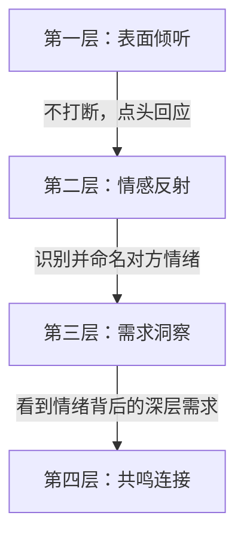
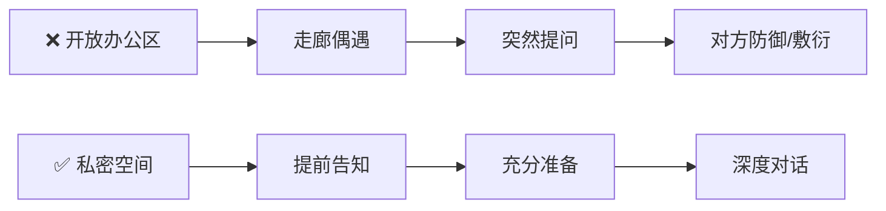
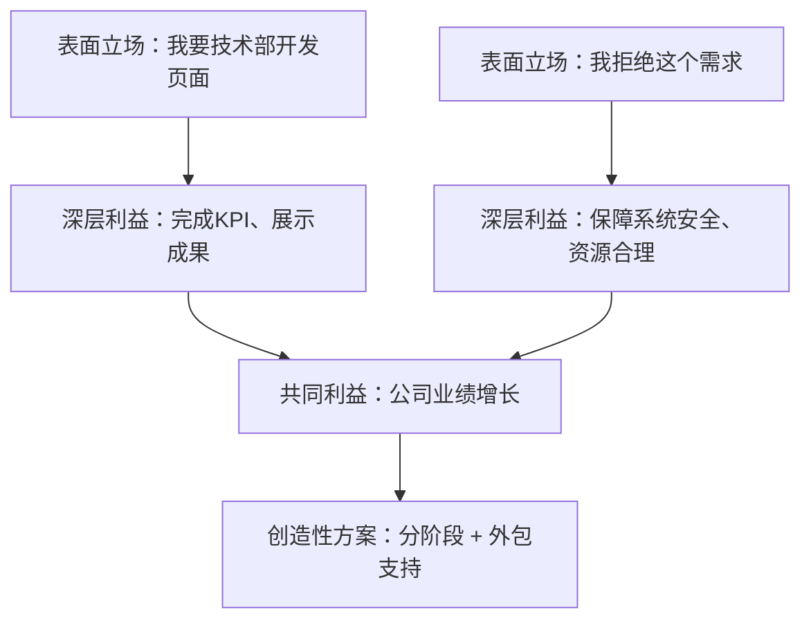
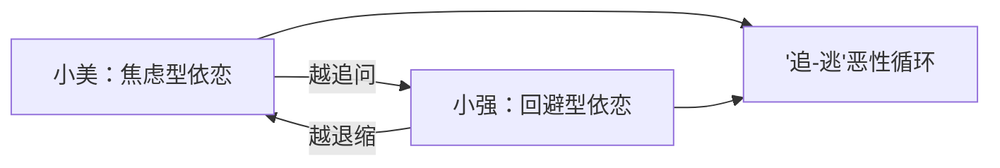
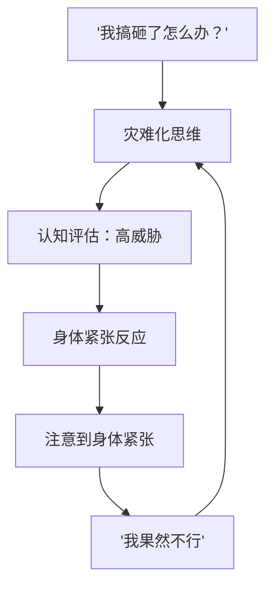
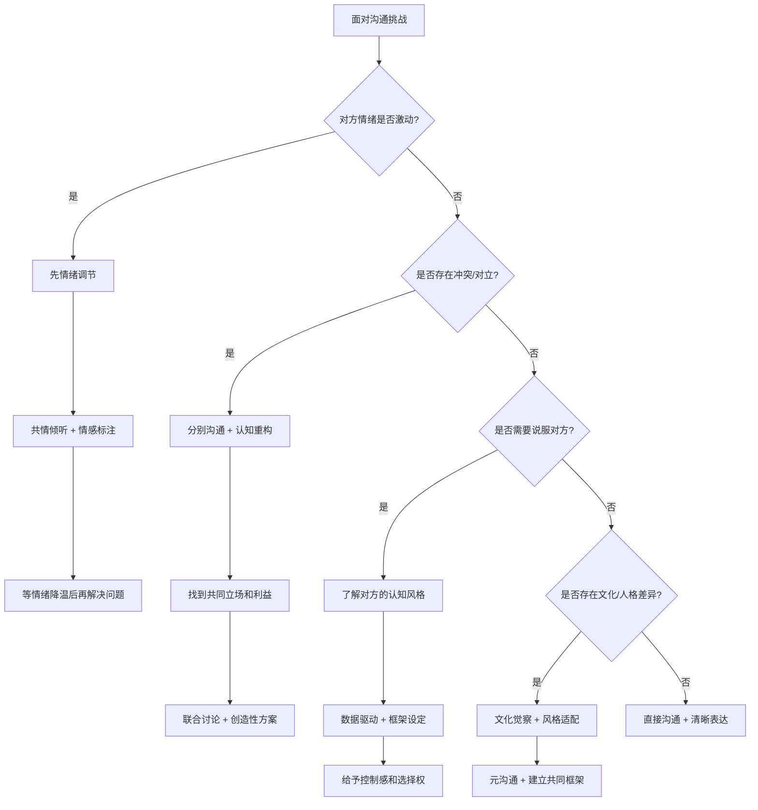

# 沟通心理学实战案例

## 引言

理论和技巧的价值在于实践。沟通心理学的每一个概念——从认知重构到情绪调节，从共情倾听到框架效应——只有在真实场景中被灵活运用，才能真正内化为能力。

本章通过**八个典型沟通场景**，展示沟通心理学理论如何落地。每个案例遵循统一的分析框架：

### 案例难度分级

| 难度 | 标识 | 含义 | 典型特征 |
|------|------|------|----------|
| ⭐⭐ | 中等 | 单一心理变量 | 对方情绪可控，冲突维度单一 |
| ⭐⭐⭐ | 较难 | 多重心理变量交互 | 涉及人格差异、情绪升级、多方利益 |
| ⭐⭐⭐⭐ | 困难 | 高度复杂情境 | 文化差异、长期关系、公众场合等叠加因素 |

### 案例选择指南

根据你当前面对的沟通场景，选择最相关的案例优先阅读：

| 你的场景 | 推荐案例 | 核心技巧 |
|----------|----------|----------|
| 对方情绪激动、愤怒指责 | 案例一 | 共情倾听、情绪降温 |
| 对方沉默寡言、难以沟通 | 案例二 | 情境设计、节奏适配 |
| 跨部门资源争夺 | 案例三 | 框架转换、利益整合 |
| 伴侣关系中的反复争吵 | 案例四 | 依恋识别、"我"信息 |
| 向上级争取支持 | 案例五 | 数据驱动、锚定效应 |
| 团队成员激烈对立 | 案例六 | 分别调解、共同目标 |
| 跨文化合作中的误解 | 案例七 | 元沟通、风格适配 |
| 公开场合的焦虑紧张 | 案例八 | 认知重构、生理调节 |

### 核心心理学原理速查

本章涉及的主要心理学原理及其在案例中的分布：

| 心理学原理 | 应用案例 | 一句话解释 |
|------------|----------|------------|
| 情绪感染 | 1, 4, 6 | 你的情绪状态会传染给对方 |
| 认知重构 | 全部 | 改变对事件的解读方式，改变情绪反应 |
| 基本归因错误 | 1, 3, 6, 7 | 把对方行为归因于人品而非情境 |
| 框架效应 | 3, 5, 6 | 同一事实的不同表述导致不同决策 |
| 依恋理论 | 2, 4 | 早期关系模式影响成年后的沟通风格 |
| 锚定效应 | 5 | 第一个数字会影响后续判断 |
| 面子理论 | 6, 7 | 公开场合的退让比私下困难得多 |
| 自我效能感 | 5, 8 | 过去的成功/失败经验影响当前信心 |

***

## 案例一：与愤怒客户的危机沟通

> **难度：⭐⭐⭐** | **场景：商务服务** | **核心技巧：共情倾听 + 情绪降温 + 框架重构**

### 场景背景

李明是一家软件公司的客户经理。一家重要客户的系统在上线后出现了严重故障，导致客户业务中断了8小时。客户总经理王总打电话来，情绪非常愤怒，言辞激烈，甚至威胁要终止合作并索赔。

### 心理分析

**客户角度**：

| 心理维度 | 具体表现 | 心理学依据 |
|----------|----------|------------|
| 情绪状态 | 高唤醒的愤怒，处于"热认知"状态 | 情绪心理学：高唤醒情绪会窄化认知范围 |
| 认知评估 | 将故障解读为"不专业"和"不重视我们" | 基本归因错误：忽略情境因素，归因于人格 |
| 深层需求 | 业务安全、被重视、获得补偿和改进承诺 | 马斯洛需求层次：安全需求 + 尊重需求 |
| 心理防御 | 愤怒是次级情绪，背后是恐惧和无力感 | 防御机制理论：愤怒常掩盖更脆弱的情绪 |

**自身角度**：
- 情绪状态：可能感到防御、焦虑或内疚
- 认知偏差：可能将客户的愤怒解读为"人身攻击"（基本归因错误）
- 自我保护：本能地想要辩解或推卸责任

### 策略应用

**第一步：情绪调节（自己）**

李明在接电话前做了三次深呼吸，觉察自己的紧张情绪（情感标注："我感到紧张和压力"），提醒自己的目标是"解决问题并维护关系"，而非"赢得争论"。

> 💡 **关键心法**：在对方情绪高峰时，你的首要任务不是"解决问题"，而是"接住情绪"。人在"热认知"状态下无法进行理性分析，必须先降温。

**第二步：共情倾听**

不打断客户的发泄，使用"嗯"、"我理解"等简短回应表示在听。等到客户的语速放慢、情绪略有平复后，进行情感标注和反射式回应：

- "王总，我完全理解您的愤怒。8小时的业务中断对你们来说是巨大的损失，换做是我也会非常生气。"
- "您对我们能否保障系统稳定运行产生了怀疑，这是完全合理的。"

**共情倾听的层次模型**：

| 层次 | 表现 | 示例 |
|------|------|------|
| 表面倾听 | 身体前倾，保持眼神接触，简短回应 | "嗯"、"我听到了" |
| 情感反射 | 准确识别并命名对方的情绪 | "我能感受到您非常愤怒和失望" |
| 需求洞察 | 看到情绪背后的深层需求 | "您不仅需要一个解决方案，更需要知道我们会认真对待这件事" |
| 共鸣连接 | 让对方感到"你真的懂我" | "如果我是您，遇到同样的情况，我也会非常生气" |

**第三步：认知重构**

将客户的情绪从"人身攻击"重新解读为"对问题的合理反应"。将当前情境从"危机"重新定义为"展现专业能力和诚信的机会"。

**第四步：策略性回应**

- 承认责任："这次故障的责任在我们，没有任何借口"
- 提出具体方案："我们的技术团队已经查明原因，接下来我会详细说明事故原因、我们的改进措施和补偿方案"
- 给予控制感："您觉得怎样的补偿方案比较合适？我们希望以您满意的方式来解决这个问题"
- 设定后续跟进："我会在明天下午3点前给您发送详细的事故报告和改进计划，您看这个时间可以吗？"

### 常见错误与纠正

| ❌ 错误做法 | 为什么错 | ✅ 正确做法 |
|------------|----------|------------|
| 立即解释故障原因 | 对方在情绪高峰时听不进解释，会认为你在找借口 | 先接住情绪，等对方冷静后再解释 |
| 说"我理解您的感受"然后立刻转折 | "但是"前面的话等于没说，对方会感到被敷衍 | 用具体细节表达理解，不急于转折 |
| 过度道歉、自我贬低 | 会降低你在对方心中的可信度，显得不专业 | 承认责任但保持专业立场 |
| 承诺超出能力范围的补偿 | 无法兑现的承诺会造成更大的信任危机 | 在能力范围内承诺，并明确时间节点 |
| 对方挂电话后不跟进 | 沉默会被解读为"不重视"，进一步激化矛盾 | 主动在承诺的时间点前跟进 |

### 效果评估

通过以上策略，李明成功地将对话从"情绪发泄"转向"问题解决"。客户的情绪逐渐平复，开始理性地讨论解决方案。最终，双方达成了补偿协议，客户不仅没有终止合作，反而因为李明的处理方式而加深了信任关系。

**关键复盘**：危机沟通的本质不是"灭火"，而是"建立信任"。研究显示，经历过服务失败并得到妥善处理的客户，其忠诚度反而高于从未遭遇问题的客户——这就是"服务恢复悖论"（Service Recovery Paradox）。危机处理得当，反而是加深关系的契机。

**心理学原理应用**：情绪感染（冷静的回应会降低对方的激动程度）、共情倾听（让客户感到被理解）、归因调整（从"人身攻击"到"问题导向"）、框架效应（将危机重新定义为展现诚信的机会）。

***

## 案例二：与内向下属的一对一沟通

> **难度：⭐⭐** | **场景：职场管理** | **核心技巧：情境设计 + 节奏适配 + 安全感建设**

### 场景背景

张华是一名技术部门的经理，他注意到团队成员小陈最近工作状态不佳，交付质量下降。张华想找小陈谈谈，但小陈是一个典型的内向者，平时话很少，不善于主动表达，之前的几次一对一沟通中，小陈的回答都很简短，张华很难了解他的真实想法。

### 心理分析

**小陈的角度**：

| 心理维度 | 具体表现 | 心理学依据 |
|----------|----------|------------|
| 人格特征 | 内向（大五人格中外向性低），需要更多时间处理信息 | 人格心理学：内向者的大脑唤醒阈值更低，更容易感到过度刺激 |
| 沟通偏好 | 不喜欢被突然提问，需要时间思考 | 认知风格：内向者倾向于深度加工信息 |
| 可能的心理 | 担心被批评、觉得自己的想法不够好 | 自我效能感不足，可能有冒充者综合征倾向 |
| 依恋风格 | 可能是回避型，在感到安全时才会敞开心扉 | 依恋理论：回避型依恋者对亲密互动有本能的警惕 |

**张华的角度**：
- 可能的挑战：作为一个相对外向的管理者，可能不理解内向者的沟通需求
- 沟通目标：了解小陈的工作状态和困扰，提供支持

### 策略应用

**第一步：情境选择与修改**

- 选择安静、私密的一对一环境（非开放办公区）
- 避免在走廊或茶水间进行"偶遇式"沟通
- 提前告知小陈沟通的主题，让他有时间准备

**第二步：建立安全感**

- 开场使用低威胁性的语言："今天想和你聊聊最近的工作，不是什么批评，就是想了解一下你的情况"
- 选择并排而非对面的座位安排（减少对立感——心理学研究表明，并排坐会降低30%的对抗感知）
- 先分享一些自己的经历："我最近也在适应新的项目流程，有时候觉得挺有挑战的"

**第三步：适应内向者的沟通节奏**

使用开放式但具体的问题，而非宽泛的问题：

| 问法类型 | 示例 | 内向者的反应 |
|----------|------|-------------|
| ❌ 宽泛型 | "最近工作怎么样？" | 不知从何说起，可能回答"还好" |
| ✅ 具体型 | "上周那个API接口的项目，你觉得最大的挑战是什么？" | 有明确的切入点，容易展开 |
| ✅ 行为型 | "我注意到这周的代码review里有几个延迟，是遇到了什么困难吗？" | 基于事实提问，减少被评判感 |
| ✅ 选择型 | "是技术上的困难多一些，还是和其他团队的协作上？" | 提供选项降低回答门槛 |

- 给予充分的等待时间：提问后，耐心等待10-15秒，不要急于填补沉默。对内向者来说，沉默是"正在思考"，而非"不想回答"
- 使用书写辅助："如果你愿意的话，可以先写下你的想法，我们再一起讨论"

**第四步：共情与确认**

- 对小陈的每一个回答都给予肯定性反馈："你说得很清楚"、"这个角度很有价值"
- 使用反射式回应确认理解："我听到你说的是……对吗？"
- 不要催促或打断

### 常见错误与纠正

| ❌ 错误做法 | 为什么错 | ✅ 正确做法 |
|------------|----------|------------|
| 在开放空间突然发起深度对话 | 内向者在不安全的环境中会本能地关闭 | 提前约定，选择私密空间 |
| 用快速连珠炮式的提问 | 信息过载会让内向者感到压力 | 一次一个问题，等待充分 |
| 把沉默解读为"没想法"或"不配合" | 这是内向者的正常处理方式 | 赋予沉默正面意义："你在认真思考" |
| 用外向者的标准要求内向者 | 不同人格类型有不同的最优表现方式 | 尊重差异，适配沟通风格 |
| 只在"出问题"时才沟通 | 会让内向者将1:1与"被批评"划等号 | 建立定期的、非威胁性的沟通机制 |

### 效果评估

通过调整沟通策略，张华发现小陈其实有很多有价值的想法，只是需要适当的环境和节奏才能表达出来。小陈在多次这样的沟通后，逐渐变得更加信任张华，主动表达的频率也有所提高。张华了解到小陈的状态下降是因为家庭原因，而非工作问题，及时提供了灵活的工作安排支持。

**关键复盘**：与内向者的沟通，本质上是一个**"安全感建设"**的过程。你不是在"撬开"对方的嘴，而是在"打开"对方的心。当环境足够安全、节奏足够舒适时，内向者往往是团队中最有深度的思想者。

**心理学原理应用**：人格心理学（理解内向者的沟通偏好）、情境选择（创造安全的沟通环境）、依恋理论（建立安全基地）、认知偏差矫正（避免将沉默误解为"没有想法"或"不配合"）。

***

## 案例三：跨部门协作中的利益冲突

> **难度：⭐⭐⭐** | **场景：组织协作** | **核心技巧：框架转换 + 利益整合 + 分阶段方案**

### 场景背景

赵丽是市场部经理，她需要技术部门配合开发一个重要的营销活动页面。但技术部门的负责人刘强认为这个需求优先级不高，因为他的团队正在处理一个紧急的系统安全问题。双方在会议上发生了激烈的争论。

### 心理分析

**冲突的心理机制**：

| 机制 | 赵丽的表现 | 刘强的表现 |
|------|-----------|-----------|
| 归因偏差 | "刘强就是不支持市场工作" | "赵丽不理解技术工作的重要性" |
| 群体认同 | 维护市场部的利益（内群体偏见） | 维护技术部的利益（内群体偏见） |
| 零和思维 | "资源就这么多，他不给我就是故意刁难" | "给了她，我这边的安全项目就要延期" |
| 情绪升级 | 公开争论激活防御心理 | 被质疑专业判断，更加防御 |

**深层需求**：
- 赵丽：完成KPI、在领导面前展示成果、获得技术支持
- 刘强：保障系统安全、合理分配团队资源、不被过度压榨

### 策略应用

**第一步：冷却与暂停**

会议中争论升级时，赵丽提议："这个问题确实需要更深入的讨论。我们是否可以先暂停，明天下午单独聊一聊？"这给了双方情绪降温的时间。

> 💡 **关键心法**：公开场合的争论会激活双方的"面子保护"机制，让人更加固执己见。将讨论转移到私下场景，是化解冲突的第一步。

**第二步：认知重构**

赵丽在会后进行了认知重构：

| 认知维度 | 非理性想法 | 替代想法 |
|----------|-----------|---------|
| 归因 | "刘强就是不配合" | "刘强可能真的面临紧急的安全问题" |
| 意图 | "他根本不在乎市场部的工作" | "他的拒绝不是针对我，而是基于专业判断" |
| 后果 | "没有技术部支持我就完不成KPI" | "一定有创造性的解决方案可以兼顾双方" |

**第三步：建立共同立场**

在第二天的单独沟通中，赵丽使用了以下策略：
- 从共同目标出发："我们都是为了公司的业绩增长。市场活动页面做好了，也能展示技术团队的能力"
- 表达理解："我知道安全问题的优先级确实很高，我完全尊重你的专业判断"
- 使用"我们"而非"你和我"："我们来看看怎样在不影响安全项目的前提下，推进这个营销页面"

**第四步：创造性解决方案**

- 了解技术部门的时间线和资源约束
- 提出分阶段方案："能不能先上线一个简化版的页面，等安全项目完成后，再增加高级功能？"
- 提供额外资源支持："市场部的预算中可以拨出一部分外包费用，减轻技术团队的负担"

**跨部门协商的"利益-立场"分析框架**：

### 常见错误与纠正

| ❌ 错误做法 | 为什么错 | ✅ 正确做法 |
|------------|----------|------------|
| 在公开会议上坚持己见 | 激活面子保护，双方都会更强硬 | 提议暂停，转移到私下讨论 |
| 向共同上级告状 | 可能赢了争论但输了关系 | 先尝试直接沟通，找到解决方案 |
| 只从自己的角度出发 | 对方感受不到被理解，更不愿意配合 | 先理解对方的约束，再提出方案 |
| 提出"全有或全无"的方案 | 对方没有回旋余地，只能拒绝 | 提供多个选项，让对方选择 |
| 威胁或施压 | 短期可能有效，长期破坏信任 | 强调共同利益，寻找共赢方案 |

### 效果评估

通过从"零和博弈"转向"合作共赢"的框架，赵丽和刘强找到了双方都能接受的解决方案。简化版页面在两周内上线，满足了市场活动的时间要求；高级功能在安全项目完成后由技术团队补充开发。这次经历也改善了两个部门之间的长期关系。

**关键复盘**：跨部门冲突的本质往往不是"谁对谁错"，而是"信息不对称"和"利益错位"。当你从对方的视角重新审视问题时，很多看似不可调和的矛盾其实都有创造性的解决方案。

**心理学原理应用**：归因理论（从"不配合"到"合理立场"）、框架效应（从"零和"到"共赢"）、社会交换理论（提供互惠方案）、群体动力学（跨越部门边界）。

***

## 案例四：亲密关系中的需求表达

> **难度：⭐⭐⭐** | **场景：亲密关系** | **核心技巧：依恋识别 + "我"信息 + 沟通约定**

### 场景背景

小美和小强是一对交往两年的情侣。最近小美觉得小强总是忙于工作，忽略了她。她多次表达不满，但每次沟通都以争吵告终。小强觉得小美"太粘人"，小美觉得小强"不在乎她"。

### 心理分析

**依恋风格分析**：

| 维度 | 小美（焦虑型） | 小强（回避型） |
|------|---------------|---------------|
| 核心恐惧 | 害怕被抛弃、不被重视 | 害怕被吞噬、失去独立性 |
| 压力反应 | 追求更多连接和确认 | 退缩，寻求个人空间 |
| 表达方式 | 指责、抱怨、情绪化 | 沉默、回避、冷处理 |
| 深层需求 | 被看见、被重视、情感连接 | 被尊重、被信任、个人空间 |

**认知偏差**：
- 小美的读心术："他一定是不爱我了"（将行为等同于感受）
- 小强的过度概括："她总是抱怨"（将具体事件过度概括为性格特征）
- 双方的基本归因错误：都将对方的行为归因于内在特质，而非情境因素

### 策略应用

**第一步：识别"追-逃"模式**

小美在一次咨询后，开始意识到自己和小强之间的"追-逃"模式。她进行了认知重构：

| 维度 | 非理性想法 | 替代想法 |
|------|-----------|---------|
| 行为解读 | "他不回复消息就是不在乎我" | "他可能正在忙，不回复不代表不在乎" |
| 动机归因 | "他故意冷落我" | "他的回避可能是应对压力的方式" |
| 关系评估 | "我们的关系出了大问题" | "我们只是沟通方式不匹配，可以调整" |

**第二步：改变表达方式——用"我"信息替代"你"信息**

| 表达类型 | 示例 | 对方的感受 |
|----------|------|-----------|
| ❌ 指责性"你"信息 | "你总是不陪我！你根本不关心我！" | 被攻击→防御→反击 |
| ✅ "我"信息 + 具体需求 | "我最近感到有点孤单，我很想念我们在一起的时光。我希望我们能每周安排一次约会时间" | 被理解→共情→合作 |

**"我"信息的结构**：`我感到[情绪]，因为[具体事件]，我希望[具体需求]`

- "我感到被忽略了（情绪），因为我们已经三周没有一起吃饭了（事件），我希望这周末我们能安排一次约会（需求）"
- "我感到担心（情绪），因为你最近加班很晚都没有提前告诉我（事件），我希望你能发个消息让我知道（需求）"

**第三步：给予空间，创造安全**

小美学会在小强工作繁忙时给予空间，不再频繁追问。当小强主动联系时，她以温暖而非抱怨的态度回应。这逐渐降低了小强的回避倾向。

> 💡 **关键心法**：对回避型依恋者来说，"给予空间"不是"放弃"，而是"创造安全感"。当对方不再感到被追逼时，反而更愿意主动靠近。

**第四步：共同建立沟通约定**

双方在情绪平静时讨论并制定了沟通约定：
- 每天晚上10分钟的"连接时间"（放下手机，面对面交流）
- 如果一方感到焦虑或需要空间，可以直接说出来，而不需要通过行为暗示
- 每周一次的"关系检查"，讨论关系中的积极面和改进空间

### 常见错误与纠正

| ❌ 错误做法 | 为什么错 | ✅ 正确做法 |
|------------|----------|------------|
| 在争吵时讨论沟通规则 | 情绪激动时无法进行理性协商 | 选择双方都平静的时候讨论 |
| 用"你总是…""你从不…"开头 | 过度概括会触发对方的防御 | 描述具体事件和自己的感受 |
| 试图"改造"对方的人格类型 | 人格特质是相对稳定的，强求改变只会增加冲突 | 接纳差异，调整互动模式 |
| 只要求对方改变 | 改变是双向的，单方面要求难以持续 | 双方都做出调整，共同建立新模式 |
| 用冷战代替沟通 | 冷战是回避型的防御策略，会让焦虑型更加不安 | 明确表达"我需要一些时间，但我不是在逃避" |

### 效果评估

通过理解依恋风格和调整沟通策略，小美和小强的关系模式发生了积极变化。小美学会了用"我"信息表达需求，而非用指责来寻求关注；小强学会了在感到压力时主动沟通，而非退缩回避。"追-逃"模式被打破，取而代之的是更加安全和开放的沟通。

**关键复盘**：亲密关系中的沟通问题，往往不是"谁对谁错"的问题，而是**两种依恋风格的不匹配**。理解这一点，就能从"你为什么这样对我"的指责模式，转变为"我们怎样才能更好地配合"的合作模式。

**心理学原理应用**：依恋理论（识别追-逃模式）、认知重构（改变读心术和归因偏差）、情绪调节（管理焦虑和防御反应）、沟通技巧（"我"信息的使用）。

***

## 案例五：向上管理——向领导争取资源

> **难度：⭐⭐** | **场景：向上管理** | **核心技巧：数据驱动 + 框架转换 + 锚定效应**

### 场景背景

林峰是一名项目经理，他负责的项目面临资源不足的问题。他需要向部门总监陈总争取更多的人员和预算支持。但陈总以"控制成本"为由，之前已经拒绝过类似请求。

### 心理分析

**陈总的角度**：

| 心理维度 | 具体表现 | 应对策略 |
|----------|----------|---------|
| 人格特征 | 尽责性高、注重控制和效率 | 用数据和逻辑说服，而非情感诉求 |
| 认知框架 | "控制成本"是核心职责 | 将"成本"重构为"投资" |
| 深层顾虑 | 担心引发其他团队的连锁反应 | 提供"专属方案"，降低示范效应 |
| 说服路径 | 倾向于中央路径（逻辑和证据） | 准备充分的数据和ROI分析 |

**林峰的角度**：
- 可能的焦虑：害怕被拒绝、担心被认为能力不足
- 认知偏差：可能过度关注被拒绝的可能性（可得性启发）
- 自我效能感：可能因之前的拒绝而降低信心

### 策略应用

**第一步：认知重构**

| 维度 | 非理性想法 | 替代想法 |
|------|-----------|---------|
| 预期 | "陈总一定会拒绝我" | "上次可能缺乏足够的数据支持" |
| 归因 | "拒绝=我能力不行" | "拒绝可能只是信息不充分" |
| 后果 | "被拒绝就完了" | "即使被拒绝，也不是对我个人的否定" |

**第二步：充分准备——数据驱动**

| 数据维度 | 具体内容 | 呈现方式 |
|----------|---------|---------|
| 资源缺口 | 当前团队负荷120%，缺2名开发 | 图表展示负荷对比 |
| ROI分析 | 投入X万→提前Y周→收益Z万 | 数字对比，突出回报倍数 |
| 风险分析 | 不增加资源→延期X周→损失Y万 | 损失框架更触动决策者 |
| 替代方案 | 全职/外包/混合三种选项 | 提供选择，展示灵活性 |

**第三步：框架设定——从"成本"到"投资"**

- 避免使用"需要更多资源"这样的表述（听起来像是在增加负担）
- 使用"投资回报"的框架："投入X万元的额外资源，可以确保项目提前Y周交付，为公司带来Z万元的收益"

**第四步：给予控制感**

不是要求陈总做决定，而是提供选项让陈总选择：
- "方案A：增加2名全职开发，项目提前3周交付"
- "方案B：外包前端开发，项目提前1周交付，成本增加较少"
- "方案C：维持现状，项目可能延期2周"
- 表达尊重："我理解成本控制的重要性，最终的决定权在您。我只是希望您有完整的信息来做判断"

**第五步：心理暗示——锚定与社会证据**

| 心理技巧 | 应用方式 | 效果机制 |
|----------|---------|---------|
| 锚定 | "类似规模的项目通常需要X人的团队配置" | 设定参照基准，影响判断 |
| 社会证据 | "其他部门的类似项目，通常在中期会进行资源追加" | 利用从众心理降低心理阻力 |
| 损失框架 | "如果因为资源不足导致项目延期，客户那边的压力会非常大" | 人对损失的敏感度是收益的2倍 |

### 常见错误与纠正

| ❌ 错误做法 | 为什么错 | ✅ 正确做法 |
|------------|----------|------------|
| 只说"我需要"不给数据 | 决策者无法判断需求的合理性 | 用数据说话：负荷率、ROI、风险 |
| 只提一个方案 | 没有选择余地，领导只能说"是"或"否" | 提供2-3个方案，让领导选择 |
| 情感诉求为主 | 对数据导向的决策者效果很差 | 数据为主，情感为辅 |
| 在领导忙碌时突然提出 | 准备不充分，容易被草率拒绝 | 预约专门的时间，准备好材料 |
| 被拒绝后立即放弃 | 可能只是时机或数据问题 | 询问具体顾虑，下次补充数据后再提 |

### 效果评估

陈总在看到充分的数据分析和多种方案后，批准了方案B（外包前端开发）。林峰通过数据驱动和框架设定，成功地将对话从"要不要花钱"转变为"怎样花最值得"，既满足了项目需求，又尊重了陈总的成本控制导向。

**关键复盘**：向上管理的本质不是"说服"，而是**"降低决策者的决策成本"**。当你把所有数据、方案、风险都准备好，领导只需要做"选择题"而非"问答题"时，获得支持的概率会大幅提升。

**心理学原理应用**：人格心理学（适应尽责性高的决策风格）、说服理论（中央路径 vs. 外周路径）、框架效应（从"成本"到"投资"）、锚定效应、社会证据。

***

## 案例六：团队冲突调解

> **难度：⭐⭐⭐⭐** | **场景：团队管理** | **核心技巧：分别调解 + 认知重构 + 共同目标**

### 场景背景

刘洋是一家创业公司的CEO。公司的两位核心成员——产品总监小周和技术总监老吴——因为产品方向产生了严重分歧。小周主张快速迭代、抢占市场，老吴主张技术先行、打好基础。两人从专业讨论演变为个人攻击，团队氛围急剧恶化。

### 心理分析

**冲突的心理机制**：

| 机制 | 表现 | 解读 |
|------|------|------|
| 认知固着 | 双方都陷入了"非此即彼"的二元思维 | 无法看到中间地带的可能性 |
| 面子理论 | 公开场合的争论让双方都觉得"丢面子" | 退让=承认自己错了=丢脸 |
| 群体极化 | 各自的支持者进一步强化了极端立场 | 小群体讨论会让观点更极端 |
| 基本归因错误 | 将对方的立场归因于"不专业"或"固执己见" | 忽略对方立场背后的合理逻辑 |

**深层需求**：
- 小周：被认可市场洞察力、推动公司快速发展
- 老吴：被认可技术判断力、确保产品质量和团队士气
- 共同需求：公司成功、个人价值实现

### 策略应用

**第一步：分别单独沟通（情境选择）**

刘洋分别与小周和老吴进行了一对一的深入沟通，使用共情倾听技术：
- 对小周："我能感受到你对产品方向的焦虑，你觉得快速迭代对公司至关重要"
- 对老吴："你担心技术债务会拖累公司长期发展，这个担忧是完全合理的"

> 💡 **关键心法**：调解冲突时，永远先分别沟通，再联合讨论。分别沟通的目的是：(1) 让每个人感到被理解；(2) 了解各自的深层需求；(3) 在私下场合降低防御。

**第二步：引导认知重构**

- 帮助双方看到对方立场的合理性："小周的市场敏锐度和老吴的技术深度，都是公司不可或缺的能力"
- 打破二元思维："这不是'速度'和'质量'的二选一，而是如何找到平衡"

**第三步：组织结构化的联合讨论**

| 设计要素 | 具体做法 | 心理学依据 |
|----------|---------|-----------|
| 环境选择 | 中立的会议室（不在任何一方的办公室） | 消除领地效应 |
| 规则设定 | "今天的讨论聚焦于产品方案，不涉及个人评价" | 将冲突从"人身"转向"议题" |
| 讨论框架 | "利益-立场"框架：引导表达"为什么"而非"是什么" | 发现共同利益是解决冲突的关键 |
| 外部视角 | "如果我们的目标用户坐在这个房间里，他们会怎么看？" | 引入第三方视角打破僵局 |

**第四步：创造共同目标**

- 引导双方将注意力从"谁对谁错"转向"对公司最好的方案是什么"
- 设定共同的评估标准："我们用市场验证速度、技术债务水平、用户满意度三个指标来评估方案"

**第五步：达成共识与跟进**

- 小周和老吴最终达成折中方案：先用2周时间快速上线MVP（最小可行产品），再用4周时间进行技术优化
- 设定明确的里程碑和决策点
- 刘洋承诺定期跟进，确保双方的承诺得到落实

### 常见错误与纠正

| ❌ 错误做法 | 为什么错 | ✅ 正确做法 |
|------------|----------|------------|
| 一开始就召集双方在一起 | 公开场合双方都会更加防御 | 先分别沟通，再联合讨论 |
| 表态支持某一方 | 另一方会感到被孤立，冲突加剧 | 保持中立，引导双方看到对方的合理性 |
| 做"和稀泥"式的调解 | 双方都感到不被真正理解 | 分别给予深度共情，然后引导共识 |
| 只解决表面分歧 | 根本的利益冲突没有解决，还会复发 | 挖掘深层需求，找到利益交汇点 |
| 没有后续跟进 | 达成的共识可能因缺乏监督而瓦解 | 设定里程碑，定期检查执行情况 |

### 效果评估

通过调解，小周和老吴不仅解决了当前的分歧，还建立了更健康的沟通模式。他们开始欣赏对方的专业能力，冲突反而成为了团队成长的契机。团队氛围明显改善，产品方案融合了两人的优势。

**关键复盘**：团队冲突调解的核心原则是**"对事不对人"**——将冲突从"人格对抗"重新定义为"方案讨论"。当双方不再需要"赢"的时候，合作就成为可能。

**心理学原理应用**：归因理论（引导从个人归因到情境归因）、面子理论（分别沟通保护双方的面子）、群体极化（打破各自的支持阵营）、创造性问题解决（超越二元对立）。

***

## 案例七：跨文化沟通中的误解处理

> **难度：⭐⭐⭐⭐** | **场景：国际合作** | **核心技巧：文化觉察 + 元沟通 + 风格适配**

### 场景背景

陈文是一家中国企业的海外业务负责人，他与美国合作伙伴John因为合同条款的谈判产生了误解。John认为陈文的团队在谈判中"不够直接"，总是"绕圈子"；陈文则认为John"太强势"，"不尊重关系的建设过程"。

### 心理分析

**文化差异的维度分析**：

| 文化维度 | 中国（高语境） | 美国（低语境） | 冲突点 |
|----------|---------------|---------------|--------|
| 沟通风格 | 间接、含蓄、注重言外之意 | 直接、明确、注重字面意思 | "绕圈子" vs "太强势" |
| 价值取向 | 集体主义，注重群体和谐 | 个人主义，注重个人立场表达 | "和稀泥" vs "太aggressive" |
| 时间导向 | 长期导向，先建关系再谈业务 | 短期导向，先明确业务再建关系 | "效率低" vs "没诚意" |
| 面子文化 | 高度重视面子，避免公开冲突 | 面子压力较低，直接表达异议 | "不坦诚" vs "不尊重" |

**认知偏差**：
- 刻板印象：双方可能都在用文化刻板印象来解读对方的行为
- 基本归因错误：将文化差异导致的行为归因于个人特质

### 策略应用

**第一步：文化觉察与认知重构**

陈文首先进行了自我反思：
- "John的直接不是不尊重，而是美国商务文化中的正常沟通方式"
- "我的间接沟通方式可能让John感到困惑，不确定我的真实意图"

**第二步：元沟通——谈论沟通本身**

陈文与John进行了一次关于沟通方式的"元沟通"：

> "John，我想和你聊聊我们之间的沟通方式。我发现我们的文化背景对沟通风格有不同的影响。在中国文化中，我们倾向于先建立关系，再深入业务细节；而我理解在美国文化中，直接讨论具体问题是很正常的。我并不是在'绕圈子'，而是希望在讨论细节之前，先确保我们之间有良好的信任基础。"

**元沟通的要素**：

| 要素 | 说明 | 示例 |
|------|------|------|
| 觉察 | 承认差异的存在 | "我注意到我们的沟通风格不同" |
| 解释 | 从文化角度而非人格角度解释 | "这可能与我们的文化背景有关" |
| 意图 | 表达自己的善意 | "我不是在绕圈子，而是希望建立信任" |
| 邀请 | 邀请对方一起调整 | "我们可以一起找到适合双方的方式" |

**第三步：相互适应**

- 陈文的调整：在业务讨论中更加直接，明确表达立场和需求
- John的调整：理解陈文"关系建设"的价值，给予更多耐心
- 共同约定：在邮件沟通中，先简短问候，然后直接进入主题

**第四步：建立共同的沟通框架**

- 明确沟通预期："在每次会议开始时，我会直接说明今天的议题和目标"
- 使用结构化工具：会议议程、书面纪要、明确的行动项
- 定期回顾沟通效果："我们的沟通方式对你来说有效吗？有什么需要调整的？"

### 常见错误与纠正

| ❌ 错误做法 | 为什么错 | ✅ 正确做法 |
|------------|----------|------------|
| 用自己的文化标准评判对方 | 这是文化中心主义，会加剧误解 | 从文化差异的角度理解行为 |
| 假装"没有文化差异" | 差异客观存在，回避只会让问题积累 | 主动进行元沟通，讨论差异 |
| 要求对方完全适应自己 | 适配是双向的，单方面要求难以持续 | 双方都做出调整，找到中间地带 |
| 用刻板印象代表个体 | "所有美国人都很直接"忽略了个体差异 | 把对方当作独立个体来理解 |
| 遇到误解就退缩 | 跨文化沟通中的误解是正常的 | 把误解当作增进理解的机会 |

### 效果评估

通过文化觉察和元沟通，陈文和John找到了适合双方的沟通模式。陈文在保持关系建设的同时，学会了更直接地表达业务需求；John在保持效率的同时，理解了关系建设在跨文化合作中的价值。后续的合作变得更加顺畅。

**关键复盘**：跨文化沟通中最强大的工具是**"元沟通"**——当你能够和对方讨论"我们之间是怎么沟通的"时，90%的误解都可以被预防或化解。元沟通的本质是建立一个"沟通操作系统"的共识。

**心理学原理应用**：社会心理学（文化差异对沟通风格的影响）、刻板印象觉察、元沟通（谈论沟通方式本身）、适应性沟通（相互调整风格）。

***

## 案例八：公开演讲中的心理管理

> **难度：⭐⭐⭐** | **场景：公众表达** | **核心技巧：认知重构 + 生理调节 + 注意力转移**

### 场景背景

周婷是一位资深的产品经理，被邀请在行业大会上做一场30分钟的演讲。尽管她在一对一和小团队沟通中表现优秀，但面对大型观众时，她会感到极度紧张，手心出汗、声音发抖、大脑空白。

### 心理分析

**焦虑的心理机制**：

| 机制 | 表现 | 心理学依据 |
|------|------|------------|
| 认知评估 | 将演讲评估为"高威胁"情境 | 拉扎勒斯评估理论：威胁评估触发应激反应 |
| 灾难化思维 | "如果我搞砸了，我的声誉就毁了" | 认知行为理论：灾难化思维放大约10倍的威胁 |
| 社会评价焦虑 | 对被他人评判的恐惧 | 社会评价理论：人对负面评价的敏感度是正面评价的3倍 |
| 自我关注 | 过度关注自己的表现，而非信息的传达 | 注意力窄化：焦虑会将注意力锁定在威胁源上 |
| 身体反应循环 | 焦虑→身体紧张→注意到紧张→更焦虑 | 恶性循环：生理反馈会强化心理焦虑 |

### 策略应用

**第一步：认知重构（演讲前一周）**

| 灾难化思维 | 理性评估 | 重构后的想法 |
|------------|---------|-------------|
| "如果我忘词了，大家都会觉得我不专业" | 忘词是正常现象，大多数演讲者都经历过 | "即使忘词了，看一下笔记就好，观众不会在意" |
| "如果我紧张得发抖，太丢人了" | 适度紧张观众通常察觉不到 | "观众希望我成功，他们不是来挑刺的" |
| "如果表现不好，我的职业生涯就完了" | 一次演讲不会定义你的职业 | "一次演讲而已，不完美是正常的" |

- 重新定义演讲："演讲不是一场'考试'，而是一次'分享'。我不是来展示自己有多厉害，而是来分享有价值的内容"
- 最坏情况预演："最坏的情况是什么？忘词、紧张、表现不完美。我能应对吗？能。观众会因此否定我整个人吗？不会"

**第二步：充分准备（演讲前一周）**

| 准备维度 | 具体做法 | 心理学依据 |
|----------|---------|-----------|
| 内容准备 | 反复练习到"自动驾驶"程度 | 程序性记忆：熟练到不需要工作记忆参与 |
| 环境准备 | 提前到会场熟悉环境 | 去陌生化：熟悉的环境降低威胁评估 |
| 预演想象 | 每天花10分钟想象自己自信地演讲 | 心理预演：大脑无法区分想象和真实经历 |
| 社交准备 | 提前和几位观众简单交流 | 陌生面孔→友善面孔：降低社会评价焦虑 |

**第三步：生理调节（演讲当天）**

| 时间点 | 技巧 | 操作方法 |
|--------|------|---------|
| 演讲前30分钟 | 4-7-8呼吸法 | 吸气4秒→屏气7秒→呼气8秒，重复4次 |
| 演讲前10分钟 | 渐进式肌肉放松 | 从脚到头，每组肌肉先紧张5秒再放松10秒 |
| 演讲前5分钟 | 力量姿势 | 双手叉腰或双臂展开，保持2分钟 |
| 演讲前1分钟 | 微笑激活 | 刻意微笑30秒，激活面部反馈效应 |

**第四步：注意转移（演讲过程中）**

- 将注意力从"我表现得怎么样"转移到"我要传达什么信息"
- 找到几个友善的面孔，将演讲想象成与他们的对话
- 如果感到紧张，暂停一下，喝口水，深呼吸，然后继续

**第五步：自我关怀（演讲后）**

- 不要过度分析自己的"失误"（人类有"负面偏差"，会过度关注做得不好的部分）
- 关注演讲中做得好的部分
- 接受"不完美"是正常的，每次演讲都是成长的机会

### 常见错误与纠正

| ❌ 错误做法 | 为什么错 | ✅ 正确做法 |
|------------|----------|------------|
| 完全背诵逐字稿 | 一旦忘词会彻底崩溃 | 记住框架和关键词，允许即兴发挥 |
| 试图消除所有紧张 | 适度紧张反而提升表现 | 接受紧张，将其转化为兴奋 |
| 只关注自己"表现好不好" | 过度自我关注会加重焦虑 | 关注"信息有没有传达好" |
| 演讲后反复回看录像挑毛病 | 负面偏差会让你只看到缺点 | 先看做得好的部分，再看需要改进的 |
| 用酒精或药物缓解焦虑 | 短期有效但长期有害，且影响表现 | 用科学的生理调节技巧替代 |

### 效果评估

通过系统的心理准备，周婷的演讲焦虑显著降低。虽然仍然感到一定程度的紧张（适度的紧张有助于提升表现），但她能够将紧张转化为兴奋和专注。演讲结束后，多位观众主动来交流，表示内容非常有价值。周婷的演讲自信逐渐建立，后续多次受邀在行业活动中分享。

**关键复盘**：演讲焦虑的本质是**"威胁评估过高"**——你的大脑将"在众人面前讲话"错误地识别为"生存威胁"。通过认知重构（改变评估）和生理调节（降低应激反应），你可以重新训练大脑，让它意识到"这不致命，我可以应对"。

**心理学原理应用**：认知重构（灾难化思维→现实评估）、情绪调节（生理调节和注意转移）、自我效能感（通过成功经验建立信心）、自我关怀（接受不完美）。

***

## 跨案例分析：通用模式与策略框架

### 八大案例的共性模式

仔细分析以上八个案例，可以提炼出跨场景通用的心理学模式：

| 通用模式 | 涉及案例 | 核心机制 |
|----------|----------|----------|
| 情绪先于逻辑 | 1, 4, 6, 8 | 人在情绪激动时无法理性思考，必须先降温 |
| 框架决定行为 | 3, 5, 6 | 同一事件的不同解读导致完全不同的行动 |
| 安全感是前提 | 2, 4, 6, 7 | 只有在感到安全时，人才会展露真实想法 |
| 具体胜过抽象 | 2, 3, 5 | 具体的方案比抽象的承诺更有说服力 |
| 给予控制感 | 1, 5 | 让对方感到"我在掌控"会降低防御 |
| 双向适配 | 4, 7 | 沟通风格的调整必须是双向的 |

### 策略选择决策流程

面对沟通挑战时，可以按照以下决策流程选择策略：

### 沟通准备检查清单

在任何重要的沟通之前，可以用以下清单进行自我检查：

| 检查项 | 问题 | 行动 |
|--------|------|------|
| 自我觉察 | 我现在的情绪状态是什么？ | 如果情绪激动，先做情绪调节 |
| 对方分析 | 对方的性格、需求、顾虑是什么？ | 提前做心理画像 |
| 目标设定 | 这次沟通我希望达成什么？ | 写下具体、可衡量的目标 |
| 框架选择 | 我用什么框架来呈现？ | 选择对对方最有说服力的框架 |
| 方案准备 | 我有哪些解决方案？ | 至少准备2-3个方案 |
| 最坏预案 | 如果沟通不顺利怎么办？ | 设定底线和备选方案 |
| 环境设计 | 什么环境最适合这次沟通？ | 根据沟通性质选择合适的场景 |

***

## 从案例到能力：刻意练习指南

### 认知重构练习

认知重构是贯穿所有案例的核心技能。以下是日常练习方法：

**ABC日记法**（基于Albert Ellis的理性情绪行为疗法）：

| 栏目 | 含义 | 示例 |
|------|------|------|
| A - Activating Event | 触发事件 | 同事在会议上反驳了我的方案 |
| B - Belief | 信念/想法 | "他就是针对我" |
| C - Consequence | 情绪和行为后果 | 愤怒，不想再和他合作 |
| D - Dispute | 质疑非理性信念 | 他可能只是有不同看法，不一定是针对我 |
| E - Effective New Belief | 新的理性信念 | "不同意见是正常的，我可以听听他的理由" |

每天记录1-2个触发事件，坚持21天可以显著提升认知重构的速度和自动性。

### 共情倾听练习

**共情阶梯练习**：

| 层次 | 练习方法 | 频率 |
|------|---------|------|
| 表面倾听 | 和朋友聊天时，专注于不打断，只用简短回应 | 每天练习 |
| 情感反射 | 练习用"你感到……"来描述对方的情绪 | 每周2-3次 |
| 需求洞察 | 尝试说出对方情绪背后的需求 | 每周1-2次 |
| 共鸣连接 | 练习表达"如果我是你，我也会……" | 在深度对话中使用 |

### 情绪调节练习

**日常情绪调节工具箱**：

| 场景 | 技巧 | 操作时间 |
|------|------|---------|
| 感到焦虑 | 4-7-8呼吸法 | 2分钟 |
| 感到愤怒 | 情感标注（命名情绪） | 30秒 |
| 感到紧张 | 渐进式肌肉放松 | 5分钟 |
| 感到沮丧 | 认知重构（换个角度看） | 3分钟 |
| 感到压力 | 正念扫描（关注身体感受） | 5分钟 |

***

## 案例总结

以上八个案例涵盖了沟通心理学的多种应用场景：危机沟通、一对一管理、跨部门协作、亲密关系、向上管理、团队调解、跨文化沟通和公开演讲。每个案例都展示了如何运用认知重构、情绪调节、共情技巧和心理暗示来解决实际的沟通挑战。

### 五大核心启示

**第一：先理解心理机制，再选择沟通策略**

不同的情境需要不同的心理分析。面对愤怒的客户需要先处理情绪，面对沉默的下属需要先建立安全感，面对跨文化差异需要先进行觉察。没有万能的沟通策略，只有对心理机制的深刻理解才能帮你找到正确的方法。

**第二：情绪管理是有效沟通的前提**

无论是自己的情绪还是对方的情绪，都必须先被妥善处理。在情绪的"热认知"状态下，任何理性的策略都会失效。学会识别情绪、命名情绪、调节情绪，是所有沟通技巧的基础。

**第三：认知重构改变沟通的起点**

对同一事件的不同解读会导致完全不同的沟通行为。"他在针对我"和"他可能有自己的考虑"会导致截然不同的反应。认知重构不是"自我欺骗"，而是"看到更多的可能性"。

**第四：共情是建立连接的桥梁**

真正的理解比说服技巧更有力量。当你让对方感到"这个人真的懂我"时，防御就会降低，合作就成为可能。共情不是"同意"对方的观点，而是"理解"对方的感受和需求。

**第五：灵活适应是高级沟通能力**

没有放之四海而皆准的沟通策略。面对不同的人格类型、不同的文化背景、不同的情境条件，需要灵活调整你的沟通方式。这种适应能力不是天赋，而是可以通过刻意练习培养的。

### 沟通心理学能力自评

| 能力维度 | 初级（偶尔使用） | 中级（主动使用） | 高级（本能反应） |
|----------|-----------------|-----------------|-----------------|
| 情绪觉察能力 | 事后才意识到自己的情绪 | 能在沟通中实时觉察情绪 | 能觉察自己和对方的微妙情绪变化 |
| 认知重构能力 | 需要刻意提醒才能换个角度 | 能在压力下主动重构 | 重构已经成为自动化的思维习惯 |
| 共情倾听能力 | 听到对方说了什么 | 听到对方的感受和需求 | 能让对方感到被深刻理解 |
| 策略选择能力 | 用同一种方式应对所有场景 | 能根据情境选择策略 | 能灵活组合多种策略 |
| 元沟通能力 | 不太会谈论"沟通方式" | 能在必要时发起元沟通 | 能自然地调整沟通的"操作系统" |

如果你在大多数维度上处于"初级"水平，不要气馁——每一个"高级"的沟通者都是从"初级"开始的。关键在于**有意识地练习**：每次沟通后花2分钟复盘，每次冲突后做一次认知重构，每次误解后进行一次元沟通。日积月累，沟通心理学的原理就会从"知识"变成"能力"，从"刻意使用"变成"本能反应"。
