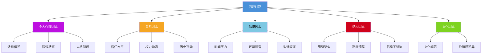
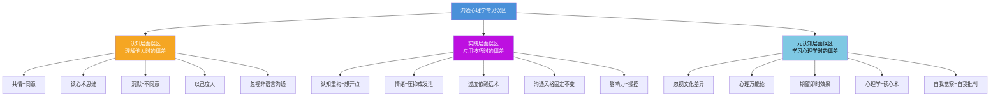

# 沟通心理学常见误区

## 引言

在学习和应用沟通心理学的过程中，许多初学者甚至有经验的沟通者都容易陷入一些常见误区。这些误区并非单纯的"知识盲区"——它们往往有深层的心理根源：有些源于对心理学理论的断章取义，有些源于将复杂的人类行为过度简化的认知倾向，有些则源于对"改变"本身的恐惧和抵触。

本章梳理十五个最常见的误区，按照"认知层面→实践层面→元认知层面"三个层级组织。每个误区不仅说明"是什么"和"为什么错"，还提供**心理机制分析**（为什么你会产生这种误解）、**自我检测信号**（帮助你识别自己是否正在犯这个错误）、**纠正路径**（具体可操作的改正方法）和**真实场景案例**（用案例说明误区的危害和纠正后的效果）。

**使用建议**：对照每个误区的"自我检测信号"，勾选自己中招的条目。中招越多的误区，越需要优先纠正。

***

## 第一部分：认知层面误区——理解他人时的偏差

认知层面的误区影响我们"如何理解他人"，它们会扭曲我们对他人心理状态的判断，导致沟通从一开始就偏离正确方向。

***

### 误区一：共情等于同意

#### 误区表现

"如果我表示理解对方的感受，就等于同意对方的观点或行为。"

很多人在沟通中不敢表达共情，因为他们认为"理解"等同于"认同"。例如，在与愤怒的客户沟通时，客服人员可能犹豫是否要说"我理解您的感受"，因为他们担心这等于承认公司的过错。在亲密关系中，当伴侣抱怨"你总是加班"时，另一方可能拒绝共情——"如果我承认他/她的感受，不就等于承认我做错了吗？"

#### 心理机制

这种误区源于**认同威胁**（Identity Threat）心理：当我们的自我概念（"我是一个好员工/好伴侣"）受到潜在挑战时，防御机制会自动激活，让我们拒绝一切可能削弱自我形象的信息，包括共情本身。此外，**二元思维模式**（非此即彼）也起到推波助澜的作用——"要么我同意你，要么我反对你"的框架排除了"理解但不认同"这一中间地带。

#### 自我检测信号

- 当对方表达负面情绪时，你的第一反应是"为自己辩护"而非"理解对方"
- 你觉得"说理解"就等于"认输"或"低头"
- 在争论中，你害怕表示理解，因为担心对方会"得寸进尺"
- 你认为只有在自己"有错"时才需要共情
- 当别人共情你时，你觉得对方是在"同意你"，并据此加强自己的立场

#### 纠正方法

共情是一种"理解"的能力，而非"认同"的态度。你可以完全理解对方为什么感到愤怒，同时不认为对方的愤怒是合理的。

**核心区分——情绪合理性 vs 判断合理性**：

| 维度 | 共情关注的 | 认同涉及的 |
|------|-----------|-----------|
| 情绪 | 对方的情绪是真实存在的 | — |
| 原因 | 对方有理由产生这种情绪 | — |
| 判断 | — | 对方的判断是否正确 |
| 行为 | — | 对方的行为是否合理 |
| 方案 | — | 对方的诉求是否应该被满足 |

你可以共情情绪（"我理解您为什么会感到失望"），同时保留对判断的立场（"关于具体方案，我们来看看怎么解决"）。

**正确表述的三层结构**：

1. **情绪确认层**："我理解您现在感到很沮丧/失望/担忧"
2. **原因理解层**："遇到这样的情况，确实会让人感到不舒服"
3. **转向解决层**："我们来看看怎么解决这个问题"

**错误表述对比**：

- 错误："您是对的，我们确实做得很差"（过度认同，放弃立场）
- 错误："您不应该这么生气"（否定情绪，关闭共情）
- 正确："我理解您为什么会感到失望"（理解情绪，保留判断空间）

**实战案例**：

项目经理小王面对客户的投诉："你们的项目延期了两周，这是严重违约！"小王最初想说"这不是我们的错，是你们需求变更导致的"。运用共情区分法后，他说："项目延期确实给您带来了困扰，我完全理解您的担忧。关于延期的原因，我们可以一起梳理一下过程，然后制定一个双方都能接受的补偿方案。"结果客户的情绪明显缓和，双方顺利进入问题解决阶段。

***

### 误区二：读心术思维——假设自己知道对方在想什么

#### 误区表现

"我不需要问，我知道他在想什么。"

这种误区表现为：基于有限的线索（一个表情、一句话、一个行为）就"确信"自己知道对方的想法、动机和意图。例如："他不回复消息，一定是对我有意见""她皱眉了，肯定是不同意我的方案""他说话声音变大了，一定是在生我的气"。

读心术思维是沟通中最具破坏性的认知偏差之一，因为它让人**停止了探询和确认，直接用假设代替事实**。

#### 心理机制

读心术思维的心理根源在于**认知吝啬**（Cognitive Miser）——大脑倾向于用最少的认知资源做出判断，而不是投入更多精力去收集信息和验证假设。同时，**投射效应**（Projection）也在起作用——我们往往将自己在类似情境下的想法"投射"到对方身上，误以为对方也会这样想。此外，**焦虑驱动**也是一个因素：当人们对关系感到不安时，大脑会自动寻找"威胁信号"，并倾向于做出最坏的解读。

#### 自我检测信号

- 你经常用"他肯定……""她一定是……""他心里在想……"等句式描述他人
- 当对方的真实想法与你的猜测不同时，你感到惊讶或不信
- 你不习惯通过直接提问来确认对方的想法
- 你在做出判断时，很少考虑其他可能的解释
- 你的猜测经常带有负面色彩（假设对方有恶意）

#### 纠正方法

**三步验证法**：

1. **觉察假设**：当你发现自己在"解读"对方的想法时，停下来，明确标注——"这是我的假设，不是事实"
2. **寻找替代解释**：至少想出三种其他可能的解释。对方不回消息，可能是：（a）在忙，（b）没看到，（c）需要时间思考，（d）手机没电……而非只有"对我有意见"这一种解释
3. **直接确认**：用温和的方式向对方确认。"我注意到你没有回复我的消息，一切都好吗？"而非直接认定"你是不是生我气了"

**语言替换练习**：

| 读心术表述 | 替代表述 |
|-----------|---------|
| "他肯定是故意的" | "我不确定他的动机，我可以问问" |
| "她一定觉得我很蠢" | "这是我的猜测，我没有证据" |
| "他心里在嘲笑我" | "也许他在想别的事情" |
| "她不同意就是不尊重我" | "她可能有不同角度的考虑" |

**认知重构关联**：读心术思维属于典型的非理性信念类型（参见[核心技巧](02-核心技巧.md)中认知重构部分的"读心术"分类）。当你发现自己在使用读心术时，可以运用认知重构四步法：觉察→质疑→替代→验证。

***

### 误区三：沉默等于不同意或不感兴趣

#### 误区表现

"如果对方不说话，那就是默认反对或者没兴趣。"

在沟通中，很多人对沉默感到焦虑，认为沉默是一个"坏信号"。当对方沉默时，他们可能会急于填补空白、施加压力，或者将沉默解读为拒绝。这种误解在跨文化沟通中尤为突出——东亚文化中沉默可能表示深思熟虑，而在西方文化中沉默可能被解读为不舒服。

#### 心理机制

这种误区源于**不确定性厌恶**（Ambiguity Aversion）——人类大脑天生不喜欢"不知道"的状态，会倾向于用确定性的解释（哪怕是负面的）来填补信息空白。同时，**社会焦虑**也起到放大作用——焦虑的人更容易将模糊信号解读为威胁。

#### 自我检测信号

- 对方沉默时，你感到不安或焦虑
- 你经常在对方还在思考时就急于插话
- 你将沉默一律解读为负面信号
- 你害怕对话中的"安静时刻"
- 你不给对方足够的思考时间就追问"你觉得呢？"

#### 纠正方法

**沉默的七种可能含义**：

| 沉默类型 | 含义 | 应对方式 |
|---------|------|---------|
| 思考型沉默 | 对方正在消化信息 | 给予时间，不打扰 |
| 情绪型沉默 | 对方需要时间处理情绪 | 表达理解，等待就绪 |
| 文化型沉默 | 来自沉默是尊重的文化 | 不要施压，适应节奏 |
| 策略型沉默 | 对方在谈判中使用沉默策略 | 保持镇定，不要急于让步 |
| 困惑型沉默 | 对方没有理解你的意思 | 用提问引导，"有什么需要我澄清的吗？" |
| 否定型沉默 | 对方不同意但不想直接表达 | 创造安全空间，"有不同的看法吗？我真的很想听" |
| 专注型沉默 | 对方在做笔记或思考回应 | 耐心等待，给予尊重 |

**实操策略**：

1. **主动识别**：在对方沉默时，先问自己"这是哪种沉默"，而非自动假设是负面的
2. **创造安全空间**："我给你一些时间思考，不着急"——这句简单的表态可以减轻双方的焦虑
3. **使用开放式引导**而非压力性追问：用"你在想什么？"替代"你同不同意？"
4. **文化敏感性**：在跨文化沟通中，提前了解对方文化对沉默的态度

***

### 误区四：以己度人——用自己的感受推断他人

#### 误区表现

"换位思考就是把自己放到对方的位置上想。"

人们常常将"换位思考"理解为"如果我是他，我会怎么想"，但这其实是**自我投射**而非真正的共情。真正的换位思考需要考虑对方独特的人格、经历、价值观和当前情境，而非简单地将自己的心理模式"代入"到对方身上。

#### 心理机制

这种误区源于**自我中心偏差**（Egocentric Bias）——人类天然倾向于从自己的视角出发理解世界。即使我们有意识地尝试"站在对方角度"，我们的思维仍然受到自身图式、经验和价值观的深刻影响。心理学家将这种现象称为**投射性共情**（Projective Empathy）——与其说我们在理解对方，不如说我们在理解"一个处于对方位置上的自己"。

#### 自我检测信号

- 你经常用"如果我是他，我会……"来推断他人的行为
- 当他人做出与你预期不同的反应时，你感到困惑
- 你的换位思考结果经常和对方的真实想法不一致
- 你很少主动询问对方的个人经历、价值观或偏好
- 你觉得"正常人都会这样想"

#### 纠正方法

**从投射性共情升级为精确性共情**：

| 维度 | 投射性共情（错误） | 精确性共情（正确） |
|------|------------------|------------------|
| 方法 | "如果我是他" | "考虑到他是怎样的人" |
| 依据 | 自身经验和价值观 | 对方的人格、经历、价值观 |
| 准确性 | 取决于双方的相似度 | 取决于对对方的了解深度 |
| 偏差 | 容易高估共同点 | 努力理解差异 |

**精确性共情的三步法**：

1. **收集信息**：了解对方的背景、经历、价值观和当前处境。关键问题包括："他之前经历过什么类似的事？""他最看重什么？""他现在的压力来源是什么？"
2. **区分自我**：明确区分"如果我是他"和"考虑到他是他"。前者是投射，后者是理解
3. **验证假设**：通过提问确认你的理解是否准确。"我理解的是……是这样吗？"

**深层倾听的运用**：精确性共情需要配合深层倾听技巧——不只听表面文字，还要听背后的需求、恐惧和渴望（参见[核心技巧](02-核心技巧.md)中共情技巧部分）。

***

### 误区五：忽视非语言沟通——只关注"说了什么"

#### 误区表现

"沟通主要靠说话，内容比形式重要。"

很多人专注于"说什么"和"怎么说"（语言层面），而忽视了"用什么方式说"（非语言层面）。他们可能精心准备了内容，却忽略了自己在说话时的表情、姿态、语调和空间行为，导致信息传递效果大打折扣。

#### 心理机制

这种误区的根源在于**语言中心主义**——人类文明以语言为核心载体，使我们天然倾向于高估语言信息的重要性而低估非语言信息。此外，非语言沟通过程大多是**无意识**的，人们往往意识不到自己在发送或接收大量非语言信号。

#### 自我检测信号

- 你认为只要"把话说清楚"就够了
- 你很少关注自己的表情、姿态和语调
- 你不太注意对方的非语言信号
- 你在沟通中不理解为什么"明明说的对，对方却感觉不好"
- 你觉得"微表情""肢体语言"这些东西太玄乎

#### 纠正方法

**梅拉比安法则及其适用边界**：

阿尔伯特·梅拉比安（Albert Mehrabian）的研究表明，在传达情感和态度时：
- 语言内容占 7%
- 语调和语气占 38%
- 非语言行为（表情、姿态）占 55%

需要强调的是，这个比例适用于**情感和态度**的传达场景，而非所有沟通。在传递纯粹事实信息（如技术说明）时，语言内容的比重会更高。但即便如此，非语言信号仍然显著影响信息的**可信度和感染力**。

**关键非语言要素管理清单**：

| 要素 | 正面信号 | 负面信号 | 自我检查方法 |
|------|---------|---------|-------------|
| 面部表情 | 自然微笑、适度眼神接触（60%-70%时间） | 面无表情、回避目光、频繁看手机 | 录像回看自己的沟通表现 |
| 身体姿态 | 面向对方、微微前倾、开放手势 | 交叉双臂、后仰、转向别处 | 注意肩部和手臂的位置 |
| 声音特质 | 语速适中、语调有变化、音量匹配情境 | 语速过快/过慢、单调、过大声/过小声 | 录音回听自己的声音 |
| 空间距离 | 匹配关系亲密度和文化习惯 | 过近（侵入）或过远（疏离） | 观察对方是否后退或前倾 |
| 触摸 | 适当的握手、拍肩（需注意关系和文化） | 不当触摸、回避触摸 | 观察对方的反应是否舒适 |

**实操练习**：下次重要沟通时，用手机录音（征得同意后）。回放时闭上眼睛只听声音——你的语调、语速、停顿传达了什么？然后打开画面只看表情和姿态——你的非语言信号与语言内容一致吗？

**非语言与语言冲突时，非语言信息胜出**：如果你说"我很高兴见到你"，但表情冷淡、姿态封闭，对方更可能相信你的非语言信号。这是因为非语言信号更难伪装，人们本能地认为它们更能反映真实态度。

***

## 第二部分：实践层面误区——应用技巧时的偏差

实践层面的误区影响我们"如何运用心理学知识"，它们会导致技巧应用变形、效果适得其反。

***

### 误区六：认知重构就是"想开点"——将科学工具贬为心灵鸡汤

#### 误区表现

"认知重构就是让自己往好处想，不要那么消极。"

这种简化理解导致认知重构变成了一种"正能量鸡汤"，而非有效的心理工具。当人们尝试"想开点"但仍然感到不好时，反而会因为"连想开点都做不到"而更加沮丧。更糟糕的是，这种误用有时会变成对他人的情绪否定——"你就是想太多了""往好处想想嘛"——不仅无效，还会让对方感到不被理解。

#### 心理机制

这种误区源于**情绪否定文化**——许多文化中存在"负面情绪是不好的"这一隐含假设，导致人们倾向于"快速消除"负面情绪而非理解和管理它们。此外，对CBT（认知行为疗法）的**浅层理解**也起到作用——人们只抓住了"改变想法"的表面，却忽略了"基于证据的理性评估"这个核心。

#### 自我检测信号

- 你用"想开点""别想太多""往好处想"来安慰自己或他人
- 你觉得自己"不应该"有负面情绪
- 你在尝试积极思考后，负面情绪反而更强了
- 你将认知重构等同于"自我洗脑"或"自欺欺人"
- 你对心理学的"改变认知"说法感到抵触，认为这是"让人假装没事"

#### 纠正方法

认知重构不是盲目的乐观主义，而是**基于证据的理性评估**。它不否认负面情况的存在，而是：

| "想开点"（错误） | 认知重构（正确） |
|-----------------|----------------|
| "往好处想" | "根据证据，全面评估" |
| "不要消极" | "消极想法可能是对的，也可能是错的，需要检验" |
| "别想了" | "想清楚，但想得更准确" |
| "你应该开心" | "你可以不开心，但可以看看有没有被忽略的视角" |
| 目标：消除负面情绪 | 目标：获得更平衡的视角 |

**认知重构的核心三问**（参见[核心技巧](02-核心技巧.md)中认知重构四步法）：

1. **检验准确性**："我的想法有多少证据支持？有多少证据反对？"
2. **考虑多种可能性**："还有其他可能的解释吗？"
3. **评估可控性**："即使最坏情况发生，我能做什么？"

**实战对比**：

情境：同事在会议上公开质疑你的方案。

- 错误（"想开点"）："别生气了，也许他不是故意的。往好处想，这说明你的方案引起了关注！"
- 正确（认知重构）："他公开质疑确实让人不舒服，这个感受是正常的。不过，他的质疑是针对方案本身还是针对我个人？从他的话来看，他主要在讨论方案的可行性。另外，公开讨论本来就是会议的目的，质疑方案不等于否定我这个人。我可以把这次质疑当作完善方案的机会。"

注意区别："想开点"试图**消除情绪**，认知重构试图**获取更准确的认知**——情绪会自然地随着认知的改变而调整，但不是被"压下去"。

***

### 误区七：情绪表达等于情绪发泄——在压抑和爆发之间走极端

#### 误区表现

"情绪管理就是压抑情绪，或者干脆把情绪都发泄出来。"

这种误区有两种极端表现：一种人认为"成熟的人不应该有情绪"，压抑所有情绪表达，成为"情绪冰山"；另一种人认为"要真实地表达情绪"，在沟通中毫无控制地发泄情绪，成为"情绪火山"。两者都对沟通关系造成伤害。

#### 心理机制

**压抑端**的心理机制：许多人在成长过程中被教育"哭是不好的""不应该生气"，将负面情绪与"不成熟""不专业""软弱"等标签关联，形成**情绪羞耻感**。为了维护自我形象，他们选择压抑情绪表达。

**发泄端**的心理机制：近年来"做真实的自己"理念流行，一些人将其误解为"有什么情绪就应该立刻表达"。此外，缺乏情绪调节能力的人可能确实无法控制情绪的爆发——不是"选择发泄"，而是"没有其他选项"。

#### 自我检测信号

**压抑型信号**：
- 你说"我没事"时，其实有事
- 你不知道自己此刻在感受什么
- 你经常感到莫名的疲惫、头痛或胃部不适
- 你在某个时刻突然情绪爆发，连自己都觉得"不至于"

**发泄型信号**：
- 你情绪一来就"管不住嘴"
- 你在情绪平复后经常后悔自己说过的话
- 你用"我就是脾气直"来为自己的情绪失控辩护
- 你的沟通经常以"伤人的话"收场

#### 纠正方法

情绪管理的关键不是"压抑"或"发泄"，而是**"调节"**——选择合适的时机、方式和强度来表达情绪。

**三种模式对比**：

| 维度 | 压抑 | 发泄 | 调节 |
|------|------|------|------|
| 短期效果 | 表面平静 | 暂时释放 | 适度表达 |
| 长期代价 | 身心疾病、关系疏远、突然爆发 | 关系损害、信任丧失 | 无显著代价 |
| 对方感受 | 不安、感觉你在隐藏什么 | 受伤、被攻击 | 被尊重、被信任 |
| 适用场景 | 无 | 无 | 所有场景 |

**情绪调节的四层策略**（对应[理论基础](01-理论基础.md)中情绪调节过程模型）：

1. **觉察层——知道自己在感受什么**：情绪标注（"我现在感到愤怒/委屈/焦虑"）能够降低杏仁核活动，减弱情绪强度
2. **选择层——决定是否表达、何时表达**：策略性暂停（"这个问题很重要，让我想一想再回答"）
3. **方式层——选择建设性的表达方式**：使用"我"陈述而非"你"指责（"我感到不被尊重"而非"你不尊重我"）
4. **强度层——调整表达的强度**：表达核心情绪，而非所有细节。"这件事让我很失望"就足够了，不需要把每个不满都列举出来

**格罗斯情绪调节模型应用**：选择合适的调节策略阶段。研究表明，早期调节策略（情境选择、认知改变）比晚期策略（反应抑制）更有效且代价更低。也就是说，在情绪刚产生时就进行调节（比如通过认知重构改变对事件的评价），比在情绪已经高涨后试图压制要好得多。

***

### 误区八：过度依赖话术——把沟通当成"技术活"

#### 误区表现

"只要掌握了正确的话术，就能解决所有沟通问题。"

市面上有许多"万能话术""沟通公式""说服秘诀"等，很多人将沟通简化为话术的堆砌——背了一堆"高情商话术"，却在实际沟通中发现效果远不如预期。这种误区忽略了沟通的核心是真诚的人际连接，而非话术的表演。

#### 心理机制

这种误区源于**工具理性偏好**——人类倾向于将复杂问题简化为可操作的技术步骤，因为这比培养深层能力"看起来更容易"。此外，**即时满足心理**也起到作用——"背几句话就能改变沟通"比"花数年修炼共情能力"更有吸引力。

话术泛滥还有一个商业原因：话术容易包装成"课程""秘籍"出售，而真诚和共情能力难以用商品化方式传播。

#### 自我检测信号

- 你在沟通前花大量时间"准备台词"
- 你在沟通中专注于"下一句说什么"而非"真正听到什么"
- 你使用话术后，对方的反应不如你预期
- 你觉得自己"明明说的对"，但对方就是不买账
- 你收集了大量"高情商回复"但很少真正用上
- 你发现同样的话术在不同人身上效果完全不同

#### 纠正方法

话术和技巧是有用的工具，但它们只是沟通的"外壳"，真正的核心是三层"内功"：

| 层次 | 内容 | 话术能替代吗 |
|------|------|------------|
| 真诚的关心 | 你真的在意对方的感受和需求 | 不能 |
| 真实的理解 | 你真的理解对方的处境和观点 | 不能 |
| 真实的目的 | 你真的希望达成对双方都有利的结果 | 不能 |
| 表达能力 | 你能清晰、得体地表达以上内容 | 话术在这里有用 |

**为什么话术无法替代真诚**：人类的大脑有精密的"真实性检测器"。研究表明，当语言信息与非语言信号不一致时，人们更倾向于相信非语言信号（参见误区五）。如果你的话术很好但态度不真诚，你的微表情、语调、肢体语言会"出卖"你。对方可能说不出具体哪里不对，但会有一种"不舒服"的感觉——这通常就是真实性检测器在报警。

**正确的工具观**：

- 话术是"脚手架"，帮助你在能力不足时有一个起点，但最终要拆掉
- 话术是"训练轮"，在学习过程中提供支撑，但真正的骑行不需要它们
- 话术是"翻译器"，将你内心真诚的想法用更得体的方式表达出来

**实战建议**：

1. **先修炼内功**：培养真诚关心他人的习惯、深入理解他人处境的能力、追求双赢的心态
2. **后打磨表达**：在这个基础上，学习如何更好地表达你的真诚——这才是话术的正确位置
3. **区分"包装"和"伪装"**：包装是让真诚的表达更得体；伪装是用得体的外表掩盖不真诚的内核。前者有效，后者会被识破

***

### 误区九：沟通风格固定不变——"我天生不善言辞"

#### 误区表现

"我就是这种性格，这就是我的沟通风格，改不了。"

很多人将自己的沟通困难归因于"性格"，认为自己天生不善言辞或容易紧张，无法改变。这种固定型心态（Carol Dweck的概念）阻碍了沟通能力的成长。每当遇到沟通困难，他们就会退回到"我性格就是这样"的解释中，放弃了改变的可能性。

#### 心理机制

这种误区有双重心理根源。**固定型心态**：Dweck的研究表明，持有"能力是固定的"信念的人，在面对困难时更容易放弃，因为他们相信努力不会带来改变。**身份认同固化**：当"我是一个不善沟通的人"成为自我概念的一部分时，改变不仅是技能问题，更是身份挑战——"如果我变得善于沟通，那'我'还是'我'吗？"这种身份焦虑会让人们无意识地抵制改变。

#### 自我检测信号

- 你经常说"我就是这样的人"
- 你将沟通困难归因于性格而非技巧
- 你在尝试新沟通方式失败后，很快就放弃
- 你觉得"改变沟通风格"等于"不真实"
- 你羡慕别人的沟通能力，但认为自己"学不来"
- 你用"内向"作为回避社交沟通的永久理由

#### 纠正方法

**事实澄清**：人格特质确实相对稳定，但沟通风格是可以学习和调整的。研究证据：

- **自由特质理论**（Brian Little）：内向者可以学习在社交场合中表现得更加外向，这种"扩展行为"不会改变他们的人格特质，但会扩展他们的行为库。研究表明，内向者在需要时的"外向行为"能够带来真实的积极体验
- **神经可塑性**：大脑具有终身可塑性。通过刻意练习，新的行为模式可以形成新的神经通路，逐渐替代旧的习惯
- **技能与特质的区分**：沟通能力主要是**技能**而非**特质**。技能可以通过练习提升，这与你"天生是什么样的人"是两个不同的问题

**心态转换**：

| 固定型表述 | 成长型表述 |
|-----------|-----------|
| "我不善沟通" | "我正在学习更好的沟通方式" |
| "我性格内向，不会社交" | "我可以发展适合内向者的社交策略" |
| "我做不到在公众面前讲话" | "我目前在公众讲话方面还需要更多练习" |
| "我就是容易紧张" | "我在学习管理紧张情绪的方法" |

**实操策略**：

1. **从最小的改变开始**：不要试图"彻底改变自己"，而是选择一个具体的沟通行为来改善。例如："这周，我练习在对话中多问一个开放式问题"
2. **观察"例外"**：回想你在什么情境下沟通比较顺畅。这些"例外"说明你的沟通能力并非"全无"，而是"有条件地存在"——理解这些条件，就能有意识地创造更多类似情境
3. **寻求结构化支持**：参加演讲俱乐部（如Toastmasters）、沟通工作坊或团体治疗，在安全的环境中练习新行为
4. **记录成长轨迹**：用沟通日记记录自己的进步。看到进步的证据，比任何口号都更能培养成长型心态

***

### 误区十：心理暗示等于操控——将影响力妖魔化

#### 误区表现

"使用心理暗示就是在操控他人，是不道德的。"

这种误区导致两个极端：要么完全拒绝使用任何影响力策略（从而在需要影响力的情境中处于劣势），要么在使用后感到内疚和不安（即使自己的意图是善意的）。一些人甚至对整个"沟通心理学"持怀疑态度，认为它"教人操控"。

#### 心理机制

这种误区源于**道德简化**——人们倾向于将复杂的行为（影响力）简化为"好/坏"的二元分类，而非根据具体意图和方式进行判断。此外，**反操控敏感性**也有影响——在一个充斥着广告、营销和政治宣传的时代，人们对"被影响"保持高度警惕，这种警惕有时会过度泛化到所有形式的影响力。

#### 自我检测信号

- 你认为"任何影响他人的行为都是操控"
- 你学习沟通技巧后感到不安，觉得自己"在操纵"
- 你在需要说服他人时放弃使用策略，只靠"真诚就够了"
- 你对"影响力""说服"等词汇持负面态度
- 你看到别人使用沟通策略时，会觉得他们"有心机"

#### 纠正方法

**区分"影响力"和"操控"的核心标准**：

| 维度 | 道德影响力 | 操控 |
|------|-----------|------|
| 意图 | 为了双方的利益 | 单方面利益最大化 |
| 透明度 | 愿意让对方知道你在使用的策略 | 刻意隐藏自己的策略和意图 |
| 自主性 | 对方保持了自由选择的能力 | 削弱或绕过对方的自主判断 |
| 信息 | 提供真实、完整的信息 | 歪曲、隐藏或选择性呈现信息 |
| 可逆性 | 对方可以随时退出 | 制造退出的困难或代价 |

**影响力在日常中的道德应用**：

- 医生使用安慰剂效应来帮助患者缓解症状
- 教师使用期望效应（皮格马利翁效应）来激励学生发挥潜能
- 管理者使用框架效应来帮助团队看到项目的积极面
- 父母使用正向强化来培养孩子的良好习惯

这些都是影响力的道德应用——意图是善意的，方式是透明的，对方保持了自主选择的能力。

**自我检验**：在使用影响力策略之前，问自己三个问题：
1. 如果对方知道我在使用这个策略，我会感到不安吗？——如果会，说明可能越过了道德边界
2. 这个策略的结果对对方也是有利的吗？——如果不确定，需要重新评估
3. 对方在了解全部信息后，仍然会做出同样的选择吗？——如果不会，你可能在误导而非影响

***

## 第三部分：元认知层面误区——关于"学习心理学"本身的误解

元认知层面的误区影响我们"如何看待心理学这门学问"，它们会导致错误的学习态度和不切实际的期望。

***

### 误区十一：忽视文化差异——把"我的文化"当"人类标准"

#### 误区表现

"沟通心理学的原理是普遍适用的，不需要考虑文化差异。"

这种误区导致人们将自己文化中的沟通规范视为"标准"，用自己文化的标准来评判其他文化背景的人的沟通行为。当对方的行为不符合自己的文化预期时，他们倾向于将此归因于对方的"问题"（不礼貌、不真诚、不专业），而非文化差异。

#### 心理机制

这种误区源于**文化中心主义**（Ethnocentrism）——以自己的文化为参照系来评价其他文化。这种倾向是人类的默认认知模式，因为我们的图式和价值观都是在特定文化环境中形成的。打破这种默认需要有意识的努力和跨文化学习。

#### 自我检测信号

- 你觉得"直接"沟通总是比"间接"沟通更好
- 你认为"不说话"总是不好的信号
- 你将其他文化中的沟通行为简单地归类为"好"或"坏"
- 你在跨文化沟通中频繁感到"不舒服"或"不理解"
- 你很少主动了解其他文化的沟通规范
- 你认为"好的沟通"只有一种标准

#### 纠正方法

虽然一些基本的心理机制（如情绪感染、认知偏差）具有跨文化的普遍性，但许多沟通行为和规范是文化特定的。霍夫斯泰德（Hofstede）的文化维度理论和爱德华·霍尔（Edward Hall）的高/低语境理论是理解文化差异的重要框架：

**关键文化维度对沟通的影响**：

| 维度 | 一端 | 另一端 | 沟通影响 |
|------|------|--------|---------|
| 直接 vs 间接 | 低语境（如美国、德国）：信息主要在语言中 | 高语境（如中国、日本）：信息大量在语境中 | 间接沟通不等于"不坦诚"；直接沟通不等于"粗鲁" |
| 个人 vs 集体 | 个人主义：强调个人意见和自主 | 集体主义：强调和谐和共识 | "我不同意"在个人主义文化中是正常的，在集体主义文化中可能是冒犯 |
| 权力距离 | 高权力距离：尊重等级，不直接挑战权威 | 低权力距离：平等表达，可以直接反对 | 下属沉默不一定是"没想法"，可能是文化规范 |
| 对沉默的态度 | 沉默为负面（如美国："打破沉默"） | 沉默为正面（如日本：深思熟虑） | 沉默的文化含义差异巨大 |
| 对冲突的态度 | 冲突是健康的（如以色列：直接辩论） | 冲突是破坏性的（如泰国：避免正面冲突） | 冲突处理方式没有"对错"，只有文化差异 |

**跨文化沟通的三步策略**：

1. **文化觉察**：认识到文化差异的存在，停止用自己的文化标准判断他人
2. **文化谦逊**：承认自己的文化只是众多有效沟通方式中的一种，不以自己文化为"标准"
3. **适应性调整**：根据对方的文化背景调整沟通方式，而非坚持自己的习惯

**实践建议**：在与不同文化背景的人沟通之前，花时间了解对方文化的沟通规范。但也要记住——文化是概率性的描述，不是确定性的预测。每个个体都是独特的，不要将文化刻板印象强加于具体的个人。

***

### 误区十二：将所有沟通问题归因于心理因素——"心理万能论"

#### 误区表现

"所有沟通问题都是心理问题，只要解决了心理问题，沟通问题就解决了。"

这种误区过度夸大了心理因素的作用，忽略了沟通中的结构性和制度性因素。当沟通出现问题时，持有这种观点的人总是试图从心理层面找原因——"他有防御心理""她有信任问题""我们之间存在认知偏差"——而忽略了可能更根本的结构性障碍。

#### 心理机制

这种误区的产生与**锤子定律**（Maslow's Hammer）有关——当你手里拿着锤子时，所有东西看起来都像钉子。学习了沟通心理学之后，人们倾向于用心理学解释一切，因为这是他们熟悉的框架。此外，**归因偏好**也起到作用——心理因素是"内部的""可控的"，而结构性因素是"外部的""不可控的"，人们更容易将问题归因于可以改变的因素。

#### 自我检测信号

- 你遇到沟通问题时，首先想到的是"心理原因"
- 你忽略了时间、资源、制度等非心理因素
- 你尝试了很多"心理策略"但问题依然存在
- 你觉得"只要双方都理解了对方的心理，就能解决问题"
- 你不考虑信息不对称、权力不平等等结构性因素

#### 纠正方法

沟通心理学是理解沟通的重要维度，但不是唯一维度。有效的沟通分析需要考虑**五层因素模型**：

**案例分析：跨层因素区分**

情境：团队项目沟通频繁出现误解。

| 如果只看心理因素 | 综合分析 |
|----------------|---------|
| "团队成员之间缺乏信任" | 信任问题存在，但根源是组织架构——团队成员分布在三个时区，异步沟通导致信息丢失 |
| "大家有防御心理" | 防御心理存在，但触发因素是制度——绩效考核制度将项目失败与个人奖金直接挂钩 |
| "存在确认偏误" | 确认偏误存在，但放大因素是工具——邮件链过长，早期信息权重过大 |

只解决心理因素而不改善结构和制度，效果会非常有限。反之，改善了结构和制度，很多心理问题会自然缓解。

**实操建议**：遇到沟通问题时，先做**多因素诊断**：

1. **心理层**：是否存在认知偏差、情绪干扰、人格冲突？
2. **关系层**：信任水平如何？权力关系是否对等？有没有未处理的历史冲突？
3. **情境层**：时间是否充裕？环境是否干扰？沟通渠道是否合适？
4. **结构层**：组织架构是否支持有效沟通？制度流程是否有障碍？信息是否对称？
5. **文化层**：双方的文化背景是否影响沟通方式？

然后根据诊断结果，选择最有杠杆效应的干预点。有时候，改一条制度比做十次心理建设更有效。

***

### 误区十三：期望即时效果——"学了就应该立刻有用"

#### 误区表现

"学了沟通心理学就应该立刻看到效果。"

很多人在学习了沟通心理学的知识和技巧后，期望在下一次沟通中就能"脱胎换骨"。当效果不如预期时，他们可能得出"这些理论不实用"或"我学不会"的结论，从而放弃学习和练习。

#### 心理机制

这种误区源于**学习的线性预期**——人们假设"学习→掌握→应用"是一条直线，忽略了学习曲线的真实形状（通常是阶梯形的，包含平台期和突破期）。此外，**即时满足偏好**也起到作用——在"快速见效"的时代，人们缺乏耐心等待深层能力的成长。

#### 自我检测信号

- 你学了新技巧后第一次尝试效果不好就放弃了
- 你觉得"理论和实践脱节"
- 你在尝试新方法失败后归因于"方法不好"而非"还需要练习"
- 你期望"一招解决"长期存在的沟通问题
- 你没有耐心经历"从笨拙到熟练"的过程

#### 纠正方法

**理解能力发展的真实曲线**：

沟通能力的提升遵循"四阶段模型"：

1. **无意识无能力**：不知道自己不知道。这个阶段的人意识不到自己的沟通有问题
2. **有意识无能力**：知道自己不知道。学习了理论后，开始意识到自己的沟通问题，但还不会解决。这是最容易放弃的阶段——"知道"和"做不到"之间的落差让人沮丧
3. **有意识有能力**：知道并能做到，但需要刻意努力。这个阶段的人可以做到更好的沟通，但需要持续的注意力和精力
4. **无意识有能力**：不需要刻意努力就能做到。新的沟通方式已经内化为习惯

**关键洞察**：很多人在第2阶段放弃——他们觉得"学了做不到"是失败的信号，但实际上这是进步的信号。"知道自己不知道"本身就是一种认知升级。

**渐进式提升策略**：

| 策略 | 具体做法 | 预期时间 |
|------|---------|---------|
| 小步前进 | 每次专注于改善一个具体的沟通行为，而非"全面改造" | 每个行为1-4周 |
| 设定合理预期 | 接受进步是渐进的，允许自己在新行为中犯错 | 持续心态 |
| 记录和反思 | 通过沟通日记记录进步和挑战，看到自己的变化轨迹 | 每日5分钟 |
| 寻求反馈 | 请信任的人提供坦诚的反馈，弥补自我觉察的盲区 | 每周1次 |
| 专注场景迁移 | 在低风险场景（如和朋友练习）中先熟悉新技巧，再应用到高风险场景 | 渐进迁移 |

**数据参考**：心理学研究表明，形成一个新的行为习惯平均需要 66 天（Phillippa Lally, 2009），而改变一个根深蒂固的沟通模式可能需要数月甚至数年的持续练习。给自己时间。

***

### 误区十四：心理学等于读心术——对心理学的浪漫化误解

#### 误区表现

"学了心理学就能'看穿'别人在想什么。"

一些人学习沟通心理学的动机是"看穿他人"——他们期望掌握某种"超级洞察力"，能够准确判断他人的想法、动机和意图。当发现自己仍然无法"读心"时，他们要么对心理学失望，要么转向学习更"玄"的微表情分析、身体语言解读等"速成读心术"。

#### 心理机制

这种误区源于**确定性渴望**——人际互动充满不确定性，而"能够读心"的幻想提供了一种虚假的确定感。此外，流行文化（如美剧《Lie to Me》）对心理学的戏剧化呈现也强化了这种不切实际的期望。

#### 自我检测信号

- 你学心理学的目的是"看穿别人"
- 你对微表情分析、身体语言"破解"等课程特别感兴趣
- 你期望学完心理学后就能准确判断他人是否在说谎
- 你在沟通中过度分析对方的每一个微小动作
- 你觉得"懂心理学"的人应该比普通人更善于"读心"

#### 纠正方法

**心理学能做什么和不能做什么**：

| 能做到 | 不能做到 |
|--------|---------|
| 理解人类心理的一般规律 | 准确判断某个特定个体此刻在想什么 |
| 识别常见的认知偏差和情绪模式 | "读穿"某个人的内心世界 |
| 提高对他人心理状态的敏感度 | 100%准确地判断他人是否在说谎 |
| 改善自己的沟通方式 | 控制或预测他人的行为 |
| 建立更好的人际连接 | 消除人际互动中的所有不确定性 |

**真相**：心理学是一门关于人类行为和心理过程规律的科学，不是一种"超能力"。它提供的是**概率性的规律**（"人们在这种情况下通常会……"），而非**确定性的预测**（"这个人在这个时刻一定会……"）。

**正确的学习目标**：学习沟通心理学，不是为了"看穿"他人，而是为了：
- 更深刻地认识自己在沟通中的心理状态
- 更准确地理解他人的心理需求（而非"读心"）
- 建立更加真诚、有效、深入的人际连接
- 减少不必要的误解和冲突

***

### 误区十五：自我觉察等于自我批判——把反思变成内耗

#### 误区表现

"自我觉察就是不断反思自己的不足，找到自己哪里做得不好。"

一些人在学习沟通心理学后，开始了"过度自我监控"——不断审视自己的每一个沟通行为，对自己的每个"失误"感到焦虑和自责。他们将自我觉察等同于自我批判，将成长过程变成了内耗过程。

#### 心理机制

这种误区源于**自我批评倾向**——许多人习惯用严厉的标准评判自己，将"觉察"变成"审判"。此外，**完美主义**也起到作用——他们期望自己"每一次沟通都完美"，任何不完美的表现都会引发强烈的自我否定。

#### 自我检测信号

- 你沟通后经常反复回想"我哪里做得不好"
- 你对自己的"失误"感到强烈的羞耻感
- 你为了"不出错"而在沟通中过度紧张
- 你发现自己越学越焦虑，而不是越学越自信
- 你将自我觉察变成了"自我找茬"

#### 纠正方法

自我觉察的正确姿态是**好奇而非审判**——像一个友善的观察者一样看待自己的行为，而非像一个严厉的批评家。

**自我觉察 vs 自我批判**：

| 自我觉察（正确） | 自我批判（错误） |
|----------------|----------------|
| "我注意到我在紧张时说话变快了" | "我又紧张了，我太差了" |
| "这次沟通中，我在情绪激动时说了过激的话" | "我控制不了情绪，我不适合沟通" |
| "我发现自己在听到批评时有防御反应" | "我太敏感了，别人都不会这样" |
| 基于好奇的观察 | 基于羞耻的审判 |
| 目标：了解自己，找到改进空间 | 目标：评判自己，确认自己不够好 |

**克里斯汀·内夫的自我关怀三要素**（参见[核心技巧](02-核心技巧.md)中情绪调节部分）：

1. **自我善意**：以善意对待自己的不完美，而非严厉自责。"我还在学习，犯错是正常的"
2. **共同人性**：认识到犯错和经历困难是人类共同的经验，而非"只有我这么差"
3. **正念**：以平衡的方式觉察当下的体验，既不压抑也不放大

**实用的觉察框架**：用"观察者视角"记录沟通事件——

- 事实层面："发生了什么？"（不加评判）
- 感受层面："我感受到了什么？"（允许感受存在）
- 学习层面："我能从中学到什么？"（建设性导向）
- 行动层面："下次我可以尝试什么？"（面向未来）

关键转变：从"我哪里做错了"到"我可以怎么做得更好"——前者指向自我否定，后者指向自我成长。

***

## 误区全景图

***

## 误区总结表

| 编号 | 误区名称 | 核心问题 | 认知根源 | 纠正方向 | 对应章节 |
|------|---------|---------|---------|---------|---------|
| 1 | 共情等于同意 | 混淆理解和认同 | 认同威胁、二元思维 | 区分情绪合理性与判断合理性 | [核心技巧](02-核心技巧.md) |
| 2 | 读心术思维 | 假设自己知道他人想法 | 认知吝啬、投射效应 | 三步验证法：觉察→替代→确认 | [理论基础](01-理论基础.md) |
| 3 | 沉默等于不同意 | 对沉默的单一解读 | 不确定性厌恶 | 区分七种沉默类型 | [理论基础](01-理论基础.md) |
| 4 | 以己度人 | 把投射当共情 | 自我中心偏差 | 精确性共情三步法 | [核心技巧](02-核心技巧.md) |
| 5 | 忽视非语言沟通 | 只关注语言内容 | 语言中心主义 | 关注六类非语言要素 | [核心技巧](02-核心技巧.md) |
| 6 | 认知重构=想开点 | 简化为正能量鸡汤 | 情绪否定文化 | 基于证据的理性评估 | [核心技巧](02-核心技巧.md) |
| 7 | 情绪=压抑或发泄 | 走极端 | 情绪羞耻/表达误解 | 选择性、策略性调节 | [理论基础](01-理论基础.md) |
| 8 | 过度依赖话术 | 忽略真诚核心 | 工具理性偏好 | 内功为本、话术为辅 | [核心技巧](02-核心技巧.md) |
| 9 | 沟通风格固定 | 固定型心态 | 身份认同固化 | 成长型心态，能力可提升 | [练习方法](05-练习方法.md) |
| 10 | 影响力=操控 | 将影响力妖魔化 | 道德简化 | 意图、透明度、自主性三标准 | [核心技巧](02-核心技巧.md) |
| 11 | 忽视文化差异 | 以己度人 | 文化中心主义 | 文化觉察、谦逊、适应 | [理论基础](01-理论基础.md) |
| 12 | 心理万能论 | 忽略结构性因素 | 锤子定律 | 五层因素综合诊断 | — |
| 13 | 期望即时效果 | 缺乏耐心 | 学习线性预期 | 四阶段模型，渐进提升 | [练习方法](05-练习方法.md) |
| 14 | 心理学=读心术 | 浪漫化误解 | 确定性渴望 | 概率性规律，连接而非读心 | [理论基础](01-理论基础.md) |
| 15 | 自我觉察=自我批判 | 把反思变内耗 | 完美主义、自我批评 | 好奇而非审判，自我关怀 | [练习方法](05-练习方法.md) |

***

## 自我诊断清单

在阅读完本章后，用以下清单做一个快速的自我诊断。对每个误区，诚实评估自己是否容易犯这个错误（1=从不，2=偶尔，3=经常，4=总是）：

| 编号 | 误区 | 自评分 | 行动计划 |
|------|------|--------|---------|
| 1 | 共情=同意 | __ | |
| 2 | 读心术思维 | __ | |
| 3 | 沉默=不同意 | __ | |
| 4 | 以己度人 | __ | |
| 5 | 忽视非语言沟通 | __ | |
| 6 | 认知重构=想开点 | __ | |
| 7 | 情绪=压抑/发泄 | __ | |
| 8 | 过度依赖话术 | __ | |
| 9 | 沟通风格固定 | __ | |
| 10 | 影响力=操控 | __ | |
| 11 | 忽视文化差异 | __ | |
| 12 | 心理万能论 | __ | |
| 13 | 期望即时效果 | __ | |
| 14 | 心理学=读心术 | __ | |
| 15 | 自我觉察=自我批判 | __ | |

**解读**：
- **总分 15-30**：你对常见误区有较好的免疫力，继续保持觉察
- **总分 31-45**：你存在一些误区倾向，建议重点改善评分≥3的条目
- **总分 46-60**：你可能在多个方面存在误区，建议系统性地学习和练习

**优先改善建议**：先从评分最高的2-3个误区入手。选择其中最影响你日常沟通的一个，用本章提供的纠正方法进行为期4周的刻意练习，然后评估改善效果。

***

## 结语

避免这些误区，不是要否定沟通心理学的价值，而是要以更加成熟、平衡的方式来学习和应用它。沟通心理学是一门需要**理论与实践、知识与智慧、技巧与真诚**相结合的学问。

最后，请记住三个核心原则：

1. **心理学是理解的工具，不是操控的武器**——用它来增进理解，而非控制他人
2. **改变是渐进的过程，不是瞬间的转变**——给自己时间，允许自己在学习中犯错
3. **真诚永远是最高级的沟通技巧**——所有心理学工具都服务于一个目的：让我们成为更真诚、更理解他人的人

避免误区的过程本身就是一种成长——当你能够识别并纠正一个误区时，你对沟通心理学的理解就深了一层。这种觉察和纠正的能力，正是沟通心理学最核心的价值所在。
