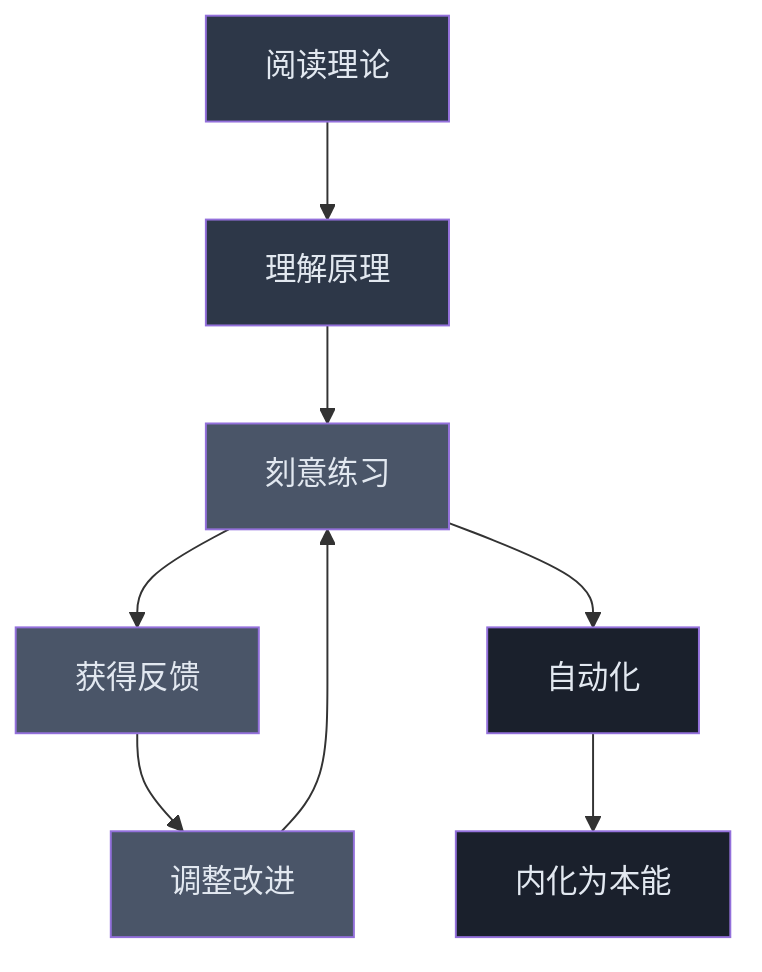
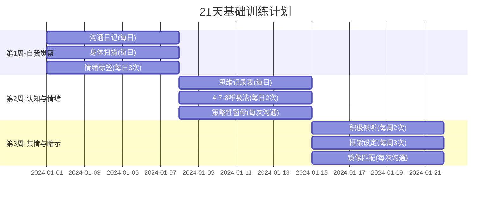
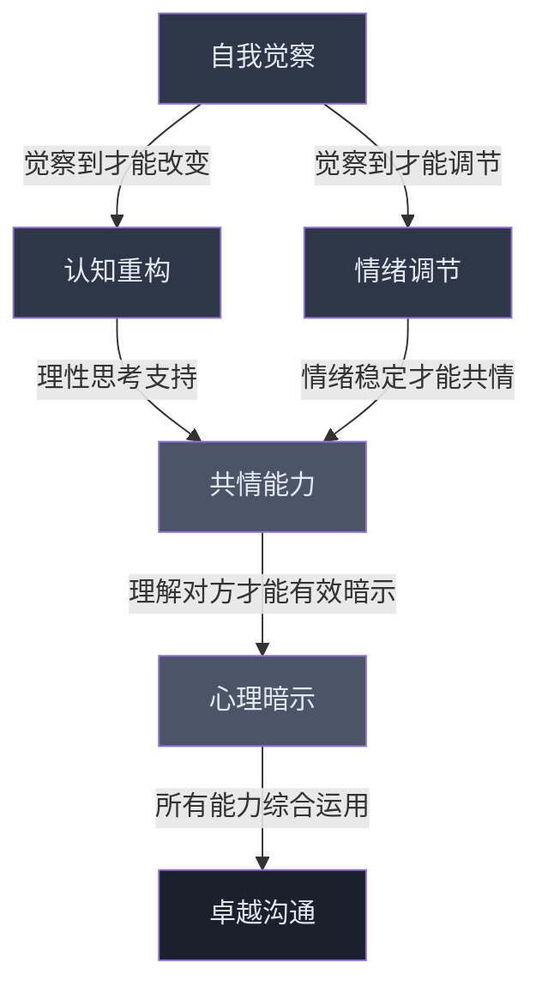

# 沟通心理学练习方法

## 引言

沟通心理学的能力不是靠阅读理论就能获得的，它需要系统的练习和持续的实践。神经科学研究表明，大脑的可塑性（neuroplasticity）意味着任何心理技能都可以通过反复训练得到强化——但前提是训练方法正确、强度适当、节奏合理。

本章提供一套结构化的练习方案，涵盖**自我觉察、认知重构、情绪调节、共情能力、心理暗示**五个核心领域的训练方法。每个练习都包含明确的目标、步骤、频率和评估标准，帮助读者建立可执行的训练计划。

### 为什么"知道"不等于"做到"

心理学中有一个经典区分：**陈述性知识**（declarative knowledge，知道"是什么"）和**程序性知识**（procedural knowledge，知道"怎么做"）。阅读沟通技巧属于陈述性知识，而真正掌握沟通能力需要将陈述性知识转化为程序性知识——这个转化过程只能通过反复练习完成。

大脑中负责"知道该怎么做"的区域（前额叶皮层）和负责"自动执行"的区域（基底神经节）是不同的。当你第一次学习一个沟通技巧时，前额叶皮层高度活跃，你需要刻意思考每一步。随着练习次数增加，这个技能逐渐转移到基底神经节，变成自动化的习惯。这就是为什么练习是不可替代的。

### 练习的核心原则

在开始具体练习之前，先理解以下四个核心原则，它们决定了训练的成败：

1. **刻意练习**（Deliberate Practice）：不是机械重复，而是带着明确目标、专注于薄弱环节、获得即时反馈的练习。漫无目的地"多和人聊天"不是刻意练习。
2. **渐进超负荷**（Progressive Overload）：借鉴健身理念，训练强度需要逐步提升。第一周练习5分钟的积极倾听，第二周可以尝试10分钟，第三周尝试在高压场景下使用。
3. **间隔重复**（Spaced Repetition）：分散练习的效果优于集中练习。每天练习20分钟持续一个月，效果远好于连续8小时的集训。
4. **情境多样性**（Contextual Variety）：在不同场景、不同对象、不同情绪状态下练习同一个技巧，才能建立真正通用的能力。

---

## 一、自我觉察训练

自我觉察是一切沟通心理学能力的基础。心理学家Daniel Goleman在《情商》中指出，自我觉察是情商的第一支柱——只有当我们能够觉察自己的思维模式、情绪状态和行为习惯时，才能有意识地进行调整。

### 核心原理：元认知（Metacognition）

元认知是"对思考的思考"，即你能够以旁观者的身份观察自己的心理过程。研究表明，高元认知能力的人在情绪管理、决策质量、人际关系等方面都显著优于低元认知能力的人。自我觉察训练本质上就是提升元认知能力的过程。

### 练习1：沟通日记

**目标**：建立对自身沟通模式的系统化觉察能力

**为什么有效**：沟通日记将转瞬即逝的心理过程外化为可审视的文字。心理学研究发现，书写行为本身就能激活大脑的前额叶皮层，降低杏仁核的反应强度，帮助你从情绪中抽离出来。

**步骤**：

1. 每天选择一次重要的沟通事件（可以是面对面交流、电话、线上会议、微信聊天等）
2. 在沟通结束后**尽快**记录以下内容（延迟超过2小时，记忆准确度会下降40%以上）：
   - **情境**：发生了什么？和谁？在哪里？什么时间？沟通渠道是什么？
   - **我的想法**：我当时在想什么？有什么自动思维？脑海中闪过什么画面或念头？
   - **我的情绪**：我感受到了什么情绪？强度如何（0-10分）？身体有什么感觉？
   - **我的行为**：我做了什么？说了什么？用了什么语气？有什么肢体语言？
   - **对方的反应**：对方是如何回应的？语言和非语言是否一致？
   - **结果**：这次沟通达成了什么结果？关系是拉近了还是疏远了？
   - **反思**：如果重来一次，我会怎么做？学到了什么？

**频率**：每天至少一次，持续至少30天

**评估标准**：

| 阶段 | 能力表现 | 标志性特征 |
|------|---------|-----------|
| 第1周 | 能记录基本的情境和行为 | 日记内容偏向描述事实，缺乏内省 |
| 第2周 | 能识别主要的情绪和想法 | 开始出现"我注意到我在……"的句式 |
| 第3周 | 能发现重复出现的模式 | 能看到跨场景的规律，如"每次被否定时我都会……" |
| 第4周 | 能基于反思提出改进策略 | 出现"下次我可以尝试……"的行动计划 |
| 第2月 | 自动觉察能力出现 | 沟通中能实时觉察自己的状态，而非事后才意识到 |
| 第3月 | 觉察能力内化 | 不再需要每天写日记，觉察已成为自然习惯 |

**常见错误与纠正**：

- **错误1：只记录事实，不记录内心过程**。"我和老板讨论了项目进度"是事实描述，不是觉察。应该写："老板问进度时，我心跳加速，脑中闪过'他是不是觉得我不行'的想法，感到焦虑（强度7/10）。"
- **错误2：评判自己**。"我又没控制住情绪，太差了"不是反思，是自我攻击。正确做法是不带评判地观察："我注意到自己在被批评时容易提高音量。"
- **错误3：三天打鱼两天晒网**。效果来自持续性，而非单次质量。哪怕某天只写两句话，也比跳过一天好。

### 练习2：身体扫描

**目标**：通过身体觉察提高情绪觉察能力，建立"身体-情绪"的联结感知

**为什么有效**：情绪不是纯粹的心理现象，它有明确的身体基础。焦虑时胃部收紧、愤怒时拳头握紧、羞愧时脸部发热——这些都是情绪的身体表征。哈佛医学院的研究发现，能够准确识别身体信号的人，情绪调节能力显著更强。

**步骤**：

1. 每天选择一个安静的时间（建议固定时间，如早起后或睡前），坐下或躺下
2. 从头顶开始，逐步扫描身体的每个部位，每个部位停留15-30秒
3. 注意每个部位的感觉：紧张、放松、疼痛、温暖、麻木、沉重、轻盈等
4. 特别关注在沟通中容易紧张的"情绪热点"部位：
   - **肩颈**：承载压力和责任感
   - **胸口**：与悲伤、爱、恐惧相关
   - **腹部**：与焦虑、直觉、"不安感"相关
   - **手部**：与愤怒和行动冲动相关
   - **喉咙**：与表达压抑、"说不出口"相关
5. 不做评判，只是觉察——像科学家观察实验对象一样
6. 扫描完成后，花1分钟回顾：哪些部位最紧张？这种紧张让你联想到什么情绪？

**频率**：每天10-15分钟

**进阶练习**：

- **沟通前后对比扫描**：在重要沟通前和沟通后各做一次简短的身体扫描（2-3分钟），用笔记本记录前后变化。例如："沟通前肩颈紧张6/10，沟通后降到3/10；沟通前腹部平静，沟通后有轻微收紧。"长期积累后，你能发现自己在哪些类型的沟通中身体反应最强烈。
- **实时身体觉察**：在日常沟通中，每隔几分钟快速扫描一下自己的肩颈和腹部。这种"微扫描"只需5秒钟，但能帮你实时捕捉情绪变化。

### 练习3：情绪标签练习

**目标**：提高情绪粒度（emotional granularity）——区分和命名情绪的能力

**为什么有效**：心理学家Lisa Feldman Barrett的研究表明，情绪粒度高的人更善于调节情绪。原因很简单：你无法管理一个你无法命名的东西。"我不舒服"是一个模糊的信号，大脑不知道该如何应对；"我感到被忽视后的委屈"是一个精确的信号，大脑可以直接调用相应的应对策略。

**步骤**：

1. 准备一份详细的情绪词汇表（建议至少包含以下类别）：

| 类别 | 基础词汇 | 细分词汇 |
|------|---------|---------|
| 恐惧类 | 害怕、恐惧 | 忐忑、不安、惊慌、恐慌、心虚、发怵、畏缩 |
| 愤怒类 | 生气、愤怒 | 恼火、烦躁、愤慨、怨恨、窝火、憋屈、暴怒 |
| 悲伤类 | 难过、伤心 | 失落、沮丧、心酸、凄凉、惆怅、哀伤、绝望 |
| 快乐类 | 开心、高兴 | 满足、欣慰、兴奋、自豪、感恩、欣喜、畅快 |
| 厌恶类 | 讨厌、恶心 | 反感、嫌弃、排斥、鄙视、不屑、生厌 |
| 羞耻类 | 尴尬、害羞 | 惭愧、羞愧、窘迫、难为情、无地自容 |
| 惊讶类 | 吃惊、意外 | 震惊、诧异、愕然、目瞪口呆、出乎意料 |
| 复合情绪 | — | 嫉妒（愤怒+恐惧）、怀旧（快乐+悲伤）、焦虑（恐惧+期待） |

2. 每天至少3次，暂停当下的活动（可以设手机闹钟提醒），问自己："我现在的情绪是什么？"
3. 用**尽可能精确**的词汇来描述：
   - 不只是"不舒服"，而是"焦虑"、"烦躁"、"失望"还是"委屈"？
   - 不只是"开心"，而是"满足"、"兴奋"、"感恩"还是"自豪"？
4. 记录情绪词汇、强度（0-10分）和触发情境

**频率**：每天至少3次，持续至少4周

**进阶练习**：

- **混合情绪识别**：尝试区分同时存在的多种情绪。例如："被表扬时，我同时感到高兴（6/10）和不安（4/10）——高兴是因为被认可，不安是因为担心下次达不到期望。"
- **情绪追踪**：用简单的表格或App记录一周内的情绪变化，观察情绪的时间规律（周一最焦虑？周五最轻松？）、场景规律（开会时紧张？和朋友相处时放松？）和触发规律（被否定→愤怒？被忽视→委屈？）。

**常见错误**：用想法替代情绪。"我觉得他不应该这样说"是想法，不是情绪。情绪应该是"我感到愤怒"或"我感到受伤"。

---

## 二、认知重构训练

认知重构（Cognitive Restructuring）是认知行为疗法（CBT）的核心技术。它的基本假设是：**不是事件本身让你痛苦，而是你对事件的解读让你痛苦**。通过识别和改变非理性的思维模式，你可以从根本上改变沟通中的情绪反应。

### 核心原理：认知三角

同一个事件（如"对方没有回复我的消息"），可以产生完全不同的想法（"他太忙了"vs"他不在乎我"），进而导致完全不同的情绪（平静vs焦虑）和行为（耐心等待vs反复追问）。认知重构就是在B环节进行干预。

### 常见认知偏差速查表

在开始练习之前，先熟悉以下在沟通中最常见的认知偏差：

| 认知偏差 | 定义 | 沟通中的典型表现 |
|---------|------|-----------------|
| 读心术 | 在没有证据的情况下假设知道对方在想什么 | "他肯定觉得我的方案很烂" |
| 灾难化 | 把事情往最坏的方向想 | "如果这次谈判失败，我整个职业生涯就完了" |
| 非黑即白 | 用极端的方式看待事物 | "如果他不是100%支持我，那就是反对我的人" |
| 以偏概全 | 从单一事件得出普遍结论 | "我这次演讲紧张了，我就是不擅长公开表达" |
| 情绪推理 | 把感受当成事实 | "我感觉自己不够格，所以我肯定不够格" |
| 个人化 | 把无关的事情归因于自己 | "他今天心情不好，一定是我做了什么" |
| 应该思维 | 用僵化的规则要求自己和他人 | "一个好领导不应该犯这种错误" |
| 过度泛化 | 把一次失败推广到所有情境 | "我跟所有人都沟通不好" |

### 练习4：思维记录表

**目标**：系统地识别和挑战非理性思维，建立"第三只眼"的审视能力

**为什么有效**：思维记录表是CBT中最经典的工具。它强迫你把模糊的、自动化的思维过程拉到意识层面，用理性进行检验。Albert Ellis和Aaron Beck的研究证实，持续使用思维记录表能显著降低焦虑和抑郁水平。

**步骤**：制作以下表格，每天至少填写一次：

| 列 | 内容 | 填写提示 |
|---|------|---------|
| 情境 | 发生了什么？ | 只描述事实，不加解读 |
| 自动思维 | 我脑海中闪过了什么想法？ | 尽量原样记录，不修饰 |
| 情绪 | 我感受到了什么？强度（0-10）？ | 可以有多种情绪 |
| 支持证据 | 有什么证据支持这个想法？ | 只列客观事实，不列感受 |
| 反对证据 | 有什么证据反对这个想法？ | 想象朋友遇到同样情况，你会怎么跟他说？ |
| 认知偏差 | 这个想法犯了什么偏差？ | 对照上面的偏差速查表 |
| 替代想法 | 更平衡、更合理的想法是什么？ | 不是"正能量"，而是更接近事实的想法 |
| 新情绪 | 现在我感受到了什么？强度（0-10）？ | 通常强度会下降2-4分 |

**完整示例**：

| 列 | 内容 |
|---|------|
| 情境 | 提案汇报后，领导只说了一句"知道了"，没有其他反馈 |
| 自动思维 | "他肯定对我的提案不满意，我做得不够好" |
| 情绪 | 焦虑（7/10）、失落（5/10） |
| 支持证据 | 领导的表情比较严肃；上次他满意时会多说几句 |
| 反对证据 | 领导今天开了三个会，可能只是累了；他说的是"知道了"不是"这个不行"；上个月我提交的另一个方案他也是这样回复的，后来通过了 |
| 认知偏差 | 读心术（假设知道领导在想什么）、以偏概全（从一个反应推断整体评价） |
| 替代想法 | "领导可能只是需要时间消化，或者今天状态不好。我可以等一两天再主动跟进确认。" |
| 新情绪 | 焦虑（3/10）、失落（2/10）、平静（5/10） |

**频率**：每天至少一次，持续至少4周

**常见错误与纠正**：

- **错误1：在"反对证据"列写不出来**。这通常是因为你处于情绪高峰，视角被情绪窄化了。解决方法：想象你最好的朋友遇到完全相同的情况，你会怎么安慰他？把那些话说给自己听。
- **错误2：替代想法变成"鸡汤"**。"一切都会好的"不是替代想法，是自我麻痹。替代想法应该是具体的、基于证据的、可以验证的。
- **错误3：做了几天就放弃**。思维记录表的效果在第2-3周才会明显体现，因为大脑需要时间建立新的神经通路。

### 练习5：角色互换思维实验

**目标**：打破自我中心的认知视角，培养观点采择（perspective-taking）能力

**为什么有效**：发展心理学家Robert Selman提出的观点采择能力理论指出，成熟的沟通者需要能够从多个视角理解同一事件。角色互换练习直接训练这种能力。

**步骤**：

1. 选择一次让你感到困扰的沟通事件
2. 拿出一张纸，画一条竖线分成两栏，左边写"我的视角"，右边写"对方的视角"
3. 在"我的视角"栏写下：我看到了什么？我感受到了什么？我想要什么？
4. 现在切换到"对方的视角"，用对方的身份、背景和立场来重新审视这次沟通：
   - "如果我是他/她，面对这个情境，我会怎么理解？"
   - "我的感受是什么？我的需求是什么？"
   - "我可能有什么顾虑是他/她不知道的？"
5. 用**对方的第一人称**写一段话描述这次沟通（"我（作为对方）当时觉得……"）
6. 比较两栏的差异，特别注意：哪些差异源于信息不对称？哪些源于立场不同？哪些源于个人经历？

**频率**：每周至少2次

**进阶练习**：

- **三方视角**：增加一个"旁观者"视角——如果一个中立的第三方全程观看这次沟通，他/她会怎么看双方的行为？
- **时间维度**：用"一年后的自己"的视角回看这次沟通——一年后，这件事还重要吗？

### 练习6："最坏情况"预演

**目标**：降低对沟通失败的灾难化恐惧，通过"焦虑免疫"提升心理韧性

**为什么有效**：心理学家Albert Ellis提出的理性情绪行为疗法（REBT）中有一个核心技术叫"灾难化应对"（decatastrophization）：当你直面最坏情况并制定应对方案时，恐惧感会显著降低。原因是大脑的杏仁核对"未知的威胁"反应最强烈，一旦最坏情况被具体化并有了应对方案，威胁感就会大幅下降。

**步骤**：

1. 选择一个让你感到焦虑的即将到来的沟通
2. 写下你最担心的结果，越具体越好
3. 依次回答以下问题，每个问题写下答案：
   - **概率评估**：这个最坏情况发生的概率有多大？（用百分比表示）
   - **应对方案**：如果真的发生了，我能做什么来应对？列出至少3个具体行动
   - **时间透视**：一周后/一个月后/一年后，我会怎么看这件事？
   - **替代结果**：有没有比最坏情况更可能发生的结果？最可能的结果是什么？
   - **最坏情况中的好处**：即使最坏情况发生，有没有任何可能的好处或学习？
4. 基于以上分析，制定一个包含"最坏情况应对方案"的行动计划
5. 重新评估焦虑水平（通常会下降3-5分）

**示例**：

> **即将到来的沟通**：向客户提出涨价方案
> 
> **最担心的结果**：客户愤怒，取消合作，我被公司追责
> 
> **概率评估**：5%（客户更换供应商有很高的转换成本）
> 
> **应对方案**：(1) 如果客户不满，提供阶梯式涨价方案作为缓冲；(2) 准备数据证明涨价的合理性；(3) 如果客户真的要取消，主动向领导汇报并提供替代客户方案
> 
> **时间透视**：一年后，这只是一次普通的商业谈判
> 
> **更可能的结果**：客户会还价，最终达成一个折中方案

**频率**：每次感到沟通焦虑时使用

---

## 三、情绪调节训练

情绪调节（Emotional Regulation）不是"压制情绪"，而是"选择如何回应情绪"。心理学家James Gross的情绪调节过程模型指出，情绪调节可以在情绪产生的不同阶段进行干预：情境选择、情境修正、注意力部署、认知改变和反应调节。以下练习覆盖了最实用的几个层面。

### 核心原理：情绪的"窗口容忍度"

神经科学家Dan Siegel提出的"窗口容忍度"（Window of Tolerance）理论指出，每个人都有一个情绪激活的最佳范围。在这个范围内，你能理性思考、有效沟通。当情绪激活过高（过度焦虑、愤怒），你会进入"超激越"状态；当情绪激活过低（麻木、解离），你会进入"低激越"状态。情绪调节的目标就是让自己保持在"窗口"内。

### 练习7：4-7-8呼吸法

**目标**：在沟通前快速降低焦虑水平，激活副交感神经系统

**为什么有效**：缓慢的深呼吸是少数能直接干预自主神经系统的方法之一。延长呼气时间会刺激迷走神经，触发"休息和消化"反应，降低心率和皮质醇水平。Andrew Weil博士将4-7-8呼吸法称为"自然的镇静剂"。

**步骤**：

1. 舒适地坐下，双脚平放在地上，双手放在膝盖上
2. 将舌尖抵在上颚前牙后方的位置（这有助于控制呼吸节奏）
3. 用鼻子吸气，默数4秒（感受腹部膨胀）
4. 屏住呼吸，默数7秒（保持放松，不要紧绷）
5. 用嘴缓慢呼气，发出"呼"的声音，默数8秒（感受腹部收缩）
6. 重复4-8个循环

**关键细节**：

- 比例比绝对时间更重要——如果7秒屏气太难，可以缩短为4-3-6或3-5-4
- 呼气时发出轻微的"呼"声有助于放松
- 第一次做可能会感到轻微头晕，这是正常的，坐下来做就好
- 效果在持续练习4-6周后会显著增强

**频率**：
- 日常练习：每天早晚各一次（4个循环），建立基础
- 沟通前应用：重要沟通前5分钟（4-8个循环）
- 睡前应用：帮助改善睡眠质量（8个循环）

### 练习8：情绪"着陆"技术

**目标**：在情绪失控时快速恢复平静，从"思维反刍"中抽离

**为什么有效**：当人陷入情绪风暴时，注意力会完全被内心的负面思维占据——这叫做"思维反刍"（rumination）。5-4-3-2-1着陆技术通过强制将注意力转移到外部感官体验，打断反刍循环，帮助前额叶皮层重新接管控制权。这个方法被广泛应用于创伤后应激障碍（PTSD）和焦虑症的治疗中。

**步骤**（5-4-3-2-1法）：

1. **看到5样东西**：环顾四周，说出你能看到的5样东西，并描述它们的颜色和形状（"一盏黄色的台灯"、"一扇灰色的门"……）
2. **触摸4样东西**：触摸你能接触到的4样东西，感受它们的质地和温度（"桌面是冰凉光滑的"、"衣服是柔软的"……）
3. **听到3种声音**：注意你能听到的3种声音（空调的嗡嗡声、键盘的敲击声、远处的车声……）
4. **闻到2种气味**：注意你能闻到的2种气味（咖啡的香气、空气清新剂的味道……如果闻不到，可以想象两种你喜欢的气味）
5. **尝到1种味道**：注意你嘴里的1种味道（刚喝的水的味道、牙膏的余味……如果尝不到，可以含一颗薄荷糖）

**原理**：通过将注意力从情绪转移到感官体验，打破情绪的"思维反刍"循环。5-4-3-2-1的递减结构本身也有镇静效果——它给了大脑一个有序的任务来执行。

**频率**：每次感到情绪即将失控时使用

**进阶变体**：

- **简化版（60秒快速着陆）**：只做5-4两步，适合在沟通中不方便长时间暂停时使用
- **运动版**：起身走动，感受脚底与地面的接触，适合久坐时使用
- **社交版**：在与人交谈时，将注意力放在对方的眼睛颜色、衣服纹理等细节上

### 练习9：策略性暂停练习

**目标**：在沟通中建立"暂停"的习惯，避免情绪化的即时反应

**为什么有效**：在情绪升温的沟通中，人的反应时间会缩短——大脑从"思考-回应"模式切换到"刺激-反应"模式，说出去的话往往不是你真正想表达的。一个2-3秒的暂停就足以让前额叶皮层重新参与决策。

**步骤**：

1. 在日常沟通中，当感到情绪开始升温（心跳加速、音量提高、思维加速），有意识地暂停
2. 使用以下暂停话术（选择最适合你风格的）：
   - "让我想一想这个问题"
   - "这是一个很好的问题，我需要一点时间思考"
   - "我可以喝口水再回答吗？"
   - "你说的这个点很重要，我想确认一下我的理解"
   - "嗯……"（配合思考的表情，自然地停顿2-3秒）
3. 在暂停期间，快速做一个深呼吸（2秒吸气，4秒呼气），觉察自己的情绪状态
4. 问自己："我现在想要的结果是什么？我接下来的话会帮助我达到这个结果吗？"
5. 基于这个觉察，选择你的回应方式

**频率**：在每次沟通中有意识地使用至少一次

**常见错误**：

- **暂停时间太长**：超过5秒的沉默在对话中会显得尴尬。暂停应该是自然的，不是明显的中断。
- **暂停时看起来在走神**：暂停时保持眼神接触和思考的表情，不要目光游离。
- **只在冲突中使用**：在日常对话中也练习暂停，这样在高压场景下才能自然使用。

---

## 四、共情能力训练

共情（Empathy）是沟通心理学中最强大的工具。神经科学研究发现，人类大脑中有专门的"镜像神经元"系统，使我们能够自动感知他人的情绪和意图。但这种自动感知能力因人而异，且可以通过训练显著提升。

### 共情的三个层次

| 层次 | 定义 | 表现 | 沟通效果 |
|------|------|------|---------|
| 认知共情 | 理解对方的想法和立场 | "我明白你为什么这样想" | 让对方感到被理解 |
| 情感共情 | 感受对方的情绪 | "我能感受到你的痛苦" | 让对方感到不孤单 |
| 共情关注 | 产生帮助对方的愿望 | "我想为你做点什么" | 让对方感到被支持 |

三个层次需要平衡发展：只有认知共情容易显得冷漠；只有情感共情容易情绪过载；只有共情关注容易越俎代庖。

### 练习10：积极倾听练习

**目标**：提高倾听的专注度和深度，从"听内容"升级到"听情绪"和"听需求"

**为什么有效**：大多数人听别人说话时，大脑实际上在做三件事之一：准备自己要说什么、评判对方说的话、走神想别的事情。真正的积极倾听要求暂停这三种活动，将全部注意力放在对方身上。Carl Rogers（人本主义心理学之父）的研究表明，当一个人感到被真正倾听时，他的防御会降低，开放度会提升，问题解决能力也会增强。

**步骤**：

1. 选择一位朋友或家人，进行一次15分钟的对话
2. 你的角色是"纯粹的倾听者"——不给建议、不分享自己的经历、不评判、不试图"解决问题"
3. 只使用以下回应方式：
   - **非语言回应**：点头、眼神接触、"嗯"
   - **反射式回应**（用自己的话复述对方的意思）："你的意思是……对吗？"
   - **情感标注**（说出你感知到的对方的情绪）："听起来你感到很沮丧"
   - **开放式问题**（引导对方深入表达）："你能多说一些吗？" "这件事对你意味着什么？"
   - **沉默**（给对方思考和组织语言的空间）
4. 对话结束后，向对方确认："我理解的是……对吗？我有没有遗漏什么？"

**频率**：每周至少2次

**进阶练习**：

- **高级版**：在对方说完后，尝试复述三个层次——"你刚才说了……（内容），听起来你感到……（情绪），你希望……（需求）"
- **困难版**：找一个你不同意的人进行积极倾听。目标不是改变自己的观点，而是真正理解对方为什么那样想。
- **计时版**：在日常对话中，尝试让自己的发言比例降到30%以下。

### 练习11：非语言解读练习

**目标**：提高对非语言信号的敏感度，学会"读懂言外之意"

**为什么有效**：Albert Mehrabian的经典研究（虽然常被误读）揭示了一个重要事实：当语言和非语言信号不一致时，人们更倾向于相信非语言信号。在沟通中，"他说的"和"他真正想表达的"之间可能存在差距，非语言信号是弥合这个差距的钥匙。

**步骤**：

1. 在公共场所（如咖啡厅、地铁、公园），观察他人的非语言行为
2. 注意以下方面，并尝试做出推断：
   - **面部表情**：他们看起来是什么情绪？表情是自然的还是刻意的？
   - **眼神**：眼神接触的频率和时长？是回避还是直视？是温暖的还是有压力的？
   - **身体姿态**：开放（手臂放松、身体前倾）还是封闭（交叉双臂、后仰）？
   - **互动模式**：两个人之间的空间距离是多少？同步性如何？（同步性高通常说明关系亲密）
   - **语调变化**：声音是高还是低？快还是慢？音量是大还是小？
   - **微表情**：有没有一闪而过的真实情绪（如嘴角瞬间下垂）？
3. 记录你的观察和推断
4. 重要提醒：**你的推断可能不准确**——练习的重点不是"猜对"，而是提高对非语言信号的注意力

**频率**：每天5-10分钟

**在实际沟通中的应用**：

- **一致性检查**：对方说"我没生气"，但身体后仰、双臂交叉、下颌紧绷——这时非语言信号可能比语言更真实
- **情绪预警**：对方开始频繁看手机、脚尖转向门口——可能是想结束对话
- **建立连接**：当你注意到对方的非语言变化时，可以温和地反馈："你看起来好像有些顾虑？"

### 练习12：视角转换冥想

**目标**：培养从他人视角看问题的能力，深化情感共情

**为什么有效**：冥想研究（如哈佛大学Sara Lazar团队的工作）表明，定期进行视角转换冥想可以增加大脑中与共情相关区域（如前脑岛和前扣带皮层）的灰质密度。这是一种"硬件升级"。

**步骤**：

1. 选择一个与你有分歧或冲突的人
2. 找一个安静的地方坐下，闭上眼睛，做5次深呼吸（每次呼气比吸气长）
3. 想象你"进入"了对方的身体，用对方的眼睛看世界：
   - 想象对方的外貌、声音、身体感觉
   - 想象对方的日常生活：早上起床在想什么？工作中面对什么压力？
   - 想象对方的成长经历：什么样的经历塑造了他/她的性格和信念？
4. 从对方的视角，重新审视你们之间的分歧：
   - "从他/她的角度看，什么是最合理的？"
   - "他/她最害怕的是什么？"
   - "他/她最需要的是什么？"
5. 慢慢回到自己的视角，花2分钟记录你的新发现
6. 特别注意：有没有之前忽略的信息？有没有新的理解？

**频率**：每周至少1次，每次10-15分钟

**进阶练习**：

- **扩展到陌生人群体**：对新闻中的人物、历史人物、甚至小说中的角色进行视角转换冥想，拓宽共情的边界
- **即时视角转换**：在日常沟通中，当感到不理解对方时，花30秒做一个快速的视角转换（不需要完整冥想流程）

---

## 五、心理暗示训练

心理暗示（Psychological Priming）是沟通中最隐蔽但最有力的工具。它不是"操控"，而是通过精心选择语言和行为框架，引导对话向更建设性的方向发展。Richard Bandler和John Grinder开创的神经语言程序学（NLP）以及认知语言学家George Lakoff的框架理论，都为这一领域提供了坚实的理论基础。

### 核心原理：框架效应（Framing Effect）

诺贝尔经济学奖得主Daniel Kahneman和Amos Tversky的研究表明，同一个信息用不同的方式呈现，会导致截然不同的决策。例如，"这个手术的成功率是90%"和"这个手术的死亡率是10%"传达的是同一个事实，但前者让78%的人选择接受手术，后者只有39%。

### 练习13：框架设定练习

**目标**：学会用不同的方式描述同一情境，选择最有效的沟通框架

**步骤**：

1. 选择一个沟通情境（如谈判、求职面试、说服他人、请求帮助）
2. 用以下五种不同的框架来描述同一个提议，每种写一段完整的表述：

| 框架类型 | 核心逻辑 | 示例句式 |
|---------|---------|---------|
| 损失框架 | 强调不行动会失去什么 | "如果我们不抓住这个机会，竞争对手会……" |
| 收益框架 | 强调行动能获得什么 | "如果我们推进这个方案，预计能提升30%的效率" |
| 身份框架 | 将行动与身份认同绑定 | "作为行业领先者，我们一直都在引领创新" |
| 社会证明框架 | 利用从众心理 | "目前已有85%的头部企业采用了这种方案" |
| 故事框架 | 用具体案例替代抽象论述 | "上个月XX公司做了类似的尝试，结果三个月内……" |

3. 对每种框架评估：对你的目标受众，哪种最有效？为什么？
4. 尝试在实际沟通中使用你认为最有效的框架

**频率**：每周至少练习3个不同情境

### 练习14：预设性语言练习

**目标**：学会在语言中嵌入积极预设，潜移默化地引导对话方向

**为什么有效**：预设（presupposition）是语言学中的一个概念——当你说"你更喜欢A还是B？"时，你预设了对方会喜欢A或B中的一个，而不是拒绝两者。这种技巧在销售、谈判和日常沟通中都非常实用。

**步骤**：

1. 收集并练习以下类型的预设性语句：

| 预设类型 | 示例 | 隐含的预设 |
|---------|------|-----------|
| 行动预设 | "当你完成这个项目时，你最期待什么？" | 预设会完成 |
| 选择预设 | "你更倾向于A方案还是B方案？" | 预设会选择 |
| 成功预设 | "等我们达成合作后，第一步做什么？" | 预设合作会达成 |
| 认同预设 | "你什么时候开始注意到这个问题的？" | 预设你注意到了 |
| 能力预设 | "你是怎么想到这个解决方案的？" | 预设你有能力解决 |

2. 在日常沟通中有意识地使用（每天至少3次）
3. 观察对方的反应——好的预设应该让对方自然地接受框架，而不是感到被操控

**频率**：每天至少使用3次

**使用注意事项**：

- 预设应该是善意的、建设性的，不是用来操纵对方做出不利决策
- 如果对方明显表示不同意预设的前提，要灵活调整，不要强行坚持
- 预设在书面沟通（如邮件、提案）中效果更明显，因为对方无法实时质疑

### 练习15：镜像与匹配练习

**目标**：学会适度匹配对方的沟通风格，建立潜意识的亲近感

**为什么有效**：人类天然倾向于喜欢与自己相似的人——这叫做"相似性吸引"（similarity-attraction）效应。当你适度匹配对方的沟通风格时，对方会潜意识地感到"这个人和我是同类人"，信任感会显著提升。神经科学研究发现，当两个人的行为趋于同步时，他们大脑中的镜像神经元系统会激活，产生一种"神经共鸣"。

**步骤**：

1. 在下次与人交谈时，有意识地观察对方的：
   - **语速**：快还是慢？
   - **音量**：高还是低？
   - **语调**：平稳还是起伏大？
   - **用词偏好**：偏正式还是偏口语？喜欢用数据还是喜欢用故事？
   - **身体姿态**：前倾还是后仰？动作多还是少？
   - **手势**：大动作还是小动作？
   - **呼吸节奏**：快还是慢？
2. 在观察1-2分钟后，**渐进地**（不是突然地）调整自己的风格，使其与对方更加协调
3. 注意"适度"——匹配不是模仿。具体的执行尺度：
   - 语速：在对方语速的±20%范围内调整
   - 音量：匹配对方的音量级别
   - 姿态：如果对方前倾，你也可以适度前倾，但不要一模一样
   - 用词：使用对方偏好的表达方式（对方说"数据"你也说"数据"，对方说"感觉"你也说"感觉"）
4. 在对话中途，可以尝试轻微地引导——如果你将语速稍微放慢，对方可能会跟随你放慢

**频率**：每次沟通中有意识地练习

**常见错误**：

- **过度镜像**：对方每一个动作你都立刻复制，这会让对方感到诡异。镜像应该是延迟1-2秒、幅度略小的。
- **忽视情境**：在正式场合（如法庭、学术报告），镜像的幅度应该更小。
- **只关注外在**：镜像不只是身体动作，更包括语言风格、思维方式和价值观层面的匹配。

---

## 六、综合训练计划

单项练习打好基础后，需要一个系统化的综合训练计划来整合所有技能。

### 21天基础训练计划

这个计划适合零基础的读者，目标是在21天内建立基本的觉察能力和一两个核心技能。

| 周 | 重点 | 每日练习 | 单次时长 |
|----|------|----------|---------|
| 第1周 | 自我觉察 | 沟通日记 + 身体扫描 + 情绪标签 | 约25分钟/天 |
| 第2周 | 认知与情绪 | 思维记录表 + 4-7-8呼吸法 + 策略性暂停 | 约20分钟/天 |
| 第3周 | 共情与暗示 | 积极倾听 + 框架设定 + 镜像匹配 | 约20分钟/天 |

### 90天进阶训练计划

这个计划适合已经完成21天基础训练的读者，目标是将技能从"刻意使用"转化为"自动习惯"。

| 月 | 重点 | 核心练习 | 每周投入 |
|----|------|---------|---------|
| 第1月 | 内化基础 | 每日沟通日记（可简化为关键事件）+ 每周2次倾听练习 + 每日呼吸练习 + 每周1次思维记录表 | 约3小时/周 |
| 第2月 | 场景应用 | 将技巧应用于实际工作场景（如会议、谈判、冲突处理），每周写一篇"场景复盘" | 约2小时/周（练习融入日常） |
| 第3月 | 自动化 | 减少刻意练习频率，观察技巧是否已成为自然习惯；增加困难场景的练习（如高压谈判、处理冲突） | 约1小时/周 |

### 场景化练习方案

不同场景对沟通心理学技能的需求不同。以下是几个常见场景的专项练习方案：

**场景一：职场汇报与说服**

| 练习 | 应用 |
|------|------|
| 框架设定 | 在汇报前准备3种不同的表述框架，选择最适合听众的 |
| 预设性语言 | "等方案通过后，下一步我们可以……" |
| 镜像匹配 | 匹配领导的沟通风格（数据型→用数据说话，直觉型→用案例说话） |
| 策略性暂停 | 遇到质疑时，先暂停3秒再回应 |

**场景二：冲突处理与谈判**

| 练习 | 应用 |
|------|------|
| 角色互换 | 在回应前先尝试理解对方的立场 |
| 4-7-8呼吸法 | 情绪升温时快速调节 |
| 思维记录表 | 识别和挑战"对方在针对我"等非理性想法 |
| 情绪标签 | 精确识别自己的情绪，避免情绪化回应 |

**场景三：亲密关系沟通**

| 练习 | 应用 |
|------|------|
| 积极倾听 | 在伴侣倾诉时不急于给建议，先倾听和共情 |
| 身体扫描 | 感知自己在亲密对话中的身体变化 |
| 情绪标签 | 区分"生气"和"受伤"——亲密关系中的愤怒往往掩盖着更深的受伤感 |
| 视角转换冥想 | 在争吵后，尝试从伴侣的角度理解整个事件 |

### 评估与调整体系

**每周自我评估**（5分钟，每周日晚上完成）：

1. 这周我在哪些沟通中应用了所学技巧？（列出具体场景）
2. 效果如何？（1-10分，评估每个场景的效果）
3. 什么有效？什么需要改进？
4. 我遇到了什么困难？如何克服？
5. 下周我要重点练习什么？

**每月进步检查**：

1. 对比月初和月末的沟通日记，是否发现模式的变化？
2. 他人是否注意到我的沟通方式有所改善？（可以主动询问信任的朋友）
3. 我的沟通焦虑水平是否有变化？（用0-10分对比月初和月末的评分）
4. 哪些技能已经"内化"？哪些还需要刻意练习？
5. 需要调整练习计划吗？

**量化评估指标**：

| 指标 | 评估方式 | 目标 |
|------|---------|------|
| 沟通焦虑水平 | 每周自评0-10分 | 每月下降1-2分 |
| 情绪觉察速度 | 从事件发生到觉察情绪的时间 | 从"事后才意识到"缩短到"实时觉察" |
| 认知偏差频率 | 每周记录的偏差数量 | 逐月减少 |
| 共情准确性 | 倾听练习中对方确认理解的次数比例 | 从50%提升到80%+ |
| 技能使用频率 | 每周有意识使用技巧的沟通次数 | 从2-3次提升到每天使用 |

---

## 七、常见问题与进阶指南

### 常见问题解答

**Q1：练习了两周感觉没有效果，正常吗？**

正常。心理技能的习得遵循"平台期"模式——前1-2周你可能会觉得不自然甚至更笨拙，因为你开始注意到以前忽略的问题。这实际上是进步的标志。第3-4周开始会感到流畅度提升，第6-8周会开始感到自然。

**Q2：每天需要花多少时间？**

基础阶段（第1-3周）：每天20-30分钟（可以分散在全天）。进阶阶段（第1-3月）：每天10-15分钟正式练习 + 全天的"融入式练习"（在日常沟通中有意识地使用技巧）。自动化阶段：不需要专门的练习时间，技巧已经成为自然习惯。

**Q3：如何在不被对方察觉的情况下练习？**

大部分练习是内隐的（你的内心活动），对方不会注意到。即使是镜像匹配和积极倾听，只要做得适度，对方只会觉得"和你聊天很舒服"，而不会意识到你在"练习"。

**Q4：练习时犯了尴尬的错误怎么办？**

每次"失误"都是宝贵的学习素材。记录到沟通日记中，分析：是什么导致了失误？下次可以怎么调整？记住，沟通能力的提升不是线性的，偶尔的退步是正常的。

**Q5：和不同的人沟通需要不同的技巧吗？**

是的。随着练习深入，你会发展出"沟通灵活性"——根据对象、场景和目标灵活调整策略。这正是从"会技巧"到"真正会沟通"的关键跨越。

### 进阶资源推荐

| 类别 | 资源 | 适用阶段 |
|------|------|---------|
| 书籍 | 《非暴力沟通》Marshall Rosenberg | 基础阶段 |
| 书籍 | 《情商》Daniel Goleman | 基础阶段 |
| 书籍 | 《影响力》Robert Cialdini | 进阶阶段 |
| 书籍 | 《关键对话》Patterson等 | 进阶阶段 |
| 书籍 | 《思考，快与慢》Daniel Kahneman | 深度阶段 |
| App | Daylio（情绪追踪） | 全阶段 |
| App | Headspace/Calm（冥想引导） | 全阶段 |
| 练习 | 加入Toastmasters演讲俱乐部 | 进阶阶段 |

---

## 本节小结

沟通心理学能力的提升是一个系统工程，而非单一技巧的堆砌。本章提供的练习方案涵盖了自我觉察、认知重构、情绪调节、共情能力和心理暗示五个核心领域，从基础到进阶，从单项技能到综合应用。

回顾五个领域的递进关系：

关键在于：选择适合自己的练习，设定合理的目标，保持耐心和坚持。记住，沟通能力的提升是一个渐进的过程——每一次有意识的练习，都是向更好的沟通者迈进的一步。当某一天你发现自己不再"刻意"使用这些技巧，而是自然而然地做到了，你就知道训练已经真正成功了。
