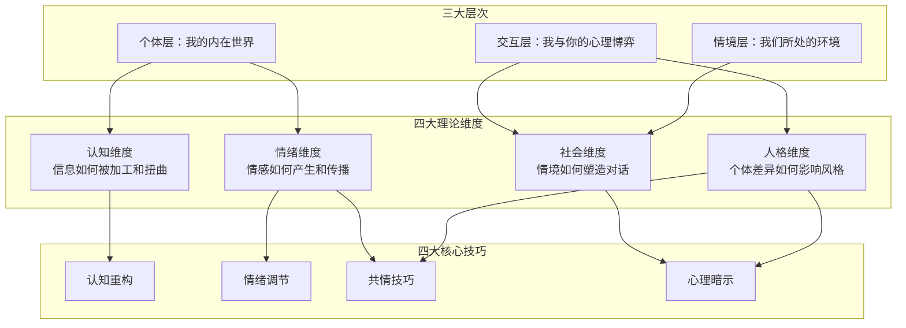
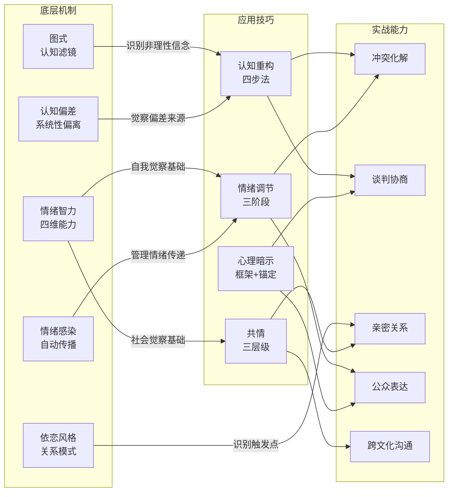

# 第十四章 本章小结

## 本章定位与回顾

沟通心理学是全书的理论制高点——它不教你"怎么说"，而是帮你理解"为什么这么说有效/无效"。前面六个小节从理论基础、核心技巧、实战案例、常见误区到练习方法，完成了一个完整的"知→信→行"闭环。本小节的使命是三件事：**提炼核心骨架**（让你合上书能回忆起整章的知识结构）、**建立能力自评标准**（让你知道自己处于哪个阶段）、**给出可执行的行动路线**（让知识立刻转化为行动）。

---

## 一、知识体系总览

### 1.1 四维度×三层次分析框架

本章的全部内容可以装进一个 4×3 矩阵里。这个矩阵不仅是回顾工具，更是你面对任何沟通问题时的分析引擎：

**使用方法**：遇到任何沟通困境，先定位问题在哪个维度（认知？情绪？社会？人格？），再定位问题在哪个层次（个人内心？双方互动？外部情境？），然后选择对应的技巧去应对。

### 1.2 理论→技巧→实战的映射关系

下表展示了本章知识的逻辑链条——每一条理论如何转化为可操作的技巧，又如何在实战中落地：

| 理论来源 | 核心概念 | 对应技巧 | 实战场景 | 关键行动 |
|---------|---------|---------|---------|---------|
| 认知心理学（图式理论、归因理论、认知偏差） | 人们通过"认知滤镜"看世界 | 认知重构 | 冲突沟通、亲密关系 | 觉察自动思维→质疑→替代→验证 |
| 情绪心理学（情绪感染、情绪智力、情绪调节） | 情绪是最强的沟通变量 | 情绪调节 | 危机沟通、向上管理 | 前置准备→觉察标注→策略暂停→事后恢复 |
| 社会心理学（从众、说服、面子、群体动力） | 社会情境无时无刻不在塑造对话 | 心理暗示 + 框架设定 | 谈判协商、团队调解 | 框架转换→利益重构→面子保护 |
| 人格心理学（大五人格、依恋理论、DISC） | 没有放之四海而皆准的沟通方式 | 共情技巧 + 风格适配 | 跨文化沟通、与内向者沟通 | 识别类型→调整节奏→适配风格 |

### 1.3 核心概念关系网络

本章的概念并非孤立存在，而是形成了一个紧密关联的网络。理解这些关联，才能在实际场景中灵活组合运用：

---

## 二、核心要点精炼

### 2.1 理论基础：四大支柱及其核心洞见

**认知心理学——"每个人都在通过自己的滤镜看世界"**

核心机制：信息加工模型揭示了感觉登记→选择性注意→工作记忆→长期记忆的完整链条。图式（预设认知框架）决定了我们如何解释新信息，归因偏差（基本归因错误、行动者-观察者效应、自利归因）则系统性地扭曲我们对他人行为的解读。确认偏误、框架效应、锚定效应等认知偏差在无意识层面运作，使我们"看到的不是事实，而是自己期望看到的"。

一句话总结：**沟通的第一敌人不是对方的固执，而是自己大脑的信息加工偏差。**

**社会心理学——"沟通从不发生在真空中"**

核心机制：从众效应让群体压力压制个体真实声音；权威效应导致"皇帝的新衣"；精细加工可能性模型（ELM）揭示说服有中央路径（逻辑和证据）和外周路径（情感和线索）两条通道；面子理论说明社交互动中维护双方面子是基本需求；群体思维和群体极化揭示了群体沟通的系统性陷阱。

一句话总结：**有效沟通不仅需要"说得对"，还需要"在对的情境中用对的方式说"。**

**情绪心理学——"情绪是最强大也最难控制的沟通变量"**

核心机制：情绪感染使情绪在沟通者之间自动传播；情绪智力的四个维度（自我觉察→自我管理→社会觉察→关系管理）构成情绪沟通能力的核心；格罗斯的情绪调节过程模型将调节分为情境选择→情境修改→注意分配→认知改变→反应调节五个阶段；情绪劳动解释了为什么"职业性微笑"会消耗心理能量。

一句话总结：**管理情绪不是压抑情绪，而是在正确的时机以正确的方式表达情绪。**

**人格心理学——"没有放之四海而皆准的沟通方式"**

核心机制：大五人格（开放性、尽责性、外向性、宜人性、神经质）描述了人格特质如何塑造沟通风格；依恋理论揭示了安全型、焦虑型、回避型、混乱型四种依恋模式如何在亲密关系中制造特定的沟通困境（追-逃循环）；DISC模型提供了实用的行为风格分类（支配型D、影响型I、稳健型S、谨慎型C）。

一句话总结：**理解人格差异不是给人贴标签，而是为不同的人调整沟通的频道。**

### 2.2 核心技巧：四大能力及其操作要点

**认知重构——改变看问题的方式，就能改变感受和行为**

操作核心：四步法——觉察（识别自动思维）→质疑（检验证据）→替代（构建合理想法）→验证（在实践中检验）。五种非理性信念类型：绝对化要求、过度概括、灾难化思维、读心术、情绪推理。理论基础是埃利斯的ABC模型：触发事件(A)→信念(B)→结果(C)，改变B就能改变C。

**情绪调节——在正确的时间以正确的方式表达情绪**

操作核心：三阶段管理——沟通前（4-7-8呼吸法、渐进式肌肉放松、预演想象、意图设定）、沟通中（情感标注、策略性暂停、情绪降级）、沟通后（运动释放、书写加工、意义建构、自我关怀）。关键原则：早期调节（情境选择和认知改变）比晚期调节（反应抑制）更有效且心理代价更低。

**共情技巧——理解他人感受并做出恰当回应**

操作核心：三个层次递进——认知共情（理解观点）→情感共情（感受情绪）→共情关怀（产生帮助意愿）。倾听五要素：全身心投入、反射式回应、情感标注、深层倾听、开放式提问。关键区分：共情≠同意，理解≠认同。警惕共情疲劳、共情偏见、过度共情和假性共情四个陷阱。

**心理暗示——在道德框架内引导积极的沟通走向**

操作核心：语言层面（框架设定、预设性语言、锚定技术、隐喻故事）和非语言层面（镜像效应、空间距离、环境布置）两条路径。道德边界：意图是帮助对方而非操控对方，方式是透明而非欺骗，结果是双赢而非单方获利。

### 2.3 实战案例：八大场景的关键启示

| 场景 | 核心心理机制 | 首要策略 | 一句话教训 |
|------|------------|---------|-----------|
| 危机沟通（情绪激动的对方） | 情绪感染 + 防御机制激活 | 先管理情绪，再解决问题 | 对方需要的不是你的方案，而是被理解 |
| 与内向者沟通 | 外向性差异 + 独处需求 | 适应节奏，创造安全感 | 沉默不是拒绝，是深度思考的方式 |
| 跨部门冲突 | 零和思维 + 群体认同 | 从零和转向共赢框架 | 冲突的根源通常是资源感知，不是人格对立 |
| 亲密关系沟通 | 依恋模式 + 追-逃循环 | 识别依恋类型，打破自动循环 | 伴侣的"追问"和"退缩"都是在表达"我需要你" |
| 向上管理 | 信息加工风格 + 权力动态 | 适配决策者的认知偏好 | 领导需要的不是你的过程，而是你的结论 |
| 团队调解 | 面子理论 + 群体动力 | 分别保护面子，引导共同目标 | 调解不是评判谁对谁错，而是找到共同利益 |
| 跨文化沟通 | 文化框架差异 + 高低语境 | 文化觉察和元沟通 | 不确定时，直接讨论"我们的沟通方式" |
| 公开演讲 | 演讲焦虑 + 注意力管理 | 系统心理准备 + 注意转移 | 焦虑和兴奋在生理上几乎相同，区别在于解读 |

### 2.4 需要避免的十大误区

本章识别了十个高频误区，核心教训可以浓缩为五句话：

1. **共情≠同意**：你可以理解对方为什么愤怒，同时不认为愤怒是合理的
2. **暗示≠操控**：心理暗示的道德性取决于意图（帮助vs利用）和方式（透明vs欺骗）
3. **重构≠盲目乐观**：认知重构是基于证据的理性替代，不是自我欺骗
4. **管理≠压抑**：情绪管理是调节和智慧表达，不是压抑或发泄
5. **真诚>技巧**：话术是工具，真诚才是核心；机械使用技巧反而损害信任

另外五个常见错误：

6. **标签化思维**："他是回避型依恋所以没救了"——人格理论是理解工具，不是判决书
7. **忽视非语言**：只关注语言内容而忽略语调、表情、肢体语言，等于只看到冰山一角
8. **单一归因**：沟通问题是多维度的（认知+情绪+社会+人格），不能只归因于心理因素
9. **期待速效**：能力提升需要时间，"读完就改变"是不切实际的预期
10. **文化盲区**：西方心理学研究的结论不能直接套用到所有文化语境

### 2.5 练习方法：能力提升的四级阶梯

| 阶段 | 目标 | 核心练习 | 时间框架 | 里程碑 |
|------|------|---------|---------|--------|
| 觉察 | 认识自己的沟通模式 | 沟通日记、身体扫描、情绪标签 | 第1-2周 | 能识别3种以上重复出现的沟通模式 |
| 理解 | 理解现象背后的心理机制 | 理论学习、案例分析、概念映射 | 第2-3周 | 能用理论解释自己的沟通行为 |
| 练习 | 系统地提升各项能力 | 思维记录表、角色扮演、情境模拟 | 第3-6周 | 在模拟场景中能主动运用技巧 |
| 内化 | 将技巧转化为自然习惯 | 持续实践、反思日志、同伴互助 | 第7周起 | 在压力场景下也能自然运用 |

---

## 三、能力自评：你在哪个阶段？

### 3.1 五级能力模型

沟通心理学能力不是"有或无"的二元状态，而是一个渐进式的成长阶梯。对照以下描述，判断自己当前所处的阶段：

| 等级 | 阶段名 | 典型表现 | 核心特征 |
|------|--------|---------|---------|
| ★☆☆☆☆ | 无意识无能力 | "我不知道自己不知道" | 沟通全凭本能，从未反思过自己的沟通模式 |
| ★★☆☆☆ | 有意识无能力 | "我知道自己做得不好，但不知道怎么改" | 开始觉察问题，但缺乏理论框架和操作方法 |
| ★★★☆☆ | 有意识有能力 | "我知道怎么做，但需要刻意提醒自己" | 掌握了理论和技巧，但在压力下容易退回到旧模式 |
| ★★★★☆ | 熟练应用 | "大多数场景下我能自然运用" | 技巧开始内化，能在复杂场景中灵活组合运用 |
| ★★★★★ | 精通整合 | "我能根据不同场景创新性地运用" | 理论融会贯通，能在全新场景中自行推导策略 |

### 3.2 四维度快速自测

在以下每个维度上给自己打分（1-5分），识别最需要强化的领域：

| 维度 | 自测问题 | 得分 |
|------|---------|------|
| **认知维度** | 当沟通出现误解时，我会先检查自己的理解是否有偏差？我能识别自己和对方的归因偏差吗？ | ___ |
| **情绪维度** | 在情绪激动时，我能觉察并管理自己的情绪吗？我有系统的情绪调节策略吗？ | ___ |
| **共情维度** | 我能准确感知对方的情绪状态吗？我能在不认同对方观点的情况下表达理解吗？ | ___ |
| **人格维度** | 我能根据不同人的沟通风格调整自己的方式吗？我了解自己的人格特质如何影响沟通吗？ | ___ |

**结果解读**：

- **得分最低的维度** = 你当前最大的短板，优先学习该维度对应的理论和技巧
- **四个维度得分均衡** = 基础扎实，重点转向实战应用和深度整合
- **某个维度得分远高于其他** = 警惕"锤子效应"——你可能过度依赖单一维度

---

## 四、核心公式与速查框架

以下是本章最实用的几个框架，建议保存为速查卡片：

### 4.1 沟通困境诊断公式

遇到任何沟通问题，按以下顺序诊断：

第1步：定位维度 → 是认知偏差？情绪失控？社会压力？还是人格差异？
第2步：定位层次 → 问题在个人内心？双方互动？还是外部情境？
第3步：选择技巧 → 认知重构？情绪调节？共情？还是框架调整？
第4步：执行并验证 → 行动后观察效果，调整策略

### 4.2 情绪调节SOP（标准操作流程）

【沟通前】
├── 生理准备：4-7-8呼吸法 × 3轮
├── 心理准备：意图设定（我要达成什么？）
└── 预案准备：最坏情况是什么？我能应对吗？

【沟通中】
├── 觉察：我现在是什么情绪？强度几分？
├── 标注："我感到____"（降低杏仁核活动）
├── 暂停：如果情绪强度>7分，策略性暂停
└── 降级：承认情绪→降低威胁→给予控制感

【沟通后】
├── 释放：运动/书写/倾诉
├── 建构：这次经历教会了我什么？
└── 关怀：自我善意 + 共同人性 + 正念

### 4.3 共情倾听五步法

1. 全身心投入 → 放下手机，目光接触，身体前倾
2. 反射式回应 → "你的意思是……对吗？"
3. 情感标注   → "听起来你对这件事感到很失望"
4. 深层倾听   → 听表面信息背后的恐惧和渴望
5. 开放提问   → "这件事对你来说意味着什么？"

### 4.4 认知重构四步法

1. 觉察 → "刚才我脑海中闪过了什么想法？"
2. 质疑 → "有什么证据支持/反对这个想法？"
3. 替代 → 构建更平衡、基于证据的替代想法
4. 验证 → 在实践中检验新想法是否更有效

---

## 五、30天行动计划

### 第一周：建立觉察基础

| 天数 | 行动 | 时间 | 目标 |
|------|------|------|------|
| Day 1 | 完成章节概览中的自我评估问卷 | 5分钟 | 识别当前水平和薄弱维度 |
| Day 1-7 | 每天写沟通日记（记录1次重要沟通） | 10分钟/天 | 建立觉察习惯 |
| Day 3 | 开始身体扫描练习 | 10分钟/天 | 提高身体觉察能力 |
| Day 5 | 做第一次情绪标签练习 | 5分钟 | 开始提高情绪粒度 |
| Day 7 | 回顾本周沟通日记，寻找模式 | 15分钟 | 发现重复出现的沟通模式 |

### 第二周：学习与理解

| 天数 | 行动 | 时间 | 目标 |
|------|------|------|------|
| Day 8-10 | 重读理论基础，重点理解自己的薄弱维度 | 30分钟/天 | 建立理论框架 |
| Day 11-12 | 学习核心技巧，选择最相关的1-2个重点练习 | 30分钟/天 | 掌握操作方法 |
| Day 13-14 | 阅读2个与自己最相关的实战案例 | 20分钟/天 | 建立理论与实践的连接 |

### 第三周：刻意练习

| 天数 | 行动 | 时间 | 目标 |
|------|------|------|------|
| Day 15-17 | 使用思维记录表练习认知重构 | 15分钟/天 | 掌握四步法 |
| Day 18-19 | 在低风险场景中练习共情倾听 | 实际沟通中 | 体验技巧效果 |
| Day 20-21 | 练习情绪调节SOP（在真实场景中） | 实际沟通中 | 建立调节习惯 |

### 第四周：整合与内化

| 天数 | 行动 | 时间 | 目标 |
|------|------|------|------|
| Day 22-24 | 选择一个长期困扰的沟通关系，系统应用策略 | 持续 | 在真实关系中验证 |
| Day 25-27 | 对照十大误区进行自我检查 | 15分钟/天 | 识别并纠正错误习惯 |
| Day 28-30 | 重新完成自我评估，与Day 1对比 | 15分钟 | 量化成长幅度 |

---

## 六、常见应用场景速查

面对以下场景时，快速定位你需要的策略：

| 场景 | 首要技巧 | 核心原则 | 避免 |
|------|---------|---------|------|
| 对方情绪激动、愤怒指责 | 情绪调节（降级）+ 共情 | 先处理情绪，再处理问题 | 直接讲道理、否定感受 |
| 自己感到焦虑、紧张 | 认知重构 + 生理调节 | 焦虑≠危险，重新解读身体信号 | 压抑焦虑、假装没事 |
| 对方沉默不语、不愿沟通 | 共情（创造安全感）+ 人格适配 | 沉默可能是在思考，不是拒绝 | 追问施压、过早下结论 |
| 跨部门利益冲突 | 框架转换 + 利益重构 | 从零和转向共赢 | 只关注自己的立场 |
| 亲密关系中的反复争吵 | 依恋识别 + "我"信息 | 识别追-逃循环，打破自动模式 | 指责对方、翻旧账 |
| 向上级争取资源/支持 | 数据驱动 + 锚定效应 | 适配决策者的信息加工风格 | 只讲感受不讲数据 |
| 需要说服对方接受观点 | ELM双路径 + 框架效应 | 根据对方动机和能力选择路径 | 只用逻辑或只用情感 |
| 公开演讲/重要汇报 | 心理准备 + 注意转移 | 焦虑和兴奋的生理反应相同 | 过度追求完美、灾难化思维 |

---

## 七、延伸思考

### 从技巧到智慧

沟通心理学的终极目标不是"技巧的精通"，而是"人的成长"。当你能够：

- **觉察自己的认知偏差**，你不再被自己的思维惯性绑架
- **管理自己的情绪**，你不再被情绪推着走
- **理解他人的感受**，你不再活在自己的世界里
- **适应不同的人格和文化**，你拥有了真正的沟通自由

你不仅成为了更好的沟通者，也成为了更完整的人。

### 一个值得持续思考的问题

卡尔·罗杰斯说过："当一个人被真正理解时，他就会从这种理解中成长。"但反过来说同样成立——**当你真正理解了一个人，你也会从这种理解中成长。** 共情不仅是给予他人的礼物，也是自我扩展的途径。每一次你成功地站在对方的角度看世界，你的世界就变大了一点。

### 知识的局限

需要坦诚承认的是：心理学研究多基于西方样本，许多结论在跨文化应用时需要审慎。本章介绍的大五人格、依恋理论、ELM模型等都有坚实的实证基础，但它们描述的是概率性规律，而非绝对预测。每个人都是独特的个体，理论是理解的起点，不是理解的终点。

---

## 八、下一步行动

### 立即行动（今天）

1. **选择一个最触动你的技巧**（认知重构/情绪调节/共情/心理暗示），从今天开始练习
2. **打开手机备忘录**，建立你的沟通日记模板：日期→情境→我的想法→我的情绪→我的行为→反思

### 本周行动

3. **在接下来的7天中**，每天记录一次沟通日记，重点关注"我的想法"和"我的情绪"两栏
4. **选择一个你希望改善的沟通关系**，应用本章的分析框架定位问题所在

### 本月行动

5. **完成上面的30天行动计划**，系统地提升各项能力
6. **一个月后重新做一次自我评估**，对比成长幅度

### 持续行动

7. **继续阅读本书后续章节**，将沟通心理学与倾听技巧、非语言沟通、冲突管理等章节整合运用
8. **在真实场景中持续练习**——心理学知识只有在被使用时才真正属于你

> 愿本章的知识和技巧，成为你在沟通中理解他人、也被他人理解的桥梁。沟通能力的提升是一场马拉松而非百米冲刺，给自己耐心，给成长时间。
