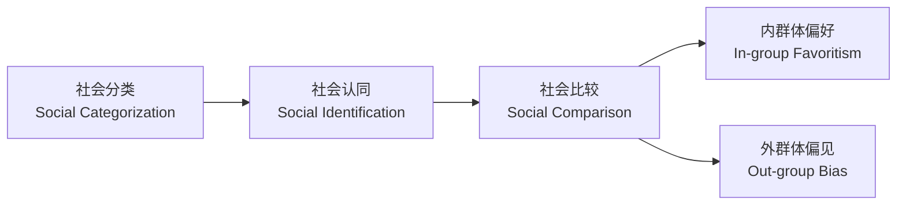
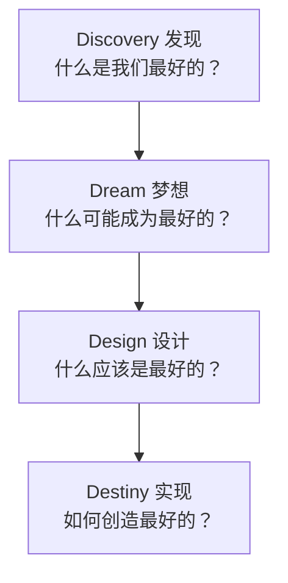
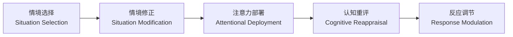
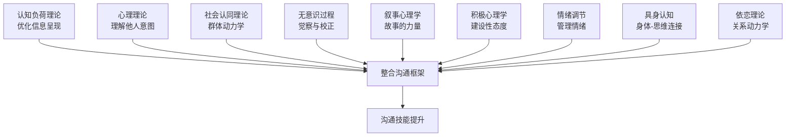

# 沟通心理学 — 深度拓展

> 本章深度拓展将系统构建沟通心理学的理论-方法-实操框架。从认知负荷、心理理论、社会认同、无意识过程、叙事心理学、积极心理学六大核心理论出发，延伸至情绪调节、具身认知、依恋理论等前沿领域，最终整合为可落地的沟通能力提升体系。每个理论均遵循"原理→机制→实操→案例→误区"的完整链条，确保读者既能理解"为什么"，也能掌握"怎么做"。

***

## 一、认知负荷理论在沟通中的应用

### 1.1 认知负荷理论概述

认知负荷理论（Cognitive Load Theory, CLT）由John Sweller于1988年提出，最初用于指导教学设计，后被广泛应用于沟通研究。该理论基于人类认知架构的基本特征——工作记忆容量有限，长期记忆容量几乎无限——提出信息呈现方式应与人类认知架构的特征相匹配。

认知负荷理论区分了三种类型的认知负荷：

**内在认知负荷（Intrinsic Cognitive Load）**：由学习材料本身的复杂性决定，取决于材料中需要同时处理的元素数量和元素之间的交互程度。在沟通中，信息的复杂性和抽象性决定了内在认知负荷。例如，解释"区块链共识机制"的内在认知负荷远高于解释"如何注册邮箱"，因为前者涉及密码学、分布式系统、博弈论等多个交互元素。

**外在认知负荷（Extraneous Cognitive Load）**：由信息呈现方式不当造成的额外认知负担。在沟通中，混乱的信息结构、冗余的内容、不恰当的媒介选择等都会增加外在认知负荷。典型场景：一份PPT同时包含密集文字、复杂图表和背景动画，听众的注意力被分散到与核心信息无关的元素上。

**相关认知负荷（Germane Cognitive Load）**：用于理解和建构知识的认知努力。在沟通中，引导受众进行深度思考和意义建构的认知活动属于相关认知负荷。例如，通过提问引导听众将新信息与已有知识关联，就是提升相关认知负荷的有效方式。

### 1.2 认知负荷理论对沟通设计的启示

**信息分块（Chunking）**：根据Miller的"神奇数字7±2"法则，工作记忆一次能处理的信息单元数量有限。有效的沟通应将复杂信息分解为易于处理的"信息块"，降低认知负荷。电话号码之所以分为"区号-前缀-号码"三段，正是分块原则的经典应用。在沟通实践中，这意味着：汇报工作时用"三个要点"而非逐条罗列；产品介绍时按"用户场景"而非"技术参数"组织信息。

**渐进式信息呈现**：避免一次性呈现过多信息，采用渐进式的方式逐步展开信息，给受众足够的时间进行理解和整合。在演示文稿设计中，应避免每张幻灯片包含过多信息。实操技巧：先给出框架（"今天谈三个问题"），再逐个展开，最后总结回顾。这种"路标式"结构帮助受众建立心理地图，降低认知负荷。

**减少冗余**：冗余信息会增加外在认知负荷。在沟通中，应避免重复相同信息（除非是有意的强调），删除无关的细节和装饰性元素。Sweller的冗余效应（Redundancy Effect）研究表明，当同一信息以两种不必要的方式同时呈现时（如PPT上显示完整的讲稿文字，同时演讲者又逐字朗读），学习效果反而下降。

**多感官通道利用**：根据Paivio的双重编码理论和Mayer的多媒体学习理论，人类通过视觉和听觉两个独立的通道处理信息。有效利用这两个通道（如结合文字和图像、语音和图表）可以提高信息传递效率，而不增加单个通道的认知负荷。关键原则：图表配口头解释 > 图表配文字说明 > 纯文字。但要注意避免"通道冲突"——当视觉通道接收文字信息的同时听觉通道也在传递不同的文字信息时，两个通道会争夺认知资源。

**具体化与类比**：抽象概念的认知负荷高于具体概念。通过类比、比喻和具体案例来解释抽象概念，可以降低理解难度。例如，用"信息高速公路"来解释互联网，用"大脑的警报系统"来解释杏仁核的功能。类比的核心机制是"映射"——将未知领域的结构映射到已知领域，使受众可以利用已有知识框架来理解新概念。

### 1.3 认知负荷管理的实操工具箱

| 场景 | 认知负荷问题 | 解决策略 | 具体做法 |
|------|------------|---------|---------|
| 演讲/演示 | 信息密度过高 | 分块+渐进 | 每张PPT一个核心观点，先给框架再展开 |
| 书面报告 | 结构混乱 | 层级化+摘要 | 执行摘要→详细正文→附录，金字塔结构 |
| 技术培训 | 内在负荷过高 | 先简后繁+脚手架 | 先教概念，再给示例，最后独立练习 |
| 跨部门沟通 | 术语障碍 | 类比+可视化 | 用业务场景翻译技术概念 |
| 远程会议 | 通道超载 | 降低冗余 | 关闭无关视频，使用共享文档替代PPT |

### 1.4 常见误区

- **误区一**："信息越多越好"。事实恰恰相反——信息过载会导致受众放弃处理，核心信息反而被淹没。
- **误区二**："视觉越丰富越好"。装饰性元素（花哨背景、无关图片）增加外在认知负荷，降低信息传递效率。
- **误区三**："重复等于强化"。无意义的重复（如PPT和口头完全相同的内容）违反冗余效应，反而降低理解。
- **误区四**："分块就是拆分"。有效的分块需要在信息块之间建立逻辑连接，而非简单切割。

***

## 二、心理理论（Theory of Mind）与沟通

### 2.1 心理理论的概念

心理理论（Theory of Mind, ToM）是指个体理解他人心理状态（如信念、欲望、意图、情感）的能力。这一能力使人类能够预测和解释他人的行为，是社会交往和有效沟通的基础。

心理理论的发展经历了以下阶段：

| 年龄段 | 发展里程碑 | 沟通能力关联 |
|--------|----------|------------|
| 12-18个月 | 理解他人有意图的行为 | 开始跟随他人指向和目光 |
| 3-4岁 | 理解他人的欲望和情感 | 能根据他人需求调整表达 |
| 4-5岁 | 通过"错误信念任务" | 理解"我以为你知道"的局限 |
| 6-7岁 | 理解讽刺、欺骗和双重欺骗 | 能理解间接表达和言外之意 |
| 成年期 | 持续精细化 | 复杂社交情境中的多层推理 |

### 2.2 心理理论在沟通中的核心作用

**意图理解**：沟通不仅是语言符号的传递，更是意图的交流。心理理论使我们能够推断说话者的真实意图，理解言外之意。例如，当有人问"你能把窗户关上吗？"时，我们理解这不仅是一个关于能力的问题，而是一个关窗的请求。这种"间接言语行为"（indirect speech act）的理解依赖于心理理论对说话者意图的推断。

**视角采择（Perspective Taking）**：有效沟通需要考虑对方的知识背景、兴趣和关注点，调整自己的表达方式。心理理论支持的视角采择能力使沟通者能够根据受众的特点调整信息的组织和呈现方式。视角采择包含两个维度：空间视角采择（理解他人看到什么）和认知视角采择（理解他人知道什么、相信什么）。

**隐含信息的理解**：在日常沟通中，大量信息是隐含的、不直接表达的。Grice的会话含义理论指出，听话者基于合作原则和会话准则推断说话者的隐含意义。心理理论是这种推理的认知基础。

**合作与协调**：成功的沟通需要参与者之间的合作与协调。心理理论使我们能够理解对方的期望，调整自己的行为以配合沟通的进程。在团队协作中，这意味着能够预判队友的信息需求，主动提供相关内容。

### 2.3 心理理论的缺陷与沟通障碍

心理理论的发展与沟通能力密切相关。研究表明，心理理论发展较好的儿童在社交沟通中表现更好，更能够理解和使用复杂的沟通策略（如礼貌、委婉、说服）。

自闭症谱系障碍（ASD）个体在心理理论方面存在困难，这直接影响了他们的社交沟通能力。他们可能难以理解他人的意图、情感和观点，在理解讽刺、幽默和隐含意义方面存在显著困难。

但心理理论的缺陷不仅存在于临床人群。普通人在以下情境中也会出现心理理论失效：

- **知识诅咒（Curse of Knowledge）**：当你掌握了某项知识后，很难想象不知道它的人会怎么想。专家给新手讲解时频繁使用术语，就是因为知识诅咒导致的心理理论失效。
- **情绪激动时**：强烈情绪会降低心理理论的准确性。愤怒时我们更容易将他人的行为归因为恶意。
- **跨文化/跨群体**：对不同文化背景的人，心理理论的准确性下降，因为行为规则和表达习惯存在差异。

### 2.4 提升心理理论相关沟通能力的策略

**积极倾听**：专注地倾听对方的表达，不仅关注语言内容，还注意非语言线索，尝试理解对方的情感和意图。具体做法：在对方说话时，暂停内心评判，将注意力完全放在理解对方上；注意对方的语调、语速、表情和身体姿态的变化。

**视角采择练习**：有意识地练习从对方的角度思考问题，想象对方的知识背景、情感状态和利益关切。实操方法：在重要沟通前，花5分钟写下"对方现在最关心什么""对方对这件事可能有什么看法""对方可能有什么顾虑"。

**心理状态词汇的使用**：在沟通中更多地使用描述心理状态的词汇（如"我觉得""你可能认为""他的意图是"），提升对心理状态的敏感度。这类词汇被称为"心理化语言"（mentalizing language），使用它们本身就是一种心理理论的训练。

**反馈与确认**：通过提问和反馈来确认自己对对方意图的理解是否准确，减少误解。例如："我理解你的意思是……对吗？""你刚才说的，我理解为……你觉得这个理解对不对？"

**克服知识诅咒的实操方法**：
1. **请"小白"测试**：在重要沟通前，找一个不了解该主题的人试讲，观察哪些地方对方听不懂。
2. **使用"外行检查"**：写完文档后，假装自己是完全不了解背景的人来阅读，标记所有看不懂的地方。
3. **主动问具体问题**：不问"你听懂了吗？"（大多数人会说"懂了"），而是问"你能用自己的话复述一下吗？"

***

## 三、社会认同理论与群体沟通

### 3.1 社会认同理论概述

社会认同理论（Social Identity Theory）由Henri Tajfel和John Turner于20世纪70年代提出，是理解群体行为和群际关系的重要理论框架。该理论的核心观点是：个体的自我概念不仅来源于个人特征，还来源于其所属的社会群体。

社会认同的形成包括三个过程：

1. **社会分类（Social Categorization）**：将人们分为"我们"（内群体）和"他们"（外群体）。这种分类是自动化的，发生在意识觉察之前。
2. **社会认同（Social Identification）**：个体认同并内化所属群体的特征和价值观。"我是程序员"不仅是职业描述，更包含了对程序员群体价值观（如理性、技术导向）的认同。
3. **社会比较（Social Comparison）**：通过与外群体的比较来提升内群体的积极形象。这种比较往往带有偏见——我们倾向于放大内群体的优势和外群体的劣势。

### 3.2 社会认同对群体沟通的影响

**内群体偏好**：社会认同导致个体对内群体成员表现出更积极的态度和更多的合作行为。在群体沟通中，这意味着成员之间的沟通更加顺畅、积极，但同时也可能导致对外群体的偏见和歧视。经典实验：Tajfel的"最小群体范式"（Minimal Group Paradigm）发现，即使仅仅根据随机分组（如"你喜欢Klee的画还是Kandinsky的画"），人们就会表现出内群体偏好。

**群体极化（Group Polarization）**：群体讨论往往使成员的初始倾向更加极端。在社会认同的强化下，群体可能走向更加极端的立场，影响决策质量和对外沟通。机制包括：信息性影响（讨论中听到更多支持初始倾向的论点）和规范性影响（为了符合群体规范而调整立场）。

**群体思维（Groupthink）**：高度凝聚的群体可能为了维护群体和谐而压制不同意见，导致决策失误。社会认同的强化可能加剧群体思维现象。Irving Janis归纳了群体思维的八个症状：无懈可击的幻觉、集体合理化、对群体道德的盲目信仰、对外群体的刻板印象、对异议者的直接压力、自我审查、一致同意的幻觉、自封的"思想警卫"。

**沟通规范的形成**：社会认同影响群体内部的沟通规范。每个群体可能发展出独特的语言风格、术语和沟通规则，强化群体边界和认同感。例如，技术团队形成大量缩略语和行话，新成员需要"解码"这些语言才能融入群体。

### 3.3 群际沟通的挑战与策略

**刻板印象与偏见**：社会认同导致的刻板印象和偏见是群际沟通的主要障碍。Allport的接触假说（Contact Hypothesis）认为，在适当条件下，增加群际接触可以减少偏见。四个关键条件：平等的地位、共同的目标、制度性支持、深入的个人互动。

**共同内群体认同模型**：Gaertner和Dovidio提出的共同内群体认同模型认为，通过强调更高层次的共同身份（如都是同一公司的员工），可以减少群际偏见，促进合作。在企业并购中，管理者通过建立共同的企业文化来整合来自不同原公司的团队，正是这一理论的应用。

**跨群体对话**：结构化的跨群体对话活动可以帮助不同群体的成员相互了解、减少偏见。关键要素包括：

| 要素 | 说明 | 实操做法 |
|------|------|---------|
| 平等地位 | 消除群体间的权力差异 | 圆桌形式，轮流发言，避免一方主导 |
| 共同目标 | 需要双方合作才能完成的任务 | 设置需要跨群体协作才能完成的项目 |
| 制度支持 | 组织层面的鼓励和制度保障 | 将跨群体合作纳入绩效考核 |
| 个人互动 | 超越群体标签的深入了解 | 分享个人经历和故事，而非只讨论工作 |

### 3.4 数字时代的社会认同与群体沟通

社交媒体的算法推荐机制可能强化社会认同的边界——用户更容易接触到与自己观点一致的内容，形成"信息茧房"和"回音室效应"。网络群体的形成更加便捷，但也更容易走向极端。

在数字时代，个体可能同时拥有多重社会认同，这些认同在不同的网络空间中被激活和强化。理解数字环境中的社会认同动态，对于促进健康的网络公共讨论具有重要意义。

**实操建议——打破信息茧房**：
1. **主动关注不同观点**：在社交媒体上有意识地关注与自己观点不同的高质量信息源。
2. **参与建设性对话**：在看到不同观点时，练习"好奇式回应"而非"攻击式反驳"。
3. **识别群体极化信号**：当发现自己所在群体的讨论越来越极端时，主动引入不同视角。
4. **区分"人"和"观点"**：反对一个观点不等于否定持有该观点的人。

***

## 四、沟通中的无意识过程

### 4.1 无意识过程的理论基础

沟通中的许多过程是在无意识层面进行的，这些无意识过程对沟通的效果产生深远影响。

**隐性偏见（Implicit Bias）**：隐性偏见是指个体在意识层面不承认或不自知的偏见，但通过行为和判断表现出来。在沟通中，隐性偏见影响我们对不同群体成员的态度、信任度和沟通方式。哈佛大学的内隐联想测验（IAT）揭示了普遍存在但不被察觉的种族、性别等偏见。IAT的核心发现：即使是那些在意识层面坚决反对歧视的人，也可能在无意识层面持有偏见。

**双系统理论（Dual Process Theory）**：根据Daniel Kahneman的双系统理论，人类的思维包括：

| 维度 | 系统1（快思维） | 系统2（慢思维） |
|------|---------------|---------------|
| 速度 | 快速，毫秒级 | 缓慢，秒到分钟级 |
| 努力 | 自动化，省力 | 刻意，费力 |
| 意识 | 无意识 | 有意识 |
| 沟通应用 | 第一印象、情绪反应、直觉判断 | 逻辑论证、深度分析、复杂决策 |
| 错误模式 | 认知偏见、刻板印象 | 疲劳导致的判断失误 |

在沟通中，系统1负责快速的社会判断和情绪反应，这些判断往往是无意识的。理解双系统的作用机制，有助于我们在重要沟通中激活系统2来校正系统1的偏误。

**非语言同步（Nonverbal Synchrony）**：研究发现，成功沟通中的参与者会无意识地同步他们的身体姿态、语调和语速。这种同步与沟通满意度和关系质量正相关。Chartrand和Bargh的"变色龙效应"（Chameleon Effect）研究表明，无意识的行为模仿能够增加好感和信任。

**情绪传染（Emotional Contagion）**：情绪可以通过无意识的模仿和反馈在人与人之间传播。Hatfield等人的情绪传染理论指出，我们倾向于自动且持续地模仿他人的面部表情、声音和姿态，然后通过"面部反馈假说"——面部肌肉的状态反馈到大脑，影响我们自身的情绪体验。

### 4.2 无意识过程对沟通的影响

**第一印象的形成**：研究表明，人们在见面后的100毫秒内就会形成对对方的初步判断（如可信度、能力），这些印象主要基于无意识的处理过程。后续研究（Willis & Todorov, 2006）发现，仅需100毫秒的面部暴露就足以产生可靠的信任判断，且增加暴露时间并不显著改变判断结果。第一印象一旦形成，具有很强的稳定性——后续信息需要付出更多努力才能改变，这被称为"首因效应"（Primacy Effect）。

**权力动态的感知**：沟通中的权力关系在很大程度上是通过无意识的非语言信号传递的。占据更多空间、说话时间更长、打断他人更多的个体通常被感知为更有权力。Mehrabian的研究表明，在权力不对等的沟通中，高权力者倾向于占用更多空间、减少目光接触（表示不需要关注对方反应）、使用更多的手势。

**信任的建立**：信任的初始建立在很大程度上是无意识的。面部表情、眼神接触、声音特征等非语言线索在信任判断中发挥着重要作用。Zak的研究发现，催产素水平与信任行为正相关，而温暖的社交互动能够提升催产素水平。

**说服与影响**：无意识过程在说服中扮演重要角色。重复曝光效应（Mere Exposure Effect）表明，仅仅因为反复接触某个刺激，人们就会对其产生更积极的态度。Zajonc的经典研究发现，即使人们对某个刺激没有有意识的记忆，重复曝光仍然能够提升好感度。在品牌传播中，这意味着"让消费者反复看到品牌"本身就是一种有效的说服策略。

### 4.3 提升沟通中的意识水平

**正念练习**：正念（Mindfulness）是提升对自身思维和情感过程觉察的有效方法。正念练习可以帮助个体在沟通中更好地觉察自己的自动反应，做出更理性的选择。具体做法：在重要沟通前做3分钟呼吸觉察练习；在沟通过程中，当注意到自己产生强烈情绪反应时，暂停3秒钟，觉察情绪的产生，然后再回应。

**隐性偏见意识培训**：通过隐性偏见意识培训，帮助个体认识到自己的无意识偏见，减少偏见对沟通的负面影响。有效的培训不仅停留在"意识到偏见存在"，还需要提供具体的去偏见策略：如"个体化"（将对方视为独立个体而非群体代表）、"反刻板印象"（有意识地寻找与刻板印象相反的证据）。

**反馈与反思**：定期寻求他人对自己沟通行为的反馈，进行自我反思，提升对无意识沟通模式的觉察。实操方法：每周回顾一次重要沟通，问自己"我当时的反应是理性的还是自动化的？""有没有更好的回应方式？"

**刻意练习**：通过有意识地练习特定的沟通技能（如积极倾听、非语言沟通），将原本需要意识控制的行为转化为自动化的良好习惯。Ericsson的刻意练习理论指出，专业能力的提升需要有目的、有反馈、超越舒适区的持续练习。

***

## 五、叙事心理学与故事沟通

### 5.1 叙事心理学概述

叙事心理学（Narrative Psychology）认为，人类通过故事来理解自己和世界。我们的人生经历不是一系列孤立的事件，而是通过叙事的方式被组织、解释和赋予意义。Theodore Sarbin提出"叙事是人类心灵的主导隐喻"。

叙事心理学的核心假设：
- **人是叙事的动物**：人类天生以故事的方式组织经验。
- **叙事建构自我**：我们通过讲述自己的故事来建构自我认同。
- **叙事赋予意义**：事件本身没有固有意义，意义通过叙事被创造出来。
- **多重叙事共存**：同一个人可能拥有多条并行的自我叙事，不同情境激活不同叙事。

### 5.2 叙事在沟通中的功能

**意义建构**：故事帮助我们为复杂的经历赋予意义。当面对混乱或创伤性的经历时，通过叙述和重新叙述，我们可以逐渐理解这些经历，整合到自我认同中。Pennebaker的研究发现，将创伤经历用语言表达出来（无论是口头还是书面），能够显著改善心理健康状况。

**情感表达与调节**：故事是情感表达的重要载体。通过讲述自己的故事，个体可以表达和处理复杂的情感。叙事的情感调节机制包括：外化（将内心体验转化为外在语言）、时间距离（讲述过去事件创造心理距离）、认知重构（通过重新叙述改变对事件的理解）。

**社会连接**：分享故事是建立社会连接的有效方式。当我们分享自己的经历时，听众可以通过想象和共鸣与讲述者建立情感联系。Zak的研究发现，故事能够提升催产素水平，而催产素与共情和信任正相关。

**说服与影响**：故事比抽象的论证更具说服力。Green和Brock的叙事传输理论（Narrative Transportation Theory）认为，当受众被故事"传输"到故事世界中时，他们的态度和信念更容易被故事的主旨所影响。传输状态下，受众的批判性思维降低，情感投入增加，更容易接受故事中的观点。

**文化传承**：故事是文化传承的重要载体。通过故事，文化价值观、社会规范和集体记忆得以代代相传。从口述历史到文字记录，叙事始终是人类文明传承的核心形式。

### 5.3 好故事的结构与要素

好故事不是随意的叙述，而是有结构、有节奏、有张力的艺术品。以下是核心要素：

**人物**：引人入胜的故事需要有真实、复杂、令人共鸣的人物。人物的动机、冲突和成长是故事吸引力的核心。一个好的人物不是完美无缺的英雄，而是有弱点、有挣扎、有成长空间的普通人。

**冲突与张力**：没有冲突就没有故事。冲突可以分为三个层次：
- **外部冲突**：人与人、人与环境的对抗（如竞争对手、恶劣环境）
- **人际冲突**：关系中的张力和矛盾（如价值观冲突、信任危机）
- **内部冲突**：人与自我的斗争（如道德困境、恐惧与勇气的拉锯）

**情感共鸣**：好的故事能够触动听众的情感。情感共鸣的产生依赖于故事与听众自身经历的联系，以及故事对人类普遍情感（如爱、恐惧、希望、失落）的触及。

**结构与节奏**：有效的故事具有清晰的结构。经典叙事结构：

节奏的控制——何时快、何时慢、何时停顿——影响故事的感染力。快速推进制造紧张感，慢节奏营造沉浸感，停顿创造期待和思考空间。

**具体细节**：具体的细节使故事更加生动和可信。"那天下午三点，雨后的街道上弥漫着泥土的气息"比"一个下雨天"更能引发听众的想象和共鸣。感官细节（视觉、听觉、嗅觉、触觉、味觉）是故事感染力的关键来源。

### 5.4 叙事沟通的实践应用

**领导力沟通**：优秀的领导者善于运用故事来传达愿景、激励团队、塑造文化。Steve Jobs的产品发布会就是叙事沟通的经典案例——他不是罗列产品规格，而是讲述一个关于创新和改变世界的故事。领导者故事的核心类型：
- **我是谁的故事**：分享个人经历，建立信任和亲近感
- **我们是谁的故事**：定义团队/组织的共同身份和价值观
- **我们往哪里去的故事**：描绘愿景，激发行动
- **我们为什么做这件事的故事**：连接日常工作与更大的意义

**品牌传播**：品牌故事是品牌传播的核心。消费者更容易记住和认同有故事的品牌。品牌故事应该真实、一致、有情感共鸣。Nike不卖运动鞋，它卖的是"Just Do It"的勇气故事；Apple不卖电脑，它卖的是"Think Different"的叛逆者故事。

**教育与培训**：案例教学法、故事教学法利用叙事的力量提升学习效果。学生更容易理解和记住以故事形式呈现的知识。研究显示，以故事形式呈现的信息的记忆保持率比纯事实呈现高出22倍。

**心理治疗**：叙事疗法（Narrative Therapy）由Michael White和David Epston创立，通过帮助来访者重新叙述自己的人生故事，发现被忽略的积极元素，构建更加健康和有意义的自我叙事。核心理念："人不是问题，问题才是问题"——将问题从人身上"外化"出来，帮助来访者看到自己与问题之间的距离。

**公共演讲**：TED演讲中，大多数最受欢迎的演讲都大量使用个人故事。故事可以将抽象的概念具体化，将枯燥的数据生动化，建立演讲者与听众之间的连接。Chris Anderson在《TED演讲的秘密》中总结：一个好的TED演讲 = 一个核心想法 + 一个好故事 + 一个行动号召。

### 5.5 叙事实操模板

当你需要在沟通中讲故事时，可以使用以下模板：

**STAR故事模板**（适用于工作场景）：
- **S - Situation**：设定情境。时间、地点、背景是什么？
- **T - Task**：明确任务。面临什么挑战或问题？
- **A - Action**：描述行动。你做了什么？怎么做的？
- **R - Result**：呈现结果。产生了什么影响？学到了什么？

**三幕结构模板**（适用于演讲和品牌叙事）：
- **第一幕：建立常态** → 打破常态（钩子）
- **第二幕：面对挑战** → 逐步升级 → 最大危机
- **第三幕：找到解决方案** → 新常态（比原来更好）

**细节增强技巧**：
1. 加入感官描写：不只说"那天下雨"，而是说"雨水打在窗玻璃上，发出细碎的声响"
2. 使用对话而非转述："他说'不行'比'他拒绝了我的请求'更生动"
3. 制造"啊哈时刻"：在故事中设置转折点，让听众恍然大悟

***

## 六、积极心理学在沟通中的应用

### 6.1 积极心理学概述

积极心理学（Positive Psychology）由Martin Seligman于1998年创立，关注人类的优势、潜能和幸福，而非仅仅关注问题和病理。Seligman的PERMA模型定义了幸福的五个支柱：

| 要素 | 含义 | 在沟通中的体现 |
|------|------|---------------|
| P - Positive Emotion | 积极情绪 | 创造愉快的沟通氛围 |
| E - Engagement | 投入体验 | 全身心参与对话，进入"心流" |
| R - Relationships | 人际关系 | 通过沟通建立和维护有意义的关系 |
| M - Meaning | 意义 | 在沟通中找到深层目的和价值 |
| A - Achievement | 成就 | 通过有效沟通实现目标 |

### 6.2 积极情绪在沟通中的作用

**拓展-建构理论（Broaden-and-Build Theory）**：Barbara Fredrickson提出的拓展-建构理论认为，积极情绪能够拓展个体的思维和行动范围，建构持久的个人资源。在沟通中，积极情绪促进创造性思维、开放性倾听和建设性对话。消极情绪使人的注意力变窄（关注威胁），而积极情绪使注意力变宽（关注可能性）。

**积极情绪的传染**：积极情绪具有传染性。Hatfield的情绪传染研究发现，人们在毫秒级别就会自动模仿他人的面部表情和声调，从而"感染"对方的情绪。在沟通中，表达积极情绪的个体能够影响他人的情绪状态，创造更加积极和富有成效的沟通氛围。

**积极情绪与韧性**：积极情绪能够帮助个体在面对冲突和逆境时保持韧性。Fredrickson的研究发现，积极情绪与消极情绪的比例达到3:1以上时，个体和团队的功能表现最佳（"洛萨达比例"）。需要注意的是，这一比例的精确数值存在争议，但核心观点——积极情绪需要显著超过消极情绪——已被广泛接受。

### 6.3 积极沟通策略

**积极建设性回应（Active Constructive Responding, ACR）**：Shelly Gable提出的ACR模式描述了对他人好消息的四种回应方式：

| 回应类型 | 态度 | 举例 | 关系影响 |
|---------|------|------|---------|
| 积极建设性 | 热情，主动追问 | "太棒了！你是怎么做到的？快告诉我更多！" | 大幅提升亲密感 |
| 积极被动性 | 简单认可 | "挺好的。" | 微弱正面效果 |
| 消极建设性 | 关注问题 | "这会不会给你带来很大压力？" | 消解对方喜悦 |
| 消极被动性 | 忽视或转移话题 | "哦。对了，你看到今天的新闻了吗？" | 损害关系 |

研究表明，经常做出积极建设性回应的伴侣，其关系满意度和亲密感显著更高。实操练习：当听到别人分享好消息时，暂停自己的一切评判，先热情回应，然后问至少两个相关的问题。

**优势导向沟通**：基于积极心理学的优势理念，在沟通中关注和强调对方的优势和长处，而非仅仅关注问题和不足。Marcus Buckingham的优势研究表明，在工作中经常使用自己优势的人，敬业度是其他人的6倍。在反馈中，先肯定做得好的方面，再提出改进建议——这不是"三明治技巧"（先表扬后批评再表扬的套路），而是真诚地识别和欣赏对方的优势。

**感恩表达**：表达感恩是积极沟通的重要形式。Emmons和McCullough的研究发现，经常练习感恩的人拥有更好的人际关系和更高的幸福感。在工作场所中，表达对同事的感谢能够提升团队凝聚力和工作满意度。实操方法：每天记录3件感恩的事；在团队会议中加入"感谢时刻"环节；写具体的感谢信息而非泛泛的"谢谢"。

**建设性批评**：即使是批评，也可以采用积极的方式进行。建设性批评的要素：
1. **对事不对人**：批评行为而非人格（"这份报告的数据部分需要补充"而非"你太粗心了"）
2. **具体而非笼统**：指出具体问题和具体改进方向
3. **表达信任**：让对方知道你相信他有能力改进（"我知道你有能力做到"）
4. **提供支持**：不只指出问题，还提供帮助（"需要我帮你看看数据来源吗？"）

### 6.4 积极心理学在组织沟通中的应用

**欣赏式探询（Appreciative Inquiry）**：由David Cooperrider提出的欣赏式探询是一种组织发展方法，通过发现和放大组织中的积极因素来推动变革。其4D循环：

在组织沟通中，欣赏式探询可以帮助团队关注成功经验、核心优势和共同愿景，而非纠缠于问题和缺陷。

**心理资本（Psychological Capital）**：Fred Luthans提出的心理资本概念包括自信（自我效能感）、希望、乐观和韧性四个要素。在组织沟通中，培养团队的心理资本可以提升成员的沟通信心和积极性。研究表明，心理资本高的员工更愿意主动沟通、更善于处理冲突、更能适应变化。

**积极组织沟通**：积极组织沟通关注如何通过沟通创造积极的组织文化。具体做法：
- 促进开放透明的信息分享：减少信息不对称，增强信任
- 建设支持性的同事关系：鼓励互相帮助而非恶性竞争
- 创造学习和成长的机会：将错误视为学习机会而非惩罚理由
- 庆祝成功和里程碑：公开认可团队和个人的成就

### 6.5 积极沟通的边界与平衡

需要强调的是，积极心理学在沟通中的应用并不意味着回避问题或压制负面情绪。真正的积极沟通是在承认困难和挑战的同时，保持希望和建设性的态度。

**"有毒的积极性"（Toxic Positivity）**——过度强调积极、否认负面情绪——反而会损害沟通的真实性和信任关系。有毒的积极性的典型表现：
- "不要难过，一切都会好的"（否认对方的痛苦）
- "往好处想"（忽视问题的严重性）
- "至少你还有……"（用比较来否定对方的感受）
- "你应该感恩"（强迫积极情绪）

健康的沟通需要积极与消极情绪的平衡。Susan David的情绪敏捷（Emotional Agility）理论指出，健康的心理状态不是"总是积极"，而是能够觉察、接纳和灵活应对所有情绪。承认和表达负面情绪是心理健康的必要条件，关键在于如何以建设性的方式处理负面情绪，在困难中寻找成长的机会。

***

## 七、情绪调节理论与沟通

### 7.1 情绪调节的理论框架

James Gross的情绪调节过程模型是该领域最有影响力的理论框架，将情绪调节分为五个阶段：

**情境选择**：选择进入或回避某些情境来调节情绪。在沟通中，这意味着选择何时、何地、与谁进行重要对话。

**情境修正**：改变当前情境来调节情绪。在冲突沟通中，改变沟通环境（如从公开场合转移到私密空间）可以降低双方的防御性。

**注意力部署**：将注意力从情绪触发因素转移到其他事物上。在愤怒时，将注意力从对方的"攻击性言辞"转移到"对方的诉求是什么"。

**认知重评**：改变对情境的认知解释来改变情绪反应。这是最有效的情绪调节策略。例如，将"对方在批评我"重新理解为"对方在帮助我改进"。

**反应调节**：在情绪已经产生后调节情绪的表达。深呼吸、数到十再说话等都属于反应调节。

### 7.2 情绪调节策略在沟通中的应用

| 策略 | 适用场景 | 具体做法 | 效果 |
|------|---------|---------|------|
| 认知重评 | 收到负面反馈时 | "这是改进的机会，不是否定" | 降低防御，提升接受度 |
| 情境选择 | 重要谈判前 | 选择安静、私密的沟通环境 | 减少干扰和防御性 |
| 注意力部署 | 对方情绪激动时 | 关注对方的核心诉求而非情绪表达 | 保持理性，找到解决方案 |
| 反应调节 | 自己即将爆发时 | 深呼吸，暂停3秒再回应 | 避免冲动发言 |

### 7.3 情绪智力（Emotional Intelligence）与沟通

Daniel Goleman的情绪智力模型包含五个核心能力：

1. **自我觉察**：识别自己的情绪及其对沟通的影响
2. **自我调节**：在沟通中管理自己的情绪反应
3. **内在动机**：保持沟通的积极性和目标导向
4. **共情**：感知和理解他人的情绪状态
5. **社交技能**：运用情绪信息来管理人际关系和沟通

研究表明，情绪智力对职业成功的影响可能超过认知智力（IQ）。在沟通密集的工作（如销售、管理、咨询）中，情绪智力的影响尤为显著。

***

## 八、具身认知与非语言沟通

### 8.1 具身认知理论

具身认知（Embodied Cognition）理论认为，认知过程不仅发生在大脑中，还深深植根于身体与环境的互动中。这一理论挑战了传统"大脑是计算机"的隐喻，提出身体状态直接影响思维和情感。

在沟通中，具身认知的含义是：你的身体姿态、动作和生理状态不仅反映你的情绪，还会主动塑造你的情绪和沟通风格。

### 8.2 身体姿态与沟通

**权力姿态（Power Posing）**：Amy Cuddy的研究（尽管其精确效应存在争议）发现，扩展性的身体姿态（如双手叉腰、身体后仰）能够提升自信感和力量感。虽然激素水平变化的证据不确定，但主观感受的改善是被多项研究复制验证的。

**镜像与同步**：无意识的身体语言同步（镜像）是建立融洽关系的有效信号。实操技巧：
- 适度模仿对方的坐姿和手势（不要刻意，自然即可）
- 匹配对方的语速和语调（对方快你快，对方慢你慢）
- 在对方说话时轻微点头（表示倾听和认同）

**空间距离**：Edward Hall提出的四种空间距离：
| 距离类型 | 范围 | 适用场景 |
|---------|------|---------|
| 亲密距离 | 0-45cm | 亲密关系的私下交流 |
| 个人距离 | 45-120cm | 朋友间的日常交流 |
| 社交距离 | 1.2-3.6m | 工作场合的正式交流 |
| 公共距离 | 3.6m以上 | 公开演讲、大型会议 |

### 8.3 声音的具身维度

声音不仅是信息的载体，更是情感和关系的信号：

- **语调**：上升语调表示不确定或提问，下降语调表示确定或权威
- **语速**：快语速传递热情和紧迫感，慢语速传递稳重和深思
- **音量**：提高音量表示强调或激动，降低音量制造亲密感或紧张感
- **停顿**：策略性停顿创造期待、强调重点、给听众思考空间
- **声调**：温暖的声调建立信任，冷淡的声调制造距离

***

## 九、依恋理论与亲密关系沟通

### 9.1 依恋理论概述

John Bowlby的依恋理论原本描述婴儿与主要照料者的情感纽带，后被Bartholomew和Hazan扩展到成人亲密关系领域。成人依恋风格分为四种：

| 依恋风格 | 对亲密的态度 | 对独立的态度 | 沟通特征 |
|---------|------------|------------|---------|
| 安全型 | 舒适 | 舒适 | 开放、直接、信任他人 |
| 焦虑型 | 渴望但恐惧被拒 | 不安 | 过度寻求确认、情绪化 |
| 回避型 | 不安 | 强调独立 | 回避深层情感、表面化 |
| 恐惧型 | 渴望但恐惧 | 矛盾 | 反复无常、信任困难 |

### 9.2 依恋风格对亲密关系沟通的影响

**安全型依恋者**能够直接表达需求和感受，能够在冲突中保持冷静和建设性，能够在关系中建立深层信任。他们的沟通特征：使用"我"语句表达感受、主动寻求和提供情感支持、在冲突中寻求理解而非胜利。

**焦虑型依恋者**在沟通中倾向于过度解读对方的信号，频繁寻求关系的确认和保证。他们的沟通特征：容易"作"和"试探"、对伴侣的回应速度过度敏感、在冲突中情绪化升级。改善建议：学会识别自己的焦虑触发点，在反应前暂停评估"这是事实还是我的焦虑投射？"

**回避型依恋者**在沟通中倾向于保持情感距离，避免深层的情感交流。他们的沟通特征：在伴侣表达情感需求时退缩、用理性化来回避情感、在冲突中选择沉默或离开。改善建议：练习用语言表达感受（从简单的"我现在感到不舒服"开始）、理解伴侣的情感需求不是对你的控制。

### 9.3 依恋知情沟通的实操

**识别触发模式**：当感到被抛弃的恐惧（焦虑型）或被侵入的不适（回避型）被激活时，觉察到这是依恋系统的自动反应，而非对当前情况的准确评估。

**建立安全基础**：John Gottman的研究发现，健康关系的核心是"情感银行账户"——日常的小型积极互动（如微笑、关心、回应）比偶尔的大型浪漫行为更重要。具体做法：每天至少一次积极回应伴侣的"情感投标"（bid for connection）。

**修复裂痕**：所有关系都会出现沟通裂痕。关键不是避免裂痕，而是及时修复。Gottman的研究发现，能够在冲突后主动修复的伴侣，其关系持久度显著更高。修复的信号：道歉、幽默、承认对方的感受、表达爱意。

***

## 十、整合视角：构建个人沟通心理学体系

### 10.1 理论整合框架

以上九大理论并非孤立存在，而是相互关联、相互补充的。下图展示了它们之间的关系：

### 10.2 个人沟通能力提升路线图

| 阶段 | 重点 | 核心理论 | 练习方法 |
|------|------|---------|---------|
| 入门 | 觉察自己的沟通模式 | 双系统理论、无意识过程 | 每日沟通反思日记 |
| 进阶 | 理解他人和情境 | 心理理论、社会认同 | 视角采择练习、跨群体交流 |
| 高级 | 设计有效信息 | 认知负荷、叙事心理学 | 用结构化模板准备重要沟通 |
| 专家 | 建立深层连接 | 依恋理论、情绪调节、具身认知 | 在真实高压场景中练习 |

### 10.3 神经科学与沟通心理学的融合

脑成像技术的发展使研究者能够在神经层面理解沟通的过程。镜像神经元的发现为理解共情和模仿提供了神经基础——当我们观察他人行动时，大脑中与执行该行动相同的区域会被激活。社会神经科学的研究揭示了大脑在社会互动中的活动模式：当人们进行面对面沟通时，他们的大脑活动会出现"神经耦合"（neural coupling），即说话者和听话者的大脑活动模式趋于同步。

### 10.4 计算社会科学与沟通研究

大数据分析、自然语言处理和机器学习等计算方法为沟通研究提供了新的工具。研究者可以通过分析海量的文本数据、社交网络数据和行为数据，揭示大规模沟通模式和规律。例如，情感分析技术可以自动识别社交媒体上的情绪趋势，网络分析可以揭示信息在社交网络中的传播路径。

### 10.5 人工智能时代的人际沟通

随着人工智能在沟通领域的广泛应用（如AI写作助手、聊天机器人、智能翻译），人际沟通的独特价值更加凸显。在AI能够生成"完美"文本的时代，真诚、脆弱、有温度的人际沟通变得更加珍贵。未来的研究需要探讨在AI辅助沟通日益普及的时代，如何保持和发展真正的人际连接、共情理解和意义创造能力。

### 10.6 跨文化沟通心理学

不同文化背景下的沟通心理过程存在显著差异。Hofstede的文化维度理论（如个人主义vs集体主义、权力距离、不确定性回避）为理解跨文化沟通差异提供了框架。在集体主义文化中，"面子"和关系维护在沟通中的权重远高于个人主义文化；在高权力距离文化中，上下级之间的沟通规范比低权力距离文化更加严格。未来的研究需要更多地关注文化因素如何影响认知、情感和行为过程，发展更具文化包容性的沟通心理学理论。

***

> **本章思考题**
>
> 1. 请回忆一次你经历了"信息过载"的沟通情境。从认知负荷理论的角度分析，哪些因素导致了信息过载？如何用信息分块、渐进呈现等策略改善？
>
> 2. 在你的群体生活中，社会认同如何影响了你与群体成员以及群体外成员的沟通方式？请举出一个内群体偏好和一个外群体偏见的具体例子。
>
> 3. 请用STAR模板讲述一个对你有重要意义的人生经历，分析这个故事如何塑造了你的自我认同，以及叙事传输效果如何影响了听众。
>
> 4. 回顾你最近的一次冲突沟通，从情绪调节（Gross模型）的角度分析：你当时用了哪种调节策略？如果用认知重评来重新理解对方的行为，结果会有什么不同？
>
> 5. 识别你自己的依恋风格，并分析它如何影响了你在亲密关系中的沟通模式。如果你的依恋风格是焦虑型或回避型，你计划用什么具体策略来改善沟通？
