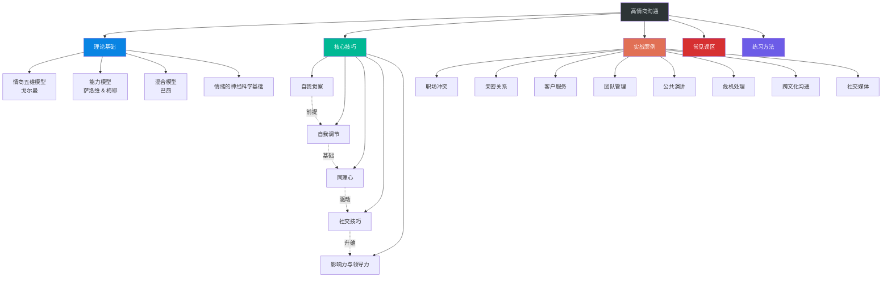

# 第十五章 高情商沟通

## 章节概览

### 引言

在人际交往的广阔舞台上，智商决定了你能走多远，而情商则决定了你能走多稳。1995年，丹尼尔·戈尔曼（Daniel Goleman）出版《情商》一书，将这个原本属于心理学专业领域的概念推向大众视野。此后三十年的大量研究表明：在预测职业成就、领导效能、关系质量和生活满意度方面，情商的解释力是智商的两倍以上（TalentSmart, 2018）。

高情商沟通不是一种天赋，而是一套可以学习、练习和精进的系统技能。它关乎我们如何识别自己和他人的情绪，如何在压力下保持冷静与理性，如何用恰当的方式表达自己并回应他人，以及如何在复杂的人际关系中建立信任、化解冲突、达成共识。

需要强调的是，高情商沟通与"圆滑世故""八面玲珑"有本质区别。真正的高情商沟通建立在真诚、尊重和自我认知之上——它不是操控他人的工具，而是促进相互理解的桥梁。本章将用理论指导实践，用案例印证方法，用练习固化能力，帮助读者构建完整的高情商沟通素养体系。

### 知识地图

上图展示了本章的知识架构。五个模块并非孤立存在，而是层层递进：**理论基础**为技巧学习提供认知框架，**核心技巧**为实战应用提供操作工具，**实战案例**将抽象能力具象化，**常见误区**帮助读者规避弯路，**练习方法**将知识内化为本能。纵向来看，五大核心技巧之间也存在递进关系——自我觉察是自我调节的前提，自我调节是同理心的基础，同理心驱动社交技巧，社交技巧升维为影响力。

### 本章内容结构

#### 第一节 理论基础

本节将深入介绍情商的三大主流理论模型：

- **丹尼尔·戈尔曼的情商五维模型**：自我意识、自我调节、内在动机、同理心、社交技能。这是应用最广泛的框架，尤其在组织行为学和领导力开发领域。
- **萨洛维和梅耶的能力模型**：将情商定义为"感知情绪、利用情绪促进思维、理解情绪、管理情绪"四项能力。这个模型更侧重认知加工过程，强调情绪作为一种信息源的价值。
- **巴昂的情绪商数模型（EQ-i）**：包含五个维度、15个子量表，是目前少数经过大规模标准化验证的情商测评工具之一。

此外，本节还将从神经科学角度解释情绪在沟通中的作用机制：杏仁核如何触发"战斗或逃跑"反应，前额叶皮层如何执行情绪调节，镜像神经元系统如何支持共情——这些生理知识将帮助读者理解"为什么情绪管理这么难"以及"为什么练习能改变大脑"。理论部分不追求学术论文的严谨，但追求概念清晰、逻辑自洽，为后续的技巧和实践提供坚实的根基。

#### 第二节 核心技巧

本节聚焦于高情商沟通的五大核心技巧，按照从内到外的顺序展开：

| 技巧 | 定义 | 关键能力 | 典型场景 |
|------|------|----------|----------|
| **自我觉察** | 认识自己的情绪模式和触发点 | 情绪命名、身体信号识别、触发点地图 | 被批评时觉察到防御反应 |
| **自我调节** | 在情绪波动时保持理性与克制 | 6秒暂停法、认知重评、呼吸调节 | 愤怒时不立即回应 |
| **同理心** | 真正理解他人的感受和立场 | 情感同理、认知同理、同理心倾听 | 朋友倾诉时放下评判 |
| **社交技巧** | 建立和维护良好的人际关系 | 冲突调解、反馈艺术、关系经营 | 化解团队分歧 |
| **影响力** | 通过高情商沟通引领他人 | 愿景传达、情感共鸣、授权赋能 | 激励低落的团队成员 |

每个技巧都将提供具体的操作方法和实践指南，而非停留在概念描述。例如，"自我觉察"不只告诉你"要觉察自己的情绪"，而是给出具体的情绪命名练习、身体扫描流程和触发点记录模板。

#### 第三节 实战案例

本节通过八个精心设计的典型场景，展示高情商沟通在实际生活中的应用。每个案例都采用统一的对比结构：

1. **场景描述**：还原真实情境，包含具体的人物关系、背景信息和冲突点
2. **低情商应对**：展示常见的错误沟通方式及其后果
3. **高情商应对**：展示基于情商技巧的正确沟通方式
4. **技巧拆解**：分析高情商应对中使用了哪些具体技巧
5. **迁移应用**：提炼可复用的沟通模式和思维框架

八个场景涵盖：职场冲突处理、亲密关系沟通、客户服务应对、团队管理、公共演讲、危机处理、跨文化交往以及社交媒体互动。这些场景覆盖了大多数人日常沟通的核心领域，读者可以在其中找到与自身经历高度契合的参照。

#### 第四节 常见误区

本节将揭示人们在追求高情商沟通过程中最常陷入的十个误区。每个误区都按照"错误认知→产生原因→纠正方法→正确理解"的结构展开：

| 误区 | 错误认知 | 正确理解 |
|------|----------|----------|
| 高情商 = 会说话 | 学几套话术就够了 | 话术是表象，内在觉察和真诚才是根基 |
| 高情商 = 不发脾气 | 压抑一切负面情绪 | 健康的情绪表达是高情商的组成部分 |
| 高情商 = 迎合他人 | 让所有人都满意 | 尊重自己的需求同样重要 |
| 同理心 = 同情心 | 理解就是可怜对方 | 同理是"我理解你"，同情是"我替你难过" |
| 高情商是天生的 | 有些人天生就会 | 大脑可塑性决定了情商完全可以后天培养 |
| 高情商操控术 | 让别人按我的意思来 | 操控是高情商的对立面 |
| 换位思考就够了 | 站在对方角度想就行 | 需要结合认知同理和情感同理 |
| 只需要情绪管理 | 管好情绪就行 | 情绪运用同样重要 |
| 职场才需要高情商 | 私下关系无所谓 | 所有人际场景都需要 |
| 一次练习就见效 | 学完就能改变 | 神经通路重塑需要持续练习 |

通过辨析这些误区，帮助读者建立对高情商沟通的科学认知，避免走弯路。

#### 第五节 练习方法

知易行难——这是情商提升最大的障碍。本节提供一套系统、科学的练习方案，将理论转化为可执行的日常习惯：

- **情绪日记法**：每日记录3-5个情绪事件，包括触发情境、情绪类型、身体反应、应对方式和事后反思。配有标准化记录模板。
- **正念冥想**：从每天5分钟的呼吸觉察开始，逐步扩展到情绪观察和身体扫描。提供具体引导词和渐进式练习计划。
- **角色扮演**：与学习伙伴模拟高冲突场景，在安全环境中练习情绪调节和沟通技巧。提供10个标准练习场景和评估清单。
- **反馈循环**：建立"沟通复盘"机制，定期邀请信任的人提供真实反馈。包含反馈收集问卷和改进计划模板。
- **90天进阶计划**：将所有练习方法整合为为期90天的结构化训练方案，分三个阶段（基础建立→技能巩固→自主运用）逐步推进。

每个方法都配有详细的操作步骤、推荐练习频率和效果评估标准，确保读者不仅知道"练什么"，更知道"怎么练"和"练到什么程度"。

#### 第六节 本章小结

对全章核心观点进行总结提炼，梳理高情商沟通的关键原则和行动要点，为读者提供清晰的学习路径图。小结不是简单的重复，而是将全章知识压缩为可快速回顾的核心要点清单。

#### 深度拓展

本章还包含一个"深度拓展"板块，面向希望进一步钻研的读者，内容包括：情商测评工具推荐（Mayer-Salovey-Caruso MSCEIT、EQ-i 2.0等）、推荐书单与学术文献、情绪神经科学前沿研究、AI时代情商沟通的新趋势等。

### 学习目标

通过本章的学习，读者将能够：

1. **理解情商的理论框架**：掌握三大主流情商模型的核心思想及其在沟通中的应用，理解情绪的神经科学基础
2. **提升自我觉察能力**：能够准确识别自己和他人的情绪状态，建立对自身情绪触发点的清晰认知
3. **掌握情绪调节技巧**：在各种高压沟通场景中运用具体的情绪调节策略，保持理性和建设性
4. **培养深度同理心**：区分认知同理与情感同理，真正理解他人的感受、需求和立场
5. **运用高级社交技巧**：在冲突调解、反馈表达、关系经营等场景中游刃有余
6. **避免常见误区**：对高情商沟通建立科学、全面的认知，不被错误观念误导
7. **建立持续练习的习惯**：拥有可执行的90天训练方案，将知识内化为本能反应

### 前置知识

学习本章之前，建议读者已经具备以下基础：

- **基本沟通意识**：理解沟通是双向过程，而非单向输出（参见第一章）
- **倾听能力**：能够进行基本的主动倾听（参见第四章）
- **自我反思习惯**：至少有过"我在沟通中哪里做得不好"的思考

如果以上基础尚不牢固，建议先阅读相关前置章节。但即使直接阅读本章，文中的概念解释和操作指南也足够独立成篇。

### 与前后章节的关系

| 关联章节 | 关联内容 | 学习建议 |
|----------|----------|----------|
| 第四章 主动倾听 | 倾听是同理心的实践入口 | 先掌握倾听技巧，再学习同理心 |
| 第六章 非暴力沟通 | NVC四步法是高情商沟通的核心工具 | 结合练习，互相印证 |
| 第九章 冲突管理 | 冲突场景是情商的最佳训练场 | 案例部分可交叉阅读 |
| 第十二章 领导力沟通 | 领导力是高情商沟通的高级形态 | 核心技巧→领导力应用 |
| 第十四章 跨文化沟通 | 文化差异影响情绪表达和解读 | 案例部分可交叉阅读 |

### 阅读建议

**按顺序阅读**：建议按照章节顺序阅读，先建立理论基础，再学习技巧和案例。跳跃式阅读可能导致"知道很多概念但不会用"的问题。

**边读边练**：每个练习方法建议在阅读当天就开始操作，而非"读完再练"。认知心理学研究表明，"学后立即应用"的记忆保持率是"先学后练"的3倍（Karpicke & Roediger, 2008）。

**建立学习小组**：与信任的朋友或同事组成2-4人的学习小组，每周进行一次角色扮演练习和互相反馈。社会学习理论指出，有同伴支持的行为改变成功率比独自练习高出65%。

**间隔复习**：建议在阅读完本章后，分别在第1天、第3天、第7天、第14天和第30天各回顾一次核心内容。这种间隔重复策略（Spaced Repetition）是将短期记忆转化为长期记忆的最有效方法之一。

**记录个人案例库**：每学完一个技巧或案例，立即写下1-2个自己经历过的类似场景。个人化的案例比书本案例更能激活情绪记忆，促进知识迁移。

高情商沟通是一项终身修炼。神经科学研究表明，人类大脑的前额叶皮层直到25岁左右才完全发育成熟——这意味着情绪调节能力本身就有一个自然发展过程。无论你现在处于什么阶段，只要开始有意识地练习，大脑的神经可塑性就会为你建立新的通路。它不仅让你成为一个更好的沟通者，更让你成为一个更理解自己、更善待他人的人。让我们开始这段旅程。
