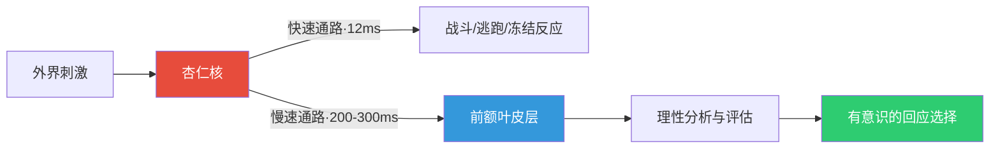
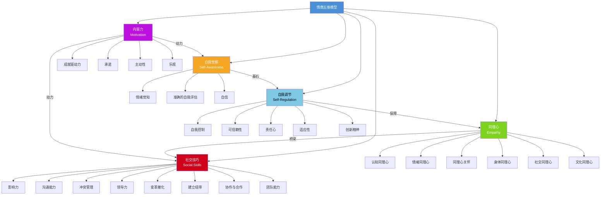
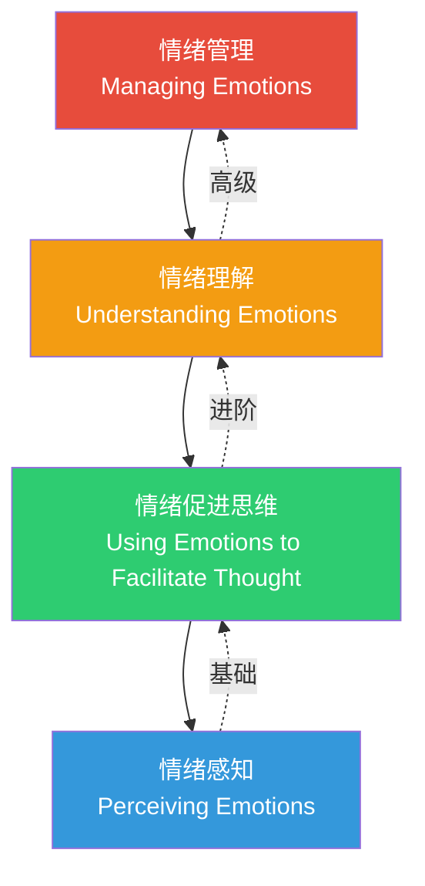
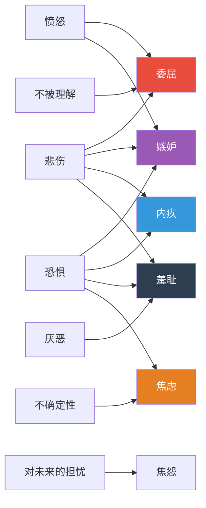
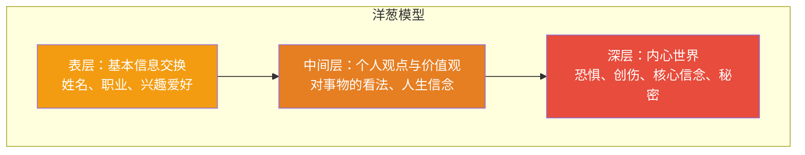
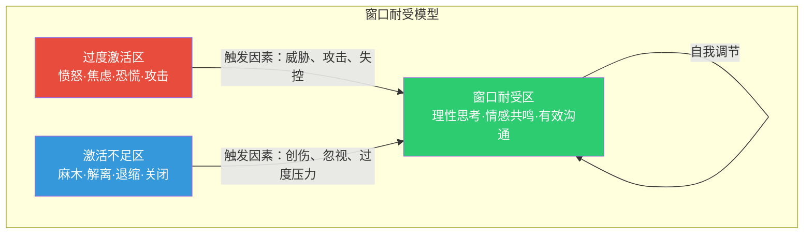

# 第十五章 第一节 理论基础

> "在刺激与回应之间，存在一个空间。在那个空间里，我们有选择回应方式的自由和力量。在我们的回应中，蕴含着我们的成长和自由。" ——维克多·弗兰克尔

高情商沟通不是一种天赋，而是一套可以学习、训练和精进的能力体系。要掌握这套能力，首先需要理解它背后的科学原理。本节将从情商的理论源头出发，系统梳理情绪识别、情绪管理和社交技巧三大支柱的理论基础，为后续章节的实操技巧奠定坚实的根基。

---

## 一、情商的概念与发展

### 1.1 什么是情商

情商（Emotional Intelligence，简称EI或EQ），是指个体识别、理解、管理自身情绪以及识别、理解和影响他人情绪的能力。与智商（IQ）侧重于认知能力和逻辑推理不同，情商关注的是情绪层面的智慧——它决定了我们如何感知世界、如何与人相处、如何应对压力和挑战。

情商概念的学术发展经历了三个关键里程碑：

| 时间 | 里程碑 | 贡献者 | 核心内容 |
|------|--------|--------|----------|
| 1983年 | 多元智能理论 | 霍华德·加德纳 | 提出"内省智能"和"人际智能"，为情商概念埋下种子 |
| 1990年 | 正式定义情商 | 萨洛维 & 梅耶 | 首次在学术期刊上定义情商为一种可测量的能力 |
| 1995年 | 情商走向大众 | 丹尼尔·戈尔曼 | 《情商》一书出版，将学术概念转化为大众认知 |

1990年，美国心理学家彼得·萨洛维（Peter Salovey）和约翰·梅耶（John Mayer）在学术期刊《想象、认知与人格》上发表论文，首次正式提出了"情商"这一概念，将其定义为"监控自己和他人的情绪和情感，对其加以区分，并利用这些信息来指导自己的思维和行动的能力"。他们的定义包含三个核心要素：（1）准确地感知、评价和表达情绪的能力；（2）接近或产生促进思维的情绪的能力；（3）理解情绪和情绪知识的能力；（4）调节情绪以促进情绪和智力发展的能力。

然而，真正让情商概念走向大众视野的，是丹尼尔·戈尔曼（Daniel Goleman）在1995年出版的同名畅销书《情商》。戈尔曼通过大量实证研究提出了一个颠覆性观点：在预测个人职业成功方面，情商的作用是智商的两倍以上。更具体地说，他的研究数据表明，在高层管理者中，情商贡献了将近90%的领导力效能差异——这一数据让整个商界开始重新审视"什么才是真正的聪明"。

### 1.2 情商在沟通中的核心地位

沟通的本质是信息和情感的双向传递。在任何一次沟通中，信息内容只占沟通效果的一小部分。心理学家阿尔伯特·梅拉比安（Albert Mehrabian）在1971年的研究中提出了著名的"7-38-55法则"：在面对面沟通中，语言内容仅占信息传递的7%，而语调占38%，肢体语言占55%。

需要特别说明的是，这个比例有其适用条件——它主要针对涉及情感态度的沟通场景（比如表达"我喜欢你"），而非所有类型的交流。但即便考虑到这一点，核心结论依然成立：**非语言信号在情感类沟通中占据压倒性优势**。

这意味着什么？如果你只关注"说什么话"而忽略了"怎么说"和"用什么表情说"，你就只运用了7%的沟通能力。高情商沟通者之所以能够建立深度信任、化解激烈冲突、推动困难决策，正是因为他们掌控了那93%的非语言维度。

让我们用一个真实场景来说明：

> **场景**：项目经理小张向客户汇报项目延期。
>
> **低情商版本**：小张低头看着PPT，语速飞快地念完原因分析，然后抬起头说："我们会尽快赶上进度。"（语言正确，但语调紧张、回避眼神接触、身体后倾——传递的信号是"我在心虚地应付你"）
>
> **高情商版本**：小张先停顿两秒，直视客户的眼睛，语调平稳地说："项目确实延期了，这让我们团队很不好受。"然后身体微微前倾，展开一份修正计划，"这是我们接下来两周的追赶方案，请您过目。"（语言、语调、肢体语言完全统一——传递的信号是"我诚实面对问题，并且已经准备好了解决方案"）

两个版本说的是类似的内容，但沟通效果可能天差地别。区别不在语言本身，而在于情商维度的全面掌控。

### 1.3 情商的神经科学基础

情商不仅仅是心理学概念，它有清晰的神经科学基础。理解这些基础，有助于我们从"知其然"走向"知其所以然"。

**杏仁核与情绪劫持**

杏仁核（Amygdala）是大脑中负责情绪处理的核心结构，位于颞叶深处，形如杏仁。它承担着"情绪哨兵"的角色——持续扫描外界信息，判断是否存在威胁。当杏仁核检测到危险信号时，它可以在大脑皮层（负责理性思考的区域）完成分析之前就启动应激反应，这就是著名的"杏仁核劫持"（Amygdala Hijack）现象。

神经科学家安东尼奥·达马西奥（Antonio Damasio）的"躯体标记假说"进一步揭示：情绪不是理性的敌人，而是决策过程中不可或缺的一部分。他的研究发现，前额叶皮层受损的患者虽然逻辑推理能力完好，但由于无法正常处理情绪信号，反而在日常决策中表现极差——这说明情绪本身是一种重要的"信息处理系统"。



**镜像神经元与共情**

1996年，意大利帕尔马大学的贾科莫·里佐拉蒂（Giacomo Rizzolatti）团队发现了一组特殊的神经元——镜像神经元（Mirror Neurons）。当我们观察别人做某个动作时，我们大脑中对应的运动区域也会激活，就好像我们自己在做那个动作一样。同样的机制也适用于情绪：当我们看到别人微笑时，我们的大脑会自动"镜像"那个微笑的神经活动。

镜像神经元的存在，为同理心提供了神经生物学解释：**我们天生就被设计来感受他人的情绪**。这既是高情商沟通的生物学基础，也解释了为什么情绪具有"传染性"。

**前额叶皮层与情绪调节**

前额叶皮层（Prefrontal Cortex, PFC），特别是背外侧前额叶皮层（dlPFC）和腹内侧前额叶皮层（vmPFC），是情绪调节的高级中枢。它与杏仁核之间存在双向连接：前额叶可以"向下调控"杏仁核的活动，帮助我们从冲动的情绪反应中恢复理性；反过来，强烈的情绪也会"向上劫持"前额叶的功能。

这意味着一个关键事实：**情绪调节能力是可以训练的**。就像肌肉可以通过锻炼变得更强壮一样，前额叶对杏仁核的调控能力也可以通过反复练习得到增强。正念冥想、认知重评训练等方法已经被脑成像研究证明能够改变前额叶-杏仁核之间的连接强度。

---

## 二、主流情商理论模型

目前学术界和实践领域存在多个有影响力的情商理论模型。理解这些模型的异同，有助于我们建立更完整的情商认知框架。

### 2.1 戈尔曼的情商五维模型

丹尼尔·戈尔曼的情商模型是目前最广为人知的情商理论框架。该模型基于对数百位企业高管的长期研究，将情商划分为五个核心维度，共25项具体能力：



#### （1）自我觉察（Self-Awareness）

自我觉察是情商的基石，指个体对自己的情绪、优势、劣势、需求和驱动力的清晰认知。具有高度自我觉察的人能够准确地识别自己当下的情绪状态，理解情绪产生的原因，并认识到情绪对自己思维和行为的影响。

自我觉察包含三个关键要素：

- **情绪觉知**：实时感知自己正在经历什么情绪。这不是事后回顾"我刚才好像很生气"，而是在情绪涌起的当下就能够识别它。神经科学研究表明，仅仅是"命名"这个动作本身——对自己说"我现在感到焦虑"——就能够激活前额叶皮层，减弱杏仁核的活动，这个过程被称为"情感标注"（Affect Labeling）。

- **准确的自我评估**：客观认识自己的优势和局限。不是盲目自信，也不是过度自我批评，而是对自己能力边界的精确了解。在沟通中，这意味着知道"我在冲突场景中容易变得防御性很强"或"我在面对权威时倾向于过度顺从"。

- **自信**：基于对自身的深刻了解而产生的内在安全感。这不是"我觉得自己很厉害"，而是"我清楚地知道自己是谁、能做什么、不能做什么，而这让我感到安定"。自信的人在沟通中不容易被他人的评价左右，因为他们不需要从外部获取自我价值的确认。

在沟通中，自我觉察的表现是：当你感到愤怒时，你能够意识到"我现在很生气"，并且能够分析"我生气是因为对方的话触发了我的某个敏感点"，而不是盲目地将愤怒发泄出来。

**自我觉察练习——情绪日记**：

每天花5分钟记录三件事：
1. 今天最强烈的一次情绪是什么？（命名情绪）
2. 触发这个情绪的事件是什么？（识别触发因素）
3. 这个情绪如何影响了我的行为或决策？（追踪情绪-行为链条）

坚持一个月后回顾，你会发现自己对情绪模式的认知显著提升。

#### （2）自我调节（Self-Regulation）

自我调节是指管理自己的情绪和冲动的能力。它不是压抑情绪，而是以健康、建设性的方式表达和处理情绪。这里需要澄清一个常见误解：**高情商不是"不生气"，而是"生气时依然能做出好决策"**。

自我调节包含五个要素：

- **自我控制**：管理破坏性情绪和冲动。区分"感受"和"行动"——你有权感到愤怒，但你没有权利因此伤害他人。自我控制的关键不是压制感受，而是在感受和行动之间插入一个"暂停键"。

- **可信赖性**：保持诚实和正直的标准。自我调节不是伪装——不是表面微笑、内心愤怒的"假装"。真正的情绪调节是在承认真实感受的基础上，选择负责任的表达方式。

- **责任心**：对自己的表现负责。不把情绪失控归咎于外部因素（"是他先惹我的"），而是对自己的反应方式承担全部责任。

- **适应性**：灵活应对变化和不确定性。当环境发生变化时，能够迅速调整自己的情绪状态和行为策略，而不是固执地坚持原来的计划。

- **创新精神**：对新想法保持开放。情绪僵化的人在面对不同意见时容易产生防御反应，而自我调节能力强的人能够在情绪波动中保持认知的开放性。

在沟通中，自我调节意味着：即使你内心非常愤怒，你也不会口不择言；即使你感到焦虑，你也不会表现得慌乱无措；即使你受到不公正的批评，你也能先冷静分析再做出回应。

#### （3）内驱力（Motivation）

内驱力是指驱动个体追求目标的内在动力，超越金钱和地位的外在激励。戈尔曼的研究发现，高绩效者与普通绩效者之间最显著的差异之一，就是内驱力的质量——高绩效者追求目标的驱动力来自内心深处，而非外部奖惩。

内驱力包含四个要素：

- **成就驱动力**：追求卓越、不断改进。不是"够好就行"，而是"我能做到更好"。在沟通中，这意味着你会反复优化自己的表达方式，寻求更清晰、更有影响力的沟通效果。

- **承诺**：与个人或群体目标保持一致。在沟通中表现为言行一致——你不会轻易承诺，但一旦承诺就会全力以赴。

- **主动性**：随时准备抓住机会。不是等待别人来沟通，而是主动发起对话、解决问题、弥合分歧。

- **乐观**：即使面对失败也保持前进的动力。不是盲目的乐观主义（"一切都会好的"），而是"理性乐观"——承认困难的存在，但相信自己有能力应对（"这很难，但我们可以找到办法"）。

#### （4）同理心（Empathy）

同理心是理解和感受他人情绪状态的能力。它不是简单的"我理解你"这四个字，而是真正站在对方的角度去感受、去思考。神经科学研究表明，同理心激活的是大脑中的前脑岛（anterior insula）和前扣带皮层（anterior cingulate cortex）——这些区域恰恰也是我们自己体验情绪时激活的区域。换句话说，真正的同理心不是"想"出来的，而是"感受"出来的。

戈尔曼将同理心分为六种类型，每种类型在沟通中都有独特的价值：

| 同理心类型 | 定义 | 沟通中的应用 | 典型表达 |
|-----------|------|-------------|---------|
| 认知同理心 | 理解他人的思考方式和视角 | 理解对方的逻辑和立场 | "我理解你为什么会这样想" |
| 情绪同理心 | 感受他人正在经历的情绪 | 感知对方的真实情感状态 | "你看起来很沮丧" |
| 同理心关怀 | 基于理解而采取关怀行动 | 满足对方的情感需求 | "你需要我做些什么？" |
| 身体同理心 | 通过身体感知他人情绪 | 捕捉非语言信号 | 注意到对方紧握的拳头 |
| 社交同理心 | 理解群体动态和社会规范 | 读懂房间的氛围 | 感知会议中的紧张气氛 |
| 文化同理心 | 理解不同文化的情感表达方式 | 跨文化沟通中避免误判 | 理解含蓄表达背后的真实意图 |

在沟通中，同理心是建立信任和连接的桥梁。需要注意的是，**同理心不等于同意**。你可以说"我理解你为什么很生气"，同时仍然持有不同立场。同理心是理解的能力，不是妥协的义务。

#### （5）社交技巧（Social Skills）

社交技巧是指管理人际关系和建立社交网络的能力。它不仅仅是"会交际"，更是一种在复杂人际环境中有效工作的综合能力。戈尔曼的数据显示，社交技巧是情商五个维度中与其他维度关联最紧密的一个——它是所有情商能力的"输出接口"。

社交技巧包含多个要素：

- **影响力**：运用有效的说服策略。不是操纵，而是通过建立信任和展示价值来影响他人的决策。
- **沟通能力**：倾听开放、传递清晰有力的信息。不只是"会说"，更包括"会听"和"会问"。
- **冲突管理**：谈判和解决分歧。不是回避冲突，也不是激化冲突，而是在冲突中寻找共赢的解决方案。
- **领导力**：激励和引导个人与团队。高情商的领导力不是靠权力驱动，而是靠愿景和信任驱动。
- **变革催化**：启动、管理和引导变革。在组织变革中，情绪管理能力往往比技术能力更关键。
- **建立纽带**：培养和维护关系网络。不是功利性的"人脉经营"，而是真诚的关系投资。
- **协作与合作**：与他人协同工作以实现共同目标。这需要同时具备自我觉察（了解自己在团队中的角色）和同理心（理解他人的贡献）。
- **团队能力**：在团队中创造协同效应。1+1>2的效果来自于情绪层面的协调，而不仅仅是任务层面的分工。

### 2.2 萨洛维-梅耶能力模型

萨洛维和梅耶的情商模型侧重于情商作为一种认知能力的定义，将情商划分为四个层次，由低到高依次为：



#### （1）情绪感知（Perceiving Emotions）

这是最基本的情商能力，指准确识别自己和他人情绪的能力。包括通过面部表情、声音语调、肢体语言和艺术作品等渠道识别情绪。萨洛维和梅耶特别强调，情绪感知是一切更高层次情绪能力的前提——如果你连自己的情绪都识别不清楚，就更谈不上理解和管理它了。

在实际沟通中，情绪感知能力弱的人经常会说："我不知道自己怎么了"或"我觉得一切都挺好的"（但实际上他们可能正处于压抑或否认状态）。而情绪感知能力强的人能够精确地描述："我现在有一种混合了焦虑和期待的感觉，焦虑来自于对结果的不确定，期待来自于我对这个项目的投入。"

#### （2）情绪促进思维（Using Emotions to Facilitate Thought）

指利用情绪来辅助认知过程的能力。萨洛维和梅耶的研究发现，不同的情绪状态会促进不同类型的思维：

- **快乐**：促进创造性思维和发散性思考。当你需要头脑风暴、产生新想法时，先让自己进入愉悦的状态会更有效。
- **悲伤**：促进分析性思维和细节关注。当你需要仔细审查合同条款或检查报告错误时，适度的严肃状态有助于提高准确度。
- **愤怒**：促进目标导向行为和坚持。当你需要坚定地表达立场或推动项目前进时，适度的愤怒可以提供推动力。
- **恐惧**：提高警觉性和风险感知。当你需要进行风险评估或安全审查时，适度的谨慎心态有助于发现潜在问题。

高情商的人能够有意识地利用情绪状态来提升认知效能，而不是被动地被情绪拖着走。这在沟通中的应用是：在谈判前，有意识地让自己进入适度兴奋的状态；在需要仔细倾听时，让自己进入平静专注的状态。

#### （3）情绪理解（Understanding Emotions）

指理解情绪的复杂性、情绪之间的关系以及情绪变化的原因。包括理解情绪词汇的含义、识别情绪的渐变过程、理解情绪与事件之间的因果关系等。

情绪理解的核心能力包括：

- **理解情绪词汇**：能够区分相似但不同的情绪（如"失望"和"沮丧"、"紧张"和"焦虑"、"恼怒"和"愤怒"）
- **理解情绪演变**：知道情绪是如何随时间变化的——恼怒如果不加处理可能升级为愤怒，愤怒如果被压抑可能转化为怨恨
- **理解情绪混合**：认识到多种情绪可以同时存在——你可以同时对一个人感到愤怒和理解
- **理解情绪因果**：能够追溯情绪的根源——"我之所以对同事的建议反应过度，是因为它触及了我对自己专业能力的不安全感"

#### （4）情绪管理（Managing Emotions）

这是最高层次的情商能力，指根据情境需要调节自己和他人情绪的能力。它包括保持开放的情绪状态、根据需要调节情绪的强度和持续时间、以及在适当的时候产生或抑制特定情绪。

需要强调的是，萨洛维-梅耶模型中的"情绪管理"并不是指"控制"或"压抑"情绪。他们特别指出，情绪管理包含两个维度：

1. **管理自己的情绪**：能够延长积极情绪的体验，缩短消极情绪的持续时间，但不否认消极情绪的存在
2. **管理他人的情绪**：能够通过自己的行为和表达来调节他人的情绪状态——这是领导力和影响力的核心

### 2.3 巴昂的情商模型

鲁文·巴昂（Reuven Bar-On）提出的情商模型更侧重于情商与心理健康和社会适应的关系。与戈尔曼模型侧重工作场景和萨洛维-梅耶模型侧重认知能力不同，巴昂模型回答的是一个更根本的问题：**情商如何影响一个人的整体幸福感和社会功能？**

巴昂模型将情商分为五个大类、15个子维度：

| 维度 | 子维度 | 核心含义 | 与沟通的关联 |
|------|--------|---------|-------------|
| 自我维度 | 自我觉察 | 认识自己的情绪 | 沟通中的情绪识别起点 |
| | 自信 | 认识自身价值和能力 | 沟通中的表达底气 |
| | 自我实现 | 持续成长和自我发展 | 沟通能力的持续精进 |
| | 情绪独立 | 不过度依赖外部认可 | 沟通中不被他人评价绑架 |
| | 自我尊重 | 接纳和尊重自己 | 沟通中的底线和边界 |
| 人际维度 | 同理心 | 理解他人感受 | 沟通中的信任建立 |
| | 社会责任 | 对社会和他人的义务感 | 沟通中的责任意识 |
| | 人际关系 | 建立和维护关系 | 沟通的长期效果 |
| 适应维度 | 现实检验 | 区分主观和客观 | 沟通中的事实基础 |
| | 灵活性 | 适应变化 | 沟通中的策略调整 |
| | 问题解决 | 有效应对问题 | 沟通中的矛盾化解 |
| 压力管理维度 | 压力耐受 | 承受压力的能力 | 高压场景下的沟通表现 |
| | 冲动控制 | 管理行为冲动 | 沟通中的情绪失控防范 |
| 一般情绪维度 | 幸福感 | 对生活的满足感 | 积极沟通的基础 |
| | 乐观主义 | 对未来的积极预期 | 沟通中的建设性态度 |

巴昂模型特别强调情商对心理健康和社会适应的预测作用。他的研究表明，情商得分高的人在以下方面表现更优：更好的社会关系、更高的职业满意度、更低的心理健康问题发生率、更强的压力应对能力。这为高情商沟通提供了重要的理论支撑——**高情商沟通不仅仅是"说得漂亮"，它关乎一个人的整体生活质量和心理健康**。

### 2.4 三大模型的对比与整合

三个模型并非相互矛盾，而是从不同角度描述同一个核心能力体系：

| 对比维度 | 戈尔曼模型 | 萨洛维-梅耶模型 | 巴昂模型 |
|---------|-----------|----------------|---------|
| 核心定位 | 工作场景中的领导力效能 | 认知能力与信息加工 | 心理健康与社会适应 |
| 理论取向 | 混合模型（能力+特质） | 纯能力模型 | 混合模型（能力+特质） |
| 维度数量 | 5个维度、25项能力 | 4个层次 | 5大类、15个子维度 |
| 测量工具 | ESCI（360度评估） | MSCEIT（能力测试） | EQ-i（自评量表） |
| 核心贡献 | 将情商引入商业和领导力领域 | 提供了最严谨的学术定义 | 连接情商与心理健康 |
| 主要局限 | 部分能力难以客观测量 | 忽视了动机和社交维度 | 国际验证数据相对不足 |

在本书的后续章节中，我们将以戈尔曼模型为主体框架，同时吸收萨洛维-梅耶模型的认知能力分层思想和巴昂模型的心理健康视角，构建一套既有理论深度又有实践指导价值的高情商沟通体系。

---

## 三、情绪识别：沟通的基础

### 3.1 情绪的本质与功能

情绪是个体对客观事物与自身需求之间关系的主观体验和反应。这个定义包含三个关键要素：

1. **主观体验**：情绪是内在的、私人的感受——同一件事，不同的人可能产生完全不同的情绪
2. **生理反应**：情绪伴随着可测量的生理变化——心跳加速、肌肉紧张、皮肤电导变化等
3. **行为倾向**：情绪会促使我们采取特定的行为——恐惧促使逃跑，愤怒促使攻击，快乐促使亲近

从进化的角度看，情绪是人类适应环境的重要工具：恐惧帮助我们远离危险，愤怒帮助我们维护边界，快乐促进社会连接，悲伤触发他人的关怀和支持。没有"无用"的情绪——每种情绪都在特定情境中具有生存价值。

在沟通中，情绪发挥着四重功能：

- **信号功能**：情绪向自己和他人传递重要的信息。当你在沟通中感到不适，这可能意味着你的某个需求没有被满足，或者你的某个价值观受到了挑战。学会"读懂"情绪信号，是高情商沟通的第一步。
- **动机功能**：情绪驱动我们的行为。理解自己和对方的情绪驱动因素，是有效沟通的关键。一个人为什么在某个话题上特别激动？背后往往有一个深层的情绪需求。
- **调节功能**：情绪影响我们的认知过程和行为方式。焦虑时可能过度防御，快乐时可能过于放松。了解这一点，可以帮助我们在沟通中有意识地管理自己的认知状态。
- **社会功能**：情绪表达促进社会连接。分享快乐加深关系，表达悲伤获得支持。在沟通中，适当地展示真实的情绪（而非永远保持"职业化"的面无表情），是建立深度信任的关键。

### 3.2 基本情绪与复合情绪

心理学家保罗·艾克曼（Paul Ekman）通过长达数十年的跨文化研究，确定了六种基本情绪（后来扩展为八种，增加了"轻蔑"和"兴奋"），它们具有跨文化的普遍性——无论在纽约、东京还是非洲部落，人们表达这些情绪的面部表情都是相似的。

| 基本情绪 | 核心功能 | 触发条件 | 沟通中的典型表现 | 识别要点 |
|---------|---------|---------|-----------------|---------|
| 快乐 | 促进社会连接 | 需求满足、目标达成、意外惊喜 | 微笑、开放的身体语言、积极的语调 | 注意区分"真笑"（眼角有鱼尾纹）和"假笑"（只有嘴角上扬） |
| 悲伤 | 触发关怀和支持 | 失去、分离、期望落空 | 语调低沉、眼神回避、动作迟缓 | 悲伤的人可能变得安静和退缩，不要误以为是冷漠 |
| 愤怒 | 维护边界和正义 | 边界被侵犯、不公正、受阻 | 语调升高、肢体紧张、直接的眼神接触 | 表面愤怒下往往隐藏着更深的情绪（恐惧、受伤、委屈） |
| 恐惧 | 远离危险 | 威胁、不确定性、失控感 | 声音颤抖、身体收缩、回避行为 | 长期恐惧可能表现为过度控制或完美主义 |
| 惊讶 | 重新定向注意力 | 意料之外的事件 | 瞪大眼睛、张嘴、短暂的身体僵住 | 惊讶很快转化为其他情绪，窗口期约1-2秒 |
| 厌恶 | 远离有害事物 | 排斥、不认同、道德违背 | 皱鼻、后退、嘴角下拉 | 在沟通中，厌恶常表现为轻蔑或不屑 |

复合情绪是由基本情绪混合而产生的更复杂的情绪体验。理解复合情绪对于高情商沟通至关重要，因为人们在日常沟通中表达的往往不是基本情绪，而是复合情绪：



在沟通中，准确识别这些复合情绪至关重要。当一个人表现出愤怒时，真正驱动这种愤怒的可能是恐惧、委屈或受伤。如果你只处理表面的愤怒而忽略了底层的情绪，沟通就很难取得真正的突破。

**识别复合情绪的关键技巧——问"下面还有什么？"**

当你在沟通中识别到对方的愤怒时，不要急于回应这个愤怒，而是在内心问自己："在这层愤怒的下面，还有什么？" 然后在合适的时机验证你的猜测："你听起来很生气。我感觉到你可能不只是生气——你是不是觉得自己的努力没有被看到？" 这种"向下挖掘"的沟通方式，往往能够触及真正的问题核心。

### 3.3 情绪识别的方法

#### （1）身体扫描法

情绪总是伴随着身体反应。神经科学家安东尼奥·达马西奥的研究表明，身体感觉先于意识层面的情绪体验——也就是说，我们的身体先"知道"我们的情绪，然后大脑才"意识到"。通过有意识地关注身体的感觉，可以更准确地识别情绪：

| 身体感受 | 典型对应情绪 | 生理机制 | 识别要点 |
|---------|------------|---------|---------|
| 紧张感（肩颈僵硬、握拳） | 焦虑、恐惧 | 交感神经系统激活、肌肉准备应对威胁 | 注意区分"兴奋"和"焦虑"——两者身体信号相似 |
| 发热感（面部发烫、胸口发热） | 愤怒、尴尬 | 血管扩张、血液涌向面部和四肢 | 愤怒时体温可能升高1-2度 |
| 胸闷感（胸口压迫、呼吸不畅） | 悲伤、压抑 | 副交感神经活动增强、呼吸变浅 | 长期胸闷可能与抑郁相关 |
| 轻快感（身体放松、精力充沛） | 快乐、兴奋 | 多巴胺和内啡肽释放 | 这是情绪的正向信号，注意珍惜和延长 |
| 沉重感（全身乏力、四肢沉重） | 疲惫、沮丧 | 应激激素水平下降、能量耗竭 | 需要与生理疲劳区分——情绪性沉重通常伴随特定场景 |
| 胃部不适（胃痛、恶心） | 紧张、不安 | 肠脑轴激活、消化系统受情绪影响 | 肠道被称为"第二大脑"，情绪波动直接影响消化功能 |

练习方法：在日常生活中，每天进行2-3次30秒的"情绪身体扫描"——从头到脚依次关注身体各部位的感觉，然后问自己："此刻我身体的这种感觉，对应的是什么情绪？"坚持两周，你会发现自己的情绪识别速度和准确度显著提高。

#### （2）面部微表情识别

面部表情是情绪最直接的外在表现。保罗·艾克曼开发的面部动作编码系统（FACS）通过识别44个面部动作单元（Action Units, AU）来系统地解读面部表情。以下是日常沟通中最关键的面部表情识别要点：

- **快乐**：嘴角上扬（AU12）+ 眼角出现鱼尾纹（AU6）。关键鉴别点：真实微笑会动用眼轮匝肌（眼周肌肉），产生眼角皱纹；社交性假笑只动用颧大肌（嘴角肌肉），眼睛不笑。
- **悲伤**：眉毛内侧上扬（AU1+AU4）+ 嘴角下垂（AU15）。注意：很多成年人会努力掩饰悲伤，所以眉毛的细微变化可能是唯一的信号。
- **愤怒**：眉头紧锁（AU4+AU5+AU24）+ 嘴唇紧闭或张开。预判信号：嘴唇越紧闭，爆发的可能性越大。
- **恐惧**：眉毛上扬并聚拢（AU1+AU2+AU4）+ 眼睛睁大（AU5+AU7）。与惊讶的区别：恐惧时眉毛是聚拢的，惊讶时眉毛是展开的。
- **惊讶**：眉毛高扬（AU1+AU2）+ 嘴巴张开（AU26/AU27）。纯粹的惊讶持续时间不超过2秒——超过这个时间的"惊讶"通常是表演的。
- **厌恶**：上唇上扬（AU9/BU10）+ 皱鼻。在沟通中，微弱的厌恶表情（嘴角微微下拉）常被用来表达轻蔑或不认同。

#### （3）语调分析

语调是情绪的另一个重要载体，而且比面部表情更难控制——很多人可以管理自己的面部表情，却很难完全掩盖语调中的情绪信号：

| 语调特征 | 可能的情绪 | 沟通中的判断 | 高情商的应对 |
|---------|-----------|-------------|------------|
| 语速突然加快 | 焦虑、兴奋、防御 | 对方可能在某个话题上感到不安 | 放慢自己的语速，帮助对方减速 |
| 语速突然减慢 | 犹豫、强调、悲伤 | 对方可能在斟酌措辞或情绪低落 | 给予更多等待时间，不要催促 |
| 音量突然升高 | 愤怒、激动、强调 | 对方可能在某个点上情绪强烈 | 不要跟着升高音量，保持平稳 |
| 音量突然降低 | 悲伤、不自信、分享秘密 | 对方可能在表达脆弱的内容 | 凑近一些，表现出专注倾听 |
| 语调变得平板 | 疲惫、失望、压抑 | 对方可能失去了活力或希望 | 用温暖的语调注入能量 |
| 语调起伏丰富 | 热情、投入、感兴趣 | 对方对话题有积极情感 | 跟随对方的节奏，增强互动 |
| 频繁停顿/口头禅增多 | 紧张、不确定、组织思路 | 对方可能需要更多思考时间 | 耐心等待，不要急于填补沉默 |

#### （4）行为模式识别

长期的行为模式可以反映深层的情绪倾向。在沟通中，理解这些模式可以帮助你更好地预测和应对对方的行为：

- **回避行为**（沉默、转移话题、身体后倾）：可能反映恐惧、不自信或不适。回避者需要更多的安全感才能敞开心扉。
- **攻击行为**（打断、贬低、指责）：可能反映愤怒、不安全感或权力需求。攻击者通常在底层感到脆弱或无力。
- **讨好行为**（过度道歉、放弃立场、迎合对方）：可能反映对被拒绝的恐惧或低自尊。讨好者需要被告知他们的感受也同样重要。
- **退缩行为**（心不在焉、应答敷衍、情感隔离）：可能反映悲伤、疲惫或绝望。退缩者需要温和但坚定的关注。

### 3.4 情绪颗粒度

情绪颗粒度（Emotional Granularity）是心理学家丽莎·费尔德曼·巴瑞特（Lisa Feldman Barrett）提出的概念，指个体区分和标识不同情绪体验的精细程度。

这个概念的深远意义在于：**你能够命名的情绪越多，你就越能够精确地管理它**。研究发现，情绪颗粒度高的人能够精确地描述自己的情绪状态（比如区分"失望"和"沮丧"、"焦虑"和"恐惧"），而情绪颗粒度低的人只能笼统地感受到"不好"或"不舒服"。

为什么会这样？巴瑞特的"情绪构建理论"给出了答案：情绪不是大脑中预设的"程序"，而是大脑根据过去经验"构建"出来的。当你拥有更丰富的情绪词汇时，你的大脑就有了更多的"构建模块"，能够更精确地识别和区分不同的情绪状态。

| 情绪颗粒度低的表达 | 情绪颗粒度高的表达 | 精确度带来的好处 |
|------------------|------------------|---------------|
| "我很不开心" | "我感到失望，因为我期待的认可没有得到" | 知道需要表达什么需求 |
| "他让我很烦" | "我感到不耐烦，因为他的节奏和我不一致" | 知道需要协商什么 |
| "压力很大" | "我同时感到焦虑（怕做不好）和委屈（觉得没人帮我）" | 可以分别处理两个情绪 |
| "说不清楚的感觉" | "一种混合了期待和不安的复杂感受" | 意识到两种力量在拉扯 |
| "我崩了" | "我感到一种被淹没的失控感，情绪在短时间内剧烈波动" | 知道自己需要暂停和恢复 |

提升情绪颗粒度的方法：

1. **扩展情绪词汇量**：心理学研究识别出超过300种不同的情绪状态。学习和使用更多的情绪词汇，例如"怅然若失"、"心烦意乱"、"五味杂陈"、"如释重负"——每多一个词汇，就多一个精确识别情绪的工具。
2. **进行情绪标注练习**：每天在固定时间（如午饭后、睡前）用一个精确的词汇标注此刻的情绪。不要满足于"还好"或"一般"，逼自己找到一个更具体的词。
3. **比较相似情绪的细微差别**：例如，"失望"是期望落空后的感受，"沮丧"是反复受挫后的疲惫感，"挫败"是努力付之东流后的无力感——三者相似但不同。
4. **阅读文学作品**：文学作品中丰富的情绪描写可以帮助提高情绪感知能力。推荐先从情感描写细腻的现代文学开始。
5. **使用情绪轮盘工具**：Plutchik的情绪轮盘将情绪按照强度和类别排列，是扩展情绪词汇量的有效工具。

---

## 四、情绪管理：沟通的核心能力

### 4.1 情绪管理的本质

情绪管理不是压抑情绪、否认情绪或控制情绪。这些做法不仅无效，而且有害——研究表明，长期压抑情绪会导致免疫力下降、焦虑加剧、人际关系质量下降。

真正的情绪管理包含四个步骤：


1. **觉察情绪**：首先知道自己正在经历什么情绪。这一步看似简单，实际上很多人做不到——他们在情绪涌起的瞬间就进入了"自动反应模式"，根本没来得及意识到自己在经历什么。

2. **接纳情绪**：允许情绪的存在，不评判、不抗拒。不要对自己说"我不应该生气"或"我太脆弱了才感到难过"。情绪没有好坏之分，它只是一个信号。接纳是管理的前提——你无法管理一个你拒绝承认的东西。

3. **理解情绪**：探索情绪背后的信息和需求。问自己："这个情绪在试图告诉我什么？" 愤怒可能在告诉你边界被侵犯了，焦虑可能在告诉你有重要的事情需要准备，悲伤可能在告诉你有什么东西失去了。

4. **选择表达**：有意识地选择如何表达和行动。这是最关键的一步——你有情绪是事实，但你如何表达这种情绪是选择。同一个愤怒，可以选择直接沟通（"你刚才说的话让我不舒服"），也可以选择发泄攻击（"你就是个自私的人"），结果截然不同。

维克多·弗兰克尔的名言精准地概括了这一过程："在刺激与回应之间，存在一个空间。在那个空间里，我们有选择回应方式的自由和力量。"

### 4.2 情绪触发机制

理解情绪触发机制是情绪管理的前提。情绪触发通常涉及以下过程：

事件 → 解读（认知评估）→ 情绪反应 → 生理变化 → 行为倾向 → 实际行为

关键在于：同一个事件，不同的解读会产生完全不同的情绪反应。这不是空洞的理论——它每天都在你的生活中发生。

例如，同事在会议上批评你的方案：

| 解读方式 | 认知模式 | 情绪反应 | 行为倾向 | 实际行为 |
|---------|---------|---------|---------|---------|
| "他在故意针对我" | 个人化、读心术 | 愤怒 + 受伤 | 反击或退缩 | 辩解/沉默不语 |
| "他可能有不同的看法" | 中性评估 | 好奇 + 中性 | 探索 | "你能详细说说你的想法吗？" |
| "他说的有道理" | 开放接受 | 接受 + 轻微遗憾 | 调整 | "你说得对，这部分我需要改进" |
| "他在帮我发现问题" | 积极重构 | 感谢 + 轻松 | 合作 | "谢谢你指出这一点" |

认知行为疗法（CBT）的核心理念就是：不是事件本身导致了我们的情绪反应，而是我们对事件的解读（认知）决定了我们的情绪。这在心理学中被称为"认知中介"（Cognitive Mediation）原则——由阿尔伯特·艾利斯（Albert Ellis）的ABC理论最早系统阐述：

- **A（Activating Event）**：触发事件
- **B（Belief）**：对事件的信念/解读
- **C（Consequence）**：情绪和行为后果

**B才是决定C的关键因素**。通过识别和调整不合理的认知模式（B），我们可以改变情绪反应（C），即使触发事件（A）不变。

### 4.3 常见的认知扭曲

在沟通中，以下认知扭曲常常导致不必要的情绪反应。识别这些扭曲是改变它们的第一步：

| 认知扭曲 | 定义 | 沟通中的典型表现 | 纠正方法 |
|---------|------|-----------------|---------|
| 读心术 | 假设自己知道对方在想什么 | "他一定是看不起我""她肯定在背后说我坏话" | 问自己：我有确凿证据吗？有没有其他可能的解释？ |
| 灾难化 | 将事情想象成最坏的结果 | "如果这次沟通失败，一切都完了""他再也不信任我了" | 问自己：最坏的结果是什么？发生的概率有多大？即使发生了我能应对吗？ |
| 非黑即白 | 用极端的方式看待事物 | "他要么完全支持我，要么就是反对我""这次合作是彻底的失败" | 寻找灰色地带：有没有部分同意的可能？有没有部分成功的方面？ |
| 过度概括 | 从单一事件得出普遍结论 | "他总是不听我说话""每次我表达需求都会被拒绝" | 注意"总是""每次""从来"这些绝对化词汇，问自己：真的是每一次都如此吗？ |
| 应该思维 | 用"应该"来要求自己和他人 | "他应该理解我""我应该永远保持冷静" | 将"应该"替换为"我希望"或"我更倾向于" |
| 个人化 | 将无关的事情归因于自己 | "他们没回复我，一定是我做错了什么""他心情不好一定是我的原因" | 考虑其他可能性：也许对方只是忙，也许他遇到了与你无关的事 |
| 情绪推理 | 将情绪当作事实 | "我觉得自己很失败，所以我一定是个失败者""我感到害怕，所以这个决定一定是错的" | 区分"感受"和"事实"：感觉不等于现实 |

**认知扭曲识别练习**：

在下次沟通中产生强烈负面情绪后，拿出一张纸，写下三列：

1. **事件**：客观描述发生了什么（不含任何判断）
2. **我的解读**：我对这件事的想法是什么
3. **认知扭曲检验**：我的解读中包含哪种认知扭曲？

这个简单的练习，持续做3-4周，就能够显著提升你对自身认知模式的觉察力。

### 4.4 情绪调节策略

心理学家詹姆斯·格罗斯（James Gross）提出了情绪调节的过程模型，将情绪调节策略按照情绪产生的时间顺序分为五类。这个模型的核心洞察是：**越早介入情绪调节过程，需要的认知努力就越小，效果也越好**。


#### （1）情境选择（Situation Selection）—— 预防性策略

主动选择进入或回避某些情境。这是最"上游"的情绪调节策略——在情绪还没有产生之前就采取行动。

**在沟通中的应用**：
- 避免在对方疲惫、饥饿或情绪不佳时讨论敏感话题（选择合适的时间）
- 避免在公共场合讨论需要隐私的问题（选择合适的地点）
- 选择自己状态最好的时候进行重要的对话（选择合适的状态）
- 如果你知道某个同事总是让你情绪失控，减少不必要的接触（选择合适的对象）

**具体操作**：在计划重要沟通之前，做一个"情境检查清单"：
- [ ] 时间是否合适？（双方都有足够的时间和精力？）
- [ ] 地点是否合适？（有隐私、不被打扰？）
- [ ] 我的状态如何？（平静、清醒、不饥饿？）
- [ ] 对方的状态如何？（从对方最近的行为判断）

#### （2）情境修正（Situation Modification）—— 环境干预策略

改变引发情绪的情境。当你无法完全回避某个情境时，可以主动改变它的某些方面来降低情绪风险。

**在沟通中的应用**：
- 将会议从正式的会议室移到轻松的咖啡厅（改变环境氛围）
- 在一对一谈话中，调整座位角度——90度比面对面更不容易引发对抗感
- 在情绪升温时，提议暂停5分钟（"我们先喝口水，5分钟后继续"）
- 改变沟通方式——面对面说不清楚的，试试写一封结构化的邮件

#### （3）注意力转移（Attentional Deployment）—— 认知资源再分配

将注意力从情绪触发因素转移到其他方面。这不是"逃避问题"，而是一种策略性的注意力管理。

**在沟通中的应用**：
- 将注意力从对方的攻击性言辞转移到对方的核心需求（"他在用攻击性的方式说什么？"）
- 将注意力从自己的紧张感转移到对话的内容本身
- 暂时将注意力转向自己的呼吸——深呼吸3次（吸4秒-屏3秒-呼5秒），可以有效激活副交感神经系统
- 在争论中，将注意力从"谁对谁错"转移到"我们共同的目标是什么"

**需要注意的陷阱**：注意力转移是一种短期策略，不适合长期使用。如果某个沟通问题反复引发你的情绪反应，你需要回到更深层的认知重评来处理它，而不是一直用注意力转移来回避。

#### （4）认知重评（Cognitive Reappraisal）—— 最核心的策略

改变对事件的解读方式。这是情绪调节研究中被证实最有效的策略，也是CBT的核心技术。格罗斯的研究表明，习惯使用认知重评策略的人，长期来看拥有更好的心理健康、更满意的人际关系和更高的整体幸福感。

**认知重评的四步操作流程**：

**第一步：识别自动化解读**
当你产生强烈情绪时，先暂停，问自己："此刻我脑海中闪过的第一个念头是什么？"
- 例如："他根本不尊重我"

**第二步：质疑这个解读**
用苏格拉底式提问挑战这个念头：
- 有什么客观证据支持这个想法？
- 有没有其他可能的解释？
- 如果我的好朋友遇到同样的情况，我会怎么跟他说？
- 最坏的解读是什么？最好的解读是什么？最现实的解读是什么？

**第三步：生成替代解读**
- 也许他只是太累了，没注意到自己的语气
- 也许他对这个项目有自己的焦虑，不是针对我个人
- 也许这是他一贯的沟通风格，和尊重与否无关

**第四步：选择最有帮助的解读**
不是选择"最正确"的解读，而是选择"最有帮助"的解读——一个既能解释事实、又能引导建设性行为的解读。

**认知重评 vs. 否认压抑**：认知重评不是"骗自己"。它不是说"我没有生气"或"这没什么大不了的"。它承认情绪的存在（"我确实感到受伤"），但改变的是对事件的归因方式（"但他的意图可能不是伤害我"）。区别在于：否认是无视事实，重评是换一个角度看事实。

#### （5）反应调节（Response Modulation）—— 兜底策略

在情绪反应已经产生之后，调节表达方式。这是"最下游"的策略——需要消耗最多的认知资源，效果也最不持久。但在某些紧急场景中，它是唯一可行的选择。

**在沟通中的应用**：
- 控制面部表情——虽然内心感到愤怒，但保持面部平静
- 调整语调——降低音量、放慢语速、用平稳的语气说话
- 选择措辞——把"你怎么总是这样！"替换为"我注意到这已经是第三次出现这个问题了"
- 使用"I statement"——把"你让我很生气"改为"当X发生时，我感到Y"

**反应调节的局限**：长期只依赖反应调节而忽略上游策略，会导致情绪积累。被压抑的情绪不会消失，它会以其他方式表达出来——身体症状、关系疏远、突然的情绪爆发。

### 4.5 情绪管理策略的整合应用

在实际沟通中，五种策略通常需要灵活组合使用。以下是一个综合应用的示例：

> **场景**：你需要和一个总是打断你说话的同事进行一对一的工作讨论。
>
> **策略1（情境选择）**：选择一个安静的会议室，而非开放式办公区。
>
> **策略2（情境修正）**：开场时约定一个规则——"我们各说3分钟，不打断对方，可以吗？"
>
> **策略3（注意力转移）**：当他再次打断时，把注意力从"他又打断我了！"转移到"他这么急着说，一定是有什么重要的观点"。
>
> **策略4（认知重评）**：重新解读他的打断行为——"也许这是他的习惯，不是有意不尊重我。他可能只是太投入了。"
>
> **策略5（反应调节）**：深吸一口气，用平稳的语气说："我想先把我的想法说完，然后认真听你的。"

---

## 五、社交技巧的理论基础

### 5.1 社会渗透理论

社会渗透理论（Social Penetration Theory）由心理学家欧文·阿尔特曼（Irwin Altman）和达尔马斯·泰勒（Dalmas Taylor）在1973年提出，描述了人际关系从表面到深入的发展过程。就像剥洋葱一样，关系的发展是逐步加深自我披露的过程：



高情商的沟通者能够敏锐地感知关系所处的层次，并相应地调整自我披露的深度。这里有三个关键原则：

1. **匹配原则**：自我披露的深度应该与对方保持大致对等。如果你分享了一个很深的秘密，而对方只分享了今天午饭吃了什么，关系的平衡就被打破了——你可能会感到受伤，对方可能会感到压力。

2. **渐进原则**：不要试图一步到位。关系信任是通过一系列小的自我披露逐步建立的。每一次安全的自我披露（对方给予了善意的回应），都会增进信任，为更深层的分享创造条件。

3. **互惠原则**：适度的自我披露能够激发对方的回应。当你分享一个不太敏感的个人经历时，对方通常也会分享类似的内容——这种"你来我往"的过程是关系深化的核心机制。

**社会渗透理论的沟通应用**：

| 关系阶段 | 适当的自我披露深度 | 沟通策略 | 避免的错误 |
|---------|-----------------|---------|----------|
| 初次见面 | 表层信息 | 问开放性问题，表达兴趣 | 不要过于深入地追问个人问题 |
| 熟人阶段 | 观点和偏好 | 分享自己对中性话题的看法 | 不要突然分享非常私密的信息 |
| 朋友阶段 | 个人经历和感受 | 分享过去的故事和真实感受 | 不要只索取不给予 |
| 亲密关系 | 深层恐惧和核心信念 | 分享脆弱和不安全感 | 不要利用对方的深层分享作为攻击武器 |

### 5.2 依恋理论

依恋理论（Attachment Theory）最初由英国精神分析学家约翰·鲍尔比（John Bowlby）在1950年代提出，后经玛丽·安斯沃斯（Mary Ainsworth）的"陌生情境"实验和辛迪·哈赞（Cindy Hazan）、菲利普·谢弗（Phillip Shaver）的成人依恋研究发展完善。

该理论的核心观点是：**我们在婴儿时期与主要照顾者（通常是母亲）的互动模式，会内化为一种"内部工作模型"（Internal Working Model），影响我们此后一生的关系模式**。

成年人的依恋风格通常分为四类，在沟通中表现出截然不同的模式：

| 依恋风格 | 核心信念 | 沟通特征 | 情绪触发点 | 高情商应对策略 |
|---------|---------|---------|-----------|-------------|
| 安全型（~56%） | "我是值得被爱的，他人是可靠的" | 能够健康地表达需求和处理冲突，既不过度依赖也不过度疏离 | 较少被特定触发 | 直接、真诚地沟通即可 |
| 焦虑型（~20%） | "我不够好，他人会离开我" | 渴望亲密但害怕被抛弃，倾向于过度寻求确认、过度解读信号 | 不回复消息、模糊的承诺、被忽略 | 给予明确的回应和确认，避免"冷处理" |
| 回避型（~25%） | "依赖他人是危险的，我只能靠自己" | 对亲密关系感到不适，倾向于保持情感距离、压抑情感需求 | 被要求"谈感受"、被过度靠近 | 尊重对方的空间需求，循序渐进 |
| 混乱型（~3-5%） | "我想靠近你，但靠近你会受伤" | 同时渴望和害怕亲密，行为模式不稳定且难以预测 | 矛盾的信息（既亲密又疏远） | 保持一致性和可预测性，避免忽冷忽热 |

理解依恋风格对高情商沟通的价值在于：**你可以根据对方的依恋风格，调整自己的沟通方式，减少不必要的摩擦**。

举例说明：
- 对焦虑型伴侣，与其说"我需要自己的空间"（这会触发他们被抛弃的恐惧），不如说"我今晚需要独处两小时充电，明天我们一起去吃你喜欢的那家餐厅"（既表达了需求，又给了确定的承诺）
- 对回避型同事，与其说"我们需要坐下来好好谈谈我们之间的关系"（这会触发他们的警报系统），不如说"今天项目进展不错，中午一起吃个饭？"（在轻松的环境中自然地加深关系）

### 5.3 情绪传染理论

情绪传染（Emotional Contagion）是指一个人的情绪状态通过非语言线索（面部表情、语调、肢体语言）传递给他人，使他人产生相似情绪的过程。这个过程通常是自动的、无意识的——你甚至不需要意识到对方在表达什么情绪，你的情绪就已经开始"同步"了。

**情绪传染的科学证据**：

- **1993年哈特菲尔德实验**：伊莱恩·哈特菲尔德（Elaine Hatfield）等人的经典实验表明，当两个人进行短暂的面对面交流后，他们的情绪状态会显著趋同。情绪传染发生的速度极快——通常在几秒钟内。
- **2014年社交网络实验**：脸书（Facebook）与康奈尔大学合作进行的一项有争议的实验发现，通过调整用户信息流中的情绪内容，可以影响用户发布内容的情绪倾向——这证明情绪传染不仅发生在面对面交流中，甚至可以通过文字在社交网络中传播。
- **"情绪领袖"效应**：研究表明，在群体中，情绪状态通常从社会地位较高或情绪表达更强烈的人那里传播到其他成员。这意味着领导者的个人情绪状态会直接影响整个团队的氛围。

**情绪传染在沟通中的应用**：

1. **你的情绪就是你的沟通工具**：在重要的沟通之前，管理好自己的情绪状态不仅是为了自己，也是为了对方。你走进一个房间时的焦虑或自信，会在几秒钟内传染给房间里的每一个人。

2. **识破对方情绪的"传染源"**：当对方表现出强烈的情绪反应时，问自己："这个情绪真的是因为当前的事件，还是他把在其他地方积累的情绪'传染'到了这次沟通中？"这种觉察可以帮助你避免不必要的情绪卷入。

3. **战略性地使用情绪传染**：高情商的沟通者会有意识地利用情绪传染来引导沟通走向。例如，在一个紧张的谈判中，保持冷静、温暖和自信，你的情绪会逐渐传染给对方，帮助降低整个对话的紧张度。

4. **建立"情绪免疫力"**：在不得不面对情绪传染的情况下（如与愤怒的客户沟通），可以通过以下方式建立防护：觉察自己正在被情绪传染（"我注意到自己也开始紧张了"）、在内心建立边界（"这是他的情绪，不是我的"）、刻意使用身体技巧（深呼吸、挺直脊背）来维持自己的情绪状态。

### 5.4 人际神经生物学

丹尼尔·西格尔（Daniel Siegel）提出的人际神经生物学（Interpersonal Neurobiology）从脑科学的角度解释了人际关系如何影响我们的神经系统。他的核心概念是"整合"（Integration）——大脑不同区域之间的协调工作。

**整合状态 vs. 混沌/刻板状态**：

| 状态 | 神经基础 | 沟通表现 | 如何识别 |
|------|---------|---------|---------|
| 整合状态 | 前额叶皮层正常工作，各脑区协调 | 灵活思考、情感共鸣、行为灵活 | 对方能够同时考虑逻辑和感受 |
| 混沌状态 | 情绪脑过度激活，前额叶"下线" | 情绪失控、思维混乱、行为冲动 | 对方说话前后矛盾、情绪波动剧烈 |
| 刻板状态 | 某些神经通路过度主导 | 僵化固执、缺乏灵活性、拒绝新信息 | 对方完全听不进不同意见 |

西格尔提出了一个简洁有力的概念——"窗口耐受"（Window of Tolerance）：每个人都有一个情绪耐受区间，在这个区间内我们可以正常思考和沟通。当情绪超过了这个区间的上限（过度激活）或下限（激活不足），我们的沟通能力就会急剧下降。

**窗口耐受与沟通**：



在沟通中，这意味着：

1. **建立安全的沟通环境（安全感）是有效沟通的神经基础**。当对方感到不安全时，杏仁核会被激活，前额叶"下线"，理性思考能力急剧下降——这就是为什么在争吵中人们会说出自己事后后悔的话，因为他们的大脑已经不在"窗口耐受"区内了。

2. **高情商的沟通者能够帮助对方保持在"窗口耐受"区内**。具体方法包括：保持平稳的语调（而非跟着对方的情绪波动）、使用安全信号（点头、微笑、开放的身体语言）、避免触发对方的防御系统（不人身攻击、不翻旧账）。

3. **当对方已经超出"窗口耐受"区时，先帮助他们恢复平静，再进行实质性的沟通**。任何理性的讨论在对方处于"战斗或逃跑"模式时都无法取得效果。这时候最有效的做法是："我看得出来你很生气/很受伤。我们先暂停一下，等情绪平复了再继续讨论。"

### 5.5 非暴力沟通（NVC）

马歇尔·卢森堡（Marshall Rosenberg）博士提出的非暴力沟通（Nonviolent Communication, NVC）模型，为高情商沟通提供了一个高度实用的理论框架。NVC认为，所有的冲突都源于未被满足的需求，而沟通的目标是识别和满足双方的需求，而非争出谁对谁错。

NVC的四个核心要素：

| 要素 | 定义 | 公式 | 常见错误 |
|------|------|------|---------|
| 观察（Observation） | 客观描述事实，不加评判 | "当你……（具体行为）" | 混入评判："你总是……""你从来不……" |
| 感受（Feeling） | 表达你的情绪，而非想法 | "我感到……（情绪词汇）" | 伪装成感受的想法："我觉得你不尊重我"（这是想法，不是感受） |
| 需要（Need） | 识别感受背后的深层需求 | "因为我需要……（需求）" | 把需求包装成批评："我需要你别那么自私" |
| 请求（Request） | 提出具体的、可行的行动请求 | "你愿意……吗？（具体行动）" | 提出模糊的或强制性的"请求"："你能不能上点心？" |

**完整的NVC沟通公式**：

"当你____（观察），我感到____（感受），因为我需要____（需要）。你愿意____（请求）吗？"

**示例**：

| 场景 | 暴力沟通版本 | NVC版本 |
|------|------------|--------|
| 对方迟到 | "你怎么又迟到了！你一点都不尊重别人的时间！" | "我们约的3点，你3点半到的（观察），我感到有些失落（感受），因为我需要被尊重的感觉（需要）。下次如果会迟到，你能提前发条消息告诉我吗？（请求）" |
| 对方没完成工作 | "你总是拖后腿，每次都要别人给你擦屁股！" | "这次项目的数据分析部分还没有完成（观察），我感到焦虑（感受），因为我需要在截止日期前有足够的时间做最终检查（需要）。你能在明天中午之前完成吗？（请求）" |
| 对方说了伤人的话 | "你说话怎么这么难听！你就是故意的！" | "你刚才说我'水平不行'（观察），我感到受伤（感受），因为我需要被尊重（需要）。你愿意用不同的方式表达你的看法吗？（请求）" |

NVC的力量在于：它把"谁对谁错"的权力斗争，转化为"如何满足双方需求"的合作探索。这与情绪管理中的"理解情绪背后的需要"高度一致——高情商沟通的终极目标，正是帮助每个人的需求被看到、被理解、被尊重。

---

## 六、本节总结

情商理论为我们理解和提升沟通能力提供了科学的框架。通过本节的学习，我们建立了以下认知基础：

**三大理论模型提供了全景视角**：
- 戈尔曼的五维模型告诉我们情商包含哪些核心能力——自我觉察、自我调节、内驱力、同理心和社交技巧
- 萨洛维-梅耶的能力模型揭示了情商的层次结构——从感知到理解到管理，层层递进
- 巴昂的模型强调了情商与心理健康的关联——高情商沟通不仅仅是技巧，更是心理健康的表现

**神经科学揭示了底层机制**：
- 杏仁核劫持解释了为什么我们在压力下会"失控"
- 镜像神经元为同理心提供了生物学基础
- 前额叶皮层的可塑性证明情绪管理能力是可以训练的

**情绪识别是沟通的基础**——只有准确地识别自己和他人的情绪，才能做出恰当的回应。身体扫描、微表情识别、语调分析和行为模式识别是四种互补的识别方法。

**情绪管理是沟通的核心**——它让我们从情绪的奴隶变成情绪的主人。格罗斯的五阶段调节模型提供了从预防到应对的完整策略框架，认知重评是最核心的技能。

**社交技巧是沟通的输出接口**——社会渗透理论指导关系发展的节奏，依恋理论帮助理解不同人的沟通模式，情绪传染理论揭示了情绪如何在人与人之间流动，非暴力沟通提供了将所有理论落地的实用公式。

```mermaid
graph TD
    A[高情商沟通的理论基础] --> B[神经科学基础<br/>杏仁核·镜像神经元·前额叶]
    A --> C[情商理论模型<br/>戈尔曼·萨洛维梅耶·巴昂]
    A --> D[情绪识别<br/>身体·表情·语调·行为]
    A --> E[情绪管理<br/>觉察·接纳·理解·选择]
    A --> F[社交技巧<br/>社会渗透·依恋·情绪传染·NVC]
    
    B --> G[理解"为什么"]
    C --> G
    D --> H[掌握"是什么"]
    E --> I[学习"怎么做"]
    F --> I
    
    G --> J[知行合一的高情商沟通]
    H --> J
    I --> J
    
    style A fill:#4A90D9,color:#fff
    style B fill:#9B59B6,color:#fff
    style C fill:#3498DB,color:#fff
    style D fill:#F39C12,color:#fff
    style E fill:#E74C3C,color:#fff
    style F fill:#2ECC71,color:#fff
    style J fill:#2C3E50,color:#fff
```

在接下来的"核心技巧"一节中，我们将把这些理论转化为具体的、可操作的沟通技巧——从倾听的艺术到表达的方法，从冲突的化解到关系的深化。理论是地图，技巧是脚步，而真正的旅程，从你下一次开口说话开始。
