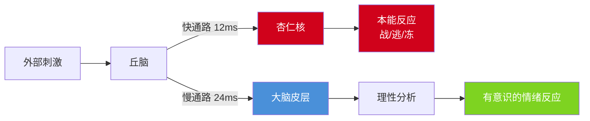
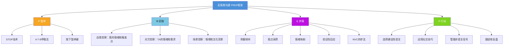
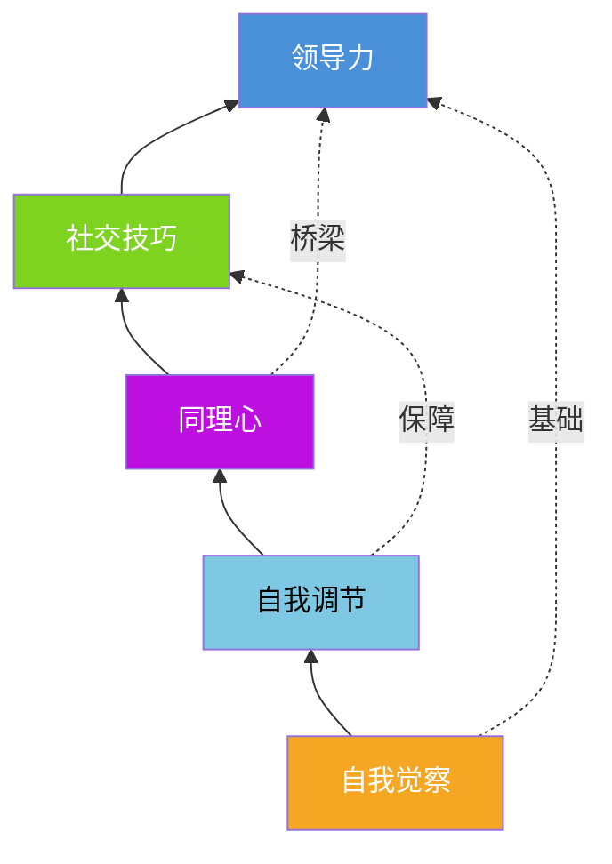

# 第十五章 第二节 核心技巧

> 高情商沟通不是天赋，而是一套可拆解、可训练、可迭代的技能体系。本节将五大核心能力——自我觉察、自我调节、同理心、社交技巧、领导力——从理论原理到实操工具逐一展开，让你不仅"知道"，更能"做到"。

## 一、理论基础：理解情商的运作机制

在进入具体技巧之前，有必要先理解高情商沟通背后的科学原理。没有理论支撑的技巧只是空中楼阁——你知道该做什么，但不知道为什么这样做有效，就无法在复杂场景中灵活变通。

### 1.1 丹尼尔·戈尔曼的情商模型

哈佛心理学家丹尼尔·戈尔曼（Daniel Goleman）在1995年提出的五维情商模型是当前最广泛认可的情商框架。该模型将情商分为五个维度，按递进关系排列：

| 维度 | 定义 | 在沟通中的体现 |
|------|------|----------------|
| 自我觉察 | 认识自身情绪、优势、弱点和驱动力 | 知道自己在对话中的情绪状态和行为模式 |
| 自我调节 | 管理破坏性情绪和冲动 | 在冲突中不被情绪劫持，保持理性表达 |
| 内在驱动力 | 追求超越金钱和地位的成就动机 | 沟通中展现真诚、热情和对卓越的追求 |
| 同理心 | 理解他人的情感构成 | 准确感知对方的需求、顾虑和未说出口的话 |
| 社交技能 | 管理关系、建立网络、引导他人 | 化解冲突、建立信任、影响和激励他人 |

戈尔曼强调，这五个维度存在递进依赖关系：**自我觉察是所有其他能力的根基**。一个无法准确识别自己情绪的人，不可能有效调节它；一个无法调节自己情绪的人，很难真正理解他人的感受。

### 1.2 杏仁核劫持：情绪失控的神经科学

神经科学家约瑟夫·勒杜（Joseph LeDoux）的研究揭示了情绪失控的生理机制。大脑中存在两条情绪处理通路：

- **低通路（快通路）**：感觉信号 → 丘脑 → 杏仁核。速度极快（约12毫秒），绕过大脑皮层，直接触发"战或逃"反应。优点是反应迅速，缺点是粗糙、容易误判。
- **高通路（慢通路）**：感觉信号 → 丘脑 → 大脑皮层 → 杏仁核。速度较慢（约24毫秒），经过理性分析后再做出情绪反应。优点是精确、理性，缺点是需要时间。

当情绪刺激足够强烈时，杏仁核会"劫持"大脑的理性控制系统——这就是戈尔曼所说的**"杏仁核劫持"（Amygdala Hijack）**。在杏仁核劫持状态下：

- 前额叶皮层（负责理性思考、决策和情绪调节）的功能被抑制
- 肾上腺素和皮质醇大量分泌，身体进入应激状态
- 人的反应变得本能化——战斗（攻击性语言）、逃跑（回避对话）、冻结（大脑空白）

**理解这一点对高情商沟通至关重要**：当你在对话中突然感到愤怒、恐惧或羞耻时，你的大脑可能正在经历杏仁核劫持。此时做出的任何反应，几乎都不是你的"最佳版本"。这也是为什么"暂停"是高情商沟通的第一个核心动作——暂停的本质是给高通路争取启动时间。

### 1.3 多迷走神经理论与社交安全感

斯蒂芬·波格斯（Stephen Porges）的多迷走神经理论（Polyvagal Theory）揭示了一个关键发现：**人类的社交能力受自主神经系统的状态直接影响**。该理论描述了三种神经状态：

| 神经状态 | 对应系统 | 身体感受 | 沟通表现 |
|----------|----------|----------|----------|
| 社会参与状态 | 腹侧迷走神经（安全） | 放松、温暖、开放 | 善于倾听、表达清晰、有同理心 |
| 战斗/逃跑状态 | 交感神经（危险） | 紧绷、心跳加速、出汗 | 语速加快、攻击性或回避性语言 |
| 关闭/冻结状态 | 背侧迷走神经（危及生命） | 麻木、无力、解离 | 沉默、无法思考、情感断联 |

这个理论的实践意义在于：**高情商沟通的第一步不是学习话术，而是学会调节自己的神经状态**。只有处于"社会参与状态"时，你才能真正发挥同理心、创造力和社交智慧。后续章节介绍的呼吸法、落地技术等，本质上都是帮助你从战斗/逃跑状态或冻结状态回到社会参与状态的工具。

---

## 二、自我觉察——认识你的沟通模式

### 2.1 什么是沟通中的自我觉察

自我觉察是高情商沟通的起点和基石。它指的是对自己在沟通中的情绪状态、思维模式、行为习惯和身体反应的清晰、准确的认知。没有自我觉察，你就无法有意识地选择自己的沟通方式，而是被无意识的习惯和情绪反应所驱动。

心理学家塔莎·欧里希（Tasha Eurich）的研究发现，虽然95%的人认为自己具有自我觉察力，但实际上只有约10%-15%的人真正具备。自我觉察分为两种类型：

- **内部自我觉察**：清楚地了解自己的情绪、价值观、优势和弱点，以及它们如何影响自己的行为和决策。内部自我觉察高的人，在沟通中更少做出冲动反应，更清楚自己想要什么。
- **外部自我觉察**：清楚地了解他人如何看待自己，理解自己的言行在他人眼中是什么样子。外部自我觉察高的人，更容易调整自己的沟通方式以适应不同对象。

**两种觉察相互独立**——一个人可能非常了解自己（高内部觉察），但完全不知道别人怎么看他（低外部觉察），反之亦然。高情商沟通者需要同时发展两种觉察。

在沟通中，自我觉察包含四个层面：

**情绪觉察**：知道自己此刻在经历什么情绪。这听起来简单，但很多人对自己的情绪只有一个模糊的感觉——"不舒服"或"不爽"——而无法精确识别。心理学中将基本情绪分为六类：快乐、悲伤、愤怒、恐惧、惊讶、厌恶。在此基础上，衍生出数十种复合情绪。情绪颗粒度（Emotional Granularity）越高——即能用越精确的词描述情绪——情绪调节能力就越强。例如：

- "不舒服" → 细化为"被忽视的委屈"
- "不爽" → 细化为"被质疑能力的愤怒"
- "烦" → 细化为"边界被侵犯的不满"

**身体觉察**：感知情绪在身体上的表现。每种情绪都有对应的躯体反应模式：

| 情绪 | 典型身体反应 |
|------|-------------|
| 焦虑 | 胃部紧缩、胸口发闷、手心出汗 |
| 愤怒 | 面部发热、下颌紧咬、拳头握紧 |
| 悲伤 | 喉咙发紧、胸口沉重、眼眶发热 |
| 恐惧 | 后背发凉、心跳加速、呼吸变浅 |
| 羞耻 | 面部发烫、想要缩小、回避目光 |
| 委屈 | 鼻子发酸、眼眶湿润、胸口堵 |

**思维觉察**：识别当下的思维模式。在沟通中，我们的大脑在不断地进行"自动思维"——对信息的即时解读。这些自动思维往往是无意识的，但深刻影响我们的情绪和行为。例如：

- 对方没有回复你的消息 → 自动思维："他故意忽视我" → 情绪：愤怒
- 同事在会议上沉默 → 自动思维："他不同意我的方案" → 情绪：焦虑
- 领导语气严肃 → 自动思维："我做错了什么" → 情绪：恐惧

思维觉察的关键是识别这些自动思维，并意识到它们只是"一种可能的解读"，而非事实。

**行为觉察**：观察自己的行为模式。每个人在沟通中都有一套无意识的行为习惯：紧张时语速加快、不认同对方时交叉双臂、被质疑时提高音量、感到威胁时开始列数据"自证"。行为觉察需要你像一个旁观者一样观察自己在对话中的表现。

### 2.2 识别你的情绪触发点

每个人都有自己的情绪触发点（Emotional Triggers）——那些特别容易引发强烈情绪反应的人、事、物或情境。识别自己的情绪触发点，是自我觉察的核心内容。

**为什么情绪触发点如此重要？** 因为触发点引发的情绪反应往往不成比例——一件小事引发巨大的情绪波动，通常不是因为眼前的事本身有多严重，而是因为它触及了你过去的经历、核心信念或未被满足的心理需求。

**常见的沟通情绪触发点及其深层来源：**

| 触发点 | 表面感受 | 可能的深层来源 |
|--------|----------|---------------|
| 被忽视 | 愤怒、委屈 | 童年中被忽视的经历，核心信念"我不重要" |
| 被评判 | 防御、羞耻 | 对自我价值的不确定，害怕暴露不足 |
| 不公正 | 愤怒、无力 | 对公平的强烈需求，可能与早期经历有关 |
| 失去控制 | 焦虑、恐慌 | 对不确定性的低容忍度，安全感不足 |
| 被误解 | 挫败、孤独 | 表达需求未被满足的历史，核心信念"没人理解我" |
| 边界被侵犯 | 愤怒、窒息 | 童年边界未被尊重的经历 |
| 被比较 | 嫉妒、自卑 | 对自我价值的外在依赖，竞争性环境的成长经历 |

**情绪触发点识别练习（系统化版）：**

第一步：回顾过去一个月中三次强烈的负面情绪反应，按以下模板记录：

事件记录模板
===========
日期：
场景（谁在场、什么场合）：
触发事件（发生了什么）：
第一反应（你说了什么、做了什么）：
情绪及强度（1-10分）：
身体反应：
事后反思（这个反应合理吗？是否过度了？）：
触发点归类（被忽视/被评判/不公正/失控/被误解/边界被侵/被比较）：
深层联想（这个场景让你想起了什么过去的经历？）：

第二步：分析三份记录的共同模式——它们是否涉及类似的主题或需求？反复出现的模式就是你的核心触发点。

第三步：形成你的"情绪触发地图"，标注高风险场景和对应的反应模式。这张地图将成为你在重要沟通前的"预警系统"。

### 2.3 建立情绪觉察的习惯

**STOP技术**：在日常沟通中使用STOP技术来培养自我觉察——

- **S（Stop）暂停**：不要立即做出反应。哪怕只是半秒钟的暂停，都能打断自动反应模式
- **T（Take a breath）深呼吸**：一次深长的呼吸就能激活副交感神经系统，让神经状态从"战斗/逃跑"回到"社会参与"
- **O（Observe）观察**：扫描自己的四个层面——此刻的情绪是什么？身体有什么感觉？脑海中的自动思维是什么？我的行为姿态是什么？
- **P（Proceed）行动**：基于观察的结果，有意识地选择如何回应——而不是被情绪推着走

**情绪签到（Emotional Check-in）**：每天设定三个固定的时间点（早起后、午餐前、睡前），花2分钟填写"情绪签到表"：

情绪签到表
=========
时间：
主导情绪：（用一个精确的词描述）
情绪强度：（1-10分）
身体感觉：（哪个部位有感觉？什么感觉？）
可能的原因：
我现在最需要的是：

坚持21天后，你会发现自己的情绪颗粒度显著提高——能更快、更准地识别情绪。

**沟通前的觉察准备**：在重要的沟通之前（绩效面谈、艰难对话、谈判等），花5分钟进行觉察准备：

1. **明确意图**：我希望通过这次沟通达到什么目标？（注意：目标应该是关系和问题导向的，而非"让对方认错"）
2. **预警触发点**：我可能在哪些地方被触发？对方可能说什么会让我情绪波动？
3. **预演应对**：如果我被触发了，我会用什么策略？（STOP？暂停？认知重评？）
4. **设定基调**：我希望以什么样的情绪状态进入这次对话？（冷静、温暖、坚定？）

### 2.4 自我觉察的常见误区

| 误区 | 纠正 |
|------|------|
| "我没什么感觉" → 认为自己情绪稳定 | 情绪麻木≠情绪稳定。可能是长期压抑导致的情绪解离，需要专业帮助 |
| "我就是脾气不好" → 把情绪反应归因于性格 | 性格不是借口。即使容易愤怒的人，也可以学习在愤怒时选择不同的行为 |
| "觉察就是想太多" → 认为反思是内耗 | 有结构的自我观察是高效能工具，无方向的反刍才是内耗。区别在于：观察是"注意到发生了什么"，反刍是"反复纠结为什么发生" |
| "我了解自己" → 过度自信而不做练习 | 95%的人认为有自我觉察，实际只有10-15%真正具备。认知盲区需要通过练习和他人反馈来发现 |

---

## 三、自我调节——管理沟通中的情绪

### 3.1 自我调节的核心原则

自我调节不是压制情绪——长期压制情绪会导致情绪爆发、身心疾病和关系破裂。自我调节是**与情绪建立一种智慧的关系**：承认它、理解它、选择如何回应它。

**原则一：接纳先于调节**

你无法调节你不接纳的情绪。当情绪出现时，第一步不是试图改变它，而是允许它存在。对自己说："我现在感到愤怒，这是可以的。"接纳并不意味着认同情绪所驱动的行为，而是承认情绪本身的存在。

心理学家卡尔·罗杰斯说过一句著名的话："奇怪的悖论是，当我接受自己本来的样子时，我就能改变了。"（The curious paradox is that when I accept myself just as I am, then I can change.）这句话同样适用于情绪调节。

**原则二：理解先于行动**

在做出反应之前，先理解情绪想要告诉你什么。每种情绪都携带着信息：

| 情绪 | 传递的信息 | 有建设性的回应 |
|------|-----------|---------------|
| 愤怒 | 某个边界被侵犯了 | 明确表达边界，而非攻击对方 |
| 恐惧 | 某个威胁可能存在 | 评估威胁是否真实，制定应对计划 |
| 悲伤 | 某个失去需要被哀悼 | 允许自己悲伤，寻求支持 |
| 嫉妒 | 你渴望某样东西 | 识别自己真正渴望的是什么，制定行动方案 |
| 羞耻 | 你的自我形象受到威胁 | 区分行为和人格，行为可以改，人格不因此定义 |
| 焦虑 | 不确定性让你不安 | 将注意力放在可控的部分，接纳不可控的部分 |

**原则三：选择先于反应**

维克多·弗兰克尔（Viktor Frankl）在《活出生命的意义》中写道："在刺激和反应之间，存在一个空间。在这个空间里，我们有选择如何回应的自由和力量。我们的成长和幸福取决于我们的回应。"高情商沟通的核心就是在刺激和反应之间创造更大的空间，做出更有建设性的选择。

这个"空间"不是天生的——它需要通过练习来扩大。每一次你成功地在情绪触发后暂停并选择回应（而非反应），这个空间就扩大了一点。

### 3.2 即时情绪调节技术

当情绪在沟通中突然涌现时，以下技术可以帮助你快速调节。每种技术都有其适用场景和神经科学原理：

**（1）4-7-8呼吸法**——快速降低生理唤醒

由安德鲁·韦尔博士（Dr. Andrew Weil）推荐的呼吸技术，其原理是通过延长呼气时间来刺激迷走神经，从而激活副交感神经系统，降低心率和血压。

- 用鼻子吸气，默数4秒
- 屏住呼吸，默数7秒
- 用嘴缓慢呼气，默数8秒
- 重复3-4个循环

**适用场景**：感到焦虑或愤怒涌上来的最初几秒。可以在对方说话时悄悄做，不需要中断对话。

**注意事项**：刚开始练习时可能感到轻微头晕，这是正常反应。坐着练习比站着更安全。每天练习2次，每次4个循环，一周后就会变得自然。

**（2）落地技术（Grounding）**——从情绪中回到当下

当情绪过于强烈以至于无法清晰思考时（例如强烈的焦虑或恐慌），使用落地技术将注意力从内部情绪转移到外部物理环境。其原理是通过激活大脑的感官处理区域来"抢占"情绪处理区域的资源。

- **看**到5样东西（说出它们的名字和颜色）
- **触**摸4样东西（描述它们的质感和温度）
- **听**到3种声音（分辨方向和远近）
- **闻**到2种气味
- **尝**到1种味道（或者关注嘴里的味道）

**适用场景**：强烈的情绪反应让你"上头"了，需要快速回到现实。特别适合焦虑和恐慌发作时。

**（3）暂停技术**——给对话按下"暂停键"

当你感到情绪即将失控时，果断按下"暂停键"。这不是逃避，而是负责任的行为——因为在情绪失控状态下继续对话，几乎必然导致伤害性后果。

有效的暂停话术：

"我需要一点时间整理思路，我们可以5分钟后继续吗？"
"这个话题很重要，我希望在更清醒的状态下讨论。给我10分钟好吗？"
"我发现自己现在有点情绪化，我不想说出让我后悔的话。我们能暂停一下吗？"
"我对你和这个对话都是认真的，所以我想先让自己冷静一下。"

**暂停的关键规则**：
- 给出明确的恢复时间（"5分钟后"而非"以后再说"），让对方知道你不是在逃避
- 暂停期间做呼吸练习或落地技术，而非在脑中反复回放对话（那会强化情绪）
- 到时间后主动回来继续对话，这建立信任

**（4）认知重评**——改变对事件的解读

认知重评（Cognitive Reappraisal）是情绪调节中研究最充分、效果最持久的技术。其原理是：情绪不是由事件本身直接引发的，而是由我们对事件的解读引发的（这是认知行为疗法的核心原理，源于阿尔伯特·埃利斯的ABC理论）。改变解读，就能改变情绪。

| 自动解读（反应式） | 重评后的解读（选择式） | 情绪变化 |
|-------------------|----------------------|----------|
| "他在攻击我" | "他在强烈地表达他的需求，可能是因为他感到不被听见" | 愤怒 → 理解 |
| "我一定会搞砸" | "这是一个学习和成长的机会，即使搞砸了也能学到东西" | 焦虑 → 平静 |
| "他不尊重我" | "他可能在用他习惯的方式沟通，跟我的关系不大" | 受伤 → 中立 |
| "她故意为难我" | "她可能有自己的压力和难处" | 愤怒 → 同理 |
| "这个反馈是人身攻击" | "这个反馈可能包含有价值的信息，我可以筛选后决定是否采纳" | 防御 → 开放 |

**认知重评的三步练习**：
1. **识别自动思维**：发生了什么事？我脑中冒出的第一个念头是什么？
2. **质疑这个念头**：这个念头是事实还是我的解读？有没有其他可能的解读？如果我的好朋友遇到同样的事，我会怎么看？
3. **选择一个更平衡的解读**：不是"正能量自我欺骗"，而是找到一个更全面、更平衡、更贴近现实的视角。

**（5）自我对话**——给自己一个支持性的声音

在内心中与自己进行支持性的对话，本质上是用"内在教练"替代"内在批评者"。

内在批评者（低情商自我对话）：
"你怎么又这样了？"
"你永远都改不了。"
"别人都比你强。"

内在教练（高情商自我对话）：
"这是一个困难的时刻，我能处理好。"
"我之前在类似的情况下成功过，这次也可以。"
"我的目标是解决问题，而不是赢得争论。"
"对方的情绪不是我的责任，我能做的是保持尊重。"
"我现在感到愤怒，这说明我的某个边界被触碰了，我可以冷静地表达它。"

### 3.3 长期情绪调节习惯

即时技术解决的是"当下"的问题，但要从根本上提升情绪调节能力，需要建立长期的习惯。

**正念冥想**

每天10-20分钟的正念冥想练习，可以显著提高情绪调节能力。哈佛大学的研究发现，8周的正念冥想训练可以减少杏仁核的灰质密度（意味着情绪反应性降低），同时增加前额叶皮层的厚度（意味着理性调节能力增强）。

正念冥想的核心是不加评判地观察当下的体验。当你在冥想中注意到自己的注意力跑了——不是对自己发脾气，而是温和地把注意力带回来。这个"注意到→带回来"的过程，就是在锻炼你的觉察肌肉。

长期练习的效果：
- 情绪觉察的敏锐度提升——你能在情绪还是"小火苗"时就注意到它，而非等到"大火"才发觉
- 刺激与反应之间的空间扩大——暂停变得越来越自然
- 情绪反应的强度和持续时间降低——同样的触发事件，引发的情绪波动更小
- 在压力下保持冷静的能力增强——领导力和决策质量提升

**推荐入门方式**：使用冥想App（如Headspace、Calm、潮汐、小睡眠），从每天5分钟开始，逐渐增加到15-20分钟。

**身体锻炼**

规律的身体锻炼是情绪调节的"天然药物"。其机制包括：
- 释放内啡肽和血清素——天然的情绪提升物质
- 降低皮质醇水平——压力激素
- 改善睡眠质量——间接提升情绪调节能力
- 增强身体觉察——帮助你更早地识别情绪的身体信号

建议每周至少150分钟中等强度运动（快走、游泳、骑车）。如果时间有限，即使每天10分钟的高强度间歇训练（HIIT）也能产生显著效果。

**充足睡眠**

睡眠不足会严重影响情绪调节能力。加州大学伯克利分校的马修·沃克（Matthew Walker）教授研究发现：睡眠不足会降低前额叶皮层（负责理性思考和情绪调节）的功能，同时增强杏仁核（负责情绪反应）的活跃度——这意味着在缺觉状态下，你的情绪反应性可能提高60%。

建议每晚保证7-9小时的优质睡眠。如果你发现自己在某些日子特别容易情绪化，先检查一下最近的睡眠质量。

**日志写作**

每天花5-10分钟写"情绪日志"，记录当天印象深刻的情绪事件。格式如下：

情绪日志
=======
日期：
事件：（发生了什么？）
情绪：（具体情绪词 + 强度1-10分）
自动思维：（我脑中的第一反应是什么？）
重评：（有没有其他解读？）
行为：（我实际做了什么？）
反思：（如果重来，我会怎么做？）

情绪日志的价值在于：它把模糊的情绪体验变成了可分析的"数据"。坚持几周后，你会清晰地看到自己的情绪模式、触发点和反应习惯。

---

## 四、同理心——连接的桥梁

### 4.1 同理心的三个层次

同理心不是单一的能力，而是由三个相互关联但又各自独立的层次构成。理解这三个层次有助于你诊断自己在同理心方面的优势和盲区：

**层次一：认知同理心（Cognitive Empathy）**——头脑层面

认知同理心是指理解他人的想法、观点和感受的能力。它是一种"头脑层面"的同理心——你知道对方在想什么，理解他们的逻辑和推理。认知同理心的核心是**观点采择**——能够站在对方的位置上，用他们的逻辑来看待问题。

认知同理心在以下场景中特别重要：
- 谈判中理解对方的利益和底线
- 跨部门沟通中理解不同部门的立场
- 与不同文化背景的人沟通时理解他们的思维框架
- 管理中理解下属的行为动机

**发展认知同理心的练习**：在每次重要对话前，花3分钟写下"对方的立场"——不是你的版本，而是如果你是对方，你会怎么看待这个问题。尽量用对方的语言和逻辑来写。

**层次二：情绪同理心（Emotional Empathy）**——心灵层面

情绪同理心是指与他人的情绪产生共鸣的能力。它是一种"心灵层面"的同理心——你不仅知道对方在感受什么，你自己也能感受到类似的情绪。神经科学发现，人类大脑中有"镜像神经元"，它们在我们观察他人情绪时会自动激活，让我们在某种程度上"感受到"对方的感受。

情绪同理心在以下场景中特别重要：
- 亲密关系中感受到伴侣未说出口的情绪
- 朋友倾诉时给出恰当的情感回应
- 客户不满时感知到他们的真实感受（而非只听表面言语）
- 团队士气低落时感受到弥漫的情绪氛围

**注意**：情绪同理心过高且缺乏界限时，容易导致"共情疲劳"（Empathy Fatigue）——过度吸收他人的情绪而耗尽自己。这在助人职业（心理咨询师、医护人员、社会工作者）中尤为常见。

**层次三：同理心关怀（Empathic Concern）**——行动层面

同理心关怀是指基于对他人感受的理解而产生的关心和帮助意愿。它是一种"行动层面"的同理心——你不仅理解和感受，你还想要帮助和支持。

同理心关怀是同理心从"知"到"行"的关键转折。很多人有认知同理心和情绪同理心，但缺乏行动——他们理解对方、感受到对方的痛苦，但没有采取任何支持性的行为。同理心关怀驱动你：
- 主动询问对方是否需要帮助
- 提供情感支持和实际帮助
- 在对方困难时陪伴和安慰
- 为对方的福祉着想而采取行动

### 4.2 培养深度同理心的技巧

**（1）积极倾听（Active Listening）**

积极倾听是同理心的基础。它不仅仅是听对方说什么，更是全身心地关注和理解对方。研究表明，大多数人只能记住对话中25%-50%的内容——这意味着大量的信息在倾听过程中被丢失了。

积极倾听的核心要素：

- **全神贯注**：放下手机、关闭电脑通知、面向对方、保持适度眼神接触。你的身体语言应该传递一个信号——"此刻，你是我最重要的人"
- **不打断**：让对方完整地表达自己的想法和感受。即使你已经"知道"对方要说什么，也让他们说完。打断传递的信息是"我的想法比你的表达更重要"
- **反馈确认**：用自己的话复述对方所说的内容，确认理解是否正确。这不仅帮助你确认理解，更重要的是让对方感到被听见
  - "让我确认一下，你的意思是……对吗？"
  - "听起来你觉得……是这样吗？"
  - "所以你最在意的是……我理解得对吗？"
- **询问深入**：通过开放性问题引导对方更深入地分享。开放性问题不能用"是/否"回答，它们打开对话而非关闭对话
  - "你当时是什么感受？"
  - "这件事对你来说意味着什么？"
  - "你最希望的结果是什么？"
  - "能多跟我说说吗？"
- **关注非语言信号**：对方的语气、语速、表情、姿态往往比言语传递更多信息。当语言和非语言信号不一致时（例如嘴上说"没事"但语气低沉），以非语言信号为准

**（2）观点采择（Perspective-Taking）**

观点采择是指有意识地从对方的角度看待问题。这不意味着你必须同意对方的观点，而是意味着你能够理解他们的观点是如何形成的。

观点采择的四个维度：
- **假设替换**：如果我处于对方的情况——带着他们的成长经历、当前处境和性格特点——我会怎么想、怎么感受？
- **背景探索**：对方的成长经历、文化背景、当前处境如何影响了他们的观点？一个从小在竞争激烈环境中长大的人，对"合作"的理解可能与你完全不同
- **利益分析**：对方在这次沟通中的核心利益和需求是什么？他们真正想要的是什么？（注意：表面诉求和深层需求往往不同——对方说"我要加薪"，深层需求可能是"我希望被认可"）
- **情绪推测**：基于对方的言行，他们现在可能在经历什么情绪？他们害怕什么？他们渴望什么？

**（3）情绪映射（Emotional Mapping）**

情绪映射是指在沟通过程中，实时追踪和记录对方的情绪变化。这类似于医生监测病人的生命体征——你监测的是对方的"情绪体征"。

情绪映射的观察维度：
- **语调变化**：升高（激动/愤怒）、降低（失望/疲惫）、加快（焦虑/兴奋）、减慢（犹豫/沉重）
- **肢体语言变化**：身体前倾（感兴趣/投入）、后退（不适/防御）、交叉双臂（封闭/不满）、摊开双手（坦诚/无助）
- **用词变化**：绝对化词汇增多（"你总是""你从来"）→ 情绪升温信号；情绪化表达出现 → 即将或已经情绪失控
- **情绪转折点**：什么话题让对方情绪发生了变化？这些转折点往往指向对方真正在意的核心议题

**（4）验证性回应（Validating Responses）**

验证性回应是指承认和认可对方的感受和体验，即使你不完全同意他们的观点。验证不等于同意——你可以说"我理解你为什么会有这样的感受"，同时在下一秒表达你的不同看法。

验证性回应的层级（由浅到深）：

Level 1 — 承认存在："我听到了你说的。"
Level 2 — 认可感受："我能感受到你很失望。"
Level 3 — 理解原因："考虑到你为这个项目投入了那么多心血，你有这样的感受完全可以理解。"
Level 4 — 正常化："换了是我，在这种情况下可能也会有同样的感受。"
Level 5 — 真诚赞美："你能把这些感受坦诚地告诉我，我觉得很了不起。"

**常见的无效回应（反验证）**：
- ❌ "你不应该这样想" → 否定对方的感受
- ❌ "这有什么好生气的" → 最小化对方的情绪
- ❌ "至少你还有……" → 用比较来否定对方的痛苦
- ❌ "别想了，开心点" → 跳过情绪直接要求行为
- ❌ "我比你更惨" → 把焦点转移到自己身上

### 4.3 同理心的界限

同理心不是无限制地承受他人的情绪。健康的同理心需要有清晰的界限：

- **区分理解与认同**：你可以理解对方的感受，但不必认同他们的行为。"我理解你很生气"不等于"你生气了就可以摔东西"
- **保护自己的情绪健康**：在吸收他人情绪之前，确保自己的"情绪杯子"不是空的。你无法从空杯子里倒水给别人
- **避免过度卷入**：保持观察者和参与者的平衡。完全卷入对方的情绪中，反而会让你失去帮助他们的能力
- **知道何时抽身**：当你感到情绪疲劳、无法再给予支持时，允许自己暂时退出。这不是自私，而是可持续的同理心
- **区分支持和拯救**：同理心关怀驱动你提供支持，但不是替对方解决所有问题。每个人都有自己的课题，你可以陪伴，但不能替代

---

## 五、社交技巧——人际效能的实现

### 5.1 建立信任的沟通技巧

信任是一切有效沟通的基础。没有信任，再好的技巧也只是表演。信任的建立是一个长期过程，但可以被摧毁于一瞬。

信任的四大支柱及其沟通表现：

| 支柱 | 定义 | 沟通中的表现 | 破坏信任的行为 |
|------|------|-------------|---------------|
| 一致性 | 言行一致，承诺的事情做到 | 说到做到，前后一致 | 承诺后食食言，言行不一致 |
| 透明度 | 坦诚地分享信息和意图 | 不隐藏重要信息，意图明确 | 选择性隐瞒，误导性表述 |
| 可靠性 | 关键时刻能被依赖 | 在对方需要时出现，按时完成任务 | 关键时刻消失，拖延和推诿 |
| 尊重 | 尊重对方的观点和边界 | 倾听不同意见，不越界 | 贬低对方观点，侵犯对方边界 |

**第五支柱：战略性脆弱（Strategic Vulnerability）**

布芮尼·布朗（Brené Brown）在《脆弱的力量》中指出，脆弱性是建立深层信任的关键。适当展示自己的脆弱和不完美——分享困难、承认错误、表达不确定——反而能增加信任。其原理是：当你展示脆弱时，你在传递一个信号——"我信任你不会用我的脆弱来伤害我"，这会激发对方的信任回应。

战略性脆弱的正确做法：
- ✅ "这个领域我不太熟悉，你能帮我解释一下吗？"
- ✅ "上次我的处理方式确实不对，我还在学习中。"
- ✅ "我不确定这个方案是否最优，想听听你的看法。"

战略性脆弱的错误做法：
- ❌ 在对方面前全面崩溃，把对方当成情绪垃圾桶
- ❌ 在竞争关系中暴露过多弱点
- ❌ 用脆弱来操控对方的同情心

### 5.2 化解冲突的沟通技巧

冲突是不可避免的——任何两个有独立思想的人在一起，都会有分歧。关键不是避免冲突，而是**如何在冲突中保持建设性**。研究表明，关系的满意度不取决于冲突的多少，而取决于冲突的方式。

**（1）分离人与问题**

将问题本身与人分开。不是"你错了"，而是"我们在这个问题上有不同的看法"。批评行为而不是人格——"这个方案的数据支撑不够"比"你做事不严谨"有效一百倍。

**（2）使用"我"语言而非"你"语言**

"你"语言容易让对方感到被攻击，触发防御反应。"我"语言聚焦于你的感受和需求，减少对方的防御。

| 低情商（"你"语言） | 高情商（"我"语言） |
|-------------------|-------------------|
| "你总是迟到！" | "会议开始时有人迟到，我会感到时间安排被打乱了。" |
| "你根本不在乎这个项目！" | "我感觉这个项目没有得到足够的重视，我很担心。" |
| "你怎么又忘了？" | "当约定的事情没有做到时，我会感到失望和困惑。" |
| "你太自私了！" | "我感觉我的需求在这次讨论中没有被考虑到。" |

**"我"语言公式**：当____（具体情境），我感到____（情绪），因为____（需求/价值），我希望____（具体请求）。

例如："当会议上我的意见被跳过时（情境），我感到有些沮丧（情绪），因为我希望自己的贡献能被看到（需求）。下次讨论时，能不能给我2分钟说完我的想法（请求）？"

**（3）马歇尔·卢森堡的非暴力沟通（NVC）四步法**

非暴力沟通（Nonviolent Communication）是由马歇尔·卢森堡博士（Dr. Marshall Rosenberg）开发的沟通框架，被联合国教科文组织列为全球正式教育和冲突解决的最佳实践之一。NVC的核心假设是：所有人类行为都是为了满足某种需要，而冲突源于策略（满足需要的方式）的差异，而非需要本身的矛盾。

NVC四步法：

| 步骤 | 含义 | 示例 |
|------|------|------|
| 观察（Observation） | 客观描述发生了什么，不加评判 | "这周的三次会议你都迟到了15分钟以上" |
| 感受（Feeling） | 表达你的真实感受 | "我感到焦虑和不被重视" |
| 需要（Need） | 识别感受背后的需求 | "因为我需要感受到我们团队是互相尊重的" |
| 请求（Request） | 提出具体、可行的请求 | "你愿意从下周开始提前5分钟到会议室吗？" |

**NVC的核心区分：观察 vs 评判**
- 观察："你这周迟到了三次"——描述事实
- 评判："你总是迟到"——贴标签，容易引发防御

**NVC的核心区分：请求 vs 命令**
- 请求："你愿意……吗？"——对方可以说"不"，有商量的余地
- 命令："你必须……"——对方没有选择，引发抵抗

**（4）探索需求而非坚持立场**

在冲突中，双方往往固守自己的立场（Position），但立场背后是需求（Interest）和更深层的价值观（Value）。高情商的沟通者会深入探索立场背后的需求，因为**不同的立场往往可以满足相同的需求**。

例如：夫妻争论"要不要搬去另一个城市"——
- 立场冲突：A要搬 vs B不搬
- 深层需求：A需要职业发展机会，B需要离家人近
- 当需求浮出水面后，可能的解决方案：找一个既有好的职业机会又离B家人不太远的城市；或者A先去、B定期回家；或者找远程工作机会……

**（5）道歉的力量**

真诚的道歉是化解冲突的强大工具。道歉不是认输，而是承认自己的言行对他人造成了影响。

有效道歉的三要素：
1. **承认具体行为**："我在上周的会上说了一些不当的话，包括质疑你的专业能力。"
2. **表达对影响的理解**："我能理解这些话让你感到受伤和不被尊重，尤其是在团队面前。"
3. **承诺具体改变**："以后我会在有不同意见时私下和你沟通，而不是在会上直接质疑。"

无效道歉的常见形式：
- ❌ "如果你觉得受伤了，我道歉" → 把责任推给对方的感受
- ❌ "对不起，但是……" → "但是"后面的内容否定了道歉
- ❌ "我道歉了你还想怎样" → 把道歉当成交易

### 5.3 有效反馈的沟通技巧

给予和接受反馈是高情商沟通的重要组成部分。在职场中，缺乏反馈是员工敬业度低的首要原因之一。

**给予反馈：SBI-I模型**

SBI模型的升级版，增加了"Intent"（意图确认）：

- **S（Situation）情境**：描述具体的时间、地点和场合
- **B（Behavior）行为**：描述你观察到的具体行为，不加评判
- **I（Impact）影响**：描述该行为对你、他人或团队的实际影响
- **I（Intent）意图**：询问对方的意图，给予解释的机会

示例："在昨天的团队会议上（S），当小李分享方案时你看了三次手机（B），我注意到小李之后的分享明显变得不自信了，语速加快了，也不太敢看大家（I）。你当时是什么情况？是在处理什么紧急的事情吗？（I）"

**给予正面反馈同样重要**——不要只在出问题时才给反馈。正面反馈的SBI示例："在今天和客户的谈判中（S），你先花20分钟了解了客户的核心顾虑（B），这让客户明显放松了，后面的谈判非常顺利，比预期提前30分钟达成协议（I）。这种做法我很欣赏。"

**接受反馈的高情商方式：**

1. **身体准备**：深呼吸，保持开放的身体姿态（不交叉双臂），保持眼神接触
2. **倾听优先**：先听完，不急于辩解。你的大脑会在听到批评时自动启动防御模式——意识到这一点，选择不被它驱动
3. **表达感谢**："谢谢你愿意直接告诉我这些。"——不管反馈是否准确，感谢对方的勇气
4. **澄清理解**："让我确认一下，你的意思是……"——确保你准确理解了反馈的内容
5. **管理情绪**：如果反馈让你感到不舒服，允许自己有情绪，但不在当下做出反应。你可以说"我需要一些时间消化这些，我们明天再聊可以吗？"
6. **选择性吸收**：评估哪些反馈有价值，哪些可能不适用。不是所有反馈都是正确的，但所有反馈都值得认真考虑
7. **采取行动**：如果反馈有价值，制定具体的改进计划并执行。下次和反馈者沟通时，主动分享你的改变

### 5.4 非语言沟通的社交技巧

阿尔伯特·梅拉比安（Albert Mehrabian）的经典研究表明，在表达情感和态度时，语言内容只占7%，语调占38%，肢体语言占55%。虽然这个比例在不同场景中会有所变化，但它揭示了一个重要事实：**你怎么说比你说什么更重要**。

**眼神接触**：适度的眼神接触表示关注和尊重。通常保持60-70%的眼神接触比例较为合适。注视时间超过3秒会产生亲密感或对抗感（取决于上下文），少于1秒会显得心不在焉。

**身体朝向**：面向对方表示开放和关注；侧身表示中立或准备离开；背对对方表示明确的拒绝。在会议中，你的身体朝向谁，就传递了你认为谁重要的信号。

**身体距离**：人类学家爱德华·霍尔（Edward Hall）提出的四种距离区间：
- 亲密距离（0-45cm）：限于最亲密的关系
- 个人距离（45-120cm）：朋友和熟人之间的舒适距离
- 社交距离（1.2-3.6m）：正式社交和工作场合
- 公共距离（3.6m以上）：演讲、公共场合

**镜像效应（Mirroring）**：适度模仿对方的姿态、语速和呼吸节奏，可以建立亲近感和信任。镜像效应的原理是：人类天生对"和自己相似的人"产生好感。但要注意自然和过度模仿的界限——对方会本能地察觉不自然的模仿并感到不适。

**声音特质**：语速、音量、音调和停顿都是强大的沟通工具。
- 语速适中偏慢 → 传递自信和掌控感
- 关键词前的短暂停顿 → 增加说服力和重要性
- 音量降低 → 让对方靠近倾听，营造亲密感
- 音调变化 → 保持对方的注意力，避免单调催眠

### 5.5 跨文化沟通的情商要点

在全球化的今天，跨文化沟通能力越来越重要。不同文化在沟通风格上有显著差异：

| 维度 | 直接文化（美、德、荷） | 间接文化（日、中、韩） |
|------|----------------------|----------------------|
| 说"不" | 直接说"不" | 用"可能有点困难"代替 |
| 反馈方式 | 直接指出问题 | 先肯定再委婉建议 |
| 冲突态度 | 直面冲突，视为正常 | 回避公开冲突，保全面子 |
| 情绪表达 | 鼓励表达 | 压抑表达，保持和谐 |
| 建立信任 | 通过能力和可靠性 | 通过关系和时间 |

跨文化沟通的高情商策略：
- **不假设你的沟通方式是"标准"的**——直接≠真诚，间接≠虚伪
- **观察和适应**——注意对方的沟通风格并调整你的风格
- **不确定时直接询问**——"你们通常怎么处理这种情况？"
- **对误解保持宽容**——跨文化误解几乎是必然的，不要急于做出负面判断

---

## 六、领导力——高情商沟通的最高境界

### 6.1 高情商领导力的核心特质

领导力不仅仅是管理他人，更是一种通过沟通来影响和激发他人的能力。丹尼尔·戈尔曼的研究发现，在高层管理者中，情商对卓越绩效的贡献是智商和技术能力的两倍。

**情绪稳定**：在压力和不确定性面前保持冷静和理性。团队成员会观察领导者的情绪反应来判断局势的严重程度——如果领导者表现出慌乱，团队就会恐慌；如果领导者保持冷静，团队就会安心。情绪稳定的领导者不是没有情绪，而是选择在适当的时间、以适当的方式表达情绪。

**愿景沟通**：能够清晰、有感染力地传达愿景和目标。高情商的领导者不仅传递信息，更传递情感——他们能够让团队成员感受到目标的意义和价值。一个好的愿景沟通回答三个问题：我们在做什么？为什么这很重要？每个人如何做出贡献？

**赋权与信任**：信任团队成员的能力，给予他们足够的自主权和决策空间。高情商的领导者知道什么时候介入、什么时候退出。过度控制传递的信号是"我不信任你"，这会扼杀创造力和主动性。

**情绪感染力**：领导者的情绪具有强大的传染效应——心理学中称为"情绪感染"（Emotional Contagion）。研究表明，团队成员会无意识地模仿领导者的情绪状态。高情商的领导者能够有意识地通过自己的情绪状态来影响团队的氛围：在需要振奋士气时展现热情，在需要冷静思考时展现沉稳，在面对挫折时展现韧性。

### 6.2 领导力沟通的具体技巧

**一对一沟通**：
- 定期与团队成员进行一对一的沟通，建议频率为每1-2周一次，每次30-60分钟
- 80%的时间用于倾听，20%的时间用于引导和反馈
- 关注成员的情绪状态和工作满意度，而不仅仅是任务进展
- 使用开放性问题："最近什么让你最有成就感？""有什么事情在消耗你的能量？"
- 在一对一中分享你的观察和欣赏，不要只在出问题时才沟通

**团队沟通**：
- 在团队会议中创造安全的表达环境——安全的环境不是没有冲突的环境，而是冲突可以被建设性地表达的环境
- 鼓励不同意见——当所有人都同意时，往往意味着有人在沉默。领导者应该主动邀请不同声音："有人有不同看法吗？"
- 在团队面临挑战时，既承认困难的存在，又传递信心和希望："这确实是一个困难的处境，但我相信我们有能力度过。"
- 在团队取得成绩时，真诚地认可和赞赏每个人的贡献——公开表扬、私下批评

**危机沟通**：
- 在危机发生时第一时间出现——沉默是危机中最糟糕的策略
- 传递透明、诚实的信息——承认不确定性比假装一切正常更有信任感
- 关注团队成员的情绪状态，提供必要的支持
- 在危机中保持冷静和理性——避免在压力下做出情绪化的决策
- 危机后进行复盘——不是为了追责，而是为了学习

**变革沟通**：
- 理解变革对人们的情绪影响——库布勒-罗斯的"变革曲线"显示，人们经历变革时会经历否认→愤怒→讨价还价→沮丧→接受的过程
- 清晰地解释变革的原因、目标和路径——为什么变？变成什么？怎么变？
- 倾听和回应人们对变革的担忧和抗拒——抗拒不是敌人，而是有价值的反馈
- 给予足够的时间和支持让人们适应变革——不是所有人都能以同样的速度适应
- 找到并赋能"变革先锋"——让早期接受者成为变革的传道者

### 6.3 自我领导：领导力的起点

在领导他人之前，先领导自己。自我领导是领导力的根基：

**持续的自我反思**：定期反思自己的领导行为和沟通方式。有效的反思不是简单的"我做得好不好"，而是有结构的审视：

领导力反思模板
=============
本周最成功的一次沟通是什么？为什么成功？
本周最失败的一次沟通是什么？哪里可以改进？
我的团队成员本周的情绪状态如何？我注意到了什么？
我在哪些情况下容易失去冷静？我的触发点是什么？
下周我想刻意练习的一个沟通技能是什么？

**情绪领导力**：作为领导者，你的情绪状态会直接影响团队。学会管理自己的情绪不仅是为了自己，更是为了团队。在需要表达情绪时，选择建设性的方式；在需要隐藏情绪时，保持专业的态度——但注意，长期压抑情绪是有害的，找到健康的释放渠道（运动、日志、信任的朋友）。

**发展他人的同理心**：帮助团队成员提升他们的情商和沟通能力。通过反馈、示范和培训，创造一个高情商的团队文化。当整个团队都具备高情商时，沟通效率和协作质量会出现质的飞跃。

---

## 七、核心技巧的整合运用

### 7.1 高情商沟通的PREP行动框架

将以上五大核心技巧整合为一个可操作的行动框架——PREP：

- **P（Pause）暂停**：在沟通前和情绪触发时暂停，启动自我觉察
- **R（Recognize）识别**：识别自己和对方的情绪状态和需求
- **E（Empathize）共情**：站在对方的角度理解他们的感受和立场
- **P（Proceed）行动**：基于以上觉察和理解，选择最建设性的沟通方式

PREP框架的精髓在于：**在任何沟通场景中，你不需要记住几十个技巧，只需要记住这四个字**。它是你面对任何沟通挑战时的"应急检查清单"。

### 7.2 不同场景的技巧组合策略

不同场景需要不同的技巧组合重心。以下是四大常见场景的策略：

| 场景 | 技巧组合优先级 | 关键要点 |
|------|---------------|---------|
| 冲突场景 | 自我觉察→自我调节→同理心→社交技巧 | 先管好自己的情绪，再理解对方，最后寻找方案 |
| 亲密关系 | 同理心→自我觉察→社交技巧→自我调节 | 深度理解伴侣的感受比"解决问题"更重要 |
| 职场沟通 | 社交技巧→自我觉察→领导力→自我调节 | 建立信任和影响力是职场沟通的核心 |
| 客户服务 | 同理心→社交技巧→自我调节→自我觉察 | 先让客户感到被理解，再提供解决方案 |

### 7.3 实战案例：从冲突到共识的完整过程

**场景**：你是一名项目经理，团队成员小王在全员会议上公开质疑你的方案"不切实际"。

**第一反应**（未运用技巧）：感到被攻击和羞辱，立刻反驳："你行你来啊？"→ 冲突升级，会议失控。

**PREP框架应用**：

**P——暂停**：感到愤怒涌上来时，做了两个深呼吸（约3秒），让杏仁核劫持的峰值过去。提醒自己："我的目标是解决问题，不是赢得争论。"

**R——识别**：
- 自己的情绪：愤怒（被当众质疑）和羞耻（面子受损）。识别到这是自己的核心触发点——"被当众否定"。
- 对方的情绪：小王可能感到焦虑（担心方案失败影响他负责的模块）或无力（感到自己的担忧没有被听取）。
- 场景：公开场合，其他团队成员都在看，这增加了双方的面子压力。

**E——共情**：从小王的角度想——他可能在之前的工作中遇到过类似方案失败的经历，所以他的质疑可能出于真实的担忧而非故意挑战权威。他选择在公开场合说，可能是因为在私下沟通过程中没有被认真倾听。

**P——行动**：
1. 当场回应："小王，谢谢你直接提出你的担忧。你说'不切实际'，具体是哪个部分你有疑虑？我想听详细说说。"（把笼统的批评转化为具体的问题）
2. 会后单独找小王："今天你在会上提出质疑，我一开始确实有点不舒服，但我认真想了一下，你说的有道理。我想更深入地了解你的顾虑，咱们单独聊聊？"（坦诚自己的感受 + 认可对方的价值 + 邀请深度对话）
3. 基于小王的反馈调整方案，下次会议时公开感谢小王的贡献。（闭环 + 正面强化）

**结果**：小王感到被尊重和重视，后续更愿意在早期就提出建设性意见；团队看到领导者能够接受质疑，整体的反馈文化变得更加开放。

### 7.4 常见错误与纠正

| 常见错误 | 为什么是错的 | 正确做法 |
|---------|-------------|---------|
| 把同理心当同意 | 你可以说"我理解你"同时不同意对方 | 理解先行，然后表达自己的观点 |
| 在情绪高峰时做重要决定 | 杏仁核劫持状态下理性被抑制 | 暂停，等到情绪平复后再决定 |
| 用"对不起，但是……"道歉 | "但是"后的所有内容都否定了道歉 | 停在道歉，把"但是"改为"同时"或"而且" |
| 把自我觉察变成自我批评 | 自我觉察是观察，不是评判 | 用旁观者视角描述，而非用审判者视角批评 |
| 认为情商高就是"好好先生" | 高情商≠讨好，有时候需要坚定表达 | 高情商是在尊重的基础上坚定 |
| 忽视文化差异 | 直接/间接沟通风格因文化而异 | 观察并适应对方的沟通风格 |
| 只在出问题时才给反馈 | 负面反馈没有正面反馈作为基础就变成攻击 | 日常多给正面反馈，建立反馈的文化 |
| 把暂停当成逃避 | 暂停有明确的时间承诺和主动回归 | "给我10分钟" + 准时回来 |

---

## 八、情商自评工具

以下是一个简化的沟通情商自评量表，帮助你了解自己在五大维度上的当前水平。对每个陈述，用1-5分评估（1=完全不符合，5=完全符合）。

**自我觉察**
1. 我能准确地识别自己在对话中的情绪（精确到具体情绪词）
2. 我能感知情绪在身体上的反应
3. 我能识别自己的自动思维模式
4. 我了解自己在沟通中的核心触发点

**自我调节**
5. 当情绪涌上来时，我能在反应前暂停
6. 我能在冲突中保持冷静和理性
7. 我能用认知重评来改变对事件的解读
8. 我有规律的情绪调节习惯（冥想、运动、日志等）

**同理心**
9. 我能在对话中真正理解对方的感受（而非只是听到他们的话）
10. 我能从对方的角度看待问题
11. 我能准确地"读取"对方的非语言信号
12. 我能给出验证性回应，让对方感到被理解

**社交技巧**
13. 我能在冲突中使用"我"语言而非"你"语言
14. 我能给予建设性的反馈（而非批评或讨好）
15. 我能在不同的社交场景中调整自己的沟通风格
16. 我能在保持关系的同时坚定地表达自己的边界

**领导力**
17. 我能在压力下保持情绪稳定，不把焦虑传递给他人
18. 我能清晰、有感染力地传达目标和愿景
19. 我能创造一个让他人感到安全的沟通环境
20. 我能通过自己的情绪状态来积极影响周围的人

**评分解读**：
- 80-100分：你有很强的沟通情商基础，重点是持续精进和帮助他人提升
- 60-79分：你有不错的基础，识别薄弱环节进行针对性练习
- 40-59分：你有很大的提升空间，建议从自我觉察开始系统学习
- 20-39分：建议从基础开始，考虑参加情商培训或寻求专业教练辅导

---

## 九、本节总结

高情商沟通的五大核心技巧——自我觉察、自我调节、同理心、社交技巧和领导力——构成了一个完整的技能体系。它们之间的关系是递进式的：

- **自我觉察是基础**——不知道自己在做什么，就无法改变
- **自我调节是保障**——被情绪劫持的人无法有效沟通
- **同理心是桥梁**——没有理解就没有真正的连接
- **社交技巧是工具**——将内在能力转化为外在效果
- **领导力是升华**——将个人沟通能力扩展为影响力

记住戈尔曼的话："情商不是先天固定的——它可以通过学习和练习来提升。" 关键在于：从今天开始练习，从小事开始练习，从觉察开始练习。在下一节中，我们将通过具体的实战案例来展示这些技巧在真实场景中的综合应用。
