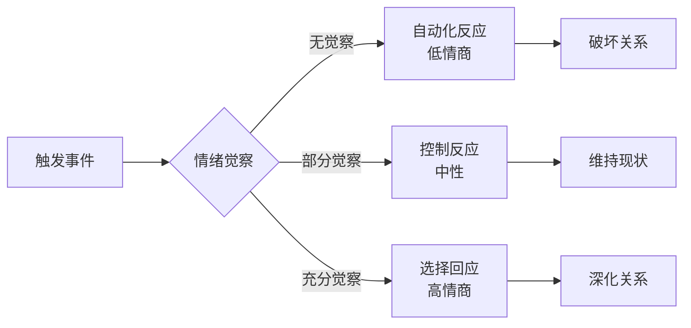
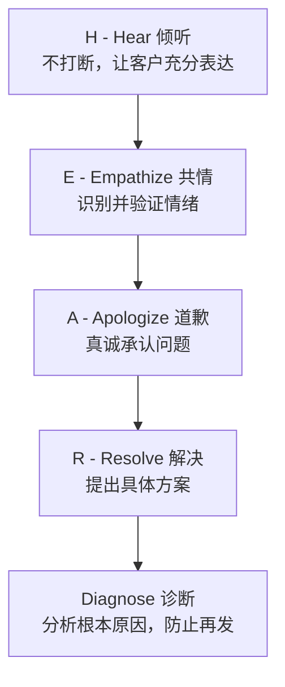
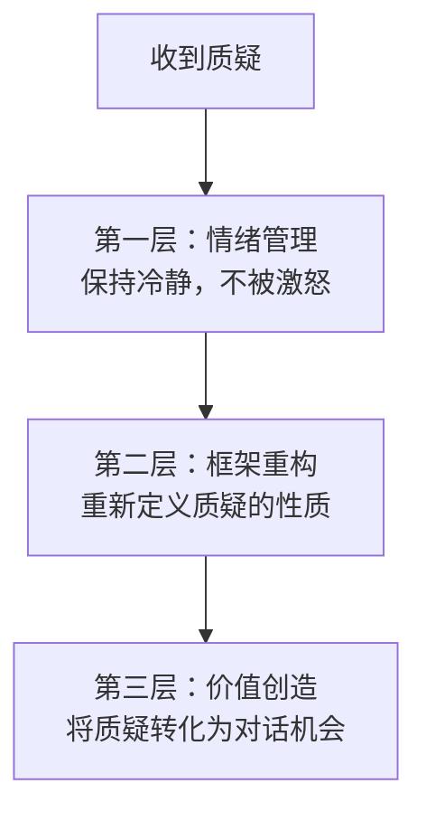
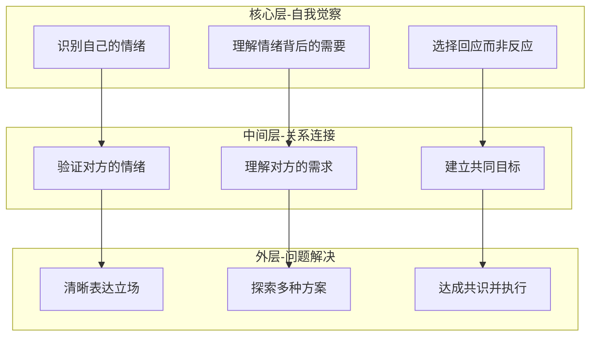

# 第十五章 第三节 实战案例

> 理论是灰色的，而生命之树常青。——歌德

前面两节我们建立了高情商沟通的理论框架和方法体系。本节将通过十个典型的沟通场景，展示高情商沟通在真实生活中的完整应用。每个案例都将呈现**低情商→中性反应→高情商**三个层级的沟通方式对比，帮助读者建立从"知道"到"做到"的桥梁。



## 案例选择的底层逻辑

这十个案例并非随机选取，而是基于以下维度的系统覆盖：

| 维度 | 覆盖场景 | 核心挑战 |
|------|----------|----------|
| **权力关系** | 对上/对下/平级 | 权力不对等下的情绪管理 |
| **关系距离** | 亲密/熟人/陌生人 | 信任基础与沟通边界 |
| **场景压力** | 一对一/一对多/公开 | 压力梯度下的表现稳定性 |
| **文化差异** | 同文化/跨文化 | 默认假设的觉察与调整 |
| **媒介形态** | 面对面/电话/文字 | 信息损耗与情绪放大效应 |
| **冲突类型** | 任务冲突/关系冲突/价值观冲突 | 冲突性质的识别与匹配策略 |

---

## 案例一：职场冲突——被同事当众质疑方案

### 场景描述

张明是一家互联网公司的产品经理，在部门周会上向团队展示新产品的方案。当他讲到核心功能设计时，同事李华突然打断他："这个方案根本不现实，你有没有做过用户调研？我觉得你就是在闭门造车。"整个会议室顿时安静下来，所有人的目光都集中在张明身上。

**场景分析**：这是一个典型的**公开场合任务冲突**场景。关键压力源有三个——公开性（被众人注视）、突发性（没有心理准备）、攻击性（"闭门造车"的人身暗示）。大脑的杏仁核会在200毫秒内将此识别为威胁，触发"战或逃"反应。高情商沟通的第一步，就是在自动化反应启动之前插入一个"觉察间隙"。

### 低情商沟通方式

**反应一：直接反击（战斗模式）**

> "你说我不现实？你自己的上一个项目不也失败了吗？你有什么资格评价我的方案？"

**心理学解析**：这是典型的**外化归因+人身攻击转移**。当自我价值感受到威胁时，人倾向于通过攻击对方来恢复心理平衡（社会心理学中的"自我防御机制"）。这种方式虽然暂时释放了愤怒，但破坏了三重关系——与李华的合作关系、在团队面前的专业形象、以及自己作为产品负责人的可信度。

结果：双方发生激烈争吵，会议无法继续，团队氛围恶化，两人的关系进入长期对抗状态。

**反应二：委屈沉默（冻结模式）**

> 张明脸涨得通红，沉默了几秒钟，然后低声说："那……那我再改改吧。"之后草草结束了汇报。

**心理学解析**：这是**习得性无助**的典型表现。张明可能在过往经历中形成了"冲突=危险，沉默=安全"的认知图式。短期看似平息了冲突，但长期代价巨大：方案被搁置、团队影响力下降、内心积累大量委屈，可能发展为被动攻击行为（如消极配合、背后抱怨）或职业倦怠。

结果：张明的方案被搁置，他在团队中的影响力下降，内心积累了大量的委屈和不满。

**反应三：过度防御（合理化模式）**

> "我当然做过用户调研！我访谈了20个用户，做了3轮问卷调查，数据分析表明……（开始大量列举数据来证明自己是对的）"

**心理学解析**：这是**智力化防御**——用逻辑和数据来回避情绪层面的冲突。表面上在回应质疑，实际上已经偏离了沟通的核心（解决分歧），陷入了"谁对谁错"的争论。更深层的问题是：当一个人急于证明自己时，他传递的潜台词是"我不够自信，需要你的认可"。

结果：虽然表面上在回应质疑，但实际上已经偏离了沟通的核心——解决分歧。

### 高情商沟通方式

**核心策略：先连接情绪，再处理问题**

张明深吸一口气，给自己3秒钟的觉察间隙（自我调节），然后说：

> "李华，谢谢你提出这个问题（**验证对方的参与**）。我能感受到你对这个方案有很强的不同意见（**识别对方情绪**）。你说得对，方案的可行性确实是最关键的（**寻找共同点**）。你最担心的是哪个部分？我们能不能现在就讨论一下具体的改进方向？（**探索需求+邀请合作**）"

**如果当下的情绪太强烈，也可以选择暂缓策略：**

> "李华，你提的这个问题很重要（**验证**）。我想认真对待你的意见，而不是匆忙回应（**表达重视**）。会后我们能不能单独讨论一下？我想先听你详细说说你的顾虑（**预约深入对话**）。"

### 深度分析

| 技巧 | 具体应用 | 底层原理 |
|------|----------|----------|
| **自我调节** | 深呼吸3秒，不被愤怒驱动 | 打断杏仁核劫持，激活前额叶皮层 |
| **情绪识别** | "很强的不同意见"而非"攻击" | 避免敌意归因偏差，保持开放 |
| **验证回应** | "谢谢你提出这个问题" | 降低对话温度，满足对方被看见的需求 |
| **探索需求** | "你最担心的是哪个部分" | 从立场之争转向利益探索 |
| **共同目标** | "方案可行性是关键" | 建立共同立场，化解对立框架 |

**进阶技巧**：如果李华经常性地在公开场合挑战你，这可能不是单次沟通问题，而是需要在私下建立边界的关系问题。高情商不是无限度地包容，而是在合适的时机、用合适的方式表达底线。

---

## 案例二：亲密关系——伴侣之间关于家务分工的争吵

### 场景描述

陈薇和王磊是一对已婚夫妇，两人都有全职工作。最近陈薇感到非常疲惫，因为她觉得自己承担了大部分的家务和育儿责任。一天晚上，王磊下班后躺在沙发上玩手机，陈薇看到后情绪爆发了。

**场景分析**：亲密关系中的冲突往往不是"就事论事"的，而是**累积性情绪**的一次集中释放。陈薇此刻的愤怒表面上指向"玩手机"，实际上承载了数月积累的疲惫、不被看见的委屈、以及对公平感的深层需求。心理学家约翰·戈特曼的研究表明，亲密关系中69%的冲突是永久性的（源于性格和价值观差异），只有31%是可以解决的。这意味着学会"管理"冲突比"解决"冲突更重要。

### 低情商沟通方式

**陈薇的反应（指责模式）：**

> "你就知道玩手机！你看看这个家里，什么都是我在做！你就不能帮帮忙吗？你到底有没有把这个家放在心上？"

**心理学解析**：这是戈特曼所说的"四骑士"中的**批评（Criticism）**——不是针对具体行为，而是攻击对方的人格和动机（"你到底有没有把这个家放在心上"）。批评的破坏性在于，它让对方感受到的不是"我做错了什么"，而是"我这个人不好"，从而触发防御。

**王磊的反应（防御+反击模式）：**

> "我上了一天班也很累好吗？你能不能不要每次都这样？我做什么你都不满意！"

**心理学解析**：王磊同时使用了**防御（Defensiveness）**和**反击**。"你能不能不要每次都这样"是**轻蔑（Contempt）**的变体，暗示对方的行为模式有问题。戈特曼的研究发现，"四骑士"（批评、轻蔑、防御、石墙）如果长期存在，预测离婚的准确率高达93%。

结果：双方陷入互相指责的循环，问题不仅没有解决，反而积累了更多的怨恨。

### 高情商沟通方式

**陈薇的高情商表达：**

陈薇先进行自我觉察——"我现在很愤怒，但愤怒的背后是疲惫和不被重视的感觉"，然后选择了一个更建设性的表达方式：

> "老公，我想和你聊聊家务分工的事（**提出话题，给对方心理准备**）。最近我感觉自己承担了太多家务和照顾孩子的工作，每天都很疲惫（**用'我'语言表达感受，而非指责**）。我知道你工作也很辛苦（**表达理解，避免对立**）。但我也需要一些支持（**表达核心需求**）。我们能不能一起想个办法，让家务分配更公平一些？（**邀请合作，将问题定义为'我们的'**）"

**王磊的高情商回应：**

> "谢谢你直接告诉我你的感受（**感谢坦诚，而非防御**）。我确实没有意识到你承担了这么多（**承认事实，而非否认**）。你觉得目前最让你感到压力的是哪些事情？（**深入了解，而非表面应付**）我们一起想想怎么调整（**合作态度**）。"

### 深度分析

**戈特曼"四骑士"对照表：**

| 破坏性模式 | 低情商表现 | 高情商替代 |
|------------|-----------|-----------|
| **批评** | "你就知道玩手机" | "我最近感觉承担了太多" |
| **轻蔑** | "你能不能不要每次都这样" | "谢谢你直接告诉我" |
| **防御** | "我上了一天班也很累" | "我确实没有意识到" |
| **石墙** | 沉默、背过身去 | "我需要一点时间整理想法" |

**关键技巧解析：**

1. **"我"语言的力量**：将"你什么都不做"转化为"我感到疲惫"，本质是将攻击性信息转化为自我披露。心理学研究表明，"我"语言能降低对方的防御反应40%以上。
2. **情绪分层**：愤怒是表层情绪，背后是疲惫（身体需求）和不被重视（心理需求）。高情商沟通要求穿透表层情绪，触及深层需求。
3. **关系账户**：每一次建设性沟通都是在"关系银行"中存款，每一次攻击都是取款。当账户余额为零时，任何小事都可能成为压垮骆驼的最后一根稻草。

**进阶实践**：建议伴侣定期进行"关系盘点"——每周花15分钟，用"我感到……我需要……我希望……"的句式进行坦诚交流，将潜在的冲突消解在萌芽阶段。

---

## 案例三：客户服务——处理愤怒的客户投诉

### 场景描述

刘洋是一家电信公司的客服主管。一天，他接到一位客户的投诉电话，客户因为宽带故障已经等待了三天，情绪非常激动，在电话中不断使用粗鲁的语言。

**场景分析**：客服场景的特殊性在于**角色不对等**——客户拥有"天然的表达权利"，而客服被期待"始终保持专业"。这种不对等会造成情绪劳动（emotional labor）的巨大消耗。心理学家霍赫希尔德的研究表明，长期的情绪劳动会导致情感耗竭和职业倦怠。因此，高情商的客服沟通不仅是技巧问题，更是自我保护策略。

### 低情商沟通方式

**客服人员的反应：**

> "先生，请您冷静一下。这个问题不是我们能控制的，维修人员已经排满了。您可以选择等待或者自己联系维修公司。"

**致命错误拆解：**

| 错误 | 原话 | 为什么是错的 |
|------|------|-------------|
| **要求冷静** | "请您冷静一下" | 暗示客户的情绪是不合理的，火上浇油 |
| **推卸责任** | "不是我们能控制的" | 客户不在意谁的错，只在意谁来解决 |
| **踢皮球** | "自己联系维修公司" | 传递"我不在乎"的信号 |

结果：客户更加愤怒，威胁要投诉到工信部，并在社交媒体上发布负面评价。

### 高情商沟通方式

> "先生，首先我要真诚地向您道歉（**道歉**）。宽带断了三天，给您的工作和生活带来了很大的不便，我能理解您现在非常生气（**情绪验证和同理心**）。换了是我，我也会非常着急（**情感共鸣**）。"
>
> "请允许我了解一下具体情况（**深入了解**）。您是什么时候开始出现故障的？中间有没有工作人员联系过您？（**收集信息，展现专业**）"
>
> "我现在就帮您升级处理（**行动承诺**）。我会亲自跟进这个case，在今天下午5点之前给您一个明确的解决方案和时间表。如果今天下午5点之前您没有收到我的电话，您可以直接拨打我的直线电话XXXX（**具体承诺和备用方案**）。"
>
> "同时，考虑到给您造成的不便，我会为您申请本月的宽带费用减免（**补偿措施**）。您看这样可以吗？（**确认满意**）"

### 深度分析

**HEARD处理模型：**



**为什么"请您冷静"是客服大忌？**

神经科学研究表明，当人处于愤怒状态时，杏仁核高度激活，前额叶皮层（负责理性思考）的功能被抑制。此时说"请冷静"等于要求对方用一个被抑制的脑区来控制情绪——这在生理上就是不可能的。更有效的方式是先通过共情让对方感到"被理解"，这会自然降低杏仁核的激活水平。

**"承诺-兑现"的信任重建机制**：

客户投诉的核心不仅是解决问题，更是**重建被破坏的信任**。具体的时间承诺（"今天下午5点"）、责任人承诺（"我会亲自跟进"）和备用方案（"拨打我的直线电话"）构成了三重保障，系统性地修复信任。

---

## 案例四：团队管理——如何给表现不佳的下属反馈

### 场景描述

赵刚是一家广告公司的创意总监，他发现团队成员小林最近三个月的创意质量明显下降，多次延误交付时间，团队中其他成员也开始有怨言。赵刚需要和小林进行一次一对一的绩效沟通。

**场景分析**：向下反馈是管理者最核心也最困难的沟通任务之一。哈佛商学院的研究发现，72%的管理者认为自己的反馈是有效的，但只有24%的下属同意这一判断。这个巨大的认知鸿沟说明：**给反馈的能力不会自动随职位上升而提升**。绩效沟通的核心矛盾是——既要传达"你做得不够好"的信息，又要维护对方的自尊和动力。

### 低情商沟通方式

> "小林，你最近的表现让我很失望。你的创意质量下降了，交付也总是延期。团队里其他人都在抱怨你拖后腿。如果再这样下去，我不得不考虑调整你的岗位了。"

**错误分析：**

- **主观评判**："让我很失望"是情绪宣泄，不是事实描述
- **模糊指控**："质量下降了"没有具体标准和事例
- **第三方施压**："其他人都在抱怨"制造了社交通缉
- **威胁收尾**："调整岗位"关闭了对话空间

结果：小林感到被羞辱和威胁，可能产生防御、消极怠工或离职的想法。

### 高情商沟通方式——SBI反馈法

**SBI模型：Situation（情境）→ Behavior（行为）→ Impact（影响）**

> "小林，今天约你聊聊，是想了解一下你最近的状态（**设定支持性基调**）。"
>
> "我注意到最近三个月，有几次交付出现了变化——比如上周的XX项目比约定时间晚了3天，上个月的YY方案在创意呈现上和你之前的水准有些不同（**SBI：具体情境+行为+可观察的影响**）。我想先听听你的看法，是什么导致了这些变化？（**开放性问题，先了解原因**）"
>
> [**耐心倾听小林的回应——可能发现他正在经历家庭困难、职业倦怠或技能瓶颈**]
>
> "谢谢你告诉我这些（**感谢坦诚**）。我能理解这段时间对你来说很不容易（**同理心**）。你的能力和潜力我一直都很认可（**肯定价值，锚定信心**），现在我们一起想想怎么调整，既能解决当前的问题，也能支持你度过这个困难时期（**合作解决**）。你觉得自己最需要什么样的支持？（**赋权对方**）"
>
> [**共同制定改进计划，包括具体目标、时间节点和资源支持**]
>
> "我对你有信心（**传递信任**）。我们两周后再聊一次，看看进展如何。在任何时候如果你需要帮助，随时可以找我（**保持开放的沟通通道**）。"

### 深度分析

**SBI反馈模型详解：**

| 要素 | 低情商做法 | 高情商做法 | 原理 |
|------|-----------|-----------|------|
| **Situation** | "你最近表现不行" | "上周XX项目比约定时间晚了3天" | 具体情境减少歧义 |
| **Behavior** | "质量下降了" | "创意呈现和之前水准有些不同" | 描述可观察行为，不评判人格 |
| **Impact** | "让我很失望" | "导致后续环节等待，影响了整体进度" | 说明具体影响，而非情绪输出 |

**反馈的"三明治"陷阱**：

很多管理者被教导用"表扬-批评-表扬"的三明治法给反馈。但研究表明，这种方法会让员工对所有表扬产生怀疑——"老板又要说什么坏消息了？"更有效的方式是**真诚地分离**：在需要肯定时给予真诚的肯定，在需要改进时给予清晰、直接、尊重的反馈。

**关键心理原则**：

1. **先听后说**：了解原因不是软弱，而是高效。一个正在经历婚姻危机的员工和一个有技能瓶颈的员工需要完全不同的支持方案。
2. **将人和事分开**："你的创意能力我很认可，但这个项目的交付时间需要改善"——让对方知道是"事"有问题，不是"人"有问题。
3. **赋权而非施压**："你觉得自己最需要什么支持"比"我要求你下周前改进"更能激发内在动力。

---

## 案例五：公共演讲——面对质疑和挑战

### 场景描述

林悦是一位资深的行业研究专家，受邀在一个大型行业论坛上做主题演讲。在Q&A环节，一位知名企业家站起来说："林女士，你的分析听起来很学术，但恕我直言，这些理论在我们实际商业环境中根本行不通。"

**场景分析**：公共演讲中的质疑是**高压力、高可见度**的沟通挑战。与一对一场景不同，这里有一个庞大的"第三方观众"在观察你的反应。你的回应不仅会影响质疑者，更会影响在场所有观众对你的评价。研究表明，观众对演讲者在压力下的表现记忆深刻度是普通内容的3倍。

### 低情商沟通方式

> "我的研究是基于大量数据和案例的，并不是纸上谈兵。如果您有具体的反驳意见，我们可以私下讨论。"

**错误分析**：表面上保持了专业，但"私下讨论"实质上是回避挑战。观众的潜台词会是："她不敢当面回答，是不是底气不足？"在公共场景中，回避等于认输。

### 高情商沟通方式

> "谢谢您的坦率反馈，这正是我最期待的——来自实战一线的真实声音（**感谢+重新框架：将攻击定义为有价值的反馈**）。"
>
> "您说得很有道理，理论和实践之间确实存在差距，这也是我在研究中一直在努力弥合的（**承认问题，展示谦逊与学术诚实**）。"
>
> "我想请教一下，在您的实际经验中，最大的鸿沟具体在哪里？（**将对抗转化为对话，从被动变主动**）因为如果我能更好地理解这些实践中的挑战，我的研究才能真正有价值（**展示学习意愿，建立互惠关系**）。"
>
> [**认真倾听对方的回应，适时点头和做笔记**]
>
> "您提到的这个点非常关键（**真诚肯定**）。实际上，在我后续的研究中也发现了类似的问题（**连接研究与实践**）。我愿意会后和您深入交流，或许我们可以找到一种将理论更好地应用到实践的方法（**邀请合作，创造双赢**）。"

### 深度分析

**公共质疑的"三层回应"策略：**



1. **情绪管理**：在所有人的注视下被质疑，肾上腺素飙升是正常反应。关键技巧是**延迟反应**——先深呼吸，再开口。3秒钟的沉默在观众看来是"沉稳思考"，而非"不知所措"。
2. **框架重构**：将"挑战"重新定义为"有价值的反馈"或"一线的真实声音"，这不仅改变了你自己的心理状态，也改变了观众对整个互动的解读。
3. **价值创造**：通过提问将单向质疑变成双向对话，通过邀请合作创造了超越演讲本身的连接机会。

**谦逊与自信的黄金平衡**：

过度谦逊（"您说得对，我的研究确实没什么用"）会丧失专业权威；过度自信（"我的研究是经过严格验证的"）会显得傲慢。高情商的做法是**承认局限性的同时锚定价值**——"理论和实践确实有差距，但理解这些差距正是让研究更有价值的路径"。

---

## 案例六：危机处理——公司负面事件的内部沟通

### 场景描述

周杰是一家科技公司的CEO。公司的核心产品出现了严重的数据泄露事件，涉及数百万用户的个人信息。消息已经在社交媒体上传开，员工们人心惶惶，担心公司前景和个人职业发展。周杰需要在紧急全体员工会议上发表讲话。

**场景分析**：危机沟通是最考验领导者情商的场景。员工在危机中的核心需求不是"问题已经解决了"（因为不可能这么快），而是**"我知道发生了什么"、"有人在负责"、"我不是一个人"**。这三个需求对应的是信息透明、领导担当和集体归属。

### 低情商沟通方式

> "大家不要慌，这只是一个技术问题，我们很快就能解决。媒体总是喜欢夸大其词。大家安心工作就好，不要被外界的噪音干扰。"

**致命错误拆解：**

| 错误 | 心理影响 |
|------|----------|
| "不要慌" | 否定情绪，暗示员工的担忧是过度反应 |
| "只是一个技术问题" | 淡化严重性，员工会觉得被当傻子 |
| "很快就能解决" | 不可信的承诺，进一步侵蚀信任 |
| "媒体夸大其词" | 推卸责任，转移焦点 |
| "安心工作就好" | 轻视员工的合理关切 |

结果：员工感到被轻视和欺骗，信任度急剧下降，优秀人才开始考虑跳槽。

### 高情商沟通方式

> "各位同事，今天召开这个紧急会议，是因为我们面临了一个非常严峻的挑战（**直面事实，不回避**）。我们的产品出现了数据泄露事件，涉及大量用户数据。我知道你们中的很多人可能已经看到了新闻，也可能感到焦虑和不安（**预见并承认情绪**）。我想告诉大家的是：你们有这些感受是完全正常的（**情绪验证**）。"
>
> "作为CEO，我要对这件事负首要责任（**主动担责**）。我们的技术团队和安全团队正在全力处理，目前已经采取了以下措施：第一……第二……第三……（**透明信息分享，消除信息真空**）"
>
> "我知道你们可能有很多担忧——公司的前景、自己的工作、用户的信任（**预见核心关切**）。我想说的是：这家公司最大的资产就是你们每一个人（**肯定价值**）。我们会一起度过这个难关，我对我们的团队有绝对的信心（**传递信心**）。"
>
> "接下来我们会保持信息的透明更新——每天下午5点，我会通过邮件更新最新进展（**建立信息节奏**）。如果有任何问题或担忧，随时可以找你的直属领导或直接找我（**保持沟通渠道开放**）。我们一起面对，一起解决（**团结号召**）。"

### 深度分析

**危机沟通的SCCT模型应用：**

Situation Crisis Communication Theory（情境危机传播理论）建议根据危机类型选择沟通策略。数据泄露属于**可预防型危机**（本可以通过更好的安全措施避免），此时最有效的策略是**完全承担责任+补偿措施**——任何试图淡化或推卸的行为都会被公众视为不诚实。

**员工在危机中的心理需求层次：**

```mermaid
graph TD
    A[安全需求<br>"我的工作安全吗？"] --> B[信息需求<br>"到底发生了什么？"]
    B --> C[归属需求<br>"公司还值得我投入吗？"]
    C --> D[意义需求<br>"我能做什么来帮助？"]
```

高情商的危机沟通要**自下而上**地满足这些需求——先保障安全（"你的工作是稳定的"），再提供信息（"这是我们目前知道的"），再强化归属（"我们是一个团队"），最后赋予意义（"你在这个过程中可以做……"）。

**信息节奏的重要性**：危机中最大的敌人不是坏消息，而是**信息真空**。当人们无法获得可靠信息时，大脑会自动用最坏的想象来填充空白（心理学中的"负面偏差"）。因此，"每天下午5点更新"比"我们会随时通知"有效100倍——它给了员工一个可以依赖的确定性锚点。

---

## 案例七：跨文化交往——与外国合作伙伴的商务沟通

### 场景描述

吴敏是一家中国制造业企业的销售总监，正在与一家德国企业的采购总监汉斯进行合作谈判。在第一次视频会议上，吴敏注意到汉斯的沟通风格非常直接，对方案中的每个细节都提出了尖锐的问题，这让习惯了含蓄沟通风格的吴敏感到不适。

**场景分析**：这是典型的**高低语境文化碰撞**场景。人类学家爱德华·霍尔将文化分为高语境（中国、日本等）和低语境（德国、美国等）。高语境文化中，大量信息通过语境、关系和非语言线索传递；低语境文化中，信息主要通过明确的语言表达。德国人提问尖锐不是"不友好"，而是"负责任"——在他们的文化中，不提问才意味着不重视。

### 低情商沟通方式

> 内心："这个德国人怎么这么不友好？处处刁难我们。"
>
> 表面上开始回避汉斯的问题，给出模糊的回答："这个细节我们后面再讨论"，"这个问题不大，我们可以解决"。

**文化误读分析**：

吴敏的不适源于**投射效应**——用自己文化的沟通标准来评判对方的行为。在高语境文化中，尖锐提问确实可能暗示不满或敌意；但在低语境文化中，这只是正常的商务沟通方式。模糊的回答在吴敏看来是"保持灵活"，在汉斯看来却是"不够专业"和"缺乏准备"。

结果：汉斯认为吴敏不够专业和透明，对合作产生疑虑，谈判陷入僵局。

### 高情商沟通方式

吴敏先进行自我觉察（"我感到不适，是因为他的直接风格与我习惯的沟通方式不同。但这不代表他不友好或不尊重我们"），然后进行认知重评（"直接提问可能恰恰说明他对合作是认真的，希望把所有问题都搞清楚"）。

> "汉斯先生，感谢您提出这些详细的问题（**正面解读：认真=重视**）。我能看出您对细节非常重视，这也是我们选择与贵公司合作的原因之一（**肯定对方的文化风格**）。"
>
> "关于您提到的第一个问题……（**直接、具体地回答每个问题，提供数据和案例支持**）"
>
> "对于第二个问题，目前我们确实还在完善这个方案。我建议我们可以在下周三之前给您一个详细的书面方案（**给出具体时间节点**）。您觉得这个时间安排可以吗？（**确认而非假设**）"

### 深度分析

**跨文化沟通的Meyer文化维度对照：**

| 维度 | 中国文化倾向 | 德国文化倾向 | 沟通调整建议 |
|------|-------------|-------------|-------------|
| **沟通方式** | 高语境、含蓄 | 低语境、直接 | 对德方：语言要明确，减少暗示 |
| **时间观念** | 灵活、关系优先 | 严格、计划导向 | 对德方：给出精确时间节点 |
| **决策方式** | 集体协商、层级决策 | 个体授权、逻辑驱动 | 对德方：明确决策权和依据 |
| **反馈方式** | 间接批评、保全面子 | 直接反馈、就事论事 | 对德方：接受直接反馈是尊重的表现 |
| **信任建立** | 基于关系和时间 | 基于能力和可靠性 | 对德方：用专业能力赢得信任 |

**跨文化沟通的核心原则**：

1. **文化自觉**：意识到自己的沟通偏好是"文化产物"而非"唯一正确方式"
2. **悬置判断**：在理解对方文化逻辑之前，不下"不友好"或"不专业"的结论
3. **主动适应**：高情商的跨文化沟通者是"文化变色龙"——在保留核心自我的前提下，灵活调整表达方式
4. **建立元沟通**：在关系初期直接讨论双方的沟通偏好，避免后续误解

---

## 案例八：社交媒体互动——处理网络负面评论

### 场景描述

孙浩是一位知名的知识付费创作者，在某平台上拥有50万粉丝。一天，他发布了一篇关于职业发展的深度文章，收到了一条高赞评论："又一个割韭菜的，这些内容网上搜搜都是免费的，凭什么收钱？"

**场景分析**：社交媒体场景的特殊性在于**观众规模放大**——你的回应不仅面对评论者一个人，而是面对所有看到这条评论的粉丝。这意味着：(1) 你的情绪反应会被成千上万人看到；(2) 你的回应方式本身就是一次"公共表演"；(3) 错误的代价会被成倍放大。

### 低情商沟通方式

> "你说我割韭菜？我花了三个月做的调研和写作，你一分钟就给我否定了？有本事你自己写一篇试试。"

**或完全无视**，但内心非常生气，影响了后续的内容创作状态。

### 高情商沟通方式

孙浩先进行自我觉察（"这条评论让我感到受伤和愤怒。但仔细想想，这背后可能反映了一部分受众对知识付费价值的真实困惑"），然后选择了一种高情商的回应方式：

> "感谢你的坦率评论（**开放态度，而非防御**）。你提出的问题其实很有代表性——知识付费的价值到底在哪里？（**将个案转化为普遍性讨论，扩大价值**）"
>
> "确实，很多信息在网上都能免费找到。我做这个付费内容的初衷不是垄断信息，而是希望能把这些散落的信息系统化、结构化，并结合我的实战经验给出具体的操作建议（**澄清价值主张，而非争论对错**）。"
>
> "如果你感兴趣，我可以免费送你一份试读内容，你看看是否对你有帮助（**用行动代替争论**）。如果觉得没价值，完全可以选择不购买，这也很正常（**尊重选择，展示自信**）。"

### 深度分析

**社交媒体负面评论的分类与应对策略：**

| 评论类型 | 特征 | 应对策略 |
|----------|------|----------|
| **建设性批评** | 有具体论点，指向内容本身 | 感谢+回应+改进 |
| **情绪宣泄** | 表达不满但无具体论点 | 共情+邀请私下沟通 |
| **恶意攻击** | 人身攻击、诽谤 | 忽略或平台举报，不回应 |
| **价值观质疑** | 质疑商业模式或核心理念 | 澄清价值+尊重选择（本案例） |
| **钓鱼/引战** | 故意挑起争议 | 绝不回应，避免被利用 |

**心理学原则——"观众效应"的应用**：

当你在社交媒体上回应负面评论时，真正的"受众"不是评论者，而是围观的50万粉丝。你回应的每一个字都在回答观众心中的问题："这个人遇到质疑时会怎么做？他值得我继续关注吗？"因此，最高情商的回应方式是**将负面评论转化为展示自己价值观和专业度的机会**。

---

## 案例九：亲子教育——青春期孩子的叛逆对抗

### 场景描述

赵敏是一位14岁男孩的母亲。儿子最近沉迷手机游戏，成绩从班级前十下滑到中下游。一天晚上，赵敏发现儿子又在凌晨1点偷偷玩游戏，她冲进房间没收了手机，儿子情绪爆发："你凭什么管我！你从来都不理解我！你只关心成绩！"然后摔门而出。

**场景分析**：青春期亲子冲突的核心是**自主权争夺**。发展心理学表明，12-18岁是"心理断乳期"——青少年需要通过挑战权威来建立独立的自我认同。家长的管控行为在青少年脑中被解读为"对自我身份的威胁"，因此会触发强烈的抵抗反应。神经科学研究发现，青少年的前额叶皮层（负责冲动控制和后果评估）要到25岁才完全发育成熟，这意味着他们的情绪反应强度高但调节能力弱。

### 低情商沟通方式

**赵敏的反应：**

> "我凭什么管你？我是你妈！你看看你现在的成绩，对得起我和你爸的付出吗？你现在不努力，以后扫大街都没人要！"

**或在儿子摔门后追上去**：没收所有电子设备、威胁断网、禁止出门等惩罚措施。

**后果分析**：这种做法暂时恢复了家长的控制感，但代价是——儿子学会了更隐蔽的对抗（在学校玩、借同学手机），亲子信任进一步崩塌，孩子将所有情感支持从家庭转向同伴群体，甚至网络。更危险的是，长期的控制-反抗模式可能导致孩子的自我效能感严重受损。

### 高情商沟通方式

**第一步：暂停（当天晚上不做任何决定）**

赵敏意识到自己此刻的情绪（愤怒、恐惧、失望）不适合进行有效沟通。她深呼吸，决定等双方都冷静后再谈。

**第二步：自我反思（理解自己的情绪来源）**

> "我的恐惧到底来自哪里？——是担心他的未来，还是担心别人觉得我不是一个好妈妈？我需要区分'为了他好'和'为了缓解我的焦虑'。"

**第三步：重建连接（次日，选择非对抗性场景）**

> "儿子，昨天晚上妈妈做得不好，冲进去没收手机让你感觉不被尊重（**承认自己的方式有问题，而非争论内容**）。我想和你聊聊，不是要批评你，是真的想了解你的想法（**设定安全基调**）。"
>
> "你最近是不是在学校遇到了什么压力？（**开放性问题，探索行为背后的动机**）……你最喜欢这个游戏的什么部分？（**进入对方的世界，而非从外部评判**）"
>
> "我理解游戏能给你带来成就感和社交认同（**验证需求**）。同时我也确实担心你的健康和学业（**坦诚表达担忧，而非伪装权威**）。我们一起想想，有没有什么办法既能让你有放松的时间，也能保证基本的作息？（**邀请共同制定规则，而非单方面施加**）"

**第四步：共同制定协议**

与儿子一起制定"电子产品使用协议"，包括每天的游戏时长、使用时间段、成绩底线等，双方签字。关键是**让儿子参与规则制定**——当人参与了规则的创建，遵守的意愿会提高3倍以上（自我决定理论）。

### 深度分析

**亲子沟通的"控制-连接"对比：**

| 维度 | 控制型沟通 | 连接型沟通 |
|------|-----------|-----------|
| **假设** | 孩子不自觉，需要管 | 孩子有内在动力，需要引导 |
| **方式** | 命令、惩罚、监控 | 对话、协商、信任 |
| **短期效果** | 立即服从 | 可能需要时间 |
| **长期效果** | 反抗或依赖 | 自律和责任感 |
| **关系影响** | 亲子距离增大 | 亲子信任加深 |
| **自我效能** | "我不行，需要人管" | "我可以管理自己" |

**关键心理学原理**：

1. **自我决定理论**：人有三个基本心理需求——自主感（autonomy）、胜任感（competence）、归属感（relatedness）。青春期孩子的叛逆行为，本质上是自主感需求的极端表达。
2. **标签效应**：当家长反复说"你就是不自觉"，孩子会逐渐内化这个标签，行为反而越来越符合这个预期。
3. **先连接后纠正**：只有当孩子感到被理解和被尊重时，才有可能听进建议。这不是溺爱，而是有效沟通的前提条件。

---

## 案例十：向上管理——向领导提出反对意见

### 场景描述

刘洋是一家科技公司的高级工程师。在产品评审会上，CTO决定采用一个技术方案，刘洋经过分析认为这个方案有严重的性能瓶颈，在高并发场景下可能导致系统崩溃。但他知道CTO已经在这个方案上投入了大量时间，而且CTO的性格比较强势，不喜欢被当众反驳。

**场景分析**：向上沟通是职场中最敏感的沟通场景之一。核心挑战是**权力不对等+面子文化**的双重约束。管理学研究发现，71%的下属会选择沉默而非提出反对意见（"沉默螺旋"效应），但组织中最有价值的意见往往就是那些挑战主流观点的声音。

### 低情商沟通方式

**选择一：当众直怼（忽视权力动态）**

> "王总，我觉得这个方案不行。高并发下性能会崩，用方案B明显更好。"

**后果**：CTO感到权威被挑战，即使你的技术观点正确，也可能被边缘化。在组织行为学中，这叫"赢了道理，输了关系"。

**选择二：完全沉默（沉默螺旋）**

> 心里知道方案有问题，但选择不说，等系统上线后出了问题再说"我早就知道"。

**后果**：这是最不负责任的做法。不仅损害了公司利益，也错过了展示专业能力的机会。"事后诸葛亮"是最令人厌恶的行为之一。

### 高情商沟通方式

**策略一：会前私下沟通（最佳方案）**

> [在评审会之前找到CTO]
>
> "王总，关于今天要评审的方案，我研究了一下技术细节，有一个地方想跟您请教一下（**请教姿态，而非挑战姿态**）。在高并发场景下，方案中XX模块的数据同步机制可能会遇到性能瓶颈。我做了一个简单的压测模拟（**用数据说话**），结果显示在5000QPS时延迟会增加300%。您看这个问题我理解得对不对？如果是的话，有没有什么优化思路？（**将"你错了"转化为"我们一起解决这个问题"**）"

**策略二：会上"补充建议"而非"反对意见"**

如果必须在会上提出，使用**"赞同+补充"框架**：

> "王总提出的方案在XX方面确实是最优的（**先肯定，真诚地**）。我补充一个技术风险点供团队参考（**框架为'补充'而非'反对'**）——在高并发场景下，XX模块可能需要额外的优化。我建议我们可以先做一个小规模的压测验证（**提供解决方案，而非只提出问题**），这样既能验证方案的可行性，也能提前识别需要优化的环节。"

### 深度分析

**向上沟通的"POWER"框架：**

- **P（Prepare）准备**：用数据和事实支撑你的观点，不打无准备之仗
- **O（Observe）观察**：选择合适的时机和场合，私下优于公开
- **W（Word）措辞**：用"请教"替代"反驳"，用"补充"替代"反对"
- **E（Empathy）共情**：理解领导的立场、压力和面子需求
- **R（Resolution）方案**：永远带着解决方案提出问题

**为什么"先肯定再反对"不虚伪？**

很多人觉得"先肯定再反对"是一种虚伪的技巧。但实际上，**有效的反对必须建立在理解的基础上**。如果你真的理解了对方方案的出发点和优势，你的反对才更有分量。真正的虚伪是心里反对但表面同意——那才是对自己和组织的双重背叛。

**向上沟通的权力动态认知**：

| 场景 | 推荐方式 | 原因 |
|------|----------|------|
| 领导开放民主 | 会上直接表达 | 文化支持建设性争论 |
| 领导强势、重面子 | 会前私下沟通 | 给领导"消化"和"调整"的空间 |
| 涉及重大风险 | 书面记录+会前沟通 | 保护自己和组织 |
| 领导刚愎自用 | 书面风险备忘录 | 做好记录，但不强行对抗 |

---

## 案例总结与深度反思

以上十个案例涵盖了职场冲突、亲密关系、客户服务、团队管理、公共演讲、危机处理、跨文化交往、社交媒体、亲子教育和向上管理等场景。虽然具体情境各不相同，但高情商沟通的核心原则构成了一个**三层同心圆**：



### 贯穿所有案例的六条原则

**原则一：先管理情绪，再处理问题**

在情绪激动时做出的反应往往是破坏性的。神经科学研究表明，强烈的负面情绪会在大脑中持续约90秒（"90秒法则"）。如果你能在情绪高峰时给自己一个90秒的暂停，就能避免绝大多数冲动性错误。给自己一个暂停的空间——深呼吸、数到十、喝口水、暂时离开现场——然后选择更有建设性的回应。

**原则二：理解先于表达**

先理解对方的感受和需求，再表达自己的观点。被理解的需求得到满足后，对方的防御会降低50%以上，更愿意倾听你的想法。这不是"让步"，而是"策略性地降低对话温度"。

**原则三：将对抗转化为合作**

不要让沟通变成"你对我错"的争论。寻找共同点，邀请对方一起解决问题。把"你的问题"重新定义为"我们共同面对的挑战"。这个简单的语言转换，能将对话的基调从对抗切换为合作。

**原则四：真诚是底色，技巧是辅助**

不真诚的"技巧"会被识破，反而损害信任。高情商沟通不是"表演"，而是在真诚的基础上，选择更有效的表达方式。如果你内心不认同对方，假装认同比直接反对更危险——因为人对不真诚的感知能力远超我们的想象。

**原则五：关注长期关系而非短期胜负**

不要为了赢得一次争论而损害长期关系。在大多数情况下，关系比对错更重要。这不是说要无原则地妥协，而是说**赢得关系比赢得争论更有价值**。一个愿意在非原则问题上让步的人，往往比一个"每次都要赢"的人拥有更好的人际关系和更多的合作机会。

**原则六：每个冲突都是成长的机会**

负面事件、冲突和质疑不是"需要避免的坏事"，而是"展示情商、加深关系、提升信任的黄金机会"。心理学家Carol Dweck的成长型思维告诉我们：把每次冲突看作练习高情商沟通的机会，而不是对你能力的否定。

### 从案例到实践：行动清单

| 步骤 | 行动 | 时间投入 |
|------|------|----------|
| **1. 自我评估** | 回顾最近一次冲突，你用了哪种低情商模式？ | 10分钟 |
| **2. 选择场景** | 从十个案例中选择与你最相关的2-3个 | 5分钟 |
| **3. 角色演练** | 用高情商方式重演该场景（可以找朋友配合） | 30分钟 |
| **4. 建立觉察** | 在接下来一周，记录每次"差点失控"的时刻 | 每天2分钟 |
| **5. 复盘改进** | 每周回顾：哪些做得好？哪些还可以改进？ | 每周15分钟 |
| **6. 持续精进** | 将高情商沟通内化为习惯，而非刻意表演 | 持续进行 |

> **最后的提醒**：高情商沟通不是一种"天赋"，而是一种可以通过刻意练习不断提升的**技能**。每一个沟通大师都曾是笨拙的初学者。关键不在于你从哪里开始，而在于你是否愿意持续练习、反思和改进。从今天开始，选择一个最能触动你的案例，在下一次类似场景中尝试应用——这就是你走向高情商沟通的第一步。
