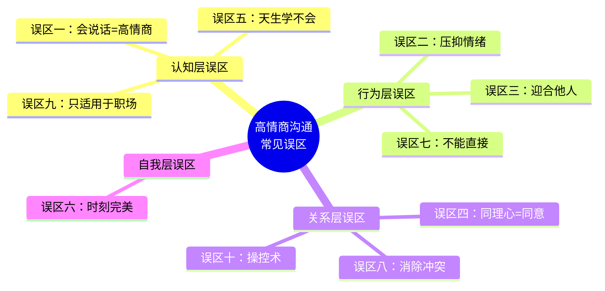
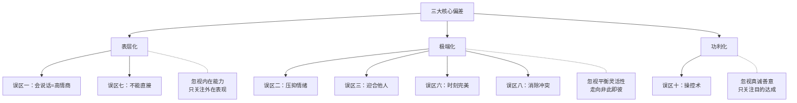

# 第十五章 第四节 常见误区

在追求高情商沟通的路上，最大的障碍往往不是"不知道该怎么做"，而是"以为自己知道但其实错了"。错误的认知会形成一条看不见的天花板——你越是努力练习错误的方法，就越难突破。本节系统揭示十个最常见的认知陷阱，每个误区配有真实场景、科学原理和自检工具，帮助你逐一排查，建立对高情商沟通的准确理解。

这十个误区可以按"认知→行为→关系→自我"四个层面归类。理解归类有助于定位你最可能陷入的层面——认知层误区阻碍学习方向，行为层误区导致错误练习，关系层误区破坏人际互动，自我层误区引发过度内耗。

---

## 误区一：高情商就是"会说话"

### 误区表现

很多人将高情商简单地等同于"会说话"——知道在什么场合说什么漂亮话、如何用话术取悦他人、如何用华丽的辞藻包装自己的观点。他们认为，只要掌握了足够多的沟通技巧和话术模板，就是高情商的沟通者。

**典型场景**：小王背诵了大量"高情商回复模板"，在同事面前对答如流。但当一位同事因为项目失败情绪崩溃时，小王说出了一句模板化的"别难过了，一切都会好的"，反而让同事感到被敷衍——因为他没有真正理解对方此刻需要的是被倾听，而不是被安慰。

### 正确认知

高情商沟通的本质不是"说什么"，而是"怎么理解"和"怎么回应"。会说话只是高情商的外在表现之一，真正的高情商沟通建立在三个更深层的基础之上：

- **自我觉察能力**：理解自己的情绪状态和内在需求。当你能准确识别"我现在感到焦虑是因为害怕被否定"，你的回应才能精准。
- **同理心理解**：真正理解他人的感受和立场。这不是"我知道你难过"的表面判断，而是"我能感受到你在这件事上投入了多少心血，所以现在一定很失落"的深层共鸣。
- **情绪调节能力**：在压力下做出建设性的回应。不被自己的情绪劫持，也不被对方的情绪卷入。

心理学家Daniel Goleman在其情商模型中指出，情商的五大核心能力分别是自我意识、自我调节、动机、同理心和社交技能。"会说话"仅属于社交技能这一项中最表层的部分。一个只学会了话术但缺乏底层能力的人，在关键时刻往往会"露馅"——因为真正触动人心的不是漂亮的话语，而是真诚的理解和关怀。

### 自检清单

- 当对方情绪激动时，你的第一反应是"说什么能让他好受"还是"他现在真正需要什么"？
- 你是否花更多时间背诵话术模板，而非练习倾听和觉察？
- 在沟通失败后，你是否只检讨"哪句话说错了"，而忽略了"是否真正理解了对方"？

### 如何避免

将学习重心从"话术技巧"转移到"内在能力"的培养上。具体路径：

1. **自我觉察训练**：每天花5分钟回顾当天的一次沟通，记录"我当时的情绪是什么""我为什么会有这个反应"
2. **倾听优先**：在回应之前，先确认自己理解了对方的核心诉求。可以用"如果我理解正确的话，你是在说……"来校准
3. **真诚压过技巧**：当你不知道该说什么时，一句"我不太确定该怎么回应，但我真的很想理解你的感受"比任何模板都有效

记住：真诚永远比技巧更有力量。

---

## 误区二：高情商就是压抑情绪

### 误区表现

有些人认为高情商意味着不表达负面情绪——不生气、不悲伤、不焦虑、不恐惧。他们把情绪管理等同于情绪压抑，努力在他人面前保持"完美"的情绪状态。

**典型场景**：职场中的李经理，面对下属连续犯错时总是"微笑以对"，从不表达不满。但每到深夜，他会反复回想这些事情，失眠越来越严重。最终在一次无关紧要的小事上，他对团队发了一次大火，所有人都感到莫名其妙——没有人知道，那些"没关系"背后累积了多少被压抑的怒火。

### 正确认知

压抑情绪和管理情绪是两回事。压抑情绪是指否认、忽略或强行压制自己的真实感受，而管理情绪是指觉察、接纳情绪，并选择建设性的方式来表达和处理它。

哈佛医学院的研究显示，长期情绪压抑（suppression）与以下问题显著相关：

- **身体健康问题**：慢性头痛、胃肠道疾病、免疫力下降、心血管风险升高。密歇根大学一项追踪12年的研究表明，习惯压抑愤怒的人患心脏病的概率比正常表达者高31%。
- **心理健康问题**：焦虑症、抑郁症、情感麻木（alexithymia的前兆）、倦怠综合征
- **人际关系问题**：因为缺乏真实的情感交流，关系停留在表面，对方感到"永远走不进你的内心"
- **爆发风险**：被压抑的情绪不会消失，只会在某个时刻以更强烈的方式爆发——心理学中称之为"情绪反弹效应"（Ironic Rebound Effect）

更深层的问题是：压抑情绪会逐渐侵蚀你的自我认知。当你反复告诉自己"我不该生气"，久而久之你会失去识别和信任自己情绪的能力，变成一个与自己感受脱节的人。

### 区分压抑与管理

| 维度 | 情绪压抑 | 情绪管理 |
|------|---------|---------|
| 对情绪的态度 | 否认、排斥 | 觉察、接纳 |
| 内心独白 | "我不应该生气" | "我现在很生气，这是正常的" |
| 行为表现 | 假装没事、回避话题 | 选择合适的时机和方式表达 |
| 长期效果 | 情绪累积→爆发或内耗 | 情绪流动→释放→平静 |
| 对关系的影响 | 虚假、疏远 | 真实、亲近 |

### 如何避免

**第一步：觉察与命名**。当情绪出现时，先对自己说"我现在感到___"，准确命名情绪是管理它的前提。心理学研究表明，仅仅是命名情绪（affect labeling）就能降低杏仁核的激活强度，减轻情绪的冲击力。

**第二步：接纳情绪的合理性**。告诉自己"有这个情绪是正常的"，不评判自己。情绪本身没有对错，只有表达方式有恰当与否之分。

**第三步：选择性表达**。这里的关键区分是：

- **压抑**："我不应该生气" → 否认情绪的存在
- **冲动表达**："你太过分了！" → 不加控制地宣泄
- **选择性表达**："我现在很生气，我需要一点时间冷静，然后我们再讨论这个问题" → 承认情绪，选择合适的时机和方式

**第四步：建立情绪出口**。运动、写日记、与信任的朋友倾诉、艺术表达都是健康的情绪出口。关键是要有稳定的、不需要依赖他人的自我调节机制。

---

## 误区三：高情商就是迎合他人

### 误区表现

有些人把高情商理解为"让每个人都满意"。他们在沟通中不断迎合他人、回避冲突、牺牲自己的需求和边界来取悦别人。他们害怕说"不"，害怕让他人不高兴。

**典型场景**：小陈是团队里有名的"老好人"。同事请他帮忙，他从不拒绝；领导额外加任务，他全盘接受。结果他的工作量是别人的两倍，经常加班到凌晨。更令人沮丧的是，年底评优时没人提名他——大家觉得他"就是好说话"，而非"能力强"。而他内心积累的怨气，最终在一次绩效面谈中全部爆发，让领导和同事都措手不及。

### 正确认知

真正的高情商沟通是在照顾他人感受的同时，也尊重自己的需求和边界。它是一种平衡的艺术，而非单方面的妥协。

一味迎合的后果是系统性的：

- **丧失自我**：长期压抑自己的需求会导致迷失自我，不知道"我到底想要什么"
- **积累怨恨**：表面的迎合之下是日益增长的不满，总有一天会以扭曲的方式爆发
- **失去尊重**：心理学中的"讨好者悖论"——越是讨好别人，越不被尊重。因为讨好传递的信号是"我的需求不重要"，别人也会照此对待你
- **关系失衡**：建立在单方牺牲上的关系不是真正的亲密，而是一种不健康的依附模式
- **职业发展受阻**：在职场中，无法设定边界的人容易被分配低价值工作，被认为缺乏领导力

心理学家Harriet Braiker在《The Disease to Please》中指出，讨好行为本质上是一种隐性控制——"如果我让所有人都满意，他们就不会离开我或对我发怒。"这种控制虽然出于好意，但同样是对真实关系的扭曲。

### 边界设定的实操框架

**三层边界模型**：

第一层：硬边界（不可协商）
  → 触及底线的行为：侮辱、欺骗、利用
  → 表达方式："这一点我无法接受，请停止。"

第二层：弹性边界（可以讨论）
  → 涉及偏好和习惯的差异
  → 表达方式："我理解你的需求，同时我的想法是……我们可以一起找个方案。"

第三层：软边界（可以灵活）
  → 不涉及核心利益的小事
  → 表达方式：可以适当让步，但保持觉察，不让让步成为习惯

### 如何避免

1. **练习说"不"的艺术**：温和而坚定。"我很感谢你想到我，但这次我没办法帮忙"——不需要道歉、不需要解释、不需要编理由
2. **区分"我想要"和"我应该"**：在回应之前，问自己"我是真的想帮，还是觉得应该帮"
3. **延迟回应**：面对请求时，不要立刻说"好"。"让我想想，稍后回复你"——给自己空间评估
4. **建立自我价值感**：你的价值不取决于别人是否满意。当你不再需要通过讨好来获得认可，真正的尊重才会到来
5. **记住：健康的关系建立在双方的真实和尊重之上**——如果一段关系需要你不断牺牲自己才能维持，那它本身就值得重新审视

---

## 误区四：同理心就是同意对方

### 误区表现

很多人混淆了同理心和同意。他们认为，理解对方的感受就意味着认同对方的观点和行为。因此，当他们不同意对方时，就会拒绝表达同理心。

**典型场景**：在一次产品评审会上，设计师小张提出了一个方案，产品经理认为方向有偏差，直接否定了方案，没有表达任何对小张加班赶工的理解。小张感到自己的努力被完全无视，从此对工作失去了热情。其实，产品经理完全可以理解小张的付出，同时对方案方向提出不同意见——这两者并不矛盾。

### 正确认知

同理心和同意是两个完全不同的概念：

- **同理心（Empathy）**：我理解你的感受，我能看到你为什么会这样想/做。这是一种理解能力。
- **同意（Agreement）**：我认同你的观点，我认为你是对的。这是一种判断。

你可以完全理解一个人为什么愤怒，但同时认为他的愤怒是基于错误的前提。你可以感受到一个人的悲伤，但不必认为造成悲伤的决定是正确的。

将同理心与同意混为一谈会造成两个极端：

1. **为了表达同理而被迫同意**：被迫认同自己不认可的观点，导致内心矛盾
2. **因为不同意而拒绝同理**：在观点分歧时表现冷漠和敌对，破坏关系

神经科学研究显示，同理心激活的是大脑的"心智化网络"（mentalizing network），而同意/不同意激活的是"评价网络"（evaluation network）。两者在大脑中是独立运作的，完全可以同时存在——你可以在理解对方的同时保留自己的判断。

### 如何避免

练习"理解但不一定同意"的三层表达方式：

**第一层：情绪验证**——确认对方感受的合理性
- "我理解你为什么会有这样的感受，在那个情境下，很多人都会有同样的反应。"

**第二层：立场理解**——展示你看到了对方的角度
- "从你的角度来看，这个方案确实有它的道理。"

**第三层：差异表达**——在理解和尊重的基础上表达不同意见
- "同时我的看法有所不同，我想从另一个角度和你探讨一下。"

这个框架的核心逻辑是：先让对方感到被理解，再引入不同视角。当人们感到被理解时，他们对不同意见的接受度会显著提高。

---

## 误区五：高情商是天生的，学不会

### 误区表现

很多人认为情商是一种与生俱来的特质——有些人天生就善于沟通和处理人际关系，而另一些人天生就不擅长，后天无法改变。这种信念会让人在遇到沟通困难时迅速放弃："我就是不善于和人打交道。"

**典型场景**：程序员小林技术能力很强，但每次需要跨部门沟通时都感到焦虑。他的口头禅是"我是技术型的人，情商这种东西学不来的。"这种自我标签让他在沟通中越来越退缩，形成了一种自我实现的预言。

### 正确认知

大量科学研究明确表明，情商是可以通过学习和练习来提升的。与智商相比，情商的可塑性更强：

- **神经可塑性**：大脑具有终身的可塑性。伦敦出租车司机的海马体研究证明，持续的空间训练改变了大脑结构。同理，持续的情商练习也会重塑与情绪处理相关的神经回路（特别是前额叶皮层和岛叶）。
- **研究证据**：2011年发表在《Journal of Applied Psychology》上的一项元分析显示，系统的情商训练项目平均能提升参与者情商水平0.5个标准差，效果在训练结束后至少持续6个月。训练周期通常在8-16周即可见到显著效果。
- **实践经验**：人生经历本身就是提升情商的重要途径。处理过困难对话的人，下一次会表现得更好——前提是他有反思的习惯。

心理学家Carol Dweck的成长型思维理论完美适用于情商领域。研究表明，相信情商可以提升的人（成长型思维），比认为情商固定不变的人（固定型思维），在实际学习中进步更快、更大。

### 如何避免

1. **停止给自己贴标签**：把"我不善于沟通"替换为"我的沟通能力还在成长中"
2. **建立成长型思维**：将每次沟通挑战视为学习和成长的机会，而非对能力的检验
3. **制定系统练习计划**：
   - 每周选择一个情商技能重点练习（如：本周专注练习"积极倾听"）
   - 每天记录一次沟通实践，分析"做得好的"和"可以改进的"
   - 每月回顾进步，看到自己的成长轨迹
4. **寻找反馈来源**：找一个你信任的人，定期请他给你的沟通方式提供反馈
5. **从小场景开始**：不需要一开始就挑战最难的对话。先从日常的低风险场景练习，逐步提升

---

## 误区六：在所有情境中都应保持高情商

### 误区表现

有些人认为高情商意味着在任何情境中都能保持完美的情绪管理和沟通表现。当他们偶尔失控或表现不佳时，会对自己产生强烈的自责和内疚。这种"完美主义"不仅无助于提升情商，反而会制造额外的心理负担。

**典型场景**：小赵一直以自己的情绪控制力自豪。某天母亲突然住院，他在工作中因为一件小事对同事发了火。事后他陷入了深深的自责："我练了这么久的情商，怎么还是控制不住？"这种自责让他比最初的失控更加痛苦，消耗了大量的心理能量。

### 正确认知

没有人能够在所有情境中都保持高情商。心理学研究表明，自我控制力是一种有限资源——"自我损耗理论"（Ego Depletion）告诉我们，在经历压力、疲劳、悲伤等消耗性事件后，任何人都更容易情绪失控。

情商高的人和情商低的人的区别不在于"是否会失控"，而在于"失控后怎么做"：

- **事后反思**：他们会在情绪平复后反思自己的表现，分析失控的触发因素
- **及时修复**：他们会主动修复因情绪失控而造成的关系损害——"抱歉，我刚才的话有些过分了，那时我情绪不太好，但这不是借口"
- **持续改进**：他们会从每次失误中学习，识别自己的情绪触发点，为类似场景提前做准备
- **自我宽恕**：他们能够接受自己的不完美，不把一次失控定义为"情商不行"

追求"完美的高情商"本身就是一种认知陷阱。它将情商变成了一种表演标准，而非生活能力。当你用完美主义来要求自己时，每一次失误都会被放大为失败，这种压力反而会增加情绪失控的概率——形成恶性循环。

### 如何避免

1. **接受"人"的设定**：允许自己有情绪失控的时候，这是人之常情，不是能力缺陷
2. **从"完美表现"转向"持续进步"**：衡量标准不是"我今天有没有失控"，而是"我比上次失控时恢复得更快了吗"
3. **建立修复机制**：当表现不佳时，关注"如何修复"而非"如何自责"。一个及时的道歉和真诚的反思，比从不犯错更能建立信任
4. **理解"足够好"的概念**：心理学家Winnicott提出"足够好的母亲"概念——同样，"足够好的情商"就够了。不需要完美，只需要真诚
5. **在极端情境中降低标准**：当面对重大压力（亲人病故、重大变故、极度疲劳）时，给自己"情有可原"的空间，优先照顾自己的情绪需求

---

## 误区七：高情商沟通就是不直接

### 误区表现

有些人将高情商沟通等同于拐弯抹角、含蓄委婉。他们认为直接的表达是"低情商"的表现，因此在需要直接沟通的时候也选择绕弯子，导致信息传递不清晰、问题被掩盖、决策被延误。

**典型场景**：一位领导对下属的方案不满意，但他不直接说"这个方向有问题，我们需要调整"，而是说"这个想法挺有意思的，不过也许我们可以再想想其他可能性？"下属误以为方案方向没问题，只是需要补充更多创意，继续沿着错误方向做了两周——最终浪费了大量时间和精力。

### 正确认知

高情商沟通的核心不是"直接"或"间接"，而是"有效"和"尊重"。在很多情况下，直接、清晰的表达恰恰是高情商的表现：

- 当对方需要明确的反馈时，含糊其辞反而是一种不尊重——它剥夺了对方获取准确信息的权利
- 当问题需要快速解决时，绕弯子会浪费时间和机会成本
- 当对方明确表示希望直接沟通时，拐弯抹角会让人感到不被信任
- 当涉及安全、合规、重大决策等严肃事项时，模糊表达可能造成严重后果

真正的高情商是根据情境和对象，选择最合适的沟通方式——有时直接，有时委婉，关键在于对时机、方式和语气的恰当把握。

### 直接 vs 委婉的判断框架

**选择直接表达的场景**：
- 需要明确行动方向时
- 对方正在犯一个可能造成较大损失的错误时
- 时间紧迫，需要快速决策时
- 对方偏好直接沟通风格时
- 涉及底线和原则问题时

**选择委婉表达的场景**：
- 对方情绪正处于脆弱期时
- 反馈涉及敏感的个人话题时
- 在公开场合需要给对方留面子时
- 你对情况还不够了解，需要更多信息时
- 文化背景要求含蓄表达时

### 如何避免

1. **用"温和而坚定"替代"拐弯抹角"**：语气可以温和，但信息必须清晰。"我认为这个方案在执行层面有三个风险点需要解决"比"这个方案挺好的但也许可以再优化一下"高明得多
2. **区分"直接"和"粗鲁"**：直接是信息层面的清晰，粗鲁是态度层面的不尊重。两者完全不同。"你这个方案有问题"是粗鲁；"我认为这个方案需要在三个地方调整"是直接但尊重
3. **使用"三明治结构"时确保核心信息不丢失**：正面反馈→核心问题→正面期待。但千万不要让正面反馈淹没了核心问题
4. **询问对方的偏好**：在重要沟通前，可以直接问"你希望我直说，还是先从背景说起？"
5. **在直接表达后检查理解**：直接表达不等于对方一定接收到了你的意思。确认："我说清楚了吗？你怎么理解？"

---

## 误区八：高情商就不会产生冲突

### 误区表现

有些人认为，如果双方都是高情商的人，就不会有冲突。当冲突发生时，他们会认为这是情商不足的表现，或者因为害怕破坏"高情商"的形象而回避冲突。

**典型场景**：两位合作了三年的合伙人，对公司的战略方向产生了严重分歧。但因为双方都自认为"高情商"，都不愿主动挑明分歧，担心"伤和气"。结果问题在暗处发酵了半年，矛盾越积越深，最终导致合伙关系破裂——如果他们能在早期坦诚讨论，完全有可能找到折中方案。

### 正确认知

冲突是人际关系中不可避免的一部分。即使是两个高情商的人，也会有利益冲突、观点分歧和需求矛盾。人类的需求天然具有多样性——在资源有限的情况下，不同需求之间的张力必然产生冲突。

研究冲突管理的学者Kenneth Thomas指出，冲突本身是中性的——破坏性的是处理冲突的方式，而非冲突本身。高情商不是消除冲突，而是改变处理冲突的方式：

- **从破坏性到建设性**：将冲突从互相伤害转化为解决问题的机会
- **从回避到面对**：不回避冲突，而是以健康的方式面对和处理。回避不会消灭冲突，只会让它以更激烈的方式在更晚的时候出现
- **从输赢到共赢**：寻找双方都能接受的解决方案，而非一方压倒另一方
- **从个人到问题**：将注意力从"谁对谁错"转移到"如何解决问题"

事实上，适度的冲突是关系健康的标志。回避一切冲突的关系要么缺乏深度，要么隐藏着未被解决的问题。能够坦诚地面对分歧并共同寻找解决方案的关系，才是真正有韧性的关系。

### 冲突处理的TKI模型

心理学家Kenneth Thomas和Ralph Kilmann提出了经典的冲突处理模型，包含五种风格：

| 风格 | 适用场景 | 风险 |
|------|---------|------|
| 竞争（Competing） | 紧急决策、原则性问题 | 损害关系 |
| 合作（Collaborating） | 双方利益都重要、有时间讨论 | 耗时较长 |
| 妥协（Compromising） | 需要快速达成临时方案 | 双方都不完全满意 |
| 回避（Avoiding） | 问题不重要、情绪过于激烈时 | 问题未解决 |
| 迁就（Accommodating） | 关系比问题更重要、对方确实有理 | 可能被利用 |

高情商的人不是只用一种风格，而是能根据情境灵活切换。最常用也最有效的是"合作"风格，但它需要时间和双方的意愿。在时间紧迫或情绪过于激烈时，暂时回避或妥协也是合理选择。

### 如何避免

1. **接受冲突是正常的人际现象**，不把它视为失败的信号
2. **学习健康的冲突处理方式**：明确表达自己的需求和关切，同时倾听对方的需求和关切
3. **在冲突中保持对对方的尊重**：可以激烈地讨论问题，但不攻击对方的人格
4. **使用"立场-利益"分离法**：对方的"立场"（他要求什么）背后是"利益"（他为什么要求）。理解利益比争论立场更能找到共赢方案
5. **将冲突视为加深理解和加强关系的机会**——每一次成功的冲突处理，都是关系的一次升级

---

## 误区九：高情商沟通只适用于职场

### 误区表现

有些人认为高情商沟通是一种"职场技能"，只在工作场景中有用。他们在职场中努力表现高情商，但在家庭和亲密关系中却放松了对自己的要求——用对客户说话的耐心来包装对家人说话的随意。

**典型场景**：一位销售经理在客户面前温柔体贴、察言观色，但回到家面对妻子的倾诉时却心不在焉地刷手机。当妻子表达不满时，他回了一句"我在外面应酬一天了，你就不能让我安静一会儿吗？"——他把最好的情商都给了外面的人，把最差的态度留给了最亲近的人。

### 正确认知

高情商沟通是一种通用的人际能力，适用于所有场景——职场、家庭、朋友关系、社区互动等。事实上，在最亲密的关系中，高情商沟通反而更加重要，原因有三：

1. **情绪强度更高**：亲密关系中的情绪更深层、更强烈。同样一句话，从同事嘴里说出来和从伴侣嘴里说出来，杀伤力完全不同。
2. **伤害更深更持久**：关系越亲密，受到的伤害越深、越难愈合。一句对同事说的"算了"可能无伤大雅，但对伴侣反复说的"算了"会累积成"你从不在乎我的感受"。
3. **最容易忽视**：正是因为"都是一家人"的安心感，人们往往对家人比对陌生人更缺乏耐心。心理学中称之为"亲密关系中的安全感悖论"——越安全的关系中，越容易展现最差的一面。

有句常被引用的话："看一个人的真正情商，不要看他在职场中如何对待客户，而要看他在家中如何对待家人。"

### 如何避免

1. **将高情商沟通视为一种生活方式，而非一种职业技能**——它不是"上班才用的面具"
2. **在家庭中也运用积极倾听、情绪验证等技巧**：当家人倾诉时，放下手机，看着对方的眼睛，用"我能感受到这件事对你很重要"来回应
3. **对家人保持和对同事一样的尊重和耐心**——甚至更多，因为他们值得
4. **在亲密关系中也使用"我"语言**："我感到被忽视了"比"你总是不关心我"更有效
5. **设立"角色转换"仪式**：在从工作切换到家庭模式时，给自己几分钟的过渡时间，把工作中的情绪留在门外

---

## 误区十：高情商等于操控他人

### 误区表现

有些人将高情商沟通理解为一种"操控术"——通过了解他人的情绪和需求来影响和控制他人的行为。他们学习情商技巧的目的是让别人按照自己的意愿行事。甚至有一些畅销书和课程直接将"情商"与"说服术""影响力武器"挂钩，强化了这种错误认知。

**典型场景**：一位销售总监学了"情绪影响力"的课程后，开始在每次谈判中使用"共情式施压"——先表达对对方处境的理解，再利用这种理解来推动对方让步。短期内效果显著，但长期来看，越来越多的合作伙伴开始回避与他打交道，因为他"太会说话了，让人不舒服"。

### 正确认知

高情商沟通和情绪操控有着本质的区别。以下是核心差异的系统对比：

| 维度 | 高情商沟通 | 情绪操控 |
|------|----------|---------|
| **目的** | 建立真实连接，实现共赢 | 满足自己的单方面利益 |
| **基础** | 真诚和尊重 | 利用和欺骗 |
| **对他人** | 关注对方的福祉，尊重对方的自主决定权 | 忽视对方的福祉，将对方视为实现目标的工具 |
| **信息** | 透明和坦诚，对方知道你的意图 | 隐藏真实意图，制造信息不对称 |
| **结果** | 双方都受益，关系加深 | 只有操控者受益，关系被消耗 |
| **长期效果** | 建立信任和深度关系 | 破坏信任，关系不可持续 |
| **核心感受** | 对方感到被理解和尊重 | 对方感到被利用和不舒服 |

短期来看，操控可能有效，但长期来看，被操控者一旦察觉，关系就会彻底破裂。更关键的是，操控行为会逐渐侵蚀操控者自身的人际信任基础——当你习惯性地将情商作为工具来使用，你会越来越难以建立真诚的关系，也会越来越难以信任他人的真诚。

心理学家Paul Ekman区分了两种同理心：一种是"感同身受"的同理心（empathic concern），另一种是"冷认知"的同理心（cognitive empathy，即纯粹理解对方感受但不产生共鸣的能力）。操控者往往具有高水平的认知同理心，但缺乏感同身受的能力——他们能精确地读懂你的情绪，但不关心你的福祉。

### 如何避免

1. **始终以真诚和善意为出发点**：在每次重要沟通前，问自己"我希望对方也能从中受益，还是只是想让对方按我说的做？"
2. **保持透明**：不隐藏自己的真实意图。如果你希望通过这次对话达成某个目标，直接说出来
3. **尊重对方的自主权**：你可以说服，但不能剥夺对方说"不"的权利
4. **关注双方的利益**：好的沟通结果应该是"对你好，对我也好"，而非"对我好就行"
5. **记住：真正持久的影响力来自于信任和尊重，而非操控**。当人们自愿追随你时，你需要的"操控"比你以为的少得多

---

## 十大误区速查表

| 编号 | 误区 | 核心偏差 | 一句话纠正 |
|------|------|---------|-----------|
| 1 | 高情商就是"会说话" | 表层化 | 内在觉察比外在话术更重要 |
| 2 | 高情商就是压抑情绪 | 极端化 | 觉察和接纳情绪，选择性表达 |
| 3 | 高情商就是迎合他人 | 极端化 | 平衡同理心与自我边界 |
| 4 | 同理心就是同意对方 | 概念混淆 | 理解不等于认同，两者可以共存 |
| 5 | 高情商是天生的 | 固定思维 | 情商可塑，系统练习即可提升 |
| 6 | 应该时刻保持高情商 | 完美主义 | "足够好"比"完美"更健康 |
| 7 | 高情商就是不直接 | 表层化 | 根据情境选择直接或委婉 |
| 8 | 高情商就不会有冲突 | 理想化 | 冲突不可避免，关键是怎么处理 |
| 9 | 只适用于职场 | 场景局限 | 高情商是生活方式，不是职业技能 |
| 10 | 高情商等于操控术 | 功利化 | 真诚和善意是高情商的底色 |

---

## 误区背后的三大核心偏差

以上十个误区可以归纳为三个底层认知偏差，理解这些偏差有助于从根本上避免误区：

1. **表层化偏差**：将高情商理解为表面的技巧（误区一、七），忽视了内在的能力和素养。纠正方式：回归底层能力训练——觉察、倾听、理解。
2. **极端化偏差**：将高情商理解为极端的行为（误区二、三、六、八），忽视了平衡和灵活性。纠正方式：建立"光谱思维"——不是"要么压抑要么爆发"，而是在两者之间找到合适的表达点。
3. **功利化偏差**：将高情商理解为达成目的的工具（误区十），忽视了真诚和善意的底色。纠正方式：回归高情商的初心——建立真实的人际连接，而非操控他人。

---

## 自我诊断：你最容易陷入哪些误区？

以下自评可以帮助你识别自己的认知盲区。对每个问题如实回答"是"或"否"：

**表层化倾向（误区一、七）**
- [ ] 我花在学习"话术"和"回复模板"上的时间比练习倾听和觉察多
- [ ] 我认为"说话好听"就等于高情商
- [ ] 我在需要直接沟通时也会选择绕弯子

**极端化倾向（误区二、三、六、八）**
- [ ] 我很少在他人面前表达负面情绪
- [ ] 我很难对他人说"不"
- [ ] 当我情绪失控时，我会严厉地自责
- [ ] 我尽量避免任何形式的冲突

**概念混淆倾向（误区四、五）**
- [ ] 当我和别人意见不同时，我会拒绝理解对方的立场
- [ ] 我认为情商是天生的，自己很难改变

**场景局限倾向（误区九）**
- [ ] 我在工作中比在家里的沟通表现好得多

**功利化倾向（误区十）**
- [ ] 我学习情商技巧主要是为了影响他人的决定

如果你的回答中"是"超过一半，说明你在相应维度上存在认知偏差，建议重点关注对应误区的纠正方法。

---

## 最终总结

高情商沟通的本质是：**在真诚和善意的基础上，运用内在的情商能力（自我觉察、情绪管理、同理心），通过恰当的沟通方式，建立真实、深度、互利的人际关系。**

避免这些误区的关键是：

1. **始终保持对高情商沟通本质的清醒认知**——不被表面的技巧和功利的追求所迷惑
2. **建立"光谱思维"**——避免非此即彼的极端化理解，在两端之间寻找灵活的平衡点
3. **从内在能力入手**——自我觉察、情绪管理、同理心才是根基，技巧只是枝叶
4. **以真诚为底色**——所有技巧如果脱离了真诚，都会变成操控
5. **接受不完美**——高情商不是一种表演标准，而是一种持续成长的生活方式

高情商不是一种表演，而是一种生活方式；不是一种操控术，而是一种理解力；不是压抑自我，而是更好地成为自己。
