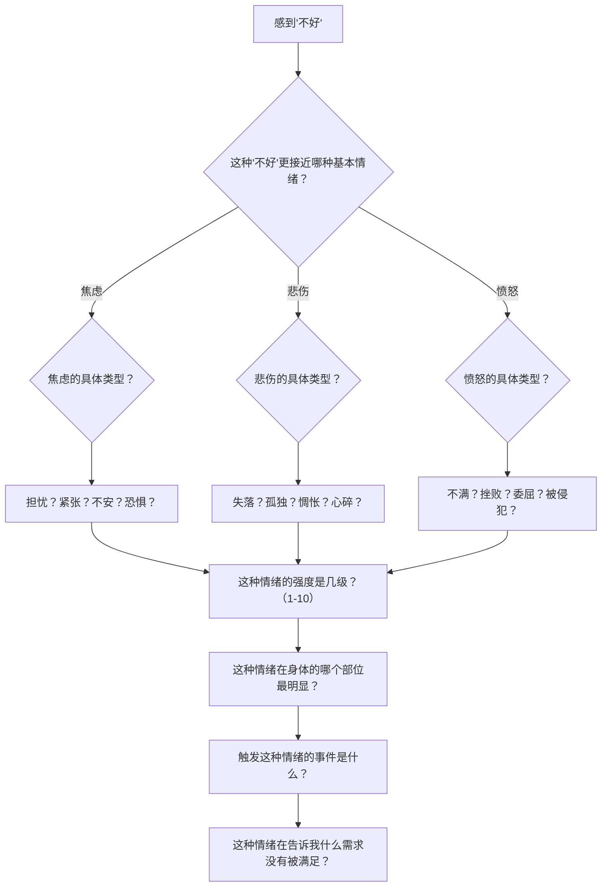
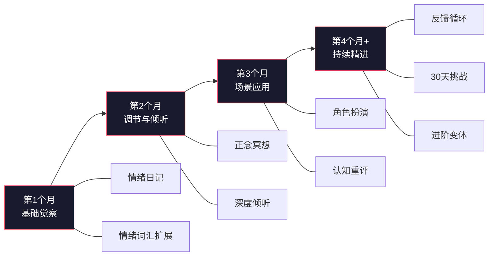

# 第十五章 第五节 练习方法

高情商沟通不是一种可以通过阅读就能掌握的知识，而是一种需要通过持续练习才能内化的技能。神经科学研究表明，大脑的"情绪回路"（包括杏仁核、前额叶皮层和岛叶）具有高度可塑性——每一次有意识的情绪觉察和调节练习，都在物理层面重塑你的神经通路。Anders Ericsson的"刻意练习"理论指出，技能习得的关键不在于练习时长，而在于练习质量：有明确目标、即时反馈、专注投入、持续挑战舒适区。

本节提供的八种练习方法，按照"觉察→识别→调节→应用"的能力递进逻辑编排。每种方法都包含理论机制、详细操作步骤、进阶变体、常见误区和效果评估。建议不要同时启动所有方法——按照文末的学习路径，循序渐进地叠加。

***

## 为什么"知道"不等于"做到"

在进入具体方法之前，需要理解一个关键概念：**知识-行为鸿沟**（Knowledge-Behavior Gap）。

你可能已经读完了前面所有章节，理解了情绪识别、同理心、冲突管理的原理。但当真正面对一个愤怒的客户、一个无理的要求、一句刺耳的批评时，你依然可能"回到老路上"。这不是因为你学得不够，而是因为：

1. **情绪反应的速度远快于理性思考**。杏仁核的情绪反应在12毫秒内触发，而前额叶的理性评估需要数百毫秒。在理性介入之前，情绪已经驱动了你的第一反应。
2. **旧的神经通路比新的更"顺畅"**。你过去几十年形成的沟通习惯，已经在大脑中修筑了宽阔的"高速公路"。新的高情商反应模式，目前还只是刚踩出来的"小路"。只有反复练习，才能让新路变宽、变快。
3. **压力会"关闭"高级认知功能**。当皮质醇（压力激素）水平升高时，前额叶皮层的功能会受到抑制，人会退回到更原始的反应模式。

因此，本节的练习方法的核心逻辑是：**通过高频、低强度的日常练习，在安全环境中建立新的神经通路，然后逐步在真实场景中激活它。** 就像学开车——先在驾校反复练习，直到操作变成肌肉记忆，然后才能在复杂的路况中自如驾驶。

***

## 方法一：情绪日记法

### 理论机制

情绪日记的核心原理来自"情绪标注"（Affect Labeling）研究。UCLA的Matthew Lieberman教授通过fMRI脑扫描发现，当人用语言描述自己的情绪时，杏仁核的活动会显著降低，而前额叶皮层的活动会增强。简单来说：**给情绪命名本身就能降低情绪的强度。**

情绪日记还借鉴了认知行为疗法（CBT）中的"思维记录"技术，通过结构化的记录，帮助你从"被情绪裹挟"的状态切换到"观察情绪"的状态——心理学称之为"去中心化"（Decentering）。

### 目的

提升自我觉察能力，建立对自身情绪模式的清晰认知。

### 操作步骤

**每日情绪记录（5-10分钟）：**

1. **选择固定时间**：建议在每天晚上睡前进行，形成稳定的习惯。固定时间能触发"习惯回路"——当场景（睡前）和行为（写日记）反复配对，行为会逐渐自动化。如果晚上不方便，可以选择午休后或通勤时段，关键是保持一致。
2. **记录当天最强烈的三个情绪时刻**：
   - **情绪事件**：发生了什么？用客观描述，不加评价。写"同事在会议上否定了我的方案"而不是"同事故意针对我"。
   - **情绪类型**：用精确的词汇描述（不是"不好"，而是"失望""焦虑""委屈"等）。精确度直接影响情绪调节效果——研究表明，能区分"失望"和"沮丧"的人，比只能说出"不开心"的人，情绪恢复速度快40%。
   - **情绪强度**：1-10分。1分=几乎感觉不到，5分=中等程度，10分=强烈到难以控制。评分的目的是建立量化的自我监控习惯。
   - **身体反应**：身体有什么感觉？胸口发紧、胃部收缩、肩膀僵硬、手心出汗、呼吸变浅——身体是情绪的"早期预警系统"，很多情绪在你意识到之前，身体已经给出了信号。
   - **思维模式**：当时在想什么？把脑海中的念头原样写下来，不加编辑。"他一定是觉得我的方案很蠢"——先记录，后分析。
   - **行为反应**：做了什么或想做什么？注意区分"做了什么"和"想做什么"——想摔门但忍住了，这个"忍住"本身就值得记录，因为它反映了你的调节努力。
   - **触发分析**：是什么触发了这个情绪？深层原因可能是什么？比如，被否定时的强烈愤怒，表面触发是"方案被否"，深层原因可能是"害怕被认为不够优秀"——触及了核心信念中的自我价值感。

**每周回顾（15-20分钟）：**

1. 回顾一周的情绪日记，像看"情绪天气图"一样纵览全貌
2. 识别反复出现的情绪模式——比如"每周一焦虑强度最高""每次和某人沟通后都感到委屈"
3. 分析最常见的情绪触发点，标记为"高风险情境"
4. 评估自己在情绪调节方面的进步——对比第一周和第四周的记录，看看情绪强度是否在下降、恢复速度是否在加快
5. 制定下一周的改进重点——比如"下周重点练习在被否定时的暂停反应"

### 进阶变体：结构化情绪日记模板

当基础记录变得熟练后，可以使用以下结构化模板：

| 时间段 | 事件 | 情绪（精确词汇） | 强度 | 身体感受 | 自动思维 | 行为反应 | 认知扭曲类型 | 替代解读 | 调节后强度 |
|-------|------|----------------|------|---------|---------|---------|------------|---------|-----------|
| 8:30 | 上司临时加任务 | 烦躁→焦虑 | 7 | 肩膀紧绷 | "他又在压榨我" | 沉默接受 | 灾难化、读心术 | "可能是紧急需求，不一定是针对我" | 4 |
| 14:00 | 方案被客户夸奖 | 欣慰→自豪 | 6 | 胸口温暖 | "我的努力被看见了" | 微笑道谢 | — | — | — |
| 19:30 | 伴侣忘记约定 | 失望→委屈 | 8 | 胃部收缩 | "他根本不在乎我" | 冷战 | 读心术、过度概括 | "他最近确实很忙，可以再确认一次" | 5 |

### 常见误区

- **误区一：只记负面情绪。** 正面情绪同样需要记录。记录正面情绪能帮助你识别"什么让你快乐"，这和识别"什么让你痛苦"同样重要。正面情绪还能提供"情绪锚点"——当你低落时，可以通过回忆这些时刻来调节情绪。
- **误区二：写成流水账。** "今天工作很累"没有价值。要追问：累的具体感受是什么？是体力上的疲惫还是心理上的倦怠？什么时候开始的？什么事件触发了？
- **误区三：坚持不到两周就放弃。** 研究表明，习惯养成的中位数时间是66天（不是广为流传的21天）。前两周是最难的——建议用"习惯叠加"策略，把写日记绑定在一个已有的习惯之后（比如刷完牙就写日记）。

### 效果评估

- **短期（2-4周）**：能够更快地识别自己的情绪状态，情绪词汇量增加
- **中期（1-3个月）**：能够识别反复出现的情绪模式和触发点，开始预测自己的情绪反应
- **长期（3个月以上）**：对自身情绪有深刻的了解，能够在情绪触发的瞬间就识别并选择回应方式

***

## 方法二：正念冥想练习

### 理论机制

正念（Mindfulness）的科学基础已经非常扎实。哈佛大学Sara Lazar的研究发现，持续8周的正念冥想练习可以使大脑灰质密度发生变化：前额叶皮层（负责执行功能和决策）增厚，杏仁核（负责恐惧和压力反应）体积缩小。简单来说：**正念练习在物理层面增强了你的"情绪刹车系统"。**

正念的核心概念是"觉察"（Awareness）和"不评判"（Non-judgment）。在高情商沟通中，正念的价值在于扩大"刺激"与"回应"之间的空间——Viktor Frankl说："在刺激和回应之间，有一个空间。在这个空间里，我们有选择回应方式的自由和力量。"正念练习就是在扩大这个空间。

### 目的

提升情绪觉察的敏锐度，扩大刺激与反应之间的空间，增强在压力下保持冷静的能力。

### 基础练习方案

**初学者阶段（第1-4周）——每天10分钟：**

1. 找一个安静的地方，舒适地坐下（椅子上即可，不必盘腿）
2. 设定计时器，闭上眼睛，将注意力集中在呼吸上
3. 注意气息进出鼻腔的感觉、胸腔和腹部的起伏
4. 当注意力被想法或情绪带走时，温和地将它带回呼吸。**注意：走神是正常的，每次"拉回来"就是一次"大脑举重"——这才是真正锻炼的时刻。**
5. 不评判任何想法或情绪的出现，只是观察它们，然后让它们自然离开。把想法想象成天空中飘过的云——你不需要抓住它，也不需要推开它，只是看着它飘过。
6. 练习结束时，慢慢睁开眼睛，花一分钟感受当下的状态

**进阶阶段（第5-8周）——每天15分钟：**

在基础练习的基础上，加入以下内容：

- **身体扫描**：从头顶开始，缓慢地将注意力移动到额头、眼睛、脸颊、下巴、脖子、肩膀……一直到脚趾。注意每个部位的感觉——紧张、温暖、麻木、疼痛——只是觉察，不试图改变。
- **情绪观察**：注意当下正在经历什么情绪，给它命名（"这是焦虑""这是不耐烦"），然后观察它的物理表现（"我的呼吸变浅了""我的肩膀在收紧"），不试图改变它。
- **想法观察**：注意脑海中出现的想法，将它们看作是飘过的云朵。练习"认知去融合"——不说"我是失败者"，而是说"我注意到一个'我是失败者'的想法出现了"。

**高级阶段（第9周以后）——每天20分钟：**

在进阶练习的基础上，加入：

- **慈悲冥想（Loving-kindness Meditation）**：先对自己发送善意（"愿我平安，愿我快乐，愿我健康"），然后扩展到你爱的人、中立的人、困难的人、所有众生。斯坦福大学的研究发现，慈悲冥想可以显著增加对他人的同理心和社交连接感。
- **困难情境冥想**：在冥想中想象一个困难的沟通场景（比如明天要面对的冲突），练习在想象中保持呼吸平稳和身体放松。这相当于在"精神模拟器"中预演——研究表明，大脑对真实体验和生动想象的神经反应高度相似。

### 进阶变体：微正念练习

对于时间紧张的人，可以将正念融入日常：

| 场景 | 练习方式 | 时长 |
|------|---------|------|
| 等红绿灯 | 注意呼吸3次 | 30秒 |
| 洗手时 | 感受水流过手指的温度和触感 | 1分钟 |
| 上楼梯时 | 注意脚底与台阶的接触感 | 1分钟 |
| 电话响时 | 接听之前先做一次深呼吸 | 5秒 |
| 开会前 | 闭眼做3次腹式呼吸，觉察当下状态 | 1分钟 |
| 感到烦躁时 | 暂停，扫描身体哪里最紧张 | 30秒 |

这些"微正念"的累积效果不可小觑——每天分散做10次30秒的正念，效果不亚于一次5分钟的集中冥想。

### 常见误区

- **误区一："我静不下来，所以不适合冥想。"** 这就像说"我太弱了，所以不适合健身"。静不下来恰恰说明你需要练习。冥想的目标不是清空大脑，而是训练注意力。
- **误区二：追求"入定"的感觉。** 冥想不是要达到某种特殊状态。如果在练习中感到焦虑、无聊、烦躁——这些都是极好的练习对象，试着观察这些感觉而不是逃避。
- **误区三：只有坐在垫子上才算冥想。** 正念可以在任何时候进行——走路、吃饭、洗碗、等车。关键是有意识地将注意力带回当下。

### 效果评估

- **短期（2-4周）**：能够更好地集中注意力，减少走神，走神后的觉察速度变快
- **中期（1-3个月）**：在日常生活中能够更快地觉察到情绪变化，开始注意到情绪升起的"前兆"
- **长期（3个月以上）**：在压力和冲突中能够更自然地保持平静和清醒，"刺激-反应空间"明显扩大

***

## 方法三：角色扮演练习

### 理论机制

角色扮演的价值在于"安全环境中的真实练习"。心理学中的"暴露疗法"（Exposure Therapy）原理表明：在安全环境中反复接触恐惧刺激，可以显著降低对该刺激的焦虑反应。角色扮演让你在没有真实后果的情况下，体验困难沟通场景中的情绪压力，从而建立应对的信心和策略。

此外，角色扮演激活了"心理模拟"（Mental Simulation）机制——当你扮演对方角色时，你被迫从对方的视角看问题，这本身就是一种强大的同理心训练。

### 目的

在安全的环境中练习高情商沟通技巧，为真实场景做准备。

### 练习方案

**练习准备：**

1. 找一个信任的伙伴（朋友、家人、同事或教练）。理想的练习伙伴需要满足两个条件：一是你在他面前犯错不会感到太尴尬，二是他能给出诚实的反馈。
2. 选择一个你们都想提升的沟通场景。优先选择你近期真实会遇到的场景——练习的迁移效果在场景越具体时越强。
3. 分配角色（一个扮演沟通者，一个扮演对方）
4. 准备场景描述卡片——每张卡片写明：场景背景、对方的性格特征、对方的情绪状态、关键的沟通挑战

**场景示例：**

| 场景 | 对方的情绪状态 | 沟通挑战 | 高情商关键点 |
|-----|-------------|---------|------------|
| 向上级提出加薪要求 | 上级可能不耐烦，时间紧迫 | 如何在压力下清晰表达自己的价值 | PREP框架表达+观察对方反应节奏 |
| 安慰失去亲人的朋友 | 朋友极度悲伤，可能语无伦次 | 如何在不知道说什么时保持陪伴 | 非语言支持+情绪验证+不急于安慰 |
| 处理客户的愤怒投诉 | 客户情绪激动，可能言语攻击 | 如何在被指责时保持冷静和同理心 | 先处理情绪再处理问题+分离人与事 |
| 与伴侣讨论敏感话题 | 伴侣可能防御、退缩或反击 | 如何在不引发冲突的情况下表达不满 | "我"信息表达+软化启动+寻求共识 |
| 拒绝不合理的请求 | 对方可能失望、生气或施压 | 如何在说"不"的同时维护关系 | 温和而坚定+提供替代方案 |
| 给下属负面反馈 | 下属可能焦虑、委屈或抵触 | 如何在批评的同时维护对方的尊严 | SBI反馈模型+平衡正面和改进点 |

**练习流程：**

1. **第一轮——基线测试**（3-5分钟）：按自己习惯的方式进行沟通，不刻意使用任何技巧。这轮的目的是建立"改进基线"。
2. **第一轮反馈**（3分钟）：对方分享他们的感受和观察（使用下方的反馈指引）。
3. **教学环节**（5分钟）：讨论可以使用哪些高情商技巧，共同制定第二轮的策略。
4. **第二轮——技巧练习**（3-5分钟）：运用高情商技巧重新进行沟通。
5. **第二轮反馈**（3分钟）：对方再次分享感受和观察。
6. **复盘讨论**（5-10分钟）：对比两轮的差异，讨论哪些技巧有效、哪些需要调整。

**反馈指引：**

给出反馈时，使用"具体行为+影响"的格式：

- ✅ "当你说了'我理解你的感受'时，我感到被听见了，防御感降低了。"
- ✅ "你的语速在第二轮明显放慢了，让我觉得你更冷静、更可靠。"
- ✅ "第二轮你问了'你最希望的结果是什么'，这个问题让我觉得你在真正关心我的需求。"
- ❌ "你第一轮表现不好。"（太笼统，没有行为细节）
- ❌ "你应该更有同理心。"（只说了目标，没说具体怎么做）

### 进阶变体：即兴角色扮演

当基础角色扮演变得熟练后，可以尝试"即兴模式"——练习者不知道对方会给出什么样的反应。扮演者可以随机加入以下"干扰因素"：

- 突然提高音量
- 突然沉默不说话
- 突然转换话题
- 突然说出攻击性的话
- 突然哭泣
- 突然说"你说的都对"（敷衍回应）

这模拟了真实沟通中最难的部分——你永远无法完全预测对方的反应。

### 常见误区

- **误区一：只找"配合型"伙伴练习。** 如果对方总是温和配合，你练到的只是"最佳情况"的应对。需要让伙伴模拟各种难度的反应。
- **误区二：跳过基线测试直接用技巧。** 没有对比就没有改进——第一轮的"自然反应"是非常宝贵的参照点。
- **误区三：练习后不复盘。** 角色扮演的价值有一半在复盘环节。没有复盘的练习，就像考试不看答案——你不知道自己哪里做对了、哪里需要改。

### 效果评估

- **短期（1-2周）**：对特定沟通场景有更清晰的应对策略，减少"不知所措"的感觉
- **中期（1个月）**：在真实场景中能够更自然地运用练习过的技巧，自动化程度提升
- **长期（持续练习）**：高情商沟通成为本能反应，能够在从未遇到的场景中灵活应变

***

## 方法四：反馈循环法

### 理论机制

反馈循环法基于"乔哈里窗"（Johari Window）模型——每个人都有一个"盲区"（自己看不到但别人看得到的部分）。他人的反馈是缩小盲区最直接的方式。

心理学研究发现一个反直觉的现象：**我们对自己沟通能力的评估，与他人对我们沟通能力的评估，相关性只有0.2-0.3**（Dunning-Kruger效应的变体）。你以为自己表达得很清楚，对方可能觉得你在绕弯子；你以为自己在表达关心，对方可能觉得你在控制。只有通过多来源的反馈，才能拼出更完整的自我画像。

### 目的

通过他人的视角发现自己的盲区，持续改进沟通方式。

### 操作步骤

**第一步：选择反馈来源（3-5人）**

选择来自不同生活领域的人，确保视角的多样性：

- 一位亲密的家庭成员（看到你最放松状态下的沟通方式）
- 一位亲密的朋友（了解你的社交沟通模式）
- 一位关系较好的同事（观察你的职场沟通风格）
- 一位你的上级或导师（从权威视角评估你的表达能力）
- 一位你的下属或后辈（从"被影响者"视角感受你的沟通效果）

**第二步：提出请求**

向每个人发出反馈请求，使用以下模板：

> "我正在努力提升自己的沟通能力，特别是高情商沟通方面。你是我非常信任的人，我想请你帮我观察一下，我在沟通中有哪些做得好的地方，哪些可以改进的地方。你可以从以下几个方面来分享：
> 1. 我在情绪管理方面表现如何？
> 2. 我是否能够理解和回应他人的感受？
> 3. 我在冲突或压力下的表现如何？
> 4. 有什么是我可能没有意识到的沟通习惯？
>
> 你的反馈对我非常重要，无论是什么内容，我都会真诚地感激。"

**关键提示**：发送反馈请求时，给对方留出至少一周的思考时间，不要催促。如果对方没有回应，只提醒一次，不要反复追问——反馈必须是自愿的才有效。

**第三步：接收反馈——最难的一步**

接收反馈是整个方法中最具挑战性的环节。当听到批评时，大脑的威胁检测系统（杏仁核）会自动激活，产生防御冲动——想辩解、反驳、解释。这很正常，但你需要做的是：

- **保持开放和非防御的态度**——在心里默念："这是数据，不是攻击。"
- **倾听时不打断，不辩解**——把嘴闭上，把耳朵打开。即使你觉得对方说的不准确，也先完整听完。
- **问澄清性问题以确保理解**——"你能举一个具体的例子吗？""你当时的感受是什么？""你希望我当时怎么回应？"
- **感谢对方的坦诚**——"谢谢你愿意告诉我这些，我知道这不是容易的事。"
- **不要立即回应或承诺改变**——给自己24小时消化反馈，再决定行动。

**第四步：整合反馈**

1. 将所有反馈进行汇总和分类——建议用表格记录，按"优势"和"改进空间"两列整理
2. 识别反复出现的主题——如果3个人都提到你"说话太快"，这大概率是一个真实盲区
3. 区分"行为"和"标签"——"你打断了我3次"（行为，可以改）vs "你不太尊重人"（标签，需要追问具体行为）
4. 制定具体的改进计划——选择1-2个最重要的改进点，制定可执行的小步骤

**第五步：跟进和更新**

- 每3个月重复一次反馈请求——对比前后反馈的变化
- 向反馈者分享你的改进进展——"你上次提到我说话太快，我最近在有意识地放慢语速，你觉得有变化吗？"
- 感谢他们的持续支持——反馈是一种情感投资，你的感谢是对这种投资的回报

### 进阶变体：实时反馈协议

与一位亲密伙伴建立"实时反馈协议"——约定在日常互动中，当对方观察到你的沟通问题时，可以用一个暗号即时提醒。比如：

- 拍两下手背 = "你现在语速太快了"
- 轻触自己耳朵 = "你在打断对方"
- 微微摇头 = "你的语气比你想象的更生硬"

这种方式比事后反馈更有效——它在行为发生的同时提供纠正，学习效果更强。

### 常见误区

- **误区一：只找"会说好话"的人。** 如果你选择的反馈者只会夸你，你得到的只是安慰，不是成长。选择那些你信任其诚实度的人。
- **误区二：听到负面反馈后疏远对方。** 很多人在收到尖锐反馈后，下意识地减少与反馈者的互动。这恰恰是最糟糕的反应——你在惩罚对方的诚实。
- **误区三：试图同时改进所有问题。** 一次聚焦1-2个改进点就够了。同时改变太多，每个都改不好，反而会增加挫败感。

### 效果评估

- **短期（第一次反馈后）**：发现之前未意识到的沟通模式，可能伴随短暂的不适感
- **中期（3-6个月）**：在反复出现的反馈主题上有明显改进，反馈者开始给出正面评价
- **长期（6个月以上）**：建立了持续改进的反馈循环机制，盲区持续缩小

***

## 方法五：情绪词汇扩展练习

### 理论机制

情绪颗粒度（Emotional Granularity）是心理学家Lisa Feldman Barrett提出的重要概念。它指的是一个人区分和标识情绪体验的精确程度。高情绪颗粒度的人能区分"失望"和"沮丧"、"焦虑"和"恐惧"、"委屈"和"愤怒"；低颗粒度的人只能笼统地说"不爽"或"难受"。

为什么颗粒度重要？Barrett的研究发现：**情绪颗粒度越高的人，情绪调节能力越强。** 原理是：精确的情绪命名激活了前额叶皮层的调节回路，而笼统的情绪描述只会强化杏仁核的应激反应。换句话说，能准确说出"我感到被忽视的失落"的人，比只会说"我不高兴"的人，能更快地从负面情绪中恢复。

### 目的

提升情绪颗粒度，更精确地识别和表达情绪。

### 操作步骤

**（1）建立情绪词汇库**

将情绪词汇按类别和强度进行分类。以下是一个扩展版的情绪词汇表，按强度从低到高排列：

**快乐系列：**

| 低强度 | 中强度 | 高强度 |
|-------|-------|-------|
| 平静、安心、舒适、知足 | 愉悦、满足、欣慰、温暖、感恩 | 兴奋、狂喜、自豪、幸福、充实、狂喜 |

**悲伤系列：**

| 低强度 | 中强度 | 高强度 |
|-------|-------|-------|
| 惆怅、失落、怀念、无奈 | 忧郁、沮丧、孤独、空虚 | 心碎、绝望、哀伤、崩溃 |

**愤怒系列：**

| 低强度 | 中强度 | 高强度 |
|-------|-------|-------|
| 不满、不耐烦、轻微恼怒 | 气愤、怨恨、挫败、嫉妒、鄙视 | 暴怒、狂怒、恨意、失控 |

**恐惧系列：**

| 低强度 | 中强度 | 高强度 |
|-------|-------|-------|
| 不安、担忧、不确定感 | 焦虑、紧张、畏惧、失控感 | 恐慌、害怕、惊恐、绝望 |

**惊讶系列：**

| 低强度 | 中强度 | 高强度 |
|-------|-------|-------|
| 意外、好奇 | 困惑、不可思议 | 震惊、难以置信、目瞪口呆 |

**复杂情绪（由基本情绪复合而成）：**

| 复杂情绪 | 成分解析 | 典型触发场景 |
|---------|---------|------------|
| 委屈 | 愤怒 + 悲伤 | 被误解、被不公平对待 |
| 嫉妒 | 愤怒 + 恐惧 + 悲伤 | 看到他人拥有自己渴望的东西 |
| 内疚 | 悲伤 + 恐惧 | 伤害了他人、违背了自己的价值观 |
| 羞耻 | 悲伤 + 恐惧 + 厌恶 | 自我价值感受到威胁 |
| 纠结 | 两种相反情绪并存 | 面临两难选择 |
| 释然 | 如释重负的轻松感 | 危机解除、重担放下 |
| 怀旧 | 快乐 + 悲伤 | 回忆过去的美好时光 |
| 敬畏 | 惊讶 + 微小的恐惧 | 面对大自然、伟大创造 |

**（2）每日情绪标注练习**

每天至少进行三次情绪标注，用"我注意到我现在感到______"的句式：

- 早上醒来时："我注意到我现在感到______（期待？慵懒？焦虑？）"
- 中午时分："我注意到我现在感到______（满足？疲惫？烦躁？）"
- 晚上睡前："我注意到我现在感到______（平静？遗憾？感恩？）"

使用"我注意到"前缀的作用是建立"观察者视角"——你在观察情绪，而不是被情绪定义。

**（3）精细化练习：从模糊到精确**

当笼统地感到"不好"时，使用以下追问流程：

**（4）情绪词汇挑战**

每周挑战自己在日常对话中使用一个新的情绪词汇。比如，这周把"不开心"替换为具体的情绪词——"我感到有点失望"或"我有些焦虑"。观察对方的反应变化——精确的情绪表达通常能引发更强的共情回应。

### 常见误区

- **误区一：认为情绪词汇越多越好。** 关键不在于词汇量，而在于你能从自己身上觉察到这些情绪。一个能准确识别自己10种情绪的人，比一个背了200个情绪词汇但从不觉察的人，情绪颗粒度高得多。
- **误区二：强行给自己贴标签。** 如果你说不清当下的情绪是什么，就说"我正在感受一种复杂的情绪，我还需要时间去理解它"——承认不确定本身就是一种精确。
- **误区三：只在练习时使用情绪词汇，日常沟通中还是"还行""挺好的"。** 练习的最终目的是在真实沟通中使用——对你信任的人说出"我今天感到有些疲惫和一点点焦虑"，这本身就是高情商的沟通。

### 效果评估

- **短期（2-4周）**：能够使用更多的情绪词汇来描述自己的状态
- **中期（1-3个月）**：情绪识别的速度和准确度明显提升，开始自动区分相似情绪
- **长期（3个月以上）**：能够精确地区分和表达复杂的情绪状态，情绪调节能力随之提升

***

## 方法六：深度倾听练习

### 理论机制

Carl Rogers在"以人为中心疗法"中提出了"积极倾听"（Active Listening）的概念。他的核心观点是：**当一个人真正感到被倾听时，他的防御会自动降低，自我探索的能力会自动增强。** 你不需要给建议、不需要解决问题——只需要让对方感到"我的感受被你看见了"。

神经科学研究发现了一个叫做"神经耦合"（Neural Coupling）的现象：当一个人真正理解另一个人时，两人的大脑活动模式会出现同步。深度倾听不仅是"听到声音"，而是让自己的大脑与对方的大脑"同频共振"。

### 目的

提升同理心倾听能力，真正理解他人的感受和需求。

### 操作步骤

**（1）日常倾听练习**

选择每天的一次对话（建议5-10分钟），有意识地进行深度倾听。按照以下清单逐项检查：

- [ ] 放下所有干扰——手机翻面扣放，电脑合上，关闭电视
- [ ] 身体朝向对方——肩膀和脚尖指向对方，保持开放姿态
- [ ] 保持适度眼神接触——60-70%的时间看着对方（太低显得心不在焉，太高显得有压迫感）
- [ ] 不在心里准备回应——当对方还在说话时，你脑子里在组织回应，那你其实已经没有在听了
- [ ] 注意对方的语调、表情和肢体语言——这些非语言信号传递的信息，通常比语言本身更多
- [ ] 使用最小鼓励信号——点头、"嗯"、"然后呢"、"我明白了"，让对方知道你在听
- [ ] 对方说完后，用自己的话复述对方的核心意思和感受——"你是说……你觉得……对吗？"

**（2）"只听不说"练习**

每周至少一次，在和朋友或家人的对话中，给自己设定一个规则：**全程只做倾听者，不给建议、不分享自己的经历、不做评判。** 只使用以下三种回应方式：

- **确认**："听起来你觉得……""所以你当时的感受是……"
- **好奇**："你当时是什么感受？""后来呢？""你最在意的是什么？"
- **沉默**：有时候最好的回应就是安静地陪伴，给对方空间去感受和表达

这个练习极其困难——你的大脑会强烈地想要"帮忙""给建议""分享类似经历"。但每一次忍住不说，你都在训练一种稀缺的能力：**让对方成为对话的中心。**

**（3）同理心回应三层练习**

在倾听后，练习以下三种递进的同理心回应：

| 层次 | 回应类型 | 示例 | 效果 |
|------|---------|------|------|
| 第一层 | 情绪验证 | "我能感受到你很……（情绪词）" | 让对方知道他的情绪被看见了 |
| 第二层 | 需求确认 | "你最希望的是……（对方的潜在需求）" | 让对方知道你理解了他的深层需求 |
| 第三层 | 理解表达 | "我理解为什么这件事对你这么重要，因为……" | 让对方知道你理解了这件事对他的意义 |

这三层回应是递进的——第一层是基础，第三层是高阶。日常对话中做到第一层就已经很好了。

**（4）倾听障碍识别练习**

在倾听过程中，觉察自己的以下"倾听障碍"：

| 障碍类型 | 表现 | 内心独白 | 纠正方式 |
|---------|------|---------|---------|
| 给建议 | 对方还没说完就开始出主意 | "你应该这样做……" | 提醒自己：先听完，再问"你需要建议还是只需要我听？" |
| 比惨 | 把话题转到自己身上 | "我比你更惨……" | 提醒自己：现在是对方的时刻，不是我的 |
| 否定感受 | 试图让对方"想开点" | "这有什么好生气的" | 提醒自己：情绪没有对错，只有存在 |
| 急于安慰 | 对方还在表达就开始说"没事的" | "别难过了，一切都会好的" | 提醒自己：过早安慰等于否定对方的感受 |
| 评判 | 在心里给对方的行为贴标签 | "他怎么这么玻璃心" | 提醒自己：我不了解全部情况，先理解 |

### 常见误区

- **误区一：把"不说话"等同于"在倾听"。** 沉默不等于倾听——如果你在发呆或走神，对方能感觉到。真正的倾听是主动的注意力投入。
- **误区二：倾听时不断点头说"嗯嗯嗯"。** 这种机械的回应会让对方觉得你在敷衍。好的倾听回应是"精准确认"——复述对方的核心意思，让对方知道你真的听进去了。
- **误区三：倾听后立即给建议。** 在高情商沟通中，"你需要建议还是只需要我听？"是一个黄金问题——很多时候人们只需要被听见，不需要被拯救。

### 效果评估

- **短期（2-4周）**：能够更好地集中注意力倾听，减少打断和走神
- **中期（1-3个月）**：能够更准确地理解对方的情绪和需求，同理心回应更加自然
- **长期（3个月以上）**：深度倾听成为自然习惯，人际关系质量显著提升

***

## 方法七：认知重评日记

### 理论机制

认知重评（Cognitive Reappraisal）是情绪调节策略中研究最充分、效果最可靠的策略之一。它的核心原理来自认知行为疗法（CBT）创始人Aaron Beck的发现：**触发我们情绪的不是事件本身，而是我们对事件的解读。** 同样是"同事没回你消息"，你可以解读为"他故意无视我"（导致愤怒），也可以解读为"他可能在忙"（情绪平静）。

James Gross的情绪调节过程模型指出，认知重评属于"前因聚焦策略"——在情绪完全爆发之前改变对情境的理解，比情绪爆发后再去压制（"反应聚焦策略"）更有效，对认知资源的消耗也更小。

### 目的

识别和调整不合理的认知模式，提升情绪调节能力。

### 操作步骤

当经历强烈负面情绪时，填写认知重评日记：

| 项目 | 内容 | 填写指引 |
|-----|------|---------|
| **情境** | 发生了什么事？ | 用摄像机视角客观描述，不加评价 |
| **自动想法** | 我脑海中自动出现的想法是什么？ | 把脑海中的原话写下来，不加编辑 |
| **情绪反应** | 我的情绪是什么？强度（1-10）？ | 写出具体情绪词+评分 |
| **认知扭曲识别** | 这个想法属于哪种认知扭曲？ | 对照下方的清单 |
| **证据支持** | 有什么证据支持这个想法？ | 列出客观事实，不是推测 |
| **证据反对** | 有什么证据反对这个想法？ | 列出反驳的客观事实 |
| **替代想法** | 更平衡、更客观的想法是什么？ | 不是"正能量"，而是"更接近事实" |
| **情绪变化** | 重新评估后，我的情绪强度（1-10）？ | 通常会下降2-3分 |

### 认知扭曲清单

以下是高情商沟通中最常见的10种认知扭曲，每种都配有沟通场景中的具体示例：

| 认知扭曲 | 定义 | 沟通场景示例 | 纠正方式 |
|---------|------|------------|---------|
| **读心术** | 假设知道对方在想什么 | "他肯定觉得我这个方案很蠢" | 问自己：我有直接证据吗？我能不能直接问他？ |
| **灾难化** | 想到最坏的结果 | "如果这次说错话，关系就彻底完了" | 问自己：最坏的结果是什么？概率多大？我能承受吗？ |
| **非黑即白** | 极端化思维 | "他要么完全支持我，要么就是反对我" | 问自己：有没有中间地带？他的立场可能是什么？ |
| **过度概括** | 从一件事得出普遍结论 | "他又没回消息，他总是不在乎我" | 问自己：这一次能代表"总是"吗？有没有反例？ |
| **应该思维** | 用"应该"要求自己和他人 | "他应该主动道歉""我应该能处理好" | 把"应该"换成"我希望"或"我更愿意" |
| **个人化** | 将无关的事归因于自己 | "领导今天没和我说话，一定是我做错了什么" | 问自己：还有其他可能的解释吗？ |
| **情绪推理** | 把情绪当事实 | "我觉得自己很没用，所以我一定是没用的" | 问自己：感觉=事实吗？情绪会变化，事实不会 |
| **标签化** | 给自己或他人贴标签 | "他就是个自私的人" | 把标签换成具体行为描述："他这次没有考虑我的需求" |
| **选择性关注** | 只关注负面信息 | 开会时10个人夸你，1个人提了意见，你只记得那1个人 | 问自己：我是不是忽略了什么正面信息？ |
| **最小化正面** | 忽视好的方面 | "他夸我只是客气" | 问自己：我能接受这个正面评价吗？为什么不能？ |

### 认知重评实例演示

**情境**：你向伴侣提出了一个请求，对方回答"再说吧"。

**自动想法**："他根本不在乎我的感受，我对他来说不重要。"

**情绪反应**：委屈（8分）+ 愤怒（6分）

**认知扭曲识别**：读心术 + 过度概括

**证据支持**：
- 他确实说了"再说吧"，没有正面回应
- 他说话时没有看我

**证据反对**：
- 他上周主动帮我解决了一个问题
- 他今天工作到很晚，看起来很疲惫
- 他以前多次满足过我的类似请求

**替代想法**："他现在可能很累，'再说吧'可能只是暂时没有精力讨论，不一定是不在乎。我可以等他状态好的时候再沟通。"

**情绪变化**：委屈（4分）+ 愤怒（2分）

### 常见误区

- **误区一：把"替代想法"写成"正能量口号"。** "一切都会好的""他一定是爱我的"——这不是认知重评，这是自我欺骗。替代想法必须是**更接近事实**的解读，不一定是更"积极"的解读。
- **误区二：在情绪最强烈时写。** 认知重评需要一定的理性认知资源。如果情绪强度超过8分，先用呼吸法或暂停技术把强度降到6分以下，再进行重评。
- **误区三：只写不行动。** 认知重评不只是调整想法，还需要根据新的解读采取行动。比如上面的例子，"替代想法"是"等他状态好的时候再沟通"——你需要真的去做。

### 效果评估

- **短期（2-4周）**：能够更快地识别认知扭曲，开始在情绪发生时"暂停一下"
- **中期（1-3个月）**：自动化的认知重评能力提升，很多扭曲在记录之前就已经被觉察
- **长期（3个月以上）**：思维模式更加灵活和客观，负面情绪的持续时间和强度都明显下降

***

## 方法八：30天高情商沟通挑战

### 理论机制

30天挑战的设计基于"渐进式暴露"和"习惯叠加"两个原则。每天的任务难度逐步递进——从最安全的自我觉察练习，到最具有挑战性的实战应用。同时，每天的任务都足够小（10-20分钟），降低启动成本，避免"三天打鱼两天晒网"。

行为科学研究表明，30天的持续练习足以让一个行为从"需要刻意努力"过渡到"半自动化"——虽然还没有完全变成习惯，但已经比第一天容易得多。

### 目的

通过系统化的每日练习，在一个月内全面提升高情商沟通能力。

### 挑战内容

**第1周：自我觉察（向内看）**

| 天 | 任务 | 具体操作 | 预期收获 |
|----|------|---------|---------|
| Day 1 | 情绪标注日 | 全天进行至少5次情绪标注，每次用精确的情绪词汇 | 发现自己一天中经历了比想象中更多的不同情绪 |
| Day 2 | 情绪日记启动 | 晚上花10分钟写第一篇情绪日记 | 建立第一个情绪记录 |
| Day 3 | 触发点识别 | 回顾今天最强烈的情绪，分析触发点是什么 | 开始觉察情绪的因果链 |
| Day 4 | 身体扫描日 | 进行一次完整的身体扫描，注意情绪在身体中的位置 | 建立"身体是情绪雷达"的意识 |
| Day 5 | 沟通模式回顾 | 回顾一次最近的沟通，分析自己当时的思维、情绪、行为链 | 理解自己在沟通中的自动化模式 |
| Day 6 | 优势与改进清单 | 写下自己的3个沟通优势和3个改进空间 | 建立自我评估的起点 |
| Day 7 | 周回顾 | 回顾本周所有记录，识别最重要的发现 | 整合第一周的学习 |

**第2周：同理心（向外看）**

| 天 | 任务 | 具体操作 | 预期收获 |
|----|------|---------|---------|
| Day 8 | 纯倾听日 | 在一次对话中全程只做倾听者，不给建议 | 体验"不说话"的力量 |
| Day 9 | 视角切换 | 选择一个你通常不同意的人，写下他可能的理由和感受 | 练习从他人视角看问题 |
| Day 10 | 关怀表达 | 对一位家人具体表达你对他的理解和关心 | 练习同理心表达 |
| Day 11 | 情绪验证练习 | 在对话中使用"我能感受到你很……"的回应 | 练习第一层同理心回应 |
| Day 12 | 对立观点阅读 | 阅读一篇与你观点不同的文章，写出作者的逻辑链 | 扩展同理心的广度 |
| Day 13 | 冲突中探索需求 | 在一次小分歧中，先问"你最希望的是什么" | 练习在冲突中保持好奇 |
| Day 14 | 周回顾 | 回顾本周所有练习，评估同理心的变化 | 整合第二周的学习 |

**第3周：情绪调节（管理内心）**

| 天 | 任务 | 具体操作 | 预期收获 |
|----|------|---------|---------|
| Day 15 | 呼吸法练习 | 练习4-7-8呼吸法（吸气4秒-屏气7秒-呼气8秒），至少3轮 | 掌握一个快速平静的工具 |
| Day 16 | STOP技术日 | 在情绪触发时使用STOP（Stop停-Think想-Observe观-Proceed行） | 练习在刺激和反应之间插入暂停 |
| Day 17 | 正念冥想 | 进行10分钟正念冥想 | 建立冥想练习的起点 |
| Day 18 | 认知重评练习 | 对当天一个负面情绪进行完整的认知重评 | 练习思维调整技术 |
| Day 19 | 暂停技术应用 | 在压力场景中主动使用暂停（"我需要想一想，给我一分钟"） | 练习在真实场景中的暂停 |
| Day 20 | 自我对话调整 | 觉察并调整一次消极的自我对话 | 练习内部语言的管理 |
| Day 21 | 周回顾 | 回顾本周练习，评估情绪调节能力的变化 | 整合第三周的学习 |

**第4周：综合应用（实战演练）**

| 天 | 任务 | 具体操作 | 预期收获 |
|----|------|---------|---------|
| Day 22 | 给出反馈 | 给一个人真诚、具体的反馈（使用SBI模型） | 练习建设性表达 |
| Day 23 | 接收反馈 | 主动请求一次反馈，练习不辩解地倾听 | 练习开放心态 |
| Day 24 | 结构化表达 | 在一次困难对话中运用PREP框架 | 练习清晰表达 |
| Day 25 | 线上高情商 | 在社交媒体上用高情商方式回应一条负面评论 | 将技能迁移到线上场景 |
| Day 26 | 感恩表达 | 向一位你感激的人具体说明你感谢他的原因 | 练习正面情感的表达 |
| Day 27 | 冲突中找共识 | 在一次分歧中，先找到双方都同意的点再讨论差异 | 练习冲突管理 |
| Day 28 | 深度对话 | 与一位朋友进行一次不看手机的深度对话 | 综合运用所有技能 |
| Day 29 | 收获总结 | 写下这一个月最大的三个收获和三个待改进点 | 整合一个月的学习 |
| Day 30 | 持续计划 | 制定下一阶段的持续练习计划（选择2-3种方法坚持） | 将30天挑战转化为长期习惯 |

### 每日反思模板

每天结束时，花2分钟回答以下三个问题：

1. **今天练习中，最有收获的一个时刻是什么？**
2. **今天的练习中，最困难的部分是什么？**
3. **明天我想在哪一个方面做得更好？**

### 效果评估

- **第1周末**：情绪觉察能力提升，开始注意到以前忽略的情绪信号
- **第2周末**：同理心回应更加自然，在对话中开始自动考虑对方的感受
- **第3周末**：情绪调节能力增强，能够使用工具在情绪升级前进行干预
- **第4周末**：整体沟通能力有明显提升，具备了持续自我改进的能力

***

## 练习方法总结

| 方法 | 核心能力 | 每日时间 | 见效周期 | 适合人群 | 难度 |
|-----|---------|---------|---------|---------|------|
| 情绪日记 | 自我觉察 | 5-10分钟 | 2-4周 | 所有人（入门首选） | ★★☆ |
| 正念冥想 | 情绪调节 | 10-20分钟 | 4-8周 | 需要提升冷静能力的人 | ★★★ |
| 角色扮演 | 综合应用 | 每周30-60分钟 | 2-4周 | 有练习伙伴的人 | ★★★ |
| 反馈循环 | 盲区发现 | 每月1-2小时 | 1-3个月 | 愿意接受批评的人 | ★★★★ |
| 情绪词汇扩展 | 情绪识别 | 2-3分钟 | 2-4周 | 情绪表达模糊的人 | ★☆☆ |
| 深度倾听 | 同理心 | 随时练习 | 2-4周 | 喜欢给建议的人 | ★★★ |
| 认知重评日记 | 思维灵活性 | 5-10分钟 | 2-4周 | 容易想太多的人 | ★★★ |
| 30天挑战 | 综合提升 | 10-20分钟 | 30天 | 想要系统突破的人 | ★★★ |

### 推荐学习路径

**第1个月——基础觉察（每天10分钟）：**
从情绪日记和情绪词汇扩展开始，建立基础的自我觉察能力。这两个方法启动成本最低，效果最快可见，能给你足够的正反馈来坚持后续练习。

**第2个月——调节与倾听（每天15-20分钟）：**
加入正念冥想和深度倾听，提升情绪调节和同理心。同时继续情绪日记作为基础记录。

**第3个月——场景应用（每天20分钟+每周1小时）：**
加入角色扮演和认知重评，将前两个月积累的觉察能力和调节能力应用到具体沟通场景中。

**第4个月及以后——持续精进：**
建立反馈循环，进行30天挑战，尝试各方法的进阶变体。此时练习已经部分自动化，可以将精力集中在最需要提升的方面。

### 常见的"练习高原期"应对

几乎所有人在练习过程中都会遇到"高原期"——感觉进步停滞、方法变得无聊、想放弃。这是正常的，应对策略是：

1. **切换方法**——如果情绪日记写腻了，暂停两周，换成深度倾听练习
2. **提高难度**——基础冥想太简单了？试试困难情境冥想。角色扮演太温和了？试试即兴变体
3. **寻找同伴**——找一个也在练习的伙伴，互相分享进度和困难
4. **回顾进步**——翻看一个月前的情绪日记，对比现在的觉察水平，你会看到变化
5. **降低标准**——高原期时，"做到60分"比"追求100分然后放弃"好得多

记住：高情商沟通是一项终身修炼。不要期望一蹴而就，而是享受持续进步的过程。每天进步一点点，一年后你会发现自己已经成为了一个完全不同层次的沟通者。
