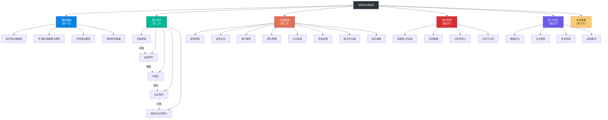
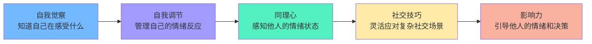
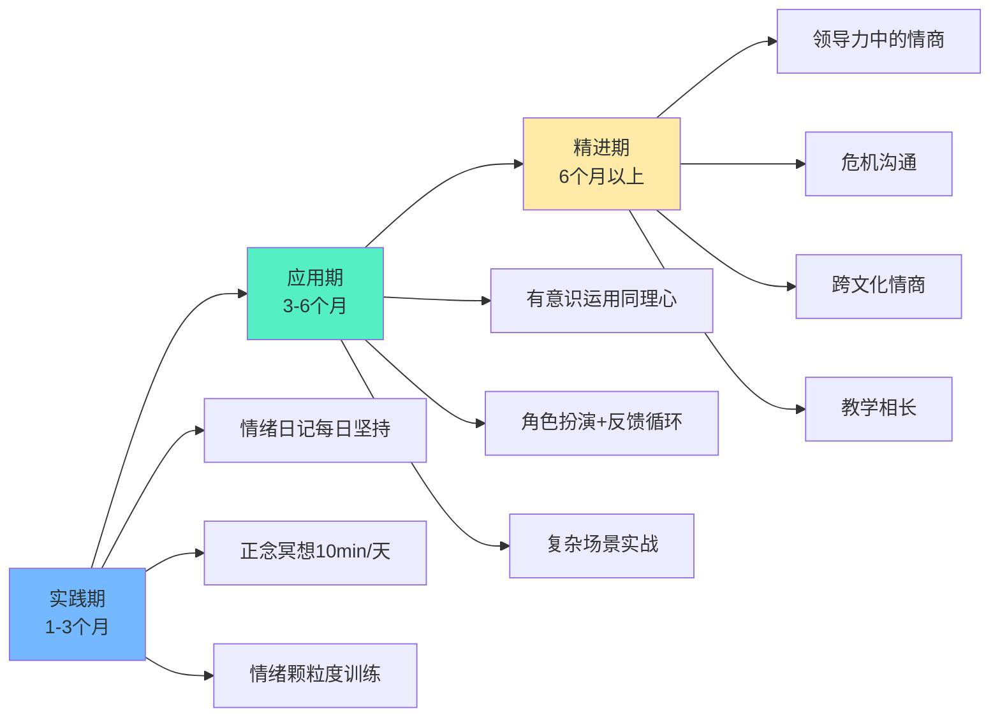

# 第十五章 本章小结

## 一、本章知识全景

本章从理论到实践，系统构建了高情商沟通的完整能力体系。以下知识地图展示了各节之间的逻辑关系——理论基础是地基，核心技巧是骨架，实战案例是血肉，常见误区是警戒线，练习方法是施工方案，深度拓展是进阶天花板。

---

## 二、各节核心要点提炼

### 2.1 第一节 理论基础——认知地基

本节回答了"情商到底是什么"这个根本问题。三个主流模型各有侧重，但共同指向同一个结论：**情商是可以被测量、被训练、被提升的能力集合，而非固定的人格特质。**

| 模型 | 提出者 | 核心维度 | 适用场景 |
|------|--------|----------|----------|
| 五维模型 | 戈尔曼 | 自我觉察、自我调节、动机、同理心、社交技巧 | 职场领导力、组织管理 |
| 能力模型 | 萨洛维 & 梅耶 | 情绪感知→情绪促进→情绪理解→情绪管理 | 学术研究、心理评估 |
| 混合模型 | 巴昂 | 5大维度15个子维度 | 综合心理评估、个人发展 |

**关键原理**：梅拉比安法则（7-38-55法则）揭示了沟通效果的真正来源——语言内容仅占7%，语调占38%，肢体语言占55%。这意味着高情商沟通的本质不是"说什么"，而是"怎么说"和"用什么状态说"。

**神经科学佐证**：杏仁核负责情绪的快速反应（"劫持"效应），前额叶皮层负责理性调控。高情商沟通的神经本质，就是前额叶对杏仁核的有效管理——不是消灭情绪反应，而是在情绪反应和理性回应之间创造一个缓冲空间。

### 2.2 第二节 核心技巧——能力骨架

五个核心技巧构成了层层递进的能力链：

**每个环节的关键工具回顾：**

| 能力维度 | 核心工具 | 日常练习频率 |
|----------|----------|-------------|
| 自我觉察 | STOP技术、情绪签到、情绪触发地图 | 每天3次情绪签到 |
| 自我调节 | 认知重评、生理调节（478呼吸法）、暂停技术 | 每次情绪波动时实践 |
| 同理心 | 情绪验证、积极倾听、换位思考三步法 | 每次对话中有意识练习 |
| 社交技巧 | "I"语言、SBI反馈模型、冲突降级四步法 | 每周至少1次刻意练习 |
| 影响力 | PREP框架、情感共鸣策略、愿景引导 | 重要场合前做准备 |

### 2.3 第三节 实战案例——场景映射

八个案例覆盖了高情商沟通最常见也最具挑战性的场景。每个案例都遵循"低情商方式→高情商方式→原理分析→可迁移策略"的结构，方便读者直接对照自己的经历。

**案例速查表：**

| 场景 | 核心挑战 | 关键技巧 | 一句话策略 |
|------|----------|----------|-----------|
| 职场冲突 | 被当众质疑 | 自我调节+非暴力表达 | 先认可再回应，用事实代替情绪 |
| 亲密关系 | 敏感话题沟通 | 同理心+情绪验证 | 先接住情绪，再讨论事情 |
| 客户服务 | 客户愤怒投诉 | 情绪降级+积极倾听 | 让客户感到被听见，问题解决事半功倍 |
| 团队管理 | 下属消极抵抗 | SBI反馈+动机激发 | 对事不对人，把批评变成成长对话 |
| 公共演讲 | 紧张怯场 | 生理调节+认知重评 | 把焦虑重新定义为兴奋 |
| 危机处理 | 突发事件舆论 | 透明沟通+情绪管理 | 快速回应、坦诚态度、给出行动方案 |
| 跨文化沟通 | 价值观差异 | 文化觉察+适应性 | 先了解对方的沟通规则，再调整自己 |
| 社交媒体 | 文字缺少语调 | 情绪意识+审慎发送 | 发送前问自己：如果当面说，我会用什么语气？ |

### 2.4 第四节 常见误区——认知纠偏

本节拆解了六个最常见的认知陷阱。以下是核心纠正：

| 误区 | 错误认知 | 正确认知 | 自检方法 |
|------|----------|----------|----------|
| 高情商=会说话 | 情商是口才技巧 | 情商是情绪智慧，口才只是表层输出 | 观察自己是否只在"表演"而非真正在意对方 |
| 压抑情绪 | 控制情绪=不表达情绪 | 健康的情绪管理是疏导而非堵塞 | 检查自己是否有身体化的压力症状（头痛、失眠） |
| 讨好所有人 | 高情商=让所有人满意 | 高情商包括健康地设立边界和说"不" | 你最近一次拒绝别人是什么时候？ |
| 天生不可变 | 情商是天赋 | 情商是可训练的神经回路 | 神经可塑性研究证实：持续练习可改变大脑结构 |
| 同理心=同意 | 理解=认同 | 理解不等于认同，可以理解但保持立场 | 你能否准确复述对方观点但仍持不同意见？ |
| 只关注他人 | 高情商=关注别人 | 自我觉察是一切的起点 | 你能否在对话中同时觉察自己和对方的状态？ |

### 2.5 第五节 练习方法——能力施工

五种核心练习方法构成了一个完整的训练体系：

**练习方法组合方案：**

| 阶段 | 时间跨度 | 主要练习 | 每日投入 | 预期效果 |
|------|----------|----------|----------|----------|
| 基础期 | 第1-4周 | 情绪日记+正念冥想（10分钟） | 15-20分钟 | 情绪觉察力显著提升 |
| 巩固期 | 第5-12周 | 情绪日记+正念+角色扮演 | 25-30分钟 | 自我调节能力明显改善 |
| 应用期 | 第13-24周 | 反馈循环+真实场景练习 | 融入日常 | 社交技巧内化为自然反应 |
| 精通期 | 第25周+ | 复杂场景挑战+教学相长 | 自然发生 | 高情商沟通成为本能 |

### 2.6 第七节 深度拓展——进阶视野

深度拓展将讨论延伸到了神经科学、积极心理学、正念科学和跨文化研究四个领域。核心收获：

- **神经科学**：情商训练本质上是在强化前额叶-杏仁核回路，每天10分钟正念练习，8周后大脑灰质密度可测量性增加（哈佛 Sara Lazar 研究）
- **积极心理学**：PERMA模型（积极情绪、投入、关系、意义、成就）与高情商沟通高度互补
- **正念科学**：正念不是"放空"，而是"有意识地注意当下"，它直接训练了情商的底层能力——注意力控制和情绪觉察
- **跨文化研究**：高情商表达存在文化差异——同一行为在不同文化中可能被解读为高情商或低情商

---

## 三、核心框架速查

### 3.1 PREP冲突应对框架

P — Pause（暂停）：在情绪涌上来的瞬间，给自己6秒钟
R — Recognize（识别）：识别自己和对方的情绪状态
E — Empathize（共情）：验证对方的感受，表达理解
P — Proceed（行动）：基于以上觉察，选择建设性的回应方式

### 3.2 SBI反馈模型

S — Situation（情境）：具体说明行为发生的时间和场景
B — Behavior（行为）：客观描述可观察的行为，不加评判
I — Impact（影响）：说明该行为对你/团队/项目的具体影响

示例：
"昨天下午的项目评审会上（S），你在没有了解背景的情况下
直接否定了我的方案（B），这让我感到自己的努力没有被尊重，
也影响了后续讨论的开放度（I）。我想和你聊聊如何更好地协作。"

### 3.3 情绪验证四步法

第一步：倾听 — 全神贯注地听，不打断，不预设
第二步：命名 — 准确描述你感知到的对方情绪
         "听起来你感到很沮丧/失望/不安……"
第三步：正常化 — 表达这种情绪的合理性
         "换作是我，我可能也会有同样的感受。"
第四步：邀请 — 给对方继续表达的空间
         "你愿意多说一些吗？我想更好地理解。"

### 3.4 非暴力沟通四要素

观察（Observation）：客观描述事实，不加评判
感受（Feeling）：表达你的真实感受
需要（Need）：说明感受背后的需求
请求（Request）：提出具体、可执行的请求

示例：
"这周你三次会议都迟到了15分钟以上（观察），
我感到有些焦虑和不被重视（感受），
因为我需要我们的协作是高效和互相尊重的（需要），
下次会议能否提前5分钟到？（请求）"

---

## 四、自我评估检查清单

完成本章学习后，用以下清单评估自己的掌握程度。每一项按1-5分自评（1=完全不了解，5=能自如运用）：

### 理论认知层面

- [ ] 能说出戈尔曼情商五维模型的五个维度（  /5）
- [ ] 理解梅拉比安法则的含义及其局限性（  /5）
- [ ] 能区分情商的能力模型和混合模型（  /5）
- [ ] 了解杏仁核劫持的神经机制（  /5）
- [ ] 理解神经可塑性与情商训练的关系（  /5）

### 技能应用层面

- [ ] 能在情绪波动时使用STOP技术（  /5）
- [ ] 能准确标注自己当下的情绪（情绪颗粒度）（  /5）
- [ ] 能识别自己的主要情绪触发点（  /5）
- [ ] 能使用"I"语言替代"You"语言（  /5）
- [ ] 能在冲突中先做情绪验证再解决问题（  /5）
- [ ] 能使用SBI模型给出建设性反馈（  /5）
- [ ] 能在倾听时做到不打断、不预设、不急于给建议（  /5）

### 误区规避层面

- [ ] 理解高情商不等于"会说话"或"讨好所有人"（  /5）
- [ ] 理解情绪管理不等于情绪压抑（  /5）
- [ ] 理解同理心不等于认同对方的观点（  /5）
- [ ] 理解情商是可训练的而非天生固定的（  /5）

**总分评估：**

| 总分区间 | 水平定位 | 建议 |
|----------|----------|------|
| 14-28分 | 初学阶段 | 重读理论基础和核心技巧，从情绪日记开始 |
| 29-42分 | 成长阶段 | 加强实战练习，多做角色扮演和反馈收集 |
| 43-56分 | 进阶阶段 | 在复杂场景中挑战自己，开始教授他人 |
| 57-70分 | 精通阶段 | 持续精进，关注跨文化和领导力层面的高阶应用 |

---

## 五、高情商沟通的核心原则

本章所有技巧和方法都建立在以下五条核心原则之上。它们不是独立的"知识点"，而是一个有机整体——缺少任何一条，高情商沟通都会失真。

**原则一：觉察先于反应**

在任何沟通中，先觉察自己和对方的情绪状态，再选择回应方式。不要被无意识的情绪反应所驱动。这条原则的神经科学依据是：杏仁核的反应速度（约12毫秒）远快于前额叶的理性分析（约数秒），如果不刻意练习觉察-暂停，你永远是在用"情绪脑"而非"理性脑"沟通。

**原则二：理解先于表达**

先真正理解对方的感受和需求，再表达自己的观点。心理学中的"互惠原则"表明：当一个人感到被深刻理解时，他会产生强烈的回报意愿——更愿意倾听你的想法，更愿意与你合作。

**原则三：接纳先于改变**

先接纳自己和他人的情绪，再寻求改变。这里的关键区分是：**接纳不等于认同**。你可以不认同对方的行为，但必须先接纳对方有这种感受的合理性。只有在被接纳的安全感中，改变才有可能发生。

**原则四：真诚先于技巧**

所有的沟通技巧都建立在真诚的基础之上。心理学研究反复证实：人类对不真诚的感知能力极其敏锐——即使你的话术完美无缺，如果内心不真诚，微表情、语调和肢体语言会泄露真相。不真诚的技巧一旦被识破，对信任的损害远大于不会说话。

**原则五：关系先于对错**

在大多数情况下，维护关系比赢得争论更重要。哈佛大学谈判项目的研究表明：在长期关系中，"赢了争论、输了关系"的净收益为负。这不是说要放弃原则，而是说要选择更聪明的方式来坚持原则。

---

## 六、21天启动计划

以下是一个具体的21天行动计划，帮助你将本章知识转化为实际行动。不需要一步到位，每天一个小练习，积累起来就是质变。

### 第一周：建立觉察基础

| 天数 | 任务 | 时间 | 具体操作 |
|------|------|------|----------|
| Day 1 | 开始情绪日记 | 10分钟 | 睡前记录今天3个情绪时刻：事件→情绪→身体反应→你的应对 |
| Day 2 | 首次正念呼吸 | 5分钟 | 找一个安静的地方，只关注呼吸，走神了就温柔地带回来 |
| Day 3 | 情绪签到练习 | 2分钟×3 | 早中晚各做一次情绪签到：我现在在感受什么？ |
| Day 4 | 识别一个触发点 | 5分钟 | 回忆最近一次情绪失控，找到背后的触发主题 |
| Day 5 | STOP技术实践 | 即时 | 下次感到情绪涌上来时，有意识地执行S-T-O-P四步 |
| Day 6 | 身体扫描 | 10分钟 | 从头到脚扫描身体，找到情绪"住"在身体的哪个部位 |
| Day 7 | 周回顾 | 15分钟 | 回顾一周的情绪日记，寻找模式和规律 |

### 第二周：练习表达与倾听

| 天数 | 任务 | 时间 | 具体操作 |
|------|------|------|----------|
| Day 8 | "I"语言练习 | 即时 | 今天的对话中，至少3次用"我感到……"替代"你总是……" |
| Day 9 | 全神贯注倾听 | 15分钟 | 找一个人聊天，全程不打断、不给建议，只做回应和确认 |
| Day 10 | 情绪验证练习 | 即时 | 当对方表达情绪时，先说出"你感到……因为……" |
| Day 11 | 正念冥想 | 10分钟 | 延长到10分钟，加入对情绪的观察而非呼吸 |
| Day 12 | SBI反馈练习 | 10分钟 | 用SBI模型写下一段你想对某人说的真实反馈 |
| Day 13 | 阅读一个实战案例 | 20分钟 | 重读第三节的一个案例，写下"如果是我会怎么做" |
| Day 14 | 周回顾 | 15分钟 | 回顾本周的练习，记录最难做到的和效果最好的 |

### 第三周：整合与挑战

| 天数 | 任务 | 时间 | 具体操作 |
|------|------|------|----------|
| Day 15 | PREP框架演练 | 15分钟 | 想象一个冲突场景，用PREP四步写一遍你的回应 |
| Day 16 | 认知重评练习 | 10分钟 | 写下3个让你不舒服的事件，为每个事件找到另一种解读 |
| Day 17 | 请求反馈 | 10分钟 | 向一个信任的人问："你觉得我在沟通中最需要改进的一点是什么？" |
| Day 18 | 复杂对话准备 | 20分钟 | 为即将到来的一个困难对话，用本章工具做沟通前准备 |
| Day 19 | 执行困难对话 | 实际 | 带着准备去执行，结束后记录：什么做得好？什么可以改进？ |
| Day 20 | 教授他人 | 15分钟 | 向一个人解释"什么是高情商沟通"——教是最好的学 |
| Day 21 | 总回顾 | 30分钟 | 重做第五节的自我评估，对比21天前的进步，制定下一阶段计划 |

---

## 七、常见问题解答

**Q：练习了很久感觉没有进步，怎么办？**

情商提升的典型曲线是"阶梯型"而非"斜坡型"——你会长期感觉停滞不前，然后突然在某个时刻意识到自己有了质的飞跃。这种现象在神经科学上有据可查：新的神经回路需要反复激活才能形成稳定的连接。建议你回看21天前的情绪日记，对比现在的情绪颗粒度和调节速度，进步往往比你感觉到的更大。

**Q：高情商沟通在面对"低情商"的人时还有用吗？**

有用，而且更关键。你无法控制别人的情商水平，但你可以控制自己的回应方式。研究显示：在一对沟通关系中，只要有一方具备较高的情绪管理能力，冲突升级的概率就降低约60%（Gottman Institute, 2019）。你不是在"对付"对方，而是在为整个对话的质量托底。

**Q：如何平衡高情商沟通和表达真实自我？**

这是一个常见的担忧，其根源在于一个误解——认为高情商沟通是"戴面具"。事实恰恰相反：高情商沟通的核心就是**更真实地表达自我**。它帮你做到的是：在不伤害关系的前提下，更准确地表达你的真实感受和需求。压抑自己的"直来直去"不是真实，那是懒于管理自己的情绪。

**Q：在紧急情况下来不及用这些框架怎么办？**

框架是训练工具，不是实战中的操作手册。通过反复练习，STOP、情绪验证、认知重评等技术会逐渐从"刻意运用"变为"自动反应"——这正是神经可塑性的力量。就像学开车：刚开始每个动作都需要刻意注意，熟练后就变成了自动化操作。

---

## 八、本章关键词表

| 术语 | 定义 | 出现节 |
|------|------|--------|
| 情商（EQ） | 识别、理解、管理自身及他人情绪的能力 | 第一节 |
| 五维模型 | 戈尔曼将情商分为自我觉察、自我调节、动机、同理心、社交技巧 | 第一节 |
| 情绪颗粒度 | 区分和命名情绪的精细程度，颗粒度越高，情绪调节能力越强 | 第二节 |
| 杏仁核劫持 | 强烈情绪导致杏仁核"接管"大脑，绕过前额叶的理性控制 | 第一节 |
| 认知重评 | 通过改变对事件的解读来改变情绪反应，是最重要的情绪调节策略之一 | 第二节 |
| 情绪触发点 | 特别容易引发强烈情绪反应的人、事、物或情境 | 第二节 |
| STOP技术 | Stop暂停→Take a breath呼吸→Observe观察→Proceed行动 | 第二节 |
| PREP框架 | Pause暂停→Recognize识别→Empathize共情→Proceed行动 | 第二节 |
| SBI模型 | Situation情境→Behavior行为→Impact影响，结构化反馈工具 | 第二节 |
| 积极倾听 | 全神贯注、不打断、不预设、通过回应确认理解的倾听方式 | 第二节 |
| 情绪验证 | 承认和接纳他人情绪的合理性，不急于评判或解决问题 | 第二节 |
| 认知扭曲 | 系统性的思维偏差，如非黑即白、灾难化、读心术等 | 第四节 |
| 成长型思维 | 相信能力可以通过努力和学习提升的思维模式 | 第一节 |
| 神经可塑性 | 大脑结构和功能可以通过经验和训练发生改变的能力 | 第七节 |
| 非暴力沟通 | 观察→感受→需要→请求的四步沟通法 | 第二节 |

---

## 九、持续学习路径

高情商沟通的学习是一段终身旅程，而非一次性课程。以下是三个阶段的发展路线图：

**实践期（1-3个月）——打地基**

重点练习自我觉察和情绪调节。这是最枯燥但最重要的阶段。每天的情绪日记和正念冥想是这个阶段的"必修课"。目标不是立刻变得"高情商"，而是建立起情绪觉察的基本能力——能实时感知自己在经历什么情绪，能识别情绪的来源，能在情绪反应和行为之间插入一个微小的暂停。

**应用期（3-6个月）——上战场**

在日常沟通中有意识地运用同理心和社交技巧。这个阶段的核心是"知行合一"——你已经知道理论，现在需要在真实的人际互动中反复练习。通过角色扮演在安全环境中犯错，通过反馈循环发现盲区，通过实战案例的对照来校准自己的判断。

**精进期（6个月以上）——化境**

将高情商沟通内化为自然习惯，开始在更复杂的场景中发挥作用——领导力情境中的情绪感染、危机中的情绪稳定、跨文化沟通中的适应性调整。这个阶段的标志是：你不再"使用技巧"，而是"成为那样的人"。更重要的是，开始向他人传授——教学相长，是最高级的学习方式。

**推荐书单：**

| 书名 | 作者 | 侧重点 | 推荐阶段 |
|------|------|--------|----------|
| 《情商》 | 丹尼尔·戈尔曼 | 情商理论全景 | 实践期 |
| 《非暴力沟通》 | 马歇尔·卢森堡 | 沟通中的情绪表达 | 实践期 |
| 《关键对话》 | 科里·帕特森 等 | 高风险对话策略 | 应用期 |
| 《情绪》 | 莉莎·费德曼·巴瑞特 | 情绪科学新认知 | 应用期 |
| 《正念的奇迹》 | 一行禅师 | 正念冥想入门 | 实践期 |
| 《影响力》 | 罗伯特·西奥迪尼 | 社交技巧与说服力 | 精进期 |

---

## 十、写在最后

每一次沟通都是一次练习的机会，每一次情绪波动都是一次成长的契机。高情商沟通不是目的地，而是一段持续成长的旅程。

你不需要完美——你需要的是觉察。觉察自己此刻在感受什么，觉察对方此刻需要什么，觉察此刻的对话正在走向何方。从这三个觉察开始，其他一切技巧都会自然生长。

记住：**真正的情商高手，不是从不犯错的人，而是在犯错之后能快速觉察、坦诚修复、持续精进的人。**

本章的学习到此结束，但你的高情商沟通之旅才刚刚开始。
