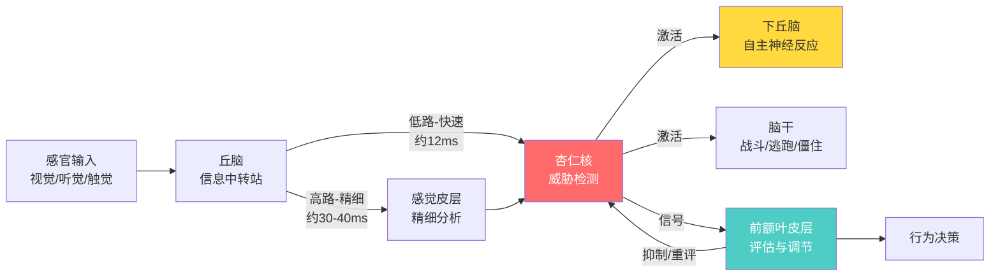
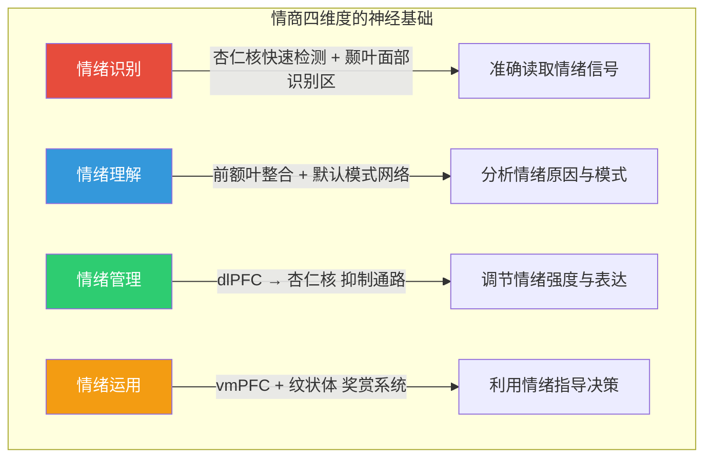
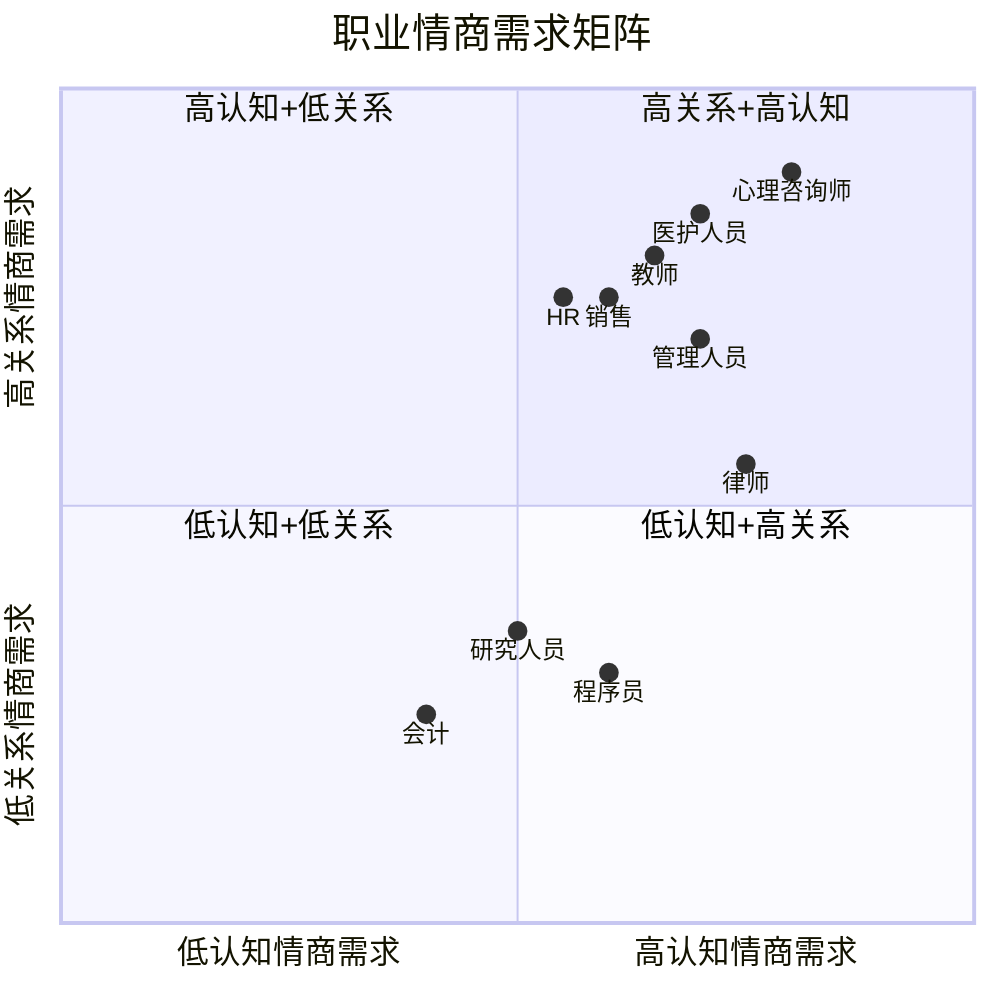
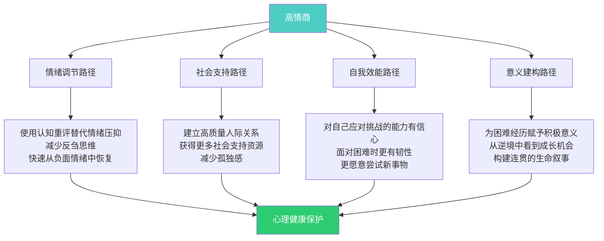

# 高情商沟通 — 深度拓展

> 本章深度拓展将从神经科学、心理学和跨文化视角深入探讨情商的本质与应用。我们将首先考察情商的神经科学基础，分析杏仁核与前额叶在情绪处理中的关键作用；然后回顾情商训练的长期效果研究，探讨情商在不同职业中的差异化重要性；接着分析情商与心理健康的深层关系，以及文化对情商概念的塑造；最后揭示情商的"黑暗面"——高情商可能带来的负面影响。

本章面向希望深入理解情商底层机制的读者。如果你已经掌握了前几章的实操技巧，这里将帮助你理解"为什么这些技巧有效"，以及"在什么条件下它们可能失效"。

---

## 一、情商的神经科学基础（杏仁核与前额叶）

情商不是玄学，它有清晰的神经解剖学基础。理解大脑如何处理情绪，能帮助我们更精准地训练情商——知道在哪个环节发力，比盲目练习高效十倍。

### 1.1 情绪处理的脑区基础

理解情商的神经科学基础，需要首先了解大脑中负责情绪处理的关键结构。下图展示了情绪信息在大脑中的主要处理通路：

**杏仁核（Amygdala）**：杏仁核是大脑颞叶深处的一对杏仁形结构，体积约一颗葡萄大小（每侧约1cm³），却是情绪处理系统的核心枢纽。杏仁核的主要功能包括：

- **威胁检测**：杏仁核是一个快速的威胁检测系统，能够在意识觉察之前对潜在威胁做出反应。Joseph LeDoux的研究表明，感官信息通过两条通路到达杏仁核——一条快速的"低路"（直接从丘脑到杏仁核，约12毫秒）和一条较慢的"高路"（经过皮层处理后到达杏仁核，约30-40毫秒）。"低路"使我们能够在意识到危险之前就启动防御反应。这就是为什么你在深夜听到异响时，身体会先僵住或跳起来，然后才意识到"可能只是猫"——杏仁核的反应比你的理性思考快了近20毫秒。

- **情绪记忆**：杏仁核在情绪性记忆的形成和储存中发挥关键作用。它通过调控海马体（hippocampus）的记忆编码过程，使情绪强烈的经历获得更深的记忆烙印。这就是为什么情绪强烈的经历（如创伤事件、第一次恋爱、当众出丑）比平淡的经历更容易被记住。James McGaugh的实验表明，注射肾上腺素（模拟情绪唤醒）能显著增强大鼠的记忆保留，而损毁杏仁核则消除这一效应。

- **恐惧条件化**：杏仁核是经典恐惧条件化的核心结构。通过恐惧条件化，我们学会将中性刺激与威胁关联起来，形成恐惧反应。这种学习非常迅速——通常一次配对就能形成——而且极其持久。这解释了为什么童年时期的一次当众演讲失败，可能在成年后仍然引发强烈的演讲焦虑。

- **社会信号检测**：杏仁核不仅处理恐惧信号，还参与处理面部表情中的社会信息。Adolphs等人的研究表明，杏仁核受损的患者（如S.M.案例）无法从他人面部识别恐惧情绪，也无法准确判断他人的可信度。

**前额叶皮层（Prefrontal Cortex, PFC）**：前额叶皮层是大脑最前端的区域，占大脑皮层总面积的约29%，被称为"大脑的CEO"。它是人类大脑中最后成熟的区域——要到25岁左右才完全发育完成，这解释了为什么青少年的情绪调节能力普遍较弱。在情绪处理中，前额叶皮层的关键功能包括：

- **情绪调节**：前额叶皮层对杏仁核具有"自上而下"的调节作用，能够抑制不合适的情绪反应。腹内侧前额叶皮层（vmPFC）负责情绪价值的评估和消退学习（extinction learning），背外侧前额叶皮层（dlPFC）负责认知重评等主动调节策略。简单来说，vmPFC帮助你"这其实没那么危险"，dlPFC帮助你"换个角度想这件事"。

- **执行功能**：前额叶皮层支持计划、决策、工作记忆等高级认知功能。在情绪情境中，这些功能帮助你在冲动反应和理性选择之间按下"暂停键"。工作记忆能力越强，你越能在情绪激动时保持"在线"状态，而不是被情绪劫持。

- **心理理论（Theory of Mind）**：前额叶皮层（特别是内侧前额叶皮层，mPFC）参与心理理论的加工，即理解他人心理状态的能力。这是共情的认知基础——你需要先推断"他现在可能在想什么"，才能理解"他现在的感受是什么"。

### 1.2 杏仁核-前额叶回路与情商

情商的核心在于情绪的识别、理解、管理和运用，这些能力在很大程度上依赖于杏仁核与前额叶皮层之间的互动回路。可以用一个简单的比喻来理解：杏仁核是"火警报警器"，前额叶皮层是"消防指挥中心"。情商高的人，不是报警器不响（那叫麻木），而是指挥中心能快速、准确地判断"这是真火还是烤面包"，并做出恰当反应。

**情绪识别**：情绪识别需要杏仁核快速检测情绪刺激，同时需要前额叶皮层进行精细的情绪分类和理解。研究表明，高情商个体的杏仁核对情绪刺激的反应更加精细和准确——他们不仅能检测到"这个人不高兴"，还能区分"这是失望、愤怒还是悲伤"。fMRI研究显示，高情商个体在观看情绪面孔时，杏仁核与梭状回面孔区（FFA）的功能连接更强，说明他们的大脑更善于将面部特征编码为情绪信息。

**情绪调节**：情绪调节的关键在于前额叶皮层对杏仁核反应的调控。这就像一个跷跷板：前额叶活动升高，杏仁核活动就下降。神经影像学研究发现，成功的情绪调节（如认知重评）伴随着前额叶皮层活动的增加和杏仁核活动的减少。高情商个体通常表现出更强的前额叶-杏仁核功能连接，这意味着他们的"指挥中心"和"报警器"之间有更快、更稳定的通信线路。

一个关键发现是：情绪调节能力差的人，不是前额叶"不想"管杏仁核，而是两者之间的"通信线路"不够畅通。好消息是，这条线路可以通过训练来加强。

**情绪决策**：Antonio Damasio的躯体标记假说（Somatic Marker Hypothesis）指出，情绪在决策中发挥重要作用。Damasio研究了前额叶腹内侧区域（vmPFC）受损的患者——他们的智商和逻辑推理能力完好无损，但在现实生活中做出的决策却灾难性地糟糕（如糟糕的投资、破裂的人际关系）。原因在于，他们丧失了"直觉"——那种"感觉不对劲"的身体信号。前额叶皮层整合来自杏仁核等情绪中枢的信号，帮助我们做出"直觉"但通常是正确的决策。情商高的人更善于利用这种情绪信息来指导决策，而不是要么完全依赖情绪（冲动），要么完全压制情绪（冷漠）。

### 1.3 神经可塑性与情商训练

大脑具有神经可塑性——通过经验和训练，神经回路可以被重塑和优化。伦敦出租车司机的经典研究发现，他们经过数年的"知识"学习（记忆伦敦的街道网络）后，海马体（负责空间记忆的区域）显著增大。同样的原理适用于情商：你的情绪脑区可以通过训练发生物理性的改变。

| 训练方式 | 受影响的脑区 | 神经变化 | 效果量 | 训练周期 |
|---------|------------|---------|-------|---------|
| 正念冥想 | 前额叶皮层、杏仁核、岛叶 | PFC厚度增加，杏仁核体积减小 | 中等偏大（d≈0.5-0.7） | 8周以上 |
| 认知行为疗法 | dlPFC、vmPFC、杏仁核 | PFC活动增加，杏仁核反应性降低 | 中等（d≈0.4-0.6） | 12-20次 |
| 社交技能训练 | mPFC、颞顶联合区（TPJ） | 社会认知脑区活动模式优化 | 中等（d≈0.3-0.5） | 8-12周 |
| 情绪标注练习 | 右腹外侧前额叶（rvlPFC） | 情绪标注时PFC激活增强，杏仁核活动下降 | 小到中等（d≈0.3-0.5） | 数次练习 |
| 感恩练习 | 前扣带回、mPFC | 积极情绪相关脑区活动增强 | 小到中等（d≈0.2-0.4） | 3周以上 |

**正念冥想的神经效应**：正念冥想是提升情商的有效训练方法，也是目前神经科学研究最充分的训练方式。哈佛大学Sara Lazar团队的研究发现，仅8周的正念减压训练（MBSR）就能导致参与者大脑结构的变化：前额叶皮层厚度增加（与注意力控制和情绪调节相关），海马体灰质密度增加（与学习和记忆相关），杏仁核灰质密度降低（与焦虑和压力反应减少相关）。这些变化与参与者自我报告的压力减轻程度高度相关。

正念冥想的核心机制是：通过反复练习"注意到走神→把注意力拉回当下"，你实际上在加强前额叶对注意力和情绪反应的调控能力。这就像反复做"大脑俯卧撑"——每一次"注意到走神并拉回来"，就是一次前额叶-杏仁核连接的强化练习。

**认知行为疗法的神经效应**：认知行为疗法（CBT）通过改变思维模式来调节情绪。神经影像学研究发现，成功的CBT治疗伴随着前额叶皮层活动的增加和杏仁核反应性的降低，支持了"自上而下"的情绪调节模型。有趣的是，CBT和药物治疗（如SSRIs）虽然作用路径不同（一个通过思维，一个通过化学），但最终达到的大脑变化模式相似——都降低了杏仁核的过度反应性。这说明，"改变想法"和"改变化学"在大脑层面可以达到类似的效果。

### 1.4 神经递质与情绪

情商不仅涉及脑区结构，还与神经化学密切相关。以下四种神经递质系统对情绪处理至关重要：

**血清素（Serotonin）**：血清素系统与情绪稳定性密切相关，被称为"情绪的恒温器"。血清素水平低与抑郁、焦虑和冲动行为相关。选择性血清素再摄取抑制剂（SSRIs，如百忧解/氟西汀）通过提高突触间隙的血清素浓度来治疗抑郁症。值得注意的是，血清素系统与社会地位感知有关——猴子研究显示，低社会地位个体的血清素水平显著低于高社会地位个体，这可能部分解释了为什么社会地位低下与情绪问题相关。

**多巴胺（Dopamine）**：多巴胺系统与奖赏、动机和积极情绪相关。多巴胺不是"快乐分子"，而是"期待分子"——它驱动的是"追求奖赏的动机"，而非奖赏本身。社交互动本身就能激活多巴胺奖赏系统，这解释了为什么孤立会让人"提不起劲"。在情商的语境下，多巴胺系统帮助你从社交互动中获得正反馈，从而激励你继续投入社交努力。

**催产素（Oxytocin）**：催产素被称为"爱的激素"或"信任激素"，在社会联结、共情和信任中发挥重要作用。鼻腔喷雾催产素的研究表明，催产素可以增强个体的共情能力和社交敏感度——参与者更善于从他人的眼神中读取情绪，更愿意信任陌生人。但催产素的作用是"群体选择性的"：它增强对内群体成员的共情和信任，但可能增加对外群体的敌意和不信任。这意味着催产素不是纯粹的"善意分子"，而是"部落忠诚分子"。

**皮质醇（Cortisol）**：皮质醇是主要的应激激素，由肾上腺皮质分泌。急性皮质醇升高是正常的压力反应（帮你应对眼前的挑战），但长期高水平的皮质醇与情绪调节困难、记忆障碍、免疫功能下降和前额叶萎缩相关。慢性压力导致的皮质醇持续升高，实际上会"烧坏"前额叶对杏仁核的调控线路——这就是为什么长期压力大的人会变得越来越容易情绪失控。这形成了一个恶性循环：压力→皮质醇升高→前额叶功能下降→情绪调节能力下降→更多压力。打破这个循环的最有效方法之一，就是规律的正念冥想或体育锻炼——两者都被证实能有效降低基线皮质醇水平。

---

## 二、情商训练的长期效果研究

情商能不能训练？如果能，效果能持续多久？这是过去20年情商研究中最核心的问题之一。答案是：能训练，但有条件。

### 2.1 情商训练的主要方法

情商训练并非单一技术，而是一套多层次的方法体系。不同的训练方法针对情商的不同维度，有效的训练项目通常会组合多种方法：

**情绪识别训练**：通过练习识别自己和他人的情绪信号（面部表情、语调、肢体语言），提升情绪觉察能力。具体方法包括：

- **情绪卡片练习**：使用Paul Ekman开发的微表情训练工具（METT），练习识别七种基本情绪的细微面部特征。研究显示，仅1小时的METT训练就能显著提升面部表情识别准确率。
- **视频分析**：观看无声电影片段，猜测角色的情绪状态和情绪变化，然后对照字幕验证。
- **情绪日记**：每天记录3-5个情绪时刻，包括触发事件、情绪类型、情绪强度（1-10分）和身体感受。持续4周后，情绪觉察能力通常会有显著提升。
- **身体扫描**：定期扫描身体感受，识别情绪在身体中的"位置"（如焦虑时胸口发紧，愤怒时太阳穴跳动）。这能帮助你在情绪升级前就觉察到它。

**情绪调节训练**：教授和练习情绪调节策略。核心策略包括：

- **认知重评（Cognitive Reappraisal）**：通过改变对情境的认知解释来调节情绪反应。例如，将"面试失败=我不行"重评为"面试失败=这次没匹配上，但我积累了经验"。这是研究证实最有效的情绪调节策略之一——它不仅降低负面情绪，还不损害记忆和社交功能（而情绪压抑会损害这两者）。
- **情绪标注（Affect Labeling）**：用语言精确描述自己的情绪状态。UCLA的Matthew Lieberman发现，当你把情绪"说出来"时（如"我现在感到焦虑"），杏仁核活动会显著下降，前额叶活动上升。这个简单到令人难以置信的策略——仅仅是给情绪"贴标签"——就能激活大脑的情绪调节回路。
- **正念观察**：不评判地觉察情绪的来去，就像站在河边看水流过。核心原则是"情绪不是你，你不是情绪"——情绪是暂时的心理事件，而非身份标签。
- **深呼吸与渐进性肌肉放松**：通过激活副交感神经系统，降低生理唤醒水平。4-7-8呼吸法（吸气4秒，屏气7秒，呼气8秒）被证实能在60秒内降低心率和皮质醇水平。

**社交技能训练**：通过角色扮演、行为排练、反馈指导等方式，提升沟通、冲突解决、团队合作等社交技能。有效的社交技能训练遵循"示范→练习→反馈→再练习"的循环。

**自我意识训练**：通过反思练习、360度反馈、心理测评等方式，提升对自身情绪模式、优势和局限的觉察。一个有效的练习是"情绪触发器清单"——列出最能引发你强烈情绪的10个场景，分析每个触发器背后的深层需求或恐惧。

**共情训练**：通过视角采择练习、故事分享、志愿服务等方式，提升对他人情感和观点的理解能力。一个核心练习是"如果你是他"——在争论中暂停，花2分钟认真思考"如果我是对方，处于他的处境、带着他的经历，我会怎么想、怎么感受？"

### 2.2 情商训练的长期效果证据

**学校情境中的情商训练**：

CASEL（Collaborative for Academic, Social, and Emotional Learning）对213项学校情商教育项目、涉及超过27万名学生的元分析发现，情商训练产生了显著的积极效果：

- 学生的社交情绪技能提升（效应量d=0.57）——这意味着接受训练的学生在社交情绪技能上超过了约72%的未接受训练的学生
- 学生对自我和学校的态度改善（d=0.23）
- 学业成绩提升（d=0.27）——这个发现意义重大：情商训练不仅提升了社交能力，还提升了认知表现
- 行为问题减少（d=0.22）
- 情绪困扰减少（d=0.24）

更重要的是，这些效果在训练结束后至少持续了6个月，部分研究追踪到数年后仍有显著效果。一项追踪研究发现，接受过系统情商教育的学生在18年后的犯罪率、药物滥用率和心理健康问题发生率都显著低于对照组。

**工作场所中的情商训练**：

工作场所情商训练的研究显示：

- 参与者的领导力效能显著提升（一项对42个组织的研究显示，情商训练后领导力评估分数平均提升12%）
- 团队合作和沟通质量改善（团队冲突事件减少约25%）
- 员工满意度和组织承诺提高
- 工作压力和倦怠感降低

一项对管理者情商训练的纵向研究发现，训练效果在12-18个月后仍然显著，但效果量有所下降（从d≈0.6降至d≈0.3），提示需要持续的强化和实践。这就像健身——停练后肌肉会慢慢萎缩，但比从零开始容易恢复。

**心理治疗中的情商培养**：

许多心理治疗方法都涉及情商能力的培养：

- **辩证行为疗法（DBT）**：Marsha Linehan开发，专门训练情绪调节技能，包含正念、情绪调节、人际效能和痛苦耐受四个模块。DBT对边缘型人格障碍有显著疗效（自伤行为减少约50%），也被广泛应用于其他情绪调节困难。
- **情绪聚焦疗法（EFT）**：帮助个体更好地识别和表达情绪，核心理念是"情绪改变情绪"——用适应性情绪（如悲伤背后的自我关怀）替代非适应性情绪（如无价值感）。
- **正念认知疗法（MBCT）**：结合正念和认知疗法，预防抑郁复发。MBCT将抑郁复发率从约78%降低到约36%——效果堪比抗抑郁药物。

### 2.3 影响情商训练效果的因素

情商训练不是万能的，其效果受多种因素影响。了解这些因素，能帮助你设计或选择最有效的训练方案：

**训练强度和持续时间**：研究表明，持续时间较长（至少8周）、训练频率适当（每周2-3次，每次30-60分钟）的项目效果更好。短期的单次培训效果有限——你不会指望去一次健身房就练出六块腹肌，情商训练也是一样。

**训练内容的相关性**：训练内容与参与者实际生活和工作情境的关联度越高，训练效果越好。纯粹的理论讲授效果远不如情境化的角色扮演和案例讨论。

**实践机会**：提供充分的实践机会，让参与者在真实情境中练习和应用所学技能，是训练成功的关键。最佳比例是"学一练三"——每学一个新技能，至少在三个不同情境中练习。

**组织支持**：工作场所情商训练的效果受到组织文化的影响。如果领导层不支持、不示范情商行为，员工层面的训练效果会大打折扣。

**个体差异**：训练效果因个体差异而异。基线情商水平、人格特质（如开放性高的人进步更快）、学习动机、心理韧性等因素都会影响训练效果。

### 2.4 情商训练的批判性反思

尽管情商训练的整体效果是积极的，但也需要保持批判性的视角，避免将情商训练"神话化"：

**效果的持久性问题**：一些研究发现，情商训练的短期效果显著，但长期效果可能衰减。持续效果需要持续实践——将训练变成生活方式的一部分，而非一次性课程。

**测量方法的局限**：情商的测量方法仍在发展中。目前主要有两类测量：能力型（如MSCEIT，测试你实际的情绪能力）和自我报告型（如EQ-i，测试你认为自己有多少情商）。两类测量的相关性不高（r≈0.2），说明"觉得自己情商高"和"实际情商高"可能是两回事。自我报告式的情商量表可能存在社会期望偏差——人们倾向于高估自己的情商。

**情境依赖性**：情商的表现具有情境依赖性。你在工作中可能情绪管理得很好，但在家庭冲突中可能完全失控。训练中学到的技能可能不容易自动迁移到新的情境中——你需要有意识地在不同场景中练习。

**过度简化的风险**：将复杂的社会情绪能力简化为可训练的"技能"，可能忽视了情商的深层心理基础——如早期依恋经历、人格结构、文化背景等。情商训练是有效的工具，但不是所有问题的解药。

---

## 三、情商在不同职业中的重要性比较

### 3.1 情商与领导力

情商是领导力的重要预测指标。Daniel Goleman在1998年发表于《哈佛商业评论》的经典研究发现，高层管理者的成功约90%可以归因于情商而非认知能力——这一数据虽常被引用但也常被误读：它不是说认知能力不重要，而是说当认知能力达到一定门槛后，区分优秀领导者和普通领导者的关键因素是情商。

领导力中的情商体现在四个维度：

| 维度 | 核心能力 | 行为表现 | 缺失后果 |
|-----|---------|---------|---------|
| 自我意识 | 情绪觉察、准确自我评估、自信 | 知道自己何时情绪波动，了解自己的盲区 | 盲目决策，无法接受反馈 |
| 自我管理 | 情绪自控、适应力、成就导向、乐观 | 压力下保持冷静，对变化灵活应对 | 情绪化决策，团队士气低落 |
| 社会意识 | 共情、组织敏感度、服务导向 | 理解团队成员需求，感知组织氛围 | 脱离团队，决策脱离实际 |
| 关系管理 | 影响力、教练辅导、冲突管理、团队领导 | 激励他人，建设性处理分歧 | 人才流失，团队内耗 |

Goleman的研究识别了六种领导风格，其中四种被认为是"情商密集型"且最为有效的：

- **权威型**：用愿景激励团队，给予自主空间。在需要变革时最为有效。
- **民主型**：通过参与和共识来领导。在需要团队智慧时有效，但紧急情况下可能效率低下。
- **辅导型**：关注下属的个人发展。在培养人才时最为有效。
- **亲和型**：以情感联结为先。在修复团队信任时有效，但过度使用可能导致标准降低。

最佳领导者不是只用一种风格，而是根据情境灵活切换——这本身就是一种高情商的表现。

### 3.2 不同职业的情商需求比较

情商对所有职业都有价值，但不同职业对情商的需求程度和侧重维度有显著差异：

**高情商需求职业**：

- **医护人员**：需要高水平的共情能力来理解患者的痛苦，同时需要情绪调节能力来应对工作中的情感消耗。研究表明，医生的共情能力与患者的治疗依从性正相关（r=0.29）和满意度正相关（r=0.51）。但医护人员也是"共情疲劳"的高危群体——过度共情可能导致职业倦怠和离职。

- **教师**：教育工作本质上是社会情绪性的。教师需要识别和回应学生的情绪需求，管理课堂氛围，处理师生关系。研究表明，教师的情商与学生的学习动机（r=0.35）和课堂表现正相关（r=0.28）。一个高情商的教师能够创造"心理安全"的课堂环境——学生敢于提问、犯错和表达不同意见。

- **销售与客户服务**：成功的销售人员需要敏锐地感知客户的情绪和需求，建立信任关系，有效管理自己的情绪以应对拒绝和压力。研究显示，顶尖销售人员的情商得分比普通销售人员高约20-30%。核心差异在于：顶尖销售人员能够在被拒绝后快速恢复情绪（情绪弹性），并且能够准确感知客户未说出口的需求（社会敏感度）。

- **心理咨询与治疗**：心理咨询师需要极高的共情能力和情绪觉察能力，同时需要良好的情绪边界管理能力。治疗师的情商直接影响治疗联盟的质量——而治疗联盟是预测治疗效果的最强单一因素（r=0.28，超过特定治疗技术的效果）。

**中等情商需求职业**：

- **管理人员**：各级管理人员都需要一定水平的情商来管理团队和处理人际关系。一线管理者更需要关系管理能力，高层管理者更需要社会意识（感知组织氛围和政治动态）。
- **人力资源**：HR工作涉及招聘、培训、冲突调解等，需要较强的人际敏感度和情绪调节能力。
- **律师**：虽然法律工作强调逻辑和分析，但诉讼律师需要理解法官和陪审团的情绪，非诉讼律师需要良好的谈判和沟通技能。研究发现，律师的情商得分与客户满意度和案件和解率正相关。

**相对低情商需求职业**：

- **程序员/工程师**：虽然团队协作需要情商，但技术工作更侧重于逻辑和技术能力。然而，随着敏捷开发和团队协作的普及，IT行业对情商的重视程度在显著提高——特别是代码审查中的反馈沟通、跨团队协作和技术领导力方面。
- **会计/审计**：这些工作更强调精确性和合规性，虽然人际沟通仍然重要，但情商需求相对较低。
- **研究人员**：科研工作主要依赖认知能力和创造力，虽然学术合作需要情商，但个体研究工作中情商的直接作用相对有限。

### 3.3 情商需求的时代变化

值得注意的是，随着自动化和人工智能的发展，情商在职业中的重要性正在发生结构性变化。麦肯锡2017年的研究预测，到2030年，全球将有4-8亿个工作岗位被自动化取代，但需要社交情感技能的工作需求将增长约26%。

世界经济论坛（WEF）的《未来就业报告》将情商列为2025年最重要的十大工作技能之一。这反映了在全球化、数字化和自动化趋势下，情商作为人类独特优势的地位日益突出。

一个有趣的悖论是：AI越强大，人类的情商就越值钱。因为AI可以完成越来越多的认知任务，但理解和回应人类情感、建立信任关系、在复杂社交情境中导航——这些仍然是人类的专属领域。未来的"铁饭碗"不是某种技术技能，而是深度的人际连接能力。

---

## 四、情商与心理健康的关系

情商与心理健康的关系不是简单的"情商高就心理健康"，而是一个多路径的复杂系统。理解这些路径，能帮助你更有针对性地利用情商来维护心理健康。

### 4.1 情商与心理健康的研究证据

大量研究证实了情商与心理健康之间的密切关系：

**情商与抑郁**：多项元分析研究（总计涵盖超过200项研究）发现，情商与抑郁症状呈显著负相关（r≈-0.35至-0.45）。高情商个体更善于识别和调节负面情绪，较少陷入抑郁。情绪调节能力——特别是认知重评能力——被认为是情商保护心理健康的最重要机制。

**情商与焦虑**：情商与焦虑症状呈负相关（r≈-0.30至-0.40）。高情商个体对情绪刺激的威胁评估更加灵活，更善于使用适应性的情绪调节策略来管理焦虑。关键机制是：高情商个体不容易将模糊的不确定感灾难化为"一定会出大问题"。

**情商与压力应对**：高情商个体更善于采用问题导向的应对策略（如寻求支持、制定计划、拆分任务），而非情绪导向的应对策略（如逃避、否认、自我麻痹）。Richard Lazarus的压力应对模型指出，压力的影响不取决于事件本身，而取决于你对事件的评估和应对方式——而情商直接影响这两个环节。

**情商与自尊**：情商与自尊呈正相关（r≈0.35）。高情商个体对自己有更准确和积极的评价，这种积极的自我概念是心理健康的重要保护因素。

**情商与生活满意度**：研究表明，情商是生活满意度的重要预测指标，其预测力甚至超过人格特质和收入水平。原因可能是：高情商个体不仅能获得更多积极的社交体验，还能更好地应对负面事件——两个方向都在推动生活满意度。

### 4.2 情商保护心理健康的四条路径

**路径一：情绪调节**：高情商个体更善于调节负面情绪，避免情绪失控。他们更倾向于使用认知重评等适应性策略，而非压抑等非适应性策略。James Gross的情绪调节研究表明，习惯使用认知重评的人，比习惯使用情绪压抑的人有更好的心理健康、更亲密的人际关系和更高的幸福感。

**路径二：社会支持**：高情商个体通常拥有更好的人际关系，能够获得更多的社会支持。社会支持是心理健康的重要保护因素——研究显示，感知到的社会支持对心理健康的保护作用，甚至超过实际收到的支持量。也就是说，"感到有人支持你"比"实际有多少人支持你"更重要。

**路径三：自我效能感**：高情商个体对自己应对挑战的能力有更强的信心。Albert Bandura的自我效能理论指出，自我效能感高的人更愿意面对挑战、更有韧性、更不容易被失败击垮。情商通过两个途径提升自我效能：一是成功的情绪调节经验增强了"我能管理自己"的信心，二是良好的人际关系提供了"有人帮我"的安全感。

**路径四：意义建构**：高情商个体更善于为困难经历赋予积极的意义。Viktor Frankl在《活出意义来》中指出，人可以在任何处境中找到意义——而寻找意义本身就需要情绪觉察和调节能力。高情商的人更能在痛苦中看到成长，在失去中看到珍惜，在失败中看到教训。

### 4.3 情商作为心理干预的目标

鉴于情商与心理健康的密切关系，许多心理干预方法都将提升情商作为重要目标：

**辩证行为疗法（DBT）**：DBT包含四个技能模块，其中三个直接涉及情商能力——正念（情绪觉察）、情绪调节和人际效能。第四个模块"痛苦耐受"虽然不直接是情商，但它是情绪调节的前提——在你学会调节情绪之前，你需要先学会"在情绪风暴中不做出破坏性行为"。

**社会情绪学习（SEL）项目**：学校中的SEL项目通过系统的情绪教育，预防青少年的心理健康问题。CASEL的追踪研究表明，接受SEL教育的学生在成年后的心理健康问题发生率、犯罪率和药物滥用率都显著低于对照组。

**情商教练**：个性化的情商教练通过一对一的指导，帮助个体提升特定的情商能力。这通常包括：情商评估→识别发展领域→制定个性化计划→定期练习和反馈→效果评估。效果通常在3-6个月后开始显现。

### 4.4 低情商与心理健康风险

低情商，特别是情绪调节能力的不足，与多种心理健康问题密切相关：

- **边缘型人格障碍（BPD）**：核心特征之一就是情绪调节困难——情绪反应极端、波动剧烈、恢复缓慢。DBT的开发正是为了专门训练BPD患者的情绪调节技能。
- **冲动控制障碍**：与情绪觉察和调节能力的缺陷有关。当你无法识别"我现在的感受"，就更容易用冲动行为来释放情绪压力。
- **物质滥用**：可能部分源于用药物或酒精来"自我治疗"情绪调节困难。研究显示，约50-60%的物质滥用者同时存在情绪调节障碍。
- **慢性愤怒和攻击行为**：与情商缺陷相关，特别是情绪觉察（不知道自己在生气直到爆发）和情绪调节（知道在生气但无法控制）的缺陷。

一个重要的临床发现是：许多心理健康问题的核心不是"情绪太多"，而是"不知道如何与情绪相处"。情商训练不是让情绪消失，而是让你学会与情绪共处——这正是心理治疗的核心目标之一。

---

## 五、文化对情商概念的影响

情商不是一个"放之四海而皆准"的概念——不同文化对"好的情绪管理"有不同的定义。忽视这一点，可能导致将某种文化的标准强加于另一种文化。

### 5.1 情商概念的文化嵌入性

情商概念本身是文化建构的产物。"情商"这个术语虽然在1990年由美国心理学家Peter Salovey和John Mayer正式提出，但对情绪智慧的关注在东西方文化中都有悠久的历史：

- **西方传统**：从亚里士多德的"恰当的情感"（在恰当的时间、对恰当的对象、以恰当的方式表达恰当程度的情感），到斯多葛学派的情绪控制，西方传统更强调个人对情绪的自主管理。
- **东方传统**：从儒家的"中庸之道"（喜怒哀乐之未发谓之中，发而皆中节谓之和），到佛教的"正念"（不评判地觉察情绪），到道家的"无为"（不对抗情绪的自然流动），东方传统更强调与情绪和谐共处、在社会关系中保持平衡。

**西方文化中的情商**：西方文化（特别是北美文化）倾向于将情商理解为个人的心理资源，强调情绪的自我觉察、自我表达和个人情绪管理。在西方文化中，情绪被理解为个体内在的心理状态，情商是个人能力的体现。积极情绪的表达被视为健康和自信的标志。

**东方文化中的情商**：东方文化（特别是儒家文化圈）更强调情绪的社会性和关系性。情商不仅关乎个人的情绪能力，更关乎在社会关系中保持和谐的能力。在中国文化中，"面子管理"和"关系维护"是情商的重要组成部分——有时"不表达情绪"比"表达情绪"需要更高的情商。日本文化中的"读空气"（空気を読む）——不需要明说就能理解社交场合的氛围和期望——是一种典型的东方情商表现。

### 5.2 文化差异对情商表现的影响

**情绪表达规则**：不同文化有不同的"情绪表达规则"（Display Rules），即在特定社会情境下应该如何表达或隐藏情绪。Paul Ekman的跨文化研究发现：

| 维度 | 日本文化 | 美国文化 | 中国文化 |
|-----|---------|---------|---------|
| 积极情绪表达 | 在公共场合适度克制 | 鼓励开放表达 | 视场合而定 |
| 消极情绪表达 | 高度抑制，维护和谐 | 相对开放，鼓励表达 | 强烈抑制，保全面子 |
| 情绪个体主义 | 情绪是社会关系的一部分 | 情绪是个人内在状态 | 情绪受情境和关系调节 |
| 理想情绪状态 | 平静、安宁（静） | 积极、热情（乐） | 和谐、从容（和） |
| 高情商标志 | 不给他人添麻烦 | 坦诚表达自我 | 懂事、知进退 |

**共情的文化差异**：虽然共情是一种普遍的人类能力，但其表现方式受文化影响。集体主义文化中的共情更多地指向内群体成员（家人、朋友、同胞），共情的表达方式更含蓄、间接。个人主义文化中的共情可能更广泛但可能较浅——对陌生人的共情可能更容易被激发，但深度联结可能更少。

**情绪调节策略的文化差异**：研究表明，东亚文化更倾向于使用接纳和忍耐的情绪调节策略（"忍一时风平浪静"），而西方文化更倾向于使用认知重评和主动改变的策略（"改变你的想法就能改变你的感受"）。两种策略各有优劣——过度忍耐可能导致情绪压抑和躯体化，过度改变可能导致忽视合理的负面情绪信号。

### 5.3 文化适应与情商

在全球化背景下，跨文化情商（Cross-cultural Emotional Intelligence）的概念日益重要。跨文化情商不仅包括理解和管理自身情绪的能力，还包括理解和适应不同文化情绪规则的能力。

**文化情绪智力的四个层次**：

1. **认知层**：了解不同文化的情绪表达规则和期望（知识层面）
2. **感知层**：能够在不同文化情境中准确解读情绪信号（觉察层面）
3. **行为层**：灵活调整自己的情绪表达和管理方式以适应不同文化（技能层面）
4. **整合层**：在跨文化互动中保持情绪稳定性和适应性，同时保持文化身份的完整性（身份层面）

一个常见的跨文化情商挑战是：在异文化中生活或工作的人，可能在"融入当地文化的情绪规则"和"保持自己文化的情绪身份"之间感到撕裂。高情商的跨文化适应不是完全放弃自己的文化，也不是完全拒绝当地文化，而是找到一种"第三空间"——在不同文化之间灵活切换，同时保持核心的自我。

### 5.4 情商量表的文化适应性

目前广泛使用的情商量表（如MSCEIT、EQ-i等）主要基于西方文化背景开发，其在非西方文化中的适用性受到质疑：

- 情绪识别测试中的面部表情可能因文化差异而有不同的解读（如微笑在日本文化中可能表示尴尬而非快乐）
- "理想的"情绪调节策略在不同文化中可能不同（认知重评在西方被视为最佳策略，在东亚文化中接纳和忍耐可能同样有效）
- 情商的自我评价标准受文化价值观的影响（东亚文化更倾向于谦虚，自我报告分数可能系统性偏低）

因此，在跨文化情境中使用情商量表时，需要进行文化适应性检验，避免将西方文化的情商标准强加于其他文化。一个实用的建议是：如果你需要评估跨文化团队成员的情商，不要只依赖标准化量表，还要结合实际行为观察和文化背景分析。

---

## 六、情商的黑暗面

情商不是越高越好——就像任何强大的工具一样，情商也可以被滥用。忽视情商的黑暗面，可能导致两个危险：一是被高情商的人操控而不自知，二是自己在追求"高情商"的过程中丧失真实性和道德底线。

### 6.1 高情商的潜在风险

虽然情商通常被视为积极的个人品质，但研究者和实践者越来越认识到，情商也可能被用于不正当的目的。这就像给了某人读心术——他可以用这个能力帮助你，也可以用这个能力操控你。

**操控与欺骗**：高情商个体更善于理解他人的情绪和弱点，这种能力如果被用于操控或欺骗，可能造成严重伤害。马基雅维利型人格（Machiavellian Personality）——善于利用社交技巧达到个人目的——就是情商被滥用的典型例子。

**社交操控**：高情商的人可能利用对他人情绪的深刻理解来操控他人的行为和决策。他们可能通过激发特定情绪（如恐惧、内疚、同情）来影响他人的判断。一个高情商的销售员能让你"心甘情愿"地买下你不需要的东西；一个高情商的操控者能让你"自愿"牺牲自己的利益。

**印象管理**：高情商个体擅长印象管理，能够创造虚假的正面形象来获取信任和资源。在职场中，一些高情商的个体可能通过"向上管理"获得晋升，即使他们的实际能力和贡献并不匹配。一项研究发现，马基雅维利型特质与职场晋升速度呈正相关——说明"会做人"有时比"会做事"更有用。

**情绪操控**：在亲密关系中，高情商的一方可能利用情绪操控来控制伴侣。例如，通过精确地制造内疚感（"你让我很失望"）、嫉妒（"我前任比你懂得照顾人"）或依赖（"没有我你怎么办"）来维持关系中的权力优势。这种操控之所以危险，是因为它披着"关心你"的外衣。

### 6.2 高情商与精神变态特质

研究者Kevin Dutton指出，某些被认为在精神变态（Psychopathy）特质上得分较高的个体，可能具有高水平的"黑暗情商"（Dark Emotional Intelligence）——他们能够准确地识别和理解他人的情绪，但缺乏相应的情感共鸣和道德约束。

这些个体可能：
- 准确地读懂他人的情绪状态
- 利用这种理解来操控和利用他人
- 在社交互动中表现出超凡的魅力和说服力
- 缺乏真正的共情和道德关怀

精神变态特质在某些职业领域（如企业高管约3-4%，外科医生约2-3%，律师约2-3%）中的比例高于一般人群（约1%），这一发现引发了关于情商与道德关系的深入讨论。这并不意味着这些职业的从业者大多是精神变态者，而是说某些精神变态特质（如冷静、自信、不被情绪干扰）在某些高压职业中可能具有适应性优势。

一个关键的区分是：真正的共情包含两个成分——情感共情（感受到他人的痛苦）和认知共情（理解他人的想法和感受）。精神变态者可能拥有高度的认知共情（所以他们能精准地操控你），但缺乏情感共情（所以他们不会因为伤害你而感到内疚）。高情商应该是两种共情的平衡。

### 6.3 情商的情绪劳动负担

高情商个体——特别是那些在工作中需要持续进行情绪管理的人——面临"情绪劳动"（Emotional Labor）的负担。这个概念由社会学家Arlie Hochschild在1983年提出，最初用于描述服务业员工（如空乘人员）需要"管理自己的情绪以创造他人可见的面部和身体展示"的工作要求。

**表层扮演与深层扮演**：
- **表层扮演（Surface Acting）**：在表面行为上表现出要求的情绪，但内心的情感状态不变（如"强颜欢笑"）。你内心很愤怒，但脸上必须微笑。
- **深层扮演（Deep Acting）**：努力改变内心的情感状态，使其与要求的表现一致（如在服务客户前，先想一件让自己开心的事）。

研究表明，持续的表层扮演与情绪耗竭、工作倦怠和心理健康问题高度相关（r≈0.40-0.50）。高情商个体可能更容易进行表层扮演（因为他们"演技"更好），但这可能在长期内损害其心理健康。一个反直觉的发现是：表层扮演比不表演更糟糕——因为"假装"需要额外的认知资源，同时内心冲突（真实感受vs.要求表现）会造成持续的心理消耗。

实操建议：如果你需要在工作中管理情绪，优先尝试深层扮演（真的去改变感受），而非表层扮演（只是改变表情）。具体方法包括：在进入工作角色前进行"情绪准备"（如回想一次愉快的客户互动）、重新定义工作的意义（"我不是在服务他，我是在帮助一个人"）、在工作间隙进行短暂的情绪恢复（如60秒深呼吸）。

### 6.4 情商与过度共情

过度共情（Over-empathy）是高情商的另一个潜在风险。过度共情不是"太善良"——它是一种需要注意和管理的模式。过度共情的个体可能：

- 过度卷入他人的情绪问题，忽略自身的需求——你总是那个"照顾所有人"的人，但没人照顾你
- 承受替代性创伤（Vicarious Trauma），特别是在助人职业中——听着来访者的创伤经历，你自己也开始出现创伤反应
- 难以在帮助他人和保护自己之间保持平衡——你说不出"不"
- 因为过度关注他人的情绪而影响自己的决策和判断——为了避免他人不快，你做出不利于自己的选择

医护人员、心理咨询师、社会工作者等助人职业的从业者特别容易面临过度共情的风险。"共情疲劳"（Compassion Fatigue）是这些职业中常见的职业健康问题，症状包括情感麻木、睡眠障碍、注意力下降和职业满意度降低。

**防止过度共情的实操策略**：

- **情绪边界练习**：在帮助他人前后，进行一个"边界仪式"——如洗手、换衣服、深呼吸3次——物理性地标记"他的情绪到此为止，我的情绪从这里开始"。
- **定期自我检查**：每天问自己3个问题：我今天的感受是什么？我是否在替别人承受情绪？我今天为自己做了什么？
- **专业督导**：助人职业从业者应定期接受专业督导，在安全的环境中处理自己的情绪反应。
- **共情 vs. 同情的区分**：共情是"我感受到你的痛苦"（与对方一起在坑里），同情是"我理解你的痛苦，但我站在坑边可以拉你"（保持距离的同时提供支持）。在助人工作中，保持同情而非过度共情，是更可持续的模式。

### 6.5 道德情商的发展

为应对情商的黑暗面，研究者提出了"道德情商"（Moral Emotional Intelligence）的概念。道德情商强调情商能力必须在道德框架内运用，包括四个维度：

- **道德觉察**：对自己的情绪反应和社交行为的道德影响保持觉察。"我这样做虽然有效，但对他人公平吗？"
- **道德判断**：在运用情商能力时考虑道德原则和后果。"用情绪操控来达成目的，即使目标正当，手段可以接受吗？"
- **道德勇气**：在面对诱惑时选择道德的行为方式，即使这可能带来个人损失。"我可以利用他的弱点，但我选择不这样做。"
- **利他导向**：将情商能力用于促进他人和社会的福祉，而非仅仅是个人利益。"我的情商不只是我的武器，也是我的礼物。"

### 6.6 健康情商的特征

基于对情商黑暗面的理解，我们可以勾勒出健康情商的五个特征：

**真实与一致**：高情商不是"戴面具"，而是在保持真实自我的基础上灵活应对社交情境。健康的情商表现为内在感受和外在表达的一致性。一个简单的自测：你在工作中的情绪表现和你在家里的表现差距有多大？如果差距过大，你可能在过度使用表层扮演。

**利他导向**：健康的情商以促进共同福祉为导向，而非仅仅追求个人利益。问自己："我运用情商的最终目的是什么？"

**边界意识**：高情商个体能够区分自己和他人的情绪，保持健康的情绪边界，避免过度共情。你能够"感受到他人的痛苦"而不被其淹没。

**道德约束**：健康的情商在道德框架内运用社交技巧，尊重他人的自主性和尊严。你不利用他人的弱点，即使你清楚地知道如何利用。

**自我关怀**：高情商不仅关注他人的需求，也关注自身的需求和福祉，能够在帮助他人和保护自己之间保持平衡。你不会因为"别人需要你"而把自己燃烧殆尽。

---

## 七、整合与前瞻

### 7.1 情商研究的未来方向

**基因-环境交互**：未来的研究将进一步探讨基因和环境因素如何共同影响情商的发展。双生子研究表明，情商约有40-60%的遗传基础，但环境因素（如教养方式、教育经历、社交环境）的塑造作用同样显著。重要的是，基因不是命运——高遗传倾向不等于不可改变，低遗传起点也不等于无法提升。

**情商的发展轨迹**：从发展心理学的角度，追踪情商从童年到老年的发展轨迹，识别关键的发展阶段和影响因素。目前的研究显示：情商从童年期开始发展，青春期经历显著波动（因为前额叶尚未成熟），青年期至中年期趋于稳定并可能持续提升，老年期可能出现选择性下降（如对负面情绪的识别能力下降，但情绪调节能力可能因人生智慧的积累而维持在较高水平）。

**数字时代的情商**：在数字沟通日益普及的时代，情商的表现形式和培养方式面临新的挑战。如何在缺乏面对面互动线索（如面部表情、语调、肢体语言）的情况下识别和管理情绪？如何在社交媒体的"情绪放大器"效应下保持情绪稳定？如何应对"数字情绪劳动"（如在工作群中管理自己的情绪表达）？这些问题需要发展"数字情商"的新概念和新训练方法。

**情商的神经干预**：随着神经科学技术的发展，通过神经反馈训练（实时看到自己大脑的活动模式并学会调节它）、经颅磁刺激（TMS，通过磁场刺激特定脑区）、经颅直流电刺激（tDCS，通过微弱电流调节脑区活动）等方法直接调节情绪处理的神经回路，可能成为提升情商的新途径。但这些方法仍处于研究阶段，其长期效果和安全性尚需更多验证。

**AI与情商**：人工智能在情商领域的应用正在快速增长——从情感计算（识别用户情绪）到AI心理咨询，从情感化的人机交互到AI辅助的情商训练。一个有趣的前沿问题是：AI能否真正"拥有"情商，还是只能"模拟"情商？目前的答案是：AI可以很好地模拟情商的外在表现（如说出共情的话语），但缺乏内在的情感体验。这引发了一个更深层的问题：在社交互动中，"真正的共情"和"完美的模拟共情"之间的区别重要吗？

### 7.2 情商教育的展望

**全面的情商教育**：情商教育应不仅包括情绪技能的训练，还应包括道德发展、文化敏感性和数字素养的培养。一个完整的情商教育框架应涵盖：

1. **情绪认知**：认识和理解情绪（知识层）
2. **情绪技能**：管理情绪的具体技术（技能层）
3. **情绪智慧**：在复杂情境中运用情绪能力的判断力（智慧层）
4. **情绪伦理**：在道德框架内运用情商的自觉（伦理层）

**终身情商学习**：情商的发展是一个终身过程，从幼儿教育到老年关怀都应包含情商教育的元素。不同生命阶段的情商重点不同：幼儿期侧重情绪识别和表达，儿童期侧重情绪调节和社交技能，青春期侧重身份认同和同伴关系，成年期侧重亲密关系和职业情商，老年期侧重情绪智慧的传承和生命意义的整合。

**整合式教育**：将情商教育融入各学科教学，而非作为独立的课程。例如，在文学课中讨论人物的情感和动机，在历史课中分析领导者的决策中情绪的角色，在科学课中探讨科学发现中的情感体验（如失败的沮丧、突破的喜悦），在体育课中学习竞争中的情绪管理和团队合作。

**技术辅助的情商训练**：利用虚拟现实（VR，提供安全的情商练习环境）、人工智能（AI，提供个性化的情商训练反馈）、生物反馈（如心率变异性训练，帮助学会自主调节生理唤醒水平）等技术创新情商训练方法，提供更加个性化和沉浸式的学习体验。

---

## 结语

情商作为理解和管理情绪的能力，是人类社会交往和心理健康的基石。从神经科学的视角，我们理解了情商的生物学基础——杏仁核和前额叶之间的互动回路，以及这条回路可以通过训练得到加强；从心理学的研究，我们看到了情商训练的积极效果——它可以被提升，但需要持续的实践和恰当的方法；从职业的角度，我们认识到情商在不同工作中的差异化价值——自动化时代，情商是人类不可替代的核心竞争力；从跨文化的维度，我们体会到情商概念的文化嵌入性——没有放之四海而皆准的情商标准；从批判性的反思，我们警惕情商被滥用的风险——高情商需要道德约束和自我关怀的平衡。

真正的高情商不是技巧的堆砌，而是真诚与智慧的结合。它要求我们在理解自己和他人的情绪的基础上，以道德和利他的方式运用这种理解，在追求个人幸福的同时促进他人的福祉。在这个日益复杂和连接的世界中，培养健康的情商能力，是每个人都可以追求的成长目标。

---

> **本章思考题**
> 1. 从神经科学的角度解释，为什么正念冥想被认为是提升情商的有效方法？请具体说明涉及的脑区和神经回路变化。
> 2. 情商训练的效果量通常在d=0.3-0.6之间，这意味着什么？对于一个想要提升情商的个体，这个数据应该给你什么期望和行动计划？
> 3. 你所在的文化中，"高情商"的标准是什么？它与西方标准有哪些不同？这种差异对跨文化沟通有什么启示？
> 4. 情商的"黑暗面"给你什么启发？请举一个你在生活中可能遇到的"高情商操控"的例子，并分析如何识别和应对。
> 5. 设计一个为期8周的个人情商提升计划，结合本章介绍的至少三种训练方法，并说明你将如何评估自己的进步。

> **延伸阅读**
> - Daniel Goleman,《情商：为什么情商比智商更重要》（1995）——情商概念的经典之作
> - Antonio Damasio,《笛卡尔的错误》（1994）——情绪在决策中的核心作用
> - Joseph LeDoux,《情绪大脑》（1996）——恐惧和情绪的神经科学基础
> - Matthew Lieberman,《社交：我们为什么需要社交以及它如何塑造我们的大脑》（2013）——社会神经科学的前沿研究
> - Kevin Dutton,《智慧的黑暗面》（2012）——精神变态特质与情商的关系
> - Marsha Linehan,《辩证行为疗法》（DBT训练手册）——情绪调节的临床实践
