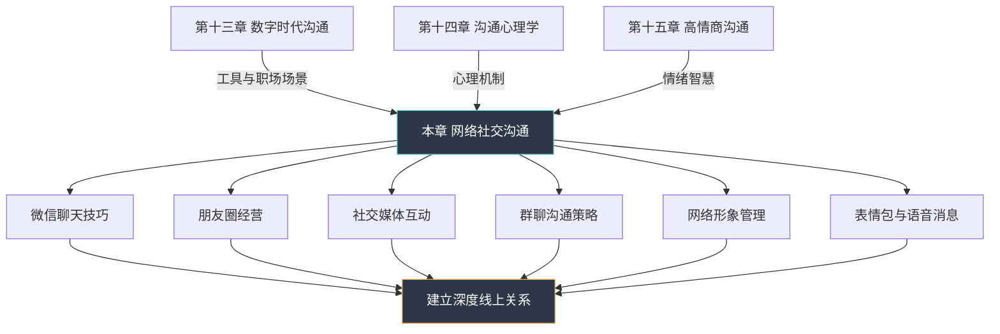

# 第十六章 网络社交沟通

## 章节定位

本章是"沟通表达全书"的第十六章，承接第十三章《数字时代沟通》对数字沟通工具和职场场景的系统论述，以及第十四章《沟通心理学》和第十五章《高情商沟通》对心理机制与情绪智慧的深入探讨，将焦点转向一个更为日常、也更为复杂的领域——**网络社交沟通**。

如果第十三章解决的是"数字沟通的技术与职场应用"，那么本章要回答的问题是：**当社交关系的建立、维护、深化全面迁移到线上空间时，我们该如何经营人际关系、塑造个人形象、管理社交边界？** 这不是工作邮件和协作文档的范畴，而是微信聊天、朋友圈、社交媒体、群聊互动这些渗透进每个人日常生活的社交场景。

### 为什么网络社交沟通值得单独成章

**1. 规模与渗透率已超越线下社交**

2025年CNNIC数据显示，中国即时通信用户规模达10.7亿，占网民总数的97.3%。微信月活跃用户突破13亿，抖音日活跃用户超过7亿，小红书月活跃用户超过3亿，微博月活跃用户约5.9亿。这意味着，对于绝大多数中国人而言，网络社交不是"线下的补充"，而是**日常社交的主战场**。一个人每天打开微信的平均次数超过80次，花在网络社交上的时间超过2.5小时——这个数字在18-35岁群体中更高，达到3.8小时。

**2. 网络社交与职场数字沟通有本质差异**

第十三章讨论的数字沟通（邮件、会议、协作文档）遵循的是**效率导向**的逻辑——信息要准确、表达要简洁、流程要规范。而网络社交沟通遵循的是**关系导向**的逻辑——重点不是信息传递效率，而是情感连接、身份认同、社交资本的积累。一条"在吗？"在工作场景中是低效的废话，在朋友之间却是建立情感连接的仪式性开场。

**3. 非语言信息的缺失带来了全新的沟通挑战**

面对面沟通中，非语言信息（表情、肢体、语调、空间距离）占信息传递总量的60%-93%（Albert Mehrabian, 1971）。在网络社交中，这些信息被大幅削减，取而代之的是文字、表情符号、表情包、语音消息、图片、视频等数字化媒介。一个简单的"好的"，在面对面交流中可以通过语气判断是欣然同意还是无奈妥协，但在文字消息中，它可能被解读为冷淡、敷衍，甚至是不满。这种信息缺失要求网络社交者发展出一套全新的"数字非语言表达能力"。

**4. 社交边界和隐私管理前所未有地复杂**

线下社交中，"谁能看到我说了什么"这个问题是直觉性的——在场的人都能听到。但在网络社交中，一条朋友圈可能被截图传播到完全陌生的社交圈，一段私聊可能被转发到几百人的群聊，一个不经意的点赞可能暴露你的社交关系网络。**边界管理从物理空间的隐性控制变成了数字空间的显性决策**。

### 与前后章节的关系

| 维度 | 第十三章 数字时代沟通 | 本章 网络社交沟通 |
|------|----------------------|-------------------|
| 核心导向 | 效率导向 | 关系导向 |
| 典型场景 | 邮件、会议、协作文档 | 微信聊天、朋友圈、群聊、社交媒体 |
| 沟通目标 | 准确传递信息、推进工作 | 建立连接、维护关系、塑造形象 |
| 非语言表达 | 较少依赖 | 极度依赖（表情包、语气词、标点） |
| 边界管理 | 组织规范明确 | 个人判断为主，灰色地带多 |
| 评价标准 | 专业性、准确性 | 温度感、分寸感、真诚度 |

---

## 章节结构

本章共分为七个部分，按照"理论奠基→技巧掌握→案例验证→误区纠正→能力巩固"的递进逻辑展开：

**第一部分：章节概览（本部分）**

- 章节定位与核心问题
- 章节结构与学习路径
- 学习目标与阅读建议
- 关键词速查

**第二部分：理论基础**

- 计算机中介传播理论（CMC理论）：当文字成为主要甚至唯一的沟通媒介，信息如何被编码、传递和解码？CMC理论揭示了网络沟通中"线索过滤"的根本机制。
- 社会信息加工理论：人们如何在缺乏非语言线索的情况下，通过有限的文字信息逐步建立对他人的印象和认知？
- 媒介丰富度理论：不同网络社交工具（文字、语音、视频、表情包）的信息承载能力有何差异？如何根据沟通目的选择合适的媒介？
- 自我呈现理论在网络社交中的应用：朋友圈、个人主页、头像签名如何成为"数字自我"的策展空间？
- 网络社交心理学基础：网络去抑制效应、社会比较心理、FOMO（错失恐惧）等心理机制如何影响我们的网络社交行为？
- 社会临场感理论：为什么文字聊天有时感觉"冰冷"，而视频通话更有"温度"？社会临场感如何影响沟通质量？
- 超人际传播模型：网络社交中为什么容易产生"理想化"印象？人们如何利用网络的异步性和可控性来优化自我呈现？

**第三部分：核心技巧**

- 微信聊天技巧详解：开场白设计、对话节奏掌控、话题延伸策略、结束对话的优雅方式
- 朋友圈经营策略：内容规划、发布时机、互动技巧、人设塑造
- 社交媒体互动法则：评论区社交、转发与引用、话题参与、跨平台形象一致性
- 网络形象管理方法：数字身份的多维度构建、一致性与真实性的平衡
- 表情包使用指南：表情包的语用功能、选图原则、使用分寸、版权意识
- 语音消息礼仪规范：何时该发语音、何时该打字、语音长度控制、转文字的使用场景
- 群聊沟通策略：活跃群的生存法则、潜水的艺术与代价、群内角色定位、冲突化解
- 网络社交中的情商应用：读懂"潜台词"、识别情绪信号、共情表达的数字化转化

**第四部分：实战案例**

- 微信聊天的成功与失败案例：从"已读不回"到"欲罢不能"的对话艺术
- 朋友圈经营的正反面案例：精心经营的朋友圈与"人设崩塌"的教训
- 社交媒体危机处理案例：一次失言引发的舆论风暴与危机公关
- 网络人设崩塌与重建案例：当线上形象与线下真实产生裂痕
- 群聊沟通的典型场景分析：工作群、朋友群、家族群的不同生存策略
- 网络社交中的冲突处理案例：文字争吵的升级与化解

**第五部分：常见误区**

- 文字沟通中的常见错误：标点符号的误读、语气词的缺失、长消息与短消息的场景错配
- 朋友圈经营的认知偏差：过度包装的反效果、点赞焦虑的心理根源
- 表情包使用的误区：不合时宜的表情包、代际表情包差异、过度依赖表情包替代真实表达
- 语音消息的滥用现象：连续60秒语音的"社交暴力"、公共场合外放的尴尬
- 网络社交中的边界问题：过度分享、窥探欲、网络跟踪行为
- 社交媒体依赖与焦虑：刷屏成瘾的心理机制、社交比较引发的自我怀疑

**第六部分：练习方法**

- 日常练习方案：从"觉察"到"刻意练习"的渐进路径
- 情境模拟训练：典型场景的角色扮演与复盘
- 反馈与改进机制：建立个人的网络社交"复盘"习惯
- 进阶学习路径：从基础社交到高阶网络社交能力的成长地图

**第七部分：本章小结与深度拓展**

- 核心要点总结与关键原则提炼
- 行动清单：学完就能用的20条网络社交准则
- 深度拓展：AI社交助手、虚拟形象社交、网络社交伦理等前沿话题
- 延伸阅读推荐

---

## 学习目标

通过本章的学习，读者将能够：

### 知识层面

1. 理解网络社交沟通的理论基础，包括计算机中介传播理论如何解释网络沟通中的"线索过滤"现象，社会信息加工理论如何描述网络印象的形成过程，媒介丰富度理论如何指导工具选择
2. 掌握微信、朋友圈、抖音、小红书、微博等主流网络社交平台的差异化特点和隐性沟通规则——例如微信的"强关系"属性决定了沟通的私密性和深度，而小红书的"弱关系+兴趣社区"属性决定了沟通的内容导向和审美标准
3. 了解网络社交心理学的核心原理，包括网络去抑制效应（为什么人们在网络上更容易说出线下不会说的话）、社会比较心理（为什么刷朋友圈有时让人焦虑）、FOMO心理（为什么总担心错过什么）
4. 认识网络社交中常见的沟通误区和陷阱，例如"已读不回"的多重解读、标点符号的代际差异（句号=严肃/生气？）、表情包的跨文化误读

### 技能层面

1. 能够运用恰当的技巧进行微信聊天，包括：设计有吸引力的开场白、掌控对话节奏（避免"查户口式"连续提问）、识别对话疲劳信号并优雅结束、处理"已读不回"和"尬聊"场景
2. 能够有策略地经营朋友圈，包括：建立内容矩阵（生活、观点、专业、互动的配比）、把握发布时机（工作日晚间和周末的黄金时段）、设计互动策略（评论区的二次社交）、塑造真实而有吸引力的网络形象
3. 能够熟练使用表情包、语音消息等网络社交工具，包括：根据场景选择合适的表情包（正式场合vs亲密关系）、控制语音消息的时长和频率、理解不同代际对表情符号的差异化解读
4. 能够在群聊中有效沟通，包括：在不同类型群聊（工作群、朋友群、家族群）中切换沟通风格、处理群内冲突和尴尬时刻、在"过度活跃"和"完全沉默"之间找到平衡点
5. 能够在社交媒体上进行有意义的互动，包括：撰写有价值的评论（而非"沙发"和"赞"）、参与话题讨论而不引发争议、管理跨平台的形象一致性

### 态度层面

1. 树立正确的网络社交观念，认识到线上沟通与线下沟通不是替代关系而是互补关系——线上沟通的优势在于异步性、可控性和多媒体表达，局限在于非语言信息缺失和语境模糊
2. 培养网络社交中的同理心和边界意识，学会从对方的角度解读消息（对方可能只是忙，而不是故意冷落），同时明确自己的社交边界（不因网络的便利性而被迫24小时在线）
3. 建立健康、可持续的网络社交习惯，避免"社交倦怠"和"数字焦虑"——网络社交应该是增强而非消耗你的社交能量
4. 提升数字素养和网络安全意识，理解网络社交行为的数字痕迹特性（截图、转发、存档），在享受社交便利的同时保护个人隐私

### 应用层面

1. 能够将所学技巧立即应用到日常的网络社交中——读完微信聊天技巧部分后，当天就能用新的方式与朋友展开对话
2. 能够根据不同场景灵活调整沟通策略——在朋友群中轻松幽默，在工作群中专业简洁，在家族群中温和耐心
3. 能够识别并纠正自己的网络社交误区——例如发现自己习惯发长语音后，主动改为"关键信息打字+细节补充语音"的组合策略
4. 能够持续提升自己的网络社交能力，建立个人的"社交复盘"习惯，定期回顾自己的网络社交表现

---

## 本章关键词速查

| 关键词 | 核心含义 | 本章涉及部分 |
|--------|----------|-------------|
| 网络社交沟通 | 以互联网和移动设备为媒介的人际社交互动，强调关系维护和情感连接 | 全章 |
| 计算机中介传播（CMC） | 研究通过计算机和网络进行的人际沟通的理论框架，核心关注"线索过滤" | 理论基础 |
| 社会临场感 | 沟通媒介传递"真实的人在场"感觉的能力，影响沟通的温暖度和信任感 | 理论基础、核心技巧 |
| 自我呈现 | Goffman提出的概念，在网络社交中演化为"数字身份策展"——头像、签名、朋友圈的刻意经营 | 理论基础、核心技巧 |
| 媒介丰富度 | 不同沟通媒介传递信息线索的丰富程度，从纯文字到视频通话逐级递增 | 理论基础、核心技巧 |
| 超人际传播 | 网络社交中发送者利用异步性和可控性优化自我呈现，接收者进行理想化归因的现象 | 理论基础、实战案例 |
| 网络去抑制效应 | 人们在网络上比面对面更容易表达极端观点或隐私信息的心理现象 | 理论基础、常见误区 |
| 表情包文化 | 以图像为载体的网络非语言表达系统，承担情绪标记、氛围调节、身份认同等功能 | 核心技巧、常见误区 |
| 朋友圈经营 | 通过策略性内容发布和互动维护网络社交形象的行为 | 核心技巧、实战案例 |
| 群聊沟通策略 | 在多人在线聊天场景中的角色定位、话题参与和冲突管理方法 | 核心技巧、实战案例 |
| 数字素养 | 在数字环境中有效、安全、负责任地使用技术和信息的综合能力 | 学习目标、本章小结 |
| FOMO（错失恐惧） | Fear of Missing Out，担心错过社交动态或热点事件的持续性焦虑心理 | 理论基础、常见误区 |
| 社交倦怠 | 因过度网络社交导致的心理疲惫和社交退缩现象 | 常见误区、练习方法 |
| 网络形象管理 | 对个人在各网络平台呈现的形象进行一致性管理和声誉维护的系统方法 | 核心技巧、实战案例 |

---

## 预计阅读时间

| 部分 | 预计时长 | 建议阅读方式 |
|------|----------|-------------|
| 章节概览 | 15分钟 | 通读，建立整体认知 |
| 理论基础 | 45分钟 | 精读，理解每个理论的核心机制 |
| 核心技巧 | 50分钟 | 精读+实操，边读边在微信中尝试 |
| 实战案例 | 40分钟 | 对比阅读，思考"如果是我会怎么做" |
| 常见误区 | 30分钟 | 反思阅读，对照自己的社交习惯 |
| 练习方法 | 25分钟 | 实践导向，制定个人练习计划 |
| 本章小结 | 15分钟 | 回顾复习，提炼核心收获 |
| 深度拓展 | 20分钟 | 选读，根据兴趣深入了解 |

**总计：约3.5小时（建议分3-4次阅读完成）**

**推荐阅读节奏：**
- 第一次：章节概览 + 理论基础（建立框架，约1小时）
- 第二次：核心技巧（掌握方法，约50分钟）
- 第三次：实战案例 + 常见误区（验证理解，约1小时10分钟）
- 第四次：练习方法 + 本章小结 + 深度拓展（巩固提升，约1小时）

---

## 阅读前的准备

在正式开始阅读之前，建议读者完成以下准备工作，以获得最佳的学习效果：

**1. 自我评估：你的网络社交能力处于哪个阶段？**

在阅读前，花5分钟诚实地回答以下问题，记录下你的答案。读完本章后，再回来重新评估，你会清晰地看到自己的进步：

- 你是否有过因为一条微信消息被误解而引发矛盾的经历？（频率如何？）
- 你的朋友圈是否经过有意识的经营？还是随意发布？
- 你是否知道不同人群对表情包和表情符号的差异化理解？
- 你在群聊中通常扮演什么角色？（活跃者、潜水者、话题引导者、调解者？）
- 你是否有过因为网络社交而感到焦虑或疲惫的经历？

**2. 打开你的微信，做一次"社交审计"**

- 翻看最近一周的聊天记录，识别你的沟通模式
- 浏览你的朋友圈，以"陌生人"的视角审视你的网络形象
- 回忆最近一次让你感到不舒服的网络社交经历，思考"问题出在哪里"

**3. 阅读工具准备**

- 建议在电脑端阅读，方便随时在手机上实操练习
- 准备一个笔记工具（备忘录或笔记本），记录对你有启发的要点和你自己的反思
- 如果可能，邀请一位朋友一起阅读讨论——网络社交本身就是双向的，学习也不应该是孤独的
