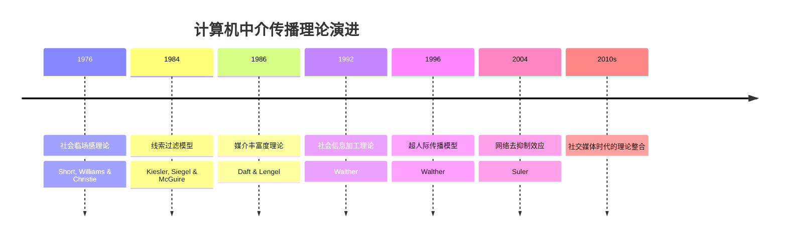
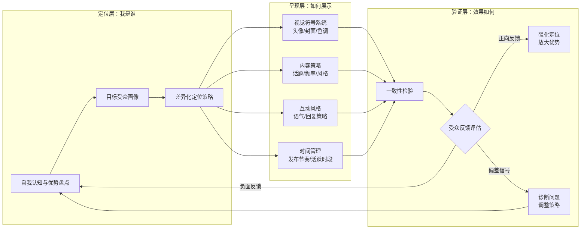
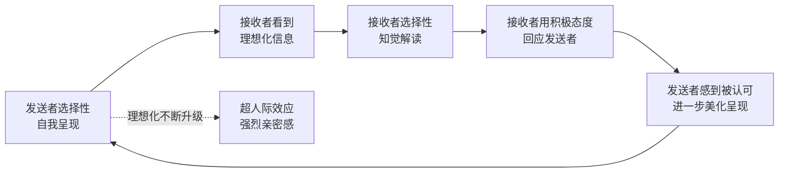
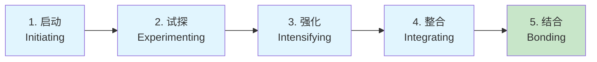
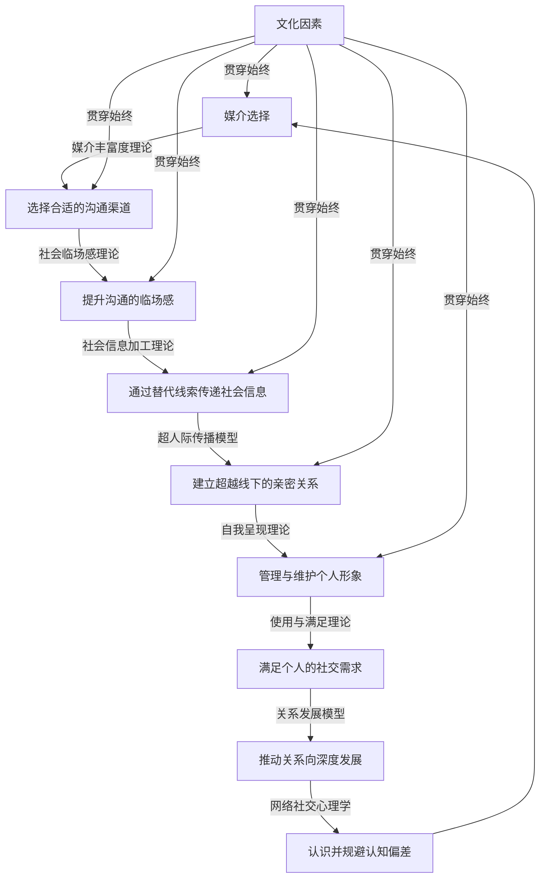

# 第十六章 网络社交沟通 —— 理论基础

网络社交沟通不是面对面沟通的降级替代品，而是一种具有独特规律的沟通形态。要真正掌握网络社交的"术"，必须先理解其背后的"道"——那些经过数十年实证研究验证的理论框架。本章从传播学、心理学、社会学三个维度出发，系统梳理网络社交沟通的核心理论，并将理论与中国互联网语境深度结合，为后续章节的方法论和实操技巧奠定坚实基础。

***

## 一、计算机中介传播理论（CMC）

### 1.1 理论起源与发展

计算机中介传播（Computer-Mediated Communication，简称CMC）理论是研究网络社交沟通最重要的理论基石之一。这一理论起源于20世纪80年代，随着电子邮件、BBS论坛、Usenet新闻组等数字化沟通工具的普及而逐渐发展成熟。

1984年，Sara Kiesler、Jane Siegel和Timothy McGuire在《美国心理学家》（American Psychologist）杂志上发表了一篇开创性论文《社交心理 aspects of computer-mediated communication》，首次系统地探讨了计算机中介传播对人际沟通的影响。他们通过对照实验发现，与面对面沟通相比，使用电子邮件进行沟通的被试表现出更多的去抑制行为（如使用粗鲁语言、发表极端观点），同时也更难达成共识。

这一发现催生了CMC理论的第一个重要模型——**线索过滤模型**（Cues-Filtered-Out Model，简称CFO模型）。

### 1.2 线索过滤模型的核心观点

线索过滤模型认为，网络沟通之所以不同于面对面沟通，根本原因在于非语言线索被技术手段"过滤"掉了。其核心观点包括：

**第一，社会线索的缺失导致信息丰富度降低。** 面对面沟通中，人们依赖面部表情（占信息传递的55%，Mehrabian, 1971）、语调（38%）和语言内容（7%）三重通道来理解对方。而早期的纯文字网络沟通只保留了语言内容这一个通道，信息丰富度大幅降低。

**第二，去抑制效应。** 由于缺少社会监督（对方看不到你的表情和肢体语言）和即时反馈（异步沟通中不需要立即回应），人们在网络沟通中更容易表现出去抑制行为。这既包括良性去抑制（更愿意分享内心感受、表达真实想法），也包括恶性去抑制（网络暴力、人身攻击、网络欺诈）。

**第三，任务导向性假设。** 线索过滤模型认为，网络沟通更适合处理任务导向的事务（如工作协调、信息传递），而不适合建立和维持亲密关系。这一观点在当时（1980年代）看来是合理的，因为早期的网络沟通工具确实以文字为主，缺少情感传递的渠道。

### 1.3 理论的修正与演进

然而，随着网络社交的发展，研究者们发现线索过滤模型过于悲观。该模型犯了一个关键的还原主义错误——它假设非语言线索只能通过视觉和听觉通道传递，而忽略了文字本身也可以承载丰富的社会信息。

1992年，Joseph Walther提出了社会信息加工理论（详见本章第二节），对CFO模型进行了重要修正。此后，Walther于1996年进一步提出超人际传播模型（详见本章第五节），彻底颠覆了"网络沟通不如面对面沟通"的假设。

### 📊 CMC理论演进时间线

### 1.4 理论的现实意义

理解CMC理论对网络社交实践的指导价值在于：

**媒介选择的底层逻辑。** 当你理解了"线索过滤"的机制，就能有意识地在不同场景下选择合适的沟通媒介。传递坏消息时，纯文字消息过滤掉了你的歉意表情，容易被解读为冷漠——此时语音或视频通话更合适。

**主动补充线索的意识。** 既然知道文字沟通天然缺少非语言线索，你就可以有意识地使用表情符号、语气词、表情包来补充情感信息。"好的"和"好的呀～😊"在信息传递效率上存在显著差异。

**理解去抑制行为的根源。** 当你在网络上看到某人的攻击性言论时，理解去抑制效应有助于你更理性地看待——这不是对方"本性暴露"，而是网络环境对行为的系统性影响。

***

## 二、社会信息加工理论（SIP）

### 2.1 理论概述

社会信息加工理论（Social Information Processing Theory，简称SIP理论）由Joseph Walther于1992年提出，是对线索过滤模型最重要的修正。这一理论的核心命题是：**虽然计算机中介传播缺少非语言线索，但人们会通过其他方式来适应这种沟通环境，逐步建立起与面对面沟通同样丰富的社会关系，只是需要更多的时间。**

SIP理论的革命性在于它将关注点从"媒介缺少什么"转向了"人如何适应"。它不再将网络沟通视为面对面沟通的残缺版本，而是将其视为一种独立的、具有自身规律的沟通形式。

### 2.2 三个关键假设

SIP理论基于三个相互关联的关键假设：

**假设一：适应性假设（Adaptation Hypothesis）。** 人类具有强大的适应能力，能够在不同的沟通环境中找到有效的沟通方式。当非语言线索被过滤时，人们会自然地寻找替代性的线索来传递社会信息。这种适应不是有意识的策略选择，而是一种自动化的认知过程——就像你在黑暗中会自动放大听觉来弥补视觉的缺失一样。

实证支持：一项针对在线游戏玩家的研究（Williams, 2006）发现，玩家在纯文字聊天中发展出了复杂的符号系统来表达情感，包括特定的标点符号组合（如"......"表示无语、"!!!!"表示激动）、大小写变化（全大写表示强调/喊叫）、以及缩写词的情感色彩（"hhhh"比"哈哈"更随意轻松）。

**假设二：时间假设（Time Hypothesis）。** 与面对面沟通相比，计算机中介传播需要更长的时间来建立同等程度的社会关系。Walther估计，这个时间差大约是2-3倍——面对面沟通中需要5次互动建立的关系，在网络沟通中可能需要10-15次。

这一假设解释了一个常见的网络社交困惑：为什么网友聊天聊了很久，感觉关系还是不如线下朋友亲近？答案是——你需要更多的耐心和更多的互动次数。

**假设三：带宽假设（Bandwidth Hypothesis）。** 虽然计算机中介传播的"带宽"比面对面沟通窄，但这并不意味着无法传递复杂的社会信息。人们可以通过以下方式弥补带宽不足：

- **语言策略**：使用更精确的词汇、更详细的描述来替代非语言线索
- **符号替代**：使用表情符号、表情包、标点符号来传递情感信息
- **时间利用**：利用异步沟通的优势，花更多时间精心组织信息
- **多媒体补充**：使用图片、语音、视频来丰富沟通渠道

### 2.3 SIP理论的实证验证

SIP理论得到了大量实证研究的支持：

**研究1：关系质量的趋同。** Walther和Bazarova（2007）对在线学习小组进行了为期16周的跟踪研究，发现随着时间的推移，纯文字沟通组的关系满意度逐渐接近面对面沟通组，验证了时间假设。

**研究2：线索的替代与补偿。** Tidwell和Walther（2002）的研究发现，在计算机中介传播中，人们会使用更多的直接提问和自我暴露来获取和传递社会信息，这验证了适应性假设。

**研究3：中国语境的验证。** 中国学者的研究（如张咏华，2005）发现，中国网民在微信等平台上发展出了丰富的非语言补偿策略，包括表情包的创造性使用、语气词的精确运用（"嗯"与"嗯嗯"与"嗯嗯嗯"传递不同的态度），这在中文语境下验证了SIP理论。

### 2.4 对网络社交的实践指导

SIP理论为网络社交提供了以下实践指导：

| 实践指导 | 具体做法 | 理论依据 |
|---------|---------|---------|
| 给关系发展足够的时间 | 不要急于将线上关系转为线下，先通过足够的互动建立基础 | 时间假设 |
| 主动补充非语言线索 | 使用表情符号、语音消息、图片来丰富沟通 | 适应性假设 |
| 利用异步性的优势 | 重要沟通前花时间组织语言，发挥文字沟通的精准性 | 带宽假设 |
| 增加互动频率 | 定期互动比偶尔长聊更有利于关系维护 | 时间假设 |

***

## 三、媒介丰富度理论（MRT）

### 3.1 理论概述与核心框架

媒介丰富度理论（Media Richness Theory，简称MRT）由Richard Daft和Robert Lengel于1986年在《组织科学》（Organization Science）上发表的论文中提出，最初用于解释组织中的沟通媒介选择行为。

该理论的核心观点是：**不同的沟通媒介具有不同的信息传递能力（即"丰富度"），而有效的沟通需要将沟通任务的复杂性与媒介的丰富度进行匹配。**

### 3.2 丰富度的四个维度

媒介丰富度主要取决于以下四个因素：

**第一，即时反馈能力。** 能否在发送信息后立即获得对方的回应。面对面沟通可以在几秒内获得反馈（对方点头、皱眉、追问），而电子邮件可能需要几小时甚至几天。即时反馈能力决定了沟通的互动效率和纠错速度。

**第二，多渠道传递。** 是否能够同时使用多种信息传递渠道。面对面沟通同时使用视觉（表情、手势）、听觉（语调、语速）、触觉（握手、拍肩）等多个渠道，信息传递最丰富。纯文字消息只使用单一渠道，信息丰富度最低。

**第三，语言多样性。** 是否能够使用自然语言（包括口语、方言、专业术语等）进行沟通。面对面沟通可以使用最丰富的语言表达，而短信等媒介受字数限制，语言表达受到约束。

**第四，个人化程度。** 是否能够传递个人情感、态度和价值观。面对面沟通的个人化程度最高，因为可以观察到对方的即时反应和情感变化。而群发邮件的个人化程度最低。

### 3.3 主流沟通媒介的丰富度对比

| 媒介类型 | 丰富度等级 | 即时反馈 | 多渠道 | 语言多样性 | 个人化 | 典型应用场景 |
|---------|----------|---------|--------|----------|--------|------------|
| 面对面沟通 | ★★★★★ | 极高 | 视觉+听觉+触觉 | 极高 | 极高 | 深度对话、谈判、亲密交流 |
| 视频通话 | ★★★★☆ | 高 | 视觉+听觉 | 高 | 高 | 远程会议、线上约会、远程陪伴 |
| 语音通话 | ★★★☆☆ | 高 | 听觉 | 高 | 中高 | 长距离沟通、快速协商 |
| 语音消息 | ★★★☆☆ | 中高 | 听觉 | 高 | 中高 | 日常聊天、情感表达 |
| 即时文字消息 | ★★☆☆☆ | 中 | 文字+表情符号 | 中 | 中 | 日常沟通、工作协调 |
| 电子邮件 | ★★☆☆☆ | 低 | 文字+附件 | 中高 | 中低 | 正式沟通、记录留痕 |
| 社交媒体动态 | ★☆☆☆☆ | 低 | 文字+图片+视频 | 中 | 低 | 一对多信息传播 |
| 正式文件/报告 | ★☆☆☆☆ | 极低 | 文字+图表 | 中 | 极低 | 官方记录、制度规范 |

### 3.4 媒介匹配原则

媒介丰富度理论的核心实践价值在于**媒介匹配原则**——不同类型的沟通任务需要匹配不同丰富度的媒介：

**高丰富度任务 → 高丰富度媒介：**
- 传递坏消息（需要即时反馈来处理情绪反应）
- 解决冲突（需要观察对方的非语言信号）
- 谈判协商（需要快速的讨价还价）
- 建立信任（需要多渠道的社会信息）
- 传达复杂/模糊信息（需要即时澄清和反馈）

**低丰富度任务 → 低丰富度媒介：**
- 传递明确的事实信息（如会议时间、地址）
- 发送标准化的通知（如群发公告）
- 需要留痕的正式沟通（如合同条款确认）
- 时间不敏感的信息传递

**实际案例：** 当你需要向同事传达一个重要但令人失望的决定（如项目被取消），使用纯文字消息传递这一信息是一个常见的错误。文字消息过滤掉了你的语气和表情，对方可能将你的信息解读为冷漠甚至带有敌意。此时，视频通话或至少语音通话是更合适的选择——你温和的语气和关切的表情可以显著降低消息的负面冲击。

### 3.5 理论的局限与补充

媒介丰富度理论也存在一些局限性：

**第一，静态视角的局限。** MRT将媒介丰富度视为固定属性，但实际使用中，用户可以通过创造性使用来提升媒介的"有效丰富度"。例如，精心搭配的文字+图片+表情符号的消息，其有效丰富度可能超过草率的语音通话。

**第二，忽略了用户偏好和能力。** 有些人天生擅长文字表达，他们在文字沟通中的丰富度可能超过不善言辞者的语音沟通。

**第三，忽略了社会文化因素。** 在中国文化中，直接拒绝他人是一件困难的事，因此低丰富度的媒介（如文字消息）反而可能更有利于传递某些敏感信息——因为它给了对方更多的"面子"空间。

这些局限后来被**媒介同步性理论**（Media Synchronicity Theory，Dennis et al., 2008）等后续理论所补充和修正。

***

## 四、自我呈现理论

### 4.1 Goffman的戏剧理论基础

自我呈现理论（Self-Presentation Theory）源于Erving Goffman在1959年出版的经典著作《日常生活中的自我呈现》（The Presentation of Self in Everyday Life）。Goffman将社会互动比喻为戏剧表演，提出了"戏剧论"（Dramaturgy）框架，认为每个人都在不同的社会场景中扮演不同的角色，通过策略性的自我呈现来管理他人对自己的印象。

在Goffman的框架中，自我呈现涉及两个核心概念：

**前台（Front Stage）：** 在公开场合展示给他人看的形象。前台行为是有意识的、策略性的，目的是给观众留下特定的印象。例如，在面试中穿着正装、使用专业术语、展示自信的肢体语言。

**后台（Back Stage）：** 私下里的真实状态，不对外展示。后台行为更加自然和放松，不需要维护特定的形象。例如，面试结束后在车里长舒一口气、和朋友吐槽面试官。

### 📊 线上人设构建体系

### 4.2 网络环境中的自我呈现特征

网络社交为自我呈现提供了全新的舞台和工具，同时也带来了Goffman时代无法预见的新特征：

**第一，可控性大幅增强。** 在面对面社交中，你的表情、语调、肢体语言会在无意识中泄露真实状态——一个微小的皱眉可能暴露你的不耐烦。但在网络社交中，你可以反复编辑、精心措辞再发送。微信聊天中，你有充足的时间思考"这句话该怎么说"；朋友圈发布前，你可以修图、调整文案、选择最佳发布时机。这种可控性使得网络上的自我呈现比面对面更加精心和策略性。

**第二，异步性赋予策划空间。** 网络社交的异步性（特别是文字消息和社交媒体）使得人们可以在发送信息之前进行更充分的思考和策划。一项研究（Walther, 2007）发现，在异步沟通中，人们会花费平均3-5倍的时间来编辑一条重要消息，这使得最终呈现的信息质量更高、自我形象更理想化。

**第三，多平台分身效应。** 同一个人可以在不同的社交平台上呈现截然不同的形象——这不是虚伪，而是Goffman所说的"印象管理"在网络时代的极端表现。例如：
- 微信朋友圈（主要面向熟人）：分享生活点滴、家庭时光，展示"温暖的普通人"形象
- LinkedIn/脉脉（面向职业圈）：分享行业见解、专业成就，展示"专业精英"形象
- 小红书（面向兴趣社群）：分享审美品味、生活方式，展示"有品位的生活家"形象
- 微博（面向公众）：表达观点态度、关注社会议题，展示"有态度的意见领袖"形象

**第四，观众隔离的困境。** Goffman指出，有效的自我呈现需要"观众隔离"——不同场合面对不同观众，呈现不同形象。但网络社交中，不同的社交圈子可能会在同一平台上交汇。微信好友中可能同时包含父母、领导、同事、前女友、客户、网友等不同关系的人，这让每一条朋友圈的发布都变成了一个复杂的策略决策。许多人为此选择：分组可见、设立多个微信号、或干脆不再发朋友圈。

**第五，永久记录与时间戳。** 网络社交中的自我呈现会被永久记录下来（截图、聊天记录、社交媒体存档），这与面对面社交中"转瞬即逝"的表演完全不同。一条不当的消息可能在几年后被翻出来，对个人形象造成持久损害。这种"数字足迹"的永久性使得人们在网络社交中需要更加谨慎。

### 4.3 六种印象管理策略在网络社交中的应用

Jones和Pittman（1982）在Goffman理论基础上提出了五种印象管理策略，在网络社交中，这些策略有着丰富的应用场景：

| 策略 | 定义 | 网络社交应用示例 | 风险与注意事项 |
|------|------|----------------|---------------|
| 自我提升（Self-Enhancement） | 展示优势和成就 | 朋友圈晒获奖证书、旅行照片、工作成就 | 过度展示导致"凡尔赛"印象，引发反感 |
| 他人提升（Other-Enhancement） | 通过赞美他人建立关系 | 给他人朋友圈真诚评论、公开感谢帮助过自己的人 | 过度恭维显得虚伪，需要保持真诚度 |
| 示范（Exemplification） | 展示道德品质和社会责任 | 分享公益活动、展示加班敬业、转发正能量内容 | 过度表演道德优越感容易被识破 |
| 恳求（Supplication） | 展示弱点以获得帮助 | 朋友圈求助、展示生病状态、表达迷茫困惑 | 过度使用导致"负能量"标签 |
| 威慑（Intimidation） | 展示权力或能力以震慑 | 展示专业权威、展示人脉资源、展示强硬立场 | 在网络社交中过度使用会损害关系 |

此外，网络社交中还发展出了第六种策略：

**迎合（Ingratiation）：** 通过与目标对象建立相似性来获得好感。在网络社交中的表现包括：点赞对方的每一条动态、评论时附和对方观点、使用与对方相似的语言风格和表情符号。适度的迎合有助于建立关系，但过度迎合会被视为"无主见"或"有所图"。

### 4.4 自我呈现的真实性困境

网络社交中自我呈现面临一个核心矛盾：**理想化与真实性之间的张力。**

过度理想化的自我呈现可能导致以下问题：
- **认知失调**：维持理想人设与真实自我之间的差距带来心理压力
- **关系脆弱性**：建立在虚假人设上的关系经不起深入接触的考验
- **社交比较焦虑**：看到他人同样理想化的呈现，产生"别人都过得比我好"的错觉

一项针对中国大学生的研究（李晓明等，2019）发现，在微信朋友圈中过度进行理想化自我呈现的用户，其孤独感和抑郁倾向反而更高。这提示我们：**健康的网络社交需要在策略性呈现和真实性之间找到平衡。**

***

## 五、超人际传播模型

### 5.1 理论概述

超人际传播模型（Hyperpersonal Model）由Joseph Walther于1996年提出，是理解网络社交最重要的理论之一。该模型的名称"超人际"（Hyperpersonal）意味着：**在某些条件下，计算机中介传播不仅能够达到面对面沟通的效果，甚至可能超越面对面沟通，产生更强烈的亲密感、更高度的信任和更理想化的印象。**

这一模型直接挑战了"网络社交不如面对面社交"的常识性假设，解释了为什么网恋可能比相亲更容易产生强烈的感情、为什么网上认识的朋友可能感觉比同事更亲近。

### 5.2 四个关键要素的协同机制

超人际传播模型包含四个相互作用的关键要素，它们形成一个正向增强的循环系统：

**第一，发送者的选择性自我呈现。** 在网络社交中，发送者可以更加精心地选择和编辑自己发送的信息，呈现更加理想化的自我形象。由于缺少即时的视觉和听觉反馈，发送者可以隐藏自己的某些缺点（如紧张时的小动作、不自信的语调），突出自己的优势（如幽默感、知识深度、文笔功底）。

这种选择性呈现在异步沟通中尤为突出。当你发送一条文字消息时，你可以：
- 花5分钟修改一条本来只需要30秒就能表达的信息
- 删除那些可能暴露缺点的内容（如口语化的赘词、犹豫的表达）
- 添加那些增强个人魅力的元素（如恰到好处的幽默、引经据典）

**第二，接收者的选择性知觉。** 在信息有限的情况下，接收者倾向于用更理想化的方式去解读发送者的信息。这是因为：

- **晕轮效应**（Halo Effect）：当接收者在某个维度上对发送者形成正面印象时，会自动推断发送者在其他维度上也同样优秀
- **归因偏差**：接收者倾向于将发送者的正面行为归因于其稳定的性格特征（"他这么幽默，一定是个有趣的人"），而将负面行为归因于外部环境（"她今天回复慢，一定是工作太忙了"）
- **信息空白的积极填充**：人类大脑无法忍受不确定性，当缺少信息时，人们会用自己的想象去填补——而这种想象往往偏向理想化

**第三，信道的非同步性。** 计算机中介传播的非同步性（如文字消息的延迟回复）给了双方更多的时间来思考和编辑自己的信息。这种非同步性创造了两个重要的效果：

- **印象编辑窗口**：发送者有充足的时间来打磨每一条消息，使其呈现出最理想的自己
- **期待感的积累**：适度的延迟回复可以增加对方的期待感，类似于"小别胜新婚"的心理效应

**第四，反馈循环。** 上述三个因素会形成一个正向的反馈循环：

这个正向循环使得双方对彼此的印象越来越理想化，最终可能达到比面对面沟通更强烈的亲密感。

### 5.3 超人际传播的两面性

超人际传播模型揭示了网络社交的一个重要特征——它是一把双刃剑：

**积极面：深度心理连接的可能性。** 在网络社交中，人们可以绕过外貌、地位、身份等外在因素的干扰，更加专注于对方的思想、价值观和内在品质。这对于以下人群尤其有价值：
- 性格内向、在面对面社交中难以展现真实自我的人
- 社交焦虑患者，在网络环境中焦虑感显著降低
- 外貌自卑者，在网络社交中可以先展示内在魅力
- 跨地域、跨文化的交流者，网络打破了地理和文化的隔阂

**消极面：期望落差与"见光死"。** 过度理想化的印象可能导致严重的期望落差——当网络关系转移到线下时，现实中的对方可能与理想化的印象相差甚远。这种现象在网络恋爱中尤为常见，被称为"见光死"。其本质是：超人际传播建立的理想化印象无法承受现实检验的冲击。

**缓解策略：** 要降低超人际效应的负面风险，可以采取以下策略：
- 在关系发展到一定深度后，适时引入语音/视频沟通，逐步增加信息丰富度
- 有意识地分享一些"不完美"的真实状态，而非只展示理想化的一面
- 对网络关系保持适度的现实感，理解线上印象与线下真实之间必然存在差距
- 在首次线下见面时选择轻松、低压的场景，降低期望落差的冲击

***

## 六、社会临场感理论

### 6.1 理论概述

社会临场感理论（Social Presence Theory）由Short、Williams和Christie于1976年在其著作《电信社会心理学》（The Social Psychology of Telecommunications）中提出，是最早的媒介传播理论之一。

社会临场感（Social Presence）是指**在沟通中感受到对方作为真实的人存在的程度**。高社会临场感意味着你在沟通中感觉对方"就在身边"，低社会临场感则意味着你感觉在与一个抽象的信息源互动。

### 6.2 社会临场感的决定因素

社会临场感的高低主要取决于以下因素：

**第一，媒介传递社会信息的能力。** 能否传递面部表情、语调、肢体语言等丰富的社会信息。视频通话可以传递全部视觉和听觉信息，社会临场感最高；纯文字消息只能传递语言内容，社会临场感最低。

**第二，媒介的即时性。** 沟通是否实时进行。即时消息的社会临场感高于电子邮件，因为它可以模拟对话的节奏感。

**第三，媒介的亲密性。** 是否能够营造私密、个人化的沟通氛围。一对一视频通话的社会临场感高于视频会议，因为前者更加私密和个人化。

### 6.3 不同平台和工具的社会临场感层级

| 层级 | 媒介形式 | 临场感强度 | 典型平台 | 情感传递能力 |
|------|---------|----------|---------|------------|
| 极高 | VR/AR社交、全息通话 | ★★★★★ | Meta Horizon、Apple Vision Pro | 接近面对面 |
| 高 | 视频通话、直播互动 | ★★★★☆ | Zoom、微信视频、抖音直播 | 视觉+听觉全通道 |
| 中高 | 语音通话、连麦 | ★★★☆☆ | 微信语音、Discord连麦 | 听觉通道丰富 |
| 中 | 语音消息、短视频 | ★★☆☆☆ | 微信语音消息、抖音短视频 | 单向听觉/视觉 |
| 中低 | 即时文字+表情包 | ★★☆☆☆ | 微信聊天、QQ聊天 | 文字+符号补偿 |
| 低 | 纯文字、电子邮件 | ★☆☆☆☆ | 邮件、论坛帖子 | 纯文字通道 |
| 极低 | 系统通知、自动消息 | ☆☆☆☆☆ | APP推送、自动回复 | 无人格化信息 |

### 6.4 提升网络社交中社会临场感的策略

研究表明，提升社会临场感可以显著增强网络社交中的信任感、亲密度和沟通满意度。以下是经过实证验证的提升策略：

**策略一：善用表情符号和表情包系统。** 表情符号不仅仅是装饰，它们是文字沟通中最重要的非语言线索替代品。研究表明（Derks et al., 2008），使用表情符号的消息比纯文字消息的情感传递准确率高出约30%。在中国网络社交中，表情包更是承担了远超表情符号的功能——一个恰到好处的表情包可以替代一段文字的情感表达。

**策略二：适时进行媒介升级。** 当文字沟通无法满足情感传递需求时，主动切换到更高临场感的媒介。判断标准：如果一段文字对话需要反复解释和澄清，或者涉及复杂的情感交流，就是媒介升级的信号。

**策略三：增加互动的即时性。** 尽量及时回复消息，营造"在场感"。研究表明，回复延迟超过15分钟会显著降低对方的临场感体验。当然，及时回复不等于秒回——过度秒回反而可能传递出焦虑或过度关注的信号。

**策略四：分享个人化和生活化的内容。** 在聊天中穿插分享生活照片、环境照片、实时状态等，可以显著增加沟通的临场感。例如，发一张正在喝咖啡的照片配合一句"刚开完会，喝杯咖啡休息下"，比单纯的"我在忙"临场感强得多。

**策略五：使用对方的名字和个性化称呼。** 在沟通中适当使用对方的名字，可以增强个人化感觉和亲密感。这一技巧在线上线下都适用，但在线上沟通中尤为重要，因为文字沟通天然缺乏个人化信号。

**策略六：创造共同体验。** 一起看同一部电影然后讨论、一起玩在线游戏、一起看同一个直播——这些共同体验可以显著提升关系中的社会临场感，因为它创造了"共同在场"的感觉。

***

## 七、使用与满足理论

### 7.1 理论概述

使用与满足理论（Uses and Gratifications Theory）由Elihu Katz于1974年系统提出，是传播学中最重要的受众理论之一。该理论的核心假设是：**受众不是被动的信息接收者，而是主动的媒介使用者——他们基于自身的需求来选择和使用媒介，并从媒介使用中获得满足。**

这一理论在社交媒体时代获得了新的生命力，因为它完美解释了人们为什么使用不同的社交平台、为什么形成不同的使用习惯。

### 7.2 社交媒体使用的四种核心需求

根据Katz、Gurevitch和Haas（1973）的经典分类，以及后续研究者对社交媒体语境的扩展，人们使用社交媒体主要满足以下需求：

**第一，认知需求（Cognitive Needs）——获取信息和知识。** 人们使用社交媒体来获取新闻资讯、行业动态、专业知识、生活技巧等。满足认知需求的主要平台包括：微博（热点新闻）、知乎（深度知识）、微信公众号（行业资讯）、小红书（生活技巧）。

**第二，情感需求（Affective Needs）——获得情感体验。** 人们使用社交媒体来获得情感上的满足，包括娱乐（刷短视频、看搞笑内容）、审美（看美图、欣赏创意内容）、感动（看感人的故事、正能量内容）。满足情感需求的主要平台包括：抖音（娱乐）、小红书（审美）、微博（情感共鸣）。

**第三，个人整合需求（Personal Integrative Needs）——增强自信和地位。** 人们使用社交媒体来展示自己的能力、成就和品味，以获得他人的认可和尊重。满足个人整合需求的主要平台包括：朋友圈（展示生活品质）、LinkedIn/脉脉（展示职业成就）、知乎（展示知识深度）。

**第四，社交整合需求（Social Integrative Needs）——建立和维护社会关系。** 人们使用社交媒体来与他人建立联系、维护关系、获得归属感。满足社交整合需求的主要平台包括：微信（维护核心关系）、QQ群（兴趣社群）、豆瓣（兴趣社区）。

### 7.3 需求匹配与平台选择

使用与满足理论的一个重要实践价值在于它解释了**为什么人们会在不同社交平台上表现出不同的行为模式**。同一个人在微博上可能是一个犀利的评论者，在朋友圈上是一个温暖的生活分享者，在知乎上是一个严谨的知识贡献者——这不是"人格分裂"，而是不同平台满足了不同的心理需求。

理解这一点对于网络社交的实践指导是：**在与他人进行网络社交时，要考虑对方当前的主导需求是什么。** 一个正在微信上和你聊天的人，可能处于社交整合需求（想要连接和陪伴），如果你突然开始发长篇大论的专业知识（满足认知需求），就可能与对方的需求不匹配，导致沟通效果不佳。

***

## 八、网络社交心理学

### 8.1 网络去抑制效应

网络去抑制效应（Online Disinhibition Effect）由John Suler于2004年在《网络心理学与行为》（CyberPsychology & Behavior）杂志上发表的论文中提出，是理解网络社交中"异常行为"的关键理论框架。

Suler将网络去抑制效应分为两种类型：

**良性去抑制（Benign Disinhibition）：** 人们在网络上更容易表达真实感受、分享内心想法、帮助陌生人、展现善意。例如，在网络匿名社区中，人们可能更愿意分享自己的心理健康困扰，寻求帮助和支持。

**恶性去抑制（Toxic Disinhibition）：** 人们在网络上更容易表现出攻击性、粗鲁、威胁、性骚扰等负面行为。网络暴力、人肉搜索、恶意造谣等都是恶性去抑制的典型表现。

**Suler提出导致网络去抑制效应的六个因素：**

| 因素 | 英文术语 | 作用机制 | 网络社交实例 |
|------|---------|---------|------------|
| 匿名性 | Dissociative Anonymity | 隐藏真实身份降低行为后果的感知 | 使用匿名账号发表极端观点 |
| 不可见性 | Invisibility | 对方看不到自己的真实状态 | 在文字聊天中说出面对面不会说的话 |
| 异步性 | Asynchronicity | 不需要即时面对对方的反应 | 发完攻击性消息后关掉手机 |
| 唯我性 | Solipsistic Introjection | 在脑海中构建对方的形象 | 将对方想象为一个"角色"而非真人 |
| 去权威化 | Minimization of Authority | 网络环境中权威感降低 | 在群里对领导说话不如线下恭敬 |
| 想象的分离 | Dissociative Imagination | 将网络与现实分离开来 | "网上是网上，现实是现实"的心理 |

### 8.2 网络社交焦虑

网络社交焦虑（Online Social Anxiety）是指在使用社交媒体和进行网络社交时产生的焦虑情绪。这种焦虑在当代社会中越来越普遍，特别是在年轻人群体中。

**网络社交焦虑的主要来源：**

**信息过载焦虑。** 社交媒体上海量的信息流需要处理——朋友圈需要点赞、群消息需要浏览、公众号需要阅读。面对永远刷不完的信息流，人们会产生"错过恐惧"（Fear of Missing Out, FOMO），即担心自己错过了重要信息或社交互动。

**回复压力。** 即时通讯工具创造了一种"永远在线"的预期——收到消息后如果不及时回复，可能被认为是不在乎、不尊重。这种持续的回复压力会导致慢性焦虑。研究表明（Wulf et al., 2020），平均每个社交媒体用户每天收到超过100条需要关注的通知，这种持续的注意力分散是焦虑的重要来源。

**社交比较心理。** 社交媒体上展示的往往是经过精心筛选和美化的生活片段。当人们将自己平淡的日常生活与他人精心策划的"精彩生活"进行比较时，容易产生自卑感和不满情绪。一项研究（Verduyn et al., 2017）发现，在Facebook上被动浏览（只看不互动）超过30分钟后，用户的幸福感会显著下降。

**数字形象管理压力。** 每一条朋友圈、每一条微博、每一个评论都在构建自己的数字形象。这种持续的形象管理需要消耗大量的心理能量，特别是对于在意他人评价的人来说，每一次发布都可能引发焦虑。

**网络社交焦虑的应对策略：**
- 设定明确的社交媒体使用时间，避免无目的的长时间浏览
- 区分主动社交（有目的的互动）和被动浏览（无目的的刷屏），减少后者
- 有意识地提醒自己：他人展示的是经过筛选的理想化版本，不是全部真相
- 允许自己不回复每一条消息，降低"永远在线"的自我预期
- 定期进行"社交媒体断联"，给自己心理恢复的空间

### 8.3 网络社交中的认知偏差

在网络社交中，人们容易受到以下认知偏差的影响，这些偏差会系统性地扭曲我们对网络社交情境的判断：

**第一，基本归因错误（Fundamental Attribution Error）。** 在解释他人的行为时，倾向于归因于对方的性格因素（内部归因），而忽视情境因素（外部归因）。在网络社交中的典型表现：

- 对方没有及时回复消息 → "他/她不在乎我"（内部归因），而不是"可能正在开会/手机没电/暂时不方便"（外部归因）
- 对方的语气看起来冷淡 → "他/她对我有意见"（内部归因），而不是"可能正在忙/心情不好/打字习惯如此"（外部归因）

文字沟通缺少非语言线索，使得基本归因错误更容易发生——因为我们无法通过观察对方的表情和语调来验证自己的判断。

**第二，确认偏误（Confirmation Bias）。** 倾向于关注和接受与自己已有观点一致的信息，而忽视不一致的信息。在网络社交中，确认偏误会导致：
- "信息茧房"（Filter Bubble）：算法推荐让你只看到符合你兴趣和观点的内容
- "回音室效应"（Echo Chamber）：社交圈内的人观点趋同，缺乏多元视角
- 对他人的刻板印象强化：一旦对某人形成某种印象，后续只关注确认这一印象的信息

**第三，聚光灯效应（Spotlight Effect）。** 高估他人对自己的关注程度。在网络社交中，人们可能过度在意自己的每一条消息、每一条朋友圈是否会引起他人的注意和评价。事实上，大多数人都在忙于关注自己，对你发布的内容远没有你想象的那么在意。

**第四，消极偏见（Negativity Bias）。** 对消极信息的敏感度高于积极信息。在网络社交中，一条负面评论的影响力可能远大于十条正面评论。这解释了为什么网络暴力的危害如此巨大——受害者会反复回放那几条恶意评论，而忽略大量的善意支持。

**第五，锚定效应（Anchoring Effect）。** 过度依赖最先接收到的信息来做判断。在网络社交中，第一印象的锚定效应尤为显著——对方的第一条消息、头像、昵称会深刻影响你后续对其所有信息的解读。

**第六，虚假共识效应（False Consensus Effect）。** 高估他人与自己观点一致的程度。在网络社交中，人们倾向于认为"大多数人都和我想的一样"，当遇到不同意见时容易感到震惊和愤怒。这种效应在社交媒体的"站队"现象中表现得尤为明显。

### 8.4 网络社交中的情绪传染

情绪传染（Emotional Contagion）是指一个人的情绪状态通过互动影响他人情绪的过程。在网络社交中，情绪传染的机制与面对面社交有所不同：

**文字中的情绪传染。** 研究发现（Kramer et al., 2014，Facebook的大规模实验），社交媒体上的情绪内容会影响用户的情绪状态。看到更多负面内容的用户倾向于发布更多负面内容，反之亦然。

**群聊中的情绪传播。** 在微信群聊中，情绪传染的速度和范围都远超面对面社交。一条负面消息可以在几小时内影响整个群的氛围，而正面情绪的传播则相对较慢——这也是"坏消息传千里"在网络环境中的体现。

**理解情绪传染的实践价值：** 意识到情绪传染的存在，可以帮助你更有意识地管理自己在网络社交中的情绪表达。当你处于负面情绪状态时，暂时避免在社交媒体上发布内容，可以减少负面情绪的传播；而有意识地发布积极、温暖的内容，则可以为你的社交网络注入正能量。

***

## 九、网络社交中的关系发展

### 9.1 Knapp的关系发展模型

Mark Knapp提出的人际关系发展模型是理解关系动态的经典框架，同样适用于网络社交。该模型描述了关系发展的十个阶段，分为关系建立和关系解除两个大的方向：

**关系建立阶段：**

1. **启动（Initiating）**：初次接触和打招呼。在网络社交中，这可能是添加好友后的第一条消息、在群里的第一次互动、或社交媒体上的第一次评论。

2. **试探（Experimenting）**：通过闲聊来了解对方。网络社交中的试探通常包括浏览对方的朋友圈/社交媒体、了解对方的兴趣爱好、进行轻松的话题交流。这个阶段的关键是寻找共同点。

3. **强化（Intensifying）**：增加自我暴露的深度。从表面的闲聊转向更私人的分享——个人经历、内心感受、人生困惑。在网络社交中，强化通常表现为从群聊转向私聊、从文字转向语音、互动频率显著增加。

4. **整合（Integrating）**：开始将对方纳入自己的身份认同。"我们"的意识开始出现，共享的符号和内部笑话开始形成。在网络社交中，这可能表现为：互取专属昵称、建立共同的相册或笔记、在他人面前提及对方。

5. **结合（Bonding）**：正式确立关系。在网络社交中，这可能是公开宣布关系（如发朋友圈官宣）、做出承诺性的表达、或在重要场合引入对方。

**关系维系/解除阶段：**

6. **区分（Differentiating）**：重新强调个人差异。"我们需要各自的空间"
7. **限制（Circumscribing）**：减少沟通的深度和范围。避开某些敏感话题
8. **停滞（Stagnating）**：关系陷入僵局。无话可说但还没有正式分开
9. **回避（Avoiding）**：刻意减少接触。消息回复变慢、见面频率降低
10. **终结（Terminating）**：关系结束。删除好友、取消关注、或正式告别

### 9.2 网络社交中关系发展的独特特征

在网络社交中，关系发展呈现出一些不同于面对面社交的独特特征：

**特征一：启动阶段的低成本化。** 在面对面社交中，主动与陌生人搭话需要勇气和社交技巧。但在网络社交中，添加好友、发送一条消息的门槛极低，这使得网络社交中的关系启动更加频繁，但同时也导致了关系的"广度大、深度浅"的问题。

**特征二：试探阶段的信息丰富化。** 网络社交平台提供了丰富的个人信息——朋友圈、微博、小红书上的内容可以帮助你快速了解一个人的兴趣、价值观、生活方式。这使得网络社交中的试探阶段比面对面社交更高效，但也可能产生"信息过早暴露"的问题——在面对面社交中，你不会在第一次见面时就翻看对方过去一年的生活照片。

**特征三：强化阶段的加速与延缓并存。** 网络社交的匿名性和异步性可能加速深度自我暴露（人们在网络中更愿意分享内心世界），但也可能延缓关系的进一步深化（缺少面对面的物理接触和共同体验）。

**特征四：关系维护的"轻量化"。** 网络社交使得关系维护变得极其轻量化——一条朋友圈点赞、一个表情包回复就完成了一次关系维护的"仪式"。这种轻量化的维护在维持弱关系网络方面非常高效，但对于强关系的维护可能并不足够。

**特征五：关系终结的模糊化。** 在面对面社交中，关系的结束通常有一个明确的时刻。但在网络社交中，关系的淡化往往是渐进的——互动频率逐渐降低、回复逐渐变短、直到某一天双方都意识到关系已经自然终结。这种模糊性既减少了冲突，也增加了不确定性。

### 9.3 Dunbar数字与网络社交的邓巴悖论

英国人类学家Robin Dunbar提出了著名的"邓巴数字"（Dunbar's Number）——人类大脑的认知能力限制了我们能够维持的稳定社交关系数量，约为150人。在这个150人的圈层中，还存在更小的亲密圈层：

- **亲密圈（约5人）**：你在危机时会求助的人
- **同情圈（约15人）**：你关心其近况的朋友
- **亲近圈（约50人）**：你会邀请参加生日聚会的人
- **认识圈（约150人）**：你能记住名字和基本信息的人

网络社交引发了一个有趣的悖论：**虽然社交媒体使我们能够与远超150人保持"联系"，但我们的核心社交圈层仍然受制于邓巴数字。** 你可以拥有5000个微信好友，但真正亲密的仍然只有5人左右。

这意味着：**网络社交的核心价值不在于扩大你的社交圈规模，而在于更高效地维护你有限的核心关系。** 与其添加5000个好友然后忽略他们，不如精心维护50个核心关系。

***

## 十、文化视角下的网络社交

### 10.1 高低语境文化的影响

Edward Hall在1976年提出的高语境文化（High-Context Culture）与低语境文化（Low-Context Culture）理论，对理解不同文化背景下网络社交的差异具有重要意义。

**高语境文化（如中国、日本、韩国）的网络社交特征：**
- 沟通中大量信息依赖于语境、关系和非语言线索
- 注重"言外之意"，直接表达可能被视为粗鲁
- 在网络社交中，更依赖表情符号、语气词、表情包来传递微妙的情感
- 回复速度、消息长度、表情使用频率等都承载着关系信号
- "在吗"这类看似无意义的开场白，实际上是在试探对方的可沟通状态和态度

**低语境文化（如美国、德国、北欧）的网络社交特征：**
- 沟通更加直接明确，信息主要通过语言本身传递
- 直截了当地表达观点被视为坦诚和高效
- 在网络社交中，更倾向于使用明确的文字表达
- 表情符号的使用相对克制，主要用于强调而非传递微妙情感
- 不回复通常只是"忘了"或"不需要回复"，而不被解读为态度信号

### 10.2 中国网络社交的文化密码

中国的网络社交在几十年的发展中，形成了独特而丰富的文化现象。理解这些文化密码，是在中文互联网上有效社交的必备知识：

**表情包文化：从补充到核心。** 中国网民创造了全球最丰富的表情包文化。表情包在中国网络社交中已经从"文字的补充"升级为"独立的沟通语言"。一个恰到好处的表情包可以：
- 替代一段文字的情感表达（一个"裂开"的表情包比"我很难受"更有冲击力）
- 缓解社交尴尬（当不知道说什么时，发表情包是安全的社交润滑剂）
- 建立群体认同（使用同一套表情包的群体形成"圈内人"的归属感）
- 传递微妙的态度（"微笑"表情在不同年龄段有截然不同的解读）

**"在吗"文化的社交逻辑。** "在吗"是中国网络社交中最具争议的开场白之一。批评者认为它浪费时间、效率低下，但理解其社交逻辑后会发现它有三个功能：
- 试探对方当前是否方便沟通（尊重对方的时间和状态）
- 为后续可能的请求做铺垫（避免突兀地提出要求）
- 维护关系的仪式感（"我想和你聊天"的信号）

更高效的做法是将"在吗"升级为"在吗？想问你关于XX的事"——既保留了试探功能，又节省了对方的等待时间。

**微信红包的社交经济学。** 微信红包不仅是经济行为，更是深层的社交行为。在中国文化中，红包承载着"礼尚往来""人情世故"的传统社交逻辑。微信群红包的社交功能包括：
- 活跃群氛围（红包雨是群聊活跃度的直接催化剂）
- 表达感谢和善意（比说"谢谢"更有分量）
- 建立社交债务（给了红包创造了隐性的互惠义务）
- 测试关系亲密度（红包金额和频率反映关系深浅）

**朋友圈的"人设经营"。** 朋友圈已经从简单的"分享生活"演变为复杂的"人设经营"。发什么、不发什么、何时发、谁能看——每一个决策都涉及复杂的印象管理策略。中国用户的朋友圈行为呈现出明显的模式：
- 职场晋升期：减少生活化内容，增加专业相关分享
- 恋爱期：增加甜蜜内容或完全隐藏恋爱状态
- 育儿期：高频分享孩子内容，但可能屏蔽未育好友
- 低谷期：减少更新频率或转为仅三天可见

### 10.3 代际差异

不同年龄段的中国网民在网络社交中表现出显著的代际差异：

| 代际 | 主要平台 | 沟通风格 | 表情使用 | 典型特征 |
|------|---------|---------|---------|---------|
| 70后 | 微信为主 | 正式、完整句子 | 经典表情、风景图 | 重视信息实用性 |
| 80后 | 微信+微博 | 半正式、适度缩写 | 微信默认表情 | 平衡效率与情感 |
| 90后 | 微信+小红书 | 轻松、表情包丰富 | 自定义表情包 | 注重个性化表达 |
| 00后 | 微信+QQ+抖音 | 极度个性化、缩写密 | 动态表情、梗图 | 追求圈层认同 |

理解代际差异对网络社交的实践指导是：**与不同年龄段的人沟通时，需要调整自己的表达风格和表情使用策略。** 向70后领导发一个"裂开"的表情包可能是不合适的，但向00后同事发一个正式的"收到，谢谢"可能显得过于疏远。

***

## 十一、理论整合与实践框架

### 11.1 理论之间的内在联系

上述理论并非孤立存在，它们之间存在深层的内在联系。将这些理论整合起来，可以形成一个更完整的网络社交认知框架：

### 11.2 理论指导实践的核心原则

综合以上所有理论，可以提炼出网络社交沟通的五条核心原则：

**原则一：媒介匹配。** 根据沟通任务的复杂性和情感性选择合适的媒介。简单信息用文字，复杂沟通用语音，深度交流用视频或面对面。不要用文字消息传递坏消息，也不要用视频通话发送一条简单的通知。

**原则二：线索补偿。** 意识到文字沟通天然缺少非语言线索，有意识地使用表情符号、语气词、表情包、语音消息来补偿。一条消息的情感温度，往往取决于你补偿了多少缺失的非语言信息。

**原则三：真实性平衡。** 在策略性自我呈现和真实性之间找到平衡。适度的理想化是正常的社交行为，但过度的虚假人设最终会损害你的人际关系和心理健康。

**原则四：需求敏感。** 理解对方使用社交媒体的需求是什么，在对方的需求框架内进行沟通。对方想要情感支持时，不要给解决方案；对方想要信息时，不要给心灵鸡汤。

**原则五：偏差觉察。** 意识到网络社交中普遍存在的认知偏差，有意识地进行修正。对方没回消息不等于不在乎你，网上看到的精彩生活不等于全部真相，你发的内容没人在意的概率远比你想象的高。

***

## 十二、本节小结

网络社交沟通的理论基础涵盖了传播学、心理学、社会学、文化研究等多个学科。从计算机中介传播理论到社会信息加工理论，从媒介丰富度理论到超人际传播模型，从自我呈现理论到社会临场感理论，从使用与满足理论到网络社交心理学，这些理论为我们理解网络社交提供了多维度、多层次的认知框架。

**关键理论要点回顾：**

1. **网络社交不是低配版的面对面社交**，而是一种具有独特规律的沟通形式。它有自己的优势（可控性、异步性、打破时空限制）和局限（缺少非语言线索、容易产生误解），需要专门的理论来理解。

2. **人具有强大的适应能力**，能够在网络环境中找到有效的沟通方式，发展出替代性的非语言线索系统（表情符号、表情包、语气词等），建立与面对面沟通同样丰富甚至超越面对面沟通的社会关系。

3. **网络社交可能产生超人际效应**，即比面对面沟通产生更强烈的亲密感和更理想化的印象。这既是网络社交的魅力所在，也是潜在的风险来源。

4. **媒介选择是网络社交的核心决策**。不同的沟通任务需要匹配不同丰富度的媒介，错误的媒介选择是网络社交中最常见也最容易避免的错误。

5. **网络社交中存在独特的心理现象**，如去抑制效应、社交焦虑、认知偏差、情绪传染等。理解这些心理现象有助于更理性地看待网络社交中的各种行为和情绪反应。

6. **文化因素深刻影响着网络社交的方式和习惯**。中国的表情包文化、红包文化、"在吗"文化等，都是高语境文化在网络社交中的具体表现。

理解这些理论基础，不仅有助于我们更好地理解网络社交的本质和规律，也为我们后续学习具体的沟通方法和实操技巧提供了坚实的理论支撑。在接下来的章节中，我们将基于这些理论，深入探讨网络社交沟通的具体方法和实用技巧。

***
