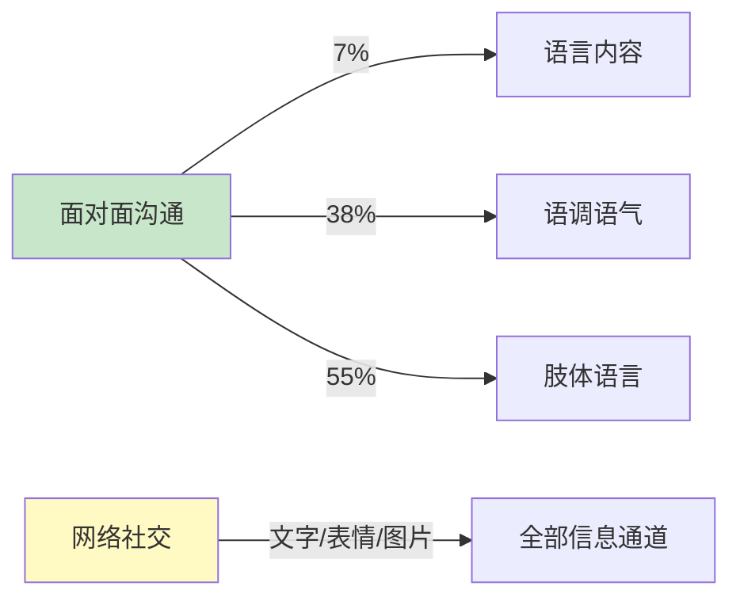
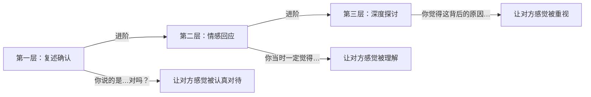
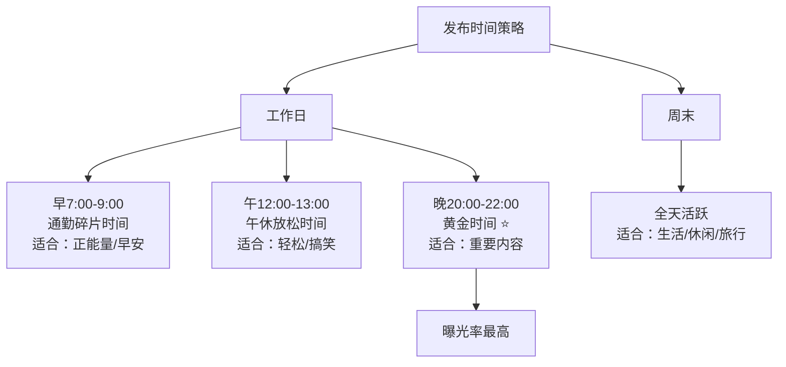
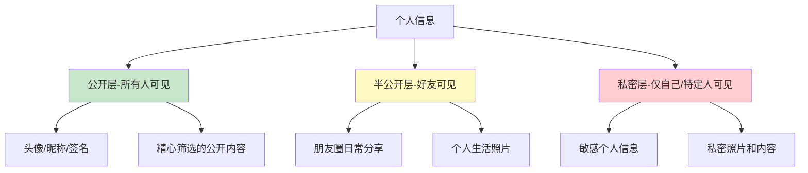
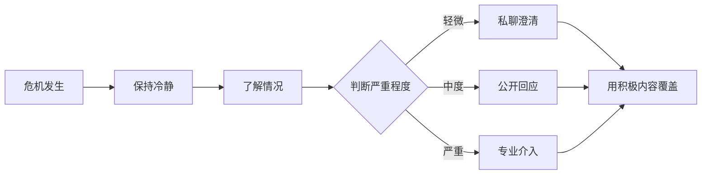

# 第十六章 网络社交沟通 —— 核心技巧

***

网络社交不是面对面沟通的"降级版"，而是一套独立的沟通体系。当你失去语调、表情、肢体语言这些信息通道后，文字、表情包、回复节奏、朋友圈经营就承担了全部的社交信号传递任务。本章从底层原理到高频场景，系统拆解网络社交的核心技巧。

***

## 一、网络社交的底层逻辑

### 1.1 为什么网络社交比面对面更难

面对面沟通时，信息传递依赖多个通道：语言内容占 7%，语调占 38%，肢体语言占 55%——这是 Albert Mehrabian 在 1971 年提出的"7-38-55 法则"。网络社交砍掉了后两个通道，只剩下文字和少量视觉符号（表情包、图片）。这意味着：

**信息损失的代价：** 同样一句"好的"，面对面说出来可以配合微笑表示热情，也可以配合冷淡的语气表示敷衍。但在微信里，"好的"就是一个冰冷的词语，接收者会根据自己的情绪状态来"脑补"你的语气——而这种脑补往往是错的。

**认知负荷增加：** 发送者需要花更多心思措辞，确保文字准确传达意图；接收者需要花更多精力解读文字背后的情绪。双方的认知负荷都在增加。

**异步性带来的不确定性：** 对方看到消息后没有立即回复，你无法判断是"在忙没看到"、"看到了在想怎么回"还是"不想理你"。这种不确定性会产生焦虑，而焦虑又会导致你做出不理性的行为（比如连发好几条消息追问）。

### 1.2 网络社交的心理学基础

理解以下四个心理学原理，能帮你更准确地预测对方的反应：

**媒介丰富度理论（Media Richness Theory）：** 不同沟通媒介传递信息的能力不同。面对面 > 视频通话 > 语音通话 > 语音消息 > 文字消息 > 朋友圈/微博。选择媒介时，要匹配信息的复杂度和敏感度——复杂的事情不要用微信文字谈，敏感的话题不要在群里说。

**社会临场感理论（Social Presence Theory）：** 媒介越"冷"，人们越难感受到对方是真实的人。这就是为什么网上喷子比现实中多——屏幕降低了社会临场感，攻击他人时感受到的道德约束更少。在你自己的网络社交中，有意识地增加"人味"（表情包、语音、真实照片），能显著提升对方的好感。

**超人际模型（Hyperpersonal Model）：** 网络社交中，发送者可以精心编辑自己的形象（选择性自我呈现），接收者会倾向于理想化对方（因为信息不完整），这种双向的美化会导致网络关系初期升温特别快，但也可能在现实接触后"祛魅"降温。了解这个机制，就能更好地管理自己的期望。

**富者更富效应：** 社交能力强的人在线上也能获得更多社交资源——他们发的朋友圈互动更多，群聊中更活跃，私聊中更受欢迎。这不是天赋，而是他们掌握了本章即将讲解的这些技巧。

### 1.3 网络社交的核心公式

> **网络社交效果 = 信息质量 × 情感温度 × 时机选择 × 持续性**

四个变量缺一不可：发了一条高质量的信息但时机不对（对方正在忙），效果为零；时机对了但信息质量低（纯废话），效果也为零；偶尔发一次高质量消息但缺乏持续性，关系无法深化。

***

## 二、微信聊天技巧

### 2.1 开场白的艺术

开场白决定了对话的基调和走向。一个好的开场白需要同时完成两个任务：降低对方的回复成本，激发对方的回复欲望。

**三种低效开场方式（及其心理学解释）：**

❌ **"在吗？"** —— 这是信息量为零的开场白。对方不知道你要说什么，回复成本极高：说"在"可能面临一个难以拒绝的请求，不说"在"又显得不礼貌。心理学上这叫做"承诺升级陷阱"——对方一旦回复"在"，就在心理上做出了一个承诺，更难拒绝你后续的请求。很多人本能地回避这种陷阱，所以选择不回复。

❌ **"你好"** —— 太过正式和生硬，给对方的感觉是"你是不是要找我办事"。在私人社交中，这种开场白会立即激活对方的"社交防御机制"。

❌ **直接甩问题** —— 没有任何铺垫就开始提问，相当于推开别人的门直接翻冰箱。即使对方愿意回答，也会觉得你缺乏社交意识。

**三种高效开场方式：**

✅ **情景关联法** —— 从你们共同经历或对方的动态切入，让对话自然发生：

"刚看到你朋友圈分享的那家餐厅，看起来好好吃，地址在哪里呀？"
"今天天气真好，你周末有什么安排吗？"
"看到你换新头像了，拍得真好看！在哪儿拍的？"
"上次你说要去看那个展，去了吗？体验怎么样？"

场景关联法的核心逻辑是：你展示了一个"关注对方"的信号，同时抛出了一个低门槛的话题。对方回复的心理成本几乎为零——只是分享一个地址、一个计划、一个感受而已。

✅ **话题引入法** —— 分享有趣的内容作为聊天的起点：

"刚看到一个特别搞笑的视频，分享给你看看 😂"
"最近发现了一本超棒的书，想到你可能会感兴趣"
"你之前推荐的那个电影我看了，真的很好看！你是怎么发现的？"
"这个app太好用了，想到你之前说需要这个功能"

话题引入法的底层逻辑是"价值给予"——你不是来索取什么的，而是来给予有趣的信息。这让对方放下防御，自然地进入对话状态。

✅ **关心问候法** —— 真诚地表达关心，但要具体、有针对性：

"最近工作还顺利吗？上次听你说项目挺忙的"
"你感冒好点了吗？记得多喝热水，好好休息"
"搬家收拾得怎么样了？需要帮忙吗？"
"面试准备得怎么样了？加油！"

关键在于"具体"。"最近怎么样？"是无效问候，因为它不显示你对对方生活的具体关注。"上次听你说项目挺忙的，现在好些了吗？"则表明你记得对方说过的话、关心对方的状态——这就是真诚。

### 2.2 维持对话的技巧

开场只是第一步，真正考验功力的是如何让对话持续下去。

**技巧一：开放式提问 vs 封闭式提问**

封闭式问题（是/否问题）容易让对话陷入死胡同。开放式问题能激发对方更多的表达欲。

| 封闭式问题 | 开放式问题 | 区别分析 |
|-----------|-----------|---------|
| "你周末忙吗？" | "你周末有什么安排？" | 前者只能得到"忙/不忙"，后者能引出具体内容 |
| "你喜欢旅游吗？" | "你最近去过最难忘的地方是哪里？" | 前者只能得到"喜欢/不喜欢"，后者会触发具体回忆 |
| "这部电影好看吗？" | "你对这部电影有什么感觉？" | 前者只能得到"好看/不好看"，后者允许表达复杂感受 |
| "你吃饭了吗？" | "你今天吃了什么好吃的？" | 前者是寒暄，后者能引出美食话题 |
| "周末去爬山吗？" | "如果周末天气好，你更想去爬山还是去海边？" | 前者给了拒绝的机会，后者让对方在两个选项中选 |

**技巧二：倾听式回应（Active Listening 在文字中的应用）**

线上倾听 = 认真阅读 + 有意义的回应。具体做法：

对方："今天开会被老板批了一顿，好烦"

❌ 敷衍回应："嗯" / "哦" / "别想了" / "加油"
✅ 倾听回应："怎么回事？是那个项目的事吗？"
✅ 共情回应："被批确实不好受。你觉得老板说得有道理吗？"
✅ 转化回应："至少说明老板关注你的工作，有时候被批也是一种重视"

倾听式回应的三个层次：

**技巧三：适度自我暴露**

自我暴露的"洋葱模型"——由浅入深地分享个人信息：

| 层级 | 内容类型 | 适用场景 | 示例 |
|------|---------|---------|------|
| 第一层 | 兴趣爱好、日常 | 初次认识 | "我周末喜欢爬山，你呢？" |
| 第二层 | 观点看法、经历 | 熟悉之后 | "我觉得那部电影的结局有点仓促" |
| 第三层 | 情感感受、困惑 | 建立信任后 | "最近有点迷茫，不知道该不该换工作" |
| 第四层 | 隐私、秘密、脆弱面 | 深度信任后 | "其实我小时候经历过…" |

关键原则：**对等原则**——对方暴露多少，你暴露多少。如果对方还在第一层，你就跳到第三层，会吓到对方；如果对方已经到了第三层，你还停留在第一层，对方会觉得你冷漠。

**技巧四：掌握对话节奏**

节奏感是文字聊天中最容易被忽略、却最影响体验的因素。

- **消息频率匹配：** 对方发3条你回3条，对方发1条你回1条。不要一次发10条消息轰炸对方，也不要对方发了长消息你就回一个"嗯"
- **回复速度匹配：** 对方秒回你也适当快速回复；对方过了2小时才回你，你也别秒回——否则对方会有一种"你怎么一直在等我消息"的压力
- **长度匹配：** 对方发了一段长消息，你也应该给出有内容的回应，而不是一个表情包
- **标点符号的信号：** "好的"、"好的。"、"好的！"、"好的~"传递的情感完全不同。句号在微信语境中往往意味着冷淡或不满，感叹号传递热情，波浪号传递亲昵

**技巧五：善用语音和文字的切换**

| 场景 | 推荐方式 | 原因 |
|------|---------|------|
| 分享趣事 | 语音 | 语调能增强幽默感 |
| 传达复杂信息 | 文字 | 方便反复查阅 |
| 表达关心和安慰 | 语音 | 比文字更有温度 |
| 工作确认/时间地点 | 文字 | 准确无歧义 |
| 情感表达 | 语音 | 语调承载情感 |
| 需要对方快速回复 | 文字 | 扫一眼就能回复 |

### 2.3 结束对话的技巧

结束对话和开场同样重要。生硬的结束会让对方觉得"被抛弃"，拖沓的结束则浪费双方时间。

**自然收尾法：**

"好的，那就先这样，有进展随时告诉我~"
"时间不早了，早点休息，晚安🌙"
"我这边有点事要忙，回头再聊哈"
"先去吃饭了，改天继续聊~"

**预告下次互动法（最推荐——它在暗示"我期待和你的下一次对话"）：**

"下次有空一起吃饭，到时候联系你！"
"这个周末如果天气好，一起去爬山怎么样？"
"等你回来给我带特产哈😄"
"下个月那个展览一起去看看？"

**总结确认法（适用于工作沟通）：**

"好的，那我总结一下今天的讨论：1.…2.…3.…，如果没问题的话我们就按这个执行"
"明白了，那我先去做XX，周三前给你反馈"

**收尾中的雷区：**

- ❌ 突然消失不回复（"已读不回"是网络社交中最大的减分项之一）
- ❌ 用"哦"、"嗯"收尾（显得敷衍和不耐烦）
- ❌ 在对方说正事的时候突然说"我要忙了"（如果真有急事，要表达歉意）

### 2.4 聊天中的常见误区

**误区一：过度解读文字**

微信文字没有语调，人们容易把自己的焦虑投射到对方的文字上。"哦"可能只是对方习惯性的回复，不一定是生气或敷衍。在做出判断之前，先回想一下对方平时的聊天风格。

**误区二：用消息数量衡量关心程度**

有些人觉得"不主动找我就是不关心我"。但网络社交中，每个人的消息习惯不同。有人习惯每天早安晚安，有人觉得没事不用联系。用消息数量来衡量关系亲密度，会产生不必要的焦虑和矛盾。

**误区三：群发祝福消息**

逢年过节的群发祝福（尤其是那种一看就是复制粘贴的），不仅不能增进关系，反而会让人觉得你敷衍。如果真的想在节日问候某个人，就写一条有针对性的、带名字的个性化祝福。

**误区四：用"哈哈"代替真正的回应**

"哈哈哈"已经成了万能回复。但当你回复"哈哈"的时候，对方其实无法判断你是在真笑还是在敷衍。与其用"哈哈"，不如用一句有内容的回应——哪怕只是"这个太真实了，我上次也遇到过"。

***

## 三、朋友圈经营策略

### 3.1 朋友圈的底层逻辑

朋友圈不是一个"记录生活"的工具——如果只是记录，你用手机相册就够了。朋友圈是一个**社交信号发射器**：你发的每一条内容，都在向你的好友传递"我是什么样的人"的信号。

所以朋友圈经营的第一步不是"发什么"，而是"我希望别人认为我是什么样的人"。

**朋友圈的定位类型：**

| 定位类型 | 核心形象 | 内容侧重 | 适合人群 |
|---------|---------|---------|---------|
| 专业型 | 可靠、有深度 | 行业见解、专业干货 | 职场人士、自由职业者 |
| 生活型 | 热爱生活、有品位 | 美食、旅行、日常 | 追求生活品质的人 |
| 文艺型 | 有内涵、有审美 | 阅读、音乐、摄影 | 文艺爱好者 |
| 幽默型 | 有趣、好相处 | 搞笑内容、生活趣事 | 活跃气氛的人 |
| 成长型 | 上进、自律 | 学习心得、运动打卡 | 持续自我提升的人 |

关键原则：**定位可以混合，但主次必须分明。** 70%的内容服务于主定位，30%展示你的多面性。

### 3.2 内容策略的黄金比例

朋友圈内容配比（推荐）
━━━━━━━━━━━━━━━━━━━━━━━━━━━━
60% 生活分享    ██████████████████████████████
20% 专业内容    ██████████
10% 互动内容    █████
10% 转发分享    █████
━━━━━━━━━━━━━━━━━━━━━━━━━━━━

**60% 生活分享 —— 让人看到真实的你**

生活分享是朋友圈的主体，但"真实"不等于"随意"。发布前问自己三个问题：
- 这条内容传达了什么信息？
- 目标受众看到会有什么感受？
- 图片/文字的质量是否达标？

**20% 专业内容 —— 展示你的专业能力**

不要直接搬运行业文章。加上你自己的观点和见解，让别人看到你不仅仅是"转发机器"，而是真的在思考。格式建议：一句自己的观点 + 文章摘要 + 原文链接。

**10% 互动内容 —— 拉近关系的钩子**

发起话题、征求意见、提问题。这类内容的价值在于创造互动机会：
"求助：有推荐的夏日防晒吗？混油皮，坐标广州"
"纠结中：A方案和B方案，选哪个？在线等"
"刚看完《XX》，有没有人一起讨论？"

**10% 转发分享 —— 有价值的信息传递**

转发时一定要加上自己的评论或推荐理由，不要干转。

### 3.3 发布时间优化

**补充说明：**
- 晚上 20:00-22:00 是朋友圈的"黄金时间"，大多数人在这个时段刷朋友圈，你的内容被看到的概率最高
- 避免在凌晨或工作高峰期发布重要内容——前者没人看，后者大家都在忙
- 如果你的朋友圈有特定的目标受众（比如宝妈群体），发布时间要匹配她们的作息

### 3.4 配图技巧

**图片数量的视觉法则：**
- **1 张图**：聚焦单一主体，适合表达简洁有力的信息
- **3 张图**：横向排列最协调，适合展示少量场景
- **4 张图**：2×2 网格，但视觉上不如 3 张自然
- **6 张图**：2×3 或 3×2 排列
- **9 张图**：3×3 宫格，视觉最饱满，适合旅行/美食等多图场景
- **避免 2、5、7、8 张**：排列不规则，视觉效果差

**配图质量标准：**
- 清晰度：模糊的照片不如不发
- 构图：学习基本的三分法构图
- 滤镜：同一组图片用同一款滤镜，保持风格统一
- 避免过度修图：过度美颜和滤镜会降低可信度

### 3.5 朋友圈互动法则

**法则一：点赞是最轻量级的社交投资**

点赞的成本几乎为零，但它传递的信号是"我看到了你的生活，我在关注你"。建议每天花 3-5 分钟浏览朋友圈，给关系需要维护的人点赞。

**法则二：评论要走心**

❌ "好看" → ✅ "这个构图太美了，是在哪里拍的？"
❌ "不错" → ✅ "你做的这道菜看起来比餐厅的还精致，有菜谱吗？"
❌ "恭喜" → ✅ "看到你升职了，这是你应得的，你的努力我们都看在眼里"

高质量评论的公式：**具体赞美 + 追问/延伸**。这让对方感受到你不是在敷衍，而是真的在认真看。

**法则三：及时回应评论**

别人评论了你的朋友圈，你却"石沉大海"不回应，这是非常失礼的。即使是简单的回复"谢谢~"也比不回复强。如果对方的评论是一个问题，一定要回答——否则对方会觉得你在忽视他。

**法则四：评论区的社交智慧**

朋友圈评论区是一个"半公开空间"——你们的共同好友可以看到。因此：
- 不要在评论区讨论敏感话题
- 如果需要深入沟通，转到私聊
- 在评论区适当"带节奏"——让其他人也想参与讨论

### 3.6 朋友圈的负面清单

| 行为 | 为什么不好 | 替代方案 |
|------|----------|---------|
| 频繁刷屏 | 淹没别人的朋友圈，招人烦 | 每天最多 2-3 条 |
| 负能量宣泄 | 让人想远离你 | 偶尔可以，但要用自嘲的方式 |
| 炫耀式晒物 | 引发反感和嫉妒 | 分享过程而非结果 |
| 强行拉票/点赞 | 消耗人情 | 一对一私信请求 |
| 转发谣言/伪科学 | 降低你的可信度 | 发之前先验证信息来源 |
| 频繁设置"仅三天可见" | 给人一种"防备心重"的感觉 | 要么全开，要么精选可见 |
| 矫情文学 | 暴露情商短板 | 用具体事例代替抽象感慨 |

***

## 四、社交媒体平台互动技巧

不同平台有不同的社交语言和规则。在微信里适用的技巧，搬到微博可能完全不适用。

### 4.1 微博互动技巧

微博是"广场社交"——你发出的内容面向不确定的公众，互动的对象也大多是弱关系或陌生人。

**内容创作要点：**
- 微博的阅读耐心极短，前 30 个字决定是否会被读完
- 善用话题标签（#话题#）增加曝光，但不要超过 3 个
- 配图或短视频能将互动率提升 2-5 倍
- 发布时间：工作日 12:00-14:00、18:00-23:00 为活跃高峰

**互动策略：**
- 评论区是微博的核心战场，高质量的评论能让你获得大量关注
- 转发时添加自己的观点（不要干转），让转发内容本身也有价值
- 参与热门话题讨论时，要有独特的切入点，不要人云亦云
- 与行业 KOL 互动时，提供有价值的信息而非单纯吹捧

### 4.2 小红书互动技巧

小红书是"种草社区"——用户的核心需求是"找到有用的建议"。

**内容创作要点：**
- 标题决定生死：善用数字（"5 个方法"）、情感词（"绝了"）、悬念（"后悔没早知道"）
- 封面图必须精致，统一的视觉风格能提升账号辨识度
- 内容结构：痛点引入 → 解决方案 → 使用体验 → 总结推荐
- 善用标签和关键词，但不要堆砌——5-10 个相关标签即可

**互动策略：**
- 真诚分享使用体验，小红书用户对"虚假种草"极为敏感
- 回复每一条评论（尤其是前期），这会显著提升笔记的推荐权重
- 与其他博主互动时，评论要有信息量——"收藏了"不如"这个方法我试过，确实有效，补充一点…"
- 不要在评论区直接打广告，这是被限流的主要原因之一

### 4.3 抖音互动技巧

抖音是"注意力经济"——在 15 秒到 1 分钟内抓住用户。

**内容创作要点：**
- 前 3 秒是生死线：要么抛出冲突，要么展示结果，要么制造悬念
- 信息密度要高，每一帧都要有内容
- 善用热门音乐和特效增加推荐概率
- 保持风格一致性，让人一眼认出是你

**互动策略：**
- 评论区运营比内容本身更重要——高赞评论能带来额外流量
- 制作回应粉丝的视频，这种"二次互动"能显著增强粉丝粘性
- 参与挑战和热门话题时，加入自己的独特创意
- 与其他创作者合拍、连麦、互推，实现粉丝交叉增长

### 4.4 平台差异对比

| 维度 | 微信 | 微博 | 小红书 | 抖音 |
|------|------|------|--------|------|
| 社交属性 | 熟人社交 | 广场社交 | 种草社区 | 娱乐消费 |
| 内容形态 | 图文/语音 | 图文/短视频 | 图文/短视频 | 短视频为主 |
| 互动深度 | 深度交流 | 浅层互动 | 中度互动 | 浅层互动 |
| 核心指标 | 关系质量 | 爆发力/曝光 | 收藏/种草 | 完播率/点赞 |
| 适合场景 | 维护关系 | 打造影响力 | 消费决策 | 娱乐/流量 |

***

## 五、网络形象管理

### 5.1 一致性原则

网络形象管理的核心是**一致性**。你的头像、昵称、签名、发布内容应该传达统一的信息。如果你的头像是职业照，朋友圈却天天发搞笑段子，就会产生认知失调——别人不知道你到底是严肃的还是搞笑的，这种模糊感会降低信任度。

**形象一致性检查清单：**
- [ ] 头像是否符合你想要传达的形象？
- [ ] 昵称是否易记、得体？
- [ ] 个性签名是否准确反映你的定位？
- [ ] 发布的内容是否与你的定位一致？
- [ ] 在不同平台上的形象是否统一？

### 5.2 隐私分级管理

**实操建议：**
- 微信设置：开启"加我为朋友时需要验证"，关闭"允许陌生人查看十条朋友圈"
- 朋友圈分组：工作同事、家人、朋友、客户分组管理，不同分组看到不同内容
- 定期清理：每 3-6 个月检查一次隐私设置，清理不再联系的好友
- 位置信息：不要在朋友圈暴露家庭住址、公司地址等敏感位置

### 5.3 危机管理

当网络形象出现危机时（被误解、被抹黑、不当言论被截图传播），处理流程：

**具体操作：**
1. **保持冷静**：情绪激动时发的任何内容都可能让危机升级。给自己至少 30 分钟的冷静期
2. **了解情况**：弄清楚事情的来龙去脉，截图保存证据
3. **及时回应**：沉默会被解读为"默认"。在适当的时间窗口内（通常 24 小时内）做出回应
4. **真诚沟通**：如果确实是自己的错误，坦诚道歉比狡辩更有效
5. **转移焦点**：用持续的积极内容来稀释负面影响——网络记忆通常只有 72 小时

***

## 六、表情包使用指南

### 6.1 表情包的本质

表情包是网络社交中最重要的"非语言信号"。在面对面沟通中，你的微笑、皱眉、耸肩都在传递信息；在网络社交中，这些信息全部需要通过表情包来补充。

表情包的五个功能维度：

| 功能 | 说明 | 使用场景 |
|------|------|---------|
| 情感表达 | 传达文字难以表达的微妙情感 | "开心到飞起"比用文字描述更直观 |
| 调节气氛 | 让对话更加轻松有趣 | 冷场时用搞笑表情包破冰 |
| 缓解尴尬 | 在不知如何回应时过渡 | 被夸奖时用害羞表情包比说"谢谢"更自然 |
| 展示个性 | 通过表情包风格展示品味 | 你收藏的表情包就是你的社交名片 |
| 文化认同 | 表明对某种文化的归属感 | 使用特定圈子的表情包能快速拉近距离 |

### 6.2 不同场合的表情包策略

| 场合 | 推荐风格 | 避免风格 | 频率建议 |
|------|---------|---------|---------|
| 朋友聊天 | 搞笑、夸张、网络热梗 | 过于正式的表情 | 可以频繁 |
| 工作群聊 | 微笑、握手、简单emoji | 低俗、夸张、争议性 | 少量点缀 |
| 长辈沟通 | 传统表情、温馨图片、鲜花 | 网络热梗、搞怪表情 | 适度 |
| 恋人聊天 | 可爱、甜蜜、亲昵 | 过于冷漠的表情 | 频繁 |
| 客户沟通 | 简单emoji（😊👍） | 任何表情包 | 极少 |

### 6.3 表情包的进阶使用

**第一，建立自己的表情包库。** 按场景分类收藏：搞笑类、可爱类、职场类、怼人类、万能类。当需要某个表情包时能快速找到，这是网络社交的基本功。

**第二，读懂对方的表情包。** 对方发的表情包往往比文字更能反映真实情绪：
- 发"微笑"🙂（在年轻人群中通常意味着"无语"或"不满"）
- 发"捂脸"🤦（表示无奈或尴尬）
- 发"裂开"🤯（表示震惊或崩溃）
- 发"狗头"🐶（表示"我在反讽/开玩笑，别当真"）

**第三，自制表情包的边界。** 自制表情包增加个人特色，但注意：
- 不要用他人肖像制作表情包（肖像权问题）
- 不要制作涉及政治、宗教、种族的敏感内容
- 幽默但不低俗，搞笑但不恶俗

**第四，表情包是调味品，不是主食。** 如果你的每一条消息都用表情包代替文字回复，对方会觉得你"不认真"或者"表达能力不行"。表情包的最佳用法是**配合文字使用**——文字传达信息，表情包传达情绪。

***

## 七、语音消息礼仪

### 7.1 语音消息的利弊分析

**优势：**
- 传递情感更丰富（语调、语气、停顿都在传递信息）
- 打字速度的替代方案（尤其是长内容）
- 更有人情味，适合维系亲密关系
- 在双手被占用时（开车、做饭）特别方便

**劣势：**
- 不方便在公共场合或安静的办公室收听
- 无法快速浏览——必须从头听到尾
- 收听时间 = 语音时长（文字可以在 3 秒内扫完 30 秒的信息量）
- 语音识别转文字可能出错，造成信息损失
- 60 秒语音往往包含大量"嗯""啊""就是说"等冗余信息

### 7.2 语音消息的使用原则

**原则一：先判断场合再决定方式**

场景判断流程：
对方可能在开会？→ 用文字
对方可能在公共场合？→ 用文字
对方可能在开车？→ 可以用语音
深夜11点以后？→ 用文字（语音提示音会吵到人）
需要确认具体信息（时间/地点/数字）？→ 用文字
需要表达情感/安慰？→ 用语音

**原则二：控制时长**

单条语音消息建议控制在 **30 秒以内**。原因很简单：30 秒以内的语音，对方可以在任何场合快速听完；超过 30 秒，对方就需要找一个安静的环境，或者反复听才能抓住重点。

如果需要传达较多信息，分成几条发送，每条说一个要点。

**原则三：先询问再发送**

在发送较长的语音消息之前，问一句：
"方便听语音吗？不方便的话我打字说"
"有个事想跟你说，有点长，现在方便听语音吗？"

**原则四：重要信息用文字确认**

通过语音沟通的重要信息（时间、地点、金额、数字、人名），最后用文字确认：
[语音] "那我们周六下午三点在XX商场门口见"
[文字] "确认一下：周六下午3点，XX商场正门，对吧？"

**原则五：不要连续发送多条长语音**

连续发送 5 条 60 秒的语音 = 5 分钟的"听话作业"。对方看到一连串长语音时，内心是崩溃的。要么精简内容用文字，要么打个电话直接说。

### 7.3 语音消息的替代方案

| 替代方式 | 适合场景 | 优势 |
|---------|---------|------|
| 短视频消息 | 分享场景、演示操作 | 比语音更直观 |
| 文字+图片 | 传达复杂信息 | 清晰可查 |
| 电话通话 | 紧急或复杂的事 | 实时双向沟通 |
| 视频通话 | 需要看到表情的场合 | 最接近面对面 |

***

## 八、群聊沟通策略

### 8.1 群聊的本质

群聊是**多对多的异步沟通**。与私聊不同，群聊有三个独特特征：

- **观众效应**：你说的话不仅仅是给对话对象的，也是给群里其他人看的。这意味着你的每条消息都在构建你的"公共形象"
- **从众压力**：群里其他人说什么，会影响你说什么。如果群里都在吐槽某件事，你可能也会跟着吐槽——即使你并不这么想
- **信息过载**：一个活跃的群每天可能有上千条消息，大部分是噪音

### 8.2 群聊基本礼仪

**规则一：不要刷屏。** 连续发送 10 条消息会让所有群成员的通知栏爆炸。如果有长内容，合并成一条发送，或者用"长文字+换行"的形式。

**规则二：尊重群规。** 每个群都有自己的潜规则——有的群禁止发广告，有的群禁止讨论政治，有的群有固定的聊天时段。入群后先观察，不要急于表现。

**规则三：话题相关。** 在工作群里发段子、在游戏群里讨论育儿，都是不合时宜的。保持话题与群主题一致。

**规则四：适时沉默。** 不是每个话题都需要参与。如果你对讨论的话题没有有价值的观点，沉默比凑热闹更明智。

**规则五：不要@所有人。** @所有人 = 强制通知群里所有人，除非你是群主且有紧急事务，否则不要使用。

### 8.3 群聊中的角色定位

在群聊中，不同人扮演着不同的角色。找到适合自己的角色，能让群聊社交更高效：

| 角色 | 特征 | 策略 |
|------|------|------|
| 信息提供者 | 分享有价值的资源和信息 | 建立"靠谱"的口碑 |
| 话题发起者 | 抛出有讨论价值的话题 | 培养影响力 |
| 气氛调节者 | 用幽默化解尴尬 | 增加人缘 |
| 意见领袖 | 提供有见地的观点 | 建立权威感 |
| 协调者 | 在分歧中进行调和 | 展现情商和公正 |

### 8.4 群聊冲突处理

群聊中的冲突比私聊更棘手——因为有"观众"在看。

**冲突升级模型：**
意见分歧 → 措辞升级 → 情绪化 → 人身攻击 → 群体分裂

**每一阶段的应对策略：**

1. **意见分歧阶段**：正常讨论，保持理性
2. **措辞升级阶段**：用"我理解你的观点，但我的看法是…"来降温
3. **情绪化阶段**：不要火上浇油，可以说"这个问题大家各有看法，不如线下继续讨论"
4. **人身攻击阶段**：不要选边站队，保持中立或沉默
5. **群体分裂阶段**：如果自己是群主或管理员，果断介入管理

**黄金原则：群里吵架，私聊解决。** 如果冲突涉及你自己，先在群里表态"我私信你"，然后一对一解决。公开对骂只会让双方都丢面子。

***

## 九、网络社交中的情商应用

### 9.1 共情能力的在线实践

共情 = 感受对方的感受。在网络社交中，共情更难实现，因为你看不到对方的表情和肢体语言。

**练习方法：文字共情三步法**

第一步：识别情绪（对方的文字背后是什么情绪？）
  "今天加班到12点，项目还是没做完" → 情绪：疲惫、焦虑、沮丧

第二步：回应情绪（先回应感受，再回应事实）
  ❌ "那你赶紧做啊"（只回应事实，忽略情绪）
  ✅ "加班到12点也太辛苦了吧…是什么环节卡住了？"

第三步：提供支持（根据对方需求选择支持方式）
  对方需要倾诉？→ 倾听就好，不需要给建议
  对方需要建议？→ 给出具体可行的方案
  对方需要安慰？→ "这种情况下谁都会觉得累，你已经做得很好了"

**不要踩的共情雷区：**
- ❌ "我比你更惨"——把话题拉到自己身上
- ❌ "你想多了"——否定对方的感受
- ❌ "加油"——空洞无力，没有实质支持
- ❌ "至少你还有XX"——比惨式的安慰

### 9.2 情绪管理

网络社交最大的陷阱之一是**情绪化发送**。你生气的时候打了一段话发出去，冷静后想撤回——但对方可能已经看到了。

**发送前的情绪检查清单：**
- [ ] 我现在的情绪状态如何？（愤怒/焦虑/委屈/兴奋？）
- [ ] 这条消息是在情绪激动时写的吗？
- [ ] 如果对方这样对我说，我会怎么感受？
- [ ] 这条消息会不会被误解？
- [ ] 这条消息发出去后我能承担后果吗？
- [ ] 是否需要冷静一下再发送？

**实用技巧：写完先不发。** 把消息写好，存在草稿箱，过 30 分钟再看。你会惊讶地发现，30 分钟前你觉得"非发不可"的消息，30 分钟后你可能觉得"还好没发"。

### 9.3 边界意识

**尊重他人边界：**
- 不要频繁打扰不熟悉的人（"在吗？"x3 就是骚扰）
- 不要强迫他人回复（"你怎么不回我？"只会让对方更不想回你）
- 不要过度窥探他人的隐私（"你工资多少？""你跟谁出去了？"）
- 不要过度分享自己的私生活（不是所有人都想看你的日常细节）

**维护自身边界：**
- 学会说"不"，拒绝不合理的要求
- 不必立即回复每一条消息（设置消息免打扰不是"不礼貌"，是"自我保护"）
- 保护自己的隐私——你有权利不回答任何你不想回答的问题
- 必要时屏蔽或删除不合适的好友——这不是"小气"，是维护自己的社交环境

***

## 十、回复时机与节奏控制

### 10.1 回复时机的潜规则

回复速度在网络社交中是一个**隐性信号**：

| 回复速度 | 可能被解读的含义 | 建议场景 |
|---------|----------------|---------|
| 秒回 | "你一直在等我消息？"/"你很闲？" | 热恋中/紧急事务 |
| 1-5 分钟 | 重视对方，积极回应 | 正常聊天 |
| 30 分钟-2 小时 | 在忙，但看到了就回 | 工作时间/日常 |
| 半天以上 | 优先级不高/在考虑怎么回 | 不紧急的事 |
| 不回复 | 故意的/"不想聊了" | 最后的信号 |

**关键原则：匹配对方的节奏。** 如果对方总是在 10 分钟内回复你，你也不要总是隔半天才回——节奏差太大会让对方觉得你不在意。反之，如果对方经常隔很久才回，你也别每次都秒回——会给对方压力。

### 10.2 "已读不回"的应对

"已读不回"是网络社交中最让人焦虑的信号之一。但实际情况往往是：

- 对方看到了但不知道怎么回（80% 的情况）
- 对方在忙，打算稍后回复（15% 的情况）
- 对方真的不想回你（5% 的情况）

**应对策略：**
1. 等待至少 24 小时再做判断
2. 如果是重要事项，隔天发一条跟进消息："昨天那个事情你看到了吗？不着急，方便的时候回复我~"
3. 不要连续追问："在吗？""看到了吗？""怎么不回？"——这是最大的禁忌
4. 如果长期不回复，接受信号，降低期望

***

## 十一、网络社交工具箱

### 11.1 沟通框架

**STAR 框架（用于分享经历）：**
- **S**ituation（情境）：描述背景
- **T**ask（任务）：说明任务
- **A**ction（行动）：采取的行动
- **R**esult（结果）：取得的结果

示例：
"去年公司要做一个新产品上线（S），领导让我负责市场推广（T），
我策划了一个'用户共创'的活动让用户参与产品设计（A），
最后上线首周就有5000人注册，比预期高了2倍（R）。"

**PREP 框架（用于表达观点）：**
- **P**oint（观点）：先说结论
- **R**eason（理由）：解释原因
- **E**xample（例子）：举例说明
- **P**oint（重申）：再次强调观点

示例：
"我觉得远程办公是未来的趋势（P）。因为它大幅降低了通勤成本和办公成本（R），
你看GitLab就是完全远程的公司，团队遍布全球但效率非常高（E）。
所以我认为，至少在科技行业，远程办公会越来越普遍（P）。"

### 11.2 高频场景话术模板

**请求帮助：**
"Hi [名字]，最近在做[项目/事情]，遇到了[具体问题]。
想到你在[领域]方面很有经验，不知道方便请教一下吗？
非常感谢！🙏"

**感谢回应：**
"太感谢了！你分享的这些信息对我帮助很大，
特别是关于[具体点]的建议。等我试了之后给你反馈~"

**拒绝邀请：**
"谢谢你的邀请！不过[具体原因]，这次可能参加不了了。
下次有活动记得再叫我哈~"

**化解误会：**
"抱歉，我之前那条消息可能表达得不够清楚，让你产生了误解。
我的本意是[澄清]，希望没有给你带来不好的感受。"

**破冰聊天：**
"你好！我是[场景]认识你的[名字]。
看到你朋友圈发的[具体内容]，[自己的看法/提问]。"

**维护弱关系：**
"[节日]快乐！好久没联系了，最近[具体关心的事]怎么样了？
有空一起[具体活动]~"

### 11.3 常见社交信号的解码指南

| 对方行为 | 可能含义 | 建议回应 |
|---------|---------|---------|
| 回复越来越短 | 对话热情下降 | 换个话题或自然收尾 |
| 突然不回复 | 在忙/不知怎么回/不想聊 | 不追问，等待下次互动 |
| 经常主动找你 | 对你有好感/有事相求 | 正常回应，观察模式 |
| 回复很快但内容少 | 在忙但想保持联系 | 简短回应，不强求深度 |
| 总发语音不发文字 | 习惯如此/不方便打字 | 尊重习惯，你也用语音回 |
| 朋友圈总给你点赞 | 在关注你/维系关系 | 适当回应互动 |

***

## 十二、本节小结

网络社交沟通的核心可以凝练为以下公式：

> **有效的网络社交 = 清晰的自我定位 + 真诚的信息传递 + 恰当的情绪管理 + 持续的关系维护**

**十大核心原则：**

1. **尊重为本** —— 尊重他人的时间、隐私和情感
2. **真诚为上** —— 保持真诚的态度，不做作、不虚伪
3. **适度为宜** —— 频率、内容、方式都要把握好度
4. **换位思考** —— 发送前先想想对方会怎么感受
5. **节奏匹配** —— 对齐对方的回复频率和风格
6. **价值给予** —— 每次互动都让对方有所收获
7. **情绪管理** —— 不在情绪激动时发送消息
8. **边界意识** —— 尊重他人边界，维护自身边界
9. **持续经营** —— 关系需要定期维护，不能"临时抱佛脚"
10. **与时俱进** —— 网络社交的规则和文化在不断变化，保持学习

记住：网络社交的本质不是技巧的堆砌，而是**用技术手段还原真实的人际温度**。所有的技巧都是为了让文字更有温度、让互动更有意义、让关系更有深度。

***
